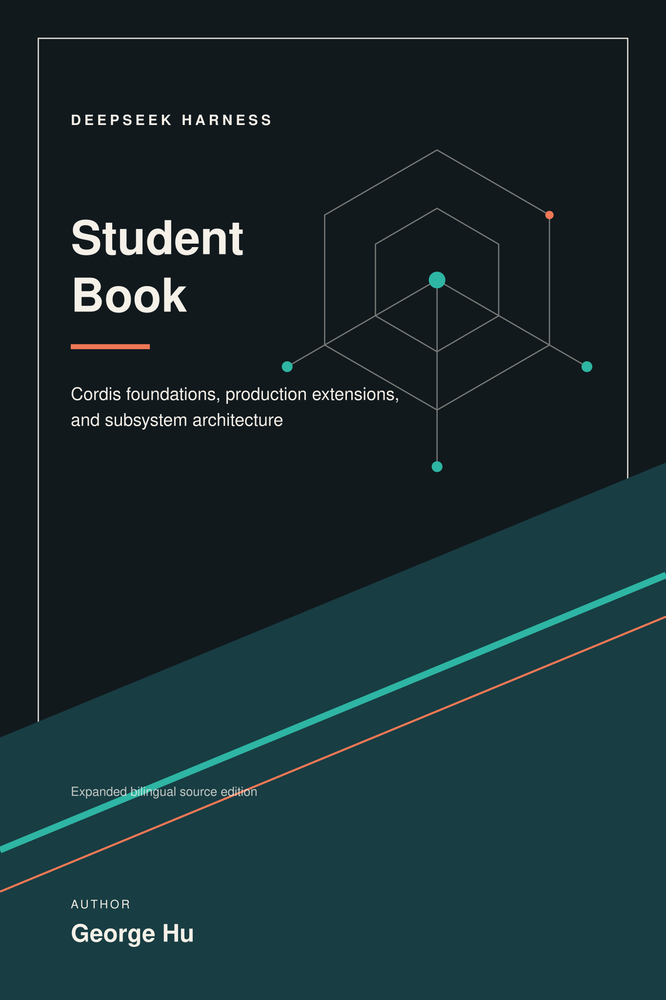
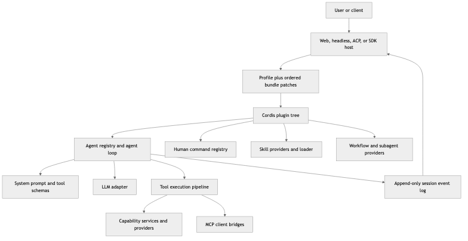
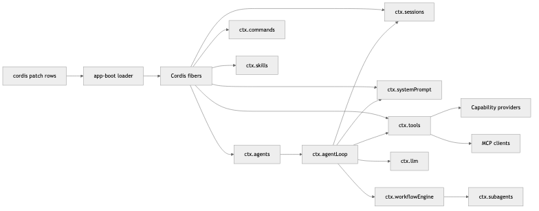
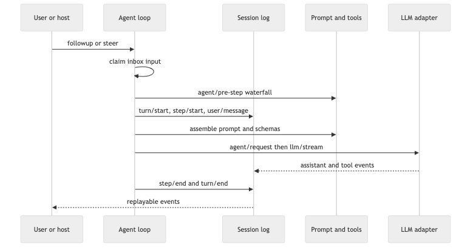
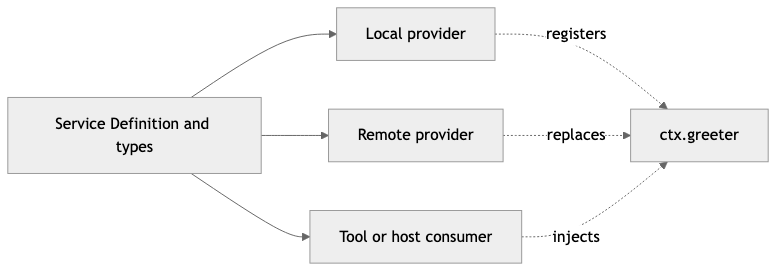
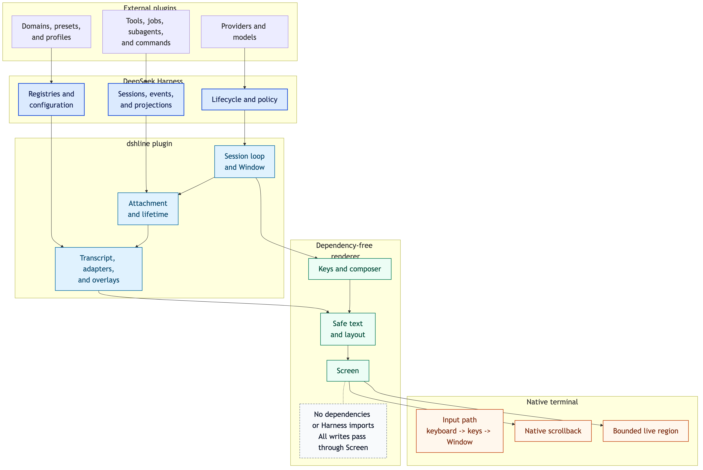
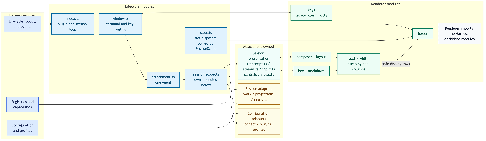
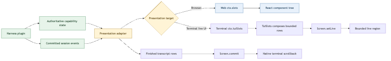
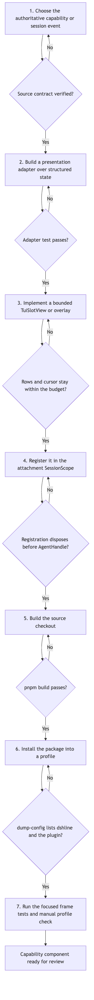

<div class="page-break" style="page-break-after: always;"></div>

# DeepSeek Harness Student Book

_From Cordis foundations to production extensions and subsystem contracts_

Author: George Hu

# Part I: Cordis foundations

Build the plugin-framework foundation through runnable lessons. Complete this part in order.

> Canonical source: [docs/cordis-tutorial/index.md](https://github.com/deepseek-ai/deepseek-harness/blob/master/docs/cordis-tutorial/index.md)

## Cordis tutorial


Cordis is the plugin framework underneath DeepSeek Harness: a small runtime where every capability — tools, LLM adapters, file access, the agent loop itself — is a plugin mounted into a shared context. This tutorial teaches Cordis hands-on: each chapter is a runnable example you build in a scratch directory inside this repository, ending with a plugin wired into real harness services.

The audience is agent developers. You do not need deep TypeScript experience; the [TypeScript notes](#typescript-notes) below explain the syntax that may be unfamiliar, and every chapter shows the exact commands and expected output.

If you want the condensed concept reference instead of a walkthrough, read the [Cordis primer](https://github.com/deepseek-ai/deepseek-harness/blob/master/docs/cordis-primer.md). The exhaustive API reference lives in the generated `cordis-surface` regions on the [subsystem pages](https://github.com/deepseek-ai/deepseek-harness/blob/master/docs/subsystems/core.md) and the [Cordis core API](https://github.com/deepseek-ai/deepseek-harness/blob/master/docs/cordis-api/context.md) pages.

To write plugins for the harness itself — loaded from a `cordis.yml` and driven from the Web UI rather than the launcher below — start from [your first Harness plugin](https://github.com/deepseek-ai/deepseek-harness/blob/master/docs/user/develop/basic/index.md).

### Setup

You need a clone of this repository with dependencies installed; the [development guide](https://github.com/deepseek-ai/deepseek-harness/blob/master/docs/development.md#setup-tutorial) lists the prerequisites. No API key is needed for this tutorial; every example runs keylessly.

```sh
git clone https://github.com/deepseek-ai/deepseek-harness.git
cd deepseek-harness
pnpm install
```

Create the scratch directory the chapters work in. `tmp/` is gitignored, so nothing you write there touches version control:

```sh
mkdir -p tmp/cordis-tutorial
cd tmp/cordis-tutorial
```

Every chapter runs the same command from this directory:

```sh
node --import tsx ../../vendor/cordis/bin.js
```

That one-file launcher (see [vendor/cordis/bin.js](https://github.com/deepseek-ai/deepseek-harness/blob/master/vendor/cordis/bin.js)) creates a root `Context`, mounts the Loader plugin, and tells it to load `./cordis.yml` from the current directory. Everything else — which plugins exist, how they are configured — comes from that YAML file, which you will write in a moment. The `--import tsx` flag lets Node run the TypeScript files the config points at without a build step.

### Chapters

1. [Your first plugin](https://github.com/deepseek-ai/deepseek-harness/blob/master/docs/cordis-tutorial/01-first-plugin.md) — a plugin is a function; the loader mounts it.
2. [Lifecycle and effects](https://github.com/deepseek-ai/deepseek-harness/blob/master/docs/cordis-tutorial/02-lifecycle-and-effects.md) — Cordis-managed registrations are undone when their plugin unloads.
3. [Services](https://github.com/deepseek-ai/deepseek-harness/blob/master/docs/cordis-tutorial/03-services.md) — expose a capability on `ctx` and depend on it with `inject`.
4. [Events](https://github.com/deepseek-ai/deepseek-harness/blob/master/docs/cordis-tutorial/04-events.md) — typed events, broadcast dispatch, and the waterfall short-circuit.
5. [Configuration](https://github.com/deepseek-ai/deepseek-harness/blob/master/docs/cordis-tutorial/05-config.md) — validated config from `cordis.yml`, failing loud on bad input.
6. [Composition and HMR](https://github.com/deepseek-ai/deepseek-harness/blob/master/docs/cordis-tutorial/06-composition-and-hmr.md) — the config file as a plugin tree, hot reload, and diagnosing a plugin that never loads.
7. [Into the harness](https://github.com/deepseek-ai/deepseek-harness/blob/master/docs/cordis-tutorial/07-into-the-harness.md) — register a model-callable tool against real harness services.

<a id="typescript-notes"></a>

### TypeScript notes

The examples use three TypeScript features beyond ordinary modern JavaScript:

- **Type annotations** describe values without changing runtime behavior: `ctx: Context` says that `ctx` has the Cordis context API, `who: string` accepts text, and `string[]` means an array of strings.
- **`import type { Context } from '@deepseek-ai/cordis'`** imports only type information. It vanishes at runtime, so a plugin file that needs `Context` solely for annotations adds no runtime dependency.
- **Declaration merging** (`declare module '@deepseek-ai/cordis' { ... }`) adds your entries to interfaces that Cordis already declares — for example the type of a new `ctx.greeter` property or event name. It generates no runtime wiring; the plugin separately provides the service or emits the event. Chapter 3 shows the pattern in full.

Chapter 5 also uses an `interface` to describe a configuration object's fields and a generic type such as `Schema<Config>` to say which object fields a schema validates. You can copy those declarations as shown; the surrounding text explains what each one connects.

[](https://github.com/deepseek-ai/deepseek-harness)


> Canonical source: [docs/cordis-tutorial/01-first-plugin.md](https://github.com/deepseek-ai/deepseek-harness/blob/master/docs/cordis-tutorial/01-first-plugin.md)

## 1. Your first plugin


In the loader configuration used here, a Cordis plugin module named-exports an `apply` function. When Cordis loads it, it calls `apply` with a **context** — the `ctx` object through which the plugin registers everything it contributes.

### Write the plugin

In your `tmp/cordis-tutorial` directory (see [setup](https://github.com/deepseek-ai/deepseek-harness/blob/master/docs/cordis-tutorial/index.md#setup)), create `hello.ts`:

```ts
import type { Context } from '@deepseek-ai/cordis'

export const name = 'hello'

export function apply(ctx: Context) {
  console.log('hello from my first plugin')
}
```

The `name` export is optional display metadata; it labels the plugin in diagnostics.

### Compose the app

This tutorial's launcher assembles the application from configuration. Create `cordis.yml`:

```yaml
- name: './hello.ts'
```

The file is a list of plugin entries. `name` is a module specifier — a relative path or an npm package name — and the loader mounts every entry. Entries start concurrently, so list position guarantees nothing about which plugin loads first; ordering comes from service dependencies (`inject`, [chapter 3](https://github.com/deepseek-ai/deepseek-harness/blob/master/docs/cordis-tutorial/03-services.md)), not from position in the file.

### Run it

```sh
node --import tsx ../../vendor/cordis/bin.js
```

Expected output:

```
hello from my first plugin
```

The process exits on its own once nothing is left running. What happened:

1. The launcher created a root `Context` and mounted the **Loader** plugin.
2. The Loader read `cordis.yml`, resolved `./hello.ts`, and mounted it as a child plugin.
3. Cordis called your `apply(ctx)`.

There is no framework bootstrap code in your file: a plugin describes what it contributes, and `cordis.yml` composes the application. The [`dsh` base](https://github.com/deepseek-ai/deepseek-harness/blob/master/packages/bundle/base/cordis.patch.yml), for example, is a longer plugin composition that deployment overlays patch.

### The two other plugin shapes

A function is the most common form, but Cordis accepts three:

```ts
import { Service, type Context } from '@deepseek-ai/cordis'

// 1. Function plugin (what you just wrote).
export function apply(ctx: Context) {}

// 2. Object plugin: an object with an `apply` method.
export const objectPlugin = {
  name: 'object-plugin',
  apply(ctx: Context) {},
}

// 3. Class plugin: a Service subclass (covered in chapter 3).
export class MyService extends Service {
  constructor(ctx: Context) {
    super(ctx, 'myTutorialService')
  }
}
```

Use the function form until you need to expose a service; [chapter 3](https://github.com/deepseek-ai/deepseek-harness/blob/master/docs/cordis-tutorial/03-services.md) covers when the class form earns its place.

### Try breaking it

Make `apply` throw:

```ts ignore-check
export function apply(ctx: Context) {
  throw new Error('apply exploded')
}
```

Run again: the process dies with your error. A plugin that fails to load is a loud failure, not a skipped entry.

One caveat worth knowing early: a config entry whose module cannot be **resolved** — a typo'd path or package name — is reported through the Cordis logger service instead of crashing the process, and at boot that report can be lost before a console exporter is watching. If a freshly added entry seems to do nothing, check the spelling first.

Next: [Lifecycle and effects](https://github.com/deepseek-ai/deepseek-harness/blob/master/docs/cordis-tutorial/02-lifecycle-and-effects.md) — what happens when a plugin unloads.

[](https://github.com/deepseek-ai/deepseek-harness)


> Canonical source: [docs/cordis-tutorial/02-lifecycle-and-effects.md](https://github.com/deepseek-ai/deepseek-harness/blob/master/docs/cordis-tutorial/02-lifecycle-and-effects.md)

## 2. Lifecycle and effects


A Cordis plugin can be unloaded by a config edit, hot reload, explicit disposal, or loss of a required service. Registrations made through Cordis APIs are effects and are undone when their owning plugin unloads; resources managed outside those APIs must be wrapped in `ctx.effect()`.

### Effects

For a resource Cordis does not already manage — a timer, a connection, a watcher — wrap it in `ctx.effect()` and return a disposer:

Create `lifecycle.ts` in `tmp/cordis-tutorial`:

```ts
import type { Context } from '@deepseek-ai/cordis'

export const name = 'lifecycle-demo'

function heartbeat(ctx: Context) {
  console.log('heartbeat plugin loading')
  ctx.effect(() => {
    const timer = setInterval(() => console.log('tick'), 200)
    return () => {
      clearInterval(timer)
      console.log('heartbeat cleaned up')
    }
  })
}

export function apply(ctx: Context) {
  // Mount a child plugin and keep its fiber to dispose it later.
  const fiber = ctx.plugin(heartbeat)
  // The demo timer is itself an effect: if THIS plugin is unloaded first,
  // the pending callback is cancelled instead of firing on a dead app.
  ctx.effect(() => {
    const timer = setTimeout(async () => {
      await fiber.dispose()
      console.log('disposed')
      process.exit(0)
    }, 700)
    return () => clearTimeout(timer)
  })
}
```

Point `cordis.yml` at it:

```yaml
- name: './lifecycle.ts'
```

Run (`node --import tsx ../../vendor/cordis/bin.js`) and you get:

```
heartbeat plugin loading
tick
tick
tick
heartbeat cleaned up
disposed
```

Three things to notice:

- `ctx.plugin(heartbeat)` mounts a function **from code** as a plugin — the same operation the YAML loader performs for each config entry. A function plugin needs no `apply` method: Cordis calls the function directly and uses its name only for diagnostics. An `apply` method is required only for the object form, `ctx.plugin({ apply(ctx) { /* ... */ } })`. The call returns a **fiber**, the runtime handle for one loaded plugin instance.
- The effect body runs during load; the disposer it returns runs during unload. You never call the disposer yourself for a plugin-lifetime resource.
- `fiber.dispose()` resolves after all of the plugin's cleanup — including async disposers — has finished, and recursively unloads any child plugins it mounted.

### The fiber state machine

Every loaded plugin instance owns a fiber that moves through these states:

```
PENDING → LOADING → ACTIVE → UNLOADING → DISPOSED
                 ↘ FAILED
```

- **PENDING** — declared, but a required service (chapter 3) is not available yet.
- **LOADING / ACTIVE** — `apply` is running / has completed.
- **FAILED** — `apply` or config validation threw.
- **UNLOADING / DISPOSED** — disposers are running / everything is torn down.

You will meet PENDING again in [chapter 6](https://github.com/deepseek-ai/deepseek-harness/blob/master/docs/cordis-tutorial/06-composition-and-hmr.md), where it is the usual answer to "why does my plugin print nothing?".

### What is already an effect

You rarely write `ctx.effect()` yourself, because the built-in registration APIs are effects already:

- `ctx.on(event, listener)` — the listener is removed on unload ([chapter 4](https://github.com/deepseek-ai/deepseek-harness/blob/master/docs/cordis-tutorial/04-events.md)).
- `ctx.plugin(child)` — the child is disposed with its parent.
- Service registrations are effects. Harness registries such as `ctx.tools.register(...)` also attach their returned disposers to the calling plugin, so they unwind automatically ([chapter 7](https://github.com/deepseek-ai/deepseek-harness/blob/master/docs/cordis-tutorial/07-into-the-harness.md)).

For a resource Cordis does not manage, acquire it inside `ctx.effect()` and return a disposer that releases it. Cordis then invokes that release during unloading, including hot reload.

One ordering caveat: disposers start in reverse registration order, but multiple **async** disposers run concurrently. If teardown steps must run in sequence, keep them in one disposer and await them there.

Next: [Services](https://github.com/deepseek-ai/deepseek-harness/blob/master/docs/cordis-tutorial/03-services.md) — how plugins share capabilities.

[](https://github.com/deepseek-ai/deepseek-harness)


> Canonical source: [docs/cordis-tutorial/03-services.md](https://github.com/deepseek-ai/deepseek-harness/blob/master/docs/cordis-tutorial/03-services.md)

## 3. Services


A **service** is a named capability one plugin provides and other plugins consume through `ctx`. In the harness, `ctx.tools`, `ctx.llm`, and `ctx.agents` are services. A consumer names the capability, such as `'tools'`, rather than importing its provider, so configuration can select a provider without changing the consumer.

### Provide a service

Create `greeter.ts` in `tmp/cordis-tutorial`:

```ts
import { Service, type Context } from '@deepseek-ai/cordis'

declare module '@deepseek-ai/cordis' {
  interface Context {
    greeter: GreeterService
  }
}

export class GreeterService extends Service {
  constructor(ctx: Context) {
    super(ctx, 'greeter')
  }

  greet(who: string) {
    return `Hello, ${who}!`
  }
}

export const name = 'greeter'

export function apply(ctx: Context) {
  ctx.plugin(GreeterService)
}
```

Two pieces work together:

- **Runtime**: `super(ctx, 'greeter')` registers the instance under the name `greeter`. From then on, any plugin can reach it as `ctx.greeter`. The registration is an effect — unloading the provider removes the service.
- **Compile time**: the `declare module '@deepseek-ai/cordis'` block is TypeScript declaration merging. It adds `greeter` to the `Context` interface so `ctx.greeter` typechecks everywhere. It generates no code; without it the service still works at runtime, but consumers lose type safety.

A `Service` subclass is itself a plugin (the class form from chapter 1), so `ctx.plugin(GreeterService)` mounts it like any other.

### Consume a service with `inject`

Create `consumer.ts`:

```ts
import type { Context } from '@deepseek-ai/cordis'

export const name = 'consumer'
export const inject = ['greeter']

export function apply(ctx: Context) {
  console.log(ctx.greeter.greet('world'))
}
```

`inject` lists the services this plugin requires. Cordis holds the plugin in PENDING until every listed service exists, so inside `apply`, `ctx.greeter` is guaranteed ready. Load order in `cordis.yml` does not matter — dependencies, not file order, decide when plugins start.

Compose and run:

```yaml
- name: './greeter.ts'
- name: './consumer.ts'
```

```
Hello, world!
```

Swap the two lines in `cordis.yml` and rerun: same output. Try removing `./greeter.ts` entirely: the consumer stays PENDING and prints nothing — no crash, no partial run. A PENDING fiber does not keep Node's event loop alive either, so a composition with nothing else running exits 0 silently. [Chapter 6](https://github.com/deepseek-ai/deepseek-harness/blob/master/docs/cordis-tutorial/06-composition-and-hmr.md) shows how to diagnose that state.

### Dependencies are tracked after load

`inject` is not a one-shot boot check. If a required service disappears while the app runs — its provider was unloaded or hot-replaced — every dependent plugin is unloaded too, and loads again when the service returns. Combined with effects ([chapter 2](https://github.com/deepseek-ai/deepseek-harness/blob/master/docs/cordis-tutorial/02-lifecycle-and-effects.md)), this prevents a running consumer from retaining a reference to an unavailable service: its own registrations are unwound when the dependency disappears.

This is also why service replacement works in config: unload the `dsh-bash-local` entry, mount a different `shell` provider, and every plugin injecting `'shell'` cleanly restarts against the new implementation.

### Optional dependencies

`inject` is for hard requirements. For a capability the plugin can live without, skip `inject` and probe at the use site:

```ts ignore-check
export function apply(ctx: Context) {
  // undefined when no provider is loaded; the plugin still runs.
  const greeter = ctx.get('greeter')
  console.log(greeter?.greet('maybe') ?? 'no greeter available')
}
```

### Naming

Service names live in one flat namespace per application. Prefix or namespace your own services distinctively (the harness claims plain names like `tools` and `llm`); the generated `cordis-surface` regions on the [subsystem pages](https://github.com/deepseek-ai/deepseek-harness/blob/master/docs/subsystems/core.md) list every name the harness registers.

Next: [Events](https://github.com/deepseek-ai/deepseek-harness/blob/master/docs/cordis-tutorial/04-events.md) — communication without a shared service.

[](https://github.com/deepseek-ai/deepseek-harness)


> Canonical source: [docs/cordis-tutorial/04-events.md](https://github.com/deepseek-ai/deepseek-harness/blob/master/docs/cordis-tutorial/04-events.md)

## 4. Events


Services support direct calls; **events** let a plugin announce something without knowing which plugins listen. The harness uses events for interactions such as tool results, model requests, and approval decisions.

### Declare, emit, listen

Create `stats.ts` in `tmp/cordis-tutorial` — a service that counts things and announces each change:

```ts
import { Service, type Context } from '@deepseek-ai/cordis'

declare module '@deepseek-ai/cordis' {
  interface Context {
    stats: StatsService
  }
  interface Events {
    'stats/report'(name: string, count: number): void
  }
}

export class StatsService extends Service {
  private counts = new Map<string, number>()

  constructor(ctx: Context) {
    super(ctx, 'stats')
  }

  bump(name: string) {
    const next = (this.counts.get(name) ?? 0) + 1
    this.counts.set(name, next)
    this.ctx.emit('stats/report', name, next)
  }
}

export const name = 'stats'

export function apply(ctx: Context) {
  ctx.plugin(StatsService)
}
```

The `interface Events` merge is the event-system twin of the `interface Context` merge from chapter 3: it declares the event name and its listener signature, so `ctx.emit` and `ctx.on` are fully typed. The `namespace/action` naming convention keeps the flat event namespace readable.

Create `reporter.ts`:

```ts ignore-check
import type { Context } from '@deepseek-ai/cordis'
import type {} from './stats.ts'

export const name = 'reporter'
export const inject = ['stats']

export function apply(ctx: Context) {
  ctx.on('stats/report', (name, count) => {
    console.log(`[stats] ${name} -> ${count}`)
  })
  ctx.stats.bump('tool_call')
  ctx.stats.bump('tool_call')
  ctx.stats.bump('prompt')
}
```

The `import type {} from './stats.ts'` line imports nothing at runtime; it exists so TypeScript sees the declaration merges. Compose and run:

```yaml
- name: './stats.ts'
- name: './reporter.ts'
```

```
[stats] tool_call -> 1
[stats] tool_call -> 2
[stats] prompt -> 1
```

Because `ctx.on()` is an effect, the listener disappears with the plugin — no manual `removeListener` bookkeeping, ever.

### Dispatch modes

`emit` is one of five dispatch modes. Which one an event uses is part of its contract — it decides whether listeners can return values, run concurrently, or short-circuit each other:

| Mode | Call | Semantics |
|---|---|---|
| emit | `ctx.emit(name, ...args)` | Synchronous broadcast; returned promises and values are not awaited or collected. |
| parallel | `await ctx.parallel(name, ...args)` | All listeners run concurrently; awaited together. |
| serial | `await ctx.serial(name, ...args)` | Listeners run in order, awaited; the first non-`null`/`false`/`undefined` return wins and stops the rest. |
| bail | `ctx.bail(name, ...args)` | Synchronous version of serial. |
| waterfall | `ctx.waterfall(name, ...args, next)` | Around-middleware; see below. |

Every harness event documents its mode in the generated reference on its owning [subsystem page](https://github.com/deepseek-ai/deepseek-harness/blob/master/docs/subsystems/core.md).

### Waterfall: transform or short-circuit

Waterfall is the mode that powers interception. Each listener receives the arguments plus a `next()` continuation; it can transform what `next()` returns, or return without calling `next()` and short-circuit the rest of the chain — what the Cordis docs call the veto. Create `waterfall-demo.ts`:

```ts
import type { Context } from '@deepseek-ai/cordis'

declare module '@deepseek-ai/cordis' {
  interface Events {
    'demo/transform'(input: string, next: () => Promise<string>): Promise<string>
  }
}

export const name = 'waterfall-demo'

export function apply(ctx: Context) {
  // Listener 1: wrap the downstream result.
  ctx.on('demo/transform', async (input, next) => {
    const downstream = await next()
    return downstream.toUpperCase()
  })

  // Listener 2: short-circuit when it owns the decision.
  ctx.on('demo/transform', async (input, next) => {
    if (input.includes('blocked')) return '** blocked **'
    return next()
  })

  void (async () => {
    console.log(await ctx.waterfall('demo/transform', 'hello', async () => 'hello'))
    console.log(await ctx.waterfall('demo/transform', 'blocked words', async () => 'blocked words'))
  })()
}
```

Point `cordis.yml` at just this file and run:

```
HELLO
** BLOCKED **
```

Walk through the second line: listener 1 runs first, calls `next()`, which invokes listener 2; listener 2 sees `blocked` and returns without calling `next()` — the innermost default (the function passed to `ctx.waterfall`) never runs — and listener 1 uppercases the replacement message on the way out.

The discipline that follows: **a waterfall listener that only observes or annotates must call `next()`**; returning without it is a deliberate short-circuit. Forgetting `next()` in a logging listener silently swallows the default behavior for everyone downstream. It is a standing rule of this repository ([waterfall semantics](https://github.com/deepseek-ai/deepseek-harness/blob/master/docs/cordis-primer.md#cordis-waterfall-semantics)).

The harness uses waterfalls for decisions that cooperating plugins may wrap or answer: [`agent/request`](https://github.com/deepseek-ai/deepseek-harness/blob/master/docs/subsystems/core.md#agentrequest--waterfall) lets a plugin replace the model-call config, and [`approval/request`](https://github.com/deepseek-ai/deepseek-harness/blob/master/docs/subsystems/approval.md#approvalrequest--waterfall) lets a policy answer instead of the user.

Next: [Configuration](https://github.com/deepseek-ai/deepseek-harness/blob/master/docs/cordis-tutorial/05-config.md) — plugin options from `cordis.yml`.

[](https://github.com/deepseek-ai/deepseek-harness)


> Canonical source: [docs/cordis-tutorial/05-config.md](https://github.com/deepseek-ai/deepseek-harness/blob/master/docs/cordis-tutorial/05-config.md)

## 5. Configuration


Each `cordis.yml` entry can carry a `config` block, and the plugin declares a schema that validates it before `apply` runs. Bad config fails the load with a precise error — the plugin never starts half-configured.

### A configurable plugin

Create `config-demo.ts` in `tmp/cordis-tutorial`:

```ts
import type { Context } from '@deepseek-ai/cordis'
import Schema from '@deepseek-ai/schemastery'

export const name = 'config-demo'

export interface Config {
  greeting: string
  targets: string[]
}

export const Config: Schema<Config> = Schema.object({
  greeting: Schema.string().default('Hello'),
  targets: Schema.array(String).default(['world']),
})

export function apply(ctx: Context, config: Config) {
  for (const target of config.targets) {
    console.log(`${config.greeting}, ${target}!`)
  }
}
```

The exported `Config` is both a TypeScript interface and a runtime schema with the same name — consumers get the type, Cordis gets the validator. This repo uses [Schemastery](https://github.com/shigma/schemastery) for schemas; Cordis itself accepts any [Standard Schema](https://standardschema.dev/) validator, so a plain object exported as `Config` will not work.

Configure it:

```yaml
- name: './config-demo.ts'
  config:
    targets: ['alpha', 'beta']
```

Run:

```
Hello, alpha!
Hello, beta!
```

`greeting` was omitted, so the schema default filled it in — `apply` always receives complete, validated config.

### Fail loud

Now feed it something invalid:

```yaml
- name: './config-demo.ts'
  config:
    targets: 'not-an-array'
```

```
ValidationError: invalid config:
  - $.targets expected array but got not-an-array (at targets)
```

The plugin's fiber goes to FAILED, and this tutorial's launcher exits with status 1 after printing the error. A plugin should also reject schema-valid config that names an unavailable resource or provider as soon as it can resolve that reference.

### Computed config values

The loader used in this repo supports a `!!js` tag for config values that must be computed at load time:

```yaml
- name: './config-demo.ts'
  config:
    greeting: !!js process.env.DEMO_GREETING ?? 'Hello'
```

`!!js` works only inside `config` and in an entry's `disabled` field. `disabled: !!js ...` evaluates against the loader context at every mount decision (this repo's extension), so a row can gate itself on platform or environment; the other metadata (`name`, `id`, `inject`, ...) stays static, where an expression is ordinary truthy data. See [loader configuration](https://github.com/deepseek-ai/deepseek-harness/blob/master/docs/cordis-primer.md#loader-configuration).

Next: [Composition and HMR](https://github.com/deepseek-ai/deepseek-harness/blob/master/docs/cordis-tutorial/06-composition-and-hmr.md) — treating `cordis.yml` as the application.

[](https://github.com/deepseek-ai/deepseek-harness)


> Canonical source: [docs/cordis-tutorial/06-composition-and-hmr.md](https://github.com/deepseek-ai/deepseek-harness/blob/master/docs/cordis-tutorial/06-composition-and-hmr.md)

## 6. Composition and HMR


Every capability built so far is a plugin, and `cordis.yml` selects the application's plugin tree. This chapter changes that composition, hot-reloads a plugin, and diagnoses a plugin that never loads.

### Entries are more than a name

A config entry accepts metadata beyond `name` and `config`:

```yaml
- id: greeter          # stable identity for this entry
  name: './greeter.ts'
- id: consumer
  name: './consumer.ts'
  disabled: true       # keep the entry, skip mounting it
```

`id` gives the entry a stable identity so the loader can tell an edit to an existing entry apart from a removal plus an addition. `disabled: true` unmounts a plugin without deleting its entry — flip it back and the plugin (and everything PENDING on its services) loads again.

Groups nest a sub-list of entries that load and unload as one unit, and `isolate` gives a group its own instance of a service name — two groups can each see a differently configured `shell` provider without affecting each other. The [Cordis primer](https://github.com/deepseek-ai/deepseek-harness/blob/master/docs/cordis-primer.md) and the [service isolation example](https://github.com/deepseek-ai/deepseek-harness/blob/master/docs/user/develop/framework/service.md#service-isolation) cover the details.

### Hot module replacement

Because unloading releases effects ([chapter 2](https://github.com/deepseek-ai/deepseek-harness/blob/master/docs/cordis-tutorial/02-lifecycle-and-effects.md)) and loading follows dependencies ([chapter 3](https://github.com/deepseek-ai/deepseek-harness/blob/master/docs/cordis-tutorial/03-services.md)), HMR can replace a running plugin by unloading and loading it. The `@deepseek-ai/cordis-plugin-hmr` plugin watches your files and does exactly that on save.

In `tmp/cordis-tutorial`, write `cordis.yml`:

```yaml
- id: logger
  name: '@deepseek-ai/cordis-plugin-logger-console'
- id: timer
  name: '@deepseek-ai/cordis-plugin-timer'
- id: hmr
  name: '@deepseek-ai/cordis-plugin-hmr'
  config:
    root: ['.']
- id: hello
  name: './hello.ts'
```

Two support plugins joined the list: HMR logs through the Cordis logger service, so without a console exporter you would not see its messages, and it `inject`s the `timer` service for debouncing — without `@deepseek-ai/cordis-plugin-timer` it sits in PENDING forever, silently. That silence is the subject of the next section.

HMR reads Node's loader internals through the Loader's native helper. Run Cordis under tsx:

```sh
node --import tsx ../../vendor/cordis/bin.js
```

Now edit `hello.ts` — change the log message — and save:

```
hello from my first plugin
2026-07-22 15:44:36 [I] hmr watching [ '.' ]
2026-07-22 15:44:39 [I] hmr reload plugin at hello.ts
hello from my EDITED plugin
```

The old instance unloaded (all its effects unwound), the new code loaded, `apply` ran again. Stop the process with Ctrl-C. Editing `cordis.yml` itself is also picked up: the loader diffs entries by `id` and mounts, unmounts, or reconfigures only what changed. This is why the entries above carry explicit `id`s — an entry without one gets a generated id on every read, so after any config-file edit it counts as removed-plus-added and remounts even if its own lines did not change.

### Diagnosing a plugin that never loads

The flip side of dependency-driven loading: a plugin whose `inject` names a service nobody provides waits forever, printing nothing. No error — PENDING is a legitimate state, since the provider may be mounted later.

You can see the states directly. Every context can enumerate the plugin registry; create `diagnose.ts`:

```ts
import { FiberState, type Context } from '@deepseek-ai/cordis'

export const name = 'diagnose'

export function apply(ctx: Context) {
  setTimeout(() => {
    for (const runtime of ctx.registry.values()) {
      for (const fiber of runtime.fibers) {
        if (fiber.state === FiberState.PENDING) {
          console.log(`${fiber.name} is PENDING — a required service is missing`)
        }
      }
    }
  }, 500)
}
```

And a plugin with an unsatisfiable dependency, `needs-timer.ts`:

```ts
import type { Context } from '@deepseek-ai/cordis'

export const name = 'needs-timer'
export const inject = ['timer']

export function apply(ctx: Context) {
  console.log('needs-timer loaded')
}
```

```yaml
- name: './needs-timer.ts'
- name: './diagnose.ts'
```

Run it (plain `node --import tsx ../../vendor/cordis/bin.js`; stop with Ctrl-C):

```
needs-timer is PENDING — a required service is missing
```

`inject: ['timer']` has no provider. Add `- name: '@deepseek-ai/cordis-plugin-timer'` to the list and the plugin loads. When a plugin does nothing and reports nothing, inspect its fiber state. Iterating without the PENDING filter also shows the loader's own plugins (Loader, Include) as ACTIVE fibers because plugins mount the config file itself.

Next: [Into the harness](https://github.com/deepseek-ai/deepseek-harness/blob/master/docs/cordis-tutorial/07-into-the-harness.md) — the same patterns against real harness services.

[](https://github.com/deepseek-ai/deepseek-harness)


> Canonical source: [docs/cordis-tutorial/07-into-the-harness.md](https://github.com/deepseek-ai/deepseek-harness/blob/master/docs/cordis-tutorial/07-into-the-harness.md)

## 7. Into the harness


This chapter registers a model-callable tool with the harness's `tools` service, executes it through the harness tool pipeline, and observes the result event. It remains keyless and does not call a model.

### A tool plugin

Create `greet-tool.ts` in `tmp/cordis-tutorial`:

```ts
import type { Context } from '@deepseek-ai/cordis'
import { defineTool } from '@deepseek-ai/dsh-tools'
import { CallId } from '@deepseek-ai/dsh-llm'

export const name = 'greet-tool'
export const inject = ['tools']

export function apply(ctx: Context) {
  ctx.tools.register(defineTool({
    name: 'greet',
    description: 'Greet the named person.',
    parameters: {
      name: { type: 'string', required: true, description: 'Who to greet' },
    },
    output: {
      schema: { type: 'string' },
      render: (_args, value) => [{ type: 'text', text: value }],
    },
    async execute(args) {
      return `Hello, ${args.name}!`
    },
  }))

  // Drive one call through the real execution pipeline, standing in for
  // the model. CallId brands the correlation id a provider would issue.
  void (async () => {
    const result = await ctx.tools.execute({
      callId: CallId('demo-1'),
      name: 'greet',
      arguments: { name: 'Cordis' },
      signal: new AbortController().signal,
    })
    console.log('tool replied:', JSON.stringify(result.content))
  })()
}
```

Every pattern here is from the earlier chapters: `inject: ['tools']` ([chapter 3](https://github.com/deepseek-ai/deepseek-harness/blob/master/docs/cordis-tutorial/03-services.md)) holds the plugin until the tool registry exists; `ctx.tools.register(...)` attaches the registration disposer to the plugin ([chapter 2](https://github.com/deepseek-ai/deepseek-harness/blob/master/docs/cordis-tutorial/02-lifecycle-and-effects.md)), so unloading unregisters the tool. `defineTool` converts the `parameters` spec to the JSON Schema shown to the model, infers the type of `args`, and validates model-supplied arguments before `execute` runs. The tool returns the canonical value declared by `output.schema`; `output.render` separately produces the Native and durable result content.

### An observer plugin

Create `tool-logger.ts` — a separate plugin that watches every tool call in the app through the harness's `tools/result` event:

```ts
import type { Context } from '@deepseek-ai/cordis'
import type {} from '@deepseek-ai/dsh-tools'

export const name = 'tool-logger'
export const inject = ['tools']

export function apply(ctx: Context) {
  ctx.on('tools/result', (exec, result) => {
    const text = result.content
      .map(block => (block.type === 'text' ? block.text : ''))
      .join('')
    console.log(`[tool-logger] ${exec.name} -> ${text}`)
  })
}
```

The `import type {} from '@deepseek-ai/dsh-tools'` line pulls in the package's declaration merges so `'tools/result'` and its payload are typed — the same move as chapter 4's `stats.ts` import, at package scale.

### Compose and run

```yaml
- name: '@deepseek-ai/dsh-system-prompt'
- name: '@deepseek-ai/dsh-tools'
- name: './tool-logger.ts'
- name: './greet-tool.ts'
```

`@deepseek-ai/dsh-tools` injects the `systemPrompt` service because tools contribute schemas to the system prompt, so the composition lists its provider too. Without it, the tools plugin remains PENDING as described in [chapter 6](https://github.com/deepseek-ai/deepseek-harness/blob/master/docs/cordis-tutorial/06-composition-and-hmr.md).

```sh
node --import tsx ../../vendor/cordis/bin.js
```

```
[tool-logger] greet -> Hello, Cordis!
tool replied: [{"type":"text","text":"Hello, Cordis!"}]
```

The logger fired first: `tools/result` is emitted as part of result materialization, before `execute`'s promise resolves to the caller. Neither of your plugins knows the other exists — the registry service and the event connect them.

### From here to a full agent

A real agent is this composition plus more plugins: an LLM adapter, the agent loop, persistence, an entry point. Compare [examples/headless-agent/cordis.yml](https://github.com/deepseek-ai/deepseek-harness/blob/master/examples/headless-agent/cordis.yml) — you can read every entry in it now. Add your `greet-tool.ts` to a copy of that file.

Where to go next:

- [Build a tool](https://github.com/deepseek-ai/deepseek-harness/blob/master/docs/user/develop/basic/tool.md) — more of `defineTool`, including presentation and richer schemas.
- [Three-layer capability design](https://github.com/deepseek-ai/deepseek-harness/blob/master/docs/user/develop/practice/index.md) — how the harness structures replaceable capabilities.
- The generated `cordis-surface` regions on the [subsystem pages](https://github.com/deepseek-ai/deepseek-harness/blob/master/docs/subsystems/core.md) — everything you can inject and listen to, each on its owning page.
- [Architecture](https://github.com/deepseek-ai/deepseek-harness/blob/master/docs/architecture.md) — the system map these plugins live in.

[](https://github.com/deepseek-ai/deepseek-harness)


# Part II: Build on the Harness backbone

Apply Cordis to agents, capabilities, skills, MCP, commands, workflows, and Claude Code integration.

> Canonical source: [docs/user/develop/practice/backbone.md](https://github.com/deepseek-ai/deepseek-harness/blob/master/docs/user/develop/practice/backbone.md)

## Build on the Harness backbone


This tutorial is a student path from the system architecture to a working custom composition. It assumes that you can run the repository from source and have completed [Your first plugin](https://github.com/deepseek-ai/deepseek-harness/blob/master/docs/user/develop/basic/). Each chapter answers three questions: what the extension point owns, how to use it, and why the repository separates it from neighboring responsibilities.

### Learning outcome

You will build a plugin layer that can customize one agent, intercept its flow, provide a capability, add a skill and a human command, connect an MCP server, and integrate Claude Code. The examples build on the existing `web` or `headless` profile instead of replacing the core agent loop.

### System architecture



The profile chooses which plugins exist. Cordis controls their dependencies and lifetime. The agent loop coordinates turns, but plugins change behavior through services, scoped registrations, and events. The session log is the durable source for replay and model history.

### Learning path

1. Read the architecture and follow one turn through the runtime.
2. Create a lifecycle-safe Cordis plugin.
3. Customize an agent and choose an agent-flow mechanism.
4. Package the composition as a profile bundle.
5. Build a Service Definition, Service Provider, and Consumer.
6. Add a skill provider, MCP server, and human command.
7. Integrate Claude Code through the supported hook bridge or subagent provider.
8. Verify the assembled application, not only an isolated package.

### Extended curriculum

Use this tutorial as the course backbone, then deepen each layer through three companion collections:

1. Complete the [Cordis tutorial](https://github.com/deepseek-ai/deepseek-harness/blob/master/docs/cordis-tutorial/) before Chapter 1 when plugin lifecycle, services, events, configuration, composition, or HMR are new to you.
2. Apply the [extension cookbook](https://github.com/deepseek-ai/deepseek-harness/blob/master/docs/cookbook/extension-cookbook.md) after Chapters 3 and 4 when you need production procedures for packages, tools, LLM adapters, settings cards, Web conversation nodes, vendored dependencies, or review workflows.
3. Consult the [subsystem reference](https://github.com/deepseek-ai/deepseek-harness/blob/master/docs/subsystems/) while implementing Chapters 4 through 9. Each page owns the exact service types, events, data structures, provider contracts, and failure semantics for one capability.

The published student book follows that progression: Cordis foundations, this guided Harness build, cookbook procedures, then subsystem references. Read the first three parts in order. Use the subsystem part for lookup rather than reading every API page before starting an extension.

### Read the system by layers

The repository becomes easier to extend when you separate composition, coordination, capability, and durability. A feature often touches more than one layer, but each fact still has one owner.

| Layer | Owns | Extend it when |
|---|---|---|
| Host | Web, headless, ACP, and SDK entry points | A client must create, drive, or render agents |
| Profile and bundle | Ordered plugin rows that form one product | A deployment needs a reusable plugin combination |
| Cordis plugin | Dependency-aware lifetime and reversible registrations | Behavior can attach without changing the loop |
| Agent | Inbox, status, scoped context, session, and driver control | Behavior belongs to one live agent or turn |
| Capability | A typed service, providers, and consumers | Implementations must be replaceable behind one API |
| Session | Durable events for history, replay, and UI state | A fact must survive reload or enter model history |

#### Module-level design



The arrows show dependency and call direction. Registries define stable APIs, providers register implementations, and consumers depend only on the API they need. A plugin fiber owns its registrations, so unloading it removes them.

#### Follow one turn



The governing rule is **model-visible means logged**. Do not place hidden mutable state directly into a model request. Add a session event and project from the log so resume, fork, transcript, and replay agree.

### Chapter 1: build a lifecycle-safe plugin

#### What a plugin owns

A Cordis plugin is a module with an `apply(ctx)` entry point. It owns resources created through its context. `inject` declares required services, so Cordis waits for them and unloads the plugin if they disappear.

#### How to build it

Create `scratch-plugin/src/student-plugin.ts`:

```ts ignore-check
import type { Context } from '@deepseek-ai/cordis'

export const name = 'student-plugin'
export const inject = ['agents']

export function apply(ctx: Context) {
  ctx.on('agent/session-start', ({ agent, source }) => {
    console.log(`[student-plugin] ${source}: ${agent.id}`)
  })

  ctx.effect(() => {
    const timer = setInterval(() => console.log('[student-plugin] active'), 30_000)
    return () => clearInterval(timer)
  })
}
```

Mount it with an overlay, replacing the absolute path with your checkout:

```yaml
- insert:
    - id: student-plugin
      name: '/absolute/path/to/deepseek-harness/scratch-plugin/src/student-plugin.ts'
```

```sh
pnpm dsh web --patch ./scratch-plugin/cordis.yml
```

Open `http://127.0.0.1:3080`, create a session, and find the startup line. Edit the plugin with HMR enabled to observe disposal and reactivation.

#### Why lifecycle ownership matters

Manual global registration leaks listeners and stale implementations during HMR or provider replacement. `ctx.on()`, service registrations, child plugins, and `ctx.effect()` are owned by the current fiber. Keep order-dependent cleanup inside one disposer and await its steps serially.

The [basic plugin tutorial](https://github.com/deepseek-ai/deepseek-harness/blob/master/docs/user/develop/basic/) covers configuration and packaging. [Plugins and lifecycle](https://github.com/deepseek-ai/deepseek-harness/blob/master/docs/user/develop/framework/) defines fiber states and disposal.

### Chapter 2: customize an agent and its flow

#### What an agent is

An `Agent` is the stable handle used by plugins. It owns an inbox, session, status, options, and agent-scoped `ctx`. `ctx.agents` is the registry; `ctx.agentLoop` is the default driver and factory. This split lets hosts and plugins use agents without importing the concrete loop.

| Method | Wakes an idle agent | Admission point | Use |
|---|---|---|---|
| `followup()` | Yes | Next turn | Add a new user-like task |
| `steer()` | Yes | Next step | Guide a running or new turn |
| `inject()` | No | Next admitted step | Queue plugin context |
| `cancel()` | Not applicable | Active driver and pending inbox by default | Stop work and clear input |

Programmatic hosts use `ctx.agents.create()` for an owned `AgentHandle`, asynchronous scoped setup, and publication after setup succeeds. A plugin that only reacts to agents should listen to `agent/*` events instead of creating another driver.

#### How to intercept deterministic flow

A waterfall listener that does not own the final decision must call `next()`:

```ts ignore-check
import type { Context } from '@deepseek-ai/cordis'

export function apply(ctx: Context) {
  ctx.on('agent/pre-step', async ({ agent, messages, turn, step }, next) => {
    console.log({ agentId: agent.id, messageCount: messages.length, turn, step })
    return next()
  })
}
```

Return `{ kind: 'reject' }` only when this plugin owns the rejection. To rewrite input, delegate and return a new `{ kind: 'enter', messages }` from the downstream decision. Claimed messages are already removed from the inbox, so rejection does not restore them.

#### How to choose an agent-flow mechanism

| Need | Mechanism | Why |
|---|---|---|
| Deterministic observation or policy | `agent/*` or `tools/*` event plugin | Typed and part of the live lifecycle |
| More work in the same session | `followup()`, `steer()`, or `inject()` | Preserves one durable history |
| One independent delegated task | Bound `ctx.subagents` provider and tool | The child may use another runtime |
| Large model-authored fan-out | `ctx.workflowEngine` and `dsh-tool-workflow` | A worker runs orchestration code and collects results |
| Different semantics for every turn | Implement `Agent` and register it | Use only when extension points cannot express the requirement |

The loop owns cancellation, event order, request assembly, tool execution, retry, and turn completion. Keep feature policy on events and services. The [agent package](https://github.com/deepseek-ai/deepseek-harness/blob/master/packages/core/agent/README.md) owns the handle and registry; the [workflow subsystem](https://github.com/deepseek-ai/deepseek-harness/blob/master/docs/subsystems/workflow.md) owns dynamic workflow behavior.

### Chapter 3: assemble an agent harness

#### What the harness is

There is no separate “agent harness plugin” type. The harness is the assembled product: a Host boots a Profile, the Profile applies ordered Bundle patches, and those patches mount Cordis plugins. Use the three levels deliberately.

| Level | Lifetime | Use |
|---|---|---|
| Overlay | One launch | Experiment with `--patch` |
| Profile patch | One local Profile | Customize one installed `web` or `headless` composition |
| Bundle | Versioned npm package | Share and install a composition layer |

Inspect the exact resolved tree before debugging behavior:

```sh
dsh --profile web --dump-config
```

#### How to build a Bundle

A Bundle package declares its patch in `package.json`:

```json
{
  "name": "@acme/dsh-student-bundle",
  "version": "0.1.0",
  "type": "module",
  "dsh": {
    "bundle": {
      "patch": "./cordis.patch.yml"
    }
  }
}
```

Its `cordis.patch.yml` inserts or replaces rows. Every row needs a stable `id` when higher layers may customize it:

```yaml
- insert:
    - id: student-plugin
      name: '@acme/dsh-student-plugin'
      config:
        course: architecture
```

Install the Bundle into a Profile and restart that Profile:

```sh
dsh plugin --profile web add @acme/dsh-student-bundle
dsh --profile web
```

An id-targeted patch replaces the row's entire `config`; restate fields you want to keep. Bundle order, then Profile patch, then home patch, then `--patch` overlay determines precedence.

#### Why composition stays outside code

The same provider or tool can serve Web, headless, ACP, and tests when product selection lives in patches. Code owns behavior; Bundle patches own which behavior exists in a deployment. The [app-boot Profile contract](https://github.com/deepseek-ai/deepseek-harness/blob/master/packages/boot/app-boot/README.md#profiles) defines resolution and precedence.

### Chapter 4: build a capability provider

#### What the three roles own

A replaceable capability has a Service Definition, Service Provider, and Consumer. The Definition owns request and result types. Providers implement them. Consumers expose the capability to a model, command, host, or another service. Split packages only when the roles need to evolve independently.



#### How to implement the roles

The following condensed example shows the ownership split. In a real package family, place each role in its own package and add the repository-required JSDoc and tests.

```ts ignore-check
// Service Definition: @acme/dsh-greeter
import { Service, type Context } from '@deepseek-ai/cordis'

declare module '@deepseek-ai/cordis' {
  interface Context { greeter: GreeterService }
}

export abstract class GreeterService extends Service {
  constructor(ctx: Context) { super(ctx, 'greeter') }
  abstract greet(name: string): Promise<{ message: string }>
}

// Service Provider: @acme/dsh-greeter-local
class LocalGreeter extends GreeterService {
  async greet(name: string) { return { message: `Hello, ${name}.` } }
}

export function applyProvider(ctx: Context) {
  ctx.plugin(LocalGreeter)
}

// Consumer: @acme/dsh-tool-greeter
import { defineTool } from '@deepseek-ai/dsh-tools'

export function applyConsumer(ctx: Context) {
  ctx.tools.register(defineTool({
    name: 'greet',
    description: 'Greet a person by name.',
    parameters: { name: { type: 'string', required: true } },
    output: {
      schema: { type: 'object', properties: { message: { type: 'string' } } },
      render: (_args, value) => [{ type: 'text', text: value.message }],
    },
    execute: ({ name }) => ctx.greeter.greet(name),
  }))
}
```

Compose provider and consumer together:

```yaml
- name: '@acme/dsh-greeter-local'
- name: '@acme/dsh-tool-greeter'
```

#### Why this design scales

The Consumer never imports the local provider. A remote provider can replace it without changing the tool schema or callers. Defaults belong in an explicit provider-owned `resolve(request)` step, not hidden inside execution. [Three-role capability design](https://github.com/deepseek-ai/deepseek-harness/blob/master/docs/user/develop/practice/) contains the complete package walkthrough, and [Tool authoring](https://github.com/deepseek-ai/deepseek-harness/blob/master/docs/cookbook/adding-a-tool.md) defines validation, cancellation, canonical JSON output, and UI rendering.

### Chapter 5: add a skill

#### What a skill is

A skill is reusable instruction content discovered through `ctx.skills`. The registry is provider-neutral. `dsh-skill-filesystem` discovers local files, and `dsh-tool-skill` publishes the catalog and loader to the model. A skill is not executable plugin code unless its instructions call tools.

#### How to add a filesystem skill

Create `.agents/skills/course-helper/SKILL.md` in a project:

```markdown
---
name: course-helper
description: Explain Harness architecture with repository references.
whenToUse: Use when a student asks how a Harness extension fits into the runtime.
---

## Course helper

Start from the system layer, name the owning service or event, and link its package README.
```

The filesystem provider also scans `.dsh/skills`, `~/.dsh/skills`, and `~/.agents/skills`. Names must be kebab-case. Set `disable-model-invocation: true` or `user-invocable: false` in frontmatter to remove an invocation surface.

#### How to embed a skill in a plugin

```ts ignore-check
import type { Context } from '@deepseek-ai/cordis'

export const inject = ['skills']

export function apply(ctx: Context) {
  ctx.skills.register({
    name: 'course-helper',
    description: 'Explain Harness architecture with repository references.',
    source: 'runtime',
    content: 'Start from the system layer and name the owning service or event.',
    invocation: { modelInvocable: true, userInvocable: true },
  })
}
```

Use `registerProvider()` instead when skills come from a database, HTTP service, or another catalog. The provider implements `list()` for summaries and `get()` for progressively loaded bodies, honors cancellation, and calls its registration-scoped `invalidate()` when the catalog changes.

#### Why skills and plugins differ

Plugins execute trusted code and register runtime behavior. Skills provide discoverable instructions and optional resources. Keeping them separate lets operators inspect and replace guidance without granting another code execution path. The [skill subsystem](https://github.com/deepseek-ai/deepseek-harness/blob/master/docs/subsystems/skills.md) owns discovery order, policy, and model rendering.

### Chapter 6: connect an MCP server

#### What the MCP bridge owns

`dsh-mcp-client` connects to one external Model Context Protocol server, discovers its tools, and registers them on `ctx.tools`. The bridge supports MCP tools, not MCP resources or prompts. Each instance needs a unique `serverName`; exposed names use `mcp__<serverName>__<rawName>`.

#### How to connect over stdio or HTTP

Add one row per server to a Profile patch or launch overlay:

```yaml
- id: mcp-course-files
  name: '@deepseek-ai/dsh-mcp-client'
  config:
    serverName: course
    transport: stdio
    command: node
    args: ['/absolute/path/to/course-mcp-server.js']
    failOnStartupError: true

- id: mcp-course-http
  name: '@deepseek-ai/dsh-mcp-client'
  config:
    serverName: course-http
    transport: streamable-http
    url: http://127.0.0.1:3000/mcp
    headers:
      Authorization: \!\!js '`Bearer ${process.env.MCP_TOKEN}`'
```

Use `failOnStartupError: true` while developing so discovery errors fail boot instead of producing an empty tool set. Keep credentials in the environment or credential service, never in committed patches. After boot, inspect the tool catalog or ask the model to call the server-qualified tool.

#### Why MCP is an adapter, not a second tool system

MCP tools enter the normal tool registry and execution pipeline. They inherit cancellation, policy interception, logging, Code Mode access, and UI fallback behavior. This avoids a parallel execution path. The [MCP client contract](https://github.com/deepseek-ai/deepseek-harness/blob/master/packages/mcp/mcp-client/README.md) documents reconnects, naming, schema limits, and rich results.

### Chapter 7: add a human command

#### What commands own

A command is a direct human control such as `/inspect target`. It does not create a model turn, and its result text never enters model history. Use a tool when the model chooses an operation; use a command when the human explicitly controls application state or schedules work.

#### How to register one

```ts ignore-check
import type { Context } from '@deepseek-ai/cordis'

export const name = 'student-commands'
export const inject = ['commands']

export function apply(ctx: Context) {
  ctx.commands.register({
    name: 'inspect',
    description: 'Show the current agent and raw target.',
    input: { hint: '<target>' },
    handler: ({ agent, rawInput, signal }) => {
      if (signal.aborted) return { kind: 'error', text: 'Command cancelled.' }
      return { kind: 'success', text: `${agent.id}: ${rawInput.trim()}` }
    },
  })
}
```

Names contain lowercase letters, digits, `_`, or `-`. Set `recordInput: false` only when another authoritative domain event stores the payload. A command that wants model work must explicitly call the receiving `Agent`; the registry never turns raw input into a prompt.

#### Why commands stay outside the model loop

Direct dispatch makes commands predictable, cheap, and available even when no model request should run. The durable `command/run` and `command/done` events record execution for clients without changing model history. The [commands package](https://github.com/deepseek-ai/deepseek-harness/blob/master/packages/interaction/commands/README.md) owns parsing, attachments, cancellation, and result semantics.

### Chapter 8: integrate Claude Code

“Load a Claude Code plugin” can mean two different integrations. Choose by intent.

#### Import command hooks

Use `dsh-hooks-claude-code` to map the supported command-hook subset from a `hooks.json` file or a settings file's `hooks` key onto Harness events:

```yaml
- id: claude-code-hooks
  name: '@deepseek-ai/dsh-hooks-claude-code'
  config:
    configPath: ./.claude/hooks.json
    pluginRoot: ./.claude/plugins/course-plugin
    projectDir: .
```

`${CLAUDE_PLUGIN_ROOT}` and `${CLAUDE_PROJECT_DIR}` substitutions use these values. The bridge reads the file once at plugin load. It supports command handlers for a documented subset of hook events; it does not load arbitrary Claude Code plugin features, prompt handlers, agents, or MCP handlers. Use a native Cordis plugin when you control the integration and need typed decisions.

#### Delegate a task to Claude Code

Use the Claude Code subagent Bundle when a parent agent should send one independent task to a fresh Claude Code process:

```sh
dsh plugin --profile web add @deepseek-ai/dsh-subagent-claude-code
dsh --profile web
```

The installed Bundle registers a dormant `claude-code` provider. Expose it through a bound subagent tool in a Profile or preset:

```yaml
- id: tool-subagent-claude
  name: '@deepseek-ai/dsh-tool-subagent'
  config:
    provider: claude-code
    toolName: subagent_claude_code
    backgroundMode: one-shot
    maxDepth: provider-managed
```

The provider uses the official pinned Agent SDK and native Claude settings in the parent session workspace. It starts no process until called, does not copy parent conversation context, and returns only the final answer or a safe failure diagnostic. Authentication remains Claude Code's responsibility.

#### Why the integrations are separate

The hook bridge intercepts the current Harness agent. The subagent provider starts another product to perform delegated work. Combining them would blur lifecycle, permissions, context, and result ownership. Read [Claude Code hooks](https://github.com/deepseek-ai/deepseek-harness/blob/master/packages/hooks/hooks-claude-code/README.md) for the compatibility matrix and [Claude Code subagent](https://github.com/deepseek-ai/deepseek-harness/blob/master/packages/subagent/subagent-claude-code/README.md) for installation and permission modes.

### Chapter 9: verify and extend safely

#### Verify each layer

1. Run `dsh --profile web --dump-config` and confirm each expected row, id, and final config.
2. Start the Profile and confirm every required service activates without pending dependencies.
3. Create a session and confirm plugin startup, command discovery, skill discovery, and MCP tool names.
4. Exercise one successful and one failing path for each new tool, provider, command, or hook.
5. Cancel long-running work and verify that processes, listeners, and registrations reach quiescence.
6. Reload or restart and verify that model-visible facts reconstruct from the session log.
7. Add focused package tests. Add a keyless assembled snapshot for model- or product-visible behavior.
8. Run the checks selected by the repository testing policy and the package README.

For documentation changes, run:

```sh
pnpm run doc-sync
pnpm run lint
git diff --check
```

#### Diagnose by ownership

| Symptom | First owner to inspect |
|---|---|
| Plugin remains pending | Its `inject` list and provider rows |
| Model cannot see a tool | `ctx.tools` registration scope and assembled schemas |
| Tool exists but fails | `tools/pre-execute`, provider, cancellation, then post-execute |
| UI replay differs | Session events and pure presentation metadata |
| Skill is missing | Provider roots, frontmatter, invocation policy, and catalog completeness |
| MCP tool disappears | MCP logs, reconnect budget, and namespace conflicts |
| Command reaches the model | Command producer code, because the registry never submits input |
| Claude hook does not run | Supported event and command-handler subset, path, and matcher |

#### Build the next extension

Start with the narrowest owner. Add a plugin for policy, a service for shared runtime behavior, a three-role capability for replaceable implementations, a Bundle for deployment composition, a skill for reusable instructions, MCP for external tools, a command for direct human control, and a subagent provider for delegated execution. Change the agent loop only when these mechanisms cannot express the required turn semantics.

### Continue with the architecture references

Use [DeepSeek Harness Architecture](https://github.com/deepseek-ai/deepseek-harness/blob/master/docs/architecture.md) for the current system map, [Agent lifecycle](https://github.com/deepseek-ai/deepseek-harness/blob/master/docs/agent-lifecycle.md) for the complete turn sequence, and [Capability seams](https://github.com/deepseek-ai/deepseek-harness/blob/master/docs/capability-seams.md) for the built-in Service Definition, Service Provider, and Consumer families.


# Part III: Extension cookbook

Use these procedures when turning an extension design into a repository-quality package or product integration.

> Canonical source: [docs/cookbook/extension-cookbook.md](https://github.com/deepseek-ai/deepseek-harness/blob/master/docs/cookbook/extension-cookbook.md)

## Cookbook: extension plugin shapes


Reference patterns for harness extensions. The snippets omit imports and helper implementations and are not copy-paste-complete. For concrete authoring paths, see the [package checklist](https://github.com/deepseek-ai/deepseek-harness/blob/master/docs/cookbook/adding-a-package.md), [first-tool tutorial](https://github.com/deepseek-ai/deepseek-harness/blob/master/docs/user/develop/basic/tool.md), [tool reference](https://github.com/deepseek-ai/deepseek-harness/blob/master/docs/cookbook/adding-a-tool.md), and [LLM adapter guide](https://github.com/deepseek-ai/deepseek-harness/blob/master/docs/cookbook/adding-an-llm-adapter.md); the [architecture](https://github.com/deepseek-ai/deepseek-harness/blob/master/docs/architecture.md) owns the system and extension-point map.

### A tool plugin

A tool registers on `ctx.tools`. The annotated `defineTool` example (typed `execute` arguments, result construction, the `run_in_background` pattern) lives in [adding-a-tool.md](https://github.com/deepseek-ai/deepseek-harness/blob/master/docs/cookbook/adding-a-tool.md) — that guide is the source of truth for tool definitions. Raw JSON-Schema `ToolDefinition`s are also accepted by `ctx.tools.register()` directly (that is how MCP-sourced tools arrive); `defineTool` is the typed helper for first-party tools.

### A hook plugin (permission-gate example)

This permission gate is one example of a hook plugin. It returns a typed decision from the `tools/pre-execute` gate to allow or deny a call; sandbox, permission, and plan-mode plugins can use this extension point. Hook plugins can intercept other extension points and are not inherently permission gates. A "native hook" is an ordinary Cordis plugin on an interception point; it needs no external protocol.

```ts
import type { Context } from '@deepseek-ai/cordis'
import type { PreToolDecision, ToolExecution } from '@deepseek-ai/dsh-tools'

declare function isAllowed(exec: ToolExecution): Promise<boolean>

export const name = 'permission-gate'

export function apply(ctx: Context) {
  ctx.on('tools/pre-execute', async (exec, next): Promise<PreToolDecision> => {
    if (!(await isAllowed(exec))) {
      return { kind: 'deny', reason: 'Denied by policy.' }
    }
    return next()
  })
}
```

This waterfall is the reorderable policy layer. Use `ctx.tools.guard()` when an invariant needs a monotonic final denial, `tools/execute` when a plugin must wrap the actual dispatch lifetime (timeouts/retries/metrics; only `exec.signal` is replaceable), `tools/post-execute` for explicit result transformation, and `tools/result` for contained observation of the immutable final outcome. The [adding-a-tool guide](https://github.com/deepseek-ai/deepseek-harness/blob/master/docs/cookbook/adding-a-tool.md#execution-policy-and-observation) gives the selection rule.

### A UI plugin

A UI plugin renders from the `session/event` feed (the assistant token stream as `assistant/chunk`, plus turn/step boundaries and tool activity), and drives input back in via `agent.followup()` / `agent.steer()`. A browser plugin contributing a business row to the built-in Web Client instead registers a `ConversationNodeDefinition` and keyed Chat renderer; follow the [Conversation Node guide](https://github.com/deepseek-ai/deepseek-harness/blob/master/docs/cookbook/adding-a-conversation-node.md).

```ts
import type { Context } from '@deepseek-ai/cordis'
import { createUserMessage } from '@deepseek-ai/dsh-llm'
import { SessionId } from '@deepseek-ai/dsh-session'

declare function render(text: string): void
declare function onUserInput(handler: (text: string) => void): void

export const name = 'my-ui'
export const inject = ['agents']

export function apply(ctx: Context) {
  ctx.on('session/event', (_session, event) => {
    if (event.type === 'assistant/chunk' && event.data.chunk.type === 'text-delta') {
      render(event.data.chunk.text)
    }
  })
  onUserInput(text => ctx.agents.get(SessionId('client-session'))?.followup(createUserMessage({
    content: [{ type: 'text', text }],
    source: { kind: 'user' },
  })))
}
```

### An external protocol driver

A *protocol driver* adapts a wire peer to `ctx.agents`; it may serve a UI or an automation client. A stdio driver owns stdout, creates or resumes agents through the factory, and maps protocol requests to `followup()` or `cancel()`. A low-level prompt request returns its durable enqueue receipt; it does not acquire a result by correlating `MessageId` with `turn/end`. Publish whole-agent status separately. An automation method may wait from its receipt through the next idle and summarize that explicitly owned interval, while a UI normally keeps observing the open-ended event stream. Tear agents down with `AgentHandle.dispose()` so disposal reaches quiescence.

[`packages/acp/acp`](https://github.com/deepseek-ai/deepseek-harness/blob/master/packages/acp/acp) is the automation-only worked example: it exposes fresh text sessions over Agent Client Protocol JSON-RPC stdio, emits committed assistant text, and registers a one-shot machine permission answerer for agents it owns. Its [README](https://github.com/deepseek-ai/deepseek-harness/blob/master/packages/acp/acp/README.md) defines the exact methods, event order, and lifecycle contract.

```ts
import type { Context } from '@deepseek-ai/cordis'

export const name = 'my-protocol-bridge'
export const inject = ['agents', 'sessions', 'sessionPersistence']

export function apply(ctx: Context) {
  // Stream every logged assistant text/reasoning delta out to the client.
  ctx.on('session/event', (_session, event) => {
    if (event.type === 'assistant/chunk') {
      const chunk = event.data.chunk
      if (chunk.type === 'text-delta') {
        // sendToClient({ kind: 'message_chunk', text: chunk.text })
      }
    }
  })
  // Inbound "prompt": create/resume an agent, feed it, and return its enqueue receipt.
  // Whole-agent status is a separate notification; no turn end belongs to this prompt.
  // Teardown reaches quiescence via AgentHandle.dispose() (stop + await exit).
}
```

### Runnable wirings

Runnable leaves load their plugin trees from `examples/*/cordis.yml`; the root `demo:*` scripts and those leaf directories are the authoritative inventory. The product `dsh` launcher owns Web and one-shot headless execution, ACP leaves use [`@deepseek-ai/dsh-acp-demo`](https://github.com/deepseek-ai/deepseek-harness/blob/master/packages/examples/acp-demo), and JSON-RPC leaves use [`@deepseek-ai/dsh-sdk-jsonrpc-demo`](https://github.com/deepseek-ai/deepseek-harness/blob/master/packages/examples/jsonrpc-demo). The headless snapshot leaf mounts [`@deepseek-ai/dsh-agent-spine-demo`](https://github.com/deepseek-ai/deepseek-harness/blob/master/packages/examples/agent-spine-demo) and JSONL persistence explicitly, then drives them through an example-owned test fixture rather than a shipped app package.

### The feature → mechanism map

Every product feature maps to a listener on a documented extension point — the microkernel claim made checkable ([microkernel Agent Note](https://github.com/deepseek-ai/deepseek-harness/blob/master/.agents/notes/implemented/architecture/2026-06-11-microkernel-event-taxonomy.md)). No row modifies the loop.

`system-prompt/assemble` is an expert cooperative whole-assembly transform: its returned assembly is authoritative, so listener authors own preserving active Code Mode and structured-output protocol contributions. Prefer `ctx.tools.restrict()` for tool filtering that must stay aligned across presentation, lookup, and execution.

| Product feature | Plugin mechanism |
|---|---|
| Hook system (user + project level) | listeners on `agent/session-start`, `agent/pre-step`, `agent/request`, `tools/pre-execute`, `tools/post-execute`, and `agent/turn-stopping`; the waterfalls return typed decisions, while `agent/turn-stopping` may steer another step; the `dsh-hooks-claude-code` / `dsh-hooks-codex` bridges map hook config files onto these extension points |
| `/goal` | `ctx.goals` owns durable state, `dsh-goal-round-driver` schedules same-session rounds through the public `Agent`, and separate command/tool producers expose human/model control |
| `/loop` | on the `turn/end` session event, `followup()` the next iteration; or force-continue |
| Dynamic workflow | `ctx.workflowEngine` + the worker-thread engine + the `workflow` tool; structured in-process children enforce output with scoped prompt/tool registrations, a monotonic tool guard, final `tools/result` commit (including enclosing `run_code`), and the structured-output execution's monotonic `concludeTurn()` marker |
| Queued + steering messages | core `Agent.followup()` / `Agent.steer()` |
| Context compaction (auto + manual) | the `ctx.compaction` seam + `dsh-compaction-basic`; automatic pressure runs on serial `agent/pre-step`, canonical overflow recovery runs on `agent/request-error`, and manual callers use the same compact service ([compaction Agent Note](https://github.com/deepseek-ai/deepseek-harness/blob/master/.agents/notes/implemented/feature/2026-06-18-compaction-capability-seam.md)) |
| System prompt configurability | `ctx.systemPrompt.section()` with ordering and scope-local shadowing |
| AGENTS.md (root) | a section provider reading the file |
| AGENTS.md (subdir, on-touch) + file-change notices | `agent.inject()` from a watcher / tool-result listener |
| Built-in tools | `ctx.tools.register()`; schemas flow into the assembly automatically — the `dsh-tool-*` families (bash, fs, web, subagent, todo) are the shipped examples |
| ToolSearch / progressive disclosure | replace a scoped `ctx.tools.restrict()` registration as the visible set changes; the registry keeps presentation, lookup, and execution aligned |
| Tool deadline / retry / metrics | wrap core dispatch with `tools/execute`; a wrapper may replace `exec.signal`, delegate, and inspect the normalized result in one lexical lifetime |
| Final tool-result metrics / audit / capture | observe immutable authoritative outcomes with `tools/result`; use `tools/post-execute` instead only when the plugin must transform the result or attach context |
| Monotonic terminal turn policy | call `ToolExecution.concludeTurn()` from the successful terminal tool; later tool calls in the same response remain guardable, and the loop stops after the step |
| Subprocess sandbox (landlock / sandbox-exec) | use a `ctx.sandbox` backend through `dsh-bash-sandbox`; use `tools/pre-execute` for capability-level denial |
| Permission system / AskUserQuestion | return `ask` from `tools/pre-execute` and answer through `ctx.approval`; register a separate model-facing ask tool for ordinary user questions |
| Plan mode | [`@deepseek-ai/dsh-plan-mode`](https://github.com/deepseek-ai/deepseek-harness/blob/master/packages/plan/plan-mode/README.md) — logged `plan/mode` state, the `plan:policy` guidance section, `/plan [message]` entry, `/plan off` direct exit, and the user-reviewed `exit_plan_mode` exit; enforcement stays on the independent sandbox/approval axes |
| Sub-agent delegation | the `ctx.subagents` provider registry (`dsh-subagent-spawn-in-process`/`-fork`/`-acp`/`-codex`/`-claude-code`/`-dsh-sdk`) + `dsh-tool-subagent` exposing one configured provider to the model |
| MCP | one plugin per server: discover tools → `ctx.tools.register()` |
| Skills | section + tool registration; `inject()` skill content on invocation |
| Memory | section provider + tool |
| Scheduled tasks (cron) | a plugin registers model-callable scheduling tools; timer fires → `followup(…, {source: {kind: 'cron', …}})` when idle / `inject()` notification when busy |
| UI (GUI; CLI emits JSONL) | listen `session/event` (assistant chunks, boundaries, tool activity); input → `followup()` |
| Web Client Chat business node | register a `ConversationNodeDefinition` and `conversation.chat.node` keyed renderer |
| SessionTelemetryBackend / replayable trace | `session/event` → JSONL; replay = `sessions.create(id, { seed })` |
| Model adapters | `LlmAdapter` subclass via `registerAdapter` (`dsh-llm-deepseek`, `dsh-llm-pi-ai`) |
| Plugin hot-reload | every registration is a `ctx.effect` → vendored HMR just works |


> Canonical source: [docs/cookbook/adding-a-package.md](https://github.com/deepseek-ai/deepseek-harness/blob/master/docs/cookbook/adding-a-package.md)

## Cookbook: adding a workspace package


The file-by-file checklist for a new `@deepseek-ai/dsh-<name>` package. This checklist is validated against the bash and adapter packages as templates; if it drifts from them, fix it here.

### 1. Create the package

```
packages/<group>/<pkg>/
  package.json     # copy from packages/core/tools, adjust name/description/deps
  tsconfig.json    # extends ../../../tsconfig.base.json, rootDir src,
                   # outDir lib/types, references: ../../../vendor/cosmokit,
                   # ../../../vendor/cordis (+ ../../../vendor/schemastery if
                   # you use Config, + ../../<group>/<dep> for each dsh dep)
  src/index.ts     # service default export or plugin (name/inject/apply/Config)
  README.md        # service API, events, extension points, design notes,
                   # + gated Model Experience context blocks or short form
                   # + the gated "Known Limitations and Deferred Work" section
                   # (or a whitelist entry in scripts/verify-package-readme-limitations.ts)
```

Choose an existing group when one matches the package's role (`core`, `llm`, `bash`, `compact`, `subagent`, `todo`, `session-persistence`, `ui`, `util`, or `support`). A new group is allowed, but it is a pure container: no `package.json`, no source files, and packages still sit exactly one level below it.

package.json invariants (enforced by `pnpm run constraints` / `scripts/check-workspace-constraints.ts`): `private: true`, a `version` matching the root `package.json`, `type: module`, `main: "lib/index.js"`, `types: "lib/types/index.d.ts"`, `exports["."].types: "./lib/types/index.d.ts"`, `exports["."].default: "./lib/index.js"`, `@deepseek-ai/cordis` in BOTH peerDependencies and devDependencies (same range). Mirror every dsh peer dependency in devDependencies. `@deepseek-ai/schemastery` goes in `dependencies` (it is a runtime validator), matching agent-loop. The `files` list contains exactly `lib/index.js`, `lib/invariant.js`, `lib/types/**/*.d.ts`, and package-specific runtime artifacts recognized by the gate; a package whose runtime export points into the emitted tree also includes `lib/types/**/*.js`. Do not publish `src`, declaration maps, JS maps, or stale root declaration files. CLI app packages with a package `bin` include `lib/bin.js` immediately after `lib/index.js` in `files`.

In-package relative imports use explicit `.ts` specifiers in source (for example, `export * from './types.ts'`). The compiler rewrites those to `.js` in emitted JS and leaves explicit `.ts` specifiers in declarations, which standard NodeNext/Node16 TypeScript consumers resolve to the sibling `.d.ts` files.

### 2. Register it in the root configs

| File | Change |
|---|---|
| `tsconfig.base.json` | no edit for an existing group; for a new group, add a `./packages/<group>/*/src` candidate to the `@deepseek-ai/dsh-*` wildcard |
| `tsconfig.host.json` (Host package) or `tsconfig.client.json` (Client package) | add `{ "path": "./packages/<group>/<pkg>" }` to `references` — an ordinary package belongs to exactly one aggregate, never both. `api/remotes` uses a repository-specific split because the Host generates a contract that the Client consumes in a later phase; new packages must not copy it ([layout](https://github.com/deepseek-ai/deepseek-harness/blob/master/docs/development.md#typescript-project-layout)) |
| `knip.json` | only if the package has entrypoints that repository discovery does not already cover |

A `packages/client/*` package additionally extends `tsconfig.base.client.json` instead of `tsconfig.base.json`, and a client plugin package declares `dsh.client` in package.json, exports `./client`, and calls the shared tsdown preset (`packages/client/tsdown.client.ts`) — see [packages/client/AGENTS.md](https://github.com/deepseek-ai/deepseek-harness/blob/master/packages/client/AGENTS.md) for the client-side contract.

Covered automatically by globs or package-manifest discovery — no edits needed: root `package.json` workspaces, `scripts/publint-all.ts`, `tsdown.config.ts`, `.oxlintrc.json`, `scripts/check-workspace-constraints.ts`.

### 3. Decide the package topology

For a swappable capability, separate Service Definition / Service Provider / Consumer roles into packages when they evolve independently (see docs/architecture.md § "Capability seams" — the shell trio is the template). A single-purpose plugin stays one package.

#### Name the role that exists

Name the stable current responsibility. Do not name the first implementation, a possible future expansion, or the Cordis base class. An interface package names the capability. An implementation package adds the mechanism, protocol, environment, or vendor that distinguishes it. Use `local` only when same-host execution is part of the contract.

Use a singular `ctx` key for one engine, runtime, policy, controller, resolver, store, or current configuration. Use a plural key for a registry or a service that owns multiple named members. The class role and key number must agree. Do not reuse one Cordis `Context` key for incompatible host and client declarations. TypeScript declaration merging sees both faces even when they use separate runtime contexts. Add the role suffix when the natural plural already belongs to another face.

| Word | Use it when | Do not use it when |
|---|---|---|
| `Controller` | It accepts commands or user intent and changes one existing domain or presentation state. | It executes arbitrary work, owns a provider fleet, or only converts values for display. |
| `Store` | It owns one data set and mainly offers CRUD, snapshot, or subscription operations for that data. | It validates a state machine, arbitrates authority, dispatches work, or owns provider precedence. A map does not make a class a store. |
| `Directory` | It exposes entries and metadata for discovery or selection. | Producers register arbitrary implementations into it, or callers execute work through it. |
| `Presenter` | It is a pure conversion from domain values or tool arguments to render intent. | It performs I/O, subscribes, mutates state, or owns lifecycle. |
| `Registry` | It owns a dynamic set of named registrations, including lookup, duplicate or precedence rules, lifetime, and disposal. | Its main contract is dispatch, execution, cancellation, policy, or orchestration. |
| `Runtime` | It runs live work and owns dispatch, cancellation, provider coordination, or operation lifecycle across calls. | It only stores records, returns a catalog, resolves one value, or holds configuration. |
| `Resolver` | It computes or locates one answer from supplied inputs without owning that answer's lifecycle. | It owns a mutable collection or long-running execution. |
| `Binder` | It attaches one declared interface to a caller context or lifecycle and returns the bound value. | It owns the value as a collection, controls its domain state, or only converts data. |
| `Engine` | It implements a domain algorithm or stateful execution model. | It only selects a provider or forwards across a protocol boundary. |
| `Policy` | It decides what is allowed, selected, limited, or observed. | It performs the mechanism that the decision permits. |
| `Executor` | It runs one explicit request or resolved specification in one capability. | It owns a broad application lifecycle or provider catalog. |
| `Gateway` | It adapts a process, network, RPC, or API boundary. | It only registers same-process services or stores metadata. |
| `Provider` | It supplies one implementation of a capability definition. Add a mechanism or vendor qualifier when several can exist. | It is the capability definition, provider registry, or consumer runtime. |
| `Backend` | It implements replaceable lower-level persistence, transport, or execution behind a defined interface. | It is a user-facing service or one returned live-resource reference. |
| `Handle` | It refers to one live resource and controls or observes that resource. | It creates and manages the complete resource pool. |
| `Config` | It owns one resolved configuration value or one tightly bounded record and its update contract. | It stores a general collection, executes work, or exposes unrelated settings. |
| `Service` | It owns a cohesive domain service that no sharper role above states honestly. | The name exists only because the class extends Cordis `Service`. |

Use `SDK` only for the JSON-RPC client/server protocol used by the supported Python and TypeScript SDKs. DeepSeek Harness itself is an agent harness, not an SDK project. Use the canonical product spelling `Typert`, never `TypeRT` or `typeRT`.

### 4. Write the package README

Keep package-specific service API, config, events, extension points, and design notes first. The limitations section records durable consumer gaps and non-obvious maintainer constraints owned by this package; ordinary cleanup stays in its source TODO or Agent Note. An indirect Model Experience sentence may name the consumer that surfaces this package's contribution, but it does not restate that consumer's implementation. End a package README with this canonical sequence:

````markdown
### Model Experience

#### Request context and condition

##### What the model sees

The exact data-dependent fields, an anchored generated-catalog link, or an introduction to the verbatim literal below.

###### Verbatim text for this field, when needed

```markdown
Stable system-prompt prose of any length, or another long non-generated literal, copied exactly from source.
```

##### Token effect

Fixed, conditional, retained, replaced, capped, or zero-direct token effect.

##### KV Cache effect

Append-only, prefix-stable, replacing, or independent behavior, including the exact conditions that may invalidate reuse.

### Known Limitations and Deferred Work

- **Consumer-visible gap** — exact missing operation or case, its consequence, and any maintainer constraint.
````

Fill Model Experience from the implementation. Use one H3 per direct, conditional, capped, lifetime, or auxiliary model-context entry, with the three ordered H4 fields shown above and one prose paragraph under each. Quote stable text owned by the package: system-prompt prose goes in a titled H5 plus `markdown` fence under the field that introduces it—normally `What the model sees`—other short literals stay inline with named placeholders, and other long literals use the same nested form. Summarize only data-dependent or provider-owned text. A tool-schema entry links its anchored section in the generated [tool catalog](https://github.com/deepseek-ai/deepseek-harness/blob/master/docs/tool-catalog.md) and states only deltas absent there. Keep prompt and schema entries separate when scoping can hide one without the other. In `KV Cache effect`, distinguish append-only growth, a stable repeated prefix, replacement of earlier request tokens, and an independent model request, then name the package-owned changes that can invalidate reuse. “Does not invalidate” means the package preserves an already-reusable prefix; provider cache availability and eviction remain outside the package contract. The [prose standard](https://github.com/deepseek-ai/deepseek-harness/blob/master/.agents/skills/dsh-prose-standard/SKILL.md) governs completeness and ownership; the verifier enforces the required section structure.

A package with no context effect or one consumer-owned path uses the audited `None, as ` or `Indirectly, through ` sentence in [`SENTENCE_MODEL_EXPERIENCE`](https://github.com/deepseek-ai/deepseek-harness/blob/master/scripts/verify-package-readme-model-experience.ts), followed by a `KV Cache effect` H4 and one non-empty paragraph; a model-agnostic generic package may instead join `NO_MODEL_EXPERIENCE_SECTION`. Do not expand either case into a description of another package's work. The limitations [allowlist](https://github.com/deepseek-ai/deepseek-harness/blob/master/scripts/verify-package-readme-limitations.ts) is independent. The [Model Experience Agent Note](https://github.com/deepseek-ai/deepseek-harness/blob/master/.agents/notes/implemented/process/2026-07-12-package-model-experience-contract.md) records the rationale.

### 5. Verify

```sh
pnpm install        # registers the workspace
pnpm run doc-sync
pnpm run constraints && pnpm run typecheck && pnpm run lint
pnpm run build && pnpm run hygiene
```

Follow the [repository testing policy](https://github.com/deepseek-ai/deepseek-harness/blob/master/docs/testing.md) for the behavior-specific checks and coverage required by the new package.


> Canonical source: [docs/cookbook/adding-a-tool.md](https://github.com/deepseek-ai/deepseek-harness/blob/master/docs/cookbook/adding-a-tool.md)

## Tool authoring reference


Reference for the contracts a model-facing tool must satisfy. For an ordered first tool, follow [Build a tool](https://github.com/deepseek-ai/deepseek-harness/blob/master/docs/user/develop/basic/tool.md). `packages/shell/tool-bash` is the production-grade three-package example.

### The minimal shape

```ts
import { readFile } from 'node:fs/promises'
import type { Context } from '@deepseek-ai/cordis'
import { defineTool } from '@deepseek-ai/dsh-tools'

export const name = 'my-tool'
export const inject = ['tools']

export function apply(ctx: Context) {
  ctx.tools.register(defineTool({
    name: 'read_file',
    description: 'Read a file from disk.',          // what the model sees
    parameters: {
      path: { type: 'string', required: true, description: 'Absolute path' },
      limit: { type: 'number' },                     // optional by default
    },
    output: {
      schema: { type: 'string' },
      render: (_args, value) => [{ type: 'text', text: value }],
    },
    async execute(args, exec) {
      // args is TYPED from the schema: { path: string; limit?: number }
      // exec carries immutable identity + token; signal is the operational field
      return readFile(args.path, { encoding: 'utf8', signal: exec.signal })
    },
  }))
}
```

Registration is effect-based: disposing the plugin fiber unregisters the tool. Schemas flow into the system-prompt assembly automatically.

### Rules of the execute() contract

- **Args are validated for you.** `defineTool` validates model-generated `arguments` against the unified `ParameterSchemaSpec` before `execute` runs (types, required keys, literal constraints, exact-one unions, and nested values — [runtime arg validation](https://github.com/deepseek-ai/deepseek-harness/blob/master/.agents/notes/implemented/architecture/2026-06-11-runtime-arg-validation.md)), so inside `execute` the args match `InferArgs`. Explicit object nodes declare `additionalProperties: true | false`; the implicit parameter root stays open. You still hand-check constraints the DSL does not express, such as non-empty strings, positive numbers, or cross-field rules. Raw JSON-Schema tools registered directly own their input validation.
- **Registration borrows your readonly definition.** A typed same-process contribution is not a serialization boundary; do not mutate its schema or replace callbacks after registration. `schemas()` materializes only the explicit model-facing projection. To hot-swap a tool, dispose its owning effect and register the replacement; mutable state inside the callback's closure remains ordinary plugin state.
- **Execution identity is protected.** The registry materializes `arguments` as detached lossless JSON in one recursive pass, freezes that value before policy starts, and assigns an opaque `exec.token`; `callId`, `name`, `arguments`, `agent`, `token`, the required caller-owned `signal`, and an optional enclosing-transport `parent` token stay immutable through dispatch. `parent` is identity-only and exposes no live outer execution. Treat `args` as readonly input. Only an around-dispatch wrapper receives a mutable view, and it may replace and restore the required `exec.signal` to impose a deadline but cannot remove it.
- **Declare and return one canonical JSON value.** `output.schema` uses `ValueSchemaSpec` and may have an object, array, scalar, or null root. `execute` returns only the inferred value; the registry snapshots it as lossless JSON, validates it, freezes it, and passes it to `output.render(args, value)`. Do not return content blocks from the body or make callers parse prose for ids and fields.
- **Throwing or returning an invalid value means `isError`.** The registry catches throws and contains schema, renderer, metadata-projector, and lossless-JSON failures before observers run. Throw for infrastructure failures. Represent a successful domain outcome in the canonical value even when its Native renderer explains a non-ideal state, such as a non-zero process exit.
- **Honor `exec.signal`.** Cancel in-flight work when it fires.
- **Project durable card data with `presentationMeta` (optional).** `output.presentationMeta(args, value)` derives replayable JSON from the same canonical value. The core persists it on `tool/result` and hands it to `presentResult`, so a card that needs result-time facts—such as `write`/`edit` applied hunks—survives replay without persisting the canonical value. The projector is skipped for nested Code dispatches because they have no cards.
- **Use `exec.agent` for async notifications.** `agent.inject({ content, source: { kind: 'plugin', plugin: '<name>' } })` appends durable context the NEXT model request sees — it is not a wake-up (an idle agent stays idle). Guard against disposed agents (try/catch).

### Long-running work

Gate `run_in_background` with producer config, then register through `ctx.jobs.start({ kind, label, owner: exec.agent, run })`. The registry rejects a pre-aborted invocation before the producer body; the runtime validates ownership and task-controller availability before `run()` starts work, then supplies the id, session fence, generic control tools, notices, and owner cleanup. A successful background branch returns a typed canonical handle such as `{ kind: 'background', jobId }`; its Native renderer may keep human prose such as `started background job bash-1`, but Code Mode must never parse that prose to recover the id.

The producer supplies synchronous `cancel`, non-rejecting `done` that settles after resource cleanup, and optional consuming `readOutput` with bounded-output formatting. A pre-aborted call is a failure because no task exists whose id could satisfy the successful output schema. Once `ctx.jobs.start()` publishes the id, use a task-owned cancellation signal rather than `exec.signal`: later outer-call cancellation stops waiting for the call but does not kill published work; `job_kill`, owner disposal, and service teardown own that lifetime. Foreground work remains coupled to `exec.signal`. See the [background job runtime Agent Note](https://github.com/deepseek-ai/deepseek-harness/blob/master/.agents/notes/implemented/architecture/2026-06-20-generic-long-running-tool-runtime.md) and `dsh-tool-bash` for a stream producer.

### Execution policy and observation

Prefer not to build deployment policy into the tool. Use `tools/pre-execute` for extensible allow/deny/ask policy (the [permission-gate example](https://github.com/deepseek-ai/deepseek-harness/blob/master/docs/cookbook/extension-cookbook.md#a-hook-plugin-permission-gate-example)), `ctx.tools.guard()` for a final monotonic deny that later listeners cannot undo, `tools/execute` to wrap dispatch with a deadline, retry, or metrics collection, `tools/post-execute` to replace presentation content or the returned value, block the result, or attach model-facing context, and `tools/result` to observe the immutable normalized outcome. A content replacement leaves programmatic access to `value` intact; confidentiality policy blocks or replaces the value. A sandboxing implementation can also run inside the tool's executor implementation; the [`dsh-tools` README](https://github.com/deepseek-ai/deepseek-harness/blob/master/packages/core/tools/README.md#extension-points) defines each extension point's inputs, order, return values, and failure behavior.

### Code Mode reaches your tool for free

In [Code Mode](https://github.com/deepseek-ai/deepseek-harness/blob/master/packages/core/tools/README.md), every visible registered tool is available as `await tools.<name>(args)` without extra integration. The generated `ToolArgsMap` and `ToolOutputMap` derive exact argument and canonical-return types from the same schemas, and calls re-enter the normal execution pipeline. A successful call resolves to the final canonical JSON value after policy, not to rendered Native content. A failed call rejects with the real `ToolCallError`; programs can inspect only its `name`, `toolName`, and human-readable `message`, not internal error codes or a failure union.

Design `output.schema` as a useful programmatic API: return handles and fields directly, allow scalar/array/null roots when they are the honest value, and keep human explanation in `output.render`. Intermediate values are execution-local, are not persisted or prompt-truncated, and have no byte cap, so the producer's truthful acquisition bounds and process memory still matter. Only the outer `run_code` logs/result cross the configurable output cap and model-facing spill pipeline.

### How your tool renders in a UI

Your tool's `output.render` returns model-facing content; its **UI card** is a separate concern declared through pure presentation projections and optional `presentCall` / `presentResult` methods. Design these alongside the canonical value. A tool with no UI presentation falls back to a generic card (title = tool name, raw args as input).

Both methods return a **`card`-tagged render intent** — pick the card kind that matches what your tool does:

- `presentCall(args)` → a `ToolCallView` (the PENDING card):
  - `{ card: 'generic', title, kind?, rawInput?, content?, locations? }` — the default. Set `kind` for an icon (`read`/`search`/…); set `locations: [{ path, line? }]` for any file your tool touches so a capable editor follows along / jumps to it.
  - `{ card: 'terminal', title, description?, cwd? }` — your call IS a shell command. `title` is the command, `description` renders above the terminal card. (tool-bash.)
  - `{ card: 'diff', title, diffs, locations? }` — your call creates or modifies a file. `diffs: [{ path, oldText, newText }]` (`oldText: null` for a new file) renders as an inline diff card. (tool-fs `write`/`edit`.)
- `presentResult(args, { content, isError, meta? })` returns the completed card:
  - `generic` supplies an optional title and content.
  - `terminal` supplies raw output and optional exit metadata; each UI renders its capable or fallback view.
  - `diff` supplies applied hunks, often derived by `output.presentationMeta` and carried in persisted `result.meta` so replay reproduces them. Mutation tools keep a diff result because the completed view replaces the pending card.
  - `search` supplies a discovery result reconstructed from persisted `result.meta`: grouped-by-file matches (`shape: 'matches'`, grep) or a flat path list (`shape: 'paths'`, glob), plus `truncated`/`total` so a UI never presents a capped result as complete. The view carries no result text (a UI without a search card falls back to the raw result content), and there is no `search` call view — a discovery call's pending state stays a generic card, since matches exist only after `execute`. (tool-fs-search `grep`/`glob`.)
  - `web` supplies a completed web retrieval, discriminated by `kind: 'search' | 'fetch'` (the structured search sources or the fetch summary), derived from `result.meta`; it carries no body copy, so a UI without the `web` capability falls back to the raw result content. (tool-web `web_search`/`web_fetch`.)

Hard rules (they bite if broken):

- **Purity.** These run on live streaming AND on session-log REPLAY, so they must be pure functions of `args` (+ the result) — NO I/O, NO reading session state, NO clock/random. A diff is derived from the args (`write` uses `oldText: null` because a call-time presenter has no prior file content); the UI adapter, not the tool, supplies session context. If you find yourself wanting the file's old content or the working directory inside `presentCall`, stop — that belongs in durable result metadata or the adapter, not the presenter.
- **UI-only formatting stays out of the model result.** A fenced ` ```console ` block, a diff, a relativized path—none of these belongs in the canonical value or Native content merely to serve a UI. `output.render` owns model-facing prose; `presentationMeta` plus the card presenters own replayable UI state. A `terminal` result view carries raw output and the adapter adds any fallback framing.
- **`defineTool` soft-validates the display path.** Malformed or older logged arguments make the wrapper return `undefined` (a generic fallback) rather than throw — display must never crash a replay.

The neutral vocabulary lives in `dsh-tools`; tools never import a UI or transport type. Host/client runtimes map each `card` into their own view. The design and the why are in [the render-intent-union Agent Note](https://github.com/deepseek-ai/deepseek-harness/blob/master/.agents/notes/implemented/architecture/2026-07-02-tool-render-intent-union.md); `dsh-tool-fs` (generic/diff) and `dsh-tool-bash` (terminal) are the reference implementations.

### Verification

Follow the [repository testing policy](https://github.com/deepseek-ai/deepseek-harness/blob/master/docs/testing.md) and the owning package's test documentation. A shipped model- or UI-visible change requires the assembled coverage specified there.


## DeepSeek Harness UI Plugin Student Book

> Canonical source: [docs/cookbook/ui-plugin-book.md](https://github.com/deepseek-ai/deepseek-harness/blob/master/docs/cookbook/ui-plugin-book.md)


### Learning path

Build one agent-driven feature and carry it through four forms: a temporary UI created in chat, a production DSH Studio plugin, an ACP client such as an editor integration, and a custom external application. The finished production demo adds a model-facing `study_progress` tool and a dedicated Studio card for its calls.

You will learn how to:

* Choose between a temporary dynamic UI and an installed plugin
* Build a React component that follows the DSH Client Slot rules
* Connect an agent Tool to a replayable UI card
* Add the Client plugin to DSH Studio
* Expose the same agent capability to Copilot or another ACP client
* Drive the agent from TypeScript, Python, or another external UI
* Test component behavior, plugin lifecycle, assembled browser output, and installation

Complete [Your first Harness plugin](https://github.com/deepseek-ai/deepseek-harness/blob/master/docs/user/develop/basic/index.md) before starting. Use Node.js `^22.19` or `>=24`, pnpm, and a local checkout with `pnpm install` complete.

Studio React components do not cross process boundaries. Studio renders a Client plugin. ACP and SDK clients receive protocol data and render their own native components. The shared unit is the Tool and its durable Session events, not the React tree.

### 1. Understand the UI architecture

DSH separates agent behavior from presentation:

```text
Model
  |
  | chooses study_progress from its schema
  v
Host Tool plugin
  | validates arguments, executes, returns canonical JSON
  | records tool/call and tool/result Session events
  +-------------------------+-------------------------+
  |                         |                         |
  v                         v                         v
DSH Studio Client plugin    ACP client                SDK/custom UI
React + typed Slot          native editor UI          web/mobile/desktop UI
```

The Host Tool owns behavior and model-facing data. A Studio Client plugin owns rendering. An external client owns its own UI and consumes ACP or SDK events. This split keeps Tool behavior available when no browser is open and keeps Session replay independent of one UI framework.

Use these extension points:

| Goal | Extension point |
|---|---|
| Show a standard Tool card | `presentCall` and `presentResult` render intent |
| Replace one Tool's Studio card | keyed `tool.call.toolview` Slot |
| Add a durable business row to chat | `ConversationNodeDefinition` and keyed `conversation.chat.node` Slot |
| Add settings or sidebar UI | the matching declared Slot |
| Let the model act | a Host Tool registered on `ctx.tools` |
| Let Client UI call the Host | a Remote API or package-private dynamic Cordis handler |
| Drive DSH from an editor | ACP over JSON-RPC stdio |
| Drive DSH from an application | TypeScript or Python SDK over JSON-RPC stdio |

Read [Tool authoring](https://github.com/deepseek-ai/deepseek-harness/blob/master/docs/cookbook/adding-a-tool.md) for the complete Tool contract and [Add a conversation node](https://github.com/deepseek-ai/deepseek-harness/blob/master/docs/cookbook/adding-a-conversation-node.md) when the UI represents a durable multi-event workflow rather than one Tool call.

### 2. Try the idea in chat first

Dynamic Cordis plugins are useful for a disposable prototype in the current DSH process. Start Studio:

```bash
pnpm dsh web --no-open
```

Open the printed URL, start a session, and send this prompt:

```text
Create a temporary Study Progress UI in this DSH session. It should show a subject,
completed lessons, total lessons, and a progress bar. Use a Client dynamic Cordis
plugin, inspect the available Slots before choosing where to mount it, and ask for
browser approval when required.
```

Running a new Client package creates an `Awaiting approval` request. Open the left sidebar's **Cordis plugins** panel, find the plugin under **This session**, and choose **Allow this version only** or **Allow future versions of this plugin**. Review the generated code before approval, and approve it only when you trust it. Host-only packages do not require this browser approval. After the run succeeds, refer to the plugin with its returned identifier:

```text
@study-1 add a Reset action and make the empty state clear.
```

The actual identifier may differ. The `@pluginId` reference tells the agent to inspect the existing package, append an immutable version, and run or update it.

Dynamic definitions live only in process memory. A DSH restart invalidates their `pluginId` and `packageId`. Recreate the prototype as a new dynamic plugin or continue with the installed-plugin lab below when it must survive restarts.

### 3. Plan the production demo

The production demo uses one dual-face package:

```text
dsh-study-progress/
  package.json
  cordis.patch.yml
  tsconfig.json
  tsdown.config.ts
  src/
    index.ts
    invariant.ts
    client/
      index.ts
      StudyProgressCard.tsx
      StudyProgressCard.module.css
      css-modules.d.ts
  tests/
    browser-plugin.client.spec.ts
    study-progress-card.client.spec.tsx
```

The Node entry registers `study_progress`. The browser entry registers a keyed Studio card. The bundle patch mounts the Host and Client rows. Keeping both halves in one package is appropriate because they ship as one feature; larger capabilities may split the Tool, service, and UI into independently versioned packages.

The Tool result should be useful without Studio:

```json
{
  "subject": "Cordis lifecycle",
  "completed": 3,
  "total": 5,
  "percent": 60,
  "message": "3 of 5 lessons complete"
}
```

Studio may turn that data into a progress card. ACP may show the rendered text in an editor card. An external dashboard may draw its own progress bar.

### 4. Create the package manifest

Create the package outside this repository when you want an independently installable plugin. During repository development, place an official package under the appropriate `packages/<group>/<name>/` directory and follow [Add a workspace package](https://github.com/deepseek-ai/deepseek-harness/blob/master/docs/cookbook/adding-a-package.md).

Use this standalone `package.json` as the starting point. Replace workspace ranges with the published DSH version you target before distributing it.

```json
{
  "name": "dsh-study-progress",
  "version": "0.1.0",
  "type": "module",
  "main": "lib/index.js",
  "types": "lib/types/index.d.ts",
  "exports": {
    ".": {
      "types": "./lib/types/index.d.ts",
      "default": "./lib/index.js"
    },
    "./client": {
      "types": "./lib/types/client/index.d.ts",
      "default": "./lib/client.js"
    },
    "./invariant": {
      "types": "./lib/types/invariant.d.ts",
      "default": "./lib/invariant.js"
    },
    "./cordis.patch.yml": "./cordis.patch.yml"
  },
  "files": [
    "lib/index.js",
    "lib/client.js",
    "lib/invariant.js",
    "lib/types/**/*.d.ts",
    "cordis.patch.yml"
  ],
  "scripts": {
    "build": "tsc -b && tsdown",
    "prepare": "pnpm run build",
    "test": "vitest run"
  },
  "dsh": {
    "bundle": { "patch": "./cordis.patch.yml" },
    "client": {
      "platform": "web",
      "inject": ["@deepseek-ai/dsh-client-ui-tool"]
    }
  }
}
```

The `dsh.bundle` entry makes the package installable into a profile. The `dsh.client` entry tells the Web module loader that `./client` is a browser plugin. Client packages also need the Cordis, React, DSH Tool, Client runtime, Slot, primitive, and invariant dependencies used by their source. Follow the exact peer/development dependency rules in [the Client package checklist](https://github.com/deepseek-ai/deepseek-harness/blob/master/packages/client/AGENTS.md#new-plugin-package-checklist).

### 5. Implement the Host Tool

The Host Tool accepts completed and total lesson counts, computes a stable result, and emits model-facing text independently from Studio.

```tsx
import type { Context } from '@deepseek-ai/cordis'
import { defineTool } from '@deepseek-ai/dsh-tools'

export const name = 'study-progress'
export const inject = ['tools']

export function apply(ctx: Context): void {
  ctx.tools.register(defineTool({
    name: 'study_progress',
    description: 'Report a learner progress checkpoint for one subject.',
    parameters: {
      subject: { type: 'string', required: true, description: 'Subject being studied.' },
      completed: { type: 'number', required: true, description: 'Completed lesson count.' },
      total: { type: 'number', required: true, description: 'Total lesson count.' },
    },
    output: {
      schema: {
        type: 'object',
        additionalProperties: false,
        properties: {
          subject: { type: 'string', required: true },
          completed: { type: 'number', required: true },
          total: { type: 'number', required: true },
          percent: { type: 'number', required: true },
          message: { type: 'string', required: true },
        },
      },
      render: (_args, value) => [{ type: 'text', text: value.message }],
      presentationMeta: (_args, value) => value,
    },
    execute(args) {
      if (!Number.isInteger(args.completed) || !Number.isInteger(args.total)) {
        throw new Error('completed and total must be integers')
      }
      if (args.total <= 0 || args.completed < 0 || args.completed > args.total) {
        throw new Error('expected 0 <= completed <= total and total > 0')
      }
      const percent = Math.round((args.completed / args.total) * 100)
      return Promise.resolve({
        ...args,
        percent,
        message: `${args.completed} of ${args.total} lessons complete`,
      })
    },
  }))
}
```

The schema validates JSON types before `execute`. The explicit checks enforce relationships that the schema cannot express. `presentationMeta` stores the replayable fields needed by a card. Do not read files, clocks, Session state, or random values in a presenter or card model: replay must produce the same view from durable call and result data.

### 6. Build the Studio component

The component receives `ToolCallViewProps`. It does not receive `ctx`, import a Host service, or subscribe directly to business data. Normalize the frozen Tool block in a pure helper, then render the result.

```tsx
import type { ToolCallViewProps } from '@deepseek-ai/dsh-client-ui-tool/client'
import css from './StudyProgressCard.module.css'

interface ProgressCardModel {
  subject: string
  completed: number
  total: number
  percent: number
  state: 'running' | 'complete' | 'error'
  message?: string
}

function readObject(value: unknown): Record<string, unknown> | null {
  return typeof value === 'object' && value !== null
    ? value as Record<string, unknown>
    : null
}

function modelOf(block: ToolCallViewProps['block']): ProgressCardModel {
  const settled = 'kind' in block
  const argsRaw = (settled ? block.call?.argsRaw : block.argsRaw) ?? '{}'
  let args: Record<string, unknown> = {}
  try { args = readObject(JSON.parse(argsRaw)) ?? {} } catch { /* streaming JSON may be incomplete */ }
  const meta = settled ? readObject(block.meta) : null
  const source = meta ?? args
  return {
    subject: typeof source.subject === 'string' ? source.subject : 'Study progress',
    completed: typeof source.completed === 'number' ? source.completed : 0,
    total: typeof source.total === 'number' ? source.total : 0,
    percent: typeof source.percent === 'number' ? source.percent : 0,
    state: !settled ? 'running' : block.isError ? 'error' : 'complete',
    message: settled && block.isError ? 'The progress update failed.' : undefined,
  }
}

export function StudyProgressCard({ block }: ToolCallViewProps) {
  const model = modelOf(block)
  return (
    <section className={css.card} aria-label="Study progress">
      <div className={css.heading}>
        <strong>{model.subject}</strong>
        <span>{model.state === 'running' ? 'Updating' : `${model.percent}%`}</span>
      </div>
      <progress max={100} value={model.percent} aria-label={`${model.percent}% complete`} />
      <div className={css.detail}>{model.completed} of {model.total} lessons</div>
      {model.message !== undefined && <div role="alert">{model.message}</div>}
    </section>
  )
}
```

Use a CSS Module and shared `--dsw-*` tokens. Do not use literal product colors, global selectors, Tailwind, or a second component library. Keep product copy localized when the plugin ships to users; the compact example keeps English text visible so the data flow is easy to follow.

### 7. Register the keyed Tool Slot

The `tool.call.toolview` Slot dispatches by exact Tool name. Registering `key: 'study_progress'` replaces the generic Studio row only for this Tool.

```tsx
import type { ClientContext } from '@deepseek-ai/dsh-client-runtime/client'
import type {} from '@deepseek-ai/dsh-client-ui-tool/client'
import { StudyProgressCard } from './StudyProgressCard.tsx'

export const inject = ['slots']

export function apply(ctx: ClientContext): void {
  ctx.slots.inject('tool.call.toolview', () => ctx.slots.register({
    name: 'tool.call.toolview',
    key: 'study_progress',
  }, StudyProgressCard))
}
```

`ctx.slots.inject` waits for the Slot declaration, registers while its owner exists, unregisters when that declaration disappears, and registers again after redeclaration. Do not replace it with a bare `slots.register` into a Slot owned by another package.

Use the four derived prop shares for more advanced components:

* `PropsRuntime` for owner data and standard session hooks
* `PropsRenderSlots` for child Slots declared by this entry
* `PropsStore` for shared interaction state that survives remounts
* `InjectFace` for plain callbacks, values, and framework-bound observable hooks

Component-local state stays in React. Session business data stays in the Client runtime. Shared view state uses an entry-declared store factory. Components never receive `ctx`.

### 8. Mount and install the plugin

Create `cordis.patch.yml` with Host and Client rows:

```yaml
- insert:
    - id: study-progress
      name: dsh-study-progress

    - id: ui-study-progress
      name: dsh-study-progress/client
```

For an in-repository official Client package, add its package name to the Web bundle dependencies and add a `dsh.client` row to [`packages/bundle/web-app/cordis.patch.yml`](https://github.com/deepseek-ai/deepseek-harness/blob/master/packages/bundle/web-app/cordis.patch.yml). Add the package to `tsconfig.client.json` as described by [the workspace package checklist](https://github.com/deepseek-ai/deepseek-harness/blob/master/docs/cookbook/adding-a-package.md#2-register-it-in-the-root-configs).

For a standalone package, build and install it into a profile:

```bash
pnpm run build
dsh plugin --profile study add ./dsh-study-progress
dsh --profile study --dump-config
dsh --profile study web --no-open
```

The dump must contain a `dsh-study-progress` bundle layer and both rows. Remove it with:

```bash
dsh plugin --profile study remove dsh-study-progress
```

Git installations need a self-contained `prepare` script. pnpm 10 requires the user to allow that package's build in the profile's `pnpm-workspace.yaml`. Prefer a registry package or tarball containing built artifacts when install-time code execution is undesirable. [Package and install a plugin](https://github.com/deepseek-ai/deepseek-harness/blob/master/docs/user/develop/basic/publish.md) owns the complete profile, bundle, Git, and trust workflow.

### 9. Ask the agent to use the component

The agent never clicks the React component to make progress appear. It calls the Host Tool; Studio observes the resulting durable Tool events and selects the keyed renderer.

Start a session with the plugin installed and send:

```text
Create a five-part study plan for Cordis lifecycle. After listing the plan, call
study_progress for "Cordis lifecycle" with completed=1 and total=5. When I tell
you that I completed another lesson, call the tool again with the new count.
```

Then send:

```text
I completed the next lesson.
```

Verify these outcomes:

1. The model calls `study_progress` with structured arguments.
2. The Host validates and records the call and result.
3. Studio selects `StudyProgressCard` for the exact Tool name.
4. Reloading the page reconstructs the same completed card from the Session log.
5. A client without the custom component still receives `3 of 5 lessons complete` from `output.render`.

Use a Host Tool or Remote method for UI actions that must change agent state. A button callback calls that typed operation with plain JSON; the Host records any model-visible consequence as a Session event. Never mutate Host state only inside React.

### 10. Use the same capability from Copilot or ACP

ACP is the editor-facing automation transport. Run the checked-in ACP composition:

```bash
pnpm --dir . run demo:acp
```

Configure an ACP-compatible client to launch that command over stdio, then use `initialize`, `session/new`, and `session/prompt`. Permission requests arrive through `session/request_permission`; committed assistant text and images arrive through `session/update`.

ACP intentionally does not carry Studio React components, transcript replay, reasoning, plans, titles, or Tool presentation. An editor such as Copilot renders its own controls from protocol capabilities. To expose `study_progress`, add its Host package to the ACP composition used by that client. The client will receive the agent's committed answer; richer Tool activity requires a transport that projects the corresponding Session events.

Treat [the ACP package contract](https://github.com/deepseek-ai/deepseek-harness/blob/master/packages/acp/acp/README.md) as authoritative. Do not advertise a Studio-only interaction as portable to ACP.

### 11. Build an external UI with the SDK

The TypeScript and Python SDKs launch a DSH runtime over JSON-RPC stdio and return root Session events. Your application maps those events to its own component state.

Python installation and first call:

```bash
python -m pip install deepseek-harness-sdk
```

```python
from deepseek_harness import DeepSeekHarness

with DeepSeekHarness(
    provider="deepseek-official",
    model="deepseek-v4-flash",
    cordis="/absolute/path/to/study-agent.cordis.yml",
) as harness:
    result = harness.run(
        "Build a five-part Cordis plan and report one completed lesson.",
        session_id="student-001",
    )

print(result.final_response)
for event in result.events:
    # Route tool/call and tool/result events into application-owned view models.
    print(event)
```

TypeScript applications use `DeepSeekHarness` from `@deepseek-ai/dsh-sdk-client` with an explicit runtime launch command. Subscribe with the lower-level `HarnessClient` when the UI needs notifications while work is in progress. Close the harness so the runtime subprocess is reaped.

An external UI should:

1. Start or connect to a trusted DSH runtime.
2. Create or select an application-owned session.
3. Send a prompt.
4. Reduce ordered Session events into plain application state.
5. Render that state with the application's native component system.
6. Send typed commands or new prompts for user actions.
7. Preserve the Session id only when the next interaction should continue that conversation.

Do not parse the assistant's prose to recover identifiers or progress. Prefer canonical Tool values, durable metadata, or dedicated Session events. [The TypeScript SDK](https://github.com/deepseek-ai/deepseek-harness/blob/master/packages/sdk/client/README.md), [Python SDK](https://github.com/deepseek-ai/deepseek-harness/blob/master/python/sdk/README.md), and [JSON-RPC example](https://github.com/deepseek-ai/deepseek-harness/blob/master/examples/jsonrpc-agent/README.md) define the supported process lifecycle and event access.

### 12. Test the component and lifecycle

Use four test levels. Each proves a different property.

#### Component test

Render `StudyProgressCard` with realistic running, successful, malformed-streaming, and failed blocks. Assert accessible text, progress values, and actions. Do not assert CSS class names, render counts, or Slot internals. Put `// @vitest-environment jsdom` on the first line of a component spec.

```tsx
// @vitest-environment jsdom
import { render, screen } from '@testing-library/react'
import { describe, expect, it } from 'vitest'
import { StudyProgressCard } from '../src/client/StudyProgressCard.tsx'

describe('StudyProgressCard', () => {
  it('renders a completed checkpoint from durable metadata', () => {
    render(<StudyProgressCard {...completedToolProps} />)
    expect(screen.getByText('Cordis lifecycle')).toBeTruthy()
    expect(screen.getByRole('progressbar')).toHaveAttribute('value', '60')
    expect(screen.getByText('3 of 5 lessons')).toBeTruthy()
  })
})
```

Keep the fixture builder in the test package; do not widen the plugin's public exports for tests.

#### Plugin wiring test

Create a real Cordis `Context`, mount `SlotRegistry`, declare `tool.call.toolview`, mount the Client plugin, and assert that the `study_progress` entry appears. Dispose the plugin fiber and assert that the entry disappears. This is the HMR-safety proof required for registry contributions.

Use [`ui-user-questions` browser plugin tests](https://github.com/deepseek-ai/deepseek-harness/blob/master/packages/client/ui-user-questions/tests/browser-plugin.client.spec.ts) as the compact reference and [`ui-cordis`](https://github.com/deepseek-ai/deepseek-harness/blob/master/packages/extensions/ui-cordis/src/client/index.ts) as a multi-Slot production example.


#### Host Tool test

Execute through the real Tool registry. Cover valid progress, zero or negative totals, completed counts above total, cancellation if execution becomes asynchronous, canonical output, model rendering, and presentation metadata. Assert behavior rather than calling `execute` directly.

#### Assembled browser test

A product-visible UI plugin needs a real Loader composition test and a browser snapshot. Boot the actual package through a test `cordis.yml`; mock only the model or other nondeterministic boundary. Verify that the Tool call produces the expected visible card and that replay reconstructs it.

Run the narrow checks while developing:

```bash
pnpm --filter dsh-study-progress test
pnpm --filter dsh-study-progress bundle
pnpm run test:gui
DSH_SNAPSHOT=replay pnpm run test:web
```

For an official in-repository package, also run the selected typecheck, lint, package constraints, documentation checks, and pre-push checks required by the changed files. The [testing policy](https://github.com/deepseek-ai/deepseek-harness/blob/master/docs/testing.md) defines when unit, coverage, real-API, snapshot, and browser tests are required.

### 13. Verify the installed result

Use this acceptance checklist before publishing:

1. `dsh --profile study --dump-config` shows the bundle and both plugin rows.
2. The Client bundle exists as `lib/client.js`.
3. Studio starts without Loader or module-graph errors.
4. The model schema contains `study_progress`.
5. A Tool call renders the custom card in Studio.
6. The same call has useful text in a client without the custom renderer.
7. Page reload reconstructs the settled card.
8. Plugin disposal removes the Tool and Slot entry.
9. Reinstalling the package into a clean profile works from the distributed tarball or registry artifact.
10. ACP and SDK examples describe only the data their protocols actually expose.

Inspect the packed package rather than trusting the source tree:

```bash
pnpm pack
tar -tf dsh-study-progress-0.1.0.tgz
dsh plugin --profile clean-study add ./dsh-study-progress-0.1.0.tgz
dsh --profile clean-study --dump-config
```

The archive must contain every exported runtime file and no source-only secrets, credentials, test fixtures, or stale build output.

### 14. Choose the right UI pattern

| Requirement | Recommended pattern |
|---|---|
| Prototype visible behavior during one Studio process | Dynamic Cordis Client plugin |
| Render one Tool call specially in Studio | keyed `tool.call.toolview` entry |
| Render a durable workflow independent of one Tool call | Conversation Node definition and keyed renderer |
| Add a user preference | settings section plus settings card |
| Add navigation or a global action | declared sidebar or layout Slot |
| Support an ACP editor | Host capability plus ACP-native client UI |
| Support a standalone application | SDK Session events plus application-native UI |
| Share one exact React component across Studio and another app | Extract a framework-neutral library only when both build systems can own it; do not cross the DSH process boundary with React nodes. |

### 15. Continue with production references

Use these documents as the source of truth after completing the lab:

* [Web Client package rules](https://github.com/deepseek-ai/deepseek-harness/blob/master/packages/client/AGENTS.md) for Slot, props, state, dependency, styling, and test constraints
* [Web styling](https://github.com/deepseek-ai/deepseek-harness/blob/master/docs/web-styling.md) for tokens and CSS Modules
* [Tool authoring](https://github.com/deepseek-ai/deepseek-harness/blob/master/docs/cookbook/adding-a-tool.md) for schemas, execution, model rendering, durable metadata, and neutral UI intents
* [Conversation Nodes](https://github.com/deepseek-ai/deepseek-harness/blob/master/docs/cookbook/adding-a-conversation-node.md) for replayable business rows
* [Package installation](https://github.com/deepseek-ai/deepseek-harness/blob/master/docs/user/develop/basic/publish.md) for bundles and profiles
* [Architecture](https://github.com/deepseek-ai/deepseek-harness/blob/master/docs/architecture.md) for plugin composition and durable Session events
* [ACP](https://github.com/deepseek-ai/deepseek-harness/blob/master/packages/acp/acp/README.md) for editor automation limits
* [TypeScript SDK](https://github.com/deepseek-ai/deepseek-harness/blob/master/packages/sdk/client/README.md) and [Python SDK](https://github.com/deepseek-ai/deepseek-harness/blob/master/python/sdk/README.md) for external application integration

The core design rule is consistent across every target: keep agent behavior and durable facts on the Host, keep presentation in the client that owns it, and make every UI reconstructable from typed inputs rather than hidden live state.


> Canonical source: [docs/cookbook/adding-an-llm-adapter.md](https://github.com/deepseek-ai/deepseek-harness/blob/master/docs/cookbook/adding-an-llm-adapter.md)

## Cookbook: adding an LLM adapter


How to connect a new model provider. Reference implementations: `packages/llm/llm-deepseek` (direct HTTP, SSE framed by `eventsource-parser`) and `packages/llm/llm-pi-ai` (wrapping an LLM library). Read the `StreamChunk` doc in `packages/llm/llm/src/types.ts` first — it records the protocol conventions both adapters were verified against.

### The shape

```ts ignore-check
class MyAdapter extends LlmAdapter {
  async * stream(options: GenerateOptions): AsyncIterable<StreamChunk> { … }
}

export const name = 'llm-myprovider'
export const inject = ['llm']
export const Config: z<Config> = z.object({ apiKey: z.string(), … })

export function apply(ctx: Context, config: Config) {
  ctx.llm.registerAdapter(['my-provider'], new MyAdapter(…))
}
```

Registration is effect-based (HMR-safe); one adapter per provider route — duplicates throw, and multi-route registration is all-or-nothing. `options.provider` selects the adapter and `options.model` is the provider model id, so a dynamic catalog adapter can serve new models without lifecycle reconfiguration. Secrets are cordis-native: schemastery Config with env fallbacks, fed from cordis.yml via `!!js process.env.MY_KEY`. Never read ad-hoc key files in code.

### Protocol obligations (the contract two implementations verified)

- Emit `usage` BEFORE `finish`; emit NOTHING after `finish`. The robust way: buffer finish/usage until the provider's end-of-stream marker, then flush (handles providers that send trailing usage-only chunks).
- Tool-call `arguments` are RAW JSON strings end-to-end; stream fragments as `argumentsDelta`. If your provider hands back parsed objects, re-stringify at `block-end`.
- Allocate block `index`es in first-seen stream order; reuse the index for every delta of the same block.
- Errors have exactly two sanctioned paths: THROW from `stream()` (transport and protocol failures — use `LlmError` with a stable code), or end the stream with `finish {kind: 'error' | 'aborted'}` (provider in-band failures). Consumers handle both; pick per failure class and document it.
- Honor `options.signal` (pass it to fetch / your SDK).
- A `GenerateOptions` field your provider cannot honor (e.g. a `stop` list on a provider without stop sequences): throw `LlmError(..., 'UNSUPPORTED')` rather than silently dropping it.
- If the provider requires response ids, signatures, or other native metadata on follow-up calls, emit the minimal lossless-JSON projection as `finish.replayState`. Validate it when rebuilding history. `LlmRuntime` passes it only when the historical provider route and target provider route are currently owned by the exact same adapter instance; your adapter decides whether same-model, cross-model, or cross-provider restoration is legal. Never infer native replay from provider/model names alone when state is absent.

Provider-specific thinking-mode toggles remain in the adapter's Config. Exact model metadata uses one provider-neutral capability seam: implement `resolveModel()` with provider/model identity and optional `context` and `reasoning` fields, declare a configured `defaultEffort` only when one exists, and honor the resolver's optional `AbortSignal`. Reasoning efforts are ordered opaque ids mapped to provider requests by the adapter. Preserve the adapter's authoritative selectable list, including an adapter-defined `off` when supported, without exposing final wire spellings or clamping unsupported values; an id need not equal its wire representation.

### Implementation structure

Keep wire types, request serialization, transport parsing, chunk translation, and the adapter class as separate responsibilities; [`llm-deepseek`](https://github.com/deepseek-ai/deepseek-harness/blob/master/packages/llm/llm-deepseek/README.md) is the reference layout.

### Verification

Follow the [repository testing policy](https://github.com/deepseek-ai/deepseek-harness/blob/master/docs/testing.md), which owns adapter coverage, real-provider checks, and published-entry requirements.


> Canonical source: [docs/cookbook/adding-a-settings-card.md](https://github.com/deepseek-ai/deepseek-harness/blob/master/docs/cookbook/adding-a-settings-card.md)

## Cookbook: adding a settings card


How a plugin puts its own configuration on the web settings page. Nothing in this path needs a change inside this repository: the Host serves every registered settings namespace, and the **Plugins** section keys its cards on the namespace they edit, so a plugin that registers both halves is paired up automatically.

The two halves live in one package — the Host half under `src/`, the browser half under `src/client/`, exported as `./client` and declared with `dsh.client`. [`packages/client/ui-theme`](https://github.com/deepseek-ai/deepseek-harness/blob/master/packages/client/ui-theme) is a worked example of that packaging; the cards this section ships live in [`packages/client/ui-settings-plugins`](https://github.com/deepseek-ai/deepseek-harness/blob/master/packages/client/ui-settings-plugins).

### 1. Register the namespace (Host half)

The namespace is the join key, so pick it once and spell it in both halves. A consumer that already has a `cordis.yml` entry should register through `installSettingsSection`, which layers the entry under the user document and keeps working when no settings provider is mounted:

```ts
import type { Context } from '@deepseek-ai/cordis'
import { installSettingsSection, settingsNamespace } from '@deepseek-ai/dsh-settings'
import z from '@deepseek-ai/schemastery'

declare function assertReachable(endpoint: string | undefined): void
declare function rebuildFromSettings(config: Config): void

export const MY_PLUGIN_NS = settingsNamespace('my-plugin')

export interface Config {
  endpoint?: string
  retries?: number
}

export const Config: z<Config> = z.object({
  endpoint: z.string(),
  retries: z.number().step(1).min(0).default(3),
})

export function apply(ctx: Context, config: Config) {
  let source = () => config
  installSettingsSection(ctx, MY_PLUGIN_NS, Config, config, {
    // Constraints the schema cannot express refuse the write, not the next use.
    validate: value => void assertReachable(value.endpoint),
    setSource: (current) => { source = current },
    onChange: () => { rebuildFromSettings(source()) },
  })
}
```

`role('secret')` on a field keeps its value off every response; the card writes such a field into an `update`/`mutate` payload, or addresses a credential reference through the `credentials` domain instead. `applies: 'restart'` tells a configuration surface the owner acts on a change only at the next start.

### 2. Register the card (browser half)

The card registers into `settings.plugin.item` under its namespace and owns everything inside it — chrome, controls, and copy. It reads and writes through `ctx.settingsScope`, which fences each write with the revision it read:

```ts ignore-check
import type { ClientContext } from '@deepseek-ai/dsh-client-runtime/client'
// Type-only: the keyed slot's declaration. Cross-plugin collaboration goes
// through cordis services; a value import fails the client bundle-purity gate.
import type {} from '@deepseek-ai/dsh-client-ui-settings-plugins/client'

export const inject = ['slots', 'locale', 'connection', 'remote', 'settingsScope']

export function apply(ctx: ClientContext): void {
  const card = new MyPluginCardController(ctx.settingsScope.bind({ namespace: 'my-plugin' }))
  ctx.slots.inject('settings.plugin.item', () => ctx.slots.register({
    name: 'settings.plugin.item',
    key: 'my-plugin',
    locale: 'settings.myPlugin',
    inject: () => card.inject(),
  }, MyPluginCard),
  )
}
```

The scope snapshot carries what a form needs: the resolved `value`, the composition `base`, and the raw `user` layer, whose key **presence** — not its value — is what marks a field overridden. `scope.set(field, value)` stores one field and `scope.unset(field)` clears it back to the composition layer.

### 3. What the tab does with it

The **Plugin configuration** tab reads which namespaces the Host serves and dispatches one slot key per namespace. A card is rendered when the Host serves its key and skipped when it does not, so a deployment that never composed the Host half shows no trace of the card. A served namespace no card claims renders nothing — that is how the namespaces owned by other pages (`ui-theme`, `permission`, `llm-*`) stay off this tab.

Cards appear in the order they registered into the slot; a keyed entry declares no `order` of its own.

### Packaging

The browser half is served to the page by the [client module system](https://github.com/deepseek-ai/deepseek-harness/blob/master/packages/client/modules), which scans the enabled Loader entries for packages declaring `dsh.client` and serves each one's built `./client` export. So the plugin appears on the page as soon as a `cordis.yml` mounts it — no rebuild of the web application.

```jsonc
{
  "exports": {
    ".": { "types": "./lib/types/index.d.ts", "default": "./lib/index.js" },
    "./client": { "types": "./lib/types/client/index.d.ts", "default": "./lib/client.js" }
  },
  "dsh": { "client": { "platform": "web", "inject": ["@deepseek-ai/dsh-client-ui-settings-plugins"] } }
}
```

The bundle must be the loader's lazy-CJS factory artifact. Inside this repository `tsdown.config.ts` is three lines over the shared preset:

```ts ignore-check
import { clientBundle } from '../tsdown.client.ts'

export default clientBundle('@deepseek-ai/dsh-client-my-plugin', ['lib/types/index.js', 'lib/types/invariant.js'])
```

That preset is not published today, so a package outside this repository has to reproduce the same output format itself. The bundle-purity gate also rejects value imports across plugins, so a card cannot import this section's card chrome or its staged-form model — it renders its own, and owns its own staging and revision fencing. Both limits are recorded under [the section's known limitations](https://github.com/deepseek-ai/deepseek-harness/blob/master/packages/client/ui-settings-plugins/README.md#known-limitations-and-deferred-work).


> Canonical source: [docs/cookbook/adding-a-conversation-node.md](https://github.com/deepseek-ai/deepseek-harness/blob/master/docs/cookbook/adding-a-conversation-node.md)

## Add a Web Client conversation node


This tutorial adds one business-owned row to the Web Client Chat view. The finished plugin correlates a durable Session event family into one Context, incrementally builds business State, publishes typed Step data, and renders a keyed Chat Node without scanning the Session window or other rendered nodes. It assumes the Host already records the events and the client plugin is composed into the Web bundle; external Host-side UIs and additional view targets such as Trajectory are outside this tutorial.

The [Conversation Node assembly decision](https://github.com/deepseek-ai/deepseek-harness/blob/master/.agents/notes/implemented/architecture/2026-08-09-client-conversation-node-assembly.md) owns the rationale and complete engine model. This guide covers the implementation path.

### 1. Design a replayable event family

Choose one stable business id before writing the Definition. Every event that contributes to the same Node must carry that id or derive it independently from its own payload; the client must never assign an update to “the latest unfinished” Context.

For a review job, the event contract could be:

| Event | Role | Required durable facts |
|---|---|---|
| `review/start` | unique start | `reviewId`, Turn/Step coordinates, title |
| `review/progress` | update | the same `reviewId`, coordinates, replayable progress |
| `review/end` | update | the same `reviewId`, coordinates, final summary |

Use the producer-owned branded id type across the process boundary. Put the `SessionEventMap` merge and payload types on the producer's type-only export, then import that export for side effects from the client package. Each `(kind, id)` may have at most one start event. A single-event business can use the event's stable identity, such as `event.seq`, as its Definition-local id.

Incremental events are supported. Prefer whole-value checkpoints when the producer can emit them cheaply, because they remain useful when the start is outside the loaded window. Each delta must carry the stable id and produce deterministic State when replayed in ascending log `seq`; it must not depend on live-only memory. If the current history window contains only updates, the assembler keeps a pending Context and builds no State until an older page supplies the start. If the product must render before the start is loaded, a terminal or checkpoint event must carry enough whole fallback state for the Definition to build that result directly; do not recover it by scanning unrelated events.

### 2. Implement the Definition and typed Chat payload

The example keeps the producer declarations and client contribution in one block so the complete relationship is visible. In a package family, keep the branded id and `SessionEventMap` declaration with the event producer, and keep the Definition, Chat data merge, and renderer in the client plugin.

```ts ignore-check
import { createElement } from 'react'
import type { Branded } from '@deepseek-ai/dsh-brand'
import type {
  ClientContext, ConversationLocation, ConversationNodeContext,
  ConversationNodeDefinition,
} from '@deepseek-ai/dsh-client-runtime/client'
import type { ChatNodeViewProps } from '@deepseek-ai/dsh-client-ui-conversation/client'

type ReviewId = Branded<'ReviewId'>

interface ReviewStartData {
  readonly reviewId: ReviewId
  readonly turn: number
  readonly step: number
  readonly title: string
}

interface ReviewProgressData {
  readonly reviewId: ReviewId
  readonly turn: number
  readonly step: number
  readonly completed: number
}

interface ReviewEndData {
  readonly reviewId: ReviewId
  readonly turn: number
  readonly step: number
  readonly summary: string
}

declare module '@deepseek-ai/dsh-session/types' {
  interface SessionEventMap {
    /**
     * Opens one durable review job.
     * @mode emit
     * @param data - stable identity, location, and initial display state.
     */
    'review/start': ReviewStartData
    /**
     * Records replayable progress for one review job.
     * @mode emit
     * @param data - stable identity, location, and latest progress.
     */
    'review/progress': ReviewProgressData
    /**
     * Closes one review job with its final summary.
     * @mode emit
     * @param data - stable identity, location, and final display state.
     */
    'review/end': ReviewEndData
  }
}

interface ReviewChatData {
  readonly title: string
  readonly completed: number
  readonly status: 'running' | 'completed'
  readonly summary?: string
}

declare module '@deepseek-ai/dsh-client-ui-conversation/client' {
  interface ChatNodeDataMap {
    'review-job': ReviewChatData
  }
}

declare module '@deepseek-ai/dsh-client-runtime/client' {
  interface ConversationStepDataMap {
    'review-job': ReviewChatData
  }
}

interface ReviewState extends ReviewChatData {
  readonly turn: number
  readonly step: number
}

function locationOf(context: ConversationNodeContext): ConversationLocation {
  return context.start?.location ?? context.matches[0]?.location ?? { kind: 'unresolved' }
}

function viewData(state: ReviewState): ReviewChatData {
  return {
    title: state.title,
    completed: state.completed,
    status: state.status,
    ...state.summary === undefined ? {} : { summary: state.summary },
  }
}

const reviewDefinition: ConversationNodeDefinition<ReviewState> = {
  kind: 'review-job',
  target: 'chat',
  match: (event) => {
    if (event.type === 'review/start') {
      return { id: String(event.data.reviewId), role: 'start' }
    }
    if (event.type === 'review/progress' || event.type === 'review/end') {
      return { id: String(event.data.reviewId), role: 'update' }
    }
    return null
  },
  start: (_context, match) => {
    if (match.event.type !== 'review/start') throw new Error('review-job requires review/start')
    return {
      turn: match.event.data.turn,
      step: match.event.data.step,
      title: match.event.data.title,
      completed: 0,
      status: 'running',
    }
  },
  update: (context, match) => {
    if (match.event.type === 'review/progress') {
      return { ...context.state, completed: match.event.data.completed }
    }
    if (match.event.type === 'review/end') {
      return { ...context.state, completed: 100, status: 'completed', summary: match.event.data.summary }
    }
    return context.state
  },
  publication: match => match.event.type === 'review/progress'
    ? 'animation-frame'
    : 'immediate',
  buildLocationData: (context, scope) => {
    if (scope !== 'step' || context.state === undefined) return null
    return {
      kind: 'step',
      turn: context.state.turn,
      step: context.state.step,
      key: 'review-job',
      value: viewData(context.state),
    }
  },
  buildViewNode: (context) => {
    if (context.state === undefined) return null
    return {
      key: context.key,
      kind: 'review-job',
      id: context.id,
      target: 'chat',
      anchorSeq: context.start?.event.seq ?? context.matches[0]?.event.seq ?? 0,
      location: locationOf(context),
      visibility: 'visible',
      data: viewData(context.state),
    }
  },
}

function ReviewNodeView({ node }: ChatNodeViewProps<'review-job'>) {
  const text = node.data.summary ?? `${node.data.title}: ${node.data.completed}%`
  return createElement('p', null, text)
}

export const inject = ['conversationEvents', 'slots']

export function apply(ctx: ClientContext): void {
  ctx.conversationEvents.register(reviewDefinition)
  ctx.slots.inject('conversation.chat.node', () => ctx.slots.register({
    name: 'conversation.chat.node',
    key: 'review-job',
  }, ReviewNodeView))
}
```

`match(event)` is an identity extractor, not a fold: it receives only the current event and returns the Definition-local id and lifecycle role. After a match, the assembler locates the Context by `(kind, id)` and calls `start` once or `update` with the current State. Both functions return the State that the engine adopts; returning a new immutable value is preferred, but a function that mutates and returns the same object has the same adoption semantics.

`buildLocationData(context, scope)` optionally publishes Definition-owned data onto an engine-owned Turn or Step. Use declaration merging to give each key a precise value type. Another Node in the same Location can consume that value through its constrained slot hook, such as `useTurnData(key)`, without receiving the Session or scanning `snapshot.chat.nodes`.

`target` and `buildViewNode(context)` declare one target-owned rendering contribution and must appear together. Preserve `context.key` as the React-facing identity, choose `anchorSeq` from durable ordering evidence, and return only renderer-ready data. Once a target Node has been published, keep returning the same key; use `visibility: 'hidden'` when it must temporarily leave the visible flow rather than withdrawing it with `null`.

### 3. Query an earlier business Context only at start

Some Definitions need the latest earlier State of another business kind. `start` receives a `ConversationContextReader`; call `reader.previous<State>(kind)` there instead of accepting a Context collection or scanning events. The reader returns the nearest started Context before the current start `seq` as read-only data.

The assembler records that dependency. If an older prepend later supplies a nearer predecessor, closes a previously unknown window gap, or revises the predecessor State, it reruns the dependent Context from `start` and replays its updates in ascending `seq`. The queried Definition remains responsible for writing useful State; the reader exposes no business-specific query methods and grants no mutation authority over another Context.

### 4. Understand the three ingestion paths

History may be requested from the tail backward one page at a time, but every accepted page is normalized into ascending `seq` before State replay.

| Path | Engine work | Definition-visible behavior |
|---|---|---|
| Replace on open, resync, or gap repair | Rebuild the loaded window, match every event once per Definition, then replay each started Context | `start`, followed by its updates in ascending `seq`; pending update-only Contexts remain without State |
| Prepend one older page | Match only fresh older events, merge them into Contexts by `(kind, id)`, preserve existing keyed nodes, and replay only affected Contexts and dependencies | A newly found start activates its collected updates; a changed Location or predecessor may rerun the Context |
| Append one live event | Call each Definition's `match` once, look up the matched Context by key, and update only that Context | One `update` and one requested publication for a matching post-start event; no existing Context scan |

With `D` registered Definitions, one incoming event performs `D` current-event matches and constant-time Context-key lookup after a match. Definition code must preserve that property: do not traverse the complete event window, every Context, `context.matches`, or the rendered Node collection on the normal append path. Use State for accumulated facts, Location data for same-Turn/Step sharing, and `reader.previous()` for indexed predecessor dependencies.

`publication` controls when changed State is materialized. Use `immediate` for structural or terminal changes, `animation-frame` for high-frequency visible deltas, and `none` when the State change feeds only a later publication. The engine still applies every update in log order; cadence only coalesces view publication.

### 5. Verify replay, pagination, and rendering

Add focused tests that establish these outcomes:

1. A complete window passed through replace produces the expected final State, Location data, Node payload, and `anchorSeq`.
2. An update-only tail stays pending; prepending the unique start produces the same result as a complete replace.
3. Initial history followed by live append produces the same result as replaying the combined window.
4. Prepending an older page adds earlier rows without replacing existing keyed Node values whose data did not change.
5. Repeated visible deltas preserve `context.key` and publish at most once per animation frame when requested.
6. The keyed renderer consumes `node.data` and constrained Location hooks only; it does not scan the Session event window, Contexts, or Chat Nodes.

Use [`packages/client/ui-conversation/src/client/conversation-nodes/assistant.ts`](https://github.com/deepseek-ai/deepseek-harness/blob/master/packages/client/ui-conversation/src/client/conversation-nodes/assistant.ts) for streaming and interruption, [`inbox.ts`](https://github.com/deepseek-ai/deepseek-harness/blob/master/packages/client/ui-conversation/src/client/conversation-nodes/inbox.ts) plus [`message.ts`](https://github.com/deepseek-ai/deepseek-harness/blob/master/packages/client/ui-conversation/src/client/conversation-nodes/message.ts) for predecessor queries, and [`packages/client/ui-deliverables`](https://github.com/deepseek-ai/deepseek-harness/blob/master/packages/client/ui-deliverables) for a Definition that publishes Turn data without creating its own Node.


> Canonical source: [docs/cookbook/adding-a-vendored-package.md](https://github.com/deepseek-ai/deepseek-harness/blob/master/docs/cookbook/adding-a-vendored-package.md)

## Cookbook: adding a vendored package


When the harness needs another upstream Cordis package (e.g. `@cordisjs/plugin-http`), it is **vendored** as pinned source under `vendor/`, not added as an npm dependency — see [the vendoring decision](https://github.com/deepseek-ai/deepseek-harness/blob/master/.agents/notes/implemented/process/2026-06-11-vendor-cordis-as-source.md) for why. [vendor/README.md](https://github.com/deepseek-ai/deepseek-harness/blob/master/vendor/README.md) covers *updating* an already-vendored package; this guide is the file-by-file checklist for adding a **new** one. (Verified against the existing vendored set; if it drifts, fix it here.)

### 1. Copy the source in

```
vendor/<dir>/
  package.json     # from upstream; set "private": true, rescope the name, keep exports/type
  tsconfig.json    # extends ../../tsconfig.base.json (see configuration below)
  src/             # the upstream src/ verbatim
  README.md LICENSE # if upstream ships them
```

`tsconfig.json` mirrors the other vendored packages — `rootDir: src`, `outDir: lib/types`, the strictness relaxations upstream code needs, and a `references` entry for every other vendored package it imports:

```jsonc
{
  "extends": "../../tsconfig.base.json",
  "compilerOptions": {
    "rootDir": "src", "outDir": "lib/types",
    "noUncheckedIndexedAccess": false, "exactOptionalPropertyTypes": false,
    "noImplicitOverride": false, "noUnusedLocals": false, "noUnusedParameters": false
  },
  "include": ["src"],
  "references": [{ "path": "../cordis" }, { "path": "../cosmokit" }]
}
```

`package.json` invariants: `"private": true` (vendored packages are never published), rescope the `name` ([mapping](https://github.com/deepseek-ai/deepseek-harness/blob/master/docs/rescope.md)) while keeping upstream's `version`/`exports`/`type`, point declaration metadata at `lib/types`, publish `.d.ts` and `.d.ts.map` declaration outputs, and list its cordis deps in `peerDependencies` (matching the upstream manifest). Transitive upstream deps must themselves be vendored or already present — vendoring one package often means vendoring its dependency tree (e.g. `@cordisjs/plugin-http` pulls `@cordisjs/fetch-file`).

Local relative imports/exports in vendored TypeScript source use explicit `.ts` specifiers after copying. This is a repo-local build difference from upstream: `rewriteRelativeImportExtensions` emits `.js` runtime imports while declarations keep explicit `.ts` specifiers that NodeNext/Node16 TypeScript consumers can resolve.

### 2. Register it in the root configs

| File | Change |
|---|---|
| `tsconfig.base.json` | add `"<npm-name>": ["./vendor/<dir>/src"]` to `paths` |
| `tsconfig.host.json` | add `{ "path": "./vendor/<dir>" }` to `references` (before the `packages/*` entries; vendored code enters the graph through the host aggregate only) |
| `vendor/README.md` | add a manifest table row (dir, npm name, version, upstream repo, commit SHA) and log any local modifications |
| `scripts/publint-all.ts` | only if the vendored package is itself published from here (vendored deps normally are not — skip) |

Covered automatically by globs — no edits needed: root `package.json` workspaces (`vendor/*`), `tsdown.config.ts`, `vitest.config.ts`, `.oxlintrc.json`. A per-package `vendor/<dir>/tsdown.config.ts` is needed ONLY if the build configuration differs from the root default (dual ESM/CJS or multiple entries — see `vendor/schemastery` and `vendor/logger-console`); its entry should read the JS emitted under `lib/types`.

### 3. Mind the manifest guard

`scripts/check-vendor-manifest.sh` (a pre-commit hook) fails if anything under `vendor/*/src` is staged without `vendor/README.md` also staged. Stage the manifest update alongside the source so the commit passes.

### 4. Verify

```sh
pnpm install        # registers the workspace
pnpm run typecheck
pnpm run build && pnpm run constraints
```

Run the behavior checks selected by the [testing policy](https://github.com/deepseek-ai/deepseek-harness/blob/master/docs/testing.md). The source `paths` map lives once in `tsconfig.base.json` and serves every graph. The important isolation boundary is the project-reference graph: vendored source must be referenced through its own `vendor/<dir>/tsconfig.json`, not pulled into an aggregate's strict program ([layout](https://github.com/deepseek-ai/deepseek-harness/blob/master/docs/development.md#typescript-project-layout)).


> Canonical source: [docs/cookbook/maintaining-dsh-code-review.md](https://github.com/deepseek-ai/deepseek-harness/blob/master/docs/cookbook/maintaining-dsh-code-review.md)

## Maintaining the dsh-code-review skill


The [`dsh-code-review`](https://github.com/deepseek-ai/deepseek-harness/blob/master/.agents/skills/dsh-code-review/SKILL.md) skill is kept current by a single designated operator running a private periodic maintenance tool. This cookbook is the entry point for that operator — and for anyone taking over the role — and for repo contributors who want to understand why skill updates arrive as small periodic PRs rather than one-off audits. The workflow itself is specified in the [human-review skill-maintenance Agent Note](https://github.com/deepseek-ai/deepseek-harness/blob/master/.agents/notes/proposed/process/2026-07-13-human-review-skill-maintenance.md).

### What the maintainer receives

The operator invokes the wrapper manually, daily with a two-UTC-day overlap; a manual weekly recovery run uses a seven-day window. The workflow:

1. It selects PRs merged in the chosen window (default two UTC days for the daily cadence, seven for weekly) whose merge commit is reachable from `origin/master`. PRs whose merge commit is not reachable (stacked branches whose parent was squashed) or that exceed a 250-commit acquisition cap are logged to `skipped-pulls.json` and skipped rather than aborting the run.
2. It collects pre-merge human review feedback with commit anchors (inline comments and review submissions), then compares feedback-time and final landed PR patches. It does not acquire PR conversation comments because current GitHub state cannot give them a force-push-safe feedback-time baseline, and it excludes target-branch-only changes from adoption evidence.
3. Two independently configured reviewer adapters classify who wrote each item and whether the change adopted it, then classify agreed-adopted items against the current skill.
4. The primary adapter drafts a complete revised `SKILL.md`; both adapters review the same diff; blocking findings loop until both approve.
5. `pnpm run doc-sync` and `pnpm run lint` run against the candidate before the tool declares success.

Each run stores its artifacts on the operator's machine. The saved diff, candidate `SKILL.md`, and promotion manifest land under `~/dsh-code-review-outputs/` named by timestamp. The manifest records the source master commit and skill blob, source feedback IDs and URLs, landed evidence ranges, adapter verdicts, and gate results; raw per-adapter I/O stays in a private temp directory whose path is written to the notification and to the daily log under `~/Library/Logs/dsh-code-review-maintainer/`. The maintenance worktree itself is restored clean after every run so the operator is never tempted to edit the maintenance copy in place.

### What the operator does with a candidate diff

When a run produces a candidate, a macOS notification arrives with a `dsh-code-review-promote <timestamp>` hint.

1. **Read the diff on its own merits.** Do not defer to "the reviewers approved"; the maintainer contract is that the operator makes the final decision. Look for checklist bloat, historical prose, unsupported extrapolation from a single incident, and duplicated coverage with existing skill or authoritative-doc content.

   ```sh
   ls ~/dsh-code-review-outputs/                         # every candidate ever produced
   less ~/dsh-code-review-outputs/2026-07-16T02-00-00Z.diff
   less ~/dsh-code-review-outputs/2026-07-16T02-00-00Z.SKILL.md
   less ~/dsh-code-review-outputs/2026-07-16T02-00-00Z.manifest.json
   ```

2. **Cross-check against the run artifacts.** The promotion manifest maps each proposed rule to source feedback and landed evidence; detailed per-adapter I/O, consensus, and adopted evidence live under the run's private temp directory (path shown in the log). Spot-check at least one candidate: does the linked human comment actually support the added rule? Does the linked PR actually adopt it?

3. **Decide one of three:**
   - **Discard.** Delete the saved candidate. The tool re-considers the same feedback on the next run under whatever the current skill then says.

     ```sh
     rm ~/dsh-code-review-outputs/2026-07-16T02-00-00Z.{diff,SKILL.md,manifest.json}
     ```
   - **Batch.** Keep the candidate aside if the update is small and could combine with a future one. The source-skill check still applies; rerun the analysis or manually rebase and re-review the diff if `master` changes first.
   - **Promote.** From a clean `master` checkout of the repo, run the promote helper. It refreshes `master`, verifies that the current skill matches the recorded source blob, applies the saved diff, and opens a draft PR whose body lists the source feedback URLs or IDs, landed commit range, originating run, checks, and operator edits. It stops on skill drift rather than overwriting newer guidance; the operator still reviews the PR on GitHub and either merges it or closes it.

     ```sh
     cd ~/path/to/deepseek-harness   # clean master
     dsh-code-review-promote 2026-07-16T02-00-00Z
     ```

4. **Do not commit adapter output verbatim.** Small edits during promotion — tightening wording, removing an example that only makes sense with the source PR's context, folding a rule into an existing one — are expected and preserve the "reviewer judgment" the workflow depends on. Amend the branch before merging.

### When a run produces no candidate

That is the common case after every nonempty classification stage has produced at least one valid adapter result. The tool records "no candidate" in its daily log, sends no notification (to avoid alert fatigue), and moves on. Days without a skill update are the workflow behaving correctly, not a stall.

### Interruptions and handoff

The mechanism lives on one machine. Interruptions the operator handles as they arise:

- **Daily run missed.** The two-day overlap window catches one skipped day automatically; longer gaps recover by running the wrapper manually with `DSH_CODE_REVIEW_SINCE=<Nd>`. Overlapping windows are idempotent: guidance already in the current skill is classified `covered` and does not re-enter as a candidate.
- **Adapter provider outage.** The tool refuses to run when the two reviewer commands resolve to byte-identical executables. A single batch whose adapter response fails schema or id validation is failed closed at the batch level (every item in the batch marked unclear) and the run continues; the raw output is preserved for debugging. If either adapter produces no valid result for any nonempty batch in an operation, the run fails, writes a failure record, and notifies the operator; it never collapses a total-provider outage into "no candidate."
- **Handoff to another maintainer.** Open a follow-up Agent Note that supersedes the current one: either move the mechanism into the repository or record the new operator's private setup. Do not silently transfer the tool — the "single-maintainer bus factor" in the Agent Note's Risks section is the reason the handoff needs a documented decision.

### Where the operator's private setup lives

The tool source, reviewer adapters, provider credentials, and scheduler are the operator's private infrastructure and are outside this repository by design (see the Agent Note's "Where the mechanism lives" section). This cookbook and the Agent Note describe **what the workflow guarantees**; **how** those guarantees are implemented is a private-infrastructure concern. If you are the new operator, the Agent Note's `## Proposal` sections are the specification you build against.


> Canonical source: [docs/cookbook/responding-to-pr-review-on-a-stack.md](https://github.com/deepseek-ai/deepseek-harness/blob/master/docs/cookbook/responding-to-pr-review-on-a-stack.md)

## Responding to review across a stacked PR chain


Review comments may target several PRs in a dependent stack (`A ← B ← C …`). Keep that chain linked through GitHub's official stacked-PR feature. This guide owns review-fix placement and propagation; the [dsh-merging-stacked-prs](https://github.com/deepseek-ai/deepseek-harness/blob/master/.agents/skills/dsh-merging-stacked-prs/SKILL.md) skill owns linkage checks and landing.

### Ground rules

1. **One worktree per PR branch.** Each PR's fixes happen in that PR's own worktree; parallel fixes never share a checkout.
2. **GitHub's stack object is authoritative.** Base branches establish the expected dependency order, while `PullRequest.stack` and `stackEntry.position` prove that GitHub recognizes it. Do not treat a matching branch chain as an official stack without checking those fields.
3. **A fix lands on the PR that INTRODUCED the issue, then flows up-stack.** When a comment on PR `B` points at code `B` introduced, fix it on `B` and propagate `B` into `C` — even if `C` also carries the file. Originating the fix downstream leaves `B` shipping the unfixed code and hides the fix from `B`'s reviewer.
4. **Each review fix remains a distinct commit.** A later rebase may change its OID, but do not amend a reviewed fix out of the branch history. Amend only your own not-yet-pushed, not-yet-reviewed work.
5. **Choose merge-forward or rebase deliberately.** Both histories are allowed after review. A rewritten push must be lease-protected and must abort rather than overwrite a concurrently advanced remote head; raw `--force` is forbidden.

### Resolve comments through the stack

1. Triage every comment on the merits before acting: verify the claim against the code — a reviewer flagging the right symptom can still misdiagnose the cause.
2. Map each accepted finding to its originating PR and fix it there.
3. Propagate the fixed layer through every affected child in order:
   - **Merge-forward:** merge the fixed parent branch into its child, validate the child, and continue upward. Preserve each in-progress checkpoint under the [incremental-retargeting decision](https://github.com/deepseek-ai/deepseek-harness/blob/master/.agents/notes/implemented/process/2026-07-26-incremental-pr-base-retargeting.md).
   - **Native cascading rebase:** use `gh stack rebase`, validate the rewritten layers, then publish with `gh stack push`; or use `gh stack sync`, which may publish first and therefore requires immediate post-sync validation under [dsh-pre-push-checks](https://github.com/deepseek-ai/deepseek-harness/blob/master/.agents/skills/dsh-pre-push-checks/SKILL.md).
4. Treat delegated fixes as trust-but-verify: a sub-agent's report describes intent, not necessarily what landed. Re-run the gates yourself on the actual tree, and for a regression guard, prove it FAILS on the unfixed code (introduce the regression, watch red, revert) — a guard that passes both ways guards nothing. A sub-agent that reframes a problem as already handled is a signal to dig in personally.
5. Reply in the review thread (`gh api repos/{owner}/{repo}/pulls/{pr}/comments/{id}/replies`), not as a top-level comment, stating the fix and the current commit or head that carries it.
6. After any rewritten push, re-read unresolved threads, approvals, mergeability, and checks. A force-pushed commit OID or outdated inline anchor is not current evidence that the finding remains resolved.
7. Land only through the official stack procedure. If the PRs are not yet linked, the landing skill automatically links a same-author chain, asks before linking mixed authors, and hard-stops when native stack support is unavailable.

### Verify

- Every fixed PR's current diff contains the intended correction at the layer that introduced the issue.
- GraphQL reports one official stack in the expected order, and each child diff against its parent shows only that child's changes.
- Unresolved threads, approvals, mergeability, and checks were re-audited after every rewritten push.
- The relevant gates pass on every affected PR in the stack, not just the top.


## "dshline Student Handbook"

> Canonical source: [docs/student-handbook.md](https://github.com/riesbri/dshline/blob/main/docs/student-handbook.md)


### Orientation

dshline is a terminal interface for DeepSeek Harness. It runs as a Harness plugin in the agent process, not as a separate network client. Harness owns agents, sessions, capabilities, policy, and durable state. dshline presents those facts as terminal rows and routes human input through supported Harness contracts.

This handbook is for students who can read basic TypeScript and use a terminal. It develops one mental model:

```text
Harness authority
  -> dshline presentation adapter
  -> bounded rows
  -> dependency-free renderer
  -> Screen
  -> native terminal
```

After completing the chapters, you should be able to:

* Explain the renderer and plugin package boundary
* Trace a reply from a Harness event to native scrollback
* Apply control escaping before styling untrusted text
* Measure layout in display columns
* Recognize legacy and kitty keyboard encodings
* Distinguish window, attachment, and session lifetimes
* Select an authoritative Harness capability or projection
* Add and test a bounded read-only overlay

### System-level design



The [system diagram source](https://github.com/riesbri/dshline/blob/main/docs/assets/student-handbook-system.mmd) groups the product into external domain plugins, DeepSeek Harness, the dshline plugin, the renderer, and the native terminal.

#### Product boundaries

Harness owns:

* Agent creation, resume, and disposal semantics
* Session identity, committed events, and persistence
* Model, tool, command, and capability registries
* Provider, authorization, and credential lifecycles
* Policy, scheduling, and domain projection folding
* Agent presets and host profiles

dshline owns:

* Terminal presentation adapters
* Transcript projection into rows
* Input routing for the current window and attachment
* Temporary overlays and fixed live-region views
* Clear reporting when an optional capability is absent

The renderer owns:

* Display width and safe truncation
* Control-character escaping
* Keyboard decoding and composer editing
* Boxes, Markdown, and row layout
* Terminal commits and redraws through `Screen`

The renderer has no dependencies and no Harness imports. That boundary lets width, escaping, key, box, and screen tests run without a model, agent, or real terminal. See [the two-package design](https://github.com/riesbri/dshline/blob/main/docs/design.md#two-packages) and [the renderer entry point](https://github.com/riesbri/dshline/blob/main/packages/renderer/src/index.ts).

#### Authority direction

External plugins publish generic Harness capabilities or domain projection units. Harness remains the authority. dshline maps structured snapshots and events to terminal language.

dshline must not parse rendered text to reconstruct domain state, connect privately to a provider, create a second session index, or write a competing persistence file. If a required fact is absent, improve the upstream contract instead of guessing in the frontend.

#### The terminal invariant

The exact invariant is:

* Finished output is committed to the terminal's native scrollback
* The bounded live region is always last
* All terminal writes pass through `Screen`

`Screen.commit()` removes the current live region, writes finished rows once, and redraws the saved live rows below them. Committed rows are never virtualized or rewritten. `Screen.setLive()` replaces only the bounded bottom area.

This design preserves normal terminal scrolling, selection, and copying. Redraw work stays bounded as the transcript grows. A view that calls `process.stdout.write()` directly can place bytes outside `Screen`'s model and break the live-region ordering.

Read [screen.ts](https://github.com/riesbri/dshline/blob/main/packages/renderer/src/screen.ts) and [screen.spec.ts](https://github.com/riesbri/dshline/blob/main/packages/renderer/tests/screen.spec.ts) together.

#### Scrollback versus live rows

Commit durable facts such as:

* Completed transcript lines
* Command execution and completion records
* Finished tool cards
* Errors and explanatory notes
* Authorization notices that users may need to copy

Keep temporary bounded material live:

* An unfinished streamed suffix
* The composer and completion list
* Status and timing rows
* Pickers, prompts, inspectors, and read-only overlays

An overlay covers live rows while open. Closing it reveals the unchanged committed transcript because the terminal owns that history.

#### Startup to one reply

One ordinary turn follows this sequence:

1. Harness loads [index.ts](https://github.com/riesbri/dshline/blob/main/packages/dshline/src/index.ts), which mounts `TuiSlots` and starts the session loop.
2. [window.ts](https://github.com/riesbri/dshline/blob/main/packages/dshline/src/window.ts) acquires the terminal, creates `Screen`, and installs one keyboard subscription.
3. The window waits for the Harness loader so sibling capability registrations are available.
4. The loop selects a fresh or resumed target and asks Harness to open an agent.
5. [attachment.ts](https://github.com/riesbri/dshline/blob/main/packages/dshline/src/attachment.ts) creates a `SessionScope` for that exact agent and session.
6. The attachment installs observers, transcript state, cards, composer state, and slot views.
7. Raw terminal bytes become decoded `Key` values before routing.
8. Submission creates a user message and asks the agent to continue or steer.
9. Committed `assistant/chunk` events feed `StreamBuffer`.
10. Completed streamed lines go to `Screen.commit()`; only the unfinished suffix stays live.
11. The final assistant message contributes only content that streaming did not already commit.
12. `Screen` leaves finished rows in native scrollback and redraws bounded composer and status rows last.

The live and resume paths share transcript projection logic. A reopened session therefore uses the same event interpretation rather than a second renderer that can drift.

### Renderer design

The renderer is a compact terminal toolkit. It deliberately knows nothing about Harness domains.

#### Escape before style

A terminal interprets escape sequences and control characters as commands. Model text, tool output, session logs, paths, and pasted text are untrusted terminal input.

Use this order:

1. Normalize the value for its intended layout
2. Escape controls into visible notation
3. Measure or truncate the safe text in display columns
4. Add frontend-authored styling to one completed row at a time

Never style first and escape later. `escapeControls` neutralizes the escape character, so applying it to styled output destroys the style. Escaping only selected fields leaves other terminal command paths open.

Color should be applied after adding a gutter mark and to one row at a time. A multi-line styled string can leave intermediate rows with style still active.

See [text.ts](https://github.com/riesbri/dshline/blob/main/packages/renderer/src/text.ts) and [markdown.ts](https://github.com/riesbri/dshline/blob/main/packages/renderer/src/markdown.ts).

#### Pasted text

Pastes often contain logs and controls. Bracketed paste makes an entire document one input event, including newlines.

`sanitizePasted` normalizes line endings, expands tabs to spaces, and escapes remaining controls when text enters the composer. Keeping the stored buffer safe makes cursor movement, width measurement, and drawing agree.

An incomplete bracketed paste remains buffered until its end marker. A timeout cannot distinguish a slow paste from an abandoned one, and ending it early could turn later pasted newlines into submissions.

#### Display width

JavaScript string length is not terminal width:

* East Asian Wide and Fullwidth code points occupy two columns
* Combining marks and format characters occupy zero columns
* ANSI styling sequences occupy zero columns
* Other visible code points normally occupy one column
* Iteration follows Unicode code points, not UTF-16 code units

Measurement, cutting, wrapping, and cursor placement must agree. Cutting inside ANSI emits invalid terminal input. Cutting halfway through a two-column character creates impossible layout arithmetic. Losing a style reset can color the next row.

[width.ts](https://github.com/riesbri/dshline/blob/main/packages/renderer/src/width.ts) tokenizes strings into zero-width escapes and visible characters. Use its helpers instead of `text.length`, `slice()`, or manual padding for terminal content.

#### Wrapping and composer geometry

Output prose can wrap at spaces. Composer text uses prefix-consistent chunking so appending text cannot move an earlier row break. Stable breaks make cursor positions predictable.

Gutters also consume display columns. Hanging indentation keeps continuation rows under content rather than returning them to column zero.

The [composer](https://github.com/riesbri/dshline/blob/main/packages/renderer/src/composer.ts) owns the buffer. [composer-layout.ts](https://github.com/riesbri/dshline/blob/main/packages/renderer/src/composer-layout.ts) maps it to rows and a cursor. Rendering and vertical movement must use the same geometry.

#### Key decoding

Raw terminal input is a byte stream. One read may contain half an escape sequence, several keys, or a complete paste. [keys.ts](https://github.com/riesbri/dshline/blob/main/packages/renderer/src/keys.ts) retains undecidable tails across reads.

The renderer requests the kitty keyboard protocol's disambiguation mode. A supporting terminal changes modified-key encodings. For example, `ctrl-c` becomes `CSI 99 ; 5 u` instead of byte `0x03`.

The decoder supports:

* Legacy control bytes
* Traditional xterm CSI sequences
* Kitty enhanced key reports
* xterm `modifyOtherKeys` reports
* Bracketed paste markers

The enhanced ctrl table is derived from the legacy table. Add a ctrl shortcut to the legacy table so both formats stay aligned. Unmodified Enter, Tab, and Backspace retain special behavior. Modified Enter can mean newline. A lone Escape byte waits briefly because it begins every recognized escape sequence.

#### Composer and input routing

The window owns one terminal key subscription. It handles `ctrl-d` before delegation so quitting works before an agent exists, inside a launch browser, and between attachments.

Within an attachment, routing is ordered:

1. The top overlay receives every delegated key
2. Active completion receives its navigation keys
3. Existing history traversal keeps vertical arrows
4. The composer tries movement within wrapped rows
5. Up at the top may enter history
6. Unclaimed input reaches the composer

This prevents multiple handlers from moving at once. [input.ts](https://github.com/riesbri/dshline/blob/main/packages/dshline/src/input.ts) isolates the decision for testing in [input.spec.ts](https://github.com/riesbri/dshline/blob/main/packages/dshline/tests/input.spec.ts).

#### Boxes and Markdown

Boxes align only when content width, padding, ANSI handling, and physical wrapping agree. Inputs must already be safe before framing.

The Markdown renderer supports a deliberate subset without adding a parser dependency. Prose, headings, links, code, and fences are all untrusted. Each text fragment is escaped before presentation styling.

### Module-level design



The [module diagram source](https://github.com/riesbri/dshline/blob/main/docs/assets/student-handbook-modules.mmd) uses a landscape flow. Harness services feed dshline adapters, dshline depends on renderer primitives, and the renderer points back to neither Harness nor dshline.

#### Plugin and session loop

[index.ts](https://github.com/riesbri/dshline/blob/main/packages/dshline/src/index.ts) is the plugin entry and loop. It creates one window, chooses a target, opens an agent, attaches the session, and repeats when the reader selects another session.

Opening the agent belongs to the loop, not the attachment. If resume fails, no old attachment remains to decide what the window should ask next.

#### Window lifetime

A `Window` owns facts that survive session changes:

* The terminal and `Screen`
* Global key routing and `ctrl-d`
* The selected model route and resolved metadata
* Reader preferences such as card detail and usage mode
* Drawing and committing functions

A window can exist without an attached agent while choosing the first session or recovering from a failed reopen.

#### Attachment lifetime

An attachment owns facts about one agent and one session:

* Transcript and stream state
* Tool-card pairing
* Input history and completion
* Work and projection observers
* Status values
* Slot registrations, event listeners, and timers

When another session opens, these must disappear before the old agent handle is disposed. Otherwise the old transcript listener can observe teardown and print into the session being left.

#### SessionScope

[session-scope.ts](https://github.com/riesbri/dshline/blob/main/packages/dshline/src/session-scope.ts) stores synchronous disposers and runs them newest first. It continues after one throws, then reports the first failure.

Slot registrations, projection observers, listeners, timers, and session adapters belong to this scope. The scope closes before the asynchronous agent disposer. That ordering is part of correctness.

#### Slots and overlays

[slots.ts](https://github.com/riesbri/dshline/blob/main/packages/dshline/src/slots.ts) defines `TuiSlots`, `TuiSlotView`, `TuiSlotName`, and `TuiOverlay`. This is experimental pre-1.0 internal vocabulary, not a stable public SDK.

Ordinary views contribute logical rows to named slots:

* `stream`
* `composer`
* `completion`
* `timing`
* `status`

Each view receives the rows left after views above it. A view that budgets against the whole terminal can spend rows another view already used.

Overlays replace the whole live region and receive every delegated key. They stack, and only the top overlay renders and handles input. The disposer returned by `pushOverlay()` removes the registration and is safe to call more than once.

Persistent extension rows need a global layout budget. Until that contract exists, new capability UI belongs in bounded overlays.

#### Transcript streaming

[transcript.ts](https://github.com/riesbri/dshline/blob/main/packages/dshline/src/transcript.ts) maps committed events to transcript lines. [stream.ts](https://github.com/riesbri/dshline/blob/main/packages/dshline/src/stream.ts) keeps only the unfinished streamed suffix live and commits each completed line as its newline arrives.

When the complete assistant message arrives, it adds only what streaming did not show. This prevents duplication regardless of provider chunk boundaries.

Commands project from Harness `command/run` and `command/done` events. Printing only at submission would lose evidence after resume. A success with no text still gets an acknowledgement.

#### Cards and tool output

[cards.ts](https://github.com/riesbri/dshline/blob/main/packages/dshline/src/cards.ts) pairs calls with results and follows each tool's presentation contract. It does not switch on tool names to invent private rendering.

Completed cards are committed once. A bounded inspector can re-render omitted rows without changing scrollback. Detail settings affect future cards because committed output is immutable.

Tool output remains untrusted. Escape it before styling, measure it in display columns, and frame it after safe rows are known.

#### Capability adapters

The diagram groups adapters for Work, projections, sessions, Connect, plugins, and profiles. Each should consume the narrowest Harness surface that owns its facts.

Useful authorities include:

* `ctx.jobs` for background work snapshots
* `ctx.subagents` for delegated work lifecycle
* `ctx.llm` for provider and model metadata
* `ctx.commands` for human command contracts
* `ctx.tools` for tool definitions and presentation intents
* `ctx.sessionQuery` for the logical session corpus
* `ctx.sessionProjections` for log-derived domain snapshots
* `ctx.agentPresets` for per-agent composition

A new provider should appear through generic capability registries, not a provider-specific dshline branch.

### Harness integration principles

#### Projection authority

A projection follows this ownership path:

```text
domain plugin
  -> registers a pure projection unit
  -> Harness drives and caches it over committed events
  -> sessionProjections exposes snapshot and change notification
  -> dshline presents the snapshot
```

[observer.ts](https://github.com/riesbri/dshline/blob/main/packages/dshline/src/projections/observer.ts) subscribes once for the exact `Session` object and coalesces redraw invalidation in a microtask. It stores no projection value. Every render reads `snapshot(session)`.

Projection registration is process-wide. Key presence does not prove that one agent mounted the domain tool. Interpret the projection value, including `null` and empty states.

The Todo implementation demonstrates this in [todos/model.ts](https://github.com/riesbri/dshline/blob/main/packages/dshline/src/todos/model.ts) and [todos/overlay.ts](https://github.com/riesbri/dshline/blob/main/packages/dshline/src/todos/overlay.ts).

#### Sessions and configuration

The session browser reads `ctx.sessionQuery`, which already joins live and persistent knowledge. dshline does not scan session folders or keep another title database. Full-text search is optional, so the UI reports its absence rather than simulating an index.

Connect joins distinct authorities for configurable routes, live providers, settings schemas, credential storage, and authorization. It does not ship a provider registry, infer fields from names, or implement provider login protocols.

Authorization notices can be committed for copying. Prompts remain bounded overlays because they take input. Closing Connect must abort its attempt and remove prompt state.

#### Profiles versus presets

Profiles and presets answer different questions.

A profile describes what the host can provide. It is selected at launch, composes bundles and patches, and may require a restart after change.

A preset describes what one agent may see. It composes tools, prompt sections, and delegation backends. A resumed session should use its recorded preset when available instead of today's default.

An enabled preset row does not prove that the host profile installed its provider. Host availability also does not grant an agent a tool. `/profiles` presents host composition; `/plugins` presents agent preset composition. See [architecture.md](https://github.com/riesbri/dshline/blob/main/docs/architecture.md#profiles-provide-presets-expose).

#### Observation versus control

A callable service method is not automatically a safe human control. Before exposing mutation, verify:

* Human authority
* Lifecycle and cleanup semantics
* Scheduling and concurrency behavior
* Authorization and policy checks
* Model-awareness or delivery consequences
* Failure and retry behavior

The window may dispose an `AgentHandle` it created because that handle grants ownership. Work can observe jobs but should not expose cancellation when the operation carries model-facing semantics. When authority is unclear, present state read-only and improve the owning contract upstream.

### Worked feature: notes overlay

This tutorial uses a fictional `notes` projection. The snippets are illustrative and are not exact copy-paste APIs.

> [!IMPORTANT]
> The `notes` projection must be added upstream and owned by its domain plugin. dshline only presents it. Do not parse note tool output or fold note events in dshline.

#### Define the upstream contract

The domain plugin decides event semantics, clearing behavior, order, and the typed value. An illustrative contract is:

```ts
interface NoteItem {
  readonly id: string
  readonly text: string
  readonly source: 'user' | 'agent'
}

interface NotesProjectionValue {
  readonly notes: readonly NoteItem[]
  readonly updatedAt: number
}

declare module '@deepseek-ai/dsh-session-projection' {
  interface SessionProjectionMap {
    notes: NotesProjectionValue | null
  }
}
```

Harness should drive the pure projection over committed events. Once the upstream package publishes the type, dshline should import it instead of duplicating the contract.

#### Map a snapshot to presentation

Keep terminal wording separate from domain data:

```ts
type NotesReading =
  | { readonly kind: 'projections-unavailable' }
  | { readonly kind: 'unregistered' }
  | { readonly kind: 'none' }
  | { readonly kind: 'list'; readonly notes: readonly NoteItem[] }

function notesReading(observer: SessionProjectionObserver): NotesReading {
  const snapshot = observer.snapshot()
  if (snapshot === undefined) return { kind: 'projections-unavailable' }

  const value = snapshot.values.notes
  if (value === undefined) return { kind: 'unregistered' }
  if (value === null || value.notes.length === 0) return { kind: 'none' }
  return { kind: 'list', notes: value.notes }
}
```

Do not cache `value`. Invalidation requests a redraw; the next render reads a fresh snapshot. Preserve upstream order unless the domain contract explicitly permits sorting.

#### Build a bounded overlay

This illustrative pseudocode follows current internal `TuiOverlay` patterns. Those patterns are experimental, not a public SDK.

```ts
interface NotesOverlaySpec {
  readonly reading: () => NotesReading
  readonly close: () => void
}

function createNotesOverlay(spec: NotesOverlaySpec): TuiOverlay {
  return {
    render(columns, terminalRows = 24) {
      const fixedRows = 4
      const capacity = Math.max(0, terminalRows - fixedRows)
      if (columns < 16 || capacity === 0) return compactNotes(columns)

      const width = chromeWidth(columns)
      const inner = width - BOX_CHROME_COLUMNS
      const rows = boundedNoteRows(spec.reading(), capacity).map(note => {
        const safe = escapeControls(note.text).replaceAll('\n', '^J')
        return style(truncateToWidth(safe, inner), 'cyan')
      })

      return [
        '',
        ...box(rows, { width, title: 'Notes' }),
        `  ${style('esc close', 'gray')}`,
      ]
    },
    handleKey(key) {
      if (key.kind === 'key' &&
          (key.name === 'escape' || key.name === 'ctrl-c')) {
        spec.close()
      }
    },
  }
}
```

Reserve frame and help rows before content. Reserve one content row for a truthful `... +N more` marker when items are omitted. Replace newlines when one note must stay one row. After building logical rows, check physical rows after wrapping.

#### Open it in the attachment

Use the existing session-scoped projection observer. The command mounts presentation only:

```ts
{
  name: 'notes',
  description: 'Inspect the current notes projection',
  execute: () => {
    let dismiss = (): void => {}
    const overlay = createNotesOverlay({
      reading: () => notesReading(projections),
      close: () => dismiss(),
    })

    dismiss = ctx.tuiSlots.pushOverlay(overlay)
    scope.own(dismiss)
  },
}
```

The disposer is idempotent, so Escape can close the overlay and session teardown can call cleanup again safely. Do not add a persistent status row first; persistent rows require a global layout policy.

#### Test the feature

Cover these cases:

* Projection infrastructure absent
* Projection key unregistered
* `null`, empty, and populated domain values
* Preservation of domain order
* Escape and `ctrl-c` cleanup
* Zero-row and narrow-column fallbacks
* CJK and combining-character content
* Escape, carriage return, tab, and newline input
* Omission count and physical row cap
* Session disposal with an invalidation queued

Use headless xterm when the claim concerns visible cells, cursor location, or color. Do not strip ANSI and assume the remaining text reconstructs the screen.

### Feature checklist

#### Authority and lifetime

* Name the upstream owner of every fact
* Prefer a generic Harness surface over a provider package
* Keep event folding and persistence in the domain plugin
* Verify authority before exposing mutation
* Classify state as window, attachment, or overlay lifetime
* Own session listeners, timers, adapters, and views in `SessionScope`
* Tear down presentation before disposing the agent
* Make cleanup idempotent and suppress queued redraws after disposal

#### Rows, text, and keys

* Bound overlays by terminal rows
* Reserve frame, title, and help rows before content
* Count physical wrapped rows
* Include a truthful omission marker and compact fallback
* Escape model, tool, log, path, and paste text before styling
* Style one completed row at a time
* Use display-width helpers for measure, cut, wrap, and pad
* Test CJK, combining marks, ANSI, and narrow widths
* Route keys through the window subscription
* Preserve global `ctrl-d`
* Support legacy and kitty ctrl encodings
* Let only the top overlay receive delegated keys

#### Verification and release

* Run the smallest test that can falsify the change first
* Add headless xterm coverage for visual behavior
* Run build, typecheck, tests, and security checks
* Break important behavior deliberately and confirm its test fails by name
* Add a changeset for every user-visible published package change

Use a patch changeset for a fix and a minor changeset for new capability unless compatibility needs a decision. Documentation-only, CI-only, test-only, and internal-only changes do not need a changeset.

### Testing

#### Unit and visual tests

Pure behavior belongs in focused unit tests. Useful anchors are:

* [width.spec.ts](https://github.com/riesbri/dshline/blob/main/packages/renderer/tests/width.spec.ts)
* [input.spec.ts](https://github.com/riesbri/dshline/blob/main/packages/renderer/tests/input.spec.ts)
* [screen.spec.ts](https://github.com/riesbri/dshline/blob/main/packages/renderer/tests/screen.spec.ts)
* [markdown.spec.ts](https://github.com/riesbri/dshline/blob/main/packages/renderer/tests/markdown.spec.ts)
* [cards.spec.ts](https://github.com/riesbri/dshline/blob/main/packages/dshline/tests/cards.spec.ts)
* [projections.spec.ts](https://github.com/riesbri/dshline/blob/main/packages/dshline/tests/projections.spec.ts)

Headless xterm tests verify the rendered terminal, not stripped text. [rendered.spec.ts](https://github.com/riesbri/dshline/blob/main/packages/renderer/tests/rendered.spec.ts) checks borders, wide characters, colors, and control safety. [streaming-frames.spec.ts](https://github.com/riesbri/dshline/blob/main/packages/dshline/tests/streaming-frames.spec.ts) checks scrollback, live rows, and duplicate prevention.

Inspect screen rows, scrollback, cursor cells, and color cells separately. A wide character fills two cells even when translated text appears shorter.

#### Focused commands

Run a narrow check first:

```sh
pnpm exec vitest run packages/renderer/tests/width.spec.ts
pnpm exec vitest run packages/renderer/tests/screen.spec.ts
pnpm exec vitest run packages/dshline/tests/projections.spec.ts
pnpm exec vitest run packages/dshline/tests/streaming-frames.spec.ts
```

Then run the full repository commands:

```sh
pnpm build
pnpm typecheck
pnpm test
pnpm security
```

#### Build before manual testing

Tests alias `@dshline/renderer` to source. The plugin imports the package name, which resolves through exports to compiled `lib` output. After a source change, run:

```sh
pnpm build
```

Without that build, a path-installed profile can load the previous renderer while tests exercise the new source.

#### Break tests deliberately

For every claimed behavior, introduce a local mistake and confirm the intended test fails. Examples include moving escaping after styling, replacing display width with string length, removing an overlay cap, leaking an observer, or committing a final reply twice.

Restore the correct code and rerun the focused test. A test that passes against the deliberate break does not protect the behavior.

Manual session-loop checks should use a scratch directory. Do not start a goal command merely to inspect its display because it starts an automatic multi-round run.

### Exercises

#### Exercise 1: trace a commit

Trace `Window.commit()` into `Screen.commit()`. Identify erase, permanent write, and redraw steps.

Expected outcome: explain why native scrollback remains untouched and live rows remain last.

#### Exercise 2: measure text

Predict widths for ASCII, CJK, a combining sequence, and styled text. Verify with tests.

Expected outcome: explain why string length cannot drive terminal layout.

#### Exercise 3: decode ctrl-o

Trace `ctrl-o` from its legacy byte to the derived enhanced ctrl table.

Expected outcome: identify both encodings and the single table entry to change.

#### Exercise 4: route input

Trace Up, Down, Enter, Escape, and `ctrl-d` with and without completion and an overlay.

Expected outcome: name one owner for each key in each state.

#### Exercise 5: follow streaming

Draw a timeline for two chunks, a newline, and a final assistant message.

Expected outcome: identify committed rows, the live suffix, and duplicate prevention.

#### Exercise 6: test unsafe text

Design an overlay test with an escape sequence, tab, newline, CJK text, and a combining mark.

Expected outcome: controls are visible, the frame aligns, and content cannot add rows.

#### Exercise 7: classify lifetimes

Classify model selection, card preference, projection observer, composer, overlay, and agent handle.

Expected outcome: assign window, attachment, or temporary ownership and cleanup.

#### Exercise 8: review control

Review a proposal for a Work key that kills a job.

Expected outcome: request human authority, lifecycle, scheduling, and model-delivery contracts.

#### Exercise 9: design notes tests

Create a test matrix for the fictional notes overlay.

Expected outcome: map authority, row, Unicode, key, and cleanup risks to focused assertions.

#### Exercise 10: evaluate persistent rows

Compare an always-visible two-row domain panel with a bounded overlay on a short terminal.

Expected outcome: defer persistent rows until a global budget defines which view yields.

### Glossary

* Agent: a Harness-owned conversational unit with a session, route, tools, and lifecycle
* Attachment: the dshline lifetime for one Agent and its session presentation
* Authoritative surface: the Harness service or domain contract that owns a fact and its semantics
* Bounded live region: temporary terminal rows at the bottom that `Screen` may redraw
* Capability adapter: a dshline layer that presents a Harness capability without owning it
* Committed output: finished rows written once into native terminal scrollback
* Display column: one terminal cell; a code point can occupy zero, one, or two columns
* Overlay: a temporary bounded view that replaces live rows and receives delegated keys while topmost
* Profile and preset: host capability composition at launch versus what one agent may see
* Projection: a domain-owned pure fold over committed events, driven and cached by Harness
* Renderer: the dependency-free package for width, controls, keys, layout, and `Screen`
* SessionScope: the attachment-owned teardown stack that disposes presentation before the agent
* TuiSlots: experimental internal pre-1.0 vocabulary, not a stable public SDK
* Window: the lifetime that owns one terminal and can host several attachments in sequence

### Further reading

* [README](https://github.com/riesbri/dshline/blob/main/README.md)
* [AGENTS.md](https://github.com/riesbri/dshline/blob/main/AGENTS.md)
* [Architecture](https://github.com/riesbri/dshline/blob/main/docs/architecture.md)
* [Design](https://github.com/riesbri/dshline/blob/main/docs/design.md)
* [Usage](https://github.com/riesbri/dshline/blob/main/docs/usage.md)
* [Provider acceptance](https://github.com/riesbri/dshline/blob/main/docs/provider-acceptance.md)
* [Contributing](https://github.com/riesbri/dshline/blob/main/CONTRIBUTING.md)

Read [AGENTS.md](https://github.com/riesbri/dshline/blob/main/AGENTS.md) before changing drawing, key decoding, or text escaping. It condenses the repository's important failure modes and verification rules.

### Build and export appendix

This Markdown file is the documentation source. Generated PDF and DOCX documents should derive from it rather than becoming independently edited copies.

The diagrams derive from:

* [System diagram source](https://github.com/riesbri/dshline/blob/main/docs/assets/student-handbook-system.mmd)
* [Module diagram source](https://github.com/riesbri/dshline/blob/main/docs/assets/student-handbook-modules.mmd)

The handbook references `assets/student-handbook-system.png` and `assets/student-handbook-modules.png` for portable PDF and Word rendering. SVG editions are also generated for scalable web viewing. Update and validate Markdown or Mermaid source, then regenerate derived artifacts.


## Build UI with Cordis slots

> Canonical source: [docs/slots-guide.md](https://github.com/riesbri/dshline/blob/main/docs/slots-guide.md)


### What slots are for

A slot is a named presentation position. One plugin owns the position and its data contract; other plugins contribute views without adding cases to the owner. Slots let a plugin ecosystem extend UI while Cordis still controls registration and teardown.

Slots do not own domain state. A Harness capability or committed session event remains authoritative whether its facts appear in the browser, dshline, both, or neither. A presentation adapter reads structured facts and registers target-specific UI.

DeepSeek Harness has two distinct slot systems in this path:

* Browser Harness uses `ctx.slots`, a typed React component registry integrated with Cordis effects.
* dshline uses `ctx.tuiSlots`, an internal bounded terminal row compositor.

The APIs solve related composition problems, but they are not aliases and are not interchangeable.

### Architecture at a glance



[Open the Mermaid source](https://github.com/riesbri/dshline/blob/main/docs/assets/slots-architecture.mmd).

The path starts with authoritative capability state or committed session events. A presentation adapter maps those facts to browser `ctx.slots` and React, or to terminal `ctx.tuiSlots` and `Screen`.

### Browser Harness slots

The browser registry is defined by `@deepseek-ai/dsh-client-ui-slots` and hosted by `@deepseek-ai/dsh-client-runtime`. Slot owners and contributors extend the empty `SlotMap` interface through TypeScript declaration merging.

```ts
declare module '@deepseek-ai/dsh-client-ui-slots' {
  interface SlotMap {
    'example.summary': {
      kind: 'list'
      scope: 'session'
      owner: { compact: boolean }
    }
  }
}
```

The merge declares the slot's cardinality, data scope, and owner-supplied props. It does not register a component.

#### Parent declaration and contributor wait

A slot becomes live when its parent registration declares it in `children`. Declaring is claiming: the parent is the only entry authorized to render that child through the `renderSlot` or `renderSlotChain` prop supplied by the framework.

```ts
ctx.slots.register({
  name: 'example.frame',
  children: {
    'example.summary': { kind: 'list', scope: 'session' },
  },
}, ExampleFrame)
```

A contributor waits for the declaration with `ctx.slots.inject()`, then registers its component. This makes load order explicit.

```ts
ctx.slots.inject('example.summary', () =>
  ctx.slots.register({
    name: 'example.summary',
    id: 'activity',
    order: 10,
  }, ActivitySummary),
)
```

`ctx.slots.inject()` runs immediately if the declaration exists and otherwise waits. When the declaration collapses, the callback's disposer runs. A later declaration installs a fresh contribution for its new lifetime.

Both APIs are bound to the calling Cordis context. They use `ctx.effect()`, so unloading the contributor's plugin cancels a pending wait and disposes active contributions. `ctx.slots.register()` also returns an idempotent disposer for code that must remove a contribution sooner.

#### Kinds and scopes

| Kind | Browser behavior |
| --- | --- |
| `single` | Exactly one contribution occupies the slot; a second registration fails. |
| `list` | Contributions use stable `id` values and render in `order`. |
| `keyed` | The owner dispatches an `entryKey`; one contribution registers for each key. |
| `chain` | Pure selectors run by ascending priority; the first non-null result renders, and all declines reach the fallback. |

A browser chain can keep its fallback mounted while a selected entry is visible. That preserves fallback-held React or DOM state. It is not a dshline `TuiOverlay`.

| Scope | Browser data lifetime |
| --- | --- |
| `root` | Global page composition with no current-session requirement. |
| `session-maybe` | Session hooks remain callable and return `undefined` until a session is selected. |
| `session` | Rendering is bound to one strict session and receives session standard props. |

Scope also controls store instances. A shared store handle cannot span conflicting scopes. Session instances are pruned when their session scope dies; root instances remain.

#### Owner and injected props

Owner props describe one render occurrence. The parent supplies them when it calls `renderSlot()`. In the example, `compact` belongs to the owner because the frame decides how much space that occurrence has.

Injected props describe capabilities supplied by composition. A child declaration may define a common slot-level `inject` face. A contributor registration may inject its own actions or observable hooks. The framework adds global props, session props for session scopes, locale, and store seats where declared.

Keep the split practical: the parent owns occurrence context, the slot declaration owns common child capabilities, the contributor owns business actions and selectors, and the framework owns lifecycle-bound standard props. Do not import a private parent store to recover data that declared props should carry.

The browser message feedback plugin is a compact reference. It waits for `conversation.chat.assistant-actions`, registers one list entry, injects controller actions and an observable hook per session, and disposes its controllers when the declaration lifetime ends.

### dshline terminal slots

dshline `ctx.tuiSlots` is implemented in `packages/dshline/src/slots.ts`. It does not use browser `SlotMap`, React, child declarations, `ctx.slots.inject()`, keyed dispatch, or browser store seats. It composes logical terminal lines.

| Concern | Web `ctx.slots` | dshline `ctx.tuiSlots` |
| --- | --- | --- |
| Output | React nodes | Logical terminal lines |
| Names | Declaration-merged `SlotMap` | Fixed `stream`, `composer`, `completion`, `timing`, and `status` positions |
| Registration | Parent declaration plus `inject()` wait | Direct internal registration |
| Composition | `single`, `list`, `keyed`, or `chain` | Ordered views or topmost overlay takeover |
| Lifetime | `root`, `session-maybe`, or `session` | Explicit owner, normally attachment `SessionScope` |
| Rendering | Browser slot renderer | `TuiSlots.compose()` then `Screen.setLive()` |

#### Bounded views, invalidation, and cursor

A persistent contribution implements `TuiSlotView`.

```ts
interface TuiSlotView {
  render(columns: number, remainingRows?: number): readonly string[]
  cursor?(columns: number, remainingRows?: number): LiveCursor | undefined
}
```

`remainingRows` is the unspent physical screen budget after earlier views have contributed lines. It is not the terminal's height. `render()` and `cursor()` must use the same budget. Cursor coordinates are relative to the view; `TuiSlots.compose()` translates the first reported cursor into the complete live region.

`ctx.tuiSlots.register(name, view, priority)` returns a disposer. Higher priority renders later within the named position. A changing view calls `ctx.tuiSlots.invalidate()`, which emits `tui/render` and asks the window to redraw.

A `TuiOverlay` adds `handleKey()` plus optional `mounted()` and `dispose()` hooks. `pushOverlay()` stacks it over the entire live region. Only the top overlay renders and receives keys. The returned disposer unmounts it safely.

#### Screen ownership and native scrollback

The window sends composed rows to `Screen.setLive()`, which replaces only the bounded live region at the bottom. Finished rows go through `Screen.commit()`, which erases the live region, writes permanent rows above it, and redraws the saved live region below.

Committed rows enter native terminal scrollback and are never rewritten. Normal scrolling, selection, and copying remain terminal features. No view or adapter may write directly to `stdout` or the terminal target. Every write goes through `Screen` so the live region remains last.

### Capability and session integration

Use the narrowest authoritative Harness surface. dshline Work reads `ctx.jobs.list(agent)` and `ctx.jobs.onJobsChanged()`, observes parent-scoped subagent lifecycle events, and enriches them with `ctx.subagents.listChildren()`. It does not consume the model-facing job output cursor or call `ctx.jobs.kill()` as a human action because that operation changes model-delivery semantics.

Use committed session events for durable facts that survive resume. Transcript rows, command results, plan mode, and usage use the same event projection for live display and replay. Model-visible state must be reconstructable from the session log; UI cannot keep an unlogged copy and remain authoritative.

Use `ctx.sessionProjections` when a domain publishes a pure projection. dshline's `SessionProjectionObserver` subscribes to `onChanged()` for one exact `Session`, coalesces redraw requests, and reads values from `snapshot(session)`. It does not fold a second projection store. The Todo adapter interprets `undefined`, `null`, an empty list, and a populated list according to the projection contract.

A presentation adapter may escape labels, choose rows, and expose only actions that the capability explicitly grants to a human. It must not parse rendered text, inspect tool card prose, connect to a provider privately, create parallel persistence, or become a second state machine.

The attachment owns one Agent and all presentation derived from it. Slot registrations, capability listeners, projection observers, timers, and attachment key routing belong to its `SessionScope`. Presentation is disposed before `AgentHandle` so no listener projects its own Agent teardown into the transcript the reader is leaving.

### Build workflow at a glance



[Open the Mermaid source](https://github.com/riesbri/dshline/blob/main/docs/assets/slots-workflow.mmd).

### Tutorial: add a bounded capability overlay

This tutorial follows the current Todo path because it uses a complete authoritative flow: Harness owns `todo/write` events and the `todos` projection, a session-scoped adapter reads the projection, and a temporary overlay presents it. Use the same sequence for another capability after identifying its service, events, or registered projection.

> [!IMPORTANT]
> `TuiSlots`, `TuiSlotView`, and `TuiOverlay` are experimental pre-1.0 internal vocabulary. Add this component inside dshline or in a coordinated source change. Do not publish a third-party plugin that treats these types as a stable SDK.

#### 1. Name the authority

Start from a structured source. For Todo, use the `todos` value from `ctx.sessionProjections.snapshot(session)`, driven by committed events. Do not parse `todo_write` cards or transcript text.

```ts
export type TodoReading =
  | { readonly kind: 'projections-unavailable' }
  | { readonly kind: 'unregistered' }
  | { readonly kind: 'none' }
  | { readonly kind: 'empty' }
  | { readonly kind: 'list'; readonly items: readonly TodoItem[] }
```

Verify the source contract:

```sh
pnpm exec vitest run packages/dshline/tests/todos.spec.ts
```

#### 2. Build a presentation reading

Read the authoritative snapshot whenever the view needs it. Keep change notifications separate from values.

```ts
export function todoReading(observer: SessionProjectionObserver): TodoReading {
  const snapshot = observer.snapshot()
  if (snapshot === undefined) return { kind: 'projections-unavailable' }
  const todos = snapshot.values.todos
  if (todos === undefined) return { kind: 'unregistered' }
  if (todos === null) return { kind: 'none' }
  if (todos.length === 0) return { kind: 'empty' }
  return { kind: 'list', items: todos }
}
```

The adapter owns no list and performs no mutation. Verify its mapping:

```sh
pnpm exec vitest run packages/dshline/tests/todos.spec.ts
```

#### 3. Implement a bounded overlay

Create a `TuiOverlay` whose `render()` treats `remainingRows` as a hard budget. Escape model or provider text before styling, reserve rows for borders and help, and provide a compact fallback.

```ts
const FIXED_ROWS = 4

export function createTodoOverlay(spec: TodoOverlaySpec): TuiOverlay {
  let closed = false
  const close = (): void => {
    if (closed) return
    closed = true
    spec.close()
  }
  return {
    render(columns, remainingRows = 24) {
      const reading = spec.reading()
      if (remainingRows <= FIXED_ROWS) {
        return remainingRows > 0 ? ['esc close'] : []
      }
      return boundedTodoFrame(reading, columns, remainingRows - FIXED_ROWS)
    },
    handleKey(key) {
      if (key.kind !== 'key') return
      if (key.name === 'escape' || key.name === 'ctrl-c') close()
    },
  }
}
```

The current overlay verifies physical wrapped rows with `wrapToWidth()` before accepting a frame. Logical line count is insufficient because `Screen` wraps each line to terminal columns.

Verify bounds and escaping:

```sh
pnpm exec vitest run packages/dshline/tests/todos.spec.ts
```

#### 4. Mount it from the attachment

Open temporary capability UI from a frontend-local command. Keep the returned disposer in a closure so the overlay can dismiss itself.

```ts
{
  name: 'todos',
  description: 'Inspect the current Harness todo list',
  execute: () => {
    let dismiss = (): void => {}
    const overlay = createTodoOverlay({
      reading: () => todoReading(projections),
      close: () => dismiss(),
    })
    dismiss = ctx.tuiSlots.pushOverlay(overlay)
  },
}
```

Opening and closing terminal presentation is frontend-local. Add a domain action only when the capability defines human authority, lifecycle, authorization, scheduling, and model awareness for it.

Verify command wiring and frame behavior:

```sh
pnpm exec vitest run packages/dshline/tests/todos.spec.ts
pnpm exec vitest run packages/renderer/tests/screen.spec.ts packages/dshline/tests/completion-frames.spec.ts packages/dshline/tests/streaming-frames.spec.ts
```

#### 5. Own the session lifetime

Create projection observers and capability adapters inside `attachSession()`. Hand every synchronous disposer to the attachment's `SessionScope`.

```ts
const scope = new SessionScope()
const projections = new SessionProjectionObserver({
  registry: ctx.get('sessionProjections'),
  session: agent.session,
  invalidate: () => { ctx.tuiSlots.invalidate() },
})
scope.own(() => { projections.dispose() })
```

At session switch, dispose presentation first and the Agent handle second.

```ts
scope.dispose()
await disposeAgent()
```

`SessionScope` runs newest disposers first, attempts all disposers if one throws, and rethrows the first failure afterward. Verify teardown:

```sh
pnpm exec vitest run packages/dshline/tests/session-scope.spec.ts packages/dshline/tests/todos.spec.ts
```

#### 6. Keep persistent status rows internal-only

Bounded overlays are the supported internal path for new capability UI. A persistent row consumes live-region space on every frame and needs a global layout budget.

> [!WARNING]
> This status registration is an internal-only illustration, not a third-party extension recipe. Do not add it without updating the shared persistent-row budget and short-terminal tests. Current Todo code instead feeds `todoSummary()` into the existing status owner.

```ts
const todoStatus: TuiSlotView = {
  render(_columns, remainingRows = 0) {
    if (remainingRows < 1) return []
    const summary = todoSummary(todoReading(projections))
    return summary === undefined ? [] : [summary]
  },
}
scope.own(ctx.tuiSlots.register('status', todoStatus))
```

Verify any persistent-row experiment against short and wrapping frames:

```sh
pnpm exec vitest run packages/dshline/tests/completion-frames.spec.ts packages/dshline/tests/streaming-frames.spec.ts packages/renderer/tests/screen.spec.ts
```

#### 7. Build, install, and inspect the profile

An internal component ships inside `@dshline/dshline`; it does not need a second UI package. The package manifest exports `cordis.patch.yml` as its Harness bundle patch. Install a separate package only when it provides the authoritative capability.

> [!IMPORTANT]
> Build the dshline source checkout before manual profile testing. Package exports resolve to compiled `lib/`, so an unbuilt checkout can run old code while source tests pass.

From the dshline checkout:

```sh
pnpm install
pnpm build
dsh plugin --profile slots-dev add "$PWD/packages/dshline"
dsh plugin --profile slots-dev add @example/authoritative-capability
dsh plugin --profile slots-dev list
dsh --profile slots-dev --dump-config
```

Omit the example capability install when the profile already provides the authority. Confirm the dump contains the `# == dshline` section and the capability rows. A missing row is a composition problem, not a reason to probe a provider directly.

When `dsh` comes from a Harness source checkout, run it there and pass an absolute dshline package path:

```sh
cd /path/to/deepseek-harness
pnpm dsh plugin --profile slots-dev add /path/to/dshline/packages/dshline
pnpm dsh --profile slots-dev --dump-config
```

Verify installation with `list` and `--dump-config` before launching a session.

#### 8. Run focused checks and a manual smoke test

From the dshline checkout:

```sh
pnpm exec vitest run packages/renderer/tests/screen.spec.ts packages/dshline/tests/completion-frames.spec.ts packages/dshline/tests/streaming-frames.spec.ts
pnpm typecheck
pnpm build
```

Start the assembled profile in a scratch folder:

```sh
mkdir -p "$TMPDIR/dshline-slots-smoke"
dsh --profile slots-dev -C "$TMPDIR/dshline-slots-smoke"
```

Confirm the overlay fits a short terminal, closes with `esc`, redraws when its source changes, and leaves the transcript in native scrollback. Do not use an important source folder for a manual Agent session.

### Verification commands

Run focused checks while developing. Full commands are included for broad changes or CI diagnosis, not as the default for every edit.

#### Harness web slots

From the DeepSeek Harness checkout:

```sh
pnpm exec vitest run packages/client/ui-slots/tests/core.client.spec.ts packages/client/ui-slots/tests/type-chain.client.spec.tsx
pnpm typecheck
pnpm build
pnpm test
```

The focused pair covers declaration gates, lifecycle cascade, kinds, scope pinning, and compile-time component constraints.

#### dshline screen and frames

From the dshline checkout:

```sh
pnpm exec vitest run packages/renderer/tests/screen.spec.ts packages/dshline/tests/completion-frames.spec.ts packages/dshline/tests/streaming-frames.spec.ts
pnpm typecheck
pnpm build
pnpm test
```

The focused command covers `Screen`, cursor and completion composition, and streaming frames. Run the full suite only for broad changes or explicit CI parity.

### Troubleshooting

| Symptom | Cause | Resolution |
| --- | --- | --- |
| Browser registration says a slot is undeclared | The parent did not declare the key, or its declaration lifetime ended. | Check the `SlotMap` merge, parent `children`, and `ctx.slots.inject()` key. |
| Browser UI remains after unload | A resource sits outside the caller's Cordis effect. | Register through the caller context and return one disposer for controllers, subscriptions, and entries. |
| A browser component has no session | The slot is `root` or `session-maybe`, or no session is selected. | Use `session` only when required and handle `undefined` for `session-maybe`. |
| Owner and injected props are confused | Occurrence data is recovered from private state or registration injection. | Pass occurrence data through `owner`; use injected props for capabilities, actions, and hooks. |
| Terminal rows enter scrollback | A view exceeded `remainingRows`, often after wrapping. | Bound against remaining rows and check physical candidates with `wrapToWidth()`. |
| Cursor lands on status chrome | `render()` and `cursor()` used different budgets or global coordinates. | Use one budget and return a view-relative cursor. |
| Overlay does not refresh | The source changed without invalidation. | Subscribe to the authoritative feed, call `ctx.tuiSlots.invalidate()`, and reread during render. |
| Styling breaks or text moves the cursor | Untrusted content was styled before escaping, or code wrote directly to the terminal. | Escape controls before styling and route writes through `Screen`. |
| UI disagrees after resume | The adapter parsed rendered text or kept a second store. | Read the capability, committed events, or `ctx.sessionProjections`; remove parallel authority. |
| Manual testing shows old code | The profile resolved stale compiled `lib/`. | Run `pnpm build` before restarting the profile. |
| `--dump-config` lacks the authority | The capability package is absent or disabled. | List profile plugins, install the package, and inspect the dump again. |

### Source map

| Topic | Source |
| --- | --- |
| dshline capability boundary | [Architecture](https://github.com/riesbri/dshline/blob/main/docs/architecture.md) |
| Internal plugin composition | [Design: The interface is made of plugins too](https://github.com/riesbri/dshline/blob/main/docs/design.md#the-interface-is-made-of-plugins-too) |
| `TuiSlots`, positions, overlays, invalidation, and cursor | [`packages/dshline/src/slots.ts`](https://github.com/riesbri/dshline/blob/main/packages/dshline/src/slots.ts) |
| Window ownership and `Screen` integration | [`packages/dshline/src/window.ts`](https://github.com/riesbri/dshline/blob/main/packages/dshline/src/window.ts) |
| Session registrations and teardown order | [`packages/dshline/src/attachment.ts`](https://github.com/riesbri/dshline/blob/main/packages/dshline/src/attachment.ts) |
| Attachment teardown stack | [`packages/dshline/src/session-scope.ts`](https://github.com/riesbri/dshline/blob/main/packages/dshline/src/session-scope.ts) |
| Live region, commit path, and scrollback | [`packages/renderer/src/screen.ts`](https://github.com/riesbri/dshline/blob/main/packages/renderer/src/screen.ts) |
| Generic jobs and subagents adapter | [`packages/dshline/src/work/index.ts`](https://github.com/riesbri/dshline/blob/main/packages/dshline/src/work/index.ts) |
| Bounded Work overlay | [`packages/dshline/src/work/overlay.ts`](https://github.com/riesbri/dshline/blob/main/packages/dshline/src/work/overlay.ts) |
| Projection observer and Todo adapter | [`packages/dshline/src/projections/observer.ts`](https://github.com/riesbri/dshline/blob/main/packages/dshline/src/projections/observer.ts), [`packages/dshline/src/todos/model.ts`](https://github.com/riesbri/dshline/blob/main/packages/dshline/src/todos/model.ts), and [`packages/dshline/src/todos/overlay.ts`](https://github.com/riesbri/dshline/blob/main/packages/dshline/src/todos/overlay.ts) |
| Browser `SlotMap`, kinds, scopes, and props | [`packages/client/ui-slots/src/index.ts`](https://github.com/deepseek-ai/deepseek-harness/blob/main/packages/client/ui-slots/src/index.ts) |
| Browser Cordis service and `inject()` | [`packages/client/runtime/src/client/slots.ts`](https://github.com/deepseek-ai/deepseek-harness/blob/main/packages/client/runtime/src/client/slots.ts) |
| Browser feedback registration | [`packages/client/ui-message-feedback/src/client/index.ts`](https://github.com/deepseek-ai/deepseek-harness/blob/main/packages/client/ui-message-feedback/src/client/index.ts) |


# Part IV: Subsystem reference

Look up the exact types, events, lifecycle rules, provider contracts, and failure semantics owned by each subsystem.

> Canonical source: [docs/subsystems/README.md](https://github.com/deepseek-ai/deepseek-harness/blob/master/docs/subsystems/README.md)

## Subsystems


One page per subsystem of the DeepSeek Harness: what it is, the data structures it moves, and — where a `ctx` service or event scope backs it — a generated **Cordis API** section carrying its service and event reference. The folder complements [architecture.md](https://github.com/deepseek-ai/deepseek-harness/blob/master/docs/architecture.md), which describes *behavior* across subsystems (the service map, the session/turn/step lifecycle, the event taxonomy); each page here is the reference for one subsystem's vocabulary and wiring.

| Page | Owns |
|---|---|
| [core.md](https://github.com/deepseek-ai/deepseek-harness/blob/master/docs/subsystems/core.md) | how `packages/core` controls the agent loop: the package-by-package loop description, agent creation and ownership (`AgentHandle`), the `Agent` handle's delivery/cancellation/interception contracts, and the repo-wide type patterns (`…Map → derived-union`, branded ids) |
| [llm-streaming.md](https://github.com/deepseek-ai/deepseek-harness/blob/master/docs/subsystems/llm-streaming.md) | the `packages/llm` conversation types — `Message`/`ContentBlock`, the assembled model request, the `StreamChunk` wire protocol and adapter contract, `BlockAssembler`, and the `LlmAdapter` provider contract |
| [token-meter.md](https://github.com/deepseek-ai/deepseek-harness/blob/master/docs/subsystems/token-meter.md) | immutable scalar and positional replay measurements with consumed-log revisions |
| [scope.md](https://github.com/deepseek-ai/deepseek-harness/blob/master/docs/subsystems/scope.md) | scoped registration identity, dispatch carriers, and the owned `Scope` context |
| [typert.md](https://github.com/deepseek-ai/deepseek-harness/blob/master/docs/subsystems/typert.md) | Remote invocation descriptors, lookup/Context declarations, Typert registries, and the Host Gateway/Client API boundaries |
| [goal.md](https://github.com/deepseek-ai/deepseek-harness/blob/master/docs/subsystems/goal.md) | persisted goal identity, lifecycle snapshots, activation, change records, and round attribution |
| [schedule.md](https://github.com/deepseek-ai/deepseek-harness/blob/master/docs/subsystems/schedule.md) | Session-local reminder records, durable transitions, active views, and ordinary-conversation delivery |
| [commands.md](https://github.com/deepseek-ai/deepseek-harness/blob/master/docs/subsystems/commands.md) | the human-command registry service: definitions, adapter discovery, direct invocation, results, and parsing views |
| [session.md](https://github.com/deepseek-ai/deepseek-harness/blob/master/docs/subsystems/session.md) | the full `SessionEventMap` variant catalog, `TurnTrigger`/`TurnEndReason`, `deriveMessages()`, execution enclosure, and standalone events |
| [persistence.md](https://github.com/deepseek-ai/deepseek-harness/blob/master/docs/subsystems/persistence.md) | the durability seam: `SessionPersistence`, JSONL + SQLite backends, `session/flush`, crash recovery, `SessionHeader` |
| [settings.md](https://github.com/deepseek-ai/deepseek-harness/blob/master/docs/subsystems/settings.md) | the user-settings seam: `SettingsNamespace` registration, layered resolution (defaults → composition `base` → user document), owner scopes, hot commits |
| [credentials.md](https://github.com/deepseek-ai/deepseek-harness/blob/master/docs/subsystems/credentials.md) | the credential seam: `CredentialRef` references (never values) in configuration, per-operation resolution, UI-safe `CredentialInfo`, provider source layers |
| [session-query.md](https://github.com/deepseek-ai/deepseek-harness/blob/master/docs/subsystems/session-query.md) | logical records, bounded exact-event reads, relationship traces, semantic filters/documents, and full-text result pages |
| [feedback.md](https://github.com/deepseek-ai/deepseek-harness/blob/master/docs/subsystems/feedback.md) | lifecycle-bound per-message feedback records, optimistic versions, sidecar persistence, and the Host Remote contract |
| [session-title.md](https://github.com/deepseek-ai/deepseek-harness/blob/master/docs/subsystems/session-title.md) | durable title snapshots, cited source-message seqs, and the asynchronous provider contract |
| [session-reference.md](https://github.com/deepseek-ai/deepseek-harness/blob/master/docs/subsystems/session-reference.md) | structured cross-session references: `SessionReferenceInput`/`Candidate`, prepared message contexts, the stable error taxonomy |
| [system-prompt.md](https://github.com/deepseek-ai/deepseek-harness/blob/master/docs/subsystems/system-prompt.md) | per-assembly context, tool-provider results, prompt sections, and cooperative assembly |
| [tools.md](https://github.com/deepseek-ai/deepseek-harness/blob/master/docs/subsystems/tools.md) | `ToolDefinition` full fields, the schema DSL, `ToolExecution`/`ToolResult`, tool-presentation UI types, and the guarded execution pipeline |
| [user-questions.md](https://github.com/deepseek-ai/deepseek-harness/blob/master/docs/subsystems/user-questions.md) | the UI-backed human question/answer seam: `AskUserQuestionRequest`, answer/options vocabulary, provider API, error taxonomy |
| [approval.md](https://github.com/deepseek-ai/deepseek-harness/blob/master/docs/subsystems/approval.md) | the one-shot user-approval seam: `ApprovalRequest`, `ApprovalOutcome`, per-session policy, audit events, and answerer contracts |
| [attachment.md](https://github.com/deepseek-ai/deepseek-harness/blob/master/docs/subsystems/attachment.md) | durable image identity and metadata, validation inputs, verified reads, and the `AttachmentStore` seam |
| [shell.md](https://github.com/deepseek-ai/deepseek-harness/blob/master/docs/subsystems/shell.md) | the bash executor seam: `ShellExecRequest`/`Spec`, `ShellRunResult`, background `ShellProcess` handles |
| [subprocess.md](https://github.com/deepseek-ai/deepseek-harness/blob/master/docs/subsystems/subprocess.md) | the subprocess seam: fully-explicit `SubprocessSpawnSpec`, offset-based output readers, unclassified `SubprocessOutcome`, and the managed `DSH_*` environment vocabulary |
| [terminal.md](https://github.com/deepseek-ai/deepseek-harness/blob/master/docs/subsystems/terminal.md) | persistent terminal ids, backend/session contracts, send readiness, bounded reads, and owner-visible snapshots |
| [sandbox.md](https://github.com/deepseek-ai/deepseek-harness/blob/master/docs/subsystems/sandbox.md) | per-session policy resolution and the process-confinement seam: file-effect modes, execution/provider policies, `ConfinedArgv`, enforcement and fail-closed errors |
| [code-runtime.md](https://github.com/deepseek-ai/deepseek-harness/blob/master/docs/subsystems/code-runtime.md) | the code-execution seam: `CodeRunRequest`/`Result`, binding namespaces, captured logs, the `CodeRunFailure` taxonomy |
| [extensions.md](https://github.com/deepseek-ai/deepseek-harness/blob/master/docs/subsystems/extensions.md) | versioned dynamic Cordis Plugins and Packages, Host/Client activation, approval, runtime inspection, and lifecycle teardown |
| [filesystem.md](https://github.com/deepseek-ai/deepseek-harness/blob/master/docs/subsystems/filesystem.md) | the filesystem seam: `FsTarget`, read/write/edit outcomes, observed-file state, `FsErrorCode` |
| [lsp.md](https://github.com/deepseek-ai/deepseek-harness/blob/master/docs/subsystems/lsp.md) | the LSP navigation seam: `LspQueryRequest`/`Result`, `LspProvider`/`Service`, four operations, `LspError` |
| [skills.md](https://github.com/deepseek-ai/deepseek-harness/blob/master/docs/subsystems/skills.md) | the skill service: discovery priority, `SkillSummary`/`SkillDefinition`, session-prefix catalog, model-facing `skill` loading |
| [compaction.md](https://github.com/deepseek-ai/deepseek-harness/blob/master/docs/subsystems/compaction.md) | the compaction seam: the `compaction/*` session events, `CompactionResult`, the `CompactionEngine` interface |
| [subagent.md](https://github.com/deepseek-ai/deepseek-harness/blob/master/docs/subsystems/subagent.md) | the subagent seam: the named-provider registry, `SubagentStartRequest`/`Result`/`Run`, the start-time-vs-runtime capability split |
| [agent-team.md](https://github.com/deepseek-ai/deepseek-harness/blob/master/docs/subsystems/agent-team.md) | Agent Teams: implicit Lead identity, named continuable teammates, durable peer mailbox, and shared task DAG |
| [web.md](https://github.com/deepseek-ai/deepseek-harness/blob/master/docs/subsystems/web.md) | the web access seam: `WebSearchRequest`/`Result`, `WebFetchRequest`/`Result`, `WebFetchBody`, provider availability, `WebError` |
| [spill.md](https://github.com/deepseek-ai/deepseek-harness/blob/master/docs/subsystems/spill.md) | the spill storage seam: `SaveTextSpill`, `SpillOwner`/`SpillSource`, `SpillRef`, the branded `SpillLocator` |
| [workflow.md](https://github.com/deepseek-ai/deepseek-harness/blob/master/docs/subsystems/workflow.md) | the workflow seam: `WorkflowStartRequest`, `WorkflowMeta`, `WorkflowRun`/`Result`, the `workflow/*` event payloads, `WorkflowError` fatality |
| [jobs.md](https://github.com/deepseek-ai/deepseek-harness/blob/master/docs/subsystems/jobs.md) | the background-job runtime: branded `JobId`s, the producer contract, consumer views, and `ctx.jobs` service behavior |
| [permission-presets.md](https://github.com/deepseek-ai/deepseek-harness/blob/master/docs/subsystems/permission-presets.md) | the permission-preset layer: `PresetSpec`/`PresetOption`, the derived `custom` state, the log-only `permission/preset` event |
| [plan.md](https://github.com/deepseek-ai/deepseek-harness/blob/master/docs/subsystems/plan.md) | plan mode: the log-only `plan/mode` state, pending-selection flush, `PlanModeConfig`, the `exit_plan_mode` review arc |
| [invariants.md](https://github.com/deepseek-ai/deepseek-harness/blob/master/docs/subsystems/invariants.md) | the runtime-invariant registry: selection `Config`, `InvariantInstaller`/`InvariantFailure`, the empty-companion contract |
| [web-server.md](https://github.com/deepseek-ai/deepseek-harness/blob/master/docs/subsystems/web-server.md) | the HTTP carrier: `WebRouteKind`/`WebRoute`, match order, the claimable fallback seat, index taps |
| [storage.md](https://github.com/deepseek-ai/deepseek-harness/blob/master/docs/subsystems/storage.md) | the storage subsystem: the backend contract (`StorageBackend`), `StorageForms`, `DomainSpec`/`Domain`, `domain/changed` |
| [workspace.md](https://github.com/deepseek-ai/deepseek-harness/blob/master/docs/subsystems/workspace.md) | the workspace registry: `Workspace`/`WorkspaceId`, registration and resolution, the session `cwd` relationship |
| [client-modules.md](https://github.com/deepseek-ai/deepseek-harness/blob/master/docs/subsystems/client-modules.md) | the web plugin table: `dsh.client` declarations, `WebBootGraph` wire composition, the bundle route and index tap |
| [session-projection.md](https://github.com/deepseek-ai/deepseek-harness/blob/master/docs/subsystems/session-projection.md) | the projection seam: `SessionProjectionMap`, the pure `ProjectionDefinition` unit, `ProjectionSnapshot`'s consistent cut, the change feed |
| [session-telemetry.md](https://github.com/deepseek-ai/deepseek-harness/blob/master/docs/subsystems/session-telemetry.md) | the outbound session-reporting capability seam: `SessionTelemetryRecord`/`SessionTelemetrySeverity`, the `SessionTelemetrySink` contract, and the `session-telemetry/record` redact waterfall |

> Type declarations and their JSDoc on these pages are source-equivalent and drift-checked by `pnpm run verify-type-equiv` (see [development.md](https://github.com/deepseek-ai/deepseek-harness/blob/master/docs/development.md#documenting-types-verbatim-ts-type-equiv)). Ordinary blocks preserve complete declarations; `public-api` blocks preserve body-stripped public class declarations. Cordis services and events use each page's generated **Cordis API** section.


> Canonical source: [docs/subsystems/core.md](https://github.com/deepseek-ai/deepseek-harness/blob/master/docs/subsystems/core.md)

## Core


The **core** subsystem is [`packages/core`](https://github.com/deepseek-ai/deepseek-harness/blob/master/packages/core/README.md) — the packages every composition boots: the event-sourced session log, system-prompt assembly, the tool registry, the agent types, and the concrete loop that drives them. This page explains what the `agent`/`agent-loop` pair declares — how an agent is created and owned, and the `Agent` handle's delivery, cancellation, and interception contracts — plus the two type patterns every subsystem follows. The group's dedicated pages and the rest of the folder are indexed in the [subsystems README](https://github.com/deepseek-ai/deepseek-harness/blob/master/docs/subsystems/README.md).

### The spine, package by package

A turn flows through the six packages in one loop: the driver in [`agent-loop`](https://github.com/deepseek-ai/deepseek-harness/blob/master/packages/core/agent-loop) claims a queued prompt, opens a turn on the [session log](https://github.com/deepseek-ai/deepseek-harness/blob/master/docs/subsystems/session.md) (`ctx.sessions`), assembles the request prefix through [system-prompt](https://github.com/deepseek-ai/deepseek-harness/blob/master/docs/subsystems/system-prompt.md) (`ctx.systemPrompt`) and derives history from the log, streams the model response through the [LLM seam](https://github.com/deepseek-ai/deepseek-harness/blob/master/docs/subsystems/llm-streaming.md), dispatches tool calls through the [tool registry](https://github.com/deepseek-ai/deepseek-harness/blob/master/docs/subsystems/tools.md) (`ctx.tools`), and appends every model-visible fact back onto the log before the next step derives from it. The conversation vocabulary the loop moves — `Message`, `ContentBlock`, `StreamChunk`, the model request — is declared by [`packages/llm`](https://github.com/deepseek-ai/deepseek-harness/blob/master/packages/llm/README.md) and documented on [llm-streaming.md](https://github.com/deepseek-ai/deepseek-harness/blob/master/docs/subsystems/llm-streaming.md).

| Package | Owns | Page |
|---|---|---|
| `session/` | The append-only `SessionEvent` log and in-memory store — the single source of truth (`ctx.sessions`) | [session.md](https://github.com/deepseek-ai/deepseek-harness/blob/master/docs/subsystems/session.md) |
| `system-prompt/` | Prompt-section and tool-schema assembly (`ctx.systemPrompt`) | [system-prompt.md](https://github.com/deepseek-ai/deepseek-harness/blob/master/docs/subsystems/system-prompt.md) |
| `tools/` | The scoped tool registry and guarded execution pipeline (`ctx.tools`) | [tools.md](https://github.com/deepseek-ai/deepseek-harness/blob/master/docs/subsystems/tools.md) |
| `agent/` | The `Agent` interface, live registry, initiator scope, and `agent/*` event vocabulary (`ctx.agents`) | this page |
| `agent-loop/` | The concrete driver implementing the public `Agent` contract (`ctx.agentLoop`) | this page |
| `scope/` | The scoped-registration primitive the registries and loop build per-agent scoping on | [scope.md](https://github.com/deepseek-ai/deepseek-harness/blob/master/docs/subsystems/scope.md) |

`scope/` is the one non-service package: a dependency-free library (`createScope`/`scopeOf`/`scopeTarget`) that sits below `session/` and `system-prompt/` in the module graph precisely so they can consume it without a cycle. `agent-loop` is the one concrete implementation of the public `Agent` contract and lives here because it is the harness's default product loop; it runs each driver inside `ctx.agents.withInitiator()`. Extension plugins depend on `agent` — including when they need the initiating Agent — and never on `agent-loop` directly, so the loop stays swappable. The default composition that wires this spine into a runnable agent is [`examples/agent-spine-demo`](https://github.com/deepseek-ai/deepseek-harness/blob/master/packages/examples/agent-spine-demo/README.md).

### Creation and ownership

Consumers create agents through `ctx.agents` — `create()` builds a fresh session and agent under one caller-supplied `SessionId`, `resume()` loads a persisted session first — or declaratively through the loop's config entries. Programmatic creation returns the owner's handle:

Source: [`packages/core/agent/src/index.ts`](https://github.com/deepseek-ai/deepseek-harness/blob/master/packages/core/agent/src/index.ts)

```ts type-equiv
/**
 * An owned agent plus its disposer, returned by {@link AgentRegistry.create} /
 * {@link AgentRegistry.resume}. The disposer is a CAPABILITY: among consumers,
 * only the holder can tear this agent down. The registered factory provider is
 * also a structural owner because the scoped agent depends on that provider's
 * service API; provider unload stops and drains every live handle it made.
 * `dispose()` stops the loop, awaits its exit, unregisters the agent, removes
 * its session from the store, and finally unwinds its scoped world.
 *
 * `ctx.agents.get(id)` still returns a bare {@link Agent} — the handle is
 * exposed only to the consumer owner that created it; the structural provider
 * reaches the same teardown internally. Config-created agents (the loop's own
 * startup) are owned by the loop fiber and never need a handle.
 */
interface AgentHandle {
  agent: Agent
  dispose(): Promise<void>
}
```

`CreateAgentOptions` carries the shared identity and everything a fresh agent needs before publication: session metadata (`meta` — validated `cwd`, fork lineage, seed boundary, origin classification, delegation depth), an optional `seed` replay prefix for forks, per-agent `AgentOptions`, a creation-only cancellation `signal`, and `setup`. `ResumeAgentOptions` is the persisted-identity counterpart: `resumeSessionId`, `agentOptions`, `signal`, and `setup`. The `setup` callback (`AgentSetup`) composes the agent's scoped world while both ids are still unpublished — everything registered through `agentCtx` exists before `agent/created` and the first prompt assembly — and may return a synchronous commit invoked immediately before publication; a setup rejection, commit throw, or owner disposal rolls the transaction back without publishing either id.

`AgentFactory` is the creation interface behind the registry: the loop registers its factory via `ctx.agents.setFactory()`, so consumers use `ctx.agents` without depending on the concrete loop package. The exact `create`/`resume` signatures and rollback contracts are in the [generated section](#ctxagents--agentregistry) below.

### The agent handle

`Agent` is the surface every plugin (UI, hooks, orchestrators) programs against; `ctx.agents.get(id)` returns it, and the [initiator scope](#initiating-agent) carries it. The concrete implementation is package-internal to dsh-agent-loop; nothing outside the loop depends on it. The unified `send` method exposes target and wakeup routing directly; `followup`, `steer`, and `inject` are fixed-preset aliases.

Source: [`packages/core/agent/src/types.ts`](https://github.com/deepseek-ai/deepseek-harness/blob/master/packages/core/agent/src/types.ts)

```ts type-equiv
/** Public live-agent handle. */
interface Agent {
  /** The single identity shared with {@link session}. */
  readonly id: SessionId
  /** The provider route and model this agent's requests use. */
  readonly options: AgentOptions
  /** The live session this agent drives; its log is the durable source of truth. */
  readonly session: Session
  /** The agent-owned projection of durable pending work. */
  readonly inbox: Inbox
  /** The current lifecycle state, mirrored on every `agent/status` transition. */
  readonly status: AgentStatus
  /** Agent-scoped context; its contributions are agent-local, unwind on disposal, and reject registration afterward. */
  readonly ctx: Context

  /**
   * Clear queued and steering work — unless `keepInbox` — and abort the active
   * turn or between-turn task. The first cause wins for that activity. With no
   * active activity, cancellation is a no-op and does not arm later work.
   * @param cause - the stable caller intent carried by the active operation signal.
   * @param options - cancellation options; `keepInbox` preserves pending work.
   */
  cancel(cause: AgentCancelCause, options?: CancelOptions): void

  /**
   * Resolve after the current whole-agent activity reaches quiescence. This
   * follows replacement work started before the observed driver retires,
   * but does not identify the settlement of any particular message.
   * @returns fulfillment after no active driver or maintenance task remains.
   */
  whenIdle(): Promise<void>

  /**
   * Run one non-turn maintenance task from the true idle phase. The task starts
   * synchronously after claiming that phase; later waking input remains in the
   * inbox until the task settles, while public status stays `idle`.
   * `whenIdle()` follows both the task and any waking work released behind it.
   * @param task - operation whose fulfillment or rejection is preserved, with a signal aborted by {@link cancel}.
   * @throws synchronously when turn-driving or another maintenance task already owns the agent.
   * @returns the task promise.
   */
  runMaintenance<T>(task: (signal: AbortSignal) => Promise<T>): Promise<T>

  /**
   * Route identified input to an inbox boundary and optionally wake the driver.
   * Waking input submitted after active cancellation is queued for the next
   * turn and runs when the aborted activity converges to idle; a `disposed`
   * cancel leaves it parked. A wake submitted while already idle always opens
   * its turn boundary, even when its message is cleared before the driver
   * claims ([cancel-convergence wake latch](https://github.com/deepseek-ai/deepseek-harness/blob/master/../../.agents/notes/implemented/bug-fix/2026-08-07-cancel-convergence-wake-latch.md)).
   * @param message - identified content and the source that supplied it.
   * @param target - the preferred next-turn or next-step inbox boundary.
   * @param wakeup - whether delivery may wake the driver.
   */
  send(message: UserMessage, target: InboxTarget, wakeup: boolean): void

  /**
   * Queue an ordinary follow-up turn and wake the driver. The item becomes the
   * sole ordinary message of its own turn.
   * @param message - identified prompt content and the source that supplied it.
   */
  followup(message: UserMessage): void

  /**
   * Submit steering for the nearest step. An idle driver starts a turn;
   * a running driver consumes it at its next step boundary.
   * A rejected step leaves steering parked in the inbox until the next
   * wake; cancellation or disposal may discard pending steering.
   * @param message - identified steering content and the source that supplied it.
   */
  steer(message: UserMessage): void

  /**
   * Queue model-facing context for the next pre-step without waking the
   * driver. A running driver claims it at the nearest later step boundary;
   * idle drivers leave it pending until follow-up or steering
   * wakes them. It may miss a request whose pre-step already claimed its
   * batch. Cancellation or disposal may discard pending context.
   * @param message - identified injected context and the source that supplied it.
   */
  inject(message: UserMessage): void
}
```

```ts type-equiv
/**
 * An agent's lifecycle state, emitted on every transition as `agent/status`:
 * `idle` means no driver is active; `running` begins when waking input starts
 * cancellable pre-step processing and lasts while the driver drains,
 * closes, or checkpoints turns. Disposal removes the agent from its registry;
 * it is not a third observable status.
 */
type AgentStatus = 'idle' | 'running'
```

`running` describes the driver-wide drain interval and may span consecutive queued turns; it does not prove a turn is still open. Disposal removes the agent from the registry and emits `agent/disposed`; it is not a terminal status value. `followup()` returns no handle: its `MessageId` identifies durable inbox insertion, claim, and discard facts, not a later assistant output or turn ending. `whenIdle()` observes the whole agent, so callers may call a receipt-to-idle interval a run only when they explicitly own that interval ([decision](https://github.com/deepseek-ai/deepseek-harness/blob/master/.agents/notes/implemented/architecture/2026-07-30-followup-enqueue-and-owned-runs.md)).

```ts type-equiv
/** Merge-extensible agent creation options. Persona belongs to system-prompt sections. */
interface AgentOptions {
  /** Provider route (must have a registered adapter at call time). */
  provider?: string
  /** Model id interpreted by the selected provider adapter. */
  model?: string
  /** Maximum output tokens for each conversation-model request. */
  maxTokens?: number
}
```

Dispatch requires `provider` and `model` after `agent/request`. When present, `maxTokens` must be a positive safe integer and caps every conversation-model request; omission allows the exact-model adapter default to materialize before the request header, or otherwise leaves provider behavior unchanged. An agent-scoped `deployment:persona` prompt section may shadow the global default persona.

The inbox is the delivery vocabulary — two ordered pending-message lists the agent owns as a durable projection:

```ts type-equiv
/** One of the two ordered pending-message lists owned by an agent. */
type InboxTarget = 'next-turn' | 'next-step'
```

Every pending occurrence is its `UserMessage`; `MessageId` is the sole identity. `Inbox.append`, `prepend`, `replace`, `remove`, `clear`, `splice`, and `claim` record normalized durable `agent/inbox/spliced` mutations and reject duplicate pending ids. `replace(messageId, newMessage)` and `remove(messageId)` locate the pending message across both lists; replacement may change identity and emits the old message as discarded followed by the new message as inserted. Ordinary removals and `clear()` are cancellations. `claim(target)` removes the proposed step batch — all `next-step` input plus, at a turn boundary, one `next-turn` message — through pure deletion splices without emitting discarded notifications, and the loop separately emits per-message claimed notifications. Whole-queue consumers such as UI projections reconstruct `nextTurn` and `nextStep` from the durable splices, while consumers following one message use the exact `agent/inbox/inserted`, `claimed`, and `discarded` notifications.

Cancellation:

```ts type-equiv
/** Options for {@link Agent.cancel}. */
interface CancelOptions {
  /**
   * Preserve queued and steering inbox items instead of discarding them. The
   * active turn is still aborted, but un-started and pending work survives for a
   * later turn and no canceled inbox splice is logged.
   */
  keepInbox?: boolean | undefined
}
```

```ts type-equiv
/** Why an active agent driver was cancelled. */
type AgentCancelCause =
  | { readonly kind: 'user' }
  | { readonly kind: 'parent' }
  | { readonly kind: 'hook'; readonly reason: string }
  | { readonly kind: 'disposed' }
```

The cause is a TypeScript-enforced same-process input. An active cancellation holder copies it into the runtime-only `AbortSignal.reason`; a signal grants cooperating listeners no classification authority. Durable `turn/end` retains the coarse `{ kind: 'aborted' }` outcome; recording who requested cancellation would require a separate durable event rather than overloading the terminal result.

The [event taxonomy](https://github.com/deepseek-ai/deepseek-harness/blob/master/docs/architecture.md#events) owns the `agent/*` lifecycle, checkpoint, and waterfall contracts. Turn and step boundaries are durable session events rather than agent emits.

### Initiating Agent

The process-local initiator carried by `ctx.agents` is the exact `Agent` above, not a separate frame or copied identity. Ambient presence is neither liveness proof nor authorization; the [initiator-scope decision](https://github.com/deepseek-ai/deepseek-harness/blob/master/.agents/notes/implemented/architecture/2026-07-15-agent-initiator-scope.md) defines its lifetime and scope rules.

### Interception decisions

Pre-step decisions use the same identified `UserMessage` type as durable user-role input. The entered batch is authoritative and preserves every message's `id` and `source`. Hook bridges map their native decision fields onto this typed result.

Source: [`packages/core/agent/src/types.ts`](https://github.com/deepseek-ai/deepseek-harness/blob/master/packages/core/agent/src/types.ts)

`agent/pre-step` receives one payload carrying the exclusive claimed batch (`messages`), the proposed step's coordinates (`turn`, `step`), and the current turn's cancellation `signal`. The initial proposal runs inside an open turn before any step; a tool continuation may submit an empty claimed batch between steps:

It returns a `PreStepDecision`. Reject opens no step. Enter supplies the complete message batch appended after `step/start`; claimed messages omitted by the final decision remain removed, while input inserted after the claim stays pending:

```ts type-equiv
/** Whether and with which messages the loop enters a proposed step. */
type PreStepDecision =
  | { kind: 'reject' }
  | { kind: 'enter'; messages: UserMessage[] }
```

`agent/request-error` runs after a failed model step closes and before its turn closes. Listeners can repair durable state or await policy work while the failed turn's signal is still live. A handling listener returns `{ kind: 'retry' }` without calling `next()`; the default `undefined` leaves the failure terminal.

```ts type-equiv
/** Action returned by a listener that owns model-request recovery. */
type RequestErrorAction = { kind: 'retry' } | undefined
```

`agent/pre-step` is the only serial listener chain before request derivation. `agent/turn-stopping` runs when a turn has no tool or steering continuation, before one final steering drain.

`agent/session-start` carries a `SessionStartSource` (why the session lifecycle began; a bridge keys its SessionStart matcher on it):

```ts type-equiv
/** Why a session lifecycle began; seeded creates are `startup`, while persisted loads are `resume`. */
type SessionStartSource = 'startup' | 'resume' | 'clear' | 'compact'
```

### Sessions

A `Session` is an **append-only log** of typed `SessionEvent`s — the single source of truth. The LLM message history is *derived* from the log (`deriveMessages()`), not stored separately. Every entry carries a monotonic `seq`, a `time`, and a `type`-discriminated `data` payload; surface variants may also list cited earlier events in `sourceEventSeqs` and carry a `surfaceOp`.

The `SessionEvent` envelope's exact conditional fields, the twelve event variants (`turn/start`, `turn/end`, `step/start`, `step/end`, `user/message`, `assistant/chunk`, `assistant/message`, `tool/call`, `tool/result`, `steering/message`, `todo/write`, `request/header`), the `deriveMessages()` projection rules, the `TurnTrigger`/`TurnEndReason` reasons, and the execution-enclosure and standalone-event rules are on **[session.md](https://github.com/deepseek-ai/deepseek-harness/blob/master/docs/subsystems/session.md)**. How the log is made durable — the `SessionPersistence` interface, JSONL/SQLite backends, the `session/flush` checkpoint, crash recovery, and `SessionHeader` — is on **[persistence.md](https://github.com/deepseek-ai/deepseek-harness/blob/master/docs/subsystems/persistence.md)**.

### `ToolDefinition`

The one pipeline-authoring type that is core: what every registered tool *is* — a model-facing `ToolSchema` plus an `execute` function and optional final-content and UI callbacks. A tool author rarely constructs it by hand (the `defineTool` DSL builds it with typed arguments), but it is the contract the registry holds and the loop dispatches through.

Its full fields, the `defineTool`/`ValueSchemaSpec`/`ParameterSchemaSpec` typed schema DSL, the `ToolExecution`/`ToolExecutionResult` waterfall types, and the tool-presentation UI types are on **[tools.md](https://github.com/deepseek-ai/deepseek-harness/blob/master/docs/subsystems/tools.md)**.

### Repo-wide type patterns

Two patterns recur across every subsystem and are documented once, here.

<a id="the-map--derived-union-pattern"></a>

#### The `…Map → derived-union` pattern

Almost every extensible sum type in the harness follows one pattern: an interface keyed by a discriminant tag (the `…Map`), from which the union is derived with `keyof`. Plugins add variants by **declaration merging** — no edit to the owning package.

```ts ignore-check
// The pattern, schematically:
interface ThingMap {
  'a': { kind: 'a'; /* … */ }
  'b': { kind: 'b'; /* … */ }
}
type ThingKind = keyof ThingMap          // 'a' | 'b'
type Thing = ThingMap[keyof ThingMap]    // the discriminated union

// A plugin extends it without touching the source package:
declare module '@deepseek-ai/dsh-llm' {
  interface ThingMap {
    'c': { kind: 'c'; /* … */ }
  }
}
```

Six canonical maps use this pattern; a plugin author extends these:

| Map | Package | Derives | Catalog |
|---|---|---|---|
| `ContentBlockMap` | dsh-llm | `ContentBlock` | [llm-streaming.md](https://github.com/deepseek-ai/deepseek-harness/blob/master/docs/subsystems/llm-streaming.md#content-blocks-and-messages) |
| `MessageSourceMap` | dsh-llm | `MessageSource` | [llm-streaming.md](https://github.com/deepseek-ai/deepseek-harness/blob/master/docs/subsystems/llm-streaming.md#content-blocks-and-messages) |
| `FinishReasonMap` | dsh-llm | `FinishReason` | [llm-streaming.md](https://github.com/deepseek-ai/deepseek-harness/blob/master/docs/subsystems/llm-streaming.md#the-model-request-and-result) |
| `TurnTriggerMap` | dsh-session | `TurnTrigger` | [session.md](https://github.com/deepseek-ai/deepseek-harness/blob/master/docs/subsystems/session.md) |
| `TurnEndReasonMap` | dsh-session | `TurnEndReason` | [session.md](https://github.com/deepseek-ai/deepseek-harness/blob/master/docs/subsystems/session.md) |
| `SessionEventMap` | dsh-session | `SessionEvent` | [session.md](https://github.com/deepseek-ai/deepseek-harness/blob/master/docs/subsystems/session.md) |

Two large discriminated unions are the ones consumers `switch` over most: **`StreamChunk`** (the streaming protocol) and **`SessionEvent`** (the log entry). Per the repo convention, `switch` on the tag — don't chain `if`s — so each arm narrows and a typo'd tag fails to compile.

#### Branded IDs

IDs passed between packages are **branded** — structurally strings, but non-interchangeable at the type level (a `SessionId` cannot be passed where a `CallId` is expected). Construction goes through a per-type factory; comparison, logging, and JSON behave as ordinary strings.

The `Branded<B>` primitive lives in its own type-only package, [dsh-brand](https://github.com/deepseek-ai/deepseek-harness/blob/master/packages/util/brand) (no runtime code, no harness-package dependency), so any package can brand the ids it owns without depending on an unrelated capability package.

Source: [`packages/util/brand/src/index.ts`](https://github.com/deepseek-ai/deepseek-harness/blob/master/packages/util/brand/src/index.ts)

```ts type-equiv
/** A string carrying a compile-time-only brand `B`. */
type Branded<B extends string> = string & { readonly [BRAND]: B }
```

The two core IDs are `CallId` (correlates a tool call with its result; dsh-llm) and `SessionId` (the shared live agent and durable session identity; dsh-session). Capability packages brand their own ids too, such as `JobId` in [jobs.md](https://github.com/deepseek-ai/deepseek-harness/blob/master/docs/subsystems/jobs.md).

<!-- BEGIN GENERATED cordis-surface (gen-cordis-catalog.ts) — do not edit between markers -->

<a id="cordis-surface"></a>

### Cordis API

Generated from source by `scripts/gen-cordis-catalog.ts` (verified fresh by `pnpm run verify-cordis-catalog` in doc-sync; regenerate with `pnpm run gen-cordis-catalog`) — this section is byte-identical in both language sides of the page. Signature blocks use a `ts cordis-catalog` fence and keep the original source JSDoc; dispatch modes are defined in the [primer](https://github.com/deepseek-ai/deepseek-harness/blob/master/docs/cordis-primer.md#dispatch-modes), and the framework-inherited `ctx` API lives in [cordis-api/inherited.md](https://github.com/deepseek-ai/deepseek-harness/blob/master/docs/cordis-api/inherited.md).

<a id="ctxagentdefaultmodel--agentdefaultmodelconfig"></a>

#### `ctx.agentDefaultModel` — `AgentDefaultModelConfig`

Owns the default model selection independently of any Host or transport. The composition entry remains usable without a settings provider; when one is mounted, its user layer is read live.

```ts cordis-catalog
/**
 * Read the current default model selection.
 * @returns a detached provider, model, and optional reasoning selection.
 */
currentSelection(): ModelSelection

/**
 * Save the complete default model selection. A deployment without a settings
 * provider keeps its composition entry.
 * @param next - resolved selection accepted by an entry point.
 * @returns fulfillment after the optional settings write settles.
 */
async saveSelection(next: ModelSelection): Promise<void>
```

Source: [`packages/core/agent-default-model/src/index.ts:64`](https://github.com/deepseek-ai/deepseek-harness/blob/master/packages/core/agent-default-model/src/index.ts)

<a id="ctxagentloop--agentloop"></a>

#### `ctx.agentLoop` — `AgentLoop`

Concrete agent factory and driver service.

```ts cordis-catalog
/**
 * Create an agent and session under one caller-supplied identity, owned by
 * the accessing fiber. Constructor-driven config calls mint a fresh combined
 * id before entering this boundary.
 * @param id - shared agent/session identity.
 * @param options - concrete loop options.
 * @param meta - optional fresh-session workspace metadata.
 * @returns the published running agent.
 */
create(id: SessionId, options: AgentOptions = {}, meta: Pick<SessionHeader, 'cwd'> = {}): Agent

/**
 * Create an owned agent on a caller-supplied session id.
 * @param ownerCtx - caller context that structurally owns the lifecycle.
 * @param options - identities, session seed/metadata, loop options, setup, and cancellation.
 * @returns the published handle.
 */
async createAgent(ownerCtx: Context, options: CreateAgentOptions): Promise<AgentHandle>

/**
 * Resume an owned agent from the configured persistence service.
 * @param ownerCtx - caller context that owns load, setup, and the live lifecycle.
 * @param options - persisted identity, loop options, setup, and cancellation.
 * @returns the published handle.
 */
async resume(ownerCtx: Context, options: ResumeAgentOptions): Promise<AgentHandle>
```

Types: [SessionHeader](https://github.com/deepseek-ai/deepseek-harness/blob/master/docs/subsystems/persistence.md)

Source: [`packages/core/agent-loop/src/index.ts:296`](https://github.com/deepseek-ai/deepseek-harness/blob/master/packages/core/agent-loop/src/index.ts)

<a id="ctxagentpresets--agentpresets"></a>

#### `ctx.agentPresets` — `AgentPresets`

Registry over the deployment's agent presets.

Discovery is unmemoized: `list()` and `resolve()` re-read the roots on every call so a preset authored while the process runs is visible immediately, and a preset deleted underneath a picker disappears from the next read.

```ts cordis-catalog
/**
 * Every preset the configured roots currently supply.
 * @returns the presets, first-root-wins per id.
 */
async list(): Promise<AgentPreset[]>

/**
 * Resolve one preset by id.
 *
 * A broken preset resolves — deleting one, reading one, and reporting one
 * all need the row — and the mounting paths refuse it AFTER resolution
 * through {@link resolveMountable}.
 * @param id - the preset id, or `undefined` for {@link defaultId}.
 * @returns the resolved preset.
 * @throws when no configured root supplies that id.
 */
async resolve(id?: string): Promise<AgentPreset>

/**
 * Compose one agent from a preset: ensure the preset's standing mount, then
 * parent the agent's scope key to it so the mount's registrations and
 * listeners cover this agent.
 *
 * Call from the agent factory's `setup(agentCtx)`; a rejection there rolls
 * the agent creation back, so a broken preset never yields a half-composed
 * session.
 * @param agentCtx - the agent's scope context.
 * @param id - the preset id, or `undefined` for {@link defaultId}.
 * @returns the preset that was composed, for the caller to record.
 * @throws when the preset is unknown or its composition is unusable.
 */
async mount(agentCtx: Context, id?: string): Promise<AgentPreset>

/**
 * Join one agent to the SAME standing composition another already runs on.
 *
 * This is how a child agent inherits its parent's capabilities. It is a bind,
 * not a mount: the parent's generation is already composed, so the child gets
 * that exact instance — the same plugin objects, the same tool registrations,
 * the same prompt sections. Re-resolving the parent's preset by id instead
 * would re-read the roster, and a composition file edited since the parent
 * started would hand the child a DIFFERENT generation than the one its
 * parent's history was produced under (and a preset deleted since would fail
 * the child outright while its parent keeps running).
 *
 * Synchronous, and with no composition failure mode of its own — it reads no
 * roster, mounts nothing, and touches no file — which is what lets a child
 * creation window use it: the two in-process subagent drivers compose their
 * children inside a synchronous `setup`. It still rejects a caller error, as
 * the `@throws` below record.
 *
 * A parent that joined no preset — a rosterless deployment — yields no join
 * and no error: there, the model-facing rows sit in the host composition and
 * the child already sees them through the global layer.
 * @param agentCtx - the joining agent's scope context.
 * @param parentCtx - the scope context of the agent whose composition to join.
 * @returns the preset id joined, or undefined when the parent joined none.
 * @throws when `agentCtx` carries no scope, or has already joined a preset.
 */
composeFrom(agentCtx: Context, parentCtx: Context): string | undefined

/**
 * The preset one live agent runs on.
 *
 * Read from the live scope chain rather than from the session, so it answers
 * for an agent whose session has not recorded a preset yet — a child agent
 * whose durable header is being built from its parent's composition.
 * @param agentCtx - the agent's scope context.
 * @returns the preset id, or undefined when the agent joined none.
 */
composedPreset(agentCtx: Context): string | undefined

/**
 * Read one preset's composition text.
 * @param id - the preset id.
 * @returns the composition exactly as stored.
 * @throws when no configured root supplies that id.
 */
async read(id: string): Promise<string>

/**
 * Create a locally authored preset by copying an existing one whole.
 *
 * Copy is the only authoring write. Composition text never crosses this
 * seam: the source is named by id and its directory is copied as it stands,
 * so the copy is exactly as loadable as its source and authoring grants no
 * capability the roster did not already carry. The copy is NOT mounted to
 * validate — a source that mounts today yields a copy that mounts today.
 * @param from - the preset the copy starts from; shipped presets are the
 * primary source, so any trust is accepted.
 * @param id - the new preset's id, which becomes its directory name.
 * @param name - display name for the copy; absent falls back to the id.
 * @throws when the source is unknown, the id is unusable or already taken,
 * or the deployment configures no writable root.
 */
async copy(from: string, id: string, name?: string): Promise<void>

/**
 * Delete a locally authored preset.
 * @param id - the preset id.
 * @throws when the preset is unknown or ships with the deployment.
 */
async remove(id: string): Promise<void>

/**
 * One agent's instance of a service its preset mounted.
 *
 * A preset publishes services behind `isolate` realms, which are invisible
 * outside the group that declares them — including to the host. This is how a
 * caller holding the agent reads one anyway: a request that is ABOUT a
 * session but arrives from outside it, which is every browser RPC.
 *
 * Read addressing only. A host row that `inject`s a service cannot use this,
 * because injection resolves before any session exists and has no agent to
 * key by; such a service belongs on the host plane instead.
 * @param agent - the agent whose composition to look inside.
 * @param name - the service name as the preset's rows resolve it.
 * @returns the agent's instance, or undefined when its preset mounts none.
 */
serviceFor<K extends string & keyof Context>(agent: { ctx: Context }, name: K): Context[K] | undefined

/**
 * Re-link one agent to a different preset's standing composition.
 *
 * Only valid while the agent has produced nothing: swapping tools mid
 * conversation would leave logged tool calls the new composition cannot
 * make. The CALLER owns that check — this method does not read session
 * history.
 *
 * The swap is a parent re-link, not an unmount: standing mounts are shared
 * and permanent, so the old composition stays for its other agents and the
 * new one is ensured BEFORE the link moves. An unknown or unusable preset
 * therefore throws with the agent exactly as it was — there is no torn-down
 * state to restore. The re-link runs through the binding this roster kept
 * from the agent's mount — dsh-scope's only re-link authority. An agent
 * that never composed one has nothing to re-link: the switch is then the
 * agent's first bind, exactly a mount.
 * @param agentCtx - the agent's scope context.
 * @param id - the preset to compose the agent from instead.
 * @returns the preset now installed.
 * @throws when the preset is unknown or its composition is unusable.
 */
async recompose(agentCtx: Context, id: string): Promise<AgentPreset>

/**
 * The standing scope key of one preset, for a host reader with no agent.
 *
 * A cold transcript read resolves tool presenters against the composition
 * the session recorded, and the standing mount makes that possible without
 * resuming anything: ensuring the mount composes plugins but starts no
 * agent, no session, and no turn.
 * @param id - the preset id, or `undefined` for {@link defaultId}.
 * @returns the standing scope key readers pass as a registry view scope.
 * @throws when the preset is unknown or its composition is unusable.
 */
async standingKeyFor(id?: string): Promise<ScopeKey>
```

Types: [ScopeKey](https://github.com/deepseek-ai/deepseek-harness/blob/master/docs/subsystems/scope.md)

Source: [`packages/preset/agent-presets/src/index.ts:82`](https://github.com/deepseek-ai/deepseek-harness/blob/master/packages/preset/agent-presets/src/index.ts)

<a id="ctxagents--agentregistry"></a>

#### `ctx.agents` — `AgentRegistry`

Agent service (`ctx.agents`): tracks live agents and carries the initiating Agent through one process-local asynchronous driver chain. Agent *creation* is provided by whichever plugin implements the AgentFactory (`@deepseek-ai/dsh-agent-loop`), registered via setFactory.

Initiator methods provide same-process causal attribution only. Ambient presence is neither liveness proof nor authorization; subjects and owners remain explicit, as does identity at worker, process, persistence, and wire boundaries. Returned Promise boundaries drain during teardown, except a nested lineage that starts an owning-fiber unload is excluded from its own drain.

```ts cordis-catalog
/**
 * Read the Agent that initiated the inherited asynchronous driver chain.
 * Use this optional form for logging, tracing, metrics, or host attribution
 * that also supports agentless calls. When a parent creates a child, setup
 * reports the causal parent while `agentCtx.agent` identifies the child.
 * @returns the inherited Agent, or `undefined` outside an initiator boundary
 *   and inside an explicit clearing boundary.
 * @throws when this service instance has been disposed.
 */
currentInitiator(): Agent | undefined

/**
 * Read the initiating Agent and fail when no initiator boundary is active.
 * Use this for private helpers contractually below a driver, or for a
 * deployment-owned outbound request whose contract forbids agentless calls.
 * Generic or direct-call paths use optional lookup or explicit request fields.
 * @returns the inherited Agent.
 * @throws when no initiator is active or this service instance has been disposed.
 */
requireInitiator(): Agent

/**
 * Run an operation with one exact Agent as its process-local initiator. The
 * exact synchronous value or Promise returned by the operation is preserved.
 * Custom drivers and test harnesses wrap their complete returned foreground
 * lifetime.
 * A queue or wire receiver may establish this boundary only after validating
 * explicit identity and resolving the exact live Agent; this method does neither.
 * Detached work remains owned by the subsystem that starts it.
 * @param agent - initiating Agent to inherit; presence is neither liveness proof nor authorization.
 * @param operation - synchronous or asynchronous operation to invoke.
 * @returns the exact value returned by `operation`.
 * @throws when the initiator scope is closing/disposed, or when `operation` throws.
 */
withInitiator<T>(agent: Agent, operation: () => T): T

/**
 * Run an operation inside a boundary that hides any inherited initiating
 * Agent. The exact synchronous value or Promise is preserved.
 * Use this while creating lazy shared timers, queue pumps, pool maintenance,
 * watchers, or exporters so they do not inherit the first Agent that happens
 * to initialize them. It clears only initiator attribution, not explicit
 * fields, and does not own or drain detached resources.
 * @param operation - synchronous or asynchronous operation to invoke without an initiator.
 * @returns the exact value returned by `operation`.
 * @throws when the initiator scope is closing/disposed, or when `operation` throws.
 */
withoutInitiator<T>(operation: () => T): T

/**
 * Register the agent-creation factory (the loop calls this on construction,
 * effect-scoped). A traced Cordis service is canonicalized to its concrete
 * target; each create/resume call is then traced through that caller's
 * context so ownership follows the caller without stacking proxy layers.
 * Throws if a factory is already registered. Returns the disposer; on
 * dispose the factory slot is cleared.
 * @param factory - the loop-owned factory {@link create}/{@link resume} delegate to.
 * @returns the disposer that clears the factory slot. The exact
 *   Cordis effect disposer (single-shot): composite (generator) effects may
 *   yield it directly — exact identity nests the teardown in order.
 */
setFactory(factory: AgentFactory): () => void

/**
 * Create and publish a new agent through the registered factory.
 * Distinct from {@link register} (which records an already-constructed
 * agent): this constructs the agent and its session. Rejects if no factory is
 * registered or creation/setup fails. The resolved {@link AgentHandle} lets
 * the owner tear down exactly this agent.
 * @param options - shared identity, session seed/metadata, and agent options.
 * @returns the handle after setup, rollback-covered publication, and loop start complete.
 */
async create(options: CreateAgentOptions): Promise<AgentHandle>

/**
 * Load a persisted session and resume an agent on it through the registered
 * factory. Rejects if no factory is registered; the factory rejects if
 * session persistence is not configured or persistence/setup fails.
 * @param options - persisted identity, configuration, and optional setup.
 * @returns the handle after setup, rollback-covered publication, and loop start complete.
 */
async resume(options: ResumeAgentOptions): Promise<AgentHandle>

/**
 * Register a live agent. Throws if an agent with the same id is already
 * registered. Emits `agent/created` on registration and `agent/disposed`
 * when the calling fiber is disposed — both with the agent's scope carrier
 * (`scopeTarget(agent, agent)`): the subject is the agent in hand, so the
 * emits are scope-filtered regardless of which context invoked `register`
 * (calling through `agent.ctx` scopes EFFECTS; dispatch scoping always
 * requires passing the carrier). Returns the disposer.
 * @param agent - the already-constructed agent to record in the store.
 * @returns the EXACT Cordis effect disposer (single-shot; a repeat call
 *   returns undefined without awaiting an in-flight teardown). Exact
 *   identity is load-bearing: a composite (generator) effect that owns a
 *   teardown ORDER — the agent factory's lifecycle chain — must yield THIS
 *   function so Cordis nests the unregistration at that yield position;
 *   yielding a wrapper would leave it disposing as a concurrent sibling on
 *   owner unload, unregistering the agent (and emitting `agent/disposed`)
 *   while its final turn is still draining.
 */
register(agent: Agent): () => void

/**
 * Insert an already-constructed agent without announcing it. This is the
 * advanced ordered-lifecycle primitive used by the async agent factory: it
 * first completes setup while the agent is unpublished, then assigns the
 * returned detach closure into its pre-installed composite teardown before
 * calling {@link announce}. Ordinary callers use {@link register}.
 * @param agent - the prepared, unpublished agent.
 * @param owner - live agent whose scoped context created this agent, or
 *   undefined for a top-level runtime root. This is runtime ownership, not
 *   the resumed session's durable parent lineage.
 * @returns an idempotent closure that removes this exact entry and emits
 *   `agent/disposed` with listener failures contained. When called from a
 *   synchronous `agent/created` listener, removal and disposal wait until
 *   that creation dispatch unwinds.
 */
enter(agent: Agent, owner: Agent | undefined): () => void

/**
 * Announce an agent previously inserted with {@link enter}.
 * @param agent - the live inserted agent to announce.
 * @throws if `agent` is not the exact live registry entry for its id, or its
 *   creation announcement already began (including a reentrant call from a
 *   creation listener).
 */
announce(agent: Agent): void

/**
 * Look up a live agent.
 * @param id - the shared agent/session id to look up.
 * @returns the agent, or undefined when no live agent has that id.
 */
get(id: SessionId): Agent | undefined

/**
 * Test whether a live agent was created through one exact parent agent's
 * scoped context. Runtime ownership is independent of durable session
 * lineage and remains unambiguous when unrelated providers reuse an id.
 * @param id - the candidate child agent's shared agent/session id.
 * @param owner - the expected runtime creator agent.
 * @returns true only while the exact child entry is live under that owner.
 */
isOwnedBy(id: SessionId, owner: Agent): boolean

/**
 * All live agents, in registration order.
 * @returns a fresh array; mutating it does not affect the registry.
 */
list(): Agent[]

/**
 * All live top-level agents in registration order. A top-level agent was
 * created without an owning agent context; durable session lineage does not
 * affect this runtime relation, so a resumed fork may still be a root.
 * @returns a fresh array; mutating it does not affect the registry.
 */
roots(): Agent[]
```

Source: [`packages/core/agent/src/index.ts:256`](https://github.com/deepseek-ai/deepseek-harness/blob/master/packages/core/agent/src/index.ts)

<a id="agent-events"></a>

#### `agent/*` events

<a id="agentcreated--emit"></a>

##### `agent/created` — emit

A fully configured agent and live session were published. Setup is composition-only; `agent/session-start` is the first startup-driving extension point. Synchronous listener failure vetoes publication, while returned-promise rejection is reported. Detach requested during dispatch waits until every creation listener has observed the stable entry.

```ts cordis-catalog
/**
 * A fully configured agent and live session were published. Setup is
 * composition-only; `agent/session-start` is the first startup-driving extension point.
 * Synchronous listener failure vetoes publication, while returned-promise
 * rejection is reported. Detach requested during dispatch waits until every
 * creation listener has observed the stable entry.
 * @param payload.agent - the newly registered agent with its live session and completed setup.
 * Scope-filtered dispatch (`@deepseek-ai/dsh-scope`): agent-scoped listeners receive only that agent.
 * @mode emit
 */
'agent/created'(this: Scoped<Agent>, payload: { agent: Agent }): void
```

Types: [Scoped](https://github.com/deepseek-ai/deepseek-harness/blob/master/docs/subsystems/scope.md)

Source: [`packages/core/agent/src/runtime-types.ts:159`](https://github.com/deepseek-ai/deepseek-harness/blob/master/packages/core/agent/src/runtime-types.ts)

<a id="agentdisposed--emit"></a>

##### `agent/disposed` — emit

An agent left the registry; AgentLoop emits this after driver quiescence and scoped-registration unwind, but before session detachment. Custom registry users own their driver-ordering contract.

```ts cordis-catalog
/**
 * An agent left the registry; AgentLoop emits this after driver quiescence
 * and scoped-registration unwind, but before session detachment. Custom
 * registry users own their driver-ordering contract.
 * @param payload.agent - the exact agent removed from the registry.
 * Scope-filtered dispatch (`@deepseek-ai/dsh-scope`): agent-scoped listeners receive only that agent.
 * @mode emit
 */
'agent/disposed'(this: Scoped<Agent>, payload: { agent: Agent }): void
```

Types: [Scoped](https://github.com/deepseek-ai/deepseek-harness/blob/master/docs/subsystems/scope.md)

Source: [`packages/core/agent/src/runtime-types.ts:168`](https://github.com/deepseek-ai/deepseek-harness/blob/master/packages/core/agent/src/runtime-types.ts)

<a id="agenterror--emit"></a>

##### `agent/error` — emit

A step or turn errored. The machine reports a failure here even when the error has no in-turn position for a durable record.

```ts cordis-catalog
/**
 * A step or turn errored. The machine reports a failure here even when
 * the error has no in-turn position for a durable record.
 * @param payload.agent - the agent whose turn errored.
 * @param payload.turn - the turn in which the failure surfaced.
 * @param payload.step - the step at which the failure surfaced.
 * @param payload.error - the failure, verbatim.
 * Scope-filtered dispatch (`@deepseek-ai/dsh-scope`): agent-scoped listeners receive only that agent.
 * @mode emit
 */
'agent/error'(this: Scoped<Agent>, payload: { agent: Agent; turn: number; step: number; error: unknown }): void
```

Types: [Scoped](https://github.com/deepseek-ai/deepseek-harness/blob/master/docs/subsystems/scope.md)

Source: [`packages/core/agent/src/runtime-types.ts:290`](https://github.com/deepseek-ai/deepseek-harness/blob/master/packages/core/agent/src/runtime-types.ts)

<a id="agentinboxclaimed--emit"></a>

##### `agent/inbox/claimed` — emit

One message left the inbox inside its open turn. If the proposed step is rejected, the claimed message ends here: it is neither discarded nor re-emitted as a user/message, and the turn closes without a step.

```ts cordis-catalog
/**
 * One message left the inbox inside its open turn. If the proposed step
 * is rejected, the claimed message ends here: it is neither discarded nor
 * re-emitted as a user/message, and the turn closes without a step.
 * @param payload.agent - the agent whose inbox changed.
 * @param payload.message - the claimed message.
 * @param payload.turn - the owning turn.
 * Scope-filtered dispatch (`@deepseek-ai/dsh-scope`): agent-scoped listeners receive only that agent.
 * @mode emit
 */
'agent/inbox/claimed'(this: Scoped<Agent>, payload: { agent: Agent; message: UserMessage; turn: number }): void
```

Types: [Scoped](https://github.com/deepseek-ai/deepseek-harness/blob/master/docs/subsystems/scope.md) · [UserMessage](https://github.com/deepseek-ai/deepseek-harness/blob/master/docs/subsystems/session.md)

Source: [`packages/core/agent/src/runtime-types.ts:197`](https://github.com/deepseek-ai/deepseek-harness/blob/master/packages/core/agent/src/runtime-types.ts)

<a id="agentinboxdiscarded--emit"></a>

##### `agent/inbox/discarded` — emit

One message was discarded from the live inbox.

```ts cordis-catalog
/**
 * One message was discarded from the live inbox.
 * @param payload.agent - the agent whose inbox changed.
 * @param payload.message - the discarded message.
 * Scope-filtered dispatch (`@deepseek-ai/dsh-scope`): agent-scoped listeners receive only that agent.
 * @mode emit
 */
'agent/inbox/discarded'(this: Scoped<Agent>, payload: { agent: Agent; message: UserMessage }): void
```

Types: [Scoped](https://github.com/deepseek-ai/deepseek-harness/blob/master/docs/subsystems/scope.md) · [UserMessage](https://github.com/deepseek-ai/deepseek-harness/blob/master/docs/subsystems/session.md)

Source: [`packages/core/agent/src/runtime-types.ts:205`](https://github.com/deepseek-ai/deepseek-harness/blob/master/packages/core/agent/src/runtime-types.ts)

<a id="agentinboxinserted--emit"></a>

##### `agent/inbox/inserted` — emit

One message entered the live inbox.

```ts cordis-catalog
/**
 * One message entered the live inbox.
 * @param payload.agent - the agent whose inbox changed.
 * @param payload.message - the inserted message.
 * Scope-filtered dispatch (`@deepseek-ai/dsh-scope`): agent-scoped listeners receive only that agent.
 * @mode emit
 */
'agent/inbox/inserted'(this: Scoped<Agent>, payload: { agent: Agent; message: UserMessage }): void
```

Types: [Scoped](https://github.com/deepseek-ai/deepseek-harness/blob/master/docs/subsystems/scope.md) · [UserMessage](https://github.com/deepseek-ai/deepseek-harness/blob/master/docs/subsystems/session.md)

Source: [`packages/core/agent/src/runtime-types.ts:186`](https://github.com/deepseek-ai/deepseek-harness/blob/master/packages/core/agent/src/runtime-types.ts)

<a id="agentpre-step--waterfall"></a>

##### `agent/pre-step` — waterfall

Reject a proposed step or replace the messages that enter it. Calling `next()` preserves the current messages.

```ts cordis-catalog
/**
 * Reject a proposed step or replace the messages that enter it. Calling
 * `next()` preserves the current messages.
 * @param payload.agent - the agent proposing the step.
 * @param payload.messages - messages removed from the inbox for this step.
 * @param payload.turn - the turn that will own the step.
 * @param payload.step - the step proposed by the loop.
 * @param payload.signal - the current turn's cancellation signal.
 * Scope-filtered dispatch (`@deepseek-ai/dsh-scope`): agent-scoped listeners receive only that agent.
 * @mode waterfall
 */
'agent/pre-step'(this: Scoped<Agent>, payload: { agent: Agent; messages: UserMessage[]; turn: number; step: number; signal: AbortSignal }, next: () => Promise<PreStepDecision>): Promise<PreStepDecision>
```

Types: [Scoped](https://github.com/deepseek-ai/deepseek-harness/blob/master/docs/subsystems/scope.md) · [UserMessage](https://github.com/deepseek-ai/deepseek-harness/blob/master/docs/subsystems/session.md)

Source: [`packages/core/agent/src/runtime-types.ts:231`](https://github.com/deepseek-ai/deepseek-harness/blob/master/packages/core/agent/src/runtime-types.ts)

<a id="agentrequest--waterfall"></a>

##### `agent/request` — waterfall

Replace the frozen call configuration. `await next()` yields the config the machine would use (agent options on the first request, the logged header afterwards); return a replacement to switch. Model-visible content must use logged channels; this waterfall cannot mutate messages.

```ts cordis-catalog
/**
 * Replace the frozen call configuration. `await next()` yields the config
 * the machine would use (agent options on the first request, the logged
 * header afterwards); return a replacement to switch. Model-visible
 * content must use logged channels; this waterfall cannot mutate messages.
 * @param payload.agent - the agent making the model call.
 * @param payload.turn - the open turn number.
 * @param payload.step - the step whose request this is.
 * @param payload.signal - the current turn's explicit abort signal.
 * Scope-filtered dispatch (`@deepseek-ai/dsh-scope`): agent-scoped listeners receive only that agent.
 * @mode waterfall
*/
'agent/request'(this: Scoped<Agent>, payload: { agent: Agent; turn: number; step: number; signal: AbortSignal }, next: () => Promise<LlmCallConfig>): Promise<LlmCallConfig>
```

Types: [LlmCallConfig](https://github.com/deepseek-ai/deepseek-harness/blob/master/docs/subsystems/llm-streaming.md) · [Scoped](https://github.com/deepseek-ai/deepseek-harness/blob/master/docs/subsystems/scope.md)

Source: [`packages/core/agent/src/runtime-types.ts:244`](https://github.com/deepseek-ai/deepseek-harness/blob/master/packages/core/agent/src/runtime-types.ts)

<a id="agentrequest-error--waterfall"></a>

##### `agent/request-error` — waterfall

Handle one failed model-request attempt before the loop retries or closes its step. A listener returns `{ kind: 'retry' }` without calling `next()` when it owns recovery, or calls `next()` to delegate. The default `undefined` leaves the failure terminal.

```ts cordis-catalog
/**
 * Handle one failed model-request attempt before the loop retries or closes
 * its step. A listener returns `{ kind: 'retry' }` without calling `next()`
 * when it owns recovery, or calls `next()` to delegate. The default
 * `undefined` leaves the failure terminal.
 * @param payload.agent - the agent whose request failed.
 * @param payload.turn - the turn containing the failed request.
 * @param payload.step - the step containing the failed request attempt.
 * @param payload.provider - the provider selected for the failed request.
 * @param payload.failure - serializable facts normalized at the final adapter boundary.
 * @param payload.retryPolicy - the policy of the adapter registration that served the failed request.
 * @param payload.signal - the turn abort signal.
 * Scope-filtered dispatch (`@deepseek-ai/dsh-scope`): agent-scoped listeners receive only that agent.
 * @mode waterfall
 */
'agent/request-error'(this: Scoped<Agent>, payload: { agent: Agent; turn: number; step: number; provider: string; failure: LlmFailure; retryPolicy: ResolvedRetryPolicy | undefined; signal: AbortSignal }, next: () => Promise<RequestErrorAction>): Promise<RequestErrorAction>
```

Types: [LlmFailure](https://github.com/deepseek-ai/deepseek-harness/blob/master/docs/subsystems/llm-streaming.md) · [ResolvedRetryPolicy](https://github.com/deepseek-ai/deepseek-harness/blob/master/docs/subsystems/llm-streaming.md) · [Scoped](https://github.com/deepseek-ai/deepseek-harness/blob/master/docs/subsystems/scope.md)

Source: [`packages/core/agent/src/runtime-types.ts:260`](https://github.com/deepseek-ai/deepseek-harness/blob/master/packages/core/agent/src/runtime-types.ts)

<a id="agentsession-start--emit"></a>

##### `agent/session-start` — emit

The session lifecycle began, once before the first turn. Use `agent.inject()` to seed model-facing context. This is a notification, not a veto; disposal requested by a lifecycle owner is rechecked before the driver starts.

```ts cordis-catalog
/**
 * The session lifecycle began, once before the first turn. Use
 * `agent.inject()` to seed model-facing context. This is a notification, not
 * a veto; disposal requested by a lifecycle owner is rechecked before the
 * driver starts.
 * @param payload.agent - the agent whose session lifecycle began.
 * @param payload.source - why the session started (fresh startup, resume, …).
 * Scope-filtered dispatch (`@deepseek-ai/dsh-scope`): agent-scoped listeners receive only that agent.
 * @mode emit
 */
'agent/session-start'(this: Scoped<Agent>, payload: { agent: Agent; source: SessionStartSource }): void
```

Types: [Scoped](https://github.com/deepseek-ai/deepseek-harness/blob/master/docs/subsystems/scope.md)

Source: [`packages/core/agent/src/runtime-types.ts:217`](https://github.com/deepseek-ai/deepseek-harness/blob/master/packages/core/agent/src/runtime-types.ts)

<a id="agentstatus--emit"></a>

##### `agent/status` — emit

Agent status changed (`idle` ⇄ `running`). A waking delivery enters `running` synchronously after reserving cancellation; `idle` means no driver remains scheduled or active.

```ts cordis-catalog
/**
 * Agent status changed (`idle` ⇄ `running`). A waking delivery enters
 * `running` synchronously after reserving cancellation; `idle` means no
 * driver remains scheduled or active.
 * @param payload.agent - the agent whose status flipped.
 * @param payload.status - the status just entered (the transition's destination).
 * Scope-filtered dispatch (`@deepseek-ai/dsh-scope`): agent-scoped listeners receive only that agent.
 * @mode emit
 */
'agent/status'(this: Scoped<Agent>, payload: { agent: Agent; status: AgentStatus }): void
```

Types: [Scoped](https://github.com/deepseek-ai/deepseek-harness/blob/master/docs/subsystems/scope.md)

Source: [`packages/core/agent/src/runtime-types.ts:178`](https://github.com/deepseek-ai/deepseek-harness/blob/master/packages/core/agent/src/runtime-types.ts)

<a id="agentturn-stopping--serial"></a>

##### `agent/turn-stopping` — serial

The turn is about to close: the model owes no response (no live tool calls, no fresh steering). Awaited before the boundary commits — a listener that objects steers (`agent.steer(...)`) and the machine re-reads its inbox: fresh steering runs another step, none closes the turn. Data decides, so listener order cannot change the outcome. The inverse control (stop a tool loop early) is data too: a tool result carrying `concludesTurn` ends the turn at its step. The conclusion never short-circuits already-submitted next-step work: same-step `additionalContexts` or racing steering still runs, and the turn closes only when that inbox drains.

```ts cordis-catalog
/**
 * The turn is about to close: the model owes no response (no live tool
 * calls, no fresh steering). Awaited before the boundary commits — a
 * listener that objects steers (`agent.steer(...)`) and the machine
 * re-reads its inbox: fresh steering runs another step, none closes the
 * turn. Data decides, so listener order cannot change the outcome. The
 * inverse control (stop a tool loop early) is data too: a tool result
 * carrying `concludesTurn` ends the turn at its step. The conclusion
 * never short-circuits already-submitted next-step work: same-step
 * `additionalContexts` or racing steering still runs, and the turn
 * closes only when that inbox drains.
 * @param payload.agent - the agent whose turn is at its stop boundary.
 * @param payload.turn - the turn about to close.
 * @param payload.signal - the current turn's explicit abort signal.
 * Scope-filtered dispatch (`@deepseek-ai/dsh-scope`): agent-scoped listeners receive only that agent.
 * @mode serial
 */
'agent/turn-stopping'(this: Scoped<Agent>, payload: { agent: Agent; turn: number; signal: AbortSignal }): Promise<void> | void
```

Types: [Scoped](https://github.com/deepseek-ai/deepseek-harness/blob/master/docs/subsystems/scope.md)

Source: [`packages/core/agent/src/runtime-types.ts:278`](https://github.com/deepseek-ai/deepseek-harness/blob/master/packages/core/agent/src/runtime-types.ts)

<a id="agent-loop-events"></a>

#### `agent-loop/*` events

<a id="agent-loopconfig-start-failed--emit"></a>

##### `agent-loop/config-start-failed` — emit

A declarative agent entry failed before it could publish a live agent. Consumers that buffer work for the configured identity use this transient signal to reject that work instead of waiting forever. Normal factory teardown suppresses failures from the cancelled startup attempt.

```ts cordis-catalog
/**
 * A declarative agent entry failed before it could publish a live agent.
 * Consumers that buffer work for the configured identity use this
 * transient signal to reject that work instead of waiting forever. Normal
 * factory teardown suppresses failures from the cancelled startup attempt.
 * @param payload.sessionId - exact shared agent/session identity that failed startup.
 * @param payload.error - persistence, setup, or publication failure.
 * @mode emit
 */
'agent-loop/config-start-failed'(payload: { sessionId: SessionId; error: unknown }): void
```

Source: [`packages/core/agent-loop/src/index.ts:183`](https://github.com/deepseek-ai/deepseek-harness/blob/master/packages/core/agent-loop/src/index.ts)

<a id="agent-preset-events"></a>

#### `agent-preset/*` events

<a id="agent-presetselected--emit"></a>

##### `agent-preset/selected` — emit

One session committed a different agent preset to its durable log. Consumers invalidate only state derived from that session's composition.

```ts cordis-catalog
/**
 * One session committed a different agent preset to its durable log.
 * Consumers invalidate only state derived from that session's composition.
 * @mode emit
 * @param sessionId - the session whose composition changed.
 * @param agentPreset - the preset recorded by the committed selection.
 */
'agent-preset/selected'(sessionId: SessionId, agentPreset: string): void
```

Source: [`packages/preset/agent-presets/src/types.ts:13`](https://github.com/deepseek-ai/deepseek-harness/blob/master/packages/preset/agent-presets/src/types.ts)
<!-- END GENERATED cordis-surface -->


> Canonical source: [docs/subsystems/llm-streaming.md](https://github.com/deepseek-ai/deepseek-harness/blob/master/docs/subsystems/llm-streaming.md)

## LLM Streaming


The conversation and streaming types from [`packages/llm`](https://github.com/deepseek-ai/deepseek-harness/blob/master/packages/llm/README.md): the `Message`/`ContentBlock` variants every request and durable history share, the fully assembled model request, the raw `StreamChunk` protocol, the adapter contract every adapter must implement, and the shared assembler. The [core packages](https://github.com/deepseek-ai/deepseek-harness/blob/master/docs/subsystems/core.md) hold and log these values on every turn; this page declares them.

Source: [`packages/llm/llm/src/types.ts`](https://github.com/deepseek-ai/deepseek-harness/blob/master/packages/llm/llm/src/types.ts)

<a id="content-blocks-and-messages"></a>

### Content blocks and messages

A conversation is `Message`s; a message is an array of typed **content blocks**. The block union derives from `ContentBlockMap`.

Source: [`packages/llm/llm/src/types.ts`](https://github.com/deepseek-ai/deepseek-harness/blob/master/packages/llm/llm/src/types.ts)

```ts type-equiv
/**
 * Merge-extensible content blocks keyed by `type`. New core blocks must land
 * with adapter, UI, and compaction support.
 */
interface ContentBlockMap {
  'text': TextBlock
  'reasoning': ReasoningBlock
  'image': ImageBlock
  'tool-call': ToolCallBlock
  'tool-result': ToolResultBlock
}
```

The block interfaces (full fields in source): `TextBlock` (`text`), `ReasoningBlock` (thinking, distinct from visible text), `ImageBlock` (a durable [image attachment](https://github.com/deepseek-ai/deepseek-harness/blob/master/docs/subsystems/attachment.md)), `ToolCallBlock` (`id: CallId`, `name`, raw-JSON `arguments`), and `ToolResultBlock` (`toolCallId`, nested `content: ContentBlock[]`, `isError?`). `ContentBlock = ContentBlockMap[ContentBlockType]`. A new modality belongs in the merge-extensible map only when its adapter, UI, compaction, and durable replay paths honor it.

Source: [`packages/llm/llm/src/message.ts`](https://github.com/deepseek-ai/deepseek-harness/blob/master/packages/llm/llm/src/message.ts)

A `Message` is one identified, immutable role/source/content value. Model-produced assistant messages name the provider and model that produced them and carry optional adapter-private replay data in their source:

```ts type-equiv
/** Provider/model identity and adapter-private replay data for an assistant message. */
interface AssistantProvenance {
  /** Provider route that produced the message. */
  provider: string
  /** Provider model id that produced the message. */
  model: string
  /**
   * Lossless-JSON adapter state needed to replay the provider response.
   * `LlmRuntime` exposes it to a target adapter only when that adapter instance
   * currently owns both this historical provider and the target provider.
   */
  replayState?: unknown
}
```

```ts type-equiv
/** One immutable message representation shared by delivery, durable history, and model requests. */
interface Message {
  /** Stable identity preserved across every representation boundary. */
  readonly id: MessageId
  /** Provider-neutral conversation role. */
  readonly role: 'system' | 'user' | 'assistant'
  /** Exact model-facing blocks. */
  readonly content: ContentBlock[]
  /** Required source fields supplied by the producer. */
  readonly source: MessageSource
}
```

Where a message came from is itself a merge-extensible sum type:

```ts type-equiv
/**
 * Where a message (or injected content) came from.
 * Merge-extensible sum type — plugins add their own `kind`s.
 */
interface MessageSourceMap {
  user: { kind: 'user' }
  plugin: { kind: 'plugin'; plugin: string } & ContextFormed
  model: ModelMessageSource
  tool: ToolMessageSource
}
```

Producer identity and presentation form are independent. `kind` answers *who produced this*; the optional `form` answers *what kind of information this is*, and consumers decide how to present it. Several producers may share one form, and one producer may emit more than one form over a session. The values are semantic and grow one at a time; an absent or unrecognized value uses the documented default and is presented as opaque content:

```ts type-equiv
/**
 * The kind of information in producer-supplied context, declared by the
 * producer beside its provenance.
 *
 * `MessageSource.kind` answers *who produced this*; `form` answers *what kind
 * of thing it is*, and the two axes are deliberately independent — several
 * producers share one form, and one producer may emit more than one form over
 * a session.
 *
 * The vocabulary is SEMANTIC, never visual: a value states that the content is
 * a file's instructions or a catalog of available items, and a consumer decides
 * what that looks like. Colors, icons, ordering, and collapse defaults are the
 * consumer's business and must not enter this union. It grows one value at a
 * time as producers gain the structured fields their form needs; an absent or
 * unknown value is the documented default, presented as opaque content.
 */
type ContextForm =
  /** Instructions read out of workspace files the model is expected to follow. */
  | 'instructions'
  /** A catalog of items available in this session, republished as it changes. */
  | 'catalog'
  /** Current state, where a later snapshot from the same producer supersedes an earlier one. */
  | 'snapshot'
  /** A one-off account of something that just happened; it supersedes nothing. */
  | 'notice'
  /** A message another agent addressed to this one. */
  | 'relay'
  /** Material lifted out of another session's log, possibly reduced on the way in. */
  | 'recall'
```

```ts type-equiv
/** One named contribution to a `snapshot`-form context, in assembly order. */
interface ContextSnapshotSection {
  /** The contributing subsystem's name. */
  readonly name: string
  /** That contribution's model-facing text, exactly as assembled. */
  readonly text: string
}
```

```ts type-equiv
/**
 * Producer-declared {@link ContextForm} and the fields that form requires,
 * mixed into the source types that carry one.
 *
 * Discriminated by `form` so a producer cannot select a form without the
 * fields needed to present it: a `notice` must record its one-line
 * account, a `snapshot` its sections. Omitting `form` stays valid — an
 * undeclared context is the documented default.
 */
type ContextFormed =
  | { readonly form?: never }
  | { readonly form: 'instructions' }
  | { readonly form: 'catalog' }
  | {
    readonly form: 'snapshot'
    /** The named contributions this snapshot assembled, in order. */
    readonly sections: readonly ContextSnapshotSection[]
  }
  | {
    readonly form: 'notice'
    /** One-line account of what happened, shown without expanding the row. */
    readonly summary: string
  }
  | { readonly form: 'relay' }
  | { readonly form: 'recall' }
```

<a id="streamchunk--the-raw-protocol"></a>

### `StreamChunk` — the raw protocol

A streaming response interleaves several typed blocks (text, reasoning, multiple tool calls). `index` ties each delta to its block; `block-end` carries the fully-assembled `ContentBlock` so consumers don't have to re-assemble deltas themselves. It is a **closed** discriminated union — a `switch` over `type` ends with `assertNever`, so adding a variant breaks compilation at every consumer that must handle it.

```ts type-equiv
/**
 * Adapter-private lossless-JSON state for replaying a successful response,
 * carried by a terminal `finish` chunk and stored on the assembled assistant
 * message's model source. Both halves stay opaque to the harness; only the
 * split is shared vocabulary, so assembly can keep stored metadata aligned
 * with stored content without reading either half.
 */
interface ReplayEnvelope {
  /** Response-level adapter-private metadata (ids, native stop reason). */
  response: unknown
  /**
   * Per-block adapter-private metadata, one entry per emitted block in
   * first-seen stream order. When assembly drops a block it drops the entry at
   * the same position; entries whose length does not match the emitted block
   * count discard the whole envelope. An adapter whose metadata is independent
   * of block structure omits this field and the envelope passes through
   * assembly unchanged.
   */
  blocks?: readonly unknown[]
}
```

```ts type-equiv
/**
 * Raw streaming protocol emitted by adapters.
 * Block indexes correlate interleaved deltas, and `block-end` carries the
 * assembled block. Adapters emit usage before the terminal finish and nothing
 * afterward; tool arguments remain raw JSON strings. An adapter implementation
 * may throw, but `LlmRuntime.stream()` normalizes that failure to a terminal
 * `error` or `aborted` finish before exposing it to consumers.
 */
type StreamChunk =
  | { type: 'block-start'; index: number; blockType: ContentBlockType }
  | { type: 'text-delta'; index: number; text: string }
  | { type: 'reasoning-delta'; index: number; text: string }
  | { type: 'tool-call-delta'; index: number; id: CallId; name?: string; argumentsDelta: string }
  | { type: 'block-end'; index: number; block: ContentBlock }
  | { type: 'usage'; usage: TokenUsage }
  | {
    type: 'finish'
    reason: FinishReason
    /** Replay metadata for a successful response; see {@link ReplayEnvelope}. */
    replayState?: ReplayEnvelope
  }
```

### `LlmFailure`

Every thrown or in-band final-adapter failure normalizes to one serializable provider-neutral payload. `providerRetryAfterMs` is a validated positive delay requested by the provider, not a retry decision; `ProviderRequestId` is an opaque branded string for diagnostics.

```ts type-equiv
/** Serializable provider or transport failure facts; policy decides whether they are retryable. */
interface LlmFailure {
  /** Human-readable provider or transport failure. */
  readonly message: string
  /** Stable provider-neutral machine-routing code. */
  readonly code: string
  /** HTTP status returned by the provider, when available. */
  readonly status?: number
  /** Provider-requested delay in milliseconds, when valid and available. */
  readonly providerRetryAfterMs?: number
  /** Opaque provider-issued request identifier for diagnostics. */
  readonly requestId?: ProviderRequestId
}
```

### The adapter contract

Every adapter MUST obey these, and every consumer may rely on them:

- **`usage` before `finish`, nothing after `finish`.** Defer both to the provider's end-of-stream marker so a trailing usage-only chunk can't violate the ordering.
- **Tool-call `arguments` stay raw JSON strings end-to-end.** Partial fragments stream via `argumentsDelta`; a provider that hands back parsed objects re-stringifies at `block-end`.
- **Two sanctioned error paths, one `LlmFailure` type.** A failure may either THROW from `stream()` (transport/protocol errors) **or** end the stream with `finish {kind:'error'|'aborted', failure}` (provider in-band errors, for adapters that can't throw mid-stream). `LlmError.failure` carries the same `LlmFailure`. After the call selects its adapter, the stream preserves the exact thrown `Error` object and associates immutable facts plus the serving registration's immutable retry policy with that call; the agent loop closes the failed step and offers the error, facts, immutable prior-retried facts, serving policy, and turn signal to `agent/request-error`. A handling listener returns `{ kind: 'retry' }` after its awaited repair; absent recovery the structured failure becomes the turn error, and no normal assistant message or tool side effect is committed for that attempt.
- **One adapter call is one provider attempt.** Adapters disable library retries. Agent-level recovery opens another durable numbered turn; direct `ctx.llm.stream()` callers remain single-attempt.
- **Provider stalls are bounded at the transport.** Both shipping remote adapters expose positive finite `streamIdleTimeoutMs` with a five-minute default. The watchdog arms only while iterator `next()` is outstanding, uses one stable signal for the whole request, maps its own expiry to `TIMEOUT`, and keeps an earlier caller abort as `ABORTED`.
- **Context overflow has one canonical code.** Both DeepSeek adapters classify explicit provider detail through `isContextWindowExceededError()` and surface `CONTEXT_WINDOW_EXCEEDED`, whether the failure arrives as a thrown HTTP `LlmError` or an in-band finish error. Consumers route on the code, never provider text.
- **An empty completion is a retryable error, not a silent success.** Both adapters map a terminal `stop` finish that carried no content blocks to `finish {kind:'error'}` with the canonical `EMPTY_RESPONSE` code, and `dsh-llm-retry` retries it by default; see [empty model responses are retryable](https://github.com/deepseek-ai/deepseek-harness/blob/master/.agents/notes/implemented/bug-fix/2026-07-24-empty-model-response-is-retryable.md).
- **Every provider HTTP request carries the app-attribution header.** Adapters send `attributionHeaders()` (below) - the `User-Agent` baseline - and prove it with a wire-level test.
- **Replay state is adapter-owned; its split is shared.** A successful `finish` may carry a `ReplayEnvelope`: opaque response-level metadata plus optional per-block entries aligned with the emitted block sequence. The alignment is the harness's vocabulary — when assembly drops a block it drops the entry at the same position, so stored metadata always describes stored content. The loop stores the pruned envelope with the assembled assistant message. On a later request, `LlmRuntime` passes the state only when the historical provider and target provider are currently registered to the exact same adapter instance. That adapter validates the state and owns any cross-model or cross-provider conversion; other adapters receive the provider-neutral content plus provider/model fields without the private state. Durable content stays authoritative: a stored state the reading adapter cannot use degrades that one message to provider-neutral conversion with a diagnostic instead of failing the request.

### `ResolvedRetryPolicy`

Retry configuration resolves before route registration into an immutable discriminated union. Normal mode carries `mode: 'normal'`, finite `maxRetries`, `retryableCodes`, and required `initialDelayMs`, `maxDelayMs`, and `jitterRatio`; always mode carries `mode: 'always'` and the same required backoff fields without a finite maximum. Omitting a provider policy uses the normal default of five retries. Layered settings may retain normal-only `maxRetries` or `retryableCodes` after switching to always mode; the resolver ignores those inactive fields and captures the pure always policy. `LlmRuntime.providerRetryPolicy(provider)` returns the registered value, and `llmRetryPolicyOf(stream)` returns the value captured from the serving registration after the call selects it, so later route disposal or replacement cannot change an in-flight failure's recovery policy. The [generated config catalog](https://github.com/deepseek-ai/deepseek-harness/blob/master/docs/config-catalog.md) lists the optional input fields.

### `AppIdentity` — app attribution

The static public application identity every adapter sends to providers ([`packages/llm/llm/src/attribution.ts`](https://github.com/deepseek-ai/deepseek-harness/blob/master/packages/llm/llm/src/attribution.ts)). `attributionHeaders(identity?)` maps it to the standard `User-Agent` header only; OpenRouter-specific app attribution headers are intentionally not supported by this contract. The default `APP_IDENTITY` sources its version from the package manifest; every field is a public product fact - no secrets, paths, session ids, or per-user identifiers, and nothing per-request may influence the values. Rationale: [Mandatory `User-Agent` attribution](https://github.com/deepseek-ai/deepseek-harness/blob/master/.agents/notes/implemented/architecture/2026-06-21-mandatory-app-attribution-headers.md).

```ts type-equiv
/**
 * Static public application identity sent to LLM providers.
 *
 * Every field is a public product fact, safe on every request: no secrets,
 * local paths, session ids, prompt text, or per-user identifiers belong here,
 * and nothing per-request may influence the values.
 */
interface AppIdentity {
  /** `User-Agent` product token (lowercase, hyphenated). */
  product: string
  /** Product version; sourced from package metadata, never hand-copied. */
  version: string
  /** Repository home URL of the app, used as the `User-Agent` comment. */
  url: string
}
```

### `TokenUsage`

Per-call token accounting. Counts are **disjoint**: `inputTokens` is uncached input only; cached input is reported separately, and billed input is the sum of the three. Adapters whose providers fold cache hits into a single prompt total (DeepSeek's `prompt_tokens`) subtract them back out. `reasoningTokens`, when present, is informational detail already included in `outputTokens`; totals must not add it again.

```ts type-equiv
/**
 * Token accounting for one model call (cache fields are optional).
 *
 * Counts are DISJOINT: `inputTokens` is uncached input only; cached input is
 * reported separately as `cacheReadTokens`/`cacheWriteTokens` (billed input =
 * sum of the three). Adapters whose providers fold cache hits into a total
 * prompt count (DeepSeek's `prompt_tokens`) subtract them out.
 */
interface TokenUsage {
  inputTokens: number
  outputTokens: number
  cacheReadTokens?: number
  cacheWriteTokens?: number
  reasoningTokens?: number
}
```

### `BlockAssembler`

`BlockAssembler` ([`packages/llm/llm/src/assembler.ts`](https://github.com/deepseek-ai/deepseek-harness/blob/master/packages/llm/llm/src/assembler.ts)) is the single shared implementation that folds a `StreamChunk` stream back into `ContentBlock`s, usage, finish reason, and replay state. The loop logs the raw chunks while feeding the same chunks through an assembler, then stores the assembled assistant content with the provider and model that produced it. A consumer that needs the assembled result without re-implementing the fold uses this.

One keep/drop decision covers content and metadata together: a `max-tokens` finish drops every tool call because a truncated call is unsafe to execute, and the same decision prunes the replay envelope's per-block entry at each dropped position. `blocks()` and `replayState` therefore cannot disagree, whatever assembly removes.

```ts public-api
/**
 * Incrementally assembles raw {@link StreamChunk}s into complete
 * {@link ContentBlock}s and a final assistant {@link Message}.
 *
 * The agent loop feeds it while logging raw chunks for replay fidelity, then
 * reads `blocks()` / `message()` / `usage` / `finish` once the stream ends,
 * or `interruptedBlocks()` when cancellation cut the stream short.
 *
 * Tolerant of delta-only protocols (no block-start/end); deltas arriving for
 * an index already closed by `block-end` are ignored (malformed stream) so a
 * misbehaving adapter cannot grow memory or corrupt a completed block.
 */
declare class BlockAssembler {
  /**
   * Feed one chunk into the assembly state.
   * @param chunk - the next raw chunk, in stream order.
   */
  push(chunk: StreamChunk): void;
  /**
   * Assemble all blocks seen so far, in stream order.
   * @returns one block per seen index, except that max-token truncation drops
   *   tool calls that cannot be executed safely; an open block assembles from
   *   its accumulated deltas (an unknown block type never closed by `block-end` throws).
   */
  blocks(): ContentBlock[];
  /**
   * Assemble the prefix an interrupted stream can safely finalize: closed and
   * open text/reasoning blocks with non-whitespace content, in stream order.
   * Tool calls are omitted because interruption precedes dispatch; retaining
   * one would require a fabricated result. Open unknown blocks are also omitted.
   * @returns the kept blocks; empty when nothing streamed before the interruption.
   */
  interruptedBlocks(): ContentBlock[];
  /** Usage from the `usage` chunk; undefined until one arrives. */
  get usage(): TokenUsage | undefined;
  /** Finish reason from the `finish` chunk; `{kind: 'stop'}` when the stream ended without one. */
  get finish(): FinishReason;
  /**
   * Replay metadata from the terminal finish chunk, if any, with per-block
   * entries pruned in step with {@link blocks}. Undefined when the envelope's
   * entries do not align with the emitted blocks.
   */
  get replayState(): ReplayEnvelope | undefined;
  /**
   * The assembled assistant message.
   * @param source - producer attribution for the assembled message.
   * @returns a frozen assistant-role message over `blocks()` (same open-block assembly rules).
   */
  message(source: MessageSource = { kind: 'plugin', plugin: 'dsh-llm/assembler' }): Message;
}
```

<a id="the-model-request-and-result"></a>

### The model request

One model call is a fully-assembled `GenerateOptions`. The adapter answers with a raw [`StreamChunk`](#streamchunk--the-raw-protocol) stream; the consumer assembles it with [`BlockAssembler`](#blockassembler).

Source: [`packages/llm/llm/src/types.ts`](https://github.com/deepseek-ai/deepseek-harness/blob/master/packages/llm/llm/src/types.ts)

Provider and model discovery uses small provider-neutral descriptors. A model catalog is advisory: routing still keys on a registered provider, and an adapter may accept unlisted model ids.

Registering an adapter returns a handle: the disposer, plus the atomic route replacement a plugin whose route set is user-configurable needs.

```ts type-equiv
/**
 * What {@link LlmRuntime.registerAdapter} returns: the disposer, plus an
 * atomic route replacement for the same adapter instance.
 */
interface AdapterRegistrationHandle {
  /** Release every route this registration currently holds. */
  (): void
  /**
   * Replace this registration's routes with `providers`, keeping the same
   * adapter instance. The candidate set is validated in full first — a
   * conflict with another adapter, an invalid name, or bad provider metadata
   * throws and leaves the current routes untouched — and the swap itself is
   * one synchronous section, so no request can observe a gap. An empty array
   * is legal here (a settings section that emptied holds zero routes while
   * staying registered), unlike an empty initial registration.
   *
   * Throws `LlmError` with code `REGISTRATION_DISPOSED` once the registration
   * has been released: its routes are gone and its disposer has already run,
   * so anything registered afterwards would have no owner left to release it.
   * @param providers - the complete next route set for this registration.
   */
  replace(providers: string[]): void
}
```

```ts type-equiv
/** Display metadata for one registered provider route. */
interface LlmProviderInfo {
  /** Provider route key used by {@link GenerateOptions.provider}. */
  id: string
  /** Human-readable provider name for selectors and diagnostics. */
  name: string
}
```

Adapter plugins additionally declare which routes *could* run through `registerConfigurableProviders()`, addressing each one's user-settings section, so configuration surfaces can offer dormant providers before any route registers.

```ts type-equiv
/**
 * One provider route an adapter plugin can activate through configuration,
 * whether or not the route is currently registered. Configuration surfaces
 * merge this directory with `listProviders()` to offer every configurable
 * provider alongside its live/dormant state.
 */
interface LlmConfigurableProvider {
  /** Provider route key this entry activates when configured. */
  provider: string
  /** Human-readable provider name for configuration surfaces. */
  displayName: string
  /** User-settings namespace whose section configures this provider. */
  settingsNs: string
  /**
   * Path from that namespace's section root to this provider's profile
   * object; empty when the whole section is the profile.
   */
  settingsPath: readonly string[]
  /**
   * Whether the owning adapter knows this route only because configuration
   * declared it — a gateway or self-hosted server it ships nothing about.
   * Absent means the adapter draws no such distinction; false means it does
   * and this route is one of its own. Only the adapter can answer: a stored
   * profile is how a user-added route AND a corrected shipped one both look
   * from outside.
   */
  declared?: boolean
}
```

```ts type-equiv
/** One adapter-discovered model; catalog membership is advisory, not request validation. */
interface LlmModelInfo {
  /** Provider route that owns this model entry. */
  provider: string
  /** Model id passed to {@link GenerateOptions.model}. */
  id: string
  /** Human-readable model name for selectors. */
  name: string
  /** Optional user-facing distinction from otherwise similar models. */
  description?: string
  /** Accepted request modalities; absent means unknown, while an explicit omission is negative capability. */
  inputModalities?: readonly ModelModality[]
}
```

Correctness-sensitive metadata is resolved separately from the advisory catalog and is owned by the adapter serving the exact route. Context capacity, adapter call defaults, and reasoning choices share one exact-model result so consumers do not repeat authoritative model resolution.

```ts type-equiv
/** Provider-owned context capacity for one exact provider/model route. */
interface LlmModelContext {
  /** Maximum combined request and response context in tokens. */
  contextWindow: number
}
```

Reasoning effort is another exact-route capability. The core brands identifiers but does not enumerate their values; each adapter owns the ordered set, display names, and optional deployment default.

```ts type-equiv
/** Adapter-owned identifier for one model's selectable reasoning effort. */
type ReasoningEffortId = Branded<'ReasoningEffortId'>
```

```ts type-equiv
/** Display metadata for one adapter-owned reasoning effort. */
interface LlmReasoningEffortInfo {
  /** Opaque stable value accepted by {@link GenerateOptions.reasoningEffort}. */
  id: ReasoningEffortId
  /** Human-readable effort name for selectors and diagnostics. */
  name: string
  /** Optional user-facing distinction from otherwise similar efforts. */
  description?: string
}
```

```ts type-equiv
/** Selectable reasoning efforts for one exact provider/model route. */
interface LlmModelReasoningInfo {
  /** Supported efforts in adapter-preferred display order. */
  efforts: readonly LlmReasoningEffortInfo[]
  /**
   * Adapter-configured default materialized into requests when callers omit
   * an effort. Absence preserves the provider's own default.
   */
  defaultEffort?: ReasoningEffortId
}
```

```ts type-equiv
/** Exact-route model metadata resolved by its owning adapter. */
interface LlmResolvedModelInfo extends LlmModelInfo {
  /** Provider-owned context capacity when known. */
  context?: LlmModelContext
  /** Adapter-configured per-request output cap materialized when callers omit one. */
  defaultMaxTokens?: number
  /** Adapter-owned selectable reasoning levels when exposed. */
  reasoning?: LlmModelReasoningInfo
}
```

```ts type-equiv
/** A single model request, fully assembled. */
interface GenerateOptions {
  /** Registered provider route selecting the adapter instance. */
  provider: string
  model: string
  /** Adapter-owned reasoning effort selected for this exact model. */
  reasoningEffort?: ReasoningEffortId
  /**
   * Ordered conversation messages, exactly as the provider sees them (after
   * the `system` slot). A loop-built request assembles them as
   * the derived history (dsh-agent-loop); a hand-built one-shot passes any list.
   */
  messages: Message[]
  /** System prompt text (adapters map to the provider's system slot). */
  system?: string
  /** Tool schemas (adapters map to the provider's `tools` field). */
  tools?: ToolSchema[]
  temperature?: number
  maxTokens?: number
  /**
   * Stop sequences: generation halts as soon as the model produces any one of
   * these strings (adapters map to the provider's stop field, e.g. OpenAI
   * `stop`). The stop string itself is not included in the output.
   */
  stop?: string[]
  signal?: AbortSignal
  /**
   * Session identity stamped by the loop for request routing. Replay uses it
   * to separate cursors; adapters may map it to model-hidden transport metadata.
   */
  sessionId?: Branded<'SessionId'>
  /**
   * Provider-neutral classification for an auxiliary model call. Adapters may
   * map the purpose to model-hidden transport metadata or purpose-specific
   * generation policy. Ordinary conversation requests leave it unset.
   */
  purpose?: 'compaction' | 'session-title'
}
```

Why a model response stopped is a merge-extensible reason. Terminal provider failures carry the streaming contract's [`LlmFailure`](#llmfailure):

```ts type-equiv
/**
 * Why a model response stopped.
 * Merge-extensible so adapters can surface provider-specific reasons.
 */
interface FinishReasonMap {
  'stop': { kind: 'stop' }
  'tool-calls': { kind: 'tool-calls' }
  'max-tokens': { kind: 'max-tokens' }
  'aborted': { kind: 'aborted'; failure: LlmFailure }
  'error': { kind: 'error'; failure: LlmFailure }
}
```

`FinishReason = FinishReasonMap[keyof FinishReasonMap]`. `TokenUsage` (per-call accounting with disjoint cache fields) is detailed [below](#tokenusage).

`GenerateOptions.tools` carries `ToolSchema` — the JSON-schema description of a tool, as sent to the model. It is declared in dsh-llm (not dsh-tools) precisely because it is part of the request the loop assembles every step:

```ts type-equiv
/**
 * JSON-schema description of a tool, as sent to the model.
 *
 * Declared here (not in dsh-tools) because it is part of {@link GenerateOptions};
 * dsh-tools' ToolDefinition and dsh-system-prompt's PromptAssembly both import
 * it from this package.
 */
interface ToolSchema {
  name: string
  description: string
  /** JSON Schema object for the arguments. */
  parameters: Record<string, unknown>
}
```

The model-facing `ToolSchema` is the wire type; the registered `ToolDefinition` that produces it (schema + `execute`) is on [tools.md](https://github.com/deepseek-ai/deepseek-harness/blob/master/docs/subsystems/tools.md).

A provider a surface is still drafting has no route and no catalog, so interrogation is described separately: the request carries the draft the user is editing, and the reply is candidates a surface may adopt rather than a catalog it must serve.

```ts type-equiv
/**
 * One interrogation of a provider endpoint that configuration has not stored
 * yet. Configuration surfaces send the draft a user is still editing, so the
 * request carries the endpoint and credential directly instead of naming a
 * route: a provider being added has no route to name.
 */
interface LlmModelDiscoveryRequest {
  /**
   * Route the draft is editing, when it edits an existing one. A route whose
   * adapter already knows its models answers from that knowledge instead of
   * asking the endpoint — the adapter's own registry is the better answer, and
   * it costs no network call.
   */
  provider?: string
  /**
   * Endpoint to interrogate. Optional because a route the adapter already
   * describes needs none; a route it does not must supply one.
   */
  baseURL?: string
  /** Wire protocol the endpoint speaks, when the draft names one. */
  api?: string
  /** Credential for this interrogation alone; the harness never stores it. */
  apiKey?: string
  /** Caller cancellation; implementations must settle promptly after it aborts. */
  signal?: AbortSignal
}
```

```ts type-equiv
/**
 * One model an endpoint reports about itself. Every field but the id is
 * optional because most provider listings disclose an id and nothing else;
 * a surface adopting one of these still owes the capacities its adapter needs.
 */
interface LlmDiscoveredModel {
  /** Model id the endpoint accepts. */
  id: string
  /** Human-readable name when the endpoint supplies one. */
  name?: string
  /** Maximum combined request and response context, when disclosed. */
  contextWindow?: number
  /** Maximum output tokens, when disclosed. */
  maxTokens?: number
}
```

#### The request envelope: `LlmCallConfig` and the logged header

The loop builds each request from logged state. `EpochHeader` records call config, marks the fields supplied by adapter defaults, and records the rendered prompt and authoritative returned tool order (configured by `toolOrder`, or lexicographic when unset) through full `request/header` snapshots. Together with derived history, this makes the request reconstructable from the session log. See [session.md](https://github.com/deepseek-ai/deepseek-harness/blob/master/docs/subsystems/session.md#the-request-header-event-requestheader) and the [reconstructability Agent Note](https://github.com/deepseek-ai/deepseek-harness/blob/master/.agents/notes/implemented/architecture/2026-07-05-reconstructable-requests.md).

`agent/request` receives a frozen call-config seed and may return a replacement to switch provider, model, reasoning effort, or sampling. Before the waterfall, the loop removes values marked as adapter defaults so exact-model preparation materializes the selected route's current values; unmarked explicit settings remain in the proposal. After the waterfall, preparation rejects unsupported explicit effort ids without clamping and logs the effective config plus the fields supplied by adapter defaults under the turn signal. The prepared call keeps one adapter registration through dispatch. Requests reaching `llm/stream` are deep-frozen, so mutation throws, and carry a process-local loop identity so observers do not confuse separately logged frozen auxiliary calls with conversation requests.

On the wire, a loop-built request reads the `system` slot (the rendered prompt assembly) followed by the derived history. The logged request snapshot ends with the newest `user/message` on a turn's first step and the previous step's tool results on later steps. The dev invariant recomputes exactly this equation against every loop-built request.

FIXME(call-config-shape): revisit which remaining fields are genuinely epoch-level for cache purposes (`model` and the model-owned reasoning effort are explicit; the sampling scalars sit here out of caution).

```ts type-equiv
/**
 * Provider, model, reasoning effort, and sampling scalars of one conversation's
 * requests. Every field maps 1:1 onto the same-named `GenerateOptions` field;
 * the loop builds requests from the logged header rather than accepting these
 * per call.
 */
interface LlmCallConfig {
  provider: string
  model: string
  reasoningEffort?: ReasoningEffortId
  temperature?: number
  maxTokens?: number
  stop?: string[]
}
```

```ts type-equiv
/**
 * Effective config fields supplied by exact-model adapter resolution rather
 * than by the caller's request proposal.
 */
interface LlmCallConfigAdapterDefaults {
  reasoningEffort?: true
  maxTokens?: true
}
```

### Service and provider contracts

`LlmAdapter` is the provider contract: subclass, implement `stream()`, and register one adapter instance with `ctx.llm.registerAdapter(providers, adapter)`. `GenerateOptions.provider` selects the registered adapter; `GenerateOptions.model` is passed to that adapter and need not be registered at lifecycle start. Duplicate provider routes fail atomically. Optional `providerRetryPolicy()` is captured per route with normal defaults, while `providerInfo()` and asynchronous `listModels()` feed `LlmRuntime.listProviders()` / `listModels()` with detached selector metadata. That catalog is advisory rather than a request whitelist: the adapter remains authoritative and may accept unlisted model ids. One asynchronous `resolveModel()` query returns exact model identity plus optional correctness-sensitive context capacity, an adapter-configured `defaultMaxTokens`, and ordered model-owned reasoning ids with an optional deployment default; absent fields mean unavailable metadata or provider-owned behavior, not invalid catalog membership. The resolver receives optional cancellation and must settle promptly after abort. `LlmRuntime.resolveModelInfo()` validates and detaches the aggregate. At the final adapter boundary, `resolveCallConfig()` materializes the output default only when `maxTokens` is absent and validates and materializes reasoning, so direct calls cannot bypass either configured behavior; direct dispatch captures one registration before awaiting that resolution. The agent loop instead uses `prepareCall()` to keep the same registration across model resolution, durable header logging, and dispatch, retain detached context metadata from that exact lookup, and report which config fields the adapter defaulted. Adapter lookup happens at the terminal continuation of the `llm/stream` waterfall, so a listener may short-circuit the call or route a mutable one-shot request before lookup. AgentLoop observes a request attempt once the outer waterfall returns a stream handle; that limited boundary does not prove a lazy terminal adapter was constructed or began provider I/O. The `block-start` / `block-end` `index` correlation and the assembler together mean an adapter only has to emit well-formed chunks — block reassembly is not each adapter's problem. [architecture.md](https://github.com/deepseek-ai/deepseek-harness/blob/master/docs/architecture.md#turn-flow) shows where `ctx.llm.stream()` and the `llm/stream` waterfall sit in one turn.

```ts type-equiv
/** One model call whose config and adapter registration were resolved together. */
interface PreparedLlmCall {
  /** Detached, deep-frozen config with any adapter-owned default materialized. */
  readonly config: LlmCallConfig
  /** Immutable retry policy captured with the adapter registration. */
  readonly retryPolicy: ResolvedRetryPolicy
  /** Detached context metadata resolved with the registration-bound call. */
  readonly context?: LlmModelContext
  /** Config fields materialized by the captured adapter rather than proposed by the caller. */
  readonly adapterDefaults: LlmCallConfigAdapterDefaults
  /**
   * Dispatch this call once through the registration captured during
   * preparation. The request's call-config fields must match {@link config};
   * reuse or mismatch fails with `INVALID_PREPARED_CALL`.
   * @param options - fully assembled request carrying the prepared config.
   * @returns the chunk stream, including the `llm/stream` waterfall.
   */
  stream(options: GenerateOptions): AsyncIterable<StreamChunk>
}
```

```ts public-api
/**
 * Provider-wire adapter for the harness message and stream vocabulary. Register implementations
 * with `ctx.llm.registerAdapter(providers, adapter)`. Every provider HTTP request must include
 * `attributionHeaders()`; prove the headers are added in the wire request or library header hook. The direct-fetch
 * DeepSeek and library-backed pi-ai adapters meet this contract through different internals.
 */
declare abstract class LlmAdapter {
  /**
   * Describe one provider route owned by this adapter.
   * @param provider - a route passed to `registerAdapter()` for this instance.
   * @returns detached display metadata whose id must equal `provider`.
   */
  providerInfo(provider: string): LlmProviderInfo;
  /**
   * Return the provider-owned retry policy captured with this route.
   * @param _provider - a route passed to `registerAdapter()` for this instance.
   * @returns a resolved policy, or `undefined` to use the normal defaults.
   */
  providerRetryPolicy(_provider: string): ResolvedRetryPolicy | undefined;
  /**
   * List models this adapter can currently advertise for one owned provider.
   * The result is advisory: an adapter may accept unlisted model ids, and
   * consumers must not turn absence into request rejection.
   * @param _provider - one provider route owned by this adapter.
   * @returns discoverable models in adapter-preferred order.
   */
  listModels(_provider: string): Promise<readonly LlmModelInfo[]>;
  /**
   * Resolve all metadata available for one exact model. This query is
   * independent of the advisory catalog and does not validate request routing.
   * @param provider - one provider route owned by this adapter.
   * @param model - exact model id passed to {@link GenerateOptions.model}.
   * @param _signal - cancellation for this exact-model lookup; asynchronous
   *   implementations must settle promptly after it aborts.
   * @returns provider/model identity plus any context, call-default, and reasoning metadata.
   */
  resolveModel(
    provider: string,
    model: string,
    _signal?: AbortSignal,
  ): Promise<LlmResolvedModelInfo>;
  /**
   * Stream one model call as raw chunks. The only required method.
   * @param options - the fully-assembled request; implementations must honor `options.signal`.
   * @returns the chunk stream, obeying the adapter contract documented on `StreamChunk`.
   */
  abstract stream(options: GenerateOptions): AsyncIterable<StreamChunk>;
}
```

`ContentBlockType` (the key set the `index`-correlated blocks carry) derives from [`ContentBlockMap`](#content-blocks-and-messages) above.

<!-- BEGIN GENERATED cordis-surface (gen-cordis-catalog.ts) — do not edit between markers -->

<a id="cordis-surface"></a>

### Cordis API

Generated from source by `scripts/gen-cordis-catalog.ts` (verified fresh by `pnpm run verify-cordis-catalog` in doc-sync; regenerate with `pnpm run gen-cordis-catalog`) — this section is byte-identical in both language sides of the page. Signature blocks use a `ts cordis-catalog` fence and keep the original source JSDoc; dispatch modes are defined in the [primer](https://github.com/deepseek-ai/deepseek-harness/blob/master/docs/cordis-primer.md#dispatch-modes), and the framework-inherited `ctx` API lives in [cordis-api/inherited.md](https://github.com/deepseek-ai/deepseek-harness/blob/master/docs/cordis-api/inherited.md).

<a id="ctxllm--llmruntime"></a>

#### `ctx.llm` — `LlmRuntime`

The abstract `llm` service: an adapter registry plus a streaming model-call API, interceptable via the `llm/stream` waterfall.

```ts cordis-catalog
/**
 * Register an adapter for the given provider routes. Throws `LlmError` with code
 * `DUPLICATE_ADAPTER` if any provider already has an adapter (all-or-nothing).
 * Disposed with the fiber.
 * @param providers - every provider route this adapter should serve.
 * @param adapter - the adapter that streams calls for those providers.
 * @returns the disposer, carrying {@link AdapterRegistrationHandle.replace}.
 */
registerAdapter(providers: string[], adapter: LlmAdapter): AdapterRegistrationHandle

/**
 * Describe provider routes with a registered adapter.
 * @returns detached provider metadata in registration order.
 */
listProviders(): LlmProviderInfo[]

/**
 * Declare provider routes an adapter plugin can activate through
 * configuration. Registration is all-or-nothing: an empty list, invalid
 * entry, or a provider already declared by any registration throws
 * `LlmError` without registering the rest. Disposed with the fiber.
 * @param entries - every configurable provider this plugin owns.
 * @returns a handle that withdraws all of them, and can atomically replace them.
 */
registerConfigurableProviders(entries: readonly LlmConfigurableProvider[]): DirectoryRegistrationHandle

/**
 * List every declared configurable provider, registered or dormant.
 * @returns detached directory entries in declaration order.
 */
listConfigurableProviders(): LlmConfigurableProvider[]

/**
 * Offer to interrogate provider endpoints on behalf of the settings
 * namespace this plugin owns. The namespace is the key because that is what
 * a configuration surface already holds from the configurable-provider
 * directory, and because a provider being *added* has no route to name yet.
 * Disposed with the fiber.
 * @param settingsNs - the namespace whose profiles this discovery serves.
 * @param discover - interrogates one endpoint; must honor `request.signal`.
 * @returns the disposer that withdraws the offer.
 */
registerModelDiscovery( settingsNs: string, discover: (request: LlmModelDiscoveryRequest) => Promise<readonly LlmDiscoveredModel[]>, ): () => void

/**
 * Interrogate one provider endpoint for the models it advertises. The
 * request describes a draft, not a stored route, so nothing here reads or
 * writes settings or credentials — the caller owns both, and the reply is
 * candidate metadata a surface may offer for adoption.
 * @param settingsNs - namespace whose registered discovery serves this draft.
 * @param request - the endpoint, protocol, and one-shot credential to use.
 * @returns the advertised models, deduplicated in endpoint order.
 */
async discoverModels( settingsNs: string, request: LlmModelDiscoveryRequest, ): Promise<LlmDiscoveredModel[]>

/**
 * Resolve the retry policy captured when one provider route was registered.
 * @param provider - registered provider route to inspect.
 * @returns the provider-owned policy, with normal defaults already resolved.
 */
providerRetryPolicy(provider: string): ResolvedRetryPolicy

/**
 * Discover models advertised by one registered provider. Catalog membership
 * is advisory and never changes routing or request validation.
 * @param provider - registered provider route to inspect.
 * @returns detached model metadata in adapter-preferred order.
 */
async listModels(provider: string): Promise<LlmModelInfo[]>

/**
 * Resolve and validate all metadata from the adapter that owns one exact
 * route. The result is detached from adapter-owned objects; catalog
 * membership remains advisory and does not control request routing.
 * @param provider - registered provider route to inspect.
 * @param model - exact model id passed to the adapter.
 * @param signal - optional cancellation for adapter-owned asynchronous lookup.
 * @returns exact model identity plus available context and reasoning metadata.
 */
async resolveModelInfo( provider: string, model: string, signal?: AbortSignal, ): Promise<LlmResolvedModelInfo>

/**
 * Validate a conversation call config against its exact model capability and
 * materialize adapter-configured defaults. Unsupported explicit efforts
 * reject before provider I/O; no clamping or aliasing is performed. This
 * standalone query does not bind a later dispatch; use {@link prepareCall}
 * when logging and streaming must share one adapter registration.
 * @param config - provider/model route and optional request controls.
 * @param signal - optional cancellation for adapter-owned capability lookup.
 * @returns a detached config only when a default must be materialized.
 */
async resolveCallConfig(config: LlmCallConfig, signal?: AbortSignal): Promise<LlmCallConfig>

/**
 * Resolve one call under its current adapter registration. The returned
 * one-shot handle keeps that registration across header logging and dispatch,
 * so HMR cannot combine one adapter's capability result with another adapter.
 * @param config - provider/model route and optional request controls.
 * @param signal - optional cancellation for adapter-owned capability lookup.
 * @returns a prepared config and its registration-bound stream entry point.
 */
async prepareCall(config: LlmCallConfig, signal?: AbortSignal): Promise<PreparedLlmCall>

/**
 * Stream one model call as raw chunks (token-level deltas). Replay state is
 * retained only when the same adapter instance owns its historical provider
 * and the target provider. Final adapter selection remains fixed through
 * asynchronous exact-model resolution and dispatch. Adapter selection,
 * dispatch, and iteration failures become terminal `error` or `aborted`
 * finish chunks; middleware, nested-call, cleanup, and consumer failures
 * remain thrown.
 * @param options - the full request; `options.provider` selects the adapter.
 * @returns the chunk stream, possibly wrapped by `llm/stream` listeners.
 */
stream(options: GenerateOptions): AsyncIterable<StreamChunk>
```

Source: [`packages/llm/llm/src/index.ts:284`](https://github.com/deepseek-ai/deepseek-harness/blob/master/packages/llm/llm/src/index.ts)

<a id="llm-events"></a>

#### `llm/*` events

<a id="llmadapters-updated--emit"></a>

##### `llm/adapters-updated` — emit

The provider topology changed: an adapter registered or unregistered routes, or the configurable-provider directory gained or lost entries. This payload-free registry notification fires at each commit point (including registration disposal); consumers re-read `listProviders()`, `listModels()`, or `listConfigurableProviders()` for the new state. Observer failures are contained and cannot veto the registry mutation.

```ts cordis-catalog
/**
 * The provider topology changed: an adapter registered or unregistered
 * routes, or the configurable-provider directory gained or lost entries.
 * This payload-free registry notification fires at each commit point
 * (including registration disposal); consumers re-read `listProviders()`,
 * `listModels()`, or `listConfigurableProviders()` for the new state.
 * Observer failures are contained and cannot veto the registry mutation.
 * @mode emit
 */
'llm/adapters-updated'(): void
```

Source: [`packages/llm/llm/src/types.ts:23`](https://github.com/deepseek-ai/deepseek-harness/blob/master/packages/llm/llm/src/types.ts)

<a id="llmstream--waterfall"></a>

##### `llm/stream` — waterfall

Waterfall around every streaming model call (retry, replay, routing). Bound to the LlmRuntime; call `next()` to reach the resolved adapter's stream, or yield your own chunks to short-circuit.

```ts cordis-catalog
/**
 * Waterfall around every streaming model call (retry, replay, routing).
 * Bound to the {@link LlmRuntime}; call `next()` to reach the resolved
 * adapter's stream, or yield your own chunks to short-circuit.
 * @param options - the full request. A LOOP-built request carries the
 *   process-local {@link markAgentLoopRequest} identity and arrives deep-frozen
 *   (mutation throws): its content is a pure function of the session log (the
 *   reconstructability Agent Note), so listeners read it, never rewrite it.
 *   Hand-built calls do not carry that marker; their messages already obey
 *   the immutable creation contract.
 * @mode waterfall
 */
'llm/stream'(this: LlmRuntime, options: GenerateOptions, next: () => AsyncIterable<StreamChunk>): AsyncIterable<StreamChunk>
```

Source: [`packages/llm/llm/src/index.ts:64`](https://github.com/deepseek-ai/deepseek-harness/blob/master/packages/llm/llm/src/index.ts)
<!-- END GENERATED cordis-surface -->


> Canonical source: [docs/subsystems/token-meter.md](https://github.com/deepseek-ai/deepseek-harness/blob/master/docs/subsystems/token-meter.md)

## Token Meter


`@deepseek-ai/dsh-token-meter` exposes one detached replay snapshot for request pressure and positional surface pricing. `logRevision` is the number of durable events consumed for every field in the measurement.

Source: [`packages/llm/token-meter/src/types.ts`](https://github.com/deepseek-ai/deepseek-harness/blob/master/packages/llm/token-meter/src/types.ts)

### `TokenMeasurement`

```ts type-equiv
/** Detached immutable request-pressure and surface snapshot at one consumed log revision. */
interface TokenMeasurement {
  /** Number of durable events consumed; equal to the next unread event seq. */
  readonly logRevision: number
  /** Provider or heuristic anchor used for this measurement. */
  readonly baseline: TokenMeasurementBaseline
  /** Signed repricing of current surface content relative to the baseline anchor. */
  readonly surfaceDeltaTokens: number
  /** Non-negative current request-and-response pressure. */
  readonly totalTokens: number
  /** Total heuristic tokens across the current surface. */
  readonly surfaceTokens: number
  /** Current surface nodes in positional head-to-tail order. */
  readonly nodes: readonly TokenSurfaceNode[]
}
```

`baseline.kind === 'usage'` means the latest successful provider call has the same canonical request envelope and its total is no lower than that call's full heuristic anchor. `estimated` means no reusable conservative usage anchor exists, so the service priced the complete envelope and surface with its fixed heuristic. A later successful request replaces the earlier anchor; signed `surfaceDeltaTokens` preserves growth and shrinkage relative to a matching anchor. `totalTokens` remains request-and-response pressure, while `surfaceTokens` is the surface-only heuristic total and equals the sum of the node prices.

### `TokenSurfaceNode`

```ts type-equiv
/** One token-priced node in the current ordered session surface. */
interface TokenSurfaceNode {
  /** Durable sequence number of the surface event. */
  readonly seq: number
  /** Heuristic tokens for the exact message projected by this node. */
  readonly tokens: number
}
```

Surface order is authoritative; replacement nodes can have higher durable seqs than later positional nodes. The snapshot is immutable and does not grow when the underlying replay fold advances.

<!-- BEGIN GENERATED cordis-surface (gen-cordis-catalog.ts) — do not edit between markers -->

<a id="cordis-surface"></a>

### Cordis API

Generated from source by `scripts/gen-cordis-catalog.ts` (verified fresh by `pnpm run verify-cordis-catalog` in doc-sync; regenerate with `pnpm run gen-cordis-catalog`) — this section is byte-identical in both language sides of the page. Signature blocks use a `ts cordis-catalog` fence and keep the original source JSDoc; dispatch modes are defined in the [primer](https://github.com/deepseek-ai/deepseek-harness/blob/master/docs/cordis-primer.md#dispatch-modes), and the framework-inherited `ctx` API lives in [cordis-api/inherited.md](https://github.com/deepseek-ai/deepseek-harness/blob/master/docs/cordis-api/inherited.md).

<a id="ctxtokenmeter--tokenmeter"></a>

#### `ctx.tokenMeter` — `TokenMeter`

Replay owner for one service-wide estimator and isolated per-session folds.

```ts cordis-catalog
/**
 * Measure current request pressure and surface through the durable tail.
 *
 * Provider usage is reused only when the latest successful call's canonical
 * request envelope matches `requestHeader` and its total is no lower than
 * that call's full heuristic anchor; otherwise the complete envelope and
 * surface are heuristically repriced.
 *
 * `requestHeader` affects request pressure only; surface fields always
 * describe the current session surface. Every call clones those positional
 * nodes, so measurement is O(surface).
 *
 * @param session - session to replay through its current durable tail.
 * @param requestHeader - optional effective request envelope replacing the latest logged header.
 * @returns a detached deeply immutable pressure and surface measurement.
 */
measure(session: Session, requestHeader?: EpochHeader): TokenMeasurement

/**
 * Heuristically price one model-visible message (instance face of the pure
 * `estimateMessage` export from `estimate.ts`).
 * @param message - message to price without mutation.
 * @returns content and role-framing tokens under the fixed service heuristic.
 */
estimateMessage(message: Message): number
```

Types: [EpochHeader](https://github.com/deepseek-ai/deepseek-harness/blob/master/docs/subsystems/session.md) · [Message](https://github.com/deepseek-ai/deepseek-harness/blob/master/docs/subsystems/llm-streaming.md) · [Session](https://github.com/deepseek-ai/deepseek-harness/blob/master/docs/subsystems/session.md)

Source: [`packages/llm/token-meter/src/index.ts:74`](https://github.com/deepseek-ai/deepseek-harness/blob/master/packages/llm/token-meter/src/index.ts)
<!-- END GENERATED cordis-surface -->


> Canonical source: [docs/subsystems/scope.md](https://github.com/deepseek-ai/deepseek-harness/blob/master/docs/subsystems/scope.md)

## Scoped Registration


The [scope package](https://github.com/deepseek-ai/deepseek-harness/blob/master/packages/core/scope) supplies the identity, carrier, and scoped-layer vocabulary that makes one registration context mean both per-agent visibility and shared lifetime ownership. It is a library primitive rather than a Cordis service; the [agent-scope runtime-design Agent Note](https://github.com/deepseek-ai/deepseek-harness/blob/master/.agents/notes/implemented/architecture/2026-07-12-agent-scope-runtime-design.md#scope-routing-one-opaque-key-selects-one-layer) owns the lifecycle rationale, the [shared-storage Agent Note](https://github.com/deepseek-ai/deepseek-harness/blob/master/.agents/notes/implemented/architecture/2026-07-12-scoped-layers-store.md) owns the registry-layer decision, and the package [README](https://github.com/deepseek-ai/deepseek-harness/blob/master/packages/core/scope/README.md) owns the callable API and filtering semantics.

Sources: [`packages/core/scope/src/index.ts`](https://github.com/deepseek-ai/deepseek-harness/blob/master/packages/core/scope/src/index.ts) and [`packages/core/scope/src/store.ts`](https://github.com/deepseek-ai/deepseek-harness/blob/master/packages/core/scope/src/store.ts).

### Identity and dispatch carrier

`ScopeKey` is an opaque object identity. The shipped loop uses the live `Agent` object as its own key, but the primitive never inspects the object.

```ts type-equiv
/** An opaque, identity-compared scope key. */
type ScopeKey = object
```

`Scoped<T>` is the compile-time brand on the opaque routing receiver returned by `scopeTarget(base, key)`. Scope-filtered event declarations require this carrier as their `this` type, while the real event subject remains an explicit argument.

```ts type-equiv
/**
 * A routing-only event receiver built by {@link scopeTarget}. The type
 * parameter records the subject type for dispatch checking; the carrier does
 * not expose the subject's properties. Event payloads carry the real subject.
 */
type Scoped<T extends object> = object & { readonly [ScopedBrand]: T }
```

### Owned registration context

`Scope` pairs the tagged registration context with two teardown paths. `rawDispose` preserves the exact Cordis disposer identity needed by an ordered composite effect; `dispose()` is the public shared quiescence boundary for direct and racing callers.

```ts type-equiv
/** A minted registration scope and its quiescent disposal boundaries. */
interface Scope {
  /** Context through which scope-owned registrations are made. */
  ctx: Context
  /** Exact Cordis disposer, used when nesting this scope in an ordered composite effect. */
  rawDispose: () => Promise<void> | void
  /** Dispose every scope-owned registration; racing calls await the same completion. */
  dispose(): Promise<void>
}
```

### Scoped registry layer

`ScopeLayer` represents one registry's complete contribution at the global or exact-scope level. A concrete layer may aggregate multiple named and anonymous tables; whole-layer emptiness lets `ScopedLayers` reclaim scoped state without discarding a sibling table.

```ts type-equiv
/** One scope's aggregate contribution to a registry. */
interface ScopeLayer {
  /** Whether every table in this layer is empty. */
  isEmpty(): boolean
}
```

`ScopedLayers<L>` owns the eager global layer and lazily created exact-scope layers. Reads do not create layers: `peek(undefined)` means no overlay, while `merge()` materializes insertion-ordered global named entries followed by scoped shadows. Registrations use one context for both visibility and Cordis effect ownership, collect one synchronous undo before optional notification, return Cordis's exact disposer, and reclaim a scoped layer only when its complete `ScopeLayer` is empty.

`NamedEntries<V>` supplies insertion-ordered lookup and live iteration with caller-owned duplicate errors. `AnonymousEntries<V>` gives every append a unique identity so equal values remain independent. Iteration stays live within one nonempty table generation; draining the table detaches existing iterators from later insertions. Both return idempotent exact-entry undos; the shared `EntryValues` implementation interface is not public.


> Canonical source: [docs/subsystems/typert.md](https://github.com/deepseek-ai/deepseek-harness/blob/master/docs/subsystems/typert.md)

## Typert remote calls


Types shared by generated Remote artifacts, the Host Gateway, and consumer API assemblies. The [Typert Gateway Agent Note](https://github.com/deepseek-ai/deepseek-harness/blob/master/.agents/notes/implemented/architecture/2026-08-02-typert-remote-method-calls.md) owns the architecture and transport decisions; this page records the literal public contracts from [`dsh-typert-protocol`](https://github.com/deepseek-ai/deepseek-harness/blob/master/packages/typert/protocol/src/types.ts) and [`dsh-api-gateway`](https://github.com/deepseek-ai/deepseek-harness/blob/master/packages/api/gateway/src/types.ts).

### Lookup and Context declarations

Business-object packages extend two empty maps through declaration merging. A lookup associates one Host object type with its wire identity; a Context declaration associates one scoped Context kind with its wire identity. Generated descriptors name these keys, while runtime providers supply the live resolution behavior.

```ts type-equiv
/** Merge-extensible Host object lookup declarations. */
interface TypertLookupMap {}
```

```ts type-equiv
/** Merge-extensible scoped Context declarations. */
interface TypertContextMap {}
```

The registry retains a lookup's wire declaration after its resolver unloads. SRC discovery therefore continues to classify the parameter as a lookup and fails unavailable instead of accepting the wire value as an ordinary business object.

```ts type-equiv
/** Stable wire declaration retained after a lookup provider unloads. */
interface TypertLookupDefinition {
  /** Merge-declared lookup key. */
  readonly key: string
  /** Source parameter name recognized by the SRC weak parser. */
  readonly parameter: string
  /** Wire field replacing the Host object parameter. */
  readonly wire: string
  /** Canonical Host type symbol used by strict generation. */
  readonly hostTypeSymbol: string
  /** Canonical wire type symbol used by strict generation. */
  readonly wireTypeSymbol: string
}
```

### Invocation descriptors

An `InvocationDescriptor` is local reflection, not a wire message. Host and consumer builds generate corresponding descriptors; the request sends only the endpoint and named `args`. Strict codecs carry generated schemas, while SRC codecs enforce JSON-safe values without structural type recovery. Cancellation is an out-of-band carrier signal injected after business parameters and never enters `args`.

```ts type-equiv
/** Codec attached to one invocation parameter or result. */
type TypertCodec =
  | {
    readonly mode: 'strict'
    readonly typeSymbol: string
    readonly schema: TypertSchema
  }
  | {
    readonly mode: 'src-json'
  }
```

```ts type-equiv
/** One ordered business parameter in a Remote invocation. */
interface InvocationParameterDescriptor {
  /** Source-level parameter name. */
  readonly name: string
  /** Required key in the wire `args` object. */
  readonly wire: string
  /** Whether the value is JSON or requires a registered Host lookup. */
  readonly source: 'json' | 'lookup'
  /** Lookup key when `source` is `lookup`. */
  readonly lookup?: string
  /** Boundary codec for the wire representation. */
  readonly codec: TypertCodec
  /** Missing wire fields decode to `undefined` only for an explicitly declared `T | undefined`. */
  readonly acceptsUndefined?: true
}
```

```ts type-equiv
/** Carrier-independent description of one exported method invocation. */
interface InvocationDescriptor {
  /** Globally stable generated identity. */
  readonly id: string
  /** Cordis service key owning the method. */
  readonly service: string
  /** Wire namespace, defaulting to the service key. */
  readonly namespace: string
  /** Public instance method name. */
  readonly method: string
  /** Service member invoked when the exported method name is an alias. */
  readonly implementation?: string
  /** Receiver selection mode. */
  readonly invocation:
    | { readonly kind: 'direct' }
    | {
      readonly kind: 'context'
      readonly context: string
      readonly wire: string
      readonly codec: TypertCodec
    }
  /** Optional consuming-Context projection for one direct lookup parameter. */
  readonly scope?: {
    /** Context kind whose Client binder supplies the identity. */
    readonly context: string
    /** Lookup parameter wire field replaced by the Context identity. */
    readonly wire: string
  }
  /** Ordered business parameters. */
  readonly parameters: readonly InvocationParameterDescriptor[]
  /** Transport cancellation injected after business parameters instead of entering wire args. */
  readonly cancellation?: {
    /** Reserved final Host method parameter. */
    readonly parameter: 'signal'
  }
  /** Codec for the resolved method result. */
  readonly result: TypertCodec
  /** Source declaration used only for diagnostics. */
  readonly sourceLocation?: InvocationSourceLocation
}
```

### Typert registry

`ctx.typert` separates current-environment descriptors, explicitly selected Remote contributions, lookup providers, and scoped Context providers. A lookup provider owns the stable wire declaration and default resolver; Host composition can configure an effect-scoped synchronous or asynchronous resolver for the same key, and unloading that configuration restores the default policy. Registrations are Cordis-owned effects and return awaitable disposers.

```ts type-equiv
/** Minimal Typert runtime consumed through dependency inversion. */
interface TypertRegistryContract {
  readonly local: TypertLocalRegistry
  readonly remotes: TypertRemoteRegistry
  readonly lookups: TypertLookupRegistry
  readonly contexts: TypertContextRegistry
}
```

Generated consumer declarations merge direct namespaces into the map inherited by `TypertClientRemote`.

```ts type-equiv
/** Merge-extensible direct namespace surface generated for Client Remote services. */
interface TypertRemoteNamespaceMap {}
```

### Host Gateway

Connection decodes its carrier envelope before calling `ctx.typertGateway`. The request carries exact named wire fields and the carrier's cancellation signal separately; infrastructure and boundary failures use the Gateway's in-process error taxonomy, ordinary exceptions are folded by the RPC adapter into the transport's `internal` error code, and existing RPC errors carried by lookup policy through `TypertLookupFailure` are returned unchanged.

```ts type-equiv
/** One Remote method request after a carrier has decoded its envelope. */
interface InvokeRemoteRequest {
  /** Remote namespace selected by the generated descriptor. */
  readonly namespace: string
  /** Exported Service method name. */
  readonly method: string
  /** Named wire values; fields must exactly match the descriptor. */
  readonly args: Readonly<Record<string, unknown>>
  /** Carrier or direct-caller cancellation injected only into cancellation-aware methods. */
  readonly signal?: AbortSignal
}
```

```ts type-equiv
/** Stable infrastructure and boundary failures emitted before or after business execution. */
type TypertGatewayErrorCode =
  | 'ambiguous-endpoint'
  | 'arguments-invalid'
  | 'binding-invalid'
  | 'context-failed'
  | 'context-not-found'
  | 'context-unavailable'
  | 'definition-unavailable'
  | 'input-invalid'
  | 'invocation-unavailable'
  | 'lookup-failed'
  | 'lookup-not-found'
  | 'lookup-unavailable'
  | 'method-unavailable'
  | 'provider-mismatch'
  | 'result-invalid'
  | 'service-unavailable'
  | 'signature-invalid'
```

```ts type-equiv
/** Host dispatcher consumed by Connection adapters. */
interface TypertGateway {
  /**
   * Invoke one live Remote method without assuming a carrier or response envelope.
   * @param request - decoded endpoint and named wire arguments.
   * @returns the validated business result.
   * @throws {@link TypertGatewayError} for dispatch, provider, or boundary failures; lookup-policy and business errors retain identity.
   */
  invoke(request: InvokeRemoteRequest): Promise<unknown>
}
```

### Consumer Remote

`ctx.remote` exposes only namespaces contributed by imported `/remote` artifacts. `$mount()` installs generated descriptors and concrete methods as one fiber-owned operation. Each namespace is a traced `remote.<namespace>` Cordis child Service whose lifetime spans its mounted methods; no JavaScript Proxy or Host business Service type enters the consumer.

```ts type-equiv
/** Client Remote capability implemented by the Gateway and consumed by Remote assemblies. */
interface TypertClientRemote extends TypertRemoteNamespaceMap {
  /**
   * Mount one generated Host-for-Client contribution in the caller's fiber.
   * @param contribution - explicitly selected Remote package artifact.
   * @returns disposer after namespace services and concrete methods are ready.
   */
  $mount(contribution: TypertRemoteContribution): Promise<TypertDisposer>
  /**
   * Subscribe to one forwarded Host event; delivery is one-way, in registration
   * order, and isolates a throwing listener from the rest.
   * @template Event - forwarded event name selected by the Host assembly.
   * @param event - forwarded Host event name, unchanged on the wire.
   * @param listener - receives the Host's argument list as declared by Cordis `Events`.
   * @returns disposer owned by the calling fiber.
   */
  $on<Event extends TypertRemoteEvent>(event: Event, listener: Events[Event]): () => void
  /**
   * Hand one decoded forwarded frame to the subscription table. The carrier
   * owning the Host frame sink calls this; a consumer subscribes with
   * {@link TypertClientRemote.$on} and never calls it.
   *
   * `event` is a plain string because this is the wire boundary: the name is
   * whatever the Host assembly's allowlist selected, and one nobody subscribed
   * to is dropped silently.
   * @param event - forwarded Host event name, exactly as the Host emitted it.
   * @param args - the Host argument list, already JSON-decoded.
   */
  $dispatch(event: string, args: readonly unknown[]): void
}
```

<!-- BEGIN GENERATED cordis-surface (gen-cordis-catalog.ts) — do not edit between markers -->

<a id="cordis-surface"></a>

### Cordis API

Generated from source by `scripts/gen-cordis-catalog.ts` (verified fresh by `pnpm run verify-cordis-catalog` in doc-sync; regenerate with `pnpm run gen-cordis-catalog`) — this section is byte-identical in both language sides of the page. Signature blocks use a `ts cordis-catalog` fence and keep the original source JSDoc; dispatch modes are defined in the [primer](https://github.com/deepseek-ai/deepseek-harness/blob/master/docs/cordis-primer.md#dispatch-modes), and the framework-inherited `ctx` API lives in [cordis-api/inherited.md](https://github.com/deepseek-ai/deepseek-harness/blob/master/docs/cordis-api/inherited.md).

<a id="ctxapiproxy--apiproxy"></a>

#### `ctx.apiProxy` — `ApiProxy`

Root interface of the unified API. New client-request domain = one new file pair + one field here + one map row.

```ts cordis-catalog
/**
 * Response entry for server requests; not a domain method.
 * @param message - Client response carrying the server request's rpcId.
 * @returns Transport receipt for the response delivery.
 */
respond(message: ClientResponse): Promise<RpcReceipt>
```

Source: [`packages/host/apiproxy/src/api/index.ts:22`](https://github.com/deepseek-ai/deepseek-harness/blob/master/packages/host/apiproxy/src/api/index.ts)

<a id="ctxtypert--typertregistry"></a>

#### `ctx.typert` — `TypertRegistry`

Registry of generated schemas, package reflection, invocations, and Remote dependency providers.

```ts cordis-catalog
/**
 * Register one generated contribution atomically for the calling fiber.
 * Duplicate package-face identities, schemas, invocation ids, or endpoints
 * reject the whole batch.
 * @param contribution - generated schemas, reflection, and Host invocations.
 * @returns the exact effect disposer that removes this contribution.
 */
register(contribution: TypertContribution): TypertDisposer

/**
 * Look up one schema by `<package>#<name>`.
 * @param key - global schema key.
 * @returns the live schema record, or `undefined` when absent.
 */
get(key: string): TypertSchemaRecord | undefined

/**
 * Resolve one required schema.
 * @param key - global schema key.
 * @returns the live schema record.
 * @throws when the key is malformed, the package face is absent, or the schema is not contributed.
 */
resolve(key: string): TypertSchemaRecord

/**
 * Enumerate live schemas in registration order.
 * @param filter - optional package and face restriction.
 * @returns matching schema records.
 */
list(filter: TypertSchemaFilter = {}): TypertSchemaRecord[]

/**
 * Look up generated reflection for one package face.
 * @param packageName - exact npm package name.
 * @param face - face to query; defaults to the host runtime.
 * @returns the live package record, or `undefined` when absent.
 */
getPackage(packageName: string, face: TypertFace = 'host'): TypertPackageRecord | undefined

/**
 * Enumerate generated package reflection in registration order.
 * @param filter - optional package and face restriction.
 * @returns matching package records.
 */
listPackages(filter: TypertPackageFilter = {}): TypertPackageRecord[]

/**
 * Project a live Zod schema to JSON Schema without caching the result.
 * @param key - global schema key.
 * @param params - Zod projection parameters.
 * @returns a fresh JSON Schema document.
 */
toJSONSchema(key: string, params?: z.core.ToJSONSchemaParams): z.core.JSONSchema.BaseSchema
```

Types: [TypertContribution](https://github.com/deepseek-ai/deepseek-harness/blob/master/docs/subsystems/invariants.md) · [TypertFace](https://github.com/deepseek-ai/deepseek-harness/blob/master/docs/subsystems/invariants.md) · [TypertPackageFilter](https://github.com/deepseek-ai/deepseek-harness/blob/master/docs/subsystems/invariants.md) · [TypertPackageRecord](https://github.com/deepseek-ai/deepseek-harness/blob/master/docs/subsystems/invariants.md) · [TypertSchemaFilter](https://github.com/deepseek-ai/deepseek-harness/blob/master/docs/subsystems/invariants.md) · [TypertSchemaRecord](https://github.com/deepseek-ai/deepseek-harness/blob/master/docs/subsystems/invariants.md)

Source: [`packages/typert/registry/src/service.ts:446`](https://github.com/deepseek-ai/deepseek-harness/blob/master/packages/typert/registry/src/service.ts)

<a id="ctxtypertgateway--typertgatewayservice"></a>

#### `ctx.typertGateway` — `TypertGatewayService`

Resolve strict generated definitions or conservative SRC markers against current Cordis Services and Typert providers.

```ts cordis-catalog
/**
 * Invoke one live Remote method through strict generated reflection or SRC markers.
 * @param request - decoded endpoint and exact named wire arguments.
 * @returns the validated business result.
 * @throws {@link TypertGatewayError} for dispatch, provider, or boundary failures; lookup-policy and business errors retain identity.
 */
async invoke(request: InvokeRemoteRequest): Promise<unknown>
```

Source: [`packages/api/gateway/src/index.ts:90`](https://github.com/deepseek-ai/deepseek-harness/blob/master/packages/api/gateway/src/index.ts)
<!-- END GENERATED cordis-surface -->


> Canonical source: [docs/subsystems/goal.md](https://github.com/deepseek-ai/deepseek-harness/blob/master/docs/subsystems/goal.md)

## Same-session goals


Types shared by the event-sourced goal service and its policy consumers. The [goal-domain Agent Note](https://github.com/deepseek-ai/deepseek-harness/blob/master/.agents/notes/implemented/feature/2026-07-19-persisted-same-session-goal-domain.md) owns the persistence and activation decisions; this page records the exact fields and variants from [`packages/goal/goal/src/types.ts`](https://github.com/deepseek-ai/deepseek-harness/blob/master/packages/goal/goal/src/types.ts).

### Identity and lifecycle

`GoalId` is a [branded id](https://github.com/deepseek-ai/deepseek-harness/blob/master/docs/subsystems/core.md#branded-ids). A caller mutates one exact revision through `GoalRef`; every accepted durable mutation increments the revision.

```ts type-equiv
/** Compare-and-set identity for one exact goal revision. */
interface GoalRef {
  /** Stable goal identity. */
  readonly id: GoalId
  /** Positive revision; every durable mutation increments it. */
  readonly revision: number
}
```

The durable phase answers what happened to the objective. Process-local activation separately answers whether a continuation consumer may start another round.

```ts type-equiv
/** Durable continuation phase. Activation is process-local and separate. */
type GoalPhase =
  | 'active'
  | 'paused'
  | 'blocked'
  | 'complete'
```

Blocking is the single durable stopped-by-a-problem state. Its policy-owned reason carries a stable lower-kebab-case code for routing and a free-form explanation for humans and models.

```ts type-equiv
/** Machine-routable and human-readable explanation for a blocked goal. */
interface GoalBlockReason {
  /** Stable lower-kebab-case classification chosen by the blocking policy. */
  readonly code: string
  /** Non-empty explanation shown to humans and models. */
  readonly message: string
}
```

```ts type-equiv
/** Full durable state written by every non-clear goal mutation. */
interface GoalSnapshot extends GoalRef {
  /** Human-requested completion objective. */
  readonly objective: string
  /** Durable lifecycle phase. */
  readonly phase: GoalPhase
  /** Present exactly while `phase` is `blocked`. */
  readonly blockedReason?: GoalBlockReason
  /** Total admitted goal-round cap. */
  readonly maxGoalRounds: number
}
```

```ts type-equiv
/** Current goal projection, including values derived from the session log. */
interface GoalView extends GoalSnapshot {
  /** Highest admitted round number for this goal. */
  readonly roundsStarted: number
  /** Epoch milliseconds of the create mutation. */
  readonly createdAt: number
  /** Epoch milliseconds of the latest mutation. */
  readonly updatedAt: number
  /** Process-local continuation eligibility; never persisted. */
  readonly activation: GoalActivation
}
```

### Durable changes

Every mutation is a durable `goal/change` session event whose payload is either a complete post-mutation snapshot or a clear tombstone. The strict fold and persisted projection derive lifecycle state only from these events; inbox mutations do not affect goal state.

```ts type-equiv
/** Full-snapshot goal mutation committed by a durable `goal/change` event. */
interface GoalSnapshotChangeMeta {
  readonly kind: 'goal/change'
  readonly version: 1
  readonly operation: Exclude<GoalOperation, 'clear'>
  readonly goal: GoalSnapshot
  readonly roundsStarted: number
  readonly createdAt: number
  readonly updatedAt: number
}
```

```ts type-equiv
/** Tombstone retained when the current goal is cleared. */
interface GoalClearChangeMeta {
  readonly kind: 'goal/change'
  readonly version: 1
  readonly operation: 'clear'
  readonly cleared: GoalRef
  readonly clearedAt: number
}
```

A continuation consumer attributes each admitted user-message turn with a positive, sequential round number and the current revision; only these admitted `user/message` events advance `roundsStarted`. Replay rejects non-positive rounds, gaps, stale revisions, stopped phases, and cap overflow.

```ts type-equiv
/** Message attribution for admitted continuation rounds. */
interface GoalMessageSource {
  readonly kind: 'goal'
  readonly goalId: GoalId
  readonly revision: number
  /** Positive admitted continuation round. */
  readonly round: number
}
```

### Requests and notifications

Creation separates caller omission from the deployment choice, which `create()` resolves internally. An edit is a partial replacement whose runtime validator requires at least one field. Every mutation notification carries the accepted operation and exact revision; clear omits `goal`.

```ts type-equiv
/** Input whose omitted round cap is resolved by the service configuration. */
interface CreateGoalRequest {
  readonly objective: string
  readonly maxGoalRounds?: number
}
```

```ts type-equiv
/** Fields changed by an edit; at least one must be present. */
interface EditGoalRequest {
  readonly objective?: string
  readonly maxGoalRounds?: number
}
```

```ts type-equiv
/** Live notification after one durable goal mutation commits. */
interface GoalChanged {
  readonly operation: GoalOperation
  readonly ref: GoalRef
  /** Absent for a clear tombstone. */
  readonly goal?: GoalView
}
```

### Service behavior

[`GoalService`](https://github.com/deepseek-ai/deepseek-harness/blob/master/packages/goal/goal/src/index.ts) resolves creation defaults, folds strict replay from durable `goal/change` events, enforces exact-live-agent identity and compare-and-set mutations, and emits contained `goal/changed` notifications. The package [README](https://github.com/deepseek-ai/deepseek-harness/blob/master/packages/goal/goal/README.md) defines the callable API and model-visible contract.

<!-- BEGIN GENERATED cordis-surface (gen-cordis-catalog.ts) — do not edit between markers -->

<a id="cordis-surface"></a>

### Cordis API

Generated from source by `scripts/gen-cordis-catalog.ts` (verified fresh by `pnpm run verify-cordis-catalog` in doc-sync; regenerate with `pnpm run gen-cordis-catalog`) — this section is byte-identical in both language sides of the page. Signature blocks use a `ts cordis-catalog` fence and keep the original source JSDoc; dispatch modes are defined in the [primer](https://github.com/deepseek-ai/deepseek-harness/blob/master/docs/cordis-primer.md#dispatch-modes), and the framework-inherited `ctx` API lives in [cordis-api/inherited.md](https://github.com/deepseek-ai/deepseek-harness/blob/master/docs/cordis-api/inherited.md).

<a id="ctxgoals--goalservice"></a>

#### `ctx.goals` — `GoalService`

Goal service (`ctx.goals`) backed exclusively by the owning session log.

```ts cordis-catalog
/**
 * Read the current goal for one exact live agent.
 * @param agent - owning live agent.
 * @returns a fresh view or `undefined` when no goal is current.
 * @throws {@link GoalError} when the agent is not the registry's live instance.
 */
get(agent: Agent): GoalView | undefined

/**
 * Remove process-local continuation authority without changing durable goal
 * phase or revision. Lifecycle owners use this before unloading a driver;
 * a later human-authorized {@link resume} records the new activation edge.
 * @param agent - owning live agent.
 * @returns a fresh disarmed view, or `undefined` when no goal is current.
 */
disarm(agent: Agent): GoalView | undefined

/**
 * Create and arm a goal. A completed goal may be replaced; every other
 * current phase must be cleared or resumed instead.
 * @param agent - owning live agent.
 * @param request - objective and optional round cap.
 * @returns the created live view.
 */
create(agent: Agent, request: CreateGoalRequest): GoalView

/**
 * Edit objective and/or round cap without changing phase.
 * @param agent - owning live agent.
 * @param ref - expected current revision.
 * @param request - at least one replacement field.
 * @returns the edited view.
 */
@Remote('edit') edit(agent: Agent, ref: GoalRef, request: EditGoalRequest): GoalView

/**
 * Pause an active goal and disarm automatic continuation.
 * @param agent - owning live agent.
 * @param ref - expected current revision.
 * @returns the paused view.
 */
@Remote('pause') pause(agent: Agent, ref: GoalRef): GoalView

/**
 * Resume and arm a stopped goal, or rearm an active goal after a
 * session-start edge, while its round budget still has capacity.
 * @param agent - owning live agent.
 * @param ref - expected current revision.
 * @returns the active view.
 */
@Remote('resume') resume(agent: Agent, ref: GoalRef): GoalView

/**
 * Mark a current non-complete goal complete and disarm it.
 * @param agent - owning live agent.
 * @param ref - expected current revision.
 * @returns the completed view.
 */
@Remote('complete') complete(agent: Agent, ref: GoalRef): GoalView

/**
 * Mark an active goal blocked and disarm it.
 * @param agent - owning live agent.
 * @param ref - expected current revision.
 * @param reason - policy-owned stable code and human-readable explanation.
 * @returns the blocked view with its durable reason.
 */
block(agent: Agent, ref: GoalRef, reason: GoalBlockReason): GoalView

/**
 * Clear the current goal while retaining a durable tombstone and history.
 * @param agent - owning live agent.
 * @param ref - expected current revision.
 * @returns the tombstone ref whose revision is one past the cleared snapshot.
 */
@Remote('clear') clear(agent: Agent, ref: GoalRef): GoalRef

/**
 * Create one Goal through the remote boundary.
 * @param agent - exact live Agent resolved from the wire identity.
 * @param request - objective and optional round cap.
 * @returns the created Goal identity.
 */
@Remote('create') remoteExportCreate(agent: Agent, request: CreateGoalRequest): CreateGoalResult
```

Types: [Agent](https://github.com/deepseek-ai/deepseek-harness/blob/master/docs/subsystems/core.md)

Source: [`packages/goal/goal/src/index.ts:183`](https://github.com/deepseek-ai/deepseek-harness/blob/master/packages/goal/goal/src/index.ts)

<a id="goal-events"></a>

#### `goal/*` events

<a id="goalchanged--emit"></a>

##### `goal/changed` — emit

Goal mutation accepted by one live agent. The matching `goal/change` session event has already committed. Listener failures are contained. Scope-filtered dispatch (`@deepseek-ai/dsh-scope`): agent-scoped listeners receive only that agent.

```ts cordis-catalog
/**
 * Goal mutation accepted by one live agent. The matching `goal/change`
 * session event has already committed. Listener failures are contained.
 * Scope-filtered dispatch (`@deepseek-ai/dsh-scope`): agent-scoped listeners receive only that agent.
 * @param payload.agent - agent whose session owns the goal.
 * @param payload.change - fresh current projection or clear tombstone.
 * @mode emit
 */
'goal/changed'(this: import('@deepseek-ai/dsh-scope').Scoped<Agent>, payload: { agent: Agent; change: GoalChanged }): void
```

Types: [Agent](https://github.com/deepseek-ai/deepseek-harness/blob/master/docs/subsystems/core.md) · [Scoped](https://github.com/deepseek-ai/deepseek-harness/blob/master/docs/subsystems/scope.md)

Source: [`packages/goal/goal/src/domain.ts:114`](https://github.com/deepseek-ai/deepseek-harness/blob/master/packages/goal/goal/src/domain.ts)
<!-- END GENERATED cordis-surface -->


> Canonical source: [docs/subsystems/schedule.md](https://github.com/deepseek-ai/deepseek-harness/blob/master/docs/subsystems/schedule.md)

## Session-local Schedule


Schedule owns durable reminders that return to the original live Session as ordinary later conversation turns. The [durable Schedule Agent Note](https://github.com/deepseek-ai/deepseek-harness/blob/master/.agents/notes/implemented/feature/2026-08-05-durable-web-schedule.md) owns the persistence and lifecycle decisions, [conversational delivery](https://github.com/deepseek-ai/deepseek-harness/blob/master/.agents/notes/implemented/simplification/2026-08-09-conversational-schedule-delivery.md) owns the no-receipt boundary, the [explicit time-zone boundary](https://github.com/deepseek-ai/deepseek-harness/blob/master/.agents/notes/implemented/simplification/2026-08-09-explicit-schedule-time-zone.md) owns browser-local interpretation, and [bounded fixed-rate Schedule](https://github.com/deepseek-ai/deepseek-harness/blob/master/.agents/notes/implemented/simplification/2026-08-09-bounded-fixed-rate-schedule.md) owns recurrence. This page records the durable and model-facing shapes from [`packages/schedule/schedule/src/types.ts`](https://github.com/deepseek-ai/deepseek-harness/blob/master/packages/schedule/schedule/src/types.ts); the [package README](https://github.com/deepseek-ai/deepseek-harness/blob/master/packages/schedule/schedule/README.md) owns composition, tool behavior, and the exact reminder framing.

### Durable records

`ScheduleId` is a [branded id](https://github.com/deepseek-ai/deepseek-harness/blob/master/docs/subsystems/core.md#branded-ids), unique and never reused within one Session. Version 1 supports a positive safe-integer `after_seconds` delay, an explicit absolute `at` target, or a safe-integer `every_seconds` interval of at least five minutes. Creation canonicalizes every first target into a four-digit-year RFC 3339 UTC `scheduledAt`; an `after` record retains its submitted delay, an `at` record stores only the resulting instant, and an `every` record retains its fixed interval and next target.

```ts type-equiv
/** Durable one-shot reminder created from a positive delay. */
interface AfterScheduleRecord {
  /** Session-local stable identity. */
  readonly id: ScheduleId
  /** Rule discriminator for a delayed one-shot reminder. */
  readonly kind: 'after'
  /** Trimmed reminder content supplied at creation. */
  readonly prompt: string
  /** Positive safe-integer delay accepted at creation. */
  readonly afterSeconds: number
  /** Four-digit-year RFC 3339 UTC target. */
  readonly scheduledAt: string
}
```

```ts type-equiv
/** Durable one-shot reminder created from an absolute instant. */
interface AtScheduleRecord {
  /** Session-local stable identity. */
  readonly id: ScheduleId
  /** Rule discriminator for an absolute one-shot reminder. */
  readonly kind: 'at'
  /** Trimmed reminder content supplied at creation. */
  readonly prompt: string
  /** Four-digit-year RFC 3339 UTC target. */
  readonly scheduledAt: string
}
```

```ts type-equiv
/** Durable fixed-rate reminder whose next target remains creation-anchor-aligned. */
interface EveryScheduleRecord {
  /** Session-local stable identity. */
  readonly id: ScheduleId
  /** Rule discriminator for a fixed-rate recurring reminder. */
  readonly kind: 'every'
  /** Trimmed reminder content supplied at creation. */
  readonly prompt: string
  /** Fixed safe-integer interval, never below five minutes. */
  readonly everySeconds: number
  /** Earliest anchor-aligned occurrence not yet dispatched. */
  readonly scheduledAt: string
}
```

```ts type-equiv
/** One-shot record variants that terminate on an id-only dispatch. */
type OneShotScheduleRecord = AfterScheduleRecord | AtScheduleRecord
```

```ts type-equiv
/** The v1 durable reminder record union. */
type ScheduleRecord = OneShotScheduleRecord | EveryScheduleRecord
```

### Absolute-time input

The `at` selector is either a strict offset-bearing RFC 3339 string or an exact local-calendar object. The local form keeps its interpretation explicit at the tool boundary:

```ts type-equiv
/** Structured local-calendar input accepted by `schedule_create`. */
interface LocalAtInput {
  /** Four-digit ISO calendar date. */
  readonly date: string
  /** Local wall-clock time with optional one-to-three digit milliseconds. */
  readonly time: string
  /** Explicit UTC or IANA Area/Location zone. */
  readonly time_zone: string
}
```

```ts type-equiv
/** Absolute selector accepted by `schedule_create`. */
type AtInput = string | LocalAtInput
```

The official Web overlay samples the browser's IANA zone for every prompt. Time-context tells the model to interpret otherwise-unqualified natural-language dates and times in that request-local zone when the open turn has one unambiguous browser zone; mixed or missing provenance tells the model to ask. That guidance is not a durable Session default: the model must still pass an offset in the string form or `time_zone` in the local form, and Schedule never reads browser, Session, process, or model context.

Schedule rejects invalid offsets and zones, offset-free strings, non-future targets, and local times inside daylight-saving gaps. A daylight-saving overlap chooses its first, earlier instant. Successful creation stores only canonical UTC `scheduledAt`, so replay never depends on ambient time-zone state.

### Fixed-rate input and catch-up

`every_seconds` is a per-record interval of at least 300 seconds, anchored to creation time. It is fixed-rate recurrence only: the protocol has no calendar or Cron expression, recurrence time zone, shared cooldown, or cross-record admission gate.

When a Session was cold or busy across several targets, one Every record contributes only its latest due occurrence. The dispatch advances it directly to the first creation-anchor-aligned target after the dispatch decision time, without enumerating, persisting, or replaying missed intervals. If that next target cannot fit in a four-digit UTC year, the final dispatch terminates the record.

When multiple distinct Every records are overdue and no one-shot is due, each contributes one occurrence to the same follow-up batch in target and creation order. Every record keeps independent state, while all dispatches in that admitted batch use the same decision time. Batching bounds model turns; the five-minute minimum bounds each record's timer frequency.

### Durable changes and replay

The version-1 `schedule/change` Session event is the only durable Schedule authority. Create stores the complete record, and delete is a terminal id-only transition. A one-shot dispatch is also terminal and id-only. An Every dispatch carries the wall-clock decision time used to select its latest due occurrence and normally advances the active record instead of terminating it. Dispatch means the follow-up was synchronously queued, not that a model answer succeeded or the user read it.

```ts type-equiv
/** Creates one durable reminder record. */
interface ScheduleCreateChange {
  readonly version: 1
  readonly operation: 'create'
  readonly schedule: ScheduleRecord
}
```

```ts type-equiv
/** Deletes one currently active reminder. */
interface ScheduleDeleteChange {
  readonly version: 1
  readonly operation: 'delete'
  readonly id: ScheduleId
}
```

```ts type-equiv
/** Records that one active one-shot reminder entered the durable dispatch history. */
interface OneShotScheduleDispatchChange {
  readonly version: 1
  readonly operation: 'dispatch'
  readonly id: ScheduleId
}
```

```ts type-equiv
/** Records one fixed-rate decision and advances directly past missed occurrences. */
interface EveryScheduleDispatchChange {
  readonly version: 1
  readonly operation: 'dispatch'
  readonly id: ScheduleId
  /** Wall-clock decision time used to select the latest due occurrence. */
  readonly acceptedAt: string
}
```

```ts type-equiv
/** Durable dispatch shapes supported by the current rule set. */
type ScheduleDispatchChange = OneShotScheduleDispatchChange | EveryScheduleDispatchChange
```

```ts type-equiv
/** Strict version-1 durable Schedule mutation union. */
type ScheduleChange = ScheduleCreateChange | ScheduleDeleteChange | ScheduleDispatchChange
```

The strict decoder and fold reject unknown versions, extra fields, reused ids, mismatched one-shot or Every dispatch shapes, and delete or dispatch transitions against inactive records. A normal Session folds its complete event stream. A fork folds only events at or after `SessionHeader.seedLength`, so it retains history without adopting the parent Session's active reminders. The `schedule/change` declaration and source location are also indexed in the [persistence catalog](https://github.com/deepseek-ai/deepseek-harness/blob/master/docs/persistence-catalog.md#schedulechange--log-only).

### Active views and management

Tool values combine the durable record with delivery state derived from the current wall clock. `session-local` means the original Session must be live: no external notification channel or cold-session scheduler exists.

```ts type-equiv
/** Current delivery timing derived from the durable record and wall clock. */
type ScheduleState = 'scheduled' | 'overdue'
```

```ts type-equiv
/** Fixed v1 delivery boundary: the original session must be live. */
type ScheduleDeliveryMode = 'session-local'
```

```ts type-equiv
/** Complete model-facing view of one active reminder. */
type ScheduleView = ScheduleRecord & {
  /** Whether the target remains in the future. */
  readonly state: ScheduleState
  /** Reminder delivery never leaves the owning session. */
  readonly deliveryMode: ScheduleDeliveryMode
}
```

The generated [tool catalog](https://github.com/deepseek-ai/deepseek-harness/blob/master/docs/tool-catalog.md#deepseek-aidsh-schedule) owns the argument and result schemas for `schedule_create`, `schedule_list`, and `schedule_delete`. Management calls serialize with due work in one Agent-scoped queue. Every read or decision first waits for the shared Session persistence barrier; create and an actual delete wait again after appending. A barrier failure reports `persistence_uncertain` instead of guessing whether an eager write committed. The other stable error codes are `invalid_prompt`, `invalid_selector`, `invalid_rule`, `invalid_time_zone`, `not_future`, `time_out_of_range`, `frequency_too_high`, `corrupt_schedule_log`, and `internal_error`.

### Live delivery

The process-local owner derives its earliest timer from the durable fold and rereads the wall clock after every bounded wait. Cold Sessions do no work; reopening one reconstructs timers and makes past targets overdue. Due one-shots take priority and enter one later turn at a time. When no one-shot is due, all overdue Every records form the single batch described above.

Due work waits for the Agent to become fully idle and claims the maintenance phase before it refolds state, samples the decision, queues one `followup()`, and appends the corresponding dispatch changes. It never calls `steer()` and never interrupts a current turn.

The admitted one-shot or fixed-rate batch starts one normal later turn and appears only through the ordinary conversation transcript; Schedule has no independent durable Web receipt or browser renderer. If framing or synchronous queue admission fails, no dispatch is recorded and the reminder stays active. The narrow crash interval after admission but before durable dispatch can repeat reminder content after recovery, so the boundary is best-effort at-least-once rather than exactly-once delivery.


> Canonical source: [docs/subsystems/commands.md](https://github.com/deepseek-ai/deepseek-harness/blob/master/docs/subsystems/commands.md)

## Human Commands


The human-command registry service from [`dsh-commands`](https://github.com/deepseek-ai/deepseek-harness/blob/master/packages/interaction/commands). Interactive adapters use it to discover and directly execute plugin-owned commands for an exact agent without creating a model message. The [command Agent Note](https://github.com/deepseek-ai/deepseek-harness/blob/master/.agents/notes/implemented/feature/2026-07-19-plugin-command-registration.md) owns dispatch and lifecycle rationale; the [package README](https://github.com/deepseek-ai/deepseek-harness/blob/master/packages/interaction/commands/README.md) owns composition and limitations.

Source: [`packages/interaction/commands/src/index.ts`](https://github.com/deepseek-ai/deepseek-harness/blob/master/packages/interaction/commands/src/index.ts)

### Input metadata

The service exposes one optional unstructured-input descriptor: a hint plus an image-acceptance flag. Command availability follows plugin composition: every adapter consuming the registry sees every effective definition.

```ts type-equiv
/** Immutable metadata for a command's optional unstructured input. */
interface CommandInputDescriptor {
  /** Placeholder shown before the user supplies free-form input. */
  readonly hint: string
  /**
   * Whether composer image attachments may accompany an invocation. Absent or
   * false = the executor rejects an invocation carrying images and capable
   * composers refuse the submission before dispatch. A declaring command's
   * handler receives the admitted durable blocks and owns every further
   * grammar decision, including rejecting sub-commands that cannot use them.
   */
  readonly images?: boolean
}
```

### Definition

`CommandDefinition` is the plugin-authored registration. The registry validates and freezes a detached effective definition.

```ts type-equiv
/** Plugin-owned command registration. */
interface CommandDefinition {
  /** Lowercase command name without the leading slash. */
  readonly name: string
  /** Human-readable summary used in discovery UI. */
  readonly description: string
  /** Optional free-form input hint advertised to capable clients. */
  readonly input?: CommandInputDescriptor
  /**
   * Whether `command/run` records `rawInput`. Defaults to true. A command
   * whose domain event owns the payload sets this false to avoid duplicating
   * that payload in the session log.
   */
  readonly recordInput?: boolean
  /** Execute against the receiving agent without sending the command to the model. */
  readonly handler: (invocation: CommandInvocation) => CommandResult | Promise<CommandResult>
}
```

### Invocation and result

The adapter owns cancellation and passes the exact target agent. `rawInput` begins immediately after the parsed name and retains the adapter-delivered separator and suffix. Results are direct UI outcomes, not tool results or session events.

```ts type-equiv
/** Invocation passed to one registered command handler. */
interface CommandInvocation {
  /** Pairing id already written to this invocation's `command/run` event. */
  readonly commandId: CommandId
  /** Exact agent whose UI received the command. */
  readonly agent: Agent
  /** Exact text following the registered command name, including separator whitespace. */
  readonly rawInput: string
  /**
   * Durably admitted image blocks accompanying this invocation, in submission
   * order; empty unless the definition declares `input.images`. The handler
   * owns their model-visible use — the registry never schedules them itself —
   * and a handler whose grammar cannot use them in this invocation returns an
   * error so the dispatching composer retains the originals.
   */
  readonly attachments: readonly ImageBlock[]
  /** Cancellation signal owned by the dispatching UI request. */
  readonly signal: AbortSignal
}
```

```ts type-equiv
/** Expected command outcome rendered directly by the dispatching UI. */
type CommandResult =
  | {
    readonly kind: 'success'
    readonly text?: string
    /** Earlier authoritative domain event that owns a richer presentation. */
    readonly sourceEventSeq?: number
  }
  | { readonly kind: 'error'; readonly text: string }
```

`sourceEventSeq` is optional and success-only. When present, it names an earlier non-command event in the receiving session log; `command/done` persists the same reference so a client can combine the command lifecycle with that domain projection without parsing `text` or relying on adjacent rows.

### Discovery and parsing views

Adapters receive handler-free immutable descriptors after scope resolution. `parseCommand()` returns `ParsedCommand` before registry resolution; syntax-valid input can still name an unavailable command.

```ts type-equiv
/** Handler-free immutable command view returned to UI adapters. */
interface CommandDescriptor {
  /** Lowercase command name without the leading slash. */
  readonly name: string
  /** Human-readable summary used in discovery UI. */
  readonly description: string
  /** Optional free-form input hint advertised to capable clients. */
  readonly input?: CommandInputDescriptor
}
```

```ts type-equiv
/** Syntactically valid slash command before registry resolution. */
interface ParsedCommand {
  /** Lowercase command name without the leading slash. */
  readonly name: string
  /** Exact text following the command name. */
  readonly rawInput: string
}
```

<!-- BEGIN GENERATED cordis-surface (gen-cordis-catalog.ts) — do not edit between markers -->

<a id="cordis-surface"></a>

### Cordis API

Generated from source by `scripts/gen-cordis-catalog.ts` (verified fresh by `pnpm run verify-cordis-catalog` in doc-sync; regenerate with `pnpm run gen-cordis-catalog`) — this section is byte-identical in both language sides of the page. Signature blocks use a `ts cordis-catalog` fence and keep the original source JSDoc; dispatch modes are defined in the [primer](https://github.com/deepseek-ai/deepseek-harness/blob/master/docs/cordis-primer.md#dispatch-modes), and the framework-inherited `ctx` API lives in [cordis-api/inherited.md](https://github.com/deepseek-ai/deepseek-harness/blob/master/docs/cordis-api/inherited.md).

<a id="ctxcommands--commandruntime"></a>

#### `ctx.commands` — `CommandRuntime`

Human-command registry. Plain-context definitions are global; definitions registered through a command-injected child of an agent context shadow globals for that agent.

```ts cordis-catalog
/**
 * Register a global or calling-agent-scoped command.
 * @param definition - discovery metadata and direct UI handler.
 * @returns the exact effect disposer that unregisters this definition.
 */
register(definition: CommandDefinition): () => void

/**
 * List the effective immutable command descriptors for one agent.
 * @param agent - exact receiving agent and scoped-layer key.
 * @returns name-sorted descriptors after scoped shadowing.
 */
@Remote list(agent: Agent): readonly CommandDescriptor[]

/**
 * Resolve one effective command definition.
 * @param agent - exact receiving agent and scoped-layer key.
 * @param name - command name without a slash.
 * @returns the scoped shadow or global definition.
 */
find(agent: Agent, name: string): CommandDefinition | undefined

/**
 * Parse and execute a known command without sending it to the model.
 *
 * A resolved command's lifecycle is logged: `command/run` is appended
 * before the handler is invoked and `command/done` after settlement (a
 * thrown or aborted handler settles as `kind: 'error'`). Both are direct
 * log-only appends — no turn wraps them, and persistence drains them at
 * ordinary checkpoints. Admission misses (syntax or unknown name) log
 * nothing — they never entered a handler. A `command/run` append failure
 * fails the execution loud; a `command/done` append failure on the
 * handler-failure path is contained so the handler's own error stays the
 * reported failure.
 *
 * Image admission is enforced here, not in the composer: images sent to a
 * command that does not declare `input.images`, an absent attachment store,
 * and an exceeded attachment limit each settle as an error result before
 * the handler runs, and a rejected batch publishes no durable object.
 *
 * @param agent - exact receiving agent.
 * @param line - complete slash-command line.
 * @param images - base64-encoded composer images accompanying the line, in
 *   submission order; empty for a plain invocation.
 * @param signal - cancellation signal owned by the UI request.
 * @returns the settled execution (result + lifecycle pairing id), or
 *   `undefined` when syntax or name does not resolve.
 */
@Remote async execute( agent: Agent, line: string, images: readonly EncodedImageAttachment[], signal: AbortSignal, ): Promise<CommandExecution | undefined>
```

Types: [Agent](https://github.com/deepseek-ai/deepseek-harness/blob/master/docs/subsystems/core.md) · [EncodedImageAttachment](https://github.com/deepseek-ai/deepseek-harness/blob/master/docs/subsystems/attachment.md)

Source: [`packages/interaction/commands/src/index.ts:250`](https://github.com/deepseek-ai/deepseek-harness/blob/master/packages/interaction/commands/src/index.ts)

<a id="commands-events"></a>

#### `commands/*` events

<a id="commandschange--emit"></a>

##### `commands/change` — emit

A command was registered or unregistered. This is an unfiltered registry notification because a global or scoped change may affect any UI view. Observer failures are contained and cannot veto the registry mutation.

```ts cordis-catalog
/**
 * A command was registered or unregistered. This is an unfiltered registry
 * notification because a global or scoped change may affect any UI view.
 * Observer failures are contained and cannot veto the registry mutation.
 * @mode emit
 */
'commands/change'(): void
```

Source: [`packages/interaction/commands/src/types.ts:80`](https://github.com/deepseek-ai/deepseek-harness/blob/master/packages/interaction/commands/src/types.ts)
<!-- END GENERATED cordis-surface -->


> Canonical source: [docs/subsystems/session.md](https://github.com/deepseek-ai/deepseek-harness/blob/master/docs/subsystems/session.md)

## Sessions


The in-memory, event-sourced model of [dsh-session](https://github.com/deepseek-ai/deepseek-harness/blob/master/packages/core/session). A `Session` is an **append-only log** of typed `SessionEvent`s — the single source of truth for an agent's whole interaction history. The LLM message history is *derived* from the log, never stored separately; replay is re-derivation from the same events. How the log is made **durable** (the persistence seam, backends, crash recovery) is the sibling concern on [persistence.md](https://github.com/deepseek-ai/deepseek-harness/blob/master/docs/subsystems/persistence.md).

Source: [`packages/core/session/src/types.ts`](https://github.com/deepseek-ai/deepseek-harness/blob/master/packages/core/session/src/types.ts)

### `SessionEventMap` — the event vocabulary

The append-only event types. Merge-extensible: a plugin declares extra event types via declaration merging — e.g. the [compaction seam](https://github.com/deepseek-ai/deepseek-harness/blob/master/docs/subsystems/compaction.md) adds `compaction/start` / `compaction/summary` / `compaction/end`, and `@deepseek-ai/dsh-hook-protocol` adds log-only `hook/invoked` / `hook/result` records for a hook bridge. Like `compaction/*`, these are NOT `SurfaceEventType`s (no `surfaceOp`). The generated [persistence log event catalog](https://github.com/deepseek-ai/deepseek-harness/blob/master/docs/persistence-catalog.md) enumerates every member — core and merged — with its payload, surface badge, and declaration site.

```ts type-equiv
/** A user-role specialization of the one shared message representation. */
interface UserMessage extends Message {
  readonly role: 'user'
}
```

```ts type-equiv
/**
 * The merge-extensible, append-only source of truth for an agent interaction.
 * Message history is derived from this log. Every event is lossless JSON and
 * sequence numbers stay contiguous, including raw chunks, so persistence can
 * store the canonical log verbatim.
 */
interface SessionEventMap {
  /**
   * Opens turn `turn` before the loop claims queued input or runs pre-step.
   * Rejection, empty input, cancellation, or failure may close it with no
   * step; otherwise the following identified `user/message` event or batch
   * records the messages entering the step.
   */
  'turn/start': { turn: number }
  /**
   * Closes turn `turn` with the {@link TurnEndReason} that ended it. A turn
   * with no entered step has no `step/start` or `step/end`. The loop does not await a
   * flush at turn boundaries: `dsh-session-checkpoint-policy` owns the
   * per-request durability checkpoint, and consumers that read storage after
   * `whenIdle()` flush themselves. Success commits the turn; rejection is
   * reported live and does not prevent later work.
   */
  'turn/end': { turn: number; reason: TurnEndReason }
  /** Opens step `step` of turn `turn` — one model call plus the tool executions it requested. */
  'step/start': { turn: number; step: number }
  /** Closes step `step` of turn `turn`. */
  'step/end': { turn: number; step: number }
  /**
   * A user-role message on the model-visible surface: a direct human prompt
   * (the queued message claimed for this turn), a synthetic `agent.inject()`
   * context (file-change notices, subdir AGENTS.md, skill content, cron
   * notifications, …), or an entered goal continuation round. All three
   * project their `content` verbatim; `source` tells them apart.
   */
  'user/message': UserMessage
  /** Raw stream chunk — token-level replay fidelity. */
  'assistant/chunk': { turn: number; step: number; chunk: StreamChunk }
  /**
   * Assembled assistant message for one step (derived history uses this).
   * Carries the step's `usage` when the adapter reported token accounting, so
   * the model output and its accounting travel together (there is no separate
   * usage record). `usage` is absent when the adapter reported none. A turn
   * cancelled mid-stream finalizes its delivered text/reasoning prefix as this
   * event with `interrupted: true`; undispatched tool calls are absent. The
   * marker distinguishes that prefix without re-deriving interruption from turn
   * boundaries. An aborted turn with no such event streamed no visible content.
   */
  'assistant/message': { turn: number; step: number; message: AssistantMessage; usage?: TokenUsage; interrupted?: true }
  /**
   * The model requested one tool invocation: `name` with the raw `arguments`
   * JSON string exactly as the model produced it (unparsed). `callId` pairs the
   * call with its `tool/result`.
   */
  'tool/call': { turn: number; step: number; callId: CallId; name: string; arguments: string }
  /**
   * A completed tool call's model-facing result, optional internal failure
   * identity, and optional tool-private `meta` presentation payload. `meta` is
   * opaque to the core (the producing tool owns its shape and reads it back in
   * `presentResult`) but MUST be JSON-serializable: `Session.append`
   * runtime-validates all event data with `isJsonValue`, so a non-serializable
   * `meta` is rejected at the source, and the durable log reproduces the
   * identical card on replay. Absent
   * unless the tool attaches one (e.g. `dsh-tool-fs` carries its result-time
   * contextual diff here).
   */
  'tool/result': {
    turn: number
    step: number
    message: ToolResultMessage
    error?: { name: string; code: string }
    meta?: JsonValue
  }
  /** Whole-list snapshot; latest write wins on replay. Log-only UI state; never derived history. */
  'todo/write': { todos: TodoItem[] }
  /**
   * Full header for the next request, appended inside its step before dispatch.
   * It is log-only; the latest snapshot reconstructs the request header.
   */
  'request/header': { header: EpochHeader; reason: RequestHeaderReason }
  /**
   * Route metadata for the next request, logged only when the route or capacity
   * changes. It does not participate in request reconstruction or header equality.
   */
  'request/context': RequestContext
  /**
   * Marks the end of a constructor seed. Events before it have smaller seq
   * values and came from the seed (resume, fork, or replay); this lifecycle
   * produced none of them. This log-only event is the durable projection of
   * {@link Session.firstLiveSeq}. Its payload is empty — position and `time`
   * carry the meaning.
   *
   * Locate the LAST one in stored history. A seed already ending in one is not
   * re-marked, so reopening an untouched session does not grow its log per
   * pickup and the event need not be at the current `firstLiveSeq`.
   *
   * `Session`'s constructor is the only legitimate writer. The invariant
   * companion deliberately constrains nothing here, so a plugin appending one
   * would silently classify every live bracket before it as seed history.
   *
   * An owner of a standalone open/close bracket (`compaction/start` …
   * `compaction/end`) reads it because seed history and live work are otherwise
   * byte-identical: an unmatched opening marker before this event belongs to
   * an ended lifecycle, whatever ended it. NOT a liveness signal about other
   * writers — a concurrently live session holds its own boundary elsewhere,
   * so tolerating concurrent writers needs a signal beyond the log.
   */
  'session/end-seed': Record<string, never>
}
```

`UserMessage` is the identified, frozen user-role value shared by ordinary prompts, injected context, steering, and live inbox events. Event wrappers add only event-local position or outcome facts; the loop adds only driver-owned routing state while an item remains pending.

#### `TodoItem` — one todo-list entry

The unit of the `todo/write` event's whole-list snapshot. Deliberately minimal — a `content` line and a three-state `status` (no id, priority, or `activeForm`): the list is replaced wholesale on every write, so entries need no stable identity. See the [todo_write Agent Note](https://github.com/deepseek-ai/deepseek-harness/blob/master/.agents/notes/implemented/feature/2026-06-29-todo-write-tool.md).

```ts type-equiv
/**
 * One entry in an agent's todo list — the unit of the `todo/write`
 * {@link SessionEventMap} event's whole-list snapshot.
 *
 * Deliberately minimal: a human-readable `content` line and a three-state
 * `status`. No id, priority, or `activeForm` — the list is replaced wholesale
 * on every write (last-write-wins), so entries need no stable identity. The
 * three statuses describe the complete portable lifecycle needed by model and
 * UI consumers.
 */
interface TodoItem {
  /** What this task is — a short imperative line shown in the UI. */
  content: string
  /** Lifecycle state. `in_progress` marks a task being worked now; parallel work may mark several. */
  status: 'pending' | 'in_progress' | 'completed'
}
```

<a id="the-request-header-event-requestheader"></a>

#### The request header event: `request/header`

The request envelope — the `EpochHeader` (call config + markers for adapter-supplied defaults + rendered system prompt + assembled tool schemas) — is logged session state, so every conversation request is a pure function of the log (the reconstructability Agent Note). A full `request/header` snapshot with reason `'initial'` or `'resume'` records each loop-instance boundary; a later changed request records another full snapshot with reason `'change'`. `foldRequestHeader(events)` reconstructs the header by selecting the latest snapshot. The event is not a `SurfaceEventType`: it produces no LLM message.

```ts type-equiv
/**
 * Logged request state outside derived history: call config, system prompt, and
 * tools. The latest full `request/header` snapshot reconstructs it; canonical
 * empty optional fields are absent.
 */
interface EpochHeader {
  /** The conversation's call configuration (provider, model, reasoning effort, and sampling scalars). */
  config: LlmCallConfig
  /** Effective config fields materialized from the exact adapter rather than proposed by a caller. */
  adapterDefaults?: LlmCallConfigAdapterDefaults
  /** Rendered system prompt text; absent for a system-less request. */
  system?: string
  /** Assembled tool schemas; absent for a tool-less request. */
  tools?: ToolSchema[]
}
```

Canonical form represents an empty system prompt or tool list as an absent field, matching how requests are built. Legacy v0 logs containing the legacy `request/header-delta` event or its full-snapshot `fallback` reason are rejected at seed, append, and persistence-load boundaries rather than replayed incompletely.

#### The route capacity event: `request/context`

The context metadata of the route a request resolved to is separate logged state, appended beside `request/header` inside the same step and only when the provider, model, or capacity differs from the previous record. It stays outside `EpochHeader` because that type is the reconstruction contract compared field-wise by `headerEquals`: capacity describes a route, not a request input, so folding it in would let a capacity change register as a request-envelope `change` and would pull adapter metadata into the loop's reconstruction invariant. Like `request/header`, it is not a `SurfaceEventType` and produces no LLM message. `session.requestContext()` folds the latest record incrementally. A route whose adapter advertises no capacity is recorded with `contextWindow` absent, so the new record clears an older route's capacity.

```ts type-equiv
/** Registration-bound metadata for one resolved model route. */
interface RequestContext {
  /** Registered provider route the metadata belongs to. */
  provider: string
  /** Provider-owned model id the metadata belongs to. */
  model: string
  /** Maximum combined request and response context in tokens, when advertised. */
  contextWindow?: number
}
```

### `SessionEvent<T>` — one log entry

A proper discriminated union over `type` (not independent `type`/`data` unions), so `switch (event.type)` narrows `event.data` without casts. `seq` is the monotonic position in the log (`seq = log.length`); `time` is epoch ms.

```ts type-equiv
/**
 * One immutable entry in the session log.
 *
 * A proper discriminated union over `type` (not independent `type`/`data`
 * unions), so `switch (event.type)` narrows `event.data` without casts.
 *
 * The {@link sourceEventSeqs} and {@link surfaceOp} fields are conditional:
 * they only exist on {@link SurfaceEventType} variants (`user/message`,
 * `assistant/message`, `tool/result`).
 * Non-surface events (boundary markers, chunks, usage, errors) never carry
 * surface metadata — the compiler enforces this at `Session.append()`
 * call sites.
 */
type SessionEvent<T extends SessionEventType = SessionEventType> = {
  [K in SessionEventType]: {
    type: K
    /** Monotonic sequence number within the session. */
    seq: number
    /** Unix epoch milliseconds. */
    time: number
    data: SessionEventMap[K]
    /**
     * Marks an event a reader may safely skip when it does not recognize
     * `type`. Absent means required: a reader meeting an unrecognized type
     * without this marker MUST refuse to reconstruct the session instead of
     * silently dropping the event, because an unrecognized required event may
     * change how the rest of the log is interpreted. A writer sets `true` only
     * on purely informational records whose loss cannot affect reconstruction;
     * defaulting to required means a forgotten marker over-refuses (an
     * inconvenience) rather than silently resuming a gutted session.
     */
    ignorable?: true
  } & (K extends SurfaceEventType ? {
    /**
     * Seq numbers of earlier events that this event cites as sources
     * (e.g. the `assistant/chunk` seqs that built an `assistant/message`,
     * or the surface nodes shadowed by a compaction replace node). An
     * `assistant/message` may carry a present empty array for a known empty
     * provider stream; when the field is absent, the event does not record which
     * earlier events produced the message.
     */
    sourceEventSeqs?: number[]
    /** How this event entered the surface; absent for non-surface events. */
    surfaceOp?: SurfaceOp
  } : object)
}[T]
```

`SessionEventType = keyof SessionEventMap`. Because `SessionEventMap` is merge-extensible, switches over `SessionEvent` must NOT use `assertNever` — a plugin-added variant is a valid unknown value; handle the known cases and fall through `default`.

For `assistant/message`, a present `sourceEventSeqs: []` is a complete known-empty provider stream, while a legacy or foreign event with no field does not record which earlier events produced the message. The loop writes the field for every successful model call; every other surface event requires a non-empty list when the field is present.

### Surface types

The three message-producing types (`SurfaceEventType` — `user/message`, `assistant/message`, `tool/result`) carry surface metadata declaring how they join the ordered derived surface. See the [session surface Agent Note](https://github.com/deepseek-ai/deepseek-harness/blob/master/.agents/notes/implemented/architecture/2026-06-18-session-surface.md).

#### `SurfaceEventType` — the message-producing subset of event types

```ts type-equiv
/**
 * The subset of {@link SessionEventType} values whose events produce LLM
 * messages and are eligible to appear on the ordered surface. Only these
 * event types may carry {@link SurfaceOp} and {@link SessionEvent.sourceEventSeqs}.
 */
type SurfaceEventType =
  | 'user/message'
  | 'assistant/message'
  | 'tool/result'
```

#### `SurfaceOp` — how an event entered the surface

```ts type-equiv
/**
 * How a session event entered the ordered surface. Only valid on
 * {@link SurfaceEventType} events.
 *
 * - `'append'`: added to the tail — normal path for user/assistant/tool
 *   messages.
 * - `{ op: 'replace', start, end }`: replaces surface nodes from `start`
 *   (inclusive) through `end` (inclusive) with this node. Both must exist as
 *   surface nodes in the current surface. `start === end` replaces a single
 *   node. The node's {@link SessionEvent.sourceEventSeqs} must include every
 *   shadowed surface node. Used by compaction; any surface-replacing producer
 *   may use it.
 */
type SurfaceOp =
  | 'append'
  | { op: 'replace'; start: number; end: number }
```

`'append'` is the normal tail-append path. `replace` shadows surface entries from `start` through `end` inclusive (both must be valid surface seqs; `start === end` replaces a single entry) and inserts the new event in their place.

#### `SurfaceIntent` — the parameter to `session.append()`

```ts type-equiv
/**
 * Surface placement and cited source-event seqs for {@link Session.append}. Required on
 * message-producing events and forbidden on log-only events.
 */
interface SurfaceIntent {
  surfaceOp: SurfaceOp
  /**
   * Complete set of known source-event seqs. `assistant/message` may use a
   * present empty array for a known empty provider stream; when the field is
   * absent, the event does not record which earlier events produced the message.
   * Other surface events require a non-empty set when this field is present.
   */
  sourceEventSeqs?: number[]
}
```

Required for `SurfaceEventType` events — every message-producing event must declare how it joins the surface, the sole source of derived model history. A human-facing transcript is the other projection and reads the log's append-origin events instead, because the surface deliberately shadows the ranges a replacement summarizes (`isAppendSurfaceEvent` in [dsh-session](https://github.com/deepseek-ai/deepseek-harness/blob/master/packages/core/session/README.md)). Non-surface types reject it at compile time.

Only `assistant/message` may carry a present empty `sourceEventSeqs`; when the field is absent, the event does not record which earlier events produced the message, and the provider may still have emitted chunks.

#### `SessionSurface` — the live readonly surface projection

`Session.surface` returns the session's stable `SessionSurface` view. The same incremental manager validates append candidates before commit and advances this projection from committed events; callers can observe membership and replacement generation but cannot invoke validation.

`SurfaceManager(log, baseSeq?)` can instead fold a contiguous loaded window whose first event has the absolute sequence `baseSeq`. Every event remains contiguous in that absolute sequence space, and a replacement that crosses the window head fails because its declared range is absent.

```ts type-equiv
/** Readonly live projection of the message-producing session events. */
interface SessionSurface {
  /** Current surface event sequences in model-visible order. */
  readonly nodes: readonly number[]
  /** Monotonic count of committed positional replacements. */
  readonly replaceGeneration: number
}
```

#### `SurfaceFoldReplacement` and `SurfaceFoldResult` — a complete surface replay

`foldSurface(events)` returns detached current event sequences together with the actual sequences shadowed by each declared replacement range. The live manager uses the same transitions without retaining replacement history. Its `replaceGeneration` increments for each committed replacement so incremental consumers can distinguish pure tail growth from a rewrite.

```ts type-equiv
/** One replacement operation observed while folding a session surface. */
interface SurfaceFoldReplacement {
  /** Seq of the event that replaced the prior surface range. */
  seq: number
  /** Declared inclusive start seq of the replaced surface range. */
  start: number
  /** Declared inclusive end seq of the replaced surface range. */
  end: number
  /** Actual surface entries removed by the operation, in surface order. */
  shadowedSeqs: number[]
}
```

```ts type-equiv
/** Complete result of replaying the surface operations in a session log. */
interface SurfaceFoldResult {
  /** Current surface event sequences in model-visible order. */
  nodes: number[]
  /** Replacement operations in event order. */
  replacements: SurfaceFoldReplacement[]
}
```

### `Session` public API

The body-stripped declaration keeps the plain class's detached factory, state accessors, append method, and history projections synchronized with source. Store operations remain in the generated [`ctx.sessions` section](#ctxsessions--sessionstore).

```ts public-api
/**
 * An event-sourced session: an append-only log of {@link SessionEvent}s.
 *
 * Plain class (not a Service) — create live instances via
 * `ctx.sessions.create()` and detached instances via {@link create}.
 * Seeding with an existing event log replays/forks a session.
 * @typert object
 */
declare class Session {
  /** The ordered surface over this session's event log. */
  get surface(): SessionSurface;
  /**
   * Detached, deep-frozen creation metadata (format version, cwd, lineage,
   * seed boundary). Supplied by the store via `ctx.sessions.create()`. When a
   * `Session` is created without a store-owned header, a minimal header is
   * synthesized (stamped with the current {@link SESSION_FORMAT_VERSION}) so
   * `session.header` is always present. Kept out of the event log — it is a
   * storage concern, not replayable conversation state.
   */
  readonly header: SessionHeader;
  /** The session identity, derived from its durable header's single copy. */
  get id(): SessionId;
  /**
   * The first seq appended IN THIS PROCESS: the length of the constructor
   * seed (0 without one). Events with smaller seq values entered through
   * construction — replay, fork, or resume — and were never published on the
   * `session/event` firehose (constructor seeds do not emit), so consumers
   * that replay the log as a publication substitute (telemetry adoption)
   * start here. Distinct from `header.seedLength`, the DURABLE fork-lineage
   * boundary: a resumed session's constructor seed is its full stored log,
   * while its header keeps the original fork value — this field is the
   * in-process construction fact.
   *
   * Not persisted itself: a seeded session projects it into the log as the
   * `session/end-seed` event, which is what a consumer reading STORED history
   * reads. Locate the LAST such event, not necessarily one at this seq — a
   * seed already ending in one is not re-marked, so reopening an untouched
   * session leaves that event at a smaller seq than `firstLiveSeq`. Prefer
   * this field in-process: it is exact before the marker reaches storage.
   *
   * When this lifecycle appends the marker, it occupies this seq before the
   * store attaches and therefore does not publish either. Otherwise this seq
   * holds an ordinary published write.
   */
  readonly firstLiveSeq: number;
  /**
   * Create a detached session by validating and snapshotting borrowed seed
   * events and storage metadata.
   * @param id - session identity.
   * @param seed - optional borrowed replay or fork events.
   * @param header - optional borrowed storage metadata.
   * @returns a detached session.
   */
  static create(id: SessionId, seed?: readonly SessionEvent[], header?: SessionHeader): Session;
  /**
   * Restore a detached session by taking ownership of fresh persistence values.
   * The storage format, event envelopes, sequence continuity, surface transitions,
   * and header fields are validated before the restored objects are frozen.
   * @param id - restored session identity.
   * @param seed - fresh detached events whose ownership is transferred.
   * @param header - fresh detached metadata whose ownership is transferred.
   * @returns a restored detached session.
   */
  static fromRestore(id: SessionId, seed: readonly SessionEvent[], header: SessionHeader): Session;
  /**
   * An immutable snapshot of the append-only event log. The snapshot is reused
   * until the next append; a previously returned array does not grow later.
   * Events and their nested data are deep-frozen at acceptance, so neither a
   * cast nor ordinary JavaScript can rewrite durable history.
   */
  get events(): readonly SessionEvent[];
  /** The next event's sequence number — always the log length (the `seq = log.length` contiguity contract). */
  get seq(): number;
  /**
   * Append one typed event to the log and synchronously notify observers via
   * the store-owned, module-private publication hooks. The hot path never blocks
   * on I/O — persistence plugins buffer asynchronously. Once the event enters
   * the log, the append is committed: observer failures are logged and
   * contained per listener, so they do not change the return value or prevent
   * later listeners from observing the same accepted event.
   *
   * @param type - The event type (key of {@link SessionEventMap}).
   * @param data - The event payload; must be JSON-serializable.
   * @param opts - Surface metadata: `surfaceOp` controls how the event enters
   *   the ordered surface; `sourceEventSeqs` lists the seq numbers of earlier
   *   events this one derives from. REQUIRED for
   *   {@link SurfaceEventType} events (every message-producing event must
   *   declare how it joins the surface, the sole source of derived model
   *   history) and
   *   rejected by the compiler for non-surface types like `turn/start` or
   *   `assistant/chunk`.
   * @returns the logged event — its assigned `seq`/`time` plus the SNAPSHOT of
   *   `data` that entered the log, so reading `event.data` back sees the logged
   *   value, never the caller's still-mutable input.
   * @throws if `data` or surface metadata is not losslessly JSON-serializable
   *   (BigInt, function, symbol, undefined, negative zero, non-finite number,
   *   circular reference, sparse array, or an exotic object such as
   *   Map/Set/Date/class instance), or when the candidate violates the
   *   canonical surface contract (marker shape and eligibility, unique
   *   earlier source-event references, positional replacement validity, and complete
   *   shadowed-node coverage). One recursive pass reads, validates, and
   *   copies each nested value once, so a stateful getter cannot supply one value
   *   to validation and another to storage. The event log is the durable source
   *   of truth, so a bad event fails at the append site rather than later during
   *   a backend flush. A synchronous internal dispatch validation failure or an
   *   append reentered while this acceptance/publication boundary is open also
   *   rejects before the log changes.
   */
  append<T extends SessionEventType>(
    type: T,
    data: SessionEventMap[T],
    ...opts: T extends SurfaceEventType ? [opts: SurfaceIntent] : []
  ): SessionEvent<T>;
  /**
   * The {@link EpochHeader} in force after the log's last header event — the
   * header the NEXT request will be compared against — or undefined before
   * the first `request/header` snapshot. The live, incrementally-maintained
   * form of `foldRequestHeader(session.events)`: each header event is folded
   * once, when first seen, so a per-step read costs O(new events).
   * @returns the folded header, or undefined when no header event exists yet.
   */
  requestHeader(): EpochHeader | undefined;
  /**
   * Return the latest resolved route metadata, or `undefined` before the first
   * `request/context` event. Each event is folded once.
   * @returns the latest immutable route metadata.
   */
  requestContext(): RequestContext | undefined;
  /**
   * Derive the LLM message history by walking the ordered sequences of
   * message-producing events maintained by `surfaceOp` markers. The
   * surface is the single source of derived history: every message-producing
   * append records its `surfaceOp`, so a raw event with no marker (a chunk, a
   * turn boundary) is correctly absent, and a compaction `replace` deletes the
   * shadowed nodes from the derivation. The projection rules are
   * {@link deriveEventMessage}, folded per node.
   *
   * CACHED: each surface node is projected exactly once, when first seen — a
   * call costs O(new nodes), and a surface rewrite (a `replace`;
   * {@link SessionSurface.replaceGeneration}) rebuilds. The returned array is
   * a fresh snapshot per call (later appends never grow an array a caller
   * already holds); the `Message` objects in it are SHARED and **deep-frozen**.
   * Their content reuses the already frozen durable event data, so the cache
   * needs no second deep clone and consumers still cannot mutate the log.
   * @returns a fresh array of the shared, frozen derived history.
   */
  deriveMessages(): Message[];
  /**
   * Instance face of the pure per-node `deriveEventMessage` export from
   * `surface.ts`.
   * @param event - the event to project.
   * @returns the derived message, or null when the event produces none.
   */
  deriveEventMessage(event: SessionEvent): Message | null;
}
```

### Derived history: `deriveMessages()` and `deriveEventMessage()`

`Session.deriveMessages()` projects the event log into the `Message[]` the model sees — cached (each surface node projected once, when first seen; a surface rewrite rebuilds) and frozen (a fresh array per call over shared, deep-frozen messages, so mutating logged history through a projection is unrepresentable). `deriveEventMessage(event)` is the per-node pure function the fold applies — public so external reconstructors and the dev invariant project a log prefix with exactly the same rules and cannot disagree with the cache. The projection rules:

- `user/message` → a user message carrying exact `content`; an optional envelope remains log-only display metadata.
- `assistant/message` → an assistant message with the provider and model that produced it plus optional adapter-private replay state. Raw `assistant/chunk` events are replay/UI data and are **skipped** in derivation (the assembled message is authoritative). An **empty-content** `assistant/message` is also skipped — a max-tokens step cut off with no content still records an `assistant/message` to hold its usage, provider, and model, but a content-less assistant turn must not enter the provider transcript.
- `tool/result` → a user message carrying a `tool-result` block.
- `user/message` (injected context, i.e. non-`user` source) → a user-role message carrying its `content` verbatim at its chronological position; its typed source names the producer and carries any producer-specific data.

Everything else (`turn/*`, `step/*`, plugin-owned `llm/retry`) is structural and does not project into a message. Token accounting reads per-step `assistant/chunk { type: 'usage' }` records and treats `assistant/message.usage` as the committed-step fallback when no usage chunk exists; failed model-request attempts have no assistant message, so their usage chunk is the durable accounting record. Because this unreleased format intentionally has no compatibility promise, seed/load validation rejects request headers and assistant messages that omit provider/model instead of guessing a route for historical data.

### Live-session fork API

`ctx.sessions.create(id, { seed, meta })` is the low-level replay/fork primitive. For ordinary live-session forks, `SessionStore` exposes one policy API:

- `fork(source, boundary?, childSessionId?)` accepts a live `Session` object or live `SessionId`, selects source events through the inclusive `boundary` seq (default: current last event), requires the selected prefix to end outside an open turn, then creates a live child session with deep-cloned seed events plus child metadata (`parentSession`, `seedLength`, and inherited `cwd`).

An explicit `boundary` lets callers fork from any stable between-turn position, including a previous `turn/end` or a later standalone log-only event, even if the source has newer events or an open current turn. The API rejects a prefix that ends inside an open turn instead of clipping silently. Broader execution-relation sanity stays in the existing `dsh-invariants` plugin and persistence repair path rather than being duplicated in `fork()`. `dsh-subagent-fork-in-process` keeps its completed-prefix clipping because tool-time delegation usually starts while the parent turn is open; ordinary session branching should make the requested boundary explicit.

### Why a turn ended: `TurnEndReasonMap`

`turn/start` has no trigger field. The entered `user/message` batch records what entered each step, `llm/retry` records request recovery, and idle injection remains pending until a waking delivery reaches a later pre-step. Live turns retain the typed [`AgentCancelCause`](https://github.com/deepseek-ai/deepseek-harness/blob/master/docs/subsystems/core.md#the-agent-handle) that stopped the driver; persistence uses the additional `{ kind: 'legacy' }` cause only when importing a supported coarse cancellation record that did not store its caller.

```ts type-equiv
/** Durable cancellation cause, including imports whose original coarse record carried no cause. */
type TurnEndCancelCause = AgentCancelCause | { readonly kind: 'legacy' }
```

```ts type-equiv
/**
 * Why a turn ended. Merge-extensible sum type.
 */
interface TurnEndReasonMap {
  completed: { kind: 'completed' }
  /** A cancellation request interrupted the live turn. */
  aborted: { kind: 'aborted'; reason: TurnEndCancelCause }

  blocked: { kind: 'blocked' }
  /**
   * The turn failed. `error` is always a structured failure: the `LlmError`
   * facts verbatim, or `{ message: errorChain(error), code: 'UNKNOWN' }`
   * flattened from any other error.
   */
  error: { kind: 'error'; error: LlmFailure }
  /** At least one step reached its output-token ceiling, even if a plugin continued the turn. */
  'max-tokens': { kind: 'max-tokens' }
  /**
   * A persistence backend closed a crash-orphaned turn on reload. The loop never
   * emits this marker, and the events recorded before the crash remain intact.
   */
  interrupted: { kind: 'interrupted' }
}
```

`max-tokens` mirrors the model-call `FinishReason` of the same name: any `max-tokens` step in a turn makes the whole turn end `max-tokens` rather than `completed` (the cut-short fact wins over a later continuation), so a consumer can tell a clean stop from a truncated one. Cancellation and errors remain distinct outcomes. `interrupted` is the one reason no loop emits—it is synthesized by crash recovery (see [persistence.md](https://github.com/deepseek-ai/deepseek-harness/blob/master/docs/subsystems/persistence.md)). The map is merge-extensible.

### Execution enclosure and standalone events

A turn encloses one model-loop execution, not the whole session log. AgentLoop records injected `user/message` events only from entering pre-step batches inside a turn; plugin-owned log-only events may still appear between `turn/end` and the next `turn/start`, consuming event seqs without incrementing turn numbers. Persistence admits every contiguous accepted event into a bounded durable batch, while crash repair closes only a genuinely open trailing turn. A producer that needs an immediate durability barrier explicitly awaits `ctx.sessions.flush(session)`.

The optional `dsh-session/invariant` companion enforces the relations owned by core: turn and step numbering, execution-event enclosure, and same-step tool call/result pairing. Merge-extensible event relations belong to the plugin that declares them, so core does not reject an unknown event merely because no turn is open. See [the standalone-event decision](https://github.com/deepseek-ai/deepseek-harness/blob/master/.agents/notes/implemented/simplification/2026-07-28-remove-synthetic-log-only-turns.md).

### The end-seed boundary: `session/end-seed`

A seeded session — resume, fork, or replay — appends this log-only event immediately after its constructor seed, as its first live write. Events before it have smaller seq values and came from the seed. It is the durable projection of `firstLiveSeq`: that field answers where this lifecycle's writes start for a consumer holding the object, while the event answers the same question for one holding only stored bytes. The payload is empty, so position and `time` carry the whole meaning, and it produces no message. `Session`'s constructor is the only legitimate writer.

An explicitly supplied empty seed writes `session/end-seed` at seq 0, which distinguishes an empty resumed session from a fresh one. A seed already ending in `session/end-seed` is not re-marked, so reopening an untouched session does not grow its log per pickup. Locate the LAST `session/end-seed` in stored history rather than assuming one exists at `firstLiveSeq`: after a pickup with no work, the event has a smaller seq than the next lifecycle's `firstLiveSeq`.

It exists because seed history and live work are otherwise byte-identical, which defeats any plugin owning a standalone open/close bracket: an unmatched `compaction/start` reads the same whether the writer crashed mid-compaction or is compacting right now. An opening marker before `session/end-seed` came from the constructor seed and belongs to an ended lifecycle, whatever ended it (a crash, a succeeding process, or a fork out of a still-running parent), so its owner may treat it as dead. That covers only brackets *this* session inherited: a concurrently live session holding an open bracket over the same history has its own boundary elsewhere, so tolerating concurrent writers needs a liveness signal beyond the log. Core writes the boundary and reads nothing from it — a bracket's vocabulary stays with its owning plugin, which is why crash repair closes turn/step/tool boundaries and never `compaction/*`.

Consumers that order Sessions by human activity exclude this boundary: picking a Session up is not work, so ordering by the log tail would float every opened Session to the top.

### Plugin-contributed log-only events

A plugin may declaration-merge extra `SessionEventMap` types. These are **log-only**: NOT `SurfaceEventType`s (they carry no `surfaceOp` and contribute nothing to derived history). Their owner decides whether they belong to an open execution turn or may stand between turns, and enforces any relation in its own invariant companion. The generated [persistence log event catalog](https://github.com/deepseek-ai/deepseek-harness/blob/master/docs/persistence-catalog.md) enumerates every core and plugin-contributed event with its payload, surface badge, and declaration site; the compaction seam's `compaction/*` semantics are discussed on [compaction.md](https://github.com/deepseek-ai/deepseek-harness/blob/master/docs/subsystems/compaction.md).

When several events in one plugin-owned family assemble into one Web Client Conversation Node, every start, update, result, resource, or interruption event in that family carries or independently derives the same stable business id. This requirement applies to correlated Node families, not to every Session event; it lets the client group each event without guessing from adjacency or scanning history. See the [Conversation Node cookbook](https://github.com/deepseek-ai/deepseek-harness/blob/master/docs/cookbook/adding-a-conversation-node.md).

The hook bridges' `hook/invoked` / `hook/result` pairs (from `@deepseek-ai/dsh-hook-protocol`) correlate by `handlerId`. `UserPromptSubmit`, `PreToolUse`, `PostToolUse`, and `Stop` fire inside the loop's open turn, so their `hook/*` records are turn-enclosed by construction. `SessionStart` gets no `hook/*` record because it runs before turn 1; its context remains pending in the inbox until a waking delivery opens a turn (see [the hook-bridges Agent Note](https://github.com/deepseek-ai/deepseek-harness/blob/master/.agents/notes/implemented/feature/2026-06-30-hook-bridges.md)).

### Durability contract

What a persistence backend relies on: the durable log persists every event losslessly, **including** `assistant/chunk` — `seq` must stay contiguous, so chunks cannot be filtered out of the canonical log. A backend may choose its own storage encoding for an event batch as long as `load` returns the exact appended events (the JSONL backend's default packed chunk rows are such an encoding — see [persistence.md](https://github.com/deepseek-ai/deepseek-harness/blob/master/docs/subsystems/persistence.md)). All `event.data` must be JSON-serializable; `Session.append` enforces this at the source (throwing on non-serializable data), so a bad event never enters the log and `session.events` always equals what a backend can persist. Adding an event type that carries non-serializable data, corrupts core execution nesting, or violates its owner's declared relation is a breaking change to the on-disk format.

The backends that consume this contract are on [persistence.md](https://github.com/deepseek-ai/deepseek-harness/blob/master/docs/subsystems/persistence.md).

<!-- BEGIN GENERATED cordis-surface (gen-cordis-catalog.ts) — do not edit between markers -->

<a id="cordis-surface"></a>

### Cordis API

Generated from source by `scripts/gen-cordis-catalog.ts` (verified fresh by `pnpm run verify-cordis-catalog` in doc-sync; regenerate with `pnpm run gen-cordis-catalog`) — this section is byte-identical in both language sides of the page. Signature blocks use a `ts cordis-catalog` fence and keep the original source JSDoc; dispatch modes are defined in the [primer](https://github.com/deepseek-ai/deepseek-harness/blob/master/docs/cordis-primer.md#dispatch-modes), and the framework-inherited `ctx` API lives in [cordis-api/inherited.md](https://github.com/deepseek-ai/deepseek-harness/blob/master/docs/cordis-api/inherited.md).

<a id="ctxsessions--sessionstore"></a>

#### `ctx.sessions` — `SessionStore`

In-memory session store (`ctx.sessions`).

Persistence is intentionally not implemented here — persistence plugins subscribe to `session/event` and flush on `session/flush` / dispose.

```ts cordis-catalog
/**
 * Create a session owned by the calling fiber: disposing that fiber stops
 * event notification and removes the session from the store. `options.seed`
 * populates the session with a copy of those events (replay/fork);
 * `options.meta` attaches creation metadata (validated absolute `cwd`, seed
 * and parent lineage, and delegation depth) as the immutable
 * {@link SessionHeader} (the store fills `version`/`id`/`createdAt`).
 *
 * For an agent whose session must be torn down IN ORDER with its loop (so the
 * loop's final events are published before the store attachment ends), do NOT use this
 * — fold the session lifecycle into the agent's own effect via
 * {@link prepare} + {@link enter} + {@link announce} (see
 * `dsh-agent-loop`'s creation transaction).
 *
 * @param id - the session id; omitted, the store mints `session-<n>`.
 * @param options - seed events and/or creation metadata for the header.
 * @returns the live session, already entered and announced.
 * @throws if a session with `id` already exists, metadata is not a plain
 *   lossless-JSON record with valid scalar fields, or `meta.cwd` is a
 *   non-absolute path (storage backends key directories off it).
 */
create(id?: SessionId, options?: CreateSessionOptions): Session

/**
 * Build a session WITHOUT entering it into the store — validate the id/cwd and
 * construct the {@link Session} (with its immutable {@link SessionHeader}).
 * Pairs with {@link enter} + {@link announce}: a caller that owns a composite
 * `ctx.effect` (the agent factory) folds the session lifecycle into that ONE
 * effect so a fiber unload tears the session + agent down as a single ORDERED
 * chain rather than as racing sibling effects — which would remove the publication hooks
 * before the driver's closing events commit, dropping them.
 *
 * @param id - the session id; omitted, the store mints `session-<n>`.
 * @param options - seed events and/or creation metadata for the header. With
 *   `seedSource: 'persistence'`, metadata and events must be fresh detached
 *   graphs whose ownership transfers to this call: they are validated and
 *   frozen in place through {@link Session.fromRestore}, so the caller must
 *   retain no mutable aliases.
 * @returns the constructed session, NOT yet in the store.
 * @throws if a session with `id` already exists, metadata is not a plain
 *   lossless-JSON record with valid scalar fields, or `meta.cwd` is a
 *   non-absolute path.
 */
prepare(id?: SessionId, options?: PrepareSessionOptions): Session

/**
 * Enter a {@link prepare}d session into the store: install the module-private
 * append publication hooks and add it to the store. Returns the DETACH
 * disposer (hooks + store removal). Does NOT emit `session/created` —
 * the caller yields this disposer inside its effect and THEN calls
 * {@link announce}, so a throwing `session/created` listener rolls the attach
 * back instead of leaking it.
 *
 * Re-checks the id for a duplicate: `prepare` and `enter` are public
 * cross-package primitives and a caller may interleave arbitrary work (or
 * another create) between them, so a stale prepared session must NOT overwrite
 * a live store entry of the same id — its detach disposer would later delete
 * the REAL session. The {@link create} convenience and the agent factory call
 * the two back-to-back so they never trip this, but the public API cannot
 * assume that.
 *
 * @param session - a {@link prepare}d session not yet in the store.
 * @returns the detach disposer (publication hooks + store removal). When called from
 *   a synchronous `session/created` listener, removal and disposal wait until
 *   that creation dispatch unwinds.
 * @throws if a session with this id is already in the store.
 */
enter(session: Session): () => void

/** Emit `session/created` exactly once for an {@link enter}ed session (with
 * the carrier {@link enter} captured). Separate from {@link enter} so the
 * caller can yield the detach disposer first (rollback safety — see
 * {@link enter}).
 * @param session - the entered session to announce to listeners.
 * @throws if the session is not live or its announcement already began,
 *   including a reentrant call from a creation listener. */
announce(session: Session): void

/**
 * Dispatch the awaited `session/flush` durability checkpoint for `session`,
 * with the carrier captured at {@link enter}. THE flush entry point: the
 * store owns the carrier, so callers (the checkpoint policy's per-request
 * barrier, goal-round-driver's idle checkpoint, teardown drains, and consumers
 * that flush themselves before reading storage) must come through here
 * rather than dispatch a raw `ctx.parallel('session/flush', …)` — one owner,
 * one spelling, and the scoped-dispatch invariant can pin it.
 * @param session - the session whose buffered events must reach durable storage.
 * @returns whether at least one durability listener participated, after every
 *   listener has settled successfully.
 * @throws the first registered listener failure after every listener settles.
 */
async flush(session: Session): Promise<boolean>

/**
 * Look up a live session.
 * @param id - the session id to look up.
 * @returns the session, or undefined when no live session has that id.
 */
get(id: SessionId): Session | undefined

/**
 * All live sessions, in creation order.
 * @returns a fresh array; mutating it does not affect the store.
 */
list(): Session[]

/**
 * Create a live child session from a stable prefix of a live source.
 * `boundary` is an inclusive source event seq; omitted means the source's
 * current last event. The selected slice may end with a between-turn event
 * but must not end inside an open turn.
 *
 * @param source - Live source session object or id.
 * @param boundary - Inclusive source event seq to fork through; omitted means
 *   the source's current last event, and omitted on an empty source forks an
 *   empty child.
 * @param childSessionId - Optional child session id; omitted delegates to
 *   `SessionStore`'s id policy.
 * @returns The created live child session.
 */
fork(source: SessionForkSource, boundary?: number, childSessionId?: SessionId): Session
```

Types: [CreateSessionOptions](https://github.com/deepseek-ai/deepseek-harness/blob/master/docs/subsystems/persistence.md) · [PrepareSessionOptions](https://github.com/deepseek-ai/deepseek-harness/blob/master/docs/subsystems/persistence.md) · [SessionId](https://github.com/deepseek-ai/deepseek-harness/blob/master/docs/subsystems/core.md)

Source: [`packages/core/session/src/index.ts:792`](https://github.com/deepseek-ai/deepseek-harness/blob/master/packages/core/session/src/index.ts)

<a id="session-events"></a>

#### `session/*` events

<a id="sessioncreated--emit"></a>

##### `session/created` — emit

Creation announcement during session publication. A synchronous throw vetoes and rolls back with a paired disposal; detach requested during dispatch is deferred. A returned-promise rejection is logged but cannot retroactively veto this synchronous boundary. Scope-filtered dispatch (`@deepseek-ai/dsh-scope`): agent-scoped listeners receive only sessions entered through that agent's context.

```ts cordis-catalog
/**
 * Creation announcement during session publication. A synchronous throw vetoes and rolls
 * back with a paired disposal; detach requested during dispatch is deferred.
 * A returned-promise rejection is logged but cannot retroactively veto this
 * synchronous boundary.
 * Scope-filtered dispatch (`@deepseek-ai/dsh-scope`): agent-scoped listeners
 * receive only sessions entered through that agent's context.
 * @param session - the session just entered and announced.
 * @dshScopeScan unsupported
 * @mode emit
 */
'session/created'(this: Scoped<Session>, session: Session): void
```

Types: [Scoped](https://github.com/deepseek-ai/deepseek-harness/blob/master/docs/subsystems/scope.md)

Source: [`packages/core/session/src/index.ts:54`](https://github.com/deepseek-ai/deepseek-harness/blob/master/packages/core/session/src/index.ts)

<a id="sessiondisposed--emit"></a>

##### `session/disposed` — emit

Emitted once when an announced session leaves the store, including publication rollback, but never for an entry whose creation announcement did not begin. Listener failures are logged and contained. Scope-filtered dispatch (`@deepseek-ai/dsh-scope`) reuses the owner scope.

```ts cordis-catalog
/**
 * Emitted once when an announced session leaves the store, including
 * publication rollback, but never for an entry whose creation announcement
 * did not begin. Listener failures are logged and contained.
 * Scope-filtered dispatch (`@deepseek-ai/dsh-scope`) reuses the owner scope.
 * @param session - the session that is no longer live in the store.
 * @dshScopeScan unsupported
 * @mode emit
 */
'session/disposed'(this: Scoped<Session>, session: Session): void
```

Types: [Scoped](https://github.com/deepseek-ai/deepseek-harness/blob/master/docs/subsystems/scope.md)

Source: [`packages/core/session/src/index.ts:64`](https://github.com/deepseek-ai/deepseek-harness/blob/master/packages/core/session/src/index.ts)

<a id="sessionevent--emit"></a>

##### `session/event` — emit

Post-commit, fire-and-forget append feed. The listener snapshot resolves before the log push, but callbacks run after it; observer failures are logged and contained without making the committed append fail. Scope-filtered dispatch (`@deepseek-ai/dsh-scope`): agent-scoped listeners receive only events from sessions entered through that agent's context.

```ts cordis-catalog
/**
 * Post-commit, fire-and-forget append feed. The listener snapshot resolves
 * before the log push, but callbacks run after it; observer failures are
 * logged and contained without making the committed append fail.
 * Scope-filtered dispatch (`@deepseek-ai/dsh-scope`): agent-scoped listeners
 * receive only events from sessions entered through that agent's context.
 * @param session - the session whose log grew.
 * @param event - the appended event, exactly as recorded.
 * @dshScopeScan unsupported
 * @mode emit
 */
'session/event'(this: Scoped<Session>, session: Session, event: SessionEvent): void
```

Types: [Scoped](https://github.com/deepseek-ai/deepseek-harness/blob/master/docs/subsystems/scope.md)

Source: [`packages/core/session/src/index.ts:76`](https://github.com/deepseek-ai/deepseek-harness/blob/master/packages/core/session/src/index.ts)

<a id="sessionflush--parallel"></a>

##### `session/flush` — parallel

Awaited parallel durability checkpoint: every listener runs and the caller awaits all of them, with no waterfall veto. Scope-filtered dispatch (`@deepseek-ai/dsh-scope`) reuses the session's owner scope.

```ts cordis-catalog
/**
 * Awaited parallel durability checkpoint: every listener runs and the
 * caller awaits all of them, with no waterfall veto. Scope-filtered dispatch
 * (`@deepseek-ai/dsh-scope`) reuses the session's owner scope.
 * @param session - the session whose buffered events must reach durable storage.
 * @dshScopeScan unsupported
 * @mode parallel
 */
'session/flush'(this: Scoped<Session>, session: Session): Promise<void> | void
```

Types: [Scoped](https://github.com/deepseek-ai/deepseek-harness/blob/master/docs/subsystems/scope.md)

Source: [`packages/core/session/src/index.ts:85`](https://github.com/deepseek-ai/deepseek-harness/blob/master/packages/core/session/src/index.ts)
<!-- END GENERATED cordis-surface -->


> Canonical source: [docs/subsystems/persistence.md](https://github.com/deepseek-ai/deepseek-harness/blob/master/docs/subsystems/persistence.md)

## Session Persistence


The **durability seam** for the event log. [session.md](https://github.com/deepseek-ai/deepseek-harness/blob/master/docs/subsystems/session.md) describes the in-memory `Session` — the append-only `SessionEvent` log that is the source of truth. This page describes how that log is made durable: the abstract `SessionPersistence` service, its backends, the flush checkpoint, crash recovery, and the metadata header that travels alongside the log. The event vocabulary the log carries is enumerated, member by member, in the generated [persistence log event catalog](https://github.com/deepseek-ai/deepseek-harness/blob/master/docs/persistence-catalog.md).

The seam is a [capability seam](https://github.com/deepseek-ai/deepseek-harness/blob/master/.agents/notes/implemented/architecture/2026-06-13-capability-seams.md): one abstract service ([dsh-session-persistence](https://github.com/deepseek-ai/deepseek-harness/blob/master/packages/session/session-persistence), `ctx.sessionPersistence`) defining locate/create/append, reusable Session preparation, logical load/inspect, physical suffix reads, and lightweight list/snapshot observation over the existing `SessionEvent` — **no parallel persisted event type** — and three interchangeable providers implementing the same contract. See the [session-persistence Agent Note](https://github.com/deepseek-ai/deepseek-harness/blob/master/.agents/notes/implemented/architecture/2026-06-14-session-persistence.md).

### The flush checkpoint

`session/event` is a *synchronous* notification; persistence plugins copy the event into a per-session controller without blocking the producer. The first pending event starts a fixed batching window, and later events join without resetting its deadline. Expiry starts one durable batch; events admitted during that write receive their own deadline and form a follow-up batch. `session/flush` cancels the wait and drains through quiescence, so the loop still uses it as the ordering and error-observation checkpoint before claiming the next ordinary turn. A rejected background write retains its events and pauses automatic retry; a new event starts a fresh window, while explicit flush retries immediately and reports failure through `agent/error` and the logger, never as a session event past the closed turn. Disposal performs the same final drain. The configured maximum bounds only intentional batching wait, not event-loop scheduling or backend durability latency ([decision](https://github.com/deepseek-ai/deepseek-harness/blob/master/.agents/notes/implemented/architecture/2026-08-08-bounded-session-persistence-write-batching.md)).

### Crash recovery preserves an interrupted turn

A backend that reloads a log crashed mid-turn finds an open `turn/start` with no `turn/end`. It does **not** truncate — a single turn can be huge in a long-horizon task (many steps, large tool output), and those events were durably appended before the crash. Instead it closes the orphaned turn with a synthetic `turn/end { reason: { kind: 'interrupted' } }`, keeping the interrupted execution balanced without changing any standalone events before or after it. `interrupted` is the one `TurnEndReason` no loop emits (see [session.md](https://github.com/deepseek-ai/deepseek-harness/blob/master/docs/subsystems/session.md#why-a-turn-ended-turnendreasonmap)).

Repair applies only to cold sessions. For a live id, `SessionPersistence.load(id)` waits until the authoritative in-memory snapshot is durable and returns it only when balanced; an open live turn rejects rather than receiving synthetic interruption boundaries. HMR adopts a live prefix without closing its active turn.

`SessionPersistence.inspect(id)` constructs an immutable logical Session without publishing it or writing recovery. Cold inspection balances an interrupted turn in memory while leaving torn physical tails untouched; inspection of an already-live Session borrows its current immutable snapshot and may therefore contain an open turn. Coordinator-backed implementations retain the exact cold unpublished Session in a bounded LRU, so repeated history reads and a later `prepare(id)` share one read, decompression, validation, freeze, and Session construction. `prepare(id)` reserves the Session, commits pending repair, and returns a disposable publication handle; `load(id)` uses the same machinery to commit repair without publication. The [Session preparation decision](https://github.com/deepseek-ai/deepseek-harness/blob/master/.agents/notes/implemented/architecture/2026-08-05-session-preparation.md) owns this lifecycle.

### `SessionLocation` — optional per-session artifact target

`SessionPersistence.locate(meta)` synchronously resolves a backend-owned independent artifact without reading, creating, or flushing it. JSONL returns the absolute transcript path inside its project/session directory; SQLite returns `undefined` because sessions share one database. A returned path can therefore name a file that does not yet exist or lacks the current unflushed turn; it is a location hint, not authorization or a freshness guarantee.

```ts type-equiv
/**
 * A backend-resolved, per-session local artifact location. The path is an
 * absolute target path and can name an artifact that has not materialized yet.
 * Consumers must treat it as a location hint, never as an authorization token.
 */
interface SessionLocation {
  /** Backend-specific artifact kind, for example `jsonl`. */
  readonly kind: string
  /** Absolute path to this session's backend-owned artifact. */
  readonly path: string
}
```

<a id="sessionheader--metadata-beside-the-log"></a>

### `SessionHeader` — metadata beside the log

Per-session metadata travels **separately** from the event log: format version, cwd, lineage, and the seed boundary are storage concerns, not conversation events, so they stay out of `SessionEventMap` and never reach `deriveMessages()`. The header is attached to a `Session` via `session.header`.

Source: [`packages/core/session/src/types.ts`](https://github.com/deepseek-ai/deepseek-harness/blob/master/packages/core/session/src/types.ts)

```ts type-equiv
/**
 * Immutable validated storage metadata, kept outside the conversation event log.
 */
interface SessionHeader {
  /**
   * On-disk format version, stamped from {@link SESSION_FORMAT_VERSION} when the
   * session is created. A persistence backend rejects any other version on load
   * (no migration — see the constant).
   */
  readonly version: number
  /** The session's id (mirrors the {@link Session}'s id). */
  readonly id: SessionId
  /** Non-negative safe-integer Unix epoch milliseconds when the session was created. */
  readonly createdAt: number
  /** Absolute working directory the session was created in (if any). */
  readonly cwd?: string
  /** The session this one was forked from (seed lineage), if any. */
  readonly parentSession?: SessionId
  /**
   * How many leading events were inherited through a seed. Persisting this
   * boundary lets resume and replay distinguish parent history from child work.
   */
  readonly seedLength?: number
  /**
   * Coarse product classification for a session created as a subagent child.
   * This is presentation metadata, not proof that the child is continuable.
   */
  readonly origin?: 'subagent'
  /**
   * Delegation depth: absent (zero) for a top-level session, parent depth + 1
   * for a subagent child. Persisted so a recursion budget survives restart and
   * resume — a runtime-only depth would reset a resumed child to top-level.
   */
  readonly delegationDepth?: number
  /**
   * Id of the agent preset this session's agent was composed from, when the
   * deployment composes per session. Durable because the preset decides the
   * session's tools and prompt: a resume that restored a different composition
   * would replay history the model can no longer act on.
   */
  readonly agentPreset?: string
}
```

### Format refusal — logs a build cannot faithfully read

A backend refuses a log it cannot faithfully interpret with `SessionFormatUnsupportedError`, distinct from `SessionPersistenceCorruptionError` because nothing is damaged. A header `version` ahead of `SESSION_FORMAT_VERSION` names the direction ("written by a newer harness — upgrade the harness to open it"); one behind it states that this build ships no upgrade path. After legacy-shape normalization, an event type outside this build's generated vocabulary (`KNOWN_SESSION_EVENT_TYPES`, emitted by `gen-persistence-catalog`) refuses the same way unless the event's envelope carries `ignorable: true` — silently skipping an unrecognized required event could change how the rest of the log must be read. The message appends the raw log path when the backend keeps one artifact per session, so the refused text stays reachable. The JSONL backend refuses a foreign version straight from the raw header line, before validating today's header shape or decoding any event row — a structurally different future format still reports the upgrade direction, never "corrupt"; SQLite gates whole-file structure through its own `SCHEMA_VERSION` pragma first. Design rationale and the deferred upgrader chain live in the [session-log-version-mechanism note](https://github.com/deepseek-ai/deepseek-harness/blob/master/.agents/notes/implemented/architecture/2026-08-10-session-log-version-mechanism.md).

### `CreateSessionOptions` — seeding and metadata

Creating a `Session` through the store takes a `seed` (initial replay or fork history) and `meta` (the storage-level fields the store folds into a `SessionHeader`). The store fills in `version`/`id` and defaults `createdAt`; the caller may supply the validated absolute `cwd`, the `parentSession` lineage, the `seedLength` seed boundary, the optional coarse `origin`, the `delegationDepth`, the `agentPreset` the agent was composed from, and an existing `createdAt`. `origin: 'subagent'` lets product navigation hide duplicate child rows; it does not prove that a descriptor is valid or that the child can resume.

```ts type-equiv
/**
 * Options for creating a {@link Session} via the store. `seed` replays/forks
 * an existing event log; `meta` carries the caller-supplied storage fields the
 * store folds into a {@link SessionHeader}.
 */
interface CreateSessionOptions {
  /** Initial replay or fork history supplied at construction. */
  readonly seed?: readonly SessionEvent[]
  /**
   * Storage metadata read once before publication. `seedLength` is explicit
   * because a resumed seed contains the full stored log, not only its inherited prefix.
   */
  readonly meta?: {
    readonly cwd?: string
    readonly parentSession?: SessionId
    readonly createdAt?: number
    readonly seedLength?: number
    readonly origin?: 'subagent'
    readonly delegationDepth?: number
    readonly agentPreset?: string
  }
}
```

Replay/fork is therefore `ctx.sessions.create(id, { seed: seedEvents })`; resuming a *persisted* session into a live agent is `ctx.agents.resume({ resumeSessionId })`.

### `SessionRawArtifact` — verbatim stored artifact text

A backend's own artifact text for one session, byte-identical to what it durably wrote (decoded from its physical encoding). `readRaw` returns it without reconstructing from parsed events, so backend-specific serialization (chunk packing, key order, line breaks) survives. Consumers first test `supportsRawArtifacts`: `false` means the backend does not provide this capability (for example SQLite), while `readRaw(...) === undefined` means a supported backend has no materialized artifact for that session.

```ts type-equiv
/** A backend's own raw artifact text for one session, verbatim. */
interface SessionRawArtifact {
  /** The session header parsed from the artifact's own first line. */
  readonly meta: SessionHeader
  /** The artifact's base filename on disk, without any physical encoding suffix. */
  readonly filename: string
  /** The artifact's full text content, decoded from the backend's physical encoding. */
  readonly content: string
}
```

### Preparation and restoration ownership

`SessionStore.prepare()` accepts ordinary creation options or fresh persistence graphs transferred through `RestoredSessionOptions`. The restoration branch validates and freezes the transferred header and events in place, so callers must retain no mutable aliases. `SessionPreparation` then owns the exact unpublished Session until publication or rollback; disposal is synchronous and idempotent. Persistence inspection exposes only `SessionInspection`, an immutable logical view borrowed from the same prepared Session.

```ts type-equiv
/**
 * Fresh storage values transferred to {@link SessionStore.prepare} without a
 * second serialization copy. Callers retain no mutable aliases.
 */
interface RestoredSessionOptions {
  /** Fresh detached storage events to validate and freeze in place. */
  readonly seed: SessionEvent[]
  /** Fresh detached storage metadata to validate and freeze in place. */
  readonly meta: SessionHeader
  /** Select the persistence ownership-transfer path. */
  readonly seedSource: 'persistence'
}
```

```ts type-equiv
/** Inputs accepted while constructing an unpublished Session. */
type PrepareSessionOptions =
  | (CreateSessionOptions & { readonly seedSource?: undefined })
  | RestoredSessionOptions
```

```ts type-equiv
/** Options for a preparation whose provider retains unpublished state. */
interface SessionPreparationOptions {
  /** Release provider-owned state when the Session was not published. */
  readonly release?: () => void
}
```

```ts public-api
/**
 * One exact unpublished Session and the provider state that keeps it usable.
 * Disposal is synchronous and idempotent. Providers decide whether release
 * returns the Session to a cache or discards it; publication may consume that
 * state before disposal, making the callback a no-op.
 */
declare class SessionPreparation implements Disposable {
  /** The exact Session to use for setup and publication. */
  readonly session: Session;
  /**
   * Wrap an unpublished Session in one preparation lifetime.
   * @param session - exact unpublished Session.
   * @param options - optional provider release behavior.
   * @returns a preparation disposed after publication or rollback.
   */
  static create(session: Session, options?: SessionPreparationOptions): SessionPreparation;
  /** Release provider state once when this preparation leaves its caller. */
  [Symbol.dispose](): void;
}
```

```ts type-equiv
/** Immutable logical session prepared from persistence or a live owner. */
interface SessionInspection {
  /** Validated immutable session metadata. */
  readonly meta: SessionHeader
  /** Validated contiguous logical event log. */
  readonly events: readonly SessionEvent[]
}
```

### Lightweight source revisions

Consumers of derived state compare a cheap opaque revision before loading a full event log. The persistence backend owns its representation and changes it transactionally with append or mutating load repair; callers compare it only for equality.

```ts type-equiv
/**
 * Backend-owned token that identifies both one storage source and one revision
 * of a persisted session log.
 */
type SessionPersistenceRevision = Branded<'SessionPersistenceRevision'>
```

```ts type-equiv
/** Lightweight immutable source identity returned without loading a full log. */
interface SessionPersistenceSnapshot {
  /** Detached metadata for one materialized session. */
  header: SessionHeader
  /** Opaque source-qualified token that changes whenever this stored log changes. */
  revision: SessionPersistenceRevision
}
```

### The backends

All implement the same abstract `SessionPersistence` (locate/create/append/prepare/load/inspect/readFrom/list/listSnapshots over `SessionEvent`, with optional cancellation on observation methods) and pass the shared `runPersistenceContract` suite:

- **[dsh-session-persistence-jsonl](https://github.com/deepseek-ai/deepseek-harness/blob/master/packages/session/session-persistence-jsonl)** — an append-only logical JSONL log per session, stored as checksummed concatenated Zstandard frames by default or raw lines by configuration, with crash-safe atomic writes, interrupted-turn recovery, and a read/replay path.
- **[dsh-session-persistence-sqlite](https://github.com/deepseek-ai/deepseek-harness/blob/master/packages/session/session-persistence-sqlite)** — an opt-in `node:sqlite` backend using schema 17 to store exact same-block delta runs in bounded physical `text-chunks`, `reasoning-chunks`, and `tool-call-chunks` rows. It reconstructs the complete logical event stream before returning it, packs only newly durable batches, and rejects older schemas rather than migrating them.

<!-- BEGIN GENERATED cordis-surface (gen-cordis-catalog.ts) — do not edit between markers -->

<a id="cordis-surface"></a>

### Cordis API

Generated from source by `scripts/gen-cordis-catalog.ts` (verified fresh by `pnpm run verify-cordis-catalog` in doc-sync; regenerate with `pnpm run gen-cordis-catalog`) — this section is byte-identical in both language sides of the page. Signature blocks use a `ts cordis-catalog` fence and keep the original source JSDoc; dispatch modes are defined in the [primer](https://github.com/deepseek-ai/deepseek-harness/blob/master/docs/cordis-primer.md#dispatch-modes), and the framework-inherited `ctx` API lives in [cordis-api/inherited.md](https://github.com/deepseek-ai/deepseek-harness/blob/master/docs/cordis-api/inherited.md).

<a id="ctxsessionpersistence--sessionpersistence-abstract-seam"></a>

#### `ctx.sessionPersistence` — `SessionPersistence` (abstract seam)

Durable append-only session storage. Implementations preserve contiguous, losslessly JSON-serializable events; append resolves only after durability, and load balances a complete interrupted tail without rewriting committed events.

```ts cordis-catalog
/**
 * Resolve this backend's independent local artifact for a session without
 * reading, creating, flushing, or otherwise materializing it. Backends such
 * as SQLite that do not own one artifact per session return `undefined`.
 * @param meta - the immutable session header whose artifact is requested.
 * @returns the backend-specific absolute location, when one exists.
 */
abstract locate(meta: SessionHeader): SessionLocation | undefined

/**
 * Read a session's backend-owned artifact text verbatim — the exact durable
 * bytes the backend wrote (decoded from its physical encoding, e.g. a
 * decompressed JSONL). The returned `content` is the raw text, not a
 * reconstruction from parsed events, so it preserves backend-specific
 * serialization (chunk packing, key order, line breaks). Callers first test
 * {@link supportsRawArtifacts}; `undefined` then means only that the requested
 * session has no materialized artifact.
 * @param _id - the persisted session to read (unused by the default: no
 * per-session artifact).
 * @param signal - optional cancellation for backend read work.
 * @returns the raw artifact plus its parsed header, or `undefined` when the
 * session is absent.
 * @throws when this backend does not expose per-session raw artifacts.
 */
readRaw(_id: SessionId, signal?: AbortSignal): Promise<SessionRawArtifact | undefined>

/**
 * Register a new session's metadata. A backend MAY defer the physical write
 * until the first {@link append} (lazy materialization), in which case a
 * created-but-never-appended session is absent from {@link list}
 * — abandoned sessions leave nothing behind.
 * @param meta - the immutable header (id, version, cwd, lineage) to record.
 */
abstract create(meta: SessionHeader): Promise<void>

/**
 * Durably persist a batch of events. Honors the append-only and contiguous-
 * seq contracts: the first event's `seq` MUST equal the stored next-seq
 * (after `load` has durably closed any interrupted turn). Rejects non-JSON-
 * serializable `event.data` with an error naming the offending event type.
 * @param id - the session the batch belongs to.
 * @param events - the contiguous batch to persist, in seq order.
 */
abstract append(id: SessionId, events: readonly SessionEvent[]): Promise<void>

/**
 * Prepare the exact unpublished Session used by resume. Implementations may
 * reuse object graphs retained by an earlier {@link inspect} after confirming
 * their durable revision is still current; disposal releases an unpublished
 * reservation. Revision retries require the durable log to remain unchanged
 * for one read/check round trip; continuous external writers may delay completion.
 * @param id - persisted session to prepare.
 * @param signal - optional cancellation for preparation work.
 * @returns one owned unpublished Session preparation.
 */
async prepare(id: SessionId, signal?: AbortSignal): Promise<SessionPreparation>

/**
 * Load an immutable balanced logical view and commit any required cold
 * recovery. A complete interrupted final turn is preserved and durably
 * closed with missing tool errors plus any open step and turn boundaries;
 * only a torn final record is discarded. Unknown versions and corruption in
 * the committed prefix reject. Implementations MUST NOT crash-repair an
 * identity still bound to a live Session: a balanced live log may return as a
 * durable snapshot, while an open live turn rejects. Returned values may be
 * shared with immutable live or prepared state and must not be mutated.
 * Revision-based implementations may wait for one stable read/check round trip.
 * @param id - the persisted session to reload.
 * @returns the header and a log ending on a balanced `turn/end`.
 */
abstract load(id: SessionId): Promise<SessionInspection>

/**
 * Inspect an immutable logical session without committing recovery or
 * publishing it. A cold complete interrupted turn receives synthetic closers
 * in memory and a torn physical tail remains untouched. An already-live
 * Session instead yields its current immutable snapshot, which may contain an
 * open turn and its `session/end-seed` boundary. Coordinator-backed
 * implementations retain the exact cold unpublished Session for bounded
 * reuse by a later {@link prepare}. A stale ready source is reloaded; a source
 * already committing or reserved for resume remains exclusive, and inspection
 * may borrow its immutable view. Callers borrow only the immutable header and
 * log. Continuous external writers may delay revision convergence.
 * @param id - the persisted session to inspect.
 * @param signal - optional cancellation for queued and backend read work.
 * @returns the validated header and current logical event log.
 */
abstract inspect(id: SessionId, signal?: AbortSignal): Promise<SessionInspection>

/**
 * Read the stored events from `fromSeq` onward — the read-from-seq
 * primitive for read models that resume from a watermark (e.g. a persisted
 * projection cache folding only the tail past its checkpoint). Unlike
 * {@link inspect}, it is a detached physical suffix read: no preparation
 * cache, torn-tail truncation, synthetic closers, or coordinator-state
 * publication. Only events from the valid contiguous stored prefix are
 * returned, so a torn fragment never reaches the caller. `fromSeq` at or
 * beyond the stored prefix returns an empty event list (never an error).
 * Backends whose medium can seek by seq
 * (SQLite) read only the suffix; sequential media (JSONL, both encodings)
 * still parse the whole artifact and skip forward — the primitive bounds
 * what is RETURNED and refolded, not every backend's physical read.
 * @param id - the persisted session to read.
 * @param fromSeq - first event seq to include; a non-negative safe integer.
 * @param signal - optional cancellation for queued and backend read work.
 * @returns the header and the stored events with `seq >= fromSeq`.
 */
abstract readFrom(id: SessionId, fromSeq: number, signal?: AbortSignal): Promise<{ meta: SessionHeader; events: SessionEvent[] }>

/**
 * Lightweight listing from metadata, without a full-log parse.
 * @param signal - optional cancellation for backend listing work.
 * @returns one header per materialized session.
 */
abstract list(signal?: AbortSignal): Promise<SessionHeader[]>

/**
 * List materialized sessions with cheap per-log change tokens.
 *
 * Repeated observations of an unchanged log return the same revision. A
 * successful mutating {@link load} repair changes the next listed revision.
 * Revisions also distinguish independently backed stores so backend-local
 * counters cannot compare equal across different persistence sources.
 * @param signal - optional cancellation for backend snapshot-listing work.
 * @returns one header and opaque revision per materialized session without loading full logs.
 */
abstract listSnapshots(signal?: AbortSignal): Promise<SessionPersistenceSnapshot[]>
```

Types: [SessionEvent](https://github.com/deepseek-ai/deepseek-harness/blob/master/docs/subsystems/session.md) · [SessionId](https://github.com/deepseek-ai/deepseek-harness/blob/master/docs/subsystems/core.md)

Source: [`packages/session/session-persistence/src/index.ts:84`](https://github.com/deepseek-ai/deepseek-harness/blob/master/packages/session/session-persistence/src/index.ts)
<!-- END GENERATED cordis-surface -->


> Canonical source: [docs/subsystems/settings.md](https://github.com/deepseek-ai/deepseek-harness/blob/master/docs/subsystems/settings.md)

## User Settings


The user-settings seam of [dsh-settings](https://github.com/deepseek-ai/deepseek-harness/blob/master/packages/settings/settings) holds one user-owned document of per-namespace sections and resolves each registered namespace as schema defaults, then the registrant's composition `base`, then the user section. Providers such as [dsh-settings-file](https://github.com/deepseek-ai/deepseek-harness/blob/master/packages/settings/settings-file) store the raw document and push external edits; consumer plugins register a schema and read or observe the resolved value. Composition config stays in `cordis.yml` — a namespace carries only the user-editable subset.

Source: [`packages/settings/settings/src/index.ts`](https://github.com/deepseek-ai/deepseek-harness/blob/master/packages/settings/settings/src/index.ts)

### Identity

A namespace names one plugin-owned section of the user document. The brand prevents callers from mixing settings namespaces with other ids passed between packages or processes; construction validates lowercase kebab-case syntax.

```ts type-equiv
/** Nominal id of one registered settings namespace. */
type SettingsNamespace = Branded<'SettingsNamespace'>
```

### Registration

Registration binds a schemastery schema to a namespace on the calling plugin's fiber — disposing that fiber removes the namespace and its observers. The options carry the composition layer, the owner's effect timing, and an optional check for what the schema cannot express.

```ts type-equiv
/** Registration options beyond the namespace schema. */
interface SettingsRegisterOptions<T> {
  /** Composition-layer values resolved below the user layer (entry-config subset). */
  base?: Partial<T>
  /** Owner's effect timing, surfaced to configuration UIs; defaults to `live`. */
  applies?: SettingsApplies
  /**
   * Reject a resolved section the owner could not act on, for constraints its
   * schema cannot express — a cross-field requirement, or one field's validity
   * depending on another's. Throwing here refuses the *write* that produced the
   * value, so a caller learns at `update`/`replace`/`mutate` instead of storing
   * something that would silently disable the owner.
   *
   * Kept separate from the schema because the schema is also what a
   * configuration surface renders and what an absent section resolves through;
   * folding a cross-field check into it would change both.
   *
   * Once the owner is registered, a stored section that fails this keeps the
   * namespace's last good value and warns, exactly as a schema failure does,
   * so an externally edited document cannot strand a running owner. At
   * registration there is no last good value yet, so a stored section that
   * already fails rejects the registration itself — again exactly as a schema
   * failure does.
   * @param value - the resolved section, schema-valid by construction.
   */
  validate?: (value: T) => void
}
```

`validate` runs after the schema admits a value, so it sees defaults and the composition base exactly as the owner will. `dsh-llm-pi-ai` uses it to refuse a provider profile it could not serve at the write that produced it, rather than storing one that would disable every route in its namespace.

`applies` is a UI hint, not a mechanism: a `restart` owner simply never watches, so its value is read once at construction and configuration surfaces can badge the pending change.

```ts type-equiv
/** When a namespace's changes take effect for its owner. */
type SettingsApplies = 'live' | 'restart'
```

### Owner scope

The scope is the owner-facing handle. `update` merges a sparse patch over the user section only (never into `base`); `replace` sets the section wholesale, which is the removal/reset path — keys absent from the replacement re-inherit `base` and schema defaults. Writes to one namespace are serialized in call order, and resolved values are deep-frozen snapshots.

```ts type-equiv
/** Owner-facing handle for one registered namespace. */
interface SettingsScope<T> {
  /** Current resolved value: schema defaults, then `base`, then the user layer. */
  get(): T
  /**
   * Observe committed changes to this namespace's resolved value. Invocations
   * of one callback run asynchronously, one at a time, in commit order; a
   * rejection is contained and logged like a sync throw. After the disposer
   * returns, no further invocation starts — one already queued is skipped;
   * one already started still settles, and service disposal waits for it.
   * @param callback - invoked after each commit with the next and previous values.
   * @returns the disposer removing this observer.
   */
  watch(callback: (next: T, prev: T) => void | Promise<void>): () => void
  /**
   * Merge a partial patch into this namespace's user layer and persist it.
   * @param patch - plain-object patch over the user section; JSON-compatible data
   * only (non-JSON values reject with their path before anything persists).
   */
  update(patch: object): Promise<void>
  /**
   * Replace this namespace's user section wholesale; absent keys re-inherit
   * the composition `base` and schema defaults (`replace({})` resets all).
   * @param section - the complete next user section; JSON-compatible data only,
   * as for {@link update}.
   */
  replace(section: object): Promise<void>
}
```

### Descriptors

`describe()` serializes every registered namespace for configuration surfaces: the schemastery `toJSON()` envelope drives schema-rendered forms, the resolved value fills them, and the detached `base`/`user` layers let a form mark user-overridden fields by presence. `describe({ redactSecrets: true })` — mandatory on every wire surface — strips `role('secret')` fields from all three layers and enumerates their `{path, set}` slots so a page can render write-only inputs without ever receiving a secret.

```ts type-equiv
/** One registered namespace as surfaced to configuration UIs. */
interface SettingsDescriptor {
  /** The registered namespace. */
  ns: SettingsNamespace
  /** Serialized schemastery schema (`schema.toJSON()`). */
  schema: unknown
  /** Current resolved value. */
  value: unknown
  /**
   * Monotonic revision of the raw user section this descriptor was read at.
   * Send it back as `expectedRevision` on a write to refuse a stale one.
   */
  revision: number
  /** Registrant's composition `base` layer (detached), when one was declared. */
  base?: unknown
  /**
   * Raw user section from the stored document (detached), when one exists and
   * is well-formed; a field's presence here is what marks it user-overridden.
   */
  user?: unknown
  /** Owner's declared effect timing. */
  applies: SettingsApplies
  /** Schema-declared secret positions; present only under `redactSecrets`. */
  secrets?: RedactedSecret[]
}
```

A caller that holds only the redacted descriptor cannot safely rebuild a section, so removals travel as path ops instead. Each descriptor also carries a `revision` over the raw section; a write may send it back as `expectedRevision`, and one that no longer matches is refused rather than applied over the writer that landed first.
```ts type-equiv
/**
 * One path-addressed edit to a namespace's user section. Path mutation exists
 * for a caller holding an INCOMPLETE view of the section — a configuration UI
 * reads the redacted descriptor, which by construction never received the
 * `role('secret')` fields. Such a caller can name the field it means without
 * restating the section: a wholesale `replace` rebuilt from a redacted
 * document silently deletes every secret the wire never returned.
 */
type SettingsPathOp =
  | { op: 'set'; path: readonly string[]; value: unknown }
  | { op: 'unset'; path: readonly string[] }
```

```ts type-equiv
/** Options for {@link SettingsProvider.describe}. */
interface SettingsDescribeOptions {
  /**
   * Strip `role('secret')` fields from `value`/`base`/`user` and enumerate
   * them in each descriptor's `secrets`. Every wire surface MUST pass this;
   * the verbatim default exists for same-process configuration UIs only.
   */
  redactSecrets?: boolean
}
```

### Change commits

Every committed change — an in-process write or an externally observed provider edit — emits `settings/updated (ns, next, prev, source)` after the new value is authoritative, and never when the resolved value is deep-equal. The source tag separates the two entry paths.

```ts type-equiv
/** Origin of one committed settings change. */
type SettingsUpdateSource = 'update' | 'provider'
```

<!-- BEGIN GENERATED cordis-surface (gen-cordis-catalog.ts) — do not edit between markers -->

<a id="cordis-surface"></a>

### Cordis API

Generated from source by `scripts/gen-cordis-catalog.ts` (verified fresh by `pnpm run verify-cordis-catalog` in doc-sync; regenerate with `pnpm run gen-cordis-catalog`) — this section is byte-identical in both language sides of the page. Signature blocks use a `ts cordis-catalog` fence and keep the original source JSDoc; dispatch modes are defined in the [primer](https://github.com/deepseek-ai/deepseek-harness/blob/master/docs/cordis-primer.md#dispatch-modes), and the framework-inherited `ctx` API lives in [cordis-api/inherited.md](https://github.com/deepseek-ai/deepseek-harness/blob/master/docs/cordis-api/inherited.md).

<a id="ctxsettings--settingsprovider-abstract-seam"></a>

#### `ctx.settings` — `SettingsProvider` (abstract seam)

Abstract settings service. Providers implement raw-document storage (`load`/`persist`) and push external changes through Settings.publish; the base class owns namespace registration, resolution, validation, change detection, and the `settings/updated` commit event.

```ts cordis-catalog
/**
 * Prepare the provider's user-editable document for a native editor. File
 * providers may materialize an absent document before returning its path;
 * non-file providers return undefined.
 * @returns the absolute local document path, or undefined for non-file storage.
 */
prepareDocument(): Promise<string | undefined>

/**
 * Register a namespace schema and receive its owner scope. The registration
 * is an effect on the calling plugin's fiber: disposing that fiber removes
 * the namespace and its observers. An invalid stored section fails the
 * registration itself — the earliest point where the schema can judge it.
 * @param ns - unique namespace; duplicate registration fails loud.
 * @param schema - schemastery schema resolving this namespace's value.
 * @param options - composition `base` layer and effect timing.
 * @returns the owner scope for reads, observation, and updates.
 */
register<T>(ns: SettingsNamespace, schema: z<T>, options?: SettingsRegisterOptions<T>): SettingsScope<T>

/**
 * Describe every registered namespace for configuration surfaces, including
 * the composition `base` and raw user layers so a form can mark which fields
 * the user overrode (presence in `user`) and what a reset returns to.
 * @param options - redaction switch; wire surfaces must redact.
 * @returns one descriptor per registered namespace, in registration order.
 */
describe(options?: SettingsDescribeOptions): SettingsDescriptor[]

/**
 * Read one registered namespace's resolved value.
 * @param ns - the namespace to read.
 * @returns the resolved value, or `undefined` while unregistered.
 */
get(ns: SettingsNamespace): unknown

/**
 * Merge a patch into one registered namespace's user layer, validate the
 * resolved candidate, persist through the provider, then commit and emit.
 * A validation failure rejects before anything is persisted. Writes to one
 * namespace are serialized: concurrent updates apply in call order, each
 * merging over the previous write's committed section.
 * @param ns - the registered namespace to update.
 * @param patch - plain-object patch over the user section.
 * @param expectedRevision - the descriptor `revision` the caller read; a
 *   namespace that moved past it rejects with {@link SettingsConflictError}.
 */
async update(ns: SettingsNamespace, patch: object, expectedRevision?: number): Promise<void>

/**
 * Replace one registered namespace's user section wholesale, validate,
 * persist, then commit and emit. Keys absent from `section` fall back to the
 * composition `base` and schema defaults — this is the removal/reset path a
 * merge-only patch cannot express (`replace({})` re-inherits everything).
 * @param ns - the registered namespace to replace.
 * @param section - the complete next user section.
 * @param expectedRevision - the descriptor `revision` the caller read; a
 *   namespace that moved past it rejects with {@link SettingsConflictError}.
 */
async replace(ns: SettingsNamespace, section: object, expectedRevision?: number): Promise<void>

/**
 * Apply path-addressed edits to one registered namespace's user section,
 * validate, persist, then commit and emit. The ops are applied to the
 * section as it stands when the write reaches the front of the queue, so a
 * caller never has to restate fields it did not touch — and, crucially,
 * cannot delete fields it never saw. This is the write path for any caller
 * holding a redacted view; `replace` remains the wholesale reset.
 * @param ns - the registered namespace to edit.
 * @param ops - ordered path edits; later ops observe earlier ones.
 * @param expectedRevision - the descriptor `revision` the caller read; a
 *   namespace that moved past it rejects with {@link SettingsConflictError}.
 */
async mutate(ns: SettingsNamespace, ops: readonly SettingsPathOp[], expectedRevision?: number): Promise<void>
```

Source: [`packages/settings/settings/src/index.ts:350`](https://github.com/deepseek-ai/deepseek-harness/blob/master/packages/settings/settings/src/index.ts)

<a id="settings-events"></a>

#### `settings/*` events

<a id="settingsdocument-updated--emit"></a>

##### `settings/document-updated` — emit

One registered namespace's RAW user section changed, whether or not the resolved value did. `settings/updated` is the consumer-facing event and stays deep-equal-gated; this one exists for configuration surfaces, which must learn that a field went from inherited to overridden (same resolved value, different meaning) and that their held revision is stale. Listener containment matches `settings/updated`.

```ts cordis-catalog
/**
 * One registered namespace's RAW user section changed, whether or not the
 * resolved value did. `settings/updated` is the consumer-facing event and
 * stays deep-equal-gated; this one exists for configuration surfaces,
 * which must learn that a field went from inherited to overridden (same
 * resolved value, different meaning) and that their held revision is
 * stale. Listener containment matches `settings/updated`.
 * @param ns - the namespace whose stored section changed.
 * @param revision - the namespace's new revision.
 * @mode emit
 */
'settings/document-updated'(ns: SettingsNamespace, revision: number): void
```

Source: [`packages/settings/settings/src/types.ts:48`](https://github.com/deepseek-ai/deepseek-harness/blob/master/packages/settings/settings/src/types.ts)

<a id="settingsupdated--emit"></a>

##### `settings/updated` — emit

Committed change to one registered namespace's resolved value. Emitted after the provider persisted (for `update`) or published (`provider`) the change; never emitted when the resolved value is deep-equal. Listener failures are contained and logged — a sync throw and an async rejection alike — except `INVARIANT`-coded failures, which rethrow after every listener ran; that rethrow reaches the emitter only from synchronous listeners, so invariant checks on this event must not be async functions.

```ts cordis-catalog
/**
 * Committed change to one registered namespace's resolved value. Emitted
 * after the provider persisted (for `update`) or published (`provider`)
 * the change; never emitted when the resolved value is deep-equal.
 * Listener failures are contained and logged — a sync throw and an async
 * rejection alike — except `INVARIANT`-coded failures, which rethrow
 * after every listener ran; that rethrow reaches the emitter only from
 * synchronous listeners, so invariant checks on this event must not be
 * async functions.
 * @param ns - the namespace whose resolved value changed.
 * @param next - the new resolved value.
 * @param prev - the previous resolved value.
 * @param source - whether the change entered through `update()` or the provider.
 * @mode emit
 */
'settings/updated'(ns: SettingsNamespace, next: unknown, prev: unknown, source: SettingsUpdateSource): void
```

Source: [`packages/settings/settings/src/types.ts:35`](https://github.com/deepseek-ai/deepseek-harness/blob/master/packages/settings/settings/src/types.ts)
<!-- END GENERATED cordis-surface -->


> Canonical source: [docs/subsystems/credentials.md](https://github.com/deepseek-ai/deepseek-harness/blob/master/docs/subsystems/credentials.md)

## User Credentials


The credential seam of [dsh-credentials](https://github.com/deepseek-ai/deepseek-harness/blob/master/packages/credentials/credentials) keeps secrets out of configuration: settings sections and `cordis.yml` entries carry *references* (environment-variable names), providers such as [dsh-credentials-local](https://github.com/deepseek-ai/deepseek-harness/blob/master/packages/credentials/credentials-local) own the values, and consumers resolve a reference once per operation — the LLM adapters resolve once per model request, so a rotated credential reaches the very next request without any restart. One seam-wide rule binds every provider: an empty stored value is absent everywhere.

Source: [`packages/credentials/credentials/src/index.ts`](https://github.com/deepseek-ai/deepseek-harness/blob/master/packages/credentials/credentials/src/index.ts)

### Identity

A reference names one credential as a POSIX-style environment-variable name. The brand prevents callers from mixing credential references with other strings passed between packages or processes; construction validates the shell-identifier syntax.

```ts type-equiv
/** Nominal reference to one credential: a POSIX-style environment-variable name. */
type CredentialRef = Branded<'CredentialRef'>
```

### Resolution

`resolve(ref)` returns the value with the provider-defined source layer that supplied it, or `undefined` while unconfigured. Consumers re-resolve at each operation and never cache across operations — that per-operation read is the hot-update mechanism.

```ts type-equiv
/** One resolved credential value and the source layer that supplied it. */
interface ResolvedCredential {
  /** The non-empty secret value. */
  value: string
  /** Provider-defined source layer id (the local provider uses `env`, `file`, `project-env`, `user-env`, and `copilot-cli`). */
  source: string
}
```

### Description

`describe(ref)` answers configuration surfaces without ever exposing a value: whether the reference resolves, from which layer, and whether `set` would currently succeed. The local provider reports a reference supplied by the live process environment as `writable: false` — a write would appear to succeed while resolution kept returning the shadowing value, so the seam rejects it and the UI can render the reference read-only up front.

```ts type-equiv
/** Source and writability facts for one reference, safe for configuration UIs — never the value. */
interface CredentialInfo {
  /** Whether {@link CredentialProvider.resolve} would currently return a value. */
  configured: boolean
  /** Source layer currently supplying the value; absent while unconfigured. */
  source?: string
  /** Whether {@link CredentialProvider.set} would currently succeed for this reference. */
  writable: boolean
}
```

### Change commits

`credentials/updated (ref)` fires after a committed change to a provider-managed source — a `set`, an `unset`, or an external edit observed in storage. Ambient process-environment changes are not observable and never emit. Consumers do not need the event (they re-resolve per operation); it exists for configuration surfaces refreshing a "configured" badge.

<!-- BEGIN GENERATED cordis-surface (gen-cordis-catalog.ts) — do not edit between markers -->

<a id="cordis-surface"></a>

### Cordis API

Generated from source by `scripts/gen-cordis-catalog.ts` (verified fresh by `pnpm run verify-cordis-catalog` in doc-sync; regenerate with `pnpm run gen-cordis-catalog`) — this section is byte-identical in both language sides of the page. Signature blocks use a `ts cordis-catalog` fence and keep the original source JSDoc; dispatch modes are defined in the [primer](https://github.com/deepseek-ai/deepseek-harness/blob/master/docs/cordis-primer.md#dispatch-modes), and the framework-inherited `ctx` API lives in [cordis-api/inherited.md](https://github.com/deepseek-ai/deepseek-harness/blob/master/docs/cordis-api/inherited.md).

<a id="ctxcredentials--credentialprovider-abstract-seam"></a>

#### `ctx.credentials` — `CredentialProvider` (abstract seam)

Abstract credential service. Providers implement the four operations over their source layers; one seam-wide rule binds them all: an empty stored value is absent everywhere — `resolve` skips it, `describe` reports it unconfigured — so a blank never masquerades as a configured secret.

```ts cordis-catalog
/**
 * Resolve one reference to its current value. Resolution is per call:
 * consumers re-resolve at each operation and must not cache across
 * operations — that per-operation read is what makes a changed credential
 * reach the next operation without a restart.
 * @param ref - the reference to resolve.
 * @returns the value and its source, or `undefined` while unconfigured.
 */
abstract resolve(ref: CredentialRef): Promise<ResolvedCredential | undefined>

/**
 * Describe one reference for configuration surfaces without exposing the
 * value.
 * @param ref - the reference to describe.
 * @returns configured state, supplying source, and writability.
 */
abstract describe(ref: CredentialRef): Promise<CredentialInfo>

/**
 * Durably store one value in the provider-managed writable source. Rejects
 * while a read-only source shadows the reference — the write would appear
 * to succeed while resolution keeps returning the shadowing value — and
 * rejects an empty value (use {@link unset}).
 * @param ref - the reference to store.
 * @param value - the non-empty secret value.
 */
abstract set(ref: CredentialRef, value: string): Promise<void>

/**
 * Remove one reference from the provider-managed writable source; removing
 * an absent reference is a no-op. Rejects while a read-only source shadows
 * the reference, like {@link set}.
 * @param ref - the reference to remove.
 */
abstract unset(ref: CredentialRef): Promise<void>
```

Source: [`packages/credentials/credentials/src/index.ts:60`](https://github.com/deepseek-ai/deepseek-harness/blob/master/packages/credentials/credentials/src/index.ts)

<a id="credentials-events"></a>

#### `credentials/*` events

<a id="credentialsupdated--emit"></a>

##### `credentials/updated` — emit

Committed change to a provider-managed credential source: a `set`, an `unset`, or an external edit observed in storage. Ambient process-environment changes are not observable and never emit. Listener failures are contained and logged — a sync throw and an async rejection alike — without changing the committed operation's outcome, except `INVARIANT`-coded failures, which rethrow after every listener ran; that rethrow reaches the emitter only from synchronous listeners, so invariant checks on this event must not be async functions.

```ts cordis-catalog
/**
 * Committed change to a provider-managed credential source: a `set`, an
 * `unset`, or an external edit observed in storage. Ambient
 * process-environment changes are not observable and never emit. Listener
 * failures are contained and logged — a sync throw and an async rejection
 * alike — without changing the committed operation's outcome, except
 * `INVARIANT`-coded failures, which rethrow after every listener ran;
 * that rethrow reaches the emitter only from synchronous listeners, so
 * invariant checks on this event must not be async functions.
 * @param ref - the reference whose stored value changed.
 * @mode emit
 */
'credentials/updated'(ref: CredentialRef): void
```

Source: [`packages/credentials/credentials/src/types.ts:29`](https://github.com/deepseek-ai/deepseek-harness/blob/master/packages/credentials/credentials/src/types.ts)
<!-- END GENERATED cordis-surface -->


> Canonical source: [docs/subsystems/session-query.md](https://github.com/deepseek-ai/deepseek-harness/blob/master/docs/subsystems/session-query.md)

## Session Query


Query vocabulary over the live-preferred logical session corpus. The [Service Definition package](https://github.com/deepseek-ai/deepseek-harness/blob/master/packages/session-query/session-query) owns exact reads, source precedence, relationship tracing, semantic extraction, and provider-independent filters, while the [SQLite provider](https://github.com/deepseek-ai/deepseek-harness/blob/master/packages/session-query/session-query-sqlite) owns the concrete full-text index lifecycle.

Source: [`packages/session-query/session-query/src/types.ts`](https://github.com/deepseek-ai/deepseek-harness/blob/master/packages/session-query/session-query/src/types.ts)

### Logical records

`SessionRecord` is returned by the cross-corpus list. It exposes source availability independently from the cloned live-preferred header. `SessionEventRecord` is a lightweight raw-log projection; classification uses the same `foldSurface()` transitions as model-history derivation.

```ts type-equiv
/** Whether an event is current model context, replaced context, or raw-log-only. */
type SessionEventSurface = 'current' | 'shadowed' | 'log-only'
```

```ts type-equiv
/** Lightweight identity and source availability for one logical session. */
interface SessionRecord {
  /** Cloned session header selected from the live-preferred corpus. */
  header: SessionHeader
  /** Whether the id currently exists in `ctx.sessions`. */
  live: boolean
  /** Whether the active persistence backend currently materializes the id. */
  persisted: boolean
}
```

`SessionLogSnapshot` is the complete detached, replay-validated raw log used by resume preflight. `SessionSurfaceSnapshot` is one exact-read surface observation rather than a retained subscription.

```ts type-equiv
/** One validated detached observation of a logical session's complete raw log. */
interface SessionLogSnapshot {
  /** Cloned session header selected from the same observation as `events`. */
  session: SessionHeader
  /** Cloned contiguous raw events after persistence repair and replay validation. */
  events: SessionEvent[]
}
```

```ts type-equiv
/** One atomic live-preferred observation of a session's current model surface. */
interface SessionSurfaceSnapshot {
  /** Cloned session header selected from the same corpus observation as `events`. */
  session: SessionHeader
  /** Highest raw-log seq included in the observation, or `null` for an empty log. */
  capturedThroughSeq: number | null
  /** Cloned current surface events in model-history order. */
  events: SurfaceEvent[]
}
```

`SessionTitleObservation` applies the same atomic-observation rule to title folding, so an authorization consumer can validate the source header that supplied the title. Batch reads return one ordered `SessionTitleObservationResult` per unique requested id: operational failures remain local to that id, while cancellation rejects the complete operation.

```ts type-equiv
/** Latest folded title bound to the same session-header observation. */
interface SessionTitleObservation {
  /** Cloned header selected with the event log used for the title fold. */
  session: SessionHeader
  /** Latest title snapshot, absent when the observed log has no title. */
  title?: SessionTitleSnapshot
}
```

```ts type-equiv
/** One ordered result from a batch title observation. */
type SessionTitleObservationResult =
  | {
    /** Requested session id. */
    sessionId: SessionId
    /** Successful atomic header/title observation. */
    status: 'fulfilled'
    /** Header and optional latest title from one logical source. */
    value: SessionTitleObservation
  }
  | {
    /** Requested session id. */
    sessionId: SessionId
    /** Operational failure isolated to this session. */
    status: 'rejected'
    /** Original failure from logical-source resolution or title folding. */
    reason: unknown
  }
```

```ts type-equiv
/** Lightweight metadata for one event within a logical session. */
interface SessionEventRecord {
  /** Session that owns the event. */
  sessionId: SessionId
  /** Monotonic event seq within the session. */
  seq: number
  /** Discriminant of the session event. */
  type: SessionEventType
  /** Event timestamp in Unix epoch milliseconds. */
  time: number
  /** Event placement in the folded session surface. */
  surface: SessionEventSurface
}
```

### Provider-independent filters and documents

Session and event filter arrays are ANDed; values inside one list clause are ORed. Ranges are inclusive. The event `text` clause is a literal Unicode case-insensitive, whitespace-flexible regular-expression scan over extracted semantic text, independent of full-text providers.

```ts type-equiv
/**
 * One logical-session predicate. A filter array is ANDed; `values` within a
 * clause are ORed.
 */
type SessionResultFilter =
  | { kind: 'id'; values: readonly SessionId[] }
  | { kind: 'cwd'; values: readonly (string | null)[] }
  | ({ kind: 'created-at' } & SessionResultRange)
  | { kind: 'parent'; values: readonly (SessionId | null)[] }
  | { kind: 'availability'; values: readonly SessionAvailability[] }
```

```ts type-equiv
/**
 * One event predicate. A filter array is ANDed; list-valued clauses are ORed.
 * Text is a literal, case-insensitive, whitespace-flexible semantic-text scan.
 */
type SessionEventResultFilter =
  | ({ kind: 'seq' } & SessionResultRange)
  | ({ kind: 'time' } & SessionResultRange)
  | { kind: 'type'; values: readonly SessionEventType[] }
  | { kind: 'surface'; values: readonly SessionEventSurface[] }
  | { kind: 'text'; text: string }
```

```ts type-equiv
/** Searchable semantic document derived from one session event. */
interface SessionEventSearchDocument extends SessionEventRecord {
  /** First-party semantic text used by scan filters and full-text indexes. */
  text: string
}
```

`ctx.sessionQuery.filterSessions(filters)` applies `SessionResultFilter` to the complete logical corpus; `ctx.sessionQuery.filterEvents(sessionId, filters)` returns matching documents in ascending seq order. Messages, reasoning, tool calls/results, blocked prompts, todos, and failure/status detail contribute semantic text; structural events and stream chunks do not.

### Full-text search pages

The combined `ctx.sessionQuery` seam has two full-text scopes. `searchSessions()` groups the corpus by strongest matching event; `searchEvents()` searches one session. Requests bind an opaque cursor to the normalized query, metadata filters, and limit. The event text scan is intentionally absent from provider metadata filters.

```ts type-equiv
/** Provider-owned opaque continuation token returned by session search. */
type SessionSearchCursor = Branded<'SessionSearchCursor'>
```

```ts type-equiv
/** Cross-session full-text search request. */
interface SessionSearchRequest {
  /** Full-text query interpreted as data, never executable FTS syntax. */
  query: string
  /** Logical-session predicates applied before event ranking. */
  sessionFilters?: readonly SessionResultFilter[]
  /** Event predicates applied before event ranking. */
  eventFilters?: readonly SessionEventMetadataFilter[]
  /** Maximum sessions in this page. */
  limit?: number
  /** Opaque cursor returned for the identical normalized request. */
  cursor?: SessionSearchCursor
}
```

```ts type-equiv
/** Within-session full-text search request. */
interface SessionEventSearchRequest {
  /** Session whose live-preferred logical log is searched. */
  sessionId: SessionId
  /** Full-text query interpreted as data, never executable FTS syntax. */
  query: string
  /** Event predicates applied before ranking. */
  filters?: readonly SessionEventMetadataFilter[]
  /** Maximum events in this page. */
  limit?: number
  /** Opaque cursor returned for the identical normalized request. */
  cursor?: SessionSearchCursor
}
```

```ts type-equiv
/** One cursor-paginated result page. */
interface SessionSearchPage<T> {
  /** Results for this page in contract-defined order. */
  items: readonly T[]
  /** Opaque continuation cursor, absent on the final page. */
  nextCursor?: SessionSearchCursor
}
```

Unlike grouped cross-session hits, a within-session search must also expose its observed target header even when the page contains no hits.

```ts type-equiv
/** Event-search results bound to the indexed target-session observation. */
interface SessionEventSearchPage extends SessionSearchPage<SessionEventSearchHit> {
  /** Cloned target header from the same indexed generation as `items`. */
  session: SessionHeader
}
```

```ts type-equiv
/** One event full-text search hit with a bounded plain-text excerpt. */
interface SessionEventSearchHit extends SessionEventRecord {
  /** Plain text excerpt selected around the match. */
  snippet: string
}
```

```ts type-equiv
/** One grouped cross-session hit, ranked by its strongest matching event. */
interface SessionSearchHit extends SessionRecord {
  /** Strongest matching event for this session. */
  bestMatch: SessionEventSearchHit
}
```

### Session lineage

`SessionLineageTrace` carries known parents in immediate-to-outward order and a forest of recursively nested direct descendants. The completeness discriminant makes a known root and a missing parent mutually exclusive.

```ts type-equiv
/** Recursive descendant node in a session-lineage trace. */
interface SessionLineageNode {
  /** Detached logical-corpus record for this descendant. */
  session: SessionRecord
  /** Direct children, each carrying its own recursive descendants. */
  descendants: SessionLineageNode[]
}
```

```ts type-equiv
/** Known ancestry and descendants for one logical session. */
type SessionLineageTrace = {
  /** Detached record for the session that was traced. */
  target: SessionRecord
  /** Known parents from the immediate parent outward. */
  ancestors: SessionRecord[]
  /** Complete known descendant trees rooted at the target's direct children. */
  descendants: SessionLineageNode[]
} & (
  | {
    /** The complete parent chain is present in the logical corpus. */
    complete: true
    /** Detached record at the top of the complete lineage. */
    root: SessionRecord
  }
  | {
    /** The parent chain leaves the visible logical corpus. */
    complete: false
    /** First parent id that is not present in the logical corpus. */
    unresolvedParentId: SessionId
  }
)
```

### Bounded event reads

The request addresses one raw seq and optional neighboring counts. The result carries a `SessionHeader` rather than availability flags so a known live target can remain independent of persistence health.

```ts type-equiv
/** Request for one event plus raw neighboring log context. */
interface SessionEventReadRequest {
  /** Session that owns the target event. */
  sessionId: SessionId
  /** Target event seq. */
  seq: number
  /** Number of preceding raw events to include. */
  before?: number
  /** Number of following raw events to include. */
  after?: number
}
```

```ts type-equiv
/** Full target event and a bounded raw-log window. */
interface SessionEventWindow {
  /** Cloned header for the live-preferred source read. */
  session: SessionHeader
  /** Full cloned target event. */
  target: SessionEvent
  /** Full cloned events from `startSeq` through `endSeq`. */
  events: SessionEvent[]
  /** First seq included in `events`. */
  startSeq: number
  /** Last seq included in `events`. */
  endSeq: number
}
```

### Event relationships

Event traces distinguish positional surface replacement from events cited as sources. Every seq list contains direct links except `replacementChain`, which follows immediate replacers from the target to the final positional replacement.

```ts type-equiv
/** Request for direct surface replacements and relationships to cited source events around one event. */
interface SessionEventTraceRequest {
  /** Session that owns the target event. */
  sessionId: SessionId
  /** Target event seq. */
  seq: number
}
```

```ts type-equiv
/** Direct surface replacements and relationships to cited source events for one event. */
interface SessionEventTrace {
  /** Lightweight target record. */
  target: SessionEventRecord
  /** Immediate positional replacement event, when the target was shadowed. */
  replacedBy?: number
  /** Positional replacers from the immediate replacement to the final replacement. */
  replacementChain: number[]
  /** Surface nodes directly removed when the target itself performed a replacement. */
  replacedEventSeqs: number[]
  /** Earlier events cited directly as sources, in their recorded order. */
  sourceEventSeqs: number[]
  /** Later events that directly cite the target as a source, in log order. */
  derivedEventSeqs: number[]
}
```

```ts type-equiv
/** Event relationships bound to the same session-header observation. */
interface SessionEventTraceObservation extends SessionEventTrace {
  /** Cloned header selected with the event log used for the trace. */
  session: SessionHeader
}
```

### Errors

The closed code union distinguishes request validation, missing targets, malformed surface logs, optional-backend failure, deployment-disabled search, and contradictory source metadata.

```ts type-equiv
/** Stable machine-routable failure taxonomy for session reads, traces, and search. */
type SessionQueryErrorCode =
  | 'SESSION_QUERY_ABORTED'
  | 'SESSION_QUERY_CORRUPT_SESSION'
  | 'SESSION_QUERY_EVENT_NOT_FOUND'
  | 'SESSION_QUERY_INDEX_FAILED'
  | 'SESSION_QUERY_INVALID_CONFIG'
  | 'SESSION_QUERY_INVALID_CURSOR'
  | 'SESSION_QUERY_INVALID_FILTER'
  | 'SESSION_QUERY_INVALID_LIMIT'
  | 'SESSION_QUERY_INVALID_QUERY'
  | 'SESSION_QUERY_INVALID_LINEAGE'
  | 'SESSION_QUERY_INVALID_SURFACE'
  | 'SESSION_QUERY_INVALID_WINDOW'
  | 'SESSION_QUERY_PERSISTENCE_FAILED'
  | 'SESSION_QUERY_SEARCH_DISABLED'
  | 'SESSION_QUERY_SESSION_NOT_FOUND'
  | 'SESSION_QUERY_STALE_CURSOR'
  | 'SESSION_QUERY_SOURCE_CONFLICT'
```

<!-- BEGIN GENERATED cordis-surface (gen-cordis-catalog.ts) — do not edit between markers -->

<a id="cordis-surface"></a>

### Cordis API

Generated from source by `scripts/gen-cordis-catalog.ts` (verified fresh by `pnpm run verify-cordis-catalog` in doc-sync; regenerate with `pnpm run gen-cordis-catalog`) — this section is byte-identical in both language sides of the page. Signature blocks use a `ts cordis-catalog` fence and keep the original source JSDoc; dispatch modes are defined in the [primer](https://github.com/deepseek-ai/deepseek-harness/blob/master/docs/cordis-primer.md#dispatch-modes), and the framework-inherited `ctx` API lives in [cordis-api/inherited.md](https://github.com/deepseek-ai/deepseek-harness/blob/master/docs/cordis-api/inherited.md).

<a id="ctxsessionquery--sessionqueryengine-abstract-seam"></a>

#### `ctx.sessionQuery` — `SessionQueryEngine` (abstract seam)

Unified live-preferred session query service.

Exact reads, filters, and traces are backend-independent concrete behavior. A backend implements full-text observation, reconciliation, ranking, cursor generations, and query execution on the same `ctx.sessionQuery` service.

```ts cordis-catalog
/**
 * Search the live-preferred logical corpus and group by session.
 * @param request - query text, metadata filters, page size, and cursor.
 * @param exec - optional cancellation control.
 * @returns session hits ranked by their strongest matching event.
 */
abstract searchSessions( request: SessionSearchRequest, exec?: SessionSearchExecContext, ): Promise<SessionSearchPage<SessionSearchHit>>

/**
 * Search events within one live-preferred logical session.
 * @param request - target session, query text, filters, page size, and cursor.
 * @param exec - optional cancellation control.
 * @returns matching event hits and their target header from one indexed generation.
 */
abstract searchEvents( request: SessionEventSearchRequest, exec?: SessionSearchExecContext, ): Promise<SessionEventSearchPage>

/**
 * List the complete logical corpus using live-preferred records.
 * @param signal - optional cancellation for persistence listing.
 * @returns deterministic newest-first cloned session records.
 */
listSessions(signal?: AbortSignal): Promise<SessionRecord[]>

/**
 * Read and replay-validate one complete logical session log without making it live.
 * @param sessionId - live or persisted session id to read.
 * @returns cloned header and complete raw event log from one observation.
 * @throws when persistence, header compatibility, or replay validation fails.
 */
async readSession(sessionId: SessionId): Promise<SessionLogSnapshot>

/**
 * Filter the complete logical corpus with provider-independent predicates.
 * @param filters - ANDed session metadata and availability clauses.
 * @param signal - optional cancellation for persistence listing.
 * @returns matching cloned records in deterministic newest-first order.
 */
async filterSessions( filters: readonly SessionResultFilter[], signal?: AbortSignal, ): Promise<SessionRecord[]>

/**
 * Fold the latest log-backed title from one live-preferred logical session.
 * @param sessionId - live or persisted session id to read.
 * @param signal - optional cancellation for source resolution and title folding.
 * @returns latest title snapshot, or `undefined` when the log has no title event.
 */
async readTitle( sessionId: SessionId, signal?: AbortSignal, ): Promise<SessionTitleSnapshot | undefined>

/**
 * Fold the latest title and return its source header from one corpus observation.
 * @param sessionId - live or persisted session id to read.
 * @param signal - optional cancellation for source resolution and title folding.
 * @returns cloned source header and optional latest title snapshot.
 */
async readTitleSnapshot( sessionId: SessionId, signal?: AbortSignal, ): Promise<SessionTitleObservation>

/**
 * Fold titles for unique sessions from one cancellable corpus observation.
 *
 * Results preserve first-occurrence input order. Operational failures stay
 * isolated per session, while cancellation rejects the complete operation.
 * @param sessionIds - live or persisted session ids to observe.
 * @param signal - optional cancellation shared by all source reads.
 * @returns one fulfilled or rejected result per unique requested id.
 */
async readTitleSnapshots( sessionIds: readonly SessionId[], signal?: AbortSignal, ): Promise<SessionTitleObservationResult[]>

/**
 * List lightweight raw-log event records for one logical session.
 * @param sessionId - live-preferred session id to read.
 * @returns event records in ascending seq order.
 */
async listEvents(sessionId: SessionId): Promise<SessionEventRecord[]>

/**
 * Scan first-party semantic event documents with provider-independent filters.
 * @param sessionId - live-preferred session id to scan.
 * @param filters - ANDed metadata and literal-text predicates.
 * @returns matching semantic documents in ascending seq order.
 */
async filterEvents( sessionId: SessionId, filters: readonly SessionEventResultFilter[], ): Promise<SessionEventSearchDocument[]>

/**
 * Read one session's complete current model surface from one corpus observation.
 * @param sessionId - live-preferred session id to read.
 * @returns cloned header, current surface, and the last sequence number included in the raw-log capture.
 * @throws when source resolution fails or the session surface is invalid.
 */
async readSurface(sessionId: SessionId): Promise<SessionSurfaceSnapshot>

/**
 * Trace known ancestry and descendants from one corpus observation.
 * @param sessionId - logical session id to trace.
 * @param signal - optional cancellation for persistence listing.
 * @returns a complete lineage or the first parent that could not be resolved.
 * @throws when corpus resolution fails, the target is absent, or its known ancestry cycles.
 */
async traceSession(sessionId: SessionId, signal?: AbortSignal): Promise<SessionLineageTrace>

/**
 * Trace one event's direct positional replacements and cited source events.
 * @param request - target session id and event seq.
 * @param signal - optional cancellation for persisted source resolution.
 * @returns source header, direct links, and the target's positional replacement chain.
 * @throws when source resolution fails, the target is absent, or surface/source-event validation fails.
 */
async traceEvent(request: SessionEventTraceRequest, signal?: AbortSignal): Promise<SessionEventTraceObservation>

/**
 * Read one full event plus a bounded raw-log context window.
 * @param request - target session/seq and context sizes.
 * @param signal - optional cancellation for persisted source resolution.
 * @returns cloned target and neighboring events.
 */
async readEvent(request: SessionEventReadRequest, signal?: AbortSignal): Promise<SessionEventWindow>
```

Types: [SessionId](https://github.com/deepseek-ai/deepseek-harness/blob/master/docs/subsystems/core.md) · [SessionTitleSnapshot](https://github.com/deepseek-ai/deepseek-harness/blob/master/docs/subsystems/session-title.md)

Source: [`packages/session-query/session-query/src/index.ts:81`](https://github.com/deepseek-ai/deepseek-harness/blob/master/packages/session-query/session-query/src/index.ts)
<!-- END GENERATED cordis-surface -->


> Canonical source: [docs/subsystems/feedback.md](https://github.com/deepseek-ai/deepseek-harness/blob/master/docs/subsystems/feedback.md)

## Message Feedback


[`@deepseek-ai/dsh-message-feedback`](https://github.com/deepseek-ai/deepseek-harness/blob/master/packages/feedback/message-feedback) owns editable feedback for individual assistant messages. It is deliberately separate from the immutable Session-level `feedback/record` event: message feedback is a local storage-domain sidecar, not Session-log content or a projection, and it performs no telemetry handoff.

Source: [`packages/feedback/message-feedback/src/types.ts`](https://github.com/deepseek-ai/deepseek-harness/blob/master/packages/feedback/message-feedback/src/types.ts)

### Public types

```ts type-equiv
/** Opaque compare-and-set token for one exact feedback item revision. */
type MessageFeedbackVersion = Branded<'MessageFeedbackVersion'>
```

```ts type-equiv
/** The human's overall judgment of one assistant message. */
type MessageFeedbackRating = 'positive' | 'negative'
```

```ts type-equiv
/** One current feedback value and its opaque mutation token. */
interface MessageFeedbackItem {
  /** Stable identity of the assistant message inside the owning Session. */
  readonly messageId: MessageId
  /** Overall positive or negative judgment. */
  readonly rating: MessageFeedbackRating
  /** Optional explanation, preserved verbatim after validation. */
  readonly note?: string
  /** Equality-only token replaced by every material create or update. */
  readonly version: MessageFeedbackVersion
  /** Host-assigned creation time in Unix epoch milliseconds. */
  readonly createdAt: number
  /** Host-assigned time of the most recent material update. */
  readonly updatedAt: number
}
```

```ts type-equiv
/** Read all message feedback belonging to one persisted Session lifecycle. */
interface MessageFeedbackListRequest {
  /** Persisted Session whose sidecar should be read. */
  readonly sessionId: SessionId
}
```

```ts type-equiv
/** Current feedback values for one Session, in first-creation order. */
interface MessageFeedbackListValue {
  /** Fresh immutable item snapshots. */
  readonly items: readonly MessageFeedbackItem[]
}
```

```ts type-equiv
/** Create or replace feedback for one assistant message. */
interface MessageFeedbackPutRequest {
  /** Persisted Session that owns the target message. */
  readonly sessionId: SessionId
  /** Target assistant-message identity. */
  readonly messageId: MessageId
  /** Desired overall judgment. */
  readonly rating: MessageFeedbackRating
  /** Optional non-blank explanation. */
  readonly note?: string
  /** Observed item version, or `null` to require that no item exists. */
  readonly ifVersion: MessageFeedbackVersion | null
}
```

```ts type-equiv
/** Delete feedback for one message after observing its current version. */
interface MessageFeedbackDeleteRequest {
  /** Persisted Session that owns the sidecar. */
  readonly sessionId: SessionId
  /** Message whose feedback should be absent after this operation. */
  readonly messageId: MessageId
  /** Observed item version; ignored when the item is already absent. */
  readonly ifVersion: MessageFeedbackVersion
}
```

```ts type-equiv
/** Idempotent deletion acknowledgement. */
interface MessageFeedbackDeleteValue {
  /** Stable postcondition shared by the first deletion and every retry. */
  readonly absent: true
}
```

```ts type-equiv
/** No persisted Session header exists for the requested id. */
interface MessageFeedbackSessionNotFound {
  readonly code: 'session-not-found'
  readonly sessionId: SessionId
}
```

```ts type-equiv
/** The id does not name a derived, append-origin assistant message. */
interface MessageFeedbackTargetNotFound {
  readonly code: 'target-not-found'
  readonly sessionId: SessionId
  readonly messageId: MessageId
}
```

```ts type-equiv
/** A material mutation did not match the addressed item's current version. */
interface MessageFeedbackVersionConflict {
  readonly code: 'version-conflict'
  /** Authoritative current item, or `null` when it does not exist. */
  readonly current: MessageFeedbackItem | null
}
```

```ts type-equiv
/** A supplied note contains no non-whitespace character. */
interface MessageFeedbackNoteBlank {
  readonly code: 'note-blank'
}
```

```ts type-equiv
/** A supplied note exceeds the configured UTF-8 byte limit. */
interface MessageFeedbackNoteTooLarge {
  readonly code: 'note-too-large'
  readonly maxBytes: number
  readonly actualBytes: number
}
```

```ts type-equiv
/** Failures shared by the public message-feedback operations. */
type MessageFeedbackFailure =
  | MessageFeedbackSessionNotFound
  | MessageFeedbackTargetNotFound
  | MessageFeedbackVersionConflict
  | MessageFeedbackNoteBlank
  | MessageFeedbackNoteTooLarge
```

```ts type-equiv
/** Successful public operation result. */
interface MessageFeedbackSuccess<T> {
  readonly ok: true
  readonly value: T
}
```

```ts type-equiv
/** Rejected public operation result with a stable business failure. */
interface MessageFeedbackRejected<E extends MessageFeedbackFailure> {
  readonly ok: false
  readonly error: E
}
```

```ts type-equiv
/** Result returned by the message-feedback `list` operation. */
type MessageFeedbackListResult =
  | MessageFeedbackSuccess<MessageFeedbackListValue>
  | MessageFeedbackRejected<MessageFeedbackSessionNotFound>
```

```ts type-equiv
/** Result returned by the message-feedback `put` operation. */
type MessageFeedbackPutResult =
  | MessageFeedbackSuccess<MessageFeedbackItem>
  | MessageFeedbackRejected<
    | MessageFeedbackSessionNotFound
    | MessageFeedbackTargetNotFound
    | MessageFeedbackVersionConflict
    | MessageFeedbackNoteBlank
    | MessageFeedbackNoteTooLarge
  >
```

```ts type-equiv
/** Result returned by the message-feedback `delete` operation. */
type MessageFeedbackDeleteResult =
  | MessageFeedbackSuccess<MessageFeedbackDeleteValue>
  | MessageFeedbackRejected<MessageFeedbackSessionNotFound | MessageFeedbackVersionConflict>
```

### Data and concurrency

One Session sidecar row contains its header identity `{createdAt, cwd}` and feedback items keyed by `MessageId`. Each item carries a positive or negative rating, an optional note, Host-assigned `createdAt`/`updatedAt` timestamps, and its own opaque version. Versions are compared only for equality and only against the addressed message; callers do not order or synthesize them.

`put` uses strict optimistic concurrency: every request for an existing item must match its current `ifVersion`, including a no-op. A conflict returns the authoritative current item (or `null`), so a caller can reconcile a lost response or a concurrent edit without another read. Deleting an already absent item succeeds. A per-Session queue encloses inspection, read, conflict evaluation, and whole-row write, so these guarantees cover concurrent calls in one Host process.

### Target and lifecycle authority

`SessionPersistence.inspect()` supplies the target Session observation without publishing or resuming an Agent and without committing cold repair. A cold `listSnapshots()` preflight classifies definite absence; inspection failure for a catalogued Session propagates as infrastructure failure. `put` accepts only a non-empty, append-origin `assistant/message` with the requested `MessageId`; replacement-origin, usage-only empty, and non-assistant records are not feedback targets.

The stored `{createdAt, cwd}` identity must match the inspected header. A mismatch is treated as absence: `list` returns no items, while `put` may replace the stale row with one bound to the current header identity. Forks use a new Session identity and receive no sidecar copy even when their seed contains the same messages.

### Persistence and Remote contract

The service stores whole Session rows in the `message_feedback` storage domain through `ctx.storageDomain`. Before `put` commits a row that references a target message, a matching live target passes through the canonical `ctx.sessions.flush` checkpoint; both live and cold paths are then physically read from sequence zero through `SessionPersistence.readFrom`. The resulting observation is revalidated before the sidecar write, so the durable target log always precedes its sidecar commit. `maxNoteBytes` is required and bounds note text by UTF-8 bytes; the Web Host composition sets `8192`. The package publishes the Host `messageFeedback.list`, `messageFeedback.put`, and `messageFeedback.delete` unary Remote contract through `TypertRemoteService` and `@Remote`; the generated Cordis API below is the method-level authority.

Plugin disposal closes mutation admission, drains accepted per-Session queue work, and then closes the storage domain.

### Web surface

[`@deepseek-ai/dsh-client-ui-message-feedback`](https://github.com/deepseek-ai/deepseek-harness/blob/master/packages/client/ui-message-feedback) is the browser consumer. `@deepseek-ai/dsh-api-remotes` mounts the generated `messageFeedback` contribution, so the plugin calls `ctx.remote.messageFeedback` and never touches the transport.

The controls are the `feedback` entry (order 10) of the `conversation.chat.assistant-actions` list slot, which `ui-conversation` declares and renders inside the finalized assistant message's IconActions row. Reaching that render site required one plumbing change: `AssistantMessageNode` now carries the optional `messageId` from the `assistant/message` event. The field is absent on interruption-frozen partials, and the render site skips the slot when it is absent. The strip renders once per turn, on the closing assistant message: the Host accepts every append-origin step message as a target, but earlier steps of a multi-step turn render tool rows rather than a rateable body, so the UI exposes a narrower set than the Host contract allows.

One `MessageFeedbackController` per Session backs every message control in that Session: a single `list` read seeds the whole transcript, deferred to first hover or focus rather than fired on mount. Each mutation sends the version that controller last observed as `ifVersion`; a `version-conflict` reply carries the authoritative item, so the controller reconciles from the reply instead of refetching. Mutations serialize per Session so a queued operation compares against the committed version. A `connection/reset` refreshes only Sessions already read.

### Boundaries and limitations

- The mutation queue is process-local. Storage-domain has no cross-process conditional write, so multiple Host writers to one storage root have no compare-and-swap or lost-update guarantee.
- Session persistence has no durable deletion API. The service does not treat `session/disposed` or `host/session-removed` as deletion and therefore performs no fake cascade; orphan sidecar rows may remain after out-of-band log removal.
- A request in the narrow interval after live detach but before the persistence catalog materializes the header can receive `session-not-found`; callers retry after retirement materialization.
- Cold requests scan the complete Session snapshot catalog because persistence has no lookup-by-id metadata operation. One Session row also has no item-count or aggregate-byte cap; `maxNoteBytes` bounds only each note until a concrete consumer owns a row policy.
- Header identity detects a reused id only when `{createdAt, cwd}` differs; a cloned log retaining the same header identity is indistinguishable by this contract.
- The Host contract records no authenticated actor or audit identity and therefore assumes a trusted caller boundary.
- The Web controls appear in the chat view only. The trajectory and waterfall views render no feedback entry even though their assistant nodes carry the same `messageId`.
- The sidecar publishes no live frames, so a second tab's rating becomes visible on reconnect or on the next conflict reply rather than immediately.
- The note editor does not pre-check `maxNoteBytes`; an oversized note fails on save with `note-too-large` rather than while typing.

<!-- BEGIN GENERATED cordis-surface (gen-cordis-catalog.ts) — do not edit between markers -->

<a id="cordis-surface"></a>

### Cordis API

Generated from source by `scripts/gen-cordis-catalog.ts` (verified fresh by `pnpm run verify-cordis-catalog` in doc-sync; regenerate with `pnpm run gen-cordis-catalog`) — this section is byte-identical in both language sides of the page. Signature blocks use a `ts cordis-catalog` fence and keep the original source JSDoc; dispatch modes are defined in the [primer](https://github.com/deepseek-ai/deepseek-harness/blob/master/docs/cordis-primer.md#dispatch-modes), and the framework-inherited `ctx` API lives in [cordis-api/inherited.md](https://github.com/deepseek-ai/deepseek-harness/blob/master/docs/cordis-api/inherited.md).

<a id="ctxmessagefeedback--messagefeedbackservice"></a>

#### `ctx.messageFeedback` — `MessageFeedbackService`

Storage-domain sidecar service. It inspects persisted Session history and never creates or resumes an Agent or Session.

```ts cordis-catalog
/**
 * Read feedback belonging to the current persisted Session lifecycle.
 * A stale row from a reused Session id is invisible.
 * @param request - Session identity to inspect and list.
 * @returns current immutable items or `session-not-found`.
 */
@Remote('list') async list(request: MessageFeedbackListRequest): Promise<MessageFeedbackListResult>

/**
 * Create or replace feedback for one derived append-origin assistant
 * message. Every request must match the addressed item's current version;
 * a matching no-op returns the stored item without changing its revision.
 * @param request - target, desired value, and observed item version.
 * @returns the committed item or an explicit business failure.
 */
@Remote('put') put(request: MessageFeedbackPutRequest): Promise<MessageFeedbackPutResult>

/**
 * Delete one feedback item. Absence is successful regardless of the
 * supplied version; an existing item requires an exact version match.
 * @param request - Session, message, and observed item version.
 * @returns the stable absent postcondition, or an explicit failure.
 */
@Remote('delete') delete(request: MessageFeedbackDeleteRequest): Promise<MessageFeedbackDeleteResult>
```

Source: [`packages/feedback/message-feedback/src/index.ts:150`](https://github.com/deepseek-ai/deepseek-harness/blob/master/packages/feedback/message-feedback/src/index.ts)
<!-- END GENERATED cordis-surface -->


> Canonical source: [docs/subsystems/session-title.md](https://github.com/deepseek-ai/deepseek-harness/blob/master/docs/subsystems/session-title.md)

## Session Titles


Durable latest-wins title state and the optional asynchronous provider vocabulary owned by [`@deepseek-ai/dsh-session-title`](https://github.com/deepseek-ai/deepseek-harness/blob/master/packages/session/session-title). The shared LLM helper owns the exact auxiliary request record. Package READMEs own timing, fallback, failure, and fork behavior; the generated [persistence catalog](https://github.com/deepseek-ai/deepseek-harness/blob/master/docs/persistence-catalog.md) owns the complete event declarations.

Sources: [`packages/session/session-title/src/index.ts`](https://github.com/deepseek-ai/deepseek-harness/blob/master/packages/session/session-title/src/index.ts), [`packages/session/session-title-llm/src/index.ts`](https://github.com/deepseek-ai/deepseek-harness/blob/master/packages/session/session-title-llm/src/index.ts)

### Durable title state

`SessionTitleProviderId` is recorded for provider-produced revisions. `SessionTitleEventData` lists the exact human-message seqs used for the title, while `SessionTitleSnapshot` adds the durable event envelope facts selected by `foldSessionTitle()`.

```ts type-equiv
/** Identifies one session-title provider registration. */
type SessionTitleProviderId = Branded<'SessionTitleProviderId'>
```

```ts type-equiv
/** Exact auxiliary model route that produced a title. */
interface SessionTitleModelProvenance {
  /** Registered LLM provider route. */
  readonly provider: string
  /** Provider model id. */
  readonly model: string
}
```

```ts type-equiv
/** Durable ownership record for an accepted session title. */
type SessionTitleSource =
  | { readonly kind: 'fallback' }
  | {
    readonly kind: 'provider'
    readonly provider: SessionTitleProviderId
    readonly model?: SessionTitleModelProvenance
  }
  | {
    /** Explicit user rename: pins the title — automatic generation stops scheduling. */
    readonly kind: 'user'
  }
```

```ts type-equiv
/** Payload of the log-only `session/title` event. */
interface SessionTitleEventData {
  /** Normalized non-empty title text. */
  readonly title: string
  /** Exact human `user/message` seqs used to derive this title; empty for an explicit user rename. */
  readonly messageSeqs: number[]
  /** Whether the built-in fallback, a registered provider, or the user supplied the title. */
  readonly source: SessionTitleSource
}
```

```ts type-equiv
/** Latest folded title plus the title event's durable envelope facts. */
interface SessionTitleSnapshot extends SessionTitleEventData {
  /** Seq of the latest `session/title` event. */
  readonly eventSeq: number
  /** Timestamp of the latest `session/title` event. */
  readonly updatedAt: number
}
```

### Auxiliary request record

The shared LLM helper records each validated, dispatchable title request before calling the model. The payload reproduces the model-visible system and message input, routing, output limit, provider ownership, and source-message attribution even when generation later fails.

```ts type-equiv
/** Exact model-visible request recorded before one auxiliary title dispatch. */
interface SessionTitleLlmRequestEventData {
  /** Registered title-provider identity responsible for the request. */
  readonly titleProvider: SessionTitleProviderId
  /** Exact human `user/message` seqs represented in `messages`. */
  readonly messageSeqs: number[]
  /** Exact auxiliary LLM route. */
  readonly route: SessionTitleModelProvenance
  /** Exact auxiliary system prompt. */
  readonly system: string
  /** Exact auxiliary message list. */
  readonly messages: Message[]
  /** Exact auxiliary output-token cap. */
  readonly maxTokens: number
}
```

### Provider input and output

The service snapshots eligible messages through one revision. A provider returns only seqs from that request; service-owned acceptance verifies ordering, normalizes the title, enforces the byte limit, and appends the title with its source-message seqs and source kind.

```ts type-equiv
/** One eligible human text message exposed to title providers. */
interface SessionTitleUserMessage {
  /** Source `user/message` event seq. */
  readonly seq: number
  /** Exact concatenated text-block content. */
  readonly text: string
}
```

```ts type-equiv
/** Automatic generation cadence owned by a registered provider. */
type SessionTitleAutomaticMode = 'first-prompt' | 'all-prompts'
```

```ts type-equiv
/** Immutable input supplied to one title-provider call. */
interface SessionTitleProviderRequest {
  /** Live session being titled. */
  readonly session: Session
  /** All eligible human messages through this generation revision. */
  readonly messages: readonly SessionTitleUserMessage[]
  /** Exact current logged main-request route, when one has been recorded. */
  readonly route?: SessionTitleModelProvenance
  /** Cancellation for supersession, disposal, timeout composition, or the explicit caller. */
  readonly signal: AbortSignal
}
```

```ts type-equiv
/** Provider output before service-owned normalization and log acceptance. */
interface SessionTitleProviderResult {
  /** Proposed title text. */
  readonly title: string
  /** Exact seqs from `request.messages` used by this result. */
  readonly messageSeqs: readonly number[]
  /** Auxiliary LLM route, when generation used a model. */
  readonly model?: SessionTitleModelProvenance
}
```

```ts type-equiv
/** One optional asynchronous title implementation registered with the service. */
interface SessionTitleProvider {
  /** Stable id of the provider recorded with the title. */
  readonly id: SessionTitleProviderId
  /** When new human prompts start automatic generation. */
  readonly automatic: SessionTitleAutomaticMode
  /**
   * Produce one title revision.
   * @param request - message snapshot, current route, session, and cancellation.
   * @returns proposed title plus exact input seqs and the optional provider/model route used to generate it.
   */
  generate(request: SessionTitleProviderRequest): Promise<SessionTitleProviderResult>
}
```

<!-- BEGIN GENERATED cordis-surface (gen-cordis-catalog.ts) — do not edit between markers -->

<a id="cordis-surface"></a>

### Cordis API

Generated from source by `scripts/gen-cordis-catalog.ts` (verified fresh by `pnpm run verify-cordis-catalog` in doc-sync; regenerate with `pnpm run gen-cordis-catalog`) — this section is byte-identical in both language sides of the page. Signature blocks use a `ts cordis-catalog` fence and keep the original source JSDoc; dispatch modes are defined in the [primer](https://github.com/deepseek-ai/deepseek-harness/blob/master/docs/cordis-primer.md#dispatch-modes), and the framework-inherited `ctx` API lives in [cordis-api/inherited.md](https://github.com/deepseek-ai/deepseek-harness/blob/master/docs/cordis-api/inherited.md).

<a id="ctxsessiontitle--sessiontitleservice"></a>

#### `ctx.sessionTitle` — `SessionTitleService`

Log-backed title fold plus asynchronous fallback generation.

```ts cordis-catalog
/**
 * Read the latest folded title from one live or replayed session.
 * @param session - session whose log is the title source of truth.
 * @returns latest title snapshot, or `undefined` before eligible input.
 */
get(session: Session): SessionTitleSnapshot | undefined

/**
 * Accept an explicit user title. Appends a `session/title` event with the
 * `user` source, which pins the title: in-flight automatic generation is
 * superseded and later user messages schedule none (an explicit
 * {@link SessionTitleService.refresh} remains the deliberate unpin).
 * @param session - exact live session to rename.
 * @param title - raw user input; normalized before acceptance.
 * @returns the accepted title snapshot.
 * @throws {SessionTitleInvalidError} when the title normalizes to empty.
 * @throws {Error} when the session is not live or the service is disposed.
 */
rename(session: Session, title: string): SessionTitleSnapshot

/**
 * Explicitly retry the registered provider, or materialize the built-in
 * fallback when no provider is registered.
 * @param session - exact live session to refresh.
 * @param signal - optional caller cancellation.
 * @returns latest accepted title, or `undefined` when no eligible text exists.
 */
async refresh(session: Session, signal?: AbortSignal): Promise<SessionTitleSnapshot | undefined>

/**
 * Register the sole optional title provider. Disposal aborts its pending and
 * active work before another provider may register.
 * @param provider - provider identity, cadence, and generation function.
 * @returns exact Cordis effect disposer, which settles after active calls quiesce.
 */
register(provider: SessionTitleProvider): () => Promise<void>
```

Types: [Session](https://github.com/deepseek-ai/deepseek-harness/blob/master/docs/subsystems/session.md)

Source: [`packages/session/session-title/src/index.ts:261`](https://github.com/deepseek-ai/deepseek-harness/blob/master/packages/session/session-title/src/index.ts)
<!-- END GENERATED cordis-surface -->


> Canonical source: [docs/subsystems/session-reference.md](https://github.com/deepseek-ai/deepseek-harness/blob/master/docs/subsystems/session-reference.md)

## Session References


Host-backed file discovery plus structured cross-session reference requests and prepared message contexts. The [file-reference contract](https://github.com/deepseek-ai/deepseek-harness/blob/master/packages/context/file-reference) owns path-only completion records and grammar; the [session-reference contract](https://github.com/deepseek-ai/deepseek-harness/blob/master/packages/context/session-reference) defines canonical URIs, current-surface projection, tag-safe JSON and byte retention, stable errors, and the untrusted model prompt. Host adapters use these types instead of passing their UI mention syntax into the agent core.

Sources: [`packages/context/file-reference/src/types.ts`](https://github.com/deepseek-ai/deepseek-harness/blob/master/packages/context/file-reference/src/types.ts) · [`packages/context/session-reference/src/types.ts`](https://github.com/deepseek-ai/deepseek-harness/blob/master/packages/context/session-reference/src/types.ts)

### File candidates

`FileReferenceCandidate` is the path-only discovery result. The addressed agent supplies the working-directory scope; providers decide ranking and namespace access without reading file contents.

```ts type-equiv
/** One path-only completion candidate inside the target session cwd. */
interface FileReferenceCandidate {
  /** User-facing path accepted by normal prompts and filesystem tools. */
  path: string
  /** Directories keep completion open; files finish the mention. */
  kind: 'file' | 'directory'
}
```

### Inputs and candidates

`SessionReferenceInput` is the host-independent selection. The id is authoritative; the label is display metadata carried into the snapshot.

```ts type-equiv
/** One source session selected by a host. */
interface SessionReferenceInput {
  /** Opaque source session identity. */
  sessionId: SessionId
  /** Optional user-facing mention label. */
  label?: string
}
```

`SessionReferenceCandidate` is host-facing discovery output. Its label uses the latest session title when present, while filtering still searches only session id and cwd and never transcript text.

```ts type-equiv
/** One host-facing candidate from exact session metadata. */
interface SessionReferenceCandidate {
  /** Opaque source session identity. */
  sessionId: SessionId
  /** Latest log-backed title, falling back to the opaque session id. */
  label: string
  /** Source session working directory, when recorded. */
  cwd?: string
  /** Source session creation time in Unix epoch milliseconds. */
  createdAt: number
}
```

The `sessionReferenceResolver/candidates` Remote method serves the same discovery to browser consumers and attaches each candidate's canonical prompt mention.

```ts type-equiv
/** One discovery candidate carrying its canonical prompt mention. */
interface SessionReferenceMentionCandidate extends SessionReferenceCandidate {
  /** Canonical `@[label](https://github.com/deepseek-ai/deepseek-harness/blob/master/docs/subsystems/dsh-session:…)` mention serialized into the prompt draft. */
  mention: string
}
```

### Prepared messages

Preparation preserves readable current-message content and returns at most one aggregated context.

```ts type-equiv
/** Direct message content and optional referenced-session context. */
interface PreparedReferencedMessage {
  /** Readable message content after host mention tokens are removed. */
  content: ContentBlock[]
  /** Aggregated untrusted snapshot, absent when the message has no references. */
  additionalContext?: UserMessage
}
```

### Errors

`SessionReferenceError.code` separates invalid configuration or input, self-reference, count limits, source-read failure, budget failure, and cancellation. Host protocols map these codes to their own error envelopes without inspecting prompt bytes.

```ts type-equiv
/** Stable failure codes exposed to host adapters. */
type SessionReferenceErrorCode =
  | 'SESSION_REFERENCE_INVALID_CONFIG'
  | 'SESSION_REFERENCE_INVALID_REFERENCE'
  | 'SESSION_REFERENCE_SELF_REFERENCE'
  | 'SESSION_REFERENCE_TOO_MANY'
  | 'SESSION_REFERENCE_READ_FAILED'
  | 'SESSION_REFERENCE_BUDGET_EXCEEDED'
  | 'SESSION_REFERENCE_CANCELLED'
```

<!-- BEGIN GENERATED cordis-surface (gen-cordis-catalog.ts) — do not edit between markers -->

<a id="cordis-surface"></a>

### Cordis API

Generated from source by `scripts/gen-cordis-catalog.ts` (verified fresh by `pnpm run verify-cordis-catalog` in doc-sync; regenerate with `pnpm run gen-cordis-catalog`) — this section is byte-identical in both language sides of the page. Signature blocks use a `ts cordis-catalog` fence and keep the original source JSDoc; dispatch modes are defined in the [primer](https://github.com/deepseek-ai/deepseek-harness/blob/master/docs/cordis-primer.md#dispatch-modes), and the framework-inherited `ctx` API lives in [cordis-api/inherited.md](https://github.com/deepseek-ai/deepseek-harness/blob/master/docs/cordis-api/inherited.md).

<a id="ctxfilereferences--filereferenceservice-abstract-seam"></a>

#### `ctx.fileReferences` — `FileReferenceService` (abstract seam)

Host capability for cancellable file-reference discovery.

```ts cordis-catalog
/**
 * List file and directory candidates for one agent's working directory.
 * @param agent - target agent whose session cwd bounds discovery.
 * @param query - path text following `@` or `@"`.
 * @param signal - caller cancellation.
 * @returns deterministic path-only candidates.
 */
abstract list( agent: Agent, query: string, signal: AbortSignal, ): Promise<FileReferenceCandidate[]>

/**
 * Remote face of {@link list}; the decorator cannot mark the abstract
 * member, so this concrete adapter carries the identical contract.
 * @param agent - target agent whose session cwd bounds discovery.
 * @param query - path text following `@` or `@"`.
 * @param signal - caller cancellation.
 * @returns deterministic path-only candidates.
 */
@Remote('list') remoteExportList( agent: Agent, query: string, signal: AbortSignal, ): Promise<FileReferenceCandidate[]>
```

Types: [Agent](https://github.com/deepseek-ai/deepseek-harness/blob/master/docs/subsystems/core.md)

Source: [`packages/context/file-reference/src/index.ts:27`](https://github.com/deepseek-ai/deepseek-harness/blob/master/packages/context/file-reference/src/index.ts)

<a id="ctxsessionreferenceresolver--sessionreferenceresolver"></a>

#### `ctx.sessionReferenceResolver` — `SessionReferenceResolver`

Exact-read consumer that prepares immutable cross-session message context.

```ts cordis-catalog
/**
 * List reference candidates, ranked by working-directory affinity.
 * @param agent - target agent; self is excluded and its cwd drives ranking.
 * @param query - optional case-insensitive session-id/cwd/title substring.
 * @param limit - optional positive result cap.
 * @param signal - optional cancellation boundary for host autocomplete teardown.
 * @returns candidates labeled by latest title or, when absent, session id.
 */
async listCandidates( agent: Agent, query: string = '', limit: number = this.config.candidateLimit, signal?: AbortSignal, ): Promise<SessionReferenceCandidate[]>

/**
 * Remote face of {@link listCandidates}: the configured candidate limit
 * applies, and every candidate carries the canonical mention a host inserts
 * into the prompt draft.
 * @param agent - target agent; self is excluded and its cwd drives ranking.
 * @param query - optional case-insensitive session-id/cwd/title substring.
 * @param signal - caller cancellation.
 * @returns mention-carrying candidates in rank order.
 */
@Remote('candidates') async remoteExportCandidates( agent: Agent, query: string, signal: AbortSignal, ): Promise<SessionReferenceMentionCandidate[]>

/**
 * Snapshot all references for one accepted direct message and return one aggregated durable context.
 * @param agent - target agent; references to it are rejected.
 * @param content - already host-normalized readable message content.
 * @param references - structured source sessions in mention order.
 * @param signal - optional cancellation boundary for the active turn.
 * @returns detached content and optional referenced-session context.
 */
async prepare( agent: Agent, content: ContentBlock[], references: SessionReferenceInput[], signal?: AbortSignal, ): Promise<PreparedReferencedMessage>
```

Types: [Agent](https://github.com/deepseek-ai/deepseek-harness/blob/master/docs/subsystems/core.md) · [ContentBlock](https://github.com/deepseek-ai/deepseek-harness/blob/master/docs/subsystems/llm-streaming.md)

Source: [`packages/context/session-reference/src/index.ts:75`](https://github.com/deepseek-ai/deepseek-harness/blob/master/packages/context/session-reference/src/index.ts)
<!-- END GENERATED cordis-surface -->


> Canonical source: [docs/subsystems/system-prompt.md](https://github.com/deepseek-ai/deepseek-harness/blob/master/docs/subsystems/system-prompt.md)

## System Prompt Assembly


The [system-prompt package](https://github.com/deepseek-ai/deepseek-harness/blob/master/packages/core/system-prompt) owns the data exchanged between prompt contributors and one assembly call. The package [README](https://github.com/deepseek-ai/deepseek-harness/blob/master/packages/core/system-prompt/README.md) documents registration, ordering, scoping, and rendering behavior; this page records the exact cross-package types that plugins implement or pass.

Source: [`packages/core/system-prompt/src/index.ts`](https://github.com/deepseek-ai/deepseek-harness/blob/master/packages/core/system-prompt/src/index.ts).

### Assembly context

`AssembleContext` identifies the scope layer one assembly resolves and may carry the explicit control signal for that request. It is merge-extensible: `dsh-agent` adds the optional live `agent` field, and `assembleContextFor(agent, signal)` sets the explicit fields together. A bare assembly has neither scope nor signal.

```ts type-equiv
/** Merge-extensible context for one prompt assembly. */
interface AssembleContext {
  /**
   * Scope whose providers and waterfall listeners participate. When absent,
   * only global providers and subject-less listeners participate.
   */
  scope?: ScopeKey
  /** Explicit control signal for the turn that requested this assembly, when any. */
  signal?: AbortSignal
}
```

### Tool-provider result

`ToolProviderResult.schemas` is the model-visible set for the current assembly. `knownNames` is the provider's pre-restriction name universe used to distinguish a configured-name typo from a known tool that is deliberately hidden in this scope.

```ts type-equiv
/** Tool schemas visible in one assembly and their pre-restriction name set. */
interface ToolProviderResult {
  /** The schemas this provider contributes to THIS assembly. */
  readonly schemas: readonly ToolSchema[]
  /** The pre-restriction name universe for config validation (defaults to `schemas`' names). */
  readonly knownNames?: readonly string[]
}
```

### Prompt sections

`PromptSection` is a readonly same-process registration contract. Its text may be static or resolved from the current assembly context. One effective `complete` section becomes the sole prompt section after cooperative assembly.

```ts type-equiv
/** One contributed section of the system prompt (registry input). */
interface PromptSection {
  /** Unique name — a duplicate registration throws (see {@link SystemPrompt.section}). */
  readonly name: string
  /**
   * Sections are concatenated in ascending order. Convention: `-100` is the
   * harness identity, `0` the deployment persona, tool guidance uses 100–199;
   * other negative orders also render before the persona.
   */
  readonly order: number
  /**
   * Static text or a provider evaluated at each assembly with that assembly's
   * {@link AssembleContext}. The text may reference `{{variable}}`s — they are
   * interpolated later, by {@link renderPrompt}.
   */
  readonly text: string | ((context: AssembleContext) => string)
  /**
   * Treat this contribution as the complete system prompt. Assembly still
   * runs the cooperative waterfall so tools, contexts, and variables can be
   * resolved, then restores this exact section as the sole prompt section.
   * More than one effective complete section makes assembly fail.
   */
  readonly complete?: boolean
}
```

### Dynamic prompt context

`PromptContext` is the cache-safe counterpart to `PromptSection`. The assembly resolves and orders these contributions, while agent-loop logs their complete current snapshot after retained model history only when it changed or compaction removed it.

```ts type-equiv
/** Dynamic model context materialized as a durable user-role snapshot. */
interface PromptContext {
  /** Unique name — a duplicate registration throws (see {@link SystemPrompt.context}). */
  readonly name: string
  /** Contexts are joined in ascending order. */
  readonly order: number
  /** Static text or a provider evaluated for each assembly. Empty text contributes nothing. */
  readonly text: string | ((context: AssembleContext) => string)
}
```

<!-- BEGIN GENERATED cordis-surface (gen-cordis-catalog.ts) — do not edit between markers -->

<a id="cordis-surface"></a>

### Cordis API

Generated from source by `scripts/gen-cordis-catalog.ts` (verified fresh by `pnpm run verify-cordis-catalog` in doc-sync; regenerate with `pnpm run gen-cordis-catalog`) — this section is byte-identical in both language sides of the page. Signature blocks use a `ts cordis-catalog` fence and keep the original source JSDoc; dispatch modes are defined in the [primer](https://github.com/deepseek-ai/deepseek-harness/blob/master/docs/cordis-primer.md#dispatch-modes), and the framework-inherited `ctx` API lives in [cordis-api/inherited.md](https://github.com/deepseek-ai/deepseek-harness/blob/master/docs/cordis-api/inherited.md).

<a id="ctxsystemprompt--systemprompt"></a>

#### `ctx.systemPrompt` — `SystemPrompt`

Registry service for the prompt inputs assembled before each model step.

```ts cordis-catalog
/**
 * Register an ordered prompt section in the calling context's scope. A scoped
 * section shadows a global section with the same name; duplicates within one
 * layer and non-finite orders throw. Registration and disposal emit
 * `system-prompt/change`.
 * @param section - the section to register.
 * @returns the exact Cordis effect disposer.
 */
section(section: PromptSection): () => void

/**
 * Register ordered dynamic context in the calling context's scope. Scoped
 * entries shadow global entries with the same name.
 * @param context - the context contribution to register.
 * @returns the exact Cordis effect disposer.
 */
context(context: PromptContext): () => void

/**
 * Suppress every dynamic runtime-context contribution in the calling
 * context's scope without changing the services that own or enforce those
 * facts. Multiple suppressors remain independently disposable.
 * @returns the exact Cordis effect disposer.
 */
suppressRuntimeContext(): () => void

/**
 * Register a tool-schema provider in the calling context's scope. Global and
 * matching scoped providers both contribute; returning the reserved
 * {@link TOOL_ORDER_REST} name makes assembly fail.
 * @param provider - evaluated for each assembly with its context.
 * @returns the exact Cordis effect disposer.
 */
tools(provider: (context: AssembleContext) => ToolProviderResult): () => void

/**
 * Register a prompt variable in the calling context's scope. Scoped values
 * shadow globals; invalid or duplicate names throw. A provider may return
 * `undefined`, but rendering a section that references that value then fails.
 * @param name - the `[a-z][a-z0-9_]*` reference name.
 * @param provider - evaluated for each assembly.
 * @returns the exact Cordis effect disposer.
 */
variable(name: string, provider: (context: AssembleContext) => string | undefined): () => void

/**
 * Assemble global and scoped providers, detach tool parameters, apply
 * canonical ordering, then run the assembly waterfall. Scoped sections and
 * variables shadow globals. The returned waterfall value is authoritative
 * except that an effective complete section is restored afterwards as the
 * sole prompt section.
 * @param context - the optional scope and plugin-defined assembly fields.
 * @returns the post-waterfall assembly with any complete prompt enforced.
 */
async assemble(context: AssembleContext = {}): Promise<PromptAssembly>
```

Source: [`packages/core/system-prompt/src/index.ts:338`](https://github.com/deepseek-ai/deepseek-harness/blob/master/packages/core/system-prompt/src/index.ts)

<a id="system-prompt-events"></a>

#### `system-prompt/*` events

<a id="system-promptassemble--waterfall"></a>

##### `system-prompt/assemble` — waterfall

Expert waterfall over the assembled sections, contexts, tools, and variables. Scope-filtered dispatch (`@deepseek-ai/dsh-scope`): scoped listeners receive only that scope's assemblies. The returned value is authoritative. A supplied signal controls only this explicit assembly request and must not be retained to control later turns. A registered complete section is restored after this waterfall, so listeners cannot add to or replace that scope's system prompt.

```ts cordis-catalog
/**
 * Expert waterfall over the assembled sections, contexts, tools, and variables.
 * Scope-filtered dispatch (`@deepseek-ai/dsh-scope`): scoped listeners
 * receive only that scope's assemblies. The returned value is authoritative.
 * A supplied signal controls only this explicit assembly request and must not
 * be retained to control later turns. A registered complete section is
 * restored after this waterfall, so listeners cannot add to or replace
 * that scope's system prompt.
 * @param assembly - the mutable assembly built from registered providers.
 * @param context - the caller's per-assembly context.
 * @mode waterfall
 */
'system-prompt/assemble'(this: Scoped<SystemPrompt>, assembly: PromptAssembly, context: AssembleContext, next: () => Promise<PromptAssembly>): Promise<PromptAssembly>
```

Types: [Scoped](https://github.com/deepseek-ai/deepseek-harness/blob/master/docs/subsystems/scope.md)

Source: [`packages/core/system-prompt/src/index.ts:31`](https://github.com/deepseek-ai/deepseek-harness/blob/master/packages/core/system-prompt/src/index.ts)

<a id="system-promptchange--emit"></a>

##### `system-prompt/change` — emit

Emitted when any prompt provider changes. This registry notification is unfiltered because a global change affects every scope.

```ts cordis-catalog
/**
 * Emitted when any prompt provider changes. This registry notification is
 * unfiltered because a global change affects every scope.
 * @mode emit
 */
'system-prompt/change'(): void
```

Source: [`packages/core/system-prompt/src/index.ts:37`](https://github.com/deepseek-ai/deepseek-harness/blob/master/packages/core/system-prompt/src/index.ts)
<!-- END GENERATED cordis-surface -->


> Canonical source: [docs/subsystems/tools.md](https://github.com/deepseek-ai/deepseek-harness/blob/master/docs/subsystems/tools.md)

## Tools


The tool pipeline of [dsh-tools](https://github.com/deepseek-ai/deepseek-harness/blob/master/packages/core/tools). [core.md](https://github.com/deepseek-ai/deepseek-harness/blob/master/docs/subsystems/core.md) introduces `ToolDefinition` as the pipeline-authoring type shared by the core packages; the model-facing [`ToolSchema`](https://github.com/deepseek-ai/deepseek-harness/blob/master/docs/subsystems/llm-streaming.md#the-model-request-and-result) wire type is declared with the model request. This page documents every `ToolDefinition` field, the typed schema DSL that builds it, the guarded execution types, and the UI-presentation types.

Source: [`packages/core/tools/src/index.ts`](https://github.com/deepseek-ai/deepseek-harness/blob/master/packages/core/tools/src/index.ts) · [`packages/core/tools/src/schema.ts`](https://github.com/deepseek-ai/deepseek-harness/blob/master/packages/core/tools/src/schema.ts) · [`packages/core/tools/src/presentation.ts`](https://github.com/deepseek-ai/deepseek-harness/blob/master/packages/core/tools/src/presentation.ts)

### `ToolDefinition` — a registered tool

A `ToolSchema` (the model-facing fields) plus a mandatory canonical output declaration, the `execute` function, host-only scheduler metadata, an optional final-content callback, and optional UI presenters. The registry holds these; the loop dispatches calls through them. The registry's `schemas()` builds the model-facing `ToolSchema[]` by an explicit allowlist — `output`/`execute`/`finalizeContent`/`timeoutMs`/`isConcurrencySafe`/`presentCall`/`presentResult` must never leak into a model request.

```ts type-equiv
/** Tool-owned canonical output contract used after the body returns a JSON value. */
interface ToolOutputDefinition {
  /** Raw supported JSON Schema enforced against every successful canonical value. */
  readonly schema: JsonSchemaNode
  /** Pure projection from validated arguments and value to Native/model content. */
  render(args: unknown, value: JsonValue): ContentBlock[]
  /** Pure replayable presentation projection, computed only for top-level calls. */
  presentationMeta?(args: unknown, value: JsonValue): JsonValue
}
```

```ts type-equiv
/** A registered tool: its schema plus the execution function. */
interface ToolDefinition extends ToolSchema {
  /** Mandatory canonical output declaration. */
  readonly output: ToolOutputDefinition
  /**
   * Run one accepted call and return only its canonical lossless-JSON value.
   * Async work must observe or forward `exec.signal` and settle only after its
   * owned work reaches quiescence. The registry preserves caller cancellation
   * through around-dispatch signal replacement and does not abandon this
   * promise, but it cannot hard-kill same-process code.
   * @param args - losslessly snapshotted, frozen model arguments.
   * @param exec - execution identity, cancellation signal, and context deferral.
   * @returns the canonical value declared by `output.schema`.
   */
  execute(args: unknown, exec: ToolRunContext): Promise<unknown>
  /**
   * Synchronous last-mile transform for model-facing content. The registry
   * snapshots this callback when execution starts and invokes it exactly once
   * for every normalized outcome, including pipeline failures that bypass
   * `tools/post-execute`, immediately before lossless materialization.
   * Returning `undefined` preserves the content; every other result field
   * remains registry-owned. The callback must be total and must not throw.
   * @param exec - immutable execution identity and arguments.
   * @param result - complete normalized outcome before materialization.
   * @returns replacement content, or `undefined` to preserve it.
   */
  finalizeContent?(exec: Readonly<ToolExecution>, result: Readonly<ToolExecutionResult>): ContentBlock[] | undefined
  /**
   * Cooperative tool-call timeout budget in milliseconds. Omit for no deadline.
   * Enforced by `@deepseek-ai/dsh-tool-call-timeout-policy` (a `tools/execute` wrapper); it
   * is NEVER sent to the model — `schemas()` whitelists only name/description/
   * parameters. Declaring it asserts this tool forwards `exec.signal` to a
   * cooperative implementation that can reach quiescence when the signal aborts.
   */
  timeoutMs?: number
  /**
   * Pure synchronous classifier for overlap with sibling tool calls. Only
   * `true` opts in; omission, exceptions, non-`true` returns, and invalid
   * `defineTool` arguments are exclusive. This metadata is never model-visible.
   *
   * Opted-in executions must not mutate parent-owned state. Shared state must
   * tolerate concurrent dispatch; recorder races are permitted only when they
   * commute or fail closed. See the
   * [parallel-tool-call Agent Note](https://github.com/deepseek-ai/deepseek-harness/blob/master/../../.agents/notes/implemented/feature/2026-07-10-parallel-tool-call-execution.md)
   * for the full contract.
   * @param args - parsed arguments; `defineTool` validates before calling.
   * @returns Whether this call may join a parallel group.
   */
  isConcurrencySafe?(args: unknown): boolean
  /**
   * Optional: how to present the PENDING state of one call in a UI, derived from
   * the call's `args` (parsed arguments, `unknown` — the tool validates/narrows
   * its own input). Returns a {@link ToolCallView} (a `card`-tagged render intent),
   * or `undefined` (or omit the method) to fall back to a generic presentation
   * (title = tool name, raw args as input). Pure and side-effect-free: a UI may
   * call it during live streaming AND a session-log replay, so it must depend
   * only on `args`.
   */
  presentCall?(args: unknown): ToolCallView | undefined
  /**
   * Optional: how to present the COMPLETED state, given the same `args` and the
   * durable result projection (`content`, failure state, and optional `meta`). Returns a
   * {@link ToolResultView}, or `undefined` (or omit the method) to keep the
   * pending title and render the raw result content. Pure and side-effect-free
   * for the same replay reason.
   */
  presentResult?(args: unknown, result: ToolResult): ToolResultView | undefined
}
```

`execute` receives `args: unknown` — a raw `ToolDefinition` validates its own input. First-party tools don't write that by hand; they use `defineTool`, which validates and narrows the arguments, infers the body return from `output.schema`, and types both output projectors. `finalizeContent` deliberately receives the immutable execution instead of typed arguments because invalid-input and outer pipeline failures reach it too; it may enforce a tool-owned content bound while preserving `isError`, canonical value, structured error identity, deferred contexts, and presentation metadata.

### The unified JSON-value schema DSL

Plugin authors use one vocabulary for typed parameters and typed output values. `ValueSchemaSpec` supports `string`, `number`, `integer`, `boolean`, `null`, `array`, `object`, author-only `json`, and exact-one `oneOf`; scalar `enum` and `const` values must match their node type. An explicit object node always declares `additionalProperties: true | false`. Parameter definitions remain an implicit open object property map, with `required: true` attached to each required property.

Source: [`packages/core/tools/src/schema.ts`](https://github.com/deepseek-ai/deepseek-harness/blob/master/packages/core/tools/src/schema.ts)

```ts type-equiv
/** One author-facing schema for any lossless JSON value root. */
type ValueSchemaSpec =
  | StringValueSchemaSpec
  | NumberValueSchemaSpec
  | IntegerValueSchemaSpec
  | BooleanValueSchemaSpec
  | NullValueSchemaSpec
  | ArrayValueSchemaSpec
  | ObjectValueSchemaSpec
  | JsonValueSchemaSpec
  | OneOfValueSchemaSpec
```

```ts type-equiv
/** One implicit parameter-root property, optionally required. */
type ParameterPropertySpec = ValueSchemaSpec & { required?: true }
```

```ts type-equiv
/**
 * Tool parameter schema. The map itself is an implicit open object root;
 * requiredness remains a per-property `required: true` annotation.
 */
type ParameterSchemaSpec = {
  [key: string]: ParameterPropertySpec
  [key: symbol]: never
}
```

`{ type: 'json' }` infers `JsonValue` and compiles to an annotation-only unconstrained raw schema. Output roots can be objects, arrays, scalars, or null. `InferValue<S>` honors literal constraints and object openness through 16 container levels, then falls back to `JsonValue` instead of exhausting TypeScript's type-instantiation stack. `InferArgs<P>` turns per-property requiredness into required and optional string keys:

```ts type-equiv
/**
 * Infer the TypeScript value accepted by an author-facing value schema. Exact
 * inference is bounded to 16 container levels, then falls back to `JsonValue`.
 */
type InferValue<S> = InferValueAt<S, []>
```

```ts type-equiv
/** Infer the TypeScript argument object for an implicit parameter schema. */
type InferArgs<S> = InferProperties<S, []>
```

`defineTool({ name, description, parameters, output, execute, … })` ties parameter inference to `parameterSchemaSpecToJsonSchema()` and `validateArgs()`, and ties `execute`/`render`/`presentationMeta` to `InferValue<OutputSchema>`. Schema records contain only own enumerable string keys, and schema arrays are dense intrinsic arrays, so inference, compilation, and validation observe the same declaration. Inference stays exact through 16 container levels and then widens to `JsonValue`; runtime validation keeps walking the complete schema. `valueSchemaSpecToJsonSchema()` compiles output declarations through the same enforced raw subset. A parameter mismatch throws `ToolArgsError` (`INVALID_ARGS`); an invalid body or post-policy value throws `ToolOutputError` (`INVALID_TOOL_OUTPUT`). Both use the normal tool-error path. Raw JSON Schema remains open by default; unsupported keywords reject instead of being accepted without enforcement.

Registration is a trusted same-process contract. The registry borrows the typed definition as readonly input, requires `output`, validates its raw schema, and checks semantic requirements such as a positive finite `timeoutMs`; `schemas()` constructs the model-facing projection when building a request, so execution and presentation share one resolved definition without leaking callbacks onto the wire.

### `ToolRestriction` — one scope's live filter over what it inherits

`ToolRestriction` applies to the tools a scope inherits: the deployment-global layer plus every ancestor scope on its chain. The registry compiles readonly names into private sets, intersects multiple restrictions, then overlays the scope's OWN registrations, which stay exempt so a delegated child keeps the tools it answers through. A deny-only filter admits later unlisted inherited tools, while an allow-list excludes them.

```ts type-equiv
/**
 * Per-scope filter over global tools. Restrictions intersect and do not affect
 * scoped registrations or the reserved Code Mode transport.
 */
interface ToolRestriction {
  /** Global tool names that stay visible; everything else is removed. */
  readonly allow?: readonly string[]
  /** Global tool names removed from visibility. */
  readonly deny?: readonly string[]
}
```

### Execution: extensible waterfalls plus monotonic policy

`ctx.tools.execute()` accepts a caller-owned `ToolExecutionInput` with a required readonly `signal`, materializes its parsed JSON arguments once into a pipeline-owned `ToolExecution`, and runs that call through `tools/pre-execute` (the reorderable allow/deny/ask waterfall) → registered monotonic guards → `tools/execute` (around-dispatch wrappers) → `tools/post-execute` (inspect/replace the result) → optional definition-owned `finalizeContent` → `tools/result` (the immutable authoritative outcome). Only the `tools/execute` view may replace the required signal. The outcome is a `ToolExecutionResult`.

```ts type-equiv
/** Opaque call identity that permits correlation without exposing mutable execution state. */
type ToolExecutionToken = symbol & { readonly [toolExecutionTokenBrand]: true }
```

```ts type-equiv
/**
 * Caller-supplied description of one tool call. {@link ToolRuntime.execute}
 * adds the registry-owned token to form a pipeline {@link ToolExecution};
 * callers do not choose that token.
 */
interface ToolExecutionInput {
  readonly callId: CallId
  /**
   * Root model-requested call owning this execution tree. Callers omit it for
   * a root execution; nested dispatchers propagate the enclosing value.
   */
  readonly rootCallId?: CallId
  readonly name: string
  /** Losslessly JSON-serializable parsed arguments (tools validate their own schema). */
  readonly arguments: unknown
  /** The agent on whose behalf the call runs (set by the agent loop). */
  readonly agent?: Agent
  /**
   * Opaque token of the enclosing transport execution, when one exists. Code
   * Mode sets this on SDK sub-dispatches so commit-style observers can wait for
   * the outer `run_code` outcome without receiving its live mutable execution.
   * The token also marks the call as a transport sub-dispatch rather than a
   * model-direct call: under `mode: 'code'`, only calls WITH a parent may
   * execute a native tool name — a model-direct call (no parent) is denied as
   * `UNKNOWN_TOOL` before the policy pipeline. See {@link ToolRuntime.execute}.
   */
  readonly parent?: ToolExecutionToken
  /** Required caller-owned cancellation for this invocation. */
  readonly signal: AbortSignal
}
```

A tool body receives the runtime extension. `deferContext()` attaches context to the execution's own result — the composite-tool nested-dispatch channel, also usable by a leaf tool minting a plugin-sourced instruction — without injecting inside the still-open outer call.

```ts type-equiv
/**
 * Runtime context handed to a tool implementation after the registry has
 * accepted a {@link ToolExecution}. {@link deferContext} attaches context to
 * this execution's own result — a composite tool ferries nested-dispatch
 * context back to the outer result, and a leaf tool may mint a fresh
 * plugin-sourced instruction; the loop appends it only after the
 * `tool/result`.
 */
interface ToolRunContext extends ToolExecution {
  /**
   * Defer one context — typically a nested-dispatch context ferried by a
   * composite tool, or a fresh plugin-sourced instruction — until this tool's
   * final result reaches the agent loop. Contexts retain their individual
   * source and metadata and are emitted in call order.
   */
  deferContext(context: UserMessage): void
  /**
   * Mark a successful final result as terminal for the current agent turn.
   * The marker rides this execution's own result (`concludesTurn` exists only
   * on {@link ToolExecutionSuccess}); a composite that dispatches nested
   * calls forwards it from the nested result, exactly like
   * `additionalContexts`, so only an authoritative nested success can
   * conclude the enclosing run.
   */
  concludeTurn(): void
}
```

The agent loop asks the registry for each pending call's execution mode and uses it to form exclusive barriers and rolling-pool parallel runs:

```ts type-equiv
/**
 * Scheduling mode for one pending call. `parallel` may overlap with siblings;
 * `exclusive` runs alone and forms an ordering barrier.
 */
type ToolExecutionMode =
  | { kind: 'parallel' }
  | { kind: 'exclusive' }
```

Code Mode's bridge additionally exposes each settled sub-dispatch to the `tools/code-dispatch-log` waterfall, which may change the durable event's copy of the content (the program's value and model-visible result remain untouched):

```ts type-equiv
/**
 * One settled `run_code` sub-dispatch about to be logged, as seen by the
 * `tools/code-dispatch-log` waterfall: the parent execution (session owner,
 * outer call identity), the sub-call identity, and the outcome whose durable
 * copy a listener may reshape. `content` is the RENDERED result projection
 * (what a native `tool/result` would carry) — the program itself received
 * the structured `value` (or just the error message on failure); only the
 * `tool/code-dispatch` event's copy changes.
 */
interface CodeDispatchLog {
  /** The outer `run_code` execution. */
  readonly exec: ToolExecution
  /** The calling agent (the scope routing key and the spill owner), when the outer call has one. */
  readonly agent?: Agent
  /** Deterministic sub-call id (`<parent>:code:<n>`). */
  readonly subCallId: CallId
  /** The dispatched sub-tool name. */
  readonly name: string
  /** Whether the sub-call settled as an error. */
  readonly isError: boolean
  /** The sub-call's complete model-facing content (the settle event's default payload). */
  readonly content: ContentBlock[]
}
```

```ts type-equiv
/**
 * One pending tool call inside the registry pipeline. Parsed arguments cross
 * one lossless-JSON materialization boundary before policy and are deep-frozen;
 * call identity, the caller signal, and the registry-assigned {@link token} are
 * readonly. The registry freezes the complete object before `tools/result`
 * observers run.
 */
interface ToolExecution extends ToolExecutionInput {
  /** Root model-requested call, resolved for every root and nested execution. */
  readonly rootCallId: CallId
  /** Registry-assigned identity shared with nested calls only as their opaque `parent` token. */
  readonly token: ToolExecutionToken
}
```

```ts type-equiv
/**
 * Around-dispatch view of a {@link ToolExecution}. A `tools/execute` wrapper
 * may replace the signal for its delegated lifetime, but it cannot remove it.
 * The registry fuses every replacement with the captured caller signal.
 */
interface ToolDispatchExecution extends Omit<ToolExecution, 'signal'> {
  /** Cancellation signal visible to the next wrapper or tool body. */
  signal: AbortSignal
}
```

`ToolExecutionToken` is an opaque runtime `Symbol` used only for identity comparison. Before policy, `execute()` materializes and freezes arguments, rejects non-JSON input, and assigns the token. Identity fields, the required caller signal, and the optional parent token remain readonly. A `ToolDispatchExecution` wrapper may replace but not remove the signal; the registry re-fuses the caller signal before invoking the body. Final observers receive the frozen execution identity.

A `ToolGuard` is scope-aware final pre-dispatch policy. Its return type deliberately has no allow result: `undefined` preserves the waterfall decision, while a returned reason can only reduce permission, so a later listener cannot undo it.

```ts type-equiv
/**
 * A monotonic execution guard evaluated after every `tools/pre-execute`
 * listener and before the tool body. Returning a reason denies the call;
 * returning `undefined` leaves it unchanged. Because guards have no allow
 * result, listener ordering cannot turn a denial back into permission.
 * @param execution - the identity-protected call after extensible pre-execute policy completed.
 * @returns a final denial reason, or `undefined` to leave the call allowed.
 */
type ToolGuard = (execution: Readonly<ToolExecution>) => string | undefined
```

```ts type-equiv
/** Canonical failure detail; internal routing information remains optional. */
interface ToolFailure {
  /** Human-readable failure message without the Native `Error: ` envelope. */
  message: string
  /** Internal error class/code used by policy and durable diagnostics. */
  info?: ToolErrorInfo
}
```

```ts type-equiv
/** Successful canonical tool execution, including its Native/model projection. */
interface ToolExecutionSuccess {
  readonly isError: false
  /** Execution-local canonical value; deliberately omitted from durable events. */
  readonly value: JsonValue
  readonly content: ContentBlock[]
  readonly error?: never
  readonly meta?: JsonValue
  readonly additionalContexts?: UserMessage[]
  /** The agent loop stops after committing this successful result batch. */
  readonly concludesTurn?: true
}
```

```ts type-equiv
/** Failed canonical tool execution; failures never carry a successful value. */
interface ToolExecutionFailure {
  readonly isError: true
  readonly error: ToolFailure
  readonly value?: never
  readonly content: ContentBlock[]
  readonly meta?: JsonValue
  readonly additionalContexts?: UserMessage[]
  readonly concludesTurn?: never
}
```

```ts type-equiv
/** The discriminated, execution-local outcome of one tool call. */
type ToolExecutionResult = ToolExecutionSuccess | ToolExecutionFailure
```

The result carries only the outcome. Call identity remains on the immutable `ToolExecution` that accompanies it through every hook and on the durable `tool/call` / `tool/result` session events, so wrappers cannot create a second, disagreeing identity. The canonical `value` is execution-local: the loop persists only `content`, `error`, and `meta`, while `tool/code-dispatch` stores the sub-call's rendered `content` and `isError` verbatim. Replay reproduces presentation but cannot reconstruct canonical intermediate values.

On success the registry snapshots and validates the body value, freezes it, and invokes the pure renderer plus the optional top-level-call metadata projector. It separately materializes the durable presentation fields immediately before `tools/result`; an invalid value, renderer/projector failure, or non-JSON presentation becomes a JSON-safe `isError`. The final live observer therefore sees the exact execution-local value beside fields safe for the later durable append.

Before final content, the registry materializes the candidate result; a failure in content, structured error, additional context, or presentation metadata becomes a JSON-safe `isError` result that still reaches `finalizeContent`. The registry invokes that callback exactly once, then materializes and freezes the accepted result immediately before `tools/result`, so the observed live outcome is safe for the later durable `tool/result` append.

Each interception waterfall returns a typed **Decision** (the idiom shared with the `agent/*` waterfalls). `tools/pre-execute` listeners receive `(exec, next)` and return a `PreToolDecision`; `tools/execute` wrappers return a `ToolExecutionResult`; `tools/post-execute` listeners receive `(exec, result, next)` and return a `PostToolDecision`:

```ts type-equiv
/**
 * Pre-dispatch decision. `allow` runs the call; `deny` materializes an error;
 * `ask` runs only after an approval service returns `allowed-once` and otherwise
 * denies. Input rewriting is excluded because arguments are already logged and
 * presented.
 */
type PreToolDecision =
  | { kind: 'allow' }
  | { kind: 'deny'; reason: string }
  | { kind: 'ask'; reason?: string }
```

```ts type-equiv
/**
 * Post-dispatch decision: accept, replace one projection, attach context for the
 * next request, or block by turning corrective feedback into an error result.
 */
type PostToolDecision =
  | { kind: 'accept'; content?: ContentBlock[]; value?: never; additionalContexts?: UserMessage[] }
  | { kind: 'accept'; value: JsonValue; content?: never; additionalContexts?: UserMessage[] }
  | { kind: 'block'; feedback: ContentBlock[]; additionalContexts?: UserMessage[] }
```

Call `next()` for the default or return a decision to short-circuit. Pre-policy may deny or ask; only `allowed-once` proceeds, while a non-grant, missing approval channel or service, or agent-less request becomes a denial. Guards may still impose a final denial. Arguments cannot be rewritten because history, audit, UI, and execution must agree.

Post-policy may replace either content or value, never both. Content replacement preserves the canonical value and existing metadata; value replacement is revalidated and recomputes content/metadata; a block removes the value and becomes an `isError` containing corrective feedback. Content replacement is presentation policy, not confidentiality policy: a listener that must hide the programmatic value blocks or replaces it. `tools/result` receives the frozen execution and result after normalization; observers cannot transform them, and observer failures are contained. Unknown and throwing tools both become structured errors (`ToolNotFoundError` maps to `UNKNOWN_TOOL`), so the call fails without ending the turn.

### The enforced raw JSON Schema subset

Raw schemas from subagents, workflows, MCP, and dynamic registrations use the wire-level counterpart of the author DSL. `assertSupportedJsonSchema()` accepts any JSON root, `validateJsonSchemaValue()` enforces it, and `JsonSchemaError` reports every unsupported or malformed schema path. The empty annotation-only node means unconstrained lossless JSON. `oneOf` requires at least two branches and a value must match exactly one. Consumers that still require an object root call `assertObjectJsonSchema()` and carry `ObjectJsonSchema`; this is how subagent/workflow caller-defined structured output remains object-rooted without restricting the shared vocabulary.

```ts type-equiv
/** Scalar JSON values supported by `enum` and `const`. */
type JsonSchemaScalar = string | number | boolean | null
```

```ts type-equiv
/** Single-type keywords accepted by the enforced subset. */
type JsonSchemaType = 'object' | 'array' | 'string' | 'number' | 'integer' | 'boolean' | 'null'
```

```ts type-equiv
/**
 * One raw JSON Schema node in the enforced subset. The optional fields express
 * the external wire schema; {@link assertSupportedJsonSchema} rejects invalid
 * combinations before a caller treats the node as trusted.
 */
interface JsonSchemaNode {
  /** Omit with no constraints for any JSON value, or use `oneOf`. */
  type?: JsonSchemaType
  /** Exactly one branch must validate; at least two branches are required. */
  oneOf?: JsonSchemaNode[]
  /** Nested property schemas (`type: 'object'` only). */
  properties?: Record<string, JsonSchemaNode>
  /** Required property names; each must appear in `properties`. */
  required?: string[]
  /** `false` rejects undeclared keys; absent/`true` follows JSON Schema's open default. */
  additionalProperties?: boolean
  /** Item schema (`type: 'array'` only); absent accepts any JSON item. */
  items?: JsonSchemaNode
  /** Allowed values for a scalar node. */
  enum?: JsonSchemaScalar[]
  /** The single allowed value for a scalar node. */
  const?: JsonSchemaScalar
  /** Annotation, ignored for validation. */
  description?: string
  /** Annotation, ignored for validation. */
  title?: string
  /** Annotation, ignored for validation but required to be lossless JSON. */
  default?: JsonValue
  /** Annotation, ignored for validation but required to be lossless JSON. */
  examples?: JsonValue
}
```

```ts type-equiv
/** A consumer-constrained object-rooted schema. */
type ObjectJsonSchema = JsonSchemaNode & { type: 'object' }
```

### Tool-presentation UI vocabulary

How a tool wants its call shown in a UI (an editor tool-call card, a CLI log line), provider-neutral so a tool describes itself without depending on any client protocol. `presentCall`/`presentResult` return a **`card`-tagged render intent** — a discriminated union a UI bridge switches on:

- `ToolCallView` (pending): `{ card: 'generic', title, kind?, rawInput?, content?, locations? }` (the default card; `locations` is `{ path, line? }[]` files the call reads/modifies, for editor follow-along), `{ card: 'terminal', title, description?, cwd? }` (a shell command → a terminal card), or `{ card: 'diff', title, diffs, locations? }` (a file create/modify → an inline diff card; `diffs` is `{ path, oldText, newText }[]`, `oldText: null` for a new file).
- `ToolResultView` (completed): `{ card: 'generic', title?, content? }`, `{ card: 'terminal', title?, output?, exitCode?, signal? }` (the captured run output + exit; a capable UI shows an exit-status pill, while another may derive a fenced ` ```console ` fallback), `{ card: 'diff', title?, diffs }` (a completed file mutation → the change to show, typically the applied hunks with context lines computed from the before/after content, or a whole-file diff when there is no before-image), `{ card: 'search', shape, title?, truncated, total, … }` (a completed discovery search → grouped-by-file matches for `shape: 'matches'` (grep) or a flat path list for `shape: 'paths'` (glob); `truncated`/`total` report whether the inline result was capped so a UI never presents a partial result as complete; the view carries no result text — a UI without a search card falls back to the raw result content), `{ card: 'read', title?, path, offset, lines, totalLines, lang?, content? }` (a completed file read → a line-numbered, optionally syntax-highlighted code view; `offset` is the 1-based first line the window requested, kept even when `lines` is empty; `lang` is a language hint from the extension, and `content` is the envelope-stripped text a UI without read support falls back to), or `{ card: 'web', kind: 'search' | 'fetch', title?, … }` (a completed web retrieval; `kind: 'search'` carries the structured `sources`/`answer?`/`truncated`, `kind: 'fetch'` carries `url`/`statusCode`/`truncated`, and a UI without the `web` capability falls back to the raw result content — the body is not duplicated into the view). Completed views replace pending views, so mutation tools return a diff result even when it duplicates the call-time snippet; a search and a web retrieval have no `card` call-time analogue (their pending state stays a generic card, since the structured result exists only after `execute`).

`ToolCallKind` (`'read' | 'edit' | 'delete' | 'move' | 'search' | 'execute' | 'fetch' | 'other'`) picks an icon on a generic card. `FileLocation` (`{ path, line? }`), `FileDiff` (`{ path, oldText, newText }`), and `ReadFileLine` (`{ number, text }`, one 1-based numbered line of a read window) are the shared file-card vocabulary. The design is pinned in [the render-intent-union Agent Note](https://github.com/deepseek-ai/deepseek-harness/blob/master/.agents/notes/implemented/architecture/2026-07-02-tool-render-intent-union.md); host/client runtimes project this neutral vocabulary into their own views.

The full presentation field docs live in [`packages/core/tools/src/presentation.ts`](https://github.com/deepseek-ai/deepseek-harness/blob/master/packages/core/tools/src/presentation.ts). The `bash` schema and executor are on [shell.md](https://github.com/deepseek-ai/deepseek-harness/blob/master/docs/subsystems/shell.md); generic background controls are on [jobs.md](https://github.com/deepseek-ai/deepseek-harness/blob/master/docs/subsystems/jobs.md).

<!-- BEGIN GENERATED cordis-surface (gen-cordis-catalog.ts) — do not edit between markers -->

<a id="cordis-surface"></a>

### Cordis API

Generated from source by `scripts/gen-cordis-catalog.ts` (verified fresh by `pnpm run verify-cordis-catalog` in doc-sync; regenerate with `pnpm run gen-cordis-catalog`) — this section is byte-identical in both language sides of the page. Signature blocks use a `ts cordis-catalog` fence and keep the original source JSDoc; dispatch modes are defined in the [primer](https://github.com/deepseek-ai/deepseek-harness/blob/master/docs/cordis-primer.md#dispatch-modes), and the framework-inherited `ctx` API lives in [cordis-api/inherited.md](https://github.com/deepseek-ai/deepseek-harness/blob/master/docs/cordis-api/inherited.md).

<a id="ctxtools--toolruntime"></a>

#### `ctx.tools` — `ToolRuntime`

Tool registry and execution pipeline. Scoped registrations shadow globals; one visibility resolver feeds presentation, lookup, and dispatch.

```ts cordis-catalog
/**
 * Present the calling scope's tools in `mode` instead of the deployment
 * default. Nearest scope on the chain wins, so a preset's standing
 * declaration covers every agent joined under it.
 *
 * Scoped only, and one declaration per scope: this is how an agent preset
 * composes Code Mode agents beside native ones in the same process, and a
 * process-global override would be the `mode` config field instead.
 * @param mode - the presentation the covered agents' models see.
 * @returns the exact disposer that restores the deployment default.
 */
presentAs(mode: ToolPresentationMode): () => void

/**
 * Register globally or in the calling agent scope. Scoped tools shadow
 * globals; duplicates within one layer and the reserved `run_code` name fail.
 * @param definition - tool schema, execution, and optional finalization/presentation callbacks.
 * @returns the exact disposer that unregisters the tool.
 */
register(definition: ToolDefinition): () => void

/**
 * Restrict global tools for the calling agent scope. Empty filters, unknown
 * names, scope-local names, and reserved transport names fail. Restrictions
 * intersect; scoped registrations remain visible.
 * @param filter - global-tool mask: `allow` (keep only) and/or `deny` (remove).
 * @returns the exact disposer that lifts this restriction.
 */
restrict(filter: ToolRestriction): () => void

/**
 * Register a monotonic guard after the extensible `tools/pre-execute`
 * waterfall. A plain-context guard applies globally; one registered through
 * `agent.ctx` applies only to that agent. Any matching guard may deny by
 * returning a reason, while no guard can force-allow a call another guard
 * denied. The exact effect disposer is returned for ordered ownership and
 * HMR cleanup.
 * @param guard - synchronous check; a returned string denies the execution.
 * @returns the exact disposer that unregisters the guard.
 */
guard(guard: ToolGuard): () => void

/**
 * Look up a tool as one scope sees it (scoped
 * shadows global; a restricted-away global reads as absent). Presenters pass
 * the calling agent so the rendered card matches the definition that
 * actually executed.
 * @param name - the tool name as registered.
 * @param scope - the viewing scope (the agent); omitted = the global view.
 * @returns the definition the scope resolves, or undefined when none is visible.
 */
get(name: string, scope?: ScopeKey): ToolDefinition | undefined

/**
 * Project visible definitions onto the allowlisted model-facing schema fields,
 * excluding execution and presentation callbacks.
 * @param scope - the viewing scope (the agent); omitted = the global view.
 * @returns one deep-cloned schema per visible tool.
 */
schemas(scope?: ScopeKey): ToolSchema[]

/**
 * Classify a pending call through the caller's visible tool definition. Only
 * an exact `true` is parallel; unknown, hidden, undeclared, invalid, or
 * throwing classifiers are exclusive.
 * @param exec - call name, parsed arguments, and optional agent scope.
 * @returns the fail-closed scheduling mode.
 */
executionMode(exec: ToolExecutionInput): ToolExecutionMode

/**
 * Execute through pre-policy, guards, around-dispatch, post-policy,
 * definition-owned content finalization, and final notification. Tool and
 * listener failures resolve as materialized error results; an invisible tool
 * reports `UNKNOWN_TOOL`. The returned outcome is the same lossless, frozen
 * snapshot final observers receive. Cancellation
 * arriving after entry and before final result materialization skips a
 * not-yet-started body with `ABORTED_BEFORE_DISPATCH` or replaces a
 * successful started outcome with `ABORTED`; already-started work is still
 * drained and may retain a tool-owned structured error.
 * @param exec - the typed same-process call input. The registry assigns its
 *   correlation token before policy begins.
 * @returns the materialized final result.
 */
async execute(exec: ToolExecutionInput): Promise<ToolExecutionResult>
```

Types: [ScopeKey](https://github.com/deepseek-ai/deepseek-harness/blob/master/docs/subsystems/scope.md)

Source: [`packages/core/tools/src/index.ts:787`](https://github.com/deepseek-ai/deepseek-harness/blob/master/packages/core/tools/src/index.ts)

<a id="tools-events"></a>

#### `tools/*` events

<a id="toolschange--emit"></a>

##### `tools/change` — emit

A tool was registered or unregistered, or a scoped restriction changed (the available tool set changed — possibly for one scope only). An UNFILTERED registry-subject notification, deliberately not scope-filtered dispatch: a global change concerns every agent's next assembly, so a scoped listener subscribing here sees every change, not just its own scope's.

```ts cordis-catalog
/**
 * A tool was registered or unregistered, or a scoped restriction changed
 * (the available tool set changed — possibly for one scope only). An
 * UNFILTERED registry-subject notification, deliberately not scope-filtered
 * dispatch: a global change concerns every agent's next assembly, so a
 * scoped listener subscribing here sees every change, not just its own
 * scope's.
 * @mode emit
 */
'tools/change'(): void
```

Source: [`packages/core/tools/src/index.ts:207`](https://github.com/deepseek-ai/deepseek-harness/blob/master/packages/core/tools/src/index.ts)

<a id="toolscode-dispatch-log--waterfall"></a>

##### `tools/code-dispatch-log` — waterfall

Allow a listener to replace content in the DURABLE LOG COPY of one `run_code` sub-dispatch outcome before the bridge appends its `tool/code-dispatch` event. `next()` keeps the content unchanged; a listener may return replacement blocks (e.g. the spill policy's preview + locator for an oversized text result). Only the logged copy is affected — the program already received the complete value, and the model sees neither. A throwing listener is contained: the bridge falls back to logging the original settled content. Scope-filtered dispatch (`@deepseek-ai/dsh-scope`): agent-scoped listeners receive only that agent's dispatches.

```ts cordis-catalog
/**
 * Allow a listener to replace content in the DURABLE LOG COPY of one
 * `run_code` sub-dispatch outcome before the bridge appends its
 * `tool/code-dispatch` event. `next()` keeps the
 * content unchanged; a listener may return replacement blocks (e.g. the
 * spill policy's preview + locator for an oversized text result). Only the
 * logged copy is affected — the program already received the complete
 * value, and the model sees neither. A throwing listener is contained:
 * the bridge falls back to logging the original settled content.
 * Scope-filtered dispatch (`@deepseek-ai/dsh-scope`): agent-scoped listeners receive only that agent's dispatches.
 * @param dispatch - the parent execution, sub-call identity, and the settled content to log.
 * @mode waterfall
 */
'tools/code-dispatch-log'(this: Scoped<ToolRuntime>, dispatch: CodeDispatchLog, next: () => Promise<ContentBlock[]>): Promise<ContentBlock[]>
```

Types: [ContentBlock](https://github.com/deepseek-ai/deepseek-harness/blob/master/docs/subsystems/llm-streaming.md) · [Scoped](https://github.com/deepseek-ai/deepseek-harness/blob/master/docs/subsystems/scope.md)

Source: [`packages/core/tools/src/index.ts:189`](https://github.com/deepseek-ai/deepseek-harness/blob/master/packages/core/tools/src/index.ts)

<a id="toolsexecute--waterfall"></a>

##### `tools/execute` — waterfall

Around-dispatch waterfall for timeout, retry, or metrics. `next()` returns a normalized result; wrappers may change only `exec.signal`, while call identity remains immutable. The registry re-fuses the original caller signal before the body, so replacement cannot detach caller cancellation; wrappers must still restore their signal and reach quiescence. Scope-filtered dispatch (`@deepseek-ai/dsh-scope`): agent-scoped listeners receive only that agent's calls.

```ts cordis-catalog
/**
 * Around-dispatch waterfall for timeout, retry, or metrics. `next()` returns
 * a normalized result; wrappers may change only `exec.signal`, while call
 * identity remains immutable. The registry re-fuses the original caller
 * signal before the body, so replacement cannot detach caller cancellation;
 * wrappers must still restore their signal and reach quiescence.
 * Scope-filtered dispatch (`@deepseek-ai/dsh-scope`): agent-scoped listeners receive only that agent's calls.
 * @param exec - the allowed call about to dispatch (name, parsed arguments, caller agent, signal).
 * @mode waterfall
 */
'tools/execute'(this: Scoped<ToolRuntime>, exec: ToolDispatchExecution, next: () => Promise<ToolExecutionResult>): Promise<ToolExecutionResult>
```

Types: [Scoped](https://github.com/deepseek-ai/deepseek-harness/blob/master/docs/subsystems/scope.md)

Source: [`packages/core/tools/src/index.ts:163`](https://github.com/deepseek-ai/deepseek-harness/blob/master/packages/core/tools/src/index.ts)

<a id="toolspost-execute--waterfall"></a>

##### `tools/post-execute` — waterfall

Accept, replace, enrich, or block a normalized dispatch result. `next()` accepts it unchanged; thrown tools still reach this waterfall as errors. Async listeners must observe `exec.signal`; after they settle, caller cancellation replaces only a successful accepted outcome with the code selected by whether the tool body was invoked. Scope-filtered dispatch (`@deepseek-ai/dsh-scope`): agent-scoped listeners receive only that agent's calls.

```ts cordis-catalog
/**
 * Accept, replace, enrich, or block a normalized dispatch result. `next()`
 * accepts it unchanged; thrown tools still reach this waterfall as errors. Async
 * listeners must observe `exec.signal`; after they settle, caller
 * cancellation replaces only a successful accepted outcome with the code
 * selected by whether the tool body was invoked.
 * Scope-filtered dispatch (`@deepseek-ai/dsh-scope`): agent-scoped listeners receive only that agent's calls.
 * @param exec - the call that just ran (name, parsed arguments, caller agent).
 * @param result - the dispatch outcome a listener may accept, replace, or block.
 * @mode waterfall
 */
'tools/post-execute'(this: Scoped<ToolRuntime>, exec: ToolExecution, result: Readonly<ToolExecutionResult>, next: () => Promise<PostToolDecision>): Promise<PostToolDecision>
```

Types: [Scoped](https://github.com/deepseek-ai/deepseek-harness/blob/master/docs/subsystems/scope.md)

Source: [`packages/core/tools/src/index.ts:175`](https://github.com/deepseek-ai/deepseek-harness/blob/master/packages/core/tools/src/index.ts)

<a id="toolspre-execute--waterfall"></a>

##### `tools/pre-execute` — waterfall

Allow, deny, or ask before dispatch. `next()` delegates to allow; missing approval support turns `ask` into denial. Async gates must observe `exec.signal`; the registry rechecks cancellation after they settle but never abandons their promise. Scope-filtered dispatch (`@deepseek-ai/dsh-scope`): agent-scoped listeners receive only that agent's calls.

```ts cordis-catalog
/**
 * Allow, deny, or ask before dispatch. `next()` delegates to allow; missing
 * approval support turns `ask` into denial. Async gates must observe
 * `exec.signal`; the registry rechecks cancellation after they settle but
 * never abandons their promise.
 * Scope-filtered dispatch (`@deepseek-ai/dsh-scope`): agent-scoped listeners receive only that agent's calls.
 * @param exec - the pending call (name, parsed arguments, caller agent).
 * @mode waterfall
 */
'tools/pre-execute'(this: Scoped<ToolRuntime>, exec: ToolExecution, next: () => Promise<PreToolDecision>): Promise<PreToolDecision>
```

Types: [Scoped](https://github.com/deepseek-ai/deepseek-harness/blob/master/docs/subsystems/scope.md)

Source: [`packages/core/tools/src/index.ts:152`](https://github.com/deepseek-ai/deepseek-harness/blob/master/packages/core/tools/src/index.ts)

<a id="toolsresult--emit"></a>

##### `tools/result` — emit

Observe the frozen, lossless-JSON final outcome. Listener failures are contained. Scope-filtered dispatch (`@deepseek-ai/dsh-scope`): keyed by `exec.agent`.

```ts cordis-catalog
/**
 * Observe the frozen, lossless-JSON final outcome. Listener failures are contained.
 * Scope-filtered dispatch (`@deepseek-ai/dsh-scope`): keyed by `exec.agent`.
 * @param exec - the execution object that traversed the pipeline.
 * @param result - a deep-frozen snapshot of the final returned result.
 * @mode emit
 */
'tools/result'(this: Scoped<ToolRuntime>, exec: Readonly<ToolExecution>, result: Readonly<ToolExecutionResult>): undefined
```

Types: [Scoped](https://github.com/deepseek-ai/deepseek-harness/blob/master/docs/subsystems/scope.md)

Source: [`packages/core/tools/src/index.ts:197`](https://github.com/deepseek-ai/deepseek-harness/blob/master/packages/core/tools/src/index.ts)
<!-- END GENERATED cordis-surface -->


> Canonical source: [docs/subsystems/user-questions.md](https://github.com/deepseek-ai/deepseek-harness/blob/master/docs/subsystems/user-questions.md)

## User Interaction


The user-questions seam of [dsh-user-questions](https://github.com/deepseek-ai/deepseek-harness/blob/master/packages/interaction/user-questions). It is the provider-neutral vocabulary a tool or permission plugin uses when it needs the human to answer before the agent can continue. UI surfaces provide the active `UserQuestionProvider`; the host runtime relays requests to its connected client.

Source: [`packages/interaction/user-questions/src/index.ts`](https://github.com/deepseek-ai/deepseek-harness/blob/master/packages/interaction/user-questions/src/index.ts)

### Question options

`AskUserQuestionOption` contains one selectable choice. `label` is the user-facing option text and also the model-facing selected value; `description` is optional UI help text.

```ts type-equiv
/** One selectable answer offered to the user. */
interface AskUserQuestionOption {
  /** User-facing label. */
  label: string
  /** Optional extra context rendered by capable UIs. */
  description?: string
}
```

### Presentation intent

`AskUserQuestionIntent` optionally declares a known decision kind. It is tagged on `kind` so intents can be added; a UI that does not recognise a tag renders the generic option list. An intent changes presentation only — a UI honouring it answers with the same option labels a generic UI would send, so the caller reads the same answer fields either way. `approve` names the affirmative option instead of relying on option order. `ask()` rejects the two assertions no type can carry: an `approve` naming none of its own question's options, and an intent on a question with no `detail`.

```ts type-equiv
/**
 * A caller-declared presentation intent: the question IS this kind of
 * decision, so a UI that recognises the tag may present it as such instead of as a
 * generic option list. Tagged so further intents can be added; a UI that does
 * not know a tag renders the generic flow, and the answer encoding is identical
 * either way — an intent changes presentation only, never the protocol.
 */
type AskUserQuestionIntent = {
  /** A plan submitted for review: `detail` is the plan markdown `ask()` requires, and the decision approves or declines it. */
  kind: 'plan-review'
  /**
   * The option label that approves the plan; every other option declines it.
   * Named rather than positional so no UI infers the verdict from option order.
   * An `approve` naming no option of its own question is rejected at `ask()`.
   */
  approve: string
}
```

### Question item

`AskUserQuestionItem` is one question in a request. The caller supplies a stable `id`, which is echoed back with the answer so batched questions remain routable. Optional `detail` carries supporting text that providers render with the question but keep out of selectable option labels.

```ts type-equiv
/** One question in a user-questions request. */
interface AskUserQuestionItem {
  /** Stable caller-provided question id, echoed in the answer. */
  id: string
  /** The question to display. */
  question: string
  /** Optional supporting detail rendered with the question but kept out of option labels. */
  detail?: string
  /** Optional short heading/group label. */
  header?: string
  /** Optional choices the UI can render as a menu. */
  options?: AskUserQuestionOption[]
  /** Whether more than one option may be selected. Defaults to single-select. */
  multiSelect?: boolean
  /** Optional presentation intent for capable UIs; absent asks for the generic option list. */
  intent?: AskUserQuestionIntent
}
```

### Ask request

`AskUserQuestionRequest` is the cross-package request. `questions` is an array so a UI can present related prompts in one flow while preserving a stable id per answer. When present, `agent` is the exact live caller; the interaction seam admits it only while the live registry identifies that instance as a runtime root.

```ts type-equiv
/** Request for a human answer. */
interface AskUserQuestionRequest {
  /** Questions to display. */
  questions: AskUserQuestionItem[]
  /** Exact live calling agent, when the request came from an agent tool call. */
  agent?: Agent
  /** Abort signal for the owning tool/step. */
  signal?: AbortSignal
}
```

### Answer

Providers return one answer item per question id. `selected` contains selected option labels, and `custom` carries a free-form "Other" answer when the user typed one. For a single-select question, `custom` overrides the selected choice and `selected` is empty. For a multi-select question, `custom` may supplement the labels in `selected`. A UI may also use an item with empty `selected` and no `custom` to preserve a skipped question in an otherwise completed batch.

```ts type-equiv
/** Answer to one question. */
interface AskUserQuestionAnswerItem {
  /** The answered question id. */
  id: string
  /** Selected option labels. May accompany custom text for a multi-select question. */
  selected: string[]
  /** Optional free-text "Other" answer. */
  custom?: string
}
```

```ts type-equiv
/** The human's answer. */
interface AskUserQuestionAnswer {
  /** Structured answers keyed by question id. */
  answers: AskUserQuestionAnswerItem[]
}
```

### Provider

Only one provider may be active in a context. Provider registration is effect-bound so HMR/disposal removes the active UI.

```ts type-equiv
/** UI-side provider for user questions. */
interface UserQuestionProvider {
  ask(request: AskUserQuestionRequest): Promise<AskUserQuestionAnswer>
}
```

### Errors

`UserQuestionError` extends `HarnessError`, so `ctx.tools.execute()` preserves `{ name, code }` for model-facing tool failures such as `EMPTY_QUESTIONS`, `NO_PROVIDER`, `ASK_ABORTED`, or UI-side cancellation.

```ts type-equiv
/** Stable error taxonomy for user-questions failures. */
class UserQuestionError extends HarnessError {
  constructor(message: string, code: string, options?: ErrorOptions) {
    super(message, code, options)
    this.name = 'UserQuestionError'
  }
}
```

<!-- BEGIN GENERATED cordis-surface (gen-cordis-catalog.ts) — do not edit between markers -->

<a id="cordis-surface"></a>

### Cordis API

Generated from source by `scripts/gen-cordis-catalog.ts` (verified fresh by `pnpm run verify-cordis-catalog` in doc-sync; regenerate with `pnpm run gen-cordis-catalog`) — this section is byte-identical in both language sides of the page. Signature blocks use a `ts cordis-catalog` fence and keep the original source JSDoc; dispatch modes are defined in the [primer](https://github.com/deepseek-ai/deepseek-harness/blob/master/docs/cordis-primer.md#dispatch-modes), and the framework-inherited `ctx` API lives in [cordis-api/inherited.md](https://github.com/deepseek-ai/deepseek-harness/blob/master/docs/cordis-api/inherited.md).

<a id="ctxuserquestions--userquestionservice"></a>

#### `ctx.userQuestions` — `UserQuestionService`

`ctx.userQuestions`: one active UI provider plus an `ask()` API.

```ts cordis-catalog
/**
 * Register the UI provider. Only one provider may be active in a context.
 *
 * @param provider UI-side implementation that collects answers.
 * @returns Disposer that unregisters this provider.
 */
registerProvider(provider: UserQuestionProvider): () => void

/**
 * Ask the active UI provider and wait for the user's answer.
 *
 * When a caller supplies an agent, human interaction is valid only for the
 * exact live runtime root. Runtime ownership, not durable session lineage,
 * decides this boundary: an owned child has no human answerer and would
 * block forever, while a lineage-bearing session resumed as a new runtime
 * root may ask normally.
 *
 * @param request Questions, owner agent, and abort signal.
 * @returns The answer chosen or typed by the human.
 * @throws {UserQuestionError} code `CALLER_NOT_LIVE` when a supplied
 *   agent is not the registry's exact live instance, or `DELEGATED_CALLER`
 *   when that live agent is owned by another agent.
 */
async ask(request: AskUserQuestionRequest): Promise<AskUserQuestionAnswer>
```

Source: [`packages/interaction/user-questions/src/index.ts:51`](https://github.com/deepseek-ai/deepseek-harness/blob/master/packages/interaction/user-questions/src/index.ts)
<!-- END GENERATED cordis-surface -->


> Canonical source: [docs/subsystems/approval.md](https://github.com/deepseek-ai/deepseek-harness/blob/master/docs/subsystems/approval.md)

## User Approval


The user-approval seam of [dsh-user-approval](https://github.com/deepseek-ai/deepseek-harness/blob/master/packages/interaction/user-approval) answers one question: may this specific action proceed? It owns the shared request/outcome vocabulary, the `ctx.approval` dispatch service, the `approval/request` answerer waterfall, the log-only audit pair, and the per-session `ask`/`never` policy. UI channels may provide human answerers; the [ACP automation bridge](https://github.com/deepseek-ai/deepseek-harness/blob/master/packages/acp/acp) provides one-shot machine decisions for its own agents. Callers such as [dsh-tools](https://github.com/deepseek-ai/deepseek-harness/blob/master/packages/core/tools) and [dsh-tool-bash](https://github.com/deepseek-ai/deepseek-harness/blob/master/packages/shell/tool-bash) consume the closed outcome and fail closed unless it is `allowed-once`.

Source: [`packages/interaction/user-approval/src/index.ts`](https://github.com/deepseek-ai/deepseek-harness/blob/master/packages/interaction/user-approval/src/index.ts)

### Identity and outcome

Every request receives a fresh `ApprovalRequestId`. The brand pairs the `approval/asked` and `approval/decided` audit events without making approval ids interchangeable with tool-call or agent/session ids.

```ts type-equiv
/**
 * Pairs one `approval/asked` audit event with its `approval/decided`.
 * Service-issued (one fresh id per {@link ApprovalService.request} call).
 */
type ApprovalRequestId = Branded<'ApprovalRequestId'>
```

`ApprovalOutcome` is closed and fail-closed. `allowed-once` grants only the asked-about action; callers deny on `rejected`, `cancelled`, and `unavailable`. A missing, non-owning, throwing, or non-conforming answerer becomes `unavailable` rather than opening the gate.

```ts type-equiv
/**
 * Closed approval outcomes: a one-shot grant, explicit rejection, withdrawn
 * request, or unavailable answerer. Callers fail closed on `unavailable`.
 */
type ApprovalOutcome = 'allowed-once' | 'rejected' | 'cancelled' | 'unavailable'
```

### Per-session policy

`ApprovalPolicy` determines what happens before interactive answerers run. `ask` delegates to the composed answerer chain, whose no-answer default is `unavailable`; `never` deterministically returns `rejected` without dispatching any answerer. The effective value is the last `approval/policy` event in the session log, falling back to the service config. `setApprovalPolicy(session, policy)` is the single write path, so replay reconstructs the override.

```ts type-equiv
/**
 * A session's approval policy — what happens to an {@link ApprovalService}
 * ask BEFORE any interactive answerer sees it:
 *
 * - `'ask'` (the default) — delegate to the composed answerers; with none
 *   composed the chain falls through to the fail-closed `'unavailable'`.
 * - `'never'` — never prompt anyone: every ask resolves `'rejected'`
 *   deterministically. The strict headless stance (CI, unattended runs) and
 *   the policy whose outcome is knowable without asking.
 */
type ApprovalPolicy = 'ask' | 'never'
```

Both policies contribute their complete current meaning to the cache-safe runtime-context snapshot. The sourced `user/message` is the durable model-visible input; changing approval state appends a new full snapshot after retained history without rewriting the request header's system prompt.

### Approval request

`ApprovalRequest` identifies the agent and tool action closely enough to route and audit the question. It deliberately omits tool arguments: an answerer attaches the prompt to the already-streamed tool call through `callId` instead of rendering a second copy that could drift.

```ts type-equiv
/**
 * Readonly same-process permission question. `callId` links to an already
 * presented tool call, so arguments are not duplicated here.
 */
interface ApprovalRequest {
  /**
   * The agent on whose behalf the question is asked. Routes the question (a
   * UI answerer only answers for agents it owns) and receives the audit
   * events on its session log.
   */
  readonly agent: Agent
  /** The tool the question is about (presentation and audit). */
  readonly toolName: string
  /**
   * The exact tool call being decided, when the asker has one — lets a UI
   * attach the prompt to the tool call it already streamed.
   */
  readonly callId?: CallId
  /** The asker's human-readable explanation of WHY it is asking. */
  readonly reason?: string
  /**
   * Aborting withdraws the question: the request settles `'cancelled'`
   * immediately and a late answer from a still-pending answerer is discarded.
   */
  readonly signal?: AbortSignal
}
```

### Dispatch and audit

`ctx.approval.request(req)` requires the requesting session to be inside an open turn. It appends `approval/asked`, obtains one outcome, appends the matching `approval/decided`, and resolves with that outcome. The `never` policy is enforced inside the service before waterfall dispatch, so even an answerer registered later with `prepend` cannot bypass it. Answerers return an outcome when they own the request or call `next()` to delegate; the first answer occupies the single decision slot.

The audit events are log-only and do not enter the model transcript. Model-visible behavior is the caller's derived tool result plus the current runtime-context snapshot. Service disposal removes its context contribution; answerer listeners are independently effect-bound to their owning plugins.

<!-- BEGIN GENERATED cordis-surface (gen-cordis-catalog.ts) — do not edit between markers -->

<a id="cordis-surface"></a>

### Cordis API

Generated from source by `scripts/gen-cordis-catalog.ts` (verified fresh by `pnpm run verify-cordis-catalog` in doc-sync; regenerate with `pnpm run gen-cordis-catalog`) — this section is byte-identical in both language sides of the page. Signature blocks use a `ts cordis-catalog` fence and keep the original source JSDoc; dispatch modes are defined in the [primer](https://github.com/deepseek-ai/deepseek-harness/blob/master/docs/cordis-primer.md#dispatch-modes), and the framework-inherited `ctx` API lives in [cordis-api/inherited.md](https://github.com/deepseek-ai/deepseek-harness/blob/master/docs/cordis-api/inherited.md).

<a id="ctxapproval--approvalservice"></a>

#### `ctx.approval` — `ApprovalService`

Approval service that applies session policy before answerers and logs every ask/outcome pair to the requesting session. It exposes deterministic policy changes to the model through the runtime-context snapshot and switch notices.

```ts cordis-catalog
/**
 * Switch one live agent's policy and queue the transition for its next model
 * step. Session initialization uses {@link setApprovalPolicy} directly
 * because there is no previously visible policy to change.
 * @param agent - the live agent whose policy is changing.
 * @param policy - the new effective policy.
 */
setPolicy(agent: Agent, policy: ApprovalPolicy): void

/**
 * Ask the composed answerers to decide one readonly same-process request.
 * The service borrows the request, agent, session, and live signal directly.
 * The request requires an open turn because the audit pair must be enclosed
 * by the durable log's commit/replay boundary; an idle ask rejects before
 * appending anything. The answerer phase always produces an outcome: an
 * aborted signal yields `'cancelled'`, a missing or throwing answerer yields
 * `'unavailable'` (fail closed), and a rogue non-vocabulary return value is
 * normalized to `'unavailable'`. A failure that prevents either audit append
 * from committing still rejects because returning an unlogged decision would
 * violate the pair. Session contains post-commit observer failures, so an
 * authoritative append cannot reject the request or suppress its matching
 * audit event.
 * @param req - the pending decision (agent, tool identity, reason, signal).
 * @returns the closed outcome; `'allowed-once'` is the only grant.
 * @throws when no turn is open or either audit event fails before the session
 *   append commit point.
 */
async request(req: ApprovalRequest): Promise<ApprovalOutcome>

/**
 * Read the session override without applying the configured default.
 * @param session - session whose log supplies the override.
 * @returns the last logged policy, or `undefined` without one.
 */
overrideOf(session: Session): ApprovalPolicy | undefined
```

Types: [Agent](https://github.com/deepseek-ai/deepseek-harness/blob/master/docs/subsystems/core.md) · [Session](https://github.com/deepseek-ai/deepseek-harness/blob/master/docs/subsystems/session.md)

Source: [`packages/interaction/user-approval/src/index.ts:192`](https://github.com/deepseek-ai/deepseek-harness/blob/master/packages/interaction/user-approval/src/index.ts)

<a id="approval-events"></a>

#### `approval/*` events

<a id="approvalrequest--waterfall"></a>

##### `approval/request` — waterfall

Ask composed answerers for one decision. Return an outcome to claim the request or call `next()`; failure yields the fail-closed default. Scope-filtered dispatch (`@deepseek-ai/dsh-scope`): agent-scoped listeners receive only that agent.

```ts cordis-catalog
/**
 * Ask composed answerers for one decision. Return an outcome to claim the
 * request or call `next()`; failure yields the fail-closed default.
 * Scope-filtered dispatch (`@deepseek-ai/dsh-scope`): agent-scoped listeners receive only that agent.
 * @param req - the pending decision (agent, tool identity, reason, signal).
 * @mode waterfall
 */
'approval/request'(this: Scoped<ApprovalService>, req: ApprovalRequest, next: () => Promise<ApprovalOutcome>): Promise<ApprovalOutcome>
```

Types: [Scoped](https://github.com/deepseek-ai/deepseek-harness/blob/master/docs/subsystems/scope.md)

Source: [`packages/interaction/user-approval/src/index.ts:30`](https://github.com/deepseek-ai/deepseek-harness/blob/master/packages/interaction/user-approval/src/index.ts)
<!-- END GENERATED cordis-surface -->


> Canonical source: [docs/subsystems/attachment.md](https://github.com/deepseek-ai/deepseek-harness/blob/master/docs/subsystems/attachment.md)

## Durable Image Attachments


The attachment seam separates binary image ownership from the session log. A producer gives validated encoded bytes to [`ctx.attachments`](#ctxattachments--attachmentstore-abstract-seam); the service publishes an immutable content-addressed reference only after the object is durable. Session events and model-visible `ImageBlock`s contain that reference and metadata, never a browser object URL, host temporary path, provider URL, or base64 payload.

Unsent browser drafts may stay in memory and native clients may stage them in operating-system temporary storage. Once the host accepts a user message, its images move below `<DSH_HOME>/attachments/v1` before the user event is appended. Structured model image output follows the same persist-before-event rule.

Source: [`packages/attachment/attachment/src/types.ts`](https://github.com/deepseek-ai/deepseek-harness/blob/master/packages/attachment/attachment/src/types.ts)

### Identity and verified metadata

`AttachmentId` is a branded opaque string. The local backend currently emits `sha256:<digest>`, but consumers must neither parse that representation nor derive a filesystem path from it.

```ts type-equiv
/** Raster image formats accepted by the version-one attachment path. */
type ImageMediaType = 'image/png' | 'image/jpeg' | 'image/webp' | 'image/gif'
```

```ts type-equiv
/** Durable, serializable metadata for one immutable image object. */
interface ImageAttachmentRef {
  /** Opaque storage identifier; never a filesystem path or bearer URL. */
  attachmentId: AttachmentId
  /** Media type verified from the stored bytes. */
  mediaType: ImageMediaType
  /** Exact encoded byte length. */
  bytes: number
  /** Intrinsic encoded width in pixels. */
  width: number
  /** Intrinsic encoded height in pixels. */
  height: number
  /** Optional display name stripped of local path information. */
  name?: string
}
```

```ts type-equiv
/** Deployment-resolved limits used by upload admission and request buffering. */
interface ImageAttachmentLimits {
  maxImageBytes: number
  maxImagesPerMessage: number
  maxMessageImageBytes: number
  maxImagePixels: number
  /** Maximum intrinsic width and maximum intrinsic height in pixels for one image. */
  maxImageDimension: number
  mediaTypes: readonly ImageMediaType[]
}
```

The reference records intrinsic dimensions and encoded length so clients can lay out history without decoding first, while every authoritative read still re-checks digest, media signature, dimensions, and metadata against the object.

### Commit and verified-read payloads

```ts type-equiv
/** Base64-encoded image upload accompanying one wire request. */
interface EncodedImageAttachment {
  /** Declared media type, verified against the decoded bytes during admission. */
  mediaType: ImageMediaType
  /** Canonical base64 encoding of the image bytes. */
  data: string
  /** Optional display name; it is never interpreted as a path. */
  name?: string
}
```

```ts type-equiv
/** Request to validate and durably commit one image. */
interface SaveImageAttachment {
  data: Uint8Array
  /** Caller-declared media type, checked against fully decoded bytes. */
  mediaType: ImageMediaType
  /** Optional browser/provider display name; it is never interpreted as a path. */
  name?: string
}
```

```ts type-equiv
/** Stored image bytes returned after reference and digest verification. */
interface StoredImageAttachment {
  ref: ImageAttachmentRef
  data: Uint8Array
}
```

`saveImage()` validates bytes and atomically commits one object before returning its reference. `validateImage()` runs the same admission checks without persisting anything; batch callers validate every member through it before saving any member, so validation rejection leaves no partial objects behind. `admitEncodedImages()` is the wire entry for base64 uploads: it enforces canonical base64, then delegates batch admission to `saveImages()`, which owns the count and aggregate-byte limits and the validate-all-before-save order. `readImage()` accepts a reference from an authorized session path and returns bytes only after integrity verification. The service is deliberately retention-neutral: resumed and forked sessions may share objects, so reference-aware garbage collection is deferred rather than tied to any one session's deletion.

<!-- BEGIN GENERATED cordis-surface (gen-cordis-catalog.ts) — do not edit between markers -->

<a id="cordis-surface"></a>

### Cordis API

Generated from source by `scripts/gen-cordis-catalog.ts` (verified fresh by `pnpm run verify-cordis-catalog` in doc-sync; regenerate with `pnpm run gen-cordis-catalog`) — this section is byte-identical in both language sides of the page. Signature blocks use a `ts cordis-catalog` fence and keep the original source JSDoc; dispatch modes are defined in the [primer](https://github.com/deepseek-ai/deepseek-harness/blob/master/docs/cordis-primer.md#dispatch-modes), and the framework-inherited `ctx` API lives in [cordis-api/inherited.md](https://github.com/deepseek-ai/deepseek-harness/blob/master/docs/cordis-api/inherited.md).

<a id="ctxattachments--attachmentstore-abstract-seam"></a>

#### `ctx.attachments` — `AttachmentStore` (abstract seam)

Immutable binary attachment service. Implementations validate bytes before publishing a reference.

```ts cordis-catalog
/**
 * Validate one image without persisting it.
 * Batch callers validate every member before saving any member.
 * @param input - encoded bytes, declared media type, and optional display name.
 * @returns completion after the encoded raster has been fully decoded.
 */
abstract validateImage(input: SaveImageAttachment): Promise<void>

/**
 * Validate one ordered image batch before committing any member.
 * Validation failures start no writes; storage failures return no partial
 * references, although already published content-addressed objects may stay
 * unreachable until a future retention policy collects them.
 * @param inputs - encoded images in their owning message order.
 * @returns durable references in the exact input order.
 */
async saveImages(inputs: readonly SaveImageAttachment[]): Promise<readonly ImageAttachmentRef[]>

/**
 * Validate and durably commit one image before its owning session event is appended.
 * @param input - encoded bytes, declared media type, and optional display name.
 * @returns a durable content-addressed reference.
 */
abstract saveImage(input: SaveImageAttachment): Promise<ImageAttachmentRef>

/**
 * Read one image and verify that bytes still match the recorded reference.
 * @param ref - durable reference from the session log.
 * @param signal - optional cancellation for backend read and verification work.
 * @returns the verified bytes and canonical reference.
 * @throws the signal reason when aborted, or a storage error when verification fails.
 */
abstract readImage(ref: ImageAttachmentRef, signal?: AbortSignal): Promise<StoredImageAttachment>
```

Source: [`packages/attachment/attachment/src/index.ts:33`](https://github.com/deepseek-ai/deepseek-harness/blob/master/packages/attachment/attachment/src/index.ts)
<!-- END GENERATED cordis-surface -->


> Canonical source: [docs/subsystems/shell.md](https://github.com/deepseek-ai/deepseek-harness/blob/master/docs/subsystems/shell.md)

## Bash Executor


The bash execution seam is split across a Service Definition ([dsh-shell](https://github.com/deepseek-ai/deepseek-harness/blob/master/packages/shell/shell), `ctx.shell`), Service Providers ([dsh-bash-local](https://github.com/deepseek-ai/deepseek-harness/blob/master/packages/shell/bash-local) and [dsh-bash-sandbox](https://github.com/deepseek-ai/deepseek-harness/blob/master/packages/shell/bash-sandbox)), and Consumer ([dsh-tool-bash](https://github.com/deepseek-ai/deepseek-harness/blob/master/packages/shell/tool-bash), the `bash` schema). Generic background-job ids, ownership, and controls live in [jobs.md](https://github.com/deepseek-ai/deepseek-harness/blob/master/docs/subsystems/jobs.md); this seam returns a task-free process handle. Raw process-group mechanics live behind the [subprocess seam](https://github.com/deepseek-ai/deepseek-harness/blob/master/docs/subsystems/subprocess.md).

Source: [`packages/shell/shell/src/types.ts`](https://github.com/deepseek-ai/deepseek-harness/blob/master/packages/shell/shell/src/types.ts)

### Managed shell environment namespace

`DSH_*` variables are Harness-owned child-process facts. The model-facing bash tool collects them through `ctx.shellEnv` and passes them through `ShellExecRequest.dshEnv`; the subprocess service removes inherited `DSH_*` names before merging the current snapshot. The `DshEnvironmentKey`/`DshEnvironment` vocabulary is owned by the [subprocess seam](https://github.com/deepseek-ai/deepseek-harness/blob/master/docs/subsystems/subprocess.md) and re-exported by `dsh-shell`.

### Request vs. spec: the `resolve()` split

The seam separates the **model-/plugin-facing request** (optional `workdir`/`timeoutMs`/`stdoutMaxBytes`, filled from config or request policy) from the **fully-resolved spec** the executor acts on (those fields required). The tool layer calls `ctx.shell.resolve(request)` between them (the repo's "explicit > implicit at package boundaries" rule); a `ShellExecSpec` carries resolved values.

```ts type-equiv
/**
 * A caller's execution REQUEST: `workdir` and `timeoutMs` are optional and
 * filled by {@link ShellExecutor.resolve} from the implementation's config.
 * This is the model-/plugin-facing shape; pass it to `resolve()` to obtain a
 * fully-resolved {@link ShellExecSpec}.
 */
interface ShellExecRequest {
  command: string
  /** Working directory override (default: implementation-configured). */
  workdir?: string | undefined
  /** Timeout override in milliseconds (implementations cap it). */
  timeoutMs?: number | undefined
  /**
   * Foreground stdout capture budget in bytes. Absent uses the executor's
   * default output cap. Trusted in-process consumers use this when they must
   * parse complete stdout up to their own bounded limit; the model-facing bash
   * tool does not expose it as a parameter.
   */
  stdoutMaxBytes?: number | undefined
  /** Abort signal — implementations kill the command when it fires. */
  signal?: AbortSignal | undefined
  /**
   * Bytes to write to the command's stdin, then close it. Absent leaves stdin
   * closed/empty (the default for model-driven tool calls). Set by in-process
   * plugins (e.g. the hooks bridges, which write a hook command's JSON payload
   * to its stdin); the model-facing bash tool does not expose it as a parameter
   * (a model that needs stdin uses shell syntax like a heredoc or a pipe).
   */
  stdin?: string | undefined
  /**
   * Ordinary environment entries for the command, merged after the credential
   * scrub. Managed facts belong in {@link dshEnv}, which merges after this
   * map, so an entry here can never displace one. Set by in-process plugins
   * (the hooks bridges set `CLAUDE_PROJECT_DIR`, `CLAUDE_PLUGIN_ROOT`, …); the
   * model-facing bash tool does not expose it as a parameter.
   */
  env?: Record<string, string> | undefined
  /**
   * Harness-owned `DSH_*` variables for this execution (typed to managed
   * keys). Executors discard ambient `DSH_*` entries before merging this
   * snapshot last, so an unavailable current fact cannot inherit a stale
   * value from the harness process and a caller {@link env} entry cannot
   * displace a managed one.
   */
  dshEnv?: DshEnvironment | undefined
  /** Fully resolved per-call sandbox policy; sandboxing executors default it. */
  sandboxPolicy?: SandboxExecutionPolicy | undefined
}
```

```ts type-equiv
/**
 * A resolved execution spec. {@link ShellExecutor.resolve} fills and caps the
 * required fields; {@link ShellExecutor.start} ignores `timeoutMs` because
 * background processes have no executor timeout.
 */
interface ShellExecSpec {
  command: string
  workdir: string
  timeoutMs: number
  /**
   * Resolved foreground stdout capture budget in bytes. `run()` uses it for
   * stdout; background jobs and stderr keep the executor's own output cap.
   */
  stdoutMaxBytes: number
  /** Abort signal — implementations kill the command when it fires. */
  signal?: AbortSignal | undefined
  /** Bytes to write to stdin before closing it; absent means no stdin. */
  stdin?: string | undefined
  /**
   * Ordinary environment entries carried through from
   * {@link ShellExecRequest.env}; {@link dshEnv} still merges after them.
   * OPTIONAL on the spec for the same reason as `stdin`: absent means no
   * ordinary extra environment.
   */
  env?: Record<string, string> | undefined
  /** Managed `DSH_*` snapshot (typed to managed keys); merges after {@link env}. */
  dshEnv?: DshEnvironment | undefined
  /** Resolved sandbox policy; ignored by executors that do not confine. */
  sandboxPolicy: SandboxExecutionPolicy | undefined
}
```

`stdin` and `env` are trusted in-process plugin inputs and are not exposed by `dsh-tool-bash`. The local executor scrubs ambient credentials before merging explicit caller-supplied env. See [the bash-stdin-env Agent Note](https://github.com/deepseek-ai/deepseek-harness/blob/master/.agents/notes/implemented/architecture/2026-06-30-bash-stdin-env-trusted-plugin-api.md).

`stdoutMaxBytes` is also trusted-plugin-only. It lets a foreground consumer request complete stdout up to a bounded parser budget without changing stderr, background jobs, or the model-facing bash tool's ordinary output cap.

### Foreground runs: `ShellRunResult`

The outcome of one completed (or killed) foreground run. Orthogonal outcomes are reported **independently** — a process can both time out AND exit 0 because it trapped the signal — so `timedOut`, `aborted`, `signal`, and `exitCode` are each their own field; a caller never reads a cut-short run as a clean success.

```ts type-equiv
/** The outcome of one completed (or killed) foreground run. */
interface ShellRunResult {
  /** Exit code; null when the process died from a signal. */
  exitCode: number | null
  /** Terminating signal (e.g. 'SIGTERM'); null on normal exit. */
  signal: NodeJS.Signals | null
  /**
   * True when the executor's own timeout was the FIRST cause to cut the command
   * short. Mutually exclusive with {@link aborted}: one fused deadline drives
   * both the timeout and the caller's cancellation, so a timeout and an abort
   * racing before process close report the single first-abort cause, not both
   * (see the [timeout-library Agent Note](https://github.com/deepseek-ai/deepseek-harness/blob/master/../../.agents/notes/implemented/architecture/2026-07-06-timeout-deadline-library.md)).
   */
  timedOut: boolean
  /**
   * True when the caller's `AbortSignal` was the FIRST cause to kill the command
   * (and it was not the executor's own timeout). Mutually exclusive with
   * {@link timedOut} — see there for the first-cause classification.
   */
  aborted: boolean
  /** The effective timeout applied to this run (after defaulting/capping). */
  timeoutMs: number
  stdout: CollectedOutput
  stderr: CollectedOutput
  /** Sandbox execution facts, absent for an unsandboxed executor. */
  sandbox?: ShellSandboxInfo
}
```

Each stream is a `CollectedOutput` — the (possibly truncated) text plus recovery info; when truncated, `text` is the **tail** and the complete stream spills to a private file. The fields are owned by the [subprocess seam](https://github.com/deepseek-ai/deepseek-harness/blob/master/docs/subsystems/subprocess.md) and re-exported by `dsh-shell`.

### File sandbox: `ShellSandboxInfo`

A sandbox-consuming executor exposes its configured mode fallback through `ShellExecutor.sandboxMode`. The tool layer asks [`@deepseek-ai/dsh-sandbox-policy`](https://github.com/deepseek-ai/deepseek-harness/blob/master/packages/sandbox/sandbox-policy/README.md) to resolve each calling session's durable `sandbox/mode` override and immutable cwd into `ShellExecRequest.sandboxPolicy`; a user-approved strictly wider call replaces only the mode. The mode/root/enforcement vocabulary is owned by the [`@deepseek-ai/dsh-sandbox` seam](https://github.com/deepseek-ai/deepseek-harness/blob/master/docs/subsystems/sandbox.md); modes govern file effects only.

A sandboxed run reports its mode, conservative denial classification, and enforcement completeness. `runnerFailed` marks a sandbox runner failure before the command ran; foreground execution throws `SANDBOX_UNAVAILABLE`, while a settled background process has only its facts channel.

```ts type-equiv
/**
 * Sandbox facts for one run, present iff a sandboxing executor handled it.
 * Facts are reported independently of process exit status so callers can
 * distinguish command failures from policy denials and runner failures.
 */
interface ShellSandboxInfo {
  /** The mode the command actually ran under. */
  mode: SandboxMode
  /** Whether the sandbox denied a file operation. */
  denied: boolean
  /** How completely the selected runner enforced the requested mode. */
  enforcement?: SandboxEnforcement
  /** Whether the sandbox runner failed before the command could run. */
  runnerFailed?: boolean
}
```

The `SANDBOX_UNAVAILABLE` error code (owned by the [sandbox seam](https://github.com/deepseek-ai/deepseek-harness/blob/master/docs/subsystems/sandbox.md)) is what the `ctx.sandbox` provider throws — and the executor propagates — when a confined mode has no usable backend. A selected runner refusing its profile reaches the same fail-closed foreground error; a settled background job records `runnerFailed`. The model receives denial/runner facts in results, learns the effective mode only when a denial marker names it, and can request a one-shot strictly wider retry through `sandbox_permissions` plus `justification`; `ctx.approval` must grant that exact call before anything executes. The complete policy and switching design is the [sandbox Agent Note](https://github.com/deepseek-ai/deepseek-harness/blob/master/.agents/notes/implemented/feature/2026-07-06-sandbox.md).

### Background processes: `ShellProcess`

`start()` returns a handle with no id or owner. `dsh-tool-bash` adapts it into `ctx.jobs.start()` hooks; the generic runtime then owns job identity and lifecycle. `done` resolves when the process closes and never rejects, reads remain valid after settlement, and sandbox facts are stamped before `done` resolves.

```ts type-equiv
/**
 * A background process handle returned by {@link ShellExecutor.start}. It is the
 * only access path; buffered output remains readable after exit. Composition
 * teardown (the subprocess service's disposal) kills running processes and
 * awaits {@link done}; an executor-only reload leaves them running.
 */
interface ShellProcess {
  /** Process lifecycle state (settled exactly once). */
  status: ShellProcessStatus
  /** Exit code once finished (null = killed by signal / still running). */
  exitCode: number | null
  /** Terminating signal name, when signal-killed. */
  signal: NodeJS.Signals | null
  /** Resolves when the underlying process closes (never rejects — a spawn failure settles as `killed` with the error on stderr). */
  readonly done: Promise<void>
  /** Sandbox facts, stamped once a confined process settles. */
  sandbox?: ShellSandboxInfo
  /**
   * Read output produced since the previous read (consuming — consecutive
   * reads never re-deliver). Reads that lost data flag `lossy` and point at
   * full-stream spill files when available.
   */
  readOutput(): ShellProcessRead
  /**
   * Kill the process group. Returns false when it had already finished
   * (no-op); idempotent.
   */
  kill(): boolean
}
```

`readOutput()` returns the incremental delta and spill recovery facts:

```ts type-equiv
/** One incremental {@link ShellProcess.readOutput} read. */
interface ShellProcessRead {
  /** Output produced since the previous read (stderr in a marked section). */
  delta: string
  /** True when truncation dropped unread bytes the delta cannot include. */
  lossy: boolean
  /** Full stdout spill file, when stdout truncation occurred and a safe path is available. */
  stdoutSpillPath?: string
  /** Full stderr spill file, when stderr truncation occurred and a safe path is available. */
  stderrSpillPath?: string
}
```

### The service

`ShellExecutor` owns `resolve`, foreground `run`, background-process `start`, and the `sandboxMode` capability fact. `dsh-bash-local` owns command defaulting, timeout/abort classification, the terminal environment, and the background read merge; process groups, bounded collectors, spill files, credential scrubbing, and disposal quiescence are the [subprocess service](https://github.com/deepseek-ai/deepseek-harness/blob/master/docs/subsystems/subprocess.md)'s. `dsh-tool-bash` owns model-facing rendering and adapts background handles into the [generic job runtime](https://github.com/deepseek-ai/deepseek-harness/blob/master/docs/subsystems/jobs.md). `dsh-shell` owns the shell tools' shared exit-status contract: the exported `parseExitStatus`/`ParsedExitStatus` inverts the `[exit code: N]` / `[killed by signal: X]` markers `dsh-tool-bash`'s `renderResult` and `dsh-tool-pwsh`'s `renderPwshResult` append, and both tools' `presentResult` use it to split the rendered text into the terminal card's output body and its exit-status pill.

<!-- BEGIN GENERATED cordis-surface (gen-cordis-catalog.ts) — do not edit between markers -->

<a id="cordis-surface"></a>

### Cordis API

Generated from source by `scripts/gen-cordis-catalog.ts` (verified fresh by `pnpm run verify-cordis-catalog` in doc-sync; regenerate with `pnpm run gen-cordis-catalog`) — this section is byte-identical in both language sides of the page. Signature blocks use a `ts cordis-catalog` fence and keep the original source JSDoc; dispatch modes are defined in the [primer](https://github.com/deepseek-ai/deepseek-harness/blob/master/docs/cordis-primer.md#dispatch-modes), and the framework-inherited `ctx` API lives in [cordis-api/inherited.md](https://github.com/deepseek-ai/deepseek-harness/blob/master/docs/cordis-api/inherited.md).

<a id="ctxshell--shellexecutor-abstract-seam"></a>

#### `ctx.shell` — `ShellExecutor` (abstract seam)

Abstract bash execution service. Subclass, implement the abstract methods, and load the subclass as a plugin — it registers as `ctx.shell` (one implementation per context; loading a second throws, which is cordis' standard duplicate-service behavior).

Implementations must honor these semantics:

- run rejects only for infrastructure failures. Nonzero exits, timeout kills, and abort kills resolve with a ShellRunResult.
- start returns immediately; no timeout applies to background processes. `done` settles at process close and never rejects; spawn failures settle as `killed` with the error on stderr.
- ShellProcess.readOutput is incremental: consecutive reads never repeat output. Lossy reads report truncation and available spill files.
- A still-running background process is stopped and awaited when its owning composition tears down. With the subprocess seam that boundary is `ctx.subprocess` disposal, so a background process survives an executor-only reload.

```ts cordis-catalog
/**
 * Apply implementation-owned defaults and caps to a request before execution.
 * @param request - the caller's request; omitted fields get this
 *   implementation's defaults, capped fields are clamped.
 * @returns the fully-specified spec to hand to {@link run}/{@link start}.
 */
abstract resolve(request: ShellExecRequest): ShellExecSpec

/**
 * Run a command in the foreground; resolves when it finishes.
 * @param spec - a resolved spec from {@link resolve}, never a raw request.
 * @returns the outcome; nonzero exits, timeout kills, and abort kills
 *   resolve with a descriptive result rather than reject.
 */
abstract run(spec: ShellExecSpec): Promise<ShellRunResult>

/**
 * Start a background process and return its handle immediately.
 * @param spec - a resolved spec from {@link resolve}, never a raw request.
 * @returns the live process handle (reads, kill, quiescence promise).
 */
abstract start(spec: ShellExecSpec): ShellProcess
```

Source: [`packages/shell/shell/src/index.ts:65`](https://github.com/deepseek-ai/deepseek-harness/blob/master/packages/shell/shell/src/index.ts)

<a id="ctxshellenv--shellenvregistry"></a>

#### `ctx.shellEnv` — `ShellEnvRegistry`

Registry (`ctx.shellEnv`) for trusted, per-execution `DSH_*` variables. The namespace is rebuilt for every model shell call: ambient `DSH_*` values are discarded by the executor, then the registry's current snapshot is injected. Built-in shell facts remain owned by the registry itself while plugins can register additional, enumerable facts with effect-scoped disposal.

```ts cordis-catalog
/**
 * Register one environment contributor. Names and keys are unique; built-in
 * keys are reserved. Registration is disposed with the calling plugin fiber.
 * @param contributor - declared key ownership and per-execution resolver.
 * @returns the disposer that unregisters the contribution.
 */
register(contributor: BashEnvContributor): () => void

/**
 * Build the trusted `DSH_*` snapshot for one shell tool execution.
 * @param execution - the current tool execution.
 * @returns an immutable environment overlay containing built-ins and current contributions.
 */
collect(execution: ToolExecution): DshEnvironment

/**
 * Enumerate plugin-contributed variables without executing their resolvers.
 * @returns declarations sorted by environment variable name.
 */
list(): BashEnvVariableInfo[]
```

Types: [DshEnvironment](https://github.com/deepseek-ai/deepseek-harness/blob/master/docs/subsystems/subprocess.md) · [ToolExecution](https://github.com/deepseek-ai/deepseek-harness/blob/master/docs/subsystems/tools.md)

Source: [`packages/shell/shell-env/src/index.ts:89`](https://github.com/deepseek-ai/deepseek-harness/blob/master/packages/shell/shell-env/src/index.ts)
<!-- END GENERATED cordis-surface -->


> Canonical source: [docs/subsystems/subprocess.md](https://github.com/deepseek-ai/deepseek-harness/blob/master/docs/subsystems/subprocess.md)

## Subprocess


The subprocess seam is split across a Service Definition ([dsh-subprocess](https://github.com/deepseek-ai/deepseek-harness/blob/master/packages/subprocess/subprocess), `ctx.subprocess`) and Service Provider ([dsh-subprocess-local](https://github.com/deepseek-ai/deepseek-harness/blob/master/packages/subprocess/subprocess-local)); its Consumers are other capability seams and out-of-process backends: the [bash executor family](https://github.com/deepseek-ai/deepseek-harness/blob/master/docs/subsystems/shell.md) uses collected batch output, LSP uses raw protocol pipes, the PTY backend uses the terminal primitive, and the ACP subagent backend uses piped ndjson plus inherited stderr. This seam owns the managed `DSH_*` environment namespace, the shared credential scrub (`scrubbedParentEnv`), and the `CollectedOutput` shape; [dsh-shell](https://github.com/deepseek-ai/deepseek-harness/blob/master/packages/shell/shell) re-exports the vocabulary so bash consumers keep one import root.

Source: [`packages/subprocess/subprocess/src/types.ts`](https://github.com/deepseek-ai/deepseek-harness/blob/master/packages/subprocess/subprocess/src/types.ts) and [`packages/subprocess/subprocess/src/index.ts`](https://github.com/deepseek-ai/deepseek-harness/blob/master/packages/subprocess/subprocess/src/index.ts)

### Executable lookup

One provider's spawn working directories, executable paths, ordinary processes, and terminal sessions inhabit the same path and process namespace as the mounted filesystem provider. `resolveExecutable(command, env?, signal?)` verifies absolute executable paths or resolves bare names through the provider's scrubbed `PATH` plus deliberate overrides.

### Managed environment namespace and captured output

`DSH_*` variables are Harness-owned child-process facts; implementations discard ambient `DSH_*` names before the caller's explicit `env` merges, so a current fact arrives only as a deliberate string entry, while an explicit `undefined` tombstone removes an ordinary ambient value. Each collected stream reports its truncation and spill-recovery state through `CollectedOutput`.

```ts type-equiv
/** One environment key inside the managed {@link DSH_ENV_PREFIX} namespace. */
type DshEnvironmentKey = `${typeof DSH_ENV_PREFIX}${string}`
```

```ts type-equiv
/** Trusted DeepSeek Harness variables for one child-process execution. */
type DshEnvironment = Readonly<Record<DshEnvironmentKey, string>>
```

```ts type-equiv
/** One captured stream: the (possibly truncated) text plus recovery info. */
interface CollectedOutput {
  /** Collected text — the TAIL of the stream when truncated. */
  text: string
  /** True when bytes were dropped from `text`. */
  truncated: boolean
  /** Path to a file holding the COMPLETE stream, when truncated and available. */
  spillPath?: string
}
```

### Node-shaped stdio dispositions

Each stream's disposition is explicit, chosen per consumer: raw pipes for protocol framing (LSP JSON-RPC, ACP ndjson), inherit for pass-through diagnostics, and collect mode for bounded batch output — with the spill file optional, so a diagnostic tail (a language server's stderr) buffers without leaving files behind.

```ts type-equiv
/**
 * stdin disposition. `'ignore'` leaves fd 0 on `/dev/null`; `'pipe'` exposes
 * {@link SubprocessHandle.stdin} for the caller's ongoing protocol writes;
 * `{ data }` writes the bytes and closes (the batch shape).
 */
type SubprocessStdinMode = 'ignore' | 'pipe' | { readonly data: string }
```

```ts type-equiv
/**
 * Bounded in-memory collection for one output stream, with an optional
 * full-stream spill file. Omitting `spill` keeps only the in-memory tail —
 * the diagnostic-tail shape (a language server's stderr); including it makes
 * the complete stream recoverable up to its cap (the bash tool shape).
 */
interface SubprocessCollect {
  /** In-memory cap in bytes; overflow keeps the TAIL. */
  maxBytes: number
  /** Full-stream spill file; absent disables spilling entirely. */
  spill?: {
    /** Whole-stream byte cap; a larger stream discards its now-incomplete spill. */
    maxBytes: number
  }
}
```

```ts type-equiv
/**
 * stdout/stderr disposition. `'pipe'` exposes the raw `Readable` for the
 * caller's protocol decoding; `'inherit'` passes the parent's descriptor
 * through (child diagnostics land on the harness's own stream); a
 * {@link SubprocessCollect} object buffers boundedly with offset-based reads.
 */
type SubprocessOutputMode = 'pipe' | 'inherit' | SubprocessCollect
```

```ts type-equiv
/** Per-stream stdio dispositions, all explicit — this seam applies no defaults. */
interface SubprocessStdio {
  stdin: SubprocessStdinMode
  stdout: SubprocessOutputMode
  stderr: SubprocessOutputMode
}
```

### The fully-explicit spawn spec

The seam applies no defaults: every disposition, limit, and directory is explicit on the spec, so the caller's own config — not a hidden subprocess-service default — decides them. `argv` is never shell-interpreted.

```ts type-equiv
/**
 * A fully-specified spawn request. This seam applies no defaults: every
 * disposition, limit, and directory is explicit, so the caller's own config —
 * not a hidden subprocess-service default — decides them (the `dsh-shell`
 * request/spec split is the owning template).
 */
interface SubprocessSpawnSpec {
  /** Executable and arguments; `argv[0]` is the program. Never shell-interpreted here. */
  argv: readonly string[]
  /** Working directory for the child. */
  cwd: string
  /** Per-stream stdio dispositions. */
  stdio: SubprocessStdio
  /**
   * Positive finite grace period in milliseconds, no greater than
   * `MAX_TIMER_DELAY_MS`, for the {@link SubprocessHandle.terminate} escalation
   * and for draining still-open collected pipes after the process exits (an
   * inherited descriptor held by a surviving descendant cannot hold the
   * outcome open indefinitely).
   */
  graceMs: number
  /**
   * Abort signal — starts the terminate escalation on the process tree when
   * it fires. The caller owns deadlines and cause classification; this seam
   * only reacts to the abort.
   */
  signal?: AbortSignal | undefined
  /**
   * Explicit environment entries merged onto the implementation's scrubbed
   * parent base (see `scrubbedParentEnv`), with no namespace validation. A
   * string is a deliberate caller opt-in, so a forwarded credential-shaped
   * entry or current `DSH_*` fact survives the scrub; `undefined` is a
   * tombstone that removes an ordinary ambient entry from the child.
   */
  env?: NodeJS.ProcessEnv | undefined
}
```

### Handles: streams, readers, and tree-scoped termination

A spawn returns a live handle immediately. Collect-mode readers take whole-stream byte offsets and never consume, so independent readers cannot steal one another's deltas; piped streams belong to the caller. Termination is tree-scoped on every platform: `terminate()` — the only termination verb — escalates SIGTERM→grace→SIGKILL, and `waitForExit()` observes the whole tree — enough for a consumer to build its own teardown ladder (the ACP backend's stdin-EOF-first `disposeAcpChild` is the template).

```ts type-equiv
/**
 * A live child process rooted in its own process tree. Collected output
 * remains readable after exit; piped streams belong to the caller.
 *
 * Termination is tree-scoped everywhere: POSIX signals the detached process
 * group (falling back to the direct child when the group is gone), Windows
 * terminates the tree via `taskkill /T`, so helper processes cannot outlive
 * the handle unnoticed.
 */
interface SubprocessHandle {
  /** Process id (tree root); -1 when the spawn itself failed. */
  readonly pid: number
  /** The child's stdin, present iff spawned with `stdin: 'pipe'`. */
  readonly stdin: Writable | undefined
  /** The child's raw stdout, present iff spawned with `stdout: 'pipe'`. */
  readonly stdout: Readable | undefined
  /** The child's raw stderr, present iff spawned with `stderr: 'pipe'`. */
  readonly stderr: Readable | undefined
  /** Offset-based readers for collect-mode streams (also readable after exit). */
  readonly collected: SubprocessCollectedOutputs
  /** Resolves at process close with exit facts; rejects only for spawn-level failures. */
  readonly done: Promise<SubprocessOutcome>
  /**
   * Begin the SIGTERM → `graceMs` → SIGKILL escalation on the process tree
   * (Windows force-terminates immediately) — the seam's only termination
   * verb. Idempotent, a no-op once the tree is gone (the pid may be reused),
   * and also triggered by the spec's abort signal.
   */
  terminate(): void
  /**
   * Wait until the process tree has exited — the tree, not just the direct
   * child, so a still-running helper is observable before teardown returns.
   * @param signal - optional bound for the wait.
   * @returns `true` when the tree exited, `false` when the signal aborted first.
   */
  waitForExit(signal?: AbortSignal): Promise<boolean>
}
```

```ts type-equiv
/**
 * Cursor-free incremental access to one collected output stream. Offsets are
 * whole-stream byte coordinates owned by the caller, so independent readers
 * cannot consume one another's output; `readFrom(0)` after settlement is the
 * batch result (`lossy` then means the in-memory tail lost its head — the
 * {@link CollectedOutput.truncated} fact).
 */
interface SubprocessOutputReader {
  /**
   * Read everything captured since `fromByte`. When that offset has slid out
   * of the in-memory tail window the read is `lossy` — it returns the whole
   * retained tail and the gap is only recoverable from the spill file.
   * @param fromByte - whole-stream offset to resume from (a prior read's `nextOffset`; 0 for the first read).
   * @returns the delta text, the next offset, the `lossy` flag, and the spill path when one exists.
   */
  readFrom(fromByte: number): SubprocessOutputRead
}
```

```ts type-equiv
/** One incremental {@link SubprocessOutputReader.readFrom} read. */
interface SubprocessOutputRead {
  /** Stream text from the requested offset (the whole retained tail when lossy). */
  text: string
  /** Whole-stream offset to resume from on the next read. */
  nextOffset: number
  /** True when the requested offset slid out of the in-memory tail window. */
  lossy: boolean
  /** Path to the full-stream spill file, when one was created and remains intact. */
  spillPath?: string
}
```

```ts type-equiv
/** Offset-based readers for the streams spawned in collect mode. */
interface SubprocessCollectedOutputs {
  /** Present iff stdout is a {@link SubprocessCollect}. */
  readonly stdout?: SubprocessOutputReader
  /** Present iff stderr is a {@link SubprocessCollect}. */
  readonly stderr?: SubprocessOutputReader
}
```


### Outcomes carry exit facts only

`done` reports Node's close-event vocabulary and no cause classification — the service kills on abort but never decides why (the caller reads the deadline signal it owns, e.g. the bash executor's `timedOut`/`aborted` split). Collected output stays readable through `handle.collected` after settlement, so batch and streaming callers share one access path.

```ts type-equiv
/**
 * Exit facts of one closed process — Node's `close`-event vocabulary.
 * Deliberately carries NO timeout or cancellation classification (the caller
 * reads the signal it owns to classify causes) and NO output: collected
 * streams stay readable through {@link SubprocessHandle.collected} after
 * settlement, so batch and streaming callers share one access path.
 */
interface SubprocessOutcome {
  /** Exit code; null when the process died from a signal. */
  exitCode: number | null
  /** Terminating signal (e.g. 'SIGTERM'); null on normal exit. */
  signal: NodeJS.Signals | null
}
```

### Terminal-process primitive

`spawnTerminal(spec)` is the non-pipe process primitive. The provider allocates the controlling terminal and owns UTF-8 text transport, foreground-process-group inspection and signalling, and one awaited TERM-to-KILL operation that reaches quiescence for every session member the provider can still observe; providers document substrate-specific observability limits. The PTY backend remains responsible for prompt detection, readiness inference, scrollback, sandbox policy, and persistent-session ownership; ordinary `spawn()` cannot reconstruct controlling-terminal semantics.

The terminal spec fully specifies argv, cwd, environment overrides, dimensions, cleanup grace, and optional allocation cancellation. Its handle exposes `pid`, ordered output, `done`, `write`, `inspectForeground`, `signalForeground`, and awaited `terminate`; the exact public shapes are generated into the [`ctx.subprocess` service catalog](#ctxsubprocess--subprocessruntime-abstract-seam).

### Service behavior

The abstract [`SubprocessRuntime`](https://github.com/deepseek-ai/deepseek-harness/blob/master/packages/subprocess/subprocess/src/index.ts) Service Definition specifies execution-world coordinates, executable lookup, ordinary `spawn`, and `spawnTerminal`. [`LocalSubprocessRuntime`](https://github.com/deepseek-ai/deepseek-harness/blob/master/packages/subprocess/subprocess-local/src/index.ts) provides them with detached process trees, per-disposition wiring, credential scrubbing, `node-pty`, platform process inspection, and terminate-and-join disposal. See [`dsh-subprocess`](https://github.com/deepseek-ai/deepseek-harness/blob/master/packages/subprocess/subprocess/README.md) for the Service Definition contract and [`dsh-subprocess-local`](https://github.com/deepseek-ai/deepseek-harness/blob/master/packages/subprocess/subprocess-local/README.md) for local mechanics.

<!-- BEGIN GENERATED cordis-surface (gen-cordis-catalog.ts) — do not edit between markers -->

<a id="cordis-surface"></a>

### Cordis API

Generated from source by `scripts/gen-cordis-catalog.ts` (verified fresh by `pnpm run verify-cordis-catalog` in doc-sync; regenerate with `pnpm run gen-cordis-catalog`) — this section is byte-identical in both language sides of the page. Signature blocks use a `ts cordis-catalog` fence and keep the original source JSDoc; dispatch modes are defined in the [primer](https://github.com/deepseek-ai/deepseek-harness/blob/master/docs/cordis-primer.md#dispatch-modes), and the framework-inherited `ctx` API lives in [cordis-api/inherited.md](https://github.com/deepseek-ai/deepseek-harness/blob/master/docs/cordis-api/inherited.md).

<a id="ctxe2b--e2bruntime"></a>

#### `ctx.e2b` — `E2BRuntime`

Creates one lazily consumable E2B SDK handle and deletes the sandbox at timeout or disposal. Creation begins at plugin construction; adapters await getSandbox before their first operation.

```ts cordis-catalog
/**
 * Return the shared live SDK handle.
 * @returns the created sandbox after the configured cwd exists.
 * @throws when E2B rejects creation or the service is disposing.
 */
async getSandbox(): Promise<Sandbox>
```

Source: [`packages/e2b/e2b/src/index.ts:74`](https://github.com/deepseek-ai/deepseek-harness/blob/master/packages/e2b/e2b/src/index.ts)

<a id="ctxsubprocess--subprocessruntime-abstract-seam"></a>

#### `ctx.subprocess` — `SubprocessRuntime` (abstract seam)

Abstract subprocess service. Subclass, implement spawn, and load the subclass as a plugin — it registers as `ctx.subprocess` (one implementation per context; loading a second throws, which is cordis' standard duplicate-service behavior).

Implementations must honor these semantics:

- Executable paths belong to one execution world shared with the mounted filesystem provider.
- spawn returns immediately with a live handle; `done` resolves at process close with exit facts and rejects only for spawn-level failures.
- Collect-mode readers are offset-based and non-consuming, so independent readers never consume one another's output; lossy reads report truncation and the spill file holding the complete stream when one exists. Piped streams are handed to the caller raw and never buffered here.
- SubprocessHandle.terminate (and the spec's abort signal) escalates SIGTERM→grace→SIGKILL — the only termination verb — tree-scoped on every platform. SubprocessHandle.waitForExit observes whole-tree liveness, so a consumer-owned teardown ladder can hold each tier on real quiescence.
- Disposal of the service terminates all still-running managed processes and awaits their exit.
- spawnTerminal owns terminal allocation, text transport, foreground groups, signalling, and whole-session quiescence behind one awaited termination method; readiness and persistent-shell policy stay in the PTY consumer. Its output stream ends after queued terminal output when the top-level process exits.

```ts cordis-catalog
/**
 * Resolve one configured executable in this provider's execution world.
 * Absolute paths are verified; bare names use the provider's scrubbed PATH
 * plus explicit environment overrides. Relative paths containing separators
 * are rejected: the resolution base is undefined, so providers fail loud
 * instead of guessing.
 * @param command - absolute executable path or bare PATH name.
 * @param env - explicit environment entries used for lookup.
 * @param signal - aborts remote or local lookup.
 * @returns a canonical executable path.
 */
abstract resolveExecutable( command: string, env?: Readonly<Record<string, string>>, signal?: AbortSignal, ): Promise<string>

/**
 * Start one managed child process from a fully-specified spec; this seam
 * applies no defaults.
 * @param spec - argv, directory, stdio dispositions, grace, cancellation, and environment.
 * @returns the live process handle (streams/readers, signalling, outcome promise).
 */
abstract spawn(spec: SubprocessSpawnSpec): SubprocessHandle

/**
 * Allocate a real terminal and start one owned process session. This is the
 * only non-pipe process primitive: implementations own terminal byte I/O,
 * foreground groups, signals, and complete session-tree cleanup.
 * @param spec - fully specified argv, cwd, environment, dimensions, grace, and allocation cancellation.
 * @returns the live terminal handle after allocation succeeds.
 */
abstract spawnTerminal(spec: SubprocessTerminalSpawnSpec): Promise<SubprocessTerminalHandle>
```

Source: [`packages/subprocess/subprocess/src/index.ts:102`](https://github.com/deepseek-ai/deepseek-harness/blob/master/packages/subprocess/subprocess/src/index.ts)
<!-- END GENERATED cordis-surface -->


> Canonical source: [docs/subsystems/terminal.md](https://github.com/deepseek-ai/deepseek-harness/blob/master/docs/subsystems/terminal.md)

## Persistent PTY Sessions


Types shared by PTY backends, `ctx.terminals`, and the model-facing consumer. The [persistent PTY Agent Note](https://github.com/deepseek-ai/deepseek-harness/blob/master/.agents/notes/implemented/feature/2026-07-16-persistent-pty-sessions.md) owns the rationale; this page records the cross-package vocabulary from [`packages/terminal/terminal/src/types.ts`](https://github.com/deepseek-ai/deepseek-harness/blob/master/packages/terminal/terminal/src/types.ts).

### Identity and readiness

`TerminalSessionId` is a service-minted branded id. Optional names are owner-local display metadata; authorization compares the exact owning `Agent`, not a name or guessed id.

`TerminalWaitReason` says why one send returned. It is independent from `TerminalSessionStatus`: silence or timeout may return while the top-level shell remains alive, while `session_exit` means that shell exited rather than an arbitrary foreground child.

```ts type-equiv
/** Why one interactive send returned control to its caller. */
type TerminalWaitReason = 'stdin_read' | 'inferred_idle' | 'timeout' | 'session_exit'
```

```ts type-equiv
/** Top-level PTY process status, independent of a send's wait reason. */
type TerminalSessionStatus =
  | { kind: 'running' }
  | { kind: 'exited'; exitCode: number | null; signal: NodeJS.Signals | null }
```

### Backend and live session

A backend owns how one registered type starts and detects readiness. `TerminalSessionService` publishes the returned session only after setup succeeds, then owns id authorization and cleanup. A backend that cannot clean partial startup resources rejects with `TerminalBackendCleanupError`, allowing disposal to retain the cleanup failure without replacing the caller's cancellation reason. A backend session owns terminal state and captured-resource quiescence.

```ts type-equiv
/** Replaceable provider for one PTY session type. */
interface TerminalBackend {
  /** Stable type selected by {@link TerminalSpawnRequest.type}. */
  readonly type: string
  /** Create an unpublished session or reject after cleaning partial resources; cleanup failure uses {@link TerminalBackendCleanupError}. */
  spawn(spec: TerminalBackendSpawnSpec): Promise<TerminalBackendSession>
}
```

```ts type-equiv
/** Backend-owned live session retained by {@link TerminalSessionService}. */
interface TerminalBackendSession {
  /** Initial bounded terminal output returned from `terminal_open`. */
  readonly motd: string
  /** Top-level process id when one exists. */
  readonly pid?: number
  /** Start one exclusive send operation. */
  startSend(request: TerminalSendRequest): TerminalSendOperation
  /** Read one bounded page from retained scrollback. */
  read(request: TerminalReadRequest): TerminalReadResult
  /** Signal the verified foreground process group. */
  signal(signal: TerminalSignal): Promise<TerminalSignalResult>
  /** Observe top-level process status. */
  status(): TerminalSessionStatus
  /** Idempotently close the captured owned process tree and await quiescence. */
  close(reason: string): Promise<void>
}
```

### Send and retained output

One live session accepts one active send. Its operation exposes a consuming output cursor for generic background jobs and one terminal result for a foreground caller. `TerminalReadResult` separately pages the bounded session scrollback.

```ts type-equiv
/** Live backend-owned send; exactly one may be active per PTY session. */
interface TerminalSendOperation {
  /** Resolves after readiness, timeout, cancellation, or top-level process exit. */
  done: Promise<TerminalSendResult>
  /** Consume output produced since the prior call. */
  readOutput(): TerminalSendRead
  /** Request `SIGINT`; returns false after the operation settled. */
  cancel(): boolean
}
```

```ts type-equiv
/** Settled result for one foreground or background send. */
interface TerminalSendResult {
  /** Bounded rendered terminal delta remaining at settlement. */
  viewport: string
  /** Why the wait returned; this does not imply arbitrary child-process exit. */
  waitReason: TerminalWaitReason
  /** Top-level session status observed at settlement. */
  sessionStatus: TerminalSessionStatus
  /** Whether output was dropped from the operation or retained scrollback. */
  truncated: boolean
}
```

### Ownership and durability

`TerminalSessionService` attaches one awaited cleanup to the exact owner scope, rejects foreign operations, and keeps sessions alive across backend or tool-plugin reload. PTY state and raw bytes remain process-local. Model input and bounded returned output are durable through the existing `tool/call`, `tool/result`, and task-result paths rather than duplicate PTY session events.

<!-- BEGIN GENERATED cordis-surface (gen-cordis-catalog.ts) — do not edit between markers -->

<a id="cordis-surface"></a>

### Cordis API

Generated from source by `scripts/gen-cordis-catalog.ts` (verified fresh by `pnpm run verify-cordis-catalog` in doc-sync; regenerate with `pnpm run gen-cordis-catalog`) — this section is byte-identical in both language sides of the page. Signature blocks use a `ts cordis-catalog` fence and keep the original source JSDoc; dispatch modes are defined in the [primer](https://github.com/deepseek-ai/deepseek-harness/blob/master/docs/cordis-primer.md#dispatch-modes), and the framework-inherited `ctx` API lives in [cordis-api/inherited.md](https://github.com/deepseek-ai/deepseek-harness/blob/master/docs/cordis-api/inherited.md).

<a id="ctxterminals--terminalsessionservice"></a>

#### `ctx.terminals` — `TerminalSessionService`

In-process registry for replaceable PTY backends and exact-Agent sessions.

```ts cordis-catalog
/**
 * Register one backend type for this effect scope.
 * @param backend - provider with a non-empty unique type.
 * @returns disposer that removes exactly this contribution.
 */
registerBackend(backend: TerminalBackend): () => void

/**
 * List registered backend types in registration order.
 * @returns fresh backend type names.
 */
listBackends(): string[]

/**
 * Create and publish one owner-scoped session after backend setup succeeds.
 * @param owner - exact registered Agent that owns access and cleanup.
 * @param request - backend type plus optional owner-local name and cwd.
 * @param signal - cancellation of unpublished setup.
 * @returns published identity, metadata, status, and MOTD.
 */
async spawn(owner: Agent, request: TerminalSpawnRequest, signal?: AbortSignal): Promise<TerminalSpawnResult>

/**
 * Test whether an exact owner has a published session or unpublished spawn.
 * @param owner - exact live owner to inspect.
 * @returns true across the entire spawn-to-close interval, with no publication gap.
 */
hasOwnerActivity(owner: Agent): boolean

/**
 * Start one exclusive interactive send.
 * @param owner - exact session owner.
 * @param id - target PTY identity.
 * @param request - explicit text, submit behavior, and cancellation.
 * @returns live operation handle for foreground await or task registration.
 */
startSend(owner: Agent, id: TerminalSessionId, request: TerminalSendRequest): TerminalSendOperation

/**
 * Read one bounded scrollback page from an owned session.
 * @param owner - exact session owner.
 * @param id - target PTY identity.
 * @param request - optional newest-relative offset and line count.
 * @returns bounded retained text and pagination metadata.
 */
read(owner: Agent, id: TerminalSessionId, request: TerminalReadRequest = {}): TerminalReadResult

/**
 * Deliver an allowed signal through an owned backend session.
 * @param owner - exact session owner.
 * @param id - target PTY identity.
 * @param signal - allowed POSIX signal name.
 * @returns delivered foreground process-group identity.
 */
signal(owner: Agent, id: TerminalSessionId, signal: TerminalSignal): Promise<TerminalSignalResult>

/**
 * Close one owned session and remove it only after quiescent backend cleanup.
 * @param owner - exact session owner.
 * @param id - target PTY identity.
 * @param reason - diagnostic cleanup reason.
 * @returns true for a newly closed session, false when the same close is already in flight.
 */
async kill(owner: Agent, id: TerminalSessionId, reason: string = 'model request'): Promise<boolean>

/**
 * List fresh snapshots for exactly one owner.
 * @param owner - exact owner whose sessions are visible.
 * @returns owner-visible snapshots in publication order.
 */
list(owner: Agent): TerminalSessionSnapshot[]
```

Types: [Agent](https://github.com/deepseek-ai/deepseek-harness/blob/master/docs/subsystems/core.md)

Source: [`packages/terminal/terminal/src/index.ts:105`](https://github.com/deepseek-ai/deepseek-harness/blob/master/packages/terminal/terminal/src/index.ts)
<!-- END GENERATED cordis-surface -->


> Canonical source: [docs/subsystems/sandbox.md](https://github.com/deepseek-ai/deepseek-harness/blob/master/docs/subsystems/sandbox.md)

## Process Sandbox


The process-sandbox seam of [dsh-sandbox](https://github.com/deepseek-ai/deepseek-harness/blob/master/packages/sandbox/sandbox) wraps a same-world subprocess argv in a file-effect policy without coupling consumers to a platform runner. [dsh-sandbox-local](https://github.com/deepseek-ai/deepseek-harness/blob/master/packages/sandbox/sandbox-local) supplies Linux bwrap/Landlock, macOS Seatbelt, and the Windows ACL restricted-token backend; [dsh-bash-sandbox](https://github.com/deepseek-ai/deepseek-harness/blob/master/packages/shell/bash-sandbox) and [dsh-pwsh-sandbox](https://github.com/deepseek-ai/deepseek-harness/blob/master/packages/shell/pwsh-sandbox) consume it. Containers, microVMs, and remote execution are sibling implementations of whole capability seams, not providers of `ctx.sandbox`.

Source: [`packages/sandbox/sandbox/src/index.ts`](https://github.com/deepseek-ai/deepseek-harness/blob/master/packages/sandbox/sandbox/src/index.ts)

### Modes and enforcement

`SandboxMode` governs filesystem effects only. `read-only` asks the backend to deny writes — the POSIX runners additionally grant the `/dev/null` sink their shells require, while the Windows ACL runner grants no explicit writable root and reports partial enforcement for its ambient ACL gaps; `workspace-write` permits writes under the workspace root and the backend's promised temp area; `danger-full-access` bypasses confinement. Network and process visibility are outside this vocabulary.

```ts type-equiv
/**
 * File-effect policy for confined processes. `read-only` permits only required
 * sinks such as `/dev/null`; `workspace-write` also permits the workspace and a
 * backend-defined temp area; `danger-full-access` bypasses confinement. Network
 * and process visibility are outside this vocabulary.
 */
type SandboxMode = 'read-only' | 'workspace-write' | 'danger-full-access'
```

Only the first two modes can be sent to a provider. A `danger-full-access` consumer spawns its original argv and does not call `ctx.sandbox`.

```ts type-equiv
/** A confining (non-`danger-full-access`) mode — the modes a {@link SandboxPolicy} can carry. */
type ConfinedSandboxMode = Exclude<SandboxMode, 'danger-full-access'>
```

Enforcement is a reported fact. `full` means the backend governs every file effect promised by the mode; `partial` means an active backend or older kernel ABI governs only a subset, so consumers that require the absolute promise must reject or surface that distinction. Older Landlock ABIs and the Windows ACL runner's Everyone/hard-link boundaries are current partial cases.

```ts type-equiv
/**
 * Enforcement completeness for this host. `partial` means an active backend or
 * older kernel ABI cannot govern every promised file effect; callers requiring
 * an absolute boundary must not treat it as `full`.
 */
type SandboxEnforcement = 'full' | 'partial'
```

### Per-call policy

The complete execution policy is resolved and carried per capability call. It includes `danger-full-access` so a consumer can resolve policy once before deciding whether to bypass confinement. Normal tool calls derive `workspaceRoot` from the calling session's immutable cwd; deployment configuration is the agentless fallback. The root is canonicalized with filesystem semantics before lexical normalization, so a cwd containing `symlink/..` identifies the directory where a spawned process actually runs.

```ts type-equiv
/**
 * The complete file-effect policy resolved for one capability call. The root
 * is carried even under modes that do not consume it so callers can resolve
 * policy once before choosing the enforcement path.
 */
interface SandboxExecutionPolicy {
  /** The file-effect mode this execution runs under. */
  mode: SandboxMode
  /** Absolute root directory `workspace-write` may write under. */
  workspaceRoot: string
  /**
   * Opaque identity of the calling session (the branded `dsh-session`
   * SessionId). Backends key per-session state off it (e.g. windows-acl gives
   * each live session/workspace pair a random private temp directory and SID,
   * while the workspace SID and standing grant remain per-workspace); absent
   * for agentless calls, which fall back to per-call backend state.
   */
  sessionId?: SessionId
}
```

`ctx.sandboxPolicy.resolve()` accepts the active session and, for an approved retry, an explicit mode. The service owns precedence and root fallback so bash and fs do not repeat it.

```ts type-equiv
/** Inputs that select the sandbox policy for one capability call. */
interface SandboxPolicyRequest {
  /** Calling session; its immutable cwd becomes the workspace boundary. */
  session?: Session
  /** Explicit approved mode override, which outranks session policy. */
  mode?: SandboxMode
}
```

Only a confined execution reaches `ctx.sandbox`; its provider policy narrows the mode while retaining the same root. This permits concurrent sessions, consumers, and one-shot escalated retries to ask the same provider for different boundaries without mutating provider state.

```ts type-equiv
/**
 * What one confined execution is allowed to touch — carried PER CALL, not
 * fixed on the provider: two consumers may confine under different policies
 * at the same instant (bash under `read-only` while a confined child agent
 * needs its state directory writable), and an approved escalated retry is a
 * new call with a wider policy. Defaulting/resolution is an explicit step at
 * the consumer boundary; the provider treats the policy as fully specified.
 */
interface SandboxPolicy extends SandboxExecutionPolicy {
  /** The file-effect mode this execution runs under. */
  mode: ConfinedSandboxMode
}
```

### Wrapped argv and classification dialects

`RunnerFailureRule` combines evidence that a runner failed before executing the command. A consumer requires a nonzero exit, the optional allowed-exit-code gate, and a case-insensitive fatal signature within one remaining stderr line. Case-insensitive exact full-line informational exclusions are removed first, so a benign runner notice cannot prove failure by itself. The matched line remains available as error detail; classification does not rewrite stderr.

```ts type-equiv
/**
 * Evidence that identifies a sandbox runner failing before it executes the
 * wrapped command. A consumer first applies {@link allowedExitCodes} when
 * present, removes {@link informationalLines} by case-insensitive exact line
 * equality, then matches {@link fatalSignatures} case-insensitively within
 * each remaining stderr line. Exit status alone never proves runner failure.
 */
interface RunnerFailureRule {
  /** Nonzero process exit codes on which this rule may match; omitted permits any nonzero exit. */
  allowedExitCodes?: readonly number[]
  /** Non-empty substrings identifying a fatal runner diagnostic on one stderr line. */
  fatalSignatures: readonly string[]
  /** Benign stderr lines excluded by exact full-line equality before fatal matching. */
  informationalLines?: readonly string[]
}
```

`ConfinedArgv` is what the consumer spawns. Besides the replacement argv, it carries the backend's enforcement fact and two orthogonal stderr classifiers. `denialSignatures` identify the confined command being blocked while the sandbox works correctly. `runnerFailureRules` identify the sandbox runner refusing or failing before it executes the command; consumers check these first and surface a sandbox infrastructure failure, never an ordinary task failure.

```ts type-equiv
/**
 * A {@link SandboxProvider.confine} result: the argv to spawn in place of
 * the caller's own, plus the enforcement completeness the selected backend
 * achieves for it.
 */
interface ConfinedArgv {
  /** The wrapped argv (runner, profile, separator, then the caller's argv). */
  argv: string[]
  /** How completely the selected backend enforces the policy's file effects. */
  enforcement: SandboxEnforcement
  /**
   * The selected backend's denial DIALECT: the case-insensitive stderr
   * substrings a file effect denied by THIS backend produces (EROFS text
   * under bwrap's read-only binds, EACCES under Landlock, EPERM under
   * Seatbelt). A consumer that infers denials from a failed run's stderr
   * matches against exactly these rather than a cross-backend union — the
   * union claims denials a given backend never produces.
   */
  denialSignatures: readonly string[]
  /**
   * Structured runner-failure evidence rules. Consumers require a matching
   * fatal stderr line (after informational exclusions) and any rule-specific
   * exit-code gate before checking denial signatures: runner failure means the
   * command never ran, while denial means confinement worked and blocked it.
   */
  runnerFailureRules: readonly RunnerFailureRule[]
}
```

The [local provider](https://github.com/deepseek-ai/deepseek-harness/blob/master/packages/sandbox/sandbox-local/README.md) owns operator configuration and maps its runner dialect into these rules. The [sandboxed bash consumer](https://github.com/deepseek-ai/deepseek-harness/blob/master/packages/shell/bash-sandbox/README.md) owns spawn and result attribution.

### Provider and fail-closed errors

`ctx.sandbox.confine(argv, policy)` returns a `ConfinedArgv` or throws `SandboxUnavailableError` with code `SANDBOX_UNAVAILABLE` when no usable backend exists. Consumers may also classify a failure while spawning or observing the returned argv; that attribution belongs to the consumer contract. Silent unconfined passthrough is never legal for a confined policy.

Provider selection, probing, caching, and backend-specific enforcement reports belong to the [local provider](https://github.com/deepseek-ai/deepseek-harness/blob/master/packages/sandbox/sandbox-local/README.md).

<!-- BEGIN GENERATED cordis-surface (gen-cordis-catalog.ts) — do not edit between markers -->

<a id="cordis-surface"></a>

### Cordis API

Generated from source by `scripts/gen-cordis-catalog.ts` (verified fresh by `pnpm run verify-cordis-catalog` in doc-sync; regenerate with `pnpm run gen-cordis-catalog`) — this section is byte-identical in both language sides of the page. Signature blocks use a `ts cordis-catalog` fence and keep the original source JSDoc; dispatch modes are defined in the [primer](https://github.com/deepseek-ai/deepseek-harness/blob/master/docs/cordis-primer.md#dispatch-modes), and the framework-inherited `ctx` API lives in [cordis-api/inherited.md](https://github.com/deepseek-ai/deepseek-harness/blob/master/docs/cordis-api/inherited.md).

<a id="ctxsandbox--sandboxprovider-abstract-seam"></a>

#### `ctx.sandbox` — `SandboxProvider` (abstract seam)

Abstract process-sandbox service. confine must return enforcing argv or fail closed at wrap or runner-execution time; silent unconfined passthrough is forbidden. Functional probes arbitrate multi-runner chains and may be skipped for a sole candidate, whose own refusal remains the fail-closed end.

```ts cordis-catalog
/**
 * Wrap `argv` so it executes confined under `policy` on this host; the
 * caller spawns the returned argv in place of its own.
 * @param argv - the exact argv the caller is about to spawn (program plus
 *   arguments), NOT a shell string — a shell-shaped consumer passes
 *   `['bash', '-c', command]`.
 * @param policy - the file-effect policy this execution runs under,
 *   carried per call (see {@link SandboxPolicy}).
 * @returns the argv to spawn instead, plus the enforcement completeness
 *   the selected backend achieves for it.
 */
abstract confine(argv: readonly string[], policy: SandboxPolicy): ConfinedArgv
```

Source: [`packages/sandbox/sandbox/src/index.ts:158`](https://github.com/deepseek-ai/deepseek-harness/blob/master/packages/sandbox/sandbox/src/index.ts)

<a id="ctxsandboxpolicy--sandboxpolicyservice"></a>

#### `ctx.sandboxPolicy` — `SandboxPolicyService`

The sandbox-policy service (`ctx.sandboxPolicy`). Owns the deployment default mode, fallback workspace root, and current request-time policy section. Tool layers call resolve for each execution so a session's mode log and immutable cwd travel together to every enforcing capability.

```ts cordis-catalog
/**
 * Resolve the complete policy for one capability call. An approved explicit
 * mode outranks the session's last `sandbox/mode` event, which outranks the
 * deployment default. A session cwd is its workspace-write boundary; the
 * configured root is the fallback for agentless calls and sessions without a
 * cwd.
 * @param request - optional session and approved mode override.
 * @returns the fully resolved per-call mode and absolute workspace root.
 */
resolve(request: SandboxPolicyRequest = {}): SandboxExecutionPolicy

/**
 * Read the session override without applying the deployment default.
 * @param session - session whose log supplies the override.
 * @returns the last logged mode, or `undefined` without one.
 */
overrideOf(session: Session): SandboxMode | undefined
```

Types: [Session](https://github.com/deepseek-ai/deepseek-harness/blob/master/docs/subsystems/session.md)

Source: [`packages/sandbox/sandbox-policy/src/index.ts:91`](https://github.com/deepseek-ai/deepseek-harness/blob/master/packages/sandbox/sandbox-policy/src/index.ts)
<!-- END GENERATED cordis-surface -->


> Canonical source: [docs/subsystems/code-runtime.md](https://github.com/deepseek-ai/deepseek-harness/blob/master/docs/subsystems/code-runtime.md)

## Code Runtime


The code-execution seam — a [capability seam](https://github.com/deepseek-ai/deepseek-harness/blob/master/.agents/notes/implemented/architecture/2026-06-13-capability-seams.md) whose Service Definition ([dsh-code-runtime](https://github.com/deepseek-ai/deepseek-harness/blob/master/packages/code-runtime/code-runtime), `ctx.codeRuntime`) runs one model-written program against host-provided async bindings and reports what it printed and returned. Code execution is **one optional capability**, not part of the agent-loop spine — so its vocabulary lives here, not in [core.md](https://github.com/deepseek-ai/deepseek-harness/blob/master/docs/subsystems/core.md). Backends differ by execution substrate and source language, both readonly descriptors on the service; the worker-thread Service Provider and tool-registry Consumer are specified by the [Code Mode foundation](https://github.com/deepseek-ai/deepseek-harness/blob/master/.agents/notes/implemented/feature/2026-06-15-code-mode.md) and [typed-return contract](https://github.com/deepseek-ai/deepseek-harness/blob/master/.agents/notes/implemented/feature/2026-07-20-code-mode-typed-tool-returns.md).

Source: [`packages/code-runtime/code-runtime/src/types.ts`](https://github.com/deepseek-ai/deepseek-harness/blob/master/packages/code-runtime/code-runtime/src/types.ts)

### The run: request in, result out

A `CodeRunRequest` carries **everything the runtime acts on** — per the "explicit > implicit at package boundaries" rule, defaulting (time budgets, output caps) is the implementation's validated config, never a hidden `??` inside `run()`:

```ts type-equiv
/**
 * One run: the program source plus everything the runtime acts on. Per the
 * explicit-over-implicit convention, defaulting (time budgets, output caps)
 * is the implementation's validated config — a request carries no optional
 * tuning knobs for a hidden `??` to fill in.
 */
interface CodeRunRequest {
  /**
   * The program source, in the runtime's {@link ../index.ts | language}. It
   * runs as the body of an async function: top-level `await` and `return`
   * are available, and the completion value becomes
   * {@link CodeRunResult.value}.
   */
  program: string
  /** Host functions exposed to the program, one global object per namespace. */
  bindings: CodeBindingNamespace[]
  /**
   * Abort the run: the runtime stops the program (hard, even mid-loop) and
   * resolves with a {@link CodeRunFailure} of kind `'abort'`. In-flight
   * binding calls are the CALLER's to settle — the runtime only stops asking.
   */
  signal?: AbortSignal
}
```

The result reports an error as a **field**, never a rejection of `run()` — reporting a failed program is the caller's job, not an exception path (matching `ShellExecutor.run`'s resolve-on-failure contract):

```ts type-equiv
/**
 * The outcome of one run. An error is a FIELD on a resolved result, never a
 * rejection of `run()` — reporting a failed program is the caller's job, not
 * an exception path.
 */
interface CodeRunResult {
  /**
   * The program's completion value (its top-level `return`), when it ran to
   * completion and the value crossed the runtime's lossless-JSON boundary.
   * Invalid or over-limit completions fail the run instead of substituting a
   * rendered string; a failed or value-less run leaves this absent.
   */
  value?: CodeJsonValue
  /** Text the program emitted, in order, bounded only as part of the outer result. */
  logs: string[]
  /** Present iff the run failed; see {@link CodeRunFailure} for the taxonomy. */
  error?: CodeRunFailure
}
```

### Bindings: host functions as program globals

Each `CodeBindingNamespace` becomes one global object of async callables inside the program (the Code Mode consumer passes one: `tools`). Arguments and resolutions must be lossless JSON and cross without a seam-level byte cap; the runtime may bridge them through structured clone. A namespace may declare a program-visible error class without making the runtime know the consumer's names: the runtime injects the real constructor and turns rejected calls into its instances. A runtime also treats binding names as hostile input (`__proto__` is an ordinary own property, never a prototype collision):

```ts type-equiv
/**
 * Program-visible typed rejection for one binding namespace. The runtime
 * injects a real error constructor under `name`; rejected member calls become
 * its instances and expose the exact member name through
 * `memberNameProperty`. Both strings are runtime data rather than knowledge
 * of a particular consumer such as Code Mode.
 */
interface CodeBindingErrorClass {
  /** Constructor global and resulting `Error.name`; same portable identifier rule as {@link CodeBindingNamespace.global}. */
  name: string
  /**
   * Non-empty own property for the member name. The portable exclusion set is
   * `RESERVED_ERROR_MEMBERS` plus dunder-form names (`__x__`, non-empty
   * middle), enforced identically by every backend; any other name —
   * identifiers or not — is accepted everywhere.
   */
  memberNameProperty: string
}
```

```ts type-equiv
/**
 * A named group of {@link CodeBindingFunction}s the runtime exposes to the
 * program as one global object (e.g. `tools`). Function names are arbitrary
 * strings — a runtime must treat names like `__proto__` or `constructor` as
 * ordinary own properties (null-prototype construction), never as prototype
 * collisions.
 */
interface CodeBindingNamespace {
  /**
   * The global identifier the program sees. Must match the LANGUAGE-PORTABLE
   * identifier subset `[A-Za-z_][A-Za-z0-9_]*` and no language's reserved
   * words, so the same namespace list works against every backend regardless
   * of `language` — a JS-only spelling like `$tools` is rejected by design,
   * not just by the Python backend. Names that satisfy the identifier rule but
   * name a backend-owned slot (`RESERVED_BINDING_GLOBALS`, e.g. `console`,
   * `__dsh_main__`) are also refused everywhere; see its declaration for the
   * exact set and why each entry is reserved.
   */
  global: string
  /** The callable members, keyed by the exact name the program calls. */
  functions: Record<string, CodeBindingFunction>
  /** Optional program-visible typed rejection contract for this namespace. */
  errorClass?: CodeBindingErrorClass
}
```

```ts type-equiv
/** A lossless JSON value transferable through the dependency-light Service Definition. */
type CodeJsonValue = null | boolean | number | string | CodeJsonValue[] | { [key: string]: CodeJsonValue }
```

```ts type-equiv
/**
 * One host-side function exposed to the program as an async callable. The
 * runtime bridges calls to it (possibly across a serialization boundary), so
 * `args` and the resolution value MUST be lossless JSON. A runtime rejects a
 * lossy or non-cloneable value with a descriptive error rather than corrupting
 * the run. No seam-level byte cap applies to a binding resolution. A rejection
 * of this function surfaces inside the program as a rejection of the
 * corresponding call.
 */
type CodeBindingFunction = (args: unknown) => Promise<CodeJsonValue>
```

### Captured output and the failure taxonomy

Logs are plain strings in emission order. The runtime captures the program's console and stream output, but channel and console-method metadata are not part of the seam because consumers render only the text. Implementations cap the serialized outer log-array plus completion-value or failure-message payload; fixed result-envelope syntax and consumer presentation whitespace are not part of that variable-payload ledger. Overflow is an explicit failure rather than in-band value substitution.

Failure kinds are **orthogonal outcomes reported independently** (per [defensive-patterns](https://github.com/deepseek-ai/deepseek-harness/blob/master/docs/defensive-patterns.md)): a budget expiry is not an exception, an abort is not a timeout, and a substrate death (e.g. OOM) is neither:

```ts type-equiv
/**
 * Why a run failed. The kinds are orthogonal outcomes reported independently
 * (per docs/defensive-patterns.md): a budget expiry is not an exception, an
 * abort is not a timeout, and a substrate death is neither.
 *
 * - `'exception'` — the program threw or failed to parse/transform.
 * - `'timeout'` — an implementation-owned budget expired; the message says which.
 * - `'abort'` — {@link CodeRunRequest.signal} fired.
 * - `'worker-exit'` — the execution substrate died without settling (e.g. OOM).
 * - `'invalid-output'` — the completion value was not lossless JSON.
 * - `'output-limit'` — the serialized outer logs/value/diagnostic exceeded the configured cap.
 */
interface CodeRunFailure {
  /** The failure class (see the interface doc for each kind's meaning). */
  kind: 'exception' | 'timeout' | 'abort' | 'worker-exit' | 'invalid-output' | 'output-limit'
  /** Human-readable detail, suitable for feeding back to a model to self-correct. */
  message: string
}
```

### The service

`CodeRuntime` (`ctx.codeRuntime`, abstract — defined in [`packages/code-runtime/code-runtime/src/index.ts`](https://github.com/deepseek-ai/deepseek-harness/blob/master/packages/code-runtime/code-runtime/src/index.ts)) is `run(request)` plus two readonly descriptors: `language` (what the program must be written in — `'typescript'` and `'python'` are the well-known values, those `dsh-tools` presents, and only `'typescript'` has a published backend; a consumer generating language-specific presentation switches on it and fails loud on one it cannot present) and `isolation` (the execution substrate — `'worker-thread'`, `'process'`, `'container'`; a diagnostic label, **not a security claim**). Implementations must keep runs isolated from each other (no cross-run state) and dispose to quiescence: in-flight runs are terminated and awaited before teardown completes.

<!-- BEGIN GENERATED cordis-surface (gen-cordis-catalog.ts) — do not edit between markers -->

<a id="cordis-surface"></a>

### Cordis API

Generated from source by `scripts/gen-cordis-catalog.ts` (verified fresh by `pnpm run verify-cordis-catalog` in doc-sync; regenerate with `pnpm run gen-cordis-catalog`) — this section is byte-identical in both language sides of the page. Signature blocks use a `ts cordis-catalog` fence and keep the original source JSDoc; dispatch modes are defined in the [primer](https://github.com/deepseek-ai/deepseek-harness/blob/master/docs/cordis-primer.md#dispatch-modes), and the framework-inherited `ctx` API lives in [cordis-api/inherited.md](https://github.com/deepseek-ai/deepseek-harness/blob/master/docs/cordis-api/inherited.md).

<a id="ctxcoderuntime--coderuntime-abstract-seam"></a>

#### `ctx.codeRuntime` — `CodeRuntime` (abstract seam)

Registers one `ctx.codeRuntime` implementation. Program, budget, abort, and substrate failures resolve in CodeRunResult; only Service Definition contract misuse rejects. Implementations bridge structured-cloneable bindings, materialize each declared namespace rejection class, treat programs as hostile peers, isolate runs from one another, and terminate and await in-flight runs during disposal.

```ts cordis-catalog
/**
 * Execute one program against the request's bindings and capture what it
 * emitted. See the class doc for the resolution contract (error is a result
 * field; rejection means Service Definition contract misuse only).
 * @param request - the program, its bindings, and the abort signal; the
 *   request carries everything the runtime acts on, with no hidden defaults.
 * @returns the run's outcome: completion value (when transferable), the
 *   ordered log capture, and the failure (if any).
 */
abstract run(request: CodeRunRequest): Promise<CodeRunResult>
```

Source: [`packages/code-runtime/code-runtime/src/index.ts:102`](https://github.com/deepseek-ai/deepseek-harness/blob/master/packages/code-runtime/code-runtime/src/index.ts)
<!-- END GENERATED cordis-surface -->


> Canonical source: [docs/subsystems/extensions.md](https://github.com/deepseek-ai/deepseek-harness/blob/master/docs/subsystems/extensions.md)

## Extensions


The extensions subsystem lets an agent define versioned Cordis packages, run their host and browser halves, and query approved runtime metadata before writing code. Package lifecycle and sandbox behavior belong to the [`packages/extensions`](https://github.com/deepseek-ai/deepseek-harness/blob/master/packages/extensions/README.md) package group.

<!-- BEGIN GENERATED cordis-surface (gen-cordis-catalog.ts) — do not edit between markers -->

<a id="cordis-surface"></a>

### Cordis API

Generated from source by `scripts/gen-cordis-catalog.ts` (verified fresh by `pnpm run verify-cordis-catalog` in doc-sync; regenerate with `pnpm run gen-cordis-catalog`) — this section is byte-identical in both language sides of the page. Signature blocks use a `ts cordis-catalog` fence and keep the original source JSDoc; dispatch modes are defined in the [primer](https://github.com/deepseek-ai/deepseek-harness/blob/master/docs/cordis-primer.md#dispatch-modes), and the framework-inherited `ctx` API lives in [cordis-api/inherited.md](https://github.com/deepseek-ai/deepseek-harness/blob/master/docs/cordis-api/inherited.md).

<a id="ctxcordisinspect--cordisinspectregistryservice"></a>

#### `ctx.cordisInspect` — `CordisInspectRegistryService`

Registry and cross-page router behind the two model-facing inspect tools.

```ts cordis-catalog
/**
 * Register one Host provider.
 * @param registration - manifest and local query handler.
 * @returns idempotent disposer.
 */
register(registration: HostCordisInspectProviderRegistration): () => void

/**
 * Replace the mirrored Client provider directory.
 * @param providers - complete Client manifest snapshot.
 */
syncClientManifest(providers: readonly CordisInspectProviderManifest[]): void

/**
 * Return the complete known Host and Client provider directory.
 * @returns Host providers followed by the Client providers.
 */
list(): CordisInspectProviderView[]

/**
 * Execute one provider query on its owning platform.
 * @param platform - Host or Client runtime.
 * @param providerId - provider selected from {@link list}.
 * @param methodName - declared method name.
 * @param input - optional lossless JSON input.
 * @param agent - requesting Agent and scope.
 * @param signal - tool-call cancellation.
 * @returns provider JSON data.
 */
async query( platform: CordisInspectPlatform, providerId: string, methodName: string, input: JsonValue | undefined, agent: Agent, signal: AbortSignal, ): Promise<JsonValue>

/**
 * Accept the first valid Client response for a pending query.
 * @param agent - Agent whose Session owns the query.
 * @param requestId - Pending Client query identity.
 * @param resolution - Client provider result or failure.
 * @returns whether this response settled the still-pending query.
 */
resolveClientQuery( agent: Agent, requestId: CordisInspectRequestId, resolution: CordisInspectQueryResolution, ): CordisInspectResolveAck
```

Types: [Agent](https://github.com/deepseek-ai/deepseek-harness/blob/master/docs/subsystems/core.md)

Source: [`packages/extensions/cordis-host-runner/src/inspect-registry.ts:46`](https://github.com/deepseek-ai/deepseek-harness/blob/master/packages/extensions/cordis-host-runner/src/inspect-registry.ts)

<a id="ctxdynamiccordisrunner--dynamiccordisrunnerservice"></a>

#### `ctx.dynamicCordisRunner` — `DynamicCordisRunnerService`

Dynamic Plugin registry and Host-half lifecycle.

```ts cordis-catalog
/**
 * Define a new Plugin's first Package or append a Package to an existing Plugin.
 * @param request - Session ownership, Plugin selection, metadata, and source code.
 * @returns Host-minted Plugin and Package identities with declared-half metadata.
 */
define(request: DynamicCordisDefineRequest): DynamicCordisDefineReceipt

/**
 * Remove a Plugin, its active run, and all immutable Packages.
 * @param agent - Agent whose Session must own the Plugin.
 * @param pluginId - Stable Plugin identity to remove.
 * @returns Whether removal succeeded and whether it stopped an active run.
 */
async undefine(agent: Agent, pluginId: CordisDynamicPluginId): Promise<DynamicCordisUndefineReceipt>

/**
 * Remove a Plugin from the user panel and queue the resulting state change for the model's next step.
 * @param agent - Agent whose Session owns the Plugin and receives the context.
 * @param pluginId - Stable Plugin identity to remove.
 * @returns Whether removal succeeded and whether it stopped an active run.
 */
@Remote('undefineFromPanel') async undefineFromPanel(agent: Agent, pluginId: CordisDynamicPluginId): Promise<DynamicCordisUndefineReceipt>

/**
 * Start or update one Package for a model tool call. An unauthorized Client
 * Package waits for approval; Plugin-wide authorization covers later versions.
 * @param agent - Agent whose Session must own the Plugin.
 * @param pluginId - Stable Plugin identity to activate.
 * @param packageId - Immutable Package version to activate.
 * @param mode - Whether to run the current version or switch versions.
 * @param signal - Tool-call cancellation signal while the activation request is being created.
 * @returns The successful activation identity or an actionable refusal.
 */
async run( agent: Agent, pluginId: CordisDynamicPluginId, packageId: CordisDynamicPackageId, mode: CordisDynamicRunMode, signal?: AbortSignal, ): Promise<DynamicCordisRunResponse>

/**
 * Start Host code for an approved request or a direct panel gesture.
 * @param agent - Agent whose Session must own the Plugin.
 * @param pluginId - Stable Plugin identity to activate.
 * @param packageId - Immutable Package version to activate.
 * @param mode - Whether to run the current version or switch versions.
 * @param requestId - Model-driven request identity, or null for a direct user gesture.
 * @param approveFutureVersions - Whether this approval covers later Packages of the same Plugin.
 * @returns The exact Host activation or a failure message.
 */
@Remote('runHostHalf') async runHostHalf( agent: Agent, pluginId: CordisDynamicPluginId, packageId: CordisDynamicPackageId, mode: CordisDynamicRunMode, requestId: ApprovalRequestId | null, approveFutureVersions: boolean, ): Promise<DynamicCordisHostHalfResult>

/**
 * Fetch Client code for the exact active run.
 * @param agent - Agent whose Session must own the Plugin.
 * @param pluginId - Stable Plugin identity to read.
 * @param pluginRunId - Exact active run authorized to receive source.
 * @returns Client source and its Plugin, Package, and run identities.
 */
@Remote('getClientCode') getClientCode( agent: Agent, pluginId: CordisDynamicPluginId, pluginRunId: CordisDynamicPluginRunId, ): DynamicCordisClientSource

/**
 * Resolve one model-driven Client activation request.
 * @param requestId - Request identity to settle once.
 * @param resolution - Browser refusal or exact Client activation result.
 * @returns Whether the still-pending request accepted this resolution.
 */
@Remote('resolveRequestRun') async resolveRequestRun( requestId: ApprovalRequestId, resolution: DynamicCordisRunResolution, ): Promise<DynamicCordisResolveAck>

/**
 * Settle a direct panel run after this page loaded or failed its Client half.
 * @param agent - Agent whose Session must own the Plugin.
 * @param pluginId - Stable Plugin identity being settled.
 * @param resolution - Exact Client activation result from the acting page.
 * @returns The committed activation or its failure.
 */
@Remote('settleUserRun') async settleUserRun( agent: Agent, pluginId: CordisDynamicPluginId, resolution: DynamicCordisRunResolution, ): Promise<DynamicCordisRunResponse>

/**
 * Stop the active run while retaining every Package version.
 * @param agent - Agent whose Session must own the Plugin.
 * @param pluginId - Stable Plugin identity to stop.
 * @returns Success or the reason no run was stopped.
 */
async stop(agent: Agent, pluginId: CordisDynamicPluginId): Promise<DynamicCordisStopResponse>

/**
 * Stop a Plugin from the user panel and queue the resulting state change for the model's next step.
 * @param agent - Agent whose Session owns the Plugin and receives the context.
 * @param pluginId - Stable Plugin identity to stop.
 * @returns Success or the reason no run was stopped.
 */
@Remote('stopFromPanel') async stopFromPanel(agent: Agent, pluginId: CordisDynamicPluginId): Promise<DynamicCordisStopResponse>

/**
 * Replace the Host mirror of the Client inspect provider directory.
 * @param providers - complete Client provider manifest.
 * @returns null after accepting the manifest.
 */
@Remote('syncInspectManifest') syncInspectManifest(providers: readonly CordisInspectProviderManifest[]): null

/**
 * Claim one pending Client inspect query with its live result.
 * @param agent - Session that owns the query.
 * @param requestId - exact pending query identity.
 * @param resolution - provider result or structured refusal.
 * @returns whether this answer won the query.
 */
@Remote('resolveInspectQuery') resolveInspectQuery( agent: Agent, requestId: CordisInspectRequestId, resolution: CordisInspectQueryResolution, ): CordisInspectResolveAck

/**
 * Frame-wide inventory, grouped as one row per stable Plugin.
 * @returns Source-free metadata for every process-local Plugin.
 */
@Remote('inventory') inventory(): DynamicCordisInventoryRow[]

/**
 * Read one Session's Host-rich state for inspection and result rendering.
 * @param agent - Agent whose Session selects visible Plugins.
 * @returns Plugin versions, active runs, Host fibers, and render failures.
 */
snapshot(agent: Agent): DynamicCordisSnapshotRow[]

/**
 * Read source-free context for an explicit `@pluginId` user gesture.
 * @param agent - Agent whose Session must own the Plugin.
 * @param pluginId - Stable Plugin identity referenced by the user.
 * @returns The preferred modification base, or undefined when unavailable.
 */
reference(agent: Agent, pluginId: CordisDynamicPluginId): DynamicCordisReference | undefined

/**
 * List source-free Plugin summaries owned by one Session.
 * @param agent - Agent whose Session selects visible Plugins.
 * @returns one summary per Plugin in creation order.
 */
listPlugins(agent: Agent): DynamicCordisPluginInspection[]

/**
 * Inspect one Plugin without returning Package source.
 * @param agent - Agent whose Session must own the Plugin.
 * @param pluginId - stable Plugin identity.
 * @returns version pointers, latest run, and all Package summaries.
 */
inspectPlugin(agent: Agent, pluginId: CordisDynamicPluginId): DynamicCordisPluginInspection

/**
 * Read one exact immutable Package and its Host and Client source.
 * @param agent - Agent whose Session must own the Plugin.
 * @param pluginId - Stable Plugin identity that owns the Package.
 * @param packageId - Exact immutable Package identity to inspect.
 * @returns Package metadata, source, and the Plugin's lifecycle pointers.
 */
inspectPackage( agent: Agent, pluginId: CordisDynamicPluginId, packageId: CordisDynamicPackageId, ): DynamicCordisPackageInspection

/**
 * Record a post-load render failure for the exact active run.
 * @param agent - Agent whose Session must own the Plugin.
 * @param pluginId - Stable Plugin identity that rendered.
 * @param pluginRunId - Exact active run that produced the failure.
 * @param failure - Slot, message, and entry-retirement result.
 * @returns Null after recording or ignoring a stale report.
 */
@Remote('reportRenderFailure') async reportRenderFailure( agent: Agent, pluginId: CordisDynamicPluginId, pluginRunId: CordisDynamicPluginRunId, failure: DynamicCordisRenderFailure, ): Promise<null>

/**
 * Report a Client guard rejection that happened after the Package completed activation.
 * @param agent - Agent whose Session must own the Plugin.
 * @param pluginId - Stable Plugin identity whose Client code was rejected.
 * @param pluginRunId - Exact active run that produced the rejection.
 * @param failure - Original guard message and stack.
 * @returns Null after reporting or ignoring a stale/startup failure.
 */
@Remote('reportClientGuardFailure') async reportClientGuardFailure( agent: Agent, pluginId: CordisDynamicPluginId, pluginRunId: CordisDynamicPluginRunId, failure: CordisErrorDetails, ): Promise<null>

/**
 * Invoke an active Host method while rejecting stale Client runs.
 * @param pluginId - Stable Plugin identity that owns the method.
 * @param pluginRunId - Exact active run authorizing the call.
 * @param method - Registered Host handler name.
 * @param args - JSON argument delivered to the handler.
 * @returns The JSON result or a typed invocation failure.
 */
@Remote('invoke') async invoke( pluginId: CordisDynamicPluginId, pluginRunId: CordisDynamicPluginRunId, method: string, args: JsonValue, ): Promise<DynamicCordisInvokeResult>
```

Types: [Agent](https://github.com/deepseek-ai/deepseek-harness/blob/master/docs/subsystems/core.md)

Source: [`packages/extensions/cordis-host-runner/src/index.ts:124`](https://github.com/deepseek-ai/deepseek-harness/blob/master/packages/extensions/cordis-host-runner/src/index.ts)

<a id="cordis-events"></a>

#### `cordis/*` events

<a id="cordisdynamic-package--emit"></a>

##### `cordis/dynamic-package` — emit

One exact Plugin/Package activation is now live in the Host.

```ts cordis-catalog
/**
 * One exact Plugin/Package activation is now live in the Host.
 * @param pkg - stable plugin, immutable package, run identity, and label.
 * @mode emit
 */
'cordis/dynamic-package'(pkg: DynamicCordisPackage): void
```

Source: [`packages/extensions/cordis-host-runner/src/types.ts:379`](https://github.com/deepseek-ai/deepseek-harness/blob/master/packages/extensions/cordis-host-runner/src/types.ts)

<a id="cordisdynamic-retract--emit"></a>

##### `cordis/dynamic-retract` — emit

One exact activation was withdrawn.

```ts cordis-catalog
/**
 * One exact activation was withdrawn.
 * @param retracted - plugin, package, and run identity.
 * @mode emit
 */
'cordis/dynamic-retract'(retracted: DynamicCordisRetracted): void
```

Source: [`packages/extensions/cordis-host-runner/src/types.ts:385`](https://github.com/deepseek-ai/deepseek-harness/blob/master/packages/extensions/cordis-host-runner/src/types.ts)

<a id="cordisinspect-query--emit"></a>

##### `cordis/inspect-query` — emit

Request a live read-only query from the Client inspect registry.

```ts cordis-catalog
/**
 * Request a live read-only query from the Client inspect registry.
 * @param request - correlation, Session, provider, method, and JSON input.
 * @mode emit
 */
'cordis/inspect-query'(request: CordisInspectQueryRequest): void
```

Source: [`packages/extensions/cordis-host-runner/src/types.ts:391`](https://github.com/deepseek-ai/deepseek-harness/blob/master/packages/extensions/cordis-host-runner/src/types.ts)

<a id="cordisinspect-query-resolved--emit"></a>

##### `cordis/inspect-query-resolved` — emit

Notify every Client that an inspect query has settled or been cancelled.

```ts cordis-catalog
/**
 * Notify every Client that an inspect query has settled or been cancelled.
 * @param resolved - exact query identity that is no longer answerable.
 * @mode emit
 */
'cordis/inspect-query-resolved'(resolved: CordisInspectQueryResolved): void
```

Source: [`packages/extensions/cordis-host-runner/src/types.ts:397`](https://github.com/deepseek-ai/deepseek-harness/blob/master/packages/extensions/cordis-host-runner/src/types.ts)

<a id="cordisrequest-run--emit"></a>

##### `cordis/request-run` — emit

A Client-bearing activation needs a browser page, and may require a user decision.

```ts cordis-catalog
/**
 * A Client-bearing activation needs a browser page, and may require a user decision.
 * @param request - correlation identity, owner, target version, mode, and approval requirement.
 * @mode emit
 */
'cordis/request-run'(request: DynamicCordisRunRequest): void
```

Source: [`packages/extensions/cordis-host-runner/src/types.ts:367`](https://github.com/deepseek-ai/deepseek-harness/blob/master/packages/extensions/cordis-host-runner/src/types.ts)

<a id="cordisrequest-run-resolved--emit"></a>

##### `cordis/request-run-resolved` — emit

A pending Client activation request left the answerable state.

```ts cordis-catalog
/**
 * A pending Client activation request left the answerable state.
 * @param resolved - request identity and outcome.
 * @mode emit
 */
'cordis/request-run-resolved'(resolved: DynamicCordisRequestResolved): void
```

Source: [`packages/extensions/cordis-host-runner/src/types.ts:373`](https://github.com/deepseek-ai/deepseek-harness/blob/master/packages/extensions/cordis-host-runner/src/types.ts)
<!-- END GENERATED cordis-surface -->


> Canonical source: [docs/subsystems/filesystem.md](https://github.com/deepseek-ai/deepseek-harness/blob/master/docs/subsystems/filesystem.md)

## Filesystem


The optional filesystem capability has four parts: [dsh-fs](https://github.com/deepseek-ai/deepseek-harness/blob/master/packages/fs/fs) owns `ctx.fs` and atomic text operations with optional guards, [dsh-fs-local](https://github.com/deepseek-ai/deepseek-harness/blob/master/packages/fs/fs-local) implements local disk, [dsh-fs-observation-policy](https://github.com/deepseek-ai/deepseek-harness/blob/master/packages/fs/fs-observation-policy) records observed presence or absence and adds freshness rules through events rather than a service, and [dsh-tool-fs](https://github.com/deepseek-ai/deepseek-harness/blob/master/packages/fs/tool-fs) directly executes model-facing read/write/edit calls and renders windows. It is outside the agent-loop spine; alternate backends do not change policy or tool schemas.

`dsh-fs-observation-policy` is optional. Without it, the `FileSystem` Service Definition, a provider, and the `dsh-tool-fs` Consumer form the complete, unconstrained filesystem seam: `write` unconditionally creates or overwrites, and `edit` unconditionally replaces literal text. The policy plugin changes these operations by deciding the `fs/*` waterfalls. Removing it does not break the tool because the tool calls `ctx.fs` and dispatches events; it does not call policy methods. A deployment that loads `dsh-tool-fs` is expected to also load `dsh-fs-observation-policy` so the default behavior is read-before-write/edit.

Provider source: [`packages/fs/fs/src/types.ts`](https://github.com/deepseek-ai/deepseek-harness/blob/master/packages/fs/fs/src/types.ts) and [`packages/fs/fs/src/index.ts`](https://github.com/deepseek-ai/deepseek-harness/blob/master/packages/fs/fs/src/index.ts). Policy source: [`packages/fs/fs-observation-policy/src/types.ts`](https://github.com/deepseek-ai/deepseek-harness/blob/master/packages/fs/fs-observation-policy/src/types.ts). Read-rendering source: [`packages/fs/tool-fs/src/read-render.ts`](https://github.com/deepseek-ai/deepseek-harness/blob/master/packages/fs/tool-fs/src/read-render.ts).

### Target identity and metadata (provider contract)

Every operation resolves a user-supplied path to an opaque backend target first. Consumers may display `displayPath`, but must not parse `targetKey` (a branded opaque id) or assume it is a local absolute path.

Consumers that share the filesystem's execution world obtain cross-capability coordinates through the provider instead of interpreting that identity: `processPath(target)` returns the canonical absolute path a subprocess can open, `fileUrl(target)` returns its provider-platform `file:` URI, and `contains(parent, child)` tests canonical identity or descendant containment.

```ts type-equiv
/**
 * A path resolved by a backend into a stable identity. `resolve()` produces
 * this; every other operation takes it.
 */
interface FsTarget {
  /** Opaque key for stale guards and target lookup. */
  targetKey: FsTargetKey
  /**
   * Path for model/UI-facing output. May be a local absolute path,
   * workspace-relative path, or remote URI depending on the backend.
   */
  displayPath: string
}
```

The backend owns file-version tokens — the freshness token a write/edit guards against. The policy plugin stores them for stale checks; consumers do not interpret them. Both ids are branded opaque strings.

```ts type-equiv
/**
 * Opaque key for stale guards and target lookup. The local backend uses a
 * realpath-like string; a remote backend might use a workspace URI or file id.
 * Consumers MUST NOT parse it or assume it is a local absolute path.
 */
type FsTargetKey = Branded<'FsTargetKey'>
```

```ts type-equiv
/**
 * Opaque file-version token — the freshness token a write/edit guards against.
 * The local backend derives it from high-resolution stat identity and freshness
 * fields; a remote backend might use a revision id. The policy layer records it
 * for stale checks; consumers may display related metadata but MUST NOT
 * interpret this token.
 */
type FsVersion = Branded<'FsVersion'>
```

`stat` returns metadata (never content), or `undefined` when the target is absent. `type` lets consumers reject directories and special files before reading, and `size` lets text consumers choose `readText` vs `streamText` without probing by failure. A text consumer applies its own retention ceiling while consuming `streamText`. Raw-byte consumers use `readBytes(target, signal, maxBytes)`; its required complete-content cap makes a known or discovered overflow fail with `FS_TOO_LARGE` instead of truncating or buffering without a bound.

```ts type-equiv
/**
 * Metadata about a target — what {@link FileSystem.stat} returns. Lets the
 * policy layer reject directories/special files before reading and choose
 * `readText` vs `streamText` from `size` without probing by failure. `version`
 * is the freshness token. `undefined` from `stat` means the target is absent.
 */
interface FsInfo {
  /** Opaque freshness token of the target right now. */
  version: FsVersion
  /** Whether the target is a regular file, a directory, or something else. */
  type: 'file' | 'directory' | 'other'
  /** Byte size of a regular file, when the backend can report it. */
  size?: number
}
```

`lstat` is the path-level no-follow metadata primitive. It takes a path instead of an `FsTarget` because `resolve` intentionally follows symlinks to produce stable identity; consumers that need trust-boundary checks can call `lstat` first and reject `symlink` before resolving.

```ts type-equiv
/**
 * Metadata about a path without following the final path component when it is a
 * symbolic link. Unlike {@link FsInfo}, this path-level probe can report
 * `symlink` so consumers with trust-boundary rules can reject repository-owned
 * links before resolving a target.
 */
interface FsPathInfo {
  /** Opaque freshness token of the path entry right now. */
  version: FsVersion
  /** Whether the path entry is a regular file, directory, symlink, or other. */
  type: 'file' | 'directory' | 'symlink' | 'other'
  /** Byte size of the path entry, when the backend can report it. */
  size?: number
}
```

`listDir` returns direct child entries in stable name order. Each entry carries the child basename, type, resolved target, and cheap metadata when the backend can report it. It must not read file contents, so `size` is only for regular files and `version` is metadata-derived. Broken or disappeared children may be returned as `other` without metadata; permission or backend I/O failures while listing or resolving child metadata fail the whole listing with `FS_PERMISSION_DENIED` or `FS_IO_ERROR`.

```ts type-equiv
/**
 * One direct child returned by {@link FileSystem.listDir}. Listing returns
 * metadata and resolved targets only; it must not read file contents.
 */
interface FsDirEntry {
  /** Basename of the child inside the listed directory. */
  name: string
  /** Whether the child is a regular file, a directory, or something else. */
  type: 'file' | 'directory' | 'other'
  /** Resolved child target for follow-up operations. */
  target: FsTarget
  /** Opaque freshness token when the backend can report metadata cheaply. */
  version?: FsVersion
  /** Byte size of a regular file, when the backend can report it. */
  size?: number
}
```

### Write and edit guards (provider contract)

Both `writeText` and `editText` take their version guard OPTIONALLY: omit it for an unconditional (bare-provider) mutation, supply it to guard. `writeText`'s guard is an `FsWriteIntent` — `createIfAbsent` creates a missing target and rejects an existing one with `FS_NOT_OBSERVED`, including a target that appears after the provider's initial probe because publication itself must be no-replace; `replaceIfVersion` replaces only when the target exists at the observed version, else `FS_STALE_VERSION`. Omitting `expected` unconditionally creates-or-overwrites. The union itself carries only the two guarded intents; "no guard" is expressed by omission, so write and edit both use the same optional `expected` field.

```ts type-equiv
/**
 * Guarded write intent. `createIfAbsent` rejects an existing target with
 * `FS_NOT_OBSERVED`; `replaceIfVersion` rejects absence or mismatch with
 * `FS_STALE_VERSION`. Omitting the intent from `writeText` means unconditional
 * create-or-overwrite, not a third union arm.
 */
type FsWriteIntent =
  | { kind: 'createIfAbsent' }
  | { kind: 'replaceIfVersion'; version: FsVersion }
```

```ts type-equiv
/** Outcome of a full-file write. */
interface FsWriteOutcome {
  /** Whether the write created a new file or replaced an existing one. */
  operation: 'create' | 'update'
  /** Opaque version of the file after the write. */
  version: FsVersion
  /**
   * The file's content BEFORE the write, or `null` when the file did not exist
   * (a create) or the backend declined a contextual basis (for example, a
   * binary/non-UTF-8 prior file or either overwrite side reaching its exclusive limit).
   * LF-normalized storage text (the diff basis), never a diff — a consumer
   * computes the result-time contextual diff from `before`/`after` when
   * `before` is present, else falls back to a whole-file diff.
   */
  before: string | null
  /** The file's content AFTER the write, LF-normalized to share `before`'s diff basis. */
  after: string
}
```

`editText` is a provider-level mutation, not a `read` plus `write` composed elsewhere. When guarded it verifies the expected version BEFORE literal matching (so a stale edit reports `FS_STALE_VERSION`, not a match failure against newer content); unguarded it edits the current content. Either way it applies the replacement and writes atomically — keeping matching, line-ending handling, the stale check, and atomic replacement inside one mutation critical section — and a missing target reports `FS_STALE_VERSION` on both paths.

```ts type-equiv
/** A literal-replacement edit request. */
interface FsEditRequest {
  /** Literal non-empty text to replace. Must match exactly (after line-ending normalization). */
  oldString: string
  /** Literal replacement text. An empty string deletes the matched text. */
  newString: string
  /** Replace every match instead of requiring exactly one. */
  replaceAll: boolean
}
```

```ts type-equiv
/** Outcome of a literal edit. */
interface FsEditOutcome {
  /** Opaque version of the file after the edit. */
  version: FsVersion
  /**
   * The file's content BEFORE the edit. Raw storage text (LF-normalized by the
   * backend), never a diff — a consumer computes the result-time contextual diff
   * (the applied hunk with context) from `before`/`after`.
   */
  before: string
  /** The file's content AFTER the edit. */
  after: string
}
```

### The fs policy events (provider contract vocabulary)

`dsh-fs` owns three events the tool dispatches and the policy plugin listens for, so the emitter (`dsh-tool-fs`) and the listener (`dsh-fs-observation-policy`) share a vocabulary without the emitter depending on the policy plugin. They carry only `dsh-fs` vocabulary plus an opaque `object` actor — no model-facing concepts and no agent/session owner structure.

`fs/write-intent` and `fs/edit-intent` are **single-slot decision waterfalls**: the tool dispatches each with a default thunk returning `undefined` (the bare provider), and a listener fully decides without calling `next()`. The slot is first-wins by registration order — the policy plugin owning it is a deployment convention, not an enforced invariant. `fs/observed` is a fire-and-forget recording event carrying an `FsObservation`: present at a version or confirmed absent. It is dispatched with a plain `ctx.emit`; its listener MUST be synchronous and side-effect-only, because the tool does NOT guard the emit — a throwing listener can replace a read error or surface as the tool's `isError` result after a mutation already succeeded. The generated [cordis surface](#cordis-surface) below shows the exact signatures.

```ts type-equiv
/**
 * One authoritative observation of a target. A present observation carries the
 * version used by guarded replacement; an absent observation authorizes only a
 * guarded create, never an edit.
 */
type FsObservation =
  | { readonly kind: 'present'; readonly version: FsVersion }
  | { readonly kind: 'absent' }
```

### Execution context (policy plugin)

The policy plugin needs just enough execution context to derive the observed-state owner by narrowing the opaque `object` actor the `fs/*` events carry. `ToolExecution` has the required fields, so `dsh-tool-fs` passes its execution object through as the actor without making `dsh-fs-observation-policy` import the tool, agent, or session packages.

```ts type-equiv
/**
 * Minimal structural view of a tool execution the policy plugin needs to derive
 * an observed-state owner. `@deepseek-ai/dsh-tools`' `ToolExecution` contains
 * these fields, so the tool passes its `exec` straight through as the opaque
 * `object` actor on the `fs/*` events; this plugin narrows that actor to
 * `FsObservationActor` without importing `dsh-tools`, `dsh-agent`, or `dsh-session`.
 *
 * The owner is `agent.session` when present. It is treated as an opaque object
 * identity (a `WeakMap` key); this package never reads any of its fields.
 */
interface FsObservationActor {
  /** The agent on whose behalf the call runs, when there is one. */
  agent?: {
    /** The session that owns observed-file state, used as an opaque key. */
    session?: object
  }
}
```

### Read outcome (consumer / read rendering)

A text read is bounded by line window, byte cap, and backend limits. After the byte cap is reached, scanning continues without retaining more lines so `totalLines` remains exact. The result the model-facing `read` tool renders is purely presentational; there is no `full`/`partial` view — authorization is freshness-based (the tool emits a present `fs/observed` directly with the stat's version), so any windowed read can authorize a later write/edit when the file is unchanged. A metadata miss emits an absent observation before the tool returns `FS_NOT_FOUND`, allowing a later guarded write to recreate an externally deleted target without authorizing edit. `dsh-tool-fs`, the executor that owns the read, implements read windowing and constructs this result; the policy plugin does not.

```ts type-equiv
/** Outcome of a bounded text read — what {@link formatReadOutput} renders. */
interface FileReadOutcome {
  /** 1-based first line requested. */
  offset: number
  /** Returned lines, already numbered. */
  lines: FileTextLine[]
  /** Exact total line count in the file. */
  totalLines: number
  /** Whether selected output hit the byte cap. */
  truncatedByBytes?: true
}
```

### Observed-file state (policy plugin)

Observed state is a `WeakMap<owner, Map<targetKey, FsObservation>>` held inside the `dsh-fs-observation-policy` plugin. Missing map entry means unseen; `{ kind: 'absent' }` means a `read` or `str_replace_editor` `view`, `str_replace`, or `insert` metadata miss confirmed absence; `{ kind: 'present', version }` means a read, write, or edit observed that version. The write decision maps unseen and absent to `createIfAbsent`, while present maps to `replaceIfVersion`; the edit decision maps unseen to `FS_NOT_OBSERVED`, absent to `FS_NOT_FOUND`, and present to its version guard. The owner is derived from the event actor (normally `exec.agent.session`), treated as opaque and never read. Disposal drops everything (HMR safety), and the policy performs no filesystem I/O.

### Error taxonomy (provider contract)

Filesystem failures use stable `FsErrorCode` strings carried by `FsError` (`HarnessError`). The tool registry preserves `{ name, code }` on error results, so retry, permission, and UI layers can branch without parsing text.

```ts type-equiv
/**
 * Stable, machine-routable codes for filesystem failures. Carried on
 * {@link FsError}; the tool registry exposes `{ name, code }` on `isError`
 * results so retry/permission/UI layers can branch without parsing messages.
 */
type FsErrorCode =
  | 'FS_NOT_FOUND'
  | 'FS_NOT_DIRECTORY'
  | 'FS_NOT_TEXT'
  | 'FS_NOT_REGULAR_FILE'
  | 'FS_TOO_LARGE'
  | 'FS_PERMISSION_DENIED'
  | 'FS_SANDBOX_DENIED'
  | 'FS_IO_ERROR'
  | 'FS_STALE_VERSION'
  | 'FS_NOT_OBSERVED'
  | 'FS_AMBIGUOUS_EDIT'
  | 'FS_EDIT_NOT_FOUND'
  | 'FS_ABORTED'
```

`FS_NOT_DIRECTORY`, `FS_PERMISSION_DENIED`, and `FS_IO_ERROR` are used by directory listing to distinguish an existing non-directory target, a denied listing, and an unexpected backend I/O failure. `FS_SANDBOX_DENIED` is a POLICY refusal from a sandbox-enforcing backend (`dsh-fs-sandbox`) — the mode fence denied a write/edit — distinct from `FS_PERMISSION_DENIED` (the host kernel refusing). `FS_NOT_OBSERVED` means the policy plugin has no prior-observation record for this owner (or a `createIfAbsent` hit an existing file). `FS_NOT_FOUND` also represents an edit rejected from confirmed absence. `FS_STALE_VERSION` means the backend version no longer matches the observed one (or the provider itself receives an edit for a missing target). Freshness authorization has no partial/full distinction, so there is no `FS_PARTIAL_OBSERVATION`.

### No timeouts on file IO

`read`/`write`/`edit` take **no** `timeoutMs`, and the provider contract arms no deadline — unlike bash and web (which consume [`@deepseek-ai/dsh-timeout`](https://github.com/deepseek-ai/deepseek-harness/blob/master/packages/util/timeout/README.md)) and the subprocess-backed `glob`/`grep` (whose declared `timeoutMs` is enforced by `@deepseek-ai/dsh-tool-call-timeout-policy`): those are process-backed, where a deadline can really kill the work. A local syscall is best-effort-abortable at most — a timeout could not force an in-progress `fsync`/`rename` to stop, so a `timeoutMs` here would be a deadline the seam cannot enforce, and an implicit default in the exact place explicit-over-implicit forbids. Cancellation still propagates through the tool-execution signal for best-effort abort at syscall boundaries.

### The service and the plugin

`FileSystem` (`ctx.fs`, abstract) owns the provider primitives: `resolve`, `processPath`, `fileUrl`, `contains`, `stat`, `lstat`, `readText`, `streamText`, `readBytes`, `listDir`, `writeText`, and `editText`. `dsh-fs-observation-policy` registers **no service** — it is a plugin that adds policy through the `fs/*` event gate: it decides the write/edit intent waterfalls from unseen/absent/present state and records `FsObservation` values. The executor is `dsh-tool-fs`: it reads/writes/edits through `ctx.fs`, dispatches the waterfalls, and emits the recording event. The generated [`ctx.fs` section](#ctxfs--filesystem-abstract-seam) below shows the exact signatures.

<!-- BEGIN GENERATED cordis-surface (gen-cordis-catalog.ts) — do not edit between markers -->

<a id="cordis-surface"></a>

### Cordis API

Generated from source by `scripts/gen-cordis-catalog.ts` (verified fresh by `pnpm run verify-cordis-catalog` in doc-sync; regenerate with `pnpm run gen-cordis-catalog`) — this section is byte-identical in both language sides of the page. Signature blocks use a `ts cordis-catalog` fence and keep the original source JSDoc; dispatch modes are defined in the [primer](https://github.com/deepseek-ai/deepseek-harness/blob/master/docs/cordis-primer.md#dispatch-modes), and the framework-inherited `ctx` API lives in [cordis-api/inherited.md](https://github.com/deepseek-ai/deepseek-harness/blob/master/docs/cordis-api/inherited.md).

<a id="ctxfs--filesystem-abstract-seam"></a>

#### `ctx.fs` — `FileSystem` (abstract seam)

Abstract filesystem provider. Targets must preserve identity across aliases; reads expose regular UTF-8 text or typed errors, listings are stable and content-free, and mutations are atomic. Optional guards add stale protection without changing the unguarded provider contract.

```ts cordis-catalog
/**
 * Resolve a model/plugin-supplied path into a stable {@link FsTarget}. May perform I/O (a
 * remote/sandboxed backend may need a round-trip to map a path to a stable identity), hence
 * async even though the local backend only normalizes + realpaths.
 *
 * @param path - the path to resolve; relative paths resolve against `opts.cwd`.
 * @param opts - optional cwd override and cancellation signal.
 * @returns the stable target; the same file yields the same `targetKey`.
 */
abstract resolve(path: string, opts?: { cwd?: string; signal?: AbortSignal }): Promise<FsTarget>

/**
 * Return the canonical absolute path a subprocess in this filesystem's
 * execution world can open. The path is deliberately separate from
 * {@link FsTarget.targetKey}: consumers may pass this value to another OS
 * capability, but must continue treating the target key as opaque.
 * @param target - the resolved target whose process path is required.
 * @returns an absolute path in the backend's execution world.
 */
abstract processPath(target: FsTarget): string

/**
 * Return the canonical `file:` URI for a target in this filesystem's
 * execution world. Backends own URI encoding because the host platform may
 * differ from the execution platform.
 * @param target - the resolved target to encode.
 * @returns the target's canonical file URI.
 */
abstract fileUrl(target: FsTarget): string

/**
 * Test canonical containment without exposing or parsing backend target
 * keys. Both targets must come from this provider.
 * @param parent - canonical directory target.
 * @param child - canonical candidate target.
 * @returns true when `child` is `parent` or a descendant of it.
 */
abstract contains(parent: FsTarget, child: FsTarget): boolean

/**
 * Return target metadata, or `undefined` when the target does not exist.
 * @param target - the resolved target to stat.
 * @param signal - aborts the metadata round-trip.
 * @returns metadata only, never content; undefined for an absent target.
 */
abstract stat(target: FsTarget, signal?: AbortSignal): Promise<FsInfo | undefined>

/**
 * Return path metadata without following the final path component when it is a
 * symbolic link. This is intentionally path-shaped, not target-shaped:
 * {@link resolve} follows symlinks to produce the stable identity used by
 * normal reads/writes, while `lstat` lets a consumer reject the path itself
 * before that follow happens.
 *
 * `opts.cwd` follows {@link resolve}'s cwd rules. `undefined` means the path is
 * absent.
 * @param path - the path to inspect; relative paths resolve against `opts.cwd`.
 * @param opts - `cwd` overrides the backend's default base for relative paths.
 * @param signal - aborts the metadata round-trip.
 * @returns metadata only, never content; undefined for an absent path.
 */
abstract lstat(path: string, opts?: { cwd?: string }, signal?: AbortSignal): Promise<FsPathInfo | undefined>

/**
 * Read the whole regular text file as a single decoded string.
 * @param target - the resolved target to read.
 * @param signal - aborts the read.
 * @returns the full decoded UTF-8 content.
 */
abstract readText(target: FsTarget, signal?: AbortSignal): Promise<string>

/**
 * Stream the whole regular text file as decoded text chunks (same text
 * semantics as {@link readText}, for large files). The backend owns
 * cross-chunk UTF-8 decoding and binary rejection so the policy layer never
 * touches raw bytes.
 * @param target - the resolved target to read.
 * @param signal - aborts the stream, including between chunks.
 * @returns the chunk iterable, decoded and validated like {@link readText}.
 */
abstract streamText(target: FsTarget, signal?: AbortSignal): Promise<AsyncIterable<string>>

/**
 * Read the whole regular file as raw bytes with no decoding or binary
 * rejection. The bound lives at this seam so a backend can never buffer an
 * unbounded file: a target known or discovered to exceed `maxBytes` fails
 * with `FS_TOO_LARGE` instead of returning a truncated result.
 * @param target - the resolved target to read.
 * @param signal - aborts the read.
 * @param maxBytes - inclusive byte cap on the complete content.
 * @returns the full raw content, at most `maxBytes` long.
 */
abstract readBytes(target: FsTarget, signal: AbortSignal | undefined, maxBytes: number): Promise<Uint8Array>

/**
 * List direct children of a directory in stable name order. Returns resolved
 * child targets plus cheap metadata only; never reads file contents.
 * @param target - the resolved directory target.
 * @param signal - aborts the listing.
 * @returns one entry per direct child, in stable name order.
 */
abstract listDir(target: FsTarget, signal?: AbortSignal): Promise<FsDirEntry[]>

/**
 * Atomically create or replace UTF-8 text. `expected` guards intent and
 * staleness; omission allows unconditional overwrite.
 * @param target - the resolved target to write.
 * @param content - the full new file content.
 * @param expected - the write intent guarding the write; omit for unconditional.
 * @param signal - aborts before atomic publication takes effect.
 * @param sandboxPolicy - the per-call mode and workspace root this write
 *   runs under; a sandboxing backend fences the write by it, the bare backend
 *   ignores it. Omit to leave the backend its own default.
 * @returns the outcome, including the version the write produced.
 */
abstract writeText( target: FsTarget, content: string, expected?: FsWriteIntent, signal?: AbortSignal, sandboxPolicy?: SandboxExecutionPolicy, ): Promise<FsWriteOutcome>

/**
 * Atomically edit literal text. When supplied, the version guard is checked
 * before matching so stale content reports `FS_STALE_VERSION`; omission edits
 * the current content without a freshness precondition.
 * @param target - the resolved target to edit.
 * @param edit - the literal search/replace request.
 * @param expected - the version guard; omit for an unconditional edit.
 * @param signal - aborts before atomic publication takes effect.
 * @param sandboxPolicy - the per-call mode and workspace root this edit runs
 *   under; a sandboxing backend fences the edit by it, the bare backend
 *   ignores it. Omit to leave the backend its own default.
 * @returns the outcome, including the version the edit produced.
 */
abstract editText( target: FsTarget, edit: FsEditRequest, expected?: { version: FsVersion }, signal?: AbortSignal, sandboxPolicy?: SandboxExecutionPolicy, ): Promise<FsEditOutcome>
```

Types: [SandboxExecutionPolicy](https://github.com/deepseek-ai/deepseek-harness/blob/master/docs/subsystems/sandbox.md)

Source: [`packages/fs/fs/src/index.ts:86`](https://github.com/deepseek-ai/deepseek-harness/blob/master/packages/fs/fs/src/index.ts)

<a id="fs-events"></a>

#### `fs/*` events

<a id="fsedit-intent--waterfall"></a>

##### `fs/edit-intent` — waterfall

Single-slot decision for the next FileSystem.editText. Calling `next()` yields an unconditional edit; the first returned guard wins.

```ts cordis-catalog
/**
 * Single-slot decision for the next {@link FileSystem.editText}. Calling
 * `next()` yields an unconditional edit; the first returned guard wins.
 * @param target - the resolved target about to be edited.
 * @param actor - the opaque tool-execution context the decider keys off.
 * @mode waterfall
 */
'fs/edit-intent'(target: FsTarget, actor: object | undefined, next: () => { version: FsVersion } | undefined | Promise<{ version: FsVersion } | undefined>): Promise<{ version: FsVersion } | undefined>
```

Source: [`packages/fs/fs/src/index.ts:66`](https://github.com/deepseek-ai/deepseek-harness/blob/master/packages/fs/fs/src/index.ts)

<a id="fsobserved--emit"></a>

##### `fs/observed` — emit

Record an authoritative positive or negative observation. Listeners must be synchronous recorders: throws fail the tool call and returned promises are not awaited.

```ts cordis-catalog
/**
 * Record an authoritative positive or negative observation. Listeners must
 * be synchronous recorders: throws fail the tool call and returned promises
 * are not awaited.
 * @param target - the target whose presence or absence was observed.
 * @param observation - present with its version, or confirmed absent.
 * @param actor - the observing tool-execution context; undefined records nothing useful.
 * @mode emit
 */
'fs/observed'(target: FsTarget, observation: FsObservation, actor: object | undefined): void
```

Source: [`packages/fs/fs/src/index.ts:76`](https://github.com/deepseek-ai/deepseek-harness/blob/master/packages/fs/fs/src/index.ts)

<a id="fswrite-intent--waterfall"></a>

##### `fs/write-intent` — waterfall

Single-slot decision for the next FileSystem.writeText. Calling `next()` yields the bare provider's unconditional write; the first listener that returns an intent owns the decision rather than composing with peers.

```ts cordis-catalog
/**
 * Single-slot decision for the next {@link FileSystem.writeText}. Calling
 * `next()` yields the bare provider's unconditional write; the first listener
 * that returns an intent owns the decision rather than composing with peers.
 * @param target - the resolved target about to be written.
 * @param actor - the opaque tool-execution context the decider keys off.
 * @mode waterfall
 */
'fs/write-intent'(target: FsTarget, actor: object | undefined, next: () => FsWriteIntent | undefined | Promise<FsWriteIntent | undefined>): Promise<FsWriteIntent | undefined>
```

Source: [`packages/fs/fs/src/index.ts:58`](https://github.com/deepseek-ai/deepseek-harness/blob/master/packages/fs/fs/src/index.ts)
<!-- END GENERATED cordis-surface -->


> Canonical source: [docs/subsystems/lsp.md](https://github.com/deepseek-ai/deepseek-harness/blob/master/docs/subsystems/lsp.md)

## LSP navigation


The LSP seam — a [capability seam](https://github.com/deepseek-ai/deepseek-harness/blob/master/.agents/notes/implemented/architecture/2026-07-15-lsp-capability-seam.md) exposing semantic code navigation on one `ctx.lsp` service, split across packages: Service Definition ([dsh-lsp](https://github.com/deepseek-ai/deepseek-harness/blob/master/packages/lsp/lsp), `ctx.lsp` + the provider registry), a generic Service Provider ([dsh-lsp-stdio](https://github.com/deepseek-ai/deepseek-harness/blob/master/packages/lsp/lsp-stdio), a configured stdio language-server host), and Consumer ([dsh-tool-lsp](https://github.com/deepseek-ai/deepseek-harness/blob/master/packages/lsp/tool-lsp), the `lsp` tool schema). LSP is **one optional capability**, not part of the agent-loop spine — so its vocabulary lives here, not in [core.md](https://github.com/deepseek-ai/deepseek-harness/blob/master/docs/subsystems/core.md). A provider swap does not change how the model asks for navigation.

Source: [`packages/lsp/lsp/src/types.ts`](https://github.com/deepseek-ai/deepseek-harness/blob/master/packages/lsp/lsp/src/types.ts)

### Operations and coordinates

The seam and model expose exactly four semantic queries; the union is closed, so adding one is a compile-enforced change across the seam, providers, and the tool. Positions and ranges are zero-based UTF-16, matching the protocol; the model-facing tool owns the one-based cursor convention and converts on the way in and out.

```ts type-equiv
/**
 * The four semantic queries the seam and model expose. A closed union: adding an operation is a
 * compile-enforced change across the seam, providers, and the tool. Symbols and call hierarchy are
 * not operations here; they need different schemas.
 */
type LspOperation = 'goToDefinition' | 'findReferences' | 'goToImplementation' | 'hover'
```

```ts type-equiv
/** A zero-based UTF-16 cursor coordinate, matching the LSP wire convention. */
interface LspPosition {
  /** Zero-based line. */
  readonly line: number
  /** Zero-based UTF-16 code-unit offset within the line. */
  readonly character: number
}
```

```ts type-equiv
/** A zero-based UTF-16 half-open range `[start, end)`. */
interface LspRange {
  readonly start: LspPosition
  readonly end: LspPosition
}
```

### Request

Every field is required: `workspaceRoot` is caller-supplied, `languageId` comes from the provider's registration (not the request), and consumers own timeouts and result limits — so no field needs implementation defaulting and there is no `resolve()` step. The provider receives the caller's request plus the derived `languageId`, which only synchronizes the transient document and never participates in selection.

```ts type-equiv
/**
 * A caller's normalized query. Every field is required: `workspaceRoot` is caller-supplied,
 * `languageId` comes from the provider registration (not here), and consumers own timeouts and
 * result limits — so no field needs implementation defaulting and there is no `resolve()` step.
 */
interface LspQueryRequest {
  /** Which semantic query to run. */
  readonly operation: LspOperation
  /** The source file to query (relative to `workspaceRoot` or absolute; the provider canonicalizes). */
  readonly filePath: string
  /** The zero-based UTF-16 cursor position to query at. */
  readonly position: LspPosition
  /** The workspace root the provider resolves against and indexes; required, never defaulted. */
  readonly workspaceRoot: string
}
```

```ts type-equiv
/**
 * A request as a provider receives it: the caller's {@link LspQueryRequest} plus the `languageId`
 * the seam derived from the provider's extension mapping. The language id only synchronizes the
 * transient document; it does not participate in selection.
 */
interface LspProviderQuery extends LspQueryRequest {
  /** The LSP language id for `filePath`, from this provider's extension mapping. */
  readonly languageId: string
}
```

### Result

A CLOSED discriminated union: navigation operations normalize to `locations`, `hover` to content or `null`. Consumers `switch` on `kind` to exhaustiveness so a new arm breaks compilation until handled. `findReferences` always includes declarations — the provider enforces this internally, so callers get no flag. The `locations` variant carries `resolvedWorkspaceUri`, the provider's canonical workspace `file:` URI. A caller relativizing location URIs uses that coordinate rather than applying host-platform path rules to the possibly-symlinked request root.

```ts type-equiv
/** One resolved location: a document URI and the range within it. */
interface LspLocation {
  /** The target document URI (`file:` or otherwise), verbatim from the server. */
  readonly uri: string
  /** The range within the target document. */
  readonly range: LspRange
}
```

```ts type-equiv
/** Normalized hover content, or `null` for no hover at the position. */
interface LspHover {
  /** The normalized hover text (markdown or plaintext, provider-joined). */
  readonly contents: string
  /** The range the hover applies to, when the server supplied one. */
  readonly range?: LspRange
}
```

```ts type-equiv
/**
 * The closed result union. Navigation operations (`goToDefinition`, `findReferences`,
 * `goToImplementation`) normalize to `locations`; `hover` normalizes to content or `null`.
 * Consumers `switch` on `kind` to exhaustiveness so a new arm breaks compilation until handled.
 *
 * The `locations` variant carries `resolvedWorkspaceUri`: the provider's canonical `file:` URI for
 * the request's workspace root. A caller that relativizes location URIs MUST use this, not parse the
 * request's possibly symlinked process path with host-platform rules; the execution platform may
 * differ from the caller's.
 */
type LspQueryResult =
  | { readonly kind: 'locations'; readonly locations: readonly LspLocation[]; readonly resolvedWorkspaceUri: string }
  | { readonly kind: 'hover'; readonly hover: LspHover | null }
```

### Provider and service

A provider owns a stable branded `id` and an exclusive lowercase leading-dot extension map. `registerProvider` reserves the id and every extension atomically — an invalid or conflicting registration publishes nothing — and its disposer releases all reservations. Selection is per query and order-independent; no match throws `LspError` `LSP_UNAVAILABLE`. The seam exposes no protocol types, process/document controls, or generic JSON-RPC escape hatch.

```ts type-equiv
/**
 * A language-server backend registered on `ctx.lsp`. Each provider owns a stable {@link
 * LspProviderId} and an extension-to-language-id map (lowercase, leading-dot keys).
 * `findReferences` always includes declarations — the provider enforces this internally; callers
 * get no flag.
 */
interface LspProvider {
  /** Stable provider identity, reserved atomically with the extension mappings. */
  readonly id: LspProviderId
  /** Lowercase leading-dot extension → LSP language id (e.g. `{ '.ts': 'typescript' }`). */
  readonly extensionToLanguage: Readonly<Record<string, string>>
  /**
   * Run one query. The seam has already selected this provider and derived `languageId`.
   * @param request - the resolved provider query (caller request + derived language id).
   * @param signal - optional cancellation; the provider stops its own work when it aborts.
   * @returns the normalized, closed-union result.
   */
  query(request: LspProviderQuery, signal?: AbortSignal): Promise<LspQueryResult>
}
```

```ts type-equiv
/**
 * The LSP capability seam (`ctx.lsp`). Owns provider registration/selection and normalized query
 * execution; exposes exactly the four operations and no protocol escape hatch.
 */
interface LspService {
  /**
   * Register a provider, atomically reserving its id and every normalized extension. Any conflict
   * or invalid input publishes nothing and throws `LspError`; the returned disposer releases all
   * reservations. Disposed with the calling fiber.
   * @param provider - the backend to register.
   * @returns a synchronous disposer releasing the id and all extension reservations.
   */
  registerProvider(provider: LspProvider): () => void
  /**
   * Select a provider by the file's extension and run one query. Selection is per-query and
   * order-independent; no match throws `LspError` `LSP_UNAVAILABLE`.
   * @param request - the normalized query.
   * @param signal - optional cancellation forwarded to the selected provider.
   * @returns the normalized, closed-union result.
   */
  query(request: LspQueryRequest, signal?: AbortSignal): Promise<LspQueryResult>
}
```

`LspProviderId` is the seam's branded id (`Branded<'LspProviderId'>` from [dsh-brand](https://github.com/deepseek-ai/deepseek-harness/blob/master/packages/util/brand)); `LspError` extends `HarnessError` with stable codes such as `LSP_INVALID_PROVIDER`, `LSP_CONFLICT`, `LSP_UNAVAILABLE`, `LSP_DISPOSED`, `LSP_UNSUPPORTED_OPERATION`, and `LSP_MALFORMED_RESPONSE`, which callers route on instead of parsing `message`.

<!-- BEGIN GENERATED cordis-surface (gen-cordis-catalog.ts) — do not edit between markers -->

<a id="cordis-surface"></a>

### Cordis API

Generated from source by `scripts/gen-cordis-catalog.ts` (verified fresh by `pnpm run verify-cordis-catalog` in doc-sync; regenerate with `pnpm run gen-cordis-catalog`) — this section is byte-identical in both language sides of the page. Signature blocks use a `ts cordis-catalog` fence and keep the original source JSDoc; dispatch modes are defined in the [primer](https://github.com/deepseek-ai/deepseek-harness/blob/master/docs/cordis-primer.md#dispatch-modes), and the framework-inherited `ctx` API lives in [cordis-api/inherited.md](https://github.com/deepseek-ai/deepseek-harness/blob/master/docs/cordis-api/inherited.md).

<a id="ctxlsp--lspservice"></a>

#### `ctx.lsp` — `LspService`

The LSP capability seam (`ctx.lsp`). Owns provider registration/selection and normalized query execution; exposes exactly the four operations and no protocol escape hatch.

```ts cordis-catalog
/**
 * Register a provider, atomically reserving its id and every normalized extension. Any conflict
 * or invalid input publishes nothing and throws `LspError`; the returned disposer releases all
 * reservations. Disposed with the calling fiber.
 * @param provider - the backend to register.
 * @returns a synchronous disposer releasing the id and all extension reservations.
 */
registerProvider(provider: LspProvider): () => void

/**
 * Select a provider by the file's extension and run one query. Selection is per-query and
 * order-independent; no match throws `LspError` `LSP_UNAVAILABLE`.
 * @param request - the normalized query.
 * @param signal - optional cancellation forwarded to the selected provider.
 * @returns the normalized, closed-union result.
 */
query(request: LspQueryRequest, signal?: AbortSignal): Promise<LspQueryResult>
```

Source: [`packages/lsp/lsp/src/types.ts:113`](https://github.com/deepseek-ai/deepseek-harness/blob/master/packages/lsp/lsp/src/types.ts)
<!-- END GENERATED cordis-surface -->


> Canonical source: [docs/subsystems/skills.md](https://github.com/deepseek-ai/deepseek-harness/blob/master/docs/subsystems/skills.md)

## Skills


The [skill capability family](https://github.com/deepseek-ai/deepseek-harness/blob/master/packages/skill) includes the Service Definition ([dsh-skill](https://github.com/deepseek-ai/deepseek-harness/blob/master/packages/skill/skill), `ctx.skills`), the local Service Provider ([dsh-skill-filesystem](https://github.com/deepseek-ai/deepseek-harness/blob/master/packages/skill/skill-filesystem)), the optional packaged badge provider ([dsh-skill-badge](https://github.com/deepseek-ai/deepseek-harness/blob/master/packages/skill/skill-badge)), and the Consumer ([dsh-tool-skill](https://github.com/deepseek-ai/deepseek-harness/blob/master/packages/skill/tool-skill)). The registry merges provider catalogs across its host and per-scope layers; providers contribute local or packaged skills; the Consumer owns the initial and replacement catalogs plus the model-facing `skill` tool. Skills are optional instructions, not session events, so their vocabulary lives here rather than in [core.md](https://github.com/deepseek-ai/deepseek-harness/blob/master/docs/subsystems/core.md).

Source: [`packages/skill/skill/src/index.ts`](https://github.com/deepseek-ai/deepseek-harness/blob/master/packages/skill/skill/src/index.ts), [`packages/skill/skill-filesystem/src/index.ts`](https://github.com/deepseek-ai/deepseek-harness/blob/master/packages/skill/skill-filesystem/src/index.ts), [`packages/skill/skill-badge/src/index.ts`](https://github.com/deepseek-ai/deepseek-harness/blob/master/packages/skill/skill-badge/src/index.ts), and [`packages/skill/tool-skill/src/index.ts`](https://github.com/deepseek-ai/deepseek-harness/blob/master/packages/skill/tool-skill/src/index.ts).

### Provider registry

`ctx.skills` combines local, embedded, remote, or other providers. Registration is synchronous; remote initialization and discovery belong in awaited `list()`. Provider objects, options, and candidates are borrowed readonly, while semantic fields are validated.

The registry is host+per-scope layered, the shape the [tools registry](https://github.com/deepseek-ai/deepseek-harness/blob/master/docs/subsystems/tools.md) established over [dsh-scope](https://github.com/deepseek-ai/deepseek-harness/blob/master/packages/core/scope): a registration files into the layer of its calling context's scope, so host rows and repository plugins land in the global layer while a plugin mounted by an agent preset's standing composition lands in that preset's layer, and provider names are unique per layer rather than process-wide. A read merges the global layer with the viewing scope's chain — the nearest layer's entry wins a duplicate skill name outright, and the rank order below decides duplicates only within one layer. Discovery caches are keyed by the resolved scope chain, so re-parenting a scope (a blank-session recompose) is visible to the next read without a registry mutation.

Within one layer, duplicate names resolve by rank, provider order, then local order; summaries sort by name. A rejected `list()` is logged and omitted from an incomplete observation, while an explicit incomplete observation contributes usable candidates without making the result cacheable; malformed candidates fail fast. Each provider factory receives a registration-scoped control whose `invalidate()` clears completed catalogs only while that exact registration remains active and whose signal aborts on failed registration or disposal. An in-flight discovery retries once when its provider generation changes; a second change returns the latest candidates incomplete and uncached. Provider and runtime mutations emit the unfiltered `skills/change` invalidation event; it carries no diff, so consumers refetch `snapshot()` with their own lookup options.

An array returned by `SkillProvider.list()` is complete-discovery shorthand. `SkillProviderObservation` lets a provider expose candidates that remain directly loadable while reporting that the observation is not authoritative.

```ts type-equiv
/** Provider candidates plus whether the current discovery is authoritative. */
interface SkillProviderObservation {
  /** Candidates available from the current provider discovery. */
  readonly candidates: readonly SkillCandidate[]
  /** Whether discovery completed and these candidates may be cached. */
  readonly complete: boolean
}
```

```ts type-equiv
/** Provider interface for one source of skills, such as local directories or a remote registry. */
interface SkillProvider {
  /** Unique provider name in the `ctx.skills` registry. */
  readonly name: string
  /**
   * List available skill candidates for the current lookup context. Provider
   * plugins register synchronously during `apply()`; remote initialization,
   * authentication, and discovery are awaited inside this method. Implementations
   * should settle promptly when `options.signal` aborts.
   * @param options - lookup options; `cwd` selects workspace-sensitive skills and `signal` cancels work.
   * @returns provider candidates as a complete-array shorthand, or an explicit
   *   observation when usable candidates came from incomplete discovery.
   */
  readonly list: (options: SkillLookupOptions) => Promise<readonly SkillCandidate[] | SkillProviderObservation>
  /**
   * Load a complete skill body for a previously listed candidate.
   * @param candidate - the winning candidate originally returned by this provider.
   * @param options - lookup options; `cwd` selects workspace-sensitive skills and `signal` cancels work.
   * @returns the full skill body, or `undefined` if it is no longer loadable.
   */
  readonly get: (candidate: SkillCandidate, options: SkillLookupOptions) => Promise<SkillDefinition | undefined>
}
```

```ts type-equiv
/** Registration-scoped lifecycle and invalidation capability borrowed by one provider. */
interface SkillProviderControl {
  /** Aborts if registration fails or when the exact provider registration is disposed. */
  readonly signal: AbortSignal
  /** Invalidate completed catalogs and notify consumers only while the exact registration remains active. */
  readonly invalidate: () => void
}
```

### Local discovery priority

The shipped local provider scans roots in rank order:

| Rank | Source | Root |
|---|---|---|
| 100 | `project-dsh` | `<projectRoot>/.dsh/skills` |
| 200 | `project-agents` | `<projectRoot>/.agents/skills` |
| 300 | `custom` | `Config.customSkillDirs` |
| 400 | `user-dsh` | `<dshHome>/skills` |
| 500 | `user-agents` | `<agentsHome>/skills` |
| 600 | `bundled` | `Config.bundledSkillDir` when configured |

The project root is the nearest ancestor containing `.git`; without one, the current cwd is used. When `ctx.fs` is available, the git-root walk probes `.git` through the filesystem service so remote or sandboxed workspaces do not fall back to the host filesystem boundary. The user DSH root skips its `.system` child. The local provider does not synthesize built-in system skills; deployments supply packaged skills through configured bundled roots or dedicated providers.

`dsh-skill-badge` registers one immutable `bundled` candidate at `BUNDLED_SKILL_RANK` and exposes its packaged asset directory through `resourceBase`. The shipped CLI declares the plugin disabled, so enabling its composition row is an explicit opt-in.

Chokidar watches existing roots for direct bundle/flat-entry additions and removals plus direct skill-entry changes. A missing root is followed one absent path segment at a time from its nearest existing ancestor until Chokidar can attach. Resource files below a bundle are not catalog changes. Model-facing `write` and `edit` observations synchronously invalidate the provider when their target is catalog-relevant, while the host watcher covers IDE, Git, shell, and external-process mutations. Watcher failures make the current observation incomplete without hiding readable candidates from direct loads; project-scoped watchers use a configured bounded LRU.

### Skill identity

Skill names are kebab-case (`^[a-z0-9]+(?:-[a-z0-9]+)*$`). The local provider accepts directory bundles (`<name>/SKILL.md`) and flat Markdown files (`<name>.md`). Nested recursive `**/SKILL.md` discovery is not supported.

```ts type-equiv
/** Origin bucket for a skill contribution. The value is prompt-visible metadata, not precedence by itself. */
type SkillSource = 'project-dsh' | 'project-agents' | 'runtime' | 'user-dsh' | 'user-agents' | 'custom' | 'bundled' | (string & {})
```

### Summaries, candidates, and complete definitions

`SkillSummary` is the registry's invocation-neutral summary shape. Consumers choose which entries and fields to render; the model session catalog uses only model-invocable `name` and `description`, never the body or absolute file path. `SkillInvocationPolicy` normalizes the two independent invocation controls into positive booleans, and every resolved summary, candidate, and definition carries it without turning arbitrary frontmatter into the domain model.

```ts type-equiv
/** Invocation controls shared by skill discovery consumers. */
interface SkillInvocationPolicy {
  /** Whether model-facing catalogs and loaders include this skill. */
  readonly modelInvocable: boolean
  /** Whether human-facing command catalogs and loaders include this skill. */
  readonly userInvocable: boolean
}
```

```ts type-equiv
/** Invocation-neutral skill metadata returned by `ctx.skills.list()`. */
interface SkillSummary {
  /** Kebab-case identifier used to address the skill. */
  readonly name: string
  /** Short routing description shown by discovery consumers. */
  readonly description: string
  /** Optional extra routing guidance. */
  readonly whenToUse?: string
  /** Resolved model and user invocation controls. */
  readonly invocation: SkillInvocationPolicy
  /** Discovery source that produced this winning skill. */
  readonly source: SkillSource
  /** Provider that owns this skill body. */
  readonly provider: string
  /** Provider-specific base for relative resources. */
  readonly resourceBase?: SkillResourceBase
}
```

`ctx.skills.list()` preserves all four policy combinations. `isModelInvocable(skill)` and `isUserInvocable(skill)` read the corresponding required field. A model-only skill sets `{ modelInvocable: true, userInvocable: false }`, a user-only skill sets `{ modelInvocable: false, userInvocable: true }`, and setting both fields to `false` keeps the skill available only through trusted `ctx.skills.get()` callers. The local provider reads the exact kebab-case frontmatter keys `disable-model-invocation` and `user-invocable`, defaults omitted fields to `true`, and projects every parsed skill into this normalized policy.

`SkillCatalogSnapshot` distinguishes authoritative absence from transient provider failure or a catalog that kept changing during discovery. `skills` contains the sorted invocation-neutral summaries collected in that observation; `complete` is true only when every registered provider completed without a concurrent catalog revision. Incomplete snapshots are not cached, allowing each consumer to retain its last-good filtered catalog and retry.

```ts type-equiv
/** One catalog observation plus whether discovery completed within a stable catalog revision. */
interface SkillCatalogSnapshot {
  /** Sorted invocation-neutral summaries collected in this observation. */
  readonly skills: SkillSummary[]
  /** Whether every registered provider completed without a concurrent catalog revision. */
  readonly complete: boolean
}
```

`SkillCandidate` is the provider-to-registry shape. `locator` is opaque provider state; the registry only stores it and gives it back to the winning provider's `get()`.

```ts type-equiv
/** Provider catalog entry used by the registry to merge and later load skills. */
interface SkillCandidate extends SkillSummary {
  /** Lower ranks win duplicate skill names before provider registration order is considered. */
  readonly rank: number
  /** Opaque provider-owned handle passed back to `provider.get()`. */
  readonly locator: unknown
  /** Absolute file path when the provider has one. */
  readonly path?: string
  /** Parsed optional metadata object from provider-specific skill frontmatter. */
  readonly metadata?: Readonly<Record<string, unknown>>
}
```

`SkillDefinition` is the complete parsed result returned by `ctx.skills.get()` and used by the `skill` tool. `resourceBase` tells the tool how to render relative-resource guidance for local, URL, or provider-managed skills.

```ts type-equiv
/** Optional provider-specific base used by loaded skill bodies to resolve relative resources. */
type SkillResourceBase =
  | { readonly kind: 'directory'; readonly path: string }
  | { readonly kind: 'url'; readonly url: string }
  | { readonly kind: 'opaque'; readonly description: string }
```

```ts type-equiv
/** Complete parsed skill definition, including the body loaded by `ctx.skills.get()`. */
interface SkillDefinition extends SkillSummary {
  /** Markdown instruction body after any provider-specific metadata removal. */
  readonly content: string
  /** Absolute file path when the skill came from disk. */
  readonly path?: string
  /** Parsed optional metadata object from frontmatter. */
  readonly metadata?: Readonly<Record<string, unknown>>
}
```

Runtime skill inputs may omit invocation controls and the provider label. The registry resolves both defaults once, then uses the same complete definition shape and first-wins collection order as providers. The returned disposer removes the contribution and invalidates discovery caches.

```ts type-equiv
/** Runtime skill contribution accepted by `ctx.skills.register()`. */
type SkillRegistration = Omit<SkillDefinition, 'invocation' | 'provider'> & {
  /** Invocation controls; omission permits both model and user surfaces. */
  readonly invocation?: SkillInvocationPolicy
  /** Provider label; omission uses the registry-owned runtime provider. */
  readonly provider?: string
}
```

### Lookup and configuration

Skill lookup is cwd-sensitive because providers may expose workspace-local skills, and its optional signal cancels provider work for the caller. Registry reads additionally take the viewing scope — consumers pass the calling agent, which is its own scope key — through `SkillViewOptions`; the registry consumes `scope` for layer selection, and providers read only their `SkillLookupOptions` contract from the same borrowed options object. Cancellation is checked before and after catalog selection, including cache hits, and races both discovery and full-definition loading. If no git root is found, the local provider treats the supplied cwd itself as the project root.

Full definitions are not cached by the registry. Each `get()` calls the winning provider with the selected candidate, so the local provider rereads the current body. A definition whose name no longer matches that candidate is rejected and invalidates the exact provider for rediscovery.

```ts type-equiv
/** Caller context used for cwd-sensitive and abortable provider work. */
interface SkillLookupOptions {
  /** Workspace selector for the current lookup. */
  readonly cwd?: string | undefined
  /** Abort discovery or loading work for the current caller. */
  readonly signal?: AbortSignal | undefined
}
```

```ts type-equiv
/**
 * Registry read options: provider lookup context plus the viewing scope.
 * The registry consumes `scope` to select layers; providers receive the same
 * borrowed options object and read only their {@link SkillLookupOptions}
 * contract from it.
 */
interface SkillViewOptions extends SkillLookupOptions {
  /** Viewing scope (the calling agent); omitted reads the global layer alone. */
  readonly scope?: ScopeKey | undefined
}
```

The registry owns only its discovery-cache bound. The local provider owns filesystem roots (`dshHome`, `agentsHome`, `customSkillDirs`, and optional `bundledSkillDir`/`DSH_BUNDLED_SKILL_DIR`) plus watcher enablement, polling, stability, symlink, and project-capacity controls. The consumer owns its catalog description bound. Exact defaults and validation are in the generated [config catalog](https://github.com/deepseek-ai/deepseek-harness/blob/master/docs/config-catalog.md).

```ts type-equiv
/** Skill registry configuration. */
interface Config {
  /** Maximum number of completed cwd/provider catalogs kept in memory. */
  readonly collectCacheMaxEntries?: number
}
```

### Session catalog and tool contract

`dsh-tool-skill` injects the initial durable user-role `<system-reminder>` at the first `agent/pre-step` of a live session that observes a non-empty complete view. The catalog contains sorted skill `name` and normalized, XML-escaped `description` only; it omits bodies, paths, sources, providers, and routing hints. Discovery forwards the step's abort signal through `SkillLookupOptions`. `catalogDescriptionMaxLength` is the consumer config for the description bound, with default `500` and integer minimum `3`.

Before each later model step, the consumer applies exact tool visibility and digests the exact rendered entries between the `<available_skills>` tags from a complete snapshot. It derives the comparison baseline from the same entries in the newest recognizable visible catalog message sourced by the plugin. A changed digest appends a durable full replacement through `agent.inject()`; deleting every skill appends an explicit empty replacement. Incomplete snapshots preserve the last-good model view. If compaction hides every historical catalog message, the next complete snapshot re-establishes the current catalog; an empty view with no prior catalog emits nothing. These catalog messages are session history, not World State.

The model-facing `skill({ name })` tool validates the kebab-case name, finds the summary in the invocation-neutral catalog, rejects it before loading unless `isModelInvocable` permits access, then rereads the complete definition for the calling agent cwd and rechecks the policy before returning content. It reports an unresolved skill as unknown or no longer available and returns a tool result containing `<skill_content name="...">`, `<skill_resources>`, and `<skill_instructions>`. `resourceBase` resolves explicitly referenced scripts, references, and assets only as needed; the loaded result does not enumerate a skill directory. Body-only edits therefore change later tool calls without producing catalog messages or rewriting earlier tool results.

<!-- BEGIN GENERATED cordis-surface (gen-cordis-catalog.ts) — do not edit between markers -->

<a id="cordis-surface"></a>

### Cordis API

Generated from source by `scripts/gen-cordis-catalog.ts` (verified fresh by `pnpm run verify-cordis-catalog` in doc-sync; regenerate with `pnpm run gen-cordis-catalog`) — this section is byte-identical in both language sides of the page. Signature blocks use a `ts cordis-catalog` fence and keep the original source JSDoc; dispatch modes are defined in the [primer](https://github.com/deepseek-ai/deepseek-harness/blob/master/docs/cordis-primer.md#dispatch-modes), and the framework-inherited `ctx` API lives in [cordis-api/inherited.md](https://github.com/deepseek-ai/deepseek-harness/blob/master/docs/cordis-api/inherited.md).

<a id="ctxskills--skillregistry"></a>

#### `ctx.skills` — `SkillRegistry`

Layered registry of skill providers, the host+per-scope shape the tools registry established. A registration files into the layer of its calling context's scope (scopeOf): host rows and repository plugins land in the global layer, while a plugin mounted by an agent preset's standing composition lands in that preset's layer. A read merges the global layer with the viewing scope's chain — the nearest layer's entry wins a duplicate name outright, and the rank order decides duplicates only within one layer. It exposes sorted invocation-neutral summaries and loads full skill bodies on demand.

```ts cordis-catalog
/**
 * Register a borrowed same-process provider synchronously during plugin
 * apply, into the calling context's layer: a scoped context (an agent
 * preset's standing mount) registers for that scope alone, an unscoped
 * context registers globally. Duplicate names within one layer and reserved
 * names throw; remote initialization belongs in `list()`. Fiber disposal
 * unregisters the provider and invalidates catalog caches.
 * @param create - synchronous factory receiving this registration's lifecycle and invalidation control.
 * @returns the exact Cordis effect disposer that unregisters this provider;
 *   composite effects may yield it directly to preserve teardown ordering.
 */
registerProvider(create: (control: SkillProviderControl) => SkillProvider): () => void

/**
 * Register a borrowed readonly runtime skill into the calling context's
 * layer. Project entries outrank runtime entries, which outrank user
 * entries, within one layer. Same-name runtime entries in one layer are
 * first-wins; a duplicate logs a warning and receives a no-op disposer so
 * it cannot remove the winner.
 * @param skill - the skill definition input; omitted invocation and provider fields receive defaults.
 * @returns the exact Cordis effect disposer, preserving composite teardown order and invalidating caches.
 */
register(skill: SkillRegistration): () => void

/**
 * List invocation-neutral skill summaries for a workspace. Consumers apply
 * model or user invocation policy at their operational boundary. Lookup
 * options and provider candidates are readonly same-process values borrowed
 * throughout discovery.
 * @param options - view options; `scope` selects the viewing agent's layers, `cwd` selects project roots, and `signal` cancels discovery.
 * @returns all sorted winning summaries.
 */
async list(options: SkillViewOptions = {}): Promise<SkillSummary[]>

/**
 * Observe the current invocation-neutral catalog and whether discovery completed within a stable revision.
 * Incomplete observations are never cached, allowing consumers to retain last-good state and
 * retry on their next request boundary.
 * @param options - view options; `scope` selects the viewing agent's layers, `cwd` selects project roots, and `signal` cancels discovery.
 * @returns sorted summaries plus discovery-completeness state.
 */
async snapshot(options: SkillViewOptions = {}): Promise<SkillCatalogSnapshot>

/**
 * Load and validate the winning candidate, passing its opaque discovery locator back to the
 * provider. Cancellation is rechecked after selection, including cache hits, and raced against
 * loading so an uncooperative provider cannot hang the caller.
 * @param name - kebab-case skill name.
 * @param options - view options; `scope` selects the viewing agent's layers,
 *   `cwd` selects workspace-sensitive skills, and `signal` cancels work.
 * @returns the full skill, including body content, or `undefined`.
 */
async get(name: string, options: SkillViewOptions = {}): Promise<SkillDefinition | undefined>
```

Source: [`packages/skill/skill/src/index.ts:357`](https://github.com/deepseek-ai/deepseek-harness/blob/master/packages/skill/skill/src/index.ts)

<a id="skills-events"></a>

#### `skills/*` events

<a id="skillschange--emit"></a>

##### `skills/change` — emit

A skill provider, runtime contribution, or provider-backed catalog may have changed. This is an unfiltered invalidation notification; consumers refetch the catalog for their own lookup options. Listener failures are contained and cannot veto the registry mutation.

```ts cordis-catalog
/**
 * A skill provider, runtime contribution, or provider-backed catalog may
 * have changed. This is an unfiltered invalidation notification; consumers
 * refetch the catalog for their own lookup options. Listener failures are
 * contained and cannot veto the registry mutation.
 * @mode emit
 */
'skills/change'(): void
```

Source: [`packages/skill/skill/src/index.ts:297`](https://github.com/deepseek-ai/deepseek-harness/blob/master/packages/skill/skill/src/index.ts)
<!-- END GENERATED cordis-surface -->


> Canonical source: [docs/subsystems/compaction.md](https://github.com/deepseek-ai/deepseek-harness/blob/master/docs/subsystems/compaction.md)

## Compaction


The compaction seam — a [capability seam](https://github.com/deepseek-ai/deepseek-harness/blob/master/.agents/notes/implemented/architecture/2026-06-13-capability-seams.md) split like bash: Service Definition ([dsh-compaction](https://github.com/deepseek-ai/deepseek-harness/blob/master/packages/compaction/compaction), `ctx.compaction`), Service Provider (a backend such as [dsh-compaction-basic](https://github.com/deepseek-ai/deepseek-harness/blob/master/packages/compaction/compaction-basic)), and human Consumer ([dsh-command-compact](https://github.com/deepseek-ai/deepseek-harness/blob/master/packages/compaction/command-compact)). Compaction is **one optional capability**, not part of the agent-loop spine — so its vocabulary lives here, not in [core.md](https://github.com/deepseek-ai/deepseek-harness/blob/master/docs/subsystems/core.md). A tokenizer- or template-based backend is a sibling package implementing the same interface. Unlike bash, the interface necessarily depends on `dsh-session` and `dsh-llm`: its verbs act on an agent-owned `Session`, and its durable summary event uses the `ContentBlock` vocabulary (see the [compaction capability-seam Agent Note](https://github.com/deepseek-ai/deepseek-harness/blob/master/.agents/notes/implemented/feature/2026-06-18-compaction-capability-seam.md)).

Source: [`packages/compaction/compaction/src/types.ts`](https://github.com/deepseek-ai/deepseek-harness/blob/master/packages/compaction/compaction/src/types.ts)

### The `compaction/*` session events

Compaction extends [`SessionEventMap`](https://github.com/deepseek-ai/deepseek-harness/blob/master/docs/subsystems/session.md) with three event types via declaration merging. All three are **log-only** — they record the lock, summary, selected range, shadowed event seqs, token count, and model call without joining the surface. `SurfaceEventType` is deliberately NOT extended (only message-producing events reach the model), so the summary itself rides on a separate `user/message` with `surfaceOp: { op: 'replace', start, end }` — the only surface mutation performed by summary compaction. The [Agent Note](https://github.com/deepseek-ai/deepseek-harness/blob/master/.agents/notes/implemented/feature/2026-06-18-compaction-capability-seam.md) owns the rationale for reusing `user/message`.

| Event | Payload | Role |
|---|---|---|
| `compaction/start` | `{ turn }` | acquires the log-recorded lock; a number identifies the open automatic turn, while `null` identifies a standalone manual attempt |
| `compaction/summary` | `{ summary, rawOutput?, llmStreamCall?, shadowedRange, shadowedSeqs, shadowedTokenCount, provider, model, maxTokens?, usage? }` | the safe summary projection, optional complete provider output and usage, an `llmStreamCall: true` marker when producing the result consumed exactly one call through this context's `ctx.llm.stream()` (which requires complete `rawOutput`), the shadowed surface-boundary pair (`start`/`end` seqs — a position span, not a numeric interval), the shadowed seqs in surface order, the estimated token count, and the summarize call's envelope (`provider`, `model`, plus its generation cap when one applied) — logged so the one-shot request is reconstructable from log + code (the reconstructability Agent Note); unmarked `rawOutput` does not identify the call path |
| `compaction/end` | `{ turn, error? }` | releases the lock with the same numeric-or-null owner (`error` records an unsuccessful attempt) |

The lock brackets the **whole** operation: `compaction/start` is appended first, then summarization, the `compaction/summary` record, and the `user/message` replacement all land, and only then `compaction/end`. Releasing the lock last turns a crash mid-operation into a detectable orphaned lock (a `compaction/start` with no matching `compaction/end`) rather than a `compaction/end` that falsely claims compaction finished.

The markers are lock time points, not an exclusive container. An unrelated idle injection can appear between a standalone manual start and end while summarization is pending. The manual path revalidates only its selected positional span, so that injected context survives after the replacement checkpoint. A live unmatched start blocks every entry point; an unmatched start before a newer `session/end-seed` is stale evidence from a prior lifecycle and is ignored.

These variants are merged inside a `declare module '@deepseek-ai/dsh-session/types'` block, so — unlike the top-level types on the other subsystem pages — they are not pasted as a drift-checked ` ```ts type-equiv ` block (the `verify-type-equiv` extractor matches only top-level declarations by name). The payload table above is the catalog entry; follow the source link for the authoritative fields.

### `CompactionResult`

What a successful compaction returns to its caller: the bookkeeping-event seqs, safe summary projection, shadowed range and seqs, and estimated token count.

```ts type-equiv
/** Result of a successful compaction operation. */
interface CompactionResult {
  /** Stable identity shared by this compaction's complete durable lifecycle. */
  compactionId: CompactionId
  /** Human command that initiated this compaction, when it was manual. */
  sourceCommandId?: CommandId
  /** The seq of the appended `compaction/start` event. */
  startSeq: number
  /** The seq of the appended `compaction/summary` event. */
  summarySeq: number
  /** The seq of the appended `compaction/end` event. */
  endSeq: number
  /** The summary content blocks produced by the backend. */
  summary: ContentBlock[]
  /**
   * The surface-boundary pair that was shadowed: the seqs of the first
   * (`start`) and last (`end`) surface nodes of the replaced range. A
   * surface-POSITION span, not a numeric seq interval — after a prior replace
   * lands a fresh high-seq summary node at an older range's position, `start`
   * can be GREATER than `end`. {@link CompactionResult.shadowedSeqs} is the
   * authoritative set of shadowed nodes, in surface order.
   */
  shadowedRange: { start: number; end: number }
  /** The seqs of all shadowed surface nodes, in surface order. */
  shadowedSeqs: number[]
  /** Estimated token count of the shadowed content. */
  shadowedTokenCount: number
}
```

### The service

Automatic callers state why policy is running; implementations may treat confirmed overflow more aggressively than ordinary pressure.

```ts type-equiv
/** Why automatic policy is asking a backend to consider compaction. */
type CompactionTrigger = 'pressure' | 'context-overflow'
```

`CompactionEngine` exposes `compactIfNeeded(agent, trigger, signal)` for automatic `pressure` or `context-overflow` policy, `compactNow(agent, signal)` for one useful idle-session reduction even below pressure, and `compactRegion(...)` for an explicit inclusive surface range. `compactNow()` runs as agent maintenance between turns, returns `null` without writing when no useful range exists, records a standalone `turn: null` bracket before summarization, and flushes a closed attempt before later queued prompts may derive from the new surface. Every backend creates its replacement `user/message` source with `compactCheckpointSource(compactionId, sourceCommandId?)`; client and wire consumers import that constructor, `CompactionCheckpointSource`, and `isCompactCheckpointSource()` from the cordis-free `@deepseek-ai/dsh-compaction/checkpoint` subpath, while the package root re-exports them for host consumers. The required transaction identity correlates the replacement checkpoint, while the predicate keeps recognition independent of any one backend. Implementations must forward the supplied signal to summarization. The seam owns no pricing API: the singleton [`ctx.tokenMeter`](https://github.com/deepseek-ai/deepseek-harness/blob/master/docs/subsystems/token-meter.md) directly owns estimation and replay, while `dsh-compaction-basic` owns retention, event sequencing, routed summarization calls, and their configuration.

Expected manual failures use `ManualCompactionErrorCode`:

```ts type-equiv
/** Expected failure classes for an explicit idle-session compaction request. */
type ManualCompactionErrorCode =
  | 'busy'
  | 'cancelled'
  | 'changed'
  | 'summary'
  | 'commit'
  | 'persistence'
```

`changed` and `summary` leave the conversation surface unchanged but still close and persist the failed attempt in the log. `commit` may follow partial mutation; `persistence` means the in-memory bracket closed but its flush failed. Cancellation remains separate and throws the exact abort reason after required cleanup.

Pressure compaction runs at serial `agent/pre-step` before request derivation. Once pressure or canonical overflow qualifies, compaction-basic invokes optional [`ctx.toolResultPruner`](https://github.com/deepseek-ai/deepseek-harness/blob/master/packages/compaction/compaction-tool-result-pruner/README.md) before range selection, remeasures through `ctx.tokenMeter`, and can advance the surface without a summary. Failed-request recovery runs through `agent/request-error` after the failed step closes and returns a retry action only when the surface replacement generation advances, even if later summary work throws after pruning; cancellation still wins. Region boundaries preserve tool-call/result pairing but not whole turns, allowing early closed steps of one oversized turn to compact. `dsh-compaction-basic` owns thresholds, retained-tail policy, overflow caps, and failure handling.

The Service Definition exports `toolPairingBalancedBefore(session, seq)` and `toolPairingBalancedAfter(session, seq)` for the tool-call/result pairing checks before and after a seq. Both validate current surface membership and reject missing seqs and orphan results; the [package contract](https://github.com/deepseek-ai/deepseek-harness/blob/master/packages/compaction/compaction/README.md#tool-pairing-boundaries) defines their cache behavior.

### Tool-result pruning outcomes

The optional tool-result pruning service reports each durable content replacement and the aggregate Unicode-code-point reduction. Its public result types live in [`compaction-tool-result-pruner/src/types.ts`](https://github.com/deepseek-ai/deepseek-harness/blob/master/packages/compaction/compaction-tool-result-pruner/src/types.ts).

```ts type-equiv
/** Cited source event and size accounting for one landed surface replacement. */
interface PrunedEntry {
  /** Full-fidelity tool-result event shadowed by the replacement. */
  readonly originalSeq: number
  /** Newly appended pruned tool-result event. */
  readonly replacementSeq: number
  /** Tool call shared by the original and replacement. */
  readonly callId: CallId
  /** Original text size in Unicode code points. */
  readonly charsBefore: number
  /** Replacement text size in Unicode code points. */
  readonly charsAfter: number
}
```

```ts type-equiv
/** Aggregate outcome of one stable-surface pruning pass. */
interface PruneResult {
  /** Replacements in the snapshotted surface order. */
  readonly pruned: readonly PrunedEntry[]
  /** Total Unicode code points removed across replacements. */
  readonly charsRemoved: number
}
```

<!-- BEGIN GENERATED cordis-surface (gen-cordis-catalog.ts) — do not edit between markers -->

<a id="cordis-surface"></a>

### Cordis API

Generated from source by `scripts/gen-cordis-catalog.ts` (verified fresh by `pnpm run verify-cordis-catalog` in doc-sync; regenerate with `pnpm run gen-cordis-catalog`) — this section is byte-identical in both language sides of the page. Signature blocks use a `ts cordis-catalog` fence and keep the original source JSDoc; dispatch modes are defined in the [primer](https://github.com/deepseek-ai/deepseek-harness/blob/master/docs/cordis-primer.md#dispatch-modes), and the framework-inherited `ctx` API lives in [cordis-api/inherited.md](https://github.com/deepseek-ai/deepseek-harness/blob/master/docs/cordis-api/inherited.md).

<a id="ctxcompaction--compactionengine-abstract-seam"></a>

#### `ctx.compaction` — `CompactionEngine` (abstract seam)

Abstract compaction service. Implementations own trigger policy, retention, and summarization, and may consume a separate measurement service. A successful run replaces the selected surface span with one summary node and prevents concurrent compaction of the same session. The replacement user message uses compactCheckpointSource with the transaction identity so consumers recognize and correlate it independently of the backend. Load one implementation per context as `ctx.compaction`.

```ts cordis-catalog
/**
 * Consider automatic compaction for one explicit trigger. Pressure policy
 * uses the latest durable routed request, while context-overflow policy may
 * force a useful balanced reduction even below the normal threshold. Return
 * `null` when no safe range can be compacted. A single oversized retained
 * unit or request envelope cannot be repaired through surface compaction.
 *
 * @param agent - agent context owning the session surface and routing options.
 * @param trigger - normal pressure or provider-confirmed context overflow.
 * @param signal - cancellation signal; model-backed implementations must forward it.
 * @returns the compaction result, or `null` if no compaction was needed.
 */
abstract compactIfNeeded( agent: CompactionAgentContext, trigger: CompactionTrigger, signal: AbortSignal, ): Promise<CompactionResult | null>

/**
 * Explicitly compact useful history even below automatic pressure thresholds.
 * Implementations synchronously start an idle task before any asynchronous
 * work, select a useful range without writing on a no-op, then
 * append a standalone `compaction/start` before summarization. That durable
 * marker is the compaction lock until one `compaction/end` attempt. Later waking
 * prompts remain accepted in FIFO order and start only after the optional
 * durability checkpoint and idle-task settlement. Context injected while the
 * summary runs may sit between the marker pair; only the selected span must
 * remain stable.
 *
 * @param agent - idle agent whose durable history should be compacted.
 * @param signal - cancellation scoped to this compaction request.
 * @param sourceCommandId - initiating command identity for a manual compaction.
 * @returns the compaction result, or `null` when no safe useful range exists.
 * @throws {@link ManualCompactionError} for expected busy, agent-cancellation,
 * changed-span, summarization/shrink, commit-stage, or persistence failures;
 * an aborted request preserves its exact abort reason. Failed attempts remain
 * visible in the log.
 */
abstract compactNow( agent: ManualCompactAgentContext, signal: AbortSignal, sourceCommandId?: CommandId, ): Promise<CompactionResult | null>

/**
 * Forcibly compact a range of surface nodes into a single summary node.
 * `start` and `end` name an inclusive span by surface position, not numeric seq
 * order; replacements can make visible seqs non-monotonic. Both edges must be
 * balanced so assistant tool calls remain paired with their results. A model-
 * backed implementation forwards cancellation and rejects active, missing,
 * reversed, or unbalanced ranges. The target session is `agent.session`.
 * Its replacement user message must use {@link compactCheckpointSource} with
 * the transaction's `CompactionId`.
 * Use {@link toolPairingBalancedBefore} and {@link toolPairingBalancedAfter}
 * for the edge checks.
 *
 * @param start - first surface seq, inclusive.
 * @param end - last surface seq, inclusive.
 * @param agent - context whose session is mutated and whose routing options guide summarization.
 * @param signal - optional cancellation; model-backed implementations must forward it.
 * @throws when compaction is active or the range is missing, reversed, or unbalanced.
 * @returns the appended event seqs, summary, replaced range, and token accounting.
 */
abstract compactRegion( start: number, end: number, agent: CompactionAgentContext, signal?: AbortSignal, ): Promise<CompactionResult>
```

Types: [CommandId](https://github.com/deepseek-ai/deepseek-harness/blob/master/docs/subsystems/commands.md)

Source: [`packages/compaction/compaction/src/index.ts:96`](https://github.com/deepseek-ai/deepseek-harness/blob/master/packages/compaction/compaction/src/index.ts)

<a id="ctxtoolresultpruner--toolresultpruner"></a>

#### `ctx.toolResultPruner` — `ToolResultPruner`

Deterministic head/middle/tail pruning for current tool-result surface nodes.

```ts cordis-catalog
/**
 * Measure text content in Unicode code points; non-text blocks cost zero.
 * @param blocks - tool-result content to measure.
 * @returns total Unicode code points across text blocks.
 */
measureContent(blocks: readonly ContentBlock[]): number

/**
 * Replace an over-budget text middle while retaining rich-block order.
 * Text slicing is by Unicode code point, not UTF-16 code unit, so a retained
 * boundary cannot split a surrogate pair. Grapheme clusters may still split.
 * @param blocks - original tool-result content.
 * @returns pruned content, or `null` when the text is within budget.
 */
pruneContent(blocks: readonly ContentBlock[]): ContentBlock[] | null

/**
 * Prune every over-budget tool result from one stable current-surface snapshot.
 * Each replacement preserves the complete event data except for `content`,
 * cites the shadowed node so replay can recover the replacement input, and is
 * immediately preceded by a `compaction/prune` shadow-price event pricing the
 * shadowed node through the injected token meter, so pure consumers can
 * subtract it without per-node state.
 * @param session - session whose current surface is rewritten.
 * @returns landed replacements and aggregate Unicode-code-point savings.
 * @throws when the session rejects a replacement; replacements committed
 * earlier in the pass remain durable.
 */
pruneSession(session: Session): PruneResult
```

Types: [ContentBlock](https://github.com/deepseek-ai/deepseek-harness/blob/master/docs/subsystems/llm-streaming.md) · [Session](https://github.com/deepseek-ai/deepseek-harness/blob/master/docs/subsystems/session.md)

Source: [`packages/compaction/compaction-tool-result-pruner/src/index.ts:44`](https://github.com/deepseek-ai/deepseek-harness/blob/master/packages/compaction/compaction-tool-result-pruner/src/index.ts)
<!-- END GENERATED cordis-surface -->


> Canonical source: [docs/subsystems/subagent.md](https://github.com/deepseek-ai/deepseek-harness/blob/master/docs/subsystems/subagent.md)

## Subagent


The subagent seam lets an agent delegate work to a child agent. Like [bash](https://github.com/deepseek-ai/deepseek-harness/blob/master/docs/subsystems/shell.md), it is **one optional capability**, not part of the agent loop, so its types live here rather than in [core.md](https://github.com/deepseek-ai/deepseek-harness/blob/master/docs/subsystems/core.md). It differs from the other capability seams because **multiple provider implementations coexist** in one context, registered by name (`ctx.subagents`), while bash allows only one executor. Its registry follows the [LLM adapter registry](https://github.com/deepseek-ai/deepseek-harness/blob/master/docs/subsystems/llm-streaming.md), not the single-service bash executor.

Service Definition: [dsh-subagent](https://github.com/deepseek-ai/deepseek-harness/blob/master/packages/subagent/subagent) (`ctx.subagents` + the vocabulary below). Service Providers are sibling packages (`dsh-subagent-spawn-in-process`, `-fork`, `-acp`, `-codex`, `-claude-code`, `-dsh-sdk`); the model-facing Consumers are [dsh-tool-subagent](https://github.com/deepseek-ai/deepseek-harness/blob/master/packages/subagent/tool-subagent) (per-provider delegation), [dsh-tool-subagent-control](https://github.com/deepseek-ai/deepseek-harness/blob/master/packages/subagent/tool-subagent-control) (the optional global `send_message`, `interrupt_agent`, and `list_agents` controls), and [dsh-tool-subagent-report](https://github.com/deepseek-ai/deepseek-harness/blob/master/packages/subagent/tool-subagent-report) (the optional child-scoped `report` return channel). The same `ctx.subagents` service owns continuable-child orchestration through an internal activation manager and read-only child and descendant discovery straight from the session store and optional session persistence. Product-provider rationale lives in [the Codex and Claude Code Agent Note](https://github.com/deepseek-ai/deepseek-harness/blob/master/.agents/notes/implemented/feature/2026-08-04-claude-code-and-codex-subagent-backends.md); common-seam rationale lives in [the subagent Agent Note](https://github.com/deepseek-ai/deepseek-harness/blob/master/.agents/notes/implemented/feature/2026-06-21-subagent-capability-seam.md), [the continuable subagents Agent Note](https://github.com/deepseek-ai/deepseek-harness/blob/master/.agents/notes/implemented/feature/2026-07-28-continuable-subagent-conversations.md), [the report-tool Agent Note](https://github.com/deepseek-ai/deepseek-harness/blob/master/.agents/notes/implemented/feature/2026-07-30-continuable-subagent-report-tool.md), [the durable catalog Agent Note](https://github.com/deepseek-ai/deepseek-harness/blob/master/.agents/notes/implemented/feature/2026-07-22-durable-subagent-catalog-and-list-agents.md), [the list-identity-projection Agent Note](https://github.com/deepseek-ai/deepseek-harness/blob/master/.agents/notes/implemented/architecture/2026-08-06-subagent-list-identity-projection.md), and [the merged-service Agent Note](https://github.com/deepseek-ai/deepseek-harness/blob/master/.agents/notes/implemented/simplification/2026-07-26-merge-subagent-control-service.md).

Sources: [`packages/subagent/subagent/src/types.ts`](https://github.com/deepseek-ai/deepseek-harness/blob/master/packages/subagent/subagent/src/types.ts), [`packages/subagent/subagent/src/index.ts`](https://github.com/deepseek-ai/deepseek-harness/blob/master/packages/subagent/subagent/src/index.ts), and [`packages/subagent/subagent/src/continuation.ts`](https://github.com/deepseek-ai/deepseek-harness/blob/master/packages/subagent/subagent/src/continuation.ts)

### Two kinds of capability, discovered two ways

A provider advertises its **start-time** features on a static descriptor the service checks BEFORE a one-shot run exists; a request that needs one the provider lacks is rejected loud (`SubagentError('UNSUPPORTED_CAPABILITY')`), never accepted-then-ignored. Those flags describe only the one-shot [`start()`](#the-provider-contract-subagentprovider) path, where the provider composes the child. **Continuable** children are composed by the continuation manager itself, so they are gated by one optional method whose presence IS the capability, with TS narrowing as the discovery mechanism: [`SubagentProvider.prepareContinuable`](#the-provider-contract-subagentprovider).

```ts type-equiv
/**
 * Which START-TIME features a provider supports. Checked by the service before delegating to
 * {@link SubagentProvider.start}: a request that needs a capability the chosen provider lacks
 * is rejected with a typed error rather than accepted-then-ignored (the "fail loud, no silent
 * degradation" rule). These flags describe the ONE-SHOT
 * {@link SubagentProvider.start} path, where the provider composes the child;
 * continuable children are composed by the continuation manager itself and are
 * gated by {@link SubagentProvider.prepareContinuable} instead. Each flag
 * corresponds one-to-one to a {@link SubagentStartRequest} option: `depthLimit`
 * to `maxDepth`; the other names match.
 */
interface SubagentCapabilities {
  readonly outputSchema: boolean
  readonly depthLimit: boolean
  readonly toolFilter: boolean
  readonly persona: boolean
}
```

### The one-shot start request

The tool layer builds this request from the model input and its own config; the service validates it against the named provider before `start`. Required `parent` supplies the session cwd, lineage, and delegation depth. Optional output schema, depth, tool filter, and persona require matching capability flags. Unsupported schemas fail at start; in-process backends scope filters and personas to child creation and implement the supported object-rooted schema with a forced capture tool.

```ts type-equiv
/**
 * What a caller asks for when starting a ONE-SHOT subagent. The tool layer
 * builds this from the model's `{ description, prompt }` plus its own config;
 * the service validates {@link SubagentCapabilities} against the named provider
 * and resolves the durable descriptor before dispatching to
 * {@link SubagentProvider.start}.
 */
interface SubagentStartRequest {
  /** Optional short display label persisted with a session-backed child. */
  readonly label?: string
  /** Content delivered as the child's user message. */
  readonly prompt: ContentBlock[]
  /**
   * The spawning agent. In-process providers derive workspace, lineage, and
   * delegation depth from its durable session state. ACP reads only its cwd,
   * and only when no deployment `cwd` override is configured.
   */
  readonly parent: Agent
  /**
   * Cancellation signal from the spawning context (the tool's `exec.signal`).
   * This is the canonical cancellation channel both before and after startup:
   * a provider rejects `start()` after cleaning partial resources when it
   * fires before the run is published, and cancels the published run's
   * remaining turn work when it fires afterward.
   */
  readonly signal: AbortSignal
  readonly agentOptions?: AgentOptions
  /**
   * Object-rooted JSON Schema within `assertObjectJsonSchema`'s enforced subset. Start rejects
   * unsupported schemas or providers without the capability. Data must be plain host-realm JSON;
   * a successful child returns the matching value as {@link SubagentResult.structured}.
   */
  readonly outputSchema?: ObjectJsonSchema
  /**
   * Optional absolute delegation-depth cap for the child being started: its
   * computed depth must be less than or equal to this non-negative safe
   * integer. Requires {@link SubagentCapabilities.depthLimit}; rejected at
   * start otherwise.
   */
  readonly maxDepth?: number
  /**
   * Optional child tool scoping. Requires {@link SubagentCapabilities.toolFilter};
   * rejected at start otherwise. In-process backends apply it as a scoped
   * `tools.restrict()` in the child's creation window: the named tools vanish
   * from the child's prompt AND refuse to execute (one visibility), with loud
   * unknown-name validation.
   */
  readonly toolFilter?: ToolRestriction
  /**
   * Optional per-child persona. Requires {@link SubagentCapabilities.persona};
   * rejected at start otherwise. In-process backends register it as a scoped
   * `deployment:persona` section on the child, SHADOWING the deployment's
   * persona for this child alone — same template semantics as the deployment
   * persona (strict `{{…}}` interpolation against the registered variables).
   */
  readonly persona?: string
}
```

`signal` is the single cancellation channel before and after readiness. The [subagent composition-controls Agent Note](https://github.com/deepseek-ai/deepseek-harness/blob/master/.agents/notes/implemented/feature/2026-07-12-subagent-persona-tool-filter-and-depth.md) owns the persona, live global-tool filter, absolute-depth, and visibility-not-authority rationale.

The caller-facing request does not carry catalog format details or continuation state. `SubagentRuntime.start()` resolves the detached one-shot descriptor after capability checks, then passes this provider-facing request to the selected transport; a continuable child never reaches `SubagentProvider.start()`:

```ts type-equiv
/**
 * Provider-facing one-shot request after {@link SubagentRuntime.start} resolves
 * the durable child descriptor.
 */
interface ResolvedSubagentStartRequest extends SubagentStartRequest {
  /** Detached descriptor a session-backed provider persists in the child log. */
  readonly descriptor: SubagentDescriptorData
}
```

### Continuable children and activations

A **continuable background subagent** is one durable child Session with at most one process-local **Activation**, the period when a reconstructed child Agent is resident. An Activation is not a request, result, cancellation, or Task: it may execute many FIFO turns and stays resident while descendants it created are still running. The continuation manager owns activation admission, direct-parent authorization, the live ownership graph, cold resume, and child-first disposal; the Agent loop owns all turn ordering and execution. No continuable path creates a Task or an intermediate result-bearing wrapper.

```text
persisted Session
  -> optional live Activation
       -> one retained AgentHandle
       -> Agent inbox as the only turn FIFO
       -> zero or more owned child Activations
```

`SubagentRuntime.startContinuable()` reserves the stable child id, snapshots the versioned `subagent/descriptor` payload, asks the named provider for its detached `ContinuableCreateSpec`, creates the child Agent through a private activation-owner scope, establishes any continuable-parent ownership, and submits the initial prompt. It resolves with `{ childId, messageId }` when inbox acceptance yields the message id — without waiting for the turn to start or for the message to enter the Session log. Every failure before that acceptance rejects with neither id, disposing any created handle and rolling back the Activation and parent ownership.

`SubagentRuntime.followup()` is the sole continuation-message operation, and routing depends only on Activation residency:

| Activation state | `followup` |
|---|---|
| `running` | enqueue in the same Activation |
| `waiting` | wake the same Activation |
| no Activation | cold-resume a new Activation |

`running` means the Agent has an active admission or turn, or waking inbox work; `waiting` means it is quiescent but still owns at least one child Activation that has not completed disposal; `settled` means quiescent with every owned child disposed, at which point the manager disposes the [`AgentHandle`](https://github.com/deepseek-ai/deepseek-harness/blob/master/docs/subsystems/core.md#creation-and-ownership) and removes the Activation. The manager derives these internal conditions from Agent quiescence and the owned-child set rather than maintaining a second execution state machine.

The Agent inbox is the only queue. Every continuation message becomes one `Agent.followup()` FIFO turn, so accepted messages have one observable order and a follow-up cannot redirect a turn already underway. Successful delivery returns the accepted `MessageId`; the existing `agent/inbox/inserted`, `agent/inbox/claimed`, and `agent/inbox/discarded` events remain the message-lifecycle observations, and the continuation layer defines no subagent-specific delivery route.

Follow-up authority comes from an exact live Agent tool context. The authenticated Agent must be the durable child's direct parent recorded in `SessionHeader.parentSession`. `MessageSource` and `senderSessionId` record who supplied an admitted message but grant no authority; the optional model-facing tool uses `CoordinatorMessageSource`.

For both operations the caller signal owns lookup, materialization, and admission only until inbox acceptance. Afterwards the manager owns the Activation independently: later caller cancellation neither cancels the accepted turn nor disposes the child, and the seam exposes no steering operation.

`SubagentRuntime.interrupt(targetSessionId, authority)` is the one public stop: it authorizes synchronously, issues `Agent.cancel(cause, { keepInbox: true })` on the live target, and returns without awaiting quiescence. The Activation, its unclaimed pending inbox work, and published descendants are untouched; work already claimed into the interrupted turn is not requeued. Once the interrupted driver is idle, a waking send resumes the parked FIFO queue. An absent target — unknown, one-shot, or already settled — and a manager-less composition are accepted no-ops. For a live target, a mismatched parent address or caller outside its live ancestry rejects with `UNAUTHORIZED`; stale ancestor objects and self-targeting ancestor requests reject before target lookup.

```ts type-equiv
/**
 * Authority under which one interrupt request is admitted. `user` carries the
 * durable direct-parent address a human client presented; `ancestor` carries
 * the exact live Agent object whose recorded lineage must contain the caller.
 */
type SubagentInterruptAuthority =
  | { readonly kind: 'user'; readonly parentSessionId: SessionId }
  | { readonly kind: 'ancestor'; readonly agent: Agent }
```

Every Activation owns its `AgentHandle` and an `ownedChildren: Set<SessionId>`; because one Session has at most one live Activation, the child Session id identifies the live child without another runtime-incarnation reference. Starting a child or submitting parent-originated work registers the child in a continuation-managed parent's set before the child can run, and that parent cannot settle while the set is non-empty. A top-level or other non-continuation Agent has no Activation and stays outside the waiting graph. Child release happens only after the child Agent is quiescent, every child of that child is disposed, the best-effort final session flush settles, and the child's `AgentHandle` completes disposal.

Final settlement awaits `ctx.sessions.flush(session)` but ignores its participation boolean because an arbitrary listener cannot prove that a persistence backend stored the state. Rejection is logged without failing the Activation, and the manager still disposes the handle and releases ownership; the persisted child state may then be missing or stale on a later resume. Manager unload invokes an internal manager-wide drain that closes admission and disposes every live forest; `drainContinuableDescendants(parents)` closes admission only below exact live host-owned Agents and disposes their continuable descendants while unrelated forests remain live. Both await already-admitted materializations in their scope, propagate cancellation top-down, release handles child-first, and await every selected branch despite individual failures. Durable child Sessions survive that process-local teardown.

```ts type-equiv
/** Attribution for a model coordinator's follow-up to one of its children. */
interface CoordinatorMessageSource {
  readonly kind: 'coordinator'
  /** A message another agent addressed to this one (`relay` context form). */
  readonly form: 'relay'
  /** Session id of the agent whose tool call produced the follow-up. */
  readonly senderSessionId: SessionId
}
```

```ts type-equiv
/** Options for following up with one continuable child. */
interface SubagentFollowupOptions {
  /** Durable attribution retained on the delivered message; it grants no authority. */
  readonly source: MessageSource
  /** Caller cancellation, owning the operation only until inbox acceptance. */
  readonly signal: AbortSignal
}
```

```ts type-equiv
/** Identities returned once a continuable child accepted its initial prompt. */
interface ContinuableStart {
  /** The durable child session id, stable across activations. */
  readonly childId: SessionId
  /** The accepted initial prompt's inbox message id. */
  readonly messageId: MessageId
}
```

An optional continuable-child setup contribution can install scope-local capabilities after base child composition and before Activation publication. The registry is ordered and transactional: a failed or revoked setup rolls back the unpublished Activation, child-scope disposal releases every installation, new registrations affect the next Activation, and registration removal revokes every resident installation immediately.

`SubagentRuntime.reportFrom()` uses that extension point without adding a second queue or a result-bearing child wrapper. The exact live child Agent authorizes the call; callers cannot name a recipient. The manager derives the only recipient from the child's durable `parentSession`, requires that parent Agent to be live, frames the selected content as one `subagent-report` user message, and returns the message's stable `MessageId`. Quiet delivery uses `Agent.inject()` and does not wake the parent; next-step delivery uses `Agent.steer()`, waking an idle parent or joining a running parent's nearest step boundary. Neither mode concludes the child's turn, and no final answer reports implicitly.

```ts type-equiv
/** Durable attribution for a continuable child's explicit parent report. */
interface SubagentReportMessageSource {
  readonly kind: 'subagent-report'
  /** A message another agent addressed to this one (`relay` context form). */
  readonly form: 'relay'
  /** Session id of the reporting child. */
  readonly senderSessionId: SessionId
}
```

```ts type-equiv
/** Deployment scheduling policy for accepted child reports. */
type SubagentReportDelivery = 'quiet' | 'next-step'
```

Reporting is the child's own choice, so the manager keeps a separate account of its own: when a resident Activation settles, it delivers one notice to the child's durable direct parent describing how that epoch ended and carrying its final assistant content. That delivery is unconditional for every child whose id a caller received, happens before the ownership release that would let the parent be judged settled, and reaches a resident parent through the same waking-admission accounting as a report. A parent whose own lineage is already tearing down receives it without a wake, because waking a quiescent Agent starts a turn rather than queueing work. Its provenance is a distinct kind so a transcript never presents a runtime account as something the child wrote.

```ts type-equiv
/**
 * Durable attribution for the runtime's own account of a continuable child
 * settling. Deliberately a different kind from
 * {@link SubagentReportMessageSource}: a report is content the child chose,
 * while this message is the manager stating what became of the child, and a
 * transcript that merged them would credit the child with words it never wrote.
 */
interface SubagentSettledMessageSource {
  readonly kind: 'subagent-settled'
  /** A runtime account shown without expanding the row (`notice` context form). */
  readonly form: 'notice'
  /** One-line account of how the child ended. */
  readonly summary: string
  /** Session id of the child that settled. */
  readonly senderSessionId: SessionId
}
```

```ts type-equiv
/** Options for one continuable child's report to its direct parent. */
interface SubagentReportOptions {
  /** Already-resolved parent scheduling policy. */
  readonly delivery: SubagentReportDelivery
  /** Caller cancellation, owning authorization and admission until acceptance. */
  readonly signal: AbortSignal
}
```

The provider participates only in preparing the initial creation spec, where `spawn` and `fork` differ. Its returned spec carries only detached provider-specific creation inputs — today the optional parent-history seed — and no Agent, `AgentHandle`, prompt delivery, result, disposal, or resume operation. Cold resume does not dispatch through a provider at all: the manager folds the generic descriptor, calls `ctx.agents.resume()` through the same activation-owner scope, and submits the waiting turn.

```ts type-equiv
/**
 * What the continuation manager asks a provider for while materializing one
 * continuable child's FIRST activation. The manager has already reserved the
 * durable child identity and owns every later operation, so this request
 * carries only what distinguishes a fresh child from one seeded with parent
 * history.
 */
interface ContinuableCreateRequest {
  /** The reserved durable child session id, for provider diagnostics. */
  readonly sessionId: SessionId
  /** The delegating parent agent whose history a seeding provider reads. */
  readonly parent: Agent
  /**
   * Caller cancellation, which owns preparation only until the manager accepts
   * the initial prompt into the child's inbox.
   */
  readonly signal: AbortSignal
}
```

```ts type-equiv
/**
 * A provider's detached contribution to one continuable child's creation. This
 * is DATA, never a capability: it carries no Agent, `AgentHandle`, prompt
 * delivery, result, disposal, or resume operation, because the continuation
 * manager owns the child's whole lifecycle after preparation.
 */
interface ContinuableCreateSpec {
  /**
   * Completed-turn prefix of the parent's log to seed the child session with,
   * or absent for a fresh child. Same durable contract as
   * `CreateAgentOptions.seed`: contiguous from seq 0, lossless JSON, balanced.
   */
  readonly seed?: readonly SessionEvent[]
}
```

The descriptor (`SubagentDescriptorData` in [descriptor.ts](https://github.com/deepseek-ai/deepseek-harness/blob/master/packages/subagent/subagent/src/descriptor.ts)) is a mode-discriminated durable identity for every session-backed subagent. Both modes carry the provider name. A `one-shot` descriptor optionally carries a caller-owned display `label`; a `continuable` descriptor requires the delegation `description` as its durable creation label and additionally snapshots resolved child `agentOptions.provider`/`model` and optional `persona`/`toolFilter` for cold resume. It never snapshots the merge-extensible `AgentOptions` object, so an unrelated extension value cannot break continuation and a later composition input is a deliberate version change. It omits `subagentDepth` (cold resume trusts the persisted header's `delegationDepth` as the monotone floor) and `outputSchema` (one run or Activation's result contract, not durable identity).

A local one-shot provider appends the descriptor inside the child's initial turn before its first request. The continuation manager appends the descriptor after any provider-supplied lineage and before the initial prompt is admitted; `header.seedLength` remains the fork-lineage boundary: resume-time descriptor authority reads the child's own suffix, while the list-serving identity projection folds `subagent/descriptor` last-wins so the child's own descriptor overrides a fork-seeded ancestor's. The event is log-only: no `surfaceOp`, never in model history, and retained across compaction by the append-only log. Malformed current-version descriptors are corrupt; unsupported versions cannot be classified by this runtime.

### Durable enumeration: `listChildren()`, `listDescendants()`, and their entries

`SubagentRuntime.listChildren(parentSessionId)` enumerates the parent's direct session-backed subagents from the live-preferred merge of `ctx.sessions.list()` and optional `ctx.sessionPersistence.list()` — no query service, and no Agent is loaded or resumed. Candidates are the direct children whose durable header carries `origin: 'subagent'`; the marker classifies enumeration and coarse generic-route denial but cannot establish a valid descriptor, resumability, or authorization — the projection fold owns identity, and the Activation contract owns resume. Each row's `mode`/`label` is the registered `subagent` projection unit's value, served through a three-rung ladder: the registry's watermark cache for a live child (zero log reads); the optional projection checkpoint cache for a cold one (`cachedSnapshot` — an identity passing the own-suffix seq gate is final, because an own descriptor is immutable once appended); otherwise one `persistence.inspect()` reading folded through the registry (bounded concurrency, recomputed per listing). The cache is a pure optional accelerator: absent, serving the `null` sentinel or missing the key, failing the seq gate, or faulting, it falls silently through to the authoritative refold. The fold is `subagent/descriptor` last-wins with no failure channel: the child's own descriptor overrides a fork-seeded ancestor's, and a malformed or unknown-version payload folds to a serializable `null` sentinel, treated as no value. The result is one `SubagentListEntry[]` in `createdAt`-then-id order: a served identity yields a `child` entry with `mode: 'one-shot' | 'continuable'` and `activity: 'running' | 'inactive'`; continuable entries always carry `label`, while one-shot entries carry it only when the start caller supplied presentation metadata. A settled candidate whose fold served no identity yields a `corrupt` diagnostic — missing, malformed, and unknown-version descriptors deliberately undistinguished (`unsupported` remains in the type but is never produced); a running candidate without an identity is omitted (the creation window before its descriptor lands); a failed cold inspection yields one `unavailable` diagnostic retried on the next listing, so one damaged sibling cannot hide healthy children. `hasChildren` marks a direct descendant with durable subagent origin, read from the same merged material. Activity snapshots only whether the logical record is live in `ctx.sessions`, not outcome or resumability. Absent persistence, enumeration is live-only rather than an error — a cold child cannot be resumed then either. `listChildren()` throws `SubagentError` with code `SUBAGENT_CONTROL_PROJECTIONS_UNAVAILABLE` when the `ctx.sessionProjections` registry is absent and `SUBAGENT_CONTROL_SESSION_STORE_UNAVAILABLE` when the session store is, both checked before any read so a deployment with zero children still fails deterministically; the list tool requires `ctx.subagents` and `ctx.agents` at plugin load. A service consumer such as a UI can display both modes and choose an unlabeled one-shot fallback, while the model-facing `list_agents` adapter (the separately loadable `/list-agents` plugin of [dsh-tool-subagent-control](https://github.com/deepseek-ai/deepseek-harness/blob/master/packages/subagent/tool-subagent-control)) keeps only continuable entries and refines status through the live Agent registry into its own `running`/`idle`/`ready` vocabulary, whose `ready` names a storage-only child as resumable rather than terminal. Listing does not consult the continuation manager's Activation map, Agent registry, or provider availability; `send_message` remains the authoritative delivery-time operation, and a listed running continuable child may still reject delivery as an ownership conflict. The read-path rationale lives in [the list-identity-projection Agent Note](https://github.com/deepseek-ai/deepseek-harness/blob/master/.agents/notes/implemented/architecture/2026-08-06-subagent-list-identity-projection.md).

`SubagentRuntime.listDescendants(rootSessionId)` applies the same live-preferred corpus and projection-backed interpretation to the root's complete descendant tree in stable pre-order. Ordinary sessions and one-shot children remain traversal nodes, so continuable descendants below them are discovered; only `origin: 'subagent'` candidates produce rows. Each returned child or diagnostic adds its position from the enumerated durable header, while a cold inspection revalidates that complete lifecycle before serving identity:

```ts type-equiv
/**
 * One entry of a descendant listing: the interpreted subagent facts plus its
 * position in the complete session tree. `parentId` is the durable direct
 * parent from the enumerated header, and `depth` counts edges from the root.
 */
type SubagentDescendantListEntry = SubagentListEntry & {
  /** Durable direct parent of this candidate in the enumerated tree. */
  readonly parentId: SessionId
  /** Edge distance from the requested root; direct children are `1`. */
  readonly depth: number
}
```


### The terminal result: `SubagentResult`

The outcome of a one-shot run, resolved by `SubagentRun.result`. `structured` is present only after a requested `outputSchema` was successfully satisfied; requesting a schema does not guarantee it, and a provider may return `stopReason: 'error'` when the child fails or finishes without a valid capture. A provider may attach a safe, non-assistant `diagnostic` to a non-`completed` result; the provider removes tool inputs, file contents, environment values, credentials, and raw protocol payloads and limits the complete value to 4096 UTF-8 bytes before consumers present it separately from `output`. A non-`completed` `stopReason` means `output` may be partial — the consumer maps it to an `isError` tool result rather than reporting partial output as success.

```ts type-equiv
/**
 * The terminal outcome of a subagent run, resolved by {@link SubagentRun.result}.
 */
interface SubagentResult {
  /**
   * The child's final assistant output is the content of its last non-empty
   * assistant message. Empty-content messages, including usage-only messages,
   * are skipped. Without a non-empty message, the output is its accumulated
   * assistant text stream, or `[]` when the child produced neither.
   */
  readonly output: ContentBlock[]
  /**
   * The structured result after a requested `outputSchema` was successfully
   * satisfied. Requesting a schema does not guarantee presence: a provider can
   * end with `stopReason: 'error'` when the child fails or finishes without a
   * valid capture. The structured value is validated against the requested
   * output schema by the provider; `unknown` here because the seam is
   * schema-agnostic.
   */
  readonly structured?: unknown
  /**
   * Provider-authored, non-assistant failure detail for a non-`completed`
   * result. Providers keep this text free of tool inputs, file contents,
   * environment values, credentials, and raw protocol payloads, and limit it
   * to 4096 UTF-8 bytes. Consumers present it separately from {@link output}.
   */
  readonly diagnostic?: string
  /** Why the run ended. A non-`completed` reason means `output` may be partial. */
  readonly stopReason: SubagentStopReason
}
```

`SubagentStopReason` is a [merge-extensible derived union](https://github.com/deepseek-ai/deepseek-harness/blob/master/docs/subsystems/core.md#the-map--derived-union-pattern) — a backend may add variants, so consumers branch on the known cases and treat an unknown terminal reason as a failure:

```ts type-equiv
/**
 * Why a subagent run ended. Merge-extensible (a backend may add variants);
 * consumers branch on the known cases and fall through `default`. The known
 * cases mirror the harness turn-end vocabulary so the tool layer can map a
 * non-`completed` result to an `isError` tool result.
 */
interface SubagentStopReasonMap {
  /** The child finished its turn normally. */
  completed: 'completed'
  /** Cancelled through the request signal or disposal. */
  aborted: 'aborted'
  /** Model or transport failure. */
  error: 'error'
  /** The child hit its token ceiling before finishing. */
  'max-tokens': 'max-tokens'
  /** The child declined the task. */
  refusal: 'refusal'
}
```

### A one-shot run: `SubagentRun`

`SubagentRun` is the consumer-owned handle for a published one-shot child — one disposable foreground delegation with one result, never a durable child handle. Prompt submission, turn work, and infrastructure faults after publication belong to `result`. Consumers await that result and always dispose the run to reach quiescence. Child failures resolve with a non-completed stop reason; only unrepresentable infrastructure faults reject. A run has no steering and no resume: continuable conversations have no run at all, because the continuation manager holds their `AgentHandle` directly and orders every turn through the child's own inbox.

```ts type-equiv
/**
 * ONE-SHOT child handle returned after publication. Prompt submission, turn
 * work, and infrastructure faults after that boundary belong to {@link result}.
 * Consumers await that result and must always {@link dispose} to cancel
 * remaining work and reach quiescence. A run is one disposable foreground
 * delegation with one result; continuable conversations have no run — the
 * continuation manager holds their `AgentHandle` directly and orders every
 * turn through the child's own inbox.
 */
interface SubagentRun {
  /**
   * Parent-scoped run id. For a local run, this MUST equal the published child
   * session id, whose `parentSession` records `request.parent.session.id`; a
   * remote provider mints an id unique in the parent namespace.
   */
  readonly id: SessionId
  /**
   * The exact published in-process child, or `undefined` for a remote run.
   * When present, its id is {@link id}; the provider retains no ownership
   * implication beyond the run's ordinary {@link dispose} contract.
   */
  readonly localAgent: Agent | undefined
  /**
   * Resolves with the child's terminal {@link SubagentResult} when the run
   * settles. Does NOT reject on a child-level failure — a model/transport
   * failure resolves with `stopReason: 'error'` so the consumer maps it to an
   * `isError` tool result. Rejects on an infrastructure fault the seam cannot
   * represent as a stop reason.
   */
  readonly result: Promise<SubagentResult>
  /**
   * Cancel remaining work, reach child quiescence, and release resources.
   * Idempotent.
   */
  dispose(): Promise<void>
}
```

A local one-shot run MUST publish an ordinary child agent/session before `start()` fulfills, return that child session id as `SubagentRun.id`, expose the exact child as `localAgent`, record `request.parent.session.id` in the child's `parentSession` header, and append the resolved descriptor inside the child's initial turn before its first request. Runtime ownership may place the child under the parent, provider, or root scope. A remote provider instead returns a parent-scoped lifecycle id and `localAgent: undefined`; without a local child Session, it is absent from durable enumeration.

### The provider contract: `SubagentProvider`

Each provider is a named child-agent transport, and multiple providers may coexist. The service validates requested start-time capabilities before `start()`, and rejects a continuable start on a provider without `prepareContinuable`. `inheritsParentContext` describes only conversation seeding (`fork`: true; `spawn` and `acp`: false), allowing consumers to generate accurate model-facing wording without implying inherited tools, services, or authority.

```ts type-equiv
/**
 * One registered transport for running child agents. Providers are trusted
 * same-process implementations; callers treat descriptors and returned values
 * as borrowed immutable data. The service may call one provider concurrently
 * for distinct children. Providers isolate operation-local mutable state; a
 * shared capacity controller may delay an operation but must not couple its
 * settlement or cleanup to a sibling.
 */
interface SubagentProvider {
  /** Unique registry name (e.g. `spawn`, `fork`, `acp`). */
  readonly name: string
  /** The start-time features this provider supports (see {@link SubagentCapabilities}). */
  readonly capabilities: SubagentCapabilities
  /**
   * Whether the child sees the parent's completed-turn prefix. This is descriptive, not a
   * service-validated start capability: the model-facing tool derives truthful wording from it.
   * It says nothing about tool registration, injected services, or authority inheritance.
   */
  readonly inheritsParentContext: boolean
  /**
   * Establish a ONE-SHOT child and return its handle after publication.
   * The service has already validated that every requested start-time
   * capability is supported and resolved `request.descriptor`, so a
   * session-backed implementation appends that descriptor inside the child's
   * initial turn. Before fulfillment, the provider owns setup and cleans any
   * unpublished partial resources before rejecting. Ownership transfers on
   * fulfillment; subsequent turn or infrastructure failure settles through
   * the returned run. Distinct starts may overlap; cancellation, failure,
   * result settlement, and disposal remain independent for each run.
   */
  start(request: ResolvedSubagentStartRequest): Promise<SubagentRun>
  /**
   * OPTIONAL (continuable-creation capability): contribute the detached
   * creation inputs that distinguish this provider's continuable children —
   * only whether the child session is seeded with parent history. Method
   * presence IS the capability: the service rejects continuable starts on
   * providers without it, while a provider that has it may still serve
   * ordinary one-shot delegations.
   *
   * This is the provider's ONLY participation in a continuable child. The
   * continuation manager owns identity reservation, composition, Agent
   * creation, prompt delivery, cold resume, ownership, and disposal, so a
   * provider never sees the child's Agent, handle, turns, or teardown.
   * Distinct preparations may overlap; each follows its own signal and returns
   * data belonging only to `request.sessionId`.
   */
  prepareContinuable?(request: ContinuableCreateRequest): Promise<ContinuableCreateSpec>
}
```

Provider `start()` fulfills with a published run. The service mints a unique `runId`, snapshots `local` from the provider's exact `localAgent`, observes the result, emits `subagent/start`, and returns the same run; a `start()` rejection implies cleanup of unpublished resources and emits no lifecycle pair, while a post-publication result rejection closes the emitted pair. Each continuable Activation emits the same observe-only pair for its residency epoch, so a cold resume is a new epoch with its own `runId`. The paired `subagent/end` carries the same identity and the final output or infrastructure failure. Both events are observe-only and contain listener exceptions. Their `provider` field names the provider that started the run or Activation epoch; it does not claim that the provider remains registered when the edge is emitted.

### In-process backends: depth and seed

The spawn and fork backends create an ordinary one-shot agent through `parent.ctx`, pass cancellation into core creation, and dispose through `AgentHandle`; a continuable child is instead created by the continuation manager through its own activation-owner scope. Provider removal blocks new starts without revoking accepted runs. Each child gets a new flat scope rather than inheriting parent registrations. Depth and fork seeding reuse existing agent and session vocabulary:

- **Delegation depth** is durable `SessionHeader.delegationDepth` plus the merge-extensible runtime field `AgentOptions.subagentDepth`; absence means top-level depth zero, and the greater present value is authoritative. The seam owns both fields — the loop neither sets nor reads them — so an in-process child persists parent depth + 1, cold resume cannot lower it, and every start rejects a derived depth outside the safe-integer domain or above a defined absolute `request.maxDepth` cap.
- **Fork seeding** uses [`CreateAgentOptions.seed`](https://github.com/deepseek-ai/deepseek-harness/blob/master/docs/subsystems/core.md#creation-and-ownership) (a `SessionEvent[]` prefix threaded through `AgentLoop.createAgent` → `ctx.sessions.prepare({ seed })`, the same primitive `ctx.agents.resume()` uses). The fork backend passes a *balanced completed-turn prefix* of the parent's log — the parent's events up to and including its last `turn/end` — so the seed is contiguous-from-0 and the [invariants](https://github.com/deepseek-ai/deepseek-harness/blob/master/packages/runtime-diagnostics/invariants) replay accepts it (the in-flight, unbalanced turn is excluded).

<!-- BEGIN GENERATED cordis-surface (gen-cordis-catalog.ts) — do not edit between markers -->

<a id="cordis-surface"></a>

### Cordis API

Generated from source by `scripts/gen-cordis-catalog.ts` (verified fresh by `pnpm run verify-cordis-catalog` in doc-sync; regenerate with `pnpm run gen-cordis-catalog`) — this section is byte-identical in both language sides of the page. Signature blocks use a `ts cordis-catalog` fence and keep the original source JSDoc; dispatch modes are defined in the [primer](https://github.com/deepseek-ai/deepseek-harness/blob/master/docs/cordis-primer.md#dispatch-modes), and the framework-inherited `ctx` API lives in [cordis-api/inherited.md](https://github.com/deepseek-ai/deepseek-harness/blob/master/docs/cordis-api/inherited.md).

<a id="ctxsubagents--subagentruntime"></a>

#### `ctx.subagents` — `SubagentRuntime`

Named provider registry with one-shot runs, durable discovery, and continuable-child operations.

```ts cordis-catalog
/**
 * Establish one durable continuable child and deliver its initial prompt.
 * Resolves when the child's inbox accepts that prompt, without waiting for the
 * turn to start or for the message to reach the Session log; any earlier
 * failure rejects with no ids and rolls back the child entirely.
 * @param spec - provider, delegation request, and caller cancellation.
 * @returns the durable child id and the accepted prompt's message id.
 * @throws when continuation services are unavailable or materialization fails.
 */
async startContinuable(spec: ContinuableStartSpec): Promise<ContinuableStart>

/**
 * Deliver one later message to a continuable child as its next FIFO turn. A
 * resident child's Agent inbox accepts it directly (waking a `waiting`
 * Activation), while an absent one is cold-resumed from its persisted
 * Session. The Agent inbox is the only queue, so every accepted message has
 * one observable order.
 * @param parent - the exact live direct parent authorizing this delivery.
 * @param childId - durable child session id.
 * @param content - user-role content to deliver.
 * @param options - the message source fields and caller cancellation, which stops the
 *   operation only before inbox acceptance.
 * @returns the accepted message's inbox id.
 * @throws when continuation services are unavailable, parent authority is
 *   rejected, or the message was not admitted.
 */
async followup( parent: Agent, childId: SessionId, content: ContentBlock[], options: SubagentFollowupOptions, ): Promise<MessageId>

/**
 * Interrupt one live continuable child's current turn under a human parent
 * address or an exact live ancestor Agent. Fire-and-return: the cancel
 * signal is issued before this returns, but the target may keep running
 * until it observes the signal. Unclaimed pending inbox work, the Activation,
 * and published descendants are preserved; claimed work is not requeued.
 * Once the interrupted driver is idle, a waking send resumes the parked FIFO
 * queue. An absent target — including a one-shot or unknown id —
 * is an accepted no-op, as is a manager-less composition, which cannot own a
 * live Activation.
 * @param targetSessionId - the durable child session id to interrupt.
 * @param authority - the human parent address or exact live ancestor Agent.
 * @throws {SubagentError} `UNAUTHORIZED` when the authority does not own the
 *   live target.
 */
interrupt(targetSessionId: SessionId, authority: SubagentInterruptAuthority): void

/**
 * Deliver selected content from one live continuable child to its durable
 * direct parent. The child is the authority credential; callers cannot name a
 * recipient. Reporting does not conclude the child's turn or Activation.
 * @param child - exact live reporting child.
 * @param content - selected model-facing content.
 * @param options - parent scheduling and pre-acceptance cancellation.
 * @returns the stable identity of the parent-accepted message.
 * @throws when continuation services are unavailable, sender authorization
 *   fails, or the direct parent is not live.
 */
async reportFrom( child: Agent, content: ContentBlock[], options: SubagentReportOptions, ): Promise<MessageId>

/**
 * Compose one deployment capability into every continuable child's
 * unpublished creation context on fresh creation and cold resume. Grants wait
 * for the next Activation; removing the contribution revokes every resident
 * installation immediately.
 * @param contribution - synchronous child-scope installer.
 * @returns the exact Cordis effect disposer.
 */
registerContinuableSetup(contribution: ContinuableSetupContribution): () => void

/**
 * Close continuable admission below exact live parent Agents, stop only their
 * visible descendant Activations synchronously, then await admitted scoped
 * materializations and release those forests child-first. The scoped cutoff
 * lasts until each exact parent leaves the registry; unrelated parent trees
 * remain live.
 * @param parents - exact host-owned parent Agents entering teardown.
 * @returns once every retained descendant Activation released its `AgentHandle`.
 * @throws an aggregate error after all branches settle when any failed.
 */
async drainContinuableDescendants(parents: readonly Agent[]): Promise<void>

/**
 * Release selected resident continuable direct children of one exact live
 * parent. Other children of the same parent remain admitted and resident.
 * Absent targets and a manager-less composition are accepted no-ops.
 * @param parent - exact live direct parent authorizing the selected release.
 * @param childIds - durable direct-child ids to release when resident.
 * @returns once every selected Activation released its `AgentHandle`.
 * @throws {SubagentError} `UNAUTHORIZED` when a resident target belongs to a
 *   different parent or the supplied parent identity is stale.
 */
async drainContinuableChildren(parent: Agent, childIds: readonly SessionId[]): Promise<void>

/**
 * Enumerate the parent's direct session-backed subagents without loading or
 * resuming an Agent and without any query service: the listing merges the live
 * session store with optional session persistence (live-preferred) and
 * serves each child's durable mode/label from the registered `subagent`
 * projection unit down a three-rung ladder — the registry's watermark
 * snapshot for a live child; for a cold one, a durable projection-cache
 * row when the optional cache serves an own-suffix identity (its `seq`
 * gate proves the value postdates the fork seed, where a child's own
 * descriptor is immutable once appended), else one persistence inspection
 * folded through the registry. The
 * projection fold is the single classification authority; per-child
 * diagnostics relay a fold that served no identity or a failed inspection,
 * never a list-time descriptor parse. Absent persistence, enumeration is
 * live-only (a cold child cannot be resumed then either, so its absence is
 * capability absence, not an error). This service consults no Agent
 * registrations, Activations, or providers.
 *
 * Every persistence read receives `signal`, and the listing rechecks
 * cancellation around each of those awaits. Read rejections that settle
 * after an abort become a stable `SubagentError` with code `CANCELLED`.
 * @param parentSessionId - parent session whose direct children are listed.
 * @param signal - caller-owned cancellation forwarded to persistence reads
 *   and observed around every read await.
 * @returns children and per-child diagnostics ordered by `createdAt`, then id.
 * @throws {@link SubagentError} when the projection registry or the session
 *   store is not mounted, or the caller cancels the listing.
 */
listChildren(parentSessionId: SessionId, signal?: AbortSignal): Promise<SubagentListEntry[]>

/**
 * Enumerate the root's complete session-backed subagent tree in stable
 * pre-order from one live-preferred corpus, without loading or resuming an
 * Agent. Ordinary sessions and one-shot children remain traversal nodes so
 * continuable descendants below them are discovered; each returned entry
 * adds its durable `parentId` and root-relative `depth`. Identity resolution,
 * diagnostics, optional persistence, and cancellation follow the same
 * projection-backed contract as {@link listChildren}.
 * @param rootSessionId - session whose complete descendant tree is listed.
 * @param signal - caller-owned cancellation forwarded to persistence reads
 *   and observed around every read await.
 * @returns children and per-candidate diagnostics with tree position, in
 *   stable pre-order.
 * @throws {@link SubagentError} under the same conditions as {@link listChildren}.
 */
listDescendants(rootSessionId: SessionId, signal?: AbortSignal): Promise<SubagentDescendantListEntry[]>

/**
 * Register a provider under its name. Registration is effect-scoped and HMR
 * safe; removing a provider blocks new starts but does not revoke runs that
 * were already returned to their holders.
 * @param provider - the trusted provider implementation.
 * @returns the exact Cordis effect disposer.
 */
registerProvider(provider: SubagentProvider): () => void

/**
 * Look up a provider by name.
 * @param name - the provider name.
 * @returns the provider, or undefined when absent.
 */
getProvider(name: string): SubagentProvider | undefined

/**
 * List registered provider names in insertion order.
 * @returns the registered names.
 */
list(): string[]

/**
 * Establish a published child on the named provider. Capability and semantic
 * checks run before delegation. Provider ownership lasts until its promise
 * fulfills; a rejection therefore has no run for the caller to dispose and
 * emits no run lifecycle events. Post-publication turn and infrastructure
 * failures settle through the returned run.
 * @param name - the provider to use.
 * @param request - child label, prompt, parent, signal, and optional capabilities.
 * @returns the published holder-owned run.
 */
async start(name: string, request: SubagentStartRequest): Promise<SubagentRun>
```

Types: [Agent](https://github.com/deepseek-ai/deepseek-harness/blob/master/docs/subsystems/core.md) · [ContentBlock](https://github.com/deepseek-ai/deepseek-harness/blob/master/docs/subsystems/llm-streaming.md) · [MessageId](https://github.com/deepseek-ai/deepseek-harness/blob/master/docs/subsystems/llm-streaming.md) · [SessionId](https://github.com/deepseek-ai/deepseek-harness/blob/master/docs/subsystems/core.md)

Source: [`packages/subagent/subagent/src/index.ts:171`](https://github.com/deepseek-ai/deepseek-harness/blob/master/packages/subagent/subagent/src/index.ts)

<a id="subagent-events"></a>

#### `subagent/*` events

<a id="subagentend--emit"></a>

##### `subagent/end` — emit

A published child settled. Scope-filtered dispatch uses the same delegating parent carrier as `subagent/start`, so the lifecycle pair reaches the same scoped audience.

```ts cordis-catalog
/**
 * A published child settled. Scope-filtered dispatch uses the same delegating
 * parent carrier as `subagent/start`, so the lifecycle pair reaches the
 * same scoped audience.
 * @param info - the run identity and terminal outcome.
 * @dshScopeScan unsupported
 * @mode emit
 */
'subagent/end'(this: Scoped<SubagentRuntime>, info: SubagentRunEndInfo): void
```

Types: [Scoped](https://github.com/deepseek-ai/deepseek-harness/blob/master/docs/subsystems/scope.md)

Source: [`packages/subagent/subagent/src/index.ts:166`](https://github.com/deepseek-ai/deepseek-harness/blob/master/packages/subagent/subagent/src/index.ts)

<a id="subagentprovider-added--emit"></a>

##### `subagent/provider-added` — emit

A provider became resolvable in the registry.

```ts cordis-catalog
/**
 * A provider became resolvable in the registry.
 * @param provider - the registered provider.
 * @mode emit
 */
'subagent/provider-added'(provider: SubagentProvider): void
```

Source: [`packages/subagent/subagent/src/index.ts:140`](https://github.com/deepseek-ai/deepseek-harness/blob/master/packages/subagent/subagent/src/index.ts)

<a id="subagentprovider-removed--emit"></a>

##### `subagent/provider-removed` — emit

A provider left the registry. Accepted runs remain holder-owned.

```ts cordis-catalog
/**
 * A provider left the registry. Accepted runs remain holder-owned.
 * @param name - the provider name that no longer resolves.
 * @mode emit
 */
'subagent/provider-removed'(name: string): void
```

Source: [`packages/subagent/subagent/src/index.ts:146`](https://github.com/deepseek-ai/deepseek-harness/blob/master/packages/subagent/subagent/src/index.ts)

<a id="subagentstart--emit"></a>

##### `subagent/start` — emit

A provider established a published child. For in-process providers, `ctx.agents.get(info.id)` resolves during this notification. Scope-filtered dispatch keys the carrier by the delegating parent, so a parent-scoped listener observes only its own delegations. Paired with `subagent/end`.

```ts cordis-catalog
/**
 * A provider established a published child. For in-process providers,
 * `ctx.agents.get(info.id)` resolves during this notification.
 * Scope-filtered dispatch keys the carrier by the delegating parent, so a
 * parent-scoped listener observes only its own delegations. Paired with
 * `subagent/end`.
 * @param info - the provider and published child identity.
 * @dshScopeScan unsupported
 * @mode emit
 */
'subagent/start'(this: Scoped<SubagentRuntime>, info: SubagentRunInfo): void
```

Types: [Scoped](https://github.com/deepseek-ai/deepseek-harness/blob/master/docs/subsystems/scope.md)

Source: [`packages/subagent/subagent/src/index.ts:157`](https://github.com/deepseek-ai/deepseek-harness/blob/master/packages/subagent/subagent/src/index.ts)
<!-- END GENERATED cordis-surface -->


> Canonical source: [docs/subsystems/agent-team.md](https://github.com/deepseek-ai/deepseek-harness/blob/master/docs/subsystems/agent-team.md)

## Agent Teams


Types shared by the experimental implicit-root Team domain, model tools, and host adapters. The [Agent Teams Agent Note](https://github.com/deepseek-ai/deepseek-harness/blob/master/.agents/notes/implemented/feature/2026-08-05-agent-teams.md) owns identity, mailbox, task, and shared-checkout decisions; this page records the literal durable forms from [`packages/experimental/agent-team/src/types.ts`](https://github.com/deepseek-ai/deepseek-harness/blob/master/packages/experimental/agent-team/src/types.ts).

### Identity and roster

`TeamId` is the root `SessionId` under a distinct [brand](https://github.com/deepseek-ai/deepseek-harness/blob/master/docs/subsystems/core.md#branded-ids). `TeamTaskId` is Team-local and monotonically allocated as `task-<n>`; `TeamMessageId` is globally random. A teammate's Session id remains its persistent identity, while `name` is an immutable model/UI label.

```ts type-equiv
/** Whole durable value written on every teammate lifecycle change. */
interface TeamMemberSnapshot {
  readonly id: SessionId
  readonly name: string
  readonly description: string
  readonly provider: string
  readonly context: 'fresh' | 'fork'
  readonly phase: TeamMemberPhase
  readonly error?: string
}
```

Every member starts in `provisioning` and reaches exactly one terminal roster phase, `active` or `failed`. Runtime `running`/`idle`/`inactive` status is derived separately and never rewrites this record.

### Durable mailbox

The Lead Session first stores the complete queued message. A target receipt is acknowledged only after its pending inbox item or recorded user message is durable, leaving queued-minus-delivered as the recovery mailbox.

```ts type-equiv
/** One peer message retained until its target Session records it. */
interface TeamMessageSnapshot {
  readonly id: TeamMessageId
  readonly senderId: SessionId
  readonly senderName: string
  readonly targetId: SessionId
  readonly delivery: 'quiet' | 'wakeup'
  readonly content: ContentBlock[]
}
```

The target Session keeps message identity and sender attribution on both the pending inbox item and the eventual user message. Folding that source across inbox and history is the target-side de-duplication key; the model-visible framing repeats the id and sender.

```ts type-equiv
/** Source retained by the target Session for durable mailbox de-duplication. */
interface TeamMessageSource {
  readonly kind: 'team-message'
  readonly teamId: TeamId
  readonly messageId: TeamMessageId
  readonly senderId: SessionId
  readonly senderName: string
}
```

### Shared task DAG

Every task event stores a complete snapshot. `revision` is the compare-and-set value and increments by one per mutation. `blockedBy` edges must name non-deleted tasks and keep the graph acyclic. `writeScopes` are normalized advisory path prefixes rather than locks.

```ts type-equiv
/** Whole durable task snapshot; every mutation increments {@link revision}. */
interface TeamTaskSnapshot {
  readonly id: TeamTaskId
  readonly revision: number
  readonly subject: string
  readonly description: string
  readonly status: TeamTaskStatus
  readonly ownerId?: SessionId
  readonly blockedBy: TeamTaskId[]
  readonly writeScopes: string[]
}
```

`pending` is unstarted or released, `in_progress` carries an owner, `completed` satisfies blockers, and `deleted` is a retained tombstone. Views add owner name, readiness, and write-scope overlap warnings without changing the durable snapshot.

### Replay

`foldTeam()` replays one root Session into the roster, task board, and queued-minus-delivered mailbox that every Team operation reads. It selects records by `TeamId`, so events inherited by an ordinary fork retain the ancestor id and never enter the new root's state. Session event `seq` and `time` remain the ordering and timing record; Team snapshots do not duplicate them. Roster and task reads reach callers as views that add owner name, readiness, and write-scope warnings, while pending mail stays internal to delivery and recovery. The package [README](https://github.com/deepseek-ai/deepseek-harness/blob/master/packages/experimental/agent-team/README.md) owns operation, authorization, recovery, and limit behavior.

<!-- BEGIN GENERATED cordis-surface (gen-cordis-catalog.ts) — do not edit between markers -->

<a id="cordis-surface"></a>

### Cordis API

Generated from source by `scripts/gen-cordis-catalog.ts` (verified fresh by `pnpm run verify-cordis-catalog` in doc-sync; regenerate with `pnpm run gen-cordis-catalog`) — this section is byte-identical in both language sides of the page. Signature blocks use a `ts cordis-catalog` fence and keep the original source JSDoc; dispatch modes are defined in the [primer](https://github.com/deepseek-ai/deepseek-harness/blob/master/docs/cordis-primer.md#dispatch-modes), and the framework-inherited `ctx` API lives in [cordis-api/inherited.md](https://github.com/deepseek-ai/deepseek-harness/blob/master/docs/cordis-api/inherited.md).

<a id="ctxagentteams--teamservice"></a>

#### `ctx.agentTeams` — `TeamService`

Agent Teams service backed by the exact live Lead Session log.

```ts cordis-catalog
/**
 * Resolve one exact live Agent's Team role.
 * @param agent - exact live Agent used as the authority credential.
 * @returns its root, Team identity, role, and model-facing name.
 */
membership(agent: Agent): TeamMembership

/**
 * List the runtime-enriched roster visible to one Team member.
 * @param agent - exact live Team member.
 * @returns Lead and teammate rows in creation order.
 */
listMembers(agent: Agent): TeamMemberView[]

/**
 * Create one named, continuable direct child of the Team Lead.
 * @param caller - exact live Lead Agent.
 * @param request - immutable name, description, prompt, context mode, provider, and cancellation.
 * @returns the active roster row.
 */
async spawnTeammate(caller: Agent, request: SpawnTeammateRequest): Promise<SpawnTeammateResult>

/**
 * Queue one durable peer message, then attempt immediate delivery.
 * @param caller - exact live sending Team member.
 * @param request - target name, content, scheduling mode, and pre-queue cancellation.
 * @returns durable message identity and immediate-delivery observation.
 */
async sendMessage(caller: Agent, request: SendTeamMessageRequest): Promise<SendTeamMessageResult>

/**
 * Create one unowned pending task in the Team Lead log.
 * @param caller - exact live Team member creating the task.
 * @param request - task text, blockers, and advisory write scopes.
 * @returns the revision-one task view.
 */
async createTask(caller: Agent, request: CreateTeamTaskRequest): Promise<TeamTaskView>

/**
 * Return one task, including a deleted tombstone.
 * @param caller - exact live Team member reading the task.
 * @param id - Team-local task identity.
 * @returns the latest task value and derived readiness diagnostics.
 */
getTask(caller: Agent, id: TeamTaskId): TeamTaskView

/**
 * List current non-deleted tasks in numeric creation order.
 * @param caller - exact live Team member reading the board.
 * @returns detached current task views.
 */
listTasks(caller: Agent): TeamTaskView[]

/**
 * Compare-and-set one authorized task transition.
 * @param caller - exact live Team member authorizing the mutation.
 * @param request - task identity, expected revision, action, and action fields.
 * @returns the committed next task revision.
 */
async updateTask(caller: Agent, request: UpdateTeamTaskRequest): Promise<TeamTaskView>

/**
 * Wait for the next Team-domain or member-status change.
 * @param caller - exact live Team member waiting for activity.
 * @param timeoutMs - bounded wait duration from ten seconds through one hour.
 * @param signal - caller cancellation for the wait only.
 * @returns one observed change or a timeout result.
 */
async waitForChange(caller: Agent, timeoutMs: number, signal: AbortSignal): Promise<TeamWaitResult>

/**
 * Interrupt one live teammate turn without clearing its pending inbox.
 * @param caller - exact live Lead Agent.
 * @param targetName - durable teammate name.
 * @returns the target status sampled before cancellation.
 */
interrupt(caller: Agent, targetName: string): { previousStatus: 'running' | 'idle' | 'inactive' }

/**
 * Resolve a caller without throwing, used by scoped-tool installation and observers.
 * @param agent - candidate exact live Agent.
 * @returns Team membership, or undefined for non-Team subagents and stale identities.
 */
tryMembership(agent: Agent): TeamMembership | undefined
```

Types: [Agent](https://github.com/deepseek-ai/deepseek-harness/blob/master/docs/subsystems/core.md)

Source: [`packages/experimental/agent-team/src/index.ts:56`](https://github.com/deepseek-ai/deepseek-harness/blob/master/packages/experimental/agent-team/src/index.ts)
<!-- END GENERATED cordis-surface -->


> Canonical source: [docs/subsystems/web.md](https://github.com/deepseek-ai/deepseek-harness/blob/master/docs/subsystems/web.md)

## Web Access


The web access seam — a [capability seam](https://github.com/deepseek-ai/deepseek-harness/blob/master/.agents/notes/implemented/architecture/2026-06-24-web-capability-seam.md) that spans **two operations** (search and fetch) on one `ctx.web` service, split across packages: Service Definition ([dsh-web](https://github.com/deepseek-ai/deepseek-harness/blob/master/packages/web/web), `ctx.web` + the provider registries), Service Providers ([dsh-web-search-exa](https://github.com/deepseek-ai/deepseek-harness/blob/master/packages/web/web-search-exa), [dsh-web-search-perplexity](https://github.com/deepseek-ai/deepseek-harness/blob/master/packages/web/web-search-perplexity), [dsh-web-search-deepseek](https://github.com/deepseek-ai/deepseek-harness/blob/master/packages/web/web-search-deepseek), [dsh-web-fetch-http](https://github.com/deepseek-ai/deepseek-harness/blob/master/packages/web/web-fetch-http)), and Consumer ([dsh-tool-web](https://github.com/deepseek-ai/deepseek-harness/blob/master/packages/web/tool-web), the `web_search`/`web_fetch` tool schemas). Web is **one optional capability**, not part of the agent-loop spine — so its vocabulary lives here, not in [core.md](https://github.com/deepseek-ai/deepseek-harness/blob/master/docs/subsystems/core.md). A search-provider swap does not change how the model asks for a query, and a fetch-provider swap does not change how the model asks for a URL.

Source: [`packages/web/web/src/types.ts`](https://github.com/deepseek-ai/deepseek-harness/blob/master/packages/web/web/src/types.ts)

### Why one capability has two operations

Search and fetch share no request schema and no business logic, but they are deliberately one `ctx.web` middle layer: one provider-selection policy owner, one abort/error vocabulary, and one product-facing "how this harness reaches the web" configuration API. The cost is the parallel `searchX`/`fetchX` method pairs on the service; that parallelism is intentional, not a missed extraction. Providers register **capabilities** (a `WebSearchProvider` or `WebFetchProvider`), not tools; the model-facing names, schemas, prompt guidance, and presentation all live in the single `dsh-tool-web` consumer.

### Search request and result

Each seam request carries exactly one `query`. The `dsh-tool-web` consumer accepts a required `queries` array and fans it out into separate seam requests; a one-item array performs one search. `maxResults` is a consumer-owned bound (`dsh-tool-web`'s `searchMaxResults` config, default `8`) passed through the seam and enforced on the way back — if a provider over-returns, the seam truncates `sources[]` and sets `truncated`.

```ts type-equiv
/**
 * What one search-capable backend is asked to search. Each request carries one
 * query; a consumer may issue several requests. `maxResults` is a
 * `dsh-tool-web`-layer bound passed through unchanged and enforced on the way
 * back by the seam (see {@link WebSearchResult}).
 */
interface WebSearchRequest {
  readonly query: string
  /**
   * Upper bound on returned sources; the seam truncates to it. Omitted = no
   * bound. `dsh-tool-web` always sets it. A provider whose API supports a
   * result-count control (Exa's `numResults`) should apply it at the request
   * layer as a cost/latency optimization; the seam enforces the bound
   * regardless.
   */
  readonly maxResults?: number
}
```

```ts type-equiv
/**
 * Normalized search outcome. `content` is optional provider-generated answer
 * text or summary (Exa and DeepSeek return none; Perplexity returns a
 * generated answer).
 * `sources[]` is the portable citation shape. `truncated` is set by the seam
 * when it cut `sources[]` down to `maxResults`.
 */
interface WebSearchResult {
  /** Optional provider-generated answer text, search context, or summary. */
  readonly content?: string
  /** Citeable sources, already truncated to the request's `maxResults`. */
  readonly sources: readonly WebSearchSource[]
  /** True when the seam dropped sources to honor `maxResults`. */
  readonly truncated: boolean
}
```

```ts type-equiv
/**
 * One citeable source. A source always has a URL; `title`, `snippet`, and
 * `publishedAt` are optional because not every provider returns them — forcing
 * adapters to invent them would make the seam lie (Perplexity citations may be
 * URL-only). `dsh-tool-web` renders `title ?? hostname(url)` for display.
 */
interface WebSearchSource {
  readonly url: string
  readonly title?: string
  readonly snippet?: string
  /** Publication/crawl timestamp as a provider-supplied ISO-8601 string. */
  readonly publishedAt?: string
}
```

### Fetch request and result

```ts type-equiv
/**
 * What one fetch-capable backend is asked to retrieve. The request deliberately
 * omits timeout, format, prompt, and extraction controls: cancellation is a
 * direct execution argument, while presentation and higher-level LLM concerns
 * belong outside safe retrieval.
 */
interface WebFetchRequest {
  readonly url: string
}
```

HTTP status is part of the fetched resource state, not automatically a failure: a successful network fetch of a `404`/`500` returns a `WebFetchResult` with the status code and a bounded decoded body. `url` is the final URL after allowed redirects. `WebError` is reserved for failures to safely retrieve or represent the resource.

```ts type-equiv
/**
 * Normalized fetch outcome. A successful network fetch of a non-2xx response is
 * a result, not an error: the status code is part of the fetched resource
 * state. {@link WebError} is reserved for failures to safely retrieve or
 * represent the resource.
 */
interface WebFetchResult {
  /** The final URL after allowed redirects (the request URL is in the request). */
  readonly url: string
  /** HTTP status code of the fetched response. */
  readonly statusCode: number
  /** Decoded body, classified by content kind. */
  readonly body: WebFetchBody
  /** True when the provider capped the decoded body. */
  readonly truncated: boolean
}
```

```ts type-equiv
/**
 * The decoded body of a fetched resource. A CLOSED discriminated union owned by
 * `dsh-web`: the provider decodes the kind and `dsh-tool-web` renders it, so a
 * new kind is a coordinated change across known packages, not a plugin
 * extension. Consumers `switch` on `kind` ending in `default: assertNever(...)`
 * so adding a kind breaks compilation at every consumer until handled. Each arm
 * stays its own object literal even where fields coincide, so an arm can gain
 * fields the others lack.
 */
type WebFetchBody =
  | { readonly kind: 'html'; readonly content: string }
  | { readonly kind: 'text'; readonly content: string }
```

### Provider availability

A provider's `available(): boolean` is a cheap LOCAL check (credential presence, parseable config) and **must not make network calls**. It is an input to execution-time selection, not a health system: `search()`/`fetch()` read it to pick a usable provider, and a selection failure surfaces as the structured `WebError` the caller routes on — which carries the branchable detail (the missing id or ambiguous candidate set) in its code and message.

Selection never depends on registration, config, or HMR order: a capability has an explicit provider id (config `searchProvider`/`fetchProvider`, or the matching env var feeding the same field), or auto-selects when exactly one usable provider is registered; multiple usable providers with no configured id is `WEB_PROVIDER_AMBIGUOUS`, not first-wins.

### Errors

`WebError extends HarnessError` ([core.md](https://github.com/deepseek-ai/deepseek-harness/blob/master/docs/subsystems/core.md) error taxonomy) with a `code: string` (open, like every other seam's error — `LlmError`, `SubagentError`), not a closed union: a provider may raise its own codes without editing `dsh-web`, and consumers must tolerate an unknown code. The codes split by owner. Seam-neutral codes are raised by the shared `WebRuntime` contract: `WEB_PROVIDER_UNAVAILABLE`, `WEB_PROVIDER_CONFIGURED_MISSING`, `WEB_PROVIDER_CONFIGURED_UNAVAILABLE`, `WEB_PROVIDER_AMBIGUOUS`, `WEB_DUPLICATE_PROVIDER` (a registration-time programming error, the analogue of `LlmRuntime`'s `DUPLICATE_ADAPTER`), `WEB_ABORTED`, and `WEB_PROVIDER_ERROR` (the catch-all for a provider's own failure surfaced through the seam, including network/transport failure — DNS, connection refused, TLS). Fetch-transport codes are owned by the `dsh-web-fetch-http` implementation and a different fetch backend need not raise them: `WEB_INVALID_URL`, `WEB_BLOCKED_URL`, `WEB_REDIRECT_BLOCKED`, `WEB_FETCH_TOO_LARGE`, `WEB_FETCH_TIMEOUT`, `WEB_UNSUPPORTED_CONTENT_TYPE`.

### The service

`WebRuntime` registers search and fetch providers, rejects duplicate ids with `WEB_DUPLICATE_PROVIDER`, and resolves providers at execution time with structured selection errors. The local fetch backend accepts only HTTP(S), rejects credentials, caps redirects, bytes, characters, and time, revalidates every same-origin redirect hop, and decodes the body; the tool owns presentation. The local backend does not block private-network targets; do not enable `web_fetch` where it can reach sensitive internal ones.

<!-- BEGIN GENERATED cordis-surface (gen-cordis-catalog.ts) — do not edit between markers -->

<a id="cordis-surface"></a>

### Cordis API

Generated from source by `scripts/gen-cordis-catalog.ts` (verified fresh by `pnpm run verify-cordis-catalog` in doc-sync; regenerate with `pnpm run gen-cordis-catalog`) — this section is byte-identical in both language sides of the page. Signature blocks use a `ts cordis-catalog` fence and keep the original source JSDoc; dispatch modes are defined in the [primer](https://github.com/deepseek-ai/deepseek-harness/blob/master/docs/cordis-primer.md#dispatch-modes), and the framework-inherited `ctx` API lives in [cordis-api/inherited.md](https://github.com/deepseek-ai/deepseek-harness/blob/master/docs/cordis-api/inherited.md).

<a id="ctxweb--webruntime"></a>

#### `ctx.web` — `WebRuntime`

The web access service. Registered as `ctx.web` (one instance per context).

Selection semantics (resolved at execution time, never order-dependent):

- A configured id that is registered and `available()` → that provider.
- A configured id not registered → `WEB_PROVIDER_CONFIGURED_MISSING`.
- A configured id registered but unavailable → `WEB_PROVIDER_CONFIGURED_UNAVAILABLE`.
- No id configured, exactly one registered usable provider → that provider.
- No id configured, multiple usable providers → `WEB_PROVIDER_AMBIGUOUS`.
- No id configured, no usable provider → `WEB_PROVIDER_UNAVAILABLE`.

```ts cordis-catalog
/**
 * Register a search provider. Throws {@link WebError} `WEB_DUPLICATE_PROVIDER`
 * if its id is already registered for search. Returns a disposer; disposed
 * with the calling fiber.
 * @param provider - the provider; its `id` is the registry key.
 * @returns the disposer that unregisters the provider.
 */
registerSearchProvider(provider: WebSearchProvider): () => void

/**
 * Register a fetch provider. Throws {@link WebError} `WEB_DUPLICATE_PROVIDER`
 * if its id is already registered for fetch. Returns a disposer; disposed
 * with the calling fiber.
 * @param provider - the provider; its `id` is the registry key.
 * @returns the disposer that unregisters the provider.
 */
registerFetchProvider(provider: WebFetchProvider): () => void

/**
 * Run one search through the selected provider. Resolves the provider at call
 * time with the selection rules above; throws {@link WebError} when the
 * capability cannot run. The seam enforces `request.maxResults` on the result:
 * if the provider over-returns, `sources[]` is truncated and `truncated` set.
 * @param request - the query and optional result limit.
 * @param signal - optional cancellation signal forwarded to the provider.
 * @returns the provider's results, capped to `request.maxResults`.
 */
async search(request: WebSearchRequest, signal?: AbortSignal): Promise<WebSearchResult>

/**
 * Retrieve one URL through the selected provider. Resolves the provider at
 * call time with the selection rules above; throws {@link WebError} when the
 * capability cannot run. A non-2xx response is a result, not a throw.
 * @param request - the URL plus retrieval options.
 * @param signal - optional cancellation signal forwarded to the provider.
 * @returns the retrieval outcome; non-2xx responses resolve descriptively.
 */
async fetch(request: WebFetchRequest, signal?: AbortSignal): Promise<WebFetchResult>
```

Source: [`packages/web/web/src/index.ts:74`](https://github.com/deepseek-ai/deepseek-harness/blob/master/packages/web/web/src/index.ts)
<!-- END GENERATED cordis-surface -->


> Canonical source: [docs/subsystems/spill.md](https://github.com/deepseek-ai/deepseek-harness/blob/master/docs/subsystems/spill.md)

## Spill Storage


The spill storage seam — a [capability seam](https://github.com/deepseek-ai/deepseek-harness/blob/master/.agents/notes/implemented/architecture/2026-07-08-tool-output-spill-files.md) that persists a tool's oversized text and returns a model-facing locator plus retrieval guidance, split across packages: Service Definition ([dsh-spill](https://github.com/deepseek-ai/deepseek-harness/blob/master/packages/spill/spill), `ctx.spillStore`), Service Provider ([dsh-spill-local](https://github.com/deepseek-ai/deepseek-harness/blob/master/packages/spill/spill-local), private session-scoped files on the host filesystem), and Consumer ([dsh-spill-policy](https://github.com/deepseek-ai/deepseek-harness/blob/master/packages/spill/spill-policy), the `tools/post-execute` policy). Spill is **one optional capability**, not part of the agent-loop spine — so its vocabulary lives here, not in [core.md](https://github.com/deepseek-ai/deepseek-harness/blob/master/docs/subsystems/core.md). Preview mechanics stay in [dsh-output-retention](https://github.com/deepseek-ai/deepseek-harness/blob/master/packages/util/output-retention); this seam only saves the final text the policy hands it.

Source: [`packages/spill/spill/src/types.ts`](https://github.com/deepseek-ai/deepseek-harness/blob/master/packages/spill/spill/src/types.ts)

### The save request

`saveText` is the sole service operation: persist `content` verbatim, return an opaque locator, a backend-supplied retrieval hint, and the exact byte count. The request carries the save-time storage namespace (`owner`), the tool and call that produced it (`source`, used for naming and inspection — not access control), and a `suggestedName` the backend may use as a naming hint (it is not a path).

```ts type-equiv
/** One request to persist text to a spill artifact. */
interface SaveTextSpill {
  owner: SpillOwner
  source: SpillSource
  /**
   * A caller-suggested base name (e.g. `web_fetch.txt`). The backend sanitizes
   * it to a single safe path segment before use — it is a hint, never a path.
   */
  suggestedName: string
  /** The full text to persist (UTF-8). */
  content: string
}
```

```ts type-equiv
/**
 * Save-time storage namespace for a spilled artifact. The session id lets a
 * backend group storage under the producing session, but the returned
 * {@link SpillLocator} is the model-facing handle. Forked sessions inherit
 * locators already present in the seeded log; those artifacts are not copied or
 * re-owned, and spills produced after the fork use the child session id.
 */
interface SpillOwner {
  sessionId: SessionId
}
```

`SpillOwner.sessionId` is the save-time storage namespace. Forked sessions inherit existing spill locators from the seeded log; those artifacts are not copied or re-owned, and spills produced after the fork use the child session id. A retention-period cleanup may expire old locators with other old session artifacts; the spill seam does not define a per-session cleanup policy.

```ts type-equiv
/**
 * Tool and call that produced one spilled artifact — recorded by the backend for a readable
 * filename and inspection. Not interpreted for access control; purely
 * descriptive.
 */
interface SpillSource {
  /** The tool whose result was spilled (e.g. `web_fetch`). */
  toolName: string
  /** The model-issued call id the result belongs to. */
  callId: CallId
  /** A short human label for the artifact (e.g. `result`). */
  label: string
}
```

### The result

```ts type-equiv
/** A saved spill artifact: its locator, byte length, and backend-specific retrieval guidance. */
interface SpillRef {
  locator: SpillLocator
  bytes: number
  retrievalHint: string
}
```

`SpillLocator` is a [branded](https://github.com/deepseek-ai/deepseek-harness/blob/master/docs/subsystems/core.md#branded-ids) model-facing handle returned by the backend. The local backend renders it as a filesystem path; a remote or database backend can render a URI, key, or command token. Consumers treat it as opaque and render it with `retrievalHint` instead of assuming `read` is always the right retrieval mechanism.

```ts type-equiv
/**
 * Opaque model-facing handle for one spilled artifact. A local backend may use a
 * filesystem path; a remote or database backend may use a URI or key. Consumers
 * render it with {@link SpillRef.retrievalHint}, but do not parse it.
 */
type SpillLocator = Branded<'SpillLocator'>
```

### The service

`SpillStore` (`ctx.spillStore`, defined in [`packages/spill/spill/src/index.ts`](https://github.com/deepseek-ai/deepseek-harness/blob/master/packages/spill/spill/src/index.ts)) is a one-method abstract service: `saveText(input) → Promise<SpillRef>`. It persists the FULL `content` and REJECTS on a real storage failure (permissions, ENOSPC, backend unavailable). The seam owns storage only: no retention policy, no tool-result replacement, no retrieval/search API.

The local backend ([dsh-spill-local](https://github.com/deepseek-ai/deepseek-harness/blob/master/packages/spill/spill-local)) writes under `<root>/session-<hash>/<random>-<safeName>` — a configured or lazily-created private (0700) root, a `sha256(sessionId)` session subdir, and an exclusive owner-only (`open(path, 'wx', 0o600)`) write so a planted symlink cannot redirect it. Its `locator` is the local path and its `retrievalHint` tells the model to use `read` or `grep` on that path. The policy consumer ([dsh-spill-policy](https://github.com/deepseek-ai/deepseek-harness/blob/master/packages/spill/spill-policy)) replaces an over-`maxInlineBytes` plain-text final result with a retention-library head/tail preview plus the spill reference, best-effort: a save failure keeps the original inline result rather than turning a successful call into an `isError`.

<!-- BEGIN GENERATED cordis-surface (gen-cordis-catalog.ts) — do not edit between markers -->

<a id="cordis-surface"></a>

### Cordis API

Generated from source by `scripts/gen-cordis-catalog.ts` (verified fresh by `pnpm run verify-cordis-catalog` in doc-sync; regenerate with `pnpm run gen-cordis-catalog`) — this section is byte-identical in both language sides of the page. Signature blocks use a `ts cordis-catalog` fence and keep the original source JSDoc; dispatch modes are defined in the [primer](https://github.com/deepseek-ai/deepseek-harness/blob/master/docs/cordis-primer.md#dispatch-modes), and the framework-inherited `ctx` API lives in [cordis-api/inherited.md](https://github.com/deepseek-ai/deepseek-harness/blob/master/docs/cordis-api/inherited.md).

<a id="ctxspillstore--spillstore-abstract-seam"></a>

#### `ctx.spillStore` — `SpillStore` (abstract seam)

Abstract spill storage service. Subclass, implement saveText, and load the subclass as a plugin — it registers as `ctx.spillStore` (one implementation per context; loading a second throws, cordis' standard duplicate-service behavior).

Semantics every implementation must honor:

- saveText persists the FULL `content` verbatim and returns an opaque locator, exact byte length, and model-facing retrieval guidance.
- Storage is scoped by the request's SaveTextSpill.owner session; the backend chooses a private (not world-readable) location and a collision-free name derived from — never equal to — the caller's `suggestedName`.
- `saveText` REJECTS on a real storage failure (permissions, ENOSPC, backend unavailable); the caller decides how to degrade (the spill policy treats a rejection as best-effort and keeps the inline result).

```ts cordis-catalog
/**
 * Persist `input.content` to a session-scoped spill artifact.
 * @param input - the owner, caller-supplied source fields, suggested name, and full text to save.
 * @returns the saved artifact's {@link SpillRef}; rejects on a storage failure.
 */
abstract saveText(input: SaveTextSpill): Promise<SpillRef>
```

Source: [`packages/spill/spill/src/index.ts:45`](https://github.com/deepseek-ai/deepseek-harness/blob/master/packages/spill/spill/src/index.ts)
<!-- END GENERATED cordis-surface -->


> Canonical source: [docs/subsystems/workflow.md](https://github.com/deepseek-ai/deepseek-harness/blob/master/docs/subsystems/workflow.md)

## Workflow


The workflow seam lets an agent run a model-written orchestration SCRIPT that starts subagents. Like [subagent](https://github.com/deepseek-ai/deepseek-harness/blob/master/docs/subsystems/subagent.md) it is **one optional capability**, not part of the agent loop, so its types and operations live here rather than in [core.md](https://github.com/deepseek-ai/deepseek-harness/blob/master/docs/subsystems/core.md). Like bash, it permits ONE engine implementation per context to provide `ctx.workflowEngine`; there is no named-provider registry (a second engine replaces the first through plugin configuration rather than running beside it).

Service Definition: [dsh-workflow](https://github.com/deepseek-ai/deepseek-harness/blob/master/packages/workflow/workflow) (`ctx.workflowEngine` + the vocabulary below). The Service Provider is [dsh-workflow-worker-thread](https://github.com/deepseek-ai/deepseek-harness/blob/master/packages/workflow/workflow-worker-thread) (a `node:worker_threads` engine — one worker per run, the script's vm context inside it); the model-facing Consumer is [dsh-tool-workflow](https://github.com/deepseek-ai/deepseek-harness/blob/master/packages/workflow/tool-workflow). The proposal and rationale: [the dynamic-workflows Agent Note](https://github.com/deepseek-ai/deepseek-harness/blob/master/.agents/notes/implemented/feature/2026-07-05-dynamic-workflows.md).

Sources: browser-safe vocabulary in [`packages/workflow/workflow/src/types.ts`](https://github.com/deepseek-ai/deepseek-harness/blob/master/packages/workflow/workflow/src/types.ts), Host request and live-run handles in [`runtime-types.ts`](https://github.com/deepseek-ai/deepseek-harness/blob/master/packages/workflow/workflow/src/runtime-types.ts).

### The start request

What a caller asks for when starting a run. The ordinary workflow tool builds this from the model's `{ script, meta, args }` call plus the calling agent; specialized consumers may also select one engine-wide `subagentProvider` and lower `maxTotalAgents` for the run, but the script cannot observe or replace either policy. `meta` and `args` are plain JSON DATA (the engine validates `meta` against its schema and rejects loud BEFORE anything runs — no script text is ever evaluated to obtain it). `parent` is REQUIRED — every child the script starts is attributed to it, and cwd, lineage, and depth pass through the [subagent seam](https://github.com/deepseek-ai/deepseek-harness/blob/master/docs/subsystems/subagent.md).

```ts type-equiv
/**
 * What a caller asks for when starting a workflow run. `meta` and `args` are
 * plain JSON data by the seam contract. `parent` is required because every
 * `agent()` spawned by the script is attributed to that live Agent.
 */
interface WorkflowStartRequest {
  /** The plain-JS script body (top-level await allowed; ends with `return <json-value>`). */
  script: string
  /** The workflow's identity block, as plain JSON data (shape-validated by the engine). */
  meta: WorkflowMeta
  /** Optional input exposed verbatim to the script as the `args` global. */
  args?: unknown
  /** Optional engine-wide child-provider override for this run. */
  subagentProvider?: string
  /** Optional per-run total-child ceiling. */
  maxTotalAgents?: number
  /** The agent on whose behalf the run executes (parent of every child). */
  parent: Agent
  /** Cancels the run when aborted. */
  signal?: AbortSignal
}
```

### The workflow's identity: `WorkflowMeta`

The identity block carried as data on the start request (the tool's `meta` parameter; the field vocabulary matches the Claude Code dynamic-workflows meta block). `phases` is progress vocabulary only: `phase()` calls match titles for observers; no execution structure is implied.

```ts type-equiv
/**
 * The script's identity block, provided as plain JSON data alongside the
 * script body (the model-facing tool carries it as its `meta` parameter) and
 * validated by the engine before the body runs. `name`/`description` are
 * required; the rest is optional annotation. The field vocabulary matches the
 * Claude Code dynamic-workflows meta block.
 */
interface WorkflowMeta {
  /** Short kebab-case workflow name (display + persistence key). */
  name: string
  /** One-line description of what the workflow does. */
  description: string
  /** Optional guidance on when this workflow applies (shown in listings). */
  whenToUse?: string
  /** Optional phase declarations matched by `phase()` calls. */
  phases?: WorkflowPhase[]
}
```

### The terminal result: `WorkflowResult`

The outcome of one run, resolved by `WorkflowRun.result`. `value` is the script's materialized return value — plain host-realm JSON data (`null` when the script returned nothing) — meaningful only for `completed`. `stopReason` is a CLOSED union (engine-owned; consumers may exhaust it): `completed` | `cancelled` | `error`. A non-`completed` reason carries the failure in `error`, and the consumer maps it to an `isError` tool result rather than reporting partial output as success.

```ts type-equiv
/**
 * The outcome resolved by a live workflow run. `value` is
 * the script's materialized return value (plain host-realm JSON data; `null`
 * when the script returned `undefined`) — meaningful only for `completed`.
 * A non-`completed` reason carries the failure in `error`; the consumer maps
 * it to an `isError` tool result rather than reporting partial output.
 */
interface WorkflowResult {
  /** The script's return value (host JSON data; `null` for no return). */
  value: unknown
  /** Why the run settled. */
  stopReason: WorkflowStopReason
  /** The failure message (present iff `stopReason` is not `completed`). */
  error?: string
  /**
   * How many `agent()` calls the run accepted over its whole lifetime. On a
   * graceful settlement this is the script-side count (calls still queued for
   * a concurrency slot included); on a termination path (grace force-settle,
   * worker death) it degrades to the host-observed count — calls queued
   * inside a terminated script are unknowable then.
   */
  agentsStarted: number
}
```

### A live run: `WorkflowRun`

The handle the consumer holds while a script executes. The consumer awaits `result`, may `cancel` mid-flight, and MUST `dispose` on every path. `result` does NOT reject — a script failure resolves with `stopReason: 'error'` — and once the run is cancelled it SETTLES within the engine's bounded grace even if the script itself never settles (the engine force-settles `cancelled`; the worker-thread engine then terminates the script's worker), so a consumer awaiting `result` is never wedged past a cancellation. `dispose()` = cancel + that bounded settle + child quiescence; it never hangs on a stuck script.

```ts type-equiv
/**
 * Holder-owned live workflow. `result` never rejects; consumers may cancel
 * and must call idempotent `dispose()` to await script and child quiescence.
 */
interface WorkflowRun {
  readonly id: WorkflowRunId
  /** The validated meta block available before the script body runs. */
  readonly meta: WorkflowMeta
  readonly result: Promise<WorkflowResult>
  /** Cancel the run and its children. */
  cancel(reason?: string): void
  /** Cancel if needed and await bounded settlement and cleanup. */
  dispose(): Promise<void>
}
```

### Failure discipline: `WorkflowError.fatal`

Hook misuse inside a script — bad arguments, unknown/deferred `agent()` options, a schema outside the [structured-output subset](https://github.com/deepseek-ai/deepseek-harness/blob/master/packages/core/tools/README.md), a tripped cap, a seam start failure, cancellation — throws a `WorkflowError` with `fatal: true`. The `parallel()`/`pipeline()` combinators RE-THROW fatal errors instead of mapping the item to `null`: a typo'd option must kill the script loudly, never dissolve into something that reads as an ordinary child failure. The per-item `null` is reserved for child-run failures (a non-`completed` stop reason) and ordinary in-stage script errors.

### Events

The `workflow/*` events (`workflow/start`, `workflow/phase`, `workflow/log`, `workflow/agent-start`, `workflow/agent-end`, `workflow/end` — see the [events catalog](#cordis-surface)) are **observe-only** emits carrying DATA SNAPSHOTS: every payload starts with `WorkflowRunInfo` (id + meta), never the live `WorkflowRun`, so a subscriber cannot gain `cancel`/`dispose`, and `workflow/end` deliberately omits the result value (a listener observing outcomes must not receive a mutable alias of the caller's result). Every emit is per-listener contained — a throwing subscriber is logged, never propagated, and cannot starve the listeners registered after it — and every listener receives its own payload clone, so mutating it corrupts neither the engine nor other listeners; the containment mirrors `subagent/start`/`subagent/end`.

### Durable Chat records

The top-level `dsh-tool-workflow` consumer projects display facts into its calling parent Session without changing execution ownership. It writes `tool-workflow/run-start` after a run is accepted, pairs member start and end by `runId + seq`, and writes `tool-workflow/run-end` only after the result is known and disposal reaches quiescence. Nested transport calls write no record. The first append failure disables later writes for that run, so the log remains empty or a legal continuous prefix and the tool result is unchanged.

`dsh-tool-workflow/invariant` validates the same protocol before live commit and when a Session is loaded: one start per run, positive unique member sequences, paired member endings, no run ending with open members, and no updates after the run ending. A missing member ending or run ending at the log tail is valid interruption evidence rather than corruption.

`dsh-client-ui-workflow-run` folds the four events through the Conversation Node engine into one `workflow-run` Chat node anchored at the run-start sequence, after the original workflow tool node. Phase groups come only from actual member starts and preserve exact strings, including the distinction between an omitted phase and `''`. Closed Locations turn missing terminal facts into interrupted presentation. The [UI package README](https://github.com/deepseek-ai/deepseek-harness/blob/master/packages/client/ui-workflow-run/README.md) owns disclosure, status, and same-parent local navigation behavior.

<!-- BEGIN GENERATED cordis-surface (gen-cordis-catalog.ts) — do not edit between markers -->

<a id="cordis-surface"></a>

### Cordis API

Generated from source by `scripts/gen-cordis-catalog.ts` (verified fresh by `pnpm run verify-cordis-catalog` in doc-sync; regenerate with `pnpm run gen-cordis-catalog`) — this section is byte-identical in both language sides of the page. Signature blocks use a `ts cordis-catalog` fence and keep the original source JSDoc; dispatch modes are defined in the [primer](https://github.com/deepseek-ai/deepseek-harness/blob/master/docs/cordis-primer.md#dispatch-modes), and the framework-inherited `ctx` API lives in [cordis-api/inherited.md](https://github.com/deepseek-ai/deepseek-harness/blob/master/docs/cordis-api/inherited.md).

<a id="ctxworkflowengine--workflowengine-abstract-seam"></a>

#### `ctx.workflowEngine` — `WorkflowEngine` (abstract seam)

Workflow Service Definition contract. Invalid requests throw before publication; a live run is holder-owned, its result never rejects, cancellation and disposal are bounded, and disposal waits for child cleanup within that bound. Lifecycle listener failures are contained, and `workflow/end` fires exactly once as the result settles.

```ts cordis-catalog
/**
 * Parse and execute a workflow script.
 * @param request - the script, its `args`, the parent agent, and an
 *   optional cancel signal.
 * @returns the live run; its `result` resolves when the script settles.
 */
abstract start(request: WorkflowStartRequest): WorkflowRun
```

Source: [`packages/workflow/workflow/src/index.ts:157`](https://github.com/deepseek-ai/deepseek-harness/blob/master/packages/workflow/workflow/src/index.ts)

<a id="workflow-events"></a>

#### `workflow/*` events

<a id="workflowagent-end--emit"></a>

##### `workflow/agent-end` — emit

One `agent()` call settled (clean result, child failure, or run cancellation). Paired with Events['workflow/agent-start'] by `agent.seq`, exactly once per started call on every stop path — on an engine termination path (a worker killed past its grace) the end is engine-synthesized with outcome `'cancelled'`.

```ts cordis-catalog
/**
 * One `agent()` call settled (clean result, child failure, or run
 * cancellation). Paired with {@link Events['workflow/agent-start']} by
 * `agent.seq`, exactly once per started call on every stop path — on an
 * engine termination path (a worker killed past its grace) the end is
 * engine-synthesized with outcome `'cancelled'`.
 * @param info - the run's identity snapshot.
 * @param agent - the call identity plus its outcome.
 * @mode emit
 */
'workflow/agent-end'(info: WorkflowRunInfo, agent: WorkflowAgentEndInfo): void
```

Source: [`packages/workflow/workflow/src/index.ts:79`](https://github.com/deepseek-ai/deepseek-harness/blob/master/packages/workflow/workflow/src/index.ts)

<a id="workflowagent-start--emit"></a>

##### `workflow/agent-start` — emit

One `agent()` call established a published child run. Paired with Events['workflow/agent-end'] by `agent.seq`. A call that never receives a published run from the provider emits neither event in this pair.

```ts cordis-catalog
/**
 * One `agent()` call established a published child run. Paired with
 * {@link Events['workflow/agent-end']} by `agent.seq`. A call that never
 * receives a published run from the provider emits neither
 * event in this pair.
 * @param info - the run's identity snapshot.
 * @param agent - the call's sequence number, label, phase, and child id.
 * @mode emit
 */
'workflow/agent-start'(info: WorkflowRunInfo, agent: WorkflowAgentInfo): void
```

Source: [`packages/workflow/workflow/src/index.ts:68`](https://github.com/deepseek-ai/deepseek-harness/blob/master/packages/workflow/workflow/src/index.ts)

<a id="workflowend--emit"></a>

##### `workflow/end` — emit

A workflow run settled (any stop reason). Fired when WorkflowRun.result resolves. Paired with Events['workflow/start'].

```ts cordis-catalog
/**
 * A workflow run settled (any stop reason). Fired when
 * {@link WorkflowRun.result} resolves. Paired with
 * {@link Events['workflow/start']}.
 * @param info - the run's identity snapshot.
 * @param result - the outcome data (stop reason, error, agent count) —
 *   deliberately WITHOUT the result value (see {@link WorkflowResultInfo}).
 * @mode emit
 */
'workflow/end'(info: WorkflowRunInfo, result: WorkflowResultInfo): void
```

Source: [`packages/workflow/workflow/src/index.ts:89`](https://github.com/deepseek-ai/deepseek-harness/blob/master/packages/workflow/workflow/src/index.ts)

<a id="workflowlog--emit"></a>

##### `workflow/log` — emit

The script emitted a narration line (a `log(message)` call).

```ts cordis-catalog
/**
 * The script emitted a narration line (a `log(message)` call).
 * @param info - the run's identity snapshot.
 * @param message - the logged message, verbatim.
 * @mode emit
 */
'workflow/log'(info: WorkflowRunInfo, message: string): void
```

Source: [`packages/workflow/workflow/src/index.ts:58`](https://github.com/deepseek-ai/deepseek-harness/blob/master/packages/workflow/workflow/src/index.ts)

<a id="workflowphase--emit"></a>

##### `workflow/phase` — emit

The script entered a phase (a `phase(title)` call) — progress grouping for observers; no execution semantics.

```ts cordis-catalog
/**
 * The script entered a phase (a `phase(title)` call) — progress grouping
 * for observers; no execution semantics.
 * @param info - the run's identity snapshot.
 * @param title - the phase title, verbatim.
 * @mode emit
 */
'workflow/phase'(info: WorkflowRunInfo, title: string): void
```

Source: [`packages/workflow/workflow/src/index.ts:51`](https://github.com/deepseek-ai/deepseek-harness/blob/master/packages/workflow/workflow/src/index.ts)

<a id="workflowstart--emit"></a>

##### `workflow/start` — emit

A workflow run started — the script's meta block validated, the body about to execute. Paired with Events['workflow/end'].

```ts cordis-catalog
/**
 * A workflow run started — the script's meta block validated, the body
 * about to execute. Paired with {@link Events['workflow/end']}.
 * @param info - the run's identity snapshot (id + meta).
 * @mode emit
 */
'workflow/start'(info: WorkflowRunInfo): void
```

Source: [`packages/workflow/workflow/src/index.ts:43`](https://github.com/deepseek-ai/deepseek-harness/blob/master/packages/workflow/workflow/src/index.ts)
<!-- END GENERATED cordis-surface -->


> Canonical source: [docs/subsystems/jobs.md](https://github.com/deepseek-ai/deepseek-harness/blob/master/docs/subsystems/jobs.md)

## Background Task Runtime


Types shared by long-running producers, `ctx.jobs`, and job controls. The [runtime Agent Note](https://github.com/deepseek-ai/deepseek-harness/blob/master/.agents/notes/implemented/architecture/2026-06-20-generic-long-running-tool-runtime.md) owns the design; this page records the exact fields and variants from [`packages/jobs/jobs/src/types.ts`](https://github.com/deepseek-ai/deepseek-harness/blob/master/packages/jobs/jobs/src/types.ts).

### Ids and status

`JobId` is a [branded id](https://github.com/deepseek-ai/deepseek-harness/blob/master/docs/subsystems/core.md#branded-ids) generated as `<kind>-N`. Access control relies on owner authorization, not id secrecy. `JobKind` derives from a merge-extensible map; the registry treats kinds as opaque id namespaces.

```ts type-equiv
/**
 * Producer-defined job kinds. Plugins extend this map by declaration merging;
 * the registry treats every value as an opaque id namespace.
 */
interface JobKindMap {
  bash: 'bash'
  subagent: 'subagent'
}
```

`JobStatus` is `'running' | 'stopping' | 'completed' | 'killed' | 'failed'`; producer-specific facts belong in `JobSnapshot.detail`.

### Producer contract

`JobStart` declares identity and a starter. The runtime finishes preflight before calling `run()` and commits without a later failable step. Producers own execution resources; the runtime owns identity, access, and lifecycle state.

```ts type-equiv
/**
 * Producer declaration passed to {@link JobRegistry.start}. The runtime
 * preflights access and cleanup before invoking {@link run}; the producer owns
 * execution resources while the runtime owns identity and lifecycle state.
 */
interface JobStart {
  /** Producer kind — also the id prefix (`bash`, `subagent`, …). */
  kind: JobKind
  /** One-line model-facing label (the command; the delegation description). */
  label: string
  /**
   * Optional UTF-8 byte cap for each complete model-facing completion notice or
   * output read, including controller status metadata.
   */
  outputLimitBytes?: number
  /**
   * Owning live agent. Access is fenced by its session id, and agent disposal
   * cancels and awaits the job. The instance must be the one currently
   * registered under its agent id. Omitting the owner creates an unowned job,
   * open to any caller until service disposal.
   */
  owner?: Agent
  /**
   * Start the work after preflight and synchronously return its hooks. Called
   * once; a throw leaves nothing registered, and the producer must clean up any
   * partially started resources.
   */
  run(): JobHooks
}
```

`JobHooks.done` resolves after the producer releases its resources, not merely when work finishes. Optional `readOutput` distinguishes consuming stream jobs from final-output-only jobs.

```ts type-equiv
/** Hooks through which the runtime controls and observes producer work. */
interface JobHooks {
  /**
   * Request termination. Must be synchronous, idempotent, and eventually settle
   * {@link done}; throws propagate. The optional reason is forwarded verbatim.
   */
  cancel(reason?: string): void
  /**
   * Resolves after the producer releases its resources, not merely when work
   * finishes. Must not reject; the runtime converts a rejection to `failed`.
   * If teardown cancellation throws, the runtime may force-fail only the
   * registry record without claiming that the work stopped.
   */
  done: Promise<JobOutcome>
  /**
   * Consume output produced since the previous call. The producer formats
   * truncation and spill notices. Absence marks a final-output-only job; each
   * job has one consuming cursor.
   */
  readOutput?(): string
}
```

```ts type-equiv
/** Terminal result supplied by a producer through {@link JobHooks.done}. */
interface JobOutcome {
  /** How the job ended: finished (`completed`), cancelled (`killed`), or broke (`failed`). */
  status: 'completed' | 'killed' | 'failed'
  /** Kind-specific detail rendered into status lines ('exit code: 3', 'max-tokens'). */
  detail?: string
  /** Final output for jobs without `readOutput`; stream jobs leave it unset. */
  output?: string
}
```

### Consumer views

Snapshots are fresh read-only projections. `ownerSession` carries the shared `SessionId` used for authorization; completion listeners separately receive the exact owner object used for lifecycle cleanup. `reported` suppresses a completion notice after another reporter has delivered or committed to deliver the terminal state, including the teardown cancel that drains an owner or the service.

```ts type-equiv
/**
 * A read-only projection of one job, safe to hand to listeners and tools —
 * a fresh object per call, never live registry state.
 */
interface JobSnapshot {
  /** The registry-issued id (`<kind>-N`). */
  id: JobId
  /** The producer kind the job was registered with. */
  kind: JobKind
  /** The producer-supplied one-line label. */
  label: string
  /** Producer-owned cap for complete model-facing notices and output reads. */
  outputLimitBytes?: number
  /**
   * Owner session id used for authorization and correlation; absent for
   * unowned jobs. Completion listeners receive the exact {@link Agent}
   * separately through {@link JobDoneListener}.
   */
  ownerSession?: SessionId
  /** Current lifecycle state. */
  status: JobStatus
  /** Kind-specific status detail, present once the producer supplied one (usually terminal). */
  detail?: string
  /** Epoch ms when the job was registered. */
  startedAt: number
  /** Epoch ms when the job settled; absent while `running`/`stopping`. */
  finishedAt?: number
  /**
   * True when a kill, read, wait, or teardown cancel has reported or committed
   * to report the terminal state. Completion reporters suppress redundant
   * notices when set. Teardown claims it because the owner or service being
   * destroyed leaves no reader: a reporter that opens a turn on notice would
   * otherwise spend a model request per teardown layer.
   */
  reported: boolean
}
```

```ts type-equiv
/** Output and post-read state returned by {@link JobRegistry.read}. */
interface JobRead {
  /**
   * Stream kinds: the consuming delta since the previous read. Final-output
   * kinds: empty while live, the terminal {@link JobOutcome.output} (or
   * empty) once settled — idempotent, never consumed.
   */
  text: string
  /** The job's state at read time. */
  snapshot: JobSnapshot
}
```

### Service behavior

The abstract [`JobRegistry`](https://github.com/deepseek-ai/deepseek-harness/blob/master/packages/jobs/jobs/src/index.ts) Service Definition specifies atomic `start`, caller-scoped `get` and `list`, `read`, `kill`, bounded `wait`, failure-isolated `onJobDone` and `onJobsChanged` listeners, and when `attachController` becomes available; [`LocalJobRegistry`](https://github.com/deepseek-ai/deepseek-harness/blob/master/packages/jobs/jobs-local/src/index.ts) is the process-local Service Provider. Authorization compares owner sessions; owner cleanup and admission use the exact registered `Agent` instance. The local provider's positive-safe-integer `maxConcurrentJobsPerOwner` config defaults to `10` and counts `running` plus `stopping` records per exact owner, with one shared bucket for unowned jobs; terminal producer settlement releases capacity. See [`dsh-jobs`](https://github.com/deepseek-ai/deepseek-harness/blob/master/packages/jobs/jobs/README.md) for the Service Definition contract, [`dsh-jobs-local`](https://github.com/deepseek-ai/deepseek-harness/blob/master/packages/jobs/jobs-local/README.md) for the registry lifecycle and admission policy, and [`dsh-tool-jobs`](https://github.com/deepseek-ai/deepseek-harness/blob/master/packages/jobs/tool-jobs/README.md) for the model-facing Consumer.

<!-- BEGIN GENERATED cordis-surface (gen-cordis-catalog.ts) — do not edit between markers -->

<a id="cordis-surface"></a>

### Cordis API

Generated from source by `scripts/gen-cordis-catalog.ts` (verified fresh by `pnpm run verify-cordis-catalog` in doc-sync; regenerate with `pnpm run gen-cordis-catalog`) — this section is byte-identical in both language sides of the page. Signature blocks use a `ts cordis-catalog` fence and keep the original source JSDoc; dispatch modes are defined in the [primer](https://github.com/deepseek-ai/deepseek-harness/blob/master/docs/cordis-primer.md#dispatch-modes), and the framework-inherited `ctx` API lives in [cordis-api/inherited.md](https://github.com/deepseek-ai/deepseek-harness/blob/master/docs/cordis-api/inherited.md).

<a id="ctxjobs--jobregistry-abstract-seam"></a>

#### `ctx.jobs` — `JobRegistry` (abstract seam)

Abstract background job registry. Subclass, implement the abstract methods, and load the subclass as a plugin — it registers as `ctx.jobs` (one implementation per context; loading a second throws, which is cordis' standard duplicate-service behavior).

Implementations must honor these semantics:

- Registrations outlive producer and controller fibers. Owner and service disposal cancel live work and await compliant producers; a throwing teardown cancel force-fails only the record. Teardown cancellation also marks the record reported, because a record its owner is being destroyed for has no reader left.
- Owned-job access is fenced by the owner's session id. Ids are predictable, so authorization — not secrecy — is the boundary.
- Settlement is first-wins: one terminal record, released waiters, and one round of contained listener notification, even against a late producer outcome. Completion is announced last, after the record is committed and every other observer of the settlement has seen it, because a reporter may open a model turn synchronously.
- start refuses work while no attached job controller serves the spec's owner, so a producer cannot start work that owner cannot collect or stop. One registry serves every composition in the process, so this question — and completion-listener delivery — is owner-relative rather than process-wide: registrations made from an unscoped context serve every owner, and registrations made under an agent composition's scope serve exactly the agents composed under it.

```ts cordis-catalog
/**
 * Preflight access, validation, owner cleanup, and implementation-owned
 * admission before starting and atomically registering work. Any preflight
 * rejection leaves no job id or execution resource. A throwing starter
 * leaves nothing registered; after it returns, registration cannot fail.
 * Settlement records the outcome, notifies listeners, and releases waiters.
 * @param spec - job identity, owner, and synchronous starter.
 * @returns the registry-issued `<kind>-N` id.
 */
abstract start(spec: JobStart): JobId

/**
 * List caller-owned and unowned jobs in registration order without exposing
 * another session's labels.
 * @param caller - reading agent; a non-agent caller sees only unowned jobs.
 * @returns fresh snapshots.
 */
abstract list(caller?: Agent): JobSnapshot[]

/**
 * Return a non-consuming snapshot without changing its read cursor or notice
 * state. Throws for an unknown or foreign job.
 * @param id - job to look up.
 * @param caller - reading agent checked against the owner.
 * @returns a fresh snapshot.
 */
abstract get(id: JobId, caller?: Agent): JobSnapshot

/**
 * Read the next stream delta, or the idempotent final output after settlement.
 * A terminal read marks the job reported. Throws for an unknown or foreign
 * job.
 * @param id - job to read.
 * @param caller - reading agent checked against the owner.
 * @returns output text and the post-read snapshot.
 */
abstract read(id: JobId, caller?: Agent): JobRead

/**
 * Request cancellation, then mark the job stopping and reported. A producer
 * throw propagates without changing job state. Throws for an unknown or
 * foreign job.
 * @param id - job to cancel.
 * @param caller - killing agent checked against the owner.
 * @param reason - logged reason forwarded to the producer.
 * @returns `requested` for live work, otherwise `already-finished`.
 */
abstract kill(id: JobId, caller?: Agent, reason?: string): 'requested' | 'already-finished'

/**
 * Wait for settlement or timeout without cancelling the job. Caller abort
 * rejects only while the job is live; after settlement the terminal
 * snapshot wins so a notice suppressed for this waiter is still delivered.
 * Throws for invalid, unknown, or foreign input.
 * @param id - job to wait for.
 * @param timeoutMs - positive finite wait bound in milliseconds.
 * @param caller - waiting agent checked against the owner.
 * @param signal - optional cancellation of the wait itself.
 * @returns snapshot at settlement or timeout.
 */
abstract wait(id: JobId, timeoutMs: number, caller?: Agent, signal?: AbortSignal): Promise<JobSnapshot>

/**
 * Register an effect-scoped completion listener. It receives the settlements
 * of the owners its registering context's scope covers; each listener is
 * contained; returned promises are observed but not awaited. No listener runs
 * after service disposal.
 * @param listener - receives each terminal snapshot and its exact owner.
 * @returns disposer that unregisters the listener.
 */
abstract onJobDone(listener: JobDoneListener): () => void

/**
/**
 * Register an effect-scoped observer of visible-set changes. It fires after
 * every commit that changes what {@link list} returns for that owner —
 * registration, every stopping transition (including the one teardown
 * performs before it awaits a slow producer), settlement, owner-disposal
 * removal, and the emptying that service disposal commits — so an observer
 * re-reads rather than accumulating deltas.
 *
 * Delivery is owner-relative on the same terms as {@link onJobDone}: an
 * observer registered from an unscoped context — a host composition's own
 * carrier — sees every owner, while one registered under an agent
 * composition's scope sees exactly the agents composed under it.
 *
 * This is not a superset of {@link onJobDone}: that one delivers the terminal
 * record under first-wins semantics a job controller couples to notice
 * delivery, while this one carries no delivery meaning and marks nothing
 * reported. Listeners are contained and never awaited.
 * @param listener - receives the owner whose visible set changed, or
 *   `undefined` when an unowned job changed and every caller's set did.
 * @returns disposer that unregisters the listener.
 */
abstract onJobsChanged(listener: JobsChangedListener): () => void

/**
 * Attach an effect-scoped controller that can read and stop jobs. It serves the
 * owners its registering context's scope covers, and {@link start} refuses an
 * owner no attached controller serves.
 * @param name - diagnostic label; duplicate names remain independent.
 * @returns disposer that detaches this controller.
 */
abstract attachController(name: string): () => void
```

Types: [Agent](https://github.com/deepseek-ai/deepseek-harness/blob/master/docs/subsystems/core.md)

Source: [`packages/jobs/jobs/src/index.ts:62`](https://github.com/deepseek-ai/deepseek-harness/blob/master/packages/jobs/jobs/src/index.ts)
<!-- END GENERATED cordis-surface -->


> Canonical source: [docs/subsystems/permission-presets.md](https://github.com/deepseek-ai/deepseek-harness/blob/master/docs/subsystems/permission-presets.md)

## Permission Presets


The permission-preset layer of [dsh-permission-presets](https://github.com/deepseek-ai/deepseek-harness/blob/master/packages/interaction/permission-presets) (`ctx.permissionPresets`, `PermissionPresetService`) bundles the two independent enforcement knobs — [sandbox mode](https://github.com/deepseek-ai/deepseek-harness/blob/master/docs/subsystems/sandbox.md) (`sandbox/mode`) and [approval policy](https://github.com/deepseek-ai/deepseek-harness/blob/master/docs/subsystems/approval.md) (`approval/policy`) — into named presets a client offers as one Permissions selector. It is one optional capability, not part of the agent-loop spine, and it owns no enforcement: execution, prompt narration, and replay keep reading their knob folds, and a preset switch only records intent and writes through each knob's canonical setter. The [package README](https://github.com/deepseek-ai/deepseek-harness/blob/master/packages/interaction/permission-presets/README.md) owns composition status and limitations; the [sandbox switching design](https://github.com/deepseek-ai/deepseek-harness/blob/master/.agents/notes/implemented/feature/2026-07-06-sandbox.md) owns the rationale.

Source: [`packages/interaction/permission-presets/src/index.ts`](https://github.com/deepseek-ai/deepseek-harness/blob/master/packages/interaction/permission-presets/src/index.ts)

### The preset table

A preset is a table key mapping to one sandbox/approval bundle plus optional client presentation; the default table ships `workspace-write` (`workspace-write` + `ask`) and `danger-full-access` (`danger-full-access` + `never`).

```ts type-equiv
/** One preset's sandbox/approval bundle and optional client presentation. */
interface PresetSpec {
  /** The `sandbox/mode` value the preset writes through. */
  sandbox: SandboxMode
  /** The `approval/policy` value the preset writes through. */
  approval: ApprovalPolicy
  /** The display label a client shows for this preset; the raw table key when omitted. */
  name?: string
  /** One user-facing sentence on what the preset means; omitted when not configured. */
  description?: string
}
```

```ts type-equiv
/** The {@link PermissionPresetService} config: preset table and composition default. */
interface Config {
  /**
   * The preset table: name → knob bundle. Defaults to `workspace-write`
   * (workspace-write + ask) and `danger-full-access` (danger-full-access +
   * never). The name `custom` is reserved for the derived not-a-preset state.
   */
  presets?: Record<string, PresetSpec>
  /**
   * Default for new sessions. When omitted, the preset matching the composed
   * sandbox and approval defaults is used.
   */
  defaultPreset?: string
}
```

The service requires a confining `ctx.shell` executor and `ctx.approval`, and misconfiguration fails at plugin load: a table entry named `custom` throws (the name is reserved for the derived not-a-preset state), and composing over a bash executor that does not confine (no `sandboxMode` capability fact) throws, because presets bundle a sandbox mode.

### Current preset and the derived `custom`

`current(events)` derives the effective preset from the knobs, not from its own event alone: it folds the session's effective sandbox mode (falling back to the executor's configured mode) and effective approval policy (falling back to the approval service config, then `ask`), prefers a still-matching recorded selection, then the first matching table entry in declaration order, and otherwise returns `CUSTOM_PRESET` (`'custom'`). `custom` is derived-only: clients may display it as the current value, but it is never a switch target or an event payload.

`names` lists the switchable presets in table declaration order; `optionOf(name)` builds the option a client renders for a table key (label falls back to the key) or for `custom`, and throws for any other name.

```ts type-equiv
/** The select-option shape a presentation layer advertises for one preset (or for the derived `custom` state). */
interface PresetOption {
  /** Stable option value: the table key, or `custom`. */
  value: string
  /** The display label. */
  name: string
  /** One user-facing sentence on what the value means; omitted when not configured. */
  description?: string
}
```

### Switching and the `permission/preset` event

`set(session, name)` resolves the preset (unknown names throw), appends a log-only `permission/preset` event unless `name` is already the effective preset, then writes each knob through its own setter — `setSandboxMode` from [dsh-sandbox-policy](https://github.com/deepseek-ai/deepseek-harness/blob/master/packages/sandbox/sandbox-policy) and `setApprovalPolicy` from [dsh-user-approval](https://github.com/deepseek-ai/deepseek-harness/blob/master/packages/interaction/user-approval) — only when that knob's effective value changes. The selection event precedes the knob events in the same turn, and re-selecting the effective preset appends nothing at all.

`permission/preset` is durable, log-only user intent: it stays out of the model transcript (the knob events own the model-visible consequences through their consumers), and it exists so `current()` can preserve WHICH preset the user chose when two presets share a bundle; `effectivePermissionPreset(events)` folds the last one, and replay needs no catch-up state. The complete event declaration is in the [persistence log event catalog](https://github.com/deepseek-ai/deepseek-harness/blob/master/docs/persistence-catalog.md); the method signatures are in the generated [service catalog](#ctxpermissionpresets--permissionpresetservice).

<!-- BEGIN GENERATED cordis-surface (gen-cordis-catalog.ts) — do not edit between markers -->

<a id="cordis-surface"></a>

### Cordis API

Generated from source by `scripts/gen-cordis-catalog.ts` (verified fresh by `pnpm run verify-cordis-catalog` in doc-sync; regenerate with `pnpm run gen-cordis-catalog`) — this section is byte-identical in both language sides of the page. Signature blocks use a `ts cordis-catalog` fence and keep the original source JSDoc; dispatch modes are defined in the [primer](https://github.com/deepseek-ai/deepseek-harness/blob/master/docs/cordis-primer.md#dispatch-modes), and the framework-inherited `ctx` API lives in [cordis-api/inherited.md](https://github.com/deepseek-ai/deepseek-harness/blob/master/docs/cordis-api/inherited.md).

<a id="ctxpermissionpresets--permissionpresetservice"></a>

#### `ctx.permissionPresets` — `PermissionPresetService`

Owns the deployment's permission presets and their write path. Requires a confining `ctx.shell` executor and `ctx.approval`; unmatched knob values are reported as CUSTOM_PRESET, not an error.

```ts cordis-catalog
/**
 * Resolve the preset matching the effective knob values. A still-matching
 * last selection wins shared-bundle ties; otherwise the first table match
 * wins, or {@link CUSTOM_PRESET} when no entry matches.
 * @param events - the session's events in log order.
 * @returns the effective preset name, or `custom` when nothing matches.
 */
current(events: readonly SessionEvent[]): string

/**
 * Build the whole select value for one folded knob state: every table
 * option in declaration order, `custom` appended exactly while derived.
 * @param state - the folded knob overrides.
 * @returns the `permissions` projection payload.
 */
selectFor(state: KnobState): PermissionSelect

/**
 * Resolve a preset's knob bundle.
 * @param name - the preset name to resolve.
 * @returns the configured bundle.
 * @throws when `name` is not in the table.
 */
resolve(name: string): PresetSpec

/**
 * Build the client option for a table entry or {@link CUSTOM_PRESET}. A
 * missing label falls back to the table key.
 * @param name - a table key, or `custom`.
 * @returns the option a client renders.
 * @throws when `name` is neither a table key nor `custom`.
 */
optionOf(name: string): PresetOption

/**
 * Record a changed preset, then update each changed knob through its own
 * setter. Selecting the effective preset again appends nothing.
 * @param session - the session the switch belongs to.
 * @param name - the preset to switch to; unknown names throw.
 */
set(session: Session, name: string): void
```

Types: [Session](https://github.com/deepseek-ai/deepseek-harness/blob/master/docs/subsystems/session.md) · [SessionEvent](https://github.com/deepseek-ai/deepseek-harness/blob/master/docs/subsystems/session.md)

Source: [`packages/interaction/permission-presets/src/index.ts:159`](https://github.com/deepseek-ai/deepseek-harness/blob/master/packages/interaction/permission-presets/src/index.ts)
<!-- END GENERATED cordis-surface -->


> Canonical source: [docs/subsystems/plan.md](https://github.com/deepseek-ai/deepseek-harness/blob/master/docs/subsystems/plan.md)

## Plan Mode


Plan mode is logged per-agent collaboration state owned by [dsh-plan-mode](https://github.com/deepseek-ai/deepseek-harness/blob/master/packages/plan/plan-mode) (`ctx.planMode`, `PlanModeController`): while active, a deployment-owned guidance section is included in each model request. Plan mode is **soft guidance**. [Sandbox mode](https://github.com/deepseek-ai/deepseek-harness/blob/master/docs/subsystems/sandbox.md) and [approval policy](https://github.com/deepseek-ai/deepseek-harness/blob/master/docs/subsystems/approval.md) enforce restrictions independently; neither reads or writes plan state, so deployments configure them separately. The package is optional, and the agent loop does not depend on it. It contributes the `plan:policy` prompt section and registers the `exit_plan_mode` tool and `/plan` command. The [design note](https://github.com/deepseek-ai/deepseek-harness/blob/master/.agents/notes/implemented/simplification/2026-07-22-plan-specific-collaboration-state.md) owns the rationale; the [package README](https://github.com/deepseek-ai/deepseek-harness/blob/master/packages/plan/plan-mode/README.md) owns the model-experience and limitation detail.

Source: [`packages/plan/plan-mode/src/index.ts`](https://github.com/deepseek-ai/deepseek-harness/blob/master/packages/plan/plan-mode/src/index.ts)

### Logged state and recovery

`plan/mode` (`{ active: boolean }`) is a log-only, whole-value-replace [session event](https://github.com/deepseek-ai/deepseek-harness/blob/master/docs/subsystems/session.md): durable and replayable, never in the model transcript. `foldPlanMode(events, end?)` returns the last logged value in the prefix, or `false` when there is none — the state in force is always a pure fold of the session log, so resume, fork, and compaction recover it with no live mirror, and UIs observe committed flips through `session/event`. The complete event declaration is in the [persistence log event catalog](https://github.com/deepseek-ai/deepseek-harness/blob/master/docs/persistence-catalog.md).

### Pending selections and the pre-step append

Because every session event is turn-enclosed, a user selection remains pending until the next accepted in-turn pre-step appends it before request derivation, in whichever turn that occurs. A selection never forces continuation, so one made after a turn's final accepted pre-step is appended in a later turn. `set(agent, active)` records the pending selection (a no-op when the target equals the logged-or-already-pending state), and `get(agent)` returns `{ active: boolean; pending?: boolean }`: the logged state used to assemble the current step plus the selected state waiting to be appended.

The only append point while an agent is running is a prepended `agent/pre-step` listener. It observes every proposed request step, including turn 1 step 1 and request-recovery retries, calls downstream listeners first, and appends only after they accept the step. Prompt admission happens before a turn and cannot append `plan/mode`, so a selection made at the prompt is appended by the first accepted in-turn pre-step of the turn it starts. An append failure cannot block the turn, and the selection remains pending for a later accepted in-turn pre-step. An appended user selection also records one plugin-sourced `user/message` notice, but only when the last logged request header described the other state, so the model is told exactly when its context changed and never redundantly. A selection made after a turn's final accepted pre-step remains process-local and is lost if the process exits before another accepted in-turn pre-step ([README limitation](https://github.com/deepseek-ai/deepseek-harness/blob/master/packages/plan/plan-mode/README.md#known-limitations-and-deferred-work)).

### Configuration

```ts type-equiv
/** Deployment-owned plan guidance. */
interface PlanModeConfig {
  /** Guidance rendered as the `plan:policy` prompt section while plan mode is active. */
  section: string
}
```

A missing, blank, or non-string `section` and any unknown key fail at plugin load rather than being ignored. While plan mode is active, the exact `section` text renders as the `plan:policy` [system-prompt section](https://github.com/deepseek-ai/deepseek-harness/blob/master/docs/subsystems/system-prompt.md) at order 50; inactive plan mode contributes no text.

### The exit tool and the `/plan` command

[`exit_plan_mode`](https://github.com/deepseek-ai/deepseek-harness/blob/master/docs/tool-catalog.md#deepseek-aidsh-plan-mode) stays registered while plan mode is inactive, so entering or leaving plan mode changes only the prompt section, never the request tool catalog; execution outside plan mode fails. In plan mode it requires a complete markdown plan starting with a `#` heading and presents it for review through the [user-questions seam](https://github.com/deepseek-ai/deepseek-harness/blob/master/docs/subsystems/user-questions.md). Approval returns `{ approved: true }` and records a silent (non-narrated) pending exit that is appended at the next accepted in-turn pre-step. Plan guidance therefore remains active for the rest of the assistant's current tool batch, and the tool result itself reports the transition. Keep-planning is a failed call carrying the user's feedback, so the model revises and presents again; a missing interaction channel and a service reload during review also fail the call rather than silently leaving plan mode.

When [`ctx.commands`](https://github.com/deepseek-ai/deepseek-harness/blob/master/docs/subsystems/commands.md) is composed, the plugin registers `/plan [off|message]`: bare `/plan` selects plan mode, any other non-empty message selects it and then submits the text through `agent.steer()` so it becomes the next step's ordinary logged user message under plan guidance, and the exact argument `off` selects inactive, which also cancels a pending entry before it is appended and becomes visible to a request.

### The service

`ctx.planMode` owns the logged plan state, applies and narrates selected state at step start, and owns the `plan:policy` section, the `/plan` command, and the stable exit tool; `get`/`set` signatures are in the generated [service catalog](#ctxplanmode--planmodecontroller).

<!-- BEGIN GENERATED cordis-surface (gen-cordis-catalog.ts) — do not edit between markers -->

<a id="cordis-surface"></a>

### Cordis API

Generated from source by `scripts/gen-cordis-catalog.ts` (verified fresh by `pnpm run verify-cordis-catalog` in doc-sync; regenerate with `pnpm run gen-cordis-catalog`) — this section is byte-identical in both language sides of the page. Signature blocks use a `ts cordis-catalog` fence and keep the original source JSDoc; dispatch modes are defined in the [primer](https://github.com/deepseek-ai/deepseek-harness/blob/master/docs/cordis-primer.md#dispatch-modes), and the framework-inherited `ctx` API lives in [cordis-api/inherited.md](https://github.com/deepseek-ai/deepseek-harness/blob/master/docs/cordis-api/inherited.md).

<a id="ctxplanmode--planmodecontroller"></a>

#### `ctx.planMode` — `PlanModeController`

`ctx.planMode`: owns logged plan state, applies and narrates selected state at step start, the `plan:policy` section, the `/plan` command, and the stable exit tool. UIs observe committed flips through `session/event`; there is no live mirror.

```ts cordis-catalog
/**
 * Read the logged plan state and any selected state awaiting the next
 * accepted in-turn pre-step.
 *
 * @param agent The agent to read.
 * @returns Current logged state plus a pending selection, when present.
 */
get(agent: Agent): { active: boolean; pending?: boolean }

/**
 * Select whether plan mode should be active. Between turns the method
 * appends the change immediately because no in-turn pre-step will run until
 * another prompt starts a turn. The open-turn fold is the idle signal:
 * agent status stays `running` through post-turn checkpointing, when no
 * further in-turn pre-step runs. During an open turn the selection remains
 * pending until the next accepted in-turn pre-step. Repeated selection of
 * the current or already-pending state is a no-op.
 *
 * @param agent The agent to switch.
 * @param active Whether plan mode should be active.
 * @returns what happened: `committed` (logged now), `queued` (awaiting the
 * next accepted in-turn pre-step), `cancelled` (an opposite pending selection
 * was cleared; the logged state already matches), or `noop` (already in that
 * state).
 */
set(agent: Agent, active: boolean): 'committed' | 'queued' | 'cancelled' | 'noop'
```

Types: [Agent](https://github.com/deepseek-ai/deepseek-harness/blob/master/docs/subsystems/core.md)

Source: [`packages/plan/plan-mode/src/index.ts:188`](https://github.com/deepseek-ai/deepseek-harness/blob/master/packages/plan/plan-mode/src/index.ts)
<!-- END GENERATED cordis-surface -->


> Canonical source: [docs/subsystems/invariants.md](https://github.com/deepseek-ai/deepseek-harness/blob/master/docs/subsystems/invariants.md)

## Runtime Invariants


[dsh-invariants](https://github.com/deepseek-ai/deepseek-harness/blob/master/packages/runtime-diagnostics/invariants) is the configurable registry service (`ctx.invariants`) for package-owned runtime invariant checks. It is one support-group package, not a three-package capability seam, and not part of the agent-loop spine: the registry owns selection, name reservation, child-fiber lifecycle, and package-attributed failure, while every workspace package publishes a `./invariant` companion plugin that registers checks under its exact npm package name. What a check may assert — authoritative event streams or mutable data, never service or method presence — is the runtime-invariants convention in [AGENTS.md](https://github.com/deepseek-ai/deepseek-harness/blob/master/AGENTS.md#conventions); the registry design is owned by the [invariant-service Agent Note](https://github.com/deepseek-ai/deepseek-harness/blob/master/.agents/notes/implemented/architecture/2026-07-19-package-owned-invariant-service.md).

Source: [`packages/runtime-diagnostics/invariants/src/index.ts`](https://github.com/deepseek-ai/deepseek-harness/blob/master/packages/runtime-diagnostics/invariants/src/index.ts)

### Selection

```ts type-equiv
/** Runtime invariant selection configured on the service plugin. */
interface Config {
  /** Global switch; defaults to `true`. */
  readonly enabled?: boolean
  /** Case-sensitive JavaScript regex sources that admit package names; empty admits all. */
  readonly package_allowlist?: string[]
  /** Case-sensitive JavaScript regex sources that exclude package names after allowlist matching. */
  readonly package_blocklist?: string[]
}
```

A package is selected when the service is enabled, the allowlist is empty or at least one pattern matches its full npm name, and no blocklist pattern matches — a blocklist match overrides an allowlist match. Entries compile with `new RegExp(source)`: matching is unanchored unless the source supplies `^` and `$`, and `/pattern/flags` syntax is not parsed. Validation fails loud at service startup: a blank, whitespace-padded, duplicate, or invalid entry throws instead of being skipped. A valid pattern may match no currently loaded package, so later loading and HMR stay deterministic; filters are fixed for the service lifetime ([README](https://github.com/deepseek-ai/deepseek-harness/blob/master/packages/runtime-diagnostics/invariants/README.md)).

### The installer

```ts type-equiv
/**
 * Throw a package-attributed invariant failure.
 * @param message - violated package contract without the standard prefix.
 * @returns never because reporting a violation throws.
 */
type InvariantFailure = (message: string) => never
```

```ts type-equiv
/** Install one package's checks into the registration's child context. */
interface InvariantInstaller {
  /**
   * Install the package contribution.
   * @param ctx - child context owned by this invariant registration.
   * @param fail - reporter bound to the registering package name.
   * @returns nothing, or a promise settling after asynchronous checks finish.
   */
  (ctx: Context, fail: InvariantFailure): void | Promise<void>
  /** Services the child installer fiber may access. */
  readonly inject?: Inject
}
```

An enabled installer runs in a dedicated child Cordis fiber; `installer.inject` declares the services that fiber may access, and synchronous or asynchronous installer completion is joined before the registration succeeds. `fail(message)` throws `InvariantError` — `extends Error` with stable `code: 'INVARIANT'`, the owning `packageName`, and a message prefixed `invariant violated by "<package>": …` — so a violation is attributable without the registry importing any product package.

### The service

`ctx.invariants.register(packageName, installer)` reserves one active registration for the full npm package name and returns its effect-scoped disposer. The reservation holds even when filters keep the installer inactive, so two plugins can never silently claim the same package name; a duplicate, blank, or whitespace-containing name throws. An installer failure disposes the child fiber and releases the reservation atomically. The service owns every registration fiber while the returned disposer also belongs to the companion fiber: unloading either side removes listeners, trace state, and the reservation, so a companion can reload and register the same name again without retained state.

### The companion contract

Every workspace package owns a `./invariant` companion ([package contract](https://github.com/deepseek-ai/deepseek-harness/blob/master/packages/AGENTS.md)); publication and registration are exhaustive, but assertions are deliberately not synthetic. A companion installs a check only when its package owns an observable event or mutable-data relationship; otherwise it exports an empty installer whose leading comment starts `No runtime invariant:` and explains, package-specifically, why nothing is checkable. `pnpm run verify-package-invariants` mechanically rejects generated markers, unexplained empty installers, non-empty installers that omit or ignore the reporter, incorrect registration names, and incomplete export, publication, dependency, or bundle wiring ([mechanical-rule Agent Note](https://github.com/deepseek-ai/deepseek-harness/blob/master/.agents/notes/implemented/architecture/2026-07-19-package-invariant-runtime-contracts.md)). The catalog of executable companions and the standard composition live in the [package README](https://github.com/deepseek-ai/deepseek-harness/blob/master/packages/runtime-diagnostics/invariants/README.md).

<!-- BEGIN GENERATED cordis-surface (gen-cordis-catalog.ts) — do not edit between markers -->

<a id="cordis-surface"></a>

### Cordis API

Generated from source by `scripts/gen-cordis-catalog.ts` (verified fresh by `pnpm run verify-cordis-catalog` in doc-sync; regenerate with `pnpm run gen-cordis-catalog`) — this section is byte-identical in both language sides of the page. Signature blocks use a `ts cordis-catalog` fence and keep the original source JSDoc; dispatch modes are defined in the [primer](https://github.com/deepseek-ai/deepseek-harness/blob/master/docs/cordis-primer.md#dispatch-modes), and the framework-inherited `ctx` API lives in [cordis-api/inherited.md](https://github.com/deepseek-ai/deepseek-harness/blob/master/docs/cordis-api/inherited.md).

<a id="ctxinvariants--invariantregistry"></a>

#### `ctx.invariants` — `InvariantRegistry`

Package-owned invariant registry with global and regex-based selection.

```ts cordis-catalog
/**
 * Register one package's invariant installer. The package name is reserved
 * even when filtering disables its checks. Enabled installers run in a child
 * fiber; failure disposes that fiber and releases the reservation.
 * @param packageName - full npm package name that owns the contribution.
 * @param installer - listener or startup-check installer for the child context.
 * @returns an effect-scoped disposer for the registration.
 */
register(packageName: string, installer: InvariantInstaller): () => void
```

Source: [`packages/runtime-diagnostics/invariants/src/index.ts:94`](https://github.com/deepseek-ai/deepseek-harness/blob/master/packages/runtime-diagnostics/invariants/src/index.ts)
<!-- END GENERATED cordis-surface -->


> Canonical source: [docs/subsystems/web-server.md](https://github.com/deepseek-ai/deepseek-harness/blob/master/docs/subsystems/web-server.md)

## HTTP Server


[dsh-host-webserver](https://github.com/deepseek-ai/deepseek-harness/blob/master/packages/host/webserver) is the browser HTTP carrier for the GUI host: a single `node:http` plugin providing `ctx.webServer`, a named-route registry, index.html transform callbacks, and one fallback handler that a plugin may claim. It is not part of the agent loop and not a capability seam; it knows no harness concepts, and another plugin registers every feature route, including the `/api` bridge, plugin bundles, and the HMR event stream ([layering note](https://github.com/deepseek-ai/deepseek-harness/blob/master/.agents/notes/implemented/architecture/2026-07-19-gui-layering-and-rpc-protocol.md)). It serves browsers only: Electron loads the built files over `file://` and sends fetch requests through an IPC bridge instead of this server.

Source: [`packages/host/webserver/src/index.ts`](https://github.com/deepseek-ai/deepseek-harness/blob/master/packages/host/webserver/src/index.ts)

### Routes

```ts type-equiv
/** Route match kind: 'exact' matches the pathname verbatim; 'prefix' p matches p and p/<anything>. */
type WebRouteKind = 'exact' | 'prefix'
```

```ts type-equiv
/** One named route registration. */
interface WebRoute {
  kind: WebRouteKind
  /** Absolute pathname, no trailing slash. */
  path: string
  /** Owns the full response lifecycle (may hold the response open, e.g. SSE). */
  handler: (req: IncomingMessage, res: ServerResponse) => void | Promise<void>
}
```

Match order is fixed: exact table first, then longest matching prefix, then the registered fallback. Registration order carries no request-facing semantics — named routes are composed to be disjoint, and the fallback seat answers anything no named route claims; one owner only, a second registration throws. The shipped Web composition claims the seat with [`dsh-host-frontend-static`](https://github.com/deepseek-ai/deepseek-harness/blob/master/packages/host/frontend-static/src/index.ts), the SPA dist server with locked semantics: non-GET/HEAD is 405, traversal outside the dist root is 403, any miss falls back to `index.html` with HTTP 200 (SPA routing), and unknown extensions ship as octet-stream.

### Config

```ts type-equiv
/** Gateway config: the listen address. */
interface Config {
  /** Listen host; the two supported values are loopback and all-interfaces. */
  host: '127.0.0.1' | '0.0.0.0'
  /** Listen port; zero requests an OS-assigned port. */
  port: number
}
```

`host` accepts only `127.0.0.1` (default posture) and `0.0.0.0` (deliberate network exposure); there is no TLS, auth, or origin policy, so a non-loopback bind exposes the server to that network. The dist location is an assembly fact of the frontend plugin that claims the seat.

### The service

`WebServer` (`ctx.webServer`) listens immediately on activation; a listen failure (EADDRINUSE…) rejects initialization, and the boot process reports the failed fiber. `register(route)` adds one named route and returns its disposer; a duplicate `(kind, path)` throws because route patterns are a composition-level contract and a collision is a misconfiguration. `tapIndex(transform)` adds a pure html-to-html transform applied to every index response — `/` and each SPA fallback — in registration order; [dsh-client-modules](https://github.com/deepseek-ai/deepseek-harness/blob/master/packages/client/modules) uses it to inject the boot manifest. `port` reads the listening port, including the port assigned by the OS when `config.port` is 0.

A request whose handling throws (a malformed %-escape hitting `decodeURIComponent`, a client dropping mid-body) is logged as a warning and answered 400 — or the socket destroyed when headers are already out — never a process exit. Disposal pairs `close()` with `closeAllConnections()` because a handler may hold its response open (SSE) and such connections never end on their own; without the force-close, teardown would hang. The package never prints: the URL line belongs to the shell. Per-package operational detail, including the dev-mode bundle watch pipeline, stays in the [README](https://github.com/deepseek-ai/deepseek-harness/blob/master/packages/host/webserver/README.md).

<!-- BEGIN GENERATED cordis-surface (gen-cordis-catalog.ts) — do not edit between markers -->

<a id="cordis-surface"></a>

### Cordis API

Generated from source by `scripts/gen-cordis-catalog.ts` (verified fresh by `pnpm run verify-cordis-catalog` in doc-sync; regenerate with `pnpm run gen-cordis-catalog`) — this section is byte-identical in both language sides of the page. Signature blocks use a `ts cordis-catalog` fence and keep the original source JSDoc; dispatch modes are defined in the [primer](https://github.com/deepseek-ai/deepseek-harness/blob/master/docs/cordis-primer.md#dispatch-modes), and the framework-inherited `ctx` API lives in [cordis-api/inherited.md](https://github.com/deepseek-ai/deepseek-harness/blob/master/docs/cordis-api/inherited.md).

<a id="ctxwebserver--webserver"></a>

#### `ctx.webServer` — `WebServer`

The browser HTTP carrier service. Activation listens immediately. Route registration order does not affect requests because configured named routes must be distinct, and the fallback handler answers anything not yet claimed during startup with 404 until its owner registers. A listen failure rejects initialization, and the boot process reports the failed fiber.

```ts cordis-catalog
/**
 * Register a named route. Duplicate (kind, path) throws — route patterns are
 * a composition-level contract, so a collision is a misconfiguration.
 * @param route - kind, path, and the owning handler.
 * @returns the disposer removing the route.
 */
register(route: WebRoute): () => void

/**
 * Register an exact-path HTTP upgrade route. Duplicate paths throw because
 * one socket can have only one protocol owner.
 * @param route - pathname and handler owning negotiation plus socket use.
 * @returns the disposer removing the route.
 */
registerUpgrade(route: WebUpgradeRoute): () => void

/**
 * Claim the fallback seat: the handler answering every request no named
 * route matches (the SPA dist server in the shipped Web composition). One
 * owner only — a second registration throws, because two fallbacks cannot
 * compose.
 * @param handler - owns the full response lifecycle of unmatched requests.
 * @returns the disposer releasing the seat.
 */
registerFallback(handler: WebRoute['handler']): () => void

/**
 * Register an index.html transform, applied by the fallback owner to every
 * index response ({@link applyIndexTaps}) in registration order.
 * @param transform - pure html-to-html function.
 * @returns the disposer removing the transform.
 */
tapIndex(transform: (html: string) => string): () => void

/**
 * Run an index.html body through the registered taps in registration order
 * — called by the fallback owner on every index response it renders.
 * @param html - the raw index.html body.
 * @returns the transformed body.
 */
applyIndexTaps(html: string): string
```

Source: [`packages/host/webserver/src/index.ts:59`](https://github.com/deepseek-ai/deepseek-harness/blob/master/packages/host/webserver/src/index.ts)
<!-- END GENERATED cordis-surface -->


> Canonical source: [docs/subsystems/storage.md](https://github.com/deepseek-ai/deepseek-harness/blob/master/docs/subsystems/storage.md)

## Storage


The storage subsystem persists everything that is not a session event log (session logs have their own seam — [persistence.md](https://github.com/deepseek-ai/deepseek-harness/blob/master/docs/subsystems/persistence.md)). It is one optional capability, not part of the agent-loop spine, split as a [capability seam](https://github.com/deepseek-ai/deepseek-harness/blob/master/.agents/notes/implemented/architecture/2026-06-13-capability-seams.md): the hub and Service Definition ([dsh-storage](https://github.com/deepseek-ai/deepseek-harness/blob/master/packages/storage/storage), `ctx.storage`), the Service Providers ([dsh-storage-json](https://github.com/deepseek-ai/deepseek-harness/blob/master/packages/storage/storage-json), registered as `json`, and [dsh-storage-sqlite](https://github.com/deepseek-ai/deepseek-harness/blob/master/packages/storage/storage-sqlite), registered as `sqlite`), and the Consumer data form ([dsh-storage-domain](https://github.com/deepseek-ai/deepseek-harness/blob/master/packages/storage/storage-domain), `ctx.storageDomain`, also reachable as `ctx.storage.domain`) — the backend contract's only Consumer and the typed API everything else uses. The hub performs no IO itself: backends own media, data forms own semantics, and product packages never touch backends directly. Design record: [domain KV storage Agent Note](https://github.com/deepseek-ai/deepseek-harness/blob/master/.agents/notes/proposed/architecture/2026-07-24-domain-kv-storage-and-workspace.md).

Source: [`packages/storage/storage/src/backend.ts`](https://github.com/deepseek-ai/deepseek-harness/blob/master/packages/storage/storage/src/backend.ts) · [`packages/storage/storage-domain/src/spec.ts`](https://github.com/deepseek-ai/deepseek-harness/blob/master/packages/storage/storage-domain/src/spec.ts) · [`packages/storage/storage-domain/src/events.ts`](https://github.com/deepseek-ai/deepseek-harness/blob/master/packages/storage/storage-domain/src/events.ts)

### The hub: `ctx.storage`

`Storage` ([signatures](#ctxstorage--storage)) is a meeting point, not a store. `ctx.storage.backend` is a name → backend table: multiple backends stay mounted side by side, and which backend serves which consumer is that consumer's configuration (the domain layer's route table), never a hub-global choice. `register(name, backend)` returns the disposer; duplicate names and unknown lookups throw `StorageError`. Disposal only unregisters the name — the owning plugin closes the backend after unregistering. Each backend plugin also publishes a lifecycle-only service key (`storageBackendServiceKey(name)`), which form providers inject so their activation cannot race backend registration.

Data forms mount on the hub under a merge-extensible key map:

```ts type-equiv
/**
 * Data forms mountable on the hub, keyed by form name. Form owners extend
 * this map via declaration merging (the domain layer merges
 * `domain: DomainFacility`) and mount the facility in their `apply`.
 */
interface StorageForms {}
```

`mount(form, facility)` is an effect whose disposer unmounts; a second mount of the same key throws `duplicate-mount`. `form(form)` resolves a mounted facility and throws `form-not-mounted` until the owning plugin loads — assemblies order plugins accordingly rather than silently deferring. The domain layer merges `domain: DomainFacility`, so `ctx.storage.domain` and `ctx.storageDomain` are the same object.

### The backend contract

```ts type-equiv
/**
 * One registered backend. A backend owns exactly one medium and shares its
 * lifecycle across all facets; facets are optional members — a backend that
 * cannot serve a data kind simply omits it, and resolution fails loud instead.
 */
interface StorageBackend {
  /** Key-value operations; absent when this backend cannot serve them. */
  readonly kv?: KvFacet

  /**
   * Drain in-flight writes across all open units and release the medium.
   * Idempotent; concurrent and repeated calls resolve once teardown finishes.
   * @returns resolution after the medium is released.
   */
  close(): Promise<void>
}
```

A backend owns one medium (a file-tree root, a database file) and exposes optional operation groups; `kv` is the only group today. `KvFacet.open(descriptor)` opens one named unit — `KvUnitDescriptor` carries the name, format version, table names, and whether a global singleton slot exists — and returns a `KvUnit` with `loadAll`, `putRecord`, `deleteRecord`, `setGlobal`, and `close`. Unit and table names must match `UNIT_NAME_RE` (safe as a file name and as a SQL identifier segment); record keys are arbitrary strings that never reach file paths. A unit does not serialize concurrent writes — ordering belongs to the caller — but each single call is atomic on the medium and durable once resolved. A medium stamped with a different version rejects `version-mismatch`; one that cannot be parsed as the unit rejects `malformed-medium` (no migration, pre-release stance). [`backend.ts`](https://github.com/deepseek-ai/deepseek-harness/blob/master/packages/storage/storage/src/backend.ts) is the normative clause-by-clause contract, and the shared conformance suite in [`tests/contract.ts`](https://github.com/deepseek-ai/deepseek-harness/blob/master/packages/storage/storage/tests/contract.ts) checks every clause against each backend. The [json backend](https://github.com/deepseek-ai/deepseek-harness/blob/master/packages/storage/storage-json/README.md) republishes one whole human-readable file per unit atomically; the [sqlite backend](https://github.com/deepseek-ai/deepseek-harness/blob/master/packages/storage/storage-sqlite/README.md) stores one document per row in one database for frequently updated data.

### Declaring a domain

A domain is declared once by its owning package as a spec object — the single source of the domain's identity, layout, and record schemas (zod, so `z.infer` keeps consumer types un-duplicated):

```ts type-equiv
/** Static declaration of one domain: identity, version, and record layout. */
interface DomainSpec {
  /** Domain name; must match `UNIT_NAME_RE` (doubles as the backend unit name). */
  readonly name: string
  /** Domain format version; a medium stamped with a different version rejects at open. */
  readonly version: number
  /** Optional global singleton slot. */
  readonly global?: DomainGlobalSpec<unknown>
  /** Table declarations keyed by table name; each name must match `UNIT_NAME_RE`. */
  readonly tables: Record<string, DomainTableSpec>
}
```

`defineDomain(spec)` pins the spec's literal types and fails loud at the owner's module load, before any medium is touched: a domain or table name outside `UNIT_NAME_RE`, a version that is not a non-negative integer, or a global schema that accepts `null` all throw (`null` is the medium's "never written" sentinel, so a stored nullable global could not round-trip). `domainTable<K, V>(schema)` declares one table with a phantom compile-time key type (typically a [branded id](https://github.com/deepseek-ai/deepseek-harness/blob/master/docs/subsystems/core.md#branded-ids)); `descriptorOf(spec)` projects the backend-facing unit descriptor.

### The open domain

```ts type-equiv
/** One open domain, typed by its spec. */
interface Domain<S extends DomainSpec> {
  /** Domain name from the spec. */
  readonly name: string
  /** Global singleton handle; a spec without `global` has no usable handle (`never`). */
  readonly global: DomainGlobalHandleOf<S>
  /**
   * Resolve one declared table handle. Handles are stable — repeated calls
   * return the same instance.
   * @param name - Declared table name.
   * @returns the typed table handle.
   */
  table<N extends keyof S['tables'] & string>(name: N): KvTable<TableKeyOf<S, N>, TableValueOf<S, N>>

  /**
   * Close this domain: reject new writes immediately, drain already-queued
   * writes (their events still emit), release the backend unit, then free
   * the domain name for a later open. Idempotent — repeated calls share one
   * teardown. The consumer owns this call (typically as its own `ctx.effect`
   * disposer); the facility closes any domain left open when it unmounts.
   * @returns resolution after the unit is released.
   */
  close(): Promise<void>
}
```

Reads are synchronous from authoritative in-memory state: `KvTable` exposes `get`/`entries`/`keys`/`size` (snapshot iterators that stay stable while queued writes land), and the global handle's `get()` serves the spec's `initial` until the first `set` materializes the slot on the medium. Every write — `put`, `delete`, `update`, `global.set` — queues on one per-domain chain and reaches backend durability first, then mutates memory, then emits `domain/changed`; a rejected backend write leaves memory untouched, so reads never diverge from the medium. `update(key, fn)` is an atomic read-modify-write at its chain slot (a missing key rejects `missing-key`); `delete` of an absent key resolves `false` with no write and no event. Returned records are the stored objects themselves, not copies — replace via `put`/`update`, never mutate in place.

### The domain facility: `ctx.storageDomain`

`DomainFacility` ([signatures](#ctxstoragedomain--domainfacility)) opens declared domains over routed backends. Routing is the domain plugin's configuration, never the hub's: `backend` names the required default route and `routes` overrides it per domain name. `open(spec)` runs a strict sequence, each step failing the whole call: it rejects a name already open or still closing (`already-open`), resolves the route (`backend-not-found`), requires the backend's `kv` facet (`facet-unsupported`), opens the unit (backend `version-mismatch`/`malformed-medium` pass through), and validates every stored record and global against the spec's zod schemas (`invalid-record` with the offending table and key). The caller owns the returned handle and releases it with `Domain.close()`; domains still open when the plugin unmounts are closed by the facility, and a closed domain's name frees for reopening only after teardown fully completes. `get(name)` is an untyped diagnostic lookup onto the package-private `DomainImpl` runtime behind every typed handle; `closeAll()` is the unmount path.

### The change event: `domain/changed`

Every durable write emits one event strictly after the backend acknowledged durability, in the domain's write-chain order ([event entry](#domainchanged--emit)):

```ts type-equiv
/** Shared location fields of one durable domain change. */
interface DomainChangedBase {
  /** Owning domain name. */
  readonly domain: string
  /** Table name; `''` for a global-singleton write. */
  readonly table: string
  /** Record key; `''` for a global-singleton write. */
  readonly key: string
}
```

```ts type-equiv
/** One durable domain change; a closed union — switch on `operation`. */
type DomainChanged = DomainChangedPut | DomainChangedDeleted
```

`put` (inserts, overwrites, and global writes) carries the new snapshot in `value` — never the old value; a diffing consumer keeps its own previous snapshot. `deleted` is a tombstone with no value. The event is a notification, not a transaction participant: the commit point has passed at emission, so a synchronously throwing listener is contained with a logged warning rather than rejecting the already-durable write, and emitted values equal the in-memory state at emission. The event is in-process only; cross-process change push is a recorded limitation ([package README](https://github.com/deepseek-ai/deepseek-harness/blob/master/packages/storage/storage-domain/README.md)).

<!-- BEGIN GENERATED cordis-surface (gen-cordis-catalog.ts) — do not edit between markers -->

<a id="cordis-surface"></a>

### Cordis API

Generated from source by `scripts/gen-cordis-catalog.ts` (verified fresh by `pnpm run verify-cordis-catalog` in doc-sync; regenerate with `pnpm run gen-cordis-catalog`) — this section is byte-identical in both language sides of the page. Signature blocks use a `ts cordis-catalog` fence and keep the original source JSDoc; dispatch modes are defined in the [primer](https://github.com/deepseek-ai/deepseek-harness/blob/master/docs/cordis-primer.md#dispatch-modes), and the framework-inherited `ctx` API lives in [cordis-api/inherited.md](https://github.com/deepseek-ai/deepseek-harness/blob/master/docs/cordis-api/inherited.md).

<a id="ctxstorage--storage"></a>

#### `ctx.storage` — `Storage`

The storage hub service. Backends register under `backend`; data forms mount under their `StorageForms` key and are reached as `ctx.storage.<form>`.

```ts cordis-catalog
/**
 * Mount a data-form facility on the hub. Mounting is an effect: the
 * returned disposer unmounts the form.
 * @param form - Form key declared in {@link StorageForms}.
 * @param facility - The facility instance to expose.
 * @returns the disposer that unmounts the form.
 */
mount<K extends keyof StorageForms>(form: K, facility: StorageForms[K]): () => void

/**
 * Resolve a mounted data form.
 * @param form - Form key declared in {@link StorageForms}.
 * @returns the mounted facility.
 */
form<K extends keyof StorageForms>(form: K): StorageForms[K]
```

Source: [`packages/storage/storage/src/index.ts:47`](https://github.com/deepseek-ai/deepseek-harness/blob/master/packages/storage/storage/src/index.ts)

<a id="ctxstoragedomain--domainfacility"></a>

#### `ctx.storageDomain` — `DomainFacility`

The mounted domain facility. Opens declared domains over routed backends; one facility instance owns the open-domain table and enforces single-open per domain name.

```ts cordis-catalog
/**
 * Open one declared domain. Steps, each failing the whole call: reject a
 * name that is already open (`already-open`); resolve the backend route
 * (`backend-not-found` passes through from the hub); require its `kv` facet
 * (`facet-unsupported`); open the unit projected from the spec (backend
 * `version-mismatch`/`malformed-medium` pass through); load and validate
 * every stored record against the spec's zod schemas (`invalid-record`
 * with the offending table and key); construct the domain.
 *
 * Lifecycle: the CALLER owns the returned handle and closes it via
 * `Domain.close()` (typically as its own `ctx.effect` disposer) — the
 * facility does not tie the domain to any consumer fiber. Domains still
 * open when the facility unmounts are closed by the plugin disposer.
 * @param spec - The domain declaration, typically from `defineDomain`.
 * @returns the opened domain handle, typed by the spec.
 */
async open<S extends DomainSpec>(spec: S): Promise<Domain<S>>

/**
 * Look up an open domain by name, untyped. Diagnostic surface (the package
 * invariant cross-checks change events against live domain state); typed
 * consumers hold the handle returned by {@link open}.
 * @param name - Domain name.
 * @returns the open domain runtime, or `undefined` when not open.
 */
get(name: string): DomainImpl | undefined

/**
 * Close every domain still open on this facility. The unmount path for
 * consumers that never called `Domain.close()` themselves; closing is
 * idempotent, so double-closing an already-closed domain is harmless.
 * @returns resolution after every unit is released.
 */
async closeAll(): Promise<void>
```

Source: [`packages/storage/storage-domain/src/index.ts:69`](https://github.com/deepseek-ai/deepseek-harness/blob/master/packages/storage/storage-domain/src/index.ts)

<a id="domain-events"></a>

#### `domain/*` events

<a id="domainchanged--emit"></a>

##### `domain/changed` — emit

A domain record or the global singleton changed, emitted once per write strictly after the backend acknowledged durability. Events of one domain arrive in its write-chain order.

```ts cordis-catalog
/**
 * A domain record or the global singleton changed, emitted once per write
 * strictly after the backend acknowledged durability. Events of one
 * domain arrive in its write-chain order.
 * @param change - domain, table (`''` for global), key (`''` for global),
 * operation discriminant, and on `put` the new snapshot.
 * @mode emit
 */
'domain/changed'(change: DomainChanged): void
```

Source: [`packages/storage/storage-domain/src/events.ts:46`](https://github.com/deepseek-ai/deepseek-harness/blob/master/packages/storage/storage-domain/src/events.ts)
<!-- END GENERATED cordis-surface -->


> Canonical source: [docs/subsystems/workspace.md](https://github.com/deepseek-ai/deepseek-harness/blob/master/docs/subsystems/workspace.md)

## Workspaces


A workspace is the persistent record of a directory the user works in: a stable id over a canonical path, a display title, and the ordered account of sessions that belong to it. The subsystem is one package ([dsh-workspace](https://github.com/deepseek-ai/deepseek-harness/blob/master/packages/workspace/workspace), `ctx.workspaceRegistry`) — an optional host-side capability, not part of the agent-loop spine, and invisible to models (no tools, no prompt text, no session events). It stores its records through the [storage domain form](https://github.com/deepseek-ai/deepseek-harness/blob/master/docs/subsystems/storage.md) and validates session membership against [`SessionHeader.cwd`](https://github.com/deepseek-ai/deepseek-harness/blob/master/docs/subsystems/persistence.md#sessionheader--metadata-beside-the-log), so `storageDomain` and `sessionPersistence` are mandatory startup dependencies: an unavailable persistence peer leaves the plugin pending rather than being mistaken for an empty history. Design record: [domain KV storage Agent Note](https://github.com/deepseek-ai/deepseek-harness/blob/master/.agents/notes/proposed/architecture/2026-07-24-domain-kv-storage-and-workspace.md); bootstrap and GUI ordering: [Workspace UI product-flow Agent Note](https://github.com/deepseek-ai/deepseek-harness/blob/master/.agents/notes/implemented/feature/2026-07-25-workspace-ui-product-flow.md).

Source: [`packages/workspace/workspace/src/types.ts`](https://github.com/deepseek-ai/deepseek-harness/blob/master/packages/workspace/workspace/src/types.ts)

### Identity

```ts type-equiv
/**
 * Identifies one workspace record. A generated uuid, never the path: path
 * normalization rewrites paths, and a reference anchor must stay stable.
 */
type WorkspaceId = Branded<'WorkspaceId'>
```

`WorkspaceId` is a [branded id](https://github.com/deepseek-ai/deepseek-harness/blob/master/docs/subsystems/core.md#branded-ids). Path identity is separate: `realpathNormalize` (`fs.realpath`; trailing slashes, `..`, and symlinks resolved) is the one uniqueness canon — workspace paths are stored canonicalized, uniqueness is string equality of canonical paths (a symlink to an owned directory collides), and attach-time session cwd checks go through the same canon.

### The workspace entity

Consumers see only the `Workspace` interface; the implementation stays package-private.

```ts type-equiv
/**
 * One workspace: a stable id over an existing directory, a display title, and
 * an ordered candidate account of sessions. Membership requires both an id in
 * that account and a session header whose canonical cwd equals the workspace
 * path. Consumers only see this interface; the implementation stays private.
 */
interface Workspace {
  /** Stable record id (generated uuid). */
  readonly id: WorkspaceId

  /**
   * Canonical directory path: the `fs.realpath` of the path given at create
   * time (trailing slashes, `..`, and symlinks all resolved). Never rewritten
   * afterwards, even when the directory disappears (see {@link status}).
   */
  readonly path: string

  /** Display title. Defaults to `basename(path)` at create; duplicates are allowed. */
  readonly title: string

  /** ISO-8601 creation instant, stamped at create and never rewritten. */
  readonly createdAt: string

  /** ISO-8601 instant of the last durable mutation (create counts as one). */
  readonly updatedAt: string

  /**
   * Header-validated sessions in manually owned order: a new session is
   * prepended at attach, explicit reordering goes through
   * `insertSessionBefore`, and activity never reorders. The durable candidate
   * account is filtered synchronously: missing headers, invalid cwd values,
   * and canonical cwd mismatches are never returned. A subsequent workspace
   * mutation prunes those filtered candidates durably.
   */
  readonly sessionIds: readonly SessionId[]

  /**
   * Replace the display title durably.
   * @param title - New title; any string, duplicates across workspaces allowed.
   * @returns resolution after durability.
   */
  setTitle(title: string): Promise<void>

  /**
   * Prepend a session to this workspace's candidate account. An already
   * accounted id resolves without writing, aside from the durable
   * filtered-candidate prune every accepted mutation performs. A new id's
   * live or persisted
   * header cwd must resolve to an existing directory equal to {@link path};
   * unknown ids, missing or invalid cwd values, and mismatches reject without
   * writing.
   * @param sessionId - The session to record.
   * @returns resolution after durability.
   */
  attachSession(sessionId: SessionId): Promise<void>

  /**
   * Move an accounted session within the manual order, DOM-insertBefore-like:
   * with an anchor the session lands before it, without one it appends to the
   * end. Only the moved id changes position. A session or anchor absent from
   * the account rejects without writing; a move to the current position
   * resolves without writing, aside from the durable filtered-candidate
   * prune every accepted mutation performs; decided on the domain write
   * chain.
   * @param sessionId - The accounted session to move.
   * @param beforeSessionId - Accounted anchor to insert before; omitted appends.
   * @returns resolution after durability.
   */
  insertSessionBefore(sessionId: SessionId, beforeSessionId?: SessionId): Promise<void>

  /**
   * Remove a session from this workspace's account. Idempotent: an id not on
   * the account resolves without writing, aside from the durable
   * filtered-candidate prune every accepted mutation performs; decided on
   * the domain write chain like attach. Never touches the session's own stored log.
   * @param sessionId - The session to remove.
   * @returns resolution after durability.
   */
  detachSession(sessionId: SessionId): Promise<void>

  /**
   * Live directory check, uncached: whether {@link path} currently exists and
   * is a directory. A missing directory never mutates the record — the
   * directory may only be temporarily moved.
   * @returns `'ok'` when the directory exists, `'missing-dir'` otherwise.
   */
  status(): Promise<'ok' | 'missing-dir'>
}
```

Ownership truth is the record's ordered `sessionIds`, never derived from session cwd — but membership requires both: an id on the account and a header whose canonical cwd equals the workspace path, so one session structurally belongs to at most one workspace. Failed writes reject (`insertSessionBefore` account errors as `WorkspaceMoveInvalidError`, storage failures as plain errors); every accepted mutation stamps `updatedAt` and durably prunes candidates that no longer pass the membership check.

### The registry: `ctx.workspaceRegistry`

`WorkspaceRegistry` ([signatures](#ctxworkspaceregistry--workspaceregistry)) owns registration and resolution. `create(path, title?)` canonicalizes the path, rejects a nonexistent path (the original `ENOENT`) or a non-directory, returns the existing entity unchanged when the canonical path is already owned, and otherwise creates a record with `title ?? basename(path)` prepended to the durable registry order — a new record cannot duplicate an existing display title (`WorkspaceNameConflictError`). `get(id)` and the ordered `list()` are synchronous cache reads; `resolveByPath(path)` applies the same realpath canon without creating. `delete(id)` removes only the registration, order entry, and session account — the directory, user files, live sessions, and persisted logs are never touched, so those sessions become Ungrouped ([decision](https://github.com/deepseek-ai/deepseek-harness/blob/master/.agents/notes/implemented/feature/2026-07-27-workspace-registration-deletion.md)); unknown ids return `false`. Create and delete persist a pending-mutation marker before their two writes (record + order) can diverge; startup resolves exactly the marked mutation — by deleting the marked table row, which completes an interrupted delete and rolls back an interrupted create (the registration is re-creatable, so rollback is the safe direction) — and an unmarked order/table mismatch fails loud as corruption.

Sessions get their cwd at create time from whoever creates them, not from this registry — the API gateway resolves a new session's cwd from the chosen workspace's `path` (falling back to an explicit or default cwd), creates the session so the cwd lands in its immutable [`SessionHeader`](https://github.com/deepseek-ai/deepseek-harness/blob/master/docs/subsystems/persistence.md#sessionheader--metadata-beside-the-log), then calls `attachSession`, which re-validates that stored header cwd against the workspace path. On the first successful start, the registry bootstraps history from persisted headers alone (`id`, `cwd`, `createdAt` — never event bodies), grouping sessions with a valid canonical cwd into per-directory workspaces, newest first; the initialized marker is written last so an interrupted bootstrap resumes safely. The bootstrap is one-time: cwd-less legacy sessions stay Ungrouped, and sessions created afterwards join a workspace only through `attachSession`.

### Consumers

[dsh-host-apiproxy](https://github.com/deepseek-ai/deepseek-harness/blob/master/packages/host/apiproxy) is the product consumer: it serves workspace CRUD to GUI clients over `ctx.workspaceRegistry` and performs the create-session-then-attach flow above. [dsh-agent-instructions](https://github.com/deepseek-ai/deepseek-harness/blob/master/packages/context/agent-instructions) is **not** a consumer despite the name: it discovers AGENTS.md-style instruction files under an agent's own cwd and never touches `ctx.workspaceRegistry` — the shared word refers to the user's working directory, not to this registry's entities.

<!-- BEGIN GENERATED cordis-surface (gen-cordis-catalog.ts) — do not edit between markers -->

<a id="cordis-surface"></a>

### Cordis API

Generated from source by `scripts/gen-cordis-catalog.ts` (verified fresh by `pnpm run verify-cordis-catalog` in doc-sync; regenerate with `pnpm run gen-cordis-catalog`) — this section is byte-identical in both language sides of the page. Signature blocks use a `ts cordis-catalog` fence and keep the original source JSDoc; dispatch modes are defined in the [primer](https://github.com/deepseek-ai/deepseek-harness/blob/master/docs/cordis-primer.md#dispatch-modes), and the framework-inherited `ctx` API lives in [cordis-api/inherited.md](https://github.com/deepseek-ai/deepseek-harness/blob/master/docs/cordis-api/inherited.md).

<a id="ctxdirectorypicker--directorypicker-abstract-seam"></a>

#### `ctx.directoryPicker` — `DirectoryPicker` (abstract seam)

Abstract directory-picking service. Subclass, implement `capability()`, and load the subclass as a plugin — it registers as `ctx.directoryPicker` (one implementation per context; loading a second throws, cordis' standard duplicate-service behavior). The capability object must be stable for the service lifetime: consumers may capture it across calls.

```ts cordis-catalog
/**
 * The backend's interaction capability.
 * @returns the discriminated capability consumers switch on.
 */
abstract capability(): DirectoryPickerCapability
```

Source: [`packages/host/directory-picker/src/index.ts:131`](https://github.com/deepseek-ai/deepseek-harness/blob/master/packages/host/directory-picker/src/index.ts)

<a id="ctxworkspaceregistry--workspaceregistry"></a>

#### `ctx.workspaceRegistry` — `WorkspaceRegistry`

Durable workspace registry. Startup waits for `sessionPersistence`, builds one canonical-cwd header index, and completes the one-time history bootstrap before the service becomes active. The persistence dependency is mandatory so an unavailable peer can never be mistaken for an empty history and commit the initialized marker.

```ts cordis-catalog
/**
 * Create or reuse a workspace for an existing directory. The path is
 * canonicalized through `fs.realpath`; a nonexistent path rejects with the
 * original error and a non-directory rejects. Repeated calls for the same
 * canonical path return the existing entity without changing its title.
 * A newly created workspace is prepended to the durable registry order.
 * Different canonical paths may share a display title.
 * @param path - Existing directory to own, in any path spelling.
 * @param title - Display title used only when a new record is created.
 * @returns the existing or newly durable workspace.
 */
async create(path: string, title?: string): Promise<Workspace>

/**
 * Look up a workspace by id.
 * @param id - Workspace id.
 * @returns the workspace, or `undefined` when unknown.
 */
get(id: WorkspaceId): Workspace | undefined

/**
 * Synchronous workspace projection in durable registry order. Every
 * entity's `sessionIds` getter is already filtered by the startup/live
 * canonical-cwd header index; this method performs no persistence reads.
 * @returns a fresh ordered array of workspace entities.
 */
list(): Workspace[]

/**
 * Delete one workspace registration while retaining its directory and every
 * session log. The durable order is updated before the table deletion; a
 * failed table write restores the prior order and keeps the entity
 * published. Unknown ids are an idempotent no-op for domain callers.
 * @param id - Workspace registration to remove.
 * @returns `true` when a record was deleted, `false` when it was unknown.
 */
delete(id: WorkspaceId): Promise<boolean>

/**
 * Move one workspace within the durable display order, DOM-insertBefore-like.
 * With an anchor it lands before that workspace; without one it appends.
 * @param id - Workspace to move.
 * @param beforeId - Workspace anchor; omitted appends.
 * @returns the complete committed workspace order.
 */
insertBefore(id: WorkspaceId, beforeId?: WorkspaceId): Promise<readonly WorkspaceId[]>

/**
 * Archive one session durably. The session must exist (live or in session
 * persistence); its workspace accounting — or lack of one — is irrelevant.
 * An already archived id resolves without writing.
 * @param sessionId - The session to archive.
 * @returns resolution after durability.
 */
archiveSession(sessionId: SessionId): Promise<void>

/**
 * Resolve by canonical directory path without creating or mutating a
 * workspace. A missing path rejects during `realpath`; an existing unowned
 * directory returns `undefined`.
 * @param path - Existing directory path in any spelling.
 * @returns the workspace owning the canonical path, when one exists.
 */
async resolveByPath(path: string): Promise<Workspace | undefined>
```

Types: [SessionId](https://github.com/deepseek-ai/deepseek-harness/blob/master/docs/subsystems/core.md)

Source: [`packages/workspace/workspace/src/index.ts:92`](https://github.com/deepseek-ai/deepseek-harness/blob/master/packages/workspace/workspace/src/index.ts)
<!-- END GENERATED cordis-surface -->


> Canonical source: [docs/subsystems/client-modules.md](https://github.com/deepseek-ai/deepseek-harness/blob/master/docs/subsystems/client-modules.md)

## Client Modules


The web plugin table: the Node half of the client module system in [dsh-client-modules](https://github.com/deepseek-ai/deepseek-harness/blob/master/packages/client/modules), provided as `ctx.clientModules` (`ClientModuleRegistry`). It scans the host Loader's entries for packages declaring `dsh.client`, composes the `window.__DSH_BOOT__` entry graph, serves each bundle at `/plugins/<id>/client.js`, and taps the index render to inject the boot manifest — the four faces of one service. It is an optional capability of the web GUI stack, not part of the agent-loop spine, and it is a consumer of [dsh-host-webserver](https://github.com/deepseek-ai/deepseek-harness/blob/master/packages/host/webserver): the carrier described in [web-server.md](https://github.com/deepseek-ai/deepseek-harness/blob/master/docs/subsystems/web-server.md) supplies the prefix route and index tap this service registers. The same package's browser half (`ctx.modules`, the lazy-CJS module table that fetches and materializes these bundles) is kernel machinery documented in the [package README](https://github.com/deepseek-ai/deepseek-harness/blob/master/packages/client/modules/README.md), not here.

Source: [`packages/client/modules/src/client/manifest.ts`](https://github.com/deepseek-ai/deepseek-harness/blob/master/packages/client/modules/src/client/manifest.ts)

### The wire

The graph is the wire single source between the Node and browser halves: the host composes `WebBootEntry` rows from scanned packages, injects the graph as the first script in `<head>` (`window.__DSH_BOOT__`, with `<` escaped so plugin-controlled strings cannot break out of the script element), and the shell parses it before booting anything. A page without a valid manifest cannot boot — the browser-side parser throws loud on a missing or malformed graph.

```ts type-equiv
/**
 * One composed client entry pushed by the host (a graph row). Wire
 * single source: the host node half (package root) produces this same shape.
 * `immediately` marks stage-one prefetch; `inject` is informational graph
 * metadata (the authoritative edges live in each package's `dsh.client`
 * declaration and reach fibers through entry creation). `external` carries
 * module-graph edges: unlike `inject`, they constrain code arrival because
 * `require` is synchronous (see {@link WebBootGraph.entries}).
 */
interface WebBootEntry {
  /** Entry name == package name. */
  id: string
  /** Bundle endpoint, '/plugins/<id>/client.js?rev=<rev>'. */
  url: string
  /** Bundle content hash (cache-busting consistency anchor). */
  rev: string
  /** Package-name dependency edges, informational (preflight display / HMR diffing). */
  inject?: string[]
  /** Stage-one prefetch mark: load the script for factory registration during module-face boot. */
  immediately?: boolean
  /** Non-baseline module specifiers this row requests; omitted when it requests none. */
  external?: string[]
}
```

```ts type-equiv
/** The composed client entry graph the host injects as `window.__DSH_BOOT__`. */
interface WebBootGraph {
  /** Consistency anchor over the whole graph (content + bundle hashes). */
  rev: string
  /**
   * Composed entries in module-graph order — a dynamic package row precedes
   * rows whose `external` requests that package. Cordis activation order is
   * unrelated and remains owned by fiber service waiting.
   */
  entries: WebBootEntry[]
}
```

Each row's `rev` is the bundle's content hash and rides the URL as a cache-busting query; the graph `rev` hashes the composed rows, so any row change changes it. `immediately` marks the stage-one prefetch tier (fetch and execute during module-face boot, registration only); a lazy row is fetched on first import.

### The scan

A package joins the table by declaring `dsh.client` (`platform: 'web'`, optional `inject` edges, optional `immediately`) in its package.json and exporting its built bundle at `exports["./client"]`. Package resolution anchors at the config tree's `ctx.baseUrl` — the cordis.yml directory, whose package declares every composed plugin as a dependency — and construction throws when that anchor is unset.

Scanning is incremental per package; there is no full-rescan code path. Every cordis `internal/plugin` emission (fiber construction or disposal) marks the fiber's entry name dirty, and a microtask flush reconciles each dirty name against the live loader entries. The activation pass seeds the same dirty set with all current entries and flushes synchronously, so first scan and steady state share one implementation — with opposite failure postures. At activation, a malformed declaration or missing bundle among the already-loaded entries aggregates into one loud `AggregateError` listing every broken package: the fiber FAILS and the boot's fail-loud sweep reports it. In steady state, a broken package logs a warning and must not poison the others.

Package metadata — including the negative "not a client package" verdict — is cached per name and never expires: plugin-set changes take effect on restart. A fiber restart reuses its row and rev untouched; bundle content changes reach the graph only through `rebuilt()`.

### The bundle route and index tap

`GET`/`HEAD /plugins/<id>/client.js` serves the registered bundle from disk with `no-cache` (the rev query, not HTTP caching, anchors consistency); other methods are 405. An unknown id — or a registered row whose bundle is unreadable because it has not been built yet — answers a loud 404 rather than letting the carrier's SPA fallback ship HTML as JavaScript. The index tap injects the current graph on every index render, so a reload always boots against the live composition.

### The service

`ClientModuleRegistry` (`ctx.clientModules`, defined in [`packages/client/modules/src/index.ts`](https://github.com/deepseek-ai/deepseek-harness/blob/master/packages/client/modules/src/index.ts)) exposes reads and the rebuild face; signatures are in the generated [service catalog](#ctxclientmodules--clientmoduleregistry). `graph()` returns the current composed graph (a stable object between changes) and `clientPath(id)` the bundle's absolute path. `rebuilt(id)` is the only entry point through which bundle content reaches the graph: it re-hashes the file, and only a real rev change recomposes the graph and notifies. `onRebuilt` fires per changed bundle with the new rev; `onGraphChanged` fires after any flush that recomposed the graph (row added or removed, or a rebuilt rev change) and is pull-model — listeners re-read `graph()`. Both notification paths contain listener exceptions so one throwing subscriber cannot skip later subscribers or kill whatever triggered the flush.

In development, [dsh-client-hmr](https://github.com/deepseek-ai/deepseek-harness/blob/master/packages/client/hmr/README.md) is the registry's watch driver: its node half stat-polls every graph row's bundle from a synchronously captured baseline, calls `rebuilt(id)` on change, resyncs its watch set through `onGraphChanged`, and broadcasts rev changes to the browser half over SSE. Production graphs omit the HMR row entirely; the module host itself never watches files.

<!-- BEGIN GENERATED cordis-surface (gen-cordis-catalog.ts) — do not edit between markers -->

<a id="cordis-surface"></a>

### Cordis API

Generated from source by `scripts/gen-cordis-catalog.ts` (verified fresh by `pnpm run verify-cordis-catalog` in doc-sync; regenerate with `pnpm run gen-cordis-catalog`) — this section is byte-identical in both language sides of the page. Signature blocks use a `ts cordis-catalog` fence and keep the original source JSDoc; dispatch modes are defined in the [primer](https://github.com/deepseek-ai/deepseek-harness/blob/master/docs/cordis-primer.md#dispatch-modes), and the framework-inherited `ctx` API lives in [cordis-api/inherited.md](https://github.com/deepseek-ai/deepseek-harness/blob/master/docs/cordis-api/inherited.md).

<a id="ctxclientmodules--clientmoduleregistry"></a>

#### `ctx.clientModules` — `ClientModuleRegistry`

The web plugin table service: incremental `dsh.client` scan + wire composition + bundle route + index tap. Construction runs the activation scan synchronously — a malformed declaration or missing bundle among the already-loaded entries aggregates into one loud throw (FAILED fiber; the boot activation audit reports it).

```ts cordis-catalog
/**
 * Current composed entry graph (stable object between changes).
 * @returns the graph served as `window.__DSH_BOOT__`.
 */
graph(): WebBootGraph

/**
 * Absolute path of an entry's client bundle.
 * @param id - entry id (package name).
 * @returns the path, or undefined for an unknown id.
 */
clientPath(id: string): string | undefined

/**
 * Re-hash one bundle (the HMR watch's registration hook — the only entry
 * point through which bundle content changes reach the graph).
 * @param id - entry id (package name).
 * @returns the new rev, or undefined for an unknown id.
 */
rebuilt(id: string): string | undefined

/**
 * Subscribe to bundle rebuilds; fires only when the re-hash changed the rev.
 * @param listener - receives the entry id and its new bundle rev.
 * @returns the unsubscriber.
 */
onRebuilt(listener: (id: string, rev: string) => void): () => void

/**
 * Fires after any flush that recomposed the graph (row added/removed, or a
 * rebuilt rev change). Pull model: listeners re-read {@link graph}.
 * @param listener - notified with no payload.
 * @returns the unsubscriber.
 */
onGraphChanged(listener: () => void): () => void
```

Source: [`packages/client/modules/src/index.ts:295`](https://github.com/deepseek-ai/deepseek-harness/blob/master/packages/client/modules/src/index.ts)
<!-- END GENERATED cordis-surface -->


> Canonical source: [docs/subsystems/session-projection.md](https://github.com/deepseek-ai/deepseek-harness/blob/master/docs/subsystems/session-projection.md)

## Session Projections


The session-projection seam — a [capability seam](https://github.com/deepseek-ai/deepseek-harness/blob/master/docs/capability-seams.md) through which domain host plugins serve whole current values of log-derived per-session state to client carriers: the Service Definition and registry ([dsh-session-projection](https://github.com/deepseek-ai/deepseek-harness/blob/master/packages/session/session-projection), `ctx.sessionProjections`), domain contributors (each registering one pure unit), and carriers ([dsh-host-apiproxy](https://github.com/deepseek-ai/deepseek-harness/blob/master/packages/host/apiproxy)'s history tail page and `session/projection` push frame). It is one optional capability, not part of the agent-loop spine. The framework drives, the domain computes: the registry subscribes to `session/event` once and folds every committed event through every unit; domains hold no subscriptions and clients never fold domain events — they receive finished values. Design authority: the [session-projection RFC](https://github.com/deepseek-ai/deepseek-harness/blob/master/.agents/notes/proposed/architecture/2026-07-27-session-projection-and-command-log.md); drive/cache/feed contracts: the [package README](https://github.com/deepseek-ai/deepseek-harness/blob/master/packages/session/session-projection/README.md).

Source: [`packages/session/session-projection/src/index.ts`](https://github.com/deepseek-ai/deepseek-harness/blob/master/packages/session/session-projection/src/index.ts)

### The unit

`SessionProjectionMap` is the merge-extensible type table for the whole chain (host unit, wire block, client hook); values are wire-JSON whole values, and rendering belongs to the slot system, never this layer. A domain contributes one `ProjectionDefinition` per key:

```ts type-equiv
/**
 * One domain's state-driven computation unit: three pure synchronous
 * functions plus declarations — never an opaque getter. The framework drives
 * `apply` on every committed session event; the domain holds no
 * subscriptions and owns only the mathematics. All three functions MUST be
 * synchronous (an async unit would tear the carriers' consistency cut) and
 * `state` MUST be plain JSON (the persisted-cache precondition).
 */
interface ProjectionDefinition<K extends keyof SessionProjectionMap, S> {
  /** The projection key this unit owns (its `SessionProjectionMap` entry). */
  key: K
  /** Validates the wire payload (`view` output) before it leaves the host. */
  schema: ZodType<SessionProjectionMap[K]>
  /**
   * State for the empty log.
   * @returns the initial state.
   */
  init(): S
  /**
   * Pure transition: previous state + one committed event → next state. A
   * unit uninterested in an event MUST return the same state reference — an
   * unchanged reference (`Object.is`) produces zero downstream work.
   * @param state - the state covering all prior events.
   * @param event - the next committed session event.
   * @returns the next state (same reference when the event is not the unit's).
   */
  apply(state: S, event: SessionEvent): S
  /**
   * State → wire payload (the read-side projection).
   * @param state - the current state.
   * @returns the whole current value for this unit's key.
   */
  view(state: S): SessionProjectionMap[K]
  /**
   * Persisted-cache invalidation version: bump whenever the serialized state fields or the
   * fold semantics change, so persisted `(sessionId, key, ver, seq, val)`
   * rows from an older unit are discarded instead of being forward-applied
   * into garbage. Non-negative integer.
   */
  stateVersion: number
}
```

The whole-value event rule is load-bearing: a state-carrying log event carries the complete post-change state, never a bare delta — it keeps every transition trivially cheap and every served value self-describing (last-wins for consumers).

### The snapshot and the change feed

```ts type-equiv
/**
 * One consistent read cut over every registered unit for one session.
 * `asOfSeq` is the shared watermark — the seq of the last event every value
 * reflects (`-1` for an empty log, mirroring `session/subscribed.lastSeq`).
 */
interface ProjectionSnapshot {
  /** Seq of the last event the values reflect; -1 for an empty log. */
  asOfSeq: number
  /** Whole current value per registered key. */
  values: Partial<SessionProjectionMap>
}
```

```ts type-equiv
/**
 * Change-feed listener: one unit's value changed for one session. `value` is
 * the schema-validated `view` output; `seq` is the unit's watermark at
 * emission (the seq of the event that caused the change).
 */
type ProjectionChangeListener = (
  session: Session,
  key: Extract<keyof SessionProjectionMap, string>,
  value: unknown,
  seq: number,
) => void
```

`snapshot(session)` is fully synchronous: a carrier reads it in the same tick as its page slice, so `asOfSeq` covers both reads at one sequence number. Every value passes its unit's schema before return; an accidentally async `view` returns a Promise, which schema validation rejects. The change feed fires once per unit whose state *reference* changed for each committed event; `apply` must return the same reference when its state did not change.

### The registry: `ctx.sessionProjections`

`SessionProjectionRegistry` ([signatures](#ctxsessionprojections--sessionprojectionregistry)) owns the drive: one `session/event` subscription, eager `apply` over every registered unit, and per-session per-unit watermark cells. Cells build lazily — a unit registered after events flowed, or a session older than the registry, folds `init` over the in-memory log on first touch (event or read). Registration is an effect whose disposer rides the calling fiber: an unloaded domain plugin's key (with its cached cells) disappears from subsequent drives and snapshots, and clients read that as capability absence; duplicate keys throw. Domain plugins register under `ctx.inject(['sessionProjections'], …)` so headless assemblies without the registry stay unaffected.

<!-- BEGIN GENERATED cordis-surface (gen-cordis-catalog.ts) — do not edit between markers -->

<a id="cordis-surface"></a>

### Cordis API

Generated from source by `scripts/gen-cordis-catalog.ts` (verified fresh by `pnpm run verify-cordis-catalog` in doc-sync; regenerate with `pnpm run gen-cordis-catalog`) — this section is byte-identical in both language sides of the page. Signature blocks use a `ts cordis-catalog` fence and keep the original source JSDoc; dispatch modes are defined in the [primer](https://github.com/deepseek-ai/deepseek-harness/blob/master/docs/cordis-primer.md#dispatch-modes), and the framework-inherited `ctx` API lives in [cordis-api/inherited.md](https://github.com/deepseek-ai/deepseek-harness/blob/master/docs/cordis-api/inherited.md).

<a id="ctxsessionprojectioncache--sessionprojectioncache"></a>

#### `ctx.sessionProjectionCache` — `SessionProjectionCache`

The persisted projection cache service. Opens the `session_projcache` domain at init, checkpoints live sessions on a throttled write-behind (count/interval triggers from Config) plus two mandatory points — `turn/end` and session disposal (the live-to-cold moment) — and serves the cold-read ladder: cached row, persistence `readFrom` tail, registry `restore`, durable write-back. Every durable write is fail-soft: failures log a warning and the cache self-heals on the next write or cold read.

```ts cordis-catalog
/**
 * The zero-I/O listing read: whole values viewed straight from the stored
 * rows (version-matching keys only), each cut carried with its watermark
 * so a client value store can seed under its higher-seq-wins rule — as
 * stale as the last durable checkpoint but never wrong, and never from an
 * unrelated log (the caller's header is the identity witness). Fresher
 * paths (the history tail baseline, {@link coldSnapshot}) supersede these
 * values whenever a session is actually opened.
 * @param meta - the listed session's header (identity witness; no log read).
 * @returns the cut (`asOfSeq` = lowest served-row watermark), or
 *   `undefined` when no usable row exists for this lifecycle.
 */
cachedSnapshot(meta: SessionHeader): ProjectionSnapshot | undefined

/**
 * Durably checkpoint one live session NOW (both mandatory points call
 * this; tests and carriers may too). The registry cut is snapshotted at
 * this boundary (states are live references), then the whole record is
 * replaced. NOT fail-soft — callers on the fail-soft paths contain it.
 * @param session - the live session to checkpoint.
 * @returns resolution after durability and event emission.
 */
async write(session: Session): Promise<void>

/**
 * Cold-read one persisted session's projections with zero full-log load:
 * cached rows + a persistence `readFrom` tail from the registry's restore
 * floor, refolded by the registry and written back (fail-soft) so the next
 * cold read starts closer. A cache row invalidated by a shrunk log
 * (crash-repair truncation) triggers one full re-read from seq 0 — the
 * ladder's slow rung, still no crash. Rejects when the session has no
 * persisted log (`not found` from the persistence seam).
 * @param id - the persisted session to read.
 * @param signal - optional cancellation for the persistence reads.
 * @returns the snapshot cut at the stored log end.
 */
async coldSnapshot(id: SessionId, signal?: AbortSignal): Promise<ProjectionSnapshot>
```

Types: [Session](https://github.com/deepseek-ai/deepseek-harness/blob/master/docs/subsystems/session.md) · [SessionHeader](https://github.com/deepseek-ai/deepseek-harness/blob/master/docs/subsystems/persistence.md) · [SessionId](https://github.com/deepseek-ai/deepseek-harness/blob/master/docs/subsystems/core.md)

Source: [`packages/session/session-projection-cache/src/index.ts:71`](https://github.com/deepseek-ai/deepseek-harness/blob/master/packages/session/session-projection-cache/src/index.ts)

<a id="ctxsessionprojections--sessionprojectionregistry"></a>

#### `ctx.sessionProjections` — `SessionProjectionRegistry`

`ctx.sessionProjections`: the projection unit table and its drive. The service subscribes to `session/event` once; every committed event passes every registered unit's `apply` (eager drive), and a changed state reference notifies the change feed with the schema-validated view. Cells build lazily — a unit registered after events flowed, or a session older than the registry, folds `init` over the in-memory log on first touch (event or read). Registration is an effect (disposer rides the calling fiber): an unloaded domain plugin's key disappears from snapshots and clients read it as capability absence. Domain plugins register under `ctx.inject(['sessionProjections'], …)` so headless assemblies without the registry stay unaffected. Registrants sharing a key share one unit and are counted: the same tool package mounted in N agent presets registers N times, and the key survives until the last one unloads.

```ts cordis-catalog
/**
 * Register one domain's unit. The registration is an effect on the calling
 * context's fiber: disposing the fiber (or calling the returned disposer)
 * removes the key — and the unit's cached cells — from subsequent drives
 * and snapshots.
 * @param definition - key, state schema, pure unit functions, and stateVersion.
 * @returns the exact disposer that unregisters this unit.
 */
register<K extends keyof SessionProjectionMap, S>(definition: ProjectionDefinition<K, S>): () => void

/**
 * Subscribe to the change feed. The registration is an effect on the
 * calling context's fiber.
 * @param listener - called once per unit whose state reference changed, per committed event.
 * @returns the exact disposer that unsubscribes.
 */
onChanged(listener: ProjectionChangeListener): () => void

/**
 * One consistent cut over every registered unit for one session, read from
 * the watermark cache (missing cells fold lazily over the in-memory log).
 * Fully synchronous — every value and `asOfSeq` reflect the same log
 * position. Each value passes its unit's schema before leaving.
 * @param session - the session whose projection values are read.
 * @returns the snapshot; `values` is empty when no unit is registered.
 */
snapshot(session: Session): ProjectionSnapshot

/**
 * State-level checkpoint of every registered unit for one session, read
 * from the watermark cache (missing cells fold lazily over the in-memory
 * log). This is the write side of the persisted projection cache: the
 * returned rows are the `(key → {ver, seq, val})` part of the durable
 * `(sessionId, key, ver, seq, val)`
 * rows. Every `val` is a DETACHED structured clone — never the live
 * cell reference: the watermark cache is this registry's authoritative
 * mutable state, and a caller reaching the live reference could corrupt
 * every subsequent snapshot and frame through it (plain JSON by the unit
 * contract, so the clone is total).
 * @param session - the session whose unit states are checkpointed.
 * @returns one row per registered key; empty when no unit is registered.
 */
checkpoint(session: Session): ProjectionCheckpoint

/**
 * The stored seq a {@link restore} tail read over `checkpoint` must start
 * at: one event BELOW the lowest usable watermark (a row is usable when
 * its `ver` matches the live unit's `stateVersion`; an absent or mismatched row
 * pulls the floor to `0` — that key must refold the full log). The
 * one-below anchor is load-bearing: the tail then proves how far the
 * stored log still extends, so {@link restore} can detect a log that
 * shrank below a row's watermark (crash-repair truncation) instead of
 * serving the stale row as current — an empty tail read from the anchor
 * yields an end below every watermark and the restore rejects for a full
 * re-read.
 * @param checkpoint - persisted rows for one session (possibly stale or empty).
 * @returns the seq to hand the persistence `readFrom`, or `undefined`
 *   when no unit is registered (no read needed — {@link restore} would
 *   serve empty values regardless).
 */
restoreFloor(checkpoint: ProjectionCheckpoint): number | undefined

/**
 * View a checkpoint's rows without any log read: for every registered
 * unit whose row's `ver` matches, serve the schema-validated
 * `view` of the stored state; mismatched or absent rows leave their key
 * absent (a cold or listing consumer treats it as not-yet-available and a
 * fuller read path refolds it). The zero-I/O rung of the read ladder —
 * values are as stale as their rows, never wrong.
 * @param checkpoint - persisted rows for one session (possibly stale or empty).
 * @returns whole values per key with a usable row; empty when none.
 */
viewCheckpoint(checkpoint: ProjectionCheckpoint): Partial<SessionProjectionMap>

/**
 * Cold read: fold every registered unit over a stored log suffix, seeding
 * each from its checkpoint row when usable — the one read recipe (cached
 * state + forward tail replay + `view`) applied without a live `Session`.
 * Call with the events returned by a persistence
 * `readFrom(id, restoreFloor(checkpoint))` and that same floor as
 * `baseSeq`; the floor's one-below anchor makes the supplied end honest,
 * so a shrunk log is detected here. A row is usable iff its
 * `ver` matches the live unit's `stateVersion`, it does not predate `baseSeq`
 * (`seq >= baseSeq - 1`), and it does not claim events past the
 * supplied end (`seq <= endSeq`); an unusable row is discarded
 * and its key refolds from `init` — which is only sound over the full
 * log, so a discarded row with `baseSeq > 0` throws (the caller re-reads
 * from seq 0, e.g. after a crash-repair truncation shrank the log below
 * a row's watermark).
 * @param checkpoint - persisted rows for one session (possibly stale or empty).
 * @param events - the stored events with `seq >= baseSeq`, in seq order.
 * @param baseSeq - the seq `events` starts at (its first event's seq when non-empty).
 * @returns the snapshot cut at the supplied log end (`asOfSeq` is the last
 *   supplied event's seq, `baseSeq - 1` for an empty tail) plus the
 *   refreshed checkpoint rows at that cut, ready for a durable write-back.
 */
restore(checkpoint: ProjectionCheckpoint, events: readonly SessionEvent[], baseSeq: number): { snapshot: ProjectionSnapshot; checkpoint: ProjectionCheckpoint }
```

Types: [Session](https://github.com/deepseek-ai/deepseek-harness/blob/master/docs/subsystems/session.md) · [SessionEvent](https://github.com/deepseek-ai/deepseek-harness/blob/master/docs/subsystems/session.md)

Source: [`packages/session/session-projection/src/index.ts:171`](https://github.com/deepseek-ai/deepseek-harness/blob/master/packages/session/session-projection/src/index.ts)
<!-- END GENERATED cordis-surface -->


> Canonical source: [docs/subsystems/session-telemetry.md](https://github.com/deepseek-ai/deepseek-harness/blob/master/docs/subsystems/session-telemetry.md)

## SessionTelemetryBackend


Outbound session reporting is split as a [capability seam](https://github.com/deepseek-ai/deepseek-harness/blob/master/docs/capability-seams.md): the Service Definition and capture coordinator ([dsh-session-telemetry](https://github.com/deepseek-ai/deepseek-harness/blob/master/packages/session/session-telemetry), `ctx.sessionTelemetry`) own the capture points, fixed chunk projection, `session-telemetry/record` redaction waterfall, handoff cursor, and minimal backend contract; the Service Provider a deployment loads ([dsh-session-telemetry-otel](https://github.com/deepseek-ai/deepseek-harness/blob/master/packages/session/session-telemetry-otel)) is the OpenTelemetry JS SDK's log pipeline configured verbatim. It is one optional capability, not part of the agent-loop spine, and nothing here reaches a model request. The boundary axiom — the harness's aspect ends at `emit()`; batching, retry, queueing, and loss policy belong to the reporting SDK — and the rejected alternatives are pinned in the [revival Agent Note](https://github.com/deepseek-ai/deepseek-harness/blob/master/.agents/notes/implemented/feature/2026-07-23-session-telemetry-otel-revival.md); the capture points, cursor, and projection contracts live in the [Service Definition README](https://github.com/deepseek-ai/deepseek-harness/blob/master/packages/session/session-telemetry/README.md).

Source: [`packages/session/session-telemetry/src/index.ts`](https://github.com/deepseek-ai/deepseek-harness/blob/master/packages/session/session-telemetry/src/index.ts)

### The logical record

```ts type-equiv
/**
 * Severity of a telemetry record, pre-mapped at capture so a receiver can
 * alert with zero configuration: `error` for events whose own outcome flag
 * says so (the tool-result block's `isError`, `turn/end` error reasons) and for
 * `agent-error` operational records. Captured events otherwise default to
 * `info`; `warn` remains available to `session-telemetry/record` policies and
 * backends.
 */
type SessionTelemetrySeverity = 'info' | 'warn' | 'error'
```

```ts type-equiv
/**
 * One logical record handed to a backend — the capture contract's whole outbound
 * vocabulary. Ledger records mirror session-log events one-to-one;
 * operational records (`channel: 'ops'`) carry the two signals with no log
 * home (`agent-error`, `shutdown`) and deliberately omit `event.seq`-style
 * identity so they can never be mistaken for ledger rows.
 */
interface SessionTelemetryRecord {
  /** Ledger (session-log mirror) or ops (operational signal) channel; backends keep the two under separate instrumentation scopes. */
  channel: 'ledger' | 'ops'
  /** Unix epoch milliseconds — the source event's append time for ledger records, the emission time for ops records. */
  time: number
  /** Pre-mapped alerting severity; see {@link SessionTelemetrySeverity}. */
  severity: SessionTelemetrySeverity
  /**
   * Identity attributes, deliberately minimal: ledger records carry
   * `session.id`, `event.type`, `event.seq`, plus `session.cwd` /
   * `session.parent_id` / `session.seed_length` when the header has them;
   * ops records carry `telemetry.op`, `session.id`, and (for `agent-error`)
   * `agent.id`, `turn`, `step`, `error.name`. Anything recoverable from the
   * body is intentionally NOT duplicated here.
   */
  attributes: Record<string, string | number>
  /**
   * The complete payload: a deep copy of the session event's `data` for
   * ledger records (JSON-serializable by `Session.append`'s own
   * validation), or the op payload for ops records. Never mutated after
   * handoff.
   */
  body: unknown
}
```

Only the first `assistant/chunk` of each `(turn, step)` ships — the stream-started signal; the rest drop at capture, so `seq` gaps are routine on the wire and never a loss signal. Every other [session event](https://github.com/deepseek-ai/deepseek-harness/blob/master/docs/subsystems/session.md) type, including plugin-merged ones the seam never heard of, passes through whole. Delivery is best-effort: the cursor marks handed-off, not delivered, records can be lost (crash, reload window) and duplicated (cursor-less re-adoption, SDK retries), so receivers dedupe ledger records on `(session.id, event.seq)`; ops records deliberately omit that identity — they are signals to alert on, not entries to sum, and tolerate duplicates instead.

### The sharing disclosure

The seam's acknowledgement contract (owned by the [Service Definition README's sharing-disclosure section](https://github.com/deepseek-ai/deepseek-harness/blob/master/packages/session/session-telemetry/README.md#the-sharing-disclosure)): every backend discloses its deployment-selected sharing policy through the required abstract `sharing` member on `ctx.sessionTelemetry`, and consumers render "not configured" only when no telemetry service is mounted. The disclosure states the current policy, never delivery or retention — handoff is the non-blocking enqueue, and batching, retry, and loss policy stay the reporting SDK's.

```ts type-equiv
/**
 * Deployment-selected session-sharing policy disclosed by a mounted
 * {@link SessionTelemetryBackend} backend to human-facing acknowledgement surfaces (the
 * `/feedback` command's confirmation text). The seam owns the vocabulary so
 * any backend can disclose a policy without depending on the OTel package;
 * the values mirror the OTel backend's serialized `SessionTelemetryMode` choices.
 */
type SessionTelemetrySharingStatus = 'full' | 'feedback-only' | 'disabled'
```

### The backend contract

```ts type-equiv
/**
 * The minimum backend contract the coordinator requires. {@link SessionTelemetryBackend} is
 * its service-registered form; tests compose the coordinator with a bare
 * implementation of this interface.
 */
interface SessionTelemetrySink {
  /**
   * Hand one record to the backend's pipeline. MUST be a non-blocking
   * enqueue — the coordinator calls this synchronously from the
   * `session/event` hot path or an explicit canonical-log capture, so anything
   * slower than a queue push would tax the agent loop or feedback handling.
   * Errors thrown here are contained by the coordinator and logged; they
   * never reach the loop.
   * @param record - the logical record to report; owned by the backend after the call.
   */
  emit(record: SessionTelemetryRecord): void
  /**
   * Optional hint that a turn ended. A backend may forward it to its SDK's
   * flush so records are exported after each turn. Called
   * fire-and-forget; implementations must not block and must not throw
   * meaningfully (the coordinator contains exceptions). Most backends should
   * leave this unimplemented and let their SDK's own batching cadence govern
   * export timing: a backend that does implement it owns the interaction
   * between its concurrent flushes and {@link shutdown}'s drain (the OTel
   * backend leaves it unimplemented for exactly that hazard — see the
   * revival Agent Note).
   */
  flush?(): void
  /**
   * Forward the fiber's disposal to the SDK: flush whatever is queued and
   * reach quiescence, per the SDK's own shutdown contract. Everything
   * emitted before this call must still be delivered — including records
   * enqueued while a {@link flush} hint is in flight, so a backend whose SDK
   * guards against concurrent flushes orders behind the outstanding one (the
   * coordinator emits its dispose-time `shutdown` markers immediately before
   * calling this). Awaited by the coordinator's dispose; a rejection is
   * logged as a warning and never fails application teardown.
   * The coordinator captures dispose-time shutdown markers immediately before
   * this call for live capture; on-demand capture creates no ops records.
   * @returns resolves when the backend's pipeline has quiesced.
   */
  shutdown(): Promise<void>
}
```

`SessionTelemetryBackend` (`ctx.sessionTelemetry`, [signatures](#ctxsessiontelemetry--sessiontelemetrybackend-abstract-seam)) is the contract's loadable form — one implementation per context, duplicate load throws — and a backend composes the seam's `SessionTelemetryCoordinator` in its constructor to install the capture side.

### The redact waterfall: `session-telemetry/record`

Every record passes the `session-telemetry/record` [waterfall](https://github.com/deepseek-ai/deepseek-harness/blob/master/docs/cordis-primer.md#cordis-waterfall-semantics) between projection and `emit()` ([event entry](#session-telemetryrecord--waterfall)). The seam ships NO rules of its own: with no listener mounted, records reach the backend exactly as captured, so exported data is precisely as clean as the rules a deployment mounts. Listeners stack by transforming `next()`'s return value; returning without `next()` replaces everything beneath; a throwing listener withholds that one record fail-closed inside the coordinator's containment. Redaction applies to the exported copy only — the canonical session log is never rewritten.

<!-- BEGIN GENERATED cordis-surface (gen-cordis-catalog.ts) — do not edit between markers -->

<a id="cordis-surface"></a>

### Cordis API

Generated from source by `scripts/gen-cordis-catalog.ts` (verified fresh by `pnpm run verify-cordis-catalog` in doc-sync; regenerate with `pnpm run gen-cordis-catalog`) — this section is byte-identical in both language sides of the page. Signature blocks use a `ts cordis-catalog` fence and keep the original source JSDoc; dispatch modes are defined in the [primer](https://github.com/deepseek-ai/deepseek-harness/blob/master/docs/cordis-primer.md#dispatch-modes), and the framework-inherited `ctx` API lives in [cordis-api/inherited.md](https://github.com/deepseek-ai/deepseek-harness/blob/master/docs/cordis-api/inherited.md).

<a id="ctxsessiontelemetry--sessiontelemetrybackend-abstract-seam"></a>

#### `ctx.sessionTelemetry` — `SessionTelemetryBackend` (abstract seam)

Loadable form of the backend contract: one implementation per context — the cordis `Service` registration under the `telemetry` key throws on a duplicate, cordis' standard behavior. A backend composes a SessionTelemetryCoordinator in its constructor to install the capture side.

```ts cordis-catalog
/**
 * See {@link SessionTelemetrySink.emit} — that declaration is the contract's one home.
 * @param record - the logical record to report; owned by the backend after the call.
 */
abstract emit(record: SessionTelemetryRecord): void

/** See {@link SessionTelemetrySink.flush}. */
flush?(): void

/**
 * See {@link SessionTelemetrySink.shutdown}.
 * @returns resolves when the backend's pipeline has quiesced.
 */
abstract shutdown(): Promise<void>
```

Source: [`packages/session/session-telemetry/src/index.ts:148`](https://github.com/deepseek-ai/deepseek-harness/blob/master/packages/session/session-telemetry/src/index.ts)

<a id="session-telemetry-events"></a>

#### `session-telemetry/*` events

<a id="session-telemetryrecord--waterfall"></a>

##### `session-telemetry/record` — waterfall

Transform one outbound record before it reaches the backend. This waterfall is the Service Definition's redaction extension point. It ships NO rules of its own: the innermost `next()` passes the record through unchanged, and with no listener mounted records reach the backend as captured, so exported data is exactly as clean as the rules a deployment mounts. Listeners stack by transforming `next()`'s return value; returning without `next()` replaces everything beneath. Dispatched synchronously on the capture hot path inside the coordinator's containment: a throwing listener withholds that one record (fail-closed) and never reaches the agent loop. Live capture dispatches at append time; on-demand capture dispatches while reading the canonical log. Redaction applies to the exported copy only; the canonical session log is never rewritten.

```ts cordis-catalog
/**
 * Transform one outbound record before it reaches the backend. This
 * waterfall is the Service Definition's redaction extension point. It ships NO rules
 * of its own: the
 * innermost `next()` passes the record through unchanged, and with no
 * listener mounted records reach the backend as captured, so exported
 * data is exactly as clean as the rules a deployment mounts. Listeners
 * stack by transforming `next()`'s return value; returning without
 * `next()` replaces everything beneath. Dispatched synchronously on the
 * capture hot path inside the coordinator's containment: a throwing
 * listener withholds that one record (fail-closed) and never reaches the
 * agent loop. Live capture dispatches at append time; on-demand capture
 * dispatches while reading the canonical log. Redaction applies to the
 * exported copy only; the canonical session log is never rewritten.
 * @param record - the candidate record, already the coordinator's own deep
 *   copy; listeners return a (possibly new) record and must not mutate it.
 * @mode waterfall
 */
'session-telemetry/record'(record: SessionTelemetryRecord, next: () => SessionTelemetryRecord): SessionTelemetryRecord
```

Source: [`packages/session/session-telemetry/src/index.ts:43`](https://github.com/deepseek-ai/deepseek-harness/blob/master/packages/session/session-telemetry/src/index.ts)
<!-- END GENERATED cordis-surface -->
