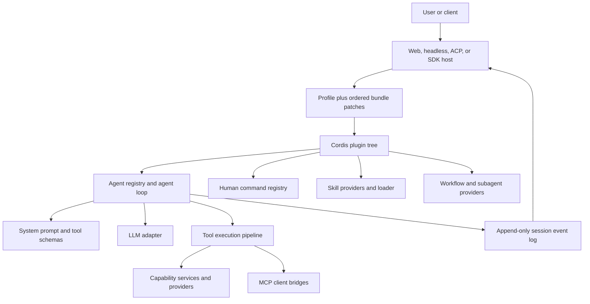
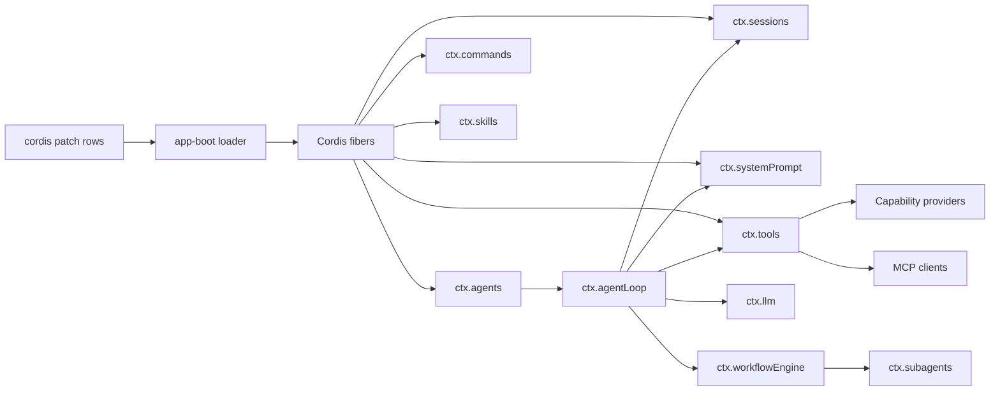
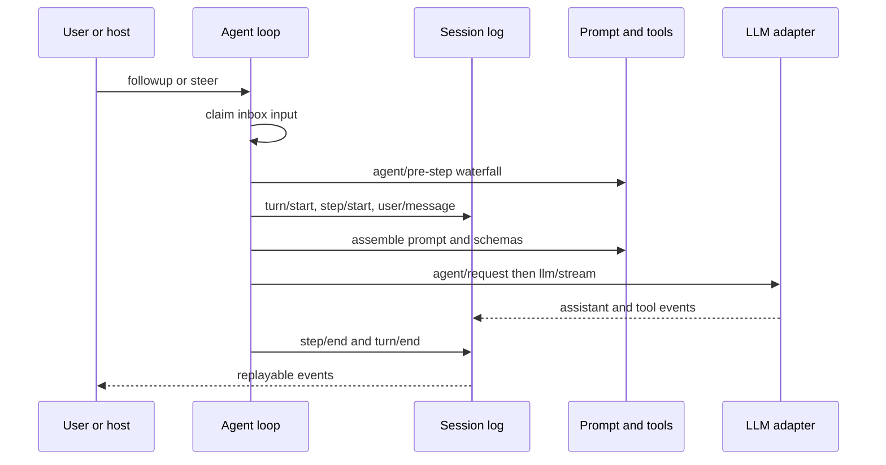
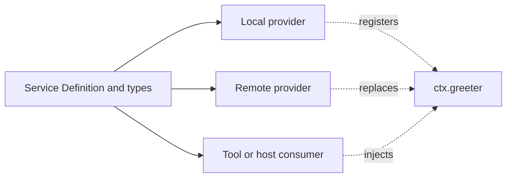

<div class="page-break" style="page-break-after: always;"></div>

# DeepSeek Harness 学生书籍

_从 Cordis 基础到生产扩展与子系统约定_

作者：George Hu

# 第一部分：Cordis 基础

通过可运行课程建立插件框架基础。请按顺序完成本部分。

> 规范来源: [docs/cordis-tutorial/index.zh.md](https://github.com/deepseek-ai/deepseek-harness/blob/master/docs/cordis-tutorial/index.zh.md)

## Cordis 教程


Cordis 是 DeepSeek Harness 底层的插件框架：它是一个小型运行时，其中的每项能力，包括工具、LLM（大语言模型）适配器、文件访问乃至 agent loop（智能体循环）本身，都是挂载到共享上下文中的插件。本教程通过动手实践讲解 Cordis：每一章都是一个可以运行的示例，你将在本仓库内的临时目录中逐步构建它，最后把一个插件接入真实的 harness 服务。

本教程面向 agent 开发者。你不需要深入掌握 TypeScript；下文的 [TypeScript 说明](#typescript-notes)会解释可能陌生的语法，并且每一章都会给出确切命令和预期输出。

如果你想阅读精简的概念参考，而不是逐步实践，请参阅 [Cordis 入门](https://github.com/deepseek-ai/deepseek-harness/blob/master/docs/cordis-primer.md)。详尽的 API 参考见[子系统页面](https://github.com/deepseek-ai/deepseek-harness/blob/master/docs/subsystems/core.md)上生成的 `cordis-surface` 区块，以及 [Cordis 核心 API](https://github.com/deepseek-ai/deepseek-harness/blob/master/docs/cordis-api/context.md) 页面。

如果你要为 harness 本身编写插件——由 `cordis.yml` 加载、在 Web UI 中驱动，而不是下面这个启动器——请从[第一个 Harness 插件](https://github.com/deepseek-ai/deepseek-harness/blob/master/docs/user/develop/basic/index.md)开始。

<a id="setup"></a>

### 准备工作

你需要克隆本仓库并安装依赖；[开发指南](https://github.com/deepseek-ai/deepseek-harness/blob/master/docs/development.md#setup-tutorial)列出了前置条件。本教程不需要 API 密钥；所有示例均可在无密钥环境中运行。

```sh
git clone https://github.com/deepseek-ai/deepseek-harness.git
cd deepseek-harness
pnpm install
```

创建各章使用的临时目录。`tmp/` 已被 git 忽略，因此你在其中写入的任何内容都不会进入版本控制：

```sh
mkdir -p tmp/cordis-tutorial
cd tmp/cordis-tutorial
```

每一章都从该目录运行同一条命令：

```sh
node --import tsx ../../vendor/cordis/bin.js
```

这个单文件启动器（见 [vendor/cordis/bin.js](https://github.com/deepseek-ai/deepseek-harness/blob/master/vendor/cordis/bin.js)）会创建根 `Context`、挂载 Loader 插件，并让它从当前目录加载 `./cordis.yml`。其余所有内容，包括有哪些插件以及如何配置它们，都来自你稍后将编写的 YAML 文件。`--import tsx` 标志让 Node 无需构建步骤即可运行配置所指向的 TypeScript 文件。

### 章节

1. [你的第一个插件](https://github.com/deepseek-ai/deepseek-harness/blob/master/docs/cordis-tutorial/01-first-plugin.md)：插件是函数，由 loader 挂载。
2. [生命周期与 effect](https://github.com/deepseek-ai/deepseek-harness/blob/master/docs/cordis-tutorial/02-lifecycle-and-effects.md)：由 Cordis 管理的注册会在所属插件卸载时撤销。
3. [服务](https://github.com/deepseek-ai/deepseek-harness/blob/master/docs/cordis-tutorial/03-services.md)：在 `ctx` 上公开一项能力，并通过 `inject` 依赖它。
4. [事件](https://github.com/deepseek-ai/deepseek-harness/blob/master/docs/cordis-tutorial/04-events.md)：类型化事件、广播分发和 waterfall（瀑布式事件）的短路行为。
5. [配置](https://github.com/deepseek-ai/deepseek-harness/blob/master/docs/cordis-tutorial/05-config.md)：读取 `cordis.yml` 中经过校验的配置，并在输入错误时明确报错。
6. [组合与 HMR（热模块替换）](https://github.com/deepseek-ai/deepseek-harness/blob/master/docs/cordis-tutorial/06-composition-and-hmr.md)：把配置文件作为插件树，使用热重载，并诊断始终无法加载的插件。
7. [进入 harness](https://github.com/deepseek-ai/deepseek-harness/blob/master/docs/cordis-tutorial/07-into-the-harness.md)：基于真实的 harness 服务注册一个可由模型调用的工具。

<a id="typescript-notes"></a>

### TypeScript 说明

这些示例使用了普通现代 JavaScript 之外的三项 TypeScript 功能：

- **类型注解**描述值，但不会改变运行时行为：`ctx: Context` 表示 `ctx` 具备 Cordis 上下文 API，`who: string` 接受文本，而 `string[]` 表示字符串数组。
- **`import type { Context } from '@deepseek-ai/cordis'`** 只导入类型信息。它在运行时会消失，因此仅为类型注解使用 `Context` 的插件文件不会增加运行时依赖。
- **声明合并**（`declare module '@deepseek-ai/cordis' { ... }`）会为 Cordis 已经声明的接口添加你的条目，例如新 `ctx.greeter` 属性的类型或事件名称。它不会生成任何运行时接线；插件必须另行提供服务或发出事件。第 3 章会完整展示该模式。

第 5 章还会使用 `interface` 描述配置对象的字段，并使用 `Schema<Config>` 这类泛型表示 schema 校验哪些对象字段。你可以直接照写这些声明；周围的正文会解释每项声明连接了什么。

[](https://github.com/deepseek-ai/deepseek-harness)


> 规范来源: [docs/cordis-tutorial/01-first-plugin.zh.md](https://github.com/deepseek-ai/deepseek-harness/blob/master/docs/cordis-tutorial/01-first-plugin.zh.md)

## 1. 编写第一个插件


在本教程使用的 loader 配置中，Cordis 插件模块通过命名导出提供 `apply` 函数。Cordis 加载模块时，会用一个 **上下文** 调用 `apply`；该上下文就是 `ctx` 对象，插件通过它注册自己贡献的所有内容。

### 编写插件

在 `tmp/cordis-tutorial` 目录中（参见[环境设置](https://github.com/deepseek-ai/deepseek-harness/blob/master/docs/cordis-tutorial/index.md#setup)）创建 `hello.ts`：

```ts
import type { Context } from '@deepseek-ai/cordis'

export const name = 'hello'

export function apply(ctx: Context) {
  console.log('hello from my first plugin')
}
```

`name` 导出项是可选的显示元数据；它用于在诊断信息中标识插件。

### 组合应用

本教程的启动器通过配置组装应用。创建 `cordis.yml`：

```yaml
- name: './hello.ts'
```

该文件是一组 Cordis 配置项的列表。`name` 是模块指定符，可以是相对路径或 NPM 包名；loader 会挂载每个配置项。各项会并发启动，因此它们在列表中的位置不保证插件的加载先后；顺序由服务依赖（`inject`，参见[第 3 章](https://github.com/deepseek-ai/deepseek-harness/blob/master/docs/cordis-tutorial/03-services.md)）决定，而非文件中的位置。

### 运行

```sh
node --import tsx ../../vendor/cordis/bin.js
```

预期输出：

```
hello from my first plugin
```

当没有任何内容继续运行时，进程会自行退出。具体过程如下：

1. 启动器创建根 `Context`，并挂载 **Loader** 插件。
2. Loader 读取 `cordis.yml`，解析 `./hello.ts`，然后将其作为子插件挂载。
3. Cordis 调用你的 `apply(ctx)`。

你的文件中没有框架启动代码：插件描述自己的贡献，`cordis.yml` 则组合应用。例如，[`dsh` base](https://github.com/deepseek-ai/deepseek-harness/blob/master/packages/bundle/base/cordis.patch.yml) 就是一份更长的插件组合，由部署 overlay 对它进行修补。

### 其他两种插件形态

函数是最常见的形式，但 Cordis 接受三种形式：

```ts
import { Service, type Context } from '@deepseek-ai/cordis'

// 1. Function plugin (what you just wrote).
export function apply(ctx: Context) {}

// 2. Object plugin: an object with an `apply` method.
export const objectPlugin = {
  name: 'object-plugin',
  apply(ctx: Context) {},
}

// 3. Class plugin: a Service subclass (covered in chapter 3).
export class MyService extends Service {
  constructor(ctx: Context) {
    super(ctx, 'myTutorialService')
  }
}
```

在你需要公开服务之前，请一直使用函数形态；[第 3 章](https://github.com/deepseek-ai/deepseek-harness/blob/master/docs/cordis-tutorial/03-services.md)介绍了何时应当使用类形态。

### 尝试制造错误

让 `apply` 抛出异常：

```ts ignore-check
export function apply(ctx: Context) {
  throw new Error('apply exploded')
}
```

再次运行：进程会因该错误而终止。插件加载失败会明确报错，不会仅跳过该配置项。

还需要尽早了解一个例外：如果某个配置项的模块无法被 **解析**，例如路径或包名拼写错误，Cordis 会通过 logger 服务报告错误，而不会使进程崩溃。在启动阶段，这条报告可能在 console 导出器开始观察之前丢失。如果新增配置项似乎没有任何效果，请先检查拼写。

下一章：[生命周期与 effect](https://github.com/deepseek-ai/deepseek-harness/blob/master/docs/cordis-tutorial/02-lifecycle-and-effects.md)：插件卸载时会发生什么。

[](https://github.com/deepseek-ai/deepseek-harness)


> 规范来源: [docs/cordis-tutorial/02-lifecycle-and-effects.zh.md](https://github.com/deepseek-ai/deepseek-harness/blob/master/docs/cordis-tutorial/02-lifecycle-and-effects.zh.md)

## 2. 生命周期与 effect


Cordis 插件可能因修改配置、热重载、显式资源释放或所需服务消失而卸载。通过 Cordis API 建立的注册属于 effect，会在所属插件卸载时撤销；在这些 API 之外管理的资源必须包装在 `ctx.effect()` 中。

### Effect

对于 Cordis 尚未管理的资源，例如定时器、连接或 watcher，应将其包装在 `ctx.effect()` 中并返回 disposer（资源释放函数）：

创建 `lifecycle.ts`，将它放在 `tmp/cordis-tutorial` 中：

```ts
import type { Context } from '@deepseek-ai/cordis'

export const name = 'lifecycle-demo'

function heartbeat(ctx: Context) {
  console.log('heartbeat plugin loading')
  ctx.effect(() => {
    const timer = setInterval(() => console.log('tick'), 200)
    return () => {
      clearInterval(timer)
      console.log('heartbeat cleaned up')
    }
  })
}

export function apply(ctx: Context) {
  // Mount a child plugin and keep its fiber to dispose it later.
  const fiber = ctx.plugin(heartbeat)
  // The demo timer is itself an effect: if THIS plugin is unloaded first,
  // the pending callback is cancelled instead of firing on a dead app.
  ctx.effect(() => {
    const timer = setTimeout(async () => {
      await fiber.dispose()
      console.log('disposed')
      process.exit(0)
    }, 700)
    return () => clearTimeout(timer)
  })
}
```

让 `cordis.yml` 指向该文件：

```yaml
- name: './lifecycle.ts'
```

运行（`node --import tsx ../../vendor/cordis/bin.js`）后会得到：

```
heartbeat plugin loading
tick
tick
tick
heartbeat cleaned up
disposed
```

请留意三点：

- `ctx.plugin(heartbeat)` 会把一个**来自代码**的函数挂载为插件，这与 YAML loader 为每个配置项执行的操作相同。函数插件不需要 `apply` 方法：Cordis 会直接调用该函数，其名称只用于诊断。只有对象形态才要求 `apply` 方法，例如 `ctx.plugin({ apply(ctx) { /* ... */ } })`。调用会返回一个 **fiber**，即一个已加载插件实例的运行时句柄。
- effect 主体在加载期间运行；它返回的 disposer 在卸载期间运行。对于生命周期与插件一致的资源，你绝不需要自行调用 disposer。
- `fiber.dispose()` 会等该插件的所有清理工作（包括异步 disposer）完成后才结束，并递归卸载它挂载的所有子插件。

### Fiber 状态机

每个已加载插件实例都拥有一个 fiber，并在以下状态之间转换：

```
PENDING → LOADING → ACTIVE → UNLOADING → DISPOSED
                 ↘ FAILED
```

- **PENDING**：已经声明，但所需服务（第 3 章）尚不可用。
- **LOADING / ACTIVE**：`apply` 正在运行／已经完成。
- **FAILED**：`apply` 或配置校验抛出异常。
- **UNLOADING / DISPOSED**：disposer 正在运行／一切均已拆除。

你会在[第 6 章](https://github.com/deepseek-ai/deepseek-harness/blob/master/docs/cordis-tutorial/06-composition-and-hmr.md)再次遇到 PENDING，它通常就是「为什么我的插件没有输出」的答案。

### 已经属于 effect 的操作

你很少需要亲自编写 `ctx.effect()`，因为内置注册 API 本身已经是 effect：

- `ctx.on(event, listener)`：监听器会在卸载时移除（[第 4 章](https://github.com/deepseek-ai/deepseek-harness/blob/master/docs/cordis-tutorial/04-events.md)）。
- `ctx.plugin(child)`：子插件会随父插件一同 dispose（资源释放）。
- 服务注册属于 effect。`ctx.tools.register(...)` 等 harness 注册表也会把返回的 disposer 附着到调用插件上，因此会自动撤销（[第 7 章](https://github.com/deepseek-ai/deepseek-harness/blob/master/docs/cordis-tutorial/07-into-the-harness.md)）。

对于 Cordis 不管理的资源，应在 `ctx.effect()` 内获取它，并返回用于释放资源的 disposer。此后 Cordis 会在卸载期间调用该释放逻辑，热重载时也不例外。

有一项顺序注意事项：disposer 会按注册顺序的逆序启动，但多个**异步** disposer 会并发运行。如果拆除步骤必须按顺序执行，请把它们放在同一个 disposer 中，并在其中依次等待每步完成。

下一章：[服务](https://github.com/deepseek-ai/deepseek-harness/blob/master/docs/cordis-tutorial/03-services.md)：插件如何共享功能。

[](https://github.com/deepseek-ai/deepseek-harness)


> 规范来源: [docs/cordis-tutorial/03-services.zh.md](https://github.com/deepseek-ai/deepseek-harness/blob/master/docs/cordis-tutorial/03-services.zh.md)

## 3. 服务


**服务**是一个插件提供、其他插件通过 `ctx` 消费的具名能力。在 harness 中，`ctx.tools`、`ctx.llm` 和 `ctx.agents` 都是服务。消费方只指定 `'tools'` 之类的能力，而不导入其提供方，因此配置可以选择提供方，无需修改消费方。

### 提供服务

创建 `greeter.ts`，将它放在 `tmp/cordis-tutorial` 中：

```ts
import { Service, type Context } from '@deepseek-ai/cordis'

declare module '@deepseek-ai/cordis' {
  interface Context {
    greeter: GreeterService
  }
}

export class GreeterService extends Service {
  constructor(ctx: Context) {
    super(ctx, 'greeter')
  }

  greet(who: string) {
    return `Hello, ${who}!`
  }
}

export const name = 'greeter'

export function apply(ctx: Context) {
  ctx.plugin(GreeterService)
}
```

两部分协同工作：

- **运行时**：`super(ctx, 'greeter')` 以名称 `greeter` 注册该实例。此后，任何插件都可以通过 `ctx.greeter` 访问它。注册属于 effect，卸载提供方时会移除该服务。
- **编译时**：`declare module '@deepseek-ai/cordis'` 块使用 TypeScript 声明合并，把 `greeter` 加入 `Context` 接口，使 `ctx.greeter` 在各处都能通过类型检查。它不会生成代码；没有该声明时，服务在运行时仍能工作，但消费方会失去类型安全。

`Service` 子类本身就是插件（第 1 章介绍的类形态），因此 `ctx.plugin(GreeterService)` 会像挂载其他插件一样挂载它。

### 使用 `inject` 消费服务

创建 `consumer.ts`：

```ts
import type { Context } from '@deepseek-ai/cordis'

export const name = 'consumer'
export const inject = ['greeter']

export function apply(ctx: Context) {
  console.log(ctx.greeter.greet('world'))
}
```

`inject` 列出该插件需要的服务。Cordis 会让插件保持 PENDING，直到列出的每项服务都存在，因此在 `apply` 内可以保证 `ctx.greeter` 已经就绪。`cordis.yml` 中的加载顺序无关紧要：决定插件何时启动的是依赖关系，而不是文件顺序。

组合并运行：

```yaml
- name: './greeter.ts'
- name: './consumer.ts'
```

```
Hello, world!
```

交换 `cordis.yml` 中两行的顺序后重新运行，输出仍然相同。尝试彻底移除 `./greeter.ts`：消费方会保持 PENDING，不输出任何内容，既不崩溃，也不会只运行一部分。处于 PENDING 的 fiber 也不会让 Node 的事件循环保持活跃，因此如果组合中没有其他运行项，进程会静默地以状态码 0 退出。[第 6 章](https://github.com/deepseek-ai/deepseek-harness/blob/master/docs/cordis-tutorial/06-composition-and-hmr.md)介绍如何诊断这种状态。

### 加载后仍会跟踪依赖关系

`inject` 并非一次性的启动检查。如果应用运行期间所需服务消失，例如提供方被卸载或热替换，每个依赖插件也会随之卸载，并在服务恢复后再次加载。结合 effect（[第 2 章](https://github.com/deepseek-ai/deepseek-harness/blob/master/docs/cordis-tutorial/02-lifecycle-and-effects.md)），这能防止运行中的消费方保留对不可用服务的引用：依赖消失时，它自己的注册也会撤销。

这也是配置中可以替换服务的原因：卸载 Cordis 配置项 `dsh-bash-local`，挂载另一个 `shell` 提供方，所有注入 `'shell'` 的插件都会重新启动并使用新实现。

### 可选依赖

`inject` 用于硬性依赖。如果某项功能缺失时插件仍可运行，请跳过 `inject`，并在使用处探测：

```ts ignore-check
export function apply(ctx: Context) {
  // undefined when no provider is loaded; the plugin still runs.
  const greeter = ctx.get('greeter')
  console.log(greeter?.greet('maybe') ?? 'no greeter available')
}
```

### 命名

每个应用中的服务名称共用一个扁平命名空间。请为自有服务添加有辨识度的前缀或命名空间（harness 已占用 `tools` 和 `llm` 等普通名称）；[子系统页面](https://github.com/deepseek-ai/deepseek-harness/blob/master/docs/subsystems/core.md)上生成的 `cordis-surface` 区块列出 harness 注册的每个名称。

下一章：[事件](https://github.com/deepseek-ai/deepseek-harness/blob/master/docs/cordis-tutorial/04-events.md)：无需共享服务即可通信。

[](https://github.com/deepseek-ai/deepseek-harness)


> 规范来源: [docs/cordis-tutorial/04-events.zh.md](https://github.com/deepseek-ai/deepseek-harness/blob/master/docs/cordis-tutorial/04-events.zh.md)

## 4. 事件


服务支持直接调用；**事件**让插件无需知道有哪些插件正在监听，就能发出通知。harness 使用事件处理工具结果、模型请求和审批决定等交互。

### 声明、发出与监听

创建 `stats.ts`，将它放在 `tmp/cordis-tutorial` 中。它是一项负责计数并在每次变化时发出通知的服务：

```ts
import { Service, type Context } from '@deepseek-ai/cordis'

declare module '@deepseek-ai/cordis' {
  interface Context {
    stats: StatsService
  }
  interface Events {
    'stats/report'(name: string, count: number): void
  }
}

export class StatsService extends Service {
  private counts = new Map<string, number>()

  constructor(ctx: Context) {
    super(ctx, 'stats')
  }

  bump(name: string) {
    const next = (this.counts.get(name) ?? 0) + 1
    this.counts.set(name, next)
    this.ctx.emit('stats/report', name, next)
  }
}

export const name = 'stats'

export function apply(ctx: Context) {
  ctx.plugin(StatsService)
}
```

`interface Events` 合并与第 3 章的 `interface Context` 合并在事件系统中相互对应：它声明事件名称及其监听器签名，因此 `ctx.emit` 和 `ctx.on` 都具有完整类型。`namespace/action` 命名约定让扁平的事件命名空间保持易读。

创建 `reporter.ts`：

```ts ignore-check
import type { Context } from '@deepseek-ai/cordis'
import type {} from './stats.ts'

export const name = 'reporter'
export const inject = ['stats']

export function apply(ctx: Context) {
  ctx.on('stats/report', (name, count) => {
    console.log(`[stats] ${name} -> ${count}`)
  })
  ctx.stats.bump('tool_call')
  ctx.stats.bump('tool_call')
  ctx.stats.bump('prompt')
}
```

`import type {} from './stats.ts'` 行不会在运行时导入任何内容；它的作用是让 TypeScript 看到声明合并。组合并运行：

```yaml
- name: './stats.ts'
- name: './reporter.ts'
```

```
[stats] tool_call -> 1
[stats] tool_call -> 2
[stats] prompt -> 1
```

因为 `ctx.on()` 属于 effect，监听器会随插件一同消失，绝不需要手动维护 `removeListener`。

### 分发模式

`emit` 是 5 种分发模式之一。事件采用哪种模式是其约定的一部分，决定了监听器能否返回值、能否并发运行，以及能否彼此短路：

| 模式 | 调用 | 语义 |
|---|---|---|
| emit | `ctx.emit(name, ...args)` | 同步广播；不会等待或收集返回的 promise 与值。 |
| parallel | `await ctx.parallel(name, ...args)` | 所有监听器并发运行，并一同等待。 |
| serial | `await ctx.serial(name, ...args)` | 监听器按顺序运行并等待；第一个非 `null`/`false`/`undefined` 返回值胜出，并停止后续监听器。 |
| bail | `ctx.bail(name, ...args)` | serial 的同步版本。 |
| waterfall（瀑布式事件） | `ctx.waterfall(name, ...args, next)` | 环绕中间件，见下文。 |

每个 harness 事件都会在其所属[子系统页面](https://github.com/deepseek-ai/deepseek-harness/blob/master/docs/subsystems/core.md)自动生成的参考文档中记录其模式。

### waterfall：转换或短路

waterfall 是实现拦截的模式。每个监听器都会收到参数和一个 `next()` continuation；它可以转换 `next()` 的返回值，也可以不调用 `next()` 就直接返回，从而短路链条的其余部分。Cordis 文档把后一种行为称为否决。创建 `waterfall-demo.ts`：

```ts
import type { Context } from '@deepseek-ai/cordis'

declare module '@deepseek-ai/cordis' {
  interface Events {
    'demo/transform'(input: string, next: () => Promise<string>): Promise<string>
  }
}

export const name = 'waterfall-demo'

export function apply(ctx: Context) {
  // Listener 1: wrap the downstream result.
  ctx.on('demo/transform', async (input, next) => {
    const downstream = await next()
    return downstream.toUpperCase()
  })

  // Listener 2: short-circuit when it owns the decision.
  ctx.on('demo/transform', async (input, next) => {
    if (input.includes('blocked')) return '** blocked **'
    return next()
  })

  void (async () => {
    console.log(await ctx.waterfall('demo/transform', 'hello', async () => 'hello'))
    console.log(await ctx.waterfall('demo/transform', 'blocked words', async () => 'blocked words'))
  })()
}
```

让 `cordis.yml` 只指向该文件并运行：

```
HELLO
** BLOCKED **
```

按顺序看第二行如何产生：监听器 1 先运行并调用 `next()`，从而调用监听器 2；监听器 2 看到 `blocked` 后直接返回而不调用 `next()`，因此最内层默认逻辑（传给 `ctx.waterfall` 的函数）从未运行；返回途中，监听器 1 再把替换消息转换为大写。

由此得到一项纪律：**只负责观察或标注的 waterfall 监听器必须调用 `next()`**；不调用就直接返回代表有意短路。如果日志监听器忘记调用 `next()`，会悄无声息地吞掉所有下游的默认行为。这是本仓库的常设规则（[waterfall 语义](https://github.com/deepseek-ai/deepseek-harness/blob/master/docs/cordis-primer.md#cordis-waterfall-semantics)）。

harness 使用 waterfall 处理协作插件可以包装或回答的决策：[`agent/request`](https://github.com/deepseek-ai/deepseek-harness/blob/master/docs/subsystems/core.md#agentrequest--waterfall) 允许插件替换模型调用配置，[`approval/request`](https://github.com/deepseek-ai/deepseek-harness/blob/master/docs/subsystems/approval.md#approvalrequest--waterfall) 允许策略代替用户作答。

下一章：[配置](https://github.com/deepseek-ai/deepseek-harness/blob/master/docs/cordis-tutorial/05-config.md)：来自 `cordis.yml` 的插件选项。

[](https://github.com/deepseek-ai/deepseek-harness)


> 规范来源: [docs/cordis-tutorial/05-config.zh.md](https://github.com/deepseek-ai/deepseek-harness/blob/master/docs/cordis-tutorial/05-config.zh.md)

## 5. 配置


`cordis.yml` 中的每个 Cordis 配置项都可以携带 `config` 块，插件则声明一个 schema，在运行 `apply` 前验证该块。错误配置会导致加载失败，并给出准确的错误：插件绝不会在配置不完整时启动。

### 可配置插件

创建 `config-demo.ts`，并将其放在 `tmp/cordis-tutorial` 中：

```ts
import type { Context } from '@deepseek-ai/cordis'
import Schema from '@deepseek-ai/schemastery'

export const name = 'config-demo'

export interface Config {
  greeting: string
  targets: string[]
}

export const Config: Schema<Config> = Schema.object({
  greeting: Schema.string().default('Hello'),
  targets: Schema.array(String).default(['world']),
})

export function apply(ctx: Context, config: Config) {
  for (const target of config.targets) {
    console.log(`${config.greeting}, ${target}!`)
  }
}
```

导出的 `Config` 既是 TypeScript 接口，也是同名的运行时 schema：消费方获得类型，Cordis 获得验证器。本仓库使用 [Schemastery](https://github.com/shigma/schemastery) 定义 schema；Cordis 本身接受任意 [Standard Schema](https://standardschema.dev/) 验证器，因此将普通对象导出为 `Config` 无法工作。

对其进行配置：

```yaml
- name: './config-demo.ts'
  config:
    targets: ['alpha', 'beta']
```

运行：

```
Hello, alpha!
Hello, beta!
```

未提供 `greeting`，因此 schema 默认值会将其补齐：`apply` 始终会收到完整且经过验证的配置。

### 明确报错

现在向它传入无效内容：

```yaml
- name: './config-demo.ts'
  config:
    targets: 'not-an-array'
```

```
ValidationError: invalid config:
  - $.targets expected array but got not-an-array (at targets)
```

插件的 fiber 进入 FAILED 状态，本教程的启动器打印错误后以状态码 1 退出。如果某个插件的配置通过了 schema 验证，但其中指定的资源或提供方不可用，该插件也应当在能解析该引用时立即拒绝。

### 计算得到的配置值

本仓库使用的 loader 支持 `!!js` 标签，用于必须在加载时计算的配置值：

```yaml
- name: './config-demo.ts'
  config:
    greeting: !!js process.env.DEMO_GREETING ?? 'Hello'
```

`!!js` 仅在 `config` 与条目 `disabled` 字段内有效。`disabled: !!js ...` 在每次挂载决策时基于 loader 上下文求值（本仓库的扩展），可以按平台或环境门控一行；其余元数据（`name`、`id`、`inject` 等）保持静态，其中的表达式是普通真值数据。详见 [loader 配置](https://github.com/deepseek-ai/deepseek-harness/blob/master/docs/cordis-primer.md#loader-configuration)。

下一章：[组合与 HMR（热模块替换）](https://github.com/deepseek-ai/deepseek-harness/blob/master/docs/cordis-tutorial/06-composition-and-hmr.md)：将 `cordis.yml` 视为应用。

[](https://github.com/deepseek-ai/deepseek-harness)


> 规范来源: [docs/cordis-tutorial/06-composition-and-hmr.zh.md](https://github.com/deepseek-ai/deepseek-harness/blob/master/docs/cordis-tutorial/06-composition-and-hmr.zh.md)

## 6. 组合与 HMR（热模块替换）


到目前为止构建的每项能力都是插件，`cordis.yml` 则选择应用的插件树。本章会改变这种组合、热重载一个插件，并诊断始终无法加载的插件。

### Cordis 配置项不只有名称

Cordis 配置项除了 `name` 和 `config`，还接受其他元数据：

```yaml
- id: greeter          # stable identity for this entry
  name: './greeter.ts'
- id: consumer
  name: './consumer.ts'
  disabled: true       # keep the entry, skip mounting it
```

`id` 为 Cordis 配置项提供稳定标识，使 loader 能区分修改现有 Cordis 配置项与先删除再添加。`disabled: true` 会卸载插件而不删除其 Cordis 配置项；改回原值后，插件以及所有因依赖其服务而处于 PENDING 的插件都会再次加载。

组可以嵌套一份 Cordis 配置项子列表，并将其作为一个单元加载和卸载；`isolate` 则为一个组提供某项服务名称的独立实例，因此两个组可以各自看到配置不同的 `shell` 提供方，互不影响。[Cordis 入门](https://github.com/deepseek-ai/deepseek-harness/blob/master/docs/cordis-primer.md)和[服务隔离示例](https://github.com/deepseek-ai/deepseek-harness/blob/master/docs/user/develop/framework/service.md#service-isolation)介绍了详细内容。

### 热模块替换

卸载会释放 effect（[第 2 章](https://github.com/deepseek-ai/deepseek-harness/blob/master/docs/cordis-tutorial/02-lifecycle-and-effects.md)），加载则遵循依赖关系（[第 3 章](https://github.com/deepseek-ai/deepseek-harness/blob/master/docs/cordis-tutorial/03-services.md)），因此 HMR 可以先卸载、再加载，以替换正在运行的插件。`@deepseek-ai/cordis-plugin-hmr` 插件会监视文件，并在保存时执行这一过程。

在 `tmp/cordis-tutorial` 中编写 `cordis.yml`：

```yaml
- id: logger
  name: '@deepseek-ai/cordis-plugin-logger-console'
- id: timer
  name: '@deepseek-ai/cordis-plugin-timer'
- id: hmr
  name: '@deepseek-ai/cordis-plugin-hmr'
  config:
    root: ['.']
- id: hello
  name: './hello.ts'
```

列表中增加了两个辅助插件：HMR 通过 Cordis logger 服务记录日志，因此没有控制台导出器时看不到其消息；它还会 `inject` `timer` 服务来实现去抖，如果没有 `@deepseek-ai/cordis-plugin-timer`，它就会永远停在 PENDING，而且不发出任何提示。下一节就讨论这种静默状态。

HMR 通过 Loader 的原生辅助工具读取 Node 的 loader 内部结构。请在 tsx 下运行 Cordis：

```sh
node --import tsx ../../vendor/cordis/bin.js
```

现在编辑 `hello.ts`，修改日志消息并保存：

```
hello from my first plugin
2026-07-22 15:44:36 [I] hmr watching [ '.' ]
2026-07-22 15:44:39 [I] hmr reload plugin at hello.ts
hello from my EDITED plugin
```

旧实例先卸载（其所有 effect 都会回卷），新代码随后加载，`apply` 再次运行。按 Ctrl-C 停止进程。编辑 `cordis.yml` 本身也会触发更新：loader 按 `id` 比较 Cordis 配置项，只挂载、卸载或重新配置发生变化的部分。这就是上述 Cordis 配置项显式携带 `id` 的原因：不带该字段的 Cordis 配置项在每次读取时都会获得一个新生成的 id，所以只要配置文件发生任何编辑，即使自身文本未变，它也会被视为先删除再添加并重新挂载。

### 诊断始终无法加载的插件

依赖驱动加载也有另一面：如果插件的 `inject` 指定了无人提供的服务，它就会一直等待，不输出任何内容。这不是错误，因为 PENDING 是合法状态，提供方可能稍后才挂载。

你可以直接查看这些状态。每个上下文都能枚举插件注册表；创建 `diagnose.ts`：

```ts
import { FiberState, type Context } from '@deepseek-ai/cordis'

export const name = 'diagnose'

export function apply(ctx: Context) {
  setTimeout(() => {
    for (const runtime of ctx.registry.values()) {
      for (const fiber of runtime.fibers) {
        if (fiber.state === FiberState.PENDING) {
          console.log(`${fiber.name} is PENDING — a required service is missing`)
        }
      }
    }
  }, 500)
}
```

再创建一个依赖无法满足的插件 `needs-timer.ts`：

```ts
import type { Context } from '@deepseek-ai/cordis'

export const name = 'needs-timer'
export const inject = ['timer']

export function apply(ctx: Context) {
  console.log('needs-timer loaded')
}
```

```yaml
- name: './needs-timer.ts'
- name: './diagnose.ts'
```

运行它（直接执行 `node --import tsx ../../vendor/cordis/bin.js`，按 Ctrl-C 停止）：

```
needs-timer is PENDING — a required service is missing
```

`inject: ['timer']` 没有提供方。向列表添加 `- name: '@deepseek-ai/cordis-plugin-timer'` 后，插件就会加载。如果插件既不执行任何操作，也不报告任何内容，请检查其 fiber 状态。不加 PENDING 过滤条件进行迭代时，还会看到 loader 自身的插件（Loader、Include）处于 ACTIVE，因为配置文件本身也是通过插件挂载的。

下一章：[进入 harness](https://github.com/deepseek-ai/deepseek-harness/blob/master/docs/cordis-tutorial/07-into-the-harness.md)：把相同模式用于真实的 harness 服务。

[](https://github.com/deepseek-ai/deepseek-harness)


> 规范来源: [docs/cordis-tutorial/07-into-the-harness.zh.md](https://github.com/deepseek-ai/deepseek-harness/blob/master/docs/cordis-tutorial/07-into-the-harness.zh.md)

## 7. 进入 harness


本章会向 harness 的 `tools` 服务注册一个可由模型调用的工具，通过 harness 工具流水线执行它，并观察结果事件。整个示例无需密钥，也不会调用模型。

### 工具插件

创建 `greet-tool.ts`，将它放在 `tmp/cordis-tutorial` 中：

```ts
import type { Context } from '@deepseek-ai/cordis'
import { defineTool } from '@deepseek-ai/dsh-tools'
import { CallId } from '@deepseek-ai/dsh-llm'

export const name = 'greet-tool'
export const inject = ['tools']

export function apply(ctx: Context) {
  ctx.tools.register(defineTool({
    name: 'greet',
    description: 'Greet the named person.',
    parameters: {
      name: { type: 'string', required: true, description: 'Who to greet' },
    },
    output: {
      schema: { type: 'string' },
      render: (_args, value) => [{ type: 'text', text: value }],
    },
    async execute(args) {
      return `Hello, ${args.name}!`
    },
  }))

  // Drive one call through the real execution pipeline, standing in for
  // the model. CallId brands the correlation id a provider would issue.
  void (async () => {
    const result = await ctx.tools.execute({
      callId: CallId('demo-1'),
      name: 'greet',
      arguments: { name: 'Cordis' },
      signal: new AbortController().signal,
    })
    console.log('tool replied:', JSON.stringify(result.content))
  })()
}
```

这里的每个模式都来自前几章：`inject: ['tools']`（[第 3 章](https://github.com/deepseek-ai/deepseek-harness/blob/master/docs/cordis-tutorial/03-services.md)）会让插件等待工具注册表就绪；`ctx.tools.register(...)` 会把注册 disposer 附着到插件（[第 2 章](https://github.com/deepseek-ai/deepseek-harness/blob/master/docs/cordis-tutorial/02-lifecycle-and-effects.md)），因此卸载时会注销工具。`defineTool` 将 `parameters` 规约转换为向模型展示的 JSON Schema，推导 `args` 的类型，并在 `execute` 运行前校验模型提供的参数。工具返回由 `output.schema` 声明的规范值；`output.render` 则作为 Native renderer（原生渲染器），另行生成可持久化的结果内容。

### 观察插件

创建 `tool-logger.ts`。这是一个独立插件，通过 harness 的 `tools/result` 事件观察应用中的每次工具调用：

```ts
import type { Context } from '@deepseek-ai/cordis'
import type {} from '@deepseek-ai/dsh-tools'

export const name = 'tool-logger'
export const inject = ['tools']

export function apply(ctx: Context) {
  ctx.on('tools/result', (exec, result) => {
    const text = result.content
      .map(block => (block.type === 'text' ? block.text : ''))
      .join('')
    console.log(`[tool-logger] ${exec.name} -> ${text}`)
  })
}
```

`import type {} from '@deepseek-ai/dsh-tools'` 行会引入该包的声明合并，使 `'tools/result'` 及其 payload 具有类型。这与第 4 章导入 `stats.ts` 的做法相同，只是扩展到了包级别。

### 组合并运行

```yaml
- name: '@deepseek-ai/dsh-system-prompt'
- name: '@deepseek-ai/dsh-tools'
- name: './tool-logger.ts'
- name: './greet-tool.ts'
```

`@deepseek-ai/dsh-tools` 会注入 `systemPrompt` 服务，因为工具需要向系统提示词贡献 schema，所以组合中也要列出该服务的提供方。缺少提供方时，工具插件会像[第 6 章](https://github.com/deepseek-ai/deepseek-harness/blob/master/docs/cordis-tutorial/06-composition-and-hmr.md)所述那样保持 PENDING。

```sh
node --import tsx ../../vendor/cordis/bin.js
```

```
[tool-logger] greet -> Hello, Cordis!
tool replied: [{"type":"text","text":"Hello, Cordis!"}]
```

logger 会先触发：`tools/result` 在结果物化过程中发出，发生在 `execute` 向调用方返回的 promise 兑现之前。两个插件都不知道另一个插件存在，它们由注册表服务和事件连接。

### 从这里走向完整 agent（智能体）

真实 agent 就是这套组合再加上更多插件：LLM（大语言模型）适配器、agent loop（智能体循环）、持久化和运行入口。对照 [examples/headless-agent/cordis.yml](https://github.com/deepseek-ai/deepseek-harness/blob/master/examples/headless-agent/cordis.yml)，你现在已经可以读懂其中每个配置项。将 `greet-tool.ts` 加入该文件的副本即可。

后续可以阅读：

- [构建工具](https://github.com/deepseek-ai/deepseek-harness/blob/master/docs/user/develop/basic/tool.md)：深入了解 `defineTool`，包括呈现和更丰富的 schema。
- [三层能力设计](https://github.com/deepseek-ai/deepseek-harness/blob/master/docs/user/develop/practice/index.md)：harness 如何组织可替换能力。
- [子系统页面](https://github.com/deepseek-ai/deepseek-harness/blob/master/docs/subsystems/core.md)上生成的 `cordis-surface` 区块：可以注入和监听的所有内容，各在其所属页面上。
- [架构](https://github.com/deepseek-ai/deepseek-harness/blob/master/docs/architecture.md)：这些插件所处的系统地图。

[](https://github.com/deepseek-ai/deepseek-harness)


# 第二部分：基于 Harness 主干进行开发

将 Cordis 应用于 Agent、能力、Skill、MCP、命令、工作流和 Claude Code 集成。

> 规范来源: [docs/user/develop/practice/backbone.zh.md](https://github.com/deepseek-ai/deepseek-harness/blob/master/docs/user/develop/practice/backbone.zh.md)

## 基于 Harness 主干进行开发


本教程为学生提供一条从系统架构到可运行自定义组合的学习路径。开始前，你应当能够从源码运行本仓库，并已完成[第一个插件](https://github.com/deepseek-ai/deepseek-harness/blob/master/docs/user/develop/basic/)。每章回答三个问题：扩展点负责什么、如何使用它，以及仓库为什么将它与相邻职责分开。

### 学习成果

你将构建一个插件层，用于自定义单个 Agent、拦截其流程、提供能力、添加 Skill 和人工命令、连接 MCP Server，并集成 Claude Code。示例构建在现有 `web` 或 `headless` Profile 之上，而不是替换核心 Agent Loop。

### 系统架构



Profile 决定存在哪些插件。Cordis 控制插件的依赖关系和生命周期。Agent Loop 协调 Turn，但插件通过 Service、作用域注册和事件改变行为。Session Log 是回放和模型历史的持久事实来源。

### 学习路径

1. 阅读架构，并跟踪一个 Turn 在运行时中的完整流程。
2. 创建具备正确生命周期管理的 Cordis 插件。
3. 自定义 Agent，并选择 Agent Flow 机制。
4. 将组合打包为 Profile Bundle。
5. 构建 Service Definition、Service Provider 和 Consumer。
6. 添加 Skill Provider、MCP Server 和人工命令。
7. 通过受支持的 Hook Bridge 或 Subagent Provider 集成 Claude Code。
8. 验证组装后的应用，而不只验证独立 Package。

### 扩展课程

以本教程作为课程主干，然后通过三个配套文档集深入学习各层：

1. 如果你还不熟悉插件生命周期、服务、事件、配置、组合或 HMR，请在第 1 章之前完成 [Cordis 教程](https://github.com/deepseek-ai/deepseek-harness/blob/master/docs/cordis-tutorial/)。
2. 完成第 3 章和第 4 章后，当你需要 Package、工具、LLM Adapter、Settings Card、Web Conversation Node、Vendored Dependency 或评审工作流的生产过程时，请使用[扩展 Cookbook](https://github.com/deepseek-ai/deepseek-harness/blob/master/docs/cookbook/extension-cookbook.md)。
3. 实现第 4 章至第 9 章时，请查阅[子系统参考](https://github.com/deepseek-ai/deepseek-harness/blob/master/docs/subsystems/)。每个页面负责一种能力的准确服务类型、事件、数据结构、Provider 约定和失败语义。

发布的学生书籍遵循此顺序：Cordis 基础、本 Harness 构建指南、Cookbook 过程，然后是子系统参考。前三部分应按顺序阅读。子系统部分用于查询，不必在开始扩展之前通读每个 API 页面。

### 按层理解系统

将组合、协调、能力和持久性分开后，仓库会更容易扩展。一个功能经常涉及多个层，但每个事实仍然只有一个所有者。

| 层 | 负责内容 | 何时扩展 |
|---|---|---|
| Host | Web、headless、ACP 和 SDK 等入口 | 客户端必须创建、驱动或渲染 agent 时 |
| Profile 和 Bundle | 组成一个产品的有序插件配置项 | 部署需要可复用插件组合时 |
| Cordis 插件 | 感知依赖的生命周期和可撤销注册 | 行为可在不更改 agent loop 的情况下连接时 |
| Agent | Inbox、状态、作用域上下文、会话和驱动控制 | 行为属于一个实时 agent 或轮次时 |
| Capability | 类型化服务、提供方和消费方 | 实现必须可替换且共用一个 API 时 |
| Session | 用于历史、回放和 UI 状态的持久事件 | 事实必须在重新加载后保留或进入模型历史时 |

#### 模块级设计



箭头表示依赖和调用方向。注册表定义稳定 API，提供方注册实现，消费方只依赖所需 API。插件 fiber 拥有其注册，因此卸载插件会移除这些注册。

#### 跟踪一个轮次



核心规则是**模型可见即记录**。不要将隐藏的可变状态直接放入模型请求。应添加会话事件并从日志生成请求，使恢复、fork、transcript 和回放保持一致。

### 第 1 章：构建生命周期安全的插件

#### 插件负责什么

Cordis 插件是具有 `apply(ctx)` 入口点的模块。它拥有通过其上下文创建的资源。`inject` 声明必需服务，因此 Cordis 会等待这些服务，并在服务消失时卸载插件。

#### 如何构建

创建 `scratch-plugin/src/student-plugin.ts`：

```ts ignore-check
import type { Context } from '@deepseek-ai/cordis'

export const name = 'student-plugin'
export const inject = ['agents']

export function apply(ctx: Context) {
  ctx.on('agent/session-start', ({ agent, source }) => {
    console.log(`[student-plugin] ${source}: ${agent.id}`)
  })

  ctx.effect(() => {
    const timer = setInterval(() => console.log('[student-plugin] active'), 30_000)
    return () => clearInterval(timer)
  })
}
```

使用覆盖层挂载它，并将绝对路径替换为你的检出路径：

```yaml
- insert:
    - id: student-plugin
      name: '/absolute/path/to/deepseek-harness/scratch-plugin/src/student-plugin.ts'
```

```sh
pnpm dsh web --patch ./scratch-plugin/cordis.yml
```

打开 `http://127.0.0.1:3080`，创建一个会话，并查找启动日志行。启用 HMR 后编辑插件，观察资源释放和重新激活。

#### 生命周期所有权为什么重要

手动全局注册会在 HMR 或提供方替换期间泄漏监听器和陈旧实现。`ctx.on()`、服务注册、子插件和 `ctx.effect()` 由当前 fiber 拥有。将依赖顺序的清理放在一个 disposer 中，并按顺序等待其步骤。

[基础插件教程](https://github.com/deepseek-ai/deepseek-harness/blob/master/docs/user/develop/basic/)介绍配置和打包。[插件与生命周期](https://github.com/deepseek-ai/deepseek-harness/blob/master/docs/user/develop/framework/)定义 fiber 状态和资源释放。

### 第 2 章：自定义 agent 及其流程

#### agent 是什么

`Agent` 是插件使用的稳定句柄。它拥有 Inbox、会话、状态、选项和 agent 作用域 `ctx`。`ctx.agents` 是注册表；`ctx.agentLoop` 是默认驱动和工厂。这种拆分使 Host 和插件能够使用 agent，而无需导入具体 agent loop。

| 方法 | 是否唤醒空闲 agent | 接纳点 | 用途 |
|---|---|---|---|
| `followup()` | 是 | 下一个轮次 | 添加新的类用户任务 |
| `steer()` | 是 | 下一个步骤 | 引导运行中或新轮次 |
| `inject()` | 否 | 下一个接纳的步骤 | 将插件上下文加入队列 |
| `cancel()` | 不适用 | 活动驱动以及默认情况下待处理的 Inbox | 停止工作并清除输入 |

当编程式 Host 需要自有 `AgentHandle`、异步作用域设置以及设置成功后的发布时，应使用 `ctx.agents.create()`。只对 agent 作出响应的插件应监听 `agent/*` 事件，而不是创建另一个驱动。

#### 如何拦截确定性流程

不拥有最终决策的 waterfall 监听器必须调用 `next()`：

```ts ignore-check
import type { Context } from '@deepseek-ai/cordis'

export function apply(ctx: Context) {
  ctx.on('agent/pre-step', async ({ agent, messages, turn, step }, next) => {
    console.log({ agentId: agent.id, messageCount: messages.length, turn, step })
    return next()
  })
}
```

仅当此插件拥有拒绝决策时才返回 `{ kind: 'reject' }`。若要重写输入，请委托并根据下游决策返回新的 `{ kind: 'enter', messages }`。声明的消息已从 Inbox 中移除，因此拒绝不会恢复这些消息。

#### 如何选择 agent flow 机制

| 需求 | 机制 | 原因 |
|---|---|---|
| 确定性观察或策略 | `agent/*` 或 `tools/*` 事件插件 | 类型化并属于实时生命周期 |
| 在同一会话中添加更多工作 | `followup()`、`steer()` 或 `inject()` | 保留一份持久历史 |
| 一项独立委托任务 | 绑定的 `ctx.subagents` 提供方和工具 | 子执行可以使用其他运行时 |
| 大规模模型编写的扇出 | `ctx.workflowEngine` 和 `dsh-tool-workflow` | Worker 运行编排代码并收集结果 |
| 为所有轮次使用不同语义 | 实现并注册 `Agent` | 仅在扩展点无法表达需求时使用 |

agent loop 负责取消、事件顺序、请求组装、工具执行、重试和轮次完成。将功能策略放在事件和服务中。[agent 包](https://github.com/deepseek-ai/deepseek-harness/blob/master/packages/core/agent/README.md)负责句柄和注册表；[工作流子系统](https://github.com/deepseek-ai/deepseek-harness/blob/master/docs/subsystems/workflow.md)负责动态工作流行为。

### 第 3 章：组装 agent harness

#### harness 是什么

仓库中不存在单独的“agent harness 插件”类型。harness 是组装后的产品：Host 启动 Profile，Profile 应用有序 Bundle 补丁，这些补丁挂载 Cordis 插件。应有意识地使用这三个层级。

| 层级 | 生命周期 | 用途 |
|---|---|---|
| Overlay | 一次启动 | 使用 `--patch` 进行实验 |
| Profile patch | 一个本地 Profile | 自定义一个已安装的 `web` 或 `headless` 组合 |
| Bundle | 版本化 npm 包 | 共享和安装组合层 |

调试行为前，先检查准确的解析树：

```sh
dsh --profile web --dump-config
```

#### 如何构建 Bundle

Bundle 包在 `package.json` 中声明其补丁：

```json
{
  "name": "@acme/dsh-student-bundle",
  "version": "0.1.0",
  "type": "module",
  "dsh": {
    "bundle": {
      "patch": "./cordis.patch.yml"
    }
  }
}
```

它的 `cordis.patch.yml` 插入或替换配置项。当更高层可能自定义配置项时，每项都需要稳定的 `id`：

```yaml
- insert:
    - id: student-plugin
      name: '@acme/dsh-student-plugin'
      config:
        course: architecture
```

将 Bundle 安装到 Profile，然后重启该 Profile：

```sh
dsh plugin --profile web add @acme/dsh-student-bundle
dsh --profile web
```

以 id 为目标的补丁会替换配置项的完整 `config`；请重新声明要保留的字段。Bundle 顺序、Profile 补丁、Home 补丁和 `--patch` Overlay 依次决定优先级。

#### 为什么组合应保留在代码之外

当产品选择位于补丁中时，相同提供方或工具可服务于 Web、headless、ACP 和测试。代码负责行为；Bundle 补丁负责部署中存在哪些行为。[app-boot Profile 约定](https://github.com/deepseek-ai/deepseek-harness/blob/master/packages/boot/app-boot/README.md#profiles)定义解析和优先级。

### 第 4 章：构建能力提供方

#### 三种角色负责什么

可替换能力包含 Service Definition、Service Provider 和 Consumer。Definition 负责请求和结果类型。Provider 实现这些类型。Consumer 将能力公开给模型、命令、Host 或其他服务。仅当这些角色需要独立演化时才拆分包。



#### 如何实现这些角色

下面的精简示例展示所有权拆分。在实际包系列中，应将每个角色放入自己的包，并添加仓库要求的 JSDoc 和测试。

```ts ignore-check
// Service Definition: @acme/dsh-greeter
import { Service, type Context } from '@deepseek-ai/cordis'

declare module '@deepseek-ai/cordis' {
  interface Context { greeter: GreeterService }
}

export abstract class GreeterService extends Service {
  constructor(ctx: Context) { super(ctx, 'greeter') }
  abstract greet(name: string): Promise<{ message: string }>
}

// Service Provider: @acme/dsh-greeter-local
class LocalGreeter extends GreeterService {
  async greet(name: string) { return { message: `Hello, ${name}.` } }
}

export function applyProvider(ctx: Context) {
  ctx.plugin(LocalGreeter)
}

// Consumer: @acme/dsh-tool-greeter
import { defineTool } from '@deepseek-ai/dsh-tools'

export function applyConsumer(ctx: Context) {
  ctx.tools.register(defineTool({
    name: 'greet',
    description: 'Greet a person by name.',
    parameters: { name: { type: 'string', required: true } },
    output: {
      schema: { type: 'object', properties: { message: { type: 'string' } } },
      render: (_args, value) => [{ type: 'text', text: value.message }],
    },
    execute: ({ name }) => ctx.greeter.greet(name),
  }))
}
```

将提供方和消费方组合在一起：

```yaml
- name: '@acme/dsh-greeter-local'
- name: '@acme/dsh-tool-greeter'
```

#### 这种设计为什么可以扩展

Consumer 永远不会导入本地 Provider。远程 Provider 可以替换它，而无需更改工具 schema 或调用方。默认值应位于由 Provider 负责的显式 `resolve(request)` 步骤中，而不是隐藏在执行过程里。[三角色能力设计](https://github.com/deepseek-ai/deepseek-harness/blob/master/docs/user/develop/practice/)包含完整包教程，[工具编写](https://github.com/deepseek-ai/deepseek-harness/blob/master/docs/cookbook/adding-a-tool.md)定义验证、取消、规范 JSON 输出和 UI 渲染。

### 第 5 章：添加 skill

#### skill 是什么

skill 是通过 `ctx.skills` 发现的可复用指令内容。注册表与提供方无关。`dsh-skill-filesystem` 发现本地文件，`dsh-tool-skill` 向模型发布目录和加载工具。除非其指令调用工具，否则 skill 不是可执行插件代码。

#### 如何添加文件系统 skill

在项目中创建 `.agents/skills/course-helper/SKILL.md`：

```markdown
---
name: course-helper
description: Explain Harness architecture with repository references.
whenToUse: Use when a student asks how a Harness extension fits into the runtime.
---

## Course helper

Start from the system layer, name the owning service or event, and link its package README.
```

文件系统提供方还会扫描 `.dsh/skills`、`~/.dsh/skills` 和 `~/.agents/skills`。名称必须使用 kebab-case。在 Frontmatter 中设置 `disable-model-invocation: true` 或 `user-invocable: false` 可移除相应调用入口。

#### 如何在插件中嵌入 skill

```ts ignore-check
import type { Context } from '@deepseek-ai/cordis'

export const inject = ['skills']

export function apply(ctx: Context) {
  ctx.skills.register({
    name: 'course-helper',
    description: 'Explain Harness architecture with repository references.',
    source: 'runtime',
    content: 'Start from the system layer and name the owning service or event.',
    invocation: { modelInvocable: true, userInvocable: true },
  })
}
```

当 skill 来自数据库、HTTP 服务或其他目录时，应改用 `registerProvider()`。Provider 实现用于摘要的 `list()` 和用于渐进加载正文的 `get()`，遵守取消信号，并在目录变化时调用其注册作用域的 `invalidate()`。

#### skill 和插件为什么不同

插件执行可信代码并注册运行时行为。skill 提供可发现的指令和可选资源。二者分离后，Operator 可以检查和替换指导内容，而不会授予另一条代码执行路径。[skill 子系统](https://github.com/deepseek-ai/deepseek-harness/blob/master/docs/subsystems/skills.md)负责发现顺序、策略和模型渲染。

### 第 6 章：连接 MCP Server

#### MCP Bridge 负责什么

`dsh-mcp-client` 连接一个外部 Model Context Protocol Server，发现其工具，并将工具注册到 `ctx.tools`。Bridge 支持 MCP 工具，但不支持 MCP Resource 或 Prompt。每个实例需要唯一 `serverName`；公开名称使用 `mcp__<serverName>__<rawName>`。

#### 如何通过 stdio 或 HTTP 连接

在 Profile 补丁或启动 Overlay 中为每个 Server 添加一个配置项：

```yaml
- id: mcp-course-files
  name: '@deepseek-ai/dsh-mcp-client'
  config:
    serverName: course
    transport: stdio
    command: node
    args: ['/absolute/path/to/course-mcp-server.js']
    failOnStartupError: true

- id: mcp-course-http
  name: '@deepseek-ai/dsh-mcp-client'
  config:
    serverName: course-http
    transport: streamable-http
    url: http://127.0.0.1:3000/mcp
    headers:
      Authorization: \!\!js '`Bearer ${process.env.MCP_TOKEN}`'
```

开发期间使用 `failOnStartupError: true`，使发现错误导致启动失败，而不是产生空工具集。将凭据保留在环境或凭据服务中，绝不能写入已提交的补丁。启动后，检查工具目录或要求模型调用带 Server 限定名称的工具。

#### 为什么 MCP 是适配器而不是第二套工具系统

MCP 工具进入正常工具注册表和执行流水线。它们继承取消、策略拦截、日志、Code Mode 访问和 UI 回退行为。这避免了并行执行路径。[MCP Client 约定](https://github.com/deepseek-ai/deepseek-harness/blob/master/packages/mcp/mcp-client/README.md)记录重新连接、命名、schema 限制和富结果。

### 第 7 章：添加人工命令

#### 命令负责什么

命令是 `/inspect target` 等直接人工控制。它不会创建模型轮次，其结果文本也不会进入模型历史。当模型选择操作时使用工具；当人明确控制应用状态或安排工作时使用命令。

#### 如何注册命令

```ts ignore-check
import type { Context } from '@deepseek-ai/cordis'

export const name = 'student-commands'
export const inject = ['commands']

export function apply(ctx: Context) {
  ctx.commands.register({
    name: 'inspect',
    description: 'Show the current agent and raw target.',
    input: { hint: '<target>' },
    handler: ({ agent, rawInput, signal }) => {
      if (signal.aborted) return { kind: 'error', text: 'Command cancelled.' }
      return { kind: 'success', text: `${agent.id}: ${rawInput.trim()}` }
    },
  })
}
```

名称包含小写字母、数字、`_` 或 `-`。仅当另一个权威领域事件存储 Payload 时，才设置 `recordInput: false`。希望执行模型工作的命令必须显式调用接收方 `Agent`；注册表绝不会将原始输入转换为 Prompt。

#### 为什么命令位于模型循环之外

直接分派使命令可预测、成本低，并在不应运行模型请求时仍然可用。持久 `command/run` 和 `command/done` 事件为客户端记录执行，而不改变模型历史。[commands 包](https://github.com/deepseek-ai/deepseek-harness/blob/master/packages/interaction/commands/README.md)负责解析、附件、取消和结果语义。

### 第 8 章：集成 Claude Code

“加载 Claude Code 插件”可能表示两种不同集成。应根据意图进行选择。

#### 导入命令钩子

使用 `dsh-hooks-claude-code` 将 `hooks.json` 文件或 Settings 文件 `hooks` 键中的受支持命令钩子子集映射到 Harness 事件：

```yaml
- id: claude-code-hooks
  name: '@deepseek-ai/dsh-hooks-claude-code'
  config:
    configPath: ./.claude/hooks.json
    pluginRoot: ./.claude/plugins/course-plugin
    projectDir: .
```

`${CLAUDE_PLUGIN_ROOT}` 和 `${CLAUDE_PROJECT_DIR}` 替换使用这些值。Bridge 在插件加载时读取文件一次。它支持已记录 Hook Event 子集的命令 Handler；它不会加载任意 Claude Code 插件功能、Prompt Handler、Agent 或 MCP Handler。当你控制集成并需要类型化决策时，应使用原生 Cordis 插件。

#### 将任务委托给 Claude Code

当父 agent 应将一项独立任务发送给全新 Claude Code 进程时，使用 Claude Code subagent Bundle：

```sh
dsh plugin --profile web add @deepseek-ai/dsh-subagent-claude-code
dsh --profile web
```

安装的 Bundle 注册一个休眠 `claude-code` Provider。在 Profile 或 Preset 中通过绑定的 subagent 工具公开它：

```yaml
- id: tool-subagent-claude
  name: '@deepseek-ai/dsh-tool-subagent'
  config:
    provider: claude-code
    toolName: subagent_claude_code
    backgroundMode: one-shot
    maxDepth: provider-managed
```

Provider 使用官方固定版本 Agent SDK 和父会话工作区中的原生 Claude Settings。它在调用前不会启动进程，不复制父对话上下文，并且只返回最终答案或安全失败诊断。身份验证仍由 Claude Code 负责。

#### 为什么两种集成相互分离

Hook Bridge 拦截当前 Harness agent。subagent Provider 启动另一个产品来执行委托工作。将二者合并会模糊生命周期、权限、上下文和结果所有权。阅读 [Claude Code hooks](https://github.com/deepseek-ai/deepseek-harness/blob/master/packages/hooks/hooks-claude-code/README.md)了解兼容性矩阵，阅读 [Claude Code subagent](https://github.com/deepseek-ai/deepseek-harness/blob/master/packages/subagent/subagent-claude-code/README.md)了解安装和权限模式。

### 第 9 章：安全验证和扩展

#### 验证每一层

1. 运行 `dsh --profile web --dump-config`，确认每个预期配置项、id 和最终配置。
2. 启动 Profile，确认每个必需服务都激活，且不存在待处理依赖。
3. 创建会话，确认插件启动、命令发现、skill 发现和 MCP 工具名称。
4. 对每个新工具、Provider、命令或 Hook 执行一条成功路径和一条失败路径。
5. 取消长时间运行的工作，并验证进程、监听器和注册达到完全停稳。
6. 重新加载或重启，并验证模型可见事实可从会话日志重建。
7. 添加聚焦的包测试。为模型或产品可见行为添加无密钥组装快照。
8. 运行仓库测试策略和包 README 选择的检查。

对于文档更改，运行：

```sh
pnpm run doc-sync
pnpm run lint
git diff --check
```

#### 按所有权进行诊断

| 症状 | 首先检查的所有者 |
|---|---|
| 插件保持待处理状态 | 其 `inject` 列表和 Provider 配置项 |
| 模型无法看到工具 | `ctx.tools` 注册作用域和组装后的 schema |
| 工具存在但失败 | `tools/pre-execute`、Provider、取消，然后是 post-execute |
| UI 回放不同 | 会话事件和纯展示元数据 |
| skill 缺失 | Provider Root、Frontmatter、调用策略和目录完整性 |
| MCP 工具消失 | MCP 日志、重连预算和 Namespace 冲突 |
| 命令到达模型 | 命令 Producer 代码，因为注册表绝不提交输入 |
| Claude Hook 不运行 | 支持的 Event 和命令 Handler 子集、路径和 Matcher |

#### 构建下一个扩展

从最窄的所有者开始。使用插件实现策略，使用服务实现共享运行时行为，使用三角色能力实现可替换实现，使用 Bundle 实现部署组合，使用 skill 实现可复用指令，使用 MCP 实现外部工具，使用命令实现直接人工控制，使用 subagent Provider 实现委托执行。仅当这些机制无法表达所需轮次语义时，才更改 agent loop。

### 继续阅读架构参考

使用 [DeepSeek Harness Architecture](https://github.com/deepseek-ai/deepseek-harness/blob/master/docs/architecture.md)了解当前系统地图，使用 [Agent lifecycle](https://github.com/deepseek-ai/deepseek-harness/blob/master/docs/agent-lifecycle.md)了解完整 Turn 顺序，并使用 [Capability seams](https://github.com/deepseek-ai/deepseek-harness/blob/master/docs/capability-seams.md)了解内置的 Service Definition、Service Provider 和 Consumer 系列。


# 第三部分：扩展 Cookbook

将扩展设计实现为符合仓库质量要求的 Package 或产品集成时，请使用这些过程。

> 规范来源: [docs/cookbook/extension-cookbook.zh.md](https://github.com/deepseek-ai/deepseek-harness/blob/master/docs/cookbook/extension-cookbook.zh.md)

## 实操手册：扩展插件形态


harness 扩展的参考模式。代码片段省略了 import 和辅助实现，无法直接复制运行。具体编写路径见[包检查清单](https://github.com/deepseek-ai/deepseek-harness/blob/master/docs/cookbook/adding-a-package.md)、[第一个工具教程](https://github.com/deepseek-ai/deepseek-harness/blob/master/docs/user/develop/basic/tool.md)、[工具参考](https://github.com/deepseek-ai/deepseek-harness/blob/master/docs/cookbook/adding-a-tool.md)和 [LLM（大语言模型）适配器指南](https://github.com/deepseek-ai/deepseek-harness/blob/master/docs/cookbook/adding-an-llm-adapter.md)；系统与扩展点映射由[架构文档](https://github.com/deepseek-ai/deepseek-harness/blob/master/docs/architecture.md)负责。

### 工具插件

工具在 `ctx.tools` 上注册。带注解的 `defineTool` 示例（类型化的 `execute` 参数、结果构造、`run_in_background` 模式）见 [adding-a-tool.md](https://github.com/deepseek-ai/deepseek-harness/blob/master/docs/cookbook/adding-a-tool.md)——该指南是工具定义的真源。`ctx.tools.register()` 也直接接受原始 JSON Schema `ToolDefinition`（MCP 来源的工具就是这样到达的）；`defineTool` 是第一方工具使用的类型化辅助函数。

<a id="a-hook-plugin-permission-gate-example"></a>

### 钩子插件（以权限门禁为例）

这个权限门禁是钩子插件的一个示例。它从 `tools/pre-execute` 门禁返回一个类型化的决策，用于允许或拒绝一次调用；沙箱、权限和 plan-mode 插件都可以使用该扩展点。钩子插件也可以拦截其他扩展点，本身并不等同于权限门禁。「原生钩子」是在拦截点上运行的普通 Cordis 插件，不需要外部协议。

```ts
import type { Context } from '@deepseek-ai/cordis'
import type { PreToolDecision, ToolExecution } from '@deepseek-ai/dsh-tools'

declare function isAllowed(exec: ToolExecution): Promise<boolean>

export const name = 'permission-gate'

export function apply(ctx: Context) {
  ctx.on('tools/pre-execute', async (exec, next): Promise<PreToolDecision> => {
    if (!(await isAllowed(exec))) {
      return { kind: 'deny', reason: 'Denied by policy.' }
    }
    return next()
  })
}
```

这个 waterfall（瀑布式事件）是可重排的策略层。当不变式需要单调的最终拒绝时使用 `ctx.tools.guard()`；当插件需要包裹实际分发生命周期时（超时/重试/指标；仅 `exec.signal` 可替换）使用 `tools/execute`；显式结果变换使用 `tools/post-execute`；对不可变最终结果的受限观察使用 `tools/result`。选择规则见[添加工具指南](https://github.com/deepseek-ai/deepseek-harness/blob/master/docs/cookbook/adding-a-tool.md#execution-policy-and-observation)。

### UI 插件

UI 插件从 `session/event` 事件流渲染（助手 token 流以 `assistant/chunk` 形式到达，加上轮次/步骤边界与工具活动），并通过 `agent.followup()` / `agent.steer()` 将输入驱动回去。如果浏览器插件要向内建 Web Client 贡献业务行，则应注册 `ConversationNodeDefinition` 与 keyed Chat renderer；具体步骤见 [Conversation Node 指南](https://github.com/deepseek-ai/deepseek-harness/blob/master/docs/cookbook/adding-a-conversation-node.md)。

```ts
import type { Context } from '@deepseek-ai/cordis'
import { createUserMessage } from '@deepseek-ai/dsh-llm'
import { SessionId } from '@deepseek-ai/dsh-session'

declare function render(text: string): void
declare function onUserInput(handler: (text: string) => void): void

export const name = 'my-ui'
export const inject = ['agents']

export function apply(ctx: Context) {
  ctx.on('session/event', (_session, event) => {
    if (event.type === 'assistant/chunk' && event.data.chunk.type === 'text-delta') {
      render(event.data.chunk.text)
    }
  })
  onUserInput(text => ctx.agents.get(SessionId('client-session'))?.followup(createUserMessage({
    content: [{ type: 'text', text }],
    source: { kind: 'user' },
  })))
}
```

### 外部协议驱动

*协议驱动*将协议对端接入 `ctx.agents`；它可以服务于 UI 或自动化客户端。stdio 驱动拥有 stdout，通过工厂创建或恢复 agent（智能体），并将协议请求映射为 `followup()` 或 `cancel()`。底层提示词请求返回其持久入队回执；它不会通过关联 `MessageId` 与 `turn/end` 获得结果。整个 agent 的状态应单独发布。自动化方法可以从回执等待到下一次 idle，并概括这一显式拥有的区间；UI 通常则会持续观察开放式事件流。通过 `AgentHandle.dispose()` 拆除 agent，以使 dispose（资源释放）达到完全停稳。

[`packages/acp/acp`](https://github.com/deepseek-ai/deepseek-harness/blob/master/packages/acp/acp) 是仅面向自动化的完整示例：它通过 ACP（Agent Client Protocol）JSON-RPC stdio 提供全新文本会话，发出已提交的助手文本，并为其拥有的 agent 注册一次性机器权限应答器。其 [README](https://github.com/deepseek-ai/deepseek-harness/blob/master/packages/acp/acp/README.md) 定义确切的方法、事件顺序和生命周期约定。

```ts
import type { Context } from '@deepseek-ai/cordis'

export const name = 'my-protocol-bridge'
export const inject = ['agents', 'sessions', 'sessionPersistence']

export function apply(ctx: Context) {
  // Stream every logged assistant text/reasoning delta out to the client.
  ctx.on('session/event', (_session, event) => {
    if (event.type === 'assistant/chunk') {
      const chunk = event.data.chunk
      if (chunk.type === 'text-delta') {
        // sendToClient({ kind: 'message_chunk', text: chunk.text })
      }
    }
  })
  // Inbound "prompt": create/resume an agent, feed it, and return its enqueue receipt.
  // Whole-agent status is a separate notification; no turn end belongs to this prompt.
  // Teardown reaches quiescence via AgentHandle.dispose() (stop + await exit).
}
```

### 可运行的组装示例

可运行叶子从 `examples/*/cordis.yml` 加载各自的插件树；根目录的 `demo:*` 脚本和这些叶子目录是权威清单。产品 `dsh` 启动器负责 Web 和一次性 headless 执行，ACP 叶子使用 [`@deepseek-ai/dsh-acp-demo`](https://github.com/deepseek-ai/deepseek-harness/blob/master/packages/examples/acp-demo)，JSON-RPC 叶子使用 [`@deepseek-ai/dsh-sdk-jsonrpc-demo`](https://github.com/deepseek-ai/deepseek-harness/blob/master/packages/examples/jsonrpc-demo)。headless 快照叶节点显式挂载 [`@deepseek-ai/dsh-agent-spine-demo`](https://github.com/deepseek-ai/deepseek-harness/blob/master/packages/examples/agent-spine-demo) 和 JSONL 持久化，再通过示例自有的测试 fixture（测试前置数据）驱动这些组件，而不是通过已交付的 app 包。

### 功能→机制映射

每个产品功能都映射到一个文档化扩展点上的监听器——微内核声明由此可验证（[微内核 Agent Note](https://github.com/deepseek-ai/deepseek-harness/blob/master/.agents/notes/implemented/architecture/2026-06-11-microkernel-event-taxonomy.md)）。没有任何一行修改循环本身。

`system-prompt/assemble` 是一个专家协作式的整体装配变换：其返回的装配结果具有权威性，因此监听器作者有责任保留活跃的 Code Mode 和结构化输出协议的贡献。对于需要在展示、查找和执行之间保持对齐的工具过滤，优先使用 `ctx.tools.restrict()`。

| 产品功能 | 插件机制 |
|---|---|
| 钩子系统（用户级 + 项目级） | `agent/session-start`、`agent/pre-step`、`agent/request`、`tools/pre-execute`、`tools/post-execute` 和 `agent/turn-stopping` 上的监听器；waterfall 返回类型化决策，`agent/turn-stopping` 则可通过 steering（中途引导）触发下一步；`dsh-hooks-claude-code` / `dsh-hooks-codex` 桥接器将钩子配置文件映射到这些扩展点上 |
| `/goal` | `ctx.goals` 管理持久状态，`dsh-goal-round-driver` 通过公共 `Agent` 调度同会话 Round，独立的命令/工具生产方分别提供人类/模型控制 |
| `/loop` | 在 `turn/end` 会话事件上 `followup()` 下一次迭代；或强制继续 |
| 动态工作流 | `ctx.workflowEngine` + worker-thread 引擎 + `workflow` 工具；结构化的进程内子任务通过作用域化的提示词/工具注册、单调工具守卫、最终 `tools/result` 提交（包括外层 `run_code`）和结构化输出执行的单调 `concludeTurn()` 标记来强制输出 |
| 排队消息 + steering | 核心 `Agent.followup()` / `Agent.steer()` |
| 上下文压缩（context compaction）（自动 + 手动） | `ctx.compaction` seam + `dsh-compaction-basic`；自动压力检查运行在串行 `agent/pre-step`，标准的溢出恢复机制运行在 `agent/request-error`，手动调用方使用同一个压缩服务（[压缩 Agent Note](https://github.com/deepseek-ai/deepseek-harness/blob/master/.agents/notes/implemented/feature/2026-06-18-compaction-capability-seam.md)） |
| 系统提示词可配置性 | `ctx.systemPrompt.section()`，支持排序与作用域局部覆盖 |
| AGENTS.md（根目录） | 一个读取该文件的 section 提供方 |
| AGENTS.md（子目录，按需触发）+ 文件变更通知 | 从 watcher / 工具结果监听器调用 `agent.inject()` |
| 内置工具 | `ctx.tools.register()`；schema 自动流入装配——`dsh-tool-*` 系列（bash、fs、web、subagent、todo）是已交付的示例 |
| ToolSearch / 渐进式披露 | 当可见集变化时替换一个作用域化的 `ctx.tools.restrict()` 注册；注册表保持展示、查找和执行三者对齐 |
| 工具截止时间 / 重试 / 指标 | 用 `tools/execute` 包裹核心分发；包装层可替换 `exec.signal`、委托执行，并在同一词法生命周期内检视规范化结果 |
| 最终工具结果指标 / 审计 / 捕获 | 用 `tools/result` 观察不可变的权威结果；仅当插件需要变换结果或附加上下文时才使用 `tools/post-execute` |
| 单调终端轮次策略 | 从成功的终端工具调用 `ToolExecution.concludeTurn()`；同一响应中后续工具调用仍可由守卫阻止，循环在该步骤后停止 |
| 子进程沙箱（landlock / sandbox-exec） | 通过 `dsh-bash-sandbox` 使用 `ctx.sandbox` 后端；能力级别的拒绝使用 `tools/pre-execute` |
| 权限系统 / AskUserQuestion | 从 `tools/pre-execute` 返回 `ask` 并通过 `ctx.approval` 应答；为普通用户提问注册一个独立的面向模型的 ask 工具 |
| Plan mode | [`@deepseek-ai/dsh-plan-mode`](https://github.com/deepseek-ai/deepseek-harness/blob/master/packages/plan/plan-mode/README.md)：落日志的 `plan/mode` 状态、`plan:policy` 引导段、`/plan [message]` 入口、`/plan off` 直接退出，以及经用户评审的 `exit_plan_mode` 出口；强制约束留在独立的沙箱/审批轴上 |
| subagent 委派 | `ctx.subagents` 提供方注册表（`dsh-subagent-spawn-in-process`/`-fork`/`-acp`/`-codex`/`-claude-code`/`-dsh-sdk`）+ `dsh-tool-subagent` 向模型暴露一个已配置的提供方 |
| MCP | 每个服务器一个插件：发现工具 → `ctx.tools.register()` |
| skill（技能） | section + 工具注册；调用时通过 `inject()` 注入 skill 内容 |
| 记忆 | section 提供方 + 工具 |
| 定时任务（cron） | 插件注册面向模型的调度工具；定时器触发 → 空闲时 `followup(…, {source: {kind: 'cron', …}})`／忙碌时 `inject()` 通知 |
| UI（GUI；CLI（命令行界面）输出 JSONL） | 监听 `session/event`（助手分片、边界、工具活动）；输入 → `followup()` |
| Web Client Chat 业务节点 | 注册 `ConversationNodeDefinition` 与 `conversation.chat.node` keyed renderer |
| 遥测 / 可回放 trace | `session/event` → JSONL；回放 = `sessions.create(id, { seed })` |
| 模型适配器 | 通过 `registerAdapter` 注册 `LlmAdapter` 子类（`dsh-llm-deepseek`、`dsh-llm-pi-ai`） |
| 插件热重载 | 每个注册都是一个 `ctx.effect` → 随仓库提供的 HMR（热模块替换）直接生效 |


> 规范来源: [docs/cookbook/adding-a-package.zh.md](https://github.com/deepseek-ai/deepseek-harness/blob/master/docs/cookbook/adding-a-package.zh.md)

## 实操手册：添加 workspace 包


为新建 `@deepseek-ai/dsh-<name>` 包提供的逐文件清单。本清单以 bash 和适配器这两个包为模板进行验证；如果清单与模板有出入，请在此修正。

### 1. 创建包

```
packages/<group>/<pkg>/
  package.json     # copy from packages/core/tools, adjust name/description/deps
  tsconfig.json    # extends ../../../tsconfig.base.json, rootDir src,
                   # outDir lib/types, references: ../../../vendor/cosmokit,
                   # ../../../vendor/cordis (+ ../../../vendor/schemastery if
                   # you use Config, + ../../<group>/<dep> for each dsh dep)
  src/index.ts     # service default export or plugin (name/inject/apply/Config)
  README.md        # service API, events, extension points, design notes,
                   # + gated Model Experience context blocks or short form
                   # + the gated "Known Limitations and Deferred Work" section
                   # (or a whitelist entry in scripts/verify-package-readme-limitations.ts)
```

当已有分组与包的角色匹配时，选择该分组（`core`、`llm`、`bash`、`compact`、`subagent`、`todo`、`session-persistence`、`ui`、`util` 或 `support`）。允许新建分组，但分组只是纯容器：没有 `package.json`，没有源文件，包仍然恰好位于其下一层。

package.json 不变式（由 `pnpm run constraints` / `scripts/check-workspace-constraints.ts` 强制执行）：`private: true`，`version` 与根 `package.json` 一致，`type: module`，`main: "lib/index.js"`，`types: "lib/types/index.d.ts"`，`exports["."].types: "./lib/types/index.d.ts"`，`exports["."].default: "./lib/index.js"`，`@deepseek-ai/cordis` 同时出现在 peerDependencies 和 devDependencies 中（相同范围）。每个 dsh 对等依赖（peer dependency）都要在 devDependencies 中镜像。`@deepseek-ai/schemastery` 放在 `dependencies` 中（它是运行时校验器），与 agent-loop 保持一致。`files` 列表精确包含 `lib/index.js`、`lib/invariant.js`、`lib/types/**/*.d.ts` 以及门禁认可的包专用运行时产物；如果包的运行时 export 指向输出树，还要包含 `lib/types/**/*.js`。不要发布 `src`、声明映射、JS map 或陈旧的根声明文件。带有 `bin` 的 CLI 应用包在 `files` 中将 `lib/bin.js` 紧跟在 `lib/index.js` 之后。

包内的相对导入在源码中使用显式 `.ts` 后缀（例如 `export * from './types.ts'`）。编译器在输出的 JS 中将其重写为 `.js`，在声明文件中保留显式 `.ts` 后缀；标准的 NodeNext/Node16 TypeScript 消费方会将其解析到同目录的 `.d.ts` 文件。

### 2. 在根配置中注册

| 文件 | 变更 |
|---|---|
| `tsconfig.base.json` | 已有分组无需编辑；新分组需为 `@deepseek-ai/dsh-*` 通配符添加 `./packages/<group>/*/src` 候选路径 |
| `tsconfig.host.json`（Host 包）或 `tsconfig.client.json`（Client 包） | 在 `references` 中添加 `{ "path": "./packages/<group>/<pkg>" }`——普通包恰好属于一个 aggregate，绝不两个都加。`api/remotes` 因 Host 生成约定与 Client 消费约定之间存在顺序依赖而使用仓库专属拆分，新增包不得仿照（[布局](https://github.com/deepseek-ai/deepseek-harness/blob/master/docs/development.md#typescript-project-layout)） |
| `knip.json` | 仅当包有仓库发现机制尚未覆盖的入口时需要 |

`packages/client/*` 包改为 extends `tsconfig.base.client.json`（而非 `tsconfig.base.json`）；client 插件包还需在 package.json 声明 `dsh.client`、导出 `./client`、调用共享 tsdown preset（`packages/client/tsdown.client.ts`）——client 侧见 [packages/client/AGENTS.md](https://github.com/deepseek-ai/deepseek-harness/blob/master/packages/client/AGENTS.md)。

以下内容由 glob 或包 manifest（元数据清单）发现机制自动覆盖，无需手动编辑：根 `package.json` workspaces、`scripts/publint-all.ts`、`tsdown.config.ts`、`.oxlintrc.json`、`scripts/check-workspace-constraints.ts`。

### 3. 确定包拓扑

对于可替换的能力，当 Service Definition／Service Provider／Consumer 角色需要独立演进时，将它们拆分到不同包中（见 docs/architecture.md § "Capability seams"——shell 三组件是模板）。单一用途的插件保持为一个包。

#### 使用符合实际的角色名称

名称必须描述当前稳定职责。不要用首个实现、可能的未来扩展或 Cordis 基类命名。接口包使用能力名称。实现包加上能够区分实现的机制、协议、环境或厂商限定词。只有同主机执行属于约定时，才使用 `local`。

一个 engine、runtime、policy、controller、resolver、store 或当前配置使用单数 `ctx` key。registry 或拥有多个具名成员的服务使用复数 key。类的角色与 key 的单复数必须一致。不得让不兼容的 host 与 client 声明复用同一个 Cordis `Context` key。即使二者使用独立的运行时 context，TypeScript 声明合并仍会同时看到两种类型。如果自然复数已经属于另一个端面，就增加职责后缀。

| 词 | 适用条件 | 不适用条件 |
|---|---|---|
| `Controller` | 接受命令或用户意图，并改变一项既有领域状态或展示状态。 | 执行任意工作、拥有一组 provider，或只把值转换为展示形式。 |
| `Store` | 拥有一组数据，主要提供该数据的 CRUD、snapshot 或 subscription 操作。 | 校验状态机、裁决权限、分派工作或拥有 provider 优先级。类中有 map 不等于 store。 |
| `Directory` | 暴露供发现或选择的条目及其元数据。 | producer 向其中注册任意实现，或调用方通过它执行工作。 |
| `Presenter` | 将领域值或工具参数纯转换为渲染意图。 | 执行 I/O、订阅、修改状态或拥有生命周期。 |
| `Registry` | 拥有一组动态具名注册，以及查询、重复项或优先级规则、生命周期和释放。 | 主要约定是分派、执行、取消、策略或编排。 |
| `Runtime` | 运行实时工作，并跨调用拥有分派、取消、provider 协调或操作生命周期。 | 只存储记录、返回目录、解析一个值或保存配置。 |
| `Resolver` | 根据输入计算或定位一个答案，但不拥有该答案的生命周期。 | 拥有可变集合或长时间运行的执行过程。 |
| `Binder` | 把一个已声明接口绑定到调用方的 context 或生命周期，并返回绑定值。 | 把该值作为集合持有、控制其领域状态，或只转换数据。 |
| `Engine` | 实现领域算法或有状态执行模型。 | 只选择 provider 或跨协议边界转发请求。 |
| `Policy` | 决定允许、选择、限制或观察什么。 | 执行该决定所允许的机制。 |
| `Executor` | 在一项能力中运行一个明确请求或已解析 spec。 | 拥有广泛应用生命周期或 provider 目录。 |
| `Gateway` | 适配进程、网络、RPC 或 API 边界。 | 只注册同进程服务或存储元数据。 |
| `Provider` | 提供一项能力定义的一个实现。存在多个实现时，加上机制或厂商限定词。 | 表示能力定义、provider registry 或消费方 runtime。 |
| `Backend` | 在已定义接口之后实现可替换的底层持久化、传输或执行。 | 表示面向用户的服务或一个已返回的实时资源引用。 |
| `Handle` | 引用一个实时资源，并控制或观察该资源。 | 创建并管理完整资源池。 |
| `Config` | 拥有一个已解析配置值，或一项边界严格的配置记录及其更新约定。 | 存储通用集合、执行工作或暴露无关设置。 |
| `Service` | 拥有一项无法用以上更精确角色诚实描述的内聚领域服务。 | 只因为类继承 Cordis `Service` 而使用该名称。 |

只对受支持的 Python 与 TypeScript SDK 所使用的 JSON-RPC 客户端／服务器协议使用 `SDK`。DeepSeek Harness 本身是 agent harness，不是 SDK 项目。产品拼写统一使用 `Typert`，不得使用 `TypeRT` 或 `typeRT`。

### 4. 编写包 README

将包特有的服务 API、配置、事件、扩展点和设计说明放在前面。limitations 部分记录持久的消费方缺口和本包拥有的非显而易见的维护者约束；日常清理事项留在源码 TODO 或 Agent Note 中。间接的 Model Experience 语句可以点名暴露本包贡献的消费方，但不重述该消费方的实现。包 README 以如下规范序列结尾：

````markdown
### Model Experience

#### Request context and condition

##### What the model sees

The exact data-dependent fields, an anchored generated-catalog link, or an introduction to the verbatim literal below.

###### Verbatim text for this field, when needed

```markdown
Stable system-prompt prose of any length, or another long non-generated literal, copied exactly from source.
```

##### Token effect

Fixed, conditional, retained, replaced, capped, or zero-direct token effect.

##### KV Cache effect

Append-only, prefix-stable, replacing, or independent behavior, including the exact conditions that may invalidate reuse.

### Known Limitations and Deferred Work

- **Consumer-visible gap** — exact missing operation or case, its consequence, and any maintainer constraint.
````

根据实现填写 Model Experience。每个直接、条件、上限、生命周期或辅助的模型上下文条目使用一个 H3，包含上述三个有序 H4 字段，每个字段下有一个正文段落。引用包拥有的稳定文本：系统提示词放在引出它的字段下，用带标题的 H5 加 `markdown` 围栏表示，通常归入 `What the model sees`；其他短文本以命名占位符内联，其他长文本使用相同的嵌套形式。仅概述数据依赖或提供方拥有的文本。工具 schema 条目链接到生成的[工具目录](https://github.com/deepseek-ai/deepseek-harness/blob/master/docs/tool-catalog.md)中对应的锚定章节，仅说明该处缺失的差异。当作用域可以隐藏 prompt 或 schema 其中之一而不影响另一个时，将二者分开。填写 `KV Cache effect` 时，应区分仅追加增长、稳定重复的前缀、替换既有请求 token 和独立模型请求，并列出会使缓存复用失效、且由本包拥有的变化。“不使缓存失效”仅表示本包保留了已有的可复用前缀；缓存是否可用以及何时淘汰不属于本包约定。[行文标准](https://github.com/deepseek-ai/deepseek-harness/blob/master/.agents/skills/dsh-prose-standard/SKILL.md)约束完整性与归属；验证器强制执行所需章节结构。

没有上下文效果或仅有消费方拥有路径的包使用 [`SENTENCE_MODEL_EXPERIENCE`](https://github.com/deepseek-ai/deepseek-harness/blob/master/scripts/verify-package-readme-model-experience.ts) 中经过审计的 `None, as ` 或 `Indirectly, through ` 语句，随后添加 `KV Cache effect` H4 和一个非空正文段落；与模型无关的通用包可以改为加入 `NO_MODEL_EXPERIENCE_SECTION`。两种情况都不要展开为对另一个包工作的描述。limitations [allowlist](https://github.com/deepseek-ai/deepseek-harness/blob/master/scripts/verify-package-readme-limitations.ts) 独立管理。[Model Experience Agent Note](https://github.com/deepseek-ai/deepseek-harness/blob/master/.agents/notes/implemented/process/2026-07-12-package-model-experience-contract.md) 记录了设计动机。

### 5. 验证

```sh
pnpm install        # registers the workspace
pnpm run doc-sync
pnpm run constraints && pnpm run typecheck && pnpm run lint
pnpm run build && pnpm run hygiene
```

请遵循[仓库测试政策](https://github.com/deepseek-ai/deepseek-harness/blob/master/docs/testing.md)，执行新包所需的行为专项检查并达到相应覆盖率。


> 规范来源: [docs/cookbook/adding-a-tool.zh.md](https://github.com/deepseek-ai/deepseek-harness/blob/master/docs/cookbook/adding-a-tool.zh.md)

## 工具编写参考


面向模型的工具必须满足哪些约定，均以本文为准。如需按步骤构建第一个工具，请阅读[构建工具](https://github.com/deepseek-ai/deepseek-harness/blob/master/docs/user/develop/basic/tool.md)。`packages/shell/tool-bash` 是生产级的三包示例。

### 最小形态

```ts
import { readFile } from 'node:fs/promises'
import type { Context } from '@deepseek-ai/cordis'
import { defineTool } from '@deepseek-ai/dsh-tools'

export const name = 'my-tool'
export const inject = ['tools']

export function apply(ctx: Context) {
  ctx.tools.register(defineTool({
    name: 'read_file',
    description: 'Read a file from disk.',          // what the model sees
    parameters: {
      path: { type: 'string', required: true, description: 'Absolute path' },
      limit: { type: 'number' },                     // optional by default
    },
    output: {
      schema: { type: 'string' },
      render: (_args, value) => [{ type: 'text', text: value }],
    },
    async execute(args, exec) {
      // args is TYPED from the schema: { path: string; limit?: number }
      // exec carries immutable identity + token; signal is the operational field
      return readFile(args.path, { encoding: 'utf8', signal: exec.signal })
    },
  }))
}
```

注册基于副作用：dispose（资源释放）插件 fiber 即注销该工具。schema 会自动流入系统提示词的组装过程。

### execute() 约定的规则

- **参数已为你校验。** `defineTool` 在 `execute` 运行前，会根据统一的 `ParameterSchemaSpec` 校验模型生成的 `arguments`（类型、必填键、字面量约束、恰好匹配一个分支的联合以及嵌套值——见[运行时参数校验](https://github.com/deepseek-ai/deepseek-harness/blob/master/.agents/notes/implemented/architecture/2026-06-11-runtime-arg-validation.md)），因此 `execute` 内的 args 会匹配 `InferArgs`。显式对象节点必须声明 `additionalProperties: true | false`；隐式参数根对象保持开放。你仍需手动检查 schema DSL 无法表达的约束，例如非空字符串、正数或跨字段规则。直接注册的原始 JSON Schema 工具自行负责输入校验。
- **注册借用你的只读定义。** 类型化的同进程贡献不是序列化边界；注册后不要修改其 schema 或替换回调。`schemas()` 只物化显式的模型可见投影。如需热替换工具，请 dispose 其所属副作用并注册替代品；回调闭包内的可变状态仍是普通的插件状态。
- **执行身份受保护。** 注册表在一次递归遍历中将 `arguments` 物化为分离的无损 JSON，在策略开始前冻结该值，并分配一个不透明的 `exec.token`；`callId`、`name`、`arguments`、`agent`、`token`、必填且由调用方持有的 `signal`，以及可选的外层传输 `parent` token 在整个分发过程中保持不可变。`parent` 仅用于身份标识，不暴露活跃的外层执行。请将 `args` 视为只读输入。只有 around-dispatch 包装器会收到可变视图；它可以替换并恢复必填的 `exec.signal` 以施加截止时间，但不能移除该信号。
- **声明并返回一个规范 JSON 值。** `output.schema` 使用 `ValueSchemaSpec`，根可以是对象、数组、标量或 null。`execute` 只返回推导出的值；注册表将其快照为无损 JSON，完成校验和冻结后，再传给 `output.render(args, value)`。工具主体不要返回内容块，也不要迫使调用方从自然语言中解析 id 和字段。
- **抛出异常或返回无效值意味着 `isError`。** 注册表会捕获异常，并在观察者运行前收敛 schema、渲染器、元数据投影器和无损 JSON 失败。基础设施故障请抛异常。成功的领域结果即使表示不理想的状态，也应写入规范值；其 Native 渲染器可以解释该状态，例如进程以非零状态退出。
- **遵守 `exec.signal`。** 信号触发时取消进行中的工作。
- **使用 `presentationMeta` 投影持久化的卡片数据（可选）。** `output.presentationMeta(args, value)` 从同一个规范值派生可回放的 JSON。核心将其持久化在 `tool/result` 上并传给 `presentResult`，因此需要结果期事实的卡片——例如 `write`／`edit` 的已应用 hunk——无需持久化规范值也能在回放中重现。嵌套 Code 分发没有卡片，因此会跳过该投影器。
- **使用 `exec.agent` 发送异步通知。** `agent.inject({ content, source: { kind: 'plugin', plugin: '<name>' } })` 追加持久化上下文，下一次模型请求会看到它——这不是唤醒（空闲的 agent（智能体）保持空闲）。请防范已 dispose 的 agent（try/catch）。

### 长时间运行的工作

通过 producer 配置控制 `run_in_background`，然后使用 `ctx.jobs.start({ kind, label, owner: exec.agent, run })` 注册任务。注册表会在进入 producer 主体前将已预先中止的调用判为失败；运行时会在 `run()` 启动工作前校验 owner 和任务控制器是否可用，随后提供 id、会话围栏、通用控制工具、通知和 owner cleanup。成功的后台分支会返回类型化的规范句柄，如 `{ kind: 'background', jobId }`；其 Native 渲染器可以保留 `started background job bash-1` 这类供人阅读的自然语言，但 Code Mode 绝不能通过解析该文本取得 id。

producer 提供同步的 `cancel`、在资源清理后 settle 且不 reject 的 `done`，以及可选的消费式 `readOutput`（负责有界输出的格式化）。预先中止的调用属于失败，因为此时没有任务，其 id 无法满足成功输出 schema。`ctx.jobs.start()` 发布 id 后，应使用任务自有的取消信号，而不是 `exec.signal`：之后取消外层调用只会停止等待本次调用，不会终止已经发布的工作；该生命周期归 `job_kill`、owner dispose 和服务 teardown 所有。前台工作仍与 `exec.signal` 耦合。流式 producer 的示例和完整约定见[后台任务运行时 Agent Note](https://github.com/deepseek-ai/deepseek-harness/blob/master/.agents/notes/implemented/architecture/2026-06-20-generic-long-running-tool-runtime.md)与 `dsh-tool-bash`。

<a id="execution-policy-and-observation"></a>

### 执行策略与观测

尽量不要把部署策略内建到工具中。使用 `tools/pre-execute` 实现可扩展的允许／拒绝／询问策略（见[权限门禁示例](https://github.com/deepseek-ai/deepseek-harness/blob/master/docs/cookbook/extension-cookbook.md#a-hook-plugin-permission-gate-example)）；使用 `ctx.tools.guard()` 设置最终的单调拒绝，后续监听器无法撤销；使用 `tools/execute` 为分发添加截止时间、重试或指标收集；使用 `tools/post-execute` 替换展示内容或返回值、阻止结果，或附加模型可见上下文；使用 `tools/result` 观测不可变的归一化结果而不改变它。替换内容不会阻止程序化访问 `value`；保密策略会屏蔽或替换该值。沙箱实现也可以在工具的执行器实现中运行；[`dsh-tools` README](https://github.com/deepseek-ai/deepseek-harness/blob/master/packages/core/tools/README.md#extension-points) 定义每个扩展点的输入、顺序、返回值和失败行为。

### Code Mode 自动触达你的工具

在 [Code Mode](https://github.com/deepseek-ai/deepseek-harness/blob/master/packages/core/tools/README.md) 中，每个可见的已注册工具都可通过 `await tools.<name>(args)` 调用，无需额外集成。生成的 `ToolArgsMap` 和 `ToolOutputMap` 会根据同一组 schema 分别派生精确的参数类型与规范返回类型，调用则重新进入正常的执行流水线。成功调用会解析为策略处理后的最终规范 JSON 值，而不是渲染后的 Native 内容。失败调用会以真正的 `ToolCallError` reject；程序只能检查其 `name`、`toolName` 和可供人阅读的 `message`，无法取得内部错误代码或失败联合。

请把 `output.schema` 设计为实用的程序化 API：直接返回句柄与字段；当标量、数组或 null 确实就是结果时，允许采用相应的根类型；将面向人类的解释放入 `output.render`。中间值只存在于执行期间，不会被持久化或按提示词上限截断，也不设字节上限，因此生产方如实声明的采集边界和进程内存仍然重要。只有外层 `run_code` 日志／结果会受到可配置输出上限和面向模型的 spill 流水线约束。

### 工具在 UI 中的渲染方式

工具的 `output.render` 返回模型可见的内容；其 **UI 卡片** 是另一项独立关注点，通过纯展示投影以及可选的 `presentCall`／`presentResult` 方法声明。请将这些内容与规范值一并设计。没有 UI 展示方法的工具会回退到通用卡片（标题 = 工具名，原始 args 作为输入）。

两个方法都返回一个 **`card` 标签的渲染意图**——选择与你的工具行为匹配的卡片类型：

- `presentCall(args)` → 一个 `ToolCallView`（PENDING 卡片）：
  - `{ card: 'generic', title, kind?, rawInput?, content?, locations? }`——默认。设置 `kind` 获取图标（`read`／`search`／…）；设置 `locations: [{ path, line? }]` 标注工具涉及的文件，使有能力的编辑器跟随／跳转。
  - `{ card: 'terminal', title, description?, cwd? }`——你的调用本身就是 shell 命令。`title` 是命令，`description` 渲染在终端卡片上方。（tool-bash。）
  - `{ card: 'diff', title, diffs, locations? }`——你的调用创建或修改文件。`diffs: [{ path, oldText, newText }]`（新文件时 `oldText: null`）渲染为内联 diff 卡片。（tool-fs `write`／`edit`。）
- `presentResult(args, { content, isError, meta? })` 返回完成后的卡片：
  - `generic` 提供可选的标题和内容。
  - `terminal` 提供原始输出和可选的退出元数据；各 UI 根据自身能力渲染对应视图或回退视图。
  - `diff` 提供已应用的 hunk，通常由 `output.presentationMeta` 派生并通过持久化的 `result.meta` 携带，使回放能重现它们。变更类工具保留 diff 结果，因为完成后的视图会替换 pending 卡片。
  - `search` 提供从持久化 `result.meta` 重建的发现型结果：按文件分组的匹配（`shape: 'matches'`，grep）或扁平路径列表（`shape: 'paths'`，glob），外加 `truncated`／`total` 使 UI 永不把被截断的结果当作完整结果呈现。该视图不携带结果文本（无 search 卡片的 UI 回退到原始结果内容），也没有 `search` 调用视图——发现型调用的 pending 状态保持为 generic 卡片，因为匹配只在 `execute` 之后才存在。（tool-fs-search 的 `grep`／`glob`。）
  - `web` 提供已完成的 web 检索，以 `kind: 'search' | 'fetch'` 区分（结构化的搜索来源或抓取摘要），由 `result.meta` 派生；它不携带正文副本，因此不具备 `web` 能力的 UI 回退到原始结果内容。（tool-web `web_search`／`web_fetch`。）

硬性规则（违反会出问题）：

- **纯函数。** 这些方法在实时流式输出和会话日志回放时都会运行，因此必须是 `args`（加 result）的纯函数——不做 I/O、不读会话状态、不用时钟／随机数。diff 从 args 派生（`write` 使用 `oldText: null`，因为调用时的展示器没有文件先前内容）；会话上下文由 UI 适配器而非工具提供。如果你发现自己想在 `presentCall` 内获取文件旧内容或工作目录，请停下：那属于持久结果元数据或适配器，不属于展示器。
- **UI 格式不进入模型结果。** 围栏 ` ```console ` 块、diff、相对化路径均不应仅为服务 UI 而进入规范值或 Native 内容。`output.render` 负责模型可见的自然语言；`presentationMeta` 和卡片展示器负责可回放的 UI 状态。`terminal` 结果视图携带原始输出，由适配器按需添加回退格式。
- **`defineTool` 对展示路径做软校验。** 格式错误或旧版日志中的参数会使包装器返回 `undefined`（通用回退）而非抛异常——展示绝不能导致回放崩溃。

中性词汇定义在 `dsh-tools` 中；工具绝不导入 UI 或传输类型。host/client 运行时将每个 `card` 映射到各自的视图。设计与原因见[渲染意图联合体 Agent Note](https://github.com/deepseek-ai/deepseek-harness/blob/master/.agents/notes/implemented/architecture/2026-07-02-tool-render-intent-union.md)；`dsh-tool-fs`（generic/diff）和 `dsh-tool-bash`（terminal）是参考实现。

### 验证

遵循[仓库测试策略](https://github.com/deepseek-ai/deepseek-harness/blob/master/docs/testing.md)和所属包的测试文档。已交付且面向模型或 UI 的变更必须提供其中规定的组装覆盖。


## DeepSeek Harness UI 插件学生手册

> 规范来源: [docs/cookbook/ui-plugin-book.zh.md](https://github.com/deepseek-ai/deepseek-harness/blob/master/docs/cookbook/ui-plugin-book.zh.md)


### 学习路径

你将构建一项由 agent（智能体）驱动的功能，并将它实现为 4 种形态：在聊天中创建的临时 UI、生产级 DSH Studio 插件、编辑器集成等 ACP（Agent Client Protocol）客户端，以及自定义外部应用。完成后的生产示例会添加面向模型的 `study_progress` 工具，并为该工具调用提供专用 Studio 卡片。

你将学会：

* 在临时动态 UI 与已安装插件之间做出选择
* 构建遵循 DSH Client slot 规则的 React 组件
* 将 agent 工具连接到可回放的 UI 卡片
* 将 Client 插件添加到 DSH Studio
* 向 Copilot 或其他 ACP 客户端公开同一项 agent 能力
* 从 TypeScript、Python 或其他外部 UI 驱动 agent
* 测试组件行为、插件生命周期、组装后的浏览器输出和安装过程

开始前，请先完成[第一个 Harness 插件](https://github.com/deepseek-ai/deepseek-harness/blob/master/docs/user/develop/basic/index.md)。请使用 Node.js `^22.19` 或 `>=24`、pnpm，并在本地检出中完成 `pnpm install`。

Studio React 组件不能跨越进程边界。Studio 渲染 Client 插件；ACP 和 SDK 客户端接收协议数据，并渲染各自的原生组件。各客户端共享的是工具及其持久会话事件，而不是 React 组件树。

### 1. 理解 UI 架构

DSH 将 agent 行为与展示分离：

```text
Model
  |
  | chooses study_progress from its schema
  v
Host Tool plugin
  | validates arguments, executes, returns canonical JSON
  | records tool/call and tool/result Session events
  +-------------------------+-------------------------+
  |                         |                         |
  v                         v                         v
DSH Studio Client plugin    ACP client                SDK/custom UI
React + typed Slot          native editor UI          web/mobile/desktop UI
```

Host 工具负责行为和面向模型的数据，Studio Client 插件负责渲染，外部客户端则拥有自己的 UI，并消费 ACP 或 SDK 事件。这样的职责划分让工具在没有打开浏览器时仍可使用，也让会话回放不依赖某一种 UI 框架。

请选择对应的扩展点：

| 目标 | 扩展点 |
|---|---|
| 显示标准工具卡片 | `presentCall` 和 `presentResult` 渲染意图 |
| 替换某个工具的 Studio 卡片 | 带键的 `tool.call.toolview` slot |
| 在聊天中添加持久业务行 | `ConversationNodeDefinition` 和带键的 `conversation.chat.node` slot |
| 添加设置或侧边栏 UI | 对应的已声明 slot |
| 让模型执行操作 | 在 `ctx.tools` 上注册的 Host 工具 |
| 让 Client UI 调用 Host | Remote API 或包私有的动态 Cordis 处理程序 |
| 从编辑器驱动 DSH | 基于 JSON-RPC stdio 的 ACP |
| 从应用驱动 DSH | 基于 JSON-RPC stdio 的 TypeScript 或 Python SDK |

请阅读[工具编写](https://github.com/deepseek-ai/deepseek-harness/blob/master/docs/cookbook/adding-a-tool.md)了解完整的工具约定。当 UI 表示持久的多事件工作流，而不是单次工具调用时，请阅读[添加会话节点](https://github.com/deepseek-ai/deepseek-harness/blob/master/docs/cookbook/adding-a-conversation-node.md)。

### 2. 先在聊天中尝试构想

动态 Cordis 插件适合在当前 DSH 进程中制作一次性原型。启动 Studio：

```bash
pnpm dsh web --no-open
```

打开命令输出的 URL，启动会话，然后发送以下提示词：

```text
Create a temporary Study Progress UI in this DSH session. It should show a subject,
completed lessons, total lessons, and a progress bar. Use a Client dynamic Cordis
plugin, inspect the available Slots before choosing where to mount it, and ask for
browser approval when required.
```

运行新的 Client 包会创建一个 `Awaiting approval` 请求。打开左侧边栏的 **Cordis plugins** 面板，在 **This session** 下找到该插件，然后选择 **Allow this version only** 或 **Allow future versions of this plugin**。批准前请检查生成的代码，并且只在信任代码时批准。仅包含 Host 的包不需要此浏览器批准。运行成功后，使用返回的标识符引用该插件：

```text
@study-1 add a Reset action and make the empty state clear.
```

实际标识符可能不同。`@pluginId` 引用会指示 agent 检查现有包、追加一个不可变版本，然后运行或更新它。

动态定义仅存在于进程内存中。DSH 重启后，其 `pluginId` 和 `packageId` 会失效。你可以重新创建动态插件；如果原型必须在重启后继续存在，请完成下方的已安装插件实验。

### 3. 规划生产示例

生产示例使用一个同时包含两端入口的包：

```text
dsh-study-progress/
  package.json
  cordis.patch.yml
  tsconfig.json
  tsdown.config.ts
  src/
    index.ts
    invariant.ts
    client/
      index.ts
      StudyProgressCard.tsx
      StudyProgressCard.module.css
      css-modules.d.ts
  tests/
    browser-plugin.client.spec.ts
    study-progress-card.client.spec.tsx
```

Node 入口注册 `study_progress`，浏览器入口注册带键的 Studio 卡片，组合包补丁挂载 Host 和 Client 配置项。两个入口作为一项功能共同发布，因此适合放在一个包中。更大的能力可以把工具、服务和 UI 拆分为独立版本的包。

即使没有 Studio，工具结果也应当有用：

```json
{
  "subject": "Cordis lifecycle",
  "completed": 3,
  "total": 5,
  "percent": 60,
  "message": "3 of 5 lessons complete"
}
```

Studio 可以把这些数据转换为进度卡片，ACP 可以在编辑器卡片中显示渲染后的文本，外部仪表板则可以绘制自己的进度条。

### 4. 创建包 manifest

如果需要独立安装的插件，请在本仓库之外创建包。在仓库内开发官方包时，请将其放在适当的 `packages/<group>/<name>/` 目录下，并遵循[添加工作区包](https://github.com/deepseek-ai/deepseek-harness/blob/master/docs/cookbook/adding-a-package.md)。

以下独立 `package.json` 可以作为起点。分发前，请将 workspace 版本范围替换为目标 DSH 的已发布版本。

```json
{
  "name": "dsh-study-progress",
  "version": "0.1.0",
  "type": "module",
  "main": "lib/index.js",
  "types": "lib/types/index.d.ts",
  "exports": {
    ".": {
      "types": "./lib/types/index.d.ts",
      "default": "./lib/index.js"
    },
    "./client": {
      "types": "./lib/types/client/index.d.ts",
      "default": "./lib/client.js"
    },
    "./invariant": {
      "types": "./lib/types/invariant.d.ts",
      "default": "./lib/invariant.js"
    },
    "./cordis.patch.yml": "./cordis.patch.yml"
  },
  "files": [
    "lib/index.js",
    "lib/client.js",
    "lib/invariant.js",
    "lib/types/**/*.d.ts",
    "cordis.patch.yml"
  ],
  "scripts": {
    "build": "tsc -b && tsdown",
    "prepare": "pnpm run build",
    "test": "vitest run"
  },
  "dsh": {
    "bundle": { "patch": "./cordis.patch.yml" },
    "client": {
      "platform": "web",
      "inject": ["@deepseek-ai/dsh-client-ui-tool"]
    }
  }
}
```

`dsh.bundle` 配置项让该包可以安装到 profile 中。`dsh.client` 配置项告诉 Web 模块 loader，`./client` 是浏览器插件。Client 包还需要声明源码使用的 Cordis、React、DSH Tool、Client runtime、slot、primitive 和 invariant 依赖。请遵循 [Client 包检查清单](https://github.com/deepseek-ai/deepseek-harness/blob/master/packages/client/AGENTS.md#new-plugin-package-checklist)中准确的对等依赖与开发依赖规则。

### 5. 实现 Host 工具

Host 工具接收已完成课程数和课程总数，计算稳定结果，并在不依赖 Studio 的情况下生成面向模型的文本。

```tsx
import type { Context } from '@deepseek-ai/cordis'
import { defineTool } from '@deepseek-ai/dsh-tools'

export const name = 'study-progress'
export const inject = ['tools']

export function apply(ctx: Context): void {
  ctx.tools.register(defineTool({
    name: 'study_progress',
    description: 'Report a learner progress checkpoint for one subject.',
    parameters: {
      subject: { type: 'string', required: true, description: 'Subject being studied.' },
      completed: { type: 'number', required: true, description: 'Completed lesson count.' },
      total: { type: 'number', required: true, description: 'Total lesson count.' },
    },
    output: {
      schema: {
        type: 'object',
        additionalProperties: false,
        properties: {
          subject: { type: 'string', required: true },
          completed: { type: 'number', required: true },
          total: { type: 'number', required: true },
          percent: { type: 'number', required: true },
          message: { type: 'string', required: true },
        },
      },
      render: (_args, value) => [{ type: 'text', text: value.message }],
      presentationMeta: (_args, value) => value,
    },
    execute(args) {
      if (!Number.isInteger(args.completed) || !Number.isInteger(args.total)) {
        throw new Error('completed and total must be integers')
      }
      if (args.total <= 0 || args.completed < 0 || args.completed > args.total) {
        throw new Error('expected 0 <= completed <= total and total > 0')
      }
      const percent = Math.round((args.completed / args.total) * 100)
      return Promise.resolve({
        ...args,
        percent,
        message: `${args.completed} of ${args.total} lessons complete`,
      })
    },
  }))
}
```

schema 会在 `execute` 之前校验 JSON 类型；显式检查则约束 schema 无法表达的字段关系。`presentationMeta` 保存卡片回放所需的字段。展示转换器或卡片模型不得读取文件、时钟、会话状态或随机值，因为回放必须仅根据持久的调用与结果数据生成相同视图。

### 6. 构建 Studio 组件

组件接收 `ToolCallViewProps`。它不会接收 `ctx`、导入 Host 服务或直接订阅业务数据。请先在纯函数中规范化冻结的工具块，再渲染结果。

```tsx
import type { ToolCallViewProps } from '@deepseek-ai/dsh-client-ui-tool/client'
import css from './StudyProgressCard.module.css'

interface ProgressCardModel {
  subject: string
  completed: number
  total: number
  percent: number
  state: 'running' | 'complete' | 'error'
  message?: string
}

function readObject(value: unknown): Record<string, unknown> | null {
  return typeof value === 'object' && value !== null
    ? value as Record<string, unknown>
    : null
}

function modelOf(block: ToolCallViewProps['block']): ProgressCardModel {
  const settled = 'kind' in block
  const argsRaw = (settled ? block.call?.argsRaw : block.argsRaw) ?? '{}'
  let args: Record<string, unknown> = {}
  try { args = readObject(JSON.parse(argsRaw)) ?? {} } catch { /* streaming JSON may be incomplete */ }
  const meta = settled ? readObject(block.meta) : null
  const source = meta ?? args
  return {
    subject: typeof source.subject === 'string' ? source.subject : 'Study progress',
    completed: typeof source.completed === 'number' ? source.completed : 0,
    total: typeof source.total === 'number' ? source.total : 0,
    percent: typeof source.percent === 'number' ? source.percent : 0,
    state: !settled ? 'running' : block.isError ? 'error' : 'complete',
    message: settled && block.isError ? 'The progress update failed.' : undefined,
  }
}

export function StudyProgressCard({ block }: ToolCallViewProps) {
  const model = modelOf(block)
  return (
    <section className={css.card} aria-label="Study progress">
      <div className={css.heading}>
        <strong>{model.subject}</strong>
        <span>{model.state === 'running' ? 'Updating' : `${model.percent}%`}</span>
      </div>
      <progress max={100} value={model.percent} aria-label={`${model.percent}% complete`} />
      <div className={css.detail}>{model.completed} of {model.total} lessons</div>
      {model.message !== undefined && <div role="alert">{model.message}</div>}
    </section>
  )
}
```

请使用 CSS Module 和共享的 `--dsw-*` token。不要使用产品颜色字面量、全局选择器、Tailwind 或第二套组件库。面向用户发布插件时，应当本地化产品文案；这个紧凑示例保留英文文本，便于读者观察数据流。

### 7. 注册带键的工具 slot

`tool.call.toolview` slot 按准确的工具名称分发。注册 `key: 'study_progress'` 后，只有该工具的通用 Studio 行会被替换。

```tsx
import type { ClientContext } from '@deepseek-ai/dsh-client-runtime/client'
import type {} from '@deepseek-ai/dsh-client-ui-tool/client'
import { StudyProgressCard } from './StudyProgressCard.tsx'

export const inject = ['slots']

export function apply(ctx: ClientContext): void {
  ctx.slots.inject('tool.call.toolview', () => ctx.slots.register({
    name: 'tool.call.toolview',
    key: 'study_progress',
  }, StudyProgressCard))
}
```

`ctx.slots.inject` 会等待 slot 声明，在其所有者存在期间注册，在声明消失时注销，并在重新声明后再次注册。不要把它替换为向其他包拥有的 slot 直接调用 `slots.register`。

更高级的组件可以使用 4 种派生属性共享：

* `PropsRuntime` 提供所有者数据和标准会话钩子
* `PropsRenderSlots` 提供此配置项声明的子 slot
* `PropsStore` 提供在重新挂载后仍保留的共享交互状态
* `InjectFace` 提供普通回调、值以及与框架绑定的可观察钩子

组件局部状态保留在 React 中，会话业务数据保留在 Client runtime 中，共享视图状态使用配置项声明的存储工厂。组件绝不接收 `ctx`。

### 8. 挂载并安装插件

创建包含 Host 和 Client 配置项的 `cordis.patch.yml`：

```yaml
- insert:
    - id: study-progress
      name: dsh-study-progress

    - id: ui-study-progress
      name: dsh-study-progress/client
```

对于仓库内的官方 Client 包，请把包名添加到 Web 组合包依赖中，并向 [`packages/bundle/web-app/cordis.patch.yml`](https://github.com/deepseek-ai/deepseek-harness/blob/master/packages/bundle/web-app/cordis.patch.yml) 添加 `dsh.client` 配置项。按照[工作区包检查清单](https://github.com/deepseek-ai/deepseek-harness/blob/master/docs/cookbook/adding-a-package.md#2-register-it-in-the-root-configs)的说明，将该包添加到 `tsconfig.client.json`。

对于独立包，请构建它并安装到 profile：

```bash
pnpm run build
dsh plugin --profile study add ./dsh-study-progress
dsh --profile study --dump-config
dsh --profile study web --no-open
```

配置转储必须包含一个 `dsh-study-progress` 组合包层以及两个配置项。使用以下命令移除插件：

```bash
dsh plugin --profile study remove dsh-study-progress
```

通过 Git 安装时，包需要自包含的 `prepare` 脚本。pnpm 10 要求用户在 profile 的 `pnpm-workspace.yaml` 中允许该包执行构建。如果不希望在安装时执行代码，请优先使用包含已构建产物的注册表包或 tarball。[打包并安装插件](https://github.com/deepseek-ai/deepseek-harness/blob/master/docs/user/develop/basic/publish.md)定义了完整的 profile、组合包、Git 和信任工作流。

### 9. 让 agent 使用组件

agent 不会通过点击 React 组件来显示进度，而是调用 Host 工具。Studio 观察产生的持久工具事件，并选择带键的渲染器。

安装插件后启动会话，并发送：

```text
Create a five-part study plan for Cordis lifecycle. After listing the plan, call
study_progress for "Cordis lifecycle" with completed=1 and total=5. When I tell
you that I completed another lesson, call the tool again with the new count.
```

然后发送：

```text
I completed the next lesson.
```

验证以下结果：

1. 模型使用结构化参数调用 `study_progress`。
2. Host 校验并记录调用与结果。
3. Studio 根据准确的工具名称选择 `StudyProgressCard`。
4. 重新加载页面后，系统根据会话日志重建相同的已完成卡片。
5. 没有自定义组件的客户端仍会从 `output.render` 收到 `3 of 5 lessons complete`。

如果 UI 操作必须改变 agent 状态，请使用 Host 工具或 Remote 方法。按钮回调使用普通 JSON 调用该类型化操作；Host 会把所有模型可见的后果记录为会话事件。绝不能只在 React 中修改 Host 状态。

### 10. 从 Copilot 或 ACP 使用同一项能力

ACP 是面向编辑器的自动化传输协议。运行仓库提供的 ACP 组合：

```bash
pnpm --dir . run demo:acp
```

配置兼容 ACP 的客户端，使其通过 stdio 启动该命令，然后依次使用 `initialize`、`session/new` 和 `session/prompt`。权限请求通过 `session/request_permission` 到达；已提交的助手文本和图像通过 `session/update` 到达。

ACP 有意不传输 Studio React 组件、transcript（文本记录）回放、推理、计划、标题或工具展示。Copilot 等编辑器会根据协议能力渲染自己的控件。要公开 `study_progress`，请将其 Host 包添加到该客户端使用的 ACP 组合中。客户端会收到 agent 已提交的回答；更丰富的工具活动需要使用能够投影相应会话事件的传输协议。

请以 [ACP 包约定](https://github.com/deepseek-ai/deepseek-harness/blob/master/packages/acp/acp/README.md)为准。不要把仅限 Studio 的交互描述为可移植到 ACP。

### 11. 使用 SDK 构建外部 UI

TypeScript 和 Python SDK 通过 JSON-RPC stdio 启动 DSH runtime，并返回根会话事件。应用负责把这些事件映射到自己的组件状态。

安装 Python 包并执行第一次调用：

```bash
python -m pip install deepseek-harness-sdk
```

```python
from deepseek_harness import DeepSeekHarness

with DeepSeekHarness(
    provider="deepseek-official",
    model="deepseek-v4-flash",
    cordis="/absolute/path/to/study-agent.cordis.yml",
) as harness:
    result = harness.run(
        "Build a five-part Cordis plan and report one completed lesson.",
        session_id="student-001",
    )

print(result.final_response)
for event in result.events:
    # Route tool/call and tool/result events into application-owned view models.
    print(event)
```

TypeScript 应用使用 `@deepseek-ai/dsh-sdk-client` 中的 `DeepSeekHarness`，并提供明确的 runtime 启动命令。当 UI 需要在工作执行期间接收通知时，请使用更底层的 `HarnessClient` 订阅。关闭 harness，让 runtime 子进程得到回收。

外部 UI 应当：

1. 启动或连接到受信任的 DSH runtime。
2. 创建或选择由应用拥有的会话。
3. 发送提示词。
4. 将有序会话事件归约为普通应用状态。
5. 使用应用的原生组件系统渲染该状态。
6. 为用户操作发送类型化命令或新提示词。
7. 仅当下一次交互需要继续当前对话时，才保留会话 id。

不要解析助手正文来恢复标识符或进度。请优先使用规范的工具值、持久元数据或专用会话事件。[TypeScript SDK](https://github.com/deepseek-ai/deepseek-harness/blob/master/packages/sdk/client/README.md)、[Python SDK](https://github.com/deepseek-ai/deepseek-harness/blob/master/python/sdk/README.md)和 [JSON-RPC 示例](https://github.com/deepseek-ai/deepseek-harness/blob/master/examples/jsonrpc-agent/README.md)定义了受支持的进程生命周期与事件访问方式。

### 12. 测试组件和生命周期

请使用 4 个测试层级，每个层级验证不同属性。

#### 组件测试

使用真实的运行中、成功、流式 JSON 格式不完整和失败块渲染 `StudyProgressCard`。断言无障碍文本、进度值和操作，不要断言 CSS 类名、渲染次数或 slot 内部实现。在组件 spec 的第一行添加 `// @vitest-environment jsdom`。

```tsx
// @vitest-environment jsdom
import { render, screen } from '@testing-library/react'
import { describe, expect, it } from 'vitest'
import { StudyProgressCard } from '../src/client/StudyProgressCard.tsx'

describe('StudyProgressCard', () => {
  it('renders a completed checkpoint from durable metadata', () => {
    render(<StudyProgressCard {...completedToolProps} />)
    expect(screen.getByText('Cordis lifecycle')).toBeTruthy()
    expect(screen.getByRole('progressbar')).toHaveAttribute('value', '60')
    expect(screen.getByText('3 of 5 lessons')).toBeTruthy()
  })
})
```

请把 fixture 构建器保留在测试包中，不要为了测试而扩大插件的公开导出。

#### 插件接线测试

创建真实的 Cordis `Context`，挂载 `SlotRegistry`，声明 `tool.call.toolview`，挂载 Client 插件，并断言出现 `study_progress` 配置项。dispose 插件 fiber 后，断言该配置项消失。这项验证是注册表贡献实现 HMR 安全所必需的证据。

可以把 [`ui-user-questions` 浏览器插件测试](https://github.com/deepseek-ai/deepseek-harness/blob/master/packages/client/ui-user-questions/tests/browser-plugin.client.spec.ts)作为紧凑参考，把 [`ui-cordis`](https://github.com/deepseek-ai/deepseek-harness/blob/master/packages/extensions/ui-cordis/src/client/index.ts)作为多 slot 生产示例。

#### Host 工具测试

通过真实的工具注册表执行。测试有效进度、为零或负数的总数、超过总数的已完成数、执行变为异步后的取消行为、规范输出、模型渲染和展示元数据。请断言行为，不要直接调用 `execute`。

#### 组装浏览器测试

面向产品用户的 UI 插件需要真实的 Loader 组合测试和浏览器快照。通过测试 `cordis.yml` 启动实际包；只 mock 模型或其他不确定的依赖。验证工具调用会生成预期的可见卡片，并且回放可以重建该卡片。

开发期间运行以下窄范围检查：

```bash
pnpm --filter dsh-study-progress test
pnpm --filter dsh-study-progress bundle
pnpm run test:gui
DSH_SNAPSHOT=replay pnpm run test:web
```

对于仓库内的官方包，还要运行改动文件要求的类型检查、lint、包约束、文档检查和推送前检查。[测试政策](https://github.com/deepseek-ai/deepseek-harness/blob/master/docs/testing.md)定义了何时需要单元测试、覆盖率测试、真实 API 测试、快照测试和浏览器测试。

### 13. 验证安装结果

发布前，请完成以下验收检查：

1. `dsh --profile study --dump-config` 显示组合包和两个插件配置项。
2. Client 组合包以 `lib/client.js` 存在。
3. Studio 启动时没有 Loader 或模块图错误。
4. 模型 schema 包含 `study_progress`。
5. 工具调用在 Studio 中渲染自定义卡片。
6. 同一调用在没有自定义渲染器的客户端中仍提供有用文本。
7. 页面重新加载后可以重建已结算卡片。
8. dispose 插件后，工具和 slot 配置项都会移除。
9. 从分发的 tarball 或注册表产物把包重新安装到干净 profile 后，插件可以正常工作。
10. ACP 和 SDK 示例只描述各自协议实际公开的数据。

请检查打包后的包，不要仅依赖源码树：

```bash
pnpm pack
tar -tf dsh-study-progress-0.1.0.tgz
dsh plugin --profile clean-study add ./dsh-study-progress-0.1.0.tgz
dsh --profile clean-study --dump-config
```

归档必须包含所有已导出的 runtime 文件，且不得包含仅供源码使用的机密、凭据、测试 fixture 或陈旧构建输出。

### 14. 选择正确的 UI 模式

| 需求 | 推荐模式 |
|---|---|
| 在一个 Studio 进程中制作可见行为原型 | 动态 Cordis Client 插件 |
| 为一个工具调用提供专用 Studio 渲染 | 带键的 `tool.call.toolview` 配置项 |
| 渲染不依赖单个工具调用的持久工作流 | 会话节点定义和带键的渲染器 |
| 添加用户偏好 | 设置区段和设置卡片 |
| 添加导航或全局操作 | 已声明的侧边栏或布局 slot |
| 支持 ACP 编辑器 | Host 能力和 ACP 原生客户端 UI |
| 支持独立应用 | SDK 会话事件和应用原生 UI |
| 在 Studio 与另一个应用中共享同一个 React 组件 | 仅当两个构建系统都能拥有该组件时，才提取框架无关的库；不要让 React 节点跨越 DSH 进程边界。 |

### 15. 继续阅读生产参考

完成实验后，请以这些文档为准：

* [Web Client 包规则](https://github.com/deepseek-ai/deepseek-harness/blob/master/packages/client/AGENTS.md)，包含 slot、属性、状态、依赖、样式和测试约束
* [Web 样式](https://github.com/deepseek-ai/deepseek-harness/blob/master/docs/web-styling.md)，包含 token 和 CSS Module 规则
* [工具编写](https://github.com/deepseek-ai/deepseek-harness/blob/master/docs/cookbook/adding-a-tool.md)，包含 schema、执行、模型渲染、持久元数据和通用 UI 意图
* [会话节点](https://github.com/deepseek-ai/deepseek-harness/blob/master/docs/cookbook/adding-a-conversation-node.md)，用于可回放的业务行
* [包安装](https://github.com/deepseek-ai/deepseek-harness/blob/master/docs/user/develop/basic/publish.md)，包含组合包和 profile 规则
* [架构](https://github.com/deepseek-ai/deepseek-harness/blob/master/docs/architecture.md)，包含插件组合和持久会话事件
* [ACP](https://github.com/deepseek-ai/deepseek-harness/blob/master/packages/acp/acp/README.md)，包含编辑器自动化限制
* [TypeScript SDK](https://github.com/deepseek-ai/deepseek-harness/blob/master/packages/sdk/client/README.md)和 [Python SDK](https://github.com/deepseek-ai/deepseek-harness/blob/master/python/sdk/README.md)，用于外部应用集成

所有目标都遵循同一条核心设计规则：agent 行为和持久事实由 Host 管理，展示由其所属客户端管理，每个 UI 都必须能根据类型化输入重建，不能依赖隐藏的实时状态。


> 规范来源: [docs/cookbook/adding-an-llm-adapter.zh.md](https://github.com/deepseek-ai/deepseek-harness/blob/master/docs/cookbook/adding-an-llm-adapter.zh.md)

## 实操手册：添加 LLM（大语言模型）适配器


如何接入一个新的模型提供方。参考实现：`packages/llm/llm-deepseek`（直接 HTTP，SSE（Server-Sent Events）由 `eventsource-parser` 分帧）与 `packages/llm/llm-pi-ai`（封装 LLM 库）。请先阅读 `packages/llm/llm/src/types.ts` 中的 `StreamChunk` 文档——它记录了两个适配器都经过验证的协议约定。

### 基本形态

```ts ignore-check
class MyAdapter extends LlmAdapter {
  async * stream(options: GenerateOptions): AsyncIterable<StreamChunk> { … }
}

export const name = 'llm-myprovider'
export const inject = ['llm']
export const Config: z<Config> = z.object({ apiKey: z.string(), … })

export function apply(ctx: Context, config: Config) {
  ctx.llm.registerAdapter(['my-provider'], new MyAdapter(…))
}
```

注册基于副作用，可安全支持 HMR（热模块替换）；每个提供方路由仅对应一个适配器，重复注册会抛出异常，多路由注册要么全部成功，要么全部失败。`options.provider` 用于选择适配器，`options.model` 是提供方模型 ID，因此动态模型目录适配器无需重新配置生命周期即可提供新模型。密钥采用 Cordis 原生方式管理：schemastery Config 带环境变量回退，通过 cordis.yml 的 `!!js process.env.MY_KEY` 注入。切勿在代码中读取自行约定的密钥文件。

### 协议义务（两个实现共同验证的约定）

- 在 `finish` **之前**发出 `usage`；`finish` 之后**不再发出任何内容**。稳健做法：缓冲 finish/usage 直到提供方的流结束标记，再统一 flush（可处理提供方在末尾发送仅含 usage 的分片的情况）。
- 工具调用的 `arguments` 全程为原始 JSON 字符串；流式片段以 `argumentsDelta` 发送。如果你的提供方返回已解析的对象，请在 `block-end` 时重新 stringify。
- 按首次出现的流顺序分配块 `index`；同一个块的每次 delta 复用该 index。
- 错误有且仅有两条合法路径：从 `stream()` **抛出**（传输与协议故障——使用带稳定 code 的 `LlmError`），或以 `finish {kind: 'error' | 'aborted'}` 结束流（提供方带内故障）。消费方两者都处理；按故障类别选择路径并加以文档化。
- 遵守 `options.signal`（将其传递给 fetch 或你的 SDK）。
- 如果 `GenerateOptions` 中某个字段你的提供方无法支持（例如提供方不支持 stop sequences 时收到 `stop` 列表）：抛出 `LlmError(..., 'UNSUPPORTED')`，而非静默丢弃。
- 如果提供方在后续调用中需要响应 ID、签名或其他原生元数据，请将其最小无损 JSON 投影作为 `finish.replayState` 发出。重建历史时验证该状态。只有历史提供方路由和目标提供方路由当前由完全相同的适配器实例拥有时，`LlmRuntime` 才会传递该状态；由适配器决定同模型、跨模型或跨提供方恢复是否合法。状态缺失时，切勿仅根据提供方/模型名称推断原生回放。

提供方特有的思考模式开关仍放在适配器的 Config 中。确切模型元数据使用一处提供方无关的能力 seam：实现 `resolveModel()`，返回提供方/模型身份以及可选的 `context` 和 `reasoning` 字段；仅当存在配置指定的默认值时才声明 `defaultEffort`；遵守解析模型时传入的可选 `AbortSignal`。推理（reasoning）强度是由适配器映射到提供方请求的有序不透明 ID。请保留适配器给出的权威可选列表，包括适配器在支持时定义的 `off`；不得暴露最终协议值的具体拼写，也不得自动调整不支持的值。ID 无需与其协议表示相同。

### 实现结构

让协议格式（wire format）类型、请求序列化、传输解析、分片转换和适配器类分别承担独立职责；[`llm-deepseek`](https://github.com/deepseek-ai/deepseek-harness/blob/master/packages/llm/llm-deepseek/README.md) 是参考布局。

### 验证

遵循[仓库测试策略](https://github.com/deepseek-ai/deepseek-harness/blob/master/docs/testing.md)，该策略负责适配器覆盖、真实提供方检查和已发布入口要求。


> 规范来源: [docs/cookbook/adding-a-settings-card.zh.md](https://github.com/deepseek-ai/deepseek-harness/blob/master/docs/cookbook/adding-a-settings-card.zh.md)

## Cookbook: 新增设置卡片


插件如何把自己的配置放上 Web 设置页。这条路径上没有任何一步需要改动本仓库：Host 服务每一个已注册的 settings 命名空间，而**插件配置**分区以卡片所编辑的命名空间为键，因此同时注册了两个半侧的插件会被自动配对。

两个半侧住在同一个包里——Host 半侧在 `src/`，浏览器半侧在 `src/client/`，以 `./client` 导出并用 `dsh.client` 声明。[`packages/client/ui-theme`](https://github.com/deepseek-ai/deepseek-harness/blob/master/packages/client/ui-theme) 是这种打包方式的现成例子；本分区自带的卡片在 [`packages/client/ui-settings-plugins`](https://github.com/deepseek-ai/deepseek-harness/blob/master/packages/client/ui-settings-plugins)。

### 1. 注册命名空间（Host 半侧）

命名空间就是配对用的键，所以只挑一次，并在两个半侧都写出它。已经有 `cordis.yml` entry 的消费方应通过 `installSettingsSection` 注册——它把 entry 层叠在用户文档之下，并在没有挂载 settings provider 时照常工作：

```ts
import type { Context } from '@deepseek-ai/cordis'
import { installSettingsSection, settingsNamespace } from '@deepseek-ai/dsh-settings'
import z from '@deepseek-ai/schemastery'

declare function assertReachable(endpoint: string | undefined): void
declare function rebuildFromSettings(config: Config): void

export const MY_PLUGIN_NS = settingsNamespace('my-plugin')

export interface Config {
  endpoint?: string
  retries?: number
}

export const Config: z<Config> = z.object({
  endpoint: z.string(),
  retries: z.number().step(1).min(0).default(3),
})

export function apply(ctx: Context, config: Config) {
  let source = () => config
  installSettingsSection(ctx, MY_PLUGIN_NS, Config, config, {
    // Constraints the schema cannot express refuse the write, not the next use.
    validate: value => void assertReachable(value.endpoint),
    setSource: (current) => { source = current },
    onChange: () => { rebuildFromSettings(source()) },
  })
}
```

字段上的 `role('secret')` 让它的值不出现在任何响应里；卡片把这类字段写进 `update`/`mutate` 载荷，或改为经 `credentials` 领域寻址一个凭据引用。`applies: 'restart'` 告诉配置表层：拥有方要到下次启动才会对变更生效。

### 2. 注册卡片（浏览器半侧）

卡片以自己的命名空间为键注册进 `settings.plugin.item`，并拥有其中的一切——外观、控件与文案。它通过 `ctx.settingsScope` 读写，后者用读取时的 revision 为每次写入设栅：

```ts ignore-check
import type { ClientContext } from '@deepseek-ai/dsh-client-runtime/client'
// Type-only: the keyed slot's declaration. Cross-plugin collaboration goes
// through cordis services; a value import fails the client bundle-purity gate.
import type {} from '@deepseek-ai/dsh-client-ui-settings-plugins/client'

export const inject = ['slots', 'locale', 'connection', 'remote', 'settingsScope']

export function apply(ctx: ClientContext): void {
  const card = new MyPluginCardController(ctx.settingsScope.bind({ namespace: 'my-plugin' }))
  ctx.slots.inject('settings.plugin.item', () => ctx.slots.register({
    name: 'settings.plugin.item',
    key: 'my-plugin',
    locale: 'settings.myPlugin',
    inject: () => card.inject(),
  }, MyPluginCard),
  )
}
```

scope 快照携带表单所需的一切：解析后的 `value`、组装层 `base`，以及原始的 `user` 层——字段是否被覆盖，取决于它在 `user` 层中是否**出现**，而非它的值。`scope.set(field, value)` 存一个字段，`scope.unset(field)` 把它清回组装层。

### 3. 标签页拿它做什么

**插件配置**标签页读取 Host 服务了哪些命名空间，并为每个命名空间派发一个 slot 键。当 Host 服务了某卡片的键时它被渲染，否则被跳过，因此从未组装过 Host 半侧的部署不会留下这张卡片的任何痕迹。被服务却无人认领的命名空间什么都不渲染——归其他页面所有的那些命名空间（`ui-theme`、`permission`、`llm-*`）正是这样留在本标签页之外的。

卡片按其注册进该 slot 的顺序出现；keyed entry 不声明自己的 `order`。

### 打包

浏览器半侧由[客户端模块系统](https://github.com/deepseek-ai/deepseek-harness/blob/master/packages/client/modules)提供给页面：它扫描已启用的 Loader entries 中声明了 `dsh.client` 的包，并提供每个包构建出的 `./client` 导出。因此只要 `cordis.yml` 挂载了该插件，它就会出现在页面上——无需重新构建 Web 应用。

```jsonc
{
  "exports": {
    ".": { "types": "./lib/types/index.d.ts", "default": "./lib/index.js" },
    "./client": { "types": "./lib/types/client/index.d.ts", "default": "./lib/client.js" }
  },
  "dsh": { "client": { "platform": "web", "inject": ["@deepseek-ai/dsh-client-ui-settings-plugins"] } }
}
```

bundle 必须是 loader 的 lazy-CJS factory 产物。在本仓库内，`tsdown.config.ts` 就是基于共享预设的三行：

```ts ignore-check
import { clientBundle } from '../tsdown.client.ts'

export default clientBundle('@deepseek-ai/dsh-client-my-plugin', ['lib/types/index.js', 'lib/types/invariant.js'])
```

该预设目前未发布，因此本仓库之外的包得自行复刻同样的输出格式。bundle 纯净度门禁同时拒绝跨插件的值导入，所以卡片无法导入本分区的卡片外观或其暂存表单模型——它渲染自己的那一份，并自行拥有暂存与 revision 设栅。这两条限制都记在[本分区的已知限制](https://github.com/deepseek-ai/deepseek-harness/blob/master/packages/client/ui-settings-plugins/README.md#known-limitations-and-deferred-work)里。


> 规范来源: [docs/cookbook/adding-a-conversation-node.zh.md](https://github.com/deepseek-ai/deepseek-harness/blob/master/docs/cookbook/adding-a-conversation-node.zh.md)

## 添加 Web Client Conversation Node


本教程为 Web Client Chat 视图添加一行由业务自行拥有的内容。完成后的插件会把一个持久 Session 事件族关联成一个 Context，增量构造业务 State，发布类型化 Step 数据，再渲染 keyed Chat Node；整个过程不扫描 Session 窗口或其他已渲染节点。本教程假设 Host 已经记录这些事件，且该 Client 插件已组装进 Web bundle；Host 侧外部 UI 和 Trajectory 等额外视图目标不在本文范围内。

[Conversation Node 组装决策](https://github.com/deepseek-ai/deepseek-harness/blob/master/.agents/notes/implemented/architecture/2026-08-09-client-conversation-node-assembly.md)记录完整的引擎模型和设计理由；本文只说明实现路径。

### 1. 设计可回放的事件族

编写 Definition 前先选定稳定的业务 id。构成同一个 Node 的每条事件都必须携带该 id，或只凭自身 payload 独立推导出该 id；Client 绝不能把 update 猜测为属于“最近一个未完成”的 Context。

以一个 review job 为例，事件约定可以是：

| 事件 | 角色 | 必须持久化的事实 |
|---|---|---|
| `review/start` | 唯一 start | `reviewId`、Turn/Step 坐标、标题 |
| `review/progress` | update | 相同的 `reviewId`、坐标、可回放进度 |
| `review/end` | update | 相同的 `reviewId`、坐标、最终摘要 |

跨进程边界使用生产方拥有的 branded id 类型。把 `SessionEventMap` 合并和 payload 类型放在生产方的纯类型导出中，再由 Client 包通过仅类型副作用导入该导出。每个 `(kind, id)` 最多只能有一条 start 事件。单事件业务可以把事件自身的稳定身份（例如 `event.seq`）作为 Definition 内部 id。

系统支持增量事件。如果生产方能以较低成本发出 whole-value checkpoint，应优先采用，因为 start 位于已加载窗口之外时它仍可直接使用。每条 delta 都必须携带稳定 id，并且按照日志 `seq` 升序回放时能够确定性地产生 State；它不能依赖只存在于实时内存中的状态。如果当前历史窗口只有 update，Assembler 会保留一个 pending Context，并在更早分页补齐 start 前不构造 State。如果产品必须在 start 尚未加载时渲染，terminal 或 checkpoint 事件就必须携带足够的完整 fallback 状态，让 Definition 能直接构造结果；不要通过扫描无关事件恢复它。

### 2. 实现 Definition 与类型化 Chat payload

为了完整展示关联关系，下面把生产方声明和 Client 贡献写在同一个代码块里。实际的包族中，branded id 与 `SessionEventMap` 声明留在事件生产方，Definition、Chat data 合并与 renderer 留在 Client 插件。

```ts ignore-check
import { createElement } from 'react'
import type { Branded } from '@deepseek-ai/dsh-brand'
import type {
  ClientContext, ConversationLocation, ConversationNodeContext,
  ConversationNodeDefinition,
} from '@deepseek-ai/dsh-client-runtime/client'
import type { ChatNodeViewProps } from '@deepseek-ai/dsh-client-ui-conversation/client'

type ReviewId = Branded<'ReviewId'>

interface ReviewStartData {
  readonly reviewId: ReviewId
  readonly turn: number
  readonly step: number
  readonly title: string
}

interface ReviewProgressData {
  readonly reviewId: ReviewId
  readonly turn: number
  readonly step: number
  readonly completed: number
}

interface ReviewEndData {
  readonly reviewId: ReviewId
  readonly turn: number
  readonly step: number
  readonly summary: string
}

declare module '@deepseek-ai/dsh-session/types' {
  interface SessionEventMap {
    /**
     * Opens one durable review job.
     * @mode emit
     * @param data - stable identity, location, and initial display state.
     */
    'review/start': ReviewStartData
    /**
     * Records replayable progress for one review job.
     * @mode emit
     * @param data - stable identity, location, and latest progress.
     */
    'review/progress': ReviewProgressData
    /**
     * Closes one review job with its final summary.
     * @mode emit
     * @param data - stable identity, location, and final display state.
     */
    'review/end': ReviewEndData
  }
}

interface ReviewChatData {
  readonly title: string
  readonly completed: number
  readonly status: 'running' | 'completed'
  readonly summary?: string
}

declare module '@deepseek-ai/dsh-client-ui-conversation/client' {
  interface ChatNodeDataMap {
    'review-job': ReviewChatData
  }
}

declare module '@deepseek-ai/dsh-client-runtime/client' {
  interface ConversationStepDataMap {
    'review-job': ReviewChatData
  }
}

interface ReviewState extends ReviewChatData {
  readonly turn: number
  readonly step: number
}

function locationOf(context: ConversationNodeContext): ConversationLocation {
  return context.start?.location ?? context.matches[0]?.location ?? { kind: 'unresolved' }
}

function viewData(state: ReviewState): ReviewChatData {
  return {
    title: state.title,
    completed: state.completed,
    status: state.status,
    ...state.summary === undefined ? {} : { summary: state.summary },
  }
}

const reviewDefinition: ConversationNodeDefinition<ReviewState> = {
  kind: 'review-job',
  target: 'chat',
  match: (event) => {
    if (event.type === 'review/start') {
      return { id: String(event.data.reviewId), role: 'start' }
    }
    if (event.type === 'review/progress' || event.type === 'review/end') {
      return { id: String(event.data.reviewId), role: 'update' }
    }
    return null
  },
  start: (_context, match) => {
    if (match.event.type !== 'review/start') throw new Error('review-job requires review/start')
    return {
      turn: match.event.data.turn,
      step: match.event.data.step,
      title: match.event.data.title,
      completed: 0,
      status: 'running',
    }
  },
  update: (context, match) => {
    if (match.event.type === 'review/progress') {
      return { ...context.state, completed: match.event.data.completed }
    }
    if (match.event.type === 'review/end') {
      return { ...context.state, completed: 100, status: 'completed', summary: match.event.data.summary }
    }
    return context.state
  },
  publication: match => match.event.type === 'review/progress'
    ? 'animation-frame'
    : 'immediate',
  buildLocationData: (context, scope) => {
    if (scope !== 'step' || context.state === undefined) return null
    return {
      kind: 'step',
      turn: context.state.turn,
      step: context.state.step,
      key: 'review-job',
      value: viewData(context.state),
    }
  },
  buildViewNode: (context) => {
    if (context.state === undefined) return null
    return {
      key: context.key,
      kind: 'review-job',
      id: context.id,
      target: 'chat',
      anchorSeq: context.start?.event.seq ?? context.matches[0]?.event.seq ?? 0,
      location: locationOf(context),
      visibility: 'visible',
      data: viewData(context.state),
    }
  },
}

function ReviewNodeView({ node }: ChatNodeViewProps<'review-job'>) {
  const text = node.data.summary ?? `${node.data.title}: ${node.data.completed}%`
  return createElement('p', null, text)
}

export const inject = ['conversationEvents', 'slots']

export function apply(ctx: ClientContext): void {
  ctx.conversationEvents.register(reviewDefinition)
  ctx.slots.inject('conversation.chat.node', () => ctx.slots.register({
    name: 'conversation.chat.node',
    key: 'review-job',
  }, ReviewNodeView))
}
```

`match(event)` 是身份提取器，不是 fold：它只能收到当前事件，并返回 Definition 内部 id 与生命周期角色。命中后，Assembler 通过 `(kind, id)` 定位 Context，再调用一次 `start`，或把当前 State 交给 `update`。两个函数都必须返回引擎随后采用的 State；推荐返回新的 immutable value，但函数原地修改后返回同一对象时，采用语义也相同。

`buildLocationData(context, scope)` 可以把 Definition 拥有的数据发布到引擎拥有的 Turn 或 Step 上。通过 declaration merging 为每个 key 指定精确 value 类型。同一 Location 内的另一个 Node 可以使用受限 slot hook（例如 `useTurnData(key)`）读取该值，无须取得 Session，也无须扫描 `snapshot.chat.nodes`。

`target` 与 `buildViewNode(context)` 必须同时声明一项由 target 拥有的渲染贡献。把 `context.key` 保留为 React 侧身份，根据持久排序证据选择 `anchorSeq`，并且只返回 renderer 可以直接使用的数据。某个 target Node 一旦发布，就要继续返回同一个 key；需要暂时离开可见流时使用 `visibility: 'hidden'`，不要改为返回 `null` 撤回它。

### 3. 只在 start 时查询更早的业务 Context

有些 Definition 需要另一个业务 kind 在当前位置之前的最新 State。`start` 会收到 `ConversationContextReader`；应在这里调用 `reader.previous<State>(kind)`，不要接收 Context 集合或扫描事件。Reader 返回当前 start `seq` 之前最近一个已启动 Context 的只读数据。

Assembler 会记录这项依赖。如果后续 older prepend 带来了更近的前序 Context、补齐了原先未知的窗口缺口，或者前序 State 被修订，引擎会从 `start` 重新运行依赖方 Context，并按 `seq` 升序回放其 update。被查询的 Definition 仍负责把有用信息写入自身 State；Reader 不提供业务专用查询方法，也不授予修改其他 Context 的权限。

### 4. 理解三条摄入路径

历史可能从尾部开始一页一页向前请求，但每个已接收分页都会先按 `seq` 升序归一化，再进入 State 回放。

| 路径 | 引擎工作 | Definition 可观察到的行为 |
|---|---|---|
| open、resync 或 gap repair 时 replace | 重建已加载窗口，每条事件对每个 Definition 匹配一次，再回放每个已有 start 的 Context | 先执行 `start`，再按 `seq` 升序执行其 update；只有 update 的 pending Context 仍没有 State |
| prepend 一页更早历史 | 只匹配新增的更早事件，按 `(kind, id)` 合并进 Context，保留现有 keyed node，并只重放受影响的 Context 与依赖 | 新发现的 start 会激活已收集 update；Location 或前序依赖变化也可能重跑 Context |
| append 一条实时事件 | 每个 Definition 各调用一次 `match`，按 key 查找命中的 Context，只更新该 Context | 对 start 之后的匹配事件执行一次 `update` 并请求一次发布；不扫描已有 Context |

注册 `D` 个 Definition 时，一条新事件会进行 `D` 次仅当前事件匹配；命中后的 Context key 查询是常数时间。Definition 代码必须维持这个性质：正常 append 热路径不得遍历完整事件窗口、所有 Context、`context.matches` 或已渲染 Node 集合。累计事实放进 State，同 Turn/Step 共享信息放进 Location data，有索引的前序依赖使用 `reader.previous()`。

`publication` 控制发生 State 变更后何时物化。结构或 terminal 变化使用 `immediate`，高频可见 delta 使用 `animation-frame`，只为后续发布积累 State 时使用 `none`。引擎仍会按日志顺序应用每条 update；该选项只合并视图发布频率。

### 5. 验证回放、分页与渲染

添加聚焦测试，证明以下结果：

1. 完整窗口通过 replace 后产生预期的最终 State、Location data、Node payload 与 `anchorSeq`。
2. 只有 update 的尾部窗口保持 pending；prepend 唯一 start 后，结果与完整 replace 相同。
3. 初始历史后继续实时 append，与回放合并后的完整窗口得到相同结果。
4. prepend 更早分页只增加更早的行；数据未变化的既有 keyed Node value 不被替换。
5. 重复的可见 delta 保持 `context.key`，并在请求 `animation-frame` 时每帧最多发布一次。
6. keyed renderer 只消费 `node.data` 与受限 Location hook，不扫描 Session 事件窗口、Context 或 Chat Node。

流式与中断处理可参考 [`packages/client/ui-conversation/src/client/conversation-nodes/assistant.ts`](https://github.com/deepseek-ai/deepseek-harness/blob/master/packages/client/ui-conversation/src/client/conversation-nodes/assistant.ts)，前序查询可参考 [`inbox.ts`](https://github.com/deepseek-ai/deepseek-harness/blob/master/packages/client/ui-conversation/src/client/conversation-nodes/inbox.ts) 与 [`message.ts`](https://github.com/deepseek-ai/deepseek-harness/blob/master/packages/client/ui-conversation/src/client/conversation-nodes/message.ts)，只发布 Turn data 而不创建自有 Node 的例子见 [`packages/client/ui-deliverables`](https://github.com/deepseek-ai/deepseek-harness/blob/master/packages/client/ui-deliverables)。


> 规范来源: [docs/cookbook/adding-a-vendored-package.zh.md](https://github.com/deepseek-ai/deepseek-harness/blob/master/docs/cookbook/adding-a-vendored-package.zh.md)

## 实操手册：添加一个 vendored 包


当 harness 需要引入另一个上游 Cordis 包（如 `@cordisjs/plugin-http`）时，应将其作为固定版本的源码 **vendor** 到 `vendor/` 下，而非作为 NPM 依赖添加——原因见[vendoring 决策](https://github.com/deepseek-ai/deepseek-harness/blob/master/.agents/notes/implemented/process/2026-06-11-vendor-cordis-as-source.md)。[vendor/README.md](https://github.com/deepseek-ai/deepseek-harness/blob/master/vendor/README.md) 介绍如何*更新*已有的 vendored 包；本指南是添加**新** vendored 包的逐文件清单。（已对照现有 vendored 集合验证；如有偏差，请在此修正。）

### 1. 复制源码

```
vendor/<dir>/
  package.json     # from upstream; set "private": true, rescope the name, keep exports/type
  tsconfig.json    # extends ../../tsconfig.base.json (see configuration below)
  src/             # the upstream src/ verbatim
  README.md LICENSE # if upstream ships them
```

`tsconfig.json` 与其他 vendored 包保持一致：`rootDir: src`、`outDir: lib/types`、上游代码所需的严格性放宽项，以及对所导入的每个其他 vendored 包的 `references` 条目：

```jsonc
{
  "extends": "../../tsconfig.base.json",
  "compilerOptions": {
    "rootDir": "src", "outDir": "lib/types",
    "noUncheckedIndexedAccess": false, "exactOptionalPropertyTypes": false,
    "noImplicitOverride": false, "noUnusedLocals": false, "noUnusedParameters": false
  },
  "include": ["src"],
  "references": [{ "path": "../cordis" }, { "path": "../cosmokit" }]
}
```

`package.json` 的不变式：`"private": true`（vendored 包永不发布）；改写 `name` 的 scope（[映射](https://github.com/deepseek-ai/deepseek-harness/blob/master/docs/rescope.md)），保留上游的 `version`/`exports`/`type`；声明元数据指向 `lib/types`；发布 `.d.ts` 与 `.d.ts.map` 声明输出；在 `peerDependencies` 中列出其 Cordis 依赖（与上游 manifest（元数据清单）一致）。传递性上游依赖本身也必须被 vendor 或已存在于仓库中——vendor 一个包往往意味着 vendor 其整条依赖树（如 `@cordisjs/plugin-http` 会拉入 `@cordisjs/fetch-file`）。

vendored TypeScript 源码中的本地相对导入/导出在复制后使用显式 `.ts` 后缀。这是仓库本地构建与上游的差异：`rewriteRelativeImportExtensions` 输出 `.js` 运行时导入，而声明文件保留显式 `.ts` 后缀，使 NodeNext/Node16 的 TypeScript 消费方能够解析。

### 2. 在根配置中注册

| 文件 | 修改内容 |
|---|---|
| `tsconfig.base.json` | 在 `paths` 中添加 `"<npm-name>": ["./vendor/<dir>/src"]` |
| `tsconfig.host.json` | 在 `references` 中添加 `{ "path": "./vendor/<dir>" }`（置于 `packages/*` 条目之前；vendored 代码只经 host 聚合进图） |
| `vendor/README.md` | 添加一行 manifest 表格行（dir、npm name、version、upstream repo、commit SHA）并记录所有本地修改 |
| `scripts/publint-all.ts` | 仅当该 vendored 包本身从此仓库发布时才需要（vendored 依赖通常不发布——跳过） |

以下由 glob 自动覆盖，无需手动编辑：根 `package.json` 的 workspaces（`vendor/*`）、`tsdown.config.ts`、`vitest.config.ts`、`.oxlintrc.json`。只有当构建配置与根默认值不同时（双 ESM/CJS 或多入口——参见 `vendor/schemastery` 和 `vendor/logger-console`），才需要单独的 `vendor/<dir>/tsdown.config.ts`；其入口应读取 `lib/types` 下输出的 JS。

### 3. 注意 manifest 守卫

`scripts/check-vendor-manifest.sh`（pre-commit 钩子）会在 `vendor/*/src` 下有暂存改动但 `vendor/README.md` 未一起暂存时失败。请将 manifest 更新与源码一起暂存，以通过提交检查。

### 4. 验证

```sh
pnpm install        # registers the workspace
pnpm run typecheck
pnpm run build && pnpm run constraints
```

请运行[测试政策](https://github.com/deepseek-ai/deepseek-harness/blob/master/docs/testing.md)所选择的行为检查。源码 `paths` 映射只在 `tsconfig.base.json` 存在一份，服务所有图。重要的隔离边界是 project-reference 图：vendored 源码必须通过其自身的 `vendor/<dir>/tsconfig.json` 被引用，而非被拉入某个聚合项目启用严格检查的 TypeScript 程序中（[布局](https://github.com/deepseek-ai/deepseek-harness/blob/master/docs/development.md#typescript-project-layout)）。


> 规范来源: [docs/cookbook/maintaining-dsh-code-review.zh.md](https://github.com/deepseek-ai/deepseek-harness/blob/master/docs/cookbook/maintaining-dsh-code-review.zh.md)

## 维护 dsh-code-review skill


[`dsh-code-review`](https://github.com/deepseek-ai/deepseek-harness/blob/master/.agents/skills/dsh-code-review/SKILL.md) skill（技能）由一名指定操作员通过私有的周期维护工具持续更新。本实操手册既是该操作员和接任者的入口，也帮助仓库贡献者理解为何 skill 更新会以小型周期 PR（Pull Request）的形式出现，而不是一次性审计。工作流本身由[人工评审 skill 维护 Agent Note](https://github.com/deepseek-ai/deepseek-harness/blob/master/.agents/notes/proposed/process/2026-07-13-human-review-skill-maintenance.md)规定。

### 维护者会收到什么

操作员每天手动调用包装脚本，并使用 2 个 UTC 日的重叠窗口；每周手动恢复运行使用 7 日窗口。工作流会：

1. 选择指定窗口内合并、且合并 commit 可从 `origin/master` 到达的 PR（每天运行默认选择 2 个 UTC 日，每周运行选择 7 日）。合并 commit 无法到达的 PR（例如父分支被 squash 的堆叠分支），或超出 250 个 commit 获取上限的 PR，会记录到 `skipped-pulls.json` 并跳过，不会中止本次运行。
2. 收集合并前带 commit 锚点的人工评审反馈（行内评论和评审提交），然后比较反馈时与最终落地的 PR patch。它不获取 PR 会话评论，因为 GitHub 当前状态无法为这些评论提供可抵抗 force-push 的反馈时基线；它也不会把只存在于目标分支的变更作为采纳证据。
3. 两个独立配置的评审适配器先对每个条目的作者以及更改是否采纳了它进行分类，再根据当前 skill 对双方一致认定已采纳的条目分类。
4. 主适配器起草完整修订版 `SKILL.md`；两个适配器评审同一份 diff；只要仍有阻塞性问题，循环就会继续，直到双方批准。
5. 工具声明成功前，会针对候选版本运行 `pnpm run doc-sync` 和 `pnpm run lint`。

每次运行都把产物保存在操作员的机器上。保存的 diff、候选 `SKILL.md` 和提升 manifest（元数据清单）按时间戳命名，存放在 `~/dsh-code-review-outputs/` 下。manifest 记录源 master commit 与 skill blob、源反馈 ID 和 URL、已落地证据范围、适配器裁决和门禁结果；每个适配器的原始 I/O 留在私有临时目录中，该目录路径会写入通知和 `~/Library/Logs/dsh-code-review-maintainer/` 下的每日日志。维护 worktree 在每次运行后都会恢复为干净状态，避免操作员直接在维护副本中编辑。

### 操作员如何处理候选 diff

某次运行产出候选版本时，macOS 会发出一条带 `dsh-code-review-promote <timestamp>` 提示的通知。

1. **根据 diff 本身作出判断。** 不要因为「评审者已经批准」就直接接受；维护者约定规定由操作员作出最终决定。检查清单是否膨胀、是否有历史叙述、是否根据单次事件作出无依据的外推，以及是否与现有 skill 或权威文档重复。

   ```sh
   ls ~/dsh-code-review-outputs/                         # every candidate ever produced
   less ~/dsh-code-review-outputs/2026-07-16T02-00-00Z.diff
   less ~/dsh-code-review-outputs/2026-07-16T02-00-00Z.SKILL.md
   less ~/dsh-code-review-outputs/2026-07-16T02-00-00Z.manifest.json
   ```

2. **与运行产物交叉核验。** 提升 manifest 会把每条拟议规则映射到源反馈和已落地证据；每个适配器的详细 I/O、共识和采纳证据位于本次运行的私有临时目录中（路径见日志）。至少抽查一个候选项：链接的人工评论是否确实支持新增规则？链接的 PR 是否确实采纳了它？

3. **从三种处理方式中选择一种：**
   - **丢弃。** 删除保存的候选版本。下一次运行会依据届时的当前 skill，重新考虑同一份反馈。

     ```sh
     rm ~/dsh-code-review-outputs/2026-07-16T02-00-00Z.{diff,SKILL.md,manifest.json}
     ```
   - **留待成批处理。** 如果更新很小，可以把候选版本留待与后续版本合并。源 skill 检查仍然适用；如果 `master` 先发生变化，请重新运行分析，或手动 rebase 并重新评审 diff。
   - **提升。** 在仓库的干净 `master` checkout 中运行提升辅助工具。它会刷新 `master`、验证当前 skill 与记录的源 blob 一致、应用保存的 diff，并创建一份 draft PR，其正文列出原始反馈的 URL 或 ID、已落地的 commit 范围、发起这次更改的运行、检查以及操作员编辑。如果 skill 已发生漂移，它会停止而不是覆盖更新后的指导；操作员仍需在 GitHub 上评审 PR，并选择合并或关闭。

     ```sh
     cd ~/path/to/deepseek-harness   # clean master
     dsh-code-review-promote 2026-07-16T02-00-00Z
     ```

4. **不要逐字提交适配器输出。** 提升过程中可以进行小幅编辑，例如收紧措辞、移除只有结合源 PR 上下文才有意义的示例、把规则并入现有规则。这些编辑是预期行为，也保留了工作流所依赖的「评审者判断」。合并前应在该分支上修订这些改动。

### 运行未产出候选版本时

只要每个非空分类阶段都至少产生一个有效的适配器结果，这就是常见情况。工具会在每日日志中记录「无候选版本」，不发送通知（避免提醒疲劳），然后继续。某天没有 skill 更新，说明工作流运行正常，而不是停滞。

### 中断与交接

该机制运行在一台机器上。操作员应随时处理以下中断：

- **错过每日运行。** 2 日重叠窗口会自动覆盖一次漏跑；更长的间隔可通过设置 `DSH_CODE_REVIEW_SINCE=<Nd>` 手动运行包装脚本来恢复。重叠窗口具有幂等性：当前 skill 已包含的指导会被归类为 `covered`，不会再次成为候选项。
- **适配器提供方中断。** 当两个评审命令解析为逐字节相同的可执行文件时，工具会拒绝运行。某个批次的适配器响应未通过 schema 或 ID 校验时，该批次会整体 fail-closed（其中每个条目都标记为不明确），运行则继续；原始输出会保留以便调试。如果任一适配器在某项操作的所有非空批次中都未产生有效结果，本次运行就会失败、写入失败记录并通知操作员；它绝不会把提供方完全中断折叠成「无候选版本」。
- **交接给另一名维护者。** 新建一篇取代当前记录的后续 Agent Note：要么把机制移入仓库，要么记录新操作员的私有设置。不要暗中转交工具；Agent Note 的风险章节已把「单维护者关键人风险」列为交接必须记录决策的原因。

### 操作员的私有设置位于何处

工具源代码、评审适配器、提供方凭据和调度器属于操作员的私有基础设施，按设计位于本仓库之外（参见 Agent Note 的「机制位于何处」章节）。本实操手册和 Agent Note 描述的是**工作流保证什么**；这些保证**如何**实现则属于私有基础设施问题。如果你是新操作员，应以 Agent Note 的 `## Proposal` 各节作为实现依据。


> 规范来源: [docs/cookbook/responding-to-pr-review-on-a-stack.zh.md](https://github.com/deepseek-ai/deepseek-harness/blob/master/docs/cookbook/responding-to-pr-review-on-a-stack.zh.md)

## 在堆叠 PR 链中回应评审意见


评审意见可能同时针对一条依赖堆叠（`A ← B ← C …`）中的多个 PR（Pull Request）。请通过 GitHub 官方的堆叠 PR 功能保持这条链的关联。本指南负责评审修复的归属与传播；[dsh-merging-stacked-prs](https://github.com/deepseek-ai/deepseek-harness/blob/master/.agents/skills/dsh-merging-stacked-prs/SKILL.md) skill（技能）负责检查关联关系和落地。

### 基本规则

1. **每个 PR 分支一个 worktree。** 每个 PR 的修复在该 PR 自己的 worktree 中进行；并行修复绝不共享同一个 checkout。
2. **GitHub 的 stack 对象是权威依据。** base 分支确定预期的依赖顺序，`PullRequest.stack` 和 `stackEntry.position` 则证明 GitHub 已识别该堆叠。未经检查这些字段，不得仅凭分支链吻合就将其视为官方堆叠。
3. **修复落在引入问题的那个 PR 上，然后沿堆叠向上流动。** 当 PR `B` 上的评论指向 `B` 引入的代码时，在 `B` 上修复，再将 `B` 的变更传播到 `C`，即使 `C` 也包含该文件。把修复发起在下游会导致 `B` 带着未修复的代码交付，并对 `B` 的评审者隐藏修复。
4. **每项评审修复都保留为独立 commit。** 后续 rebase 可能改变其 OID，但不得通过 amend 把已经评审的修复从分支历史中抹去。只有你自己尚未推送且尚未评审的工作才可以 amend。
5. **明确选择 merge-forward 或 rebase。** 评审后允许采用这两种历史更新方式。改写历史的推送必须受 lease 保护；如果远端 head 在此期间前移，操作必须中止，不得将其覆盖。禁止直接使用 `--force`。

### 沿堆叠解决评审意见

1. 在行动之前先就事论事地审视每条评论：对照代码验证其论断——评审者指出了正确的症状，但仍可能误诊原因。
2. 将每个被接受的发现映射到引入该问题的 PR，并在那里修复。
3. 将修复后的层按顺序传播到每个受影响的子 PR：
   - **Merge-forward：** 将修复后的父分支合并到其子分支，验证子分支，然后继续沿堆叠向上传播。依照[增量更新 base 的决策](https://github.com/deepseek-ai/deepseek-harness/blob/master/.agents/notes/implemented/process/2026-07-26-incremental-pr-base-retargeting.md)，保留每个正在处理的检查点。
   - **原生级联 rebase：** 使用 `gh stack rebase`，验证所有已改写的层，然后通过 `gh stack push` 发布；也可以使用 `gh stack sync`，该命令可能先发布，因此必须按照 [dsh-pre-push-checks](https://github.com/deepseek-ai/deepseek-harness/blob/master/.agents/skills/dsh-pre-push-checks/SKILL.md) 在同步后立即验证。
4. 委派的修复需要信任但验证：subagent 的报告描述的是意图，不一定是实际落地的内容。请亲自在实际代码树上重新运行门禁；对于回归守卫，要证明它在未修复的代码上**失败**（引入回归、观察变红、再还原）——两种情况都通过的守卫什么也守不住。subagent 将问题重新定性为「已处理」时，这是一个需要亲自深入的信号。
5. 在评审线程中回复（`gh api repos/{owner}/{repo}/pulls/{pr}/comments/{id}/replies`），而非发顶层评论；说明修复内容及当前承载修复的 commit 或 head。
6. 每次改写推送后，都要重新读取未解决线程、批准状态、可合并性和检查结果。经 force-push 改写的 commit OID 或已过时的内联锚点，都不足以证明该发现当前仍处于已解决状态。
7. 仅可通过官方堆叠流程落地。如果这些 PR 尚未关联，落地 skill 会自动关联作者相同的链；如果作者不同，则先询问用户；如果原生堆叠支持不可用，则硬性停止流程。

### 验证

- 每个已修复 PR 的当前 diff 都在引入问题的那一层包含预期修正。
- GraphQL 报告的官方堆叠只有一个且顺序符合预期；每个子 PR 相对于父 PR 的 diff 只显示该子 PR 自身的变更。
- 每次改写推送后，均重新审计了未解决线程、批准状态、可合并性和检查结果。
- 相关门禁在堆叠中的每个受影响 PR 上都通过，而不仅仅是顶部。


# 第四部分：子系统参考

查询每个子系统负责的准确类型、事件、生命周期规则、Provider 约定和失败语义。

> 规范来源: [docs/subsystems/README.zh.md](https://github.com/deepseek-ai/deepseek-harness/blob/master/docs/subsystems/README.zh.md)

## 子系统


每个子系统一页，覆盖 DeepSeek Harness 的全部子系统：它是什么、它操作哪些数据结构，以及——当它由某个 `ctx` 服务或事件作用域支撑时——一段生成的 **Cordis API** 小节，承载其服务与事件参考。本目录与 [architecture.md](https://github.com/deepseek-ai/deepseek-harness/blob/master/docs/architecture.md) 互补：后者描述跨子系统的*行为*（服务映射、会话/轮次/步骤生命周期、事件分类体系）；这里的每一页是单个子系统词汇与接线的参考。

| 页面 | 负责内容 |
|---|---|
| [core.md](https://github.com/deepseek-ai/deepseek-harness/blob/master/docs/subsystems/core.md) | `packages/core` 如何控制 agent loop（智能体循环）：逐包的循环说明、agent 创建与所有权（`AgentHandle`）、`Agent` 句柄的投递/取消/拦截约定，以及全仓通用类型模式（`…Map → 派生联合`、品牌化 id） |
| [llm-streaming.md](https://github.com/deepseek-ai/deepseek-harness/blob/master/docs/subsystems/llm-streaming.md) | `packages/llm` 的对话类型——`Message`/`ContentBlock`、组装完成的模型请求、`StreamChunk` wire protocol 和适配器约定（adapter contract）、`BlockAssembler`，以及 `LlmAdapter` 提供方约定 |
| [token-meter.md](https://github.com/deepseek-ai/deepseek-harness/blob/master/docs/subsystems/token-meter.md) | 不可变的标量与位置回放度量，附带已消费日志修订号 |
| [scope.md](https://github.com/deepseek-ai/deepseek-harness/blob/master/docs/subsystems/scope.md) | 作用域注册标识、dispatch 载体，以及拥有的 `Scope` 上下文 |
| [typert.md](https://github.com/deepseek-ai/deepseek-harness/blob/master/docs/subsystems/typert.md) | 远程调用描述符、lookup/Context 声明、Typert 注册表，以及 Host Gateway/Client API 边界 |
| [goal.md](https://github.com/deepseek-ai/deepseek-harness/blob/master/docs/subsystems/goal.md) | 持久 goal 标识、生命周期快照、激活、变更记录与 Round 归属 |
| [schedule.md](https://github.com/deepseek-ai/deepseek-harness/blob/master/docs/subsystems/schedule.md) | 仅限 Session 内的提醒记录、持久转换、活动视图与普通对话交付 |
| [commands.md](https://github.com/deepseek-ai/deepseek-harness/blob/master/docs/subsystems/commands.md) | 人类命令注册表服务：定义、适配器发现、直接调用、结果与解析视图 |
| [session.md](https://github.com/deepseek-ai/deepseek-harness/blob/master/docs/subsystems/session.md) | 完整的 `SessionEventMap` 变体目录、`TurnTrigger`/`TurnEndReason`、`deriveMessages()`、执行封闭与独立事件 |
| [persistence.md](https://github.com/deepseek-ai/deepseek-harness/blob/master/docs/subsystems/persistence.md) | 持久性 seam：`SessionPersistence`、JSONL + SQLite 后端、`session/flush`、崩溃恢复、`SessionHeader` |
| [settings.md](https://github.com/deepseek-ai/deepseek-harness/blob/master/docs/subsystems/settings.md) | 用户设置 seam：`SettingsNamespace` 注册、分层解析（默认值 → 组合 `base` → 用户文档）、owner scope、热提交 |
| [credentials.md](https://github.com/deepseek-ai/deepseek-harness/blob/master/docs/subsystems/credentials.md) | 凭据 seam：配置中的 `CredentialRef` 引用（绝不含值）、按操作解析、对 UI 安全的 `CredentialInfo`、提供方来源层 |
| [session-query.md](https://github.com/deepseek-ai/deepseek-harness/blob/master/docs/subsystems/session-query.md) | 逻辑记录、有界精确事件读取、关系追踪、语义筛选器/文档与全文检索结果页 |
| [feedback.md](https://github.com/deepseek-ai/deepseek-harness/blob/master/docs/subsystems/feedback.md) | 绑定生命周期的逐消息反馈记录、乐观版本、伴随记录持久化与 Host Remote 契约 |
| [session-title.md](https://github.com/deepseek-ai/deepseek-harness/blob/master/docs/subsystems/session-title.md) | 持久标题快照、被引用的来源消息 seq 与异步提供方约定 |
| [session-reference.md](https://github.com/deepseek-ai/deepseek-harness/blob/master/docs/subsystems/session-reference.md) | 结构化跨会话引用：`SessionReferenceInput`/`Candidate`、prepared 消息上下文、稳定错误分类 |
| [system-prompt.md](https://github.com/deepseek-ai/deepseek-harness/blob/master/docs/subsystems/system-prompt.md) | 逐次组装的上下文、工具提供方结果、提示词段落与协作式组装 |
| [tools.md](https://github.com/deepseek-ai/deepseek-harness/blob/master/docs/subsystems/tools.md) | `ToolDefinition` 完整字段、schema DSL、`ToolExecution`/`ToolResult`、工具展示 UI 类型，以及受保护的执行流水线 |
| [user-questions.md](https://github.com/deepseek-ai/deepseek-harness/blob/master/docs/subsystems/user-questions.md) | UI 支持的人工问答 seam：`AskUserQuestionRequest`、answer/options 词汇、提供方 API、错误分类体系 |
| [approval.md](https://github.com/deepseek-ai/deepseek-harness/blob/master/docs/subsystems/approval.md) | 一次性用户审批 seam：`ApprovalRequest`、`ApprovalOutcome`、逐会话策略、审计事件和 answerer 约定 |
| [attachment.md](https://github.com/deepseek-ai/deepseek-harness/blob/master/docs/subsystems/attachment.md) | 持久图片标识与元数据、校验输入、经校验读取，以及 `AttachmentStore` seam |
| [shell.md](https://github.com/deepseek-ai/deepseek-harness/blob/master/docs/subsystems/shell.md) | bash 执行器 seam：`ShellExecRequest`/`Spec`、`ShellRunResult`、后台 `ShellProcess` 句柄 |
| [subprocess.md](https://github.com/deepseek-ai/deepseek-harness/blob/master/docs/subsystems/subprocess.md) | 子进程 seam：完全显式的 `SubprocessSpawnSpec`、基于偏移的输出读取器、不含分类的 `SubprocessOutcome`，以及受管 `DSH_*` 环境词汇 |
| [terminal.md](https://github.com/deepseek-ai/deepseek-harness/blob/master/docs/subsystems/terminal.md) | 持久化终端 ID、后端/会话约定、发送就绪状态、有界读取与 owner 可见快照 |
| [sandbox.md](https://github.com/deepseek-ai/deepseek-harness/blob/master/docs/subsystems/sandbox.md) | 每会话策略解析与进程约束 seam：文件效果模式、执行/提供方策略、`ConfinedArgv`、强制执行与故障关闭错误 |
| [code-runtime.md](https://github.com/deepseek-ai/deepseek-harness/blob/master/docs/subsystems/code-runtime.md) | 代码执行 seam：`CodeRunRequest`/`Result`、绑定命名空间、捕获日志、`CodeRunFailure` 分类体系 |
| [extensions.md](https://github.com/deepseek-ai/deepseek-harness/blob/master/docs/subsystems/extensions.md) | 带版本的动态 Cordis Plugin 与 Package、Host/Client 激活、审批、运行时检查和生命周期撤销 |
| [filesystem.md](https://github.com/deepseek-ai/deepseek-harness/blob/master/docs/subsystems/filesystem.md) | 文件系统 seam：`FsTarget`、读/写/编辑结果、观测到的文件状态、`FsErrorCode` |
| [lsp.md](https://github.com/deepseek-ai/deepseek-harness/blob/master/docs/subsystems/lsp.md) | LSP 导航 seam：`LspQueryRequest`/`Result`、`LspProvider`/`Service`、四种操作、`LspError` |
| [skills.md](https://github.com/deepseek-ai/deepseek-harness/blob/master/docs/subsystems/skills.md) | skill（技能）服务：发现优先级、`SkillSummary`/`SkillDefinition`、会话前缀目录、面向模型的 `skill` 加载 |
| [compaction.md](https://github.com/deepseek-ai/deepseek-harness/blob/master/docs/subsystems/compaction.md) | 压缩（compaction）seam：`compaction/*` 会话事件、`CompactionResult`、`CompactionEngine` 接口 |
| [subagent.md](https://github.com/deepseek-ai/deepseek-harness/blob/master/docs/subsystems/subagent.md) | subagent seam：命名提供方注册表、`SubagentStartRequest`/`Result`/`Run`、启动时与运行时能力拆分 |
| [agent-team.md](https://github.com/deepseek-ai/deepseek-harness/blob/master/docs/subsystems/agent-team.md) | Agent Teams：隐式 Lead 身份、具名 continuable teammate、持久 peer mailbox 与共享任务 DAG |
| [web.md](https://github.com/deepseek-ai/deepseek-harness/blob/master/docs/subsystems/web.md) | Web 访问 seam：`WebSearchRequest`/`Result`、`WebFetchRequest`/`Result`、`WebFetchBody`、提供方可用性、`WebError` |
| [spill.md](https://github.com/deepseek-ai/deepseek-harness/blob/master/docs/subsystems/spill.md) | spill 存储 seam：`SaveTextSpill`、`SpillOwner`/`SpillSource`、`SpillRef`、品牌类型 `SpillLocator` |
| [workflow.md](https://github.com/deepseek-ai/deepseek-harness/blob/master/docs/subsystems/workflow.md) | 工作流 seam：`WorkflowStartRequest`、`WorkflowMeta`、`WorkflowRun`/`Result`、`workflow/*` 事件载荷、`WorkflowError` 致命性 |
| [jobs.md](https://github.com/deepseek-ai/deepseek-harness/blob/master/docs/subsystems/jobs.md) | 后台任务运行时：品牌化 `JobId`、producer 约定、消费方视图和 `ctx.jobs` 服务行为 |
| [permission-presets.md](https://github.com/deepseek-ai/deepseek-harness/blob/master/docs/subsystems/permission-presets.md) | 权限预设层：`PresetSpec`/`PresetOption`、派生的 `custom` 状态、仅记日志的 `permission/preset` 事件 |
| [plan.md](https://github.com/deepseek-ai/deepseek-harness/blob/master/docs/subsystems/plan.md) | 计划模式：仅记日志的 `plan/mode` 状态、待定选择的冲刷、`PlanModeConfig`、`exit_plan_mode` 审阅流程 |
| [invariants.md](https://github.com/deepseek-ai/deepseek-harness/blob/master/docs/subsystems/invariants.md) | 运行时不变式注册表：选择配置 `Config`、`InvariantInstaller`/`InvariantFailure`、空配套插件约定 |
| [web-server.md](https://github.com/deepseek-ai/deepseek-harness/blob/master/docs/subsystems/web-server.md) | HTTP 载体：`WebRouteKind`/`WebRoute`、匹配顺序、可认领的回退席位、index 渲染挂接点 |
| [storage.md](https://github.com/deepseek-ai/deepseek-harness/blob/master/docs/subsystems/storage.md) | 存储子系统：后端约定（`StorageBackend`）、`StorageForms`、`DomainSpec`/`Domain`、`domain/changed` |
| [workspace.md](https://github.com/deepseek-ai/deepseek-harness/blob/master/docs/subsystems/workspace.md) | 工作区注册表：`Workspace`/`WorkspaceId`、注册与解析、与会话 `cwd` 的关系 |
| [client-modules.md](https://github.com/deepseek-ai/deepseek-harness/blob/master/docs/subsystems/client-modules.md) | Web 插件表：`dsh.client` 声明、`WebBootGraph` 线上组合、bundle 路由与 index 转换 |
| [session-projection.md](https://github.com/deepseek-ai/deepseek-harness/blob/master/docs/subsystems/session-projection.md) | 投影 seam：`SessionProjectionMap`、纯函数 `ProjectionDefinition` 单元、`ProjectionSnapshot` 的一致切面、变更馈送 |
| [session-telemetry.md](https://github.com/deepseek-ai/deepseek-harness/blob/master/docs/subsystems/session-telemetry.md) | 对外会话上报能力 seam：`SessionTelemetryRecord`/`SessionTelemetrySeverity`、`SessionTelemetrySink` 约定和 `session-telemetry/record` 脱敏 waterfall |

> 这些页面上的类型声明及其 JSDoc 与源码等价，并由 `pnpm run verify-type-equiv` 检查漂移（见 [development.md](https://github.com/deepseek-ai/deepseek-harness/blob/master/docs/development.md#documenting-types-verbatim-ts-type-equiv)）。普通块保留完整声明；`public-api` 块保留去除实现体的公开 class 声明。Cordis 服务与事件使用每页生成的 **Cordis API** 小节。


> 规范来源: [docs/subsystems/core.zh.md](https://github.com/deepseek-ai/deepseek-harness/blob/master/docs/subsystems/core.zh.md)

## 核心


**核心**子系统即 [`packages/core`](https://github.com/deepseek-ai/deepseek-harness/blob/master/packages/core/README.md)，包含每个组合都会启动的包：事件溯源的会话日志、系统提示词组装、工具注册表、agent（智能体）类型，以及驱动它们的具体循环。本页说明 `agent`/`agent-loop` 这对包所声明的内容：agent 如何被创建与拥有，以及 `Agent` 句柄的投递、取消与拦截约定；本页还说明每个子系统都遵循的两个类型模式。该组的专属页面与目录其余部分见[子系统 README](https://github.com/deepseek-ai/deepseek-harness/blob/master/docs/subsystems/README.md)。

### 主干逐包速览

一个轮次按同一条循环流经六个包：[`agent-loop`](https://github.com/deepseek-ai/deepseek-harness/blob/master/packages/core/agent-loop) 中的 driver 认领一条排队的提示词，在[会话日志](https://github.com/deepseek-ai/deepseek-harness/blob/master/docs/subsystems/session.md)（`ctx.sessions`）上开启轮次，通过 [system-prompt](https://github.com/deepseek-ai/deepseek-harness/blob/master/docs/subsystems/system-prompt.md)（`ctx.systemPrompt`）组装请求前缀并从日志派生历史，经 [LLM（大语言模型） seam](https://github.com/deepseek-ai/deepseek-harness/blob/master/docs/subsystems/llm-streaming.md) 流式获取模型响应，经[工具注册表](https://github.com/deepseek-ai/deepseek-harness/blob/master/docs/subsystems/tools.md)（`ctx.tools`）分发工具调用，并把每个模型可见的事实追加回日志，供下一步派生。循环搬运的对话词汇——`Message`、`ContentBlock`、`StreamChunk`、模型请求——由 [`packages/llm`](https://github.com/deepseek-ai/deepseek-harness/blob/master/packages/llm/README.md) 声明，记录在 [llm-streaming.md](https://github.com/deepseek-ai/deepseek-harness/blob/master/docs/subsystems/llm-streaming.md)。

| 包 | 负责内容 | 页面 |
|---|---|---|
| `session/` | 仅追加的 `SessionEvent` 日志与内存 store——唯一真源（`ctx.sessions`） | [session.md](https://github.com/deepseek-ai/deepseek-harness/blob/master/docs/subsystems/session.md) |
| `system-prompt/` | 提示词段落与工具 schema 组装（`ctx.systemPrompt`） | [system-prompt.md](https://github.com/deepseek-ai/deepseek-harness/blob/master/docs/subsystems/system-prompt.md) |
| `tools/` | 带作用域的工具注册表与受保护的执行流水线（`ctx.tools`） | [tools.md](https://github.com/deepseek-ai/deepseek-harness/blob/master/docs/subsystems/tools.md) |
| `agent/` | `Agent` 接口、实时注册表、发起者作用域与 `agent/*` 事件词汇（`ctx.agents`） | 本页 |
| `agent-loop/` | 实现公开 `Agent` 约定的具体 driver（`ctx.agentLoop`） | 本页 |
| `scope/` | 注册表与循环用于构建按 agent 作用域的注册原语 | [scope.md](https://github.com/deepseek-ai/deepseek-harness/blob/master/docs/subsystems/scope.md) |

`scope/` 是这里唯一的非服务包：一个零依赖库（`createScope`/`scopeOf`/`scopeTarget`），在模块图中位于 `session/` 与 `system-prompt/` 之下，正是为了让它们消费它而不形成环。`agent-loop` 是公开 `Agent` 约定的唯一具体实现，放在这里因为它是 harness 的默认产品循环；它在 `ctx.agents.withInitiator()` 内运行每个 driver。扩展插件依赖 `agent`——包括需要发起 Agent 时——而绝不直接依赖 `agent-loop`，因此循环保持可替换。把这条主干接成可运行 agent 的默认组合是 [`examples/agent-spine-demo`](https://github.com/deepseek-ai/deepseek-harness/blob/master/packages/examples/agent-spine-demo/README.md)。

<a id="creation-and-ownership"></a>

### 创建与所有权

消费方通过 `ctx.agents` 创建 agent——`create()` 在一个调用方提供的 `SessionId` 下构建全新会话与 agent，`resume()` 先加载持久会话——或者通过循环的声明式配置条目创建。编程式创建返回归属所有者的句柄：

源码：[`packages/core/agent/src/index.ts`](https://github.com/deepseek-ai/deepseek-harness/blob/master/packages/core/agent/src/index.ts)

```ts type-equiv
/**
 * An owned agent plus its disposer, returned by {@link AgentRegistry.create} /
 * {@link AgentRegistry.resume}. The disposer is a CAPABILITY: among consumers,
 * only the holder can tear this agent down. The registered factory provider is
 * also a structural owner because the scoped agent depends on that provider's
 * service API; provider unload stops and drains every live handle it made.
 * `dispose()` stops the loop, awaits its exit, unregisters the agent, removes
 * its session from the store, and finally unwinds its scoped world.
 *
 * `ctx.agents.get(id)` still returns a bare {@link Agent} — the handle is
 * exposed only to the consumer owner that created it; the structural provider
 * reaches the same teardown internally. Config-created agents (the loop's own
 * startup) are owned by the loop fiber and never need a handle.
 */
interface AgentHandle {
  agent: Agent
  dispose(): Promise<void>
}
```

`CreateAgentOptions` 携带共享标识以及新 agent 发布前所需的一切：会话元数据（`meta`——已校验的 `cwd`、fork 谱系、seed 边界、来源分类、委派深度）、fork 用的可选 `seed` 回放前缀、按 agent 的 `AgentOptions`、仅创建期有效的取消 `signal`，以及 `setup`。`ResumeAgentOptions` 是持久标识的对应项：`resumeSessionId`、`agentOptions`、`signal` 与 `setup`。`setup` 回调（`AgentSetup`）在两个 id 都尚未发布时组装 agent 的作用域世界——凡经 `agentCtx` 注册的内容都先于 `agent/created` 与第一次提示词组装存在——并可返回一个在发布前一刻调用的同步 commit；setup 拒绝、commit 抛出或所有者 dispose（资源释放）都会回滚事务，两个 id 均不发布。

`AgentFactory` 是注册表背后的创建接口：循环经 `ctx.agents.setFactory()` 注册其工厂，因此消费方使用 `ctx.agents` 时无需依赖具体循环包。确切的 `create`/`resume` 签名及回滚约定见下方[生成区块](#ctxagents--agentregistry)。

<a id="the-agent-handle"></a>

### Agent 句柄

`Agent` 是每个插件（UI、钩子、orchestrator）面向编程的 surface；`ctx.agents.get(id)` 返回它，[发起者作用域](#initiating-agent)携带它。具体实现为 dsh-agent-loop 包内部细节；循环外没有任何组件依赖它。统一的 `send` 方法直接暴露 target 与 wakeup 路由；`followup`、`steer` 与 `inject` 是固定预设的别名方法。

源码：[`packages/core/agent/src/types.ts`](https://github.com/deepseek-ai/deepseek-harness/blob/master/packages/core/agent/src/types.ts)

```ts type-equiv
/** Public live-agent handle. */
interface Agent {
  /** The single identity shared with {@link session}. */
  readonly id: SessionId
  /** The provider route and model this agent's requests use. */
  readonly options: AgentOptions
  /** The live session this agent drives; its log is the durable source of truth. */
  readonly session: Session
  /** The agent-owned projection of durable pending work. */
  readonly inbox: Inbox
  /** The current lifecycle state, mirrored on every `agent/status` transition. */
  readonly status: AgentStatus
  /** Agent-scoped context; its contributions are agent-local, unwind on disposal, and reject registration afterward. */
  readonly ctx: Context

  /**
   * Clear queued and steering work — unless `keepInbox` — and abort the active
   * turn or between-turn task. The first cause wins for that activity. With no
   * active activity, cancellation is a no-op and does not arm later work.
   * @param cause - the stable caller intent carried by the active operation signal.
   * @param options - cancellation options; `keepInbox` preserves pending work.
   */
  cancel(cause: AgentCancelCause, options?: CancelOptions): void

  /**
   * Resolve after the current whole-agent activity reaches quiescence. This
   * follows replacement work started before the observed driver retires,
   * but does not identify the settlement of any particular message.
   * @returns fulfillment after no active driver or maintenance task remains.
   */
  whenIdle(): Promise<void>

  /**
   * Run one non-turn maintenance task from the true idle phase. The task starts
   * synchronously after claiming that phase; later waking input remains in the
   * inbox until the task settles, while public status stays `idle`.
   * `whenIdle()` follows both the task and any waking work released behind it.
   * @param task - operation whose fulfillment or rejection is preserved, with a signal aborted by {@link cancel}.
   * @throws synchronously when turn-driving or another maintenance task already owns the agent.
   * @returns the task promise.
   */
  runMaintenance<T>(task: (signal: AbortSignal) => Promise<T>): Promise<T>

  /**
   * Route identified input to an inbox boundary and optionally wake the driver.
   * Waking input submitted after active cancellation is queued for the next
   * turn and runs when the aborted activity converges to idle; a `disposed`
   * cancel leaves it parked. A wake submitted while already idle always opens
   * its turn boundary, even when its message is cleared before the driver
   * claims ([cancel-convergence wake latch](https://github.com/deepseek-ai/deepseek-harness/blob/master/../../.agents/notes/implemented/bug-fix/2026-08-07-cancel-convergence-wake-latch.md)).
   * @param message - identified content and the source that supplied it.
   * @param target - the preferred next-turn or next-step inbox boundary.
   * @param wakeup - whether delivery may wake the driver.
   */
  send(message: UserMessage, target: InboxTarget, wakeup: boolean): void

  /**
   * Queue an ordinary follow-up turn and wake the driver. The item becomes the
   * sole ordinary message of its own turn.
   * @param message - identified prompt content and the source that supplied it.
   */
  followup(message: UserMessage): void

  /**
   * Submit steering for the nearest step. An idle driver starts a turn;
   * a running driver consumes it at its next step boundary.
   * A rejected step leaves steering parked in the inbox until the next
   * wake; cancellation or disposal may discard pending steering.
   * @param message - identified steering content and the source that supplied it.
   */
  steer(message: UserMessage): void

  /**
   * Queue model-facing context for the next pre-step without waking the
   * driver. A running driver claims it at the nearest later step boundary;
   * idle drivers leave it pending until follow-up or steering
   * wakes them. It may miss a request whose pre-step already claimed its
   * batch. Cancellation or disposal may discard pending context.
   * @param message - identified injected context and the source that supplied it.
   */
  inject(message: UserMessage): void
}
```

```ts type-equiv
/**
 * An agent's lifecycle state, emitted on every transition as `agent/status`:
 * `idle` means no driver is active; `running` begins when waking input starts
 * cancellable pre-step processing and lasts while the driver drains,
 * closes, or checkpoints turns. Disposal removes the agent from its registry;
 * it is not a third observable status.
 */
type AgentStatus = 'idle' | 'running'
```

`running` 描述整个驱动器的排空区间，可能跨越连续的排队轮次；它不能证明某个轮次仍然打开。dispose 会把 agent 从注册表移除并发出 `agent/disposed`；它不是一个终态 status 值。`followup()` 不返回句柄：其 `MessageId` 标识的是持久的 inbox 插入、认领与丢弃事实，而非之后的助手输出或轮次结束。`whenIdle()` 观察的是整个 agent，因此只有当调用方明确拥有从回执到空闲的这段区间时，才能把它称为一次 run（[决策](https://github.com/deepseek-ai/deepseek-harness/blob/master/.agents/notes/implemented/architecture/2026-07-30-followup-enqueue-and-owned-runs.md)）。

```ts type-equiv
/** Merge-extensible agent creation options. Persona belongs to system-prompt sections. */
interface AgentOptions {
  /** Provider route (must have a registered adapter at call time). */
  provider?: string
  /** Model id interpreted by the selected provider adapter. */
  model?: string
  /** Maximum output tokens for each conversation-model request. */
  maxTokens?: number
}
```

在 `agent/request` 之后，分发要求 `provider` 与 `model` 都存在。提供 `maxTokens` 时，它必须是正安全整数，并限制每次对话模型请求的输出；省略时，系统会在写入请求 header 前填入确切模型的适配器默认值，否则提供方行为保持不变。agent 作用域的 `deployment:persona` 提示词段落可以遮蔽全局默认 persona。

inbox 即投递词汇——agent 以持久投影形式拥有的两条有序待处理消息列表：

```ts type-equiv
/** One of the two ordered pending-message lists owned by an agent. */
type InboxTarget = 'next-turn' | 'next-step'
```

每个待处理入队项就是其 `UserMessage`；`MessageId` 是唯一标识。`Inbox.append`、`prepend`、`replace`、`remove`、`clear`、`splice` 与 `claim` 会记录规范化的持久 `agent/inbox/spliced` 变更，并拒绝重复的待处理 id。`replace(messageId, newMessage)` 与 `remove(messageId)` 通过 `MessageId` 跨两份列表定位待处理消息；替换可以改变标识，并先将旧消息作为 discarded 发布，再将新消息作为 inserted 发布。普通删除和 `clear()` 都表示取消。`claim(target)` 通过纯删除 splice 移除拟进入步骤的批次——全部 `next-step` 输入，外加轮次边界上的一条 `next-turn` 消息——且不发出 discarded 通知；循环另行逐条发出 claimed 通知。UI 投影等整体队列消费方通过持久 splice 重建 `nextTurn` 与 `nextStep`，而跟踪单条消息的消费方使用精确的 `agent/inbox/inserted`、`claimed` 与 `discarded` 通知。

取消：

```ts type-equiv
/** Options for {@link Agent.cancel}. */
interface CancelOptions {
  /**
   * Preserve queued and steering inbox items instead of discarding them. The
   * active turn is still aborted, but un-started and pending work survives for a
   * later turn and no canceled inbox splice is logged.
   */
  keepInbox?: boolean | undefined
}
```

```ts type-equiv
/** Why an active agent driver was cancelled. */
type AgentCancelCause =
  | { readonly kind: 'user' }
  | { readonly kind: 'parent' }
  | { readonly kind: 'hook'; readonly reason: string }
  | { readonly kind: 'disposed' }
```

cause 是由 TypeScript 强制约束的同进程输入。活跃的取消持有者会将它复制到仅运行时的 `AbortSignal.reason`；signal 不授予协作监听器任何分类权限。持久 `turn/end` 保留粗粒度 `{ kind: 'aborted' }` 结果；若需记录谁请求了取消，应使用单独的持久事件，而不是让终态结果承担额外含义。

[事件分类](https://github.com/deepseek-ai/deepseek-harness/blob/master/docs/architecture.md#events)负责 `agent/*` 生命周期、检查点与 waterfall（瀑布式事件）约定。轮次和步骤边界是持久会话事件，而不是 agent emit。

<a id="initiating-agent"></a>

### 发起 Agent

`ctx.agents` 携带的进程本地 initiator 就是上面的确切 `Agent`，不是单独的 frame 或复制的标识。环境中存在该值既不能证明存活，也不代表授权；[initiator 作用域决策](https://github.com/deepseek-ai/deepseek-harness/blob/master/.agents/notes/implemented/architecture/2026-07-15-agent-initiator-scope.md)定义其生命周期和作用域规则。

### 拦截决策

pre-step 决策使用与持久 user-role 输入相同、带标识的 `UserMessage` 类型。进入步骤的批次具有权威性，并保留每条消息的 `id` 和 `source`。钩子桥接层把其原生决策字段映射到这一类型化结果上。

源码：[`packages/core/agent/src/types.ts`](https://github.com/deepseek-ai/deepseek-harness/blob/master/packages/core/agent/src/types.ts)

`agent/pre-step` 接收一个 payload，携带独占的已领取批次（`messages`）、拟进入步骤的坐标（`turn`、`step`）与当前轮次的取消 `signal`。首次提案在已打开的轮次内、任何步骤开始前运行；工具 continuation 可以在步骤之间提交空的已领取批次：

它返回 `PreStepDecision`。reject 不会打开步骤。enter 提供在 `step/start` 后追加的完整消息批次；最终决策省略的已领取消息保持已删除，而领取后插入的输入仍留待后续处理：

```ts type-equiv
/** Whether and with which messages the loop enters a proposed step. */
type PreStepDecision =
  | { kind: 'reject' }
  | { kind: 'enter'; messages: UserMessage[] }
```

`agent/request-error` 在失败的模型步骤关闭之后、其轮次关闭之前运行。listener 可以在失败轮次的 signal 仍然存活时修复持久状态或 await 策略工作。处理该错误的 listener 返回 `{ kind: 'retry' }` 且不调用 `next()`；默认的 `undefined` 会让失败保持终态。

```ts type-equiv
/** Action returned by a listener that owns model-request recovery. */
type RequestErrorAction = { kind: 'retry' } | undefined
```

`agent/pre-step` 是请求推导前唯一的串行监听器链。`agent/turn-stopping` 在轮次没有工具或 steering（中途引导）后续时运行，先于最后一次 steering 排空。

`agent/session-start` 携带 `SessionStartSource`（会话生命周期为何开始；桥接层据此匹配其 SessionStart）：

```ts type-equiv
/** Why a session lifecycle began; seeded creates are `startup`, while persisted loads are `resume`. */
type SessionStartSource = 'startup' | 'resume' | 'clear' | 'compact'
```

### 会话

`Session` 是一份类型化 `SessionEvent` 的**仅追加日志**——唯一的真源。LLM 消息历史从日志*派生*（`deriveMessages()`），而非单独存储。每个条目携带单调的 `seq`、`time` 与按 `type` 判别的 `data` payload；surface 变体还可以在 `sourceEventSeqs` 中列出被引用的较早事件，并携带 `surfaceOp`。

`SessionEvent` 信封的确切条件字段、十二种事件变体（`turn/start`、`turn/end`、`step/start`、`step/end`、`user/message`、`assistant/chunk`、`assistant/message`、`tool/call`、`tool/result`、`steering/message`、`todo/write`、`request/header`）、`deriveMessages()` 投影规则、`TurnTrigger`/`TurnEndReason` 原因以及执行封闭和独立事件规则都在 **[session.md](https://github.com/deepseek-ai/deepseek-harness/blob/master/docs/subsystems/session.md)** 中。日志如何持久化——`SessionPersistence` 接口、JSONL/SQLite 后端、`session/flush` 检查点、崩溃恢复与 `SessionHeader`——则在 **[persistence.md](https://github.com/deepseek-ai/deepseek-harness/blob/master/docs/subsystems/persistence.md)** 中。

### `ToolDefinition`

唯一属于核心的流水线编写类型：每个已注册工具*是什么*——一个面向模型的 `ToolSchema` 加上一个 `execute` 函数，以及可选的最终内容回调与 UI 回调。工具作者很少手动构造它（`defineTool` DSL 会使用类型化参数构建），但它是注册表存储并由循环用于分发的约定。

其完整字段、`defineTool`/`ValueSchemaSpec`/`ParameterSchemaSpec` 类型化 schema DSL、`ToolExecution`/`ToolExecutionResult` waterfall 类型，以及工具展示 UI 类型都在 **[tools.md](https://github.com/deepseek-ai/deepseek-harness/blob/master/docs/subsystems/tools.md)** 中。

### 全仓通用类型模式

两个模式在每个子系统中反复出现，只在此处记录一次。

<a id="the-map--derived-union-pattern"></a>

#### `…Map → derived-union` 模式

harness 中几乎所有可扩展的和类型都遵循同一模式：一个以判别标签为键的接口（`…Map`），联合类型由 `keyof` 派生。插件通过**声明合并**添加变体——无需修改拥有该类型的包。

```ts ignore-check
// The pattern, schematically:
interface ThingMap {
  'a': { kind: 'a'; /* … */ }
  'b': { kind: 'b'; /* … */ }
}
type ThingKind = keyof ThingMap          // 'a' | 'b'
type Thing = ThingMap[keyof ThingMap]    // the discriminated union

// A plugin extends it without touching the source package:
declare module '@deepseek-ai/dsh-llm' {
  interface ThingMap {
    'c': { kind: 'c'; /* … */ }
  }
}
```

六个规范 map 使用此模式；插件作者扩展它们：

| Map | 包 | 派生 | 目录 |
|---|---|---|---|
| `ContentBlockMap` | dsh-llm | `ContentBlock` | [llm-streaming.md](https://github.com/deepseek-ai/deepseek-harness/blob/master/docs/subsystems/llm-streaming.md#content-blocks-and-messages) |
| `MessageSourceMap` | dsh-llm | `MessageSource` | [llm-streaming.md](https://github.com/deepseek-ai/deepseek-harness/blob/master/docs/subsystems/llm-streaming.md#content-blocks-and-messages) |
| `FinishReasonMap` | dsh-llm | `FinishReason` | [llm-streaming.md](https://github.com/deepseek-ai/deepseek-harness/blob/master/docs/subsystems/llm-streaming.md#the-model-request-and-result) |
| `TurnTriggerMap` | dsh-session | `TurnTrigger` | [session.md](https://github.com/deepseek-ai/deepseek-harness/blob/master/docs/subsystems/session.md) |
| `TurnEndReasonMap` | dsh-session | `TurnEndReason` | [session.md](https://github.com/deepseek-ai/deepseek-harness/blob/master/docs/subsystems/session.md) |
| `SessionEventMap` | dsh-session | `SessionEvent` | [session.md](https://github.com/deepseek-ai/deepseek-harness/blob/master/docs/subsystems/session.md) |

消费方最常 `switch` 的两个大型判别联合类型是：**`StreamChunk`**（流式协议）和 **`SessionEvent`**（日志条目）。按仓库约定，对标签做 `switch`——不要链式 `if`——这样每个分支都能窄化类型，拼错的标签会编译失败。

<a id="branded-ids"></a>

#### 品牌化 ID

在包之间传递的 ID 都经过**品牌化**——结构上是字符串，但在类型层面不可互换（不能把 `SessionId` 传给需要 `CallId` 的位置）。每种类型通过各自的工厂构造；比较、日志记录和 JSON 行为与普通字符串相同。

`Branded<B>` 原语位于独立的纯类型包 [dsh-brand](https://github.com/deepseek-ai/deepseek-harness/blob/master/packages/util/brand) 中（没有运行时代码，也不依赖 harness 包），因此任何包都能品牌化其拥有的 id，而无需依赖无关的能力包。

源码：[`packages/util/brand/src/index.ts`](https://github.com/deepseek-ai/deepseek-harness/blob/master/packages/util/brand/src/index.ts)

```ts type-equiv
/** A string carrying a compile-time-only brand `B`. */
type Branded<B extends string> = string & { readonly [BRAND]: B }
```

两个核心 ID 是 `CallId`（关联工具调用及其结果；dsh-llm）和 `SessionId`（活跃 agent 与持久会话共享的标识；dsh-session）。能力包也会品牌化各自的 id，例如 [jobs.md](https://github.com/deepseek-ai/deepseek-harness/blob/master/docs/subsystems/jobs.md) 中的 `JobId`。

<!-- BEGIN GENERATED cordis-surface (gen-cordis-catalog.ts) — do not edit between markers -->

<a id="cordis-surface"></a>

### Cordis API

Generated from source by `scripts/gen-cordis-catalog.ts` (verified fresh by `pnpm run verify-cordis-catalog` in doc-sync; regenerate with `pnpm run gen-cordis-catalog`) — this section is byte-identical in both language sides of the page. Signature blocks use a `ts cordis-catalog` fence and keep the original source JSDoc; dispatch modes are defined in the [primer](https://github.com/deepseek-ai/deepseek-harness/blob/master/docs/cordis-primer.md#dispatch-modes), and the framework-inherited `ctx` API lives in [cordis-api/inherited.md](https://github.com/deepseek-ai/deepseek-harness/blob/master/docs/cordis-api/inherited.md).

<a id="ctxagentdefaultmodel--agentdefaultmodelconfig"></a>

#### `ctx.agentDefaultModel` — `AgentDefaultModelConfig`

Owns the default model selection independently of any Host or transport. The composition entry remains usable without a settings provider; when one is mounted, its user layer is read live.

```ts cordis-catalog
/**
 * Read the current default model selection.
 * @returns a detached provider, model, and optional reasoning selection.
 */
currentSelection(): ModelSelection

/**
 * Save the complete default model selection. A deployment without a settings
 * provider keeps its composition entry.
 * @param next - resolved selection accepted by an entry point.
 * @returns fulfillment after the optional settings write settles.
 */
async saveSelection(next: ModelSelection): Promise<void>
```

Source: [`packages/core/agent-default-model/src/index.ts:64`](https://github.com/deepseek-ai/deepseek-harness/blob/master/packages/core/agent-default-model/src/index.ts)

<a id="ctxagentloop--agentloop"></a>

#### `ctx.agentLoop` — `AgentLoop`

Concrete agent factory and driver service.

```ts cordis-catalog
/**
 * Create an agent and session under one caller-supplied identity, owned by
 * the accessing fiber. Constructor-driven config calls mint a fresh combined
 * id before entering this boundary.
 * @param id - shared agent/session identity.
 * @param options - concrete loop options.
 * @param meta - optional fresh-session workspace metadata.
 * @returns the published running agent.
 */
create(id: SessionId, options: AgentOptions = {}, meta: Pick<SessionHeader, 'cwd'> = {}): Agent

/**
 * Create an owned agent on a caller-supplied session id.
 * @param ownerCtx - caller context that structurally owns the lifecycle.
 * @param options - identities, session seed/metadata, loop options, setup, and cancellation.
 * @returns the published handle.
 */
async createAgent(ownerCtx: Context, options: CreateAgentOptions): Promise<AgentHandle>

/**
 * Resume an owned agent from the configured persistence service.
 * @param ownerCtx - caller context that owns load, setup, and the live lifecycle.
 * @param options - persisted identity, loop options, setup, and cancellation.
 * @returns the published handle.
 */
async resume(ownerCtx: Context, options: ResumeAgentOptions): Promise<AgentHandle>
```

Types: [SessionHeader](https://github.com/deepseek-ai/deepseek-harness/blob/master/docs/subsystems/persistence.md)

Source: [`packages/core/agent-loop/src/index.ts:296`](https://github.com/deepseek-ai/deepseek-harness/blob/master/packages/core/agent-loop/src/index.ts)

<a id="ctxagentpresets--agentpresets"></a>

#### `ctx.agentPresets` — `AgentPresets`

Registry over the deployment's agent presets.

Discovery is unmemoized: `list()` and `resolve()` re-read the roots on every call so a preset authored while the process runs is visible immediately, and a preset deleted underneath a picker disappears from the next read.

```ts cordis-catalog
/**
 * Every preset the configured roots currently supply.
 * @returns the presets, first-root-wins per id.
 */
async list(): Promise<AgentPreset[]>

/**
 * Resolve one preset by id.
 *
 * A broken preset resolves — deleting one, reading one, and reporting one
 * all need the row — and the mounting paths refuse it AFTER resolution
 * through {@link resolveMountable}.
 * @param id - the preset id, or `undefined` for {@link defaultId}.
 * @returns the resolved preset.
 * @throws when no configured root supplies that id.
 */
async resolve(id?: string): Promise<AgentPreset>

/**
 * Compose one agent from a preset: ensure the preset's standing mount, then
 * parent the agent's scope key to it so the mount's registrations and
 * listeners cover this agent.
 *
 * Call from the agent factory's `setup(agentCtx)`; a rejection there rolls
 * the agent creation back, so a broken preset never yields a half-composed
 * session.
 * @param agentCtx - the agent's scope context.
 * @param id - the preset id, or `undefined` for {@link defaultId}.
 * @returns the preset that was composed, for the caller to record.
 * @throws when the preset is unknown or its composition is unusable.
 */
async mount(agentCtx: Context, id?: string): Promise<AgentPreset>

/**
 * Join one agent to the SAME standing composition another already runs on.
 *
 * This is how a child agent inherits its parent's capabilities. It is a bind,
 * not a mount: the parent's generation is already composed, so the child gets
 * that exact instance — the same plugin objects, the same tool registrations,
 * the same prompt sections. Re-resolving the parent's preset by id instead
 * would re-read the roster, and a composition file edited since the parent
 * started would hand the child a DIFFERENT generation than the one its
 * parent's history was produced under (and a preset deleted since would fail
 * the child outright while its parent keeps running).
 *
 * Synchronous, and with no composition failure mode of its own — it reads no
 * roster, mounts nothing, and touches no file — which is what lets a child
 * creation window use it: the two in-process subagent drivers compose their
 * children inside a synchronous `setup`. It still rejects a caller error, as
 * the `@throws` below record.
 *
 * A parent that joined no preset — a rosterless deployment — yields no join
 * and no error: there, the model-facing rows sit in the host composition and
 * the child already sees them through the global layer.
 * @param agentCtx - the joining agent's scope context.
 * @param parentCtx - the scope context of the agent whose composition to join.
 * @returns the preset id joined, or undefined when the parent joined none.
 * @throws when `agentCtx` carries no scope, or has already joined a preset.
 */
composeFrom(agentCtx: Context, parentCtx: Context): string | undefined

/**
 * The preset one live agent runs on.
 *
 * Read from the live scope chain rather than from the session, so it answers
 * for an agent whose session has not recorded a preset yet — a child agent
 * whose durable header is being built from its parent's composition.
 * @param agentCtx - the agent's scope context.
 * @returns the preset id, or undefined when the agent joined none.
 */
composedPreset(agentCtx: Context): string | undefined

/**
 * Read one preset's composition text.
 * @param id - the preset id.
 * @returns the composition exactly as stored.
 * @throws when no configured root supplies that id.
 */
async read(id: string): Promise<string>

/**
 * Create a locally authored preset by copying an existing one whole.
 *
 * Copy is the only authoring write. Composition text never crosses this
 * seam: the source is named by id and its directory is copied as it stands,
 * so the copy is exactly as loadable as its source and authoring grants no
 * capability the roster did not already carry. The copy is NOT mounted to
 * validate — a source that mounts today yields a copy that mounts today.
 * @param from - the preset the copy starts from; shipped presets are the
 * primary source, so any trust is accepted.
 * @param id - the new preset's id, which becomes its directory name.
 * @param name - display name for the copy; absent falls back to the id.
 * @throws when the source is unknown, the id is unusable or already taken,
 * or the deployment configures no writable root.
 */
async copy(from: string, id: string, name?: string): Promise<void>

/**
 * Delete a locally authored preset.
 * @param id - the preset id.
 * @throws when the preset is unknown or ships with the deployment.
 */
async remove(id: string): Promise<void>

/**
 * One agent's instance of a service its preset mounted.
 *
 * A preset publishes services behind `isolate` realms, which are invisible
 * outside the group that declares them — including to the host. This is how a
 * caller holding the agent reads one anyway: a request that is ABOUT a
 * session but arrives from outside it, which is every browser RPC.
 *
 * Read addressing only. A host row that `inject`s a service cannot use this,
 * because injection resolves before any session exists and has no agent to
 * key by; such a service belongs on the host plane instead.
 * @param agent - the agent whose composition to look inside.
 * @param name - the service name as the preset's rows resolve it.
 * @returns the agent's instance, or undefined when its preset mounts none.
 */
serviceFor<K extends string & keyof Context>(agent: { ctx: Context }, name: K): Context[K] | undefined

/**
 * Re-link one agent to a different preset's standing composition.
 *
 * Only valid while the agent has produced nothing: swapping tools mid
 * conversation would leave logged tool calls the new composition cannot
 * make. The CALLER owns that check — this method does not read session
 * history.
 *
 * The swap is a parent re-link, not an unmount: standing mounts are shared
 * and permanent, so the old composition stays for its other agents and the
 * new one is ensured BEFORE the link moves. An unknown or unusable preset
 * therefore throws with the agent exactly as it was — there is no torn-down
 * state to restore. The re-link runs through the binding this roster kept
 * from the agent's mount — dsh-scope's only re-link authority. An agent
 * that never composed one has nothing to re-link: the switch is then the
 * agent's first bind, exactly a mount.
 * @param agentCtx - the agent's scope context.
 * @param id - the preset to compose the agent from instead.
 * @returns the preset now installed.
 * @throws when the preset is unknown or its composition is unusable.
 */
async recompose(agentCtx: Context, id: string): Promise<AgentPreset>

/**
 * The standing scope key of one preset, for a host reader with no agent.
 *
 * A cold transcript read resolves tool presenters against the composition
 * the session recorded, and the standing mount makes that possible without
 * resuming anything: ensuring the mount composes plugins but starts no
 * agent, no session, and no turn.
 * @param id - the preset id, or `undefined` for {@link defaultId}.
 * @returns the standing scope key readers pass as a registry view scope.
 * @throws when the preset is unknown or its composition is unusable.
 */
async standingKeyFor(id?: string): Promise<ScopeKey>
```

Types: [ScopeKey](https://github.com/deepseek-ai/deepseek-harness/blob/master/docs/subsystems/scope.md)

Source: [`packages/preset/agent-presets/src/index.ts:82`](https://github.com/deepseek-ai/deepseek-harness/blob/master/packages/preset/agent-presets/src/index.ts)

<a id="ctxagents--agentregistry"></a>

#### `ctx.agents` — `AgentRegistry`

Agent service (`ctx.agents`): tracks live agents and carries the initiating Agent through one process-local asynchronous driver chain. Agent *creation* is provided by whichever plugin implements the AgentFactory (`@deepseek-ai/dsh-agent-loop`), registered via setFactory.

Initiator methods provide same-process causal attribution only. Ambient presence is neither liveness proof nor authorization; subjects and owners remain explicit, as does identity at worker, process, persistence, and wire boundaries. Returned Promise boundaries drain during teardown, except a nested lineage that starts an owning-fiber unload is excluded from its own drain.

```ts cordis-catalog
/**
 * Read the Agent that initiated the inherited asynchronous driver chain.
 * Use this optional form for logging, tracing, metrics, or host attribution
 * that also supports agentless calls. When a parent creates a child, setup
 * reports the causal parent while `agentCtx.agent` identifies the child.
 * @returns the inherited Agent, or `undefined` outside an initiator boundary
 *   and inside an explicit clearing boundary.
 * @throws when this service instance has been disposed.
 */
currentInitiator(): Agent | undefined

/**
 * Read the initiating Agent and fail when no initiator boundary is active.
 * Use this for private helpers contractually below a driver, or for a
 * deployment-owned outbound request whose contract forbids agentless calls.
 * Generic or direct-call paths use optional lookup or explicit request fields.
 * @returns the inherited Agent.
 * @throws when no initiator is active or this service instance has been disposed.
 */
requireInitiator(): Agent

/**
 * Run an operation with one exact Agent as its process-local initiator. The
 * exact synchronous value or Promise returned by the operation is preserved.
 * Custom drivers and test harnesses wrap their complete returned foreground
 * lifetime.
 * A queue or wire receiver may establish this boundary only after validating
 * explicit identity and resolving the exact live Agent; this method does neither.
 * Detached work remains owned by the subsystem that starts it.
 * @param agent - initiating Agent to inherit; presence is neither liveness proof nor authorization.
 * @param operation - synchronous or asynchronous operation to invoke.
 * @returns the exact value returned by `operation`.
 * @throws when the initiator scope is closing/disposed, or when `operation` throws.
 */
withInitiator<T>(agent: Agent, operation: () => T): T

/**
 * Run an operation inside a boundary that hides any inherited initiating
 * Agent. The exact synchronous value or Promise is preserved.
 * Use this while creating lazy shared timers, queue pumps, pool maintenance,
 * watchers, or exporters so they do not inherit the first Agent that happens
 * to initialize them. It clears only initiator attribution, not explicit
 * fields, and does not own or drain detached resources.
 * @param operation - synchronous or asynchronous operation to invoke without an initiator.
 * @returns the exact value returned by `operation`.
 * @throws when the initiator scope is closing/disposed, or when `operation` throws.
 */
withoutInitiator<T>(operation: () => T): T

/**
 * Register the agent-creation factory (the loop calls this on construction,
 * effect-scoped). A traced Cordis service is canonicalized to its concrete
 * target; each create/resume call is then traced through that caller's
 * context so ownership follows the caller without stacking proxy layers.
 * Throws if a factory is already registered. Returns the disposer; on
 * dispose the factory slot is cleared.
 * @param factory - the loop-owned factory {@link create}/{@link resume} delegate to.
 * @returns the disposer that clears the factory slot. The exact
 *   Cordis effect disposer (single-shot): composite (generator) effects may
 *   yield it directly — exact identity nests the teardown in order.
 */
setFactory(factory: AgentFactory): () => void

/**
 * Create and publish a new agent through the registered factory.
 * Distinct from {@link register} (which records an already-constructed
 * agent): this constructs the agent and its session. Rejects if no factory is
 * registered or creation/setup fails. The resolved {@link AgentHandle} lets
 * the owner tear down exactly this agent.
 * @param options - shared identity, session seed/metadata, and agent options.
 * @returns the handle after setup, rollback-covered publication, and loop start complete.
 */
async create(options: CreateAgentOptions): Promise<AgentHandle>

/**
 * Load a persisted session and resume an agent on it through the registered
 * factory. Rejects if no factory is registered; the factory rejects if
 * session persistence is not configured or persistence/setup fails.
 * @param options - persisted identity, configuration, and optional setup.
 * @returns the handle after setup, rollback-covered publication, and loop start complete.
 */
async resume(options: ResumeAgentOptions): Promise<AgentHandle>

/**
 * Register a live agent. Throws if an agent with the same id is already
 * registered. Emits `agent/created` on registration and `agent/disposed`
 * when the calling fiber is disposed — both with the agent's scope carrier
 * (`scopeTarget(agent, agent)`): the subject is the agent in hand, so the
 * emits are scope-filtered regardless of which context invoked `register`
 * (calling through `agent.ctx` scopes EFFECTS; dispatch scoping always
 * requires passing the carrier). Returns the disposer.
 * @param agent - the already-constructed agent to record in the store.
 * @returns the EXACT Cordis effect disposer (single-shot; a repeat call
 *   returns undefined without awaiting an in-flight teardown). Exact
 *   identity is load-bearing: a composite (generator) effect that owns a
 *   teardown ORDER — the agent factory's lifecycle chain — must yield THIS
 *   function so Cordis nests the unregistration at that yield position;
 *   yielding a wrapper would leave it disposing as a concurrent sibling on
 *   owner unload, unregistering the agent (and emitting `agent/disposed`)
 *   while its final turn is still draining.
 */
register(agent: Agent): () => void

/**
 * Insert an already-constructed agent without announcing it. This is the
 * advanced ordered-lifecycle primitive used by the async agent factory: it
 * first completes setup while the agent is unpublished, then assigns the
 * returned detach closure into its pre-installed composite teardown before
 * calling {@link announce}. Ordinary callers use {@link register}.
 * @param agent - the prepared, unpublished agent.
 * @param owner - live agent whose scoped context created this agent, or
 *   undefined for a top-level runtime root. This is runtime ownership, not
 *   the resumed session's durable parent lineage.
 * @returns an idempotent closure that removes this exact entry and emits
 *   `agent/disposed` with listener failures contained. When called from a
 *   synchronous `agent/created` listener, removal and disposal wait until
 *   that creation dispatch unwinds.
 */
enter(agent: Agent, owner: Agent | undefined): () => void

/**
 * Announce an agent previously inserted with {@link enter}.
 * @param agent - the live inserted agent to announce.
 * @throws if `agent` is not the exact live registry entry for its id, or its
 *   creation announcement already began (including a reentrant call from a
 *   creation listener).
 */
announce(agent: Agent): void

/**
 * Look up a live agent.
 * @param id - the shared agent/session id to look up.
 * @returns the agent, or undefined when no live agent has that id.
 */
get(id: SessionId): Agent | undefined

/**
 * Test whether a live agent was created through one exact parent agent's
 * scoped context. Runtime ownership is independent of durable session
 * lineage and remains unambiguous when unrelated providers reuse an id.
 * @param id - the candidate child agent's shared agent/session id.
 * @param owner - the expected runtime creator agent.
 * @returns true only while the exact child entry is live under that owner.
 */
isOwnedBy(id: SessionId, owner: Agent): boolean

/**
 * All live agents, in registration order.
 * @returns a fresh array; mutating it does not affect the registry.
 */
list(): Agent[]

/**
 * All live top-level agents in registration order. A top-level agent was
 * created without an owning agent context; durable session lineage does not
 * affect this runtime relation, so a resumed fork may still be a root.
 * @returns a fresh array; mutating it does not affect the registry.
 */
roots(): Agent[]
```

Source: [`packages/core/agent/src/index.ts:256`](https://github.com/deepseek-ai/deepseek-harness/blob/master/packages/core/agent/src/index.ts)

<a id="agent-events"></a>

#### `agent/*` events

<a id="agentcreated--emit"></a>

##### `agent/created` — emit

A fully configured agent and live session were published. Setup is composition-only; `agent/session-start` is the first startup-driving extension point. Synchronous listener failure vetoes publication, while returned-promise rejection is reported. Detach requested during dispatch waits until every creation listener has observed the stable entry.

```ts cordis-catalog
/**
 * A fully configured agent and live session were published. Setup is
 * composition-only; `agent/session-start` is the first startup-driving extension point.
 * Synchronous listener failure vetoes publication, while returned-promise
 * rejection is reported. Detach requested during dispatch waits until every
 * creation listener has observed the stable entry.
 * @param payload.agent - the newly registered agent with its live session and completed setup.
 * Scope-filtered dispatch (`@deepseek-ai/dsh-scope`): agent-scoped listeners receive only that agent.
 * @mode emit
 */
'agent/created'(this: Scoped<Agent>, payload: { agent: Agent }): void
```

Types: [Scoped](https://github.com/deepseek-ai/deepseek-harness/blob/master/docs/subsystems/scope.md)

Source: [`packages/core/agent/src/runtime-types.ts:159`](https://github.com/deepseek-ai/deepseek-harness/blob/master/packages/core/agent/src/runtime-types.ts)

<a id="agentdisposed--emit"></a>

##### `agent/disposed` — emit

An agent left the registry; AgentLoop emits this after driver quiescence and scoped-registration unwind, but before session detachment. Custom registry users own their driver-ordering contract.

```ts cordis-catalog
/**
 * An agent left the registry; AgentLoop emits this after driver quiescence
 * and scoped-registration unwind, but before session detachment. Custom
 * registry users own their driver-ordering contract.
 * @param payload.agent - the exact agent removed from the registry.
 * Scope-filtered dispatch (`@deepseek-ai/dsh-scope`): agent-scoped listeners receive only that agent.
 * @mode emit
 */
'agent/disposed'(this: Scoped<Agent>, payload: { agent: Agent }): void
```

Types: [Scoped](https://github.com/deepseek-ai/deepseek-harness/blob/master/docs/subsystems/scope.md)

Source: [`packages/core/agent/src/runtime-types.ts:168`](https://github.com/deepseek-ai/deepseek-harness/blob/master/packages/core/agent/src/runtime-types.ts)

<a id="agenterror--emit"></a>

##### `agent/error` — emit

A step or turn errored. The machine reports a failure here even when the error has no in-turn position for a durable record.

```ts cordis-catalog
/**
 * A step or turn errored. The machine reports a failure here even when
 * the error has no in-turn position for a durable record.
 * @param payload.agent - the agent whose turn errored.
 * @param payload.turn - the turn in which the failure surfaced.
 * @param payload.step - the step at which the failure surfaced.
 * @param payload.error - the failure, verbatim.
 * Scope-filtered dispatch (`@deepseek-ai/dsh-scope`): agent-scoped listeners receive only that agent.
 * @mode emit
 */
'agent/error'(this: Scoped<Agent>, payload: { agent: Agent; turn: number; step: number; error: unknown }): void
```

Types: [Scoped](https://github.com/deepseek-ai/deepseek-harness/blob/master/docs/subsystems/scope.md)

Source: [`packages/core/agent/src/runtime-types.ts:290`](https://github.com/deepseek-ai/deepseek-harness/blob/master/packages/core/agent/src/runtime-types.ts)

<a id="agentinboxclaimed--emit"></a>

##### `agent/inbox/claimed` — emit

One message left the inbox inside its open turn. If the proposed step is rejected, the claimed message ends here: it is neither discarded nor re-emitted as a user/message, and the turn closes without a step.

```ts cordis-catalog
/**
 * One message left the inbox inside its open turn. If the proposed step
 * is rejected, the claimed message ends here: it is neither discarded nor
 * re-emitted as a user/message, and the turn closes without a step.
 * @param payload.agent - the agent whose inbox changed.
 * @param payload.message - the claimed message.
 * @param payload.turn - the owning turn.
 * Scope-filtered dispatch (`@deepseek-ai/dsh-scope`): agent-scoped listeners receive only that agent.
 * @mode emit
 */
'agent/inbox/claimed'(this: Scoped<Agent>, payload: { agent: Agent; message: UserMessage; turn: number }): void
```

Types: [Scoped](https://github.com/deepseek-ai/deepseek-harness/blob/master/docs/subsystems/scope.md) · [UserMessage](https://github.com/deepseek-ai/deepseek-harness/blob/master/docs/subsystems/session.md)

Source: [`packages/core/agent/src/runtime-types.ts:197`](https://github.com/deepseek-ai/deepseek-harness/blob/master/packages/core/agent/src/runtime-types.ts)

<a id="agentinboxdiscarded--emit"></a>

##### `agent/inbox/discarded` — emit

One message was discarded from the live inbox.

```ts cordis-catalog
/**
 * One message was discarded from the live inbox.
 * @param payload.agent - the agent whose inbox changed.
 * @param payload.message - the discarded message.
 * Scope-filtered dispatch (`@deepseek-ai/dsh-scope`): agent-scoped listeners receive only that agent.
 * @mode emit
 */
'agent/inbox/discarded'(this: Scoped<Agent>, payload: { agent: Agent; message: UserMessage }): void
```

Types: [Scoped](https://github.com/deepseek-ai/deepseek-harness/blob/master/docs/subsystems/scope.md) · [UserMessage](https://github.com/deepseek-ai/deepseek-harness/blob/master/docs/subsystems/session.md)

Source: [`packages/core/agent/src/runtime-types.ts:205`](https://github.com/deepseek-ai/deepseek-harness/blob/master/packages/core/agent/src/runtime-types.ts)

<a id="agentinboxinserted--emit"></a>

##### `agent/inbox/inserted` — emit

One message entered the live inbox.

```ts cordis-catalog
/**
 * One message entered the live inbox.
 * @param payload.agent - the agent whose inbox changed.
 * @param payload.message - the inserted message.
 * Scope-filtered dispatch (`@deepseek-ai/dsh-scope`): agent-scoped listeners receive only that agent.
 * @mode emit
 */
'agent/inbox/inserted'(this: Scoped<Agent>, payload: { agent: Agent; message: UserMessage }): void
```

Types: [Scoped](https://github.com/deepseek-ai/deepseek-harness/blob/master/docs/subsystems/scope.md) · [UserMessage](https://github.com/deepseek-ai/deepseek-harness/blob/master/docs/subsystems/session.md)

Source: [`packages/core/agent/src/runtime-types.ts:186`](https://github.com/deepseek-ai/deepseek-harness/blob/master/packages/core/agent/src/runtime-types.ts)

<a id="agentpre-step--waterfall"></a>

##### `agent/pre-step` — waterfall

Reject a proposed step or replace the messages that enter it. Calling `next()` preserves the current messages.

```ts cordis-catalog
/**
 * Reject a proposed step or replace the messages that enter it. Calling
 * `next()` preserves the current messages.
 * @param payload.agent - the agent proposing the step.
 * @param payload.messages - messages removed from the inbox for this step.
 * @param payload.turn - the turn that will own the step.
 * @param payload.step - the step proposed by the loop.
 * @param payload.signal - the current turn's cancellation signal.
 * Scope-filtered dispatch (`@deepseek-ai/dsh-scope`): agent-scoped listeners receive only that agent.
 * @mode waterfall
 */
'agent/pre-step'(this: Scoped<Agent>, payload: { agent: Agent; messages: UserMessage[]; turn: number; step: number; signal: AbortSignal }, next: () => Promise<PreStepDecision>): Promise<PreStepDecision>
```

Types: [Scoped](https://github.com/deepseek-ai/deepseek-harness/blob/master/docs/subsystems/scope.md) · [UserMessage](https://github.com/deepseek-ai/deepseek-harness/blob/master/docs/subsystems/session.md)

Source: [`packages/core/agent/src/runtime-types.ts:231`](https://github.com/deepseek-ai/deepseek-harness/blob/master/packages/core/agent/src/runtime-types.ts)

<a id="agentrequest--waterfall"></a>

##### `agent/request` — waterfall

Replace the frozen call configuration. `await next()` yields the config the machine would use (agent options on the first request, the logged header afterwards); return a replacement to switch. Model-visible content must use logged channels; this waterfall cannot mutate messages.

```ts cordis-catalog
/**
 * Replace the frozen call configuration. `await next()` yields the config
 * the machine would use (agent options on the first request, the logged
 * header afterwards); return a replacement to switch. Model-visible
 * content must use logged channels; this waterfall cannot mutate messages.
 * @param payload.agent - the agent making the model call.
 * @param payload.turn - the open turn number.
 * @param payload.step - the step whose request this is.
 * @param payload.signal - the current turn's explicit abort signal.
 * Scope-filtered dispatch (`@deepseek-ai/dsh-scope`): agent-scoped listeners receive only that agent.
 * @mode waterfall
*/
'agent/request'(this: Scoped<Agent>, payload: { agent: Agent; turn: number; step: number; signal: AbortSignal }, next: () => Promise<LlmCallConfig>): Promise<LlmCallConfig>
```

Types: [LlmCallConfig](https://github.com/deepseek-ai/deepseek-harness/blob/master/docs/subsystems/llm-streaming.md) · [Scoped](https://github.com/deepseek-ai/deepseek-harness/blob/master/docs/subsystems/scope.md)

Source: [`packages/core/agent/src/runtime-types.ts:244`](https://github.com/deepseek-ai/deepseek-harness/blob/master/packages/core/agent/src/runtime-types.ts)

<a id="agentrequest-error--waterfall"></a>

##### `agent/request-error` — waterfall

Handle one failed model-request attempt before the loop retries or closes its step. A listener returns `{ kind: 'retry' }` without calling `next()` when it owns recovery, or calls `next()` to delegate. The default `undefined` leaves the failure terminal.

```ts cordis-catalog
/**
 * Handle one failed model-request attempt before the loop retries or closes
 * its step. A listener returns `{ kind: 'retry' }` without calling `next()`
 * when it owns recovery, or calls `next()` to delegate. The default
 * `undefined` leaves the failure terminal.
 * @param payload.agent - the agent whose request failed.
 * @param payload.turn - the turn containing the failed request.
 * @param payload.step - the step containing the failed request attempt.
 * @param payload.provider - the provider selected for the failed request.
 * @param payload.failure - serializable facts normalized at the final adapter boundary.
 * @param payload.retryPolicy - the policy of the adapter registration that served the failed request.
 * @param payload.signal - the turn abort signal.
 * Scope-filtered dispatch (`@deepseek-ai/dsh-scope`): agent-scoped listeners receive only that agent.
 * @mode waterfall
 */
'agent/request-error'(this: Scoped<Agent>, payload: { agent: Agent; turn: number; step: number; provider: string; failure: LlmFailure; retryPolicy: ResolvedRetryPolicy | undefined; signal: AbortSignal }, next: () => Promise<RequestErrorAction>): Promise<RequestErrorAction>
```

Types: [LlmFailure](https://github.com/deepseek-ai/deepseek-harness/blob/master/docs/subsystems/llm-streaming.md) · [ResolvedRetryPolicy](https://github.com/deepseek-ai/deepseek-harness/blob/master/docs/subsystems/llm-streaming.md) · [Scoped](https://github.com/deepseek-ai/deepseek-harness/blob/master/docs/subsystems/scope.md)

Source: [`packages/core/agent/src/runtime-types.ts:260`](https://github.com/deepseek-ai/deepseek-harness/blob/master/packages/core/agent/src/runtime-types.ts)

<a id="agentsession-start--emit"></a>

##### `agent/session-start` — emit

The session lifecycle began, once before the first turn. Use `agent.inject()` to seed model-facing context. This is a notification, not a veto; disposal requested by a lifecycle owner is rechecked before the driver starts.

```ts cordis-catalog
/**
 * The session lifecycle began, once before the first turn. Use
 * `agent.inject()` to seed model-facing context. This is a notification, not
 * a veto; disposal requested by a lifecycle owner is rechecked before the
 * driver starts.
 * @param payload.agent - the agent whose session lifecycle began.
 * @param payload.source - why the session started (fresh startup, resume, …).
 * Scope-filtered dispatch (`@deepseek-ai/dsh-scope`): agent-scoped listeners receive only that agent.
 * @mode emit
 */
'agent/session-start'(this: Scoped<Agent>, payload: { agent: Agent; source: SessionStartSource }): void
```

Types: [Scoped](https://github.com/deepseek-ai/deepseek-harness/blob/master/docs/subsystems/scope.md)

Source: [`packages/core/agent/src/runtime-types.ts:217`](https://github.com/deepseek-ai/deepseek-harness/blob/master/packages/core/agent/src/runtime-types.ts)

<a id="agentstatus--emit"></a>

##### `agent/status` — emit

Agent status changed (`idle` ⇄ `running`). A waking delivery enters `running` synchronously after reserving cancellation; `idle` means no driver remains scheduled or active.

```ts cordis-catalog
/**
 * Agent status changed (`idle` ⇄ `running`). A waking delivery enters
 * `running` synchronously after reserving cancellation; `idle` means no
 * driver remains scheduled or active.
 * @param payload.agent - the agent whose status flipped.
 * @param payload.status - the status just entered (the transition's destination).
 * Scope-filtered dispatch (`@deepseek-ai/dsh-scope`): agent-scoped listeners receive only that agent.
 * @mode emit
 */
'agent/status'(this: Scoped<Agent>, payload: { agent: Agent; status: AgentStatus }): void
```

Types: [Scoped](https://github.com/deepseek-ai/deepseek-harness/blob/master/docs/subsystems/scope.md)

Source: [`packages/core/agent/src/runtime-types.ts:178`](https://github.com/deepseek-ai/deepseek-harness/blob/master/packages/core/agent/src/runtime-types.ts)

<a id="agentturn-stopping--serial"></a>

##### `agent/turn-stopping` — serial

The turn is about to close: the model owes no response (no live tool calls, no fresh steering). Awaited before the boundary commits — a listener that objects steers (`agent.steer(...)`) and the machine re-reads its inbox: fresh steering runs another step, none closes the turn. Data decides, so listener order cannot change the outcome. The inverse control (stop a tool loop early) is data too: a tool result carrying `concludesTurn` ends the turn at its step. The conclusion never short-circuits already-submitted next-step work: same-step `additionalContexts` or racing steering still runs, and the turn closes only when that inbox drains.

```ts cordis-catalog
/**
 * The turn is about to close: the model owes no response (no live tool
 * calls, no fresh steering). Awaited before the boundary commits — a
 * listener that objects steers (`agent.steer(...)`) and the machine
 * re-reads its inbox: fresh steering runs another step, none closes the
 * turn. Data decides, so listener order cannot change the outcome. The
 * inverse control (stop a tool loop early) is data too: a tool result
 * carrying `concludesTurn` ends the turn at its step. The conclusion
 * never short-circuits already-submitted next-step work: same-step
 * `additionalContexts` or racing steering still runs, and the turn
 * closes only when that inbox drains.
 * @param payload.agent - the agent whose turn is at its stop boundary.
 * @param payload.turn - the turn about to close.
 * @param payload.signal - the current turn's explicit abort signal.
 * Scope-filtered dispatch (`@deepseek-ai/dsh-scope`): agent-scoped listeners receive only that agent.
 * @mode serial
 */
'agent/turn-stopping'(this: Scoped<Agent>, payload: { agent: Agent; turn: number; signal: AbortSignal }): Promise<void> | void
```

Types: [Scoped](https://github.com/deepseek-ai/deepseek-harness/blob/master/docs/subsystems/scope.md)

Source: [`packages/core/agent/src/runtime-types.ts:278`](https://github.com/deepseek-ai/deepseek-harness/blob/master/packages/core/agent/src/runtime-types.ts)

<a id="agent-loop-events"></a>

#### `agent-loop/*` events

<a id="agent-loopconfig-start-failed--emit"></a>

##### `agent-loop/config-start-failed` — emit

A declarative agent entry failed before it could publish a live agent. Consumers that buffer work for the configured identity use this transient signal to reject that work instead of waiting forever. Normal factory teardown suppresses failures from the cancelled startup attempt.

```ts cordis-catalog
/**
 * A declarative agent entry failed before it could publish a live agent.
 * Consumers that buffer work for the configured identity use this
 * transient signal to reject that work instead of waiting forever. Normal
 * factory teardown suppresses failures from the cancelled startup attempt.
 * @param payload.sessionId - exact shared agent/session identity that failed startup.
 * @param payload.error - persistence, setup, or publication failure.
 * @mode emit
 */
'agent-loop/config-start-failed'(payload: { sessionId: SessionId; error: unknown }): void
```

Source: [`packages/core/agent-loop/src/index.ts:183`](https://github.com/deepseek-ai/deepseek-harness/blob/master/packages/core/agent-loop/src/index.ts)

<a id="agent-preset-events"></a>

#### `agent-preset/*` events

<a id="agent-presetselected--emit"></a>

##### `agent-preset/selected` — emit

One session committed a different agent preset to its durable log. Consumers invalidate only state derived from that session's composition.

```ts cordis-catalog
/**
 * One session committed a different agent preset to its durable log.
 * Consumers invalidate only state derived from that session's composition.
 * @mode emit
 * @param sessionId - the session whose composition changed.
 * @param agentPreset - the preset recorded by the committed selection.
 */
'agent-preset/selected'(sessionId: SessionId, agentPreset: string): void
```

Source: [`packages/preset/agent-presets/src/types.ts:13`](https://github.com/deepseek-ai/deepseek-harness/blob/master/packages/preset/agent-presets/src/types.ts)
<!-- END GENERATED cordis-surface -->


> 规范来源: [docs/subsystems/llm-streaming.zh.md](https://github.com/deepseek-ai/deepseek-harness/blob/master/docs/subsystems/llm-streaming.zh.md)

## LLM（大语言模型）流式输出


[`packages/llm`](https://github.com/deepseek-ai/deepseek-harness/blob/master/packages/llm/README.md) 提供对话与流式输出类型：每个请求和持久历史共用的 `Message`/`ContentBlock` 变体、完整组装的模型请求、原始 `StreamChunk` 协议、每个适配器必须实现的适配器约定（adapter contract），以及共享的 assembler。[核心包](https://github.com/deepseek-ai/deepseek-harness/blob/master/docs/subsystems/core.md)在每个轮次持有并记录这些值；本页声明它们。

源码：[`packages/llm/llm/src/types.ts`](https://github.com/deepseek-ai/deepseek-harness/blob/master/packages/llm/llm/src/types.ts)

<a id="content-blocks-and-messages"></a>

### 内容块与消息

一段对话由 `Message` 组成；一条消息是一个类型化**内容块**的数组。块的联合类型从 `ContentBlockMap` 派生。

源码：[`packages/llm/llm/src/types.ts`](https://github.com/deepseek-ai/deepseek-harness/blob/master/packages/llm/llm/src/types.ts)

```ts type-equiv
/**
 * Merge-extensible content blocks keyed by `type`. New core blocks must land
 * with adapter, UI, and compaction support.
 */
interface ContentBlockMap {
  'text': TextBlock
  'reasoning': ReasoningBlock
  'image': ImageBlock
  'tool-call': ToolCallBlock
  'tool-result': ToolResultBlock
}
```

各块接口（完整字段见源码）：`TextBlock`（`text`）、`ReasoningBlock`（thinking，区别于可见文本）、`ImageBlock`（一个持久的[图片附件](https://github.com/deepseek-ai/deepseek-harness/blob/master/docs/subsystems/attachment.md)）、`ToolCallBlock`（`id: CallId`、`name`、原始 JSON `arguments`），以及 `ToolResultBlock`（`toolCallId`、嵌套 `content: ContentBlock[]`、`isError?`）。`ContentBlock = ContentBlockMap[ContentBlockType]`。仅当适配器、UI、压缩（compaction）和持久回放路径均支持某种新模态时，才将其纳入可合并扩展的 map。

源码：[`packages/llm/llm/src/message.ts`](https://github.com/deepseek-ai/deepseek-harness/blob/master/packages/llm/llm/src/message.ts)

`Message` 是一个带标识且不可变的角色／来源／内容值。模型生成的 assistant 消息会在来源中记录生成它的提供方和模型，以及可选的适配器私有回放数据：

```ts type-equiv
/** Provider/model identity and adapter-private replay data for an assistant message. */
interface AssistantProvenance {
  /** Provider route that produced the message. */
  provider: string
  /** Provider model id that produced the message. */
  model: string
  /**
   * Lossless-JSON adapter state needed to replay the provider response.
   * `LlmRuntime` exposes it to a target adapter only when that adapter instance
   * currently owns both this historical provider and the target provider.
   */
  replayState?: unknown
}
```

```ts type-equiv
/** One immutable message representation shared by delivery, durable history, and model requests. */
interface Message {
  /** Stable identity preserved across every representation boundary. */
  readonly id: MessageId
  /** Provider-neutral conversation role. */
  readonly role: 'system' | 'user' | 'assistant'
  /** Exact model-facing blocks. */
  readonly content: ContentBlock[]
  /** Required source fields supplied by the producer. */
  readonly source: MessageSource
}
```

消息来源本身也是一个可合并扩展的和类型：

```ts type-equiv
/**
 * Where a message (or injected content) came from.
 * Merge-extensible sum type — plugins add their own `kind`s.
 */
interface MessageSourceMap {
  user: { kind: 'user' }
  plugin: { kind: 'plugin'; plugin: string } & ContextFormed
  model: ModelMessageSource
  tool: ToolMessageSource
}
```

生产方标识与呈现形式相互独立。`kind` 回答「由谁产生」；可选的 `form` 回答「这是什么类型的信息」，消费方决定如何呈现。多个生产方可以共用一种 `form`，一个生产方在一次会话中也可以发出多种 `form`。这些取值描述语义，并逐个增加；未声明或无法识别的值使用文档规定的默认值，按不透明内容呈现：

```ts type-equiv
/**
 * The kind of information in producer-supplied context, declared by the
 * producer beside its provenance.
 *
 * `MessageSource.kind` answers *who produced this*; `form` answers *what kind
 * of thing it is*, and the two axes are deliberately independent — several
 * producers share one form, and one producer may emit more than one form over
 * a session.
 *
 * The vocabulary is SEMANTIC, never visual: a value states that the content is
 * a file's instructions or a catalog of available items, and a consumer decides
 * what that looks like. Colors, icons, ordering, and collapse defaults are the
 * consumer's business and must not enter this union. It grows one value at a
 * time as producers gain the structured fields their form needs; an absent or
 * unknown value is the documented default, presented as opaque content.
 */
type ContextForm =
  /** Instructions read out of workspace files the model is expected to follow. */
  | 'instructions'
  /** A catalog of items available in this session, republished as it changes. */
  | 'catalog'
  /** Current state, where a later snapshot from the same producer supersedes an earlier one. */
  | 'snapshot'
  /** A one-off account of something that just happened; it supersedes nothing. */
  | 'notice'
  /** A message another agent addressed to this one. */
  | 'relay'
  /** Material lifted out of another session's log, possibly reduced on the way in. */
  | 'recall'
```

```ts type-equiv
/** One named contribution to a `snapshot`-form context, in assembly order. */
interface ContextSnapshotSection {
  /** The contributing subsystem's name. */
  readonly name: string
  /** That contribution's model-facing text, exactly as assembled. */
  readonly text: string
}
```

```ts type-equiv
/**
 * Producer-declared {@link ContextForm} and the fields that form requires,
 * mixed into the source types that carry one.
 *
 * Discriminated by `form` so a producer cannot select a form without the
 * fields needed to present it: a `notice` must record its one-line
 * account, a `snapshot` its sections. Omitting `form` stays valid — an
 * undeclared context is the documented default.
 */
type ContextFormed =
  | { readonly form?: never }
  | { readonly form: 'instructions' }
  | { readonly form: 'catalog' }
  | {
    readonly form: 'snapshot'
    /** The named contributions this snapshot assembled, in order. */
    readonly sections: readonly ContextSnapshotSection[]
  }
  | {
    readonly form: 'notice'
    /** One-line account of what happened, shown without expanding the row. */
    readonly summary: string
  }
  | { readonly form: 'relay' }
  | { readonly form: 'recall' }
```

<a id="streamchunk--the-raw-protocol"></a>

### `StreamChunk`：原始协议

一个流式响应交错包含多种类型的块（文本、推理（reasoning）、多个工具调用）。`index` 将每个 delta 关联到其所属块；`block-end` 携带完整组装好的 `ContentBlock`，消费方无需自行重新组装 delta。这是一个**封闭的**可辨识联合类型：对 `type` 的 `switch` 以 `assertNever` 结尾，因此新增变体会在每个必须处理它的消费方处触发编译错误。

```ts type-equiv
/**
 * Adapter-private lossless-JSON state for replaying a successful response,
 * carried by a terminal `finish` chunk and stored on the assembled assistant
 * message's model source. Both halves stay opaque to the harness; only the
 * split is shared vocabulary, so assembly can keep stored metadata aligned
 * with stored content without reading either half.
 */
interface ReplayEnvelope {
  /** Response-level adapter-private metadata (ids, native stop reason). */
  response: unknown
  /**
   * Per-block adapter-private metadata, one entry per emitted block in
   * first-seen stream order. When assembly drops a block it drops the entry at
   * the same position; entries whose length does not match the emitted block
   * count discard the whole envelope. An adapter whose metadata is independent
   * of block structure omits this field and the envelope passes through
   * assembly unchanged.
   */
  blocks?: readonly unknown[]
}
```

```ts type-equiv
/**
 * Raw streaming protocol emitted by adapters.
 * Block indexes correlate interleaved deltas, and `block-end` carries the
 * assembled block. Adapters emit usage before the terminal finish and nothing
 * afterward; tool arguments remain raw JSON strings. An adapter implementation
 * may throw, but `LlmRuntime.stream()` normalizes that failure to a terminal
 * `error` or `aborted` finish before exposing it to consumers.
 */
type StreamChunk =
  | { type: 'block-start'; index: number; blockType: ContentBlockType }
  | { type: 'text-delta'; index: number; text: string }
  | { type: 'reasoning-delta'; index: number; text: string }
  | { type: 'tool-call-delta'; index: number; id: CallId; name?: string; argumentsDelta: string }
  | { type: 'block-end'; index: number; block: ContentBlock }
  | { type: 'usage'; usage: TokenUsage }
  | {
    type: 'finish'
    reason: FinishReason
    /** Replay metadata for a successful response; see {@link ReplayEnvelope}. */
    replayState?: ReplayEnvelope
  }
```

<a id="llmfailure"></a>

### `LlmFailure`

每个抛出的失败或最终适配器的带内失败都会规范化为一种可序列化、提供方无关的 payload。`providerRetryAfterMs` 是经校验、由提供方请求的正数延迟，而不是重试决策；`ProviderRequestId` 是用于诊断的不透明品牌字符串。

```ts type-equiv
/** Serializable provider or transport failure facts; policy decides whether they are retryable. */
interface LlmFailure {
  /** Human-readable provider or transport failure. */
  readonly message: string
  /** Stable provider-neutral machine-routing code. */
  readonly code: string
  /** HTTP status returned by the provider, when available. */
  readonly status?: number
  /** Provider-requested delay in milliseconds, when valid and available. */
  readonly providerRetryAfterMs?: number
  /** Opaque provider-issued request identifier for diagnostics. */
  readonly requestId?: ProviderRequestId
}
```

### 适配器约定

每个适配器必须遵守以下规则，每个消费方可以依赖它们：

- **`usage` 在 `finish` 之前，`finish` 之后不再有任何分片。** 将两者都推迟到提供方的流结束标记，这样尾部的 usage-only 分片就不会违反顺序。
- **工具调用的 `arguments` 全程保持原始 JSON 字符串。** 部分片段通过 `argumentsDelta` 流式传输；如果提供方返回的是已解析的对象，适配器在 `block-end` 时重新序列化为字符串。
- **两条受支持的错误路径，共用一个 `LlmFailure` 类型。** 失败可以从 `stream()` 抛出（传输／协议错误），**或者**以 `finish {kind:'error'|'aborted', failure}` 结束流（无法在流中途抛异常的适配器用它表示提供方带内错误）。`LlmError.failure` 携带同一个 `LlmFailure`。调用选定适配器后，流会保留被抛出的确切 `Error` 对象，并将不可变事实以及实际服务注册所对应的不可变重试策略关联到该调用；agent loop（智能体循环）关闭失败步骤，再把错误、事实、不可变的先前已重试失败事实、实际服务策略和轮次信号提供给 `agent/request-error`。处理该错误的 listener 在其 await 的修复完成后返回 `{ kind: 'retry' }`；若未恢复，结构化失败会成为轮次错误，并且该次尝试不会提交正常 assistant 消息或工具副作用。
- **一次适配器调用就是一次提供方尝试。** 适配器禁用库重试。agent 层恢复会打开另一个持久、带编号的轮次；直接调用 `ctx.llm.stream()` 的调用方仍然只尝试一次。
- **提供方停顿在传输层受到时限约束。** 两个已交付的远程适配器都暴露正数且有限的 `streamIdleTimeoutMs`，默认五分钟。watchdog 只在 iterator `next()` 尚未完成时启动，整个请求使用同一个稳定 signal，把自身到期映射为 `TIMEOUT`，并把更早发生的调用方中止保留为 `ABORTED`。
- **上下文溢出只有一个规范 code。** 两个 DeepSeek 适配器都通过 `isContextWindowExceededError()` 对提供方的显式细节分类并暴露 `CONTEXT_WINDOW_EXCEEDED`，无论失败以抛出的 HTTP `LlmError` 还是带内 finish error 到达。消费方按 code 路由，绝不依赖提供方文本。
- **空 completion 是可重试错误，而不是静默的成功结果。** 两个适配器都把没有携带任何内容块的终止性 `stop` 结束映射为携带规范 `EMPTY_RESPONSE` code 的 `finish {kind:'error'}`，`dsh-llm-retry` 默认会重试它；详见[空模型响应可重试](https://github.com/deepseek-ai/deepseek-harness/blob/master/.agents/notes/implemented/bug-fix/2026-07-24-empty-model-response-is-retryable.md)。
- **每个提供方 HTTP 请求都携带应用归属头。** 适配器发送 `attributionHeaders()`（见下文）作为 `User-Agent` 基线，并通过协议级测试加以证明。
- **回放状态归适配器所有；其切分是共享词汇。** 成功的 `finish` 可以携带一个 `ReplayEnvelope`：不透明的响应级元数据，加上与发射块序列对齐的可选逐块条目。对齐关系是 harness 的词汇——组装丢弃某个块时，同一位置的条目一并丢弃，因此存储的元数据始终描述存储的内容。循环把裁剪后的数据与组装后的 assistant 消息一起存储。后续请求中，仅当历史提供方与目标提供方当前注册到完全相同的适配器实例时，`LlmRuntime` 才会传递该状态。该适配器负责校验状态并拥有所有跨模型或跨提供方转换；其他适配器只会收到提供方无关的内容以及提供方／模型字段，不会收到私有状态。持久化内容保持权威：读取适配器无法使用的已存状态只会把这一条消息降级为提供方无关转换并带出诊断，而不是让请求失败。

### `ResolvedRetryPolicy`

重试配置会在路由注册前解析为不可变的可辨识联合。normal mode 携带 `mode: 'normal'`、有限的 `maxRetries`、`retryableCodes`，以及必填的 `initialDelayMs`、`maxDelayMs` 与 `jitterRatio`；always mode 携带 `mode: 'always'` 和相同的必填退避字段，但没有有限上限。省略提供方策略时使用重试五次的 normal 默认值。分层 settings 在切换到 always 模式后可能保留仅属于 normal 的 `maxRetries` 或 `retryableCodes`；解析器会忽略这些未启用字段，并捕获纯 always 策略。`LlmRuntime.providerRetryPolicy(provider)` 返回注册值；调用选定实际提供服务的注册后，`llmRetryPolicyOf(stream)` 返回从中捕获的值，因此之后释放或替换路由都无法改变进行中失败的恢复策略。可选配置输入字段由[生成的配置目录](https://github.com/deepseek-ai/deepseek-harness/blob/master/docs/config-catalog.md)列出。

### `AppIdentity`：应用归属

每个适配器都会向提供方发送的静态公开应用标识（[`packages/llm/llm/src/attribution.ts`](https://github.com/deepseek-ai/deepseek-harness/blob/master/packages/llm/llm/src/attribution.ts)）。`attributionHeaders(identity?)` 只把它映射到标准 `User-Agent` header；该约定有意不支持 OpenRouter 特有的应用归属 header。默认 `APP_IDENTITY` 从包 manifest（元数据清单）获取版本；每个字段都是公开产品事实——不含 secret、路径、会话 id 或逐用户标识，且任何逐请求信息都不得影响这些值。设计理由见[强制 `User-Agent` 归属](https://github.com/deepseek-ai/deepseek-harness/blob/master/.agents/notes/implemented/architecture/2026-06-21-mandatory-app-attribution-headers.md)。

```ts type-equiv
/**
 * Static public application identity sent to LLM providers.
 *
 * Every field is a public product fact, safe on every request: no secrets,
 * local paths, session ids, prompt text, or per-user identifiers belong here,
 * and nothing per-request may influence the values.
 */
interface AppIdentity {
  /** `User-Agent` product token (lowercase, hyphenated). */
  product: string
  /** Product version; sourced from package metadata, never hand-copied. */
  version: string
  /** Repository home URL of the app, used as the `User-Agent` comment. */
  url: string
}
```

<a id="tokenusage"></a>

### `TokenUsage`

逐调用 token 记账。各计数**互不重叠**：`inputTokens` 只包含未缓存输入；缓存输入单独报告，计费输入是三者之和。若提供方把缓存命中折入单一提示词总数（如 DeepSeek 的 `prompt_tokens`），适配器会再将其扣除。`reasoningTokens` 存在时只是信息性细节，已经包含在 `outputTokens` 中；汇总时不得重复相加。

```ts type-equiv
/**
 * Token accounting for one model call (cache fields are optional).
 *
 * Counts are DISJOINT: `inputTokens` is uncached input only; cached input is
 * reported separately as `cacheReadTokens`/`cacheWriteTokens` (billed input =
 * sum of the three). Adapters whose providers fold cache hits into a total
 * prompt count (DeepSeek's `prompt_tokens`) subtract them out.
 */
interface TokenUsage {
  inputTokens: number
  outputTokens: number
  cacheReadTokens?: number
  cacheWriteTokens?: number
  reasoningTokens?: number
}
```

<a id="blockassembler"></a>

### `BlockAssembler`

`BlockAssembler`（[`packages/llm/llm/src/assembler.ts`](https://github.com/deepseek-ai/deepseek-harness/blob/master/packages/llm/llm/src/assembler.ts)）是唯一的共享实现，负责把 `StreamChunk` 流折叠回 `ContentBlock`、usage、结束原因与回放状态。循环在记录原始分片的同时，把同一批分片送入 assembler，再将组装后的 assistant 内容连同生成它的提供方和模型一起存储。需要组装结果、又不想重新实现 fold 的消费方使用它。

内容与元数据共用同一次保留/丢弃决定：`max-tokens` 结束会丢弃每个工具调用，因为被截断的调用不能安全执行，而同一决定会在每个被丢弃的位置裁剪回放数据的逐块条目。无论组装移除什么，`blocks()` 与 `replayState` 都不可能不一致。

```ts public-api
/**
 * Incrementally assembles raw {@link StreamChunk}s into complete
 * {@link ContentBlock}s and a final assistant {@link Message}.
 *
 * The agent loop feeds it while logging raw chunks for replay fidelity, then
 * reads `blocks()` / `message()` / `usage` / `finish` once the stream ends,
 * or `interruptedBlocks()` when cancellation cut the stream short.
 *
 * Tolerant of delta-only protocols (no block-start/end); deltas arriving for
 * an index already closed by `block-end` are ignored (malformed stream) so a
 * misbehaving adapter cannot grow memory or corrupt a completed block.
 */
declare class BlockAssembler {
  /**
   * Feed one chunk into the assembly state.
   * @param chunk - the next raw chunk, in stream order.
   */
  push(chunk: StreamChunk): void;
  /**
   * Assemble all blocks seen so far, in stream order.
   * @returns one block per seen index, except that max-token truncation drops
   *   tool calls that cannot be executed safely; an open block assembles from
   *   its accumulated deltas (an unknown block type never closed by `block-end` throws).
   */
  blocks(): ContentBlock[];
  /**
   * Assemble the prefix an interrupted stream can safely finalize: closed and
   * open text/reasoning blocks with non-whitespace content, in stream order.
   * Tool calls are omitted because interruption precedes dispatch; retaining
   * one would require a fabricated result. Open unknown blocks are also omitted.
   * @returns the kept blocks; empty when nothing streamed before the interruption.
   */
  interruptedBlocks(): ContentBlock[];
  /** Usage from the `usage` chunk; undefined until one arrives. */
  get usage(): TokenUsage | undefined;
  /** Finish reason from the `finish` chunk; `{kind: 'stop'}` when the stream ended without one. */
  get finish(): FinishReason;
  /**
   * Replay metadata from the terminal finish chunk, if any, with per-block
   * entries pruned in step with {@link blocks}. Undefined when the envelope's
   * entries do not align with the emitted blocks.
   */
  get replayState(): ReplayEnvelope | undefined;
  /**
   * The assembled assistant message.
   * @param source - producer attribution for the assembled message.
   * @returns a frozen assistant-role message over `blocks()` (same open-block assembly rules).
   */
  message(source: MessageSource = { kind: 'plugin', plugin: 'dsh-llm/assembler' }): Message;
}
```

<a id="the-model-request-and-result"></a>

### 模型请求

一次模型调用是一个完全组装好的 `GenerateOptions`。适配器以原始 [`StreamChunk`](#streamchunk--the-raw-protocol) 流作答；消费方用 [`BlockAssembler`](#blockassembler) 组装它。

源码：[`packages/llm/llm/src/types.ts`](https://github.com/deepseek-ai/deepseek-harness/blob/master/packages/llm/llm/src/types.ts)

提供方与模型发现使用小型、提供方无关的描述符。模型目录仅供参考：路由仍以已注册提供方为键，适配器也可以接受未列出的模型 id。

注册适配器会返回一个句柄：既是释放器，也带有原子的路由替换——路由集合由用户配置决定的插件正需要它。

```ts type-equiv
/**
 * What {@link LlmRuntime.registerAdapter} returns: the disposer, plus an
 * atomic route replacement for the same adapter instance.
 */
interface AdapterRegistrationHandle {
  /** Release every route this registration currently holds. */
  (): void
  /**
   * Replace this registration's routes with `providers`, keeping the same
   * adapter instance. The candidate set is validated in full first — a
   * conflict with another adapter, an invalid name, or bad provider metadata
   * throws and leaves the current routes untouched — and the swap itself is
   * one synchronous section, so no request can observe a gap. An empty array
   * is legal here (a settings section that emptied holds zero routes while
   * staying registered), unlike an empty initial registration.
   *
   * Throws `LlmError` with code `REGISTRATION_DISPOSED` once the registration
   * has been released: its routes are gone and its disposer has already run,
   * so anything registered afterwards would have no owner left to release it.
   * @param providers - the complete next route set for this registration.
   */
  replace(providers: string[]): void
}
```

```ts type-equiv
/** Display metadata for one registered provider route. */
interface LlmProviderInfo {
  /** Provider route key used by {@link GenerateOptions.provider}. */
  id: string
  /** Human-readable provider name for selectors and diagnostics. */
  name: string
}
```

适配器插件还会通过 `registerConfigurableProviders()` 声明哪些路由*可以*运行，并指明每条路由的用户设置分节，使配置界面能在任何路由注册之前就呈现休眠的提供方。

```ts type-equiv
/**
 * One provider route an adapter plugin can activate through configuration,
 * whether or not the route is currently registered. Configuration surfaces
 * merge this directory with `listProviders()` to offer every configurable
 * provider alongside its live/dormant state.
 */
interface LlmConfigurableProvider {
  /** Provider route key this entry activates when configured. */
  provider: string
  /** Human-readable provider name for configuration surfaces. */
  displayName: string
  /** User-settings namespace whose section configures this provider. */
  settingsNs: string
  /**
   * Path from that namespace's section root to this provider's profile
   * object; empty when the whole section is the profile.
   */
  settingsPath: readonly string[]
  /**
   * Whether the owning adapter knows this route only because configuration
   * declared it — a gateway or self-hosted server it ships nothing about.
   * Absent means the adapter draws no such distinction; false means it does
   * and this route is one of its own. Only the adapter can answer: a stored
   * profile is how a user-added route AND a corrected shipped one both look
   * from outside.
   */
  declared?: boolean
}
```

```ts type-equiv
/** One adapter-discovered model; catalog membership is advisory, not request validation. */
interface LlmModelInfo {
  /** Provider route that owns this model entry. */
  provider: string
  /** Model id passed to {@link GenerateOptions.model}. */
  id: string
  /** Human-readable model name for selectors. */
  name: string
  /** Optional user-facing distinction from otherwise similar models. */
  description?: string
  /** Accepted request modalities; absent means unknown, while an explicit omission is negative capability. */
  inputModalities?: readonly ModelModality[]
}
```

对正确性敏感的元数据与参考目录分开解析，并归服务该确切路由的适配器所有。上下文容量、适配器调用默认值和推理选项共用同一个确切模型结果，消费方因而无需重复执行权威模型解析。

```ts type-equiv
/** Provider-owned context capacity for one exact provider/model route. */
interface LlmModelContext {
  /** Maximum combined request and response context in tokens. */
  contextWindow: number
}
```

推理强度是另一项针对确切路由的能力。核心为标识符添加品牌类型，但不枚举其值；有序集合、展示名称和可选的部署默认值均由各适配器持有。

```ts type-equiv
/** Adapter-owned identifier for one model's selectable reasoning effort. */
type ReasoningEffortId = Branded<'ReasoningEffortId'>
```

```ts type-equiv
/** Display metadata for one adapter-owned reasoning effort. */
interface LlmReasoningEffortInfo {
  /** Opaque stable value accepted by {@link GenerateOptions.reasoningEffort}. */
  id: ReasoningEffortId
  /** Human-readable effort name for selectors and diagnostics. */
  name: string
  /** Optional user-facing distinction from otherwise similar efforts. */
  description?: string
}
```

```ts type-equiv
/** Selectable reasoning efforts for one exact provider/model route. */
interface LlmModelReasoningInfo {
  /** Supported efforts in adapter-preferred display order. */
  efforts: readonly LlmReasoningEffortInfo[]
  /**
   * Adapter-configured default materialized into requests when callers omit
   * an effort. Absence preserves the provider's own default.
   */
  defaultEffort?: ReasoningEffortId
}
```

```ts type-equiv
/** Exact-route model metadata resolved by its owning adapter. */
interface LlmResolvedModelInfo extends LlmModelInfo {
  /** Provider-owned context capacity when known. */
  context?: LlmModelContext
  /** Adapter-configured per-request output cap materialized when callers omit one. */
  defaultMaxTokens?: number
  /** Adapter-owned selectable reasoning levels when exposed. */
  reasoning?: LlmModelReasoningInfo
}
```

```ts type-equiv
/** A single model request, fully assembled. */
interface GenerateOptions {
  /** Registered provider route selecting the adapter instance. */
  provider: string
  model: string
  /** Adapter-owned reasoning effort selected for this exact model. */
  reasoningEffort?: ReasoningEffortId
  /**
   * Ordered conversation messages, exactly as the provider sees them (after
   * the `system` slot). A loop-built request assembles them as
   * the derived history (dsh-agent-loop); a hand-built one-shot passes any list.
   */
  messages: Message[]
  /** System prompt text (adapters map to the provider's system slot). */
  system?: string
  /** Tool schemas (adapters map to the provider's `tools` field). */
  tools?: ToolSchema[]
  temperature?: number
  maxTokens?: number
  /**
   * Stop sequences: generation halts as soon as the model produces any one of
   * these strings (adapters map to the provider's stop field, e.g. OpenAI
   * `stop`). The stop string itself is not included in the output.
   */
  stop?: string[]
  signal?: AbortSignal
  /**
   * Session identity stamped by the loop for request routing. Replay uses it
   * to separate cursors; adapters may map it to model-hidden transport metadata.
   */
  sessionId?: Branded<'SessionId'>
  /**
   * Provider-neutral classification for an auxiliary model call. Adapters may
   * map the purpose to model-hidden transport metadata or purpose-specific
   * generation policy. Ordinary conversation requests leave it unset.
   */
  purpose?: 'compaction' | 'session-title'
}
```

模型响应为何停止由可合并扩展的原因表示。提供方终态失败携带流式约定的 [`LlmFailure`](#llmfailure)：

```ts type-equiv
/**
 * Why a model response stopped.
 * Merge-extensible so adapters can surface provider-specific reasons.
 */
interface FinishReasonMap {
  'stop': { kind: 'stop' }
  'tool-calls': { kind: 'tool-calls' }
  'max-tokens': { kind: 'max-tokens' }
  'aborted': { kind: 'aborted'; failure: LlmFailure }
  'error': { kind: 'error'; failure: LlmFailure }
}
```

`FinishReason = FinishReasonMap[keyof FinishReasonMap]`。`TokenUsage`（逐调用计量，含不相交的缓存字段）详见[下文](#tokenusage)。

`GenerateOptions.tools` 携带 `ToolSchema`——工具的 JSON Schema 描述，发送给模型。它声明在 dsh-llm（而非 dsh-tools）中，正是因为它是循环每一步组装请求的一部分：

```ts type-equiv
/**
 * JSON-schema description of a tool, as sent to the model.
 *
 * Declared here (not in dsh-tools) because it is part of {@link GenerateOptions};
 * dsh-tools' ToolDefinition and dsh-system-prompt's PromptAssembly both import
 * it from this package.
 */
interface ToolSchema {
  name: string
  description: string
  /** JSON Schema object for the arguments. */
  parameters: Record<string, unknown>
}
```

面向模型的 `ToolSchema` 是协议类型；产出它的已注册 `ToolDefinition`（schema + `execute`）在 [tools.md](https://github.com/deepseek-ai/deepseek-harness/blob/master/docs/subsystems/tools.md) 中。

界面正在起草的提供方既没有路由也没有 catalog，因此询问被单独描述：请求携带用户正在编辑的草稿，回复是界面可以采纳的候选，而不是它必须服务的 catalog。

```ts type-equiv
/**
 * One interrogation of a provider endpoint that configuration has not stored
 * yet. Configuration surfaces send the draft a user is still editing, so the
 * request carries the endpoint and credential directly instead of naming a
 * route: a provider being added has no route to name.
 */
interface LlmModelDiscoveryRequest {
  /**
   * Route the draft is editing, when it edits an existing one. A route whose
   * adapter already knows its models answers from that knowledge instead of
   * asking the endpoint — the adapter's own registry is the better answer, and
   * it costs no network call.
   */
  provider?: string
  /**
   * Endpoint to interrogate. Optional because a route the adapter already
   * describes needs none; a route it does not must supply one.
   */
  baseURL?: string
  /** Wire protocol the endpoint speaks, when the draft names one. */
  api?: string
  /** Credential for this interrogation alone; the harness never stores it. */
  apiKey?: string
  /** Caller cancellation; implementations must settle promptly after it aborts. */
  signal?: AbortSignal
}
```

```ts type-equiv
/**
 * One model an endpoint reports about itself. Every field but the id is
 * optional because most provider listings disclose an id and nothing else;
 * a surface adopting one of these still owes the capacities its adapter needs.
 */
interface LlmDiscoveredModel {
  /** Model id the endpoint accepts. */
  id: string
  /** Human-readable name when the endpoint supplies one. */
  name?: string
  /** Maximum combined request and response context, when disclosed. */
  contextWindow?: number
  /** Maximum output tokens, when disclosed. */
  maxTokens?: number
}
```

#### 请求信封：`LlmCallConfig` 与记录的 header

循环从已记录状态构建每个请求。`EpochHeader` 记录调用配置，标记由适配器默认值提供的字段，并通过完整的 `request/header` 快照记录渲染后的提示词以及权威返回工具顺序（由 `toolOrder` 配置；未配置时按字典序）。结合派生历史，请求便可由会话日志重建。见 [session.md](https://github.com/deepseek-ai/deepseek-harness/blob/master/docs/subsystems/session.md#the-request-header-event-requestheader) 与[可重建性 Agent Note](https://github.com/deepseek-ai/deepseek-harness/blob/master/.agents/notes/implemented/architecture/2026-07-05-reconstructable-requests.md)。

`agent/request` 接收冻结的调用配置种子，并可返回替代值以切换提供方、模型、推理强度或采样参数。waterfall（瀑布式事件）开始前，循环会移除标记为适配器默认值的值，使确切模型准备过程填入所选路由的当前值；未带标记的显式设置仍保留在提议中。waterfall 结束后，准备过程会在轮次信号控制下拒绝显式指定但不受支持的推理强度 ID（不自动调整），并记录生效配置以及由适配器默认值提供的字段。准备完成的调用直至分派完成始终持有同一项适配器注册。到达 `llm/stream` 的请求会被深度冻结，因此变更会抛异常；请求还携带进程本地循环标识，使观察者不会把单独记录的冻结辅助调用误认成对话请求。

在协议中，循环构建的请求先读取 `system` slot（渲染后的提示词组装），再读取派生历史。已记录的请求快照会以最新的 `user/message`（轮次首步）或上一步的工具结果（后续步骤）结尾。开发不变式针对每个循环构建的请求精确重算此等式。

FIXME(call-config-shape)：重新审视其余哪些字段出于缓存目的确实属于 epoch 层级（`model` 和模型持有的推理强度已明确属于；采样标量目前出于谨慎保留在此）。

```ts type-equiv
/**
 * Provider, model, reasoning effort, and sampling scalars of one conversation's
 * requests. Every field maps 1:1 onto the same-named `GenerateOptions` field;
 * the loop builds requests from the logged header rather than accepting these
 * per call.
 */
interface LlmCallConfig {
  provider: string
  model: string
  reasoningEffort?: ReasoningEffortId
  temperature?: number
  maxTokens?: number
  stop?: string[]
}
```

```ts type-equiv
/**
 * Effective config fields supplied by exact-model adapter resolution rather
 * than by the caller's request proposal.
 */
interface LlmCallConfigAdapterDefaults {
  reasoningEffort?: true
  maxTokens?: true
}
```

### 服务与提供方约定

`LlmAdapter` 是提供方约定：创建子类、实现 `stream()`，再用 `ctx.llm.registerAdapter(providers, adapter)` 注册一个适配器实例。`GenerateOptions.provider` 选择已注册适配器；`GenerateOptions.model` 会传给该适配器，无需在生命周期启动时注册。重复提供方路由会原子失败。可选的 `providerRetryPolicy()` 会按路由捕获并填入 normal 默认值，`providerInfo()` 与异步 `listModels()` 方法则为 `LlmRuntime.listProviders()` / `listModels()` 提供分离的 selector 元数据。该目录仅供参考，不是请求白名单：适配器仍是权威，并可接受未列出的模型 id。单次异步 `resolveModel()` 查询返回确切模型身份，以及可选的对正确性敏感的上下文容量、适配器配置的 `defaultMaxTokens`、由模型持有的有序推理强度 ID 和可选的部署默认值；字段缺失表示元数据不可用或保留提供方持有的行为，而不表示目录成员关系无效。解析器会接收可选的取消信号，并且必须在信号中止后迅速完成结算。`LlmRuntime.resolveModelInfo()` 会校验聚合结果并返回分离值。在最终适配器边界，`resolveCallConfig()` 仅在 `maxTokens` 缺失时填入输出默认值，并校验和填入推理强度，因此直接调用也无法绕过任何一项已配置行为；直接分派会在等待解析前捕获一项适配器注册。agent loop 则使用 `prepareCall()`，使模型解析、请求头持久记录和分派全程使用同一项注册，保留来自同一次查询的分离上下文元数据，并报告适配器填入的配置字段。适配器查找发生在 `llm/stream` waterfall 的终端 continuation，因此 listener 可以在查找前短路调用，或路由一个可变的一次性请求。AgentLoop 在外层 waterfall 返回流句柄时观察到一次请求尝试；这个有限边界不能证明惰性终端适配器已构造完成或开始提供方 I/O。`block-start` / `block-end` 的 `index` 关联与 assembler 共同意味着适配器只需 emit 格式正确的分片——块重组不是每个适配器各自的问题。`ctx.llm.stream()` 与 `llm/stream` waterfall 在一个轮次中的位置见 [architecture.md](https://github.com/deepseek-ai/deepseek-harness/blob/master/docs/architecture.md#turn-flow)。

```ts type-equiv
/** One model call whose config and adapter registration were resolved together. */
interface PreparedLlmCall {
  /** Detached, deep-frozen config with any adapter-owned default materialized. */
  readonly config: LlmCallConfig
  /** Immutable retry policy captured with the adapter registration. */
  readonly retryPolicy: ResolvedRetryPolicy
  /** Detached context metadata resolved with the registration-bound call. */
  readonly context?: LlmModelContext
  /** Config fields materialized by the captured adapter rather than proposed by the caller. */
  readonly adapterDefaults: LlmCallConfigAdapterDefaults
  /**
   * Dispatch this call once through the registration captured during
   * preparation. The request's call-config fields must match {@link config};
   * reuse or mismatch fails with `INVALID_PREPARED_CALL`.
   * @param options - fully assembled request carrying the prepared config.
   * @returns the chunk stream, including the `llm/stream` waterfall.
   */
  stream(options: GenerateOptions): AsyncIterable<StreamChunk>
}
```

```ts public-api
/**
 * Provider-wire adapter for the harness message and stream vocabulary. Register implementations
 * with `ctx.llm.registerAdapter(providers, adapter)`. Every provider HTTP request must include
 * `attributionHeaders()`; prove the headers are added in the wire request or library header hook. The direct-fetch
 * DeepSeek and library-backed pi-ai adapters meet this contract through different internals.
 */
declare abstract class LlmAdapter {
  /**
   * Describe one provider route owned by this adapter.
   * @param provider - a route passed to `registerAdapter()` for this instance.
   * @returns detached display metadata whose id must equal `provider`.
   */
  providerInfo(provider: string): LlmProviderInfo;
  /**
   * Return the provider-owned retry policy captured with this route.
   * @param _provider - a route passed to `registerAdapter()` for this instance.
   * @returns a resolved policy, or `undefined` to use the normal defaults.
   */
  providerRetryPolicy(_provider: string): ResolvedRetryPolicy | undefined;
  /**
   * List models this adapter can currently advertise for one owned provider.
   * The result is advisory: an adapter may accept unlisted model ids, and
   * consumers must not turn absence into request rejection.
   * @param _provider - one provider route owned by this adapter.
   * @returns discoverable models in adapter-preferred order.
   */
  listModels(_provider: string): Promise<readonly LlmModelInfo[]>;
  /**
   * Resolve all metadata available for one exact model. This query is
   * independent of the advisory catalog and does not validate request routing.
   * @param provider - one provider route owned by this adapter.
   * @param model - exact model id passed to {@link GenerateOptions.model}.
   * @param _signal - cancellation for this exact-model lookup; asynchronous
   *   implementations must settle promptly after it aborts.
   * @returns provider/model identity plus any context, call-default, and reasoning metadata.
   */
  resolveModel(
    provider: string,
    model: string,
    _signal?: AbortSignal,
  ): Promise<LlmResolvedModelInfo>;
  /**
   * Stream one model call as raw chunks. The only required method.
   * @param options - the fully-assembled request; implementations must honor `options.signal`.
   * @returns the chunk stream, obeying the adapter contract documented on `StreamChunk`.
   */
  abstract stream(options: GenerateOptions): AsyncIterable<StreamChunk>;
}
```

`ContentBlockType`（带 `index` 关联的块所携带的键集合）从上文的 [`ContentBlockMap`](#content-blocks-and-messages) 派生。

<!-- BEGIN GENERATED cordis-surface (gen-cordis-catalog.ts) — do not edit between markers -->

<a id="cordis-surface"></a>

### Cordis API

Generated from source by `scripts/gen-cordis-catalog.ts` (verified fresh by `pnpm run verify-cordis-catalog` in doc-sync; regenerate with `pnpm run gen-cordis-catalog`) — this section is byte-identical in both language sides of the page. Signature blocks use a `ts cordis-catalog` fence and keep the original source JSDoc; dispatch modes are defined in the [primer](https://github.com/deepseek-ai/deepseek-harness/blob/master/docs/cordis-primer.md#dispatch-modes), and the framework-inherited `ctx` API lives in [cordis-api/inherited.md](https://github.com/deepseek-ai/deepseek-harness/blob/master/docs/cordis-api/inherited.md).

<a id="ctxllm--llmruntime"></a>

#### `ctx.llm` — `LlmRuntime`

The abstract `llm` service: an adapter registry plus a streaming model-call API, interceptable via the `llm/stream` waterfall.

```ts cordis-catalog
/**
 * Register an adapter for the given provider routes. Throws `LlmError` with code
 * `DUPLICATE_ADAPTER` if any provider already has an adapter (all-or-nothing).
 * Disposed with the fiber.
 * @param providers - every provider route this adapter should serve.
 * @param adapter - the adapter that streams calls for those providers.
 * @returns the disposer, carrying {@link AdapterRegistrationHandle.replace}.
 */
registerAdapter(providers: string[], adapter: LlmAdapter): AdapterRegistrationHandle

/**
 * Describe provider routes with a registered adapter.
 * @returns detached provider metadata in registration order.
 */
listProviders(): LlmProviderInfo[]

/**
 * Declare provider routes an adapter plugin can activate through
 * configuration. Registration is all-or-nothing: an empty list, invalid
 * entry, or a provider already declared by any registration throws
 * `LlmError` without registering the rest. Disposed with the fiber.
 * @param entries - every configurable provider this plugin owns.
 * @returns a handle that withdraws all of them, and can atomically replace them.
 */
registerConfigurableProviders(entries: readonly LlmConfigurableProvider[]): DirectoryRegistrationHandle

/**
 * List every declared configurable provider, registered or dormant.
 * @returns detached directory entries in declaration order.
 */
listConfigurableProviders(): LlmConfigurableProvider[]

/**
 * Offer to interrogate provider endpoints on behalf of the settings
 * namespace this plugin owns. The namespace is the key because that is what
 * a configuration surface already holds from the configurable-provider
 * directory, and because a provider being *added* has no route to name yet.
 * Disposed with the fiber.
 * @param settingsNs - the namespace whose profiles this discovery serves.
 * @param discover - interrogates one endpoint; must honor `request.signal`.
 * @returns the disposer that withdraws the offer.
 */
registerModelDiscovery( settingsNs: string, discover: (request: LlmModelDiscoveryRequest) => Promise<readonly LlmDiscoveredModel[]>, ): () => void

/**
 * Interrogate one provider endpoint for the models it advertises. The
 * request describes a draft, not a stored route, so nothing here reads or
 * writes settings or credentials — the caller owns both, and the reply is
 * candidate metadata a surface may offer for adoption.
 * @param settingsNs - namespace whose registered discovery serves this draft.
 * @param request - the endpoint, protocol, and one-shot credential to use.
 * @returns the advertised models, deduplicated in endpoint order.
 */
async discoverModels( settingsNs: string, request: LlmModelDiscoveryRequest, ): Promise<LlmDiscoveredModel[]>

/**
 * Resolve the retry policy captured when one provider route was registered.
 * @param provider - registered provider route to inspect.
 * @returns the provider-owned policy, with normal defaults already resolved.
 */
providerRetryPolicy(provider: string): ResolvedRetryPolicy

/**
 * Discover models advertised by one registered provider. Catalog membership
 * is advisory and never changes routing or request validation.
 * @param provider - registered provider route to inspect.
 * @returns detached model metadata in adapter-preferred order.
 */
async listModels(provider: string): Promise<LlmModelInfo[]>

/**
 * Resolve and validate all metadata from the adapter that owns one exact
 * route. The result is detached from adapter-owned objects; catalog
 * membership remains advisory and does not control request routing.
 * @param provider - registered provider route to inspect.
 * @param model - exact model id passed to the adapter.
 * @param signal - optional cancellation for adapter-owned asynchronous lookup.
 * @returns exact model identity plus available context and reasoning metadata.
 */
async resolveModelInfo( provider: string, model: string, signal?: AbortSignal, ): Promise<LlmResolvedModelInfo>

/**
 * Validate a conversation call config against its exact model capability and
 * materialize adapter-configured defaults. Unsupported explicit efforts
 * reject before provider I/O; no clamping or aliasing is performed. This
 * standalone query does not bind a later dispatch; use {@link prepareCall}
 * when logging and streaming must share one adapter registration.
 * @param config - provider/model route and optional request controls.
 * @param signal - optional cancellation for adapter-owned capability lookup.
 * @returns a detached config only when a default must be materialized.
 */
async resolveCallConfig(config: LlmCallConfig, signal?: AbortSignal): Promise<LlmCallConfig>

/**
 * Resolve one call under its current adapter registration. The returned
 * one-shot handle keeps that registration across header logging and dispatch,
 * so HMR cannot combine one adapter's capability result with another adapter.
 * @param config - provider/model route and optional request controls.
 * @param signal - optional cancellation for adapter-owned capability lookup.
 * @returns a prepared config and its registration-bound stream entry point.
 */
async prepareCall(config: LlmCallConfig, signal?: AbortSignal): Promise<PreparedLlmCall>

/**
 * Stream one model call as raw chunks (token-level deltas). Replay state is
 * retained only when the same adapter instance owns its historical provider
 * and the target provider. Final adapter selection remains fixed through
 * asynchronous exact-model resolution and dispatch. Adapter selection,
 * dispatch, and iteration failures become terminal `error` or `aborted`
 * finish chunks; middleware, nested-call, cleanup, and consumer failures
 * remain thrown.
 * @param options - the full request; `options.provider` selects the adapter.
 * @returns the chunk stream, possibly wrapped by `llm/stream` listeners.
 */
stream(options: GenerateOptions): AsyncIterable<StreamChunk>
```

Source: [`packages/llm/llm/src/index.ts:284`](https://github.com/deepseek-ai/deepseek-harness/blob/master/packages/llm/llm/src/index.ts)

<a id="llm-events"></a>

#### `llm/*` events

<a id="llmadapters-updated--emit"></a>

##### `llm/adapters-updated` — emit

The provider topology changed: an adapter registered or unregistered routes, or the configurable-provider directory gained or lost entries. This payload-free registry notification fires at each commit point (including registration disposal); consumers re-read `listProviders()`, `listModels()`, or `listConfigurableProviders()` for the new state. Observer failures are contained and cannot veto the registry mutation.

```ts cordis-catalog
/**
 * The provider topology changed: an adapter registered or unregistered
 * routes, or the configurable-provider directory gained or lost entries.
 * This payload-free registry notification fires at each commit point
 * (including registration disposal); consumers re-read `listProviders()`,
 * `listModels()`, or `listConfigurableProviders()` for the new state.
 * Observer failures are contained and cannot veto the registry mutation.
 * @mode emit
 */
'llm/adapters-updated'(): void
```

Source: [`packages/llm/llm/src/types.ts:23`](https://github.com/deepseek-ai/deepseek-harness/blob/master/packages/llm/llm/src/types.ts)

<a id="llmstream--waterfall"></a>

##### `llm/stream` — waterfall

Waterfall around every streaming model call (retry, replay, routing). Bound to the LlmRuntime; call `next()` to reach the resolved adapter's stream, or yield your own chunks to short-circuit.

```ts cordis-catalog
/**
 * Waterfall around every streaming model call (retry, replay, routing).
 * Bound to the {@link LlmRuntime}; call `next()` to reach the resolved
 * adapter's stream, or yield your own chunks to short-circuit.
 * @param options - the full request. A LOOP-built request carries the
 *   process-local {@link markAgentLoopRequest} identity and arrives deep-frozen
 *   (mutation throws): its content is a pure function of the session log (the
 *   reconstructability Agent Note), so listeners read it, never rewrite it.
 *   Hand-built calls do not carry that marker; their messages already obey
 *   the immutable creation contract.
 * @mode waterfall
 */
'llm/stream'(this: LlmRuntime, options: GenerateOptions, next: () => AsyncIterable<StreamChunk>): AsyncIterable<StreamChunk>
```

Source: [`packages/llm/llm/src/index.ts:64`](https://github.com/deepseek-ai/deepseek-harness/blob/master/packages/llm/llm/src/index.ts)
<!-- END GENERATED cordis-surface -->


> 规范来源: [docs/subsystems/token-meter.zh.md](https://github.com/deepseek-ai/deepseek-harness/blob/master/docs/subsystems/token-meter.zh.md)

## Token 计量


`@deepseek-ai/dsh-token-meter` 公开一个独立的回放快照，用于表示请求压力与按位置计算的表层定价。`logRevision` 表示生成该计量中每个字段时所消费的持久事件数量。

来源：[`packages/llm/token-meter/src/types.ts`](https://github.com/deepseek-ai/deepseek-harness/blob/master/packages/llm/token-meter/src/types.ts)

### `TokenMeasurement`

```ts type-equiv
/** Detached immutable request-pressure and surface snapshot at one consumed log revision. */
interface TokenMeasurement {
  /** Number of durable events consumed; equal to the next unread event seq. */
  readonly logRevision: number
  /** Provider or heuristic anchor used for this measurement. */
  readonly baseline: TokenMeasurementBaseline
  /** Signed repricing of current surface content relative to the baseline anchor. */
  readonly surfaceDeltaTokens: number
  /** Non-negative current request-and-response pressure. */
  readonly totalTokens: number
  /** Total heuristic tokens across the current surface. */
  readonly surfaceTokens: number
  /** Current surface nodes in positional head-to-tail order. */
  readonly nodes: readonly TokenSurfaceNode[]
}
```

`baseline.kind === 'usage'` 表示最近一次成功的提供方调用具有相同的规范请求 envelope，且该调用的总量不低于其完整启发式锚点。`estimated` 表示不存在可复用的保守 usage 锚点，因此服务使用固定启发式规则对完整信封和表层定价。后续成功请求会替换早先的锚点；有符号的 `surfaceDeltaTokens` 会保留相对于匹配锚点的增长与缩减。`totalTokens` 仍表示请求与响应压力，`surfaceTokens` 则是仅针对表层的启发式总量，等于所有节点价格之和。

### `TokenSurfaceNode`

```ts type-equiv
/** One token-priced node in the current ordered session surface. */
interface TokenSurfaceNode {
  /** Durable sequence number of the surface event. */
  readonly seq: number
  /** Heuristic tokens for the exact message projected by this node. */
  readonly tokens: number
}
```

表层顺序具有权威性；替换节点的持久 seq 可能高于位置排在其后的节点。该快照不可变，不会随底层回放折叠推进而增长。

<!-- BEGIN GENERATED cordis-surface (gen-cordis-catalog.ts) — do not edit between markers -->

<a id="cordis-surface"></a>

### Cordis API

Generated from source by `scripts/gen-cordis-catalog.ts` (verified fresh by `pnpm run verify-cordis-catalog` in doc-sync; regenerate with `pnpm run gen-cordis-catalog`) — this section is byte-identical in both language sides of the page. Signature blocks use a `ts cordis-catalog` fence and keep the original source JSDoc; dispatch modes are defined in the [primer](https://github.com/deepseek-ai/deepseek-harness/blob/master/docs/cordis-primer.md#dispatch-modes), and the framework-inherited `ctx` API lives in [cordis-api/inherited.md](https://github.com/deepseek-ai/deepseek-harness/blob/master/docs/cordis-api/inherited.md).

<a id="ctxtokenmeter--tokenmeter"></a>

#### `ctx.tokenMeter` — `TokenMeter`

Replay owner for one service-wide estimator and isolated per-session folds.

```ts cordis-catalog
/**
 * Measure current request pressure and surface through the durable tail.
 *
 * Provider usage is reused only when the latest successful call's canonical
 * request envelope matches `requestHeader` and its total is no lower than
 * that call's full heuristic anchor; otherwise the complete envelope and
 * surface are heuristically repriced.
 *
 * `requestHeader` affects request pressure only; surface fields always
 * describe the current session surface. Every call clones those positional
 * nodes, so measurement is O(surface).
 *
 * @param session - session to replay through its current durable tail.
 * @param requestHeader - optional effective request envelope replacing the latest logged header.
 * @returns a detached deeply immutable pressure and surface measurement.
 */
measure(session: Session, requestHeader?: EpochHeader): TokenMeasurement

/**
 * Heuristically price one model-visible message (instance face of the pure
 * `estimateMessage` export from `estimate.ts`).
 * @param message - message to price without mutation.
 * @returns content and role-framing tokens under the fixed service heuristic.
 */
estimateMessage(message: Message): number
```

Types: [EpochHeader](https://github.com/deepseek-ai/deepseek-harness/blob/master/docs/subsystems/session.md) · [Message](https://github.com/deepseek-ai/deepseek-harness/blob/master/docs/subsystems/llm-streaming.md) · [Session](https://github.com/deepseek-ai/deepseek-harness/blob/master/docs/subsystems/session.md)

Source: [`packages/llm/token-meter/src/index.ts:74`](https://github.com/deepseek-ai/deepseek-harness/blob/master/packages/llm/token-meter/src/index.ts)
<!-- END GENERATED cordis-surface -->


> 规范来源: [docs/subsystems/scope.zh.md](https://github.com/deepseek-ai/deepseek-harness/blob/master/docs/subsystems/scope.zh.md)

## 作用域注册


[scope 包](https://github.com/deepseek-ai/deepseek-harness/blob/master/packages/core/scope)提供身份、载体与作用域层词汇，使同一注册上下文同时表达每个 agent（智能体）的可见性和共享生命周期所有权。它是库原语，而不是 Cordis 服务；生命周期设计理由由 [agent-scope 运行时设计 Agent Note](https://github.com/deepseek-ai/deepseek-harness/blob/master/.agents/notes/implemented/architecture/2026-07-12-agent-scope-runtime-design.md#scope-routing-one-opaque-key-selects-one-layer)规定，注册表层决策由[共享存储 Agent Note](https://github.com/deepseek-ai/deepseek-harness/blob/master/.agents/notes/implemented/architecture/2026-07-12-scoped-layers-store.md)规定，可调用 API 与过滤语义则由包 [README](https://github.com/deepseek-ai/deepseek-harness/blob/master/packages/core/scope/README.md)规定。

源码：[`packages/core/scope/src/index.ts`](https://github.com/deepseek-ai/deepseek-harness/blob/master/packages/core/scope/src/index.ts) 与 [`packages/core/scope/src/store.ts`](https://github.com/deepseek-ai/deepseek-harness/blob/master/packages/core/scope/src/store.ts)。

### 身份标识与分发载体

`ScopeKey` 是一个不透明的对象身份标识。已交付的 agent loop（智能体循环）使用活跃的 `Agent` 对象作为自身的 key，但该原语从不检视该对象。

```ts type-equiv
/** An opaque, identity-compared scope key. */
type ScopeKey = object
```

`Scoped<T>` 是编译期品牌标记，标注在 `scopeTarget(base, key)` 返回的不透明路由接收器上。作用域过滤的事件声明要求以此载体作为 `this` 类型，而真正的事件主体仍作为显式参数传入。

```ts type-equiv
/**
 * A routing-only event receiver built by {@link scopeTarget}. The type
 * parameter records the subject type for dispatch checking; the carrier does
 * not expose the subject's properties. Event payloads carry the real subject.
 */
type Scoped<T extends object> = object & { readonly [ScopedBrand]: T }
```

### 拥有所有权的注册上下文

`Scope` 将带标签的注册上下文与两个拆卸接口配对。`rawDispose` 保留有序复合 effect 所需的 Cordis disposer 的确切身份；`dispose()` 是面向直接调用方和竞态调用方的公共完全停稳边界。

```ts type-equiv
/** A minted registration scope and its quiescent disposal boundaries. */
interface Scope {
  /** Context through which scope-owned registrations are made. */
  ctx: Context
  /** Exact Cordis disposer, used when nesting this scope in an ordered composite effect. */
  rawDispose: () => Promise<void> | void
  /** Dispose every scope-owned registration; racing calls await the same completion. */
  dispose(): Promise<void>
}
```

### 带作用域的注册表层

`ScopeLayer` 表示一个注册表在全局或确切作用域层级的完整贡献。具体 layer 可以聚合多个具名与匿名 table；整个 layer 为空时，`ScopedLayers` 可以回收带作用域状态，而不会丢弃兄弟 table。

```ts type-equiv
/** One scope's aggregate contribution to a registry. */
interface ScopeLayer {
  /** Whether every table in this layer is empty. */
  isEmpty(): boolean
}
```

`ScopedLayers<L>` 拥有立即创建的全局 layer，以及惰性创建的确切作用域 layer。读取不会创建 layer：`peek(undefined)` 表示不存在作用域覆盖层，而 `merge()` 会依次物化按插入顺序排列的全局具名条目和带作用域的遮蔽项。注册使用同一个上下文表示可见性与 Cordis effect 所有权，在可选通知前取得一个同步撤销函数，返回 Cordis 的原始 disposer，并且只在带作用域 layer 的完整 `ScopeLayer` 为空时回收它。

`NamedEntries<V>` 提供按插入顺序的查找和动态迭代，重复项错误由调用方处理。`AnonymousEntries<V>` 为每次 append 分配唯一标识，因此值相等的条目仍彼此独立。在同一轮非空 table 生命周期内，迭代器可以观察后续变化；table 被清空后，现有迭代器不会再观察后续插入。两者都返回幂等、精确对应相应条目的撤销函数；共享实现接口 `EntryValues` 不对外公开。


> 规范来源: [docs/subsystems/typert.zh.md](https://github.com/deepseek-ai/deepseek-harness/blob/master/docs/subsystems/typert.zh.md)

## Typert 远程调用


以下类型由生成的 Remote 产物、Host Gateway 与消费方 API assembly 共用。[Typert Gateway Agent Note](https://github.com/deepseek-ai/deepseek-harness/blob/master/.agents/notes/implemented/architecture/2026-08-02-typert-remote-method-calls.md) 负责架构与传输决策；本页记录 [`dsh-typert-protocol`](https://github.com/deepseek-ai/deepseek-harness/blob/master/packages/typert/protocol/src/types.ts) 和 [`dsh-api-gateway`](https://github.com/deepseek-ai/deepseek-harness/blob/master/packages/api/gateway/src/types.ts) 中公共约定的字面定义。

### Lookup 与上下文声明

业务对象包通过声明合并扩展两个空 map。lookup 将一种 Host 对象类型与其 wire identity 关联；上下文声明将一种作用域上下文类别与其 wire identity 关联。生成的 descriptor 引用这些 key，运行时提供方则提供活对象解析行为。

```ts type-equiv
/** Merge-extensible Host object lookup declarations. */
interface TypertLookupMap {}
```

```ts type-equiv
/** Merge-extensible scoped Context declarations. */
interface TypertContextMap {}
```

lookup 的 resolver 卸载后，注册表仍会保留其 wire 声明。因此 SRC 发现过程会继续把该参数归类为 lookup，并因不可用而失败，而不会把 wire 值当作普通业务对象接受。

```ts type-equiv
/** Stable wire declaration retained after a lookup provider unloads. */
interface TypertLookupDefinition {
  /** Merge-declared lookup key. */
  readonly key: string
  /** Source parameter name recognized by the SRC weak parser. */
  readonly parameter: string
  /** Wire field replacing the Host object parameter. */
  readonly wire: string
  /** Canonical Host type symbol used by strict generation. */
  readonly hostTypeSymbol: string
  /** Canonical wire type symbol used by strict generation. */
  readonly wireTypeSymbol: string
}
```

### 调用 descriptor

`InvocationDescriptor` 是本地反射信息，不是 wire message。Host 与消费方构建会生成彼此对应的 descriptor；请求只发送 endpoint 与具名 `args`。strict codec 携带生成的 schema，SRC codec 则在不恢复结构类型的前提下强制要求 JSON 安全值。取消通过带外 carrier signal 表达：它在业务参数之后注入，绝不进入 `args`。

```ts type-equiv
/** Codec attached to one invocation parameter or result. */
type TypertCodec =
  | {
    readonly mode: 'strict'
    readonly typeSymbol: string
    readonly schema: TypertSchema
  }
  | {
    readonly mode: 'src-json'
  }
```

```ts type-equiv
/** One ordered business parameter in a Remote invocation. */
interface InvocationParameterDescriptor {
  /** Source-level parameter name. */
  readonly name: string
  /** Required key in the wire `args` object. */
  readonly wire: string
  /** Whether the value is JSON or requires a registered Host lookup. */
  readonly source: 'json' | 'lookup'
  /** Lookup key when `source` is `lookup`. */
  readonly lookup?: string
  /** Boundary codec for the wire representation. */
  readonly codec: TypertCodec
  /** Missing wire fields decode to `undefined` only for an explicitly declared `T | undefined`. */
  readonly acceptsUndefined?: true
}
```

```ts type-equiv
/** Carrier-independent description of one exported method invocation. */
interface InvocationDescriptor {
  /** Globally stable generated identity. */
  readonly id: string
  /** Cordis service key owning the method. */
  readonly service: string
  /** Wire namespace, defaulting to the service key. */
  readonly namespace: string
  /** Public instance method name. */
  readonly method: string
  /** Service member invoked when the exported method name is an alias. */
  readonly implementation?: string
  /** Receiver selection mode. */
  readonly invocation:
    | { readonly kind: 'direct' }
    | {
      readonly kind: 'context'
      readonly context: string
      readonly wire: string
      readonly codec: TypertCodec
    }
  /** Optional consuming-Context projection for one direct lookup parameter. */
  readonly scope?: {
    /** Context kind whose Client binder supplies the identity. */
    readonly context: string
    /** Lookup parameter wire field replaced by the Context identity. */
    readonly wire: string
  }
  /** Ordered business parameters. */
  readonly parameters: readonly InvocationParameterDescriptor[]
  /** Transport cancellation injected after business parameters instead of entering wire args. */
  readonly cancellation?: {
    /** Reserved final Host method parameter. */
    readonly parameter: 'signal'
  }
  /** Codec for the resolved method result. */
  readonly result: TypertCodec
  /** Source declaration used only for diagnostics. */
  readonly sourceLocation?: InvocationSourceLocation
}
```

### Typert 注册表

`ctx.typert` 分开保存当前环境的 descriptor、显式选择的 Remote contribution、lookup 提供方与作用域上下文提供方。lookup 提供方拥有稳定 wire 声明和默认 resolver；Host 组合可以为同一个 key 配置 effect-scoped 同步或异步 resolver，配置卸载后恢复默认策略。各项注册都是由 Cordis 持有的 effect，并返回可等待的 disposer。

```ts type-equiv
/** Minimal Typert runtime consumed through dependency inversion. */
interface TypertRegistryContract {
  readonly local: TypertLocalRegistry
  readonly remotes: TypertRemoteRegistry
  readonly lookups: TypertLookupRegistry
  readonly contexts: TypertContextRegistry
}
```

生成的消费方声明会把 direct namespace 合并到 `TypertClientRemote` 继承的 map 中。

```ts type-equiv
/** Merge-extensible direct namespace surface generated for Client Remote services. */
interface TypertRemoteNamespaceMap {}
```

### Host Gateway

Connection 会先解码 carrier envelope，再调用 `ctx.typertGateway`。请求将精确的具名 wire 字段与 carrier 的取消 signal 分开携带；基础设施与边界失败使用 Gateway 的进程内错误分类体系，普通异常由 RPC 适配器归并为传输层的 `internal` 错误码，lookup 策略通过 `TypertLookupFailure` 携带的既有 RPC error 则原样返回。

```ts type-equiv
/** One Remote method request after a carrier has decoded its envelope. */
interface InvokeRemoteRequest {
  /** Remote namespace selected by the generated descriptor. */
  readonly namespace: string
  /** Exported Service method name. */
  readonly method: string
  /** Named wire values; fields must exactly match the descriptor. */
  readonly args: Readonly<Record<string, unknown>>
  /** Carrier or direct-caller cancellation injected only into cancellation-aware methods. */
  readonly signal?: AbortSignal
}
```

```ts type-equiv
/** Stable infrastructure and boundary failures emitted before or after business execution. */
type TypertGatewayErrorCode =
  | 'ambiguous-endpoint'
  | 'arguments-invalid'
  | 'binding-invalid'
  | 'context-failed'
  | 'context-not-found'
  | 'context-unavailable'
  | 'definition-unavailable'
  | 'input-invalid'
  | 'invocation-unavailable'
  | 'lookup-failed'
  | 'lookup-not-found'
  | 'lookup-unavailable'
  | 'method-unavailable'
  | 'provider-mismatch'
  | 'result-invalid'
  | 'service-unavailable'
  | 'signature-invalid'
```

```ts type-equiv
/** Host dispatcher consumed by Connection adapters. */
interface TypertGateway {
  /**
   * Invoke one live Remote method without assuming a carrier or response envelope.
   * @param request - decoded endpoint and named wire arguments.
   * @returns the validated business result.
   * @throws {@link TypertGatewayError} for dispatch, provider, or boundary failures; lookup-policy and business errors retain identity.
   */
  invoke(request: InvokeRemoteRequest): Promise<unknown>
}
```

### 消费方 Remote

`ctx.remote` 只暴露由已导入 `/remote` 产物贡献的 namespace。`$mount()` 会把生成的 descriptor 与具体方法作为一项由 fiber 持有的操作统一注册。每个 namespace 都是可追踪的 `remote.<namespace>` Cordis 子服务，其生命周期覆盖已挂载的方法；JavaScript Proxy 与 Host 业务服务类型都不会进入消费方。

```ts type-equiv
/** Client Remote capability implemented by the Gateway and consumed by Remote assemblies. */
interface TypertClientRemote extends TypertRemoteNamespaceMap {
  /**
   * Mount one generated Host-for-Client contribution in the caller's fiber.
   * @param contribution - explicitly selected Remote package artifact.
   * @returns disposer after namespace services and concrete methods are ready.
   */
  $mount(contribution: TypertRemoteContribution): Promise<TypertDisposer>
  /**
   * Subscribe to one forwarded Host event; delivery is one-way, in registration
   * order, and isolates a throwing listener from the rest.
   * @template Event - forwarded event name selected by the Host assembly.
   * @param event - forwarded Host event name, unchanged on the wire.
   * @param listener - receives the Host's argument list as declared by Cordis `Events`.
   * @returns disposer owned by the calling fiber.
   */
  $on<Event extends TypertRemoteEvent>(event: Event, listener: Events[Event]): () => void
  /**
   * Hand one decoded forwarded frame to the subscription table. The carrier
   * owning the Host frame sink calls this; a consumer subscribes with
   * {@link TypertClientRemote.$on} and never calls it.
   *
   * `event` is a plain string because this is the wire boundary: the name is
   * whatever the Host assembly's allowlist selected, and one nobody subscribed
   * to is dropped silently.
   * @param event - forwarded Host event name, exactly as the Host emitted it.
   * @param args - the Host argument list, already JSON-decoded.
   */
  $dispatch(event: string, args: readonly unknown[]): void
}
```

<!-- BEGIN GENERATED cordis-surface (gen-cordis-catalog.ts) — do not edit between markers -->

<a id="cordis-surface"></a>

### Cordis API

Generated from source by `scripts/gen-cordis-catalog.ts` (verified fresh by `pnpm run verify-cordis-catalog` in doc-sync; regenerate with `pnpm run gen-cordis-catalog`) — this section is byte-identical in both language sides of the page. Signature blocks use a `ts cordis-catalog` fence and keep the original source JSDoc; dispatch modes are defined in the [primer](https://github.com/deepseek-ai/deepseek-harness/blob/master/docs/cordis-primer.md#dispatch-modes), and the framework-inherited `ctx` API lives in [cordis-api/inherited.md](https://github.com/deepseek-ai/deepseek-harness/blob/master/docs/cordis-api/inherited.md).

<a id="ctxapiproxy--apiproxy"></a>

#### `ctx.apiProxy` — `ApiProxy`

Root interface of the unified API. New client-request domain = one new file pair + one field here + one map row.

```ts cordis-catalog
/**
 * Response entry for server requests; not a domain method.
 * @param message - Client response carrying the server request's rpcId.
 * @returns Transport receipt for the response delivery.
 */
respond(message: ClientResponse): Promise<RpcReceipt>
```

Source: [`packages/host/apiproxy/src/api/index.ts:22`](https://github.com/deepseek-ai/deepseek-harness/blob/master/packages/host/apiproxy/src/api/index.ts)

<a id="ctxtypert--typertregistry"></a>

#### `ctx.typert` — `TypertRegistry`

Registry of generated schemas, package reflection, invocations, and Remote dependency providers.

```ts cordis-catalog
/**
 * Register one generated contribution atomically for the calling fiber.
 * Duplicate package-face identities, schemas, invocation ids, or endpoints
 * reject the whole batch.
 * @param contribution - generated schemas, reflection, and Host invocations.
 * @returns the exact effect disposer that removes this contribution.
 */
register(contribution: TypertContribution): TypertDisposer

/**
 * Look up one schema by `<package>#<name>`.
 * @param key - global schema key.
 * @returns the live schema record, or `undefined` when absent.
 */
get(key: string): TypertSchemaRecord | undefined

/**
 * Resolve one required schema.
 * @param key - global schema key.
 * @returns the live schema record.
 * @throws when the key is malformed, the package face is absent, or the schema is not contributed.
 */
resolve(key: string): TypertSchemaRecord

/**
 * Enumerate live schemas in registration order.
 * @param filter - optional package and face restriction.
 * @returns matching schema records.
 */
list(filter: TypertSchemaFilter = {}): TypertSchemaRecord[]

/**
 * Look up generated reflection for one package face.
 * @param packageName - exact npm package name.
 * @param face - face to query; defaults to the host runtime.
 * @returns the live package record, or `undefined` when absent.
 */
getPackage(packageName: string, face: TypertFace = 'host'): TypertPackageRecord | undefined

/**
 * Enumerate generated package reflection in registration order.
 * @param filter - optional package and face restriction.
 * @returns matching package records.
 */
listPackages(filter: TypertPackageFilter = {}): TypertPackageRecord[]

/**
 * Project a live Zod schema to JSON Schema without caching the result.
 * @param key - global schema key.
 * @param params - Zod projection parameters.
 * @returns a fresh JSON Schema document.
 */
toJSONSchema(key: string, params?: z.core.ToJSONSchemaParams): z.core.JSONSchema.BaseSchema
```

Types: [TypertContribution](https://github.com/deepseek-ai/deepseek-harness/blob/master/docs/subsystems/invariants.md) · [TypertFace](https://github.com/deepseek-ai/deepseek-harness/blob/master/docs/subsystems/invariants.md) · [TypertPackageFilter](https://github.com/deepseek-ai/deepseek-harness/blob/master/docs/subsystems/invariants.md) · [TypertPackageRecord](https://github.com/deepseek-ai/deepseek-harness/blob/master/docs/subsystems/invariants.md) · [TypertSchemaFilter](https://github.com/deepseek-ai/deepseek-harness/blob/master/docs/subsystems/invariants.md) · [TypertSchemaRecord](https://github.com/deepseek-ai/deepseek-harness/blob/master/docs/subsystems/invariants.md)

Source: [`packages/typert/registry/src/service.ts:446`](https://github.com/deepseek-ai/deepseek-harness/blob/master/packages/typert/registry/src/service.ts)

<a id="ctxtypertgateway--typertgatewayservice"></a>

#### `ctx.typertGateway` — `TypertGatewayService`

Resolve strict generated definitions or conservative SRC markers against current Cordis Services and Typert providers.

```ts cordis-catalog
/**
 * Invoke one live Remote method through strict generated reflection or SRC markers.
 * @param request - decoded endpoint and exact named wire arguments.
 * @returns the validated business result.
 * @throws {@link TypertGatewayError} for dispatch, provider, or boundary failures; lookup-policy and business errors retain identity.
 */
async invoke(request: InvokeRemoteRequest): Promise<unknown>
```

Source: [`packages/api/gateway/src/index.ts:90`](https://github.com/deepseek-ai/deepseek-harness/blob/master/packages/api/gateway/src/index.ts)
<!-- END GENERATED cordis-surface -->


> 规范来源: [docs/subsystems/goal.zh.md](https://github.com/deepseek-ai/deepseek-harness/blob/master/docs/subsystems/goal.zh.md)

## 同会话目标


事件溯源目标服务及其策略消费方共享的类型。[目标领域 Agent Note](https://github.com/deepseek-ai/deepseek-harness/blob/master/.agents/notes/implemented/feature/2026-07-19-persisted-same-session-goal-domain.md) 负责记录持久化与激活决策；本页记录 [`packages/goal/goal/src/types.ts`](https://github.com/deepseek-ai/deepseek-harness/blob/master/packages/goal/goal/src/types.ts) 中的确切字段和变体。

### 标识与生命周期

`GoalId` 是[品牌化 id](https://github.com/deepseek-ai/deepseek-harness/blob/master/docs/subsystems/core.md#branded-ids)。调用方通过 `GoalRef` 修改一个确切修订版本；每次获准的持久变更都会递增修订号。

```ts type-equiv
/** Compare-and-set identity for one exact goal revision. */
interface GoalRef {
  /** Stable goal identity. */
  readonly id: GoalId
  /** Positive revision; every durable mutation increments it. */
  readonly revision: number
}
```

持久阶段回答目标发生了什么。进程本地激活状态则另行回答续跑消费方能否开始另一个 Round。

```ts type-equiv
/** Durable continuation phase. Activation is process-local and separate. */
type GoalPhase =
  | 'active'
  | 'paused'
  | 'blocked'
  | 'complete'
```

阻塞是唯一表示「因问题而停止」的持久状态。由策略负责的阻塞原因会携带一个用于路由、稳定且采用 lower-kebab-case 的代码，以及一段供人和模型阅读的自由文本说明。

```ts type-equiv
/** Machine-routable and human-readable explanation for a blocked goal. */
interface GoalBlockReason {
  /** Stable lower-kebab-case classification chosen by the blocking policy. */
  readonly code: string
  /** Non-empty explanation shown to humans and models. */
  readonly message: string
}
```

```ts type-equiv
/** Full durable state written by every non-clear goal mutation. */
interface GoalSnapshot extends GoalRef {
  /** Human-requested completion objective. */
  readonly objective: string
  /** Durable lifecycle phase. */
  readonly phase: GoalPhase
  /** Present exactly while `phase` is `blocked`. */
  readonly blockedReason?: GoalBlockReason
  /** Total admitted goal-round cap. */
  readonly maxGoalRounds: number
}
```

```ts type-equiv
/** Current goal projection, including values derived from the session log. */
interface GoalView extends GoalSnapshot {
  /** Highest admitted round number for this goal. */
  readonly roundsStarted: number
  /** Epoch milliseconds of the create mutation. */
  readonly createdAt: number
  /** Epoch milliseconds of the latest mutation. */
  readonly updatedAt: number
  /** Process-local continuation eligibility; never persisted. */
  readonly activation: GoalActivation
}
```

### 持久变更

每次变更都是持久的 `goal/change` 会话事件，其载荷要么是变更后的完整快照，要么是清除墓碑。严格折叠与持久投影只从这些事件派生生命周期状态；inbox 变更不会影响 goal 状态。

```ts type-equiv
/** Full-snapshot goal mutation committed by a durable `goal/change` event. */
interface GoalSnapshotChangeMeta {
  readonly kind: 'goal/change'
  readonly version: 1
  readonly operation: Exclude<GoalOperation, 'clear'>
  readonly goal: GoalSnapshot
  readonly roundsStarted: number
  readonly createdAt: number
  readonly updatedAt: number
}
```

```ts type-equiv
/** Tombstone retained when the current goal is cleared. */
interface GoalClearChangeMeta {
  readonly kind: 'goal/change'
  readonly version: 1
  readonly operation: 'clear'
  readonly cleared: GoalRef
  readonly clearedAt: number
}
```

续跑消费方会为每个获准的用户消息轮次标注正数且连续的 Round 编号和当前修订号；只有这些获准的 `user/message` 事件会推进 `roundsStarted`。回放会拒绝非正数 Round、编号缺口、陈旧修订号、已停止阶段和超出上限。

```ts type-equiv
/** Message attribution for admitted continuation rounds. */
interface GoalMessageSource {
  readonly kind: 'goal'
  readonly goalId: GoalId
  readonly revision: number
  /** Positive admitted continuation round. */
  readonly round: number
}
```

### 请求与通知

创建操作会区分调用方省略字段与采用部署配置值这两种情况，`create()` 会在内部解析后者。编辑是局部替换，其运行时校验器要求至少提供一个字段。每条变更通知都会携带获准的操作和确切修订号；清除操作不带 `goal`。

```ts type-equiv
/** Input whose omitted round cap is resolved by the service configuration. */
interface CreateGoalRequest {
  readonly objective: string
  readonly maxGoalRounds?: number
}
```

```ts type-equiv
/** Fields changed by an edit; at least one must be present. */
interface EditGoalRequest {
  readonly objective?: string
  readonly maxGoalRounds?: number
}
```

```ts type-equiv
/** Live notification after one durable goal mutation commits. */
interface GoalChanged {
  readonly operation: GoalOperation
  readonly ref: GoalRef
  /** Absent for a clear tombstone. */
  readonly goal?: GoalView
}
```

### 服务行为

[`GoalService`](https://github.com/deepseek-ai/deepseek-harness/blob/master/packages/goal/goal/src/index.ts) 解析创建默认值、从持久 `goal/change` 事件执行严格回放折叠、校验传入的 agent（智能体）是注册表中的确切活跃实例、以比较并设置方式执行变更，并发出 `goal/changed` 通知；监听器故障会被隔离。包 [README](https://github.com/deepseek-ai/deepseek-harness/blob/master/packages/goal/goal/README.md) 定义可调用 API 和面向模型的约定。

<!-- BEGIN GENERATED cordis-surface (gen-cordis-catalog.ts) — do not edit between markers -->

<a id="cordis-surface"></a>

### Cordis API

Generated from source by `scripts/gen-cordis-catalog.ts` (verified fresh by `pnpm run verify-cordis-catalog` in doc-sync; regenerate with `pnpm run gen-cordis-catalog`) — this section is byte-identical in both language sides of the page. Signature blocks use a `ts cordis-catalog` fence and keep the original source JSDoc; dispatch modes are defined in the [primer](https://github.com/deepseek-ai/deepseek-harness/blob/master/docs/cordis-primer.md#dispatch-modes), and the framework-inherited `ctx` API lives in [cordis-api/inherited.md](https://github.com/deepseek-ai/deepseek-harness/blob/master/docs/cordis-api/inherited.md).

<a id="ctxgoals--goalservice"></a>

#### `ctx.goals` — `GoalService`

Goal service (`ctx.goals`) backed exclusively by the owning session log.

```ts cordis-catalog
/**
 * Read the current goal for one exact live agent.
 * @param agent - owning live agent.
 * @returns a fresh view or `undefined` when no goal is current.
 * @throws {@link GoalError} when the agent is not the registry's live instance.
 */
get(agent: Agent): GoalView | undefined

/**
 * Remove process-local continuation authority without changing durable goal
 * phase or revision. Lifecycle owners use this before unloading a driver;
 * a later human-authorized {@link resume} records the new activation edge.
 * @param agent - owning live agent.
 * @returns a fresh disarmed view, or `undefined` when no goal is current.
 */
disarm(agent: Agent): GoalView | undefined

/**
 * Create and arm a goal. A completed goal may be replaced; every other
 * current phase must be cleared or resumed instead.
 * @param agent - owning live agent.
 * @param request - objective and optional round cap.
 * @returns the created live view.
 */
create(agent: Agent, request: CreateGoalRequest): GoalView

/**
 * Edit objective and/or round cap without changing phase.
 * @param agent - owning live agent.
 * @param ref - expected current revision.
 * @param request - at least one replacement field.
 * @returns the edited view.
 */
@Remote('edit') edit(agent: Agent, ref: GoalRef, request: EditGoalRequest): GoalView

/**
 * Pause an active goal and disarm automatic continuation.
 * @param agent - owning live agent.
 * @param ref - expected current revision.
 * @returns the paused view.
 */
@Remote('pause') pause(agent: Agent, ref: GoalRef): GoalView

/**
 * Resume and arm a stopped goal, or rearm an active goal after a
 * session-start edge, while its round budget still has capacity.
 * @param agent - owning live agent.
 * @param ref - expected current revision.
 * @returns the active view.
 */
@Remote('resume') resume(agent: Agent, ref: GoalRef): GoalView

/**
 * Mark a current non-complete goal complete and disarm it.
 * @param agent - owning live agent.
 * @param ref - expected current revision.
 * @returns the completed view.
 */
@Remote('complete') complete(agent: Agent, ref: GoalRef): GoalView

/**
 * Mark an active goal blocked and disarm it.
 * @param agent - owning live agent.
 * @param ref - expected current revision.
 * @param reason - policy-owned stable code and human-readable explanation.
 * @returns the blocked view with its durable reason.
 */
block(agent: Agent, ref: GoalRef, reason: GoalBlockReason): GoalView

/**
 * Clear the current goal while retaining a durable tombstone and history.
 * @param agent - owning live agent.
 * @param ref - expected current revision.
 * @returns the tombstone ref whose revision is one past the cleared snapshot.
 */
@Remote('clear') clear(agent: Agent, ref: GoalRef): GoalRef

/**
 * Create one Goal through the remote boundary.
 * @param agent - exact live Agent resolved from the wire identity.
 * @param request - objective and optional round cap.
 * @returns the created Goal identity.
 */
@Remote('create') remoteExportCreate(agent: Agent, request: CreateGoalRequest): CreateGoalResult
```

Types: [Agent](https://github.com/deepseek-ai/deepseek-harness/blob/master/docs/subsystems/core.md)

Source: [`packages/goal/goal/src/index.ts:183`](https://github.com/deepseek-ai/deepseek-harness/blob/master/packages/goal/goal/src/index.ts)

<a id="goal-events"></a>

#### `goal/*` events

<a id="goalchanged--emit"></a>

##### `goal/changed` — emit

Goal mutation accepted by one live agent. The matching `goal/change` session event has already committed. Listener failures are contained. Scope-filtered dispatch (`@deepseek-ai/dsh-scope`): agent-scoped listeners receive only that agent.

```ts cordis-catalog
/**
 * Goal mutation accepted by one live agent. The matching `goal/change`
 * session event has already committed. Listener failures are contained.
 * Scope-filtered dispatch (`@deepseek-ai/dsh-scope`): agent-scoped listeners receive only that agent.
 * @param payload.agent - agent whose session owns the goal.
 * @param payload.change - fresh current projection or clear tombstone.
 * @mode emit
 */
'goal/changed'(this: import('@deepseek-ai/dsh-scope').Scoped<Agent>, payload: { agent: Agent; change: GoalChanged }): void
```

Types: [Agent](https://github.com/deepseek-ai/deepseek-harness/blob/master/docs/subsystems/core.md) · [Scoped](https://github.com/deepseek-ai/deepseek-harness/blob/master/docs/subsystems/scope.md)

Source: [`packages/goal/goal/src/domain.ts:114`](https://github.com/deepseek-ai/deepseek-harness/blob/master/packages/goal/goal/src/domain.ts)
<!-- END GENERATED cordis-surface -->


> 规范来源: [docs/subsystems/schedule.zh.md](https://github.com/deepseek-ai/deepseek-harness/blob/master/docs/subsystems/schedule.zh.md)

## 仅限 Session 内的 Schedule


Schedule 拥有持久提醒；这些提醒会作为普通的后续对话轮次返回原 live Session。[持久 Schedule Agent Note](https://github.com/deepseek-ai/deepseek-harness/blob/master/.agents/notes/implemented/feature/2026-08-05-durable-web-schedule.md) 负责持久化与生命周期决策，[对话式交付](https://github.com/deepseek-ai/deepseek-harness/blob/master/.agents/notes/implemented/simplification/2026-08-09-conversational-schedule-delivery.md) 负责无回执边界，[显式时区边界](https://github.com/deepseek-ai/deepseek-harness/blob/master/.agents/notes/implemented/simplification/2026-08-09-explicit-schedule-time-zone.md) 负责浏览器本地解释，[有界固定速率 Schedule](https://github.com/deepseek-ai/deepseek-harness/blob/master/.agents/notes/implemented/simplification/2026-08-09-bounded-fixed-rate-schedule.md) 负责重复调度。本页记录 [`packages/schedule/schedule/src/types.ts`](https://github.com/deepseek-ai/deepseek-harness/blob/master/packages/schedule/schedule/src/types.ts) 中的持久数据形状和面向模型的数据形状；[包 README](https://github.com/deepseek-ai/deepseek-harness/blob/master/packages/schedule/schedule/README.md) 负责组合、工具行为与确切的提醒 framing。

### 持久记录

`ScheduleId` 是[品牌化 id](https://github.com/deepseek-ai/deepseek-harness/blob/master/docs/subsystems/core.md#branded-ids)，在单个 Session 内唯一且绝不复用。版本 1 支持正的安全整数 `after_seconds` 延时、显式的绝对 `at` 目标，或至少五分钟的安全整数 `every_seconds` 间隔。创建操作会将每个初始目标规范化为使用四位年份的 RFC 3339 UTC `scheduledAt`；`after` 记录会保留提交的延时，`at` 记录只存储结果时点，`every` 记录则保留固定间隔和下一个目标。

```ts type-equiv
/** Durable one-shot reminder created from a positive delay. */
interface AfterScheduleRecord {
  /** Session-local stable identity. */
  readonly id: ScheduleId
  /** Rule discriminator for a delayed one-shot reminder. */
  readonly kind: 'after'
  /** Trimmed reminder content supplied at creation. */
  readonly prompt: string
  /** Positive safe-integer delay accepted at creation. */
  readonly afterSeconds: number
  /** Four-digit-year RFC 3339 UTC target. */
  readonly scheduledAt: string
}
```

```ts type-equiv
/** Durable one-shot reminder created from an absolute instant. */
interface AtScheduleRecord {
  /** Session-local stable identity. */
  readonly id: ScheduleId
  /** Rule discriminator for an absolute one-shot reminder. */
  readonly kind: 'at'
  /** Trimmed reminder content supplied at creation. */
  readonly prompt: string
  /** Four-digit-year RFC 3339 UTC target. */
  readonly scheduledAt: string
}
```

```ts type-equiv
/** Durable fixed-rate reminder whose next target remains creation-anchor-aligned. */
interface EveryScheduleRecord {
  /** Session-local stable identity. */
  readonly id: ScheduleId
  /** Rule discriminator for a fixed-rate recurring reminder. */
  readonly kind: 'every'
  /** Trimmed reminder content supplied at creation. */
  readonly prompt: string
  /** Fixed safe-integer interval, never below five minutes. */
  readonly everySeconds: number
  /** Earliest anchor-aligned occurrence not yet dispatched. */
  readonly scheduledAt: string
}
```

```ts type-equiv
/** One-shot record variants that terminate on an id-only dispatch. */
type OneShotScheduleRecord = AfterScheduleRecord | AtScheduleRecord
```

```ts type-equiv
/** The v1 durable reminder record union. */
type ScheduleRecord = OneShotScheduleRecord | EveryScheduleRecord
```

### 绝对时间输入

`at` 选择器可以是严格且带偏移量的 RFC 3339 字符串，也可以是精确的本地日历对象。本地形式让这种解释在工具边界保持显式：

```ts type-equiv
/** Structured local-calendar input accepted by `schedule_create`. */
interface LocalAtInput {
  /** Four-digit ISO calendar date. */
  readonly date: string
  /** Local wall-clock time with optional one-to-three digit milliseconds. */
  readonly time: string
  /** Explicit UTC or IANA Area/Location zone. */
  readonly time_zone: string
}
```

```ts type-equiv
/** Absolute selector accepted by `schedule_create`. */
type AtInput = string | LocalAtInput
```

官方 Web overlay 会为每条提示词采样浏览器的 IANA 时区。当 open turn 只有一个无歧义的浏览器时区时，Time-context 会告诉模型按该请求本地时区解释未明确限定时区的自然语言日期和时间；provenance 混合或缺失时，则告诉模型询问用户。该指引不是持久 Session 默认值：模型仍必须在字符串形式中传入偏移量，或在本地形式中传入 `time_zone`；Schedule 绝不会读取浏览器、Session、进程或模型上下文。

Schedule 会拒绝无效偏移量与时区、不带偏移量的字符串、非未来目标，以及落在夏令时缺口内的本地时间。遇到夏令时重叠时，会选择第一次出现的较早时点。创建成功后只存储规范化后的 UTC `scheduledAt`，因此回放绝不依赖环境时区状态。

### 固定速率输入与补偿

`every_seconds` 是每条记录单独拥有且至少为 300 秒的间隔，以创建时间为锚点。它只提供固定速率重复调度：协议不包含日历规则或 Cron 表达式、重复调度时区、共享冷却时间或跨记录准入门禁。

如果一个 Session 在多个目标到期期间处于 cold 或 busy 状态，一条 Every 记录只会贡献其中最新的一次到期触发。dispatch 会直接将记录推进到 dispatch 判断时刻之后第一个与创建锚点对齐的目标，而不会枚举、持久化或回放错过的间隔。如果下一个目标无法落在四位数年份的 UTC 范围内，最后一次 dispatch 将终结该记录。

当多条彼此不同的 Every 记录均已到期，且没有一次性提醒到期时，每条记录都会向同一个 follow-up 批次贡献一次触发，并按目标时间和创建顺序排列。每条 Every 记录的状态互相独立，但该获准批次中的所有 dispatch 都使用同一个判断时刻。批处理限制模型轮次数量；五分钟下限限制每条记录的 timer 频率。

### 持久变更与回放

版本 1 的 `schedule/change` 会话事件是 Schedule 唯一的持久权威。create 保存完整记录，delete 是终结性且仅含 id 的转换。一次性提醒的 dispatch 同样是终结性且仅含 id。Every dispatch 携带用于选择最新到期触发的墙钟判断时刻，通常推进活动记录而不终结它。dispatch 表示 follow-up 已同步入队，而不表示模型答复成功或用户已读取答复。

```ts type-equiv
/** Creates one durable reminder record. */
interface ScheduleCreateChange {
  readonly version: 1
  readonly operation: 'create'
  readonly schedule: ScheduleRecord
}
```

```ts type-equiv
/** Deletes one currently active reminder. */
interface ScheduleDeleteChange {
  readonly version: 1
  readonly operation: 'delete'
  readonly id: ScheduleId
}
```

```ts type-equiv
/** Records that one active one-shot reminder entered the durable dispatch history. */
interface OneShotScheduleDispatchChange {
  readonly version: 1
  readonly operation: 'dispatch'
  readonly id: ScheduleId
}
```

```ts type-equiv
/** Records one fixed-rate decision and advances directly past missed occurrences. */
interface EveryScheduleDispatchChange {
  readonly version: 1
  readonly operation: 'dispatch'
  readonly id: ScheduleId
  /** Wall-clock decision time used to select the latest due occurrence. */
  readonly acceptedAt: string
}
```

```ts type-equiv
/** Durable dispatch shapes supported by the current rule set. */
type ScheduleDispatchChange = OneShotScheduleDispatchChange | EveryScheduleDispatchChange
```

```ts type-equiv
/** Strict version-1 durable Schedule mutation union. */
type ScheduleChange = ScheduleCreateChange | ScheduleDeleteChange | ScheduleDispatchChange
```

严格 decoder 与 fold 会拒绝未知版本、额外字段、复用 id、不匹配的一次性提醒或 Every dispatch 形状，以及针对非活动记录的 delete 或 dispatch 转换。普通 Session 折叠完整事件流。fork 只折叠 `SessionHeader.seedLength` 位置及其后的事件，因此保留历史，但不会接管父 Session 的活动提醒。`schedule/change` 声明和源码位置也编入[持久化目录](https://github.com/deepseek-ai/deepseek-harness/blob/master/docs/persistence-catalog.md#schedulechange--log-only)。

### 活动视图与管理

工具值将持久记录与根据当前墙钟派生的交付状态组合起来。`session-local` 表示原 Session 必须处于 live 状态：不存在外部通知渠道或 cold Session scheduler。

```ts type-equiv
/** Current delivery timing derived from the durable record and wall clock. */
type ScheduleState = 'scheduled' | 'overdue'
```

```ts type-equiv
/** Fixed v1 delivery boundary: the original session must be live. */
type ScheduleDeliveryMode = 'session-local'
```

```ts type-equiv
/** Complete model-facing view of one active reminder. */
type ScheduleView = ScheduleRecord & {
  /** Whether the target remains in the future. */
  readonly state: ScheduleState
  /** Reminder delivery never leaves the owning session. */
  readonly deliveryMode: ScheduleDeliveryMode
}
```

生成的[工具目录](https://github.com/deepseek-ai/deepseek-harness/blob/master/docs/tool-catalog.md#deepseek-aidsh-schedule)负责 `schedule_create`、`schedule_list` 和 `schedule_delete` 的参数与结果 schema。一条 Agent-scoped 队列将管理调用与到期工作串行化。每次读取或判断都会先等待共享的 Session 持久化 barrier；create 与实际执行的 delete 在追加后还会再次等待。barrier 失败会报告 `persistence_uncertain`，而不是猜测 eager write 是否已提交。其他稳定错误代码是 `invalid_prompt`、`invalid_selector`、`invalid_rule`、`invalid_time_zone`、`not_future`、`time_out_of_range`、`frequency_too_high`、`corrupt_schedule_log` 和 `internal_error`。

### Live 交付

进程内 owner 根据持久 fold 派生最早的 timer，并在每次有界等待后重新读取墙钟。cold Session 不执行任何工作；重新打开后会重建 timer，并使已经过去的目标进入 overdue 状态。到期的一次性提醒享有优先级，每次只进入一个后续轮次。当没有一次性提醒到期时，所有 overdue 的 Every 记录会组成上述单个批次。

到期工作会先等待 Agent 完全 idle 并认领 maintenance phase，再重新折叠状态、采样本次判断、将一个 `followup()` 排入队列，并追加对应的 dispatch 变更。它绝不会调用 `steer()`，也绝不会中断当前轮次。

获得准入的一次性提醒或固定速率批次会启动一个普通的后续轮次，且只通过普通对话 transcript（文本记录）出现；Schedule 不提供独立的持久 Web 回执或浏览器渲染器。如果 framing 构造或同步队列准入失败，则不会记录 dispatch，提醒仍保持活动。队列准入后、持久 dispatch 前的狭窄崩溃窗口可能使提醒内容在恢复后重复，因此该边界提供的是尽力而为的至少一次交付，而非恰好一次交付。


> 规范来源: [docs/subsystems/commands.zh.md](https://github.com/deepseek-ai/deepseek-harness/blob/master/docs/subsystems/commands.zh.md)

## 用户命令


[`dsh-commands`](https://github.com/deepseek-ai/deepseek-harness/blob/master/packages/interaction/commands) 提供的用户命令注册表服务。交互式适配器用它发现插件拥有的命令，并针对确切的 agent（智能体）直接执行这些命令，而不创建模型消息。[命令 Agent Note](https://github.com/deepseek-ai/deepseek-harness/blob/master/.agents/notes/implemented/feature/2026-07-19-plugin-command-registration.md) 负责分发与生命周期的决策依据；[包 README](https://github.com/deepseek-ai/deepseek-harness/blob/master/packages/interaction/commands/README.md) 负责组合方式与限制。

来源：[`packages/interaction/commands/src/index.ts`](https://github.com/deepseek-ai/deepseek-harness/blob/master/packages/interaction/commands/src/index.ts)

### 输入元数据

该服务公开一个可选的非结构化输入描述符：提示文本加图片接受标志。命令的可用性由插件组合决定：每个消费注册表的适配器都会看到全部生效定义。

```ts type-equiv
/** Immutable metadata for a command's optional unstructured input. */
interface CommandInputDescriptor {
  /** Placeholder shown before the user supplies free-form input. */
  readonly hint: string
  /**
   * Whether composer image attachments may accompany an invocation. Absent or
   * false = the executor rejects an invocation carrying images and capable
   * composers refuse the submission before dispatch. A declaring command's
   * handler receives the admitted durable blocks and owns every further
   * grammar decision, including rejecting sub-commands that cannot use them.
   */
  readonly images?: boolean
}
```

### 定义

`CommandDefinition` 是由插件编写的注册定义。注册表会验证并冻结一份与原始注册对象脱离的生效定义。

```ts type-equiv
/** Plugin-owned command registration. */
interface CommandDefinition {
  /** Lowercase command name without the leading slash. */
  readonly name: string
  /** Human-readable summary used in discovery UI. */
  readonly description: string
  /** Optional free-form input hint advertised to capable clients. */
  readonly input?: CommandInputDescriptor
  /**
   * Whether `command/run` records `rawInput`. Defaults to true. A command
   * whose domain event owns the payload sets this false to avoid duplicating
   * that payload in the session log.
   */
  readonly recordInput?: boolean
  /** Execute against the receiving agent without sending the command to the model. */
  readonly handler: (invocation: CommandInvocation) => CommandResult | Promise<CommandResult>
}
```

### 调用与结果

取消由适配器负责，适配器会传入确切的目标 agent。`rawInput` 紧接在解析后的名称之后，并保留适配器传入的分隔符与后缀。结果会直接呈现给 UI，而不是工具结果或会话事件。

```ts type-equiv
/** Invocation passed to one registered command handler. */
interface CommandInvocation {
  /** Pairing id already written to this invocation's `command/run` event. */
  readonly commandId: CommandId
  /** Exact agent whose UI received the command. */
  readonly agent: Agent
  /** Exact text following the registered command name, including separator whitespace. */
  readonly rawInput: string
  /**
   * Durably admitted image blocks accompanying this invocation, in submission
   * order; empty unless the definition declares `input.images`. The handler
   * owns their model-visible use — the registry never schedules them itself —
   * and a handler whose grammar cannot use them in this invocation returns an
   * error so the dispatching composer retains the originals.
   */
  readonly attachments: readonly ImageBlock[]
  /** Cancellation signal owned by the dispatching UI request. */
  readonly signal: AbortSignal
}
```

```ts type-equiv
/** Expected command outcome rendered directly by the dispatching UI. */
type CommandResult =
  | {
    readonly kind: 'success'
    readonly text?: string
    /** Earlier authoritative domain event that owns a richer presentation. */
    readonly sourceEventSeq?: number
  }
  | { readonly kind: 'error'; readonly text: string }
```

`sourceEventSeq` 是可选字段，且只用于成功结果。存在时，它指向接收会话日志中更早的一条非命令事件；`command/done` 会持久化同一引用，让客户端能够将命令生命周期与该领域投影合并，而无须解析 `text` 或依赖相邻行。

### 发现与解析视图

作用域解析后，适配器会获得不含处理器的不可变描述符。`parseCommand()` 在注册表解析前返回 `ParsedCommand`；语法有效的输入仍可能指向不可用的命令。

```ts type-equiv
/** Handler-free immutable command view returned to UI adapters. */
interface CommandDescriptor {
  /** Lowercase command name without the leading slash. */
  readonly name: string
  /** Human-readable summary used in discovery UI. */
  readonly description: string
  /** Optional free-form input hint advertised to capable clients. */
  readonly input?: CommandInputDescriptor
}
```

```ts type-equiv
/** Syntactically valid slash command before registry resolution. */
interface ParsedCommand {
  /** Lowercase command name without the leading slash. */
  readonly name: string
  /** Exact text following the command name. */
  readonly rawInput: string
}
```

<!-- BEGIN GENERATED cordis-surface (gen-cordis-catalog.ts) — do not edit between markers -->

<a id="cordis-surface"></a>

### Cordis API

Generated from source by `scripts/gen-cordis-catalog.ts` (verified fresh by `pnpm run verify-cordis-catalog` in doc-sync; regenerate with `pnpm run gen-cordis-catalog`) — this section is byte-identical in both language sides of the page. Signature blocks use a `ts cordis-catalog` fence and keep the original source JSDoc; dispatch modes are defined in the [primer](https://github.com/deepseek-ai/deepseek-harness/blob/master/docs/cordis-primer.md#dispatch-modes), and the framework-inherited `ctx` API lives in [cordis-api/inherited.md](https://github.com/deepseek-ai/deepseek-harness/blob/master/docs/cordis-api/inherited.md).

<a id="ctxcommands--commandruntime"></a>

#### `ctx.commands` — `CommandRuntime`

Human-command registry. Plain-context definitions are global; definitions registered through a command-injected child of an agent context shadow globals for that agent.

```ts cordis-catalog
/**
 * Register a global or calling-agent-scoped command.
 * @param definition - discovery metadata and direct UI handler.
 * @returns the exact effect disposer that unregisters this definition.
 */
register(definition: CommandDefinition): () => void

/**
 * List the effective immutable command descriptors for one agent.
 * @param agent - exact receiving agent and scoped-layer key.
 * @returns name-sorted descriptors after scoped shadowing.
 */
@Remote list(agent: Agent): readonly CommandDescriptor[]

/**
 * Resolve one effective command definition.
 * @param agent - exact receiving agent and scoped-layer key.
 * @param name - command name without a slash.
 * @returns the scoped shadow or global definition.
 */
find(agent: Agent, name: string): CommandDefinition | undefined

/**
 * Parse and execute a known command without sending it to the model.
 *
 * A resolved command's lifecycle is logged: `command/run` is appended
 * before the handler is invoked and `command/done` after settlement (a
 * thrown or aborted handler settles as `kind: 'error'`). Both are direct
 * log-only appends — no turn wraps them, and persistence drains them at
 * ordinary checkpoints. Admission misses (syntax or unknown name) log
 * nothing — they never entered a handler. A `command/run` append failure
 * fails the execution loud; a `command/done` append failure on the
 * handler-failure path is contained so the handler's own error stays the
 * reported failure.
 *
 * Image admission is enforced here, not in the composer: images sent to a
 * command that does not declare `input.images`, an absent attachment store,
 * and an exceeded attachment limit each settle as an error result before
 * the handler runs, and a rejected batch publishes no durable object.
 *
 * @param agent - exact receiving agent.
 * @param line - complete slash-command line.
 * @param images - base64-encoded composer images accompanying the line, in
 *   submission order; empty for a plain invocation.
 * @param signal - cancellation signal owned by the UI request.
 * @returns the settled execution (result + lifecycle pairing id), or
 *   `undefined` when syntax or name does not resolve.
 */
@Remote async execute( agent: Agent, line: string, images: readonly EncodedImageAttachment[], signal: AbortSignal, ): Promise<CommandExecution | undefined>
```

Types: [Agent](https://github.com/deepseek-ai/deepseek-harness/blob/master/docs/subsystems/core.md) · [EncodedImageAttachment](https://github.com/deepseek-ai/deepseek-harness/blob/master/docs/subsystems/attachment.md)

Source: [`packages/interaction/commands/src/index.ts:250`](https://github.com/deepseek-ai/deepseek-harness/blob/master/packages/interaction/commands/src/index.ts)

<a id="commands-events"></a>

#### `commands/*` events

<a id="commandschange--emit"></a>

##### `commands/change` — emit

A command was registered or unregistered. This is an unfiltered registry notification because a global or scoped change may affect any UI view. Observer failures are contained and cannot veto the registry mutation.

```ts cordis-catalog
/**
 * A command was registered or unregistered. This is an unfiltered registry
 * notification because a global or scoped change may affect any UI view.
 * Observer failures are contained and cannot veto the registry mutation.
 * @mode emit
 */
'commands/change'(): void
```

Source: [`packages/interaction/commands/src/types.ts:80`](https://github.com/deepseek-ai/deepseek-harness/blob/master/packages/interaction/commands/src/types.ts)
<!-- END GENERATED cordis-surface -->


> 规范来源: [docs/subsystems/session.zh.md](https://github.com/deepseek-ai/deepseek-harness/blob/master/docs/subsystems/session.zh.md)

## 会话


[dsh-session](https://github.com/deepseek-ai/deepseek-harness/blob/master/packages/core/session) 的内存事件溯源模型。`Session` 是一份由类型化 `SessionEvent` 组成的**仅追加日志**，是 agent（智能体）完整交互历史的唯一真源。LLM（大语言模型）消息历史从日志*派生*而来，从不单独存储；回放即从同一组事件重新派生。日志如何实现**持久化**（持久化 seam、后端、崩溃恢复）是兄弟文档 [persistence.md](https://github.com/deepseek-ai/deepseek-harness/blob/master/docs/subsystems/persistence.md) 的关注点。

源码：[`packages/core/session/src/types.ts`](https://github.com/deepseek-ai/deepseek-harness/blob/master/packages/core/session/src/types.ts)

### `SessionEventMap`：事件词汇

仅追加的事件类型。可通过声明合并扩展：插件通过 declaration merging 声明额外的事件类型。例如[压缩（compaction） seam](https://github.com/deepseek-ai/deepseek-harness/blob/master/docs/subsystems/compaction.md) 添加了 `compaction/start` / `compaction/summary` / `compaction/end`，`@deepseek-ai/dsh-hook-protocol` 为钩子桥接添加了仅记录日志的 `hook/invoked` / `hook/result` 记录。与 `compaction/*` 一样，这些都不是 `SurfaceEventType`（没有 `surfaceOp`）。生成的[持久化日志事件目录](https://github.com/deepseek-ai/deepseek-harness/blob/master/docs/persistence-catalog.md)列举了所有成员（核心与合并扩展的），包含其 payload、surface 标记与声明位置。

```ts type-equiv
/** A user-role specialization of the one shared message representation. */
interface UserMessage extends Message {
  readonly role: 'user'
}
```

```ts type-equiv
/**
 * The merge-extensible, append-only source of truth for an agent interaction.
 * Message history is derived from this log. Every event is lossless JSON and
 * sequence numbers stay contiguous, including raw chunks, so persistence can
 * store the canonical log verbatim.
 */
interface SessionEventMap {
  /**
   * Opens turn `turn` before the loop claims queued input or runs pre-step.
   * Rejection, empty input, cancellation, or failure may close it with no
   * step; otherwise the following identified `user/message` event or batch
   * records the messages entering the step.
   */
  'turn/start': { turn: number }
  /**
   * Closes turn `turn` with the {@link TurnEndReason} that ended it. A turn
   * with no entered step has no `step/start` or `step/end`. The loop does not await a
   * flush at turn boundaries: `dsh-session-checkpoint-policy` owns the
   * per-request durability checkpoint, and consumers that read storage after
   * `whenIdle()` flush themselves. Success commits the turn; rejection is
   * reported live and does not prevent later work.
   */
  'turn/end': { turn: number; reason: TurnEndReason }
  /** Opens step `step` of turn `turn` — one model call plus the tool executions it requested. */
  'step/start': { turn: number; step: number }
  /** Closes step `step` of turn `turn`. */
  'step/end': { turn: number; step: number }
  /**
   * A user-role message on the model-visible surface: a direct human prompt
   * (the queued message claimed for this turn), a synthetic `agent.inject()`
   * context (file-change notices, subdir AGENTS.md, skill content, cron
   * notifications, …), or an entered goal continuation round. All three
   * project their `content` verbatim; `source` tells them apart.
   */
  'user/message': UserMessage
  /** Raw stream chunk — token-level replay fidelity. */
  'assistant/chunk': { turn: number; step: number; chunk: StreamChunk }
  /**
   * Assembled assistant message for one step (derived history uses this).
   * Carries the step's `usage` when the adapter reported token accounting, so
   * the model output and its accounting travel together (there is no separate
   * usage record). `usage` is absent when the adapter reported none. A turn
   * cancelled mid-stream finalizes its delivered text/reasoning prefix as this
   * event with `interrupted: true`; undispatched tool calls are absent. The
   * marker distinguishes that prefix without re-deriving interruption from turn
   * boundaries. An aborted turn with no such event streamed no visible content.
   */
  'assistant/message': { turn: number; step: number; message: AssistantMessage; usage?: TokenUsage; interrupted?: true }
  /**
   * The model requested one tool invocation: `name` with the raw `arguments`
   * JSON string exactly as the model produced it (unparsed). `callId` pairs the
   * call with its `tool/result`.
   */
  'tool/call': { turn: number; step: number; callId: CallId; name: string; arguments: string }
  /**
   * A completed tool call's model-facing result, optional internal failure
   * identity, and optional tool-private `meta` presentation payload. `meta` is
   * opaque to the core (the producing tool owns its shape and reads it back in
   * `presentResult`) but MUST be JSON-serializable: `Session.append`
   * runtime-validates all event data with `isJsonValue`, so a non-serializable
   * `meta` is rejected at the source, and the durable log reproduces the
   * identical card on replay. Absent
   * unless the tool attaches one (e.g. `dsh-tool-fs` carries its result-time
   * contextual diff here).
   */
  'tool/result': {
    turn: number
    step: number
    message: ToolResultMessage
    error?: { name: string; code: string }
    meta?: JsonValue
  }
  /** Whole-list snapshot; latest write wins on replay. Log-only UI state; never derived history. */
  'todo/write': { todos: TodoItem[] }
  /**
   * Full header for the next request, appended inside its step before dispatch.
   * It is log-only; the latest snapshot reconstructs the request header.
   */
  'request/header': { header: EpochHeader; reason: RequestHeaderReason }
  /**
   * Route metadata for the next request, logged only when the route or capacity
   * changes. It does not participate in request reconstruction or header equality.
   */
  'request/context': RequestContext
  /**
   * Marks the end of a constructor seed. Events before it have smaller seq
   * values and came from the seed (resume, fork, or replay); this lifecycle
   * produced none of them. This log-only event is the durable projection of
   * {@link Session.firstLiveSeq}. Its payload is empty — position and `time`
   * carry the meaning.
   *
   * Locate the LAST one in stored history. A seed already ending in one is not
   * re-marked, so reopening an untouched session does not grow its log per
   * pickup and the event need not be at the current `firstLiveSeq`.
   *
   * `Session`'s constructor is the only legitimate writer. The invariant
   * companion deliberately constrains nothing here, so a plugin appending one
   * would silently classify every live bracket before it as seed history.
   *
   * An owner of a standalone open/close bracket (`compaction/start` …
   * `compaction/end`) reads it because seed history and live work are otherwise
   * byte-identical: an unmatched opening marker before this event belongs to
   * an ended lifecycle, whatever ended it. NOT a liveness signal about other
   * writers — a concurrently live session holds its own boundary elsewhere,
   * so tolerating concurrent writers needs a signal beyond the log.
   */
  'session/end-seed': Record<string, never>
}
```

`UserMessage` 是普通提示词、注入上下文、steering（中途引导）与实时收件箱事件共享的带标识且冻结的 user-role 值。事件包装层只会增加事件本地的位置或结果事实；条目待处理期间，loop 只额外附加驱动器自有的路由状态。

#### `TodoItem`：一条待办项

这是 `todo/write` 事件全量列表快照中的单元。它有意保持精简：一行 `content` 加一个三态 `status`（没有 id、优先级或 `activeForm`）；列表在每次写入时整体替换，因此条目无需稳定标识。见 [todo_write Agent Note](https://github.com/deepseek-ai/deepseek-harness/blob/master/.agents/notes/implemented/feature/2026-06-29-todo-write-tool.md)。

```ts type-equiv
/**
 * One entry in an agent's todo list — the unit of the `todo/write`
 * {@link SessionEventMap} event's whole-list snapshot.
 *
 * Deliberately minimal: a human-readable `content` line and a three-state
 * `status`. No id, priority, or `activeForm` — the list is replaced wholesale
 * on every write (last-write-wins), so entries need no stable identity. The
 * three statuses describe the complete portable lifecycle needed by model and
 * UI consumers.
 */
interface TodoItem {
  /** What this task is — a short imperative line shown in the UI. */
  content: string
  /** Lifecycle state. `in_progress` marks a task being worked now; parallel work may mark several. */
  status: 'pending' | 'in_progress' | 'completed'
}
```

<a id="the-request-header-event-requestheader"></a>

#### 请求头事件：`request/header`

请求信封（即 `EpochHeader`：调用配置 + 适配器所提供默认值的标记 + 渲染后的系统提示词 + 已组装的工具 schema）会作为会话状态写入日志，因此每个对话请求都是日志的纯函数（见可重建性 Agent Note）。带有 reason `'initial'` 或 `'resume'` 的完整 `request/header` 快照记录每个 agent loop 实例的边界；之后请求发生变化时，系统会以 reason `'change'` 记录另一份完整快照。`foldRequestHeader(events)` 通过选择最新快照重建请求头。该事件不是 `SurfaceEventType`，不产生 LLM 消息。

```ts type-equiv
/**
 * Logged request state outside derived history: call config, system prompt, and
 * tools. The latest full `request/header` snapshot reconstructs it; canonical
 * empty optional fields are absent.
 */
interface EpochHeader {
  /** The conversation's call configuration (provider, model, reasoning effort, and sampling scalars). */
  config: LlmCallConfig
  /** Effective config fields materialized from the exact adapter rather than proposed by a caller. */
  adapterDefaults?: LlmCallConfigAdapterDefaults
  /** Rendered system prompt text; absent for a system-less request. */
  system?: string
  /** Assembled tool schemas; absent for a tool-less request. */
  tools?: ToolSchema[]
}
```

规范形式：空系统提示词和空工具列表都表示为字段缺失，与请求构建方式一致。包含旧版 `request/header-delta` 事件或完整快照原因为 `fallback` 的旧版 v0 日志，会在 seed、append 和持久化加载边界被拒绝，而不会以不完整方式回放。

#### 路由容量事件：`request/context`

请求所解析到的路由的上下文元数据是独立的已记录状态，在同一步骤内紧随 `request/header` 追加，且仅在提供方、模型或容量与上一条记录不同时追加。它保持在 `EpochHeader` 之外，因为该类型是 `headerEquals` 逐字段比较的重建约定。容量描述的是路由，不是请求输入，把它折叠进去会让一次容量变化被登记为请求信封的 `change`，也会把适配器元数据拉进 loop 的重建不变式。与 `request/header` 一样，它不是 `SurfaceEventType`，也不产生 LLM 消息。`session.requestContext()` 以增量方式归并最新一条记录。适配器不公布容量的路由会以缺失 `contextWindow` 的形式记录，因此新记录可以清除较早路由的容量。

```ts type-equiv
/** Registration-bound metadata for one resolved model route. */
interface RequestContext {
  /** Registered provider route the metadata belongs to. */
  provider: string
  /** Provider-owned model id the metadata belongs to. */
  model: string
  /** Maximum combined request and response context in tokens, when advertised. */
  contextWindow?: number
}
```

### `SessionEvent<T>`：一条日志条目

基于 `type` 的真正可辨识联合（而非独立的 `type`/`data` 联合），因此 `switch (event.type)` 能直接收窄 `event.data`，无需类型断言。`seq` 是日志中的单调递增位置（`seq = log.length`）；`time` 为 epoch 毫秒。

```ts type-equiv
/**
 * One immutable entry in the session log.
 *
 * A proper discriminated union over `type` (not independent `type`/`data`
 * unions), so `switch (event.type)` narrows `event.data` without casts.
 *
 * The {@link sourceEventSeqs} and {@link surfaceOp} fields are conditional:
 * they only exist on {@link SurfaceEventType} variants (`user/message`,
 * `assistant/message`, `tool/result`).
 * Non-surface events (boundary markers, chunks, usage, errors) never carry
 * surface metadata — the compiler enforces this at `Session.append()`
 * call sites.
 */
type SessionEvent<T extends SessionEventType = SessionEventType> = {
  [K in SessionEventType]: {
    type: K
    /** Monotonic sequence number within the session. */
    seq: number
    /** Unix epoch milliseconds. */
    time: number
    data: SessionEventMap[K]
    /**
     * Marks an event a reader may safely skip when it does not recognize
     * `type`. Absent means required: a reader meeting an unrecognized type
     * without this marker MUST refuse to reconstruct the session instead of
     * silently dropping the event, because an unrecognized required event may
     * change how the rest of the log is interpreted. A writer sets `true` only
     * on purely informational records whose loss cannot affect reconstruction;
     * defaulting to required means a forgotten marker over-refuses (an
     * inconvenience) rather than silently resuming a gutted session.
     */
    ignorable?: true
  } & (K extends SurfaceEventType ? {
    /**
     * Seq numbers of earlier events that this event cites as sources
     * (e.g. the `assistant/chunk` seqs that built an `assistant/message`,
     * or the surface nodes shadowed by a compaction replace node). An
     * `assistant/message` may carry a present empty array for a known empty
     * provider stream; when the field is absent, the event does not record which
     * earlier events produced the message.
     */
    sourceEventSeqs?: number[]
    /** How this event entered the surface; absent for non-surface events. */
    surfaceOp?: SurfaceOp
  } : object)
}[T]
```

`SessionEventType = keyof SessionEventMap`。由于 `SessionEventMap` 可通过合并扩展，对 `SessionEvent` 的 switch 语句禁止使用 `assertNever`：插件添加的变体是合法的未知值；处理已知 case 后在 `default` 中放行。

对于 `assistant/message`，存在的 `sourceEventSeqs: []` 表示提供方流已知且完整地为空；旧格式或外部事件缺少该字段时，没有记录这条消息由哪些早期事件产生。agent loop 会为每次成功的模型调用写入该字段；其他 surface 事件只要包含该字段，其列表就必须非空。

### Surface 类型

三种产生消息的类型（`SurfaceEventType`：`user/message`、`assistant/message`、`tool/result`）携带 surface 元数据，用来声明它们如何加入有序的派生 surface。见 [session surface Agent Note](https://github.com/deepseek-ai/deepseek-harness/blob/master/.agents/notes/implemented/architecture/2026-06-18-session-surface.md)。

#### `SurfaceEventType`：事件类型中产生消息的子集

```ts type-equiv
/**
 * The subset of {@link SessionEventType} values whose events produce LLM
 * messages and are eligible to appear on the ordered surface. Only these
 * event types may carry {@link SurfaceOp} and {@link SessionEvent.sourceEventSeqs}.
 */
type SurfaceEventType =
  | 'user/message'
  | 'assistant/message'
  | 'tool/result'
```

#### `SurfaceOp`：事件如何进入 surface

```ts type-equiv
/**
 * How a session event entered the ordered surface. Only valid on
 * {@link SurfaceEventType} events.
 *
 * - `'append'`: added to the tail — normal path for user/assistant/tool
 *   messages.
 * - `{ op: 'replace', start, end }`: replaces surface nodes from `start`
 *   (inclusive) through `end` (inclusive) with this node. Both must exist as
 *   surface nodes in the current surface. `start === end` replaces a single
 *   node. The node's {@link SessionEvent.sourceEventSeqs} must include every
 *   shadowed surface node. Used by compaction; any surface-replacing producer
 *   may use it.
 */
type SurfaceOp =
  | 'append'
  | { op: 'replace'; start: number; end: number }
```

`'append'` 是常规的尾部追加路径。`replace` 会遮蔽从 `start` 到 `end`（含两端）的 surface 条目（两者都必须是有效的 surface seq；`start === end` 时仅替换单个条目），并在原位置插入新事件。

#### `SurfaceIntent`：`session.append()` 的参数

```ts type-equiv
/**
 * Surface placement and cited source-event seqs for {@link Session.append}. Required on
 * message-producing events and forbidden on log-only events.
 */
interface SurfaceIntent {
  surfaceOp: SurfaceOp
  /**
   * Complete set of known source-event seqs. `assistant/message` may use a
   * present empty array for a known empty provider stream; when the field is
   * absent, the event does not record which earlier events produced the message.
   * Other surface events require a non-empty set when this field is present.
   */
  sourceEventSeqs?: number[]
}
```

对 `SurfaceEventType` 事件必填：每个产生消息的事件都必须声明它如何加入 surface（派生模型历史的唯一来源）。面向人类的 transcript（文本记录）是另一个投影，读取的是日志中追加来源的事件，因为 surface 会有意遮蔽替换所概括的范围（见 [dsh-session](https://github.com/deepseek-ai/deepseek-harness/blob/master/packages/core/session/README.md) 的 `isAppendSurfaceEvent`）。非 surface 类型在编译期拒绝此参数。

只有 `assistant/message` 可以携带存在但为空的 `sourceEventSeqs`；字段不存在时，该事件没有记录这条消息由哪些早期事件产生，但提供方仍可能发出过分片。

#### `SessionSurface`：实时只读 surface 投影

`Session.surface` 返回会话稳定的 `SessionSurface` 视图。同一个增量管理器在提交前校验追加候选事件，并根据已提交事件推进该投影；调用方可以观察成员关系和替换代次，但不能调用校验。

`SurfaceManager(log, baseSeq?)` 也可以折叠一个连续的已加载窗口，其第一个事件的绝对序号为 `baseSeq`。每个事件在该绝对序号空间中仍保持连续；如果替换跨过窗口头部，由于其声明的范围并不存在，该替换会失败。

```ts type-equiv
/** Readonly live projection of the message-producing session events. */
interface SessionSurface {
  /** Current surface event sequences in model-visible order. */
  readonly nodes: readonly number[]
  /** Monotonic count of committed positional replacements. */
  readonly replaceGeneration: number
}
```

#### `SurfaceFoldReplacement` 与 `SurfaceFoldResult`：完整的 surface 回放

`foldSurface(events)` 返回一份独立的当前事件 seq 列表，以及每个声明的替换范围实际遮蔽的 seq。实时管理器复用同一套状态转换，但不保留替换历史。每提交一次替换，其 `replaceGeneration` 就递增一次，使增量消费方能够区分纯尾部增长与重写。

```ts type-equiv
/** One replacement operation observed while folding a session surface. */
interface SurfaceFoldReplacement {
  /** Seq of the event that replaced the prior surface range. */
  seq: number
  /** Declared inclusive start seq of the replaced surface range. */
  start: number
  /** Declared inclusive end seq of the replaced surface range. */
  end: number
  /** Actual surface entries removed by the operation, in surface order. */
  shadowedSeqs: number[]
}
```

```ts type-equiv
/** Complete result of replaying the surface operations in a session log. */
interface SurfaceFoldResult {
  /** Current surface event sequences in model-visible order. */
  nodes: number[]
  /** Replacement operations in event order. */
  replacements: SurfaceFoldReplacement[]
}
```

### `Session` 公共 API

去除方法体的声明与源码中的普通类保持同步，覆盖其脱离态工厂、状态访问器、append 方法和历史投影。存储操作仍由生成的 [`ctx.sessions` 小节](#ctxsessions--sessionstore)记录。

```ts public-api
/**
 * An event-sourced session: an append-only log of {@link SessionEvent}s.
 *
 * Plain class (not a Service) — create live instances via
 * `ctx.sessions.create()` and detached instances via {@link create}.
 * Seeding with an existing event log replays/forks a session.
 * @typert object
 */
declare class Session {
  /** The ordered surface over this session's event log. */
  get surface(): SessionSurface;
  /**
   * Detached, deep-frozen creation metadata (format version, cwd, lineage,
   * seed boundary). Supplied by the store via `ctx.sessions.create()`. When a
   * `Session` is created without a store-owned header, a minimal header is
   * synthesized (stamped with the current {@link SESSION_FORMAT_VERSION}) so
   * `session.header` is always present. Kept out of the event log — it is a
   * storage concern, not replayable conversation state.
   */
  readonly header: SessionHeader;
  /** The session identity, derived from its durable header's single copy. */
  get id(): SessionId;
  /**
   * The first seq appended IN THIS PROCESS: the length of the constructor
   * seed (0 without one). Events with smaller seq values entered through
   * construction — replay, fork, or resume — and were never published on the
   * `session/event` firehose (constructor seeds do not emit), so consumers
   * that replay the log as a publication substitute (telemetry adoption)
   * start here. Distinct from `header.seedLength`, the DURABLE fork-lineage
   * boundary: a resumed session's constructor seed is its full stored log,
   * while its header keeps the original fork value — this field is the
   * in-process construction fact.
   *
   * Not persisted itself: a seeded session projects it into the log as the
   * `session/end-seed` event, which is what a consumer reading STORED history
   * reads. Locate the LAST such event, not necessarily one at this seq — a
   * seed already ending in one is not re-marked, so reopening an untouched
   * session leaves that event at a smaller seq than `firstLiveSeq`. Prefer
   * this field in-process: it is exact before the marker reaches storage.
   *
   * When this lifecycle appends the marker, it occupies this seq before the
   * store attaches and therefore does not publish either. Otherwise this seq
   * holds an ordinary published write.
   */
  readonly firstLiveSeq: number;
  /**
   * Create a detached session by validating and snapshotting borrowed seed
   * events and storage metadata.
   * @param id - session identity.
   * @param seed - optional borrowed replay or fork events.
   * @param header - optional borrowed storage metadata.
   * @returns a detached session.
   */
  static create(id: SessionId, seed?: readonly SessionEvent[], header?: SessionHeader): Session;
  /**
   * Restore a detached session by taking ownership of fresh persistence values.
   * The storage format, event envelopes, sequence continuity, surface transitions,
   * and header fields are validated before the restored objects are frozen.
   * @param id - restored session identity.
   * @param seed - fresh detached events whose ownership is transferred.
   * @param header - fresh detached metadata whose ownership is transferred.
   * @returns a restored detached session.
   */
  static fromRestore(id: SessionId, seed: readonly SessionEvent[], header: SessionHeader): Session;
  /**
   * An immutable snapshot of the append-only event log. The snapshot is reused
   * until the next append; a previously returned array does not grow later.
   * Events and their nested data are deep-frozen at acceptance, so neither a
   * cast nor ordinary JavaScript can rewrite durable history.
   */
  get events(): readonly SessionEvent[];
  /** The next event's sequence number — always the log length (the `seq = log.length` contiguity contract). */
  get seq(): number;
  /**
   * Append one typed event to the log and synchronously notify observers via
   * the store-owned, module-private publication hooks. The hot path never blocks
   * on I/O — persistence plugins buffer asynchronously. Once the event enters
   * the log, the append is committed: observer failures are logged and
   * contained per listener, so they do not change the return value or prevent
   * later listeners from observing the same accepted event.
   *
   * @param type - The event type (key of {@link SessionEventMap}).
   * @param data - The event payload; must be JSON-serializable.
   * @param opts - Surface metadata: `surfaceOp` controls how the event enters
   *   the ordered surface; `sourceEventSeqs` lists the seq numbers of earlier
   *   events this one derives from. REQUIRED for
   *   {@link SurfaceEventType} events (every message-producing event must
   *   declare how it joins the surface, the sole source of derived model
   *   history) and
   *   rejected by the compiler for non-surface types like `turn/start` or
   *   `assistant/chunk`.
   * @returns the logged event — its assigned `seq`/`time` plus the SNAPSHOT of
   *   `data` that entered the log, so reading `event.data` back sees the logged
   *   value, never the caller's still-mutable input.
   * @throws if `data` or surface metadata is not losslessly JSON-serializable
   *   (BigInt, function, symbol, undefined, negative zero, non-finite number,
   *   circular reference, sparse array, or an exotic object such as
   *   Map/Set/Date/class instance), or when the candidate violates the
   *   canonical surface contract (marker shape and eligibility, unique
   *   earlier source-event references, positional replacement validity, and complete
   *   shadowed-node coverage). One recursive pass reads, validates, and
   *   copies each nested value once, so a stateful getter cannot supply one value
   *   to validation and another to storage. The event log is the durable source
   *   of truth, so a bad event fails at the append site rather than later during
   *   a backend flush. A synchronous internal dispatch validation failure or an
   *   append reentered while this acceptance/publication boundary is open also
   *   rejects before the log changes.
   */
  append<T extends SessionEventType>(
    type: T,
    data: SessionEventMap[T],
    ...opts: T extends SurfaceEventType ? [opts: SurfaceIntent] : []
  ): SessionEvent<T>;
  /**
   * The {@link EpochHeader} in force after the log's last header event — the
   * header the NEXT request will be compared against — or undefined before
   * the first `request/header` snapshot. The live, incrementally-maintained
   * form of `foldRequestHeader(session.events)`: each header event is folded
   * once, when first seen, so a per-step read costs O(new events).
   * @returns the folded header, or undefined when no header event exists yet.
   */
  requestHeader(): EpochHeader | undefined;
  /**
   * Return the latest resolved route metadata, or `undefined` before the first
   * `request/context` event. Each event is folded once.
   * @returns the latest immutable route metadata.
   */
  requestContext(): RequestContext | undefined;
  /**
   * Derive the LLM message history by walking the ordered sequences of
   * message-producing events maintained by `surfaceOp` markers. The
   * surface is the single source of derived history: every message-producing
   * append records its `surfaceOp`, so a raw event with no marker (a chunk, a
   * turn boundary) is correctly absent, and a compaction `replace` deletes the
   * shadowed nodes from the derivation. The projection rules are
   * {@link deriveEventMessage}, folded per node.
   *
   * CACHED: each surface node is projected exactly once, when first seen — a
   * call costs O(new nodes), and a surface rewrite (a `replace`;
   * {@link SessionSurface.replaceGeneration}) rebuilds. The returned array is
   * a fresh snapshot per call (later appends never grow an array a caller
   * already holds); the `Message` objects in it are SHARED and **deep-frozen**.
   * Their content reuses the already frozen durable event data, so the cache
   * needs no second deep clone and consumers still cannot mutate the log.
   * @returns a fresh array of the shared, frozen derived history.
   */
  deriveMessages(): Message[];
  /**
   * Instance face of the pure per-node `deriveEventMessage` export from
   * `surface.ts`.
   * @param event - the event to project.
   * @returns the derived message, or null when the event produces none.
   */
  deriveEventMessage(event: SessionEvent): Message | null;
}
```

### 派生历史：`deriveMessages()` 与 `deriveEventMessage()`

`Session.deriveMessages()` 将事件日志投影为模型看到的 `Message[]`。它是缓存的（每个 surface 节点在首次出现时投影一次；surface 重写触发重建）且冻结的（每次调用返回一个新数组，引用共享的深冻结消息，因此通过投影修改已记录的历史在类型上不可表达）。`deriveEventMessage(event)` 是折叠所应用的逐节点纯函数，公开暴露以便外部重建器和开发不变式检查能以完全相同的规则投影日志前缀，不会与缓存产生分歧。投影规则：

- `user/message` → 一条携带确切 `content` 的 user 消息；可选 envelope 仅作为日志中的展示元数据保留。
- `assistant/message` → 一条 assistant 消息，包含生成它的提供方和模型，以及可选的适配器私有回放状态。原始 `assistant/chunk` 事件属于回放/UI 数据，在派生时会被**跳过**（组装后的消息才是权威）。**内容为空的** `assistant/message` 也会跳过：因 max-tokens 而截断且无内容的步骤仍会记录一条 `assistant/message` 来保存用量、提供方和模型，但无内容的 assistant 轮次不得进入提供方 transcript（文本记录）。
- `tool/result` → 一条携带 `tool-result` 块的 user 消息。
- `user/message`（注入上下文，即非 `user` 来源）→ 按时间顺序在相应位置生成一条 user-role 消息，并原样承载其 `content`；其类型化 source 标明生产方，并携带所有生产方专用数据。

其余所有事件（`turn/*`、`step/*`、插件所属的 `llm/retry`）均为结构信息，不会投影为消息。token 记账读取每个步骤的 `assistant/chunk { type: 'usage' }` 记录；如果没有用量分片，则将 `assistant/message.usage` 作为已提交步骤的后备。失败的模型请求尝试没有 assistant 消息，因此其用量分片是持久化的记账记录。由于这一尚未发布的格式有意不提供兼容性承诺，seed/load 校验会拒绝没有提供方／模型的请求头和 assistant 消息，而不会猜测历史数据应走的提供方路由。

### 活跃会话 fork API

`ctx.sessions.create(id, { seed, meta })` 是底层的回放/fork 原语。对于普通的活跃会话 fork，`SessionStore` 暴露一个策略 API：

- `fork(source, boundary?, childSessionId?)` 接受一个活跃的 `Session` 对象或活跃的 `SessionId`，选取到 `boundary` seq（含）为止的源事件（默认为当前最后一个事件），要求所选前缀结束时没有开放轮次，然后创建一个活跃的子会话，包含深克隆的种子事件和子会话元数据（`parentSession`、`seedLength` 及继承的 `cwd`）。

显式 `boundary` 允许调用者从任意稳定的轮次间位置 fork，包括之前的 `turn/end` 或更晚的独立纯日志事件，即使源会话有更新的事件或正在进行的轮次。API 拒绝结束于开放轮次内的前缀，而不是静默截断。更广泛的执行关系健全性检查留在既有的 `dsh-invariants` 插件和持久化修复路径中，不在 `fork()` 中重复。`dsh-subagent-fork-in-process` 保留其已完成前缀截断逻辑，因为工具调用时的委托通常在父轮次仍然打开时启动；普通的会话分支应显式指定请求的 boundary。

<a id="why-a-turn-ended-turnendreasonmap"></a>

### 轮次的结束原因：`TurnEndReasonMap`

`turn/start` 没有 trigger 字段。已进入的 `user/message` 批次记录进入每个步骤的内容，`llm/retry` 记录请求恢复，idle 注入则保持待处理，直到唤醒交付抵达后续 pre-step。实时轮次会保留停止驱动器的类型化 [`AgentCancelCause`](https://github.com/deepseek-ai/deepseek-harness/blob/master/docs/subsystems/core.md#the-agent-handle)；只有在导入受支持的粗粒度取消记录且记录未保存调用方时，持久化才使用额外的 `{ kind: 'legacy' }` 原因。

```ts type-equiv
/** Durable cancellation cause, including imports whose original coarse record carried no cause. */
type TurnEndCancelCause = AgentCancelCause | { readonly kind: 'legacy' }
```

```ts type-equiv
/**
 * Why a turn ended. Merge-extensible sum type.
 */
interface TurnEndReasonMap {
  completed: { kind: 'completed' }
  /** A cancellation request interrupted the live turn. */
  aborted: { kind: 'aborted'; reason: TurnEndCancelCause }

  blocked: { kind: 'blocked' }
  /**
   * The turn failed. `error` is always a structured failure: the `LlmError`
   * facts verbatim, or `{ message: errorChain(error), code: 'UNKNOWN' }`
   * flattened from any other error.
   */
  error: { kind: 'error'; error: LlmFailure }
  /** At least one step reached its output-token ceiling, even if a plugin continued the turn. */
  'max-tokens': { kind: 'max-tokens' }
  /**
   * A persistence backend closed a crash-orphaned turn on reload. The loop never
   * emits this marker, and the events recorded before the crash remain intact.
   */
  interrupted: { kind: 'interrupted' }
}
```

`max-tokens` 与模型调用中同名的 `FinishReason` 对应：只要轮次内有任何步骤以 `max-tokens` 结束，整个轮次就以 `max-tokens` 而不是 `completed` 结束（即使之后继续执行，截断事实仍优先），让消费方能够区分正常停止和截断停止。取消和错误仍是不同的结果。`interrupted` 是唯一不会由任何 loop 发出的原因：它由崩溃恢复合成（见 [persistence.md](https://github.com/deepseek-ai/deepseek-harness/blob/master/docs/subsystems/persistence.md)）。该 map 可通过合并扩展。

### 执行封闭与独立事件

一个轮次包围一次模型循环执行，而不是整个会话日志。AgentLoop 只会在轮次内进入 pre-step 批次时记录注入的 `user/message` 事件；插件所属的纯日志事件仍可出现在 `turn/end` 与下一个 `turn/start` 之间，占用事件 seq 但不递增轮次编号。持久化会将每个连续且已接受的事件纳入有界持久化批次，而崩溃修复只关闭确实仍处于开放状态的尾部轮次。需要即时持久性屏障的生产方会显式等待 `ctx.sessions.flush(session)`。

可选的 `dsh-session/invariant` 配套插件会强制核心拥有的关系：轮次与步骤编号、执行事件封闭，以及同一步骤内的工具调用／结果配对。可合并扩展事件的关系由声明它的插件拥有，因此核心不会仅因没有开放轮次就拒绝未知事件。见[独立事件决策](https://github.com/deepseek-ai/deepseek-harness/blob/master/.agents/notes/implemented/simplification/2026-07-28-remove-synthetic-log-only-turns.md)。

### 种子结束边界：`session/end-seed`

带种子的会话（恢复、fork 或回放）紧接构造种子之后追加这个仅日志事件，作为自己的第一次实时写入。在它之前的事件具有更小的 seq，且来自种子。它是 `firstLiveSeq` 的持久投影：该字段为持有对象的消费方回答本生命周期的写入从哪里开始，该事件则为只持有存储字节的消费方回答同一问题。payload 为空，因此位置与 `time` 承载全部含义，且不产生任何消息。`Session` 的构造函数是唯一合法的写入方。

显式传入的空种子会在 seq 0 写入 `session/end-seed`，从而把从空日志恢复的会话与全新会话区分开来。种子本身已以 `session/end-seed` 结尾时不会重复标记，因此重新打开一个未被改动的会话不会每次拾起都增长日志。应定位存储历史中的最后一条 `session/end-seed`，而不是假定 `firstLiveSeq` 处一定有一条：在一次没有产生工作的拾起之后，该事件的 seq 会小于下一个生命周期的 `firstLiveSeq`。

它之所以必要，是因为种子历史与实时工作在字节层面完全相同，这会让任何拥有独立开／闭括号的插件失效：一个未配对的 `compaction/start`，无论写入方是在压缩中途崩溃、还是此刻正在压缩，读起来都一样。在 `session/end-seed` 之前的开启标记来自构造种子，并且属于一个已结束的生命周期，无论结束原因为何（崩溃、进程接替，或从仍在运行的父会话 fork 出来），因此其所有方可以视之为已死。这只覆盖*本*会话继承的括号：另一个并发存活的会话可能在同一段历史上持有开放括号，而它自己的边界在别处，因此容忍并发写入方还需要日志之外的存活信号。核心写入该边界但不从中读取任何内容——括号的词汇表仍归其所属插件，这也正是崩溃修复只关闭轮次／步骤／工具边界而从不处理 `compaction/*` 的原因。

按真人活动排序 Session 的消费方会排除该边界：接手 Session 不算工作，因此按日志尾部排序会把每个打开过的 Session 顶到最前。

### 插件贡献的仅日志事件

插件可以通过 declaration merging 添加额外的 `SessionEventMap` 类型。这些是**仅日志**事件：不是 `SurfaceEventType`（不携带 `surfaceOp`，不参与派生历史）。事件所有方决定它们属于一个开放的执行轮次，还是可以独立位于轮次之间，并在自己的不变量配套插件中强制所需关系。生成的[持久化日志事件目录](https://github.com/deepseek-ai/deepseek-harness/blob/master/docs/persistence-catalog.md)会列出每个核心或插件贡献的事件，以及其 payload、surface 标记和声明位置；压缩 seam 的 `compaction/*` 语义在 [compaction.md](https://github.com/deepseek-ai/deepseek-harness/blob/master/docs/subsystems/compaction.md) 中讨论。

如果同一个插件事件族中的多条事件要组装成一个 Web Client Conversation Node，该事件族中的每条 start、update、result、resource 或 interruption 事件都必须携带或独立推导出同一个稳定业务 id。此要求只约束需要关联的 Node 事件族，并不要求每条 Session 事件都有业务 id；Client 因此无须根据相邻关系猜测归属，也无须扫描历史。参见 [Conversation Node 实操手册](https://github.com/deepseek-ai/deepseek-harness/blob/master/docs/cookbook/adding-a-conversation-node.md)。

钩子桥接层的 `hook/invoked` / `hook/result` 对（来自 `@deepseek-ai/dsh-hook-protocol`）通过 `handlerId` 关联。`UserPromptSubmit`、`PreToolUse`、`PostToolUse` 与 `Stop` 在 loop 已打开的轮次内触发，因此其 `hook/*` 记录天然位于轮次之内。`SessionStart` 不生成 `hook/*` 记录，因为它在轮次 1 之前运行；其上下文会在 inbox 中保持待处理，直到唤醒交付打开一个轮次（见[钩子桥接 Agent Note](https://github.com/deepseek-ai/deepseek-harness/blob/master/.agents/notes/implemented/feature/2026-06-30-hook-bridges.md)）。

### 持久性约定

持久化后端依赖的约定如下：持久日志无损保存每个事件，**包括** `assistant/chunk`；`seq` 必须连续，因此不能从规范日志中过滤分片。后端可以为事件批次选择自己的存储编码，只要 `load` 返回与追加时完全一致的事件即可（JSONL 后端默认启用的打包分片行就是此类编码；见 [persistence.md](https://github.com/deepseek-ai/deepseek-harness/blob/master/docs/subsystems/persistence.md)）。所有 `event.data` 都必须可序列化为 JSON；`Session.append` 会从源头强制这一要求（遇到不可序列化数据时抛出），因此错误事件绝不会进入日志，`session.events` 始终与后端可持久化的内容一致。新增会携带不可序列化数据、破坏核心执行嵌套或违反事件所有方声明关系的事件类型，都会构成磁盘格式的破坏性变更。

消费此约定的后端见 [persistence.md](https://github.com/deepseek-ai/deepseek-harness/blob/master/docs/subsystems/persistence.md)。

<!-- BEGIN GENERATED cordis-surface (gen-cordis-catalog.ts) — do not edit between markers -->

<a id="cordis-surface"></a>

### Cordis API

Generated from source by `scripts/gen-cordis-catalog.ts` (verified fresh by `pnpm run verify-cordis-catalog` in doc-sync; regenerate with `pnpm run gen-cordis-catalog`) — this section is byte-identical in both language sides of the page. Signature blocks use a `ts cordis-catalog` fence and keep the original source JSDoc; dispatch modes are defined in the [primer](https://github.com/deepseek-ai/deepseek-harness/blob/master/docs/cordis-primer.md#dispatch-modes), and the framework-inherited `ctx` API lives in [cordis-api/inherited.md](https://github.com/deepseek-ai/deepseek-harness/blob/master/docs/cordis-api/inherited.md).

<a id="ctxsessions--sessionstore"></a>

#### `ctx.sessions` — `SessionStore`

In-memory session store (`ctx.sessions`).

Persistence is intentionally not implemented here — persistence plugins subscribe to `session/event` and flush on `session/flush` / dispose.

```ts cordis-catalog
/**
 * Create a session owned by the calling fiber: disposing that fiber stops
 * event notification and removes the session from the store. `options.seed`
 * populates the session with a copy of those events (replay/fork);
 * `options.meta` attaches creation metadata (validated absolute `cwd`, seed
 * and parent lineage, and delegation depth) as the immutable
 * {@link SessionHeader} (the store fills `version`/`id`/`createdAt`).
 *
 * For an agent whose session must be torn down IN ORDER with its loop (so the
 * loop's final events are published before the store attachment ends), do NOT use this
 * — fold the session lifecycle into the agent's own effect via
 * {@link prepare} + {@link enter} + {@link announce} (see
 * `dsh-agent-loop`'s creation transaction).
 *
 * @param id - the session id; omitted, the store mints `session-<n>`.
 * @param options - seed events and/or creation metadata for the header.
 * @returns the live session, already entered and announced.
 * @throws if a session with `id` already exists, metadata is not a plain
 *   lossless-JSON record with valid scalar fields, or `meta.cwd` is a
 *   non-absolute path (storage backends key directories off it).
 */
create(id?: SessionId, options?: CreateSessionOptions): Session

/**
 * Build a session WITHOUT entering it into the store — validate the id/cwd and
 * construct the {@link Session} (with its immutable {@link SessionHeader}).
 * Pairs with {@link enter} + {@link announce}: a caller that owns a composite
 * `ctx.effect` (the agent factory) folds the session lifecycle into that ONE
 * effect so a fiber unload tears the session + agent down as a single ORDERED
 * chain rather than as racing sibling effects — which would remove the publication hooks
 * before the driver's closing events commit, dropping them.
 *
 * @param id - the session id; omitted, the store mints `session-<n>`.
 * @param options - seed events and/or creation metadata for the header. With
 *   `seedSource: 'persistence'`, metadata and events must be fresh detached
 *   graphs whose ownership transfers to this call: they are validated and
 *   frozen in place through {@link Session.fromRestore}, so the caller must
 *   retain no mutable aliases.
 * @returns the constructed session, NOT yet in the store.
 * @throws if a session with `id` already exists, metadata is not a plain
 *   lossless-JSON record with valid scalar fields, or `meta.cwd` is a
 *   non-absolute path.
 */
prepare(id?: SessionId, options?: PrepareSessionOptions): Session

/**
 * Enter a {@link prepare}d session into the store: install the module-private
 * append publication hooks and add it to the store. Returns the DETACH
 * disposer (hooks + store removal). Does NOT emit `session/created` —
 * the caller yields this disposer inside its effect and THEN calls
 * {@link announce}, so a throwing `session/created` listener rolls the attach
 * back instead of leaking it.
 *
 * Re-checks the id for a duplicate: `prepare` and `enter` are public
 * cross-package primitives and a caller may interleave arbitrary work (or
 * another create) between them, so a stale prepared session must NOT overwrite
 * a live store entry of the same id — its detach disposer would later delete
 * the REAL session. The {@link create} convenience and the agent factory call
 * the two back-to-back so they never trip this, but the public API cannot
 * assume that.
 *
 * @param session - a {@link prepare}d session not yet in the store.
 * @returns the detach disposer (publication hooks + store removal). When called from
 *   a synchronous `session/created` listener, removal and disposal wait until
 *   that creation dispatch unwinds.
 * @throws if a session with this id is already in the store.
 */
enter(session: Session): () => void

/** Emit `session/created` exactly once for an {@link enter}ed session (with
 * the carrier {@link enter} captured). Separate from {@link enter} so the
 * caller can yield the detach disposer first (rollback safety — see
 * {@link enter}).
 * @param session - the entered session to announce to listeners.
 * @throws if the session is not live or its announcement already began,
 *   including a reentrant call from a creation listener. */
announce(session: Session): void

/**
 * Dispatch the awaited `session/flush` durability checkpoint for `session`,
 * with the carrier captured at {@link enter}. THE flush entry point: the
 * store owns the carrier, so callers (the checkpoint policy's per-request
 * barrier, goal-round-driver's idle checkpoint, teardown drains, and consumers
 * that flush themselves before reading storage) must come through here
 * rather than dispatch a raw `ctx.parallel('session/flush', …)` — one owner,
 * one spelling, and the scoped-dispatch invariant can pin it.
 * @param session - the session whose buffered events must reach durable storage.
 * @returns whether at least one durability listener participated, after every
 *   listener has settled successfully.
 * @throws the first registered listener failure after every listener settles.
 */
async flush(session: Session): Promise<boolean>

/**
 * Look up a live session.
 * @param id - the session id to look up.
 * @returns the session, or undefined when no live session has that id.
 */
get(id: SessionId): Session | undefined

/**
 * All live sessions, in creation order.
 * @returns a fresh array; mutating it does not affect the store.
 */
list(): Session[]

/**
 * Create a live child session from a stable prefix of a live source.
 * `boundary` is an inclusive source event seq; omitted means the source's
 * current last event. The selected slice may end with a between-turn event
 * but must not end inside an open turn.
 *
 * @param source - Live source session object or id.
 * @param boundary - Inclusive source event seq to fork through; omitted means
 *   the source's current last event, and omitted on an empty source forks an
 *   empty child.
 * @param childSessionId - Optional child session id; omitted delegates to
 *   `SessionStore`'s id policy.
 * @returns The created live child session.
 */
fork(source: SessionForkSource, boundary?: number, childSessionId?: SessionId): Session
```

Types: [CreateSessionOptions](https://github.com/deepseek-ai/deepseek-harness/blob/master/docs/subsystems/persistence.md) · [PrepareSessionOptions](https://github.com/deepseek-ai/deepseek-harness/blob/master/docs/subsystems/persistence.md) · [SessionId](https://github.com/deepseek-ai/deepseek-harness/blob/master/docs/subsystems/core.md)

Source: [`packages/core/session/src/index.ts:792`](https://github.com/deepseek-ai/deepseek-harness/blob/master/packages/core/session/src/index.ts)

<a id="session-events"></a>

#### `session/*` events

<a id="sessioncreated--emit"></a>

##### `session/created` — emit

Creation announcement during session publication. A synchronous throw vetoes and rolls back with a paired disposal; detach requested during dispatch is deferred. A returned-promise rejection is logged but cannot retroactively veto this synchronous boundary. Scope-filtered dispatch (`@deepseek-ai/dsh-scope`): agent-scoped listeners receive only sessions entered through that agent's context.

```ts cordis-catalog
/**
 * Creation announcement during session publication. A synchronous throw vetoes and rolls
 * back with a paired disposal; detach requested during dispatch is deferred.
 * A returned-promise rejection is logged but cannot retroactively veto this
 * synchronous boundary.
 * Scope-filtered dispatch (`@deepseek-ai/dsh-scope`): agent-scoped listeners
 * receive only sessions entered through that agent's context.
 * @param session - the session just entered and announced.
 * @dshScopeScan unsupported
 * @mode emit
 */
'session/created'(this: Scoped<Session>, session: Session): void
```

Types: [Scoped](https://github.com/deepseek-ai/deepseek-harness/blob/master/docs/subsystems/scope.md)

Source: [`packages/core/session/src/index.ts:54`](https://github.com/deepseek-ai/deepseek-harness/blob/master/packages/core/session/src/index.ts)

<a id="sessiondisposed--emit"></a>

##### `session/disposed` — emit

Emitted once when an announced session leaves the store, including publication rollback, but never for an entry whose creation announcement did not begin. Listener failures are logged and contained. Scope-filtered dispatch (`@deepseek-ai/dsh-scope`) reuses the owner scope.

```ts cordis-catalog
/**
 * Emitted once when an announced session leaves the store, including
 * publication rollback, but never for an entry whose creation announcement
 * did not begin. Listener failures are logged and contained.
 * Scope-filtered dispatch (`@deepseek-ai/dsh-scope`) reuses the owner scope.
 * @param session - the session that is no longer live in the store.
 * @dshScopeScan unsupported
 * @mode emit
 */
'session/disposed'(this: Scoped<Session>, session: Session): void
```

Types: [Scoped](https://github.com/deepseek-ai/deepseek-harness/blob/master/docs/subsystems/scope.md)

Source: [`packages/core/session/src/index.ts:64`](https://github.com/deepseek-ai/deepseek-harness/blob/master/packages/core/session/src/index.ts)

<a id="sessionevent--emit"></a>

##### `session/event` — emit

Post-commit, fire-and-forget append feed. The listener snapshot resolves before the log push, but callbacks run after it; observer failures are logged and contained without making the committed append fail. Scope-filtered dispatch (`@deepseek-ai/dsh-scope`): agent-scoped listeners receive only events from sessions entered through that agent's context.

```ts cordis-catalog
/**
 * Post-commit, fire-and-forget append feed. The listener snapshot resolves
 * before the log push, but callbacks run after it; observer failures are
 * logged and contained without making the committed append fail.
 * Scope-filtered dispatch (`@deepseek-ai/dsh-scope`): agent-scoped listeners
 * receive only events from sessions entered through that agent's context.
 * @param session - the session whose log grew.
 * @param event - the appended event, exactly as recorded.
 * @dshScopeScan unsupported
 * @mode emit
 */
'session/event'(this: Scoped<Session>, session: Session, event: SessionEvent): void
```

Types: [Scoped](https://github.com/deepseek-ai/deepseek-harness/blob/master/docs/subsystems/scope.md)

Source: [`packages/core/session/src/index.ts:76`](https://github.com/deepseek-ai/deepseek-harness/blob/master/packages/core/session/src/index.ts)

<a id="sessionflush--parallel"></a>

##### `session/flush` — parallel

Awaited parallel durability checkpoint: every listener runs and the caller awaits all of them, with no waterfall veto. Scope-filtered dispatch (`@deepseek-ai/dsh-scope`) reuses the session's owner scope.

```ts cordis-catalog
/**
 * Awaited parallel durability checkpoint: every listener runs and the
 * caller awaits all of them, with no waterfall veto. Scope-filtered dispatch
 * (`@deepseek-ai/dsh-scope`) reuses the session's owner scope.
 * @param session - the session whose buffered events must reach durable storage.
 * @dshScopeScan unsupported
 * @mode parallel
 */
'session/flush'(this: Scoped<Session>, session: Session): Promise<void> | void
```

Types: [Scoped](https://github.com/deepseek-ai/deepseek-harness/blob/master/docs/subsystems/scope.md)

Source: [`packages/core/session/src/index.ts:85`](https://github.com/deepseek-ai/deepseek-harness/blob/master/packages/core/session/src/index.ts)
<!-- END GENERATED cordis-surface -->


> 规范来源: [docs/subsystems/persistence.zh.md](https://github.com/deepseek-ai/deepseek-harness/blob/master/docs/subsystems/persistence.zh.md)

## 会话持久化


事件日志的**持久性 seam**。[session.md](https://github.com/deepseek-ai/deepseek-harness/blob/master/docs/subsystems/session.md) 描述了内存中的 `Session`：仅追加的 `SessionEvent` 日志即为真源。本页描述如何使该日志持久化：抽象的 `SessionPersistence` 服务、它的后端、flush 检查点、崩溃恢复，以及随日志一同存储的元数据头。日志承载的事件词汇在生成的[持久化日志事件目录](https://github.com/deepseek-ai/deepseek-harness/blob/master/docs/persistence-catalog.md)中逐项列举。

该 seam 是一个[能力 seam](https://github.com/deepseek-ai/deepseek-harness/blob/master/.agents/notes/implemented/architecture/2026-06-13-capability-seams.md)：一个抽象服务（[dsh-session-persistence](https://github.com/deepseek-ai/deepseek-harness/blob/master/packages/session/session-persistence)，`ctx.sessionPersistence`）在现有 `SessionEvent` 上定义 locate/create/append、可复用的 Session 准备流程、逻辑 load/inspect、物理后缀读取，以及轻量的 list/snapshot 观察——**没有平行的持久化事件类型**——以及三个实现同一约定的可互换提供方。见 [session-persistence Agent Note](https://github.com/deepseek-ai/deepseek-harness/blob/master/.agents/notes/implemented/architecture/2026-06-14-session-persistence.md)。

### flush 检查点

`session/event` 是一个*同步*通知；持久化插件会将事件复制到逐会话控制器，而不阻塞生产方。第一个待处理事件会开启固定批处理窗口，后续事件会加入但不会重置截止时间。窗口到期后会启动一个持久化批次；该次写入期间接纳的事件会获得自己的截止时间，并形成后续批次。`session/flush` 会取消等待并排空至完全停稳，因此循环仍将其用作在领取下一个普通轮次之前的顺序与错误观察检查点。后台写入被拒绝时会保留对应事件并暂停自动重试；新事件会开启新的固定窗口，而显式 flush 会立即重试，并通过 `agent/error` 和 logger 报告失败，绝不会把失败记录成已关闭轮次之后的会话事件。dispose（资源释放）会执行同样的最终排空。配置的最大值只限制有意的批处理等待，不限制事件循环调度或后端完成持久化的延迟（[决策](https://github.com/deepseek-ai/deepseek-harness/blob/master/.agents/notes/implemented/architecture/2026-08-08-bounded-session-persistence-write-batching.md)）。

### 崩溃恢复保留被中断的轮次

后端重新加载一个在轮次中途崩溃的日志时，会发现一个已打开的 `turn/start` 却没有 `turn/end`。它**不会**截断日志：在长周期任务中，单个轮次可能非常庞大（许多步骤、大量工具输出），而这些事件在崩溃前已被持久追加。后端改为用一个合成的 `turn/end { reason: { kind: 'interrupted' } }` 关闭这个遗留轮次，在不改变其前后任何独立事件的情况下配平被中断的执行。`interrupted` 是唯一一个不由循环发出的 `TurnEndReason`（见 [session.md](https://github.com/deepseek-ai/deepseek-harness/blob/master/docs/subsystems/session.md#why-a-turn-ended-turnendreasonmap)）。

修复仅适用于冷会话。对于活跃 id，`SessionPersistence.load(id)` 会等待权威内存快照完成持久化，并且只在日志平衡时返回；若活跃轮次仍未闭合，则拒绝操作，而不是添加合成的中断边界。HMR（热模块替换）会接管活跃前缀，而不会关闭其中正在进行的轮次。

`SessionPersistence.inspect(id)` 会构造一个不可变的逻辑 Session，但不发布它，也不写入恢复内容。冷检查会在内存中配平中断的轮次，同时保持撕裂的物理尾部不变；检查已处于活跃状态的 Session 则借用其当前不可变快照，因此可能包含未闭合的轮次。使用协调器的实现会在有界 LRU 中保留这个精确的冷未发布 Session，因此重复历史读取与后续 `prepare(id)` 可复用同一次读取、解压、验证、冻结及 Session 构造。`prepare(id)` 会预留该 Session、提交待处理修复并返回可 dispose 的发布句柄；`load(id)` 使用相同机制提交修复，但不会发布 Session。该生命周期由 [Session 准备阶段决策](https://github.com/deepseek-ai/deepseek-harness/blob/master/.agents/notes/implemented/architecture/2026-08-05-session-preparation.md)定义。

### `SessionLocation`——可选的逐会话产物目标

`SessionPersistence.locate(meta)` 会同步解析一个归后端所有的独立产物，而不会读取、创建或 flush 它。JSONL 返回其项目/会话目录内 transcript（文本记录）的绝对路径；SQLite 因各会话共享一个数据库而返回 `undefined`。因此，返回的路径可能指向尚不存在的文件，或指向还不包含当前尚未 flush 轮次的文件；它是位置提示，不是授权或新鲜度保证。

```ts type-equiv
/**
 * A backend-resolved, per-session local artifact location. The path is an
 * absolute target path and can name an artifact that has not materialized yet.
 * Consumers must treat it as a location hint, never as an authorization token.
 */
interface SessionLocation {
  /** Backend-specific artifact kind, for example `jsonl`. */
  readonly kind: string
  /** Absolute path to this session's backend-owned artifact. */
  readonly path: string
}
```

<a id="sessionheader--metadata-beside-the-log"></a>

### `SessionHeader`：日志旁的元数据

每个会话的元数据与事件日志**分开**存储：格式版本、cwd、血统与 seed 边界是存储层关注点而非对话事件，因此不进入 `SessionEventMap`，也不会到达 `deriveMessages()`。header 通过 `session.header` 附加到 `Session` 上。

源码：[`packages/core/session/src/types.ts`](https://github.com/deepseek-ai/deepseek-harness/blob/master/packages/core/session/src/types.ts)

```ts type-equiv
/**
 * Immutable validated storage metadata, kept outside the conversation event log.
 */
interface SessionHeader {
  /**
   * On-disk format version, stamped from {@link SESSION_FORMAT_VERSION} when the
   * session is created. A persistence backend rejects any other version on load
   * (no migration — see the constant).
   */
  readonly version: number
  /** The session's id (mirrors the {@link Session}'s id). */
  readonly id: SessionId
  /** Non-negative safe-integer Unix epoch milliseconds when the session was created. */
  readonly createdAt: number
  /** Absolute working directory the session was created in (if any). */
  readonly cwd?: string
  /** The session this one was forked from (seed lineage), if any. */
  readonly parentSession?: SessionId
  /**
   * How many leading events were inherited through a seed. Persisting this
   * boundary lets resume and replay distinguish parent history from child work.
   */
  readonly seedLength?: number
  /**
   * Coarse product classification for a session created as a subagent child.
   * This is presentation metadata, not proof that the child is continuable.
   */
  readonly origin?: 'subagent'
  /**
   * Delegation depth: absent (zero) for a top-level session, parent depth + 1
   * for a subagent child. Persisted so a recursion budget survives restart and
   * resume — a runtime-only depth would reset a resumed child to top-level.
   */
  readonly delegationDepth?: number
  /**
   * Id of the agent preset this session's agent was composed from, when the
   * deployment composes per session. Durable because the preset decides the
   * session's tools and prompt: a resume that restored a different composition
   * would replay history the model can no longer act on.
   */
  readonly agentPreset?: string
}
```

### 格式拒绝：本构建无法可靠读取的日志

后端用 `SessionFormatUnsupportedError` 拒绝无法可靠解读的日志，它与 `SessionPersistenceCorruptionError` 区分，因为数据没有损坏。header 的 `version` 比 `SESSION_FORMAT_VERSION` 新时，消息说明方向（"由更新的 harness 写入，请升级 harness 后打开"）；比它旧时说明本构建没有升级路径。经过 legacy 形状归一化后，本构建生成词汇表（`KNOWN_SESSION_EVENT_TYPES`，由 `gen-persistence-catalog` 生成）之外的事件类型同样被拒绝，除非该事件的信封带 `ignorable: true`：静默跳过一个不认识的必需事件可能改变日志其余部分的解读方式。后端为每个会话保留独立文件时，消息附上原始日志路径，被拒绝的文本仍然可读。JSONL 后端直接从原始 header 行拒绝外来版本，先于当前 header 形状校验和任何事件行解码，因此结构完全不同的未来格式仍会报告升级方向，绝不会报"损坏"；SQLite 则先由自己的 `SCHEMA_VERSION` pragma 把关整个文件的结构。设计理由与推迟建设的升级器链见 [session-log 版本机制 Agent Note](https://github.com/deepseek-ai/deepseek-harness/blob/master/.agents/notes/implemented/architecture/2026-08-10-session-log-version-mechanism.md)。

### `CreateSessionOptions`：seed 与元数据

通过 store 创建 `Session` 时会接收 `seed`（初始回放或 fork 历史）与 `meta`（store 整合进 `SessionHeader` 的存储层字段）。store 填充 `version`/`id` 并为 `createdAt` 提供默认值；调用方可以提供已校验的绝对 `cwd`、`parentSession` 谱系、`seedLength` 种子边界、可选的粗粒度 `origin`、`delegationDepth`、用于组装该 agent（智能体）的 `agentPreset` 以及已有的 `createdAt`。`origin: 'subagent'` 让产品导航能够隐藏重复的 child 行；它不证明描述符有效，也不证明 child 可以恢复。

```ts type-equiv
/**
 * Options for creating a {@link Session} via the store. `seed` replays/forks
 * an existing event log; `meta` carries the caller-supplied storage fields the
 * store folds into a {@link SessionHeader}.
 */
interface CreateSessionOptions {
  /** Initial replay or fork history supplied at construction. */
  readonly seed?: readonly SessionEvent[]
  /**
   * Storage metadata read once before publication. `seedLength` is explicit
   * because a resumed seed contains the full stored log, not only its inherited prefix.
   */
  readonly meta?: {
    readonly cwd?: string
    readonly parentSession?: SessionId
    readonly createdAt?: number
    readonly seedLength?: number
    readonly origin?: 'subagent'
    readonly delegationDepth?: number
    readonly agentPreset?: string
  }
}
```

因此，回放/fork 的调用方式为 `ctx.sessions.create(id, { seed: seedEvents })`；将一个*持久化*会话恢复为活跃 agent 的调用方式为 `ctx.agents.resume({ resumeSessionId })`。

### `SessionRawArtifact`——逐字存储工件文本

后端为单个会话自持的工件文本，与其持久化写入的字节逐字一致（按物理编码解码）。`readRaw` 返回它而不从解析后事件重建，因此后端特定的序列化（chunk 打包、键序、换行）得以保留。Consumer 须先检查 `supportsRawArtifacts`：`false` 表示后端不提供此能力（如 SQLite），而 `readRaw(...) === undefined` 表示受支持的后端没有该会话的已实体化工件。

```ts type-equiv
/** A backend's own raw artifact text for one session, verbatim. */
interface SessionRawArtifact {
  /** The session header parsed from the artifact's own first line. */
  readonly meta: SessionHeader
  /** The artifact's base filename on disk, without any physical encoding suffix. */
  readonly filename: string
  /** The artifact's full text content, decoded from the backend's physical encoding. */
  readonly content: string
}
```

### 准备与恢复所有权

`SessionStore.prepare()` 接收普通创建选项，或通过 `RestoredSessionOptions` 转移所有权的全新的持久化对象图。恢复分支会就地验证并冻结转移来的 header 与事件，因此调用方不得保留可变别名。`SessionPreparation` 随后持有该精确的未发布 Session，直至发布或回滚；dispose 是同步且幂等的。持久化检查只暴露 `SessionInspection`，即从同一个已准备 Session 借用的不可变逻辑视图。

```ts type-equiv
/**
 * Fresh storage values transferred to {@link SessionStore.prepare} without a
 * second serialization copy. Callers retain no mutable aliases.
 */
interface RestoredSessionOptions {
  /** Fresh detached storage events to validate and freeze in place. */
  readonly seed: SessionEvent[]
  /** Fresh detached storage metadata to validate and freeze in place. */
  readonly meta: SessionHeader
  /** Select the persistence ownership-transfer path. */
  readonly seedSource: 'persistence'
}
```

```ts type-equiv
/** Inputs accepted while constructing an unpublished Session. */
type PrepareSessionOptions =
  | (CreateSessionOptions & { readonly seedSource?: undefined })
  | RestoredSessionOptions
```

```ts type-equiv
/** Options for a preparation whose provider retains unpublished state. */
interface SessionPreparationOptions {
  /** Release provider-owned state when the Session was not published. */
  readonly release?: () => void
}
```

```ts public-api
/**
 * One exact unpublished Session and the provider state that keeps it usable.
 * Disposal is synchronous and idempotent. Providers decide whether release
 * returns the Session to a cache or discards it; publication may consume that
 * state before disposal, making the callback a no-op.
 */
declare class SessionPreparation implements Disposable {
  /** The exact Session to use for setup and publication. */
  readonly session: Session;
  /**
   * Wrap an unpublished Session in one preparation lifetime.
   * @param session - exact unpublished Session.
   * @param options - optional provider release behavior.
   * @returns a preparation disposed after publication or rollback.
   */
  static create(session: Session, options?: SessionPreparationOptions): SessionPreparation;
  /** Release provider state once when this preparation leaves its caller. */
  [Symbol.dispose](): void;
}
```

```ts type-equiv
/** Immutable logical session prepared from persistence or a live owner. */
interface SessionInspection {
  /** Validated immutable session metadata. */
  readonly meta: SessionHeader
  /** Validated contiguous logical event log. */
  readonly events: readonly SessionEvent[]
}
```

### 轻量源修订号

派生状态的消费方会在加载完整事件日志之前比较一个低开销的不透明修订号。其表示由持久化后端拥有，并随 append 或会修改数据的 load 修复以事务方式改变；调用方仅比较修订号是否相等。

```ts type-equiv
/**
 * Backend-owned token that identifies both one storage source and one revision
 * of a persisted session log.
 */
type SessionPersistenceRevision = Branded<'SessionPersistenceRevision'>
```

```ts type-equiv
/** Lightweight immutable source identity returned without loading a full log. */
interface SessionPersistenceSnapshot {
  /** Detached metadata for one materialized session. */
  header: SessionHeader
  /** Opaque source-qualified token that changes whenever this stored log changes. */
  revision: SessionPersistenceRevision
}
```

### 后端

两者都实现同一个抽象 `SessionPersistence`（在 `SessionEvent` 上执行 locate/create/append/prepare/load/inspect/readFrom/list/listSnapshots，观察方法可选支持取消），并通过共享的 `runPersistenceContract` 套件：

- **[dsh-session-persistence-jsonl](https://github.com/deepseek-ai/deepseek-harness/blob/master/packages/session/session-persistence-jsonl)**——逐会话仅追加的逻辑 JSONL 日志，默认存储为带 checksum 的连续 Zstandard frame，也可配置为原始行；支持崩溃安全的原子写入、被中断轮次的恢复以及读取/回放路径。
- **[dsh-session-persistence-sqlite](https://github.com/deepseek-ai/deepseek-harness/blob/master/packages/session/session-persistence-sqlite)**：一个可选启用的 `node:sqlite` 后端，使用 schema 17 把同一分片块中字段完全匹配的 delta 连续段存为有界物理 `text-chunks`、`reasoning-chunks` 与 `tool-call-chunks` 行。它在返回前重建完整逻辑事件流，只打包新增的持久批次，并拒绝旧 schema，而不是执行迁移。

<!-- BEGIN GENERATED cordis-surface (gen-cordis-catalog.ts) — do not edit between markers -->

<a id="cordis-surface"></a>

### Cordis API

Generated from source by `scripts/gen-cordis-catalog.ts` (verified fresh by `pnpm run verify-cordis-catalog` in doc-sync; regenerate with `pnpm run gen-cordis-catalog`) — this section is byte-identical in both language sides of the page. Signature blocks use a `ts cordis-catalog` fence and keep the original source JSDoc; dispatch modes are defined in the [primer](https://github.com/deepseek-ai/deepseek-harness/blob/master/docs/cordis-primer.md#dispatch-modes), and the framework-inherited `ctx` API lives in [cordis-api/inherited.md](https://github.com/deepseek-ai/deepseek-harness/blob/master/docs/cordis-api/inherited.md).

<a id="ctxsessionpersistence--sessionpersistence-abstract-seam"></a>

#### `ctx.sessionPersistence` — `SessionPersistence` (abstract seam)

Durable append-only session storage. Implementations preserve contiguous, losslessly JSON-serializable events; append resolves only after durability, and load balances a complete interrupted tail without rewriting committed events.

```ts cordis-catalog
/**
 * Resolve this backend's independent local artifact for a session without
 * reading, creating, flushing, or otherwise materializing it. Backends such
 * as SQLite that do not own one artifact per session return `undefined`.
 * @param meta - the immutable session header whose artifact is requested.
 * @returns the backend-specific absolute location, when one exists.
 */
abstract locate(meta: SessionHeader): SessionLocation | undefined

/**
 * Read a session's backend-owned artifact text verbatim — the exact durable
 * bytes the backend wrote (decoded from its physical encoding, e.g. a
 * decompressed JSONL). The returned `content` is the raw text, not a
 * reconstruction from parsed events, so it preserves backend-specific
 * serialization (chunk packing, key order, line breaks). Callers first test
 * {@link supportsRawArtifacts}; `undefined` then means only that the requested
 * session has no materialized artifact.
 * @param _id - the persisted session to read (unused by the default: no
 * per-session artifact).
 * @param signal - optional cancellation for backend read work.
 * @returns the raw artifact plus its parsed header, or `undefined` when the
 * session is absent.
 * @throws when this backend does not expose per-session raw artifacts.
 */
readRaw(_id: SessionId, signal?: AbortSignal): Promise<SessionRawArtifact | undefined>

/**
 * Register a new session's metadata. A backend MAY defer the physical write
 * until the first {@link append} (lazy materialization), in which case a
 * created-but-never-appended session is absent from {@link list}
 * — abandoned sessions leave nothing behind.
 * @param meta - the immutable header (id, version, cwd, lineage) to record.
 */
abstract create(meta: SessionHeader): Promise<void>

/**
 * Durably persist a batch of events. Honors the append-only and contiguous-
 * seq contracts: the first event's `seq` MUST equal the stored next-seq
 * (after `load` has durably closed any interrupted turn). Rejects non-JSON-
 * serializable `event.data` with an error naming the offending event type.
 * @param id - the session the batch belongs to.
 * @param events - the contiguous batch to persist, in seq order.
 */
abstract append(id: SessionId, events: readonly SessionEvent[]): Promise<void>

/**
 * Prepare the exact unpublished Session used by resume. Implementations may
 * reuse object graphs retained by an earlier {@link inspect} after confirming
 * their durable revision is still current; disposal releases an unpublished
 * reservation. Revision retries require the durable log to remain unchanged
 * for one read/check round trip; continuous external writers may delay completion.
 * @param id - persisted session to prepare.
 * @param signal - optional cancellation for preparation work.
 * @returns one owned unpublished Session preparation.
 */
async prepare(id: SessionId, signal?: AbortSignal): Promise<SessionPreparation>

/**
 * Load an immutable balanced logical view and commit any required cold
 * recovery. A complete interrupted final turn is preserved and durably
 * closed with missing tool errors plus any open step and turn boundaries;
 * only a torn final record is discarded. Unknown versions and corruption in
 * the committed prefix reject. Implementations MUST NOT crash-repair an
 * identity still bound to a live Session: a balanced live log may return as a
 * durable snapshot, while an open live turn rejects. Returned values may be
 * shared with immutable live or prepared state and must not be mutated.
 * Revision-based implementations may wait for one stable read/check round trip.
 * @param id - the persisted session to reload.
 * @returns the header and a log ending on a balanced `turn/end`.
 */
abstract load(id: SessionId): Promise<SessionInspection>

/**
 * Inspect an immutable logical session without committing recovery or
 * publishing it. A cold complete interrupted turn receives synthetic closers
 * in memory and a torn physical tail remains untouched. An already-live
 * Session instead yields its current immutable snapshot, which may contain an
 * open turn and its `session/end-seed` boundary. Coordinator-backed
 * implementations retain the exact cold unpublished Session for bounded
 * reuse by a later {@link prepare}. A stale ready source is reloaded; a source
 * already committing or reserved for resume remains exclusive, and inspection
 * may borrow its immutable view. Callers borrow only the immutable header and
 * log. Continuous external writers may delay revision convergence.
 * @param id - the persisted session to inspect.
 * @param signal - optional cancellation for queued and backend read work.
 * @returns the validated header and current logical event log.
 */
abstract inspect(id: SessionId, signal?: AbortSignal): Promise<SessionInspection>

/**
 * Read the stored events from `fromSeq` onward — the read-from-seq
 * primitive for read models that resume from a watermark (e.g. a persisted
 * projection cache folding only the tail past its checkpoint). Unlike
 * {@link inspect}, it is a detached physical suffix read: no preparation
 * cache, torn-tail truncation, synthetic closers, or coordinator-state
 * publication. Only events from the valid contiguous stored prefix are
 * returned, so a torn fragment never reaches the caller. `fromSeq` at or
 * beyond the stored prefix returns an empty event list (never an error).
 * Backends whose medium can seek by seq
 * (SQLite) read only the suffix; sequential media (JSONL, both encodings)
 * still parse the whole artifact and skip forward — the primitive bounds
 * what is RETURNED and refolded, not every backend's physical read.
 * @param id - the persisted session to read.
 * @param fromSeq - first event seq to include; a non-negative safe integer.
 * @param signal - optional cancellation for queued and backend read work.
 * @returns the header and the stored events with `seq >= fromSeq`.
 */
abstract readFrom(id: SessionId, fromSeq: number, signal?: AbortSignal): Promise<{ meta: SessionHeader; events: SessionEvent[] }>

/**
 * Lightweight listing from metadata, without a full-log parse.
 * @param signal - optional cancellation for backend listing work.
 * @returns one header per materialized session.
 */
abstract list(signal?: AbortSignal): Promise<SessionHeader[]>

/**
 * List materialized sessions with cheap per-log change tokens.
 *
 * Repeated observations of an unchanged log return the same revision. A
 * successful mutating {@link load} repair changes the next listed revision.
 * Revisions also distinguish independently backed stores so backend-local
 * counters cannot compare equal across different persistence sources.
 * @param signal - optional cancellation for backend snapshot-listing work.
 * @returns one header and opaque revision per materialized session without loading full logs.
 */
abstract listSnapshots(signal?: AbortSignal): Promise<SessionPersistenceSnapshot[]>
```

Types: [SessionEvent](https://github.com/deepseek-ai/deepseek-harness/blob/master/docs/subsystems/session.md) · [SessionId](https://github.com/deepseek-ai/deepseek-harness/blob/master/docs/subsystems/core.md)

Source: [`packages/session/session-persistence/src/index.ts:84`](https://github.com/deepseek-ai/deepseek-harness/blob/master/packages/session/session-persistence/src/index.ts)
<!-- END GENERATED cordis-surface -->


> 规范来源: [docs/subsystems/settings.zh.md](https://github.com/deepseek-ai/deepseek-harness/blob/master/docs/subsystems/settings.zh.md)

## 用户设置


[dsh-settings](https://github.com/deepseek-ai/deepseek-harness/blob/master/packages/settings/settings) 的用户设置 seam 持有一份按 namespace 分节的用户文档，并把每个已注册 namespace 解析为：schema 默认值，然后注册方的组合 `base`，最后用户分节。[dsh-settings-file](https://github.com/deepseek-ai/deepseek-harness/blob/master/packages/settings/settings-file) 这类提供方存储原始文档并推送外部编辑；消费方插件注册 schema 后读取或观察解析值。组合配置仍留在 `cordis.yml`——namespace 只承载用户可编辑子集。

来源：[`packages/settings/settings/src/index.ts`](https://github.com/deepseek-ai/deepseek-harness/blob/master/packages/settings/settings/src/index.ts)

### 标识

namespace 命名用户文档中一个归插件所有的分节。brand 防止调用方将设置 namespace 与在包或进程之间传递的其他 id 混用；构造时校验小写 kebab-case 语法。

```ts type-equiv
/** Nominal id of one registered settings namespace. */
type SettingsNamespace = Branded<'SettingsNamespace'>
```

### 注册

注册把 schemastery schema 绑定到调用方插件 fiber 上的 namespace——dispose（资源释放）该 fiber 即移除 namespace 及其观察者。options 携带组合层、owner 的生效时机，以及一个可选的、用于校验 schema 表达不了的约束的钩子。

```ts type-equiv
/** Registration options beyond the namespace schema. */
interface SettingsRegisterOptions<T> {
  /** Composition-layer values resolved below the user layer (entry-config subset). */
  base?: Partial<T>
  /** Owner's effect timing, surfaced to configuration UIs; defaults to `live`. */
  applies?: SettingsApplies
  /**
   * Reject a resolved section the owner could not act on, for constraints its
   * schema cannot express — a cross-field requirement, or one field's validity
   * depending on another's. Throwing here refuses the *write* that produced the
   * value, so a caller learns at `update`/`replace`/`mutate` instead of storing
   * something that would silently disable the owner.
   *
   * Kept separate from the schema because the schema is also what a
   * configuration surface renders and what an absent section resolves through;
   * folding a cross-field check into it would change both.
   *
   * Once the owner is registered, a stored section that fails this keeps the
   * namespace's last good value and warns, exactly as a schema failure does,
   * so an externally edited document cannot strand a running owner. At
   * registration there is no last good value yet, so a stored section that
   * already fails rejects the registration itself — again exactly as a schema
   * failure does.
   * @param value - the resolved section, schema-valid by construction.
   */
  validate?: (value: T) => void
}
```

`validate` 在 schema 接纳该值之后运行，因此它看到的默认值和组合 base 与 owner 实际看到的完全一致。`dsh-llm-pi-ai` 用它在写入处拒绝自己无法服务的提供方 profile，而不是先存下来、再让该 namespace 下每条路由失效。

`applies` 是 UI 提示而非机制：`restart` 的 owner 只是从不 watch，其值在构造期读取一次，配置界面可为待生效变更加标。

```ts type-equiv
/** When a namespace's changes take effect for its owner. */
type SettingsApplies = 'live' | 'restart'
```

### Owner scope

scope 是面向 owner 的句柄。`update` 把稀疏 patch 只合并进用户分节（绝不进 `base`）；`replace` 整体替换分节，是删除/重置路径——替换中缺席的键重新继承 `base` 与 schema 默认值。同一 namespace 的写入按调用顺序串行，解析值是深冻结快照。

```ts type-equiv
/** Owner-facing handle for one registered namespace. */
interface SettingsScope<T> {
  /** Current resolved value: schema defaults, then `base`, then the user layer. */
  get(): T
  /**
   * Observe committed changes to this namespace's resolved value. Invocations
   * of one callback run asynchronously, one at a time, in commit order; a
   * rejection is contained and logged like a sync throw. After the disposer
   * returns, no further invocation starts — one already queued is skipped;
   * one already started still settles, and service disposal waits for it.
   * @param callback - invoked after each commit with the next and previous values.
   * @returns the disposer removing this observer.
   */
  watch(callback: (next: T, prev: T) => void | Promise<void>): () => void
  /**
   * Merge a partial patch into this namespace's user layer and persist it.
   * @param patch - plain-object patch over the user section; JSON-compatible data
   * only (non-JSON values reject with their path before anything persists).
   */
  update(patch: object): Promise<void>
  /**
   * Replace this namespace's user section wholesale; absent keys re-inherit
   * the composition `base` and schema defaults (`replace({})` resets all).
   * @param section - the complete next user section; JSON-compatible data only,
   * as for {@link update}.
   */
  replace(section: object): Promise<void>
}
```

### 描述符

`describe()` 为配置界面序列化每个已注册 namespace：schemastery 的 `toJSON()` 封装结构驱动 schema 渲染的表单，解析值填充表单，分离出的 `base`/`user` 层让表单按字段是否出现在 user 层标注「用户已覆盖」。`describe({ redactSecrets: true })`——每个对外传输接口都必须传入——从三层剥离 `role('secret')` 字段并枚举其 `{path, set}` slot，页面因此能渲染只写输入框而永远收不到机密值。

```ts type-equiv
/** One registered namespace as surfaced to configuration UIs. */
interface SettingsDescriptor {
  /** The registered namespace. */
  ns: SettingsNamespace
  /** Serialized schemastery schema (`schema.toJSON()`). */
  schema: unknown
  /** Current resolved value. */
  value: unknown
  /**
   * Monotonic revision of the raw user section this descriptor was read at.
   * Send it back as `expectedRevision` on a write to refuse a stale one.
   */
  revision: number
  /** Registrant's composition `base` layer (detached), when one was declared. */
  base?: unknown
  /**
   * Raw user section from the stored document (detached), when one exists and
   * is well-formed; a field's presence here is what marks it user-overridden.
   */
  user?: unknown
  /** Owner's declared effect timing. */
  applies: SettingsApplies
  /** Schema-declared secret positions; present only under `redactSecrets`. */
  secrets?: RedactedSecret[]
}
```

只持有脱敏 descriptor 的调用方无法安全地重建分节，因此删除改以路径 op 传递。每个 descriptor 还携带针对原始分节的 `revision`；写入可以把它作为 `expectedRevision` 送回，不再匹配的写入会被拒绝，而不会覆盖先落地的写入。
```ts type-equiv
/**
 * One path-addressed edit to a namespace's user section. Path mutation exists
 * for a caller holding an INCOMPLETE view of the section — a configuration UI
 * reads the redacted descriptor, which by construction never received the
 * `role('secret')` fields. Such a caller can name the field it means without
 * restating the section: a wholesale `replace` rebuilt from a redacted
 * document silently deletes every secret the wire never returned.
 */
type SettingsPathOp =
  | { op: 'set'; path: readonly string[]; value: unknown }
  | { op: 'unset'; path: readonly string[] }
```

```ts type-equiv
/** Options for {@link SettingsProvider.describe}. */
interface SettingsDescribeOptions {
  /**
   * Strip `role('secret')` fields from `value`/`base`/`user` and enumerate
   * them in each descriptor's `secrets`. Every wire surface MUST pass this;
   * the verbatim default exists for same-process configuration UIs only.
   */
  redactSecrets?: boolean
}
```

### 变更提交

每次提交的变更——进程内写入或提供方观察到的外部编辑——在新值成为权威值之后发出 `settings/updated (ns, next, prev, source)`，解析值深相等时绝不发出。source 标记区分两条入口路径。

```ts type-equiv
/** Origin of one committed settings change. */
type SettingsUpdateSource = 'update' | 'provider'
```

<!-- BEGIN GENERATED cordis-surface (gen-cordis-catalog.ts) — do not edit between markers -->

<a id="cordis-surface"></a>

### Cordis API

Generated from source by `scripts/gen-cordis-catalog.ts` (verified fresh by `pnpm run verify-cordis-catalog` in doc-sync; regenerate with `pnpm run gen-cordis-catalog`) — this section is byte-identical in both language sides of the page. Signature blocks use a `ts cordis-catalog` fence and keep the original source JSDoc; dispatch modes are defined in the [primer](https://github.com/deepseek-ai/deepseek-harness/blob/master/docs/cordis-primer.md#dispatch-modes), and the framework-inherited `ctx` API lives in [cordis-api/inherited.md](https://github.com/deepseek-ai/deepseek-harness/blob/master/docs/cordis-api/inherited.md).

<a id="ctxsettings--settingsprovider-abstract-seam"></a>

#### `ctx.settings` — `SettingsProvider` (abstract seam)

Abstract settings service. Providers implement raw-document storage (`load`/`persist`) and push external changes through Settings.publish; the base class owns namespace registration, resolution, validation, change detection, and the `settings/updated` commit event.

```ts cordis-catalog
/**
 * Prepare the provider's user-editable document for a native editor. File
 * providers may materialize an absent document before returning its path;
 * non-file providers return undefined.
 * @returns the absolute local document path, or undefined for non-file storage.
 */
prepareDocument(): Promise<string | undefined>

/**
 * Register a namespace schema and receive its owner scope. The registration
 * is an effect on the calling plugin's fiber: disposing that fiber removes
 * the namespace and its observers. An invalid stored section fails the
 * registration itself — the earliest point where the schema can judge it.
 * @param ns - unique namespace; duplicate registration fails loud.
 * @param schema - schemastery schema resolving this namespace's value.
 * @param options - composition `base` layer and effect timing.
 * @returns the owner scope for reads, observation, and updates.
 */
register<T>(ns: SettingsNamespace, schema: z<T>, options?: SettingsRegisterOptions<T>): SettingsScope<T>

/**
 * Describe every registered namespace for configuration surfaces, including
 * the composition `base` and raw user layers so a form can mark which fields
 * the user overrode (presence in `user`) and what a reset returns to.
 * @param options - redaction switch; wire surfaces must redact.
 * @returns one descriptor per registered namespace, in registration order.
 */
describe(options?: SettingsDescribeOptions): SettingsDescriptor[]

/**
 * Read one registered namespace's resolved value.
 * @param ns - the namespace to read.
 * @returns the resolved value, or `undefined` while unregistered.
 */
get(ns: SettingsNamespace): unknown

/**
 * Merge a patch into one registered namespace's user layer, validate the
 * resolved candidate, persist through the provider, then commit and emit.
 * A validation failure rejects before anything is persisted. Writes to one
 * namespace are serialized: concurrent updates apply in call order, each
 * merging over the previous write's committed section.
 * @param ns - the registered namespace to update.
 * @param patch - plain-object patch over the user section.
 * @param expectedRevision - the descriptor `revision` the caller read; a
 *   namespace that moved past it rejects with {@link SettingsConflictError}.
 */
async update(ns: SettingsNamespace, patch: object, expectedRevision?: number): Promise<void>

/**
 * Replace one registered namespace's user section wholesale, validate,
 * persist, then commit and emit. Keys absent from `section` fall back to the
 * composition `base` and schema defaults — this is the removal/reset path a
 * merge-only patch cannot express (`replace({})` re-inherits everything).
 * @param ns - the registered namespace to replace.
 * @param section - the complete next user section.
 * @param expectedRevision - the descriptor `revision` the caller read; a
 *   namespace that moved past it rejects with {@link SettingsConflictError}.
 */
async replace(ns: SettingsNamespace, section: object, expectedRevision?: number): Promise<void>

/**
 * Apply path-addressed edits to one registered namespace's user section,
 * validate, persist, then commit and emit. The ops are applied to the
 * section as it stands when the write reaches the front of the queue, so a
 * caller never has to restate fields it did not touch — and, crucially,
 * cannot delete fields it never saw. This is the write path for any caller
 * holding a redacted view; `replace` remains the wholesale reset.
 * @param ns - the registered namespace to edit.
 * @param ops - ordered path edits; later ops observe earlier ones.
 * @param expectedRevision - the descriptor `revision` the caller read; a
 *   namespace that moved past it rejects with {@link SettingsConflictError}.
 */
async mutate(ns: SettingsNamespace, ops: readonly SettingsPathOp[], expectedRevision?: number): Promise<void>
```

Source: [`packages/settings/settings/src/index.ts:350`](https://github.com/deepseek-ai/deepseek-harness/blob/master/packages/settings/settings/src/index.ts)

<a id="settings-events"></a>

#### `settings/*` events

<a id="settingsdocument-updated--emit"></a>

##### `settings/document-updated` — emit

One registered namespace's RAW user section changed, whether or not the resolved value did. `settings/updated` is the consumer-facing event and stays deep-equal-gated; this one exists for configuration surfaces, which must learn that a field went from inherited to overridden (same resolved value, different meaning) and that their held revision is stale. Listener containment matches `settings/updated`.

```ts cordis-catalog
/**
 * One registered namespace's RAW user section changed, whether or not the
 * resolved value did. `settings/updated` is the consumer-facing event and
 * stays deep-equal-gated; this one exists for configuration surfaces,
 * which must learn that a field went from inherited to overridden (same
 * resolved value, different meaning) and that their held revision is
 * stale. Listener containment matches `settings/updated`.
 * @param ns - the namespace whose stored section changed.
 * @param revision - the namespace's new revision.
 * @mode emit
 */
'settings/document-updated'(ns: SettingsNamespace, revision: number): void
```

Source: [`packages/settings/settings/src/types.ts:48`](https://github.com/deepseek-ai/deepseek-harness/blob/master/packages/settings/settings/src/types.ts)

<a id="settingsupdated--emit"></a>

##### `settings/updated` — emit

Committed change to one registered namespace's resolved value. Emitted after the provider persisted (for `update`) or published (`provider`) the change; never emitted when the resolved value is deep-equal. Listener failures are contained and logged — a sync throw and an async rejection alike — except `INVARIANT`-coded failures, which rethrow after every listener ran; that rethrow reaches the emitter only from synchronous listeners, so invariant checks on this event must not be async functions.

```ts cordis-catalog
/**
 * Committed change to one registered namespace's resolved value. Emitted
 * after the provider persisted (for `update`) or published (`provider`)
 * the change; never emitted when the resolved value is deep-equal.
 * Listener failures are contained and logged — a sync throw and an async
 * rejection alike — except `INVARIANT`-coded failures, which rethrow
 * after every listener ran; that rethrow reaches the emitter only from
 * synchronous listeners, so invariant checks on this event must not be
 * async functions.
 * @param ns - the namespace whose resolved value changed.
 * @param next - the new resolved value.
 * @param prev - the previous resolved value.
 * @param source - whether the change entered through `update()` or the provider.
 * @mode emit
 */
'settings/updated'(ns: SettingsNamespace, next: unknown, prev: unknown, source: SettingsUpdateSource): void
```

Source: [`packages/settings/settings/src/types.ts:35`](https://github.com/deepseek-ai/deepseek-harness/blob/master/packages/settings/settings/src/types.ts)
<!-- END GENERATED cordis-surface -->


> 规范来源: [docs/subsystems/credentials.zh.md](https://github.com/deepseek-ai/deepseek-harness/blob/master/docs/subsystems/credentials.zh.md)

## 用户凭据


[dsh-credentials](https://github.com/deepseek-ai/deepseek-harness/blob/master/packages/credentials/credentials) 的凭据 seam 把机密挡在配置之外：settings 分节与 `cordis.yml` 条目携带的是*引用*（环境变量名），值归 [dsh-credentials-local](https://github.com/deepseek-ai/deepseek-harness/blob/master/packages/credentials/credentials-local) 这类提供方所有，消费方每个操作解析一次引用——LLM（大语言模型）适配器每次模型请求解析一次，因此轮换后的凭据无需任何重启即可作用于紧随其后的下一次请求。一条 seam 级规则约束每个提供方：空的存储值在任何地方都视为不存在。

来源：[`packages/credentials/credentials/src/index.ts`](https://github.com/deepseek-ai/deepseek-harness/blob/master/packages/credentials/credentials/src/index.ts)

### 标识

引用以 POSIX 风格环境变量名命名一条凭据。brand 防止调用方将凭据引用与在包或进程之间传递的其他字符串混用；构造时校验 shell 标识符语法。

```ts type-equiv
/** Nominal reference to one credential: a POSIX-style environment-variable name. */
type CredentialRef = Branded<'CredentialRef'>
```

### 解析

`resolve(ref)` 返回值及提供该值的来源层（由提供方定义）；未配置期间返回 `undefined`。消费方在每个操作中重新解析，绝不跨操作缓存——这种按操作进行的读取正是热更新机制。

```ts type-equiv
/** One resolved credential value and the source layer that supplied it. */
interface ResolvedCredential {
  /** The non-empty secret value. */
  value: string
  /** Provider-defined source layer id (the local provider uses `env`, `file`, `project-env`, `user-env`, and `copilot-cli`). */
  source: string
}
```

### 描述

`describe(ref)` 在绝不暴露值的前提下回应配置界面：引用当前是否可解析、来自哪一层、`set` 当前能否成功。本地提供方把由当前进程环境供值的引用报告为 `writable: false`——那样的写入会表面成功而解析持续返回遮蔽值，因此 seam 直接拒绝，界面也得以提前把该引用渲染为只读。

```ts type-equiv
/** Source and writability facts for one reference, safe for configuration UIs — never the value. */
interface CredentialInfo {
  /** Whether {@link CredentialProvider.resolve} would currently return a value. */
  configured: boolean
  /** Source layer currently supplying the value; absent while unconfigured. */
  source?: string
  /** Whether {@link CredentialProvider.set} would currently succeed for this reference. */
  writable: boolean
}
```

### 已提交的变更

`credentials/updated (ref)` 在提供方管理的来源发生已提交变更后发出——`set`、`unset` 或在存储中观察到的外部编辑。进程环境自身的变化不可观测，永不发出事件。消费方不需要该事件（它们按操作重新解析）；它服务于配置界面刷新「已配置」徽标。

<!-- BEGIN GENERATED cordis-surface (gen-cordis-catalog.ts) — do not edit between markers -->

<a id="cordis-surface"></a>

### Cordis API

Generated from source by `scripts/gen-cordis-catalog.ts` (verified fresh by `pnpm run verify-cordis-catalog` in doc-sync; regenerate with `pnpm run gen-cordis-catalog`) — this section is byte-identical in both language sides of the page. Signature blocks use a `ts cordis-catalog` fence and keep the original source JSDoc; dispatch modes are defined in the [primer](https://github.com/deepseek-ai/deepseek-harness/blob/master/docs/cordis-primer.md#dispatch-modes), and the framework-inherited `ctx` API lives in [cordis-api/inherited.md](https://github.com/deepseek-ai/deepseek-harness/blob/master/docs/cordis-api/inherited.md).

<a id="ctxcredentials--credentialprovider-abstract-seam"></a>

#### `ctx.credentials` — `CredentialProvider` (abstract seam)

Abstract credential service. Providers implement the four operations over their source layers; one seam-wide rule binds them all: an empty stored value is absent everywhere — `resolve` skips it, `describe` reports it unconfigured — so a blank never masquerades as a configured secret.

```ts cordis-catalog
/**
 * Resolve one reference to its current value. Resolution is per call:
 * consumers re-resolve at each operation and must not cache across
 * operations — that per-operation read is what makes a changed credential
 * reach the next operation without a restart.
 * @param ref - the reference to resolve.
 * @returns the value and its source, or `undefined` while unconfigured.
 */
abstract resolve(ref: CredentialRef): Promise<ResolvedCredential | undefined>

/**
 * Describe one reference for configuration surfaces without exposing the
 * value.
 * @param ref - the reference to describe.
 * @returns configured state, supplying source, and writability.
 */
abstract describe(ref: CredentialRef): Promise<CredentialInfo>

/**
 * Durably store one value in the provider-managed writable source. Rejects
 * while a read-only source shadows the reference — the write would appear
 * to succeed while resolution keeps returning the shadowing value — and
 * rejects an empty value (use {@link unset}).
 * @param ref - the reference to store.
 * @param value - the non-empty secret value.
 */
abstract set(ref: CredentialRef, value: string): Promise<void>

/**
 * Remove one reference from the provider-managed writable source; removing
 * an absent reference is a no-op. Rejects while a read-only source shadows
 * the reference, like {@link set}.
 * @param ref - the reference to remove.
 */
abstract unset(ref: CredentialRef): Promise<void>
```

Source: [`packages/credentials/credentials/src/index.ts:60`](https://github.com/deepseek-ai/deepseek-harness/blob/master/packages/credentials/credentials/src/index.ts)

<a id="credentials-events"></a>

#### `credentials/*` events

<a id="credentialsupdated--emit"></a>

##### `credentials/updated` — emit

Committed change to a provider-managed credential source: a `set`, an `unset`, or an external edit observed in storage. Ambient process-environment changes are not observable and never emit. Listener failures are contained and logged — a sync throw and an async rejection alike — without changing the committed operation's outcome, except `INVARIANT`-coded failures, which rethrow after every listener ran; that rethrow reaches the emitter only from synchronous listeners, so invariant checks on this event must not be async functions.

```ts cordis-catalog
/**
 * Committed change to a provider-managed credential source: a `set`, an
 * `unset`, or an external edit observed in storage. Ambient
 * process-environment changes are not observable and never emit. Listener
 * failures are contained and logged — a sync throw and an async rejection
 * alike — without changing the committed operation's outcome, except
 * `INVARIANT`-coded failures, which rethrow after every listener ran;
 * that rethrow reaches the emitter only from synchronous listeners, so
 * invariant checks on this event must not be async functions.
 * @param ref - the reference whose stored value changed.
 * @mode emit
 */
'credentials/updated'(ref: CredentialRef): void
```

Source: [`packages/credentials/credentials/src/types.ts:29`](https://github.com/deepseek-ai/deepseek-harness/blob/master/packages/credentials/credentials/src/types.ts)
<!-- END GENERATED cordis-surface -->


> 规范来源: [docs/subsystems/session-query.zh.md](https://github.com/deepseek-ai/deepseek-harness/blob/master/docs/subsystems/session-query.zh.md)

## 会话查询


本文定义逻辑会话语料库的查询词汇；当 live 数据存在时，该语料库优先使用 live 数据。[Service Definition 包](https://github.com/deepseek-ai/deepseek-harness/blob/master/packages/session-query/session-query)负责精确读取、来源优先级、关系追踪、语义提取，以及与提供方无关的过滤器；[SQLite 提供方](https://github.com/deepseek-ai/deepseek-harness/blob/master/packages/session-query/session-query-sqlite)负责具体全文索引的生命周期。

源码：[`packages/session-query/session-query/src/types.ts`](https://github.com/deepseek-ai/deepseek-harness/blob/master/packages/session-query/session-query/src/types.ts)

### 逻辑记录

`SessionRecord` 由全语料库列表返回。它除了克隆的、优先取自 live 源的 header 外，还单独公开各源的可用性。`SessionEventRecord` 是轻量的原始日志投影；分类使用与模型历史推导相同的 `foldSurface()` 状态转换。

```ts type-equiv
/** Whether an event is current model context, replaced context, or raw-log-only. */
type SessionEventSurface = 'current' | 'shadowed' | 'log-only'
```

```ts type-equiv
/** Lightweight identity and source availability for one logical session. */
interface SessionRecord {
  /** Cloned session header selected from the live-preferred corpus. */
  header: SessionHeader
  /** Whether the id currently exists in `ctx.sessions`. */
  live: boolean
  /** Whether the active persistence backend currently materializes the id. */
  persisted: boolean
}
```

`SessionLogSnapshot` 是供恢复预检使用的完整原始日志：它脱离运行时，并经过回放验证。`SessionSurfaceSnapshot` 表示一次精确读取的 surface 观测结果，而不是持续保留的订阅。

```ts type-equiv
/** One validated detached observation of a logical session's complete raw log. */
interface SessionLogSnapshot {
  /** Cloned session header selected from the same observation as `events`. */
  session: SessionHeader
  /** Cloned contiguous raw events after persistence repair and replay validation. */
  events: SessionEvent[]
}
```

```ts type-equiv
/** One atomic live-preferred observation of a session's current model surface. */
interface SessionSurfaceSnapshot {
  /** Cloned session header selected from the same corpus observation as `events`. */
  session: SessionHeader
  /** Highest raw-log seq included in the observation, or `null` for an empty log. */
  capturedThroughSeq: number | null
  /** Cloned current surface events in model-history order. */
  events: SurfaceEvent[]
}
```

`SessionTitleObservation` 将同样的原子观测规则应用于标题折叠，使执行授权检查的消费方能够验证提供标题的源 header。批量读取会按顺序为每个唯一请求 id 返回一个 `SessionTitleObservationResult`：操作失败只影响对应 id，而取消会拒绝整个操作。

```ts type-equiv
/** Latest folded title bound to the same session-header observation. */
interface SessionTitleObservation {
  /** Cloned header selected with the event log used for the title fold. */
  session: SessionHeader
  /** Latest title snapshot, absent when the observed log has no title. */
  title?: SessionTitleSnapshot
}
```

```ts type-equiv
/** One ordered result from a batch title observation. */
type SessionTitleObservationResult =
  | {
    /** Requested session id. */
    sessionId: SessionId
    /** Successful atomic header/title observation. */
    status: 'fulfilled'
    /** Header and optional latest title from one logical source. */
    value: SessionTitleObservation
  }
  | {
    /** Requested session id. */
    sessionId: SessionId
    /** Operational failure isolated to this session. */
    status: 'rejected'
    /** Original failure from logical-source resolution or title folding. */
    reason: unknown
  }
```

```ts type-equiv
/** Lightweight metadata for one event within a logical session. */
interface SessionEventRecord {
  /** Session that owns the event. */
  sessionId: SessionId
  /** Monotonic event seq within the session. */
  seq: number
  /** Discriminant of the session event. */
  type: SessionEventType
  /** Event timestamp in Unix epoch milliseconds. */
  time: number
  /** Event placement in the folded session surface. */
  surface: SessionEventSurface
}
```

### 与提供方无关的过滤器和文档

会话和事件过滤器数组内的各项按逻辑与（AND）组合；单个列表子句中的各值按逻辑或（OR）组合。范围包含两端。事件的 `text` 子句会对提取出的语义文本执行正则表达式扫描：搜索文本按字面量处理，按 Unicode 规则执行不区分大小写的匹配，并允许灵活匹配空白字符；该过程与全文搜索提供方无关。

```ts type-equiv
/**
 * One logical-session predicate. A filter array is ANDed; `values` within a
 * clause are ORed.
 */
type SessionResultFilter =
  | { kind: 'id'; values: readonly SessionId[] }
  | { kind: 'cwd'; values: readonly (string | null)[] }
  | ({ kind: 'created-at' } & SessionResultRange)
  | { kind: 'parent'; values: readonly (SessionId | null)[] }
  | { kind: 'availability'; values: readonly SessionAvailability[] }
```

```ts type-equiv
/**
 * One event predicate. A filter array is ANDed; list-valued clauses are ORed.
 * Text is a literal, case-insensitive, whitespace-flexible semantic-text scan.
 */
type SessionEventResultFilter =
  | ({ kind: 'seq' } & SessionResultRange)
  | ({ kind: 'time' } & SessionResultRange)
  | { kind: 'type'; values: readonly SessionEventType[] }
  | { kind: 'surface'; values: readonly SessionEventSurface[] }
  | { kind: 'text'; text: string }
```

```ts type-equiv
/** Searchable semantic document derived from one session event. */
interface SessionEventSearchDocument extends SessionEventRecord {
  /** First-party semantic text used by scan filters and full-text indexes. */
  text: string
}
```

`ctx.sessionQuery.filterSessions(filters)` 会对完整的逻辑会话语料库应用 `SessionResultFilter`；`ctx.sessionQuery.filterEvents(sessionId, filters)` 按 seq 升序返回匹配的文档。消息、推理（reasoning）、工具调用和工具结果、被阻止的提示词、待办事项，以及失败和状态详情会纳入语义文本；结构事件和流分片则不会。

### 全文搜索结果页

整合后的 `ctx.sessionQuery` seam 提供两个全文搜索范围。`searchSessions()` 按匹配度最强的事件对语料库分组；`searchEvents()` 搜索单个会话。请求将不透明游标与规范化后的查询、元数据过滤器和结果数量上限绑定。提供方的元数据过滤器有意不包含事件文本扫描。

```ts type-equiv
/** Provider-owned opaque continuation token returned by session search. */
type SessionSearchCursor = Branded<'SessionSearchCursor'>
```

```ts type-equiv
/** Cross-session full-text search request. */
interface SessionSearchRequest {
  /** Full-text query interpreted as data, never executable FTS syntax. */
  query: string
  /** Logical-session predicates applied before event ranking. */
  sessionFilters?: readonly SessionResultFilter[]
  /** Event predicates applied before event ranking. */
  eventFilters?: readonly SessionEventMetadataFilter[]
  /** Maximum sessions in this page. */
  limit?: number
  /** Opaque cursor returned for the identical normalized request. */
  cursor?: SessionSearchCursor
}
```

```ts type-equiv
/** Within-session full-text search request. */
interface SessionEventSearchRequest {
  /** Session whose live-preferred logical log is searched. */
  sessionId: SessionId
  /** Full-text query interpreted as data, never executable FTS syntax. */
  query: string
  /** Event predicates applied before ranking. */
  filters?: readonly SessionEventMetadataFilter[]
  /** Maximum events in this page. */
  limit?: number
  /** Opaque cursor returned for the identical normalized request. */
  cursor?: SessionSearchCursor
}
```

```ts type-equiv
/** One cursor-paginated result page. */
interface SessionSearchPage<T> {
  /** Results for this page in contract-defined order. */
  items: readonly T[]
  /** Opaque continuation cursor, absent on the final page. */
  nextCursor?: SessionSearchCursor
}
```

与跨会话分组 hit 不同，会话内搜索结果即使没有命中项，也必须公开搜索时观测到的目标 header。

```ts type-equiv
/** Event-search results bound to the indexed target-session observation. */
interface SessionEventSearchPage extends SessionSearchPage<SessionEventSearchHit> {
  /** Cloned target header from the same indexed generation as `items`. */
  session: SessionHeader
}
```

```ts type-equiv
/** One event full-text search hit with a bounded plain-text excerpt. */
interface SessionEventSearchHit extends SessionEventRecord {
  /** Plain text excerpt selected around the match. */
  snippet: string
}
```

```ts type-equiv
/** One grouped cross-session hit, ranked by its strongest matching event. */
interface SessionSearchHit extends SessionRecord {
  /** Strongest matching event for this session. */
  bestMatch: SessionEventSearchHit
}
```

### 会话谱系

`SessionLineageTrace` 按由近及远的顺序携带已知 parent，以及由直接 descendant 递归嵌套而成的森林。完整性判别字段使已知 root 与缺失 parent 互斥。

```ts type-equiv
/** Recursive descendant node in a session-lineage trace. */
interface SessionLineageNode {
  /** Detached logical-corpus record for this descendant. */
  session: SessionRecord
  /** Direct children, each carrying its own recursive descendants. */
  descendants: SessionLineageNode[]
}
```

```ts type-equiv
/** Known ancestry and descendants for one logical session. */
type SessionLineageTrace = {
  /** Detached record for the session that was traced. */
  target: SessionRecord
  /** Known parents from the immediate parent outward. */
  ancestors: SessionRecord[]
  /** Complete known descendant trees rooted at the target's direct children. */
  descendants: SessionLineageNode[]
} & (
  | {
    /** The complete parent chain is present in the logical corpus. */
    complete: true
    /** Detached record at the top of the complete lineage. */
    root: SessionRecord
  }
  | {
    /** The parent chain leaves the visible logical corpus. */
    complete: false
    /** First parent id that is not present in the logical corpus. */
    unresolvedParentId: SessionId
  }
)
```

### 有界事件读取

请求指定一个原始 seq 及可选的邻近数量。结果携带 `SessionHeader` 而非可用性标志，使已知的 live 目标可以独立于持久化健康状态。

```ts type-equiv
/** Request for one event plus raw neighboring log context. */
interface SessionEventReadRequest {
  /** Session that owns the target event. */
  sessionId: SessionId
  /** Target event seq. */
  seq: number
  /** Number of preceding raw events to include. */
  before?: number
  /** Number of following raw events to include. */
  after?: number
}
```

```ts type-equiv
/** Full target event and a bounded raw-log window. */
interface SessionEventWindow {
  /** Cloned header for the live-preferred source read. */
  session: SessionHeader
  /** Full cloned target event. */
  target: SessionEvent
  /** Full cloned events from `startSeq` through `endSeq`. */
  events: SessionEvent[]
  /** First seq included in `events`. */
  startSeq: number
  /** Last seq included in `events`. */
  endSeq: number
}
```

### 事件关系

事件追踪会区分位置替换与被引用为来源的事件。除 `replacementChain` 外，每个 seq 列表都只包含直接链接；该链从目标沿直接 replacer 追踪到最终的位置替换。

```ts type-equiv
/** Request for direct surface replacements and relationships to cited source events around one event. */
interface SessionEventTraceRequest {
  /** Session that owns the target event. */
  sessionId: SessionId
  /** Target event seq. */
  seq: number
}
```

```ts type-equiv
/** Direct surface replacements and relationships to cited source events for one event. */
interface SessionEventTrace {
  /** Lightweight target record. */
  target: SessionEventRecord
  /** Immediate positional replacement event, when the target was shadowed. */
  replacedBy?: number
  /** Positional replacers from the immediate replacement to the final replacement. */
  replacementChain: number[]
  /** Surface nodes directly removed when the target itself performed a replacement. */
  replacedEventSeqs: number[]
  /** Earlier events cited directly as sources, in their recorded order. */
  sourceEventSeqs: number[]
  /** Later events that directly cite the target as a source, in log order. */
  derivedEventSeqs: number[]
}
```

```ts type-equiv
/** Event relationships bound to the same session-header observation. */
interface SessionEventTraceObservation extends SessionEventTrace {
  /** Cloned header selected with the event log used for the trace. */
  session: SessionHeader
}
```

### 错误

封闭的 code 联合类型区分请求校验、目标缺失、surface 日志格式错误、可选后端故障、部署关闭搜索与矛盾的源元数据。

```ts type-equiv
/** Stable machine-routable failure taxonomy for session reads, traces, and search. */
type SessionQueryErrorCode =
  | 'SESSION_QUERY_ABORTED'
  | 'SESSION_QUERY_CORRUPT_SESSION'
  | 'SESSION_QUERY_EVENT_NOT_FOUND'
  | 'SESSION_QUERY_INDEX_FAILED'
  | 'SESSION_QUERY_INVALID_CONFIG'
  | 'SESSION_QUERY_INVALID_CURSOR'
  | 'SESSION_QUERY_INVALID_FILTER'
  | 'SESSION_QUERY_INVALID_LIMIT'
  | 'SESSION_QUERY_INVALID_QUERY'
  | 'SESSION_QUERY_INVALID_LINEAGE'
  | 'SESSION_QUERY_INVALID_SURFACE'
  | 'SESSION_QUERY_INVALID_WINDOW'
  | 'SESSION_QUERY_PERSISTENCE_FAILED'
  | 'SESSION_QUERY_SEARCH_DISABLED'
  | 'SESSION_QUERY_SESSION_NOT_FOUND'
  | 'SESSION_QUERY_STALE_CURSOR'
  | 'SESSION_QUERY_SOURCE_CONFLICT'
```

<!-- BEGIN GENERATED cordis-surface (gen-cordis-catalog.ts) — do not edit between markers -->

<a id="cordis-surface"></a>

### Cordis API

Generated from source by `scripts/gen-cordis-catalog.ts` (verified fresh by `pnpm run verify-cordis-catalog` in doc-sync; regenerate with `pnpm run gen-cordis-catalog`) — this section is byte-identical in both language sides of the page. Signature blocks use a `ts cordis-catalog` fence and keep the original source JSDoc; dispatch modes are defined in the [primer](https://github.com/deepseek-ai/deepseek-harness/blob/master/docs/cordis-primer.md#dispatch-modes), and the framework-inherited `ctx` API lives in [cordis-api/inherited.md](https://github.com/deepseek-ai/deepseek-harness/blob/master/docs/cordis-api/inherited.md).

<a id="ctxsessionquery--sessionqueryengine-abstract-seam"></a>

#### `ctx.sessionQuery` — `SessionQueryEngine` (abstract seam)

Unified live-preferred session query service.

Exact reads, filters, and traces are backend-independent concrete behavior. A backend implements full-text observation, reconciliation, ranking, cursor generations, and query execution on the same `ctx.sessionQuery` service.

```ts cordis-catalog
/**
 * Search the live-preferred logical corpus and group by session.
 * @param request - query text, metadata filters, page size, and cursor.
 * @param exec - optional cancellation control.
 * @returns session hits ranked by their strongest matching event.
 */
abstract searchSessions( request: SessionSearchRequest, exec?: SessionSearchExecContext, ): Promise<SessionSearchPage<SessionSearchHit>>

/**
 * Search events within one live-preferred logical session.
 * @param request - target session, query text, filters, page size, and cursor.
 * @param exec - optional cancellation control.
 * @returns matching event hits and their target header from one indexed generation.
 */
abstract searchEvents( request: SessionEventSearchRequest, exec?: SessionSearchExecContext, ): Promise<SessionEventSearchPage>

/**
 * List the complete logical corpus using live-preferred records.
 * @param signal - optional cancellation for persistence listing.
 * @returns deterministic newest-first cloned session records.
 */
listSessions(signal?: AbortSignal): Promise<SessionRecord[]>

/**
 * Read and replay-validate one complete logical session log without making it live.
 * @param sessionId - live or persisted session id to read.
 * @returns cloned header and complete raw event log from one observation.
 * @throws when persistence, header compatibility, or replay validation fails.
 */
async readSession(sessionId: SessionId): Promise<SessionLogSnapshot>

/**
 * Filter the complete logical corpus with provider-independent predicates.
 * @param filters - ANDed session metadata and availability clauses.
 * @param signal - optional cancellation for persistence listing.
 * @returns matching cloned records in deterministic newest-first order.
 */
async filterSessions( filters: readonly SessionResultFilter[], signal?: AbortSignal, ): Promise<SessionRecord[]>

/**
 * Fold the latest log-backed title from one live-preferred logical session.
 * @param sessionId - live or persisted session id to read.
 * @param signal - optional cancellation for source resolution and title folding.
 * @returns latest title snapshot, or `undefined` when the log has no title event.
 */
async readTitle( sessionId: SessionId, signal?: AbortSignal, ): Promise<SessionTitleSnapshot | undefined>

/**
 * Fold the latest title and return its source header from one corpus observation.
 * @param sessionId - live or persisted session id to read.
 * @param signal - optional cancellation for source resolution and title folding.
 * @returns cloned source header and optional latest title snapshot.
 */
async readTitleSnapshot( sessionId: SessionId, signal?: AbortSignal, ): Promise<SessionTitleObservation>

/**
 * Fold titles for unique sessions from one cancellable corpus observation.
 *
 * Results preserve first-occurrence input order. Operational failures stay
 * isolated per session, while cancellation rejects the complete operation.
 * @param sessionIds - live or persisted session ids to observe.
 * @param signal - optional cancellation shared by all source reads.
 * @returns one fulfilled or rejected result per unique requested id.
 */
async readTitleSnapshots( sessionIds: readonly SessionId[], signal?: AbortSignal, ): Promise<SessionTitleObservationResult[]>

/**
 * List lightweight raw-log event records for one logical session.
 * @param sessionId - live-preferred session id to read.
 * @returns event records in ascending seq order.
 */
async listEvents(sessionId: SessionId): Promise<SessionEventRecord[]>

/**
 * Scan first-party semantic event documents with provider-independent filters.
 * @param sessionId - live-preferred session id to scan.
 * @param filters - ANDed metadata and literal-text predicates.
 * @returns matching semantic documents in ascending seq order.
 */
async filterEvents( sessionId: SessionId, filters: readonly SessionEventResultFilter[], ): Promise<SessionEventSearchDocument[]>

/**
 * Read one session's complete current model surface from one corpus observation.
 * @param sessionId - live-preferred session id to read.
 * @returns cloned header, current surface, and the last sequence number included in the raw-log capture.
 * @throws when source resolution fails or the session surface is invalid.
 */
async readSurface(sessionId: SessionId): Promise<SessionSurfaceSnapshot>

/**
 * Trace known ancestry and descendants from one corpus observation.
 * @param sessionId - logical session id to trace.
 * @param signal - optional cancellation for persistence listing.
 * @returns a complete lineage or the first parent that could not be resolved.
 * @throws when corpus resolution fails, the target is absent, or its known ancestry cycles.
 */
async traceSession(sessionId: SessionId, signal?: AbortSignal): Promise<SessionLineageTrace>

/**
 * Trace one event's direct positional replacements and cited source events.
 * @param request - target session id and event seq.
 * @param signal - optional cancellation for persisted source resolution.
 * @returns source header, direct links, and the target's positional replacement chain.
 * @throws when source resolution fails, the target is absent, or surface/source-event validation fails.
 */
async traceEvent(request: SessionEventTraceRequest, signal?: AbortSignal): Promise<SessionEventTraceObservation>

/**
 * Read one full event plus a bounded raw-log context window.
 * @param request - target session/seq and context sizes.
 * @param signal - optional cancellation for persisted source resolution.
 * @returns cloned target and neighboring events.
 */
async readEvent(request: SessionEventReadRequest, signal?: AbortSignal): Promise<SessionEventWindow>
```

Types: [SessionId](https://github.com/deepseek-ai/deepseek-harness/blob/master/docs/subsystems/core.md) · [SessionTitleSnapshot](https://github.com/deepseek-ai/deepseek-harness/blob/master/docs/subsystems/session-title.md)

Source: [`packages/session-query/session-query/src/index.ts:81`](https://github.com/deepseek-ai/deepseek-harness/blob/master/packages/session-query/session-query/src/index.ts)
<!-- END GENERATED cordis-surface -->


> 规范来源: [docs/subsystems/feedback.zh.md](https://github.com/deepseek-ai/deepseek-harness/blob/master/docs/subsystems/feedback.zh.md)

## 消息反馈


[`@deepseek-ai/dsh-message-feedback`](https://github.com/deepseek-ai/deepseek-harness/blob/master/packages/feedback/message-feedback)拥有针对单条 assistant 消息的可编辑反馈。它刻意与不可变的 Session 级 `feedback/record` 事件分离：message feedback 是本地 storage-domain 伴随记录（sidecar），不是 Session 日志内容或投影，也不执行遥测交接。

来源：[`packages/feedback/message-feedback/src/types.ts`](https://github.com/deepseek-ai/deepseek-harness/blob/master/packages/feedback/message-feedback/src/types.ts)

### 公开类型

```ts type-equiv
/** Opaque compare-and-set token for one exact feedback item revision. */
type MessageFeedbackVersion = Branded<'MessageFeedbackVersion'>
```

```ts type-equiv
/** The human's overall judgment of one assistant message. */
type MessageFeedbackRating = 'positive' | 'negative'
```

```ts type-equiv
/** One current feedback value and its opaque mutation token. */
interface MessageFeedbackItem {
  /** Stable identity of the assistant message inside the owning Session. */
  readonly messageId: MessageId
  /** Overall positive or negative judgment. */
  readonly rating: MessageFeedbackRating
  /** Optional explanation, preserved verbatim after validation. */
  readonly note?: string
  /** Equality-only token replaced by every material create or update. */
  readonly version: MessageFeedbackVersion
  /** Host-assigned creation time in Unix epoch milliseconds. */
  readonly createdAt: number
  /** Host-assigned time of the most recent material update. */
  readonly updatedAt: number
}
```

```ts type-equiv
/** Read all message feedback belonging to one persisted Session lifecycle. */
interface MessageFeedbackListRequest {
  /** Persisted Session whose sidecar should be read. */
  readonly sessionId: SessionId
}
```

```ts type-equiv
/** Current feedback values for one Session, in first-creation order. */
interface MessageFeedbackListValue {
  /** Fresh immutable item snapshots. */
  readonly items: readonly MessageFeedbackItem[]
}
```

```ts type-equiv
/** Create or replace feedback for one assistant message. */
interface MessageFeedbackPutRequest {
  /** Persisted Session that owns the target message. */
  readonly sessionId: SessionId
  /** Target assistant-message identity. */
  readonly messageId: MessageId
  /** Desired overall judgment. */
  readonly rating: MessageFeedbackRating
  /** Optional non-blank explanation. */
  readonly note?: string
  /** Observed item version, or `null` to require that no item exists. */
  readonly ifVersion: MessageFeedbackVersion | null
}
```

```ts type-equiv
/** Delete feedback for one message after observing its current version. */
interface MessageFeedbackDeleteRequest {
  /** Persisted Session that owns the sidecar. */
  readonly sessionId: SessionId
  /** Message whose feedback should be absent after this operation. */
  readonly messageId: MessageId
  /** Observed item version; ignored when the item is already absent. */
  readonly ifVersion: MessageFeedbackVersion
}
```

```ts type-equiv
/** Idempotent deletion acknowledgement. */
interface MessageFeedbackDeleteValue {
  /** Stable postcondition shared by the first deletion and every retry. */
  readonly absent: true
}
```

```ts type-equiv
/** No persisted Session header exists for the requested id. */
interface MessageFeedbackSessionNotFound {
  readonly code: 'session-not-found'
  readonly sessionId: SessionId
}
```

```ts type-equiv
/** The id does not name a derived, append-origin assistant message. */
interface MessageFeedbackTargetNotFound {
  readonly code: 'target-not-found'
  readonly sessionId: SessionId
  readonly messageId: MessageId
}
```

```ts type-equiv
/** A material mutation did not match the addressed item's current version. */
interface MessageFeedbackVersionConflict {
  readonly code: 'version-conflict'
  /** Authoritative current item, or `null` when it does not exist. */
  readonly current: MessageFeedbackItem | null
}
```

```ts type-equiv
/** A supplied note contains no non-whitespace character. */
interface MessageFeedbackNoteBlank {
  readonly code: 'note-blank'
}
```

```ts type-equiv
/** A supplied note exceeds the configured UTF-8 byte limit. */
interface MessageFeedbackNoteTooLarge {
  readonly code: 'note-too-large'
  readonly maxBytes: number
  readonly actualBytes: number
}
```

```ts type-equiv
/** Failures shared by the public message-feedback operations. */
type MessageFeedbackFailure =
  | MessageFeedbackSessionNotFound
  | MessageFeedbackTargetNotFound
  | MessageFeedbackVersionConflict
  | MessageFeedbackNoteBlank
  | MessageFeedbackNoteTooLarge
```

```ts type-equiv
/** Successful public operation result. */
interface MessageFeedbackSuccess<T> {
  readonly ok: true
  readonly value: T
}
```

```ts type-equiv
/** Rejected public operation result with a stable business failure. */
interface MessageFeedbackRejected<E extends MessageFeedbackFailure> {
  readonly ok: false
  readonly error: E
}
```

```ts type-equiv
/** Result returned by the message-feedback `list` operation. */
type MessageFeedbackListResult =
  | MessageFeedbackSuccess<MessageFeedbackListValue>
  | MessageFeedbackRejected<MessageFeedbackSessionNotFound>
```

```ts type-equiv
/** Result returned by the message-feedback `put` operation. */
type MessageFeedbackPutResult =
  | MessageFeedbackSuccess<MessageFeedbackItem>
  | MessageFeedbackRejected<
    | MessageFeedbackSessionNotFound
    | MessageFeedbackTargetNotFound
    | MessageFeedbackVersionConflict
    | MessageFeedbackNoteBlank
    | MessageFeedbackNoteTooLarge
  >
```

```ts type-equiv
/** Result returned by the message-feedback `delete` operation. */
type MessageFeedbackDeleteResult =
  | MessageFeedbackSuccess<MessageFeedbackDeleteValue>
  | MessageFeedbackRejected<MessageFeedbackSessionNotFound | MessageFeedbackVersionConflict>
```

### 数据与并发

每个 Session 的一条伴随记录包含 header 身份 `{createdAt, cwd}` 和以 `MessageId` 为键的反馈条目。每个条目携带好评或差评、可选备注、Host 分配的 `createdAt`/`updatedAt` 时间戳及自己的 opaque version。version 只能用于相等比较，且只与目标消息比较；调用方不能排序或自行合成它。

`put` 采用严格乐观并发：已有条目的每次请求都必须匹配当前 `ifVersion`，即使请求不会改变目标值。冲突会返回权威当前条目（不存在时为 `null`），因此调用方无需额外读取，即可协调丢失响应或并发编辑。删除已经不存在的条目同样成功。按 Session 划分的队列覆盖检查、读取、冲突判断与整行写入，因此这些保证适用于单个 Host 进程中的并发调用。

### 目标与生命周期权威

`SessionPersistence.inspect()` 提供目标 Session 的观测，且不会发布或恢复 Agent，也不会提交 cold repair。cold 路径先由 `listSnapshots()` 预检明确不存在；已进入目录的 Session 若检查失败，会按基础设施故障原样传播。`put` 只接受具有指定 `MessageId` 的非空、append-origin `assistant/message`；replacement-origin、仅承载 usage 的空记录和非 assistant 记录都不是反馈目标。

存储的 `{createdAt, cwd}` 身份必须与检查所得 header 匹配。不匹配按不存在处理：`list` 返回空条目，`put` 则可用绑定当前 header 身份的新记录替换陈旧行。fork 使用新的 Session 身份，即使种子包含相同消息，也不获得伴随记录副本。

### 持久化与 Remote 约定

服务通过 `ctx.storageDomain` 在 `message_feedback` 存储域中保存完整 Session 行。`put` 提交引用目标消息的伴随记录前，身份匹配的 live 目标先经过权威 `ctx.sessions.flush` checkpoint；随后 live 与 cold 路径都会通过 `SessionPersistence.readFrom` 从序列零做物理复读。写入伴随记录前会再次校验所得观测，因此目标日志的持久提交始终先于其伴随记录。`maxNoteBytes` 为必填项，按 UTF-8 字节限制备注文本；Web Host 组合将其设为 `8192`。该包通过 `TypertRemoteService` 与 `@Remote` 发布 Host `messageFeedback.list`、`messageFeedback.put` 和 `messageFeedback.delete` 一元 Remote 约定；下方生成的 Cordis API 是方法级权威。

Plugin disposal 会先关闭变更接纳，排空已进入各 Session 队列的工作，然后才关闭 storage domain。

### Web 界面

[`@deepseek-ai/dsh-client-ui-message-feedback`](https://github.com/deepseek-ai/deepseek-harness/blob/master/packages/client/ui-message-feedback) 是浏览器侧消费方。`@deepseek-ai/dsh-api-remotes` 挂载生成的 `messageFeedback` 贡献，因此该插件调用 `ctx.remote.messageFeedback`，不接触传输层。

控件是 `conversation.chat.assistant-actions` list slot 的 `feedback` 条目（order 10），该 slot 由 `ui-conversation` 声明，并渲染在已定稿助手消息的 IconActions 行内。为抵达该渲染点需要一处管道改动：`AssistantMessageNode` 现在携带来自 `assistant/message` 事件的可选 `messageId`。被中断冻结的部分输出没有该字段，渲染点在字段缺失时跳过该 slot。该操作栏每个 Turn 渲染一次，位于收尾的助手消息上：Host 接受每条 append-origin 步骤消息作为目标，但多步骤 Turn 中较早的步骤渲染的是工具行而非可评分正文，因此 UI 暴露的范围比 Host 约定允许的更窄。

每个 Session 一个 `MessageFeedbackController`，支撑该 Session 内所有消息的控件：一次 `list` 读取即填充整段对话，且延迟到首次 hover 或 focus 才发起，而非挂载时触发。每次变更把该 controller 最后观察到的版本作为 `ifVersion` 发送；`version-conflict` 响应携带权威条目，controller 据此对账而不重新拉取。变更按 Session 串行，排队操作与已提交版本比较。`connection/reset` 只刷新已读取过的 Session。

### 边界与限制

- 变更队列仅在进程内生效。storage-domain 没有跨进程条件写，因此多个 Host 写入同一存储根目录时，不提供 compare-and-swap 或防止丢失更新的保证。
- Session persistence 没有持久删除接口。服务不把 `session/disposed` 或 `host/session-removed` 当作删除，因此不伪造级联；在带外移除日志后，孤儿伴随记录可能继续存在。
- 请求若恰好落在 live detach 之后、persistence catalog 物化 header 之前的极短窗口，可能收到 `session-not-found`；调用方应在 retirement materialization 后重试。
- 由于 persistence 没有按 id 读取元数据的操作，cold 请求会扫描完整的 Session snapshot 目录。单个 Session 行也没有条目数或聚合字节上限；在具体消费方拥有行策略之前，`maxNoteBytes` 只限制每条备注。
- 只有 `{createdAt, cwd}` 不同时，header 身份才能识别复用的 id；本约定无法区分保留相同 header 身份的克隆日志。
- Host 约定不记录已认证的 actor 或审计身份，因此假设调用方边界可信。
- Web 控件只出现在对话视图。trajectory 与 waterfall 视图不渲染反馈条目，尽管它们的助手节点携带相同的 `messageId`。
- 该 sidecar 不发布实时帧，因此另一个标签页的评分要等到重连或下一次冲突响应才可见，不会立即出现。
- 备注编辑器不预先校验 `maxNoteBytes`；超长备注在保存时以 `note-too-large` 失败，而不是在输入过程中。

<!-- BEGIN GENERATED cordis-surface (gen-cordis-catalog.ts) — do not edit between markers -->

<a id="cordis-surface"></a>

### Cordis API

Generated from source by `scripts/gen-cordis-catalog.ts` (verified fresh by `pnpm run verify-cordis-catalog` in doc-sync; regenerate with `pnpm run gen-cordis-catalog`) — this section is byte-identical in both language sides of the page. Signature blocks use a `ts cordis-catalog` fence and keep the original source JSDoc; dispatch modes are defined in the [primer](https://github.com/deepseek-ai/deepseek-harness/blob/master/docs/cordis-primer.md#dispatch-modes), and the framework-inherited `ctx` API lives in [cordis-api/inherited.md](https://github.com/deepseek-ai/deepseek-harness/blob/master/docs/cordis-api/inherited.md).

<a id="ctxmessagefeedback--messagefeedbackservice"></a>

#### `ctx.messageFeedback` — `MessageFeedbackService`

Storage-domain sidecar service. It inspects persisted Session history and never creates or resumes an Agent or Session.

```ts cordis-catalog
/**
 * Read feedback belonging to the current persisted Session lifecycle.
 * A stale row from a reused Session id is invisible.
 * @param request - Session identity to inspect and list.
 * @returns current immutable items or `session-not-found`.
 */
@Remote('list') async list(request: MessageFeedbackListRequest): Promise<MessageFeedbackListResult>

/**
 * Create or replace feedback for one derived append-origin assistant
 * message. Every request must match the addressed item's current version;
 * a matching no-op returns the stored item without changing its revision.
 * @param request - target, desired value, and observed item version.
 * @returns the committed item or an explicit business failure.
 */
@Remote('put') put(request: MessageFeedbackPutRequest): Promise<MessageFeedbackPutResult>

/**
 * Delete one feedback item. Absence is successful regardless of the
 * supplied version; an existing item requires an exact version match.
 * @param request - Session, message, and observed item version.
 * @returns the stable absent postcondition, or an explicit failure.
 */
@Remote('delete') delete(request: MessageFeedbackDeleteRequest): Promise<MessageFeedbackDeleteResult>
```

Source: [`packages/feedback/message-feedback/src/index.ts:150`](https://github.com/deepseek-ai/deepseek-harness/blob/master/packages/feedback/message-feedback/src/index.ts)
<!-- END GENERATED cordis-surface -->


> 规范来源: [docs/subsystems/session-title.zh.md](https://github.com/deepseek-ai/deepseek-harness/blob/master/docs/subsystems/session-title.zh.md)

## 会话标题


[`@deepseek-ai/dsh-session-title`](https://github.com/deepseek-ai/deepseek-harness/blob/master/packages/session/session-title) 所拥有的持久、后写覆盖的标题状态与可选异步提供方词汇。共享 LLM（大语言模型）辅助组件负责精确的辅助请求记录。各包 README 负责时序、回退、失败与 fork 行为；生成的[持久化日志事件目录](https://github.com/deepseek-ai/deepseek-harness/blob/master/docs/persistence-catalog.md)负责完整的事件声明。

源码：[`packages/session/session-title/src/index.ts`](https://github.com/deepseek-ai/deepseek-harness/blob/master/packages/session/session-title/src/index.ts)、[`packages/session/session-title-llm/src/index.ts`](https://github.com/deepseek-ai/deepseek-harness/blob/master/packages/session/session-title-llm/src/index.ts)

### 持久标题状态

提供方生成修订时会记录 `SessionTitleProviderId`。`SessionTitleEventData` 列出生成标题时使用的精确人类消息 seq，`SessionTitleSnapshot` 则加入 `foldSessionTitle()` 选出的持久事件封装信息。

```ts type-equiv
/** Identifies one session-title provider registration. */
type SessionTitleProviderId = Branded<'SessionTitleProviderId'>
```

```ts type-equiv
/** Exact auxiliary model route that produced a title. */
interface SessionTitleModelProvenance {
  /** Registered LLM provider route. */
  readonly provider: string
  /** Provider model id. */
  readonly model: string
}
```

```ts type-equiv
/** Durable ownership record for an accepted session title. */
type SessionTitleSource =
  | { readonly kind: 'fallback' }
  | {
    readonly kind: 'provider'
    readonly provider: SessionTitleProviderId
    readonly model?: SessionTitleModelProvenance
  }
  | {
    /** Explicit user rename: pins the title — automatic generation stops scheduling. */
    readonly kind: 'user'
  }
```

```ts type-equiv
/** Payload of the log-only `session/title` event. */
interface SessionTitleEventData {
  /** Normalized non-empty title text. */
  readonly title: string
  /** Exact human `user/message` seqs used to derive this title; empty for an explicit user rename. */
  readonly messageSeqs: number[]
  /** Whether the built-in fallback, a registered provider, or the user supplied the title. */
  readonly source: SessionTitleSource
}
```

```ts type-equiv
/** Latest folded title plus the title event's durable envelope facts. */
interface SessionTitleSnapshot extends SessionTitleEventData {
  /** Seq of the latest `session/title` event. */
  readonly eventSeq: number
  /** Timestamp of the latest `session/title` event. */
  readonly updatedAt: number
}
```

### 辅助请求记录

共享 LLM 辅助组件会在调用模型前，记录每一项已经过验证且可分发的标题请求。即使后续生成失败，载荷仍会复现模型可见的系统输入与消息输入、路由、输出上限、提供方归属和源消息归因。

```ts type-equiv
/** Exact model-visible request recorded before one auxiliary title dispatch. */
interface SessionTitleLlmRequestEventData {
  /** Registered title-provider identity responsible for the request. */
  readonly titleProvider: SessionTitleProviderId
  /** Exact human `user/message` seqs represented in `messages`. */
  readonly messageSeqs: number[]
  /** Exact auxiliary LLM route. */
  readonly route: SessionTitleModelProvenance
  /** Exact auxiliary system prompt. */
  readonly system: string
  /** Exact auxiliary message list. */
  readonly messages: Message[]
  /** Exact auxiliary output-token cap. */
  readonly maxTokens: number
}
```

### 提供方输入与输出

服务会对截至某一修订的合格消息创建快照。提供方返回的 seq 仅可来自该请求；由服务负责的接纳流程会验证顺序、规范化标题、强制执行字节上限，并追加标题及其来源消息 seq 和来源类型。

```ts type-equiv
/** One eligible human text message exposed to title providers. */
interface SessionTitleUserMessage {
  /** Source `user/message` event seq. */
  readonly seq: number
  /** Exact concatenated text-block content. */
  readonly text: string
}
```

```ts type-equiv
/** Automatic generation cadence owned by a registered provider. */
type SessionTitleAutomaticMode = 'first-prompt' | 'all-prompts'
```

```ts type-equiv
/** Immutable input supplied to one title-provider call. */
interface SessionTitleProviderRequest {
  /** Live session being titled. */
  readonly session: Session
  /** All eligible human messages through this generation revision. */
  readonly messages: readonly SessionTitleUserMessage[]
  /** Exact current logged main-request route, when one has been recorded. */
  readonly route?: SessionTitleModelProvenance
  /** Cancellation for supersession, disposal, timeout composition, or the explicit caller. */
  readonly signal: AbortSignal
}
```

```ts type-equiv
/** Provider output before service-owned normalization and log acceptance. */
interface SessionTitleProviderResult {
  /** Proposed title text. */
  readonly title: string
  /** Exact seqs from `request.messages` used by this result. */
  readonly messageSeqs: readonly number[]
  /** Auxiliary LLM route, when generation used a model. */
  readonly model?: SessionTitleModelProvenance
}
```

```ts type-equiv
/** One optional asynchronous title implementation registered with the service. */
interface SessionTitleProvider {
  /** Stable id of the provider recorded with the title. */
  readonly id: SessionTitleProviderId
  /** When new human prompts start automatic generation. */
  readonly automatic: SessionTitleAutomaticMode
  /**
   * Produce one title revision.
   * @param request - message snapshot, current route, session, and cancellation.
   * @returns proposed title plus exact input seqs and the optional provider/model route used to generate it.
   */
  generate(request: SessionTitleProviderRequest): Promise<SessionTitleProviderResult>
}
```

<!-- BEGIN GENERATED cordis-surface (gen-cordis-catalog.ts) — do not edit between markers -->

<a id="cordis-surface"></a>

### Cordis API

Generated from source by `scripts/gen-cordis-catalog.ts` (verified fresh by `pnpm run verify-cordis-catalog` in doc-sync; regenerate with `pnpm run gen-cordis-catalog`) — this section is byte-identical in both language sides of the page. Signature blocks use a `ts cordis-catalog` fence and keep the original source JSDoc; dispatch modes are defined in the [primer](https://github.com/deepseek-ai/deepseek-harness/blob/master/docs/cordis-primer.md#dispatch-modes), and the framework-inherited `ctx` API lives in [cordis-api/inherited.md](https://github.com/deepseek-ai/deepseek-harness/blob/master/docs/cordis-api/inherited.md).

<a id="ctxsessiontitle--sessiontitleservice"></a>

#### `ctx.sessionTitle` — `SessionTitleService`

Log-backed title fold plus asynchronous fallback generation.

```ts cordis-catalog
/**
 * Read the latest folded title from one live or replayed session.
 * @param session - session whose log is the title source of truth.
 * @returns latest title snapshot, or `undefined` before eligible input.
 */
get(session: Session): SessionTitleSnapshot | undefined

/**
 * Accept an explicit user title. Appends a `session/title` event with the
 * `user` source, which pins the title: in-flight automatic generation is
 * superseded and later user messages schedule none (an explicit
 * {@link SessionTitleService.refresh} remains the deliberate unpin).
 * @param session - exact live session to rename.
 * @param title - raw user input; normalized before acceptance.
 * @returns the accepted title snapshot.
 * @throws {SessionTitleInvalidError} when the title normalizes to empty.
 * @throws {Error} when the session is not live or the service is disposed.
 */
rename(session: Session, title: string): SessionTitleSnapshot

/**
 * Explicitly retry the registered provider, or materialize the built-in
 * fallback when no provider is registered.
 * @param session - exact live session to refresh.
 * @param signal - optional caller cancellation.
 * @returns latest accepted title, or `undefined` when no eligible text exists.
 */
async refresh(session: Session, signal?: AbortSignal): Promise<SessionTitleSnapshot | undefined>

/**
 * Register the sole optional title provider. Disposal aborts its pending and
 * active work before another provider may register.
 * @param provider - provider identity, cadence, and generation function.
 * @returns exact Cordis effect disposer, which settles after active calls quiesce.
 */
register(provider: SessionTitleProvider): () => Promise<void>
```

Types: [Session](https://github.com/deepseek-ai/deepseek-harness/blob/master/docs/subsystems/session.md)

Source: [`packages/session/session-title/src/index.ts:261`](https://github.com/deepseek-ai/deepseek-harness/blob/master/packages/session/session-title/src/index.ts)
<!-- END GENERATED cordis-surface -->


> 规范来源: [docs/subsystems/session-reference.zh.md](https://github.com/deepseek-ai/deepseek-harness/blob/master/docs/subsystems/session-reference.zh.md)

## 会话引用


由 Host 支撑的文件发现，以及结构化的跨会话引用请求与准备后的消息上下文。[文件引用约定](https://github.com/deepseek-ai/deepseek-harness/blob/master/packages/context/file-reference)负责仅含路径的补全记录与语法；[会话引用约定](https://github.com/deepseek-ai/deepseek-harness/blob/master/packages/context/session-reference)定义规范 URI、当前表层投影、标签安全的 JSON 与字节保留、稳定错误和不可信的模型提示词。宿主适配器使用这些类型，而不会把各自 UI 的提及语法传入 agent（智能体）核心。

来源：[`packages/context/file-reference/src/types.ts`](https://github.com/deepseek-ai/deepseek-harness/blob/master/packages/context/file-reference/src/types.ts) · [`packages/context/session-reference/src/types.ts`](https://github.com/deepseek-ai/deepseek-harness/blob/master/packages/context/session-reference/src/types.ts)

### 文件候选项

`FileReferenceCandidate` 是仅含路径的发现结果。被寻址的 agent 提供工作目录范围；提供方负责排序和命名空间访问，但不会读取文件内容。

```ts type-equiv
/** One path-only completion candidate inside the target session cwd. */
interface FileReferenceCandidate {
  /** User-facing path accepted by normal prompts and filesystem tools. */
  path: string
  /** Directories keep completion open; files finish the mention. */
  kind: 'file' | 'directory'
}
```

### 输入与候选项

`SessionReferenceInput` 是与宿主无关的选择。id 具有权威性；label 是随快照携带的显示元数据。

```ts type-equiv
/** One source session selected by a host. */
interface SessionReferenceInput {
  /** Opaque source session identity. */
  sessionId: SessionId
  /** Optional user-facing mention label. */
  label?: string
}
```

`SessionReferenceCandidate` 是面向宿主的发现输出。存在最新会话标题时，它的 label 使用该标题；筛选仍只搜索 session id 和 cwd，绝不搜索 transcript（文本记录）。

```ts type-equiv
/** One host-facing candidate from exact session metadata. */
interface SessionReferenceCandidate {
  /** Opaque source session identity. */
  sessionId: SessionId
  /** Latest log-backed title, falling back to the opaque session id. */
  label: string
  /** Source session working directory, when recorded. */
  cwd?: string
  /** Source session creation time in Unix epoch milliseconds. */
  createdAt: number
}
```

`sessionReferenceResolver/candidates` Remote 方法向浏览器消费方提供同一发现能力，并为每个候选附上规范提示词 mention。

```ts type-equiv
/** One discovery candidate carrying its canonical prompt mention. */
interface SessionReferenceMentionCandidate extends SessionReferenceCandidate {
  /** Canonical `@[label](https://github.com/deepseek-ai/deepseek-harness/blob/master/docs/subsystems/dsh-session:…)` mention serialized into the prompt draft. */
  mention: string
}
```

### 准备后的消息

准备过程保留可读的当前消息内容，并最多返回一个聚合上下文。

```ts type-equiv
/** Direct message content and optional referenced-session context. */
interface PreparedReferencedMessage {
  /** Readable message content after host mention tokens are removed. */
  content: ContentBlock[]
  /** Aggregated untrusted snapshot, absent when the message has no references. */
  additionalContext?: UserMessage
}
```

### 错误

`SessionReferenceError.code` 区分无效配置或输入、自引用、数量限制、源读取失败、预算失败和取消。宿主协议会把这些 code 映射到各自的错误封装，无需检查提示词字节。

```ts type-equiv
/** Stable failure codes exposed to host adapters. */
type SessionReferenceErrorCode =
  | 'SESSION_REFERENCE_INVALID_CONFIG'
  | 'SESSION_REFERENCE_INVALID_REFERENCE'
  | 'SESSION_REFERENCE_SELF_REFERENCE'
  | 'SESSION_REFERENCE_TOO_MANY'
  | 'SESSION_REFERENCE_READ_FAILED'
  | 'SESSION_REFERENCE_BUDGET_EXCEEDED'
  | 'SESSION_REFERENCE_CANCELLED'
```

<!-- BEGIN GENERATED cordis-surface (gen-cordis-catalog.ts) — do not edit between markers -->

<a id="cordis-surface"></a>

### Cordis API

Generated from source by `scripts/gen-cordis-catalog.ts` (verified fresh by `pnpm run verify-cordis-catalog` in doc-sync; regenerate with `pnpm run gen-cordis-catalog`) — this section is byte-identical in both language sides of the page. Signature blocks use a `ts cordis-catalog` fence and keep the original source JSDoc; dispatch modes are defined in the [primer](https://github.com/deepseek-ai/deepseek-harness/blob/master/docs/cordis-primer.md#dispatch-modes), and the framework-inherited `ctx` API lives in [cordis-api/inherited.md](https://github.com/deepseek-ai/deepseek-harness/blob/master/docs/cordis-api/inherited.md).

<a id="ctxfilereferences--filereferenceservice-abstract-seam"></a>

#### `ctx.fileReferences` — `FileReferenceService` (abstract seam)

Host capability for cancellable file-reference discovery.

```ts cordis-catalog
/**
 * List file and directory candidates for one agent's working directory.
 * @param agent - target agent whose session cwd bounds discovery.
 * @param query - path text following `@` or `@"`.
 * @param signal - caller cancellation.
 * @returns deterministic path-only candidates.
 */
abstract list( agent: Agent, query: string, signal: AbortSignal, ): Promise<FileReferenceCandidate[]>

/**
 * Remote face of {@link list}; the decorator cannot mark the abstract
 * member, so this concrete adapter carries the identical contract.
 * @param agent - target agent whose session cwd bounds discovery.
 * @param query - path text following `@` or `@"`.
 * @param signal - caller cancellation.
 * @returns deterministic path-only candidates.
 */
@Remote('list') remoteExportList( agent: Agent, query: string, signal: AbortSignal, ): Promise<FileReferenceCandidate[]>
```

Types: [Agent](https://github.com/deepseek-ai/deepseek-harness/blob/master/docs/subsystems/core.md)

Source: [`packages/context/file-reference/src/index.ts:27`](https://github.com/deepseek-ai/deepseek-harness/blob/master/packages/context/file-reference/src/index.ts)

<a id="ctxsessionreferenceresolver--sessionreferenceresolver"></a>

#### `ctx.sessionReferenceResolver` — `SessionReferenceResolver`

Exact-read consumer that prepares immutable cross-session message context.

```ts cordis-catalog
/**
 * List reference candidates, ranked by working-directory affinity.
 * @param agent - target agent; self is excluded and its cwd drives ranking.
 * @param query - optional case-insensitive session-id/cwd/title substring.
 * @param limit - optional positive result cap.
 * @param signal - optional cancellation boundary for host autocomplete teardown.
 * @returns candidates labeled by latest title or, when absent, session id.
 */
async listCandidates( agent: Agent, query: string = '', limit: number = this.config.candidateLimit, signal?: AbortSignal, ): Promise<SessionReferenceCandidate[]>

/**
 * Remote face of {@link listCandidates}: the configured candidate limit
 * applies, and every candidate carries the canonical mention a host inserts
 * into the prompt draft.
 * @param agent - target agent; self is excluded and its cwd drives ranking.
 * @param query - optional case-insensitive session-id/cwd/title substring.
 * @param signal - caller cancellation.
 * @returns mention-carrying candidates in rank order.
 */
@Remote('candidates') async remoteExportCandidates( agent: Agent, query: string, signal: AbortSignal, ): Promise<SessionReferenceMentionCandidate[]>

/**
 * Snapshot all references for one accepted direct message and return one aggregated durable context.
 * @param agent - target agent; references to it are rejected.
 * @param content - already host-normalized readable message content.
 * @param references - structured source sessions in mention order.
 * @param signal - optional cancellation boundary for the active turn.
 * @returns detached content and optional referenced-session context.
 */
async prepare( agent: Agent, content: ContentBlock[], references: SessionReferenceInput[], signal?: AbortSignal, ): Promise<PreparedReferencedMessage>
```

Types: [Agent](https://github.com/deepseek-ai/deepseek-harness/blob/master/docs/subsystems/core.md) · [ContentBlock](https://github.com/deepseek-ai/deepseek-harness/blob/master/docs/subsystems/llm-streaming.md)

Source: [`packages/context/session-reference/src/index.ts:75`](https://github.com/deepseek-ai/deepseek-harness/blob/master/packages/context/session-reference/src/index.ts)
<!-- END GENERATED cordis-surface -->


> 规范来源: [docs/subsystems/system-prompt.zh.md](https://github.com/deepseek-ai/deepseek-harness/blob/master/docs/subsystems/system-prompt.zh.md)

## 系统提示词组装


[system-prompt 包](https://github.com/deepseek-ai/deepseek-harness/blob/master/packages/core/system-prompt)负责管理提示词贡献者与一次组装调用之间交换的数据。该包的 [README](https://github.com/deepseek-ai/deepseek-harness/blob/master/packages/core/system-prompt/README.md) 记录注册、排序、作用域与渲染行为；本页记录各插件实现或传递的确切跨包类型。

源码：[`packages/core/system-prompt/src/index.ts`](https://github.com/deepseek-ai/deepseek-harness/blob/master/packages/core/system-prompt/src/index.ts)。

### 组装上下文

`AssembleContext` 标识一次组装所解析的作用域层，并可携带该请求的显式控制信号。它可合并扩展：`dsh-agent` 添加可选字段 `agent`，用于携带当前的 agent（智能体）实例；`assembleContextFor(agent, signal)` 则一起设置这些显式字段。裸组装既没有作用域，也没有信号。

```ts type-equiv
/** Merge-extensible context for one prompt assembly. */
interface AssembleContext {
  /**
   * Scope whose providers and waterfall listeners participate. When absent,
   * only global providers and subject-less listeners participate.
   */
  scope?: ScopeKey
  /** Explicit control signal for the turn that requested this assembly, when any. */
  signal?: AbortSignal
}
```

### 工具提供方结果

`ToolProviderResult.schemas` 是当前组装中对模型可见的工具 schema 集合。`knownNames` 是提供方在限制前的名称全集，用于区分「配置名拼写错误」与「已知工具在此作用域中被有意隐藏」。

```ts type-equiv
/** Tool schemas visible in one assembly and their pre-restriction name set. */
interface ToolProviderResult {
  /** The schemas this provider contributes to THIS assembly. */
  readonly schemas: readonly ToolSchema[]
  /** The pre-restriction name universe for config validation (defaults to `schemas`' names). */
  readonly knownNames?: readonly string[]
}
```

### 提示词段落

`PromptSection` 是一份只读的同进程注册约定。其文本可以是静态的，也可以从当前组装上下文动态解析。协作式组装完成后，一个有效的 `complete` 段会成为唯一的提示词段落。

```ts type-equiv
/** One contributed section of the system prompt (registry input). */
interface PromptSection {
  /** Unique name — a duplicate registration throws (see {@link SystemPrompt.section}). */
  readonly name: string
  /**
   * Sections are concatenated in ascending order. Convention: `-100` is the
   * harness identity, `0` the deployment persona, tool guidance uses 100–199;
   * other negative orders also render before the persona.
   */
  readonly order: number
  /**
   * Static text or a provider evaluated at each assembly with that assembly's
   * {@link AssembleContext}. The text may reference `{{variable}}`s — they are
   * interpolated later, by {@link renderPrompt}.
   */
  readonly text: string | ((context: AssembleContext) => string)
  /**
   * Treat this contribution as the complete system prompt. Assembly still
   * runs the cooperative waterfall so tools, contexts, and variables can be
   * resolved, then restores this exact section as the sole prompt section.
   * More than one effective complete section makes assembly fail.
   */
  readonly complete?: boolean
}
```

### 动态提示词上下文

`PromptContext` 是与 `PromptSection` 对应的缓存安全结构。组装会解析这些贡献并排序；agent loop（智能体循环）仅在完整当前快照发生变化或被压缩（compaction）移除时，才会将其记录在保留的模型历史之后。

```ts type-equiv
/** Dynamic model context materialized as a durable user-role snapshot. */
interface PromptContext {
  /** Unique name — a duplicate registration throws (see {@link SystemPrompt.context}). */
  readonly name: string
  /** Contexts are joined in ascending order. */
  readonly order: number
  /** Static text or a provider evaluated for each assembly. Empty text contributes nothing. */
  readonly text: string | ((context: AssembleContext) => string)
}
```

<!-- BEGIN GENERATED cordis-surface (gen-cordis-catalog.ts) — do not edit between markers -->

<a id="cordis-surface"></a>

### Cordis API

Generated from source by `scripts/gen-cordis-catalog.ts` (verified fresh by `pnpm run verify-cordis-catalog` in doc-sync; regenerate with `pnpm run gen-cordis-catalog`) — this section is byte-identical in both language sides of the page. Signature blocks use a `ts cordis-catalog` fence and keep the original source JSDoc; dispatch modes are defined in the [primer](https://github.com/deepseek-ai/deepseek-harness/blob/master/docs/cordis-primer.md#dispatch-modes), and the framework-inherited `ctx` API lives in [cordis-api/inherited.md](https://github.com/deepseek-ai/deepseek-harness/blob/master/docs/cordis-api/inherited.md).

<a id="ctxsystemprompt--systemprompt"></a>

#### `ctx.systemPrompt` — `SystemPrompt`

Registry service for the prompt inputs assembled before each model step.

```ts cordis-catalog
/**
 * Register an ordered prompt section in the calling context's scope. A scoped
 * section shadows a global section with the same name; duplicates within one
 * layer and non-finite orders throw. Registration and disposal emit
 * `system-prompt/change`.
 * @param section - the section to register.
 * @returns the exact Cordis effect disposer.
 */
section(section: PromptSection): () => void

/**
 * Register ordered dynamic context in the calling context's scope. Scoped
 * entries shadow global entries with the same name.
 * @param context - the context contribution to register.
 * @returns the exact Cordis effect disposer.
 */
context(context: PromptContext): () => void

/**
 * Suppress every dynamic runtime-context contribution in the calling
 * context's scope without changing the services that own or enforce those
 * facts. Multiple suppressors remain independently disposable.
 * @returns the exact Cordis effect disposer.
 */
suppressRuntimeContext(): () => void

/**
 * Register a tool-schema provider in the calling context's scope. Global and
 * matching scoped providers both contribute; returning the reserved
 * {@link TOOL_ORDER_REST} name makes assembly fail.
 * @param provider - evaluated for each assembly with its context.
 * @returns the exact Cordis effect disposer.
 */
tools(provider: (context: AssembleContext) => ToolProviderResult): () => void

/**
 * Register a prompt variable in the calling context's scope. Scoped values
 * shadow globals; invalid or duplicate names throw. A provider may return
 * `undefined`, but rendering a section that references that value then fails.
 * @param name - the `[a-z][a-z0-9_]*` reference name.
 * @param provider - evaluated for each assembly.
 * @returns the exact Cordis effect disposer.
 */
variable(name: string, provider: (context: AssembleContext) => string | undefined): () => void

/**
 * Assemble global and scoped providers, detach tool parameters, apply
 * canonical ordering, then run the assembly waterfall. Scoped sections and
 * variables shadow globals. The returned waterfall value is authoritative
 * except that an effective complete section is restored afterwards as the
 * sole prompt section.
 * @param context - the optional scope and plugin-defined assembly fields.
 * @returns the post-waterfall assembly with any complete prompt enforced.
 */
async assemble(context: AssembleContext = {}): Promise<PromptAssembly>
```

Source: [`packages/core/system-prompt/src/index.ts:338`](https://github.com/deepseek-ai/deepseek-harness/blob/master/packages/core/system-prompt/src/index.ts)

<a id="system-prompt-events"></a>

#### `system-prompt/*` events

<a id="system-promptassemble--waterfall"></a>

##### `system-prompt/assemble` — waterfall

Expert waterfall over the assembled sections, contexts, tools, and variables. Scope-filtered dispatch (`@deepseek-ai/dsh-scope`): scoped listeners receive only that scope's assemblies. The returned value is authoritative. A supplied signal controls only this explicit assembly request and must not be retained to control later turns. A registered complete section is restored after this waterfall, so listeners cannot add to or replace that scope's system prompt.

```ts cordis-catalog
/**
 * Expert waterfall over the assembled sections, contexts, tools, and variables.
 * Scope-filtered dispatch (`@deepseek-ai/dsh-scope`): scoped listeners
 * receive only that scope's assemblies. The returned value is authoritative.
 * A supplied signal controls only this explicit assembly request and must not
 * be retained to control later turns. A registered complete section is
 * restored after this waterfall, so listeners cannot add to or replace
 * that scope's system prompt.
 * @param assembly - the mutable assembly built from registered providers.
 * @param context - the caller's per-assembly context.
 * @mode waterfall
 */
'system-prompt/assemble'(this: Scoped<SystemPrompt>, assembly: PromptAssembly, context: AssembleContext, next: () => Promise<PromptAssembly>): Promise<PromptAssembly>
```

Types: [Scoped](https://github.com/deepseek-ai/deepseek-harness/blob/master/docs/subsystems/scope.md)

Source: [`packages/core/system-prompt/src/index.ts:31`](https://github.com/deepseek-ai/deepseek-harness/blob/master/packages/core/system-prompt/src/index.ts)

<a id="system-promptchange--emit"></a>

##### `system-prompt/change` — emit

Emitted when any prompt provider changes. This registry notification is unfiltered because a global change affects every scope.

```ts cordis-catalog
/**
 * Emitted when any prompt provider changes. This registry notification is
 * unfiltered because a global change affects every scope.
 * @mode emit
 */
'system-prompt/change'(): void
```

Source: [`packages/core/system-prompt/src/index.ts:37`](https://github.com/deepseek-ai/deepseek-harness/blob/master/packages/core/system-prompt/src/index.ts)
<!-- END GENERATED cordis-surface -->


> 规范来源: [docs/subsystems/tools.zh.md](https://github.com/deepseek-ai/deepseek-harness/blob/master/docs/subsystems/tools.zh.md)

## 工具


[dsh-tools](https://github.com/deepseek-ai/deepseek-harness/blob/master/packages/core/tools) 的工具流水线。[core.md](https://github.com/deepseek-ai/deepseek-harness/blob/master/docs/subsystems/core.md) 介绍了核心包共用、用于编写流水线的类型 `ToolDefinition`；面向模型的 [`ToolSchema`](https://github.com/deepseek-ai/deepseek-harness/blob/master/docs/subsystems/llm-streaming.md#the-model-request-and-result) 协议类型与模型请求一起声明。本页记录 `ToolDefinition` 的每个字段、用于构建它的类型化 schema DSL、带守卫的执行类型和 UI 展示类型。

源码：[`packages/core/tools/src/index.ts`](https://github.com/deepseek-ai/deepseek-harness/blob/master/packages/core/tools/src/index.ts) · [`packages/core/tools/src/schema.ts`](https://github.com/deepseek-ai/deepseek-harness/blob/master/packages/core/tools/src/schema.ts) · [`packages/core/tools/src/presentation.ts`](https://github.com/deepseek-ai/deepseek-harness/blob/master/packages/core/tools/src/presentation.ts)

### `ToolDefinition` — 一个已注册的工具

由一个 `ToolSchema`（面向模型的字段）、必需的规范输出声明、`execute` 函数、仅供宿主使用的调度器元数据、可选的最终内容回调和可选 UI 展示函数组成。注册表持有这些定义，循环通过它们分派调用。注册表的 `schemas()` 通过显式允许列表构建面向模型的 `ToolSchema[]`；`output`/`execute`/`finalizeContent`/`timeoutMs`/`isConcurrencySafe`/`presentCall`/`presentResult` 绝不能泄漏到模型请求中。

```ts type-equiv
/** Tool-owned canonical output contract used after the body returns a JSON value. */
interface ToolOutputDefinition {
  /** Raw supported JSON Schema enforced against every successful canonical value. */
  readonly schema: JsonSchemaNode
  /** Pure projection from validated arguments and value to Native/model content. */
  render(args: unknown, value: JsonValue): ContentBlock[]
  /** Pure replayable presentation projection, computed only for top-level calls. */
  presentationMeta?(args: unknown, value: JsonValue): JsonValue
}
```

```ts type-equiv
/** A registered tool: its schema plus the execution function. */
interface ToolDefinition extends ToolSchema {
  /** Mandatory canonical output declaration. */
  readonly output: ToolOutputDefinition
  /**
   * Run one accepted call and return only its canonical lossless-JSON value.
   * Async work must observe or forward `exec.signal` and settle only after its
   * owned work reaches quiescence. The registry preserves caller cancellation
   * through around-dispatch signal replacement and does not abandon this
   * promise, but it cannot hard-kill same-process code.
   * @param args - losslessly snapshotted, frozen model arguments.
   * @param exec - execution identity, cancellation signal, and context deferral.
   * @returns the canonical value declared by `output.schema`.
   */
  execute(args: unknown, exec: ToolRunContext): Promise<unknown>
  /**
   * Synchronous last-mile transform for model-facing content. The registry
   * snapshots this callback when execution starts and invokes it exactly once
   * for every normalized outcome, including pipeline failures that bypass
   * `tools/post-execute`, immediately before lossless materialization.
   * Returning `undefined` preserves the content; every other result field
   * remains registry-owned. The callback must be total and must not throw.
   * @param exec - immutable execution identity and arguments.
   * @param result - complete normalized outcome before materialization.
   * @returns replacement content, or `undefined` to preserve it.
   */
  finalizeContent?(exec: Readonly<ToolExecution>, result: Readonly<ToolExecutionResult>): ContentBlock[] | undefined
  /**
   * Cooperative tool-call timeout budget in milliseconds. Omit for no deadline.
   * Enforced by `@deepseek-ai/dsh-tool-call-timeout-policy` (a `tools/execute` wrapper); it
   * is NEVER sent to the model — `schemas()` whitelists only name/description/
   * parameters. Declaring it asserts this tool forwards `exec.signal` to a
   * cooperative implementation that can reach quiescence when the signal aborts.
   */
  timeoutMs?: number
  /**
   * Pure synchronous classifier for overlap with sibling tool calls. Only
   * `true` opts in; omission, exceptions, non-`true` returns, and invalid
   * `defineTool` arguments are exclusive. This metadata is never model-visible.
   *
   * Opted-in executions must not mutate parent-owned state. Shared state must
   * tolerate concurrent dispatch; recorder races are permitted only when they
   * commute or fail closed. See the
   * [parallel-tool-call Agent Note](https://github.com/deepseek-ai/deepseek-harness/blob/master/../../.agents/notes/implemented/feature/2026-07-10-parallel-tool-call-execution.md)
   * for the full contract.
   * @param args - parsed arguments; `defineTool` validates before calling.
   * @returns Whether this call may join a parallel group.
   */
  isConcurrencySafe?(args: unknown): boolean
  /**
   * Optional: how to present the PENDING state of one call in a UI, derived from
   * the call's `args` (parsed arguments, `unknown` — the tool validates/narrows
   * its own input). Returns a {@link ToolCallView} (a `card`-tagged render intent),
   * or `undefined` (or omit the method) to fall back to a generic presentation
   * (title = tool name, raw args as input). Pure and side-effect-free: a UI may
   * call it during live streaming AND a session-log replay, so it must depend
   * only on `args`.
   */
  presentCall?(args: unknown): ToolCallView | undefined
  /**
   * Optional: how to present the COMPLETED state, given the same `args` and the
   * durable result projection (`content`, failure state, and optional `meta`). Returns a
   * {@link ToolResultView}, or `undefined` (or omit the method) to keep the
   * pending title and render the raw result content. Pure and side-effect-free
   * for the same replay reason.
   */
  presentResult?(args: unknown, result: ToolResult): ToolResultView | undefined
}
```

`execute` 接收 `args: unknown`——原始的 `ToolDefinition` 自行校验输入。第一方工具不需要手写校验；它们使用 `defineTool`，由后者代为校验并收窄参数类型、根据 `output.schema` 推导函数体返回类型，并为两个输出投影器提供类型约束。`finalizeContent` 特意接收不可变的执行对象而非类型化参数，因为无效输入和外层流水线失败也会到达该回调；它可以施加工具自有的内容限制，同时保留 `isError`、规范值、结构化错误身份、延迟上下文与展示元数据。

### 统一的 JSON 值 schema DSL

插件作者使用同一套词汇描述类型化参数和类型化输出值。`ValueSchemaSpec` 支持 `string`、`number`、`integer`、`boolean`、`null`、`array`、`object`、仅作者侧可用的 `json`，以及要求恰好命中一个分支的 `oneOf`；标量 `enum` 和 `const` 值必须与节点类型匹配。显式对象节点始终声明 `additionalProperties: true | false`。参数定义仍是隐式的开放对象属性映射，每个必填属性都附带 `required: true`。

源码：[`packages/core/tools/src/schema.ts`](https://github.com/deepseek-ai/deepseek-harness/blob/master/packages/core/tools/src/schema.ts)

```ts type-equiv
/** One author-facing schema for any lossless JSON value root. */
type ValueSchemaSpec =
  | StringValueSchemaSpec
  | NumberValueSchemaSpec
  | IntegerValueSchemaSpec
  | BooleanValueSchemaSpec
  | NullValueSchemaSpec
  | ArrayValueSchemaSpec
  | ObjectValueSchemaSpec
  | JsonValueSchemaSpec
  | OneOfValueSchemaSpec
```

```ts type-equiv
/** One implicit parameter-root property, optionally required. */
type ParameterPropertySpec = ValueSchemaSpec & { required?: true }
```

```ts type-equiv
/**
 * Tool parameter schema. The map itself is an implicit open object root;
 * requiredness remains a per-property `required: true` annotation.
 */
type ParameterSchemaSpec = {
  [key: string]: ParameterPropertySpec
  [key: symbol]: never
}
```

`{ type: 'json' }` 推导为 `JsonValue`，并编译成仅含注解、不施加约束的原始 schema。输出根可以是对象、数组、标量或 null。`InferValue<S>` 在 16 层容器内保留字面量约束与对象开放性，之后回退为 `JsonValue`，避免耗尽 TypeScript 的类型实例化栈。`InferArgs<P>` 依据逐属性的必填标记生成必填和可选的字符串键：

```ts type-equiv
/**
 * Infer the TypeScript value accepted by an author-facing value schema. Exact
 * inference is bounded to 16 container levels, then falls back to `JsonValue`.
 */
type InferValue<S> = InferValueAt<S, []>
```

```ts type-equiv
/** Infer the TypeScript argument object for an implicit parameter schema. */
type InferArgs<S> = InferProperties<S, []>
```

`defineTool({ name, description, parameters, output, execute, … })` 将参数推导与 `parameterSchemaSpecToJsonSchema()` 和 `validateArgs()` 绑定，并将 `execute`/`render`/`presentationMeta` 与 `InferValue<OutputSchema>` 绑定。schema 记录只包含自有且可枚举的字符串键，schema 数组是稠密的内建数组，因此推导、编译与校验观察到的是同一份声明。精确推导保持到 16 层容器，之后放宽为 `JsonValue`；运行时校验仍会继续遍历完整 schema。`valueSchemaSpecToJsonSchema()` 通过同一套已强制执行的原始子集编译输出声明。参数不匹配时抛出 `ToolArgsError`（`INVALID_ARGS`）；函数体或后置策略产生的值无效时抛出 `ToolOutputError`（`INVALID_TOOL_OUTPUT`）。两者都经由常规工具错误路径处理。原始 JSON Schema 默认保持开放；不支持的关键字会被拒绝，而不会在未强制执行的情况下获准进入。

注册是一项受信任的同进程约定。注册表以 readonly 输入借用已类型化定义，要求它声明 `output`，校验其原始 schema，并检查 `timeoutMs` 必须为正有限值等语义要求；`schemas()` 在构建请求时生成面向模型的投影，使执行和展示共享同一份已解析定义，而不会将回调泄漏到协议上。

### `ToolRestriction` — 单个作用域对其继承内容的实时过滤器

`ToolRestriction` 作用于该作用域继承来的工具：部署全局层，加上其链上的每个祖先作用域。注册表将 readonly 名称编译为私有集合，对多个限制取交集，再叠加该作用域**自身**的注册——后者不受约束，因此被委派的子 agent 会保留其回报所依赖的工具。仅 deny 的过滤器允许后续未列出的继承工具通过，而 allow 列表则排除它们。

```ts type-equiv
/**
 * Per-scope filter over global tools. Restrictions intersect and do not affect
 * scoped registrations or the reserved Code Mode transport.
 */
interface ToolRestriction {
  /** Global tool names that stay visible; everything else is removed. */
  readonly allow?: readonly string[]
  /** Global tool names removed from visibility. */
  readonly deny?: readonly string[]
}
```

### 执行：可扩展的 waterfall（瀑布式事件）加单调策略

`ctx.tools.execute()` 接受由调用方拥有且包含必需 readonly `signal` 的 `ToolExecutionInput`，将其解析后的 JSON 参数一次性物化为流水线拥有的 `ToolExecution`，然后让调用依次经过 `tools/pre-execute`（可重排的 allow/deny/ask waterfall）→ 已注册的单调 guard → `tools/execute`（环绕分派包装层）→ `tools/post-execute`（检查/替换结果）→ 可选且由定义拥有的 `finalizeContent` → `tools/result`（不可变的权威结果）。只有 `tools/execute` 视图可以替换必需的 signal。最终产出为 `ToolExecutionResult`。

```ts type-equiv
/** Opaque call identity that permits correlation without exposing mutable execution state. */
type ToolExecutionToken = symbol & { readonly [toolExecutionTokenBrand]: true }
```

```ts type-equiv
/**
 * Caller-supplied description of one tool call. {@link ToolRuntime.execute}
 * adds the registry-owned token to form a pipeline {@link ToolExecution};
 * callers do not choose that token.
 */
interface ToolExecutionInput {
  readonly callId: CallId
  /**
   * Root model-requested call owning this execution tree. Callers omit it for
   * a root execution; nested dispatchers propagate the enclosing value.
   */
  readonly rootCallId?: CallId
  readonly name: string
  /** Losslessly JSON-serializable parsed arguments (tools validate their own schema). */
  readonly arguments: unknown
  /** The agent on whose behalf the call runs (set by the agent loop). */
  readonly agent?: Agent
  /**
   * Opaque token of the enclosing transport execution, when one exists. Code
   * Mode sets this on SDK sub-dispatches so commit-style observers can wait for
   * the outer `run_code` outcome without receiving its live mutable execution.
   * The token also marks the call as a transport sub-dispatch rather than a
   * model-direct call: under `mode: 'code'`, only calls WITH a parent may
   * execute a native tool name — a model-direct call (no parent) is denied as
   * `UNKNOWN_TOOL` before the policy pipeline. See {@link ToolRuntime.execute}.
   */
  readonly parent?: ToolExecutionToken
  /** Required caller-owned cancellation for this invocation. */
  readonly signal: AbortSignal
}
```

工具函数体接收运行时扩展。`deferContext()` 把上下文附着到本次执行自己的结果上——既是组合工具转运嵌套分派上下文的通道，也可供叶子工具铸造插件来源指令——而不会在外层调用尚未结束时注入这些上下文。

```ts type-equiv
/**
 * Runtime context handed to a tool implementation after the registry has
 * accepted a {@link ToolExecution}. {@link deferContext} attaches context to
 * this execution's own result — a composite tool ferries nested-dispatch
 * context back to the outer result, and a leaf tool may mint a fresh
 * plugin-sourced instruction; the loop appends it only after the
 * `tool/result`.
 */
interface ToolRunContext extends ToolExecution {
  /**
   * Defer one context — typically a nested-dispatch context ferried by a
   * composite tool, or a fresh plugin-sourced instruction — until this tool's
   * final result reaches the agent loop. Contexts retain their individual
   * source and metadata and are emitted in call order.
   */
  deferContext(context: UserMessage): void
  /**
   * Mark a successful final result as terminal for the current agent turn.
   * The marker rides this execution's own result (`concludesTurn` exists only
   * on {@link ToolExecutionSuccess}); a composite that dispatches nested
   * calls forwards it from the nested result, exactly like
   * `additionalContexts`, so only an authoritative nested success can
   * conclude the enclosing run.
   */
  concludeTurn(): void
}
```

agent loop（智能体循环）向注册表查询每个待处理调用的执行模式，并据此形成独占屏障和滚动池并行执行：

```ts type-equiv
/**
 * Scheduling mode for one pending call. `parallel` may overlap with siblings;
 * `exclusive` runs alone and forms an ordering barrier.
 */
type ToolExecutionMode =
  | { kind: 'parallel' }
  | { kind: 'exclusive' }
```

Code Mode 的桥接层还会把每个已结算的子分派暴露给 `tools/code-dispatch-log` waterfall，该 waterfall 可以更改持久事件所存的内容副本（程序取得的值和模型可见结果均不受影响）：

```ts type-equiv
/**
 * One settled `run_code` sub-dispatch about to be logged, as seen by the
 * `tools/code-dispatch-log` waterfall: the parent execution (session owner,
 * outer call identity), the sub-call identity, and the outcome whose durable
 * copy a listener may reshape. `content` is the RENDERED result projection
 * (what a native `tool/result` would carry) — the program itself received
 * the structured `value` (or just the error message on failure); only the
 * `tool/code-dispatch` event's copy changes.
 */
interface CodeDispatchLog {
  /** The outer `run_code` execution. */
  readonly exec: ToolExecution
  /** The calling agent (the scope routing key and the spill owner), when the outer call has one. */
  readonly agent?: Agent
  /** Deterministic sub-call id (`<parent>:code:<n>`). */
  readonly subCallId: CallId
  /** The dispatched sub-tool name. */
  readonly name: string
  /** Whether the sub-call settled as an error. */
  readonly isError: boolean
  /** The sub-call's complete model-facing content (the settle event's default payload). */
  readonly content: ContentBlock[]
}
```

```ts type-equiv
/**
 * One pending tool call inside the registry pipeline. Parsed arguments cross
 * one lossless-JSON materialization boundary before policy and are deep-frozen;
 * call identity, the caller signal, and the registry-assigned {@link token} are
 * readonly. The registry freezes the complete object before `tools/result`
 * observers run.
 */
interface ToolExecution extends ToolExecutionInput {
  /** Root model-requested call, resolved for every root and nested execution. */
  readonly rootCallId: CallId
  /** Registry-assigned identity shared with nested calls only as their opaque `parent` token. */
  readonly token: ToolExecutionToken
}
```

```ts type-equiv
/**
 * Around-dispatch view of a {@link ToolExecution}. A `tools/execute` wrapper
 * may replace the signal for its delegated lifetime, but it cannot remove it.
 * The registry fuses every replacement with the captured caller signal.
 */
interface ToolDispatchExecution extends Omit<ToolExecution, 'signal'> {
  /** Cancellation signal visible to the next wrapper or tool body. */
  signal: AbortSignal
}
```

`ToolExecutionToken` 是不透明的运行时 `Symbol`，仅用于身份比较。策略执行前，`execute()` 会物化并冻结参数、拒绝非 JSON 输入并分配 token。身份字段、调用方必需的 signal 和可选的 parent token 均保持 readonly。`ToolDispatchExecution` 包装层可以替换 signal 但不能移除；注册表会在调用工具函数体前重新融合调用方的 signal。最终观察者接收冻结的执行身份。

`ToolGuard` 是感知作用域的最终预分派策略。其返回类型有意不包含 allow 结果：`undefined` 保留 waterfall 的决策，而返回的 reason 只能缩减权限，因此后续监听器无法撤销它。

```ts type-equiv
/**
 * A monotonic execution guard evaluated after every `tools/pre-execute`
 * listener and before the tool body. Returning a reason denies the call;
 * returning `undefined` leaves it unchanged. Because guards have no allow
 * result, listener ordering cannot turn a denial back into permission.
 * @param execution - the identity-protected call after extensible pre-execute policy completed.
 * @returns a final denial reason, or `undefined` to leave the call allowed.
 */
type ToolGuard = (execution: Readonly<ToolExecution>) => string | undefined
```

```ts type-equiv
/** Canonical failure detail; internal routing information remains optional. */
interface ToolFailure {
  /** Human-readable failure message without the Native `Error: ` envelope. */
  message: string
  /** Internal error class/code used by policy and durable diagnostics. */
  info?: ToolErrorInfo
}
```

```ts type-equiv
/** Successful canonical tool execution, including its Native/model projection. */
interface ToolExecutionSuccess {
  readonly isError: false
  /** Execution-local canonical value; deliberately omitted from durable events. */
  readonly value: JsonValue
  readonly content: ContentBlock[]
  readonly error?: never
  readonly meta?: JsonValue
  readonly additionalContexts?: UserMessage[]
  /** The agent loop stops after committing this successful result batch. */
  readonly concludesTurn?: true
}
```

```ts type-equiv
/** Failed canonical tool execution; failures never carry a successful value. */
interface ToolExecutionFailure {
  readonly isError: true
  readonly error: ToolFailure
  readonly value?: never
  readonly content: ContentBlock[]
  readonly meta?: JsonValue
  readonly additionalContexts?: UserMessage[]
  readonly concludesTurn?: never
}
```

```ts type-equiv
/** The discriminated, execution-local outcome of one tool call. */
type ToolExecutionResult = ToolExecutionSuccess | ToolExecutionFailure
```

结果仅承载产出。调用身份保留在不可变的 `ToolExecution` 上，后者伴随结果经过每个钩子，并出现在持久化的 `tool/call` / `tool/result` 会话事件上，因此包装层无法创建第二个相互矛盾的身份。规范的 `value` 仅存在于执行期间：循环只持久化 `content`、`error` 和 `meta`，`tool/code-dispatch` 则原样存储子调用渲染后的 `content` 与 `isError`。回放可以重现展示，却无法重建规范的中间值。

成功时，注册表会快照并校验函数体返回值，将其冻结，然后调用纯渲染器；对于直接的外层调用，还会调用可选的元数据投影器。注册表会在 `tools/result` 之前另行物化持久展示字段；无效值、渲染器/投影器失败或非 JSON 展示都会转为 JSON 安全的 `isError`。因此，最终实时观察者能看到精确的执行期值，以及可安全用于后续持久追加的字段。

在得到最终内容之前，注册表会物化候选结果；若内容、结构化错误、附加上下文或展示元数据无法物化，则会转为仍可到达 `finalizeContent` 的 JSON 安全 `isError` 结果。注册表恰好调用该回调一次，随后在 `tools/result` 之前立即物化并冻结已接受的结果，因此实时观察到的产出可安全用于后续持久化的 `tool/result` 追加。

每个拦截 waterfall 返回一个类型化的 **Decision**（与 `agent/*` waterfall 共享的惯用模式）。`tools/pre-execute` 监听器接收 `(exec, next)` 并返回 `PreToolDecision`；`tools/execute` 包装层返回 `ToolExecutionResult`；`tools/post-execute` 监听器接收 `(exec, result, next)` 并返回 `PostToolDecision`：

```ts type-equiv
/**
 * Pre-dispatch decision. `allow` runs the call; `deny` materializes an error;
 * `ask` runs only after an approval service returns `allowed-once` and otherwise
 * denies. Input rewriting is excluded because arguments are already logged and
 * presented.
 */
type PreToolDecision =
  | { kind: 'allow' }
  | { kind: 'deny'; reason: string }
  | { kind: 'ask'; reason?: string }
```

```ts type-equiv
/**
 * Post-dispatch decision: accept, replace one projection, attach context for the
 * next request, or block by turning corrective feedback into an error result.
 */
type PostToolDecision =
  | { kind: 'accept'; content?: ContentBlock[]; value?: never; additionalContexts?: UserMessage[] }
  | { kind: 'accept'; value: JsonValue; content?: never; additionalContexts?: UserMessage[] }
  | { kind: 'block'; feedback: ContentBlock[]; additionalContexts?: UserMessage[] }
```

调用 `next()` 获取默认决策，或直接返回一个决策以短路。前置策略可以 deny 或 ask；只有 `allowed-once` 才继续执行，而未授权、缺少审批通道或服务、或无 agent 的请求都会变为拒绝。Guard 仍可施加最终拒绝。参数不可被改写，因为历史记录、审计、UI 和执行必须保持一致。

后置策略可以替换内容或值，但不能同时替换两者。替换内容会保留规范值和现有元数据；替换值会重新校验并重新计算内容/元数据；阻止会移除值，并转为包含纠正反馈的 `isError`。内容替换是展示策略，而非保密策略；需要隐藏程序化值的监听器必须阻止或替换该值。`tools/result` 在归一化后接收冻结的执行和结果；观察者无法对其进行变换，观察者的失败也会被隔离。未知工具和抛出异常的工具都会变为结构化错误（`ToolNotFoundError` 映射为 `UNKNOWN_TOOL`），调用失败但不终止当前轮次。

### 已强制执行的原始 JSON Schema 子集

subagent、工作流、MCP 和动态注册提供的原始 schema 使用作者侧 DSL 在协议层的对应表示。`assertSupportedJsonSchema()` 接受任意 JSON 根，`validateJsonSchemaValue()` 强制执行该 schema，`JsonSchemaError` 则报告每条不受支持或格式错误的 schema 路径。仅含注解的空节点表示不受约束的无损 JSON。`oneOf` 至少要求两个分支，且一个值必须恰好匹配其中一个。仍要求对象根的消费方调用 `assertObjectJsonSchema()` 并携带 `ObjectJsonSchema`；这样，subagent/工作流中由调用方定义的结构化输出可以继续以对象为根，而不会限制共享词汇。

```ts type-equiv
/** Scalar JSON values supported by `enum` and `const`. */
type JsonSchemaScalar = string | number | boolean | null
```

```ts type-equiv
/** Single-type keywords accepted by the enforced subset. */
type JsonSchemaType = 'object' | 'array' | 'string' | 'number' | 'integer' | 'boolean' | 'null'
```

```ts type-equiv
/**
 * One raw JSON Schema node in the enforced subset. The optional fields express
 * the external wire schema; {@link assertSupportedJsonSchema} rejects invalid
 * combinations before a caller treats the node as trusted.
 */
interface JsonSchemaNode {
  /** Omit with no constraints for any JSON value, or use `oneOf`. */
  type?: JsonSchemaType
  /** Exactly one branch must validate; at least two branches are required. */
  oneOf?: JsonSchemaNode[]
  /** Nested property schemas (`type: 'object'` only). */
  properties?: Record<string, JsonSchemaNode>
  /** Required property names; each must appear in `properties`. */
  required?: string[]
  /** `false` rejects undeclared keys; absent/`true` follows JSON Schema's open default. */
  additionalProperties?: boolean
  /** Item schema (`type: 'array'` only); absent accepts any JSON item. */
  items?: JsonSchemaNode
  /** Allowed values for a scalar node. */
  enum?: JsonSchemaScalar[]
  /** The single allowed value for a scalar node. */
  const?: JsonSchemaScalar
  /** Annotation, ignored for validation. */
  description?: string
  /** Annotation, ignored for validation. */
  title?: string
  /** Annotation, ignored for validation but required to be lossless JSON. */
  default?: JsonValue
  /** Annotation, ignored for validation but required to be lossless JSON. */
  examples?: JsonValue
}
```

```ts type-equiv
/** A consumer-constrained object-rooted schema. */
type ObjectJsonSchema = JsonSchemaNode & { type: 'object' }
```

### 工具展示 UI 词汇

工具希望其调用在 UI 中如何呈现（编辑器工具调用卡片、CLI（命令行界面）日志行），提供方无关，使工具在不依赖任何客户端协议的情况下描述自身。`presentCall`/`presentResult` 返回一个 **`card` 标签的渲染意图**——一个可辨识联合类型，UI 桥接层据此分发：

- `ToolCallView`（待执行）：`{ card: 'generic', title, kind?, rawInput?, content?, locations? }`（默认卡片；`locations` 是 `{ path, line? }[]`，表示调用读取/修改的文件，供编辑器跟随）、`{ card: 'terminal', title, description?, cwd? }`（shell 命令→终端卡片）、或 `{ card: 'diff', title, diffs, locations? }`（文件创建/修改→行内 diff 卡片；`diffs` 是 `{ path, oldText, newText }[]`，新文件时 `oldText: null`）。
- `ToolResultView`（已完成）：`{ card: 'generic', title?, content? }`、`{ card: 'terminal', title?, output?, exitCode?, signal? }`（捕获的运行输出 + 退出状态；有能力的 UI 显示退出状态标签，其他 UI 可以派生围栏 ` ```console ` 回退）、`{ card: 'diff', title?, diffs }`（已完成的文件变更→要展示的变更，通常是从变更前后内容计算出带上下文行的已应用 hunk，或在没有前像时的整文件 diff）、`{ card: 'search', shape, title?, truncated, total, … }`（已完成的发现型搜索→`shape: 'matches'`（grep）为按文件分组的匹配，`shape: 'paths'`（glob）为扁平路径列表；`truncated`/`total` 报告内联结果是否被截断，使 UI 永不把部分结果当作完整结果呈现；该视图不携带结果文本——无 search 卡片的 UI 回退到原始结果内容）、`{ card: 'read', title?, path, offset, lines, totalLines, lang?, content? }`（已完成的文件读取→带行号、可选语法高亮的代码视图；`offset` 是窗口请求的 1-based 起始行，即使 `lines` 为空也保留；`lang` 是从扩展名推得的语言提示，`content` 是无读取能力的 UI 回退时使用的去信封文本）、或 `{ card: 'web', kind: 'search' | 'fetch', title?, … }`（已完成的 web 检索；`kind: 'search'` 携带结构化的 `sources`/`answer?`/`truncated`，`kind: 'fetch'` 携带 `url`/`statusCode`/`truncated`，不具备 `web` 能力的 UI 回退到原始结果内容——正文不会重复进视图）。已完成视图会替换待执行视图，因此变更工具即使与调用时的片段重复也要返回 diff 结果；搜索和 web 检索都没有 `card` 的调用时对应视图（其 pending 状态保持为 generic 卡片，因为结构化结果只在 `execute` 之后才存在）。

`ToolCallKind`（`'read' | 'edit' | 'delete' | 'move' | 'search' | 'execute' | 'fetch' | 'other'`）用于为通用卡片选择图标。`FileLocation`（`{ path, line? }`）、`FileDiff`（`{ path, oldText, newText }`）与 `ReadFileLine`（`{ number, text }`，读取窗口中一行带 1-based 行号的内容）是共享的文件卡片词汇。该设计由[渲染意图联合类型 Agent Note](https://github.com/deepseek-ai/deepseek-harness/blob/master/.agents/notes/implemented/architecture/2026-07-02-tool-render-intent-union.md)固定；host/client 运行时将这套中性词汇投影为各自的视图。

完整的展示字段文档见 [`packages/core/tools/src/presentation.ts`](https://github.com/deepseek-ai/deepseek-harness/blob/master/packages/core/tools/src/presentation.ts)。`bash` schema 与执行器见 [shell.md](https://github.com/deepseek-ai/deepseek-harness/blob/master/docs/subsystems/shell.md)；通用后台控制见 [jobs.md](https://github.com/deepseek-ai/deepseek-harness/blob/master/docs/subsystems/jobs.md)。

<!-- BEGIN GENERATED cordis-surface (gen-cordis-catalog.ts) — do not edit between markers -->

<a id="cordis-surface"></a>

### Cordis API

Generated from source by `scripts/gen-cordis-catalog.ts` (verified fresh by `pnpm run verify-cordis-catalog` in doc-sync; regenerate with `pnpm run gen-cordis-catalog`) — this section is byte-identical in both language sides of the page. Signature blocks use a `ts cordis-catalog` fence and keep the original source JSDoc; dispatch modes are defined in the [primer](https://github.com/deepseek-ai/deepseek-harness/blob/master/docs/cordis-primer.md#dispatch-modes), and the framework-inherited `ctx` API lives in [cordis-api/inherited.md](https://github.com/deepseek-ai/deepseek-harness/blob/master/docs/cordis-api/inherited.md).

<a id="ctxtools--toolruntime"></a>

#### `ctx.tools` — `ToolRuntime`

Tool registry and execution pipeline. Scoped registrations shadow globals; one visibility resolver feeds presentation, lookup, and dispatch.

```ts cordis-catalog
/**
 * Present the calling scope's tools in `mode` instead of the deployment
 * default. Nearest scope on the chain wins, so a preset's standing
 * declaration covers every agent joined under it.
 *
 * Scoped only, and one declaration per scope: this is how an agent preset
 * composes Code Mode agents beside native ones in the same process, and a
 * process-global override would be the `mode` config field instead.
 * @param mode - the presentation the covered agents' models see.
 * @returns the exact disposer that restores the deployment default.
 */
presentAs(mode: ToolPresentationMode): () => void

/**
 * Register globally or in the calling agent scope. Scoped tools shadow
 * globals; duplicates within one layer and the reserved `run_code` name fail.
 * @param definition - tool schema, execution, and optional finalization/presentation callbacks.
 * @returns the exact disposer that unregisters the tool.
 */
register(definition: ToolDefinition): () => void

/**
 * Restrict global tools for the calling agent scope. Empty filters, unknown
 * names, scope-local names, and reserved transport names fail. Restrictions
 * intersect; scoped registrations remain visible.
 * @param filter - global-tool mask: `allow` (keep only) and/or `deny` (remove).
 * @returns the exact disposer that lifts this restriction.
 */
restrict(filter: ToolRestriction): () => void

/**
 * Register a monotonic guard after the extensible `tools/pre-execute`
 * waterfall. A plain-context guard applies globally; one registered through
 * `agent.ctx` applies only to that agent. Any matching guard may deny by
 * returning a reason, while no guard can force-allow a call another guard
 * denied. The exact effect disposer is returned for ordered ownership and
 * HMR cleanup.
 * @param guard - synchronous check; a returned string denies the execution.
 * @returns the exact disposer that unregisters the guard.
 */
guard(guard: ToolGuard): () => void

/**
 * Look up a tool as one scope sees it (scoped
 * shadows global; a restricted-away global reads as absent). Presenters pass
 * the calling agent so the rendered card matches the definition that
 * actually executed.
 * @param name - the tool name as registered.
 * @param scope - the viewing scope (the agent); omitted = the global view.
 * @returns the definition the scope resolves, or undefined when none is visible.
 */
get(name: string, scope?: ScopeKey): ToolDefinition | undefined

/**
 * Project visible definitions onto the allowlisted model-facing schema fields,
 * excluding execution and presentation callbacks.
 * @param scope - the viewing scope (the agent); omitted = the global view.
 * @returns one deep-cloned schema per visible tool.
 */
schemas(scope?: ScopeKey): ToolSchema[]

/**
 * Classify a pending call through the caller's visible tool definition. Only
 * an exact `true` is parallel; unknown, hidden, undeclared, invalid, or
 * throwing classifiers are exclusive.
 * @param exec - call name, parsed arguments, and optional agent scope.
 * @returns the fail-closed scheduling mode.
 */
executionMode(exec: ToolExecutionInput): ToolExecutionMode

/**
 * Execute through pre-policy, guards, around-dispatch, post-policy,
 * definition-owned content finalization, and final notification. Tool and
 * listener failures resolve as materialized error results; an invisible tool
 * reports `UNKNOWN_TOOL`. The returned outcome is the same lossless, frozen
 * snapshot final observers receive. Cancellation
 * arriving after entry and before final result materialization skips a
 * not-yet-started body with `ABORTED_BEFORE_DISPATCH` or replaces a
 * successful started outcome with `ABORTED`; already-started work is still
 * drained and may retain a tool-owned structured error.
 * @param exec - the typed same-process call input. The registry assigns its
 *   correlation token before policy begins.
 * @returns the materialized final result.
 */
async execute(exec: ToolExecutionInput): Promise<ToolExecutionResult>
```

Types: [ScopeKey](https://github.com/deepseek-ai/deepseek-harness/blob/master/docs/subsystems/scope.md)

Source: [`packages/core/tools/src/index.ts:787`](https://github.com/deepseek-ai/deepseek-harness/blob/master/packages/core/tools/src/index.ts)

<a id="tools-events"></a>

#### `tools/*` events

<a id="toolschange--emit"></a>

##### `tools/change` — emit

A tool was registered or unregistered, or a scoped restriction changed (the available tool set changed — possibly for one scope only). An UNFILTERED registry-subject notification, deliberately not scope-filtered dispatch: a global change concerns every agent's next assembly, so a scoped listener subscribing here sees every change, not just its own scope's.

```ts cordis-catalog
/**
 * A tool was registered or unregistered, or a scoped restriction changed
 * (the available tool set changed — possibly for one scope only). An
 * UNFILTERED registry-subject notification, deliberately not scope-filtered
 * dispatch: a global change concerns every agent's next assembly, so a
 * scoped listener subscribing here sees every change, not just its own
 * scope's.
 * @mode emit
 */
'tools/change'(): void
```

Source: [`packages/core/tools/src/index.ts:207`](https://github.com/deepseek-ai/deepseek-harness/blob/master/packages/core/tools/src/index.ts)

<a id="toolscode-dispatch-log--waterfall"></a>

##### `tools/code-dispatch-log` — waterfall

Allow a listener to replace content in the DURABLE LOG COPY of one `run_code` sub-dispatch outcome before the bridge appends its `tool/code-dispatch` event. `next()` keeps the content unchanged; a listener may return replacement blocks (e.g. the spill policy's preview + locator for an oversized text result). Only the logged copy is affected — the program already received the complete value, and the model sees neither. A throwing listener is contained: the bridge falls back to logging the original settled content. Scope-filtered dispatch (`@deepseek-ai/dsh-scope`): agent-scoped listeners receive only that agent's dispatches.

```ts cordis-catalog
/**
 * Allow a listener to replace content in the DURABLE LOG COPY of one
 * `run_code` sub-dispatch outcome before the bridge appends its
 * `tool/code-dispatch` event. `next()` keeps the
 * content unchanged; a listener may return replacement blocks (e.g. the
 * spill policy's preview + locator for an oversized text result). Only the
 * logged copy is affected — the program already received the complete
 * value, and the model sees neither. A throwing listener is contained:
 * the bridge falls back to logging the original settled content.
 * Scope-filtered dispatch (`@deepseek-ai/dsh-scope`): agent-scoped listeners receive only that agent's dispatches.
 * @param dispatch - the parent execution, sub-call identity, and the settled content to log.
 * @mode waterfall
 */
'tools/code-dispatch-log'(this: Scoped<ToolRuntime>, dispatch: CodeDispatchLog, next: () => Promise<ContentBlock[]>): Promise<ContentBlock[]>
```

Types: [ContentBlock](https://github.com/deepseek-ai/deepseek-harness/blob/master/docs/subsystems/llm-streaming.md) · [Scoped](https://github.com/deepseek-ai/deepseek-harness/blob/master/docs/subsystems/scope.md)

Source: [`packages/core/tools/src/index.ts:189`](https://github.com/deepseek-ai/deepseek-harness/blob/master/packages/core/tools/src/index.ts)

<a id="toolsexecute--waterfall"></a>

##### `tools/execute` — waterfall

Around-dispatch waterfall for timeout, retry, or metrics. `next()` returns a normalized result; wrappers may change only `exec.signal`, while call identity remains immutable. The registry re-fuses the original caller signal before the body, so replacement cannot detach caller cancellation; wrappers must still restore their signal and reach quiescence. Scope-filtered dispatch (`@deepseek-ai/dsh-scope`): agent-scoped listeners receive only that agent's calls.

```ts cordis-catalog
/**
 * Around-dispatch waterfall for timeout, retry, or metrics. `next()` returns
 * a normalized result; wrappers may change only `exec.signal`, while call
 * identity remains immutable. The registry re-fuses the original caller
 * signal before the body, so replacement cannot detach caller cancellation;
 * wrappers must still restore their signal and reach quiescence.
 * Scope-filtered dispatch (`@deepseek-ai/dsh-scope`): agent-scoped listeners receive only that agent's calls.
 * @param exec - the allowed call about to dispatch (name, parsed arguments, caller agent, signal).
 * @mode waterfall
 */
'tools/execute'(this: Scoped<ToolRuntime>, exec: ToolDispatchExecution, next: () => Promise<ToolExecutionResult>): Promise<ToolExecutionResult>
```

Types: [Scoped](https://github.com/deepseek-ai/deepseek-harness/blob/master/docs/subsystems/scope.md)

Source: [`packages/core/tools/src/index.ts:163`](https://github.com/deepseek-ai/deepseek-harness/blob/master/packages/core/tools/src/index.ts)

<a id="toolspost-execute--waterfall"></a>

##### `tools/post-execute` — waterfall

Accept, replace, enrich, or block a normalized dispatch result. `next()` accepts it unchanged; thrown tools still reach this waterfall as errors. Async listeners must observe `exec.signal`; after they settle, caller cancellation replaces only a successful accepted outcome with the code selected by whether the tool body was invoked. Scope-filtered dispatch (`@deepseek-ai/dsh-scope`): agent-scoped listeners receive only that agent's calls.

```ts cordis-catalog
/**
 * Accept, replace, enrich, or block a normalized dispatch result. `next()`
 * accepts it unchanged; thrown tools still reach this waterfall as errors. Async
 * listeners must observe `exec.signal`; after they settle, caller
 * cancellation replaces only a successful accepted outcome with the code
 * selected by whether the tool body was invoked.
 * Scope-filtered dispatch (`@deepseek-ai/dsh-scope`): agent-scoped listeners receive only that agent's calls.
 * @param exec - the call that just ran (name, parsed arguments, caller agent).
 * @param result - the dispatch outcome a listener may accept, replace, or block.
 * @mode waterfall
 */
'tools/post-execute'(this: Scoped<ToolRuntime>, exec: ToolExecution, result: Readonly<ToolExecutionResult>, next: () => Promise<PostToolDecision>): Promise<PostToolDecision>
```

Types: [Scoped](https://github.com/deepseek-ai/deepseek-harness/blob/master/docs/subsystems/scope.md)

Source: [`packages/core/tools/src/index.ts:175`](https://github.com/deepseek-ai/deepseek-harness/blob/master/packages/core/tools/src/index.ts)

<a id="toolspre-execute--waterfall"></a>

##### `tools/pre-execute` — waterfall

Allow, deny, or ask before dispatch. `next()` delegates to allow; missing approval support turns `ask` into denial. Async gates must observe `exec.signal`; the registry rechecks cancellation after they settle but never abandons their promise. Scope-filtered dispatch (`@deepseek-ai/dsh-scope`): agent-scoped listeners receive only that agent's calls.

```ts cordis-catalog
/**
 * Allow, deny, or ask before dispatch. `next()` delegates to allow; missing
 * approval support turns `ask` into denial. Async gates must observe
 * `exec.signal`; the registry rechecks cancellation after they settle but
 * never abandons their promise.
 * Scope-filtered dispatch (`@deepseek-ai/dsh-scope`): agent-scoped listeners receive only that agent's calls.
 * @param exec - the pending call (name, parsed arguments, caller agent).
 * @mode waterfall
 */
'tools/pre-execute'(this: Scoped<ToolRuntime>, exec: ToolExecution, next: () => Promise<PreToolDecision>): Promise<PreToolDecision>
```

Types: [Scoped](https://github.com/deepseek-ai/deepseek-harness/blob/master/docs/subsystems/scope.md)

Source: [`packages/core/tools/src/index.ts:152`](https://github.com/deepseek-ai/deepseek-harness/blob/master/packages/core/tools/src/index.ts)

<a id="toolsresult--emit"></a>

##### `tools/result` — emit

Observe the frozen, lossless-JSON final outcome. Listener failures are contained. Scope-filtered dispatch (`@deepseek-ai/dsh-scope`): keyed by `exec.agent`.

```ts cordis-catalog
/**
 * Observe the frozen, lossless-JSON final outcome. Listener failures are contained.
 * Scope-filtered dispatch (`@deepseek-ai/dsh-scope`): keyed by `exec.agent`.
 * @param exec - the execution object that traversed the pipeline.
 * @param result - a deep-frozen snapshot of the final returned result.
 * @mode emit
 */
'tools/result'(this: Scoped<ToolRuntime>, exec: Readonly<ToolExecution>, result: Readonly<ToolExecutionResult>): undefined
```

Types: [Scoped](https://github.com/deepseek-ai/deepseek-harness/blob/master/docs/subsystems/scope.md)

Source: [`packages/core/tools/src/index.ts:197`](https://github.com/deepseek-ai/deepseek-harness/blob/master/packages/core/tools/src/index.ts)
<!-- END GENERATED cordis-surface -->


> 规范来源: [docs/subsystems/user-questions.zh.md](https://github.com/deepseek-ai/deepseek-harness/blob/master/docs/subsystems/user-questions.zh.md)

## 用户交互


[dsh-user-questions](https://github.com/deepseek-ai/deepseek-harness/blob/master/packages/interaction/user-questions) 的用户交互 seam。它是工具或权限插件需要人类回答后 agent（智能体）才能继续时所使用的、提供方无关的词汇。UI 界面提供活跃的 `UserQuestionProvider`；host 运行时把请求转发给其连接的客户端。

源码：[`packages/interaction/user-questions/src/index.ts`](https://github.com/deepseek-ai/deepseek-harness/blob/master/packages/interaction/user-questions/src/index.ts)

### 问题选项

`AskUserQuestionOption` 包含一个可供选择的选项。`label` 是面向用户的选项文字，同时也是面向模型的选中值；`description` 是可选的 UI 帮助文本。

```ts type-equiv
/** One selectable answer offered to the user. */
interface AskUserQuestionOption {
  /** User-facing label. */
  label: string
  /** Optional extra context rendered by capable UIs. */
  description?: string
}
```

### 呈现意图

`AskUserQuestionIntent` 可选地声明一种已知的决策类型。它按 `kind` 打标签，因此可以增加新的意图；不认识某个标签的 UI 渲染通用选项列表。意图只改变呈现方式——遵循它的 UI 回答的仍是通用 UI 会发送的那些选项标签，因此调用方两种情况下读到的回答字段相同。`approve` 指名肯定选项，而不依赖选项顺序。`ask()` 会拒绝两种无法由类型系统表达的情况：`approve` 未指向该问题自身的任何选项，以及为没有 `detail` 的问题指定意图。

```ts type-equiv
/**
 * A caller-declared presentation intent: the question IS this kind of
 * decision, so a UI that recognises the tag may present it as such instead of as a
 * generic option list. Tagged so further intents can be added; a UI that does
 * not know a tag renders the generic flow, and the answer encoding is identical
 * either way — an intent changes presentation only, never the protocol.
 */
type AskUserQuestionIntent = {
  /** A plan submitted for review: `detail` is the plan markdown `ask()` requires, and the decision approves or declines it. */
  kind: 'plan-review'
  /**
   * The option label that approves the plan; every other option declines it.
   * Named rather than positional so no UI infers the verdict from option order.
   * An `approve` naming no option of its own question is rejected at `ask()`.
   */
  approve: string
}
```

### 问题条目

`AskUserQuestionItem` 是请求中的一个问题。调用方提供稳定的 `id`，它会随答案原样返回，使批量问题仍可路由。可选的 `detail` 携带辅助文本；提供方会将其随问题渲染，但不会放入可选选项标签。

```ts type-equiv
/** One question in a user-questions request. */
interface AskUserQuestionItem {
  /** Stable caller-provided question id, echoed in the answer. */
  id: string
  /** The question to display. */
  question: string
  /** Optional supporting detail rendered with the question but kept out of option labels. */
  detail?: string
  /** Optional short heading/group label. */
  header?: string
  /** Optional choices the UI can render as a menu. */
  options?: AskUserQuestionOption[]
  /** Whether more than one option may be selected. Defaults to single-select. */
  multiSelect?: boolean
  /** Optional presentation intent for capable UIs; absent asks for the generic option list. */
  intent?: AskUserQuestionIntent
}
```

### 提问请求

`AskUserQuestionRequest` 是跨包请求。`questions` 是数组，这样 UI 可以在一个流程中呈现相关提示，同时保持每个回答有稳定的 id。如提供 `agent`，它必须与存活调用方是同一实例；只有当当前注册表将该实例识别为运行时根时，交互 seam 才会接纳该 agent。

```ts type-equiv
/** Request for a human answer. */
interface AskUserQuestionRequest {
  /** Questions to display. */
  questions: AskUserQuestionItem[]
  /** Exact live calling agent, when the request came from an agent tool call. */
  agent?: Agent
  /** Abort signal for the owning tool/step. */
  signal?: AbortSignal
}
```

### 回答

提供方为每个问题 id 返回一个回答项。`selected` 包含选中的选项标签，`custom` 在用户输入自由文本时携带「其他」回答。对于单选题，`custom` 会覆盖选中的选项，且 `selected` 为空。对于多选题，`custom` 可以补充 `selected` 中的标签。UI 也可以使用 `selected` 为空且不含 `custom` 的回答项，在其余问题均已完成的批次中保留被跳过的问题。

```ts type-equiv
/** Answer to one question. */
interface AskUserQuestionAnswerItem {
  /** The answered question id. */
  id: string
  /** Selected option labels. May accompany custom text for a multi-select question. */
  selected: string[]
  /** Optional free-text "Other" answer. */
  custom?: string
}
```

```ts type-equiv
/** The human's answer. */
interface AskUserQuestionAnswer {
  /** Structured answers keyed by question id. */
  answers: AskUserQuestionAnswerItem[]
}
```

### 提供方

同一上下文中只能有一个活跃的提供方。提供方注册绑定到 effect，因此 HMR（热模块替换）或 dispose（资源释放）会移除当前活跃的 UI。

```ts type-equiv
/** UI-side provider for user questions. */
interface UserQuestionProvider {
  ask(request: AskUserQuestionRequest): Promise<AskUserQuestionAnswer>
}
```

### 错误

`UserQuestionError` 继承 `HarnessError`，因此 `ctx.tools.execute()` 会保留 `{ name, code }`，用于面向模型的工具失败，如 `EMPTY_QUESTIONS`、`NO_PROVIDER`、`ASK_ABORTED` 或 UI 侧取消。

```ts type-equiv
/** Stable error taxonomy for user-questions failures. */
class UserQuestionError extends HarnessError {
  constructor(message: string, code: string, options?: ErrorOptions) {
    super(message, code, options)
    this.name = 'UserQuestionError'
  }
}
```

<!-- BEGIN GENERATED cordis-surface (gen-cordis-catalog.ts) — do not edit between markers -->

<a id="cordis-surface"></a>

### Cordis API

Generated from source by `scripts/gen-cordis-catalog.ts` (verified fresh by `pnpm run verify-cordis-catalog` in doc-sync; regenerate with `pnpm run gen-cordis-catalog`) — this section is byte-identical in both language sides of the page. Signature blocks use a `ts cordis-catalog` fence and keep the original source JSDoc; dispatch modes are defined in the [primer](https://github.com/deepseek-ai/deepseek-harness/blob/master/docs/cordis-primer.md#dispatch-modes), and the framework-inherited `ctx` API lives in [cordis-api/inherited.md](https://github.com/deepseek-ai/deepseek-harness/blob/master/docs/cordis-api/inherited.md).

<a id="ctxuserquestions--userquestionservice"></a>

#### `ctx.userQuestions` — `UserQuestionService`

`ctx.userQuestions`: one active UI provider plus an `ask()` API.

```ts cordis-catalog
/**
 * Register the UI provider. Only one provider may be active in a context.
 *
 * @param provider UI-side implementation that collects answers.
 * @returns Disposer that unregisters this provider.
 */
registerProvider(provider: UserQuestionProvider): () => void

/**
 * Ask the active UI provider and wait for the user's answer.
 *
 * When a caller supplies an agent, human interaction is valid only for the
 * exact live runtime root. Runtime ownership, not durable session lineage,
 * decides this boundary: an owned child has no human answerer and would
 * block forever, while a lineage-bearing session resumed as a new runtime
 * root may ask normally.
 *
 * @param request Questions, owner agent, and abort signal.
 * @returns The answer chosen or typed by the human.
 * @throws {UserQuestionError} code `CALLER_NOT_LIVE` when a supplied
 *   agent is not the registry's exact live instance, or `DELEGATED_CALLER`
 *   when that live agent is owned by another agent.
 */
async ask(request: AskUserQuestionRequest): Promise<AskUserQuestionAnswer>
```

Source: [`packages/interaction/user-questions/src/index.ts:51`](https://github.com/deepseek-ai/deepseek-harness/blob/master/packages/interaction/user-questions/src/index.ts)
<!-- END GENERATED cordis-surface -->


> 规范来源: [docs/subsystems/approval.zh.md](https://github.com/deepseek-ai/deepseek-harness/blob/master/docs/subsystems/approval.zh.md)

## 用户审批


[dsh-user-approval](https://github.com/deepseek-ai/deepseek-harness/blob/master/packages/interaction/user-approval) 的用户审批 seam 回答一个问题：这个具体操作是否可以继续？它拥有共享的请求/结果词汇、`ctx.approval` 分发服务、`approval/request` 应答者 waterfall（瀑布式事件）、仅记录日志的审计事件对，以及按会话的 `ask`/`never` 策略。UI 通道可以提供人类应答者；[ACP（Agent Client Protocol）自动化桥接层](https://github.com/deepseek-ai/deepseek-harness/blob/master/packages/acp/acp)为其拥有的 agent（智能体）提供一次性机器决策。调用方如 [dsh-tools](https://github.com/deepseek-ai/deepseek-harness/blob/master/packages/core/tools) 和 [dsh-tool-bash](https://github.com/deepseek-ai/deepseek-harness/blob/master/packages/shell/tool-bash) 消费闭合的结果，除非结果为 `allowed-once`，否则一律拒绝。

源码：[`packages/interaction/user-approval/src/index.ts`](https://github.com/deepseek-ai/deepseek-harness/blob/master/packages/interaction/user-approval/src/index.ts)

### 标识与结果

每个请求都会获得一个全新的 `ApprovalRequestId`。该品牌类型将 `approval/asked` 与 `approval/decided` 审计事件配对，同时不会让审批 id 与工具调用 id 或 agent/会话 id 互换。

```ts type-equiv
/**
 * Pairs one `approval/asked` audit event with its `approval/decided`.
 * Service-issued (one fresh id per {@link ApprovalService.request} call).
 */
type ApprovalRequestId = Branded<'ApprovalRequestId'>
```

`ApprovalOutcome` 是闭合的，且失败时拒绝。`allowed-once` 仅授权所询问的那一个操作；调用方对 `rejected`、`cancelled` 和 `unavailable` 均执行拒绝。缺失、不负责该请求、抛异常或不合规的应答者会产生 `unavailable`，而非放行。

```ts type-equiv
/**
 * Closed approval outcomes: a one-shot grant, explicit rejection, withdrawn
 * request, or unavailable answerer. Callers fail closed on `unavailable`.
 */
type ApprovalOutcome = 'allowed-once' | 'rejected' | 'cancelled' | 'unavailable'
```

### 按会话策略

`ApprovalPolicy` 决定在交互式应答者运行之前发生什么。`ask` 委托给组合的应答者链，链的无应答默认值为 `unavailable`；`never` 确定性地返回 `rejected`，不分发任何应答者。生效值为会话日志中最后一条 `approval/policy` 事件，回退到服务配置。`setApprovalPolicy(session, policy)` 是唯一的写入路径，因此回放能重建覆盖值。

```ts type-equiv
/**
 * A session's approval policy — what happens to an {@link ApprovalService}
 * ask BEFORE any interactive answerer sees it:
 *
 * - `'ask'` (the default) — delegate to the composed answerers; with none
 *   composed the chain falls through to the fail-closed `'unavailable'`.
 * - `'never'` — never prompt anyone: every ask resolves `'rejected'`
 *   deterministically. The strict headless stance (CI, unattended runs) and
 *   the policy whose outcome is knowable without asking.
 */
type ApprovalPolicy = 'ask' | 'never'
```

两种策略都会将各自完整的当前含义贡献给缓存安全的运行时上下文快照。带来源的 `user/message` 是持久化且模型可见的输入；审批状态变化时，会在保留的历史后追加一份新的完整快照，而不改写请求头中的系统提示词。

### 审批请求

`ApprovalRequest` 以足够精确的方式标识 agent 和工具操作，以便路由和审计该问题。它有意省略工具参数：应答者通过 `callId` 将提示附加到已流式输出的工具调用上，而非渲染另一份可能漂移的副本。

```ts type-equiv
/**
 * Readonly same-process permission question. `callId` links to an already
 * presented tool call, so arguments are not duplicated here.
 */
interface ApprovalRequest {
  /**
   * The agent on whose behalf the question is asked. Routes the question (a
   * UI answerer only answers for agents it owns) and receives the audit
   * events on its session log.
   */
  readonly agent: Agent
  /** The tool the question is about (presentation and audit). */
  readonly toolName: string
  /**
   * The exact tool call being decided, when the asker has one — lets a UI
   * attach the prompt to the tool call it already streamed.
   */
  readonly callId?: CallId
  /** The asker's human-readable explanation of WHY it is asking. */
  readonly reason?: string
  /**
   * Aborting withdraws the question: the request settles `'cancelled'`
   * immediately and a late answer from a still-pending answerer is discarded.
   */
  readonly signal?: AbortSignal
}
```

### 分发与审计

`ctx.approval.request(req)` 要求发起请求的会话处于一个尚未结束的轮次内。它追加 `approval/asked`，获取一个结果，追加对应的 `approval/decided`，然后以该结果完成。`never` 策略在服务内部、waterfall 分发之前强制执行，因此即使后来以 `prepend` 注册的应答者也无法绕过它。应答者在负责处理该请求时返回结果，否则调用 `next()` 委托；第一个应答占据唯一的决策槽位。

审计事件仅写入日志，不进入模型 transcript（文本记录）。模型可见的行为是调用方派生的工具结果与当前运行时上下文快照。服务 dispose（资源释放）时会移除其上下文贡献；应答者监听器独立地通过 effect 绑定到其所属插件。

<!-- BEGIN GENERATED cordis-surface (gen-cordis-catalog.ts) — do not edit between markers -->

<a id="cordis-surface"></a>

### Cordis API

Generated from source by `scripts/gen-cordis-catalog.ts` (verified fresh by `pnpm run verify-cordis-catalog` in doc-sync; regenerate with `pnpm run gen-cordis-catalog`) — this section is byte-identical in both language sides of the page. Signature blocks use a `ts cordis-catalog` fence and keep the original source JSDoc; dispatch modes are defined in the [primer](https://github.com/deepseek-ai/deepseek-harness/blob/master/docs/cordis-primer.md#dispatch-modes), and the framework-inherited `ctx` API lives in [cordis-api/inherited.md](https://github.com/deepseek-ai/deepseek-harness/blob/master/docs/cordis-api/inherited.md).

<a id="ctxapproval--approvalservice"></a>

#### `ctx.approval` — `ApprovalService`

Approval service that applies session policy before answerers and logs every ask/outcome pair to the requesting session. It exposes deterministic policy changes to the model through the runtime-context snapshot and switch notices.

```ts cordis-catalog
/**
 * Switch one live agent's policy and queue the transition for its next model
 * step. Session initialization uses {@link setApprovalPolicy} directly
 * because there is no previously visible policy to change.
 * @param agent - the live agent whose policy is changing.
 * @param policy - the new effective policy.
 */
setPolicy(agent: Agent, policy: ApprovalPolicy): void

/**
 * Ask the composed answerers to decide one readonly same-process request.
 * The service borrows the request, agent, session, and live signal directly.
 * The request requires an open turn because the audit pair must be enclosed
 * by the durable log's commit/replay boundary; an idle ask rejects before
 * appending anything. The answerer phase always produces an outcome: an
 * aborted signal yields `'cancelled'`, a missing or throwing answerer yields
 * `'unavailable'` (fail closed), and a rogue non-vocabulary return value is
 * normalized to `'unavailable'`. A failure that prevents either audit append
 * from committing still rejects because returning an unlogged decision would
 * violate the pair. Session contains post-commit observer failures, so an
 * authoritative append cannot reject the request or suppress its matching
 * audit event.
 * @param req - the pending decision (agent, tool identity, reason, signal).
 * @returns the closed outcome; `'allowed-once'` is the only grant.
 * @throws when no turn is open or either audit event fails before the session
 *   append commit point.
 */
async request(req: ApprovalRequest): Promise<ApprovalOutcome>

/**
 * Read the session override without applying the configured default.
 * @param session - session whose log supplies the override.
 * @returns the last logged policy, or `undefined` without one.
 */
overrideOf(session: Session): ApprovalPolicy | undefined
```

Types: [Agent](https://github.com/deepseek-ai/deepseek-harness/blob/master/docs/subsystems/core.md) · [Session](https://github.com/deepseek-ai/deepseek-harness/blob/master/docs/subsystems/session.md)

Source: [`packages/interaction/user-approval/src/index.ts:192`](https://github.com/deepseek-ai/deepseek-harness/blob/master/packages/interaction/user-approval/src/index.ts)

<a id="approval-events"></a>

#### `approval/*` events

<a id="approvalrequest--waterfall"></a>

##### `approval/request` — waterfall

Ask composed answerers for one decision. Return an outcome to claim the request or call `next()`; failure yields the fail-closed default. Scope-filtered dispatch (`@deepseek-ai/dsh-scope`): agent-scoped listeners receive only that agent.

```ts cordis-catalog
/**
 * Ask composed answerers for one decision. Return an outcome to claim the
 * request or call `next()`; failure yields the fail-closed default.
 * Scope-filtered dispatch (`@deepseek-ai/dsh-scope`): agent-scoped listeners receive only that agent.
 * @param req - the pending decision (agent, tool identity, reason, signal).
 * @mode waterfall
 */
'approval/request'(this: Scoped<ApprovalService>, req: ApprovalRequest, next: () => Promise<ApprovalOutcome>): Promise<ApprovalOutcome>
```

Types: [Scoped](https://github.com/deepseek-ai/deepseek-harness/blob/master/docs/subsystems/scope.md)

Source: [`packages/interaction/user-approval/src/index.ts:30`](https://github.com/deepseek-ai/deepseek-harness/blob/master/packages/interaction/user-approval/src/index.ts)
<!-- END GENERATED cordis-surface -->


> 规范来源: [docs/subsystems/attachment.zh.md](https://github.com/deepseek-ai/deepseek-harness/blob/master/docs/subsystems/attachment.zh.md)

## 持久图片附件


附件 seam 将二进制图片的所有权与会话日志分离。生产方把经过校验的编码字节交给 [`ctx.attachments`](#ctxattachments--attachmentstore-abstract-seam)；只有对象完成持久化后，该服务才会发布不可变的内容寻址引用。会话事件和模型可见的 `ImageBlock` 包含该引用及其元数据，绝不包含浏览器对象 URL、宿主临时路径、提供方 URL 或 base64 数据。

未发送的浏览器草稿可以保留在内存中，原生客户端也可以将其暂存于操作系统临时存储。宿主接受用户消息后，会先把消息中的图片移到 `<DSH_HOME>/attachments/v1` 下，再追加用户事件。结构化模型图片输出遵循同样的先持久化、后追加事件规则。

来源：[`packages/attachment/attachment/src/types.ts`](https://github.com/deepseek-ai/deepseek-harness/blob/master/packages/attachment/attachment/src/types.ts)

### 标识与经过校验的元数据

`AttachmentId` 是带类型标记的不透明字符串。本地后端目前生成 `sha256:<digest>`，但消费方既不能解析这种表示，也不能据此派生文件系统路径。

```ts type-equiv
/** Raster image formats accepted by the version-one attachment path. */
type ImageMediaType = 'image/png' | 'image/jpeg' | 'image/webp' | 'image/gif'
```

```ts type-equiv
/** Durable, serializable metadata for one immutable image object. */
interface ImageAttachmentRef {
  /** Opaque storage identifier; never a filesystem path or bearer URL. */
  attachmentId: AttachmentId
  /** Media type verified from the stored bytes. */
  mediaType: ImageMediaType
  /** Exact encoded byte length. */
  bytes: number
  /** Intrinsic encoded width in pixels. */
  width: number
  /** Intrinsic encoded height in pixels. */
  height: number
  /** Optional display name stripped of local path information. */
  name?: string
}
```

```ts type-equiv
/** Deployment-resolved limits used by upload admission and request buffering. */
interface ImageAttachmentLimits {
  maxImageBytes: number
  maxImagesPerMessage: number
  maxMessageImageBytes: number
  maxImagePixels: number
  /** Maximum intrinsic width and maximum intrinsic height in pixels for one image. */
  maxImageDimension: number
  mediaTypes: readonly ImageMediaType[]
}
```

引用记录固有尺寸和编码长度，使客户端无需先解码即可排布历史记录；每次权威读取仍会根据对象重新校验摘要、媒体签名、尺寸和元数据。

### 提交与经校验读取的数据

```ts type-equiv
/** Base64-encoded image upload accompanying one wire request. */
interface EncodedImageAttachment {
  /** Declared media type, verified against the decoded bytes during admission. */
  mediaType: ImageMediaType
  /** Canonical base64 encoding of the image bytes. */
  data: string
  /** Optional display name; it is never interpreted as a path. */
  name?: string
}
```

```ts type-equiv
/** Request to validate and durably commit one image. */
interface SaveImageAttachment {
  data: Uint8Array
  /** Caller-declared media type, checked against fully decoded bytes. */
  mediaType: ImageMediaType
  /** Optional browser/provider display name; it is never interpreted as a path. */
  name?: string
}
```

```ts type-equiv
/** Stored image bytes returned after reference and digest verification. */
interface StoredImageAttachment {
  ref: ImageAttachmentRef
  data: Uint8Array
}
```

`saveImage()` 校验字节并以原子方式提交一个对象，之后才返回其引用。`validateImage()` 执行相同的准入检查，但不持久化任何内容；批量调用方会在保存任何成员前通过它校验所有成员，因此校验拒绝不会留下部分对象。`admitEncodedImages()` 是面向 base64 上传的 wire 入口：强制执行规范 base64，随后把批量准入委托给 `saveImages()`，由后者负责张数与聚合字节上限以及先全量校验再保存的顺序。`readImage()` 接受来自已授权会话路径的引用，只在完整性校验通过后返回字节。该服务刻意不规定保留策略：恢复和 fork 后的会话可能共享对象，因此基于引用的垃圾回收会延期实现，而不是与任何一个会话的删除绑定。

<!-- BEGIN GENERATED cordis-surface (gen-cordis-catalog.ts) — do not edit between markers -->

<a id="cordis-surface"></a>

### Cordis API

Generated from source by `scripts/gen-cordis-catalog.ts` (verified fresh by `pnpm run verify-cordis-catalog` in doc-sync; regenerate with `pnpm run gen-cordis-catalog`) — this section is byte-identical in both language sides of the page. Signature blocks use a `ts cordis-catalog` fence and keep the original source JSDoc; dispatch modes are defined in the [primer](https://github.com/deepseek-ai/deepseek-harness/blob/master/docs/cordis-primer.md#dispatch-modes), and the framework-inherited `ctx` API lives in [cordis-api/inherited.md](https://github.com/deepseek-ai/deepseek-harness/blob/master/docs/cordis-api/inherited.md).

<a id="ctxattachments--attachmentstore-abstract-seam"></a>

#### `ctx.attachments` — `AttachmentStore` (abstract seam)

Immutable binary attachment service. Implementations validate bytes before publishing a reference.

```ts cordis-catalog
/**
 * Validate one image without persisting it.
 * Batch callers validate every member before saving any member.
 * @param input - encoded bytes, declared media type, and optional display name.
 * @returns completion after the encoded raster has been fully decoded.
 */
abstract validateImage(input: SaveImageAttachment): Promise<void>

/**
 * Validate one ordered image batch before committing any member.
 * Validation failures start no writes; storage failures return no partial
 * references, although already published content-addressed objects may stay
 * unreachable until a future retention policy collects them.
 * @param inputs - encoded images in their owning message order.
 * @returns durable references in the exact input order.
 */
async saveImages(inputs: readonly SaveImageAttachment[]): Promise<readonly ImageAttachmentRef[]>

/**
 * Validate and durably commit one image before its owning session event is appended.
 * @param input - encoded bytes, declared media type, and optional display name.
 * @returns a durable content-addressed reference.
 */
abstract saveImage(input: SaveImageAttachment): Promise<ImageAttachmentRef>

/**
 * Read one image and verify that bytes still match the recorded reference.
 * @param ref - durable reference from the session log.
 * @param signal - optional cancellation for backend read and verification work.
 * @returns the verified bytes and canonical reference.
 * @throws the signal reason when aborted, or a storage error when verification fails.
 */
abstract readImage(ref: ImageAttachmentRef, signal?: AbortSignal): Promise<StoredImageAttachment>
```

Source: [`packages/attachment/attachment/src/index.ts:33`](https://github.com/deepseek-ai/deepseek-harness/blob/master/packages/attachment/attachment/src/index.ts)
<!-- END GENERATED cordis-surface -->


> 规范来源: [docs/subsystems/shell.zh.md](https://github.com/deepseek-ai/deepseek-harness/blob/master/docs/subsystems/shell.zh.md)

## Bash 执行器


bash 执行 seam 分为 Service Definition（[dsh-shell](https://github.com/deepseek-ai/deepseek-harness/blob/master/packages/shell/shell)，`ctx.shell`）、Service Provider（[dsh-bash-local](https://github.com/deepseek-ai/deepseek-harness/blob/master/packages/shell/bash-local) 与 [dsh-bash-sandbox](https://github.com/deepseek-ai/deepseek-harness/blob/master/packages/shell/bash-sandbox)）和 Consumer（[dsh-tool-bash](https://github.com/deepseek-ai/deepseek-harness/blob/master/packages/shell/tool-bash)，即 `bash` schema）。通用后台任务的 job id、所有权与控制位于 [jobs.md](https://github.com/deepseek-ai/deepseek-harness/blob/master/docs/subsystems/jobs.md)；本 seam 返回一个不含任务概念的进程句柄。原始进程组机制封装在[子进程 seam](https://github.com/deepseek-ai/deepseek-harness/blob/master/docs/subsystems/subprocess.md)之后。

源码：[`packages/shell/shell/src/types.ts`](https://github.com/deepseek-ai/deepseek-harness/blob/master/packages/shell/shell/src/types.ts)

### 受管 shell 环境命名空间

`DSH_*` 变量是归 Harness 所有的子进程事实。面向模型的 bash 工具通过 `ctx.shellEnv` 收集它们，再经由 `ShellExecRequest.dshEnv` 传递；子进程服务在合并当前快照之前会移除继承而来的 `DSH_*` 名称。`DshEnvironmentKey`／`DshEnvironment` 词汇归[子进程 seam](https://github.com/deepseek-ai/deepseek-harness/blob/master/docs/subsystems/subprocess.md)所有，由 `dsh-shell` 重导出。

### 请求与规格：`resolve()` 拆分

该 seam 将**面向模型/插件的请求**（`workdir`/`timeoutMs`/`stdoutMaxBytes` 可选，由配置或请求策略补全）与执行器实际使用的**完全解析后的 spec**（这些字段均为必填）分开。工具层在二者之间调用 `ctx.shell.resolve(request)`（仓库的「包边界处显式优于隐式」规则）；`ShellExecSpec` 携带的是已解析的值。

```ts type-equiv
/**
 * A caller's execution REQUEST: `workdir` and `timeoutMs` are optional and
 * filled by {@link ShellExecutor.resolve} from the implementation's config.
 * This is the model-/plugin-facing shape; pass it to `resolve()` to obtain a
 * fully-resolved {@link ShellExecSpec}.
 */
interface ShellExecRequest {
  command: string
  /** Working directory override (default: implementation-configured). */
  workdir?: string | undefined
  /** Timeout override in milliseconds (implementations cap it). */
  timeoutMs?: number | undefined
  /**
   * Foreground stdout capture budget in bytes. Absent uses the executor's
   * default output cap. Trusted in-process consumers use this when they must
   * parse complete stdout up to their own bounded limit; the model-facing bash
   * tool does not expose it as a parameter.
   */
  stdoutMaxBytes?: number | undefined
  /** Abort signal — implementations kill the command when it fires. */
  signal?: AbortSignal | undefined
  /**
   * Bytes to write to the command's stdin, then close it. Absent leaves stdin
   * closed/empty (the default for model-driven tool calls). Set by in-process
   * plugins (e.g. the hooks bridges, which write a hook command's JSON payload
   * to its stdin); the model-facing bash tool does not expose it as a parameter
   * (a model that needs stdin uses shell syntax like a heredoc or a pipe).
   */
  stdin?: string | undefined
  /**
   * Ordinary environment entries for the command, merged after the credential
   * scrub. Managed facts belong in {@link dshEnv}, which merges after this
   * map, so an entry here can never displace one. Set by in-process plugins
   * (the hooks bridges set `CLAUDE_PROJECT_DIR`, `CLAUDE_PLUGIN_ROOT`, …); the
   * model-facing bash tool does not expose it as a parameter.
   */
  env?: Record<string, string> | undefined
  /**
   * Harness-owned `DSH_*` variables for this execution (typed to managed
   * keys). Executors discard ambient `DSH_*` entries before merging this
   * snapshot last, so an unavailable current fact cannot inherit a stale
   * value from the harness process and a caller {@link env} entry cannot
   * displace a managed one.
   */
  dshEnv?: DshEnvironment | undefined
  /** Fully resolved per-call sandbox policy; sandboxing executors default it. */
  sandboxPolicy?: SandboxExecutionPolicy | undefined
}
```

```ts type-equiv
/**
 * A resolved execution spec. {@link ShellExecutor.resolve} fills and caps the
 * required fields; {@link ShellExecutor.start} ignores `timeoutMs` because
 * background processes have no executor timeout.
 */
interface ShellExecSpec {
  command: string
  workdir: string
  timeoutMs: number
  /**
   * Resolved foreground stdout capture budget in bytes. `run()` uses it for
   * stdout; background jobs and stderr keep the executor's own output cap.
   */
  stdoutMaxBytes: number
  /** Abort signal — implementations kill the command when it fires. */
  signal?: AbortSignal | undefined
  /** Bytes to write to stdin before closing it; absent means no stdin. */
  stdin?: string | undefined
  /**
   * Ordinary environment entries carried through from
   * {@link ShellExecRequest.env}; {@link dshEnv} still merges after them.
   * OPTIONAL on the spec for the same reason as `stdin`: absent means no
   * ordinary extra environment.
   */
  env?: Record<string, string> | undefined
  /** Managed `DSH_*` snapshot (typed to managed keys); merges after {@link env}. */
  dshEnv?: DshEnvironment | undefined
  /** Resolved sandbox policy; ignored by executors that do not confine. */
  sandboxPolicy: SandboxExecutionPolicy | undefined
}
```

`stdin` 和 `env` 是受信任的进程内插件输入，不由 `dsh-tool-bash` 暴露。本地执行器会先清除环境中的凭据，再合并调用方显式提供的 env。见 [bash-stdin-env Agent Note](https://github.com/deepseek-ai/deepseek-harness/blob/master/.agents/notes/implemented/architecture/2026-06-30-bash-stdin-env-trusted-plugin-api.md)。

`stdoutMaxBytes` 同样仅供受信任插件使用。它让前台消费方能在有界解析预算内请求完整 stdout，而不会改变 stderr、后台任务或面向模型的 bash 工具的常规输出上限。

### 前台运行：`ShellRunResult`

一次已完成（或被终止）的前台运行的结果。正交的结果**独立报告**：一个进程可以同时超时并以退出码 0 退出（因为它捕获了信号），因此 `timedOut`、`aborted`、`signal` 和 `exitCode` 各自独立为一个字段；调用方永远不会把一次被提前中断的运行误读为正常成功。

```ts type-equiv
/** The outcome of one completed (or killed) foreground run. */
interface ShellRunResult {
  /** Exit code; null when the process died from a signal. */
  exitCode: number | null
  /** Terminating signal (e.g. 'SIGTERM'); null on normal exit. */
  signal: NodeJS.Signals | null
  /**
   * True when the executor's own timeout was the FIRST cause to cut the command
   * short. Mutually exclusive with {@link aborted}: one fused deadline drives
   * both the timeout and the caller's cancellation, so a timeout and an abort
   * racing before process close report the single first-abort cause, not both
   * (see the [timeout-library Agent Note](https://github.com/deepseek-ai/deepseek-harness/blob/master/../../.agents/notes/implemented/architecture/2026-07-06-timeout-deadline-library.md)).
   */
  timedOut: boolean
  /**
   * True when the caller's `AbortSignal` was the FIRST cause to kill the command
   * (and it was not the executor's own timeout). Mutually exclusive with
   * {@link timedOut} — see there for the first-cause classification.
   */
  aborted: boolean
  /** The effective timeout applied to this run (after defaulting/capping). */
  timeoutMs: number
  stdout: CollectedOutput
  stderr: CollectedOutput
  /** Sandbox execution facts, absent for an unsandboxed executor. */
  sandbox?: ShellSandboxInfo
}
```

每个流是一个 `CollectedOutput`：（可能被截断的）文本加恢复信息；截断时，`text` 是**尾部**，完整流溢出到一个私有文件。这些字段归[子进程 seam](https://github.com/deepseek-ai/deepseek-harness/blob/master/docs/subsystems/subprocess.md)所有，由 `dsh-shell` 重导出。

### 文件沙箱：`ShellSandboxInfo`

使用沙箱的执行器通过 `ShellExecutor.sandboxMode` 暴露其已配置的模式回退值。工具层请求 [`@deepseek-ai/dsh-sandbox-policy`](https://github.com/deepseek-ai/deepseek-harness/blob/master/packages/sandbox/sandbox-policy/README.md)，把每个调用会话的持久 `sandbox/mode` 覆盖值与不可变 cwd 解析为 `ShellExecRequest.sandboxPolicy`；经用户批准、严格更宽松的调用只替换模式。模式/root/enforcement 词汇归 [`@deepseek-ai/dsh-sandbox` 沙箱 seam](https://github.com/deepseek-ai/deepseek-harness/blob/master/docs/subsystems/sandbox.md) 所有；模式仅管辖文件效果。

沙箱化运行会报告其模式、保守的拒绝分类与强制执行完整度。`runnerFailed` 标记命令运行前沙箱 runner 已失败；前台执行会抛出 `SANDBOX_UNAVAILABLE`，而已结束的后台进程只能通过其事实通道报告。

```ts type-equiv
/**
 * Sandbox facts for one run, present iff a sandboxing executor handled it.
 * Facts are reported independently of process exit status so callers can
 * distinguish command failures from policy denials and runner failures.
 */
interface ShellSandboxInfo {
  /** The mode the command actually ran under. */
  mode: SandboxMode
  /** Whether the sandbox denied a file operation. */
  denied: boolean
  /** How completely the selected runner enforced the requested mode. */
  enforcement?: SandboxEnforcement
  /** Whether the sandbox runner failed before the command could run. */
  runnerFailed?: boolean
}
```

当受限模式没有可用后端时，`ctx.sandbox` 提供方会抛出、执行器会传播由[沙箱 seam](https://github.com/deepseek-ai/deepseek-harness/blob/master/docs/subsystems/sandbox.md)所有的 `SANDBOX_UNAVAILABLE` 错误码。选定的 runner 拒绝其 profile 时会触达同一个故障关闭的前台错误；已结束的后台任务则记录 `runnerFailed`。模型会在结果中收到拒绝/runner 事实，仅当拒绝标记指出生效模式时才得知该模式，并可通过 `sandbox_permissions` 加 `justification` 请求一次性、严格更宽松的重试；执行任何操作前，`ctx.approval` 必须批准该次确切调用。完整的策略与切换设计见[沙箱 Agent Note](https://github.com/deepseek-ai/deepseek-harness/blob/master/.agents/notes/implemented/feature/2026-07-06-sandbox.md)。

### 后台进程：`ShellProcess`

`start()` 返回不含 id 或所有者的句柄。`dsh-tool-bash` 将它适配为 `ctx.jobs.start()` 钩子；随后由通用运行时拥有任务标识与生命周期。`done` 在进程关闭时完成且绝不被拒绝；进程结束后仍可读取，并且沙箱事实会在 `done` 完成前写入。

```ts type-equiv
/**
 * A background process handle returned by {@link ShellExecutor.start}. It is the
 * only access path; buffered output remains readable after exit. Composition
 * teardown (the subprocess service's disposal) kills running processes and
 * awaits {@link done}; an executor-only reload leaves them running.
 */
interface ShellProcess {
  /** Process lifecycle state (settled exactly once). */
  status: ShellProcessStatus
  /** Exit code once finished (null = killed by signal / still running). */
  exitCode: number | null
  /** Terminating signal name, when signal-killed. */
  signal: NodeJS.Signals | null
  /** Resolves when the underlying process closes (never rejects — a spawn failure settles as `killed` with the error on stderr). */
  readonly done: Promise<void>
  /** Sandbox facts, stamped once a confined process settles. */
  sandbox?: ShellSandboxInfo
  /**
   * Read output produced since the previous read (consuming — consecutive
   * reads never re-deliver). Reads that lost data flag `lossy` and point at
   * full-stream spill files when available.
   */
  readOutput(): ShellProcessRead
  /**
   * Kill the process group. Returns false when it had already finished
   * (no-op); idempotent.
   */
  kill(): boolean
}
```

`readOutput()` 返回增量内容与 spill 恢复信息：

```ts type-equiv
/** One incremental {@link ShellProcess.readOutput} read. */
interface ShellProcessRead {
  /** Output produced since the previous read (stderr in a marked section). */
  delta: string
  /** True when truncation dropped unread bytes the delta cannot include. */
  lossy: boolean
  /** Full stdout spill file, when stdout truncation occurred and a safe path is available. */
  stdoutSpillPath?: string
  /** Full stderr spill file, when stderr truncation occurred and a safe path is available. */
  stderrSpillPath?: string
}
```

### 服务

`ShellExecutor` 拥有 `resolve`、前台 `run`、后台进程 `start` 以及 `sandboxMode` 能力事实。`dsh-bash-local` 拥有命令默认值补全、超时/中止分类、终端环境以及后台读取合并；进程组、有界收集器、spill 文件、凭据清除与 dispose（资源释放）后完全停稳归[子进程服务](https://github.com/deepseek-ai/deepseek-harness/blob/master/docs/subsystems/subprocess.md)所有。`dsh-tool-bash` 拥有面向模型的渲染，并将后台句柄适配到[通用任务运行时](https://github.com/deepseek-ai/deepseek-harness/blob/master/docs/subsystems/jobs.md)。`dsh-shell` 拥有 shell 工具共享的退出状态约定：导出的 `parseExitStatus`/`ParsedExitStatus` 是 `dsh-tool-bash` 的 `renderResult` 与 `dsh-tool-pwsh` 的 `renderPwshResult` 所追加的 `[exit code: N]` / `[killed by signal: X]` 标记的逆解析，两个工具的 `presentResult` 都用它把渲染文本拆分为 terminal 卡的输出正文与退出状态 pill。

<!-- BEGIN GENERATED cordis-surface (gen-cordis-catalog.ts) — do not edit between markers -->

<a id="cordis-surface"></a>

### Cordis API

Generated from source by `scripts/gen-cordis-catalog.ts` (verified fresh by `pnpm run verify-cordis-catalog` in doc-sync; regenerate with `pnpm run gen-cordis-catalog`) — this section is byte-identical in both language sides of the page. Signature blocks use a `ts cordis-catalog` fence and keep the original source JSDoc; dispatch modes are defined in the [primer](https://github.com/deepseek-ai/deepseek-harness/blob/master/docs/cordis-primer.md#dispatch-modes), and the framework-inherited `ctx` API lives in [cordis-api/inherited.md](https://github.com/deepseek-ai/deepseek-harness/blob/master/docs/cordis-api/inherited.md).

<a id="ctxshell--shellexecutor-abstract-seam"></a>

#### `ctx.shell` — `ShellExecutor` (abstract seam)

Abstract bash execution service. Subclass, implement the abstract methods, and load the subclass as a plugin — it registers as `ctx.shell` (one implementation per context; loading a second throws, which is cordis' standard duplicate-service behavior).

Implementations must honor these semantics:

- run rejects only for infrastructure failures. Nonzero exits, timeout kills, and abort kills resolve with a ShellRunResult.
- start returns immediately; no timeout applies to background processes. `done` settles at process close and never rejects; spawn failures settle as `killed` with the error on stderr.
- ShellProcess.readOutput is incremental: consecutive reads never repeat output. Lossy reads report truncation and available spill files.
- A still-running background process is stopped and awaited when its owning composition tears down. With the subprocess seam that boundary is `ctx.subprocess` disposal, so a background process survives an executor-only reload.

```ts cordis-catalog
/**
 * Apply implementation-owned defaults and caps to a request before execution.
 * @param request - the caller's request; omitted fields get this
 *   implementation's defaults, capped fields are clamped.
 * @returns the fully-specified spec to hand to {@link run}/{@link start}.
 */
abstract resolve(request: ShellExecRequest): ShellExecSpec

/**
 * Run a command in the foreground; resolves when it finishes.
 * @param spec - a resolved spec from {@link resolve}, never a raw request.
 * @returns the outcome; nonzero exits, timeout kills, and abort kills
 *   resolve with a descriptive result rather than reject.
 */
abstract run(spec: ShellExecSpec): Promise<ShellRunResult>

/**
 * Start a background process and return its handle immediately.
 * @param spec - a resolved spec from {@link resolve}, never a raw request.
 * @returns the live process handle (reads, kill, quiescence promise).
 */
abstract start(spec: ShellExecSpec): ShellProcess
```

Source: [`packages/shell/shell/src/index.ts:65`](https://github.com/deepseek-ai/deepseek-harness/blob/master/packages/shell/shell/src/index.ts)

<a id="ctxshellenv--shellenvregistry"></a>

#### `ctx.shellEnv` — `ShellEnvRegistry`

Registry (`ctx.shellEnv`) for trusted, per-execution `DSH_*` variables. The namespace is rebuilt for every model shell call: ambient `DSH_*` values are discarded by the executor, then the registry's current snapshot is injected. Built-in shell facts remain owned by the registry itself while plugins can register additional, enumerable facts with effect-scoped disposal.

```ts cordis-catalog
/**
 * Register one environment contributor. Names and keys are unique; built-in
 * keys are reserved. Registration is disposed with the calling plugin fiber.
 * @param contributor - declared key ownership and per-execution resolver.
 * @returns the disposer that unregisters the contribution.
 */
register(contributor: BashEnvContributor): () => void

/**
 * Build the trusted `DSH_*` snapshot for one shell tool execution.
 * @param execution - the current tool execution.
 * @returns an immutable environment overlay containing built-ins and current contributions.
 */
collect(execution: ToolExecution): DshEnvironment

/**
 * Enumerate plugin-contributed variables without executing their resolvers.
 * @returns declarations sorted by environment variable name.
 */
list(): BashEnvVariableInfo[]
```

Types: [DshEnvironment](https://github.com/deepseek-ai/deepseek-harness/blob/master/docs/subsystems/subprocess.md) · [ToolExecution](https://github.com/deepseek-ai/deepseek-harness/blob/master/docs/subsystems/tools.md)

Source: [`packages/shell/shell-env/src/index.ts:89`](https://github.com/deepseek-ai/deepseek-harness/blob/master/packages/shell/shell-env/src/index.ts)
<!-- END GENERATED cordis-surface -->


> 规范来源: [docs/subsystems/subprocess.zh.md](https://github.com/deepseek-ai/deepseek-harness/blob/master/docs/subsystems/subprocess.zh.md)

## 子进程


子进程 seam 分为 Service Definition（[dsh-subprocess](https://github.com/deepseek-ai/deepseek-harness/blob/master/packages/subprocess/subprocess)，`ctx.subprocess`）与 Service Provider（[dsh-subprocess-local](https://github.com/deepseek-ai/deepseek-harness/blob/master/packages/subprocess/subprocess-local)）；它的 Consumer 是其他能力 seam 与进程外后端：[bash 执行器家族](https://github.com/deepseek-ai/deepseek-harness/blob/master/docs/subsystems/shell.md)使用收集模式的批量输出，LSP 使用原始协议管道，PTY 后端使用终端原语，ACP（Agent Client Protocol）subagent 后端则使用通过管道传输的 ndjson，并让 stderr 采用 inherit。该 seam 拥有受管的 `DSH_*` 环境命名空间、共享的凭据清除（`scrubbedParentEnv`）与 `CollectedOutput` 形状；[dsh-shell](https://github.com/deepseek-ai/deepseek-harness/blob/master/packages/shell/shell) 重导出这套词汇，使 bash 消费方保持单一导入入口。

源码：[`packages/subprocess/subprocess/src/types.ts`](https://github.com/deepseek-ai/deepseek-harness/blob/master/packages/subprocess/subprocess/src/types.ts) 与 [`packages/subprocess/subprocess/src/index.ts`](https://github.com/deepseek-ai/deepseek-harness/blob/master/packages/subprocess/subprocess/src/index.ts)

### 可执行文件查找

一个提供方的 spawn 工作目录、可执行文件路径、普通进程与终端会话，和挂载的文件系统提供方处于同一路径与进程命名空间。`resolveExecutable(command, env?, signal?)` 验证绝对可执行文件路径，或通过提供方清理后的 `PATH` 加有意覆盖来解析裸名称。

### 受管环境命名空间与捕获的输出

`DSH_*` 变量是归 Harness 所有的子进程事实；实现会在合并调用方显式 `env` 之前丢弃环境中已有的 `DSH_*` 名称，因此当前事实只会以有意提供的字符串条目形式到达，而显式的 `undefined` tombstone 会删除普通环境中已有的值。每条被收集的流都通过 `CollectedOutput` 报告自身的截断与 spill 恢复状态。

```ts type-equiv
/** One environment key inside the managed {@link DSH_ENV_PREFIX} namespace. */
type DshEnvironmentKey = `${typeof DSH_ENV_PREFIX}${string}`
```

```ts type-equiv
/** Trusted DeepSeek Harness variables for one child-process execution. */
type DshEnvironment = Readonly<Record<DshEnvironmentKey, string>>
```

```ts type-equiv
/** One captured stream: the (possibly truncated) text plus recovery info. */
interface CollectedOutput {
  /** Collected text — the TAIL of the stream when truncated. */
  text: string
  /** True when bytes were dropped from `text`. */
  truncated: boolean
  /** Path to a file holding the COMPLETE stream, when truncated and available. */
  spillPath?: string
}
```

### Node 风格的 stdio 处置方式（disposition）

每条流的处置方式都显式给出，由各消费方自行选择：原始管道用于协议分帧（LSP JSON-RPC、ACP ndjson），inherit 用于直通的诊断输出，收集模式用于有界的批量输出；其中 spill 文件是可选的，因此诊断尾部（语言服务器的 stderr）可以只在内存中缓冲，不留下任何文件。

```ts type-equiv
/**
 * stdin disposition. `'ignore'` leaves fd 0 on `/dev/null`; `'pipe'` exposes
 * {@link SubprocessHandle.stdin} for the caller's ongoing protocol writes;
 * `{ data }` writes the bytes and closes (the batch shape).
 */
type SubprocessStdinMode = 'ignore' | 'pipe' | { readonly data: string }
```

```ts type-equiv
/**
 * Bounded in-memory collection for one output stream, with an optional
 * full-stream spill file. Omitting `spill` keeps only the in-memory tail —
 * the diagnostic-tail shape (a language server's stderr); including it makes
 * the complete stream recoverable up to its cap (the bash tool shape).
 */
interface SubprocessCollect {
  /** In-memory cap in bytes; overflow keeps the TAIL. */
  maxBytes: number
  /** Full-stream spill file; absent disables spilling entirely. */
  spill?: {
    /** Whole-stream byte cap; a larger stream discards its now-incomplete spill. */
    maxBytes: number
  }
}
```

```ts type-equiv
/**
 * stdout/stderr disposition. `'pipe'` exposes the raw `Readable` for the
 * caller's protocol decoding; `'inherit'` passes the parent's descriptor
 * through (child diagnostics land on the harness's own stream); a
 * {@link SubprocessCollect} object buffers boundedly with offset-based reads.
 */
type SubprocessOutputMode = 'pipe' | 'inherit' | SubprocessCollect
```

```ts type-equiv
/** Per-stream stdio dispositions, all explicit — this seam applies no defaults. */
interface SubprocessStdio {
  stdin: SubprocessStdinMode
  stdout: SubprocessOutputMode
  stderr: SubprocessOutputMode
}
```

### 完全显式的 spawn spec

该 seam 不应用任何默认值：每项处置方式、限制与目录都在 spec 上显式给出，因此由调用方自己的配置决定它们，而不是由某个隐藏的子进程服务默认值决定。`argv` 绝不经过 shell 解释。

```ts type-equiv
/**
 * A fully-specified spawn request. This seam applies no defaults: every
 * disposition, limit, and directory is explicit, so the caller's own config —
 * not a hidden subprocess-service default — decides them (the `dsh-shell`
 * request/spec split is the owning template).
 */
interface SubprocessSpawnSpec {
  /** Executable and arguments; `argv[0]` is the program. Never shell-interpreted here. */
  argv: readonly string[]
  /** Working directory for the child. */
  cwd: string
  /** Per-stream stdio dispositions. */
  stdio: SubprocessStdio
  /**
   * Positive finite grace period in milliseconds, no greater than
   * `MAX_TIMER_DELAY_MS`, for the {@link SubprocessHandle.terminate} escalation
   * and for draining still-open collected pipes after the process exits (an
   * inherited descriptor held by a surviving descendant cannot hold the
   * outcome open indefinitely).
   */
  graceMs: number
  /**
   * Abort signal — starts the terminate escalation on the process tree when
   * it fires. The caller owns deadlines and cause classification; this seam
   * only reacts to the abort.
   */
  signal?: AbortSignal | undefined
  /**
   * Explicit environment entries merged onto the implementation's scrubbed
   * parent base (see `scrubbedParentEnv`), with no namespace validation. A
   * string is a deliberate caller opt-in, so a forwarded credential-shaped
   * entry or current `DSH_*` fact survives the scrub; `undefined` is a
   * tombstone that removes an ordinary ambient entry from the child.
   */
  env?: NodeJS.ProcessEnv | undefined
}
```

### 句柄：流、读取器与以进程树为范围的终止

spawn 会立即返回一个活动句柄。收集模式的读取器接受全流字节偏移量且从不消费，因此独立的读取器不会抢走彼此的增量；管道化的流归调用方所有。终止在每个平台上都以进程树为范围：`terminate()`（唯一的终止动词）执行 SIGTERM→宽限期→SIGKILL 升级，`waitForExit()` 观察整棵进程树。这足以让消费方构建自己的分级清理流程；ACP 后端的 `disposeAcpChild` 会先关闭 stdin，让子进程收到 EOF，是仓库内的参考实现。

```ts type-equiv
/**
 * A live child process rooted in its own process tree. Collected output
 * remains readable after exit; piped streams belong to the caller.
 *
 * Termination is tree-scoped everywhere: POSIX signals the detached process
 * group (falling back to the direct child when the group is gone), Windows
 * terminates the tree via `taskkill /T`, so helper processes cannot outlive
 * the handle unnoticed.
 */
interface SubprocessHandle {
  /** Process id (tree root); -1 when the spawn itself failed. */
  readonly pid: number
  /** The child's stdin, present iff spawned with `stdin: 'pipe'`. */
  readonly stdin: Writable | undefined
  /** The child's raw stdout, present iff spawned with `stdout: 'pipe'`. */
  readonly stdout: Readable | undefined
  /** The child's raw stderr, present iff spawned with `stderr: 'pipe'`. */
  readonly stderr: Readable | undefined
  /** Offset-based readers for collect-mode streams (also readable after exit). */
  readonly collected: SubprocessCollectedOutputs
  /** Resolves at process close with exit facts; rejects only for spawn-level failures. */
  readonly done: Promise<SubprocessOutcome>
  /**
   * Begin the SIGTERM → `graceMs` → SIGKILL escalation on the process tree
   * (Windows force-terminates immediately) — the seam's only termination
   * verb. Idempotent, a no-op once the tree is gone (the pid may be reused),
   * and also triggered by the spec's abort signal.
   */
  terminate(): void
  /**
   * Wait until the process tree has exited — the tree, not just the direct
   * child, so a still-running helper is observable before teardown returns.
   * @param signal - optional bound for the wait.
   * @returns `true` when the tree exited, `false` when the signal aborted first.
   */
  waitForExit(signal?: AbortSignal): Promise<boolean>
}
```

```ts type-equiv
/**
 * Cursor-free incremental access to one collected output stream. Offsets are
 * whole-stream byte coordinates owned by the caller, so independent readers
 * cannot consume one another's output; `readFrom(0)` after settlement is the
 * batch result (`lossy` then means the in-memory tail lost its head — the
 * {@link CollectedOutput.truncated} fact).
 */
interface SubprocessOutputReader {
  /**
   * Read everything captured since `fromByte`. When that offset has slid out
   * of the in-memory tail window the read is `lossy` — it returns the whole
   * retained tail and the gap is only recoverable from the spill file.
   * @param fromByte - whole-stream offset to resume from (a prior read's `nextOffset`; 0 for the first read).
   * @returns the delta text, the next offset, the `lossy` flag, and the spill path when one exists.
   */
  readFrom(fromByte: number): SubprocessOutputRead
}
```

```ts type-equiv
/** One incremental {@link SubprocessOutputReader.readFrom} read. */
interface SubprocessOutputRead {
  /** Stream text from the requested offset (the whole retained tail when lossy). */
  text: string
  /** Whole-stream offset to resume from on the next read. */
  nextOffset: number
  /** True when the requested offset slid out of the in-memory tail window. */
  lossy: boolean
  /** Path to the full-stream spill file, when one was created and remains intact. */
  spillPath?: string
}
```

```ts type-equiv
/** Offset-based readers for the streams spawned in collect mode. */
interface SubprocessCollectedOutputs {
  /** Present iff stdout is a {@link SubprocessCollect}. */
  readonly stdout?: SubprocessOutputReader
  /** Present iff stderr is a {@link SubprocessCollect}. */
  readonly stderr?: SubprocessOutputReader
}
```


### 结果只承载退出事实

`done` 报告 Node close 事件的词汇，不携带原因分类：服务会在中止时终止进程，但绝不判定原因（调用方读取归自己所有的 deadline 信号，例如 bash 执行器的 `timedOut`/`aborted` 拆分）。收集到的输出在结算后仍可经 `handle.collected` 读取，因此批量与流式调用方共用一条访问路径。

```ts type-equiv
/**
 * Exit facts of one closed process — Node's `close`-event vocabulary.
 * Deliberately carries NO timeout or cancellation classification (the caller
 * reads the signal it owns to classify causes) and NO output: collected
 * streams stay readable through {@link SubprocessHandle.collected} after
 * settlement, so batch and streaming callers share one access path.
 */
interface SubprocessOutcome {
  /** Exit code; null when the process died from a signal. */
  exitCode: number | null
  /** Terminating signal (e.g. 'SIGTERM'); null on normal exit. */
  signal: NodeJS.Signals | null
}
```

### 终端进程原语

`spawnTerminal(spec)` 是非管道进程原语。提供方分配控制终端，并负责 UTF-8 文本传输、前台进程组检查与信号发送，以及一项须等待的 TERM→KILL 操作；该操作会使提供方仍可观察到的每个会话成员完全停稳，提供方则会记录执行基底特有的可观察性限制。PTY 后端仍负责提示符检测、就绪推断、scrollback、沙箱策略和持久会话所有权；普通 `spawn()` 无法重建控制终端语义。

终端 spec 完全指定 argv、cwd、环境覆盖、尺寸、清理宽限期与可选的分配取消。其句柄公开 `pid`、有序输出、`done`、`write`、`inspectForeground`、`signalForeground` 和须等待的 `terminate`；确切的公共形状生成到 [`ctx.subprocess` 服务目录](#ctxsubprocess--subprocessruntime-abstract-seam)中。

### 服务行为

抽象的 [`SubprocessRuntime`](https://github.com/deepseek-ai/deepseek-harness/blob/master/packages/subprocess/subprocess/src/index.ts) Service Definition 规定执行世界坐标、可执行文件查找、普通 `spawn` 与 `spawnTerminal`。[`LocalSubprocessRuntime`](https://github.com/deepseek-ai/deepseek-harness/blob/master/packages/subprocess/subprocess-local/src/index.ts) 以 detached 进程树、按处置方式接线、凭据清除、`node-pty`、平台进程检查，以及先终止再等待退出的资源释放提供这些能力。Service Definition 约定见 [`dsh-subprocess`](https://github.com/deepseek-ai/deepseek-harness/blob/master/packages/subprocess/subprocess/README.md)，本地机制见 [`dsh-subprocess-local`](https://github.com/deepseek-ai/deepseek-harness/blob/master/packages/subprocess/subprocess-local/README.md)。

<!-- BEGIN GENERATED cordis-surface (gen-cordis-catalog.ts) — do not edit between markers -->

<a id="cordis-surface"></a>

### Cordis API

Generated from source by `scripts/gen-cordis-catalog.ts` (verified fresh by `pnpm run verify-cordis-catalog` in doc-sync; regenerate with `pnpm run gen-cordis-catalog`) — this section is byte-identical in both language sides of the page. Signature blocks use a `ts cordis-catalog` fence and keep the original source JSDoc; dispatch modes are defined in the [primer](https://github.com/deepseek-ai/deepseek-harness/blob/master/docs/cordis-primer.md#dispatch-modes), and the framework-inherited `ctx` API lives in [cordis-api/inherited.md](https://github.com/deepseek-ai/deepseek-harness/blob/master/docs/cordis-api/inherited.md).

<a id="ctxe2b--e2bruntime"></a>

#### `ctx.e2b` — `E2BRuntime`

Creates one lazily consumable E2B SDK handle and deletes the sandbox at timeout or disposal. Creation begins at plugin construction; adapters await getSandbox before their first operation.

```ts cordis-catalog
/**
 * Return the shared live SDK handle.
 * @returns the created sandbox after the configured cwd exists.
 * @throws when E2B rejects creation or the service is disposing.
 */
async getSandbox(): Promise<Sandbox>
```

Source: [`packages/e2b/e2b/src/index.ts:74`](https://github.com/deepseek-ai/deepseek-harness/blob/master/packages/e2b/e2b/src/index.ts)

<a id="ctxsubprocess--subprocessruntime-abstract-seam"></a>

#### `ctx.subprocess` — `SubprocessRuntime` (abstract seam)

Abstract subprocess service. Subclass, implement spawn, and load the subclass as a plugin — it registers as `ctx.subprocess` (one implementation per context; loading a second throws, which is cordis' standard duplicate-service behavior).

Implementations must honor these semantics:

- Executable paths belong to one execution world shared with the mounted filesystem provider.
- spawn returns immediately with a live handle; `done` resolves at process close with exit facts and rejects only for spawn-level failures.
- Collect-mode readers are offset-based and non-consuming, so independent readers never consume one another's output; lossy reads report truncation and the spill file holding the complete stream when one exists. Piped streams are handed to the caller raw and never buffered here.
- SubprocessHandle.terminate (and the spec's abort signal) escalates SIGTERM→grace→SIGKILL — the only termination verb — tree-scoped on every platform. SubprocessHandle.waitForExit observes whole-tree liveness, so a consumer-owned teardown ladder can hold each tier on real quiescence.
- Disposal of the service terminates all still-running managed processes and awaits their exit.
- spawnTerminal owns terminal allocation, text transport, foreground groups, signalling, and whole-session quiescence behind one awaited termination method; readiness and persistent-shell policy stay in the PTY consumer. Its output stream ends after queued terminal output when the top-level process exits.

```ts cordis-catalog
/**
 * Resolve one configured executable in this provider's execution world.
 * Absolute paths are verified; bare names use the provider's scrubbed PATH
 * plus explicit environment overrides. Relative paths containing separators
 * are rejected: the resolution base is undefined, so providers fail loud
 * instead of guessing.
 * @param command - absolute executable path or bare PATH name.
 * @param env - explicit environment entries used for lookup.
 * @param signal - aborts remote or local lookup.
 * @returns a canonical executable path.
 */
abstract resolveExecutable( command: string, env?: Readonly<Record<string, string>>, signal?: AbortSignal, ): Promise<string>

/**
 * Start one managed child process from a fully-specified spec; this seam
 * applies no defaults.
 * @param spec - argv, directory, stdio dispositions, grace, cancellation, and environment.
 * @returns the live process handle (streams/readers, signalling, outcome promise).
 */
abstract spawn(spec: SubprocessSpawnSpec): SubprocessHandle

/**
 * Allocate a real terminal and start one owned process session. This is the
 * only non-pipe process primitive: implementations own terminal byte I/O,
 * foreground groups, signals, and complete session-tree cleanup.
 * @param spec - fully specified argv, cwd, environment, dimensions, grace, and allocation cancellation.
 * @returns the live terminal handle after allocation succeeds.
 */
abstract spawnTerminal(spec: SubprocessTerminalSpawnSpec): Promise<SubprocessTerminalHandle>
```

Source: [`packages/subprocess/subprocess/src/index.ts:102`](https://github.com/deepseek-ai/deepseek-harness/blob/master/packages/subprocess/subprocess/src/index.ts)
<!-- END GENERATED cordis-surface -->


> 规范来源: [docs/subsystems/terminal.zh.md](https://github.com/deepseek-ai/deepseek-harness/blob/master/docs/subsystems/terminal.zh.md)

## 持久 PTY 会话


PTY 后端、`ctx.terminals` 与面向模型的消费方共享的类型。[持久 PTY Agent Note](https://github.com/deepseek-ai/deepseek-harness/blob/master/.agents/notes/implemented/feature/2026-07-16-persistent-pty-sessions.md) 负责记录决策依据；本页记录来自 [`packages/terminal/terminal/src/types.ts`](https://github.com/deepseek-ai/deepseek-harness/blob/master/packages/terminal/terminal/src/types.ts) 的跨包词汇。

### 标识与就绪

`TerminalSessionId` 是由服务铸造的branded id。可选名称是拥有者本地的显示元数据；授权比较的是拥有该会话的确切 `Agent`，而不是名称或猜测的 id。

`TerminalWaitReason` 说明一次发送为何返回。它与 `TerminalSessionStatus` 无关：一次发送可能因静默或超时而返回，但顶层 shell 仍然存活；`session_exit` 表示该 shell 已退出，而不是某个任意的前台子进程已退出。

```ts type-equiv
/** Why one interactive send returned control to its caller. */
type TerminalWaitReason = 'stdin_read' | 'inferred_idle' | 'timeout' | 'session_exit'
```

```ts type-equiv
/** Top-level PTY process status, independent of a send's wait reason. */
type TerminalSessionStatus =
  | { kind: 'running' }
  | { kind: 'exited'; exitCode: number | null; signal: NodeJS.Signals | null }
```

### 后端与活跃会话

后端负责启动某种已注册类型的会话并检测其就绪状态。`TerminalSessionService` 只在初始化成功后才发布返回的会话，随后负责 id 授权与清理。无法清理部分启动资源时，后端会以 `TerminalBackendCleanupError` 拒绝启动；这样，资源释放流程既能保留清理失败，也不会用它替换调用方的取消原因。后端会话拥有终端状态，并负责让已捕获的资源完全停稳。

```ts type-equiv
/** Replaceable provider for one PTY session type. */
interface TerminalBackend {
  /** Stable type selected by {@link TerminalSpawnRequest.type}. */
  readonly type: string
  /** Create an unpublished session or reject after cleaning partial resources; cleanup failure uses {@link TerminalBackendCleanupError}. */
  spawn(spec: TerminalBackendSpawnSpec): Promise<TerminalBackendSession>
}
```

```ts type-equiv
/** Backend-owned live session retained by {@link TerminalSessionService}. */
interface TerminalBackendSession {
  /** Initial bounded terminal output returned from `terminal_open`. */
  readonly motd: string
  /** Top-level process id when one exists. */
  readonly pid?: number
  /** Start one exclusive send operation. */
  startSend(request: TerminalSendRequest): TerminalSendOperation
  /** Read one bounded page from retained scrollback. */
  read(request: TerminalReadRequest): TerminalReadResult
  /** Signal the verified foreground process group. */
  signal(signal: TerminalSignal): Promise<TerminalSignalResult>
  /** Observe top-level process status. */
  status(): TerminalSessionStatus
  /** Idempotently close the captured owned process tree and await quiescence. */
  close(reason: string): Promise<void>
}
```

### 发送与保留输出

一个活跃会话同时只接受一个活动发送。该操作向通用后台任务提供读取后即推进的输出游标，并向前台调用方提供最终结果。`TerminalReadResult` 则为有界的会话 scrollback 单独分页。

```ts type-equiv
/** Live backend-owned send; exactly one may be active per PTY session. */
interface TerminalSendOperation {
  /** Resolves after readiness, timeout, cancellation, or top-level process exit. */
  done: Promise<TerminalSendResult>
  /** Consume output produced since the prior call. */
  readOutput(): TerminalSendRead
  /** Request `SIGINT`; returns false after the operation settled. */
  cancel(): boolean
}
```

```ts type-equiv
/** Settled result for one foreground or background send. */
interface TerminalSendResult {
  /** Bounded rendered terminal delta remaining at settlement. */
  viewport: string
  /** Why the wait returned; this does not imply arbitrary child-process exit. */
  waitReason: TerminalWaitReason
  /** Top-level session status observed at settlement. */
  sessionStatus: TerminalSessionStatus
  /** Whether output was dropped from the operation or retained scrollback. */
  truncated: boolean
}
```

### 归属与持久性

`TerminalSessionService` 会将一项等待完成的清理附加到确切的拥有者作用域，拒绝其他拥有者的操作，并让会话在后端或工具插件重载期间保持存活。PTY 状态与原始字节仍局限在进程内。模型输入与有界返回输出通过现有 `tool/call`、`tool/result` 和任务结果路径持久保存，而不是重复记录 PTY 会话事件。

<!-- BEGIN GENERATED cordis-surface (gen-cordis-catalog.ts) — do not edit between markers -->

<a id="cordis-surface"></a>

### Cordis API

Generated from source by `scripts/gen-cordis-catalog.ts` (verified fresh by `pnpm run verify-cordis-catalog` in doc-sync; regenerate with `pnpm run gen-cordis-catalog`) — this section is byte-identical in both language sides of the page. Signature blocks use a `ts cordis-catalog` fence and keep the original source JSDoc; dispatch modes are defined in the [primer](https://github.com/deepseek-ai/deepseek-harness/blob/master/docs/cordis-primer.md#dispatch-modes), and the framework-inherited `ctx` API lives in [cordis-api/inherited.md](https://github.com/deepseek-ai/deepseek-harness/blob/master/docs/cordis-api/inherited.md).

<a id="ctxterminals--terminalsessionservice"></a>

#### `ctx.terminals` — `TerminalSessionService`

In-process registry for replaceable PTY backends and exact-Agent sessions.

```ts cordis-catalog
/**
 * Register one backend type for this effect scope.
 * @param backend - provider with a non-empty unique type.
 * @returns disposer that removes exactly this contribution.
 */
registerBackend(backend: TerminalBackend): () => void

/**
 * List registered backend types in registration order.
 * @returns fresh backend type names.
 */
listBackends(): string[]

/**
 * Create and publish one owner-scoped session after backend setup succeeds.
 * @param owner - exact registered Agent that owns access and cleanup.
 * @param request - backend type plus optional owner-local name and cwd.
 * @param signal - cancellation of unpublished setup.
 * @returns published identity, metadata, status, and MOTD.
 */
async spawn(owner: Agent, request: TerminalSpawnRequest, signal?: AbortSignal): Promise<TerminalSpawnResult>

/**
 * Test whether an exact owner has a published session or unpublished spawn.
 * @param owner - exact live owner to inspect.
 * @returns true across the entire spawn-to-close interval, with no publication gap.
 */
hasOwnerActivity(owner: Agent): boolean

/**
 * Start one exclusive interactive send.
 * @param owner - exact session owner.
 * @param id - target PTY identity.
 * @param request - explicit text, submit behavior, and cancellation.
 * @returns live operation handle for foreground await or task registration.
 */
startSend(owner: Agent, id: TerminalSessionId, request: TerminalSendRequest): TerminalSendOperation

/**
 * Read one bounded scrollback page from an owned session.
 * @param owner - exact session owner.
 * @param id - target PTY identity.
 * @param request - optional newest-relative offset and line count.
 * @returns bounded retained text and pagination metadata.
 */
read(owner: Agent, id: TerminalSessionId, request: TerminalReadRequest = {}): TerminalReadResult

/**
 * Deliver an allowed signal through an owned backend session.
 * @param owner - exact session owner.
 * @param id - target PTY identity.
 * @param signal - allowed POSIX signal name.
 * @returns delivered foreground process-group identity.
 */
signal(owner: Agent, id: TerminalSessionId, signal: TerminalSignal): Promise<TerminalSignalResult>

/**
 * Close one owned session and remove it only after quiescent backend cleanup.
 * @param owner - exact session owner.
 * @param id - target PTY identity.
 * @param reason - diagnostic cleanup reason.
 * @returns true for a newly closed session, false when the same close is already in flight.
 */
async kill(owner: Agent, id: TerminalSessionId, reason: string = 'model request'): Promise<boolean>

/**
 * List fresh snapshots for exactly one owner.
 * @param owner - exact owner whose sessions are visible.
 * @returns owner-visible snapshots in publication order.
 */
list(owner: Agent): TerminalSessionSnapshot[]
```

Types: [Agent](https://github.com/deepseek-ai/deepseek-harness/blob/master/docs/subsystems/core.md)

Source: [`packages/terminal/terminal/src/index.ts:105`](https://github.com/deepseek-ai/deepseek-harness/blob/master/packages/terminal/terminal/src/index.ts)
<!-- END GENERATED cordis-surface -->


> 规范来源: [docs/subsystems/sandbox.zh.md](https://github.com/deepseek-ai/deepseek-harness/blob/master/docs/subsystems/sandbox.zh.md)

## 进程沙箱


[dsh-sandbox](https://github.com/deepseek-ai/deepseek-harness/blob/master/packages/sandbox/sandbox) 的进程沙箱 seam 将与宿主共享文件系统和内核的子进程 argv 包装在文件效果策略中，而不将消费方耦合到特定平台运行器。[dsh-sandbox-local](https://github.com/deepseek-ai/deepseek-harness/blob/master/packages/sandbox/sandbox-local) 提供 Linux bwrap/Landlock、macOS Seatbelt 与 Windows ACL 受限令牌后端；[dsh-bash-sandbox](https://github.com/deepseek-ai/deepseek-harness/blob/master/packages/shell/bash-sandbox) 和 [dsh-pwsh-sandbox](https://github.com/deepseek-ai/deepseek-harness/blob/master/packages/shell/pwsh-sandbox) 是其消费方。容器、microVM 和远程执行是完整能力 seam 的同级实现，而非 `ctx.sandbox` 的提供方。

源码：[`packages/sandbox/sandbox/src/index.ts`](https://github.com/deepseek-ai/deepseek-harness/blob/master/packages/sandbox/sandbox/src/index.ts)

### 模式与强制执行

`SandboxMode` 仅管控文件系统效果。`read-only` 要求后端拒绝写入——POSIX runner 还会授予其 shell 所需的 `/dev/null` 接收器，而 Windows ACL runner 不授予任何显式可写根目录，并因环境 ACL 缺口报告部分强制执行；`workspace-write` 允许在工作区根目录及后端承诺的临时区域下写入；`danger-full-access` 绕过隔离。网络与进程可见性不在此处的定义范围内。

```ts type-equiv
/**
 * File-effect policy for confined processes. `read-only` permits only required
 * sinks such as `/dev/null`; `workspace-write` also permits the workspace and a
 * backend-defined temp area; `danger-full-access` bypasses confinement. Network
 * and process visibility are outside this vocabulary.
 */
type SandboxMode = 'read-only' | 'workspace-write' | 'danger-full-access'
```

只有前两种模式可以发送给提供方。`danger-full-access` 的消费方直接 spawn 原始 argv，不调用 `ctx.sandbox`。

```ts type-equiv
/** A confining (non-`danger-full-access`) mode — the modes a {@link SandboxPolicy} can carry. */
type ConfinedSandboxMode = Exclude<SandboxMode, 'danger-full-access'>
```

强制执行完整性是后端报告的事实。`full` 表示后端管控了该模式承诺的所有文件效果；`partial` 表示活跃后端或较旧的内核 ABI 仅管控其中一个子集，因此要求绝对保证的消费方必须拒绝或向上暴露这一区别。当前的部分强制执行情形包括较旧的 Landlock ABI，以及 Windows ACL runner 的 Everyone 与硬链接边界。

```ts type-equiv
/**
 * Enforcement completeness for this host. `partial` means an active backend or
 * older kernel ABI cannot govern every promised file effect; callers requiring
 * an absolute boundary must not treat it as `full`.
 */
type SandboxEnforcement = 'full' | 'partial'
```

### 逐调用策略

完整执行策略会按每次能力调用解析并携带。它包括 `danger-full-access`，因此消费方可以只解析一次策略，再决定是否绕过约束。普通工具调用从调用会话的不可变 cwd 派生 `workspaceRoot`；部署配置是没有 agent（智能体）时的回退值。root 会先按文件系统语义规范化，再做词法规范化，因此包含 `symlink/..` 的 cwd 会标识 spawn 出的进程实际运行的目录。

```ts type-equiv
/**
 * The complete file-effect policy resolved for one capability call. The root
 * is carried even under modes that do not consume it so callers can resolve
 * policy once before choosing the enforcement path.
 */
interface SandboxExecutionPolicy {
  /** The file-effect mode this execution runs under. */
  mode: SandboxMode
  /** Absolute root directory `workspace-write` may write under. */
  workspaceRoot: string
  /**
   * Opaque identity of the calling session (the branded `dsh-session`
   * SessionId). Backends key per-session state off it (e.g. windows-acl gives
   * each live session/workspace pair a random private temp directory and SID,
   * while the workspace SID and standing grant remain per-workspace); absent
   * for agentless calls, which fall back to per-call backend state.
   */
  sessionId?: SessionId
}
```

`ctx.sandboxPolicy.resolve()` 接收活跃会话；对于已批准的重试，还接收显式模式。该服务拥有优先级与 root 回退规则，使 bash 和 fs 不必重复实现。

```ts type-equiv
/** Inputs that select the sandbox policy for one capability call. */
interface SandboxPolicyRequest {
  /** Calling session; its immutable cwd becomes the workspace boundary. */
  session?: Session
  /** Explicit approved mode override, which outranks session policy. */
  mode?: SandboxMode
}
```

只有受约束的执行会到达 `ctx.sandbox`；传给提供方的策略在保留同一 root 的同时收窄模式。这使并发会话、消费方与一次性提权重试可以向同一提供方请求不同边界，而无需改变提供方状态。

```ts type-equiv
/**
 * What one confined execution is allowed to touch — carried PER CALL, not
 * fixed on the provider: two consumers may confine under different policies
 * at the same instant (bash under `read-only` while a confined child agent
 * needs its state directory writable), and an approved escalated retry is a
 * new call with a wider policy. Defaulting/resolution is an explicit step at
 * the consumer boundary; the provider treats the policy as fully specified.
 */
interface SandboxPolicy extends SandboxExecutionPolicy {
  /** The file-effect mode this execution runs under. */
  mode: ConfinedSandboxMode
}
```

### 包装后的 argv 与分类方言

`RunnerFailureRule` 汇集用于判定 runner 在执行命令前失败的证据。消费方要求进程以非零状态退出，并同时满足可选的允许退出码门控，以及余下某一 stderr 行中不区分大小写的致命签名。系统会先按不区分大小写的整行精确匹配移除信息性排除项，因此无害的 runner 通知本身不能证明失败。匹配到的行仍可用作错误详情；分类过程不会重写 stderr。

```ts type-equiv
/**
 * Evidence that identifies a sandbox runner failing before it executes the
 * wrapped command. A consumer first applies {@link allowedExitCodes} when
 * present, removes {@link informationalLines} by case-insensitive exact line
 * equality, then matches {@link fatalSignatures} case-insensitively within
 * each remaining stderr line. Exit status alone never proves runner failure.
 */
interface RunnerFailureRule {
  /** Nonzero process exit codes on which this rule may match; omitted permits any nonzero exit. */
  allowedExitCodes?: readonly number[]
  /** Non-empty substrings identifying a fatal runner diagnostic on one stderr line. */
  fatalSignatures: readonly string[]
  /** Benign stderr lines excluded by exact full-line equality before fatal matching. */
  informationalLines?: readonly string[]
}
```

`ConfinedArgv` 是消费方实际 spawn 的内容。除了替换后的 argv，它还携带后端的强制执行事实和两种正交的 stderr 分类器。`denialSignatures` 用于识别沙箱正常工作时受限命令被阻止的情况。`runnerFailureRules` 用于识别沙箱 runner 在执行命令之前拒绝或失败的情况；消费方应先检查后者，将其作为沙箱基础设施故障上报，而非普通任务失败。

```ts type-equiv
/**
 * A {@link SandboxProvider.confine} result: the argv to spawn in place of
 * the caller's own, plus the enforcement completeness the selected backend
 * achieves for it.
 */
interface ConfinedArgv {
  /** The wrapped argv (runner, profile, separator, then the caller's argv). */
  argv: string[]
  /** How completely the selected backend enforces the policy's file effects. */
  enforcement: SandboxEnforcement
  /**
   * The selected backend's denial DIALECT: the case-insensitive stderr
   * substrings a file effect denied by THIS backend produces (EROFS text
   * under bwrap's read-only binds, EACCES under Landlock, EPERM under
   * Seatbelt). A consumer that infers denials from a failed run's stderr
   * matches against exactly these rather than a cross-backend union — the
   * union claims denials a given backend never produces.
   */
  denialSignatures: readonly string[]
  /**
   * Structured runner-failure evidence rules. Consumers require a matching
   * fatal stderr line (after informational exclusions) and any rule-specific
   * exit-code gate before checking denial signatures: runner failure means the
   * command never ran, while denial means confinement worked and blocked it.
   */
  runnerFailureRules: readonly RunnerFailureRule[]
}
```

[本地提供方](https://github.com/deepseek-ai/deepseek-harness/blob/master/packages/sandbox/sandbox-local/README.md)拥有运维配置，并将其 runner 方言映射到这些规则。[沙箱化 bash 消费方](https://github.com/deepseek-ai/deepseek-harness/blob/master/packages/shell/bash-sandbox/README.md)拥有 spawn 与结果归因。

### 提供方与 fail-closed 错误

`ctx.sandbox.confine(argv, policy)` 返回一个 `ConfinedArgv`，或在没有可用后端时抛出 `SandboxUnavailableError`（错误码 `SANDBOX_UNAVAILABLE`）。消费方也可以在 spawn 或观察所返回的 argv 时对失败进行分类；该归因属于消费方约定。对于受限策略，静默的无隔离透传永远不合法。

提供方选择、探测、缓存和后端特定的强制执行报告归[本地提供方](https://github.com/deepseek-ai/deepseek-harness/blob/master/packages/sandbox/sandbox-local/README.md)所有。

<!-- BEGIN GENERATED cordis-surface (gen-cordis-catalog.ts) — do not edit between markers -->

<a id="cordis-surface"></a>

### Cordis API

Generated from source by `scripts/gen-cordis-catalog.ts` (verified fresh by `pnpm run verify-cordis-catalog` in doc-sync; regenerate with `pnpm run gen-cordis-catalog`) — this section is byte-identical in both language sides of the page. Signature blocks use a `ts cordis-catalog` fence and keep the original source JSDoc; dispatch modes are defined in the [primer](https://github.com/deepseek-ai/deepseek-harness/blob/master/docs/cordis-primer.md#dispatch-modes), and the framework-inherited `ctx` API lives in [cordis-api/inherited.md](https://github.com/deepseek-ai/deepseek-harness/blob/master/docs/cordis-api/inherited.md).

<a id="ctxsandbox--sandboxprovider-abstract-seam"></a>

#### `ctx.sandbox` — `SandboxProvider` (abstract seam)

Abstract process-sandbox service. confine must return enforcing argv or fail closed at wrap or runner-execution time; silent unconfined passthrough is forbidden. Functional probes arbitrate multi-runner chains and may be skipped for a sole candidate, whose own refusal remains the fail-closed end.

```ts cordis-catalog
/**
 * Wrap `argv` so it executes confined under `policy` on this host; the
 * caller spawns the returned argv in place of its own.
 * @param argv - the exact argv the caller is about to spawn (program plus
 *   arguments), NOT a shell string — a shell-shaped consumer passes
 *   `['bash', '-c', command]`.
 * @param policy - the file-effect policy this execution runs under,
 *   carried per call (see {@link SandboxPolicy}).
 * @returns the argv to spawn instead, plus the enforcement completeness
 *   the selected backend achieves for it.
 */
abstract confine(argv: readonly string[], policy: SandboxPolicy): ConfinedArgv
```

Source: [`packages/sandbox/sandbox/src/index.ts:158`](https://github.com/deepseek-ai/deepseek-harness/blob/master/packages/sandbox/sandbox/src/index.ts)

<a id="ctxsandboxpolicy--sandboxpolicyservice"></a>

#### `ctx.sandboxPolicy` — `SandboxPolicyService`

The sandbox-policy service (`ctx.sandboxPolicy`). Owns the deployment default mode, fallback workspace root, and current request-time policy section. Tool layers call resolve for each execution so a session's mode log and immutable cwd travel together to every enforcing capability.

```ts cordis-catalog
/**
 * Resolve the complete policy for one capability call. An approved explicit
 * mode outranks the session's last `sandbox/mode` event, which outranks the
 * deployment default. A session cwd is its workspace-write boundary; the
 * configured root is the fallback for agentless calls and sessions without a
 * cwd.
 * @param request - optional session and approved mode override.
 * @returns the fully resolved per-call mode and absolute workspace root.
 */
resolve(request: SandboxPolicyRequest = {}): SandboxExecutionPolicy

/**
 * Read the session override without applying the deployment default.
 * @param session - session whose log supplies the override.
 * @returns the last logged mode, or `undefined` without one.
 */
overrideOf(session: Session): SandboxMode | undefined
```

Types: [Session](https://github.com/deepseek-ai/deepseek-harness/blob/master/docs/subsystems/session.md)

Source: [`packages/sandbox/sandbox-policy/src/index.ts:91`](https://github.com/deepseek-ai/deepseek-harness/blob/master/packages/sandbox/sandbox-policy/src/index.ts)
<!-- END GENERATED cordis-surface -->


> 规范来源: [docs/subsystems/code-runtime.zh.md](https://github.com/deepseek-ai/deepseek-harness/blob/master/docs/subsystems/code-runtime.zh.md)

## 代码运行时


代码执行 seam 是一个[能力 seam](https://github.com/deepseek-ai/deepseek-harness/blob/master/.agents/notes/implemented/architecture/2026-06-13-capability-seams.md)：其 Service Definition（[dsh-code-runtime](https://github.com/deepseek-ai/deepseek-harness/blob/master/packages/code-runtime/code-runtime)，`ctx.codeRuntime`）使用宿主提供的异步绑定运行一段模型编写的程序，并报告其打印内容与返回值。代码执行是**一项可选能力**，不属于 agent loop（智能体循环）主干，因此其词汇定义在此而非 [core.md](https://github.com/deepseek-ai/deepseek-harness/blob/master/docs/subsystems/core.md) 中。各后端的执行基底与源语言不同，这两项均为服务上的只读描述符；worker-thread Service Provider 与工具注册表 Consumer 的约定见 [Code Mode 基础设计](https://github.com/deepseek-ai/deepseek-harness/blob/master/.agents/notes/implemented/feature/2026-06-15-code-mode.md) 和[类型化返回约定](https://github.com/deepseek-ai/deepseek-harness/blob/master/.agents/notes/implemented/feature/2026-07-20-code-mode-typed-tool-returns.md)。

源码：[`packages/code-runtime/code-runtime/src/types.ts`](https://github.com/deepseek-ai/deepseek-harness/blob/master/packages/code-runtime/code-runtime/src/types.ts)

### 运行：请求进，结果出

`CodeRunRequest` 携带**运行时要处理的一切内容**。按照「包边界处显式优于隐式」的规则，默认值（时间预算、输出上限）来自实现的已校验配置，绝不是 `run()` 内部隐藏的 `??`：

```ts type-equiv
/**
 * One run: the program source plus everything the runtime acts on. Per the
 * explicit-over-implicit convention, defaulting (time budgets, output caps)
 * is the implementation's validated config — a request carries no optional
 * tuning knobs for a hidden `??` to fill in.
 */
interface CodeRunRequest {
  /**
   * The program source, in the runtime's {@link ../index.ts | language}. It
   * runs as the body of an async function: top-level `await` and `return`
   * are available, and the completion value becomes
   * {@link CodeRunResult.value}.
   */
  program: string
  /** Host functions exposed to the program, one global object per namespace. */
  bindings: CodeBindingNamespace[]
  /**
   * Abort the run: the runtime stops the program (hard, even mid-loop) and
   * resolves with a {@link CodeRunFailure} of kind `'abort'`. In-flight
   * binding calls are the CALLER's to settle — the runtime only stops asking.
   */
  signal?: AbortSignal
}
```

结果将错误报告为一个**字段**，而不是让 `run()` 返回被拒绝的 Promise。报告程序失败是调用方的职责，不走异常路径（与 `ShellExecutor.run` 失败时仍正常完成的约定一致）：

```ts type-equiv
/**
 * The outcome of one run. An error is a FIELD on a resolved result, never a
 * rejection of `run()` — reporting a failed program is the caller's job, not
 * an exception path.
 */
interface CodeRunResult {
  /**
   * The program's completion value (its top-level `return`), when it ran to
   * completion and the value crossed the runtime's lossless-JSON boundary.
   * Invalid or over-limit completions fail the run instead of substituting a
   * rendered string; a failed or value-less run leaves this absent.
   */
  value?: CodeJsonValue
  /** Text the program emitted, in order, bounded only as part of the outer result. */
  logs: string[]
  /** Present iff the run failed; see {@link CodeRunFailure} for the taxonomy. */
  error?: CodeRunFailure
}
```

### 绑定：宿主函数作为程序全局变量

每个 `CodeBindingNamespace` 在程序内成为一个由异步可调用函数组成的全局对象（Code Mode Consumer 传入一个：`tools`）。参数与返回值必须是无损 JSON，且跨越边界时不受 seam 层字节上限约束；运行时可以通过结构化克隆桥接它们。命名空间可以声明程序可见的错误类，而无需让运行时知道 Consumer 的名称：运行时会注入真实构造函数，并将被拒绝的调用转为该类的实例。运行时也将绑定名视为不可信输入（`__proto__` 是普通自有属性，绝不会发生原型碰撞）：

```ts type-equiv
/**
 * Program-visible typed rejection for one binding namespace. The runtime
 * injects a real error constructor under `name`; rejected member calls become
 * its instances and expose the exact member name through
 * `memberNameProperty`. Both strings are runtime data rather than knowledge
 * of a particular consumer such as Code Mode.
 */
interface CodeBindingErrorClass {
  /** Constructor global and resulting `Error.name`; same portable identifier rule as {@link CodeBindingNamespace.global}. */
  name: string
  /**
   * Non-empty own property for the member name. The portable exclusion set is
   * `RESERVED_ERROR_MEMBERS` plus dunder-form names (`__x__`, non-empty
   * middle), enforced identically by every backend; any other name —
   * identifiers or not — is accepted everywhere.
   */
  memberNameProperty: string
}
```

```ts type-equiv
/**
 * A named group of {@link CodeBindingFunction}s the runtime exposes to the
 * program as one global object (e.g. `tools`). Function names are arbitrary
 * strings — a runtime must treat names like `__proto__` or `constructor` as
 * ordinary own properties (null-prototype construction), never as prototype
 * collisions.
 */
interface CodeBindingNamespace {
  /**
   * The global identifier the program sees. Must match the LANGUAGE-PORTABLE
   * identifier subset `[A-Za-z_][A-Za-z0-9_]*` and no language's reserved
   * words, so the same namespace list works against every backend regardless
   * of `language` — a JS-only spelling like `$tools` is rejected by design,
   * not just by the Python backend. Names that satisfy the identifier rule but
   * name a backend-owned slot (`RESERVED_BINDING_GLOBALS`, e.g. `console`,
   * `__dsh_main__`) are also refused everywhere; see its declaration for the
   * exact set and why each entry is reserved.
   */
  global: string
  /** The callable members, keyed by the exact name the program calls. */
  functions: Record<string, CodeBindingFunction>
  /** Optional program-visible typed rejection contract for this namespace. */
  errorClass?: CodeBindingErrorClass
}
```

```ts type-equiv
/** A lossless JSON value transferable through the dependency-light Service Definition. */
type CodeJsonValue = null | boolean | number | string | CodeJsonValue[] | { [key: string]: CodeJsonValue }
```

```ts type-equiv
/**
 * One host-side function exposed to the program as an async callable. The
 * runtime bridges calls to it (possibly across a serialization boundary), so
 * `args` and the resolution value MUST be lossless JSON. A runtime rejects a
 * lossy or non-cloneable value with a descriptive error rather than corrupting
 * the run. No seam-level byte cap applies to a binding resolution. A rejection
 * of this function surfaces inside the program as a rejection of the
 * corresponding call.
 */
type CodeBindingFunction = (args: unknown) => Promise<CodeJsonValue>
```

### 捕获的输出与失败分类体系

日志是按发出顺序排列的纯字符串。运行时捕获程序的 console 与流输出，但通道和 console 方法的元数据不属于 seam，因为 Consumer 只渲染文本。实现会对序列化后的外层日志数组，以及完成值或失败消息的组合载荷设置上限；固定的结果封装语法与 Consumer 展示空白不计入这份可变载荷计量。超限会显式失败，而不会在值中插入替代内容。

失败类型是**正交的结果，独立报告**（见 [defensive-patterns](https://github.com/deepseek-ai/deepseek-harness/blob/master/docs/defensive-patterns.md)）：预算耗尽不是异常，中止不是超时，基底崩溃（如 OOM）也不是二者中的任何一个：

```ts type-equiv
/**
 * Why a run failed. The kinds are orthogonal outcomes reported independently
 * (per docs/defensive-patterns.md): a budget expiry is not an exception, an
 * abort is not a timeout, and a substrate death is neither.
 *
 * - `'exception'` — the program threw or failed to parse/transform.
 * - `'timeout'` — an implementation-owned budget expired; the message says which.
 * - `'abort'` — {@link CodeRunRequest.signal} fired.
 * - `'worker-exit'` — the execution substrate died without settling (e.g. OOM).
 * - `'invalid-output'` — the completion value was not lossless JSON.
 * - `'output-limit'` — the serialized outer logs/value/diagnostic exceeded the configured cap.
 */
interface CodeRunFailure {
  /** The failure class (see the interface doc for each kind's meaning). */
  kind: 'exception' | 'timeout' | 'abort' | 'worker-exit' | 'invalid-output' | 'output-limit'
  /** Human-readable detail, suitable for feeding back to a model to self-correct. */
  message: string
}
```

### 服务

`CodeRuntime`（`ctx.codeRuntime`，抽象服务，定义于 [`packages/code-runtime/code-runtime/src/index.ts`](https://github.com/deepseek-ai/deepseek-harness/blob/master/packages/code-runtime/code-runtime/src/index.ts)）由 `run(request)` 加两个只读描述符组成：`language`（程序必须使用的语言，已知值为 `'typescript'` 与 `'python'`，即 `dsh-tools` 能呈现的那些，其中只有 `'typescript'` 有已发布的后端；生成语言相关展示的 Consumer 据此切换，遇到无法展示的语言时应显式报错）和 `isolation`（执行基底，`'worker-thread'`、`'process'`、`'container'`；仅为诊断标签，**不构成安全承诺**）。实现必须保证各次运行彼此隔离（无跨运行状态），并在 dispose（资源释放）时等待系统完全停稳：teardown 要等到所有进行中的运行均已终止并结算后才完成。

<!-- BEGIN GENERATED cordis-surface (gen-cordis-catalog.ts) — do not edit between markers -->

<a id="cordis-surface"></a>

### Cordis API

Generated from source by `scripts/gen-cordis-catalog.ts` (verified fresh by `pnpm run verify-cordis-catalog` in doc-sync; regenerate with `pnpm run gen-cordis-catalog`) — this section is byte-identical in both language sides of the page. Signature blocks use a `ts cordis-catalog` fence and keep the original source JSDoc; dispatch modes are defined in the [primer](https://github.com/deepseek-ai/deepseek-harness/blob/master/docs/cordis-primer.md#dispatch-modes), and the framework-inherited `ctx` API lives in [cordis-api/inherited.md](https://github.com/deepseek-ai/deepseek-harness/blob/master/docs/cordis-api/inherited.md).

<a id="ctxcoderuntime--coderuntime-abstract-seam"></a>

#### `ctx.codeRuntime` — `CodeRuntime` (abstract seam)

Registers one `ctx.codeRuntime` implementation. Program, budget, abort, and substrate failures resolve in CodeRunResult; only Service Definition contract misuse rejects. Implementations bridge structured-cloneable bindings, materialize each declared namespace rejection class, treat programs as hostile peers, isolate runs from one another, and terminate and await in-flight runs during disposal.

```ts cordis-catalog
/**
 * Execute one program against the request's bindings and capture what it
 * emitted. See the class doc for the resolution contract (error is a result
 * field; rejection means Service Definition contract misuse only).
 * @param request - the program, its bindings, and the abort signal; the
 *   request carries everything the runtime acts on, with no hidden defaults.
 * @returns the run's outcome: completion value (when transferable), the
 *   ordered log capture, and the failure (if any).
 */
abstract run(request: CodeRunRequest): Promise<CodeRunResult>
```

Source: [`packages/code-runtime/code-runtime/src/index.ts:102`](https://github.com/deepseek-ai/deepseek-harness/blob/master/packages/code-runtime/code-runtime/src/index.ts)
<!-- END GENERATED cordis-surface -->


> 规范来源: [docs/subsystems/extensions.zh.md](https://github.com/deepseek-ai/deepseek-harness/blob/master/docs/subsystems/extensions.zh.md)

## 扩展


extensions 子系统允许 agent（智能体）定义带版本的 Cordis 包、运行其 host 与浏览器两半，并在编写代码前查询获准公开的运行时元数据。包生命周期与沙箱行为由 [`packages/extensions`](https://github.com/deepseek-ai/deepseek-harness/blob/master/packages/extensions/README.md) 包组说明。

<!-- BEGIN GENERATED cordis-surface (gen-cordis-catalog.ts) — do not edit between markers -->

<a id="cordis-surface"></a>

### Cordis API

Generated from source by `scripts/gen-cordis-catalog.ts` (verified fresh by `pnpm run verify-cordis-catalog` in doc-sync; regenerate with `pnpm run gen-cordis-catalog`) — this section is byte-identical in both language sides of the page. Signature blocks use a `ts cordis-catalog` fence and keep the original source JSDoc; dispatch modes are defined in the [primer](https://github.com/deepseek-ai/deepseek-harness/blob/master/docs/cordis-primer.md#dispatch-modes), and the framework-inherited `ctx` API lives in [cordis-api/inherited.md](https://github.com/deepseek-ai/deepseek-harness/blob/master/docs/cordis-api/inherited.md).

<a id="ctxcordisinspect--cordisinspectregistryservice"></a>

#### `ctx.cordisInspect` — `CordisInspectRegistryService`

Registry and cross-page router behind the two model-facing inspect tools.

```ts cordis-catalog
/**
 * Register one Host provider.
 * @param registration - manifest and local query handler.
 * @returns idempotent disposer.
 */
register(registration: HostCordisInspectProviderRegistration): () => void

/**
 * Replace the mirrored Client provider directory.
 * @param providers - complete Client manifest snapshot.
 */
syncClientManifest(providers: readonly CordisInspectProviderManifest[]): void

/**
 * Return the complete known Host and Client provider directory.
 * @returns Host providers followed by the Client providers.
 */
list(): CordisInspectProviderView[]

/**
 * Execute one provider query on its owning platform.
 * @param platform - Host or Client runtime.
 * @param providerId - provider selected from {@link list}.
 * @param methodName - declared method name.
 * @param input - optional lossless JSON input.
 * @param agent - requesting Agent and scope.
 * @param signal - tool-call cancellation.
 * @returns provider JSON data.
 */
async query( platform: CordisInspectPlatform, providerId: string, methodName: string, input: JsonValue | undefined, agent: Agent, signal: AbortSignal, ): Promise<JsonValue>

/**
 * Accept the first valid Client response for a pending query.
 * @param agent - Agent whose Session owns the query.
 * @param requestId - Pending Client query identity.
 * @param resolution - Client provider result or failure.
 * @returns whether this response settled the still-pending query.
 */
resolveClientQuery( agent: Agent, requestId: CordisInspectRequestId, resolution: CordisInspectQueryResolution, ): CordisInspectResolveAck
```

Types: [Agent](https://github.com/deepseek-ai/deepseek-harness/blob/master/docs/subsystems/core.md)

Source: [`packages/extensions/cordis-host-runner/src/inspect-registry.ts:46`](https://github.com/deepseek-ai/deepseek-harness/blob/master/packages/extensions/cordis-host-runner/src/inspect-registry.ts)

<a id="ctxdynamiccordisrunner--dynamiccordisrunnerservice"></a>

#### `ctx.dynamicCordisRunner` — `DynamicCordisRunnerService`

Dynamic Plugin registry and Host-half lifecycle.

```ts cordis-catalog
/**
 * Define a new Plugin's first Package or append a Package to an existing Plugin.
 * @param request - Session ownership, Plugin selection, metadata, and source code.
 * @returns Host-minted Plugin and Package identities with declared-half metadata.
 */
define(request: DynamicCordisDefineRequest): DynamicCordisDefineReceipt

/**
 * Remove a Plugin, its active run, and all immutable Packages.
 * @param agent - Agent whose Session must own the Plugin.
 * @param pluginId - Stable Plugin identity to remove.
 * @returns Whether removal succeeded and whether it stopped an active run.
 */
async undefine(agent: Agent, pluginId: CordisDynamicPluginId): Promise<DynamicCordisUndefineReceipt>

/**
 * Remove a Plugin from the user panel and queue the resulting state change for the model's next step.
 * @param agent - Agent whose Session owns the Plugin and receives the context.
 * @param pluginId - Stable Plugin identity to remove.
 * @returns Whether removal succeeded and whether it stopped an active run.
 */
@Remote('undefineFromPanel') async undefineFromPanel(agent: Agent, pluginId: CordisDynamicPluginId): Promise<DynamicCordisUndefineReceipt>

/**
 * Start or update one Package for a model tool call. An unauthorized Client
 * Package waits for approval; Plugin-wide authorization covers later versions.
 * @param agent - Agent whose Session must own the Plugin.
 * @param pluginId - Stable Plugin identity to activate.
 * @param packageId - Immutable Package version to activate.
 * @param mode - Whether to run the current version or switch versions.
 * @param signal - Tool-call cancellation signal while the activation request is being created.
 * @returns The successful activation identity or an actionable refusal.
 */
async run( agent: Agent, pluginId: CordisDynamicPluginId, packageId: CordisDynamicPackageId, mode: CordisDynamicRunMode, signal?: AbortSignal, ): Promise<DynamicCordisRunResponse>

/**
 * Start Host code for an approved request or a direct panel gesture.
 * @param agent - Agent whose Session must own the Plugin.
 * @param pluginId - Stable Plugin identity to activate.
 * @param packageId - Immutable Package version to activate.
 * @param mode - Whether to run the current version or switch versions.
 * @param requestId - Model-driven request identity, or null for a direct user gesture.
 * @param approveFutureVersions - Whether this approval covers later Packages of the same Plugin.
 * @returns The exact Host activation or a failure message.
 */
@Remote('runHostHalf') async runHostHalf( agent: Agent, pluginId: CordisDynamicPluginId, packageId: CordisDynamicPackageId, mode: CordisDynamicRunMode, requestId: ApprovalRequestId | null, approveFutureVersions: boolean, ): Promise<DynamicCordisHostHalfResult>

/**
 * Fetch Client code for the exact active run.
 * @param agent - Agent whose Session must own the Plugin.
 * @param pluginId - Stable Plugin identity to read.
 * @param pluginRunId - Exact active run authorized to receive source.
 * @returns Client source and its Plugin, Package, and run identities.
 */
@Remote('getClientCode') getClientCode( agent: Agent, pluginId: CordisDynamicPluginId, pluginRunId: CordisDynamicPluginRunId, ): DynamicCordisClientSource

/**
 * Resolve one model-driven Client activation request.
 * @param requestId - Request identity to settle once.
 * @param resolution - Browser refusal or exact Client activation result.
 * @returns Whether the still-pending request accepted this resolution.
 */
@Remote('resolveRequestRun') async resolveRequestRun( requestId: ApprovalRequestId, resolution: DynamicCordisRunResolution, ): Promise<DynamicCordisResolveAck>

/**
 * Settle a direct panel run after this page loaded or failed its Client half.
 * @param agent - Agent whose Session must own the Plugin.
 * @param pluginId - Stable Plugin identity being settled.
 * @param resolution - Exact Client activation result from the acting page.
 * @returns The committed activation or its failure.
 */
@Remote('settleUserRun') async settleUserRun( agent: Agent, pluginId: CordisDynamicPluginId, resolution: DynamicCordisRunResolution, ): Promise<DynamicCordisRunResponse>

/**
 * Stop the active run while retaining every Package version.
 * @param agent - Agent whose Session must own the Plugin.
 * @param pluginId - Stable Plugin identity to stop.
 * @returns Success or the reason no run was stopped.
 */
async stop(agent: Agent, pluginId: CordisDynamicPluginId): Promise<DynamicCordisStopResponse>

/**
 * Stop a Plugin from the user panel and queue the resulting state change for the model's next step.
 * @param agent - Agent whose Session owns the Plugin and receives the context.
 * @param pluginId - Stable Plugin identity to stop.
 * @returns Success or the reason no run was stopped.
 */
@Remote('stopFromPanel') async stopFromPanel(agent: Agent, pluginId: CordisDynamicPluginId): Promise<DynamicCordisStopResponse>

/**
 * Replace the Host mirror of the Client inspect provider directory.
 * @param providers - complete Client provider manifest.
 * @returns null after accepting the manifest.
 */
@Remote('syncInspectManifest') syncInspectManifest(providers: readonly CordisInspectProviderManifest[]): null

/**
 * Claim one pending Client inspect query with its live result.
 * @param agent - Session that owns the query.
 * @param requestId - exact pending query identity.
 * @param resolution - provider result or structured refusal.
 * @returns whether this answer won the query.
 */
@Remote('resolveInspectQuery') resolveInspectQuery( agent: Agent, requestId: CordisInspectRequestId, resolution: CordisInspectQueryResolution, ): CordisInspectResolveAck

/**
 * Frame-wide inventory, grouped as one row per stable Plugin.
 * @returns Source-free metadata for every process-local Plugin.
 */
@Remote('inventory') inventory(): DynamicCordisInventoryRow[]

/**
 * Read one Session's Host-rich state for inspection and result rendering.
 * @param agent - Agent whose Session selects visible Plugins.
 * @returns Plugin versions, active runs, Host fibers, and render failures.
 */
snapshot(agent: Agent): DynamicCordisSnapshotRow[]

/**
 * Read source-free context for an explicit `@pluginId` user gesture.
 * @param agent - Agent whose Session must own the Plugin.
 * @param pluginId - Stable Plugin identity referenced by the user.
 * @returns The preferred modification base, or undefined when unavailable.
 */
reference(agent: Agent, pluginId: CordisDynamicPluginId): DynamicCordisReference | undefined

/**
 * List source-free Plugin summaries owned by one Session.
 * @param agent - Agent whose Session selects visible Plugins.
 * @returns one summary per Plugin in creation order.
 */
listPlugins(agent: Agent): DynamicCordisPluginInspection[]

/**
 * Inspect one Plugin without returning Package source.
 * @param agent - Agent whose Session must own the Plugin.
 * @param pluginId - stable Plugin identity.
 * @returns version pointers, latest run, and all Package summaries.
 */
inspectPlugin(agent: Agent, pluginId: CordisDynamicPluginId): DynamicCordisPluginInspection

/**
 * Read one exact immutable Package and its Host and Client source.
 * @param agent - Agent whose Session must own the Plugin.
 * @param pluginId - Stable Plugin identity that owns the Package.
 * @param packageId - Exact immutable Package identity to inspect.
 * @returns Package metadata, source, and the Plugin's lifecycle pointers.
 */
inspectPackage( agent: Agent, pluginId: CordisDynamicPluginId, packageId: CordisDynamicPackageId, ): DynamicCordisPackageInspection

/**
 * Record a post-load render failure for the exact active run.
 * @param agent - Agent whose Session must own the Plugin.
 * @param pluginId - Stable Plugin identity that rendered.
 * @param pluginRunId - Exact active run that produced the failure.
 * @param failure - Slot, message, and entry-retirement result.
 * @returns Null after recording or ignoring a stale report.
 */
@Remote('reportRenderFailure') async reportRenderFailure( agent: Agent, pluginId: CordisDynamicPluginId, pluginRunId: CordisDynamicPluginRunId, failure: DynamicCordisRenderFailure, ): Promise<null>

/**
 * Report a Client guard rejection that happened after the Package completed activation.
 * @param agent - Agent whose Session must own the Plugin.
 * @param pluginId - Stable Plugin identity whose Client code was rejected.
 * @param pluginRunId - Exact active run that produced the rejection.
 * @param failure - Original guard message and stack.
 * @returns Null after reporting or ignoring a stale/startup failure.
 */
@Remote('reportClientGuardFailure') async reportClientGuardFailure( agent: Agent, pluginId: CordisDynamicPluginId, pluginRunId: CordisDynamicPluginRunId, failure: CordisErrorDetails, ): Promise<null>

/**
 * Invoke an active Host method while rejecting stale Client runs.
 * @param pluginId - Stable Plugin identity that owns the method.
 * @param pluginRunId - Exact active run authorizing the call.
 * @param method - Registered Host handler name.
 * @param args - JSON argument delivered to the handler.
 * @returns The JSON result or a typed invocation failure.
 */
@Remote('invoke') async invoke( pluginId: CordisDynamicPluginId, pluginRunId: CordisDynamicPluginRunId, method: string, args: JsonValue, ): Promise<DynamicCordisInvokeResult>
```

Types: [Agent](https://github.com/deepseek-ai/deepseek-harness/blob/master/docs/subsystems/core.md)

Source: [`packages/extensions/cordis-host-runner/src/index.ts:124`](https://github.com/deepseek-ai/deepseek-harness/blob/master/packages/extensions/cordis-host-runner/src/index.ts)

<a id="cordis-events"></a>

#### `cordis/*` events

<a id="cordisdynamic-package--emit"></a>

##### `cordis/dynamic-package` — emit

One exact Plugin/Package activation is now live in the Host.

```ts cordis-catalog
/**
 * One exact Plugin/Package activation is now live in the Host.
 * @param pkg - stable plugin, immutable package, run identity, and label.
 * @mode emit
 */
'cordis/dynamic-package'(pkg: DynamicCordisPackage): void
```

Source: [`packages/extensions/cordis-host-runner/src/types.ts:379`](https://github.com/deepseek-ai/deepseek-harness/blob/master/packages/extensions/cordis-host-runner/src/types.ts)

<a id="cordisdynamic-retract--emit"></a>

##### `cordis/dynamic-retract` — emit

One exact activation was withdrawn.

```ts cordis-catalog
/**
 * One exact activation was withdrawn.
 * @param retracted - plugin, package, and run identity.
 * @mode emit
 */
'cordis/dynamic-retract'(retracted: DynamicCordisRetracted): void
```

Source: [`packages/extensions/cordis-host-runner/src/types.ts:385`](https://github.com/deepseek-ai/deepseek-harness/blob/master/packages/extensions/cordis-host-runner/src/types.ts)

<a id="cordisinspect-query--emit"></a>

##### `cordis/inspect-query` — emit

Request a live read-only query from the Client inspect registry.

```ts cordis-catalog
/**
 * Request a live read-only query from the Client inspect registry.
 * @param request - correlation, Session, provider, method, and JSON input.
 * @mode emit
 */
'cordis/inspect-query'(request: CordisInspectQueryRequest): void
```

Source: [`packages/extensions/cordis-host-runner/src/types.ts:391`](https://github.com/deepseek-ai/deepseek-harness/blob/master/packages/extensions/cordis-host-runner/src/types.ts)

<a id="cordisinspect-query-resolved--emit"></a>

##### `cordis/inspect-query-resolved` — emit

Notify every Client that an inspect query has settled or been cancelled.

```ts cordis-catalog
/**
 * Notify every Client that an inspect query has settled or been cancelled.
 * @param resolved - exact query identity that is no longer answerable.
 * @mode emit
 */
'cordis/inspect-query-resolved'(resolved: CordisInspectQueryResolved): void
```

Source: [`packages/extensions/cordis-host-runner/src/types.ts:397`](https://github.com/deepseek-ai/deepseek-harness/blob/master/packages/extensions/cordis-host-runner/src/types.ts)

<a id="cordisrequest-run--emit"></a>

##### `cordis/request-run` — emit

A Client-bearing activation needs a browser page, and may require a user decision.

```ts cordis-catalog
/**
 * A Client-bearing activation needs a browser page, and may require a user decision.
 * @param request - correlation identity, owner, target version, mode, and approval requirement.
 * @mode emit
 */
'cordis/request-run'(request: DynamicCordisRunRequest): void
```

Source: [`packages/extensions/cordis-host-runner/src/types.ts:367`](https://github.com/deepseek-ai/deepseek-harness/blob/master/packages/extensions/cordis-host-runner/src/types.ts)

<a id="cordisrequest-run-resolved--emit"></a>

##### `cordis/request-run-resolved` — emit

A pending Client activation request left the answerable state.

```ts cordis-catalog
/**
 * A pending Client activation request left the answerable state.
 * @param resolved - request identity and outcome.
 * @mode emit
 */
'cordis/request-run-resolved'(resolved: DynamicCordisRequestResolved): void
```

Source: [`packages/extensions/cordis-host-runner/src/types.ts:373`](https://github.com/deepseek-ai/deepseek-harness/blob/master/packages/extensions/cordis-host-runner/src/types.ts)
<!-- END GENERATED cordis-surface -->


> 规范来源: [docs/subsystems/filesystem.zh.md](https://github.com/deepseek-ai/deepseek-harness/blob/master/docs/subsystems/filesystem.zh.md)

## 文件系统


可选的文件系统能力由四个部分组成：[dsh-fs](https://github.com/deepseek-ai/deepseek-harness/blob/master/packages/fs/fs) 拥有 `ctx.fs` 以及带可选守卫的原子文本操作；[dsh-fs-local](https://github.com/deepseek-ai/deepseek-harness/blob/master/packages/fs/fs-local) 实现本地磁盘后端；[dsh-fs-observation-policy](https://github.com/deepseek-ai/deepseek-harness/blob/master/packages/fs/fs-observation-policy) 记录观测到的存在或缺失状态，并通过事件（而非服务）添加新鲜度规则；[dsh-tool-fs](https://github.com/deepseek-ai/deepseek-harness/blob/master/packages/fs/tool-fs) 直接执行面向模型的 read/write/edit 调用并渲染窗口。它位于 agent loop（智能体循环）主干之外；替换后端不会改变策略或工具 schema。

`dsh-fs-observation-policy` 是可选插件。没有该插件时，`FileSystem` 服务定义、一个提供方和 `dsh-tool-fs` 消费方组成完整且不受约束的文件系统 seam：`write` 无条件创建或覆盖，`edit` 无条件替换字面文本。策略插件通过裁决 `fs/*` waterfall（瀑布式事件）来改变这些操作。移除该插件不会破坏工具，因为工具调用 `ctx.fs` 并分发事件，而不调用策略方法。加载了 `dsh-tool-fs` 的部署也应加载 `dsh-fs-observation-policy`，使默认行为为「先读后写/编辑」。

提供方源码：[`packages/fs/fs/src/types.ts`](https://github.com/deepseek-ai/deepseek-harness/blob/master/packages/fs/fs/src/types.ts) 与 [`packages/fs/fs/src/index.ts`](https://github.com/deepseek-ai/deepseek-harness/blob/master/packages/fs/fs/src/index.ts)。策略源码：[`packages/fs/fs-observation-policy/src/types.ts`](https://github.com/deepseek-ai/deepseek-harness/blob/master/packages/fs/fs-observation-policy/src/types.ts)。读取渲染源码：[`packages/fs/tool-fs/src/read-render.ts`](https://github.com/deepseek-ai/deepseek-harness/blob/master/packages/fs/tool-fs/src/read-render.ts)。

### 目标标识与元数据（提供方约定）

每个操作首先将用户提供的路径解析为不透明的后端目标。消费方可以显示 `displayPath`，但禁止解析 `targetKey`（一个品牌化的不透明 id），也不得假设它是本地绝对路径。

与文件系统共享执行世界的消费方通过提供方获取跨能力坐标，而不是解释该身份：`processPath(target)` 返回子进程可以打开的规范化绝对路径，`fileUrl(target)` 返回采用提供方平台语法的 `file:` URI，`contains(parent, child)` 则检查规范化身份相等或后代包含关系。

```ts type-equiv
/**
 * A path resolved by a backend into a stable identity. `resolve()` produces
 * this; every other operation takes it.
 */
interface FsTarget {
  /** Opaque key for stale guards and target lookup. */
  targetKey: FsTargetKey
  /**
   * Path for model/UI-facing output. May be a local absolute path,
   * workspace-relative path, or remote URI depending on the backend.
   */
  displayPath: string
}
```

后端拥有文件版本 token，即 write/edit 所守卫的新鲜度 token。策略插件存储它们以进行陈旧检查；消费方不解释其内容。两个 id 都是品牌化的不透明字符串。

```ts type-equiv
/**
 * Opaque key for stale guards and target lookup. The local backend uses a
 * realpath-like string; a remote backend might use a workspace URI or file id.
 * Consumers MUST NOT parse it or assume it is a local absolute path.
 */
type FsTargetKey = Branded<'FsTargetKey'>
```

```ts type-equiv
/**
 * Opaque file-version token — the freshness token a write/edit guards against.
 * The local backend derives it from high-resolution stat identity and freshness
 * fields; a remote backend might use a revision id. The policy layer records it
 * for stale checks; consumers may display related metadata but MUST NOT
 * interpret this token.
 */
type FsVersion = Branded<'FsVersion'>
```

`stat` 返回元数据（从不返回内容），目标不存在时返回 `undefined`。`type` 让消费方在读取前拒绝目录和特殊文件；`size` 让文本消费方无需通过失败探测即可选择 `readText` 还是 `streamText`。文本消费方在消费 `streamText` 时执行自己的保留量上限。原始字节消费方调用 `readBytes(target, signal, maxBytes)`；其必填的完整内容上限会使已知或读取中发现的超限以 `FS_TOO_LARGE` 失败，不会截断结果或无界缓冲。

```ts type-equiv
/**
 * Metadata about a target — what {@link FileSystem.stat} returns. Lets the
 * policy layer reject directories/special files before reading and choose
 * `readText` vs `streamText` from `size` without probing by failure. `version`
 * is the freshness token. `undefined` from `stat` means the target is absent.
 */
interface FsInfo {
  /** Opaque freshness token of the target right now. */
  version: FsVersion
  /** Whether the target is a regular file, a directory, or something else. */
  type: 'file' | 'directory' | 'other'
  /** Byte size of a regular file, when the backend can report it. */
  size?: number
}
```

`lstat` 是路径级、不跟随链接的元数据原语。它接收路径而不是 `FsTarget`，因为 `resolve` 会有意跟随 symlink 以产生稳定标识；需要检查信任边界的消费方可以先调用 `lstat`，在解析前拒绝 `symlink`。

```ts type-equiv
/**
 * Metadata about a path without following the final path component when it is a
 * symbolic link. Unlike {@link FsInfo}, this path-level probe can report
 * `symlink` so consumers with trust-boundary rules can reject repository-owned
 * links before resolving a target.
 */
interface FsPathInfo {
  /** Opaque freshness token of the path entry right now. */
  version: FsVersion
  /** Whether the path entry is a regular file, directory, symlink, or other. */
  type: 'file' | 'directory' | 'symlink' | 'other'
  /** Byte size of the path entry, when the backend can report it. */
  size?: number
}
```

`listDir` 按稳定的名称顺序返回直接子条目。每个条目携带子项的 basename、类型、已解析目标，以及后端能报告时的廉价元数据。它禁止读取文件内容，因此 `size` 仅用于普通文件，`version` 来自元数据。已损坏或已消失的子项可以作为 `other` 返回且不带元数据；列出或解析子项元数据时的权限或后端 I/O 失败会以 `FS_PERMISSION_DENIED` 或 `FS_IO_ERROR` 使整个列表操作失败。

```ts type-equiv
/**
 * One direct child returned by {@link FileSystem.listDir}. Listing returns
 * metadata and resolved targets only; it must not read file contents.
 */
interface FsDirEntry {
  /** Basename of the child inside the listed directory. */
  name: string
  /** Whether the child is a regular file, a directory, or something else. */
  type: 'file' | 'directory' | 'other'
  /** Resolved child target for follow-up operations. */
  target: FsTarget
  /** Opaque freshness token when the backend can report metadata cheaply. */
  version?: FsVersion
  /** Byte size of a regular file, when the backend can report it. */
  size?: number
}
```

### 写入与编辑守卫（提供方约定）

`writeText` 和 `editText` 的版本守卫都是可选的：省略守卫时执行无条件的裸提供方变更，提供守卫时则执行相应的条件检查。`writeText` 的守卫是 `FsWriteIntent`：`createIfAbsent` 在目标缺失时创建，目标已存在时以 `FS_NOT_OBSERVED` 拒绝；即使目标在提供方初始探测后才出现，也必须拒绝，因为发布操作本身不得替换。`replaceIfVersion` 仅在目标存在且版本匹配时替换，否则报 `FS_STALE_VERSION`。省略 `expected` 则无条件创建或覆盖。联合类型本身只包含两种有守卫的意图；「无守卫」通过省略表达，因此 write 和 edit 都使用同一个可选的 `expected` 字段。

```ts type-equiv
/**
 * Guarded write intent. `createIfAbsent` rejects an existing target with
 * `FS_NOT_OBSERVED`; `replaceIfVersion` rejects absence or mismatch with
 * `FS_STALE_VERSION`. Omitting the intent from `writeText` means unconditional
 * create-or-overwrite, not a third union arm.
 */
type FsWriteIntent =
  | { kind: 'createIfAbsent' }
  | { kind: 'replaceIfVersion'; version: FsVersion }
```

```ts type-equiv
/** Outcome of a full-file write. */
interface FsWriteOutcome {
  /** Whether the write created a new file or replaced an existing one. */
  operation: 'create' | 'update'
  /** Opaque version of the file after the write. */
  version: FsVersion
  /**
   * The file's content BEFORE the write, or `null` when the file did not exist
   * (a create) or the backend declined a contextual basis (for example, a
   * binary/non-UTF-8 prior file or either overwrite side reaching its exclusive limit).
   * LF-normalized storage text (the diff basis), never a diff — a consumer
   * computes the result-time contextual diff from `before`/`after` when
   * `before` is present, else falls back to a whole-file diff.
   */
  before: string | null
  /** The file's content AFTER the write, LF-normalized to share `before`'s diff basis. */
  after: string
}
```

`editText` 是提供方级别的变更操作，而非在别处组合的 `read` 加 `write`。带守卫时，它在字面匹配之前先验证预期版本（因此对陈旧内容的编辑报 `FS_STALE_VERSION`，而非对更新内容的匹配失败）；不带守卫时，它编辑当前内容。无论哪种路径，它都应用替换并原子写入——将匹配、行尾处理、陈旧检查和原子替换保持在一个变更临界区内——目标缺失时两条路径都报 `FS_STALE_VERSION`。

```ts type-equiv
/** A literal-replacement edit request. */
interface FsEditRequest {
  /** Literal non-empty text to replace. Must match exactly (after line-ending normalization). */
  oldString: string
  /** Literal replacement text. An empty string deletes the matched text. */
  newString: string
  /** Replace every match instead of requiring exactly one. */
  replaceAll: boolean
}
```

```ts type-equiv
/** Outcome of a literal edit. */
interface FsEditOutcome {
  /** Opaque version of the file after the edit. */
  version: FsVersion
  /**
   * The file's content BEFORE the edit. Raw storage text (LF-normalized by the
   * backend), never a diff — a consumer computes the result-time contextual diff
   * (the applied hunk with context) from `before`/`after`.
   */
  before: string
  /** The file's content AFTER the edit. */
  after: string
}
```

### fs 策略事件（提供方约定词汇）

`dsh-fs` 拥有三个事件，由工具分发、策略插件监听，使事件发出方（`dsh-tool-fs`）与监听方（`dsh-fs-observation-policy`）共享词汇，而事件发出方无需依赖策略插件。它们只携带 `dsh-fs` 词汇加一个不透明的 `object` actor，不含面向模型的概念，也不含 agent/会话所有者结构。

`fs/write-intent` 与 `fs/edit-intent` 是**单槽决策 waterfall**：工具分发时附带一个默认 thunk（返回 `undefined`，即裸提供方），监听方完全决策而不调用 `next()`。该 slot 按注册顺序先到先得——由策略插件占据是部署约定，而非强制不变式。`fs/observed` 是一个即发即弃的记录事件，携带 `FsObservation`：存在于某个版本，或确认缺失。该事件通过普通 `ctx.emit` 分发；其监听方必须是同步的、仅产生副作用，因为工具不会捕获该 emit 抛出的异常——抛出异常的监听方可能取代读取操作原本待返回的错误，或使工具在变更已经成功后返回 `isError` 结果。下方生成的 [cordis surface](#cordis-surface) 展示确切签名。

```ts type-equiv
/**
 * One authoritative observation of a target. A present observation carries the
 * version used by guarded replacement; an absent observation authorizes only a
 * guarded create, never an edit.
 */
type FsObservation =
  | { readonly kind: 'present'; readonly version: FsVersion }
  | { readonly kind: 'absent' }
```

### 执行上下文（策略插件）

策略插件只需要足够的执行上下文，通过收窄 `fs/*` 事件携带的不透明 `object` actor 来推导观测状态的所有者。`ToolExecution` 包含必需的字段，因此 `dsh-tool-fs` 将其执行对象作为 actor 直接传递，而无需让 `dsh-fs-observation-policy` 导入工具、agent 或会话包。

```ts type-equiv
/**
 * Minimal structural view of a tool execution the policy plugin needs to derive
 * an observed-state owner. `@deepseek-ai/dsh-tools`' `ToolExecution` contains
 * these fields, so the tool passes its `exec` straight through as the opaque
 * `object` actor on the `fs/*` events; this plugin narrows that actor to
 * `FsObservationActor` without importing `dsh-tools`, `dsh-agent`, or `dsh-session`.
 *
 * The owner is `agent.session` when present. It is treated as an opaque object
 * identity (a `WeakMap` key); this package never reads any of its fields.
 */
interface FsObservationActor {
  /** The agent on whose behalf the call runs, when there is one. */
  agent?: {
    /** The session that owns observed-file state, used as an opaque key. */
    session?: object
  }
}
```

### 读取结果（消费方 / 读取渲染）

文本读取受行窗口、字节上限和后端限制约束。达到字节上限后，扫描仍会继续，但不再保留更多行，因此 `totalLines` 仍为精确值。面向模型的 `read` 工具渲染的结果纯粹是展示性的；不存在 `full`/`partial` 视图区分——授权基于新鲜度（工具发出表示目标存在的 `fs/observed` 事件，并直接携带 stat 的版本），因此任何窗口化读取在文件未变时都能授权后续的 write/edit。元数据未命中时，工具会在返回 `FS_NOT_FOUND` 前 emit 缺失观测，使后续带守卫的写入可以重新创建外部删除的目标，但不会授权 edit。拥有读取操作的执行器 `dsh-tool-fs` 实现读取窗口化并构造该结果；策略插件不执行这些操作。

```ts type-equiv
/** Outcome of a bounded text read — what {@link formatReadOutput} renders. */
interface FileReadOutcome {
  /** 1-based first line requested. */
  offset: number
  /** Returned lines, already numbered. */
  lines: FileTextLine[]
  /** Exact total line count in the file. */
  totalLines: number
  /** Whether selected output hit the byte cap. */
  truncatedByBytes?: true
}
```

### 已观测文件状态（策略插件）

已观测状态是 `dsh-fs-observation-policy` 插件内部持有的 `WeakMap<owner, Map<targetKey, FsObservation>>`。映射中没有条目表示未见；`{ kind: 'absent' }` 表示 `read` 的元数据未命中，或 `str_replace_editor` 的 `view`、`str_replace`、`insert` 命令发生元数据未命中，从而确认缺失；`{ kind: 'present', version }` 表示 read、write 或 edit 观测到该版本。写入决策把未见和缺失映射到 `createIfAbsent`，把存在映射到 `replaceIfVersion`；编辑决策把未见映射到 `FS_NOT_OBSERVED`，把缺失映射到 `FS_NOT_FOUND`，把存在映射到其版本守卫。所有者从事件 actor 推导（通常是 `exec.agent.session`），被视为不透明且从不读取。dispose（资源释放）时丢弃全部数据（HMR（热模块替换）安全），策略不执行任何文件系统 I/O。

### 错误分类体系（提供方约定）

文件系统故障使用稳定的 `FsErrorCode` 字符串，由 `FsError`（`HarnessError`）携带。工具注册表在错误结果上保留 `{ name, code }`，使重试、权限和 UI 层可以按 code 分支而无需解析文本。

```ts type-equiv
/**
 * Stable, machine-routable codes for filesystem failures. Carried on
 * {@link FsError}; the tool registry exposes `{ name, code }` on `isError`
 * results so retry/permission/UI layers can branch without parsing messages.
 */
type FsErrorCode =
  | 'FS_NOT_FOUND'
  | 'FS_NOT_DIRECTORY'
  | 'FS_NOT_TEXT'
  | 'FS_NOT_REGULAR_FILE'
  | 'FS_TOO_LARGE'
  | 'FS_PERMISSION_DENIED'
  | 'FS_SANDBOX_DENIED'
  | 'FS_IO_ERROR'
  | 'FS_STALE_VERSION'
  | 'FS_NOT_OBSERVED'
  | 'FS_AMBIGUOUS_EDIT'
  | 'FS_EDIT_NOT_FOUND'
  | 'FS_ABORTED'
```

目录列表使用 `FS_NOT_DIRECTORY`、`FS_PERMISSION_DENIED` 与 `FS_IO_ERROR` 区分已存在但并非目录的目标、被拒绝的列表操作和意外的后端 I/O 失败。`FS_SANDBOX_DENIED` 是强制执行沙箱的后端（`dsh-fs-sandbox`）所作的策略拒绝——模式边界拒绝了写入/编辑——与 `FS_PERMISSION_DENIED`（宿主内核拒绝）不同。`FS_NOT_OBSERVED` 表示策略插件没有此所有者的先前观测记录（或 `createIfAbsent` 遇到了现有文件）。`FS_NOT_FOUND` 也表示策略因确认缺失而拒绝 edit。`FS_STALE_VERSION` 表示后端版本不再与观测到的版本匹配（或提供方本身收到针对缺失目标的 edit）。新鲜度授权没有部分/完整之分，因此不存在 `FS_PARTIAL_OBSERVATION`。

### 文件 IO 不设超时

`read`/`write`/`edit` **不**接受 `timeoutMs`，提供方约定也不设置截止时间——不同于 bash 与 web（它们消费 [`@deepseek-ai/dsh-timeout`](https://github.com/deepseek-ai/deepseek-harness/blob/master/packages/util/timeout/README.md)）以及 subprocess 支撑的 `glob`/`grep`（其声明的 `timeoutMs` 由 `@deepseek-ai/dsh-tool-call-timeout-policy` 强制执行）：那些是进程支撑的，截止时间可以真正终止工作。本地系统调用至多是尽力中止——超时无法迫使进行中的 `fsync`/`rename` 停下，因此这里的 `timeoutMs` 会成为 seam 无法强制执行的截止时间，而且恰好落在「显式优于隐式」禁止隐式默认值的位置。取消仍通过工具执行 signal 传播，在系统调用边界尽力中止。

### 服务与插件

`FileSystem`（`ctx.fs`，abstract）拥有提供方原语：`resolve`、`processPath`、`fileUrl`、`contains`、`stat`、`lstat`、`readText`、`streamText`、`readBytes`、`listDir`、`writeText` 与 `editText`。`dsh-fs-observation-policy` **不注册服务**——它是一个通过 `fs/*` 事件门禁添加策略的插件：根据未见/缺失/存在状态对写入与编辑意图 waterfall 作出决策，并记录 `FsObservation` 值。执行器是 `dsh-tool-fs`：它通过 `ctx.fs` 读取/写入/编辑，分发 waterfall，并 emit 记录事件。下方生成的 [`ctx.fs` 小节](#ctxfs--filesystem-abstract-seam) 展示确切的 `ctx.fs` 签名。

<!-- BEGIN GENERATED cordis-surface (gen-cordis-catalog.ts) — do not edit between markers -->

<a id="cordis-surface"></a>

### Cordis API

Generated from source by `scripts/gen-cordis-catalog.ts` (verified fresh by `pnpm run verify-cordis-catalog` in doc-sync; regenerate with `pnpm run gen-cordis-catalog`) — this section is byte-identical in both language sides of the page. Signature blocks use a `ts cordis-catalog` fence and keep the original source JSDoc; dispatch modes are defined in the [primer](https://github.com/deepseek-ai/deepseek-harness/blob/master/docs/cordis-primer.md#dispatch-modes), and the framework-inherited `ctx` API lives in [cordis-api/inherited.md](https://github.com/deepseek-ai/deepseek-harness/blob/master/docs/cordis-api/inherited.md).

<a id="ctxfs--filesystem-abstract-seam"></a>

#### `ctx.fs` — `FileSystem` (abstract seam)

Abstract filesystem provider. Targets must preserve identity across aliases; reads expose regular UTF-8 text or typed errors, listings are stable and content-free, and mutations are atomic. Optional guards add stale protection without changing the unguarded provider contract.

```ts cordis-catalog
/**
 * Resolve a model/plugin-supplied path into a stable {@link FsTarget}. May perform I/O (a
 * remote/sandboxed backend may need a round-trip to map a path to a stable identity), hence
 * async even though the local backend only normalizes + realpaths.
 *
 * @param path - the path to resolve; relative paths resolve against `opts.cwd`.
 * @param opts - optional cwd override and cancellation signal.
 * @returns the stable target; the same file yields the same `targetKey`.
 */
abstract resolve(path: string, opts?: { cwd?: string; signal?: AbortSignal }): Promise<FsTarget>

/**
 * Return the canonical absolute path a subprocess in this filesystem's
 * execution world can open. The path is deliberately separate from
 * {@link FsTarget.targetKey}: consumers may pass this value to another OS
 * capability, but must continue treating the target key as opaque.
 * @param target - the resolved target whose process path is required.
 * @returns an absolute path in the backend's execution world.
 */
abstract processPath(target: FsTarget): string

/**
 * Return the canonical `file:` URI for a target in this filesystem's
 * execution world. Backends own URI encoding because the host platform may
 * differ from the execution platform.
 * @param target - the resolved target to encode.
 * @returns the target's canonical file URI.
 */
abstract fileUrl(target: FsTarget): string

/**
 * Test canonical containment without exposing or parsing backend target
 * keys. Both targets must come from this provider.
 * @param parent - canonical directory target.
 * @param child - canonical candidate target.
 * @returns true when `child` is `parent` or a descendant of it.
 */
abstract contains(parent: FsTarget, child: FsTarget): boolean

/**
 * Return target metadata, or `undefined` when the target does not exist.
 * @param target - the resolved target to stat.
 * @param signal - aborts the metadata round-trip.
 * @returns metadata only, never content; undefined for an absent target.
 */
abstract stat(target: FsTarget, signal?: AbortSignal): Promise<FsInfo | undefined>

/**
 * Return path metadata without following the final path component when it is a
 * symbolic link. This is intentionally path-shaped, not target-shaped:
 * {@link resolve} follows symlinks to produce the stable identity used by
 * normal reads/writes, while `lstat` lets a consumer reject the path itself
 * before that follow happens.
 *
 * `opts.cwd` follows {@link resolve}'s cwd rules. `undefined` means the path is
 * absent.
 * @param path - the path to inspect; relative paths resolve against `opts.cwd`.
 * @param opts - `cwd` overrides the backend's default base for relative paths.
 * @param signal - aborts the metadata round-trip.
 * @returns metadata only, never content; undefined for an absent path.
 */
abstract lstat(path: string, opts?: { cwd?: string }, signal?: AbortSignal): Promise<FsPathInfo | undefined>

/**
 * Read the whole regular text file as a single decoded string.
 * @param target - the resolved target to read.
 * @param signal - aborts the read.
 * @returns the full decoded UTF-8 content.
 */
abstract readText(target: FsTarget, signal?: AbortSignal): Promise<string>

/**
 * Stream the whole regular text file as decoded text chunks (same text
 * semantics as {@link readText}, for large files). The backend owns
 * cross-chunk UTF-8 decoding and binary rejection so the policy layer never
 * touches raw bytes.
 * @param target - the resolved target to read.
 * @param signal - aborts the stream, including between chunks.
 * @returns the chunk iterable, decoded and validated like {@link readText}.
 */
abstract streamText(target: FsTarget, signal?: AbortSignal): Promise<AsyncIterable<string>>

/**
 * Read the whole regular file as raw bytes with no decoding or binary
 * rejection. The bound lives at this seam so a backend can never buffer an
 * unbounded file: a target known or discovered to exceed `maxBytes` fails
 * with `FS_TOO_LARGE` instead of returning a truncated result.
 * @param target - the resolved target to read.
 * @param signal - aborts the read.
 * @param maxBytes - inclusive byte cap on the complete content.
 * @returns the full raw content, at most `maxBytes` long.
 */
abstract readBytes(target: FsTarget, signal: AbortSignal | undefined, maxBytes: number): Promise<Uint8Array>

/**
 * List direct children of a directory in stable name order. Returns resolved
 * child targets plus cheap metadata only; never reads file contents.
 * @param target - the resolved directory target.
 * @param signal - aborts the listing.
 * @returns one entry per direct child, in stable name order.
 */
abstract listDir(target: FsTarget, signal?: AbortSignal): Promise<FsDirEntry[]>

/**
 * Atomically create or replace UTF-8 text. `expected` guards intent and
 * staleness; omission allows unconditional overwrite.
 * @param target - the resolved target to write.
 * @param content - the full new file content.
 * @param expected - the write intent guarding the write; omit for unconditional.
 * @param signal - aborts before atomic publication takes effect.
 * @param sandboxPolicy - the per-call mode and workspace root this write
 *   runs under; a sandboxing backend fences the write by it, the bare backend
 *   ignores it. Omit to leave the backend its own default.
 * @returns the outcome, including the version the write produced.
 */
abstract writeText( target: FsTarget, content: string, expected?: FsWriteIntent, signal?: AbortSignal, sandboxPolicy?: SandboxExecutionPolicy, ): Promise<FsWriteOutcome>

/**
 * Atomically edit literal text. When supplied, the version guard is checked
 * before matching so stale content reports `FS_STALE_VERSION`; omission edits
 * the current content without a freshness precondition.
 * @param target - the resolved target to edit.
 * @param edit - the literal search/replace request.
 * @param expected - the version guard; omit for an unconditional edit.
 * @param signal - aborts before atomic publication takes effect.
 * @param sandboxPolicy - the per-call mode and workspace root this edit runs
 *   under; a sandboxing backend fences the edit by it, the bare backend
 *   ignores it. Omit to leave the backend its own default.
 * @returns the outcome, including the version the edit produced.
 */
abstract editText( target: FsTarget, edit: FsEditRequest, expected?: { version: FsVersion }, signal?: AbortSignal, sandboxPolicy?: SandboxExecutionPolicy, ): Promise<FsEditOutcome>
```

Types: [SandboxExecutionPolicy](https://github.com/deepseek-ai/deepseek-harness/blob/master/docs/subsystems/sandbox.md)

Source: [`packages/fs/fs/src/index.ts:86`](https://github.com/deepseek-ai/deepseek-harness/blob/master/packages/fs/fs/src/index.ts)

<a id="fs-events"></a>

#### `fs/*` events

<a id="fsedit-intent--waterfall"></a>

##### `fs/edit-intent` — waterfall

Single-slot decision for the next FileSystem.editText. Calling `next()` yields an unconditional edit; the first returned guard wins.

```ts cordis-catalog
/**
 * Single-slot decision for the next {@link FileSystem.editText}. Calling
 * `next()` yields an unconditional edit; the first returned guard wins.
 * @param target - the resolved target about to be edited.
 * @param actor - the opaque tool-execution context the decider keys off.
 * @mode waterfall
 */
'fs/edit-intent'(target: FsTarget, actor: object | undefined, next: () => { version: FsVersion } | undefined | Promise<{ version: FsVersion } | undefined>): Promise<{ version: FsVersion } | undefined>
```

Source: [`packages/fs/fs/src/index.ts:66`](https://github.com/deepseek-ai/deepseek-harness/blob/master/packages/fs/fs/src/index.ts)

<a id="fsobserved--emit"></a>

##### `fs/observed` — emit

Record an authoritative positive or negative observation. Listeners must be synchronous recorders: throws fail the tool call and returned promises are not awaited.

```ts cordis-catalog
/**
 * Record an authoritative positive or negative observation. Listeners must
 * be synchronous recorders: throws fail the tool call and returned promises
 * are not awaited.
 * @param target - the target whose presence or absence was observed.
 * @param observation - present with its version, or confirmed absent.
 * @param actor - the observing tool-execution context; undefined records nothing useful.
 * @mode emit
 */
'fs/observed'(target: FsTarget, observation: FsObservation, actor: object | undefined): void
```

Source: [`packages/fs/fs/src/index.ts:76`](https://github.com/deepseek-ai/deepseek-harness/blob/master/packages/fs/fs/src/index.ts)

<a id="fswrite-intent--waterfall"></a>

##### `fs/write-intent` — waterfall

Single-slot decision for the next FileSystem.writeText. Calling `next()` yields the bare provider's unconditional write; the first listener that returns an intent owns the decision rather than composing with peers.

```ts cordis-catalog
/**
 * Single-slot decision for the next {@link FileSystem.writeText}. Calling
 * `next()` yields the bare provider's unconditional write; the first listener
 * that returns an intent owns the decision rather than composing with peers.
 * @param target - the resolved target about to be written.
 * @param actor - the opaque tool-execution context the decider keys off.
 * @mode waterfall
 */
'fs/write-intent'(target: FsTarget, actor: object | undefined, next: () => FsWriteIntent | undefined | Promise<FsWriteIntent | undefined>): Promise<FsWriteIntent | undefined>
```

Source: [`packages/fs/fs/src/index.ts:58`](https://github.com/deepseek-ai/deepseek-harness/blob/master/packages/fs/fs/src/index.ts)
<!-- END GENERATED cordis-surface -->


> 规范来源: [docs/subsystems/lsp.zh.md](https://github.com/deepseek-ai/deepseek-harness/blob/master/docs/subsystems/lsp.zh.md)

## LSP 导航


LSP seam 是一个[能力 seam](https://github.com/deepseek-ai/deepseek-harness/blob/master/.agents/notes/implemented/architecture/2026-07-15-lsp-capability-seam.md)：它在单一 `ctx.lsp` 服务上公开语义代码导航，并拆分到多个包：Service Definition（[dsh-lsp](https://github.com/deepseek-ai/deepseek-harness/blob/master/packages/lsp/lsp)，`ctx.lsp` + 提供方注册表）、通用 Service Provider（[dsh-lsp-stdio](https://github.com/deepseek-ai/deepseek-harness/blob/master/packages/lsp/lsp-stdio)，经过配置的 stdio 语言服务器宿主）和 Consumer（[dsh-tool-lsp](https://github.com/deepseek-ai/deepseek-harness/blob/master/packages/lsp/tool-lsp)，即 `lsp` 工具 schema）。LSP 是**一项可选能力**，不属于 agent loop（智能体循环）主干，因此其词汇定义在此而非 [core.md](https://github.com/deepseek-ai/deepseek-harness/blob/master/docs/subsystems/core.md) 中。更换提供方不会改变模型请求导航的方式。

源文件：[`packages/lsp/lsp/src/types.ts`](https://github.com/deepseek-ai/deepseek-harness/blob/master/packages/lsp/lsp/src/types.ts)

### 操作与坐标

seam 与模型恰好公开 4 项语义查询；该联合是闭合的，因此新增一项查询会通过编译强制要求同步修改 seam、提供方和工具。位置与范围采用从零开始的 UTF-16 坐标，与协议一致；面向模型的工具采用从 1 开始的光标约定，并在输入和输出时进行转换。

```ts type-equiv
/**
 * The four semantic queries the seam and model expose. A closed union: adding an operation is a
 * compile-enforced change across the seam, providers, and the tool. Symbols and call hierarchy are
 * not operations here; they need different schemas.
 */
type LspOperation = 'goToDefinition' | 'findReferences' | 'goToImplementation' | 'hover'
```

```ts type-equiv
/** A zero-based UTF-16 cursor coordinate, matching the LSP wire convention. */
interface LspPosition {
  /** Zero-based line. */
  readonly line: number
  /** Zero-based UTF-16 code-unit offset within the line. */
  readonly character: number
}
```

```ts type-equiv
/** A zero-based UTF-16 half-open range `[start, end)`. */
interface LspRange {
  readonly start: LspPosition
  readonly end: LspPosition
}
```

### 请求

每个字段都是必填项：`workspaceRoot` 由调用方提供，`languageId` 来自提供方注册而非请求，超时与结果上限由消费方决定。因此没有字段需要由实现提供默认值，也不存在 `resolve()` 步骤。提供方收到调用方请求和派生的 `languageId`；后者只用于同步瞬态文档，从不参与选择。

```ts type-equiv
/**
 * A caller's normalized query. Every field is required: `workspaceRoot` is caller-supplied,
 * `languageId` comes from the provider registration (not here), and consumers own timeouts and
 * result limits — so no field needs implementation defaulting and there is no `resolve()` step.
 */
interface LspQueryRequest {
  /** Which semantic query to run. */
  readonly operation: LspOperation
  /** The source file to query (relative to `workspaceRoot` or absolute; the provider canonicalizes). */
  readonly filePath: string
  /** The zero-based UTF-16 cursor position to query at. */
  readonly position: LspPosition
  /** The workspace root the provider resolves against and indexes; required, never defaulted. */
  readonly workspaceRoot: string
}
```

```ts type-equiv
/**
 * A request as a provider receives it: the caller's {@link LspQueryRequest} plus the `languageId`
 * the seam derived from the provider's extension mapping. The language id only synchronizes the
 * transient document; it does not participate in selection.
 */
interface LspProviderQuery extends LspQueryRequest {
  /** The LSP language id for `filePath`, from this provider's extension mapping. */
  readonly languageId: string
}
```

### 结果

这是一个闭合的可辨识联合：导航操作规范化为 `locations`，`hover` 规范化为内容或 `null`。消费方使用 `switch` 对 `kind` 做穷尽处理，因此新增分支会使编译失败，直到完成处理。`findReferences` 始终包含声明；提供方在内部强制保证这一点，因此调用方没有对应 flag。`locations` 变体携带 `resolvedWorkspaceUri`，即提供方的规范工作区 `file:` URI。调用方相对化位置 URI 时应使用这一坐标，而不是对可能经过符号链接的请求根目录应用宿主平台路径规则。

```ts type-equiv
/** One resolved location: a document URI and the range within it. */
interface LspLocation {
  /** The target document URI (`file:` or otherwise), verbatim from the server. */
  readonly uri: string
  /** The range within the target document. */
  readonly range: LspRange
}
```

```ts type-equiv
/** Normalized hover content, or `null` for no hover at the position. */
interface LspHover {
  /** The normalized hover text (markdown or plaintext, provider-joined). */
  readonly contents: string
  /** The range the hover applies to, when the server supplied one. */
  readonly range?: LspRange
}
```

```ts type-equiv
/**
 * The closed result union. Navigation operations (`goToDefinition`, `findReferences`,
 * `goToImplementation`) normalize to `locations`; `hover` normalizes to content or `null`.
 * Consumers `switch` on `kind` to exhaustiveness so a new arm breaks compilation until handled.
 *
 * The `locations` variant carries `resolvedWorkspaceUri`: the provider's canonical `file:` URI for
 * the request's workspace root. A caller that relativizes location URIs MUST use this, not parse the
 * request's possibly symlinked process path with host-platform rules; the execution platform may
 * differ from the caller's.
 */
type LspQueryResult =
  | { readonly kind: 'locations'; readonly locations: readonly LspLocation[]; readonly resolvedWorkspaceUri: string }
  | { readonly kind: 'hover'; readonly hover: LspHover | null }
```

### 提供方与服务

每个提供方拥有一个稳定的品牌化 `id`，以及一份互斥的、小写且以点开头的扩展名映射。`registerProvider` 会原子预留 id 和每个扩展名：注册无效或冲突时不发布任何内容；其 disposer 会释放所有保留项。每次查询独立选择提供方，且选择与顺序无关；没有匹配项时抛出 `LspError` `LSP_UNAVAILABLE`。该 seam 不公开协议类型、进程或文档控制，也不提供通用 JSON-RPC 逃生口。

```ts type-equiv
/**
 * A language-server backend registered on `ctx.lsp`. Each provider owns a stable {@link
 * LspProviderId} and an extension-to-language-id map (lowercase, leading-dot keys).
 * `findReferences` always includes declarations — the provider enforces this internally; callers
 * get no flag.
 */
interface LspProvider {
  /** Stable provider identity, reserved atomically with the extension mappings. */
  readonly id: LspProviderId
  /** Lowercase leading-dot extension → LSP language id (e.g. `{ '.ts': 'typescript' }`). */
  readonly extensionToLanguage: Readonly<Record<string, string>>
  /**
   * Run one query. The seam has already selected this provider and derived `languageId`.
   * @param request - the resolved provider query (caller request + derived language id).
   * @param signal - optional cancellation; the provider stops its own work when it aborts.
   * @returns the normalized, closed-union result.
   */
  query(request: LspProviderQuery, signal?: AbortSignal): Promise<LspQueryResult>
}
```

```ts type-equiv
/**
 * The LSP capability seam (`ctx.lsp`). Owns provider registration/selection and normalized query
 * execution; exposes exactly the four operations and no protocol escape hatch.
 */
interface LspService {
  /**
   * Register a provider, atomically reserving its id and every normalized extension. Any conflict
   * or invalid input publishes nothing and throws `LspError`; the returned disposer releases all
   * reservations. Disposed with the calling fiber.
   * @param provider - the backend to register.
   * @returns a synchronous disposer releasing the id and all extension reservations.
   */
  registerProvider(provider: LspProvider): () => void
  /**
   * Select a provider by the file's extension and run one query. Selection is per-query and
   * order-independent; no match throws `LspError` `LSP_UNAVAILABLE`.
   * @param request - the normalized query.
   * @param signal - optional cancellation forwarded to the selected provider.
   * @returns the normalized, closed-union result.
   */
  query(request: LspQueryRequest, signal?: AbortSignal): Promise<LspQueryResult>
}
```

`LspProviderId` 是该 seam 的品牌化 id（来自 [dsh-brand](https://github.com/deepseek-ai/deepseek-harness/blob/master/packages/util/brand) 的 `Branded<'LspProviderId'>`）；`LspError` 扩展 `HarnessError`，提供 `LSP_INVALID_PROVIDER`、`LSP_CONFLICT`、`LSP_UNAVAILABLE`、`LSP_DISPOSED`、`LSP_UNSUPPORTED_OPERATION` 和 `LSP_MALFORMED_RESPONSE` 等稳定错误码，调用方应按错误码路由，而不是解析 `message`。

<!-- BEGIN GENERATED cordis-surface (gen-cordis-catalog.ts) — do not edit between markers -->

<a id="cordis-surface"></a>

### Cordis API

Generated from source by `scripts/gen-cordis-catalog.ts` (verified fresh by `pnpm run verify-cordis-catalog` in doc-sync; regenerate with `pnpm run gen-cordis-catalog`) — this section is byte-identical in both language sides of the page. Signature blocks use a `ts cordis-catalog` fence and keep the original source JSDoc; dispatch modes are defined in the [primer](https://github.com/deepseek-ai/deepseek-harness/blob/master/docs/cordis-primer.md#dispatch-modes), and the framework-inherited `ctx` API lives in [cordis-api/inherited.md](https://github.com/deepseek-ai/deepseek-harness/blob/master/docs/cordis-api/inherited.md).

<a id="ctxlsp--lspservice"></a>

#### `ctx.lsp` — `LspService`

The LSP capability seam (`ctx.lsp`). Owns provider registration/selection and normalized query execution; exposes exactly the four operations and no protocol escape hatch.

```ts cordis-catalog
/**
 * Register a provider, atomically reserving its id and every normalized extension. Any conflict
 * or invalid input publishes nothing and throws `LspError`; the returned disposer releases all
 * reservations. Disposed with the calling fiber.
 * @param provider - the backend to register.
 * @returns a synchronous disposer releasing the id and all extension reservations.
 */
registerProvider(provider: LspProvider): () => void

/**
 * Select a provider by the file's extension and run one query. Selection is per-query and
 * order-independent; no match throws `LspError` `LSP_UNAVAILABLE`.
 * @param request - the normalized query.
 * @param signal - optional cancellation forwarded to the selected provider.
 * @returns the normalized, closed-union result.
 */
query(request: LspQueryRequest, signal?: AbortSignal): Promise<LspQueryResult>
```

Source: [`packages/lsp/lsp/src/types.ts:113`](https://github.com/deepseek-ai/deepseek-harness/blob/master/packages/lsp/lsp/src/types.ts)
<!-- END GENERATED cordis-surface -->


> 规范来源: [docs/subsystems/skills.zh.md](https://github.com/deepseek-ai/deepseek-harness/blob/master/docs/subsystems/skills.zh.md)

## Skills


[skill（技能）能力族](https://github.com/deepseek-ai/deepseek-harness/blob/master/packages/skill) 包含 Service Definition（[dsh-skill](https://github.com/deepseek-ai/deepseek-harness/blob/master/packages/skill/skill)，`ctx.skills`）、本地 Service Provider（[dsh-skill-filesystem](https://github.com/deepseek-ai/deepseek-harness/blob/master/packages/skill/skill-filesystem)）、可选的随包徽章提供方（[dsh-skill-badge](https://github.com/deepseek-ai/deepseek-harness/blob/master/packages/skill/skill-badge)）和 Consumer（[dsh-tool-skill](https://github.com/deepseek-ai/deepseek-harness/blob/master/packages/skill/tool-skill)）。注册表在其宿主层与各 scope 层之间合并各提供方的目录；提供方贡献本地或随包 skill；Consumer 拥有初始目录和替换目录，以及面向模型的 `skill` 工具。skill 是可选的指令而非会话事件，因此其词汇定义在此处而非 [core.md](https://github.com/deepseek-ai/deepseek-harness/blob/master/docs/subsystems/core.md)。

源码：[`packages/skill/skill/src/index.ts`](https://github.com/deepseek-ai/deepseek-harness/blob/master/packages/skill/skill/src/index.ts)、[`packages/skill/skill-filesystem/src/index.ts`](https://github.com/deepseek-ai/deepseek-harness/blob/master/packages/skill/skill-filesystem/src/index.ts)、[`packages/skill/skill-badge/src/index.ts`](https://github.com/deepseek-ai/deepseek-harness/blob/master/packages/skill/skill-badge/src/index.ts) 与 [`packages/skill/tool-skill/src/index.ts`](https://github.com/deepseek-ai/deepseek-harness/blob/master/packages/skill/tool-skill/src/index.ts)。

### 提供方注册表

`ctx.skills` 组合本地、内嵌、远程或其他提供方。注册是同步的；远程初始化与发现属于 `list()` 的 await 阶段。提供方对象、选项与候选项以只读方式借用，语义字段会被校验。

注册表采用宿主 + 按 scope 的分层结构，即[工具注册表](https://github.com/deepseek-ai/deepseek-harness/blob/master/docs/subsystems/tools.md)在 [dsh-scope](https://github.com/deepseek-ai/deepseek-harness/blob/master/packages/core/scope) 之上确立的形态：注册会落入调用方上下文 scope 对应的层——宿主行与 repository 插件落入全局层，由 agent（智能体） preset 常驻组合挂载的插件落入该 preset 的层——提供方名称在每层内唯一，而非进程级唯一。读取时将全局层与观察 scope 的链合并：最近层的条目直接赢得重名 skill，下文的 rank 顺序只在单层内裁决重名。发现缓存以解析后的 scope 链为键，因此重设 scope 父级（空会话重组）无需注册表变更即可被下一次读取看到。

在单层内，重名项依次按 rank、提供方顺序和本地顺序确定优先级；摘要按名称排序。提供方的 `list()` 被拒绝时，系统会记录日志，并从不完整观测中省略该提供方的结果；显式的不完整观测会提供可用候选项，但不会使结果变得可缓存；格式错误的候选项快速失败。每个提供方工厂都会接收一项注册作用域内的控制能力；仅当该精确注册仍处于活动状态时，其 `invalidate()` 才会清除已完成目录；注册失败或 dispose（资源释放）时，其信号会中止。若提供方代次在发现进行期间发生变化，该发现会重试一次；若再次变化，则返回最新候选项，并将结果标为不完整且不予缓存。提供方和运行时变更会发出不带过滤条件的 `skills/change` 失效事件；该事件不携带 diff，因此消费方会使用自身的查找选项重新获取 `snapshot()`。

`SkillProvider.list()` 返回的数组是完整发现的简写形式。`SkillProviderObservation` 允许提供方公开仍可直接加载的候选项，同时报告该观测不具权威性。

```ts type-equiv
/** Provider candidates plus whether the current discovery is authoritative. */
interface SkillProviderObservation {
  /** Candidates available from the current provider discovery. */
  readonly candidates: readonly SkillCandidate[]
  /** Whether discovery completed and these candidates may be cached. */
  readonly complete: boolean
}
```

```ts type-equiv
/** Provider interface for one source of skills, such as local directories or a remote registry. */
interface SkillProvider {
  /** Unique provider name in the `ctx.skills` registry. */
  readonly name: string
  /**
   * List available skill candidates for the current lookup context. Provider
   * plugins register synchronously during `apply()`; remote initialization,
   * authentication, and discovery are awaited inside this method. Implementations
   * should settle promptly when `options.signal` aborts.
   * @param options - lookup options; `cwd` selects workspace-sensitive skills and `signal` cancels work.
   * @returns provider candidates as a complete-array shorthand, or an explicit
   *   observation when usable candidates came from incomplete discovery.
   */
  readonly list: (options: SkillLookupOptions) => Promise<readonly SkillCandidate[] | SkillProviderObservation>
  /**
   * Load a complete skill body for a previously listed candidate.
   * @param candidate - the winning candidate originally returned by this provider.
   * @param options - lookup options; `cwd` selects workspace-sensitive skills and `signal` cancels work.
   * @returns the full skill body, or `undefined` if it is no longer loadable.
   */
  readonly get: (candidate: SkillCandidate, options: SkillLookupOptions) => Promise<SkillDefinition | undefined>
}
```

```ts type-equiv
/** Registration-scoped lifecycle and invalidation capability borrowed by one provider. */
interface SkillProviderControl {
  /** Aborts if registration fails or when the exact provider registration is disposed. */
  readonly signal: AbortSignal
  /** Invalidate completed catalogs and notify consumers only while the exact registration remains active. */
  readonly invalidate: () => void
}
```

### 本地发现优先级

随附的本地提供方按 rank 顺序扫描各根目录：

| Rank | Source | Root |
|---|---|---|
| 100 | `project-dsh` | `<projectRoot>/.dsh/skills` |
| 200 | `project-agents` | `<projectRoot>/.agents/skills` |
| 300 | `custom` | `Config.customSkillDirs` |
| 400 | `user-dsh` | `<dshHome>/skills` |
| 500 | `user-agents` | `<agentsHome>/skills` |
| 600 | `bundled` | 配置了 `Config.bundledSkillDir` 时使用该目录 |

项目根目录为包含 `.git` 的最近祖先目录；找不到时使用当前 cwd。当 `ctx.fs` 可用时，git-root 向上查找通过文件系统服务探测 `.git`，使远程或沙箱工作区不会回退到宿主文件系统边界。用户 DSH 根目录会跳过其 `.system` 子目录。本地提供方不会合成内置系统 skill；部署方通过已配置的 bundled 根目录或专用提供方提供随包 skill。

`dsh-skill-badge` 在 `BUNDLED_SKILL_RANK` 注册一个不可变的 `bundled` 候选项，并通过 `resourceBase` 公开其随包资产目录。交付的 CLI（命令行界面）将该插件声明为禁用，因此启用其组合配置行即为显式选择加入。

Chokidar 会监视现有根目录中直属 bundle 和平铺条目的添加与移除，以及直属 skill 条目的变更。缺失的根目录会从最近的现有祖先开始，逐个跟踪缺失路径段，直至 Chokidar 可以附加。bundle 下的资源文件变更不属于目录变更。面向模型的 `write` 和 `edit` 观测会在目标路径与目录相关时同步使提供方目录失效，而宿主 watcher 覆盖 IDE、Git、shell 和外部进程产生的变更。watcher 失败会使当前观测不完整，但不会在直接加载时隐藏可读候选项；项目作用域 watcher 使用按配置设限的 LRU。

### skill 身份

skill 名称为 kebab-case（`^[a-z0-9]+(?:-[a-z0-9]+)*$`）。本地提供方接受目录包（`<name>/SKILL.md`）和扁平 Markdown 文件（`<name>.md`）。嵌套递归的 `**/SKILL.md` 发现不受支持。

```ts type-equiv
/** Origin bucket for a skill contribution. The value is prompt-visible metadata, not precedence by itself. */
type SkillSource = 'project-dsh' | 'project-agents' | 'runtime' | 'user-dsh' | 'user-agents' | 'custom' | 'bundled' | (string & {})
```

### 摘要、候选项与完整定义

`SkillSummary` 是注册表中与调用策略无关的摘要形状。消费方自行选择渲染哪些条目和字段；模型会话目录仅使用模型可调用 skill 的 `name` 和 `description`，从不使用正文或绝对文件路径。`SkillInvocationPolicy` 将两个独立调用控制规范化为正向布尔值，且每个已解析的摘要、候选项和定义都携带该策略，而不会把任意 frontmatter 纳入领域模型。

```ts type-equiv
/** Invocation controls shared by skill discovery consumers. */
interface SkillInvocationPolicy {
  /** Whether model-facing catalogs and loaders include this skill. */
  readonly modelInvocable: boolean
  /** Whether human-facing command catalogs and loaders include this skill. */
  readonly userInvocable: boolean
}
```

```ts type-equiv
/** Invocation-neutral skill metadata returned by `ctx.skills.list()`. */
interface SkillSummary {
  /** Kebab-case identifier used to address the skill. */
  readonly name: string
  /** Short routing description shown by discovery consumers. */
  readonly description: string
  /** Optional extra routing guidance. */
  readonly whenToUse?: string
  /** Resolved model and user invocation controls. */
  readonly invocation: SkillInvocationPolicy
  /** Discovery source that produced this winning skill. */
  readonly source: SkillSource
  /** Provider that owns this skill body. */
  readonly provider: string
  /** Provider-specific base for relative resources. */
  readonly resourceBase?: SkillResourceBase
}
```

`ctx.skills.list()` 保留全部四种策略组合。`isModelInvocable(skill)` 和 `isUserInvocable(skill)` 分别读取对应的必填字段。仅供模型调用的 skill 设置 `{ modelInvocable: true, userInvocable: false }`，仅供用户调用的 skill 设置 `{ modelInvocable: false, userInvocable: true }`，两个字段均设为 `false` 后，该 skill 只能由受信的 `ctx.skills.get()` 调用方获取。本地提供方读取名称完全匹配的 kebab-case frontmatter 键 `disable-model-invocation` 和 `user-invocable`，将省略的字段默认为 `true`，并为每个解析出的 skill 生成这个规范化策略。

`SkillCatalogSnapshot` 用于区分已确定的不存在与提供方的瞬时失败或发现期间持续变化的目录。`skills` 包含该次观测中收集、排序且与调用策略无关的摘要；只有每个已注册提供方都在没有并发目录修订时完成发现，`complete` 才为 true。不完整快照不会缓存，因此每个消费方可以保留上一份经过自身过滤的可用目录并重试。

```ts type-equiv
/** One catalog observation plus whether discovery completed within a stable catalog revision. */
interface SkillCatalogSnapshot {
  /** Sorted invocation-neutral summaries collected in this observation. */
  readonly skills: SkillSummary[]
  /** Whether every registered provider completed without a concurrent catalog revision. */
  readonly complete: boolean
}
```

`SkillCandidate` 是提供方到注册表的形状。`locator` 是提供方的不透明状态；注册表只存储它并在调用获胜提供方的 `get()` 时传回。

```ts type-equiv
/** Provider catalog entry used by the registry to merge and later load skills. */
interface SkillCandidate extends SkillSummary {
  /** Lower ranks win duplicate skill names before provider registration order is considered. */
  readonly rank: number
  /** Opaque provider-owned handle passed back to `provider.get()`. */
  readonly locator: unknown
  /** Absolute file path when the provider has one. */
  readonly path?: string
  /** Parsed optional metadata object from provider-specific skill frontmatter. */
  readonly metadata?: Readonly<Record<string, unknown>>
}
```

`SkillDefinition` 是 `ctx.skills.get()` 返回的完整解析结果，供 `skill` 工具使用。`resourceBase` 告知工具如何为本地、URL 或提供方管理的 skill 渲染相对资源引导。

```ts type-equiv
/** Optional provider-specific base used by loaded skill bodies to resolve relative resources. */
type SkillResourceBase =
  | { readonly kind: 'directory'; readonly path: string }
  | { readonly kind: 'url'; readonly url: string }
  | { readonly kind: 'opaque'; readonly description: string }
```

```ts type-equiv
/** Complete parsed skill definition, including the body loaded by `ctx.skills.get()`. */
interface SkillDefinition extends SkillSummary {
  /** Markdown instruction body after any provider-specific metadata removal. */
  readonly content: string
  /** Absolute file path when the skill came from disk. */
  readonly path?: string
  /** Parsed optional metadata object from frontmatter. */
  readonly metadata?: Readonly<Record<string, unknown>>
}
```

运行时 skill 输入可以省略调用控制和提供方标签。注册表会一次性补全这两项默认值，随后使用与提供方相同的完整定义形状和先到先得收集顺序。返回的 disposer 移除该贡献并使发现缓存失效。

```ts type-equiv
/** Runtime skill contribution accepted by `ctx.skills.register()`. */
type SkillRegistration = Omit<SkillDefinition, 'invocation' | 'provider'> & {
  /** Invocation controls; omission permits both model and user surfaces. */
  readonly invocation?: SkillInvocationPolicy
  /** Provider label; omission uses the registry-owned runtime provider. */
  readonly provider?: string
}
```

### 查找与配置

skill 查找对 cwd 敏感，因为提供方可能暴露工作区本地的 skill；可选的 signal 为调用方取消提供方的工作。注册表读取还通过 `SkillViewOptions` 携带观察 scope——消费方传入调用中的 agent，agent 本身就是自己的 scope key；注册表消费 `scope` 做层选择，提供方只从同一个借用的选项对象中读取其 `SkillLookupOptions` 约定。取消在目录选择前后（包括缓存命中时）都会检查，并与发现和完整定义加载竞争。如果找不到 git root，本地提供方将所提供的 cwd 本身视为项目根目录。

注册表不缓存完整定义。每次调用 `get()` 都会携所选候选项调用胜出提供方，因此本地提供方会重新读取当前正文。名称与该候选项不再匹配的定义会被拒绝，并使该提供方实例失效以便重新发现。

```ts type-equiv
/** Caller context used for cwd-sensitive and abortable provider work. */
interface SkillLookupOptions {
  /** Workspace selector for the current lookup. */
  readonly cwd?: string | undefined
  /** Abort discovery or loading work for the current caller. */
  readonly signal?: AbortSignal | undefined
}
```

```ts type-equiv
/**
 * Registry read options: provider lookup context plus the viewing scope.
 * The registry consumes `scope` to select layers; providers receive the same
 * borrowed options object and read only their {@link SkillLookupOptions}
 * contract from it.
 */
interface SkillViewOptions extends SkillLookupOptions {
  /** Viewing scope (the calling agent); omitted reads the global layer alone. */
  readonly scope?: ScopeKey | undefined
}
```

注册表只拥有其发现缓存上限。本地提供方拥有文件系统根目录（`dshHome`、`agentsHome`、`customSkillDirs`，以及可选的 `bundledSkillDir`/`DSH_BUNDLED_SKILL_DIR`），以及 watcher 启用、轮询、稳定性、符号链接和项目容量控制。消费方拥有其目录描述上限。确切的默认值和校验规则见自动生成的[插件配置目录](https://github.com/deepseek-ai/deepseek-harness/blob/master/docs/config-catalog.md)。

```ts type-equiv
/** Skill registry configuration. */
interface Config {
  /** Maximum number of completed cwd/provider catalogs kept in memory. */
  readonly collectCacheMaxEntries?: number
}
```

### 会话目录与工具约定

`dsh-tool-skill` 在存活会话中第一个观察到非空完整视图的 `agent/pre-step` 注入初始的持久 user-role `<system-reminder>`。目录只包含已排序的 skill `name` 和规范化、经 XML 转义的 `description`；不包含正文、路径、来源、提供方或路由提示。发现通过 `SkillLookupOptions` 转发该步骤的 abort signal。`catalogDescriptionMaxLength` 是消费方用于 description 上限的配置，默认值为 `500`，整数最小值为 `3`。

在后续每个模型步骤之前，消费方都会应用精确的工具可见性，并对完整快照中 `<available_skills>` 标签之间精确渲染的条目计算 digest。它以该插件所发布、最新一条可识别且仍可见的目录消息中的相同条目作为比较基线。digest 发生变化时，会通过 `agent.inject()` 追加一条持久的完整目录替换；删除所有 skill 时会追加一条显式的空替换。不完整快照会保留上一份可用模型视图。如果压缩（compaction）隐藏了所有历史目录消息，下一份完整快照会重新建立当前目录；如果视图为空且从未发布目录，则不发送任何内容。这些目录消息属于会话历史，而非 World State。

面向模型的 `skill({ name })` 工具校验 kebab-case 名称，在与调用策略无关的目录中查找摘要，并在加载前通过 `isModelInvocable` 拒绝无权访问的 skill；随后它根据调用方 agent 的 cwd 重新读取完整定义，并在返回内容前再次检查策略。该工具将无法解析的 skill 报告为未知或已不可用，并返回包含 `<skill_content name="...">`、`<skill_resources>` 和 `<skill_instructions>` 的工具结果。`resourceBase` 仅按需解析显式引用的脚本、参考资料和资产；加载结果不枚举 skill 目录。因此，仅修改正文会改变后续工具调用，而不会生成目录消息或改写先前工具结果。

<!-- BEGIN GENERATED cordis-surface (gen-cordis-catalog.ts) — do not edit between markers -->

<a id="cordis-surface"></a>

### Cordis API

Generated from source by `scripts/gen-cordis-catalog.ts` (verified fresh by `pnpm run verify-cordis-catalog` in doc-sync; regenerate with `pnpm run gen-cordis-catalog`) — this section is byte-identical in both language sides of the page. Signature blocks use a `ts cordis-catalog` fence and keep the original source JSDoc; dispatch modes are defined in the [primer](https://github.com/deepseek-ai/deepseek-harness/blob/master/docs/cordis-primer.md#dispatch-modes), and the framework-inherited `ctx` API lives in [cordis-api/inherited.md](https://github.com/deepseek-ai/deepseek-harness/blob/master/docs/cordis-api/inherited.md).

<a id="ctxskills--skillregistry"></a>

#### `ctx.skills` — `SkillRegistry`

Layered registry of skill providers, the host+per-scope shape the tools registry established. A registration files into the layer of its calling context's scope (scopeOf): host rows and repository plugins land in the global layer, while a plugin mounted by an agent preset's standing composition lands in that preset's layer. A read merges the global layer with the viewing scope's chain — the nearest layer's entry wins a duplicate name outright, and the rank order decides duplicates only within one layer. It exposes sorted invocation-neutral summaries and loads full skill bodies on demand.

```ts cordis-catalog
/**
 * Register a borrowed same-process provider synchronously during plugin
 * apply, into the calling context's layer: a scoped context (an agent
 * preset's standing mount) registers for that scope alone, an unscoped
 * context registers globally. Duplicate names within one layer and reserved
 * names throw; remote initialization belongs in `list()`. Fiber disposal
 * unregisters the provider and invalidates catalog caches.
 * @param create - synchronous factory receiving this registration's lifecycle and invalidation control.
 * @returns the exact Cordis effect disposer that unregisters this provider;
 *   composite effects may yield it directly to preserve teardown ordering.
 */
registerProvider(create: (control: SkillProviderControl) => SkillProvider): () => void

/**
 * Register a borrowed readonly runtime skill into the calling context's
 * layer. Project entries outrank runtime entries, which outrank user
 * entries, within one layer. Same-name runtime entries in one layer are
 * first-wins; a duplicate logs a warning and receives a no-op disposer so
 * it cannot remove the winner.
 * @param skill - the skill definition input; omitted invocation and provider fields receive defaults.
 * @returns the exact Cordis effect disposer, preserving composite teardown order and invalidating caches.
 */
register(skill: SkillRegistration): () => void

/**
 * List invocation-neutral skill summaries for a workspace. Consumers apply
 * model or user invocation policy at their operational boundary. Lookup
 * options and provider candidates are readonly same-process values borrowed
 * throughout discovery.
 * @param options - view options; `scope` selects the viewing agent's layers, `cwd` selects project roots, and `signal` cancels discovery.
 * @returns all sorted winning summaries.
 */
async list(options: SkillViewOptions = {}): Promise<SkillSummary[]>

/**
 * Observe the current invocation-neutral catalog and whether discovery completed within a stable revision.
 * Incomplete observations are never cached, allowing consumers to retain last-good state and
 * retry on their next request boundary.
 * @param options - view options; `scope` selects the viewing agent's layers, `cwd` selects project roots, and `signal` cancels discovery.
 * @returns sorted summaries plus discovery-completeness state.
 */
async snapshot(options: SkillViewOptions = {}): Promise<SkillCatalogSnapshot>

/**
 * Load and validate the winning candidate, passing its opaque discovery locator back to the
 * provider. Cancellation is rechecked after selection, including cache hits, and raced against
 * loading so an uncooperative provider cannot hang the caller.
 * @param name - kebab-case skill name.
 * @param options - view options; `scope` selects the viewing agent's layers,
 *   `cwd` selects workspace-sensitive skills, and `signal` cancels work.
 * @returns the full skill, including body content, or `undefined`.
 */
async get(name: string, options: SkillViewOptions = {}): Promise<SkillDefinition | undefined>
```

Source: [`packages/skill/skill/src/index.ts:357`](https://github.com/deepseek-ai/deepseek-harness/blob/master/packages/skill/skill/src/index.ts)

<a id="skills-events"></a>

#### `skills/*` events

<a id="skillschange--emit"></a>

##### `skills/change` — emit

A skill provider, runtime contribution, or provider-backed catalog may have changed. This is an unfiltered invalidation notification; consumers refetch the catalog for their own lookup options. Listener failures are contained and cannot veto the registry mutation.

```ts cordis-catalog
/**
 * A skill provider, runtime contribution, or provider-backed catalog may
 * have changed. This is an unfiltered invalidation notification; consumers
 * refetch the catalog for their own lookup options. Listener failures are
 * contained and cannot veto the registry mutation.
 * @mode emit
 */
'skills/change'(): void
```

Source: [`packages/skill/skill/src/index.ts:297`](https://github.com/deepseek-ai/deepseek-harness/blob/master/packages/skill/skill/src/index.ts)
<!-- END GENERATED cordis-surface -->


> 规范来源: [docs/subsystems/compaction.zh.md](https://github.com/deepseek-ai/deepseek-harness/blob/master/docs/subsystems/compaction.zh.md)

## 压缩（compaction）


压缩 seam 是一个[能力 seam](https://github.com/deepseek-ai/deepseek-harness/blob/master/.agents/notes/implemented/architecture/2026-06-13-capability-seams.md)，与 bash 一样分为 Service Definition（[dsh-compaction](https://github.com/deepseek-ai/deepseek-harness/blob/master/packages/compaction/compaction)，`ctx.compaction`）、Service Provider（例如 [dsh-compaction-basic](https://github.com/deepseek-ai/deepseek-harness/blob/master/packages/compaction/compaction-basic) 后端）和面向用户的 Consumer（[dsh-command-compact](https://github.com/deepseek-ai/deepseek-harness/blob/master/packages/compaction/command-compact)）。压缩是**一项可选能力**，不属于 agent loop（智能体循环）主干，因此其词汇定义在此而非 [core.md](https://github.com/deepseek-ai/deepseek-harness/blob/master/docs/subsystems/core.md) 中。基于 tokenizer 或模板的后端是实现同一接口的兄弟包。与 bash 不同，该接口必然依赖 `dsh-session` 和 `dsh-llm`：其动词作用于 agent 所有的 `Session`，而其持久摘要事件使用 `ContentBlock` 词汇（见[压缩能力 seam Agent Note](https://github.com/deepseek-ai/deepseek-harness/blob/master/.agents/notes/implemented/feature/2026-06-18-compaction-capability-seam.md)）。

源码：[`packages/compaction/compaction/src/types.ts`](https://github.com/deepseek-ai/deepseek-harness/blob/master/packages/compaction/compaction/src/types.ts)

### `compaction/*` 会话事件

压缩通过声明合并为 [`SessionEventMap`](https://github.com/deepseek-ai/deepseek-harness/blob/master/docs/subsystems/session.md) 扩展三种事件类型。三者都**仅写入日志**——它们记录锁、摘要、选中范围、被遮蔽事件 seq、token 数以及模型调用，绝不进入 surface。这里有意不扩展 `SurfaceEventType`（只有产生消息的事件才到达模型），因此摘要本身承载在另一条带有 `surfaceOp: { op: 'replace', start, end }` 的 `user/message` 上——这是摘要压缩执行的唯一 surface 变更。[Agent Note](https://github.com/deepseek-ai/deepseek-harness/blob/master/.agents/notes/implemented/feature/2026-06-18-compaction-capability-seam.md) 负责复用 `user/message` 的决策依据。

| 事件 | 载荷 | 作用 |
|---|---|---|
| `compaction/start` | `{ turn }` | 获取日志记录的锁；数字标识尚未结束的自动轮次，`null` 标识独立手动尝试 |
| `compaction/summary` | `{ summary, rawOutput?, llmStreamCall?, shadowedRange, shadowedSeqs, shadowedTokenCount, provider, model, maxTokens?, usage? }` | 安全摘要投影、可选的完整提供方输出与 usage、生成结果时恰好通过此上下文的 `ctx.llm.stream()` 发起一次调用所带的 `llmStreamCall: true` 标记（此时必须提供完整的 `rawOutput`）、被遮蔽的 surface 边界对（`start`/`end` seq——位置跨度，而非数值区间）、按 surface 顺序排列的被遮蔽 seq、估算 token 数，以及摘要调用的 envelope（`provider`、`model`，若有生成上限则还包括该上限）——写入日志后，该一次性请求可由日志 + 代码重建（见可重建性 Agent Note）；未带标记的 `rawOutput` 并不能判定调用路径 |
| `compaction/end` | `{ turn, error? }` | 使用相同的数字或 `null` 归属值释放锁（`error` 记录失败尝试） |

锁括住**整个**操作：先追加 `compaction/start`，然后执行摘要生成、写入 `compaction/summary` 记录与 `user/message` 替换，最后才追加 `compaction/end`。最后释放锁意味着操作中途崩溃会表现为可检测的遗留锁（有 `compaction/start` 而无匹配的 `compaction/end`），而非一个虚假声称压缩已完成的 `compaction/end`。

这些标记表示锁的时间点，而不是排他的容器。摘要等待期间，不相关的空闲注入可以出现在独立的手动 start 与 end 之间。手动路径只重新验证所选位置 span，因此替换检查点之后仍保留该注入上下文。活动的未匹配 start 会阻塞所有入口点；较新 `session/end-seed` 之前的未匹配 start 是先前生命周期留下的陈旧证据，会被忽略。

这些变体在 `declare module '@deepseek-ai/dsh-session/types'` 块内合并，因此——与其他子系统页面上的顶层类型不同——它们不以漂移检查的 ` ```ts type-equiv ` 块粘贴（`verify-type-equiv` 提取器只按名称匹配顶层声明）。上方的载荷表即为目录条目；权威字段请循源码链接查看。

### `CompactionResult`

成功压缩向调用方返回：记账事件 seq、安全摘要投影、被遮蔽的范围与 seq，以及估算 token 数。

```ts type-equiv
/** Result of a successful compaction operation. */
interface CompactionResult {
  /** Stable identity shared by this compaction's complete durable lifecycle. */
  compactionId: CompactionId
  /** Human command that initiated this compaction, when it was manual. */
  sourceCommandId?: CommandId
  /** The seq of the appended `compaction/start` event. */
  startSeq: number
  /** The seq of the appended `compaction/summary` event. */
  summarySeq: number
  /** The seq of the appended `compaction/end` event. */
  endSeq: number
  /** The summary content blocks produced by the backend. */
  summary: ContentBlock[]
  /**
   * The surface-boundary pair that was shadowed: the seqs of the first
   * (`start`) and last (`end`) surface nodes of the replaced range. A
   * surface-POSITION span, not a numeric seq interval — after a prior replace
   * lands a fresh high-seq summary node at an older range's position, `start`
   * can be GREATER than `end`. {@link CompactionResult.shadowedSeqs} is the
   * authoritative set of shadowed nodes, in surface order.
   */
  shadowedRange: { start: number; end: number }
  /** The seqs of all shadowed surface nodes, in surface order. */
  shadowedSeqs: number[]
  /** Estimated token count of the shadowed content. */
  shadowedTokenCount: number
}
```

### 服务

自动调用方会说明策略为何运行；实现可以比普通压力更激进地处理已确认的溢出。

```ts type-equiv
/** Why automatic policy is asking a backend to consider compaction. */
type CompactionTrigger = 'pressure' | 'context-overflow'
```

`CompactionEngine` 暴露 `compactIfNeeded(agent, trigger, signal)` 以执行自动 `pressure` 或 `context-overflow` 策略，暴露 `compactNow(agent, signal)` 以便即使未达到压力也对空闲会话进行一次有效缩减，还针对显式、两端均包含的 surface 范围暴露 `compactRegion(...)`。`compactNow()` 作为轮次之间的 agent maintenance 运行；没有有效范围时返回 `null` 且不写入；在摘要前记录独立的 `turn: null` 标记对，并在后续排队提示词能够从新表层派生前 flush 已闭合尝试。每个后端都使用 `compactCheckpointSource(compactionId, sourceCommandId?)` 创建替换用 `user/message` 的源；client 与 wire 消费方从无 Cordis 的 `@deepseek-ai/dsh-compaction/checkpoint` 子路径导入该构造函数、`CompactionCheckpointSource` 和 `isCompactCheckpointSource()`，包根则为 host 消费方重新导出它们。必填的事务身份会关联替换检查点，而该判定函数使检查点识别不依赖任一特定后端。实现必须把传入的 signal 转发给摘要流程。该 seam 不拥有计价 API：单例 [`ctx.tokenMeter`](https://github.com/deepseek-ai/deepseek-harness/blob/master/docs/subsystems/token-meter.md) 直接拥有估算与回放，而 `dsh-compaction-basic` 拥有保留策略、事件排序、按路由执行的摘要调用及其配置。

预期的手动失败使用 `ManualCompactionErrorCode`：

```ts type-equiv
/** Expected failure classes for an explicit idle-session compaction request. */
type ManualCompactionErrorCode =
  | 'busy'
  | 'cancelled'
  | 'changed'
  | 'summary'
  | 'commit'
  | 'persistence'
```

`changed` 和 `summary` 保持会话表层不变，但仍会闭合失败尝试并将其持久化到日志。`commit` 可能发生在部分变更之后；`persistence` 表示内存中的标记对已闭合，但 flush 失败。取消独立于这些失败，并在完成必要清理后抛出原始 abort 原因。

压力压缩在串行 `agent/pre-step` 中运行，先于请求推导。一旦压力或规范化溢出满足条件，compaction-basic 会在选择范围前调用可选的 [`ctx.toolResultPruner`](https://github.com/deepseek-ai/deepseek-harness/blob/master/packages/compaction/compaction-tool-result-pruner/README.md)，再通过 `ctx.tokenMeter` 重新测量，并且可以在不生成摘要的情况下推进 surface。失败请求的恢复在失败的步骤关闭后通过 `agent/request-error` 运行；仅当 surface replacement generation 前进时才返回重试动作，即便后续摘要工作在剪枝后抛异常亦如此；取消仍然优先。区域边界保持工具调用/结果配对，但不保持整个轮次，因此一个过大轮次中较早关闭的步骤可以被压缩。`dsh-compaction-basic` 拥有阈值、保留尾部策略、溢出上限与失败处理。

该 Service Definition 导出 `toolPairingBalancedBefore(session, seq)` 与 `toolPairingBalancedAfter(session, seq)`，用于检查 seq 之前与之后的工具调用/结果配对。两者都会验证当前 surface 成员关系，并拒绝缺失的 seq 与遗留结果；[包约定](https://github.com/deepseek-ai/deepseek-harness/blob/master/packages/compaction/compaction/README.md#tool-pairing-boundaries)定义其缓存行为。

### 工具结果剪枝产出

可选的工具结果剪枝服务会报告每次持久内容替换以及 Unicode code point 的总减少量。其公开结果类型位于 [`compaction-tool-result-pruner/src/types.ts`](https://github.com/deepseek-ai/deepseek-harness/blob/master/packages/compaction/compaction-tool-result-pruner/src/types.ts)。

```ts type-equiv
/** Cited source event and size accounting for one landed surface replacement. */
interface PrunedEntry {
  /** Full-fidelity tool-result event shadowed by the replacement. */
  readonly originalSeq: number
  /** Newly appended pruned tool-result event. */
  readonly replacementSeq: number
  /** Tool call shared by the original and replacement. */
  readonly callId: CallId
  /** Original text size in Unicode code points. */
  readonly charsBefore: number
  /** Replacement text size in Unicode code points. */
  readonly charsAfter: number
}
```

```ts type-equiv
/** Aggregate outcome of one stable-surface pruning pass. */
interface PruneResult {
  /** Replacements in the snapshotted surface order. */
  readonly pruned: readonly PrunedEntry[]
  /** Total Unicode code points removed across replacements. */
  readonly charsRemoved: number
}
```

<!-- BEGIN GENERATED cordis-surface (gen-cordis-catalog.ts) — do not edit between markers -->

<a id="cordis-surface"></a>

### Cordis API

Generated from source by `scripts/gen-cordis-catalog.ts` (verified fresh by `pnpm run verify-cordis-catalog` in doc-sync; regenerate with `pnpm run gen-cordis-catalog`) — this section is byte-identical in both language sides of the page. Signature blocks use a `ts cordis-catalog` fence and keep the original source JSDoc; dispatch modes are defined in the [primer](https://github.com/deepseek-ai/deepseek-harness/blob/master/docs/cordis-primer.md#dispatch-modes), and the framework-inherited `ctx` API lives in [cordis-api/inherited.md](https://github.com/deepseek-ai/deepseek-harness/blob/master/docs/cordis-api/inherited.md).

<a id="ctxcompaction--compactionengine-abstract-seam"></a>

#### `ctx.compaction` — `CompactionEngine` (abstract seam)

Abstract compaction service. Implementations own trigger policy, retention, and summarization, and may consume a separate measurement service. A successful run replaces the selected surface span with one summary node and prevents concurrent compaction of the same session. The replacement user message uses compactCheckpointSource with the transaction identity so consumers recognize and correlate it independently of the backend. Load one implementation per context as `ctx.compaction`.

```ts cordis-catalog
/**
 * Consider automatic compaction for one explicit trigger. Pressure policy
 * uses the latest durable routed request, while context-overflow policy may
 * force a useful balanced reduction even below the normal threshold. Return
 * `null` when no safe range can be compacted. A single oversized retained
 * unit or request envelope cannot be repaired through surface compaction.
 *
 * @param agent - agent context owning the session surface and routing options.
 * @param trigger - normal pressure or provider-confirmed context overflow.
 * @param signal - cancellation signal; model-backed implementations must forward it.
 * @returns the compaction result, or `null` if no compaction was needed.
 */
abstract compactIfNeeded( agent: CompactionAgentContext, trigger: CompactionTrigger, signal: AbortSignal, ): Promise<CompactionResult | null>

/**
 * Explicitly compact useful history even below automatic pressure thresholds.
 * Implementations synchronously start an idle task before any asynchronous
 * work, select a useful range without writing on a no-op, then
 * append a standalone `compaction/start` before summarization. That durable
 * marker is the compaction lock until one `compaction/end` attempt. Later waking
 * prompts remain accepted in FIFO order and start only after the optional
 * durability checkpoint and idle-task settlement. Context injected while the
 * summary runs may sit between the marker pair; only the selected span must
 * remain stable.
 *
 * @param agent - idle agent whose durable history should be compacted.
 * @param signal - cancellation scoped to this compaction request.
 * @param sourceCommandId - initiating command identity for a manual compaction.
 * @returns the compaction result, or `null` when no safe useful range exists.
 * @throws {@link ManualCompactionError} for expected busy, agent-cancellation,
 * changed-span, summarization/shrink, commit-stage, or persistence failures;
 * an aborted request preserves its exact abort reason. Failed attempts remain
 * visible in the log.
 */
abstract compactNow( agent: ManualCompactAgentContext, signal: AbortSignal, sourceCommandId?: CommandId, ): Promise<CompactionResult | null>

/**
 * Forcibly compact a range of surface nodes into a single summary node.
 * `start` and `end` name an inclusive span by surface position, not numeric seq
 * order; replacements can make visible seqs non-monotonic. Both edges must be
 * balanced so assistant tool calls remain paired with their results. A model-
 * backed implementation forwards cancellation and rejects active, missing,
 * reversed, or unbalanced ranges. The target session is `agent.session`.
 * Its replacement user message must use {@link compactCheckpointSource} with
 * the transaction's `CompactionId`.
 * Use {@link toolPairingBalancedBefore} and {@link toolPairingBalancedAfter}
 * for the edge checks.
 *
 * @param start - first surface seq, inclusive.
 * @param end - last surface seq, inclusive.
 * @param agent - context whose session is mutated and whose routing options guide summarization.
 * @param signal - optional cancellation; model-backed implementations must forward it.
 * @throws when compaction is active or the range is missing, reversed, or unbalanced.
 * @returns the appended event seqs, summary, replaced range, and token accounting.
 */
abstract compactRegion( start: number, end: number, agent: CompactionAgentContext, signal?: AbortSignal, ): Promise<CompactionResult>
```

Types: [CommandId](https://github.com/deepseek-ai/deepseek-harness/blob/master/docs/subsystems/commands.md)

Source: [`packages/compaction/compaction/src/index.ts:96`](https://github.com/deepseek-ai/deepseek-harness/blob/master/packages/compaction/compaction/src/index.ts)

<a id="ctxtoolresultpruner--toolresultpruner"></a>

#### `ctx.toolResultPruner` — `ToolResultPruner`

Deterministic head/middle/tail pruning for current tool-result surface nodes.

```ts cordis-catalog
/**
 * Measure text content in Unicode code points; non-text blocks cost zero.
 * @param blocks - tool-result content to measure.
 * @returns total Unicode code points across text blocks.
 */
measureContent(blocks: readonly ContentBlock[]): number

/**
 * Replace an over-budget text middle while retaining rich-block order.
 * Text slicing is by Unicode code point, not UTF-16 code unit, so a retained
 * boundary cannot split a surrogate pair. Grapheme clusters may still split.
 * @param blocks - original tool-result content.
 * @returns pruned content, or `null` when the text is within budget.
 */
pruneContent(blocks: readonly ContentBlock[]): ContentBlock[] | null

/**
 * Prune every over-budget tool result from one stable current-surface snapshot.
 * Each replacement preserves the complete event data except for `content`,
 * cites the shadowed node so replay can recover the replacement input, and is
 * immediately preceded by a `compaction/prune` shadow-price event pricing the
 * shadowed node through the injected token meter, so pure consumers can
 * subtract it without per-node state.
 * @param session - session whose current surface is rewritten.
 * @returns landed replacements and aggregate Unicode-code-point savings.
 * @throws when the session rejects a replacement; replacements committed
 * earlier in the pass remain durable.
 */
pruneSession(session: Session): PruneResult
```

Types: [ContentBlock](https://github.com/deepseek-ai/deepseek-harness/blob/master/docs/subsystems/llm-streaming.md) · [Session](https://github.com/deepseek-ai/deepseek-harness/blob/master/docs/subsystems/session.md)

Source: [`packages/compaction/compaction-tool-result-pruner/src/index.ts:44`](https://github.com/deepseek-ai/deepseek-harness/blob/master/packages/compaction/compaction-tool-result-pruner/src/index.ts)
<!-- END GENERATED cordis-surface -->


> 规范来源: [docs/subsystems/subagent.zh.md](https://github.com/deepseek-ai/deepseek-harness/blob/master/docs/subsystems/subagent.zh.md)

## Subagent


subagent seam 让一个 agent（智能体）将工作委派给子 agent。与 [bash](https://github.com/deepseek-ai/deepseek-harness/blob/master/docs/subsystems/shell.md) 一样，它是**一项可选能力**，不属于 agent loop（智能体循环），因此其类型定义在此而非 [core.md](https://github.com/deepseek-ai/deepseek-harness/blob/master/docs/subsystems/core.md) 中。它不同于其他能力 seam，因为**同一上下文中可共存多个提供方实现**，并按名称注册（`ctx.subagents`），而 bash 只允许一个执行器。该注册表遵循 [LLM（大语言模型）适配器注册表](https://github.com/deepseek-ai/deepseek-harness/blob/master/docs/subsystems/llm-streaming.md)，而非单服务的 bash 执行器。

Service Definition：[dsh-subagent](https://github.com/deepseek-ai/deepseek-harness/blob/master/packages/subagent/subagent)（`ctx.subagents` + 下文词汇）。Service Provider 是六个兄弟包：`dsh-subagent-spawn-in-process`、`-fork`、`-acp`、`-codex`、`-claude-code`、`-dsh-sdk`；面向模型的 Consumer 包括 [dsh-tool-subagent](https://github.com/deepseek-ai/deepseek-harness/blob/master/packages/subagent/tool-subagent)（按提供方委派）、[dsh-tool-subagent-control](https://github.com/deepseek-ai/deepseek-harness/blob/master/packages/subagent/tool-subagent-control)（可选的全局 `send_message`、`interrupt_agent` 与 `list_agents` 控制工具）和 [dsh-tool-subagent-report](https://github.com/deepseek-ai/deepseek-harness/blob/master/packages/subagent/tool-subagent-report)（可选的 child 作用域 `report` 返回通道）。同一个 `ctx.subagents` 服务通过内部激活管理器负责可继续子 agent 编排，并直接基于会话存储和可选的会话持久化提供只读的 child 与后代发现。产品提供方设计理由见 [Codex 与 Claude Code Agent Note](https://github.com/deepseek-ai/deepseek-harness/blob/master/.agents/notes/implemented/feature/2026-08-04-claude-code-and-codex-subagent-backends.md)；通用 seam 的设计理由见 [subagent Agent Note](https://github.com/deepseek-ai/deepseek-harness/blob/master/.agents/notes/implemented/feature/2026-06-21-subagent-capability-seam.md)、[可继续 subagent Agent Note](https://github.com/deepseek-ai/deepseek-harness/blob/master/.agents/notes/implemented/feature/2026-07-28-continuable-subagent-conversations.md)、[report 工具 Agent Note](https://github.com/deepseek-ai/deepseek-harness/blob/master/.agents/notes/implemented/feature/2026-07-30-continuable-subagent-report-tool.md)、[持久化目录 Agent Note](https://github.com/deepseek-ai/deepseek-harness/blob/master/.agents/notes/implemented/feature/2026-07-22-durable-subagent-catalog-and-list-agents.md)、[列表身份投影 Agent Note](https://github.com/deepseek-ai/deepseek-harness/blob/master/.agents/notes/implemented/architecture/2026-08-06-subagent-list-identity-projection.md)和[服务合并 Agent Note](https://github.com/deepseek-ai/deepseek-harness/blob/master/.agents/notes/implemented/simplification/2026-07-26-merge-subagent-control-service.md)。

源码：[`packages/subagent/subagent/src/types.ts`](https://github.com/deepseek-ai/deepseek-harness/blob/master/packages/subagent/subagent/src/types.ts)、[`packages/subagent/subagent/src/index.ts`](https://github.com/deepseek-ai/deepseek-harness/blob/master/packages/subagent/subagent/src/index.ts)和 [`packages/subagent/subagent/src/continuation.ts`](https://github.com/deepseek-ai/deepseek-harness/blob/master/packages/subagent/subagent/src/continuation.ts)

### 两类能力，两种发现方式

提供方通过一个静态描述符公布其**启动时**功能，服务会在单次 run 存在之前即行检查；如果请求依赖提供方不具备的功能，会被明确拒绝（`SubagentError('UNSUPPORTED_CAPABILITY')`），绝不会被接受后静默忽略。这些 flag 仅描述单次 [`start()`](#the-provider-contract-subagentprovider) 路径，即由提供方组合子 agent 的路径。**可继续**子 agent 由继续执行管理器自行组合，因此它们由唯一一个可选方法把关，方法存在即为能力，并以 TypeScript 的类型收窄作为发现机制：[`SubagentProvider.prepareContinuable`](#the-provider-contract-subagentprovider)。

```ts type-equiv
/**
 * Which START-TIME features a provider supports. Checked by the service before delegating to
 * {@link SubagentProvider.start}: a request that needs a capability the chosen provider lacks
 * is rejected with a typed error rather than accepted-then-ignored (the "fail loud, no silent
 * degradation" rule). These flags describe the ONE-SHOT
 * {@link SubagentProvider.start} path, where the provider composes the child;
 * continuable children are composed by the continuation manager itself and are
 * gated by {@link SubagentProvider.prepareContinuable} instead. Each flag
 * corresponds one-to-one to a {@link SubagentStartRequest} option: `depthLimit`
 * to `maxDepth`; the other names match.
 */
interface SubagentCapabilities {
  readonly outputSchema: boolean
  readonly depthLimit: boolean
  readonly toolFilter: boolean
  readonly persona: boolean
}
```

### 单次启动请求

工具层根据模型输入和自身配置构建此请求；服务在 `start` 之前针对指定提供方进行校验。必填的 `parent` 提供会话 cwd、谱系与委派深度。可选的 output schema、depth、工具过滤器和 persona 需要对应的能力 flag 匹配。不支持的 schema 在启动时即失败；进程内后端将 filter 和 persona 的作用域限定在子 agent 创建阶段，并通过强制 capture 工具实现所支持的 object-rooted schema。

```ts type-equiv
/**
 * What a caller asks for when starting a ONE-SHOT subagent. The tool layer
 * builds this from the model's `{ description, prompt }` plus its own config;
 * the service validates {@link SubagentCapabilities} against the named provider
 * and resolves the durable descriptor before dispatching to
 * {@link SubagentProvider.start}.
 */
interface SubagentStartRequest {
  /** Optional short display label persisted with a session-backed child. */
  readonly label?: string
  /** Content delivered as the child's user message. */
  readonly prompt: ContentBlock[]
  /**
   * The spawning agent. In-process providers derive workspace, lineage, and
   * delegation depth from its durable session state. ACP reads only its cwd,
   * and only when no deployment `cwd` override is configured.
   */
  readonly parent: Agent
  /**
   * Cancellation signal from the spawning context (the tool's `exec.signal`).
   * This is the canonical cancellation channel both before and after startup:
   * a provider rejects `start()` after cleaning partial resources when it
   * fires before the run is published, and cancels the published run's
   * remaining turn work when it fires afterward.
   */
  readonly signal: AbortSignal
  readonly agentOptions?: AgentOptions
  /**
   * Object-rooted JSON Schema within `assertObjectJsonSchema`'s enforced subset. Start rejects
   * unsupported schemas or providers without the capability. Data must be plain host-realm JSON;
   * a successful child returns the matching value as {@link SubagentResult.structured}.
   */
  readonly outputSchema?: ObjectJsonSchema
  /**
   * Optional absolute delegation-depth cap for the child being started: its
   * computed depth must be less than or equal to this non-negative safe
   * integer. Requires {@link SubagentCapabilities.depthLimit}; rejected at
   * start otherwise.
   */
  readonly maxDepth?: number
  /**
   * Optional child tool scoping. Requires {@link SubagentCapabilities.toolFilter};
   * rejected at start otherwise. In-process backends apply it as a scoped
   * `tools.restrict()` in the child's creation window: the named tools vanish
   * from the child's prompt AND refuse to execute (one visibility), with loud
   * unknown-name validation.
   */
  readonly toolFilter?: ToolRestriction
  /**
   * Optional per-child persona. Requires {@link SubagentCapabilities.persona};
   * rejected at start otherwise. In-process backends register it as a scoped
   * `deployment:persona` section on the child, SHADOWING the deployment's
   * persona for this child alone — same template semantics as the deployment
   * persona (strict `{{…}}` interpolation against the registered variables).
   */
  readonly persona?: string
}
```

`signal` 是就绪前后唯一的取消通道。[subagent 组合控制 Agent Note](https://github.com/deepseek-ai/deepseek-harness/blob/master/.agents/notes/implemented/feature/2026-07-12-subagent-persona-tool-filter-and-depth.md)规定 persona、live 全局工具过滤、绝对深度以及「可见性而非权限」的设计理由。

面向调用方的请求不携带目录格式细节或继续执行状态。`SubagentRuntime.start()` 会在能力检查后解析分离的一次性描述符，再将以下面向提供方的请求传给所选传输；可继续子 agent 绝不会到达 `SubagentProvider.start()`：

```ts type-equiv
/**
 * Provider-facing one-shot request after {@link SubagentRuntime.start} resolves
 * the durable child descriptor.
 */
interface ResolvedSubagentStartRequest extends SubagentStartRequest {
  /** Detached descriptor a session-backed provider persists in the child log. */
  readonly descriptor: SubagentDescriptorData
}
```

### 可继续子 agent 与激活

**可继续后台 subagent** 是一份持久化子 agent 会话（Session），至多关联一个进程内的 **Activation（激活）**，即被重建的子 Agent 处于驻留状态的时段。Activation 不是请求、结果、取消或 Task：它可以执行多个 FIFO 轮次，并在其创建的后代仍在运行期间保持驻留。继续执行管理器负责 activation 准入、直接父级鉴权、实时所有权图、冷恢复（cold resume）与子级优先释放；agent loop 负责一切轮次排序与执行。任何可继续路径都不会创建 Task，也不会创建承载中间结果的包装层。

```text
persisted Session
  -> optional live Activation
       -> one retained AgentHandle
       -> Agent inbox as the only turn FIFO
       -> zero or more owned child Activations
```

`SubagentRuntime.startContinuable()` 会预留稳定的子 agent id，对版本化的 `subagent/descriptor` payload 建立快照，向指定提供方索取其分离的 `ContinuableCreateSpec`，通过私有的 activation-owner 作用域创建子 Agent，建立任何可继续父级的所有权，并提交初始提示词。当收件箱（inbox）准入产出消息 id 时，它以 `{ childId, messageId }` resolve——无需等待轮次开始，也无需等待消息进入会话日志。在该准入之前的任何失败都会以两个 id 都不返回的方式 reject，并 dispose（资源释放）任何已创建的 handle，回滚 Activation 与父级所有权。

`SubagentRuntime.followup()` 是唯一的继续执行消息操作，其路由仅取决于 Activation 的驻留状态：

| Activation 状态 | `followup` |
|---|---|
| `running` | 在同一 Activation 中入队 |
| `waiting` | 唤醒同一 Activation |
| 无 Activation | 冷恢复一个新的 Activation |

`running` 表示 Agent 拥有活跃的准入或轮次，或正在唤醒收件箱工作；`waiting` 表示它已完全停稳，但仍拥有至少一个尚未完成 dispose 的子 Activation；`settled` 表示已完全停稳且其拥有的每个子级都已 dispose，此时管理器会 dispose [`AgentHandle`](https://github.com/deepseek-ai/deepseek-harness/blob/master/docs/subsystems/core.md#creation-and-ownership) 并移除该 Activation。管理器根据 Agent 的完全停稳状态与其拥有的子级集合推导这些内部条件，而非维护第二套执行状态机。

Agent 收件箱是唯一的队列。每条继续执行消息都会成为一个 `Agent.followup()` FIFO 轮次，因此已接受的消息共享同一个可观测顺序，且后续消息无法改变已在进行中的轮次。投递成功会返回被接受的 `MessageId`；既有的 `agent/inbox/inserted`、`agent/inbox/claimed` 与 `agent/inbox/discarded` 事件仍是消息生命周期的观测点，继续执行层不定义任何 subagent 专属的投递路由。

后续操作的权限来自确切的在线 Agent 工具上下文。已认证的 Agent 必须是持久化子 agent 在 `SessionHeader.parentSession` 中记录的直接父级。`MessageSource` 与 `senderSessionId` 记录谁提供了已准入的消息，但不授予任何权限；可选的面向模型工具使用 `CoordinatorMessageSource`。

对于这两种操作，调用方 signal 仅在收件箱接受之前掌管查找、物化与准入。此后管理器独立掌管该 Activation：之后的调用方取消既不会取消已接受的轮次，也不会 dispose 子 agent，并且该 seam 不对外暴露任何 steering（中途引导）操作。

`SubagentRuntime.interrupt(targetSessionId, authority)` 是唯一的公开停止操作：它同步完成鉴权，对在线目标发出 `Agent.cancel(cause, { keepInbox: true })`，然后不等待完全停稳即返回。Activation、其尚未领取的待处理 inbox 工作与已发布的后代均不受影响；已被领取进入中断轮次的工作不会重新入队。被中断的 driver 进入 idle 后，一次唤醒发送会恢复被暂停的 FIFO 队列。不存在的目标——未知、一次性或已结算——以及未绑定管理器的组合是被接受的 no-op。对在线目标，错误的 parent 地址或不在其在线祖先链中的调用方会以 `UNAUTHORIZED` 拒绝；陈旧的 ancestor 对象和指向自身的 ancestor 请求会在查找目标前拒绝。

```ts type-equiv
/**
 * Authority under which one interrupt request is admitted. `user` carries the
 * durable direct-parent address a human client presented; `ancestor` carries
 * the exact live Agent object whose recorded lineage must contain the caller.
 */
type SubagentInterruptAuthority =
  | { readonly kind: 'user'; readonly parentSessionId: SessionId }
  | { readonly kind: 'ancestor'; readonly agent: Agent }
```

每个 Activation 都拥有自己的 `AgentHandle` 和一个 `ownedChildren: Set<SessionId>`；由于一份会话至多有一个存活 Activation，子会话 id 无需另一个运行时化身引用即可标识存活的子 agent。启动子 agent 或提交源自 parent 的工作，会在子 agent 能够运行之前将其注册到受继续执行管理的父级集合中；只要该集合非空，该父级就无法 settle。顶层或其他非继续执行的 Agent 没有 Activation，处于 waiting 图之外。只有当子 Agent 已完全停稳、该子 agent 的每个子级都已 dispose、best-effort 的最终会话 flush 结算完毕，且子 agent 的 `AgentHandle` 完成 dispose 之后，才会释放子 agent。

最终结算会等待 `ctx.sessions.flush(session)`，但会忽略其参与布尔值，因为任意 listener 都无法证明某个持久化后端已存储该状态。rejection 会被记录，但不会使 Activation 失败；管理器仍会 dispose 该 handle 并释放所有权，此后持久化的子 agent 状态在后续恢复时可能缺失或陈旧。管理器卸载会调用内部的管理器全局 drain，关闭准入并 dispose 每片在线森林；`drainContinuableDescendants(parents)` 只关闭由 host 确切拥有的在线 Agent 之下的准入，并 dispose 其可继续后代，而无关森林保持在线。两者都会等待各自作用域内已获准的物化过程，自顶向下传播取消，按 child-first 顺序释放 handle，并且即使个别分支失败也会等待所有选中分支。持久化子会话不受该进程内拆卸的影响。

```ts type-equiv
/** Attribution for a model coordinator's follow-up to one of its children. */
interface CoordinatorMessageSource {
  readonly kind: 'coordinator'
  /** A message another agent addressed to this one (`relay` context form). */
  readonly form: 'relay'
  /** Session id of the agent whose tool call produced the follow-up. */
  readonly senderSessionId: SessionId
}
```

```ts type-equiv
/** Options for following up with one continuable child. */
interface SubagentFollowupOptions {
  /** Durable attribution retained on the delivered message; it grants no authority. */
  readonly source: MessageSource
  /** Caller cancellation, owning the operation only until inbox acceptance. */
  readonly signal: AbortSignal
}
```

```ts type-equiv
/** Identities returned once a continuable child accepted its initial prompt. */
interface ContinuableStart {
  /** The durable child session id, stable across activations. */
  readonly childId: SessionId
  /** The accepted initial prompt's inbox message id. */
  readonly messageId: MessageId
}
```

可选的可继续 child 设置贡献可以在 child 基础组合完成后、Activation 发布前安装限定在作用域内的能力。该注册表按顺序执行且具有事务性：设置失败或被撤销时会回滚未发布的 Activation；child 作用域 dispose 时会释放所有安装；新注册项在下一个 Activation 生效；移除注册项时则会立即撤销每个驻留中的安装。

`SubagentRuntime.reportFrom()` 通过该扩展点实现报告，无需新增第二条队列或承载结果的 child 包装层。调用由确切的在线 child Agent 授权，调用方不能指定接收方。管理器从 child 的持久化 `parentSession` 中推导唯一接收方，要求该 parent Agent 必须在线，将选中内容封装为一条 `subagent-report` 用户消息，并返回该消息的稳定 `MessageId`。静默投递使用 `Agent.inject()`，不会唤醒 parent；next-step 投递使用 `Agent.steer()`，会唤醒空闲 parent，或加入运行中 parent 最近的 step 边界。两种模式都不会结束 child 轮次，最终回答也不会隐式报告。

```ts type-equiv
/** Durable attribution for a continuable child's explicit parent report. */
interface SubagentReportMessageSource {
  readonly kind: 'subagent-report'
  /** A message another agent addressed to this one (`relay` context form). */
  readonly form: 'relay'
  /** Session id of the reporting child. */
  readonly senderSessionId: SessionId
}
```

```ts type-equiv
/** Deployment scheduling policy for accepted child reports. */
type SubagentReportDelivery = 'quiet' | 'next-step'
```

上报是 child 自己的选择，因此管理器还保有一份属于自己的记账：当驻留 Activation 结算时，它会向该 child 持久化的直接 parent 投递一条通知，说明该 epoch 如何结束，并携带其最终 assistant 内容。对每个调用方拿到过 id 的 child，这条投递都是无条件的；它发生在会让 parent 被判定为已结算的所有权释放之前，并通过与上报相同的唤醒准入记账到达驻留 parent。若 parent 自身所在的谱系已在拆卸中，这条通知会以不唤醒的方式送达，因为唤醒一个静息 Agent 是开启一个轮次，而不是排队等待工作。其来源信息使用一个独立的 kind，因此 transcript（文本记录）绝不会把运行时的记账呈现为 child 自己写下的内容。

```ts type-equiv
/**
 * Durable attribution for the runtime's own account of a continuable child
 * settling. Deliberately a different kind from
 * {@link SubagentReportMessageSource}: a report is content the child chose,
 * while this message is the manager stating what became of the child, and a
 * transcript that merged them would credit the child with words it never wrote.
 */
interface SubagentSettledMessageSource {
  readonly kind: 'subagent-settled'
  /** A runtime account shown without expanding the row (`notice` context form). */
  readonly form: 'notice'
  /** One-line account of how the child ended. */
  readonly summary: string
  /** Session id of the child that settled. */
  readonly senderSessionId: SessionId
}
```

```ts type-equiv
/** Options for one continuable child's report to its direct parent. */
interface SubagentReportOptions {
  /** Already-resolved parent scheduling policy. */
  readonly delivery: SubagentReportDelivery
  /** Caller cancellation, owning authorization and admission until acceptance. */
  readonly signal: AbortSignal
}
```

提供方只参与准备初始创建 spec，`spawn` 与 `fork` 在此有所不同。其返回的 spec 只携带分离的、提供方专属的创建输入——目前是可选的父级历史种子——不含 Agent、`AgentHandle`、提示词投递、结果、dispose 或恢复操作。冷恢复根本不经由提供方分发：管理器折叠通用描述符，通过同一个 activation-owner 作用域调用 `ctx.agents.resume()`，并提交等待中的轮次。

```ts type-equiv
/**
 * What the continuation manager asks a provider for while materializing one
 * continuable child's FIRST activation. The manager has already reserved the
 * durable child identity and owns every later operation, so this request
 * carries only what distinguishes a fresh child from one seeded with parent
 * history.
 */
interface ContinuableCreateRequest {
  /** The reserved durable child session id, for provider diagnostics. */
  readonly sessionId: SessionId
  /** The delegating parent agent whose history a seeding provider reads. */
  readonly parent: Agent
  /**
   * Caller cancellation, which owns preparation only until the manager accepts
   * the initial prompt into the child's inbox.
   */
  readonly signal: AbortSignal
}
```

```ts type-equiv
/**
 * A provider's detached contribution to one continuable child's creation. This
 * is DATA, never a capability: it carries no Agent, `AgentHandle`, prompt
 * delivery, result, disposal, or resume operation, because the continuation
 * manager owns the child's whole lifecycle after preparation.
 */
interface ContinuableCreateSpec {
  /**
   * Completed-turn prefix of the parent's log to seed the child session with,
   * or absent for a fresh child. Same durable contract as
   * `CreateAgentOptions.seed`: contiguous from seq 0, lossless JSON, balanced.
   */
  readonly seed?: readonly SessionEvent[]
}
```

描述符（[descriptor.ts](https://github.com/deepseek-ai/deepseek-harness/blob/master/packages/subagent/subagent/src/descriptor.ts) 中的 `SubagentDescriptorData`）是每个由会话支撑的 subagent 所使用、按模式判别的持久化身份。两种模式都携带提供方名称。`one-shot` 描述符可以携带调用方拥有的可选显示 `label`；`continuable` 描述符要求以委派 `description` 作为持久化创建标签，并另外对已解析的子 agent `agentOptions.provider`／`model` 与可选的 `persona`／`toolFilter` 建立快照，用于冷恢复。它绝不会对可合并扩展的 `AgentOptions` 对象建立快照，因此无关的扩展值不会破坏继续执行，后续新增组合配置输入则是一次有意的版本更改。描述符省略 `subagentDepth`（冷恢复以持久化 header 中的 `delegationDepth` 作为单调下界）和 `outputSchema`（单次运行或 Activation 的结果约定，而非持久化身份）。

本地一次性提供方会在子 agent 的初始轮次内、首次请求前追加描述符。继续执行管理器会在任何提供方提供的谱系之后、初始提示词获准之前追加描述符；`header.seedLength` 仍是 fork 谱系边界：恢复时的描述符权威读取子 agent 自身的后缀，而供列表使用的身份投影以 last-wins 折叠 `subagent/descriptor`，子 agent 自己的描述符会覆盖 fork seed 中祖先的描述符。该事件只进入日志：不含 `surfaceOp`，绝不进入模型历史，并由仅追加日志跨压缩保留。格式错误的当前版本描述符属于损坏；本运行时无法对不受支持的版本进行分类。

### 持久化枚举：`listChildren()`、`listDescendants()` 与其条目

`SubagentRuntime.listChildren(parentSessionId)` 从 `ctx.sessions.list()` 与可选 `ctx.sessionPersistence.list()` 的实时优先合并中枚举 parent 直接且由会话支撑的 subagent——不经查询服务，也不会加载或恢复任何 Agent。候选是持久 header 携带 `origin: 'subagent'` 的直接 child；该标记只负责枚举分类与粗粒度的通用路由拒绝，不能证明描述符有效、child 可恢复或操作已获授权——身份由投影折叠负责，恢复由 Activation 约定负责。每行的 `mode`／`label` 是已注册 `subagent` projection unit 的值，经三级阶梯供值：存活 child 由注册表水位缓存供值（零日志读取）；冷 child 先读可选的投影 checkpoint 缓存（`cachedSnapshot`——过 own-suffix seq 门的身份即定值，own descriptor 一经追加不可变）；否则在一次 `persistence.inspect()` 读取上经注册表折叠（有界并发，每次列表重新计算）。该缓存是纯可选加速层：服务缺席、行里是 `null` 哨兵或 key 缺席、seq 门不过、读取出错，都静默落到权威重折。折叠规则是 `subagent/descriptor` last-wins 且没有失败通道：子 agent 自己的描述符覆盖 fork seed 中祖先的描述符，格式错误或版本不认识的载荷折叠为可序列化的 `null` 哨兵，视同无值。结果是按 `createdAt`、再按 id 排序的 `SubagentListEntry[]`：取到身份即生成带有 `mode: 'one-shot' | 'continuable'` 和 `activity: 'running' | 'inactive'` 的 `child` 条目；可继续条目始终携带 `label`，一次性条目则只在启动调用方提供展示元数据时携带该字段。已定局而折叠无身份的候选生成 `corrupt` diagnostic——缺失、格式错误与版本不认识的描述符有意不再细分（`unsupported` 仍保留在类型中但从不产出）；运行中而无身份的候选被省略（描述符落盘前的创建窗口）；冷检查失败生成一条 `unavailable` diagnostic 并在下次列表自然重试，因此一个损坏的 sibling 不会隐藏健康 child。`hasChildren` 标记存在持久 subagent origin 的直接后代，读取自同一份合并材料。活动状态只表示逻辑记录是否在 `ctx.sessions` 中存活，而不表示结果或可恢复性。缺少持久化时，枚举退化为仅存活枚举而不是报错——此时冷 child 本就无法恢复。缺少 `ctx.sessionProjections` 注册表时，`listChildren()` 抛出携带错误码 `SUBAGENT_CONTROL_PROJECTIONS_UNAVAILABLE` 的 `SubagentError`，缺少会话存储时则抛出 `SUBAGENT_CONTROL_SESSION_STORE_UNAVAILABLE`，两者都在任何读取之前检查，因此零 child 的部署同样确定失败；列表工具在插件加载时要求 `ctx.subagents` 与 `ctx.agents`。UI 等服务消费方可以展示两种模式，并为无标签的一次性 child 选择回退展示；面向模型的 `list_agents` 适配器（[dsh-tool-subagent-control](https://github.com/deepseek-ai/deepseek-harness/blob/master/packages/subagent/tool-subagent-control) 中可单独加载的 `/list-agents` 插件）则只保留可继续条目，并通过在线 Agent 注册表将状态细化为自己的 `running`／`idle`／`ready` 词汇，其中 `ready` 把仅存于存储的 child 命名为可恢复而非终态。枚举不会查询继续执行管理器的 Activation map、Agent 注册表或提供方可用性；`send_message` 仍是消息送达时的权威操作，列表中的运行中可继续 child 仍可能因所有权冲突而拒绝投递。读路径的设计理由见[列表身份投影 Agent Note](https://github.com/deepseek-ai/deepseek-harness/blob/master/.agents/notes/implemented/architecture/2026-08-06-subagent-list-identity-projection.md)。

`SubagentRuntime.listDescendants(rootSessionId)` 将同一份实时优先语料与基于投影的解释应用到根的完整后代树，并按稳定 pre-order 输出。普通会话和一次性 child 仍作为遍历节点，因此其下的可继续后代仍可发现；只有 `origin: 'subagent'` 的候选会生成条目。每个返回的 child 或 diagnostic 都从枚举所得的持久 header 附加树位置；冷检查在提供身份前还会重新校验完整生命周期：

```ts type-equiv
/**
 * One entry of a descendant listing: the interpreted subagent facts plus its
 * position in the complete session tree. `parentId` is the durable direct
 * parent from the enumerated header, and `depth` counts edges from the root.
 */
type SubagentDescendantListEntry = SubagentListEntry & {
  /** Durable direct parent of this candidate in the enumerated tree. */
  readonly parentId: SessionId
  /** Edge distance from the requested root; direct children are `1`. */
  readonly depth: number
}
```


### 终态结果：`SubagentResult`

单次 run 的最终产出，由 `SubagentRun.result` resolve。`structured` 仅在请求了 `outputSchema` 且成功满足时才存在；请求 schema 不保证一定能得到它，当子 agent 失败或结束时未产出有效 capture 时，提供方可能返回 `stopReason: 'error'`。提供方可以为非 `completed` 结果附带安全且不属于 assistant 内容的 `diagnostic`；在消费方将它与 `output` 分开呈现前，提供方会排除工具输入、文件内容、环境值、凭证与原始协议载荷，并把完整值限制在 4096 个 UTF-8 字节以内。非 `completed` 的 `stopReason` 意味着 `output` 可能不完整——消费方将其映射为 `isError` 的工具结果，而非将部分输出报告为成功。

```ts type-equiv
/**
 * The terminal outcome of a subagent run, resolved by {@link SubagentRun.result}.
 */
interface SubagentResult {
  /**
   * The child's final assistant output is the content of its last non-empty
   * assistant message. Empty-content messages, including usage-only messages,
   * are skipped. Without a non-empty message, the output is its accumulated
   * assistant text stream, or `[]` when the child produced neither.
   */
  readonly output: ContentBlock[]
  /**
   * The structured result after a requested `outputSchema` was successfully
   * satisfied. Requesting a schema does not guarantee presence: a provider can
   * end with `stopReason: 'error'` when the child fails or finishes without a
   * valid capture. The structured value is validated against the requested
   * output schema by the provider; `unknown` here because the seam is
   * schema-agnostic.
   */
  readonly structured?: unknown
  /**
   * Provider-authored, non-assistant failure detail for a non-`completed`
   * result. Providers keep this text free of tool inputs, file contents,
   * environment values, credentials, and raw protocol payloads, and limit it
   * to 4096 UTF-8 bytes. Consumers present it separately from {@link output}.
   */
  readonly diagnostic?: string
  /** Why the run ended. A non-`completed` reason means `output` may be partial. */
  readonly stopReason: SubagentStopReason
}
```

`SubagentStopReason` 是一个[可合并扩展的派生联合类型](https://github.com/deepseek-ai/deepseek-harness/blob/master/docs/subsystems/core.md#the-map--derived-union-pattern)——后端可以添加变体，因此消费方应对已知 case 分支处理，将未知的终态原因视为失败：

```ts type-equiv
/**
 * Why a subagent run ended. Merge-extensible (a backend may add variants);
 * consumers branch on the known cases and fall through `default`. The known
 * cases mirror the harness turn-end vocabulary so the tool layer can map a
 * non-`completed` result to an `isError` tool result.
 */
interface SubagentStopReasonMap {
  /** The child finished its turn normally. */
  completed: 'completed'
  /** Cancelled through the request signal or disposal. */
  aborted: 'aborted'
  /** Model or transport failure. */
  error: 'error'
  /** The child hit its token ceiling before finishing. */
  'max-tokens': 'max-tokens'
  /** The child declined the task. */
  refusal: 'refusal'
}
```

### 单次 run：`SubagentRun`

`SubagentRun` 是消费方持有的、指向一个已发布单次子 agent 的句柄——一次可 dispose 的前台委派，只有一个结果，绝不是持久化子 agent handle。发布后的提示词提交、轮次工作与基础设施故障归 `result` 所有。消费方 await 该结果并始终 dispose 该 run，直至完全停稳。子 agent 失败时以非 completed 的 stop reason resolve；只有无法表示的基础设施故障才会 reject。run 没有 steering，也没有恢复：可继续对话根本没有 run，因为继续执行管理器直接持有它们的 `AgentHandle`，并通过子 agent 自己的收件箱为每个轮次排序。

```ts type-equiv
/**
 * ONE-SHOT child handle returned after publication. Prompt submission, turn
 * work, and infrastructure faults after that boundary belong to {@link result}.
 * Consumers await that result and must always {@link dispose} to cancel
 * remaining work and reach quiescence. A run is one disposable foreground
 * delegation with one result; continuable conversations have no run — the
 * continuation manager holds their `AgentHandle` directly and orders every
 * turn through the child's own inbox.
 */
interface SubagentRun {
  /**
   * Parent-scoped run id. For a local run, this MUST equal the published child
   * session id, whose `parentSession` records `request.parent.session.id`; a
   * remote provider mints an id unique in the parent namespace.
   */
  readonly id: SessionId
  /**
   * The exact published in-process child, or `undefined` for a remote run.
   * When present, its id is {@link id}; the provider retains no ownership
   * implication beyond the run's ordinary {@link dispose} contract.
   */
  readonly localAgent: Agent | undefined
  /**
   * Resolves with the child's terminal {@link SubagentResult} when the run
   * settles. Does NOT reject on a child-level failure — a model/transport
   * failure resolves with `stopReason: 'error'` so the consumer maps it to an
   * `isError` tool result. Rejects on an infrastructure fault the seam cannot
   * represent as a stop reason.
   */
  readonly result: Promise<SubagentResult>
  /**
   * Cancel remaining work, reach child quiescence, and release resources.
   * Idempotent.
   */
  dispose(): Promise<void>
}
```

本地单次 run 必须在 `start()` fulfill 之前发布一个普通子 agent／会话，将该子会话 id 作为 `SubagentRun.id` 返回，以 `localAgent` 暴露确切的子 agent，在子 agent 的 `parentSession` header 中记录 `request.parent.session.id`，并在子 agent 的初始轮次内、首次请求前追加已解析的描述符。运行时所有权可以把子 agent 放在 parent、提供方或 root 作用域下。远程提供方则返回 parent 作用域的生命周期 id 与 `localAgent: undefined`；由于没有本地 child Session，它不会出现在持久化枚举结果中。

<a id="the-provider-contract-subagentprovider"></a>

### 提供方约定：`SubagentProvider`

每个提供方都是一个具名的子 agent 传输层，多个提供方可以共存。服务在 `start()` 之前校验请求的启动时能力，并拒绝在没有 `prepareContinuable` 的提供方上发起可继续 start。`inheritsParentContext` 仅描述对话种子注入（`fork`：true；`spawn` 和 `acp`：false），使消费方能生成准确的面向模型措辞，而不暗示继承了工具、服务或权限。

```ts type-equiv
/**
 * One registered transport for running child agents. Providers are trusted
 * same-process implementations; callers treat descriptors and returned values
 * as borrowed immutable data. The service may call one provider concurrently
 * for distinct children. Providers isolate operation-local mutable state; a
 * shared capacity controller may delay an operation but must not couple its
 * settlement or cleanup to a sibling.
 */
interface SubagentProvider {
  /** Unique registry name (e.g. `spawn`, `fork`, `acp`). */
  readonly name: string
  /** The start-time features this provider supports (see {@link SubagentCapabilities}). */
  readonly capabilities: SubagentCapabilities
  /**
   * Whether the child sees the parent's completed-turn prefix. This is descriptive, not a
   * service-validated start capability: the model-facing tool derives truthful wording from it.
   * It says nothing about tool registration, injected services, or authority inheritance.
   */
  readonly inheritsParentContext: boolean
  /**
   * Establish a ONE-SHOT child and return its handle after publication.
   * The service has already validated that every requested start-time
   * capability is supported and resolved `request.descriptor`, so a
   * session-backed implementation appends that descriptor inside the child's
   * initial turn. Before fulfillment, the provider owns setup and cleans any
   * unpublished partial resources before rejecting. Ownership transfers on
   * fulfillment; subsequent turn or infrastructure failure settles through
   * the returned run. Distinct starts may overlap; cancellation, failure,
   * result settlement, and disposal remain independent for each run.
   */
  start(request: ResolvedSubagentStartRequest): Promise<SubagentRun>
  /**
   * OPTIONAL (continuable-creation capability): contribute the detached
   * creation inputs that distinguish this provider's continuable children —
   * only whether the child session is seeded with parent history. Method
   * presence IS the capability: the service rejects continuable starts on
   * providers without it, while a provider that has it may still serve
   * ordinary one-shot delegations.
   *
   * This is the provider's ONLY participation in a continuable child. The
   * continuation manager owns identity reservation, composition, Agent
   * creation, prompt delivery, cold resume, ownership, and disposal, so a
   * provider never sees the child's Agent, handle, turns, or teardown.
   * Distinct preparations may overlap; each follows its own signal and returns
   * data belonging only to `request.sessionId`.
   */
  prepareContinuable?(request: ContinuableCreateRequest): Promise<ContinuableCreateSpec>
}
```

提供方的 `start()` 会以已发布的 run fulfill。服务铸造唯一的 `runId`，从提供方确切的 `localAgent` 快照 `local`，观察结果，emit `subagent/start`，并返回同一个 run；`start()` rejection 意味着未发布资源已清理，且不会 emit 生命周期事件对，而发布后的结果 rejection 会结束已经 emit 的事件对。每个可继续 Activation 都会为其驻留纪元 emit 相同的仅观察事件对，因此一次冷恢复就是一段拥有自己 `runId` 的新纪元。配对的 `subagent/end` 携带相同标识与最终输出或基础设施失败。两个事件都仅用于观察，且会隔离各自的 listener 异常。其中的 `provider` 字段标明了启动 run 或 Activation 时段的提供方，并不声明该 edge 发出时提供方仍处于注册状态。

### 进程内后端：深度与种子

spawn 和 fork 后端通过 `parent.ctx` 创建一个普通的单次 agent，将取消信号传入核心创建流程，并通过 `AgentHandle` 进行 dispose；而可继续子 agent 则由继续执行管理器通过其自己的 activation-owner 作用域创建。移除提供方会阻止新的 start，但不会撤销已接受的 run。每个子 agent 获得一个新的扁平作用域，而非继承父级注册。深度与 fork 种子注入复用既有的 agent 和会话词汇：

- **委派深度**由持久 `SessionHeader.delegationDepth` 与可合并扩展的运行时字段 `AgentOptions.subagentDepth` 共同表示；缺失表示顶层深度为零，存在的较大值具有权威性。两个字段都归该 seam 所有——循环既不设置也不读取它们——因此进程内子 agent 会持久保存 parent 深度 + 1，冷恢复无法降低深度，而且每次 start 都会拒绝超出安全整数域、或高于已定义绝对 `request.maxDepth` 上限的派生深度。
- **Fork 种子注入**使用 [`CreateAgentOptions.seed`](https://github.com/deepseek-ai/deepseek-harness/blob/master/docs/subsystems/core.md#creation-and-ownership)（一个 `SessionEvent[]` 前缀，经由 `AgentLoop.createAgent` → `ctx.sessions.prepare({ seed })` 传递，与 `ctx.agents.resume()` 使用的原语相同）。fork 后端传入父级日志的一段*平衡的已完成轮次前缀*——父级事件直到并包括其最后一个 `turn/end`——因此种子从 0 连续，[invariants](https://github.com/deepseek-ai/deepseek-harness/blob/master/packages/runtime-diagnostics/invariants) 回放可以接受它（进行中的、未平衡的轮次被排除在外）。

<!-- BEGIN GENERATED cordis-surface (gen-cordis-catalog.ts) — do not edit between markers -->

<a id="cordis-surface"></a>

### Cordis API

Generated from source by `scripts/gen-cordis-catalog.ts` (verified fresh by `pnpm run verify-cordis-catalog` in doc-sync; regenerate with `pnpm run gen-cordis-catalog`) — this section is byte-identical in both language sides of the page. Signature blocks use a `ts cordis-catalog` fence and keep the original source JSDoc; dispatch modes are defined in the [primer](https://github.com/deepseek-ai/deepseek-harness/blob/master/docs/cordis-primer.md#dispatch-modes), and the framework-inherited `ctx` API lives in [cordis-api/inherited.md](https://github.com/deepseek-ai/deepseek-harness/blob/master/docs/cordis-api/inherited.md).

<a id="ctxsubagents--subagentruntime"></a>

#### `ctx.subagents` — `SubagentRuntime`

Named provider registry with one-shot runs, durable discovery, and continuable-child operations.

```ts cordis-catalog
/**
 * Establish one durable continuable child and deliver its initial prompt.
 * Resolves when the child's inbox accepts that prompt, without waiting for the
 * turn to start or for the message to reach the Session log; any earlier
 * failure rejects with no ids and rolls back the child entirely.
 * @param spec - provider, delegation request, and caller cancellation.
 * @returns the durable child id and the accepted prompt's message id.
 * @throws when continuation services are unavailable or materialization fails.
 */
async startContinuable(spec: ContinuableStartSpec): Promise<ContinuableStart>

/**
 * Deliver one later message to a continuable child as its next FIFO turn. A
 * resident child's Agent inbox accepts it directly (waking a `waiting`
 * Activation), while an absent one is cold-resumed from its persisted
 * Session. The Agent inbox is the only queue, so every accepted message has
 * one observable order.
 * @param parent - the exact live direct parent authorizing this delivery.
 * @param childId - durable child session id.
 * @param content - user-role content to deliver.
 * @param options - the message source fields and caller cancellation, which stops the
 *   operation only before inbox acceptance.
 * @returns the accepted message's inbox id.
 * @throws when continuation services are unavailable, parent authority is
 *   rejected, or the message was not admitted.
 */
async followup( parent: Agent, childId: SessionId, content: ContentBlock[], options: SubagentFollowupOptions, ): Promise<MessageId>

/**
 * Interrupt one live continuable child's current turn under a human parent
 * address or an exact live ancestor Agent. Fire-and-return: the cancel
 * signal is issued before this returns, but the target may keep running
 * until it observes the signal. Unclaimed pending inbox work, the Activation,
 * and published descendants are preserved; claimed work is not requeued.
 * Once the interrupted driver is idle, a waking send resumes the parked FIFO
 * queue. An absent target — including a one-shot or unknown id —
 * is an accepted no-op, as is a manager-less composition, which cannot own a
 * live Activation.
 * @param targetSessionId - the durable child session id to interrupt.
 * @param authority - the human parent address or exact live ancestor Agent.
 * @throws {SubagentError} `UNAUTHORIZED` when the authority does not own the
 *   live target.
 */
interrupt(targetSessionId: SessionId, authority: SubagentInterruptAuthority): void

/**
 * Deliver selected content from one live continuable child to its durable
 * direct parent. The child is the authority credential; callers cannot name a
 * recipient. Reporting does not conclude the child's turn or Activation.
 * @param child - exact live reporting child.
 * @param content - selected model-facing content.
 * @param options - parent scheduling and pre-acceptance cancellation.
 * @returns the stable identity of the parent-accepted message.
 * @throws when continuation services are unavailable, sender authorization
 *   fails, or the direct parent is not live.
 */
async reportFrom( child: Agent, content: ContentBlock[], options: SubagentReportOptions, ): Promise<MessageId>

/**
 * Compose one deployment capability into every continuable child's
 * unpublished creation context on fresh creation and cold resume. Grants wait
 * for the next Activation; removing the contribution revokes every resident
 * installation immediately.
 * @param contribution - synchronous child-scope installer.
 * @returns the exact Cordis effect disposer.
 */
registerContinuableSetup(contribution: ContinuableSetupContribution): () => void

/**
 * Close continuable admission below exact live parent Agents, stop only their
 * visible descendant Activations synchronously, then await admitted scoped
 * materializations and release those forests child-first. The scoped cutoff
 * lasts until each exact parent leaves the registry; unrelated parent trees
 * remain live.
 * @param parents - exact host-owned parent Agents entering teardown.
 * @returns once every retained descendant Activation released its `AgentHandle`.
 * @throws an aggregate error after all branches settle when any failed.
 */
async drainContinuableDescendants(parents: readonly Agent[]): Promise<void>

/**
 * Release selected resident continuable direct children of one exact live
 * parent. Other children of the same parent remain admitted and resident.
 * Absent targets and a manager-less composition are accepted no-ops.
 * @param parent - exact live direct parent authorizing the selected release.
 * @param childIds - durable direct-child ids to release when resident.
 * @returns once every selected Activation released its `AgentHandle`.
 * @throws {SubagentError} `UNAUTHORIZED` when a resident target belongs to a
 *   different parent or the supplied parent identity is stale.
 */
async drainContinuableChildren(parent: Agent, childIds: readonly SessionId[]): Promise<void>

/**
 * Enumerate the parent's direct session-backed subagents without loading or
 * resuming an Agent and without any query service: the listing merges the live
 * session store with optional session persistence (live-preferred) and
 * serves each child's durable mode/label from the registered `subagent`
 * projection unit down a three-rung ladder — the registry's watermark
 * snapshot for a live child; for a cold one, a durable projection-cache
 * row when the optional cache serves an own-suffix identity (its `seq`
 * gate proves the value postdates the fork seed, where a child's own
 * descriptor is immutable once appended), else one persistence inspection
 * folded through the registry. The
 * projection fold is the single classification authority; per-child
 * diagnostics relay a fold that served no identity or a failed inspection,
 * never a list-time descriptor parse. Absent persistence, enumeration is
 * live-only (a cold child cannot be resumed then either, so its absence is
 * capability absence, not an error). This service consults no Agent
 * registrations, Activations, or providers.
 *
 * Every persistence read receives `signal`, and the listing rechecks
 * cancellation around each of those awaits. Read rejections that settle
 * after an abort become a stable `SubagentError` with code `CANCELLED`.
 * @param parentSessionId - parent session whose direct children are listed.
 * @param signal - caller-owned cancellation forwarded to persistence reads
 *   and observed around every read await.
 * @returns children and per-child diagnostics ordered by `createdAt`, then id.
 * @throws {@link SubagentError} when the projection registry or the session
 *   store is not mounted, or the caller cancels the listing.
 */
listChildren(parentSessionId: SessionId, signal?: AbortSignal): Promise<SubagentListEntry[]>

/**
 * Enumerate the root's complete session-backed subagent tree in stable
 * pre-order from one live-preferred corpus, without loading or resuming an
 * Agent. Ordinary sessions and one-shot children remain traversal nodes so
 * continuable descendants below them are discovered; each returned entry
 * adds its durable `parentId` and root-relative `depth`. Identity resolution,
 * diagnostics, optional persistence, and cancellation follow the same
 * projection-backed contract as {@link listChildren}.
 * @param rootSessionId - session whose complete descendant tree is listed.
 * @param signal - caller-owned cancellation forwarded to persistence reads
 *   and observed around every read await.
 * @returns children and per-candidate diagnostics with tree position, in
 *   stable pre-order.
 * @throws {@link SubagentError} under the same conditions as {@link listChildren}.
 */
listDescendants(rootSessionId: SessionId, signal?: AbortSignal): Promise<SubagentDescendantListEntry[]>

/**
 * Register a provider under its name. Registration is effect-scoped and HMR
 * safe; removing a provider blocks new starts but does not revoke runs that
 * were already returned to their holders.
 * @param provider - the trusted provider implementation.
 * @returns the exact Cordis effect disposer.
 */
registerProvider(provider: SubagentProvider): () => void

/**
 * Look up a provider by name.
 * @param name - the provider name.
 * @returns the provider, or undefined when absent.
 */
getProvider(name: string): SubagentProvider | undefined

/**
 * List registered provider names in insertion order.
 * @returns the registered names.
 */
list(): string[]

/**
 * Establish a published child on the named provider. Capability and semantic
 * checks run before delegation. Provider ownership lasts until its promise
 * fulfills; a rejection therefore has no run for the caller to dispose and
 * emits no run lifecycle events. Post-publication turn and infrastructure
 * failures settle through the returned run.
 * @param name - the provider to use.
 * @param request - child label, prompt, parent, signal, and optional capabilities.
 * @returns the published holder-owned run.
 */
async start(name: string, request: SubagentStartRequest): Promise<SubagentRun>
```

Types: [Agent](https://github.com/deepseek-ai/deepseek-harness/blob/master/docs/subsystems/core.md) · [ContentBlock](https://github.com/deepseek-ai/deepseek-harness/blob/master/docs/subsystems/llm-streaming.md) · [MessageId](https://github.com/deepseek-ai/deepseek-harness/blob/master/docs/subsystems/llm-streaming.md) · [SessionId](https://github.com/deepseek-ai/deepseek-harness/blob/master/docs/subsystems/core.md)

Source: [`packages/subagent/subagent/src/index.ts:171`](https://github.com/deepseek-ai/deepseek-harness/blob/master/packages/subagent/subagent/src/index.ts)

<a id="subagent-events"></a>

#### `subagent/*` events

<a id="subagentend--emit"></a>

##### `subagent/end` — emit

A published child settled. Scope-filtered dispatch uses the same delegating parent carrier as `subagent/start`, so the lifecycle pair reaches the same scoped audience.

```ts cordis-catalog
/**
 * A published child settled. Scope-filtered dispatch uses the same delegating
 * parent carrier as `subagent/start`, so the lifecycle pair reaches the
 * same scoped audience.
 * @param info - the run identity and terminal outcome.
 * @dshScopeScan unsupported
 * @mode emit
 */
'subagent/end'(this: Scoped<SubagentRuntime>, info: SubagentRunEndInfo): void
```

Types: [Scoped](https://github.com/deepseek-ai/deepseek-harness/blob/master/docs/subsystems/scope.md)

Source: [`packages/subagent/subagent/src/index.ts:166`](https://github.com/deepseek-ai/deepseek-harness/blob/master/packages/subagent/subagent/src/index.ts)

<a id="subagentprovider-added--emit"></a>

##### `subagent/provider-added` — emit

A provider became resolvable in the registry.

```ts cordis-catalog
/**
 * A provider became resolvable in the registry.
 * @param provider - the registered provider.
 * @mode emit
 */
'subagent/provider-added'(provider: SubagentProvider): void
```

Source: [`packages/subagent/subagent/src/index.ts:140`](https://github.com/deepseek-ai/deepseek-harness/blob/master/packages/subagent/subagent/src/index.ts)

<a id="subagentprovider-removed--emit"></a>

##### `subagent/provider-removed` — emit

A provider left the registry. Accepted runs remain holder-owned.

```ts cordis-catalog
/**
 * A provider left the registry. Accepted runs remain holder-owned.
 * @param name - the provider name that no longer resolves.
 * @mode emit
 */
'subagent/provider-removed'(name: string): void
```

Source: [`packages/subagent/subagent/src/index.ts:146`](https://github.com/deepseek-ai/deepseek-harness/blob/master/packages/subagent/subagent/src/index.ts)

<a id="subagentstart--emit"></a>

##### `subagent/start` — emit

A provider established a published child. For in-process providers, `ctx.agents.get(info.id)` resolves during this notification. Scope-filtered dispatch keys the carrier by the delegating parent, so a parent-scoped listener observes only its own delegations. Paired with `subagent/end`.

```ts cordis-catalog
/**
 * A provider established a published child. For in-process providers,
 * `ctx.agents.get(info.id)` resolves during this notification.
 * Scope-filtered dispatch keys the carrier by the delegating parent, so a
 * parent-scoped listener observes only its own delegations. Paired with
 * `subagent/end`.
 * @param info - the provider and published child identity.
 * @dshScopeScan unsupported
 * @mode emit
 */
'subagent/start'(this: Scoped<SubagentRuntime>, info: SubagentRunInfo): void
```

Types: [Scoped](https://github.com/deepseek-ai/deepseek-harness/blob/master/docs/subsystems/scope.md)

Source: [`packages/subagent/subagent/src/index.ts:157`](https://github.com/deepseek-ai/deepseek-harness/blob/master/packages/subagent/subagent/src/index.ts)
<!-- END GENERATED cordis-surface -->


> 规范来源: [docs/subsystems/agent-team.zh.md](https://github.com/deepseek-ai/deepseek-harness/blob/master/docs/subsystems/agent-team.zh.md)

## Agent Teams


实验性隐式 Root Team 领域、模型工具与宿主适配器共享的类型。[Agent Teams Agent Note](https://github.com/deepseek-ai/deepseek-harness/blob/master/.agents/notes/implemented/feature/2026-08-05-agent-teams.md)负责身份、mailbox、task 与共享 checkout 决策；本页记录 [`packages/experimental/agent-team/src/types.ts`](https://github.com/deepseek-ai/deepseek-harness/blob/master/packages/experimental/agent-team/src/types.ts) 中的字面持久形式。

### 身份与 roster

`TeamId` 是具有独立[品牌](https://github.com/deepseek-ai/deepseek-harness/blob/master/docs/subsystems/core.md#branded-ids)的 Root `SessionId`。`TeamTaskId` 在 Team 内按 `task-<n>` 单调分配；`TeamMessageId` 是全局随机值。teammate 的 Session id 始终是持久身份，而 `name` 是不可变的模型／UI 标签。

```ts type-equiv
/** Whole durable value written on every teammate lifecycle change. */
interface TeamMemberSnapshot {
  readonly id: SessionId
  readonly name: string
  readonly description: string
  readonly provider: string
  readonly context: 'fresh' | 'fork'
  readonly phase: TeamMemberPhase
  readonly error?: string
}
```

每个 member 都从 `provisioning` 开始，并且只到达一个终态 roster phase：`active` 或 `failed`。运行时 `running`／`idle`／`inactive` 状态单独派生，绝不会重写该记录。

### 持久 mailbox

Lead Session 首先存储完整 queued message。只有 target 的 pending inbox 条目或已记录用户消息完成持久化，才会写入独立 acknowledgement event，queued-minus-delivered 因而构成恢复 mailbox。

```ts type-equiv
/** One peer message retained until its target Session records it. */
interface TeamMessageSnapshot {
  readonly id: TeamMessageId
  readonly senderId: SessionId
  readonly senderName: string
  readonly targetId: SessionId
  readonly delivery: 'quiet' | 'wakeup'
  readonly content: ContentBlock[]
}
```

target Session 会在 pending inbox 条目和最终用户消息上保留消息身份与发送者归因。跨 inbox 与历史折叠该 source 构成 target 侧去重键；模型可见的 framing 会重复 id 和发送者。

```ts type-equiv
/** Source retained by the target Session for durable mailbox de-duplication. */
interface TeamMessageSource {
  readonly kind: 'team-message'
  readonly teamId: TeamId
  readonly messageId: TeamMessageId
  readonly senderId: SessionId
  readonly senderName: string
}
```

### 共享任务 DAG

每条 task event 都存储完整快照。`revision` 是 compare-and-set 值，每次变更递增 1。`blockedBy` edge 必须指向未删除任务，并维持无环图。`writeScopes` 是规范化的提示性路径前缀，不是锁。

```ts type-equiv
/** Whole durable task snapshot; every mutation increments {@link revision}. */
interface TeamTaskSnapshot {
  readonly id: TeamTaskId
  readonly revision: number
  readonly subject: string
  readonly description: string
  readonly status: TeamTaskStatus
  readonly ownerId?: SessionId
  readonly blockedBy: TeamTaskId[]
  readonly writeScopes: string[]
}
```

`pending` 表示尚未开始或已经释放，`in_progress` 携带 owner，`completed` 满足 blocker，`deleted` 是保留的 tombstone。view 会添加 owner name、readiness 和 write-scope 重叠警告，但不会改变持久快照。

### 回放

`foldTeam()` 把一个 Root Session 回放成每个 Team 操作所读取的 roster、任务板与 queued-minus-delivered mailbox。它按 `TeamId` 选取记录，因此普通 fork 继承的 event 保留 ancestor id，绝不会进入新 Root 的状态。Session event 的 `seq` 与 `time` 继续负责顺序和时间记录，Team snapshot 不再重复保存它们。roster 与 task 读取以 view 形式到达调用方，附带 owner name、readiness 与 write-scope 警告，而 pending 邮件仅供投递与恢复内部使用。包 [README](https://github.com/deepseek-ai/deepseek-harness/blob/master/packages/experimental/agent-team/README.md)负责 operation、authorization、recovery 和限制行为。

<!-- BEGIN GENERATED cordis-surface (gen-cordis-catalog.ts) — do not edit between markers -->

<a id="cordis-surface"></a>

### Cordis API

Generated from source by `scripts/gen-cordis-catalog.ts` (verified fresh by `pnpm run verify-cordis-catalog` in doc-sync; regenerate with `pnpm run gen-cordis-catalog`) — this section is byte-identical in both language sides of the page. Signature blocks use a `ts cordis-catalog` fence and keep the original source JSDoc; dispatch modes are defined in the [primer](https://github.com/deepseek-ai/deepseek-harness/blob/master/docs/cordis-primer.md#dispatch-modes), and the framework-inherited `ctx` API lives in [cordis-api/inherited.md](https://github.com/deepseek-ai/deepseek-harness/blob/master/docs/cordis-api/inherited.md).

<a id="ctxagentteams--teamservice"></a>

#### `ctx.agentTeams` — `TeamService`

Agent Teams service backed by the exact live Lead Session log.

```ts cordis-catalog
/**
 * Resolve one exact live Agent's Team role.
 * @param agent - exact live Agent used as the authority credential.
 * @returns its root, Team identity, role, and model-facing name.
 */
membership(agent: Agent): TeamMembership

/**
 * List the runtime-enriched roster visible to one Team member.
 * @param agent - exact live Team member.
 * @returns Lead and teammate rows in creation order.
 */
listMembers(agent: Agent): TeamMemberView[]

/**
 * Create one named, continuable direct child of the Team Lead.
 * @param caller - exact live Lead Agent.
 * @param request - immutable name, description, prompt, context mode, provider, and cancellation.
 * @returns the active roster row.
 */
async spawnTeammate(caller: Agent, request: SpawnTeammateRequest): Promise<SpawnTeammateResult>

/**
 * Queue one durable peer message, then attempt immediate delivery.
 * @param caller - exact live sending Team member.
 * @param request - target name, content, scheduling mode, and pre-queue cancellation.
 * @returns durable message identity and immediate-delivery observation.
 */
async sendMessage(caller: Agent, request: SendTeamMessageRequest): Promise<SendTeamMessageResult>

/**
 * Create one unowned pending task in the Team Lead log.
 * @param caller - exact live Team member creating the task.
 * @param request - task text, blockers, and advisory write scopes.
 * @returns the revision-one task view.
 */
async createTask(caller: Agent, request: CreateTeamTaskRequest): Promise<TeamTaskView>

/**
 * Return one task, including a deleted tombstone.
 * @param caller - exact live Team member reading the task.
 * @param id - Team-local task identity.
 * @returns the latest task value and derived readiness diagnostics.
 */
getTask(caller: Agent, id: TeamTaskId): TeamTaskView

/**
 * List current non-deleted tasks in numeric creation order.
 * @param caller - exact live Team member reading the board.
 * @returns detached current task views.
 */
listTasks(caller: Agent): TeamTaskView[]

/**
 * Compare-and-set one authorized task transition.
 * @param caller - exact live Team member authorizing the mutation.
 * @param request - task identity, expected revision, action, and action fields.
 * @returns the committed next task revision.
 */
async updateTask(caller: Agent, request: UpdateTeamTaskRequest): Promise<TeamTaskView>

/**
 * Wait for the next Team-domain or member-status change.
 * @param caller - exact live Team member waiting for activity.
 * @param timeoutMs - bounded wait duration from ten seconds through one hour.
 * @param signal - caller cancellation for the wait only.
 * @returns one observed change or a timeout result.
 */
async waitForChange(caller: Agent, timeoutMs: number, signal: AbortSignal): Promise<TeamWaitResult>

/**
 * Interrupt one live teammate turn without clearing its pending inbox.
 * @param caller - exact live Lead Agent.
 * @param targetName - durable teammate name.
 * @returns the target status sampled before cancellation.
 */
interrupt(caller: Agent, targetName: string): { previousStatus: 'running' | 'idle' | 'inactive' }

/**
 * Resolve a caller without throwing, used by scoped-tool installation and observers.
 * @param agent - candidate exact live Agent.
 * @returns Team membership, or undefined for non-Team subagents and stale identities.
 */
tryMembership(agent: Agent): TeamMembership | undefined
```

Types: [Agent](https://github.com/deepseek-ai/deepseek-harness/blob/master/docs/subsystems/core.md)

Source: [`packages/experimental/agent-team/src/index.ts:56`](https://github.com/deepseek-ai/deepseek-harness/blob/master/packages/experimental/agent-team/src/index.ts)
<!-- END GENERATED cordis-surface -->


> 规范来源: [docs/subsystems/web.zh.md](https://github.com/deepseek-ai/deepseek-harness/blob/master/docs/subsystems/web.zh.md)

## Web 访问


Web 访问 seam 是一个[能力 seam](https://github.com/deepseek-ai/deepseek-harness/blob/master/.agents/notes/implemented/architecture/2026-06-24-web-capability-seam.md)，在同一个 `ctx.web` 服务上横跨**两项操作**（search 与 fetch），并拆分到多个包：Service Definition（[dsh-web](https://github.com/deepseek-ai/deepseek-harness/blob/master/packages/web/web)，`ctx.web` + 提供方注册表）、Service Provider（[dsh-web-search-exa](https://github.com/deepseek-ai/deepseek-harness/blob/master/packages/web/web-search-exa)、[dsh-web-search-perplexity](https://github.com/deepseek-ai/deepseek-harness/blob/master/packages/web/web-search-perplexity)、[dsh-web-search-deepseek](https://github.com/deepseek-ai/deepseek-harness/blob/master/packages/web/web-search-deepseek)、[dsh-web-fetch-http](https://github.com/deepseek-ai/deepseek-harness/blob/master/packages/web/web-fetch-http)）与 Consumer（[dsh-tool-web](https://github.com/deepseek-ai/deepseek-harness/blob/master/packages/web/tool-web)，即 `web_search`/`web_fetch` 工具 schema）。Web 是**一项可选能力**，不属于 agent loop（智能体循环）主干，因此其词汇定义在此而非 [core.md](https://github.com/deepseek-ai/deepseek-harness/blob/master/docs/subsystems/core.md) 中。更换 search 提供方不会改变模型提交查询的方式，更换 fetch 提供方也不会改变模型请求 URL 的方式。

源码：[`packages/web/web/src/types.ts`](https://github.com/deepseek-ai/deepseek-harness/blob/master/packages/web/web/src/types.ts)

### 为什么一项能力包含两项操作

搜索与抓取既不共享请求 schema，也不共享业务逻辑，但它们被有意设计为同一个 `ctx.web` 中间层：一个提供方选择策略的所有者、一套中止与错误词汇，以及一个面向产品的「此 harness 如何访问 Web」配置界面。代价是服务上并行的 `searchX`／`fetchX` 方法对；这种并行是有意为之，而不是遗漏了可抽取的共性。提供方注册的是**能力**（`WebSearchProvider` 或 `WebFetchProvider`），而非工具；面向模型的名称、schema、提示词引导与展示全部集中在唯一的消费方 `dsh-tool-web` 中。

### 搜索请求与结果

每个 seam 请求只携带一个 `query`。消费方 `dsh-tool-web` 接受必填的 `queries` 数组，并把它扇出为多个独立 seam 请求；单元素数组执行一次搜索。`maxResults` 是消费方自有的上限（`dsh-tool-web` 的 `searchMaxResults` 配置，默认 `8`），通过 seam 传递并在返回时强制执行——如果提供方返回超量，seam 截断 `sources[]` 并设置 `truncated`。

```ts type-equiv
/**
 * What one search-capable backend is asked to search. Each request carries one
 * query; a consumer may issue several requests. `maxResults` is a
 * `dsh-tool-web`-layer bound passed through unchanged and enforced on the way
 * back by the seam (see {@link WebSearchResult}).
 */
interface WebSearchRequest {
  readonly query: string
  /**
   * Upper bound on returned sources; the seam truncates to it. Omitted = no
   * bound. `dsh-tool-web` always sets it. A provider whose API supports a
   * result-count control (Exa's `numResults`) should apply it at the request
   * layer as a cost/latency optimization; the seam enforces the bound
   * regardless.
   */
  readonly maxResults?: number
}
```

```ts type-equiv
/**
 * Normalized search outcome. `content` is optional provider-generated answer
 * text or summary (Exa and DeepSeek return none; Perplexity returns a
 * generated answer).
 * `sources[]` is the portable citation shape. `truncated` is set by the seam
 * when it cut `sources[]` down to `maxResults`.
 */
interface WebSearchResult {
  /** Optional provider-generated answer text, search context, or summary. */
  readonly content?: string
  /** Citeable sources, already truncated to the request's `maxResults`. */
  readonly sources: readonly WebSearchSource[]
  /** True when the seam dropped sources to honor `maxResults`. */
  readonly truncated: boolean
}
```

```ts type-equiv
/**
 * One citeable source. A source always has a URL; `title`, `snippet`, and
 * `publishedAt` are optional because not every provider returns them — forcing
 * adapters to invent them would make the seam lie (Perplexity citations may be
 * URL-only). `dsh-tool-web` renders `title ?? hostname(url)` for display.
 */
interface WebSearchSource {
  readonly url: string
  readonly title?: string
  readonly snippet?: string
  /** Publication/crawl timestamp as a provider-supplied ISO-8601 string. */
  readonly publishedAt?: string
}
```

### 抓取请求与结果

```ts type-equiv
/**
 * What one fetch-capable backend is asked to retrieve. The request deliberately
 * omits timeout, format, prompt, and extraction controls: cancellation is a
 * direct execution argument, while presentation and higher-level LLM concerns
 * belong outside safe retrieval.
 */
interface WebFetchRequest {
  readonly url: string
}
```

HTTP 状态码是被抓取资源状态的一部分，不自动视为失败：即使一次成功的网络抓取收到 `404` 或 `500` 响应，也仍会产出一个 `WebFetchResult`，其中包含状态码和长度受限的已解码正文。`url` 是经过允许的重定向后的最终 URL。`WebError` 仅用于无法安全获取或表示资源的情况。

```ts type-equiv
/**
 * Normalized fetch outcome. A successful network fetch of a non-2xx response is
 * a result, not an error: the status code is part of the fetched resource
 * state. {@link WebError} is reserved for failures to safely retrieve or
 * represent the resource.
 */
interface WebFetchResult {
  /** The final URL after allowed redirects (the request URL is in the request). */
  readonly url: string
  /** HTTP status code of the fetched response. */
  readonly statusCode: number
  /** Decoded body, classified by content kind. */
  readonly body: WebFetchBody
  /** True when the provider capped the decoded body. */
  readonly truncated: boolean
}
```

```ts type-equiv
/**
 * The decoded body of a fetched resource. A CLOSED discriminated union owned by
 * `dsh-web`: the provider decodes the kind and `dsh-tool-web` renders it, so a
 * new kind is a coordinated change across known packages, not a plugin
 * extension. Consumers `switch` on `kind` ending in `default: assertNever(...)`
 * so adding a kind breaks compilation at every consumer until handled. Each arm
 * stays its own object literal even where fields coincide, so an arm can gain
 * fields the others lack.
 */
type WebFetchBody =
  | { readonly kind: 'html'; readonly content: string }
  | { readonly kind: 'text'; readonly content: string }
```

### 提供方可用性

提供方的 `available(): boolean` 是一个廉价的本地检查（凭证是否存在、配置是否可解析），**禁止发起网络调用**。它是执行时选择提供方的输入，而不是健康检查系统：`search()`／`fetch()` 会读取它来选择可用的提供方。选择失败时，调用方会收到可据以分支处理的结构化 `WebError`；其错误代码和消息会说明缺失的 id 或存在歧义的候选集。

选择从不依赖注册顺序、配置顺序或 HMR（热模块替换）顺序：一项能力要么有显式的提供方 id（配置 `searchProvider`／`fetchProvider`，或填充同一字段的对应环境变量），要么在恰好只有一个可用提供方注册时自动选择；如果存在多个可用提供方却未配置 id，则抛出 `WEB_PROVIDER_AMBIGUOUS`，而不会选用最先注册的提供方。

### 错误

`WebError extends HarnessError`（[core.md](https://github.com/deepseek-ai/deepseek-harness/blob/master/docs/subsystems/core.md) 错误分类体系），带有 `code: string`（开放式，与其他 seam 的错误一致——`LlmError`、`SubagentError`），而非封闭联合类型：提供方可以在不修改 `dsh-web` 的情况下抛出自己的错误代码，消费方必须容忍未知错误代码。错误代码按所有者划分。共享的 `WebRuntime` 约定会抛出与 seam 无关的错误代码：`WEB_PROVIDER_UNAVAILABLE`、`WEB_PROVIDER_CONFIGURED_MISSING`、`WEB_PROVIDER_CONFIGURED_UNAVAILABLE`、`WEB_PROVIDER_AMBIGUOUS`、`WEB_DUPLICATE_PROVIDER`（注册时的编程错误，类似 `LlmRuntime` 的 `DUPLICATE_ADAPTER`）、`WEB_ABORTED`，以及 `WEB_PROVIDER_ERROR`（提供方自身故障经 seam 暴露时使用的兜底代码，包括 DNS、连接被拒绝、TLS 等网络或传输故障）。抓取传输层错误代码由 `dsh-web-fetch-http` 实现拥有，不同的抓取后端无需抛出它们：`WEB_INVALID_URL`、`WEB_BLOCKED_URL`、`WEB_REDIRECT_BLOCKED`、`WEB_FETCH_TOO_LARGE`、`WEB_FETCH_TIMEOUT`、`WEB_UNSUPPORTED_CONTENT_TYPE`。

### 服务

`WebRuntime` 注册搜索与抓取提供方，以 `WEB_DUPLICATE_PROVIDER` 拒绝重复 id，并在执行时以结构化的选择错误解析提供方。本地抓取后端仅接受 HTTP(S)、拒绝凭证、限制重定向次数、字节数、字符数和时间、对每一次同源重定向跳转重新进行安全校验，并解码正文；展示由工具负责。本地后端不会拦截私有网络目标；在能够触及敏感内部目标的环境中，禁止启用 `web_fetch`。

<!-- BEGIN GENERATED cordis-surface (gen-cordis-catalog.ts) — do not edit between markers -->

<a id="cordis-surface"></a>

### Cordis API

Generated from source by `scripts/gen-cordis-catalog.ts` (verified fresh by `pnpm run verify-cordis-catalog` in doc-sync; regenerate with `pnpm run gen-cordis-catalog`) — this section is byte-identical in both language sides of the page. Signature blocks use a `ts cordis-catalog` fence and keep the original source JSDoc; dispatch modes are defined in the [primer](https://github.com/deepseek-ai/deepseek-harness/blob/master/docs/cordis-primer.md#dispatch-modes), and the framework-inherited `ctx` API lives in [cordis-api/inherited.md](https://github.com/deepseek-ai/deepseek-harness/blob/master/docs/cordis-api/inherited.md).

<a id="ctxweb--webruntime"></a>

#### `ctx.web` — `WebRuntime`

The web access service. Registered as `ctx.web` (one instance per context).

Selection semantics (resolved at execution time, never order-dependent):

- A configured id that is registered and `available()` → that provider.
- A configured id not registered → `WEB_PROVIDER_CONFIGURED_MISSING`.
- A configured id registered but unavailable → `WEB_PROVIDER_CONFIGURED_UNAVAILABLE`.
- No id configured, exactly one registered usable provider → that provider.
- No id configured, multiple usable providers → `WEB_PROVIDER_AMBIGUOUS`.
- No id configured, no usable provider → `WEB_PROVIDER_UNAVAILABLE`.

```ts cordis-catalog
/**
 * Register a search provider. Throws {@link WebError} `WEB_DUPLICATE_PROVIDER`
 * if its id is already registered for search. Returns a disposer; disposed
 * with the calling fiber.
 * @param provider - the provider; its `id` is the registry key.
 * @returns the disposer that unregisters the provider.
 */
registerSearchProvider(provider: WebSearchProvider): () => void

/**
 * Register a fetch provider. Throws {@link WebError} `WEB_DUPLICATE_PROVIDER`
 * if its id is already registered for fetch. Returns a disposer; disposed
 * with the calling fiber.
 * @param provider - the provider; its `id` is the registry key.
 * @returns the disposer that unregisters the provider.
 */
registerFetchProvider(provider: WebFetchProvider): () => void

/**
 * Run one search through the selected provider. Resolves the provider at call
 * time with the selection rules above; throws {@link WebError} when the
 * capability cannot run. The seam enforces `request.maxResults` on the result:
 * if the provider over-returns, `sources[]` is truncated and `truncated` set.
 * @param request - the query and optional result limit.
 * @param signal - optional cancellation signal forwarded to the provider.
 * @returns the provider's results, capped to `request.maxResults`.
 */
async search(request: WebSearchRequest, signal?: AbortSignal): Promise<WebSearchResult>

/**
 * Retrieve one URL through the selected provider. Resolves the provider at
 * call time with the selection rules above; throws {@link WebError} when the
 * capability cannot run. A non-2xx response is a result, not a throw.
 * @param request - the URL plus retrieval options.
 * @param signal - optional cancellation signal forwarded to the provider.
 * @returns the retrieval outcome; non-2xx responses resolve descriptively.
 */
async fetch(request: WebFetchRequest, signal?: AbortSignal): Promise<WebFetchResult>
```

Source: [`packages/web/web/src/index.ts:74`](https://github.com/deepseek-ai/deepseek-harness/blob/master/packages/web/web/src/index.ts)
<!-- END GENERATED cordis-surface -->


> 规范来源: [docs/subsystems/spill.zh.md](https://github.com/deepseek-ai/deepseek-harness/blob/master/docs/subsystems/spill.zh.md)

## spill 存储


spill 存储 seam 是一项[能力 seam](https://github.com/deepseek-ai/deepseek-harness/blob/master/.agents/notes/implemented/architecture/2026-07-08-tool-output-spill-files.md)，它持久保存工具的超大文本，并返回面向模型的定位符与检索指引；该能力拆分到三个包：Service Definition（[dsh-spill](https://github.com/deepseek-ai/deepseek-harness/blob/master/packages/spill/spill)，`ctx.spillStore`）、Service Provider（[dsh-spill-local](https://github.com/deepseek-ai/deepseek-harness/blob/master/packages/spill/spill-local)，宿主文件系统中会话作用域的私有文件）和 Consumer（[dsh-spill-policy](https://github.com/deepseek-ai/deepseek-harness/blob/master/packages/spill/spill-policy)，`tools/post-execute` 策略）。spill 是**一项可选能力**，不属于 agent loop（智能体循环）主干，因此其词汇记录在此处，而不在 [core.md](https://github.com/deepseek-ai/deepseek-harness/blob/master/docs/subsystems/core.md) 中。预览机制仍归 [dsh-output-retention](https://github.com/deepseek-ai/deepseek-harness/blob/master/packages/util/output-retention) 所有；该 seam 只保存策略交给它的最终文本。

源码：[`packages/spill/spill/src/types.ts`](https://github.com/deepseek-ai/deepseek-harness/blob/master/packages/spill/spill/src/types.ts)

### 保存请求

`saveText` 是唯一的服务操作：原样持久保存 `content`，并返回不透明的定位符、后端提供的检索提示和准确字节数。请求携带保存时的存储命名空间（`owner`）、生成内容的工具和调用（`source`，用于命名和检查，而非访问控制）以及后端可用作命名提示的 `suggestedName`（它不是路径）。

```ts type-equiv
/** One request to persist text to a spill artifact. */
interface SaveTextSpill {
  owner: SpillOwner
  source: SpillSource
  /**
   * A caller-suggested base name (e.g. `web_fetch.txt`). The backend sanitizes
   * it to a single safe path segment before use — it is a hint, never a path.
   */
  suggestedName: string
  /** The full text to persist (UTF-8). */
  content: string
}
```

```ts type-equiv
/**
 * Save-time storage namespace for a spilled artifact. The session id lets a
 * backend group storage under the producing session, but the returned
 * {@link SpillLocator} is the model-facing handle. Forked sessions inherit
 * locators already present in the seeded log; those artifacts are not copied or
 * re-owned, and spills produced after the fork use the child session id.
 */
interface SpillOwner {
  sessionId: SessionId
}
```

`SpillOwner.sessionId` 是保存时的存储命名空间。fork 后的会话会从种子日志继承已有的 spill 定位符；这些产物不会被复制或重新取得所有权，fork 后产生的 spill 则使用子会话 id。保留期清理可以连同其他旧会话产物一起使旧定位符失效；spill seam 不定义逐会话的清理策略。

```ts type-equiv
/**
 * Tool and call that produced one spilled artifact — recorded by the backend for a readable
 * filename and inspection. Not interpreted for access control; purely
 * descriptive.
 */
interface SpillSource {
  /** The tool whose result was spilled (e.g. `web_fetch`). */
  toolName: string
  /** The model-issued call id the result belongs to. */
  callId: CallId
  /** A short human label for the artifact (e.g. `result`). */
  label: string
}
```

### 结果

```ts type-equiv
/** A saved spill artifact: its locator, byte length, and backend-specific retrieval guidance. */
interface SpillRef {
  locator: SpillLocator
  bytes: number
  retrievalHint: string
}
```

`SpillLocator` 是后端返回的[品牌化](https://github.com/deepseek-ai/deepseek-harness/blob/master/docs/subsystems/core.md#branded-ids)面向模型句柄。本地后端将它渲染为文件系统路径；远程或数据库后端可以渲染 URI、键或命令 token。消费方将它视为不透明值，并使用 `retrievalHint` 渲染，而不是假定 `read` 始终是正确的检索机制。

```ts type-equiv
/**
 * Opaque model-facing handle for one spilled artifact. A local backend may use a
 * filesystem path; a remote or database backend may use a URI or key. Consumers
 * render it with {@link SpillRef.retrievalHint}, but do not parse it.
 */
type SpillLocator = Branded<'SpillLocator'>
```

### 服务

`SpillStore`（`ctx.spillStore`，定义于 [`packages/spill/spill/src/index.ts`](https://github.com/deepseek-ai/deepseek-harness/blob/master/packages/spill/spill/src/index.ts)）是只有一个方法的抽象服务：`saveText(input) → Promise<SpillRef>`。它持久保存完整的 `content`，并在实际存储失败（权限、ENOSPC、后端不可用）时拒绝。该 seam 只负责存储：不负责保留策略、工具结果替换或检索／搜索 API。

本地后端（[dsh-spill-local](https://github.com/deepseek-ai/deepseek-harness/blob/master/packages/spill/spill-local)）写入 `<root>/session-<hash>/<random>-<safeName>`：根目录是已配置或延迟创建的私有（0700）目录，会话子目录采用 `sha256(sessionId)`，并通过排他且仅所有者可访问的写入（`open(path, 'wx', 0o600)`）防止预先植入的符号链接重定向写入。其 `locator` 是本地路径，`retrievalHint` 则告知模型在该路径上使用 `read` 或 `grep`。策略消费方（[dsh-spill-policy](https://github.com/deepseek-ai/deepseek-harness/blob/master/packages/spill/spill-policy)）会把超过 `maxInlineBytes` 的纯文本最终结果替换为保留库生成的首尾预览和 spill 引用；该过程尽力而为：保存失败时保留原始内联结果，而不会把成功的调用变成 `isError`。

<!-- BEGIN GENERATED cordis-surface (gen-cordis-catalog.ts) — do not edit between markers -->

<a id="cordis-surface"></a>

### Cordis API

Generated from source by `scripts/gen-cordis-catalog.ts` (verified fresh by `pnpm run verify-cordis-catalog` in doc-sync; regenerate with `pnpm run gen-cordis-catalog`) — this section is byte-identical in both language sides of the page. Signature blocks use a `ts cordis-catalog` fence and keep the original source JSDoc; dispatch modes are defined in the [primer](https://github.com/deepseek-ai/deepseek-harness/blob/master/docs/cordis-primer.md#dispatch-modes), and the framework-inherited `ctx` API lives in [cordis-api/inherited.md](https://github.com/deepseek-ai/deepseek-harness/blob/master/docs/cordis-api/inherited.md).

<a id="ctxspillstore--spillstore-abstract-seam"></a>

#### `ctx.spillStore` — `SpillStore` (abstract seam)

Abstract spill storage service. Subclass, implement saveText, and load the subclass as a plugin — it registers as `ctx.spillStore` (one implementation per context; loading a second throws, cordis' standard duplicate-service behavior).

Semantics every implementation must honor:

- saveText persists the FULL `content` verbatim and returns an opaque locator, exact byte length, and model-facing retrieval guidance.
- Storage is scoped by the request's SaveTextSpill.owner session; the backend chooses a private (not world-readable) location and a collision-free name derived from — never equal to — the caller's `suggestedName`.
- `saveText` REJECTS on a real storage failure (permissions, ENOSPC, backend unavailable); the caller decides how to degrade (the spill policy treats a rejection as best-effort and keeps the inline result).

```ts cordis-catalog
/**
 * Persist `input.content` to a session-scoped spill artifact.
 * @param input - the owner, caller-supplied source fields, suggested name, and full text to save.
 * @returns the saved artifact's {@link SpillRef}; rejects on a storage failure.
 */
abstract saveText(input: SaveTextSpill): Promise<SpillRef>
```

Source: [`packages/spill/spill/src/index.ts:45`](https://github.com/deepseek-ai/deepseek-harness/blob/master/packages/spill/spill/src/index.ts)
<!-- END GENERATED cordis-surface -->


> 规范来源: [docs/subsystems/workflow.zh.md](https://github.com/deepseek-ai/deepseek-harness/blob/master/docs/subsystems/workflow.zh.md)

## 工作流


工作流 seam 允许 agent（智能体）运行由模型编写、会启动 subagent 的编排脚本。与 [subagent](https://github.com/deepseek-ai/deepseek-harness/blob/master/docs/subsystems/subagent.md) 一样，它是**一项可选能力**，不属于 agent loop，因此其类型和操作记录在此处，而非 [core.md](https://github.com/deepseek-ai/deepseek-harness/blob/master/docs/subsystems/core.md)。与 bash 一样，每个上下文只允许一个引擎实现提供 `ctx.workflowEngine`；没有命名提供方注册表（第二个引擎通过插件配置替换第一个，而不与它同时运行）。

Service Definition：[dsh-workflow](https://github.com/deepseek-ai/deepseek-harness/blob/master/packages/workflow/workflow)（`ctx.workflowEngine` + 下文词汇）。Service Provider 是 [dsh-workflow-worker-thread](https://github.com/deepseek-ai/deepseek-harness/blob/master/packages/workflow/workflow-worker-thread)（一个 `node:worker_threads` 引擎——每个 run 一个 worker，脚本的 vm 上下文位于其中）；面向模型的 Consumer 是 [dsh-tool-workflow](https://github.com/deepseek-ai/deepseek-harness/blob/master/packages/workflow/tool-workflow)。提案与设计理由见 [dynamic-workflows Agent Note](https://github.com/deepseek-ai/deepseek-harness/blob/master/.agents/notes/implemented/feature/2026-07-05-dynamic-workflows.md)。

源码：浏览器安全词汇位于 [`packages/workflow/workflow/src/types.ts`](https://github.com/deepseek-ai/deepseek-harness/blob/master/packages/workflow/workflow/src/types.ts)，Host 请求与活跃运行句柄位于 [`runtime-types.ts`](https://github.com/deepseek-ai/deepseek-harness/blob/master/packages/workflow/workflow/src/runtime-types.ts)。

### 启动请求

本节定义调用方启动一次运行时提交的请求。普通工作流工具会根据模型的 `{ script, meta, args }` 调用和发起调用的 agent 构建该请求；专用消费方还可以为本次运行选择引擎级 `subagentProvider`，并将 `maxTotalAgents` 调低，但脚本无法观察或替换这两项策略。`meta` 与 `args` 是普通 JSON 数据；引擎会用 schema 校验 `meta`，并在任何工作开始前明确报错并拒绝无效数据。引擎绝不会通过对脚本文本求值来获取它们。`parent` 是必填字段——脚本启动的每个子 agent 都归属于它，cwd、谱系与深度通过 [subagent seam](https://github.com/deepseek-ai/deepseek-harness/blob/master/docs/subsystems/subagent.md) 传递。

```ts type-equiv
/**
 * What a caller asks for when starting a workflow run. `meta` and `args` are
 * plain JSON data by the seam contract. `parent` is required because every
 * `agent()` spawned by the script is attributed to that live Agent.
 */
interface WorkflowStartRequest {
  /** The plain-JS script body (top-level await allowed; ends with `return <json-value>`). */
  script: string
  /** The workflow's identity block, as plain JSON data (shape-validated by the engine). */
  meta: WorkflowMeta
  /** Optional input exposed verbatim to the script as the `args` global. */
  args?: unknown
  /** Optional engine-wide child-provider override for this run. */
  subagentProvider?: string
  /** Optional per-run total-child ceiling. */
  maxTotalAgents?: number
  /** The agent on whose behalf the run executes (parent of every child). */
  parent: Agent
  /** Cancels the run when aborted. */
  signal?: AbortSignal
}
```

### 工作流的身份标识：`WorkflowMeta`

作为数据附在启动请求上的身份块（工具的 `meta` 参数；字段词汇与 Claude Code 动态工作流的 meta 块一致）。`phases` 仅用于进度展示：`phase()` 调用与标题匹配，供观察者使用；不暗示任何执行结构。

```ts type-equiv
/**
 * The script's identity block, provided as plain JSON data alongside the
 * script body (the model-facing tool carries it as its `meta` parameter) and
 * validated by the engine before the body runs. `name`/`description` are
 * required; the rest is optional annotation. The field vocabulary matches the
 * Claude Code dynamic-workflows meta block.
 */
interface WorkflowMeta {
  /** Short kebab-case workflow name (display + persistence key). */
  name: string
  /** One-line description of what the workflow does. */
  description: string
  /** Optional guidance on when this workflow applies (shown in listings). */
  whenToUse?: string
  /** Optional phase declarations matched by `phase()` calls. */
  phases?: WorkflowPhase[]
}
```

### 终态结果：`WorkflowResult`

`WorkflowRun.result` 会兑现为一次运行的结果。`value` 是脚本的物化返回值——纯宿主域 JSON 数据（脚本无返回值时为 `null`）——仅在 `completed` 时有意义。`stopReason` 是封闭联合类型（由引擎定义；消费方可穷举）：`completed` | `cancelled` | `error`。非 `completed` 的原因在 `error` 中携带失败信息，消费方将其映射为 `isError` 工具结果，而非把部分输出当作成功上报。

```ts type-equiv
/**
 * The outcome resolved by a live workflow run. `value` is
 * the script's materialized return value (plain host-realm JSON data; `null`
 * when the script returned `undefined`) — meaningful only for `completed`.
 * A non-`completed` reason carries the failure in `error`; the consumer maps
 * it to an `isError` tool result rather than reporting partial output.
 */
interface WorkflowResult {
  /** The script's return value (host JSON data; `null` for no return). */
  value: unknown
  /** Why the run settled. */
  stopReason: WorkflowStopReason
  /** The failure message (present iff `stopReason` is not `completed`). */
  error?: string
  /**
   * How many `agent()` calls the run accepted over its whole lifetime. On a
   * graceful settlement this is the script-side count (calls still queued for
   * a concurrency slot included); on a termination path (grace force-settle,
   * worker death) it degrades to the host-observed count — calls queued
   * inside a terminated script are unknowable then.
   */
  agentsStarted: number
}
```

### 活跃运行：`WorkflowRun`

脚本执行期间消费方持有的句柄。消费方会等待 `result`，可以在运行期间调用 `cancel`，并且必须在每条路径上调用 `dispose`（资源释放）。`result` 不会被拒绝：脚本失败会兑现为 `stopReason: 'error'`。运行被取消后，即使脚本本身永不结算，结果也会在引擎规定的有界宽限期内结算；引擎会强制将其结算为 `cancelled`，随后 worker-thread 引擎会终止脚本所在的 worker。因此，等待 `result` 的消费方不会在取消后无限期挂起。`dispose()` 会执行取消、等待有界结算并等待子 agent 完全停稳，不会因脚本卡死而挂起。

```ts type-equiv
/**
 * Holder-owned live workflow. `result` never rejects; consumers may cancel
 * and must call idempotent `dispose()` to await script and child quiescence.
 */
interface WorkflowRun {
  readonly id: WorkflowRunId
  /** The validated meta block available before the script body runs. */
  readonly meta: WorkflowMeta
  readonly result: Promise<WorkflowResult>
  /** Cancel the run and its children. */
  cancel(reason?: string): void
  /** Cancel if needed and await bounded settlement and cleanup. */
  dispose(): Promise<void>
}
```

### 失败纪律：`WorkflowError.fatal`

脚本内部的钩子误用：错误参数、未知或延迟的 `agent()` 选项、超出[结构化输出子集](https://github.com/deepseek-ai/deepseek-harness/blob/master/packages/core/tools/README.md)的 schema、超出上限、seam 启动失败、取消，都会抛出 `fatal: true` 的 `WorkflowError`。`parallel()`/`pipeline()` 组合器对 fatal 错误直接重新抛出，而非将该项映射为 `null`：一个拼写错误的选项必须明确报错并终止脚本，绝不能消融为看似普通子 agent 失败的结果。逐项的 `null` 保留给子运行失败（非 `completed` 的 stop reason）和阶段内的普通脚本错误。

### 事件

`workflow/*` 事件（`workflow/start`、`workflow/phase`、`workflow/log`、`workflow/agent-start`、`workflow/agent-end`、`workflow/end`，见[事件目录](#cordis-surface)）是**仅供观察**的 emit，携带数据快照：每个 payload 以 `WorkflowRunInfo`（id + meta）开头，而非活跃的 `WorkflowRun`，因此订阅者无法获得 `cancel`/`dispose`；`workflow/end` 刻意省略 result value（观察结果的监听器不得收到调用方 result 的可变别名）。每次 emit 对每个监听器隔离：订阅者抛出的异常会被记录到日志中而不会传播，也不会阻止后续注册的监听器收到事件；每个监听器收到自己的 payload 克隆，因此修改它既不会损坏引擎也不会影响其他监听器。这种隔离方式与 `subagent/start`/`subagent/end` 一致。

### 持久 Chat 记录

顶层 `dsh-tool-workflow` 消费方把展示事实投影到调用它的父 Session，同时不改变执行所有权。运行接受后写 `tool-workflow/run-start`，以 `runId + seq` 配对成员开始与结束，并且只在结果已取得且 dispose 完全停稳后写 `tool-workflow/run-end`。嵌套 transport 调用不写记录。第一次 append 失败会禁用本运行后续写入，因此日志保持为空或合法连续前缀，工具结果不变。

`dsh-tool-workflow/invariant` 会在实时提交前和 Session 加载时校验同一协议：每个运行只有一个 start，成员序号为正且唯一，成员 end 必须配对，仍有开放成员时不能结束运行，运行结束后不能继续更新。日志尾部缺少成员 end 或 run end 是有效的中断证据，不是损坏。

`dsh-client-ui-workflow-run` 通过 Conversation Node 引擎把四类事件折叠为一个 `workflow-run` Chat 节点，以 run-start 序号锚定在原工作流工具节点之后。阶段组只来自真正开始过的成员，并保留精确字符串，包括字段缺省与 `''` 的区别。Location 关闭时，缺失终点会显示为已中断。[界面包 README](https://github.com/deepseek-ai/deepseek-harness/blob/master/packages/client/ui-workflow-run/README.md)负责定义 disclosure、状态与同父本地导航行为。

<!-- BEGIN GENERATED cordis-surface (gen-cordis-catalog.ts) — do not edit between markers -->

<a id="cordis-surface"></a>

### Cordis API

Generated from source by `scripts/gen-cordis-catalog.ts` (verified fresh by `pnpm run verify-cordis-catalog` in doc-sync; regenerate with `pnpm run gen-cordis-catalog`) — this section is byte-identical in both language sides of the page. Signature blocks use a `ts cordis-catalog` fence and keep the original source JSDoc; dispatch modes are defined in the [primer](https://github.com/deepseek-ai/deepseek-harness/blob/master/docs/cordis-primer.md#dispatch-modes), and the framework-inherited `ctx` API lives in [cordis-api/inherited.md](https://github.com/deepseek-ai/deepseek-harness/blob/master/docs/cordis-api/inherited.md).

<a id="ctxworkflowengine--workflowengine-abstract-seam"></a>

#### `ctx.workflowEngine` — `WorkflowEngine` (abstract seam)

Workflow Service Definition contract. Invalid requests throw before publication; a live run is holder-owned, its result never rejects, cancellation and disposal are bounded, and disposal waits for child cleanup within that bound. Lifecycle listener failures are contained, and `workflow/end` fires exactly once as the result settles.

```ts cordis-catalog
/**
 * Parse and execute a workflow script.
 * @param request - the script, its `args`, the parent agent, and an
 *   optional cancel signal.
 * @returns the live run; its `result` resolves when the script settles.
 */
abstract start(request: WorkflowStartRequest): WorkflowRun
```

Source: [`packages/workflow/workflow/src/index.ts:157`](https://github.com/deepseek-ai/deepseek-harness/blob/master/packages/workflow/workflow/src/index.ts)

<a id="workflow-events"></a>

#### `workflow/*` events

<a id="workflowagent-end--emit"></a>

##### `workflow/agent-end` — emit

One `agent()` call settled (clean result, child failure, or run cancellation). Paired with Events['workflow/agent-start'] by `agent.seq`, exactly once per started call on every stop path — on an engine termination path (a worker killed past its grace) the end is engine-synthesized with outcome `'cancelled'`.

```ts cordis-catalog
/**
 * One `agent()` call settled (clean result, child failure, or run
 * cancellation). Paired with {@link Events['workflow/agent-start']} by
 * `agent.seq`, exactly once per started call on every stop path — on an
 * engine termination path (a worker killed past its grace) the end is
 * engine-synthesized with outcome `'cancelled'`.
 * @param info - the run's identity snapshot.
 * @param agent - the call identity plus its outcome.
 * @mode emit
 */
'workflow/agent-end'(info: WorkflowRunInfo, agent: WorkflowAgentEndInfo): void
```

Source: [`packages/workflow/workflow/src/index.ts:79`](https://github.com/deepseek-ai/deepseek-harness/blob/master/packages/workflow/workflow/src/index.ts)

<a id="workflowagent-start--emit"></a>

##### `workflow/agent-start` — emit

One `agent()` call established a published child run. Paired with Events['workflow/agent-end'] by `agent.seq`. A call that never receives a published run from the provider emits neither event in this pair.

```ts cordis-catalog
/**
 * One `agent()` call established a published child run. Paired with
 * {@link Events['workflow/agent-end']} by `agent.seq`. A call that never
 * receives a published run from the provider emits neither
 * event in this pair.
 * @param info - the run's identity snapshot.
 * @param agent - the call's sequence number, label, phase, and child id.
 * @mode emit
 */
'workflow/agent-start'(info: WorkflowRunInfo, agent: WorkflowAgentInfo): void
```

Source: [`packages/workflow/workflow/src/index.ts:68`](https://github.com/deepseek-ai/deepseek-harness/blob/master/packages/workflow/workflow/src/index.ts)

<a id="workflowend--emit"></a>

##### `workflow/end` — emit

A workflow run settled (any stop reason). Fired when WorkflowRun.result resolves. Paired with Events['workflow/start'].

```ts cordis-catalog
/**
 * A workflow run settled (any stop reason). Fired when
 * {@link WorkflowRun.result} resolves. Paired with
 * {@link Events['workflow/start']}.
 * @param info - the run's identity snapshot.
 * @param result - the outcome data (stop reason, error, agent count) —
 *   deliberately WITHOUT the result value (see {@link WorkflowResultInfo}).
 * @mode emit
 */
'workflow/end'(info: WorkflowRunInfo, result: WorkflowResultInfo): void
```

Source: [`packages/workflow/workflow/src/index.ts:89`](https://github.com/deepseek-ai/deepseek-harness/blob/master/packages/workflow/workflow/src/index.ts)

<a id="workflowlog--emit"></a>

##### `workflow/log` — emit

The script emitted a narration line (a `log(message)` call).

```ts cordis-catalog
/**
 * The script emitted a narration line (a `log(message)` call).
 * @param info - the run's identity snapshot.
 * @param message - the logged message, verbatim.
 * @mode emit
 */
'workflow/log'(info: WorkflowRunInfo, message: string): void
```

Source: [`packages/workflow/workflow/src/index.ts:58`](https://github.com/deepseek-ai/deepseek-harness/blob/master/packages/workflow/workflow/src/index.ts)

<a id="workflowphase--emit"></a>

##### `workflow/phase` — emit

The script entered a phase (a `phase(title)` call) — progress grouping for observers; no execution semantics.

```ts cordis-catalog
/**
 * The script entered a phase (a `phase(title)` call) — progress grouping
 * for observers; no execution semantics.
 * @param info - the run's identity snapshot.
 * @param title - the phase title, verbatim.
 * @mode emit
 */
'workflow/phase'(info: WorkflowRunInfo, title: string): void
```

Source: [`packages/workflow/workflow/src/index.ts:51`](https://github.com/deepseek-ai/deepseek-harness/blob/master/packages/workflow/workflow/src/index.ts)

<a id="workflowstart--emit"></a>

##### `workflow/start` — emit

A workflow run started — the script's meta block validated, the body about to execute. Paired with Events['workflow/end'].

```ts cordis-catalog
/**
 * A workflow run started — the script's meta block validated, the body
 * about to execute. Paired with {@link Events['workflow/end']}.
 * @param info - the run's identity snapshot (id + meta).
 * @mode emit
 */
'workflow/start'(info: WorkflowRunInfo): void
```

Source: [`packages/workflow/workflow/src/index.ts:43`](https://github.com/deepseek-ai/deepseek-harness/blob/master/packages/workflow/workflow/src/index.ts)
<!-- END GENERATED cordis-surface -->


> 规范来源: [docs/subsystems/jobs.zh.md](https://github.com/deepseek-ai/deepseek-harness/blob/master/docs/subsystems/jobs.zh.md)

## 后台任务运行时


长时间运行的生产方、`ctx.jobs` 与任务控制命令共用的类型。[运行时 Agent Note](https://github.com/deepseek-ai/deepseek-harness/blob/master/.agents/notes/implemented/architecture/2026-06-20-generic-long-running-tool-runtime.md) 负责设计；本页记录 [`packages/jobs/jobs/src/types.ts`](https://github.com/deepseek-ai/deepseek-harness/blob/master/packages/jobs/jobs/src/types.ts) 中的确切字段和变体。

### ID 与状态

`JobId` 是按 `<kind>-N` 生成的[品牌化 id](https://github.com/deepseek-ai/deepseek-harness/blob/master/docs/subsystems/core.md#branded-ids)。访问控制依赖拥有者授权，而非 id 的保密性。`JobKind` 派生自可合并扩展的 map；注册表将各个 kind 视为不透明的 id 命名空间。

```ts type-equiv
/**
 * Producer-defined job kinds. Plugins extend this map by declaration merging;
 * the registry treats every value as an opaque id namespace.
 */
interface JobKindMap {
  bash: 'bash'
  subagent: 'subagent'
}
```

`JobStatus` 为 `'running' | 'stopping' | 'completed' | 'killed' | 'failed'`；生产方特有的事实归入 `JobSnapshot.detail`。

### 生产方约定

`JobStart` 声明身份和启动器。运行时会在调用 `run()` 前完成预检，随后提交注册，不再执行可能失败的步骤。生产方拥有执行资源；运行时拥有身份、访问权限和生命周期状态。

```ts type-equiv
/**
 * Producer declaration passed to {@link JobRegistry.start}. The runtime
 * preflights access and cleanup before invoking {@link run}; the producer owns
 * execution resources while the runtime owns identity and lifecycle state.
 */
interface JobStart {
  /** Producer kind — also the id prefix (`bash`, `subagent`, …). */
  kind: JobKind
  /** One-line model-facing label (the command; the delegation description). */
  label: string
  /**
   * Optional UTF-8 byte cap for each complete model-facing completion notice or
   * output read, including controller status metadata.
   */
  outputLimitBytes?: number
  /**
   * Owning live agent. Access is fenced by its session id, and agent disposal
   * cancels and awaits the job. The instance must be the one currently
   * registered under its agent id. Omitting the owner creates an unowned job,
   * open to any caller until service disposal.
   */
  owner?: Agent
  /**
   * Start the work after preflight and synchronously return its hooks. Called
   * once; a throw leaves nothing registered, and the producer must clean up any
   * partially started resources.
   */
  run(): JobHooks
}
```

`JobHooks.done` 会在生产方释放其资源后 resolve，而不是仅在工作完成时 resolve。可选的 `readOutput` 用来区分会消费输出的流式任务和仅有最终输出的任务。

```ts type-equiv
/** Hooks through which the runtime controls and observes producer work. */
interface JobHooks {
  /**
   * Request termination. Must be synchronous, idempotent, and eventually settle
   * {@link done}; throws propagate. The optional reason is forwarded verbatim.
   */
  cancel(reason?: string): void
  /**
   * Resolves after the producer releases its resources, not merely when work
   * finishes. Must not reject; the runtime converts a rejection to `failed`.
   * If teardown cancellation throws, the runtime may force-fail only the
   * registry record without claiming that the work stopped.
   */
  done: Promise<JobOutcome>
  /**
   * Consume output produced since the previous call. The producer formats
   * truncation and spill notices. Absence marks a final-output-only job; each
   * job has one consuming cursor.
   */
  readOutput?(): string
}
```

```ts type-equiv
/** Terminal result supplied by a producer through {@link JobHooks.done}. */
interface JobOutcome {
  /** How the job ended: finished (`completed`), cancelled (`killed`), or broke (`failed`). */
  status: 'completed' | 'killed' | 'failed'
  /** Kind-specific detail rendered into status lines ('exit code: 3', 'max-tokens'). */
  detail?: string
  /** Final output for jobs without `readOutput`; stream jobs leave it unset. */
  output?: string
}
```

### 消费方视图

快照是每次新建的只读投影。`ownerSession` 携带用于授权的共享 `SessionId`；完成监听器则会另行收到用于生命周期清理的确切拥有者对象。另一个接口已经交付终止状态或承诺交付时，`reported` 会抑制完成通知；排空 owner 或服务的 teardown 取消同样计入。

```ts type-equiv
/**
 * A read-only projection of one job, safe to hand to listeners and tools —
 * a fresh object per call, never live registry state.
 */
interface JobSnapshot {
  /** The registry-issued id (`<kind>-N`). */
  id: JobId
  /** The producer kind the job was registered with. */
  kind: JobKind
  /** The producer-supplied one-line label. */
  label: string
  /** Producer-owned cap for complete model-facing notices and output reads. */
  outputLimitBytes?: number
  /**
   * Owner session id used for authorization and correlation; absent for
   * unowned jobs. Completion listeners receive the exact {@link Agent}
   * separately through {@link JobDoneListener}.
   */
  ownerSession?: SessionId
  /** Current lifecycle state. */
  status: JobStatus
  /** Kind-specific status detail, present once the producer supplied one (usually terminal). */
  detail?: string
  /** Epoch ms when the job was registered. */
  startedAt: number
  /** Epoch ms when the job settled; absent while `running`/`stopping`. */
  finishedAt?: number
  /**
   * True when a kill, read, wait, or teardown cancel has reported or committed
   * to report the terminal state. Completion reporters suppress redundant
   * notices when set. Teardown claims it because the owner or service being
   * destroyed leaves no reader: a reporter that opens a turn on notice would
   * otherwise spend a model request per teardown layer.
   */
  reported: boolean
}
```

```ts type-equiv
/** Output and post-read state returned by {@link JobRegistry.read}. */
interface JobRead {
  /**
   * Stream kinds: the consuming delta since the previous read. Final-output
   * kinds: empty while live, the terminal {@link JobOutcome.output} (or
   * empty) once settled — idempotent, never consumed.
   */
  text: string
  /** The job's state at read time. */
  snapshot: JobSnapshot
}
```

### 服务行为

抽象的 [`JobRegistry`](https://github.com/deepseek-ai/deepseek-harness/blob/master/packages/jobs/jobs/src/index.ts) Service Definition 规定原子 `start`、限定调用方作用域的 `get` 和 `list`、`read`、`kill`、有界 `wait`、故障隔离的 `onJobDone` 与 `onJobsChanged` 监听器，以及 `attachController` 何时可用；[`LocalJobRegistry`](https://github.com/deepseek-ai/deepseek-harness/blob/master/packages/jobs/jobs-local/src/index.ts) 是其进程局部 Service Provider。授权会比较拥有者会话；拥有者清理与准入会使用确切的已注册 `Agent` 实例。本地 Service Provider 的 `maxConcurrentJobsPerOwner` 配置必须是正的安全整数，默认值为 `10`；它按确切 owner 统计 `running` 与 `stopping` 记录，所有无 owner 任务共享一个服务级桶，并在生产方终止结算后释放容量。Service Definition 约定见 [`dsh-jobs`](https://github.com/deepseek-ai/deepseek-harness/blob/master/packages/jobs/jobs/README.md)，注册表生命周期与准入策略见 [`dsh-jobs-local`](https://github.com/deepseek-ai/deepseek-harness/blob/master/packages/jobs/jobs-local/README.md)，面向模型的 Consumer 见 [`dsh-tool-jobs`](https://github.com/deepseek-ai/deepseek-harness/blob/master/packages/jobs/tool-jobs/README.md)。

<!-- BEGIN GENERATED cordis-surface (gen-cordis-catalog.ts) — do not edit between markers -->

<a id="cordis-surface"></a>

### Cordis API

Generated from source by `scripts/gen-cordis-catalog.ts` (verified fresh by `pnpm run verify-cordis-catalog` in doc-sync; regenerate with `pnpm run gen-cordis-catalog`) — this section is byte-identical in both language sides of the page. Signature blocks use a `ts cordis-catalog` fence and keep the original source JSDoc; dispatch modes are defined in the [primer](https://github.com/deepseek-ai/deepseek-harness/blob/master/docs/cordis-primer.md#dispatch-modes), and the framework-inherited `ctx` API lives in [cordis-api/inherited.md](https://github.com/deepseek-ai/deepseek-harness/blob/master/docs/cordis-api/inherited.md).

<a id="ctxjobs--jobregistry-abstract-seam"></a>

#### `ctx.jobs` — `JobRegistry` (abstract seam)

Abstract background job registry. Subclass, implement the abstract methods, and load the subclass as a plugin — it registers as `ctx.jobs` (one implementation per context; loading a second throws, which is cordis' standard duplicate-service behavior).

Implementations must honor these semantics:

- Registrations outlive producer and controller fibers. Owner and service disposal cancel live work and await compliant producers; a throwing teardown cancel force-fails only the record. Teardown cancellation also marks the record reported, because a record its owner is being destroyed for has no reader left.
- Owned-job access is fenced by the owner's session id. Ids are predictable, so authorization — not secrecy — is the boundary.
- Settlement is first-wins: one terminal record, released waiters, and one round of contained listener notification, even against a late producer outcome. Completion is announced last, after the record is committed and every other observer of the settlement has seen it, because a reporter may open a model turn synchronously.
- start refuses work while no attached job controller serves the spec's owner, so a producer cannot start work that owner cannot collect or stop. One registry serves every composition in the process, so this question — and completion-listener delivery — is owner-relative rather than process-wide: registrations made from an unscoped context serve every owner, and registrations made under an agent composition's scope serve exactly the agents composed under it.

```ts cordis-catalog
/**
 * Preflight access, validation, owner cleanup, and implementation-owned
 * admission before starting and atomically registering work. Any preflight
 * rejection leaves no job id or execution resource. A throwing starter
 * leaves nothing registered; after it returns, registration cannot fail.
 * Settlement records the outcome, notifies listeners, and releases waiters.
 * @param spec - job identity, owner, and synchronous starter.
 * @returns the registry-issued `<kind>-N` id.
 */
abstract start(spec: JobStart): JobId

/**
 * List caller-owned and unowned jobs in registration order without exposing
 * another session's labels.
 * @param caller - reading agent; a non-agent caller sees only unowned jobs.
 * @returns fresh snapshots.
 */
abstract list(caller?: Agent): JobSnapshot[]

/**
 * Return a non-consuming snapshot without changing its read cursor or notice
 * state. Throws for an unknown or foreign job.
 * @param id - job to look up.
 * @param caller - reading agent checked against the owner.
 * @returns a fresh snapshot.
 */
abstract get(id: JobId, caller?: Agent): JobSnapshot

/**
 * Read the next stream delta, or the idempotent final output after settlement.
 * A terminal read marks the job reported. Throws for an unknown or foreign
 * job.
 * @param id - job to read.
 * @param caller - reading agent checked against the owner.
 * @returns output text and the post-read snapshot.
 */
abstract read(id: JobId, caller?: Agent): JobRead

/**
 * Request cancellation, then mark the job stopping and reported. A producer
 * throw propagates without changing job state. Throws for an unknown or
 * foreign job.
 * @param id - job to cancel.
 * @param caller - killing agent checked against the owner.
 * @param reason - logged reason forwarded to the producer.
 * @returns `requested` for live work, otherwise `already-finished`.
 */
abstract kill(id: JobId, caller?: Agent, reason?: string): 'requested' | 'already-finished'

/**
 * Wait for settlement or timeout without cancelling the job. Caller abort
 * rejects only while the job is live; after settlement the terminal
 * snapshot wins so a notice suppressed for this waiter is still delivered.
 * Throws for invalid, unknown, or foreign input.
 * @param id - job to wait for.
 * @param timeoutMs - positive finite wait bound in milliseconds.
 * @param caller - waiting agent checked against the owner.
 * @param signal - optional cancellation of the wait itself.
 * @returns snapshot at settlement or timeout.
 */
abstract wait(id: JobId, timeoutMs: number, caller?: Agent, signal?: AbortSignal): Promise<JobSnapshot>

/**
 * Register an effect-scoped completion listener. It receives the settlements
 * of the owners its registering context's scope covers; each listener is
 * contained; returned promises are observed but not awaited. No listener runs
 * after service disposal.
 * @param listener - receives each terminal snapshot and its exact owner.
 * @returns disposer that unregisters the listener.
 */
abstract onJobDone(listener: JobDoneListener): () => void

/**
/**
 * Register an effect-scoped observer of visible-set changes. It fires after
 * every commit that changes what {@link list} returns for that owner —
 * registration, every stopping transition (including the one teardown
 * performs before it awaits a slow producer), settlement, owner-disposal
 * removal, and the emptying that service disposal commits — so an observer
 * re-reads rather than accumulating deltas.
 *
 * Delivery is owner-relative on the same terms as {@link onJobDone}: an
 * observer registered from an unscoped context — a host composition's own
 * carrier — sees every owner, while one registered under an agent
 * composition's scope sees exactly the agents composed under it.
 *
 * This is not a superset of {@link onJobDone}: that one delivers the terminal
 * record under first-wins semantics a job controller couples to notice
 * delivery, while this one carries no delivery meaning and marks nothing
 * reported. Listeners are contained and never awaited.
 * @param listener - receives the owner whose visible set changed, or
 *   `undefined` when an unowned job changed and every caller's set did.
 * @returns disposer that unregisters the listener.
 */
abstract onJobsChanged(listener: JobsChangedListener): () => void

/**
 * Attach an effect-scoped controller that can read and stop jobs. It serves the
 * owners its registering context's scope covers, and {@link start} refuses an
 * owner no attached controller serves.
 * @param name - diagnostic label; duplicate names remain independent.
 * @returns disposer that detaches this controller.
 */
abstract attachController(name: string): () => void
```

Types: [Agent](https://github.com/deepseek-ai/deepseek-harness/blob/master/docs/subsystems/core.md)

Source: [`packages/jobs/jobs/src/index.ts:62`](https://github.com/deepseek-ai/deepseek-harness/blob/master/packages/jobs/jobs/src/index.ts)
<!-- END GENERATED cordis-surface -->


> 规范来源: [docs/subsystems/permission-presets.zh.md](https://github.com/deepseek-ai/deepseek-harness/blob/master/docs/subsystems/permission-presets.zh.md)

## 权限预设


[dsh-permission-presets](https://github.com/deepseek-ai/deepseek-harness/blob/master/packages/interaction/permission-presets) 的权限预设层（`ctx.permissionPresets`，`PermissionPresetService`）把两个相互独立的强制执行 knob，即[沙箱模式](https://github.com/deepseek-ai/deepseek-harness/blob/master/docs/subsystems/sandbox.md)（`sandbox/mode`）与[审批策略](https://github.com/deepseek-ai/deepseek-harness/blob/master/docs/subsystems/approval.md)（`approval/policy`），捆绑成具名预设，供客户端作为单个权限（Permissions）选择器提供。它是一项可选能力，不属于 agent loop（智能体循环）主干，也不拥有任何强制执行：执行、提示词叙述与回放仍然读取各自 knob的折叠结果，预设切换只记录意图，并通过每个 knob各自的规范 setter 写入。[包 README](https://github.com/deepseek-ai/deepseek-harness/blob/master/packages/interaction/permission-presets/README.md) 负责组合状态与限制；[沙箱切换设计](https://github.com/deepseek-ai/deepseek-harness/blob/master/.agents/notes/implemented/feature/2026-07-06-sandbox.md)负责决策依据。

源码：[`packages/interaction/permission-presets/src/index.ts`](https://github.com/deepseek-ai/deepseek-harness/blob/master/packages/interaction/permission-presets/src/index.ts)

### 预设表

预设是一个表键，映射到一个沙箱／审批组合，外加可选的客户端展示信息；默认预设表自带 `workspace-write`（`workspace-write` + `ask`）和 `danger-full-access`（`danger-full-access` + `never`）。

```ts type-equiv
/** One preset's sandbox/approval bundle and optional client presentation. */
interface PresetSpec {
  /** The `sandbox/mode` value the preset writes through. */
  sandbox: SandboxMode
  /** The `approval/policy` value the preset writes through. */
  approval: ApprovalPolicy
  /** The display label a client shows for this preset; the raw table key when omitted. */
  name?: string
  /** One user-facing sentence on what the preset means; omitted when not configured. */
  description?: string
}
```

```ts type-equiv
/** The {@link PermissionPresetService} config: preset table and composition default. */
interface Config {
  /**
   * The preset table: name → knob bundle. Defaults to `workspace-write`
   * (workspace-write + ask) and `danger-full-access` (danger-full-access +
   * never). The name `custom` is reserved for the derived not-a-preset state.
   */
  presets?: Record<string, PresetSpec>
  /**
   * Default for new sessions. When omitted, the preset matching the composed
   * sandbox and approval defaults is used.
   */
  defaultPreset?: string
}
```

该服务要求一个施加隔离的 `ctx.shell` 执行器和 `ctx.approval`，配置错误在插件加载时即失败：名为 `custom` 的表项会抛出异常（该名称保留给派生的「非预设」状态）；在不施加隔离的 bash 执行器（没有 `sandboxMode` 能力事实）之上组合同样抛出异常，因为预设捆绑了一个沙箱模式。

### 当前预设与派生的 `custom`

`current(events)` 从 knob 派生实际生效的预设，而不是只看自身事件：它折叠会话的生效沙箱模式（回退到执行器配置的模式）与生效审批策略（先回退到审批服务配置，再回退到 `ask`），优先取仍然匹配的已记录选择，其次取声明顺序中第一个匹配的表项，否则返回 `CUSTOM_PRESET`（`'custom'`）。`custom` 只是派生值：客户端可以把它显示为当前值，但它绝不是切换目标，也绝不出现在事件 payload 中。

`names` 按预设表声明顺序列出可切换的预设；`optionOf(name)` 为某个表键（label 回退为该键）或 `custom` 构建客户端渲染的选项，传入其他任何名称都会抛出异常。

```ts type-equiv
/** The select-option shape a presentation layer advertises for one preset (or for the derived `custom` state). */
interface PresetOption {
  /** Stable option value: the table key, or `custom`. */
  value: string
  /** The display label. */
  name: string
  /** One user-facing sentence on what the value means; omitted when not configured. */
  description?: string
}
```

### 切换与 `permission/preset` 事件

`set(session, name)` 解析预设（未知名称抛出异常），在 `name` 尚不是生效预设时追加一条仅记日志的 `permission/preset` 事件，然后通过各旋钮自己的 setter（[dsh-sandbox-policy](https://github.com/deepseek-ai/deepseek-harness/blob/master/packages/sandbox/sandbox-policy) 的 `setSandboxMode` 与 [dsh-user-approval](https://github.com/deepseek-ai/deepseek-harness/blob/master/packages/interaction/user-approval) 的 `setApprovalPolicy`）写入，且仅当该 knob的生效值发生变化时才写。同一轮次内，选择事件先于旋钮事件出现；重新选择当前生效的预设则什么都不追加。

`permission/preset` 是持久、仅记日志的用户意图：它不进入模型 transcript（文本记录），模型可见的后果由 knob 事件经各自消费方承担；它存在是为了在两个预设共享同一个旋钮组合时，让 `current()` 仍能保住用户选择的究竟是哪一个预设；`effectivePermissionPreset(events)` 折叠最后一条，回放不需要任何追赶状态。完整事件声明见[持久化日志事件目录](https://github.com/deepseek-ai/deepseek-harness/blob/master/docs/persistence-catalog.md)；方法签名见生成的[服务目录](#ctxpermissionpresets--permissionpresetservice)。

<!-- BEGIN GENERATED cordis-surface (gen-cordis-catalog.ts) — do not edit between markers -->

<a id="cordis-surface"></a>

### Cordis API

Generated from source by `scripts/gen-cordis-catalog.ts` (verified fresh by `pnpm run verify-cordis-catalog` in doc-sync; regenerate with `pnpm run gen-cordis-catalog`) — this section is byte-identical in both language sides of the page. Signature blocks use a `ts cordis-catalog` fence and keep the original source JSDoc; dispatch modes are defined in the [primer](https://github.com/deepseek-ai/deepseek-harness/blob/master/docs/cordis-primer.md#dispatch-modes), and the framework-inherited `ctx` API lives in [cordis-api/inherited.md](https://github.com/deepseek-ai/deepseek-harness/blob/master/docs/cordis-api/inherited.md).

<a id="ctxpermissionpresets--permissionpresetservice"></a>

#### `ctx.permissionPresets` — `PermissionPresetService`

Owns the deployment's permission presets and their write path. Requires a confining `ctx.shell` executor and `ctx.approval`; unmatched knob values are reported as CUSTOM_PRESET, not an error.

```ts cordis-catalog
/**
 * Resolve the preset matching the effective knob values. A still-matching
 * last selection wins shared-bundle ties; otherwise the first table match
 * wins, or {@link CUSTOM_PRESET} when no entry matches.
 * @param events - the session's events in log order.
 * @returns the effective preset name, or `custom` when nothing matches.
 */
current(events: readonly SessionEvent[]): string

/**
 * Build the whole select value for one folded knob state: every table
 * option in declaration order, `custom` appended exactly while derived.
 * @param state - the folded knob overrides.
 * @returns the `permissions` projection payload.
 */
selectFor(state: KnobState): PermissionSelect

/**
 * Resolve a preset's knob bundle.
 * @param name - the preset name to resolve.
 * @returns the configured bundle.
 * @throws when `name` is not in the table.
 */
resolve(name: string): PresetSpec

/**
 * Build the client option for a table entry or {@link CUSTOM_PRESET}. A
 * missing label falls back to the table key.
 * @param name - a table key, or `custom`.
 * @returns the option a client renders.
 * @throws when `name` is neither a table key nor `custom`.
 */
optionOf(name: string): PresetOption

/**
 * Record a changed preset, then update each changed knob through its own
 * setter. Selecting the effective preset again appends nothing.
 * @param session - the session the switch belongs to.
 * @param name - the preset to switch to; unknown names throw.
 */
set(session: Session, name: string): void
```

Types: [Session](https://github.com/deepseek-ai/deepseek-harness/blob/master/docs/subsystems/session.md) · [SessionEvent](https://github.com/deepseek-ai/deepseek-harness/blob/master/docs/subsystems/session.md)

Source: [`packages/interaction/permission-presets/src/index.ts:159`](https://github.com/deepseek-ai/deepseek-harness/blob/master/packages/interaction/permission-presets/src/index.ts)
<!-- END GENERATED cordis-surface -->


> 规范来源: [docs/subsystems/plan.zh.md](https://github.com/deepseek-ai/deepseek-harness/blob/master/docs/subsystems/plan.zh.md)

## 计划模式


计划模式是 [dsh-plan-mode](https://github.com/deepseek-ai/deepseek-harness/blob/master/packages/plan/plan-mode) 拥有的、记录到日志的逐 agent（智能体）协作状态（`ctx.planMode`，`PlanModeController`）：激活期间，每个模型请求都会包含一段部署持有的指引。计划模式是**软性指引**。[沙箱模式](https://github.com/deepseek-ai/deepseek-harness/blob/master/docs/subsystems/sandbox.md)与[审批策略](https://github.com/deepseek-ai/deepseek-harness/blob/master/docs/subsystems/approval.md)分别强制限制；两者都不读写计划状态，因此部署需要分别配置它们。该包是可选项，agent loop（智能体循环）不依赖它。它贡献 `plan:policy` 提示词段落，并注册 `exit_plan_mode` 工具和 `/plan` 命令。[设计说明](https://github.com/deepseek-ai/deepseek-harness/blob/master/.agents/notes/implemented/simplification/2026-07-22-plan-specific-collaboration-state.md)负责决策依据；[包 README](https://github.com/deepseek-ai/deepseek-harness/blob/master/packages/plan/plan-mode/README.md)负责模型体验与限制细节。

源码：[`packages/plan/plan-mode/src/index.ts`](https://github.com/deepseek-ai/deepseek-harness/blob/master/packages/plan/plan-mode/src/index.ts)

### 已记录状态与恢复

`plan/mode`（`{ active: boolean }`）是仅记日志、整值替换的[会话事件](https://github.com/deepseek-ai/deepseek-harness/blob/master/docs/subsystems/session.md)：持久且可回放，绝不进入模型 transcript（文本记录）。`foldPlanMode(events, end?)` 返回前缀中最后一条已记录值，没有时返回 `false`：生效状态始终是会话日志的纯折叠，因此恢复、fork 与压缩（compaction）无需实时镜像即可将其复原，UI 通过 `session/event` 观察已提交的切换。完整事件声明见[持久化日志事件目录](https://github.com/deepseek-ai/deepseek-harness/blob/master/docs/persistence-catalog.md)。

### 待生效选择与 pre-step 追加

由于每个会话事件都位于轮次之内，用户选择会保持待生效状态，直到下一个被接受的轮内 pre-step 在派生请求之前追加该选择，无论该 pre-step 位于哪个轮次。选择不会强制续行，因此在某轮最后一个被接受的 pre-step 之后作出的选择会在之后的轮次追加。`set(agent, active)` 记录待生效选择（目标值与已记录或已在等待的状态相同时不做任何事），`get(agent)` 返回 `{ active: boolean; pending?: boolean }`：用于组装当前步骤的已记录状态，以及等待追加的已选状态。

agent 运行时，唯一的追加点是前置（prepend）注册的 `agent/pre-step` 监听器。它会观察每个候选请求步骤，包括第 1 轮第 1 步和请求恢复重试；它先调用下游监听器，只在下游接受该步骤后追加。提示词准入发生在轮次开启之前，无法追加 `plan/mode`，因此在提示词处作出的选择由它开启的轮次内第一个被接受的 pre-step 追加。追加失败不能阻塞轮次，且该选择会继续等待之后被接受的轮内 pre-step。追加用户选择时还会记录一条插件来源的 `user/message` 通知，但仅当最后记录的请求头描述的是另一种状态时才记录，因此模型恰好在上下文变化时收到通知，且绝不重复。在某轮最后一个被接受的 pre-step 之后作出的选择只存在于进程内；如果进程在另一个被接受的轮内 pre-step 之前退出，该选择会丢失（[README 限制](https://github.com/deepseek-ai/deepseek-harness/blob/master/packages/plan/plan-mode/README.md#known-limitations-and-deferred-work)）。

### 配置

```ts type-equiv
/** Deployment-owned plan guidance. */
interface PlanModeConfig {
  /** Guidance rendered as the `plan:policy` prompt section while plan mode is active. */
  section: string
}
```

`section` 缺失、为空白或不是字符串，以及任何未知键，都会在插件加载时失败，而不是被忽略。计划模式激活期间，确切的 `section` 文本以 order 50 渲染为 `plan:policy` [系统提示词段落](https://github.com/deepseek-ai/deepseek-harness/blob/master/docs/subsystems/system-prompt.md)；未激活的计划模式不贡献任何文本。

### 退出工具与 `/plan` 命令

[`exit_plan_mode`](https://github.com/deepseek-ai/deepseek-harness/blob/master/docs/tool-catalog.md#deepseek-aidsh-plan-mode) 在计划模式未激活时仍保持注册，因此进入或离开计划模式只改变提示词段落，绝不改变请求的工具目录；在计划模式之外执行会失败。在计划模式中，它要求一份以 `#` 标题开头的完整 markdown 计划，并通过[用户交互 seam](https://github.com/deepseek-ai/deepseek-harness/blob/master/docs/subsystems/user-questions.md) 呈交评审。批准返回 `{ approved: true }`，并记录一个静默（不叙述）的待生效退出，由下一个被接受的轮内 pre-step 追加。因此，计划指引在 assistant 当前这批工具调用的剩余部分继续生效，而工具结果本身会报告这次转换。「继续规划」则是一次携带用户反馈的失败调用，模型据此修订并再次呈交；评审期间交互通道缺失或服务重载同样使调用失败，而不是静默离开计划模式。

当 [`ctx.commands`](https://github.com/deepseek-ai/deepseek-harness/blob/master/docs/subsystems/commands.md) 被组合时，插件注册 `/plan [off|message]`：单独的 `/plan` 选择计划模式；任何其他非空消息先选择计划模式，再通过 `agent.steer()` 提交该文本，使其在计划指引下成为下一步骤的普通已记录用户消息；确切参数 `off` 选择未激活，这还会在待生效条目被追加并对请求可见之前将其取消。

### 服务

`ctx.planMode` 拥有已记录的计划状态，在步骤开始时应用并叙述选中的状态，还拥有 `plan:policy` 段落、`/plan` 命令和稳定注册的退出工具；`get`/`set` 签名见生成的[服务目录](#ctxplanmode--planmodecontroller)。

<!-- BEGIN GENERATED cordis-surface (gen-cordis-catalog.ts) — do not edit between markers -->

<a id="cordis-surface"></a>

### Cordis API

Generated from source by `scripts/gen-cordis-catalog.ts` (verified fresh by `pnpm run verify-cordis-catalog` in doc-sync; regenerate with `pnpm run gen-cordis-catalog`) — this section is byte-identical in both language sides of the page. Signature blocks use a `ts cordis-catalog` fence and keep the original source JSDoc; dispatch modes are defined in the [primer](https://github.com/deepseek-ai/deepseek-harness/blob/master/docs/cordis-primer.md#dispatch-modes), and the framework-inherited `ctx` API lives in [cordis-api/inherited.md](https://github.com/deepseek-ai/deepseek-harness/blob/master/docs/cordis-api/inherited.md).

<a id="ctxplanmode--planmodecontroller"></a>

#### `ctx.planMode` — `PlanModeController`

`ctx.planMode`: owns logged plan state, applies and narrates selected state at step start, the `plan:policy` section, the `/plan` command, and the stable exit tool. UIs observe committed flips through `session/event`; there is no live mirror.

```ts cordis-catalog
/**
 * Read the logged plan state and any selected state awaiting the next
 * accepted in-turn pre-step.
 *
 * @param agent The agent to read.
 * @returns Current logged state plus a pending selection, when present.
 */
get(agent: Agent): { active: boolean; pending?: boolean }

/**
 * Select whether plan mode should be active. Between turns the method
 * appends the change immediately because no in-turn pre-step will run until
 * another prompt starts a turn. The open-turn fold is the idle signal:
 * agent status stays `running` through post-turn checkpointing, when no
 * further in-turn pre-step runs. During an open turn the selection remains
 * pending until the next accepted in-turn pre-step. Repeated selection of
 * the current or already-pending state is a no-op.
 *
 * @param agent The agent to switch.
 * @param active Whether plan mode should be active.
 * @returns what happened: `committed` (logged now), `queued` (awaiting the
 * next accepted in-turn pre-step), `cancelled` (an opposite pending selection
 * was cleared; the logged state already matches), or `noop` (already in that
 * state).
 */
set(agent: Agent, active: boolean): 'committed' | 'queued' | 'cancelled' | 'noop'
```

Types: [Agent](https://github.com/deepseek-ai/deepseek-harness/blob/master/docs/subsystems/core.md)

Source: [`packages/plan/plan-mode/src/index.ts:188`](https://github.com/deepseek-ai/deepseek-harness/blob/master/packages/plan/plan-mode/src/index.ts)
<!-- END GENERATED cordis-surface -->


> 规范来源: [docs/subsystems/invariants.zh.md](https://github.com/deepseek-ai/deepseek-harness/blob/master/docs/subsystems/invariants.zh.md)

## 运行时不变式


[dsh-invariants](https://github.com/deepseek-ai/deepseek-harness/blob/master/packages/runtime-diagnostics/invariants) 是面向包自有运行时不变式检查的可配置注册表服务（`ctx.invariants`）。它是一个 support 组的包，不是三包能力 seam，也不属于 agent loop（智能体循环）主干：注册表拥有选择逻辑、名称保留、子 fiber 生命周期和归因到包的失败，而每个工作区包发布一个 `./invariant` 配套插件，以自己确切的 npm 包名注册检查。检查可以断言什么（权威事件流或可变数据，绝不是服务或方法是否存在）是 [AGENTS.md](https://github.com/deepseek-ai/deepseek-harness/blob/master/AGENTS.md#conventions) 中的运行时不变式约定；注册表设计由[不变式服务 Agent Note](https://github.com/deepseek-ai/deepseek-harness/blob/master/.agents/notes/implemented/architecture/2026-07-19-package-owned-invariant-service.md)规定。

源码：[`packages/runtime-diagnostics/invariants/src/index.ts`](https://github.com/deepseek-ai/deepseek-harness/blob/master/packages/runtime-diagnostics/invariants/src/index.ts)

### 选择

```ts type-equiv
/** Runtime invariant selection configured on the service plugin. */
interface Config {
  /** Global switch; defaults to `true`. */
  readonly enabled?: boolean
  /** Case-sensitive JavaScript regex sources that admit package names; empty admits all. */
  readonly package_allowlist?: string[]
  /** Case-sensitive JavaScript regex sources that exclude package names after allowlist matching. */
  readonly package_blocklist?: string[]
}
```

一个包被选中的条件是：服务已启用，允许列表为空或至少一个模式匹配其完整 npm 名称，且没有任何阻止列表模式匹配；阻止列表匹配优先于允许列表匹配。条目用 `new RegExp(source)` 编译：除非模式自带 `^` 和 `$`，匹配不锚定；`/pattern/flags` 语法不被解析。校验在服务启动时明确报错：空白、首尾带空白、重复或无效的条目会抛出异常，而不是被跳过。有效模式可以不匹配任何当前已加载的包，因此后续加载与 HMR（热模块替换）保持确定性；过滤器在服务生命周期内固定不变（[README](https://github.com/deepseek-ai/deepseek-harness/blob/master/packages/runtime-diagnostics/invariants/README.md)）。

### 安装器

```ts type-equiv
/**
 * Throw a package-attributed invariant failure.
 * @param message - violated package contract without the standard prefix.
 * @returns never because reporting a violation throws.
 */
type InvariantFailure = (message: string) => never
```

```ts type-equiv
/** Install one package's checks into the registration's child context. */
interface InvariantInstaller {
  /**
   * Install the package contribution.
   * @param ctx - child context owned by this invariant registration.
   * @param fail - reporter bound to the registering package name.
   * @returns nothing, or a promise settling after asynchronous checks finish.
   */
  (ctx: Context, fail: InvariantFailure): void | Promise<void>
  /** Services the child installer fiber may access. */
  readonly inject?: Inject
}
```

被启用的安装器在专属的子 Cordis fiber 中运行；`installer.inject` 声明该 fiber 可以访问的服务，注册成功之前会先等待安装器同步或异步地执行完毕。`fail(message)` 抛出 `InvariantError`（`extends Error`，带稳定的 `code: 'INVARIANT'`、所属 `packageName`，以及前缀为 `invariant violated by "<package>": …` 的消息），因此违规可归因，而注册表无需导入任何产品包。

### 服务

`ctx.invariants.register(packageName, installer)` 为完整 npm 包名保留唯一一个活跃注册，并返回其绑定到 effect 的 disposer。即使过滤器使安装器保持不活跃，保留依然成立，因此两个插件绝不可能静默地认领同一个包名；重复、空白或含空白字符的名称会抛出异常。安装器失败会原子地 dispose（资源释放）子 fiber 并释放保留。服务拥有每个注册 fiber，而返回的 disposer 同时属于配套插件的 fiber：卸载任一侧都会移除监听器、trace 状态和保留项，因此配套插件可以重载并再次注册同一名称，不留残余状态。

### 配套插件约定

每个工作区包都拥有一个 `./invariant` 配套插件（[包约定](https://github.com/deepseek-ai/deepseek-harness/blob/master/packages/AGENTS.md)）；发布与注册是穷尽式的，但刻意不合成断言。只有当包拥有某个可观察事件或某种可变数据关系时，配套插件才安装检查；否则它导出一个空安装器，其起始注释以 `No runtime invariant:` 开头，针对该包具体解释为什么没有可检查项。`pnpm run verify-package-invariants` 机械地拒绝「生成文件」标记、无解释的空安装器、遗漏或忽略报告器的非空安装器、错误的注册名称，以及不完整的导出、发布、依赖或打包接线（[机械规则 Agent Note](https://github.com/deepseek-ai/deepseek-harness/blob/master/.agents/notes/implemented/architecture/2026-07-19-package-invariant-runtime-contracts.md)）。可执行配套插件的目录与标准组合方式见[包 README](https://github.com/deepseek-ai/deepseek-harness/blob/master/packages/runtime-diagnostics/invariants/README.md)。

<!-- BEGIN GENERATED cordis-surface (gen-cordis-catalog.ts) — do not edit between markers -->

<a id="cordis-surface"></a>

### Cordis API

Generated from source by `scripts/gen-cordis-catalog.ts` (verified fresh by `pnpm run verify-cordis-catalog` in doc-sync; regenerate with `pnpm run gen-cordis-catalog`) — this section is byte-identical in both language sides of the page. Signature blocks use a `ts cordis-catalog` fence and keep the original source JSDoc; dispatch modes are defined in the [primer](https://github.com/deepseek-ai/deepseek-harness/blob/master/docs/cordis-primer.md#dispatch-modes), and the framework-inherited `ctx` API lives in [cordis-api/inherited.md](https://github.com/deepseek-ai/deepseek-harness/blob/master/docs/cordis-api/inherited.md).

<a id="ctxinvariants--invariantregistry"></a>

#### `ctx.invariants` — `InvariantRegistry`

Package-owned invariant registry with global and regex-based selection.

```ts cordis-catalog
/**
 * Register one package's invariant installer. The package name is reserved
 * even when filtering disables its checks. Enabled installers run in a child
 * fiber; failure disposes that fiber and releases the reservation.
 * @param packageName - full npm package name that owns the contribution.
 * @param installer - listener or startup-check installer for the child context.
 * @returns an effect-scoped disposer for the registration.
 */
register(packageName: string, installer: InvariantInstaller): () => void
```

Source: [`packages/runtime-diagnostics/invariants/src/index.ts:94`](https://github.com/deepseek-ai/deepseek-harness/blob/master/packages/runtime-diagnostics/invariants/src/index.ts)
<!-- END GENERATED cordis-surface -->


> 规范来源: [docs/subsystems/web-server.zh.md](https://github.com/deepseek-ai/deepseek-harness/blob/master/docs/subsystems/web-server.zh.md)

## HTTP 服务器


[dsh-host-webserver](https://github.com/deepseek-ai/deepseek-harness/blob/master/packages/host/webserver) 是 GUI 宿主的浏览器 HTTP 载体：它是一个提供 `ctx.webServer` 的 `node:http` 插件，包含具名路由注册表、index.html 转换回调，以及一个可由插件认领的回退处理器。它不属于 agent loop（智能体循环），也不是能力 seam；它不了解任何 harness 概念。其他插件负责注册所有功能路由，包括 `/api` 桥接、插件 bundle 和 HMR（热模块替换）事件流（[分层说明](https://github.com/deepseek-ai/deepseek-harness/blob/master/.agents/notes/implemented/architecture/2026-07-19-gui-layering-and-rpc-protocol.md)）。该服务器只服务浏览器：Electron 通过 `file://` 加载已构建文件，并经 IPC 桥接发送 fetch 请求，不使用本服务器。

源码：[`packages/host/webserver/src/index.ts`](https://github.com/deepseek-ai/deepseek-harness/blob/master/packages/host/webserver/src/index.ts)

### 路由

```ts type-equiv
/** Route match kind: 'exact' matches the pathname verbatim; 'prefix' p matches p and p/<anything>. */
type WebRouteKind = 'exact' | 'prefix'
```

```ts type-equiv
/** One named route registration. */
interface WebRoute {
  kind: WebRouteKind
  /** Absolute pathname, no trailing slash. */
  path: string
  /** Owns the full response lifecycle (may hold the response open, e.g. SSE). */
  handler: (req: IncomingMessage, res: ServerResponse) => void | Promise<void>
}
```

匹配顺序固定：先查 exact 表，再取最长匹配前缀，最后落到已注册的回退。注册顺序不携带任何面向请求的语义：具名路由在组合上互不相交，任何未被具名路由认领的请求都由回退席位应答；席位只有一个所有者，第二次注册会抛出异常。发布的 Web 组合用 [`dsh-host-frontend-static`](https://github.com/deepseek-ai/deepseek-harness/blob/master/packages/host/frontend-static/src/index.ts) 认领席位，即遵循固定语义的 SPA dist 服务器：非 GET/HEAD 返回 405，越出 dist 根目录的遍历返回 403，任何未命中都以 HTTP 200 回退到 `index.html`（SPA 路由），未知扩展名按 octet-stream 发送。

### 配置

```ts type-equiv
/** Gateway config: the listen address. */
interface Config {
  /** Listen host; the two supported values are loopback and all-interfaces. */
  host: '127.0.0.1' | '0.0.0.0'
  /** Listen port; zero requests an OS-assigned port. */
  port: number
}
```

`host` 只接受 `127.0.0.1`（默认姿态）和 `0.0.0.0`（刻意的网络暴露）；没有 TLS、认证或 origin 策略，因此绑定到非回环地址会把服务器暴露给该网络。dist 位置是认领席位的前端插件的组装事实。

### 服务

`WebServer`（`ctx.webServer`）在激活时立即监听；监听失败（EADDRINUSE 等）会使初始化被拒绝，启动进程会报告失败的 fiber。`register(route)` 添加一条具名路由并返回其 disposer；重复的 `(kind, path)` 抛出异常，因为路由模式是组合层约定，冲突即配置错误。`tapIndex(transform)` 添加一个纯 HTML 到 HTML 转换函数，按注册顺序应用于每个 index 响应（`/` 和每次 SPA 回退）；[dsh-client-modules](https://github.com/deepseek-ai/deepseek-harness/blob/master/packages/client/modules) 用它注入启动 manifest（元数据清单）。`port` 读取监听端口，包括 `config.port` 为 0 时操作系统分配的端口。

处理过程中抛出异常的请求（畸形的 % 转义撞上 `decodeURIComponent`、客户端在请求体中途断开）会记录为警告并应答 400（响应头已发出时则销毁 socket），绝不导致进程退出。dispose（资源释放）把 `close()` 与 `closeAllConnections()` 配对使用，因为处理器可能像 SSE（Server-Sent Events）那样保持响应打开，而这类连接永远不会自行结束；没有强制关闭，拆卸就会挂起。该包从不打印输出：URL 行归 shell 所有。逐包运维细节（含开发模式的 bundle 监视流水线）留在 [README](https://github.com/deepseek-ai/deepseek-harness/blob/master/packages/host/webserver/README.md) 中。

<!-- BEGIN GENERATED cordis-surface (gen-cordis-catalog.ts) — do not edit between markers -->

<a id="cordis-surface"></a>

### Cordis API

Generated from source by `scripts/gen-cordis-catalog.ts` (verified fresh by `pnpm run verify-cordis-catalog` in doc-sync; regenerate with `pnpm run gen-cordis-catalog`) — this section is byte-identical in both language sides of the page. Signature blocks use a `ts cordis-catalog` fence and keep the original source JSDoc; dispatch modes are defined in the [primer](https://github.com/deepseek-ai/deepseek-harness/blob/master/docs/cordis-primer.md#dispatch-modes), and the framework-inherited `ctx` API lives in [cordis-api/inherited.md](https://github.com/deepseek-ai/deepseek-harness/blob/master/docs/cordis-api/inherited.md).

<a id="ctxwebserver--webserver"></a>

#### `ctx.webServer` — `WebServer`

The browser HTTP carrier service. Activation listens immediately. Route registration order does not affect requests because configured named routes must be distinct, and the fallback handler answers anything not yet claimed during startup with 404 until its owner registers. A listen failure rejects initialization, and the boot process reports the failed fiber.

```ts cordis-catalog
/**
 * Register a named route. Duplicate (kind, path) throws — route patterns are
 * a composition-level contract, so a collision is a misconfiguration.
 * @param route - kind, path, and the owning handler.
 * @returns the disposer removing the route.
 */
register(route: WebRoute): () => void

/**
 * Register an exact-path HTTP upgrade route. Duplicate paths throw because
 * one socket can have only one protocol owner.
 * @param route - pathname and handler owning negotiation plus socket use.
 * @returns the disposer removing the route.
 */
registerUpgrade(route: WebUpgradeRoute): () => void

/**
 * Claim the fallback seat: the handler answering every request no named
 * route matches (the SPA dist server in the shipped Web composition). One
 * owner only — a second registration throws, because two fallbacks cannot
 * compose.
 * @param handler - owns the full response lifecycle of unmatched requests.
 * @returns the disposer releasing the seat.
 */
registerFallback(handler: WebRoute['handler']): () => void

/**
 * Register an index.html transform, applied by the fallback owner to every
 * index response ({@link applyIndexTaps}) in registration order.
 * @param transform - pure html-to-html function.
 * @returns the disposer removing the transform.
 */
tapIndex(transform: (html: string) => string): () => void

/**
 * Run an index.html body through the registered taps in registration order
 * — called by the fallback owner on every index response it renders.
 * @param html - the raw index.html body.
 * @returns the transformed body.
 */
applyIndexTaps(html: string): string
```

Source: [`packages/host/webserver/src/index.ts:59`](https://github.com/deepseek-ai/deepseek-harness/blob/master/packages/host/webserver/src/index.ts)
<!-- END GENERATED cordis-surface -->


> 规范来源: [docs/subsystems/storage.zh.md](https://github.com/deepseek-ai/deepseek-harness/blob/master/docs/subsystems/storage.zh.md)

## 存储


存储子系统持久保存一切不属于会话事件日志的数据（会话日志有自己的 seam——见 [persistence.md](https://github.com/deepseek-ai/deepseek-harness/blob/master/docs/subsystems/persistence.md)）。它是一项可选能力，不属于 agent loop（智能体循环）主干，并按[能力 seam](https://github.com/deepseek-ai/deepseek-harness/blob/master/.agents/notes/implemented/architecture/2026-06-13-capability-seams.md) 拆分：枢纽（hub）与 Service Definition（[dsh-storage](https://github.com/deepseek-ai/deepseek-harness/blob/master/packages/storage/storage)，`ctx.storage`）、Service Provider（注册为 `json` 的 [dsh-storage-json](https://github.com/deepseek-ai/deepseek-harness/blob/master/packages/storage/storage-json) 与注册为 `sqlite` 的 [dsh-storage-sqlite](https://github.com/deepseek-ai/deepseek-harness/blob/master/packages/storage/storage-sqlite)），以及 Consumer 数据形式（[dsh-storage-domain](https://github.com/deepseek-ai/deepseek-harness/blob/master/packages/storage/storage-domain)，`ctx.storageDomain`，也可经 `ctx.storage.domain` 访问）——它是后端约定的唯一 Consumer，也是其他一切所使用的类型化 API。枢纽自身不做任何 IO：后端拥有介质，数据形式拥有语义，产品包绝不直接触碰后端。设计记录：[领域 KV 存储 Agent Note](https://github.com/deepseek-ai/deepseek-harness/blob/master/.agents/notes/proposed/architecture/2026-07-24-domain-kv-storage-and-workspace.md)。

源码：[`packages/storage/storage/src/backend.ts`](https://github.com/deepseek-ai/deepseek-harness/blob/master/packages/storage/storage/src/backend.ts) · [`packages/storage/storage-domain/src/spec.ts`](https://github.com/deepseek-ai/deepseek-harness/blob/master/packages/storage/storage-domain/src/spec.ts) · [`packages/storage/storage-domain/src/events.ts`](https://github.com/deepseek-ai/deepseek-harness/blob/master/packages/storage/storage-domain/src/events.ts)

### 枢纽：`ctx.storage`

`Storage`（[签名](#ctxstorage--storage)）是汇合点，不是存储本体。`ctx.storage.backend` 是一张名称 → 后端的表：多个后端并排保持挂载，哪个后端服务哪个消费方由该消费方自己的配置决定（即领域层的路由表），绝不是枢纽全局的选择。`register(name, backend)` 返回 disposer；重复名称与查找未知名称都抛出 `StorageError`。dispose（资源释放）只注销名称——由拥有它的插件在注销之后自行关闭后端。每个后端插件还会发布一个仅用于生命周期的服务键（`storageBackendServiceKey(name)`），数据形式提供方注入它，使自身激活不会与后端注册发生竞态。

数据形式以一张可合并扩展的键 map 挂载到枢纽上：

```ts type-equiv
/**
 * Data forms mountable on the hub, keyed by form name. Form owners extend
 * this map via declaration merging (the domain layer merges
 * `domain: DomainFacility`) and mount the facility in their `apply`.
 */
interface StorageForms {}
```

`mount(form, facility)` 是一个 effect，其 disposer 负责卸载；对同一键的第二次挂载抛出 `duplicate-mount`。`form(form)` 解析已挂载的 facility，在拥有插件加载之前抛出 `form-not-mounted`——组合方应据此安排插件顺序，而不是静默推迟。领域层合并 `domain: DomainFacility`，因此 `ctx.storage.domain` 与 `ctx.storageDomain` 是同一个对象。

### 后端约定

```ts type-equiv
/**
 * One registered backend. A backend owns exactly one medium and shares its
 * lifecycle across all facets; facets are optional members — a backend that
 * cannot serve a data kind simply omits it, and resolution fails loud instead.
 */
interface StorageBackend {
  /** Key-value operations; absent when this backend cannot serve them. */
  readonly kv?: KvFacet

  /**
   * Drain in-flight writes across all open units and release the medium.
   * Idempotent; concurrent and repeated calls resolve once teardown finishes.
   * @returns resolution after the medium is released.
   */
  close(): Promise<void>
}
```

一个后端拥有一个介质（一棵文件树的根目录、一个数据库文件），并提供可选的操作组；目前 `kv` 是唯一一组。`KvFacet.open(descriptor)` 打开一个具名 unit——`KvUnitDescriptor` 携带名称、格式版本、表名清单，以及是否存在全局单例 slot——并返回提供 `loadAll`、`putRecord`、`deleteRecord`、`setGlobal` 和 `close` 的 `KvUnit`。unit 名与表名必须匹配 `UNIT_NAME_RE`（既可安全用作文件名，也可安全用作 SQL 标识符片段）；记录键是任意字符串，绝不进入文件路径。unit 不对并发写入做串行化——顺序由调用方负责——但每次单独调用在介质上都是原子的，且 resolve 后即已持久。介质上记录的版本与之不同时拒绝 `version-mismatch`；无法按该 unit 解析的介质拒绝 `malformed-medium`（不做迁移：预发布立场）。[`backend.ts`](https://github.com/deepseek-ai/deepseek-harness/blob/master/packages/storage/storage/src/backend.ts) 是逐条款的规范性约定，[`tests/contract.ts`](https://github.com/deepseek-ai/deepseek-harness/blob/master/packages/storage/storage/tests/contract.ts) 中的共享一致性套件会针对每个后端检查每项条款。[json 后端](https://github.com/deepseek-ai/deepseek-harness/blob/master/packages/storage/storage-json/README.md)以原子方式为每个 unit 整文件重新发布一份人类可读文件；[sqlite 后端](https://github.com/deepseek-ai/deepseek-harness/blob/master/packages/storage/storage-sqlite/README.md)在单个数据库中每行存储一份文档，用于频繁更新的数据。

### 声明领域

领域由其拥有包声明一次，形式是一个 spec 对象——它是该领域的身份、布局和记录 schema 的单一来源（schema 用 zod 编写，因此 `z.infer` 让消费方类型无需重复声明）：

```ts type-equiv
/** Static declaration of one domain: identity, version, and record layout. */
interface DomainSpec {
  /** Domain name; must match `UNIT_NAME_RE` (doubles as the backend unit name). */
  readonly name: string
  /** Domain format version; a medium stamped with a different version rejects at open. */
  readonly version: number
  /** Optional global singleton slot. */
  readonly global?: DomainGlobalSpec<unknown>
  /** Table declarations keyed by table name; each name must match `UNIT_NAME_RE`. */
  readonly tables: Record<string, DomainTableSpec>
}
```

`defineDomain(spec)` 固定 spec 的字面量类型，并在拥有方的模块加载时、任何介质被触碰之前就明确报错：领域名或表名不匹配 `UNIT_NAME_RE`、版本不是非负整数、global schema 接受 `null`，这些都会抛出（`null` 是介质的「从未写入」哨兵值，可空的 global 一旦存储就无法往返还原）。`domainTable<K, V>(schema)` 声明一张表，其键类型是仅存在于编译期的 phantom 类型（通常是[品牌化 id](https://github.com/deepseek-ai/deepseek-harness/blob/master/docs/subsystems/core.md#branded-ids)）；`descriptorOf(spec)` 投影出面向后端的 unit 描述符。

### 打开的领域

```ts type-equiv
/** One open domain, typed by its spec. */
interface Domain<S extends DomainSpec> {
  /** Domain name from the spec. */
  readonly name: string
  /** Global singleton handle; a spec without `global` has no usable handle (`never`). */
  readonly global: DomainGlobalHandleOf<S>
  /**
   * Resolve one declared table handle. Handles are stable — repeated calls
   * return the same instance.
   * @param name - Declared table name.
   * @returns the typed table handle.
   */
  table<N extends keyof S['tables'] & string>(name: N): KvTable<TableKeyOf<S, N>, TableValueOf<S, N>>

  /**
   * Close this domain: reject new writes immediately, drain already-queued
   * writes (their events still emit), release the backend unit, then free
   * the domain name for a later open. Idempotent — repeated calls share one
   * teardown. The consumer owns this call (typically as its own `ctx.effect`
   * disposer); the facility closes any domain left open when it unmounts.
   * @returns resolution after the unit is released.
   */
  close(): Promise<void>
}
```

读取是同步的，来自权威的内存态：`KvTable` 暴露 `get`/`entries`/`keys`/`size`（快照迭代器，在排队写入落地期间保持稳定），global 句柄的 `get()` 在第一次 `set` 将 slot 物化到介质之前一直返回 spec 的 `initial`。每次写入——`put`、`delete`、`update`、`global.set`——都在同一条逐领域写链上排队，先在后端完成持久化，再更新内存，最后发出 `domain/changed`；后端写入被拒时内存原样不动，因此读取绝不会偏离介质。`update(key, fn)` 在其写链 slot 上是一次原子的读-改-写（键缺失时拒绝 `missing-key`）；`delete` 一个不存在的键 resolve 为 `false`，不产生写入也不产生事件。返回的记录就是存储的对象本身，不是副本——请经 `put`/`update` 整体替换，绝不要就地修改。

### 领域 facility：`ctx.storageDomain`

`DomainFacility`（[签名](#ctxstoragedomain--domainfacility)）在经过路由的后端之上打开已声明的领域。路由是领域插件的配置，绝不属于枢纽：`backend` 指定必填的默认路由，`routes` 按领域名逐个覆盖。`open(spec)` 按严格顺序执行，每一步失败都使整个调用失败：拒绝已打开或仍在关闭中的名称（`already-open`），解析路由（`backend-not-found`），要求后端具备 `kv` facet（`facet-unsupported`），打开 unit（后端的 `version-mismatch`/`malformed-medium` 原样透传），并按 spec 的 zod schema 校验每条已存储记录和 global（`invalid-record`，附带出错的表与键）。调用方拥有返回的句柄，并用 `Domain.close()` 释放它；插件卸载时仍处于打开状态的领域由 facility 负责关闭，已关闭领域的名称只有在拆除完全结束后才释放出来供重新打开。`get(name)` 是无类型的诊断查找，命中的是每个类型化句柄背后包内私有的 `DomainImpl` 运行时；`closeAll()` 是卸载路径。

### 变更事件：`domain/changed`

每次持久写入都发出一个事件，严格发生在后端确认持久性之后，顺序遵循该领域的写链（[事件条目](#domainchanged--emit)）：

```ts type-equiv
/** Shared location fields of one durable domain change. */
interface DomainChangedBase {
  /** Owning domain name. */
  readonly domain: string
  /** Table name; `''` for a global-singleton write. */
  readonly table: string
  /** Record key; `''` for a global-singleton write. */
  readonly key: string
}
```

```ts type-equiv
/** One durable domain change; a closed union — switch on `operation`. */
type DomainChanged = DomainChangedPut | DomainChangedDeleted
```

`put`（插入、覆写和 global 写入）在 `value` 中携带新快照——绝不携带旧值；需要做差异比较的消费方自行保留上一份快照。`deleted` 是不携带值的墓碑。该事件是通知，不是事务参与者：发出时提交点已经过去，因此同步抛出的监听器会被兜住并记录一条警告，而不会让已经持久的写入被拒绝；发出的值等于发出时刻的内存态。该事件仅限进程内；跨进程的变更推送是一项已记录的限制（[包 README](https://github.com/deepseek-ai/deepseek-harness/blob/master/packages/storage/storage-domain/README.md)）。

<!-- BEGIN GENERATED cordis-surface (gen-cordis-catalog.ts) — do not edit between markers -->

<a id="cordis-surface"></a>

### Cordis API

Generated from source by `scripts/gen-cordis-catalog.ts` (verified fresh by `pnpm run verify-cordis-catalog` in doc-sync; regenerate with `pnpm run gen-cordis-catalog`) — this section is byte-identical in both language sides of the page. Signature blocks use a `ts cordis-catalog` fence and keep the original source JSDoc; dispatch modes are defined in the [primer](https://github.com/deepseek-ai/deepseek-harness/blob/master/docs/cordis-primer.md#dispatch-modes), and the framework-inherited `ctx` API lives in [cordis-api/inherited.md](https://github.com/deepseek-ai/deepseek-harness/blob/master/docs/cordis-api/inherited.md).

<a id="ctxstorage--storage"></a>

#### `ctx.storage` — `Storage`

The storage hub service. Backends register under `backend`; data forms mount under their `StorageForms` key and are reached as `ctx.storage.<form>`.

```ts cordis-catalog
/**
 * Mount a data-form facility on the hub. Mounting is an effect: the
 * returned disposer unmounts the form.
 * @param form - Form key declared in {@link StorageForms}.
 * @param facility - The facility instance to expose.
 * @returns the disposer that unmounts the form.
 */
mount<K extends keyof StorageForms>(form: K, facility: StorageForms[K]): () => void

/**
 * Resolve a mounted data form.
 * @param form - Form key declared in {@link StorageForms}.
 * @returns the mounted facility.
 */
form<K extends keyof StorageForms>(form: K): StorageForms[K]
```

Source: [`packages/storage/storage/src/index.ts:47`](https://github.com/deepseek-ai/deepseek-harness/blob/master/packages/storage/storage/src/index.ts)

<a id="ctxstoragedomain--domainfacility"></a>

#### `ctx.storageDomain` — `DomainFacility`

The mounted domain facility. Opens declared domains over routed backends; one facility instance owns the open-domain table and enforces single-open per domain name.

```ts cordis-catalog
/**
 * Open one declared domain. Steps, each failing the whole call: reject a
 * name that is already open (`already-open`); resolve the backend route
 * (`backend-not-found` passes through from the hub); require its `kv` facet
 * (`facet-unsupported`); open the unit projected from the spec (backend
 * `version-mismatch`/`malformed-medium` pass through); load and validate
 * every stored record against the spec's zod schemas (`invalid-record`
 * with the offending table and key); construct the domain.
 *
 * Lifecycle: the CALLER owns the returned handle and closes it via
 * `Domain.close()` (typically as its own `ctx.effect` disposer) — the
 * facility does not tie the domain to any consumer fiber. Domains still
 * open when the facility unmounts are closed by the plugin disposer.
 * @param spec - The domain declaration, typically from `defineDomain`.
 * @returns the opened domain handle, typed by the spec.
 */
async open<S extends DomainSpec>(spec: S): Promise<Domain<S>>

/**
 * Look up an open domain by name, untyped. Diagnostic surface (the package
 * invariant cross-checks change events against live domain state); typed
 * consumers hold the handle returned by {@link open}.
 * @param name - Domain name.
 * @returns the open domain runtime, or `undefined` when not open.
 */
get(name: string): DomainImpl | undefined

/**
 * Close every domain still open on this facility. The unmount path for
 * consumers that never called `Domain.close()` themselves; closing is
 * idempotent, so double-closing an already-closed domain is harmless.
 * @returns resolution after every unit is released.
 */
async closeAll(): Promise<void>
```

Source: [`packages/storage/storage-domain/src/index.ts:69`](https://github.com/deepseek-ai/deepseek-harness/blob/master/packages/storage/storage-domain/src/index.ts)

<a id="domain-events"></a>

#### `domain/*` events

<a id="domainchanged--emit"></a>

##### `domain/changed` — emit

A domain record or the global singleton changed, emitted once per write strictly after the backend acknowledged durability. Events of one domain arrive in its write-chain order.

```ts cordis-catalog
/**
 * A domain record or the global singleton changed, emitted once per write
 * strictly after the backend acknowledged durability. Events of one
 * domain arrive in its write-chain order.
 * @param change - domain, table (`''` for global), key (`''` for global),
 * operation discriminant, and on `put` the new snapshot.
 * @mode emit
 */
'domain/changed'(change: DomainChanged): void
```

Source: [`packages/storage/storage-domain/src/events.ts:46`](https://github.com/deepseek-ai/deepseek-harness/blob/master/packages/storage/storage-domain/src/events.ts)
<!-- END GENERATED cordis-surface -->


> 规范来源: [docs/subsystems/workspace.zh.md](https://github.com/deepseek-ai/deepseek-harness/blob/master/docs/subsystems/workspace.zh.md)

## 工作区


工作区（workspace）是用户工作目录的持久记录：一个建立在规范路径之上的稳定 id、一个显示标题，以及归属于它的会话的有序账本。该子系统是单个包（package）（[dsh-workspace](https://github.com/deepseek-ai/deepseek-harness/blob/master/packages/workspace/workspace)，`ctx.workspaceRegistry`）——一项宿主侧可选能力，不属于 agent loop（智能体循环）主干，并且对模型不可见（没有工具、没有提示词文本、没有会话事件）。它通过[存储领域数据形式](https://github.com/deepseek-ai/deepseek-harness/blob/master/docs/subsystems/storage.md)存储自己的记录，并对照 [`SessionHeader.cwd`](https://github.com/deepseek-ai/deepseek-harness/blob/master/docs/subsystems/persistence.md#sessionheader--metadata-beside-the-log) 校验会话成员资格，因此 `storageDomain` 与 `sessionPersistence` 是必需的启动依赖：持久化这一依赖不可用时，插件保持 pending，而不是把这种不可用误当作空历史。设计记录：[领域 KV 存储 Agent Note（agent 决策记录）](https://github.com/deepseek-ai/deepseek-harness/blob/master/.agents/notes/proposed/architecture/2026-07-24-domain-kv-storage-and-workspace.md)；引导与 GUI 顺序：[Workspace UI 产品流程 Agent Note](https://github.com/deepseek-ai/deepseek-harness/blob/master/.agents/notes/implemented/feature/2026-07-25-workspace-ui-product-flow.md)。

源码：[`packages/workspace/workspace/src/types.ts`](https://github.com/deepseek-ai/deepseek-harness/blob/master/packages/workspace/workspace/src/types.ts)

### 标识

```ts type-equiv
/**
 * Identifies one workspace record. A generated uuid, never the path: path
 * normalization rewrites paths, and a reference anchor must stay stable.
 */
type WorkspaceId = Branded<'WorkspaceId'>
```

`WorkspaceId` 是[品牌化 id](https://github.com/deepseek-ai/deepseek-harness/blob/master/docs/subsystems/core.md#branded-ids)。路径标识与之分离：`realpathNormalize`（`fs.realpath`；尾部斜杠、`..` 与符号链接全部解析）是唯一的一套唯一性规范——工作区路径以规范化形式存储，唯一性即规范路径的字符串相等（指向已被拥有目录的符号链接会与之冲突），attach 时的会话 cwd 检查也走同一套规范。

### 工作区实体

消费方只看到 `Workspace` 接口；实现保持包内私有。

```ts type-equiv
/**
 * One workspace: a stable id over an existing directory, a display title, and
 * an ordered candidate account of sessions. Membership requires both an id in
 * that account and a session header whose canonical cwd equals the workspace
 * path. Consumers only see this interface; the implementation stays private.
 */
interface Workspace {
  /** Stable record id (generated uuid). */
  readonly id: WorkspaceId

  /**
   * Canonical directory path: the `fs.realpath` of the path given at create
   * time (trailing slashes, `..`, and symlinks all resolved). Never rewritten
   * afterwards, even when the directory disappears (see {@link status}).
   */
  readonly path: string

  /** Display title. Defaults to `basename(path)` at create; duplicates are allowed. */
  readonly title: string

  /** ISO-8601 creation instant, stamped at create and never rewritten. */
  readonly createdAt: string

  /** ISO-8601 instant of the last durable mutation (create counts as one). */
  readonly updatedAt: string

  /**
   * Header-validated sessions in manually owned order: a new session is
   * prepended at attach, explicit reordering goes through
   * `insertSessionBefore`, and activity never reorders. The durable candidate
   * account is filtered synchronously: missing headers, invalid cwd values,
   * and canonical cwd mismatches are never returned. A subsequent workspace
   * mutation prunes those filtered candidates durably.
   */
  readonly sessionIds: readonly SessionId[]

  /**
   * Replace the display title durably.
   * @param title - New title; any string, duplicates across workspaces allowed.
   * @returns resolution after durability.
   */
  setTitle(title: string): Promise<void>

  /**
   * Prepend a session to this workspace's candidate account. An already
   * accounted id resolves without writing, aside from the durable
   * filtered-candidate prune every accepted mutation performs. A new id's
   * live or persisted
   * header cwd must resolve to an existing directory equal to {@link path};
   * unknown ids, missing or invalid cwd values, and mismatches reject without
   * writing.
   * @param sessionId - The session to record.
   * @returns resolution after durability.
   */
  attachSession(sessionId: SessionId): Promise<void>

  /**
   * Move an accounted session within the manual order, DOM-insertBefore-like:
   * with an anchor the session lands before it, without one it appends to the
   * end. Only the moved id changes position. A session or anchor absent from
   * the account rejects without writing; a move to the current position
   * resolves without writing, aside from the durable filtered-candidate
   * prune every accepted mutation performs; decided on the domain write
   * chain.
   * @param sessionId - The accounted session to move.
   * @param beforeSessionId - Accounted anchor to insert before; omitted appends.
   * @returns resolution after durability.
   */
  insertSessionBefore(sessionId: SessionId, beforeSessionId?: SessionId): Promise<void>

  /**
   * Remove a session from this workspace's account. Idempotent: an id not on
   * the account resolves without writing, aside from the durable
   * filtered-candidate prune every accepted mutation performs; decided on
   * the domain write chain like attach. Never touches the session's own stored log.
   * @param sessionId - The session to remove.
   * @returns resolution after durability.
   */
  detachSession(sessionId: SessionId): Promise<void>

  /**
   * Live directory check, uncached: whether {@link path} currently exists and
   * is a directory. A missing directory never mutates the record — the
   * directory may only be temporarily moved.
   * @returns `'ok'` when the directory exists, `'missing-dir'` otherwise.
   */
  status(): Promise<'ok' | 'missing-dir'>
}
```

所有权的真源是记录中有序的 `sessionIds`，绝不从会话 cwd 派生——但成员资格要求两者同时成立：账本上有其 id，且 header 的规范 cwd 等于工作区路径，因此一个会话在结构上至多属于一个工作区。失败的写入会拒绝（`insertSessionBefore` 的账本错误以 `WorkspaceMoveInvalidError` 拒绝，存储失败以普通错误拒绝）；每次被接受的变更都盖上 `updatedAt` 时间戳，并持久修剪不再通过成员资格检查的候选项。

### 注册表：`ctx.workspaceRegistry`

`WorkspaceRegistry`（[签名](#ctxworkspaceregistry--workspaceregistry)）拥有注册与解析。`create(path, title?)` 规范化路径，拒绝不存在的路径（原样传出原始 `ENOENT`）或非目录；当规范路径已被拥有时原样返回既有实体；否则创建一条标题为 `title ?? basename(path)` 的记录并前插到持久的注册表顺序中——新记录不得与既有显示标题重复（`WorkspaceNameConflictError`）。`get(id)` 与有序的 `list()` 是同步缓存读取；`resolveByPath(path)` 应用同一套 realpath 规范但不创建。`delete(id)` 只移除注册记录、顺序条目和会话账本——目录、用户文件、实时会话和已持久化日志一概不动，因此这些会话变为 Ungrouped（[决策](https://github.com/deepseek-ai/deepseek-harness/blob/master/.agents/notes/implemented/feature/2026-07-27-workspace-registration-deletion.md)）；未知 id 返回 `false`。create 与 delete 会在其两次写入（记录 + 顺序）可能分叉之前先持久写入一个待定变更标记；启动时恰好解决被标记的那次变更——通过删除被标记的表行：这会补完被中断的 delete，并回滚被中断的 create（注册可以重建，因此回滚是安全方向）——而没有标记的顺序/表不一致则作为损坏大声失败。

会话的 cwd 在创建时由创建者赋予，而不是由本注册表赋予——API 网关从所选工作区的 `path` 解析新会话的 cwd（回退到显式或默认 cwd），先创建会话使 cwd 落入其不可变的 [`SessionHeader`](https://github.com/deepseek-ai/deepseek-harness/blob/master/docs/subsystems/persistence.md#sessionheader--metadata-beside-the-log)，再调用 `attachSession`，后者会把已存储的 header cwd 与工作区路径重新校验一遍。首次成功启动时，注册表仅凭已持久化的 header（`id`、`cwd`、`createdAt`——绝不读事件正文）引导历史：把规范 cwd 有效的会话按目录分组为工作区，最新的排在最前；「已初始化」标记最后写入，因此被中断的引导可以安全续跑。引导只发生这一次：没有 cwd 的历史遗留会话保持 Ungrouped，此后创建的会话只能通过 `attachSession` 加入工作区。

### 消费方

[dsh-host-apiproxy](https://github.com/deepseek-ai/deepseek-harness/blob/master/packages/host/apiproxy) 是产品消费方：它经 `ctx.workspaceRegistry` 向 GUI 客户端提供工作区的 CRUD，并执行上文「先建会话再 attach」的流程。[dsh-agent-instructions](https://github.com/deepseek-ai/deepseek-harness/blob/master/packages/context/agent-instructions) 尽管名字如此，却**不是**消费方：它在 agent 自己的 cwd 下发现 AGENTS.md 风格的指令文件，从不触碰 `ctx.workspaceRegistry`——两者共用的这个词指的是用户的工作目录，而非本注册表的实体。

<!-- BEGIN GENERATED cordis-surface (gen-cordis-catalog.ts) — do not edit between markers -->

<a id="cordis-surface"></a>

### Cordis API

Generated from source by `scripts/gen-cordis-catalog.ts` (verified fresh by `pnpm run verify-cordis-catalog` in doc-sync; regenerate with `pnpm run gen-cordis-catalog`) — this section is byte-identical in both language sides of the page. Signature blocks use a `ts cordis-catalog` fence and keep the original source JSDoc; dispatch modes are defined in the [primer](https://github.com/deepseek-ai/deepseek-harness/blob/master/docs/cordis-primer.md#dispatch-modes), and the framework-inherited `ctx` API lives in [cordis-api/inherited.md](https://github.com/deepseek-ai/deepseek-harness/blob/master/docs/cordis-api/inherited.md).

<a id="ctxdirectorypicker--directorypicker-abstract-seam"></a>

#### `ctx.directoryPicker` — `DirectoryPicker` (abstract seam)

Abstract directory-picking service. Subclass, implement `capability()`, and load the subclass as a plugin — it registers as `ctx.directoryPicker` (one implementation per context; loading a second throws, cordis' standard duplicate-service behavior). The capability object must be stable for the service lifetime: consumers may capture it across calls.

```ts cordis-catalog
/**
 * The backend's interaction capability.
 * @returns the discriminated capability consumers switch on.
 */
abstract capability(): DirectoryPickerCapability
```

Source: [`packages/host/directory-picker/src/index.ts:131`](https://github.com/deepseek-ai/deepseek-harness/blob/master/packages/host/directory-picker/src/index.ts)

<a id="ctxworkspaceregistry--workspaceregistry"></a>

#### `ctx.workspaceRegistry` — `WorkspaceRegistry`

Durable workspace registry. Startup waits for `sessionPersistence`, builds one canonical-cwd header index, and completes the one-time history bootstrap before the service becomes active. The persistence dependency is mandatory so an unavailable peer can never be mistaken for an empty history and commit the initialized marker.

```ts cordis-catalog
/**
 * Create or reuse a workspace for an existing directory. The path is
 * canonicalized through `fs.realpath`; a nonexistent path rejects with the
 * original error and a non-directory rejects. Repeated calls for the same
 * canonical path return the existing entity without changing its title.
 * A newly created workspace is prepended to the durable registry order.
 * Different canonical paths may share a display title.
 * @param path - Existing directory to own, in any path spelling.
 * @param title - Display title used only when a new record is created.
 * @returns the existing or newly durable workspace.
 */
async create(path: string, title?: string): Promise<Workspace>

/**
 * Look up a workspace by id.
 * @param id - Workspace id.
 * @returns the workspace, or `undefined` when unknown.
 */
get(id: WorkspaceId): Workspace | undefined

/**
 * Synchronous workspace projection in durable registry order. Every
 * entity's `sessionIds` getter is already filtered by the startup/live
 * canonical-cwd header index; this method performs no persistence reads.
 * @returns a fresh ordered array of workspace entities.
 */
list(): Workspace[]

/**
 * Delete one workspace registration while retaining its directory and every
 * session log. The durable order is updated before the table deletion; a
 * failed table write restores the prior order and keeps the entity
 * published. Unknown ids are an idempotent no-op for domain callers.
 * @param id - Workspace registration to remove.
 * @returns `true` when a record was deleted, `false` when it was unknown.
 */
delete(id: WorkspaceId): Promise<boolean>

/**
 * Move one workspace within the durable display order, DOM-insertBefore-like.
 * With an anchor it lands before that workspace; without one it appends.
 * @param id - Workspace to move.
 * @param beforeId - Workspace anchor; omitted appends.
 * @returns the complete committed workspace order.
 */
insertBefore(id: WorkspaceId, beforeId?: WorkspaceId): Promise<readonly WorkspaceId[]>

/**
 * Archive one session durably. The session must exist (live or in session
 * persistence); its workspace accounting — or lack of one — is irrelevant.
 * An already archived id resolves without writing.
 * @param sessionId - The session to archive.
 * @returns resolution after durability.
 */
archiveSession(sessionId: SessionId): Promise<void>

/**
 * Resolve by canonical directory path without creating or mutating a
 * workspace. A missing path rejects during `realpath`; an existing unowned
 * directory returns `undefined`.
 * @param path - Existing directory path in any spelling.
 * @returns the workspace owning the canonical path, when one exists.
 */
async resolveByPath(path: string): Promise<Workspace | undefined>
```

Types: [SessionId](https://github.com/deepseek-ai/deepseek-harness/blob/master/docs/subsystems/core.md)

Source: [`packages/workspace/workspace/src/index.ts:92`](https://github.com/deepseek-ai/deepseek-harness/blob/master/packages/workspace/workspace/src/index.ts)
<!-- END GENERATED cordis-surface -->


> 规范来源: [docs/subsystems/client-modules.zh.md](https://github.com/deepseek-ai/deepseek-harness/blob/master/docs/subsystems/client-modules.zh.md)

## Client 模块


Web 插件表：[dsh-client-modules](https://github.com/deepseek-ai/deepseek-harness/blob/master/packages/client/modules) 中 client 模块系统的 Node 半，以 `ctx.clientModules`（`ClientModuleRegistry`）形式提供。它扫描宿主 Loader 的 entry，找出声明了 `dsh.client` 的包，组合出 `window.__DSH_BOOT__` entry 图，在 `/plugins/<id>/client.js` 提供各个 bundle，并经 index 转换（index tap）注入启动 manifest（元数据清单）——这是同一个服务的四个面。它是 Web GUI 栈的一项可选能力，不属于 agent loop（智能体循环）主干，并且是 [dsh-host-webserver](https://github.com/deepseek-ai/deepseek-harness/blob/master/packages/host/webserver) 的消费方：[web-server.md](https://github.com/deepseek-ai/deepseek-harness/blob/master/docs/subsystems/web-server.md) 所述的载体提供本服务注册的前缀路由与 index 转换。同一个包的浏览器半（`ctx.modules`，即拉取并物化这些 bundle 的 lazy CJS 模块表）属于内核机件，记录在[包 README](https://github.com/deepseek-ai/deepseek-harness/blob/master/packages/client/modules/README.md)中，不在本页。

源码：[`packages/client/modules/src/client/manifest.ts`](https://github.com/deepseek-ai/deepseek-harness/blob/master/packages/client/modules/src/client/manifest.ts)

### wire

图是 Node 半与浏览器半之间协议层的唯一真源：宿主从扫描到的包组合出 `WebBootEntry` 行，把图作为 `<head>` 中的第一个脚本注入（`window.__DSH_BOOT__`，其中 `<` 已转义，插件可控的字符串因此无法逃出 script 元素），壳则在启动任何东西之前先解析它。没有有效 manifest 的页面无法启动——浏览器侧的解析器在图缺失或畸形时大声抛错。

```ts type-equiv
/**
 * One composed client entry pushed by the host (a graph row). Wire
 * single source: the host node half (package root) produces this same shape.
 * `immediately` marks stage-one prefetch; `inject` is informational graph
 * metadata (the authoritative edges live in each package's `dsh.client`
 * declaration and reach fibers through entry creation). `external` carries
 * module-graph edges: unlike `inject`, they constrain code arrival because
 * `require` is synchronous (see {@link WebBootGraph.entries}).
 */
interface WebBootEntry {
  /** Entry name == package name. */
  id: string
  /** Bundle endpoint, '/plugins/<id>/client.js?rev=<rev>'. */
  url: string
  /** Bundle content hash (cache-busting consistency anchor). */
  rev: string
  /** Package-name dependency edges, informational (preflight display / HMR diffing). */
  inject?: string[]
  /** Stage-one prefetch mark: load the script for factory registration during module-face boot. */
  immediately?: boolean
  /** Non-baseline module specifiers this row requests; omitted when it requests none. */
  external?: string[]
}
```

```ts type-equiv
/** The composed client entry graph the host injects as `window.__DSH_BOOT__`. */
interface WebBootGraph {
  /** Consistency anchor over the whole graph (content + bundle hashes). */
  rev: string
  /**
   * Composed entries in module-graph order — a dynamic package row precedes
   * rows whose `external` requests that package. Cordis activation order is
   * unrelated and remains owned by fiber service waiting.
   */
  entries: WebBootEntry[]
}
```

每一行的 `rev` 是该 bundle 的内容哈希，并作为使缓存失效的查询参数附在 URL 上；图的 `rev` 对组合后的各行做哈希，因此任何一行的变化都会改变它。`immediately` 标记第一阶段预取档位（在模块面启动期间 fetch 并执行，只做登记）；惰性行在首次 import 时才拉取。

### 扫描

包加入这张表的方式，是在自己的 package.json 中声明 `dsh.client`（`platform: 'web'`、可选的 `inject` 边、可选的 `immediately`），并在 `exports["./client"]` 导出构建好的 bundle。包解析锚定在配置树的 `ctx.baseUrl`——即 cordis.yml 所在目录，该目录的包把每个被组合的插件声明为依赖——这一锚点未设置时，构造即抛错。

扫描是单包增量的；不存在全量重扫代码路径。fiber 构造或 dispose（资源释放）时的每次 cordis `internal/plugin` 发射都把该 fiber 的 entry 名标脏，一次微任务 flush 把每个脏名与实时 loader entry 对账。激活趟以全部当前 entry 灌入同一个脏集合并同步 flush，因此初扫与稳态共享一条实现——但失败姿态相反。激活时，已加载 entry 中的畸形声明或缺失 bundle 会聚合为一个大声的 `AggregateError`，列出每个损坏的包：该 fiber 进入 FAILED，由启动的大声失败 sweep 上报。稳态下，损坏的包只记录一条警告，且不得殃及其他包。

包元数据——包括「非 client 包」这一否定结论——按名缓存且永不过期：插件集合的变更在重启后生效。fiber 重启原样复用其行与 rev；bundle 内容变更只经 `rebuilt()` 到达图。

### bundle 路由与 index 转换

`GET`/`HEAD /plugins/<id>/client.js` 以 `no-cache` 从磁盘提供已注册的 bundle（锚定一致性的是 rev 查询参数，而非 HTTP 缓存）；其他方法返回 405。未知 id——或已注册、但 bundle 因尚未构建而不可读的行——回应一个大声的 404，而不是让载体的 SPA 回退把 HTML 当作 JavaScript 发出。index 转换在每次 index 渲染时注入当前图，因此刷新页面总是针对实时组合启动。

### 服务

`ClientModuleRegistry`（`ctx.clientModules`，定义于 [`packages/client/modules/src/index.ts`](https://github.com/deepseek-ai/deepseek-harness/blob/master/packages/client/modules/src/index.ts)）暴露读取面与重建面；签名见生成的[服务目录](#ctxclientmodules--clientmoduleregistry)。`graph()` 返回当前组合出的图（两次变更之间是同一个稳定对象），`clientPath(id)` 返回该 bundle 的绝对路径。`rebuilt(id)` 是 bundle 内容到达图的唯一入口：它对文件重新哈希，只有 rev 真正变化才会重新组合图并发出通知。`onRebuilt` 按发生变化的 bundle 逐个触发并携带新 rev；`onGraphChanged` 在任何一次重新组合了图的 flush 之后触发（行的增删，或 rebuilt 带来的 rev 变化），并采用拉取模型——监听器自行重读 `graph()`。两条通知路径都会兜住监听器异常，因此一个抛错的订阅者既不能让后续订阅者被跳过，也不能杀死触发这次 flush 的一方。

开发环境下，[dsh-client-hmr](https://github.com/deepseek-ai/deepseek-harness/blob/master/packages/client/hmr/README.md) 是注册表的监视驱动：它的 Node 半从同步取得的基线出发，对图中每一行的 bundle 做 stat 轮询，变化时调用 `rebuilt(id)`，经 `onGraphChanged` 重新同步监视集合，并通过 SSE（Server-Sent Events）把 rev 变化广播给浏览器半。生产环境的图完全不含 HMR（热模块替换）行；模块宿主自身从不监视文件。

<!-- BEGIN GENERATED cordis-surface (gen-cordis-catalog.ts) — do not edit between markers -->

<a id="cordis-surface"></a>

### Cordis API

Generated from source by `scripts/gen-cordis-catalog.ts` (verified fresh by `pnpm run verify-cordis-catalog` in doc-sync; regenerate with `pnpm run gen-cordis-catalog`) — this section is byte-identical in both language sides of the page. Signature blocks use a `ts cordis-catalog` fence and keep the original source JSDoc; dispatch modes are defined in the [primer](https://github.com/deepseek-ai/deepseek-harness/blob/master/docs/cordis-primer.md#dispatch-modes), and the framework-inherited `ctx` API lives in [cordis-api/inherited.md](https://github.com/deepseek-ai/deepseek-harness/blob/master/docs/cordis-api/inherited.md).

<a id="ctxclientmodules--clientmoduleregistry"></a>

#### `ctx.clientModules` — `ClientModuleRegistry`

The web plugin table service: incremental `dsh.client` scan + wire composition + bundle route + index tap. Construction runs the activation scan synchronously — a malformed declaration or missing bundle among the already-loaded entries aggregates into one loud throw (FAILED fiber; the boot activation audit reports it).

```ts cordis-catalog
/**
 * Current composed entry graph (stable object between changes).
 * @returns the graph served as `window.__DSH_BOOT__`.
 */
graph(): WebBootGraph

/**
 * Absolute path of an entry's client bundle.
 * @param id - entry id (package name).
 * @returns the path, or undefined for an unknown id.
 */
clientPath(id: string): string | undefined

/**
 * Re-hash one bundle (the HMR watch's registration hook — the only entry
 * point through which bundle content changes reach the graph).
 * @param id - entry id (package name).
 * @returns the new rev, or undefined for an unknown id.
 */
rebuilt(id: string): string | undefined

/**
 * Subscribe to bundle rebuilds; fires only when the re-hash changed the rev.
 * @param listener - receives the entry id and its new bundle rev.
 * @returns the unsubscriber.
 */
onRebuilt(listener: (id: string, rev: string) => void): () => void

/**
 * Fires after any flush that recomposed the graph (row added/removed, or a
 * rebuilt rev change). Pull model: listeners re-read {@link graph}.
 * @param listener - notified with no payload.
 * @returns the unsubscriber.
 */
onGraphChanged(listener: () => void): () => void
```

Source: [`packages/client/modules/src/index.ts:295`](https://github.com/deepseek-ai/deepseek-harness/blob/master/packages/client/modules/src/index.ts)
<!-- END GENERATED cordis-surface -->


> 规范来源: [docs/subsystems/session-projection.zh.md](https://github.com/deepseek-ai/deepseek-harness/blob/master/docs/subsystems/session-projection.zh.md)

## 会话投影


会话投影 seam 是一项[能力 seam](https://github.com/deepseek-ai/deepseek-harness/blob/master/docs/capability-seams.md)：领域 host 插件经由它向客户端载体供给按会话的日志派生状态的当前全量值；三方分别是 Service Definition 与注册表（[dsh-session-projection](https://github.com/deepseek-ai/deepseek-harness/blob/master/packages/session/session-projection)，`ctx.sessionProjections`）、领域贡献方（每个领域注册一个纯单元）与载体（[dsh-host-apiproxy](https://github.com/deepseek-ai/deepseek-harness/blob/master/packages/host/apiproxy) 的历史尾页与 `session/projection` 推送帧）。它是一项可选能力，不属于 agent loop（智能体循环）主干。框架负责驱动，领域负责计算：注册表只订阅一次 `session/event`，并把每个已提交事件折叠进每个单元；领域不持有任何订阅，客户端也从不折叠领域事件——它们收到的是成品值。设计权威：[session-projection RFC](https://github.com/deepseek-ai/deepseek-harness/blob/master/.agents/notes/proposed/architecture/2026-07-27-session-projection-and-command-log.md)；驱动、缓存与变更流约定：[包 README](https://github.com/deepseek-ai/deepseek-harness/blob/master/packages/session/session-projection/README.md)。

源码：[`packages/session/session-projection/src/index.ts`](https://github.com/deepseek-ai/deepseek-harness/blob/master/packages/session/session-projection/src/index.ts)

### 投影单元

`SessionProjectionMap` 是整条链路（host 侧单元、协议块、客户端钩子）的 merge-extensible 类型表；值是协议层 JSON 全量值，渲染归 slot 体系管，永远不归本层。领域为每个 key 贡献一个 `ProjectionDefinition`：

```ts type-equiv
/**
 * One domain's state-driven computation unit: three pure synchronous
 * functions plus declarations — never an opaque getter. The framework drives
 * `apply` on every committed session event; the domain holds no
 * subscriptions and owns only the mathematics. All three functions MUST be
 * synchronous (an async unit would tear the carriers' consistency cut) and
 * `state` MUST be plain JSON (the persisted-cache precondition).
 */
interface ProjectionDefinition<K extends keyof SessionProjectionMap, S> {
  /** The projection key this unit owns (its `SessionProjectionMap` entry). */
  key: K
  /** Validates the wire payload (`view` output) before it leaves the host. */
  schema: ZodType<SessionProjectionMap[K]>
  /**
   * State for the empty log.
   * @returns the initial state.
   */
  init(): S
  /**
   * Pure transition: previous state + one committed event → next state. A
   * unit uninterested in an event MUST return the same state reference — an
   * unchanged reference (`Object.is`) produces zero downstream work.
   * @param state - the state covering all prior events.
   * @param event - the next committed session event.
   * @returns the next state (same reference when the event is not the unit's).
   */
  apply(state: S, event: SessionEvent): S
  /**
   * State → wire payload (the read-side projection).
   * @param state - the current state.
   * @returns the whole current value for this unit's key.
   */
  view(state: S): SessionProjectionMap[K]
  /**
   * Persisted-cache invalidation version: bump whenever the serialized state fields or the
   * fold semantics change, so persisted `(sessionId, key, ver, seq, val)`
   * rows from an older unit are discarded instead of being forward-applied
   * into garbage. Non-negative integer.
   */
  stateVersion: number
}
```

全量值事件规则是承重结构：携带状态的日志事件携带的是变更后的完整状态，绝不是裸增量——这让每次状态转移始终足够廉价，也让每个被供给的值自描述（对消费方即 last-wins）。

### 快照与变更流

```ts type-equiv
/**
 * One consistent read cut over every registered unit for one session.
 * `asOfSeq` is the shared watermark — the seq of the last event every value
 * reflects (`-1` for an empty log, mirroring `session/subscribed.lastSeq`).
 */
interface ProjectionSnapshot {
  /** Seq of the last event the values reflect; -1 for an empty log. */
  asOfSeq: number
  /** Whole current value per registered key. */
  values: Partial<SessionProjectionMap>
}
```

```ts type-equiv
/**
 * Change-feed listener: one unit's value changed for one session. `value` is
 * the schema-validated `view` output; `seq` is the unit's watermark at
 * emission (the seq of the event that caused the change).
 */
type ProjectionChangeListener = (
  session: Session,
  key: Extract<keyof SessionProjectionMap, string>,
  value: unknown,
  seq: number,
) => void
```

`snapshot(session)` 完全同步：载体在切出页面切片的同一 tick 内读取它，因此 `asOfSeq` 使两次读取使用同一个序号。每个值在返回前都会通过其单元的 schema 校验；如果 `view` 被误写为异步函数，它会返回 Promise，schema 校验将拒绝该值。对于每个已提交事件，变更流会为每个状态*引用*已变化的单元触发一次；状态未变时，`apply` 必须返回同一引用。

### 注册表：`ctx.sessionProjections`

`SessionProjectionRegistry`（[签名](#ctxsessionprojections--sessionprojectionregistry)）拥有驱动权：一份 `session/event` 订阅、对每个已注册单元即时调用 `apply`，以及每会话每单元的水位线（watermark）cell。cell 惰性构建：在事件流过之后才注册的单元，或比注册表更早的会话，都在首次触达（事件或读取）时从 `init` 出发在内存日志上折叠。注册是一个 effect，其 disposer 随调用方 fiber 走：领域插件卸载后，其 key（连同缓存的 cell）从后续驱动与快照中消失，客户端将其读作能力缺失；key 重复直接 throw。领域插件在 `ctx.inject(['sessionProjections'], …)` 下注册，因此不带注册表的 headless 组装完全不受影响。

<!-- BEGIN GENERATED cordis-surface (gen-cordis-catalog.ts) — do not edit between markers -->

<a id="cordis-surface"></a>

### Cordis API

Generated from source by `scripts/gen-cordis-catalog.ts` (verified fresh by `pnpm run verify-cordis-catalog` in doc-sync; regenerate with `pnpm run gen-cordis-catalog`) — this section is byte-identical in both language sides of the page. Signature blocks use a `ts cordis-catalog` fence and keep the original source JSDoc; dispatch modes are defined in the [primer](https://github.com/deepseek-ai/deepseek-harness/blob/master/docs/cordis-primer.md#dispatch-modes), and the framework-inherited `ctx` API lives in [cordis-api/inherited.md](https://github.com/deepseek-ai/deepseek-harness/blob/master/docs/cordis-api/inherited.md).

<a id="ctxsessionprojectioncache--sessionprojectioncache"></a>

#### `ctx.sessionProjectionCache` — `SessionProjectionCache`

The persisted projection cache service. Opens the `session_projcache` domain at init, checkpoints live sessions on a throttled write-behind (count/interval triggers from Config) plus two mandatory points — `turn/end` and session disposal (the live-to-cold moment) — and serves the cold-read ladder: cached row, persistence `readFrom` tail, registry `restore`, durable write-back. Every durable write is fail-soft: failures log a warning and the cache self-heals on the next write or cold read.

```ts cordis-catalog
/**
 * The zero-I/O listing read: whole values viewed straight from the stored
 * rows (version-matching keys only), each cut carried with its watermark
 * so a client value store can seed under its higher-seq-wins rule — as
 * stale as the last durable checkpoint but never wrong, and never from an
 * unrelated log (the caller's header is the identity witness). Fresher
 * paths (the history tail baseline, {@link coldSnapshot}) supersede these
 * values whenever a session is actually opened.
 * @param meta - the listed session's header (identity witness; no log read).
 * @returns the cut (`asOfSeq` = lowest served-row watermark), or
 *   `undefined` when no usable row exists for this lifecycle.
 */
cachedSnapshot(meta: SessionHeader): ProjectionSnapshot | undefined

/**
 * Durably checkpoint one live session NOW (both mandatory points call
 * this; tests and carriers may too). The registry cut is snapshotted at
 * this boundary (states are live references), then the whole record is
 * replaced. NOT fail-soft — callers on the fail-soft paths contain it.
 * @param session - the live session to checkpoint.
 * @returns resolution after durability and event emission.
 */
async write(session: Session): Promise<void>

/**
 * Cold-read one persisted session's projections with zero full-log load:
 * cached rows + a persistence `readFrom` tail from the registry's restore
 * floor, refolded by the registry and written back (fail-soft) so the next
 * cold read starts closer. A cache row invalidated by a shrunk log
 * (crash-repair truncation) triggers one full re-read from seq 0 — the
 * ladder's slow rung, still no crash. Rejects when the session has no
 * persisted log (`not found` from the persistence seam).
 * @param id - the persisted session to read.
 * @param signal - optional cancellation for the persistence reads.
 * @returns the snapshot cut at the stored log end.
 */
async coldSnapshot(id: SessionId, signal?: AbortSignal): Promise<ProjectionSnapshot>
```

Types: [Session](https://github.com/deepseek-ai/deepseek-harness/blob/master/docs/subsystems/session.md) · [SessionHeader](https://github.com/deepseek-ai/deepseek-harness/blob/master/docs/subsystems/persistence.md) · [SessionId](https://github.com/deepseek-ai/deepseek-harness/blob/master/docs/subsystems/core.md)

Source: [`packages/session/session-projection-cache/src/index.ts:71`](https://github.com/deepseek-ai/deepseek-harness/blob/master/packages/session/session-projection-cache/src/index.ts)

<a id="ctxsessionprojections--sessionprojectionregistry"></a>

#### `ctx.sessionProjections` — `SessionProjectionRegistry`

`ctx.sessionProjections`: the projection unit table and its drive. The service subscribes to `session/event` once; every committed event passes every registered unit's `apply` (eager drive), and a changed state reference notifies the change feed with the schema-validated view. Cells build lazily — a unit registered after events flowed, or a session older than the registry, folds `init` over the in-memory log on first touch (event or read). Registration is an effect (disposer rides the calling fiber): an unloaded domain plugin's key disappears from snapshots and clients read it as capability absence. Domain plugins register under `ctx.inject(['sessionProjections'], …)` so headless assemblies without the registry stay unaffected. Registrants sharing a key share one unit and are counted: the same tool package mounted in N agent presets registers N times, and the key survives until the last one unloads.

```ts cordis-catalog
/**
 * Register one domain's unit. The registration is an effect on the calling
 * context's fiber: disposing the fiber (or calling the returned disposer)
 * removes the key — and the unit's cached cells — from subsequent drives
 * and snapshots.
 * @param definition - key, state schema, pure unit functions, and stateVersion.
 * @returns the exact disposer that unregisters this unit.
 */
register<K extends keyof SessionProjectionMap, S>(definition: ProjectionDefinition<K, S>): () => void

/**
 * Subscribe to the change feed. The registration is an effect on the
 * calling context's fiber.
 * @param listener - called once per unit whose state reference changed, per committed event.
 * @returns the exact disposer that unsubscribes.
 */
onChanged(listener: ProjectionChangeListener): () => void

/**
 * One consistent cut over every registered unit for one session, read from
 * the watermark cache (missing cells fold lazily over the in-memory log).
 * Fully synchronous — every value and `asOfSeq` reflect the same log
 * position. Each value passes its unit's schema before leaving.
 * @param session - the session whose projection values are read.
 * @returns the snapshot; `values` is empty when no unit is registered.
 */
snapshot(session: Session): ProjectionSnapshot

/**
 * State-level checkpoint of every registered unit for one session, read
 * from the watermark cache (missing cells fold lazily over the in-memory
 * log). This is the write side of the persisted projection cache: the
 * returned rows are the `(key → {ver, seq, val})` part of the durable
 * `(sessionId, key, ver, seq, val)`
 * rows. Every `val` is a DETACHED structured clone — never the live
 * cell reference: the watermark cache is this registry's authoritative
 * mutable state, and a caller reaching the live reference could corrupt
 * every subsequent snapshot and frame through it (plain JSON by the unit
 * contract, so the clone is total).
 * @param session - the session whose unit states are checkpointed.
 * @returns one row per registered key; empty when no unit is registered.
 */
checkpoint(session: Session): ProjectionCheckpoint

/**
 * The stored seq a {@link restore} tail read over `checkpoint` must start
 * at: one event BELOW the lowest usable watermark (a row is usable when
 * its `ver` matches the live unit's `stateVersion`; an absent or mismatched row
 * pulls the floor to `0` — that key must refold the full log). The
 * one-below anchor is load-bearing: the tail then proves how far the
 * stored log still extends, so {@link restore} can detect a log that
 * shrank below a row's watermark (crash-repair truncation) instead of
 * serving the stale row as current — an empty tail read from the anchor
 * yields an end below every watermark and the restore rejects for a full
 * re-read.
 * @param checkpoint - persisted rows for one session (possibly stale or empty).
 * @returns the seq to hand the persistence `readFrom`, or `undefined`
 *   when no unit is registered (no read needed — {@link restore} would
 *   serve empty values regardless).
 */
restoreFloor(checkpoint: ProjectionCheckpoint): number | undefined

/**
 * View a checkpoint's rows without any log read: for every registered
 * unit whose row's `ver` matches, serve the schema-validated
 * `view` of the stored state; mismatched or absent rows leave their key
 * absent (a cold or listing consumer treats it as not-yet-available and a
 * fuller read path refolds it). The zero-I/O rung of the read ladder —
 * values are as stale as their rows, never wrong.
 * @param checkpoint - persisted rows for one session (possibly stale or empty).
 * @returns whole values per key with a usable row; empty when none.
 */
viewCheckpoint(checkpoint: ProjectionCheckpoint): Partial<SessionProjectionMap>

/**
 * Cold read: fold every registered unit over a stored log suffix, seeding
 * each from its checkpoint row when usable — the one read recipe (cached
 * state + forward tail replay + `view`) applied without a live `Session`.
 * Call with the events returned by a persistence
 * `readFrom(id, restoreFloor(checkpoint))` and that same floor as
 * `baseSeq`; the floor's one-below anchor makes the supplied end honest,
 * so a shrunk log is detected here. A row is usable iff its
 * `ver` matches the live unit's `stateVersion`, it does not predate `baseSeq`
 * (`seq >= baseSeq - 1`), and it does not claim events past the
 * supplied end (`seq <= endSeq`); an unusable row is discarded
 * and its key refolds from `init` — which is only sound over the full
 * log, so a discarded row with `baseSeq > 0` throws (the caller re-reads
 * from seq 0, e.g. after a crash-repair truncation shrank the log below
 * a row's watermark).
 * @param checkpoint - persisted rows for one session (possibly stale or empty).
 * @param events - the stored events with `seq >= baseSeq`, in seq order.
 * @param baseSeq - the seq `events` starts at (its first event's seq when non-empty).
 * @returns the snapshot cut at the supplied log end (`asOfSeq` is the last
 *   supplied event's seq, `baseSeq - 1` for an empty tail) plus the
 *   refreshed checkpoint rows at that cut, ready for a durable write-back.
 */
restore(checkpoint: ProjectionCheckpoint, events: readonly SessionEvent[], baseSeq: number): { snapshot: ProjectionSnapshot; checkpoint: ProjectionCheckpoint }
```

Types: [Session](https://github.com/deepseek-ai/deepseek-harness/blob/master/docs/subsystems/session.md) · [SessionEvent](https://github.com/deepseek-ai/deepseek-harness/blob/master/docs/subsystems/session.md)

Source: [`packages/session/session-projection/src/index.ts:171`](https://github.com/deepseek-ai/deepseek-harness/blob/master/packages/session/session-projection/src/index.ts)
<!-- END GENERATED cordis-surface -->


> 规范来源: [docs/subsystems/session-telemetry.zh.md](https://github.com/deepseek-ai/deepseek-harness/blob/master/docs/subsystems/session-telemetry.zh.md)

## 遥测（telemetry）


对外的会话上报拆分为一项[能力 seam](https://github.com/deepseek-ai/deepseek-harness/blob/master/docs/capability-seams.md)：Service Definition 与捕获协调器（[dsh-session-telemetry](https://github.com/deepseek-ai/deepseek-harness/blob/master/packages/session/session-telemetry)，`ctx.sessionTelemetry`）拥有捕获点、固定分片投影、`session-telemetry/record` 脱敏 waterfall（瀑布式事件）、handoff 游标与最小后端约定；部署方加载的 Service Provider（[dsh-session-telemetry-otel](https://github.com/deepseek-ai/deepseek-harness/blob/master/packages/session/session-telemetry-otel)）则是原样配置的 OpenTelemetry JS SDK 日志流水线。它是一项可选能力，不属于 agent loop（智能体循环）主干，这里也没有任何内容会进入模型请求。边界公理（harness 的职责止于 `emit()`；批处理、重试、排队与丢失策略都属于上报 SDK）连同被否决的替代方案，均已在[复活 Agent Note](https://github.com/deepseek-ai/deepseek-harness/blob/master/.agents/notes/implemented/feature/2026-07-23-session-telemetry-otel-revival.md)中定案；捕获点、游标与投影的约定见 [Service Definition README](https://github.com/deepseek-ai/deepseek-harness/blob/master/packages/session/session-telemetry/README.md)。

源码：[`packages/session/session-telemetry/src/index.ts`](https://github.com/deepseek-ai/deepseek-harness/blob/master/packages/session/session-telemetry/src/index.ts)

### 逻辑记录

```ts type-equiv
/**
 * Severity of a telemetry record, pre-mapped at capture so a receiver can
 * alert with zero configuration: `error` for events whose own outcome flag
 * says so (the tool-result block's `isError`, `turn/end` error reasons) and for
 * `agent-error` operational records. Captured events otherwise default to
 * `info`; `warn` remains available to `session-telemetry/record` policies and
 * backends.
 */
type SessionTelemetrySeverity = 'info' | 'warn' | 'error'
```

```ts type-equiv
/**
 * One logical record handed to a backend — the capture contract's whole outbound
 * vocabulary. Ledger records mirror session-log events one-to-one;
 * operational records (`channel: 'ops'`) carry the two signals with no log
 * home (`agent-error`, `shutdown`) and deliberately omit `event.seq`-style
 * identity so they can never be mistaken for ledger rows.
 */
interface SessionTelemetryRecord {
  /** Ledger (session-log mirror) or ops (operational signal) channel; backends keep the two under separate instrumentation scopes. */
  channel: 'ledger' | 'ops'
  /** Unix epoch milliseconds — the source event's append time for ledger records, the emission time for ops records. */
  time: number
  /** Pre-mapped alerting severity; see {@link SessionTelemetrySeverity}. */
  severity: SessionTelemetrySeverity
  /**
   * Identity attributes, deliberately minimal: ledger records carry
   * `session.id`, `event.type`, `event.seq`, plus `session.cwd` /
   * `session.parent_id` / `session.seed_length` when the header has them;
   * ops records carry `telemetry.op`, `session.id`, and (for `agent-error`)
   * `agent.id`, `turn`, `step`, `error.name`. Anything recoverable from the
   * body is intentionally NOT duplicated here.
   */
  attributes: Record<string, string | number>
  /**
   * The complete payload: a deep copy of the session event's `data` for
   * ledger records (JSON-serializable by `Session.append`'s own
   * validation), or the op payload for ops records. Never mutated after
   * handoff.
   */
  body: unknown
}
```

每个 `(turn, step)` 只发出第一条 `assistant/chunk`，即「流已开始」的信号；其余分片在捕获时丢弃，因此传输中的 `seq` 缺口是常态，绝不是数据丢失的信号。其他所有[会话事件](https://github.com/deepseek-ai/deepseek-harness/blob/master/docs/subsystems/session.md)类型都会完整透传，包括该 seam 从未听说过、由插件合并进来的事件类型。投递是尽力而为的：游标标记的是「已交接」而非「已送达」，记录可能丢失（崩溃、重载窗口）也可能重复（无游标的重新接管、SDK 重试），因此接收端对 ledger 记录基于 `(session.id, event.seq)` 去重；ops 记录刻意省略这类标识——它们是用于告警的信号，而非用于累加的条目，重复被容忍而非被去重。

### 共享披露

该 seam 的确认契约（归属 [Service Definition README 的共享披露段](https://github.com/deepseek-ai/deepseek-harness/blob/master/packages/session/session-telemetry/README.md#the-sharing-disclosure)）：每个后端都通过 `ctx.sessionTelemetry` 上必需的抽象 `sharing` 成员披露其部署级共享策略，消费方只有在未挂载任何遥测服务时才渲染「未配置」。披露只陈述当前策略，绝不承诺投递或留存——交接是非阻塞入队，批处理、重试与丢失策略仍归上报 SDK。

```ts type-equiv
/**
 * Deployment-selected session-sharing policy disclosed by a mounted
 * {@link SessionTelemetryBackend} backend to human-facing acknowledgement surfaces (the
 * `/feedback` command's confirmation text). The seam owns the vocabulary so
 * any backend can disclose a policy without depending on the OTel package;
 * the values mirror the OTel backend's serialized `SessionTelemetryMode` choices.
 */
type SessionTelemetrySharingStatus = 'full' | 'feedback-only' | 'disabled'
```

### 后端约定

```ts type-equiv
/**
 * The minimum backend contract the coordinator requires. {@link SessionTelemetryBackend} is
 * its service-registered form; tests compose the coordinator with a bare
 * implementation of this interface.
 */
interface SessionTelemetrySink {
  /**
   * Hand one record to the backend's pipeline. MUST be a non-blocking
   * enqueue — the coordinator calls this synchronously from the
   * `session/event` hot path or an explicit canonical-log capture, so anything
   * slower than a queue push would tax the agent loop or feedback handling.
   * Errors thrown here are contained by the coordinator and logged; they
   * never reach the loop.
   * @param record - the logical record to report; owned by the backend after the call.
   */
  emit(record: SessionTelemetryRecord): void
  /**
   * Optional hint that a turn ended. A backend may forward it to its SDK's
   * flush so records are exported after each turn. Called
   * fire-and-forget; implementations must not block and must not throw
   * meaningfully (the coordinator contains exceptions). Most backends should
   * leave this unimplemented and let their SDK's own batching cadence govern
   * export timing: a backend that does implement it owns the interaction
   * between its concurrent flushes and {@link shutdown}'s drain (the OTel
   * backend leaves it unimplemented for exactly that hazard — see the
   * revival Agent Note).
   */
  flush?(): void
  /**
   * Forward the fiber's disposal to the SDK: flush whatever is queued and
   * reach quiescence, per the SDK's own shutdown contract. Everything
   * emitted before this call must still be delivered — including records
   * enqueued while a {@link flush} hint is in flight, so a backend whose SDK
   * guards against concurrent flushes orders behind the outstanding one (the
   * coordinator emits its dispose-time `shutdown` markers immediately before
   * calling this). Awaited by the coordinator's dispose; a rejection is
   * logged as a warning and never fails application teardown.
   * The coordinator captures dispose-time shutdown markers immediately before
   * this call for live capture; on-demand capture creates no ops records.
   * @returns resolves when the backend's pipeline has quiesced.
   */
  shutdown(): Promise<void>
}
```

`SessionTelemetryBackend`（`ctx.sessionTelemetry`，[签名](#ctxsessiontelemetry--sessiontelemetrybackend-abstract-seam)）是该约定的可加载形态：每个上下文只允许一个实现，重复加载会抛出异常；后端在其构造函数中组合 seam 的 `SessionTelemetryCoordinator`，以此装配捕获侧。

### 脱敏 waterfall：`session-telemetry/record`

每条记录在投影与 `emit()` 之间都要经过 `session-telemetry/record` [waterfall](https://github.com/deepseek-ai/deepseek-harness/blob/master/docs/cordis-primer.md#cordis-waterfall-semantics)（[事件条目](#session-telemetryrecord--waterfall)）。seam 自身不带任何规则：未挂载监听器时，记录以捕获时的原样到达后端；导出数据能干净到什么程度，恰恰取决于部署方挂载了什么规则。监听器通过变换 `next()` 的返回值来堆叠；不调用 `next()` 就返回，即替换其下方的全部逻辑；抛出异常的监听器会在协调器的隔离范围内以 fail-closed 方式扣下这一条记录。脱敏只作用于导出副本；权威会话日志永不改写。

<!-- BEGIN GENERATED cordis-surface (gen-cordis-catalog.ts) — do not edit between markers -->

<a id="cordis-surface"></a>

### Cordis API

Generated from source by `scripts/gen-cordis-catalog.ts` (verified fresh by `pnpm run verify-cordis-catalog` in doc-sync; regenerate with `pnpm run gen-cordis-catalog`) — this section is byte-identical in both language sides of the page. Signature blocks use a `ts cordis-catalog` fence and keep the original source JSDoc; dispatch modes are defined in the [primer](https://github.com/deepseek-ai/deepseek-harness/blob/master/docs/cordis-primer.md#dispatch-modes), and the framework-inherited `ctx` API lives in [cordis-api/inherited.md](https://github.com/deepseek-ai/deepseek-harness/blob/master/docs/cordis-api/inherited.md).

<a id="ctxsessiontelemetry--sessiontelemetrybackend-abstract-seam"></a>

#### `ctx.sessionTelemetry` — `SessionTelemetryBackend` (abstract seam)

Loadable form of the backend contract: one implementation per context — the cordis `Service` registration under the `telemetry` key throws on a duplicate, cordis' standard behavior. A backend composes a SessionTelemetryCoordinator in its constructor to install the capture side.

```ts cordis-catalog
/**
 * See {@link SessionTelemetrySink.emit} — that declaration is the contract's one home.
 * @param record - the logical record to report; owned by the backend after the call.
 */
abstract emit(record: SessionTelemetryRecord): void

/** See {@link SessionTelemetrySink.flush}. */
flush?(): void

/**
 * See {@link SessionTelemetrySink.shutdown}.
 * @returns resolves when the backend's pipeline has quiesced.
 */
abstract shutdown(): Promise<void>
```

Source: [`packages/session/session-telemetry/src/index.ts:148`](https://github.com/deepseek-ai/deepseek-harness/blob/master/packages/session/session-telemetry/src/index.ts)

<a id="session-telemetry-events"></a>

#### `session-telemetry/*` events

<a id="session-telemetryrecord--waterfall"></a>

##### `session-telemetry/record` — waterfall

Transform one outbound record before it reaches the backend. This waterfall is the Service Definition's redaction extension point. It ships NO rules of its own: the innermost `next()` passes the record through unchanged, and with no listener mounted records reach the backend as captured, so exported data is exactly as clean as the rules a deployment mounts. Listeners stack by transforming `next()`'s return value; returning without `next()` replaces everything beneath. Dispatched synchronously on the capture hot path inside the coordinator's containment: a throwing listener withholds that one record (fail-closed) and never reaches the agent loop. Live capture dispatches at append time; on-demand capture dispatches while reading the canonical log. Redaction applies to the exported copy only; the canonical session log is never rewritten.

```ts cordis-catalog
/**
 * Transform one outbound record before it reaches the backend. This
 * waterfall is the Service Definition's redaction extension point. It ships NO rules
 * of its own: the
 * innermost `next()` passes the record through unchanged, and with no
 * listener mounted records reach the backend as captured, so exported
 * data is exactly as clean as the rules a deployment mounts. Listeners
 * stack by transforming `next()`'s return value; returning without
 * `next()` replaces everything beneath. Dispatched synchronously on the
 * capture hot path inside the coordinator's containment: a throwing
 * listener withholds that one record (fail-closed) and never reaches the
 * agent loop. Live capture dispatches at append time; on-demand capture
 * dispatches while reading the canonical log. Redaction applies to the
 * exported copy only; the canonical session log is never rewritten.
 * @param record - the candidate record, already the coordinator's own deep
 *   copy; listeners return a (possibly new) record and must not mutate it.
 * @mode waterfall
 */
'session-telemetry/record'(record: SessionTelemetryRecord, next: () => SessionTelemetryRecord): SessionTelemetryRecord
```

Source: [`packages/session/session-telemetry/src/index.ts:43`](https://github.com/deepseek-ai/deepseek-harness/blob/master/packages/session/session-telemetry/src/index.ts)
<!-- END GENERATED cordis-surface -->
