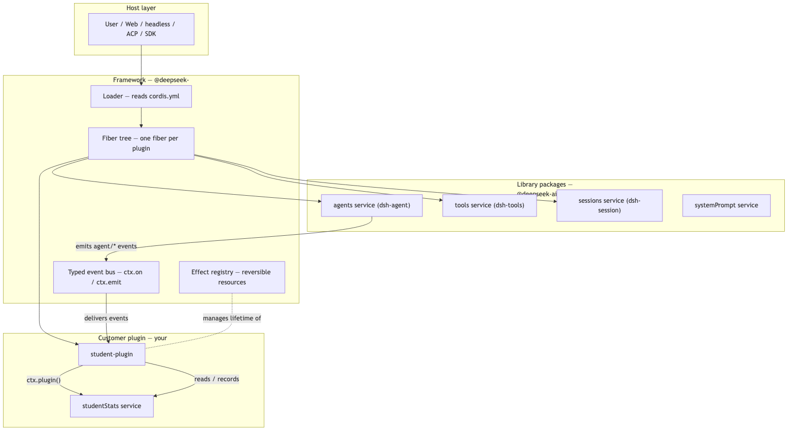
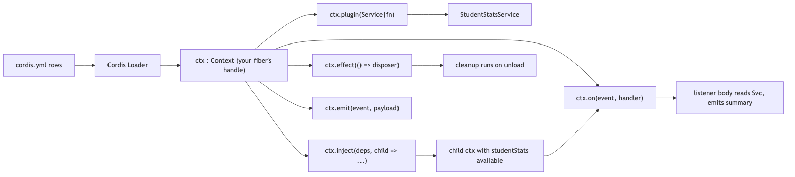
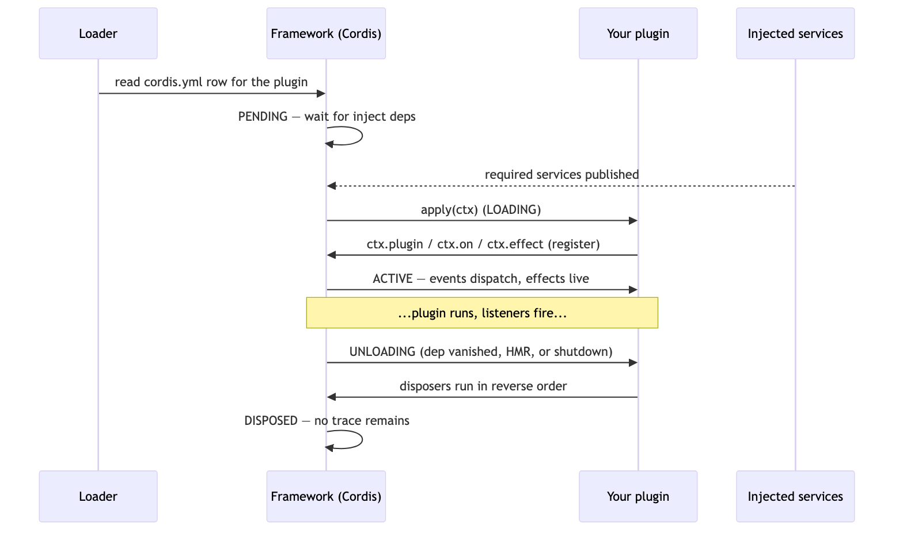

<div class="page-break" style="page-break-after: always;"></div>

# Building a DeepSeek Harness Plugin — A Student Book

*A hands-on guide to writing, wiring, and verifying a real Cordis plugin, using the `student-plugin` session-activity tracker as the worked example.*

**Author: George Hu**


---

## How to read this book

This book teaches one thing thoroughly: **how a plugin is built, how it lives inside the framework, and how it hooks into the Cordis runtime.** Every abstract idea is grounded in one plugin you can run today — a session-activity tracker that watches an agent's turns and errors and prints a summary when the session ends.

You will learn:

1. What the three layers are — **framework**, **library**, **customer plugin** — and why the harness is split that way.
2. The **plugin lifecycle**: load, inject, run effects, dispose — and the exact rules that keep it safe.
3. How to **hook a plugin into Cordis**: `apply`, `inject`, `ctx.plugin`, `ctx.on`, `ctx.effect`, services, and typed events.
4. How to **verify** the plugin by running it, not just reading it.

Each chapter answers three questions on purpose: **what** the piece owns, **how** you use it, and **why** the framework separates it from its neighbors.

---

## Part I — The mental model

### 1.1 Everything is a plugin

DeepSeek Harness is an agent harness built on a vendored copy of the **Cordis** dependency-injection framework. Its founding rule is:

> **Everything is a plugin.**

The LLM adapter is a plugin. The tool pipeline is a plugin. The agent registry is a plugin. Your feature is a plugin. There is no privileged "core" that special-cases itself; the core simply *loads first* and *publishes services* that later plugins consume.

This matters because it gives you exactly one extension model to learn. Once you can write one plugin, you can extend any part of the system, because every part is reached the same way: **depend on a service, register your effects, and let the framework manage your lifetime.**

### 1.2 Three layers: framework, library, customer plugin

When you build a plugin you are always standing on three layers. Keeping them distinct is the single most useful habit in this codebase.

| Layer | Concrete example | What it owns | Why it is separate |
|---|---|---|---|
| **Framework** | `@deepseek-ai/cordis` (vendored) | Plugin loading, dependency injection, effect/disposer lifetime, the typed event bus | It knows *nothing* about agents or LLMs. It only knows how to load code, wire dependencies, and tear them down. That neutrality is what lets everything else be a plugin. |
| **Library** | `@deepseek-ai/dsh-agent`, `dsh-tools`, `dsh-session`, … | Product capabilities published as **services** (`agents`, `tools`, `sessions`) and the **typed events** those services emit (`agent/session-start`, `agent/disposed`) | These are shared building blocks. Many plugins consume them; none of them should know about *your* feature. |
| **Customer plugin** | `student-plugin` (this book's example) | Your feature: it consumes library services, listens to library events, and publishes its own small service | It is the only layer that knows your product requirement. It is thin, reversible, and owns exactly one job. |

**The golden direction of dependency:** customer plugin → library → framework. Never the reverse. The framework must not import a library; a library must not import your plugin. If you ever feel tempted to make the framework "know about" your feature, you have misplaced a responsibility.

### 1.3 The system, at a glance



Read the arrows as *direction of control and dependency*. The loader turns a config file into a tree of fibers. Library plugins publish services and emit events. Your plugin subscribes to those events, records data into its own service, and the effect registry guarantees that when your plugin unloads, everything it created is undone.

### 1.4 The module-level picture

The system diagram shows *packages*. The module diagram shows the *runtime objects* your `apply` function touches and how they relate.



Every one of these calls is made through **`ctx`**, the `Context` object handed to your `apply(ctx)`. `ctx` is your fiber's remote control: everything you register through it is owned by your plugin and reversed when your plugin unloads. This is the whole safety story in one sentence.

---

## Part II — Anatomy of a plugin

### 2.1 What a plugin *is*

A Cordis plugin is just a module with a few well-known exports:

```ts
import type { Context } from '@deepseek-ai/cordis'

export const name = 'student-plugin'      // human-readable identity
export const inject = ['agents']          // services this plugin needs before it runs
export function apply(ctx: Context) {      // the entry point; ctx is your fiber handle
  // register everything here, through ctx
}
```

- **`name`** — identifies the plugin in logs and the fiber tree.
- **`inject`** — the list of service names your plugin *requires*. Cordis will not call your `apply` until every injected service exists, and it will **unload your plugin automatically if any injected service disappears**. This is dependency management you get for free.
- **`apply(ctx)`** — called once when the plugin loads. Its job is to *register*, not to *do*. You register services, event listeners, and effects; the framework drives them afterward.

A service (a shareable capability) is a class extending `Service`:

```ts
import { Service, type Context } from '@deepseek-ai/cordis'

export class StudentStatsService extends Service {
  constructor(ctx: Context) {
    super(ctx, 'studentStats')   // publishes ctx.studentStats for consumers
  }
  // methods here become the service's public API
}
```

Calling `super(ctx, 'studentStats')` **publishes** the service: from this moment `ctx.studentStats` is readable by any plugin that injects `'studentStats'`.

### 2.2 Registrations are effects — the core rule

The most important sentence in the whole codebase:

> **Registrations are effects.** Every contribution goes through `ctx.effect()`, `ctx.on()`, `ctx.plugin()`, or a service constructor — and each returns (or implies) a disposer.

You never manually "add" a listener to a global list. You register it through `ctx`, and the framework remembers to remove it when your fiber unloads. Concretely:

| You call | You get | On unload |
|---|---|---|
| `ctx.on(event, fn)` | a subscription | listener removed |
| `ctx.plugin(Service)` | a child fiber | service unpublished, its effects reversed |
| `ctx.effect(() => disposer)` | your own resource | your `disposer` runs |
| `super(ctx, name)` | a published service | service removed from the context |

This is why plugins are **reversible**. Unloading a plugin is not "stop calling it" — it is a genuine teardown that leaves no trace. That is what makes hot-reload, per-session composition, and clean shutdown possible.

### 2.3 Effects and the disposer contract

`ctx.effect` is how you manage *any* resource with a lifetime — a timer, a socket, a file handle, a subscription to something outside Cordis:

```ts
ctx.effect(() => {
  const timer = setInterval(tick, 1000)
  return () => clearInterval(timer)   // the disposer
})
```

The rule: **whatever you acquire in the effect body, release in the returned disposer.** If you start a timer and forget the disposer, the timer keeps firing after your plugin is gone — a "callback on a dead app" bug. The effect makes acquisition and release a single, symmetric unit that the framework runs and unwinds for you.

---

## Part III — The plugin lifecycle

### 3.1 The four phases

Every plugin moves through the same four phases. Understanding them is what separates "it works on my machine" from "it works, reloads cleanly, and never leaks."



1. **PENDING** — the loader has the plugin's config row but is waiting for every name in `inject` to exist. Your code has not run yet. If a dependency never appears, your plugin simply stays pending; it never silently runs without its dependencies.
2. **LOADING** — all dependencies are ready, so Cordis calls `apply(ctx)` exactly once. This is your *only* chance to register things. Do registration here; do not do long work here.
3. **ACTIVE** — your listeners receive events, your effects are live, your service answers calls. The framework drives everything; you react.
4. **UNLOADING → DISPOSED** — triggered by a dependency disappearing, a hot-reload, or app shutdown. Every effect disposer and every registration is reversed, in **reverse order of creation**, so teardown mirrors setup.

### 3.2 Why `inject` gives you free safety

Because Cordis holds your plugin in PENDING until dependencies exist and unloads it when they vanish, you never have to write defensive code like `if (ctx.agents) { ... }`. Inside `apply`, an injected service is guaranteed present. This is the framework earning its keep: **dependency lifetime is managed, not asserted.**

### 3.3 The subtle rule: you cannot inject a service you provide (at the same level)

Here is a real trap that this book's example hit — and the correct fix.

Our `student-plugin` both **provides** `studentStats` (via `ctx.plugin(StudentStatsService)`) and **consumes** it (its listeners read `ctx.studentStats`). If you naively write `inject = ['agents', 'studentStats']`, you deadlock: the plugin waits for a service that only *it* will publish, but it can't publish until it runs, and it won't run until the service exists.

The correct pattern is to **mount the service, then read it back inside a nested `ctx.inject` child** that waits for it:

```ts
export const inject = ['agents']              // only external deps here

export function apply(ctx: Context) {
  ctx.plugin(StudentStatsService)             // publish our own service

  ctx.inject(['studentStats'], (self) => {     // child ctx that waits for it
    self.on('agent/session-start', ({ agent, source }) => {
      self.studentStats.start(agent.id, source)
    })
    // ... more listeners, all using `self`, not `ctx`
  })
}
```

`ctx.inject(names, child => {...})` creates a **child fiber** that becomes active only once `names` are published. Inside the callback, `self` is a context on which those services are guaranteed readable. If the service is later disposed, the child unloads first — teardown stays ordered. This is the idiomatic way for a plugin to consume a service it also provides.

### 3.4 Ordering and the async gap

One consequence of 3.3: the listeners live inside a child fiber that activates *asynchronously* (it waits for `studentStats`). So if some other plugin emits `agent/session-start` in the very same synchronous tick that everything loads, your listeners may not be wired yet. In production the agent registry emits these events long after load, so this is a non-issue. But in a smoke test that drives events by hand, you must defer your first emission to the next tick so all injected children are ready. We do exactly that in Chapter 6.

---

## Part IV — Hooking into Cordis

### 4.1 The four hook verbs

You attach your plugin to the running system with four verbs, all on `ctx`:

| Verb | Purpose | Direction |
|---|---|---|
| `ctx.plugin(x)` | mount a child plugin or service | you → framework (register a provider) |
| `ctx.inject(names, cb)` | run `cb` once `names` exist; `cb` gets a context where they are readable | framework → you (dependency gate) |
| `ctx.on(event, fn)` | subscribe to a typed event | library → you (react to state) |
| `ctx.emit(event, payload)` | publish a typed event | you → anyone listening |

Everything the `student-plugin` does is a combination of these four verbs plus the service class. That is the entire surface area.

### 4.2 Consuming library events

The `dsh-agent` library publishes the `agents` service **and declares a family of typed events** describing an agent's life:

| Event | Fires when | Payload you use |
|---|---|---|
| `agent/session-start` | a session begins (startup, resume, clear, compact) | `{ agent, source }` |
| `agent/turn-stopping` | a turn reaches its stop boundary | `{ agent, turn }` |
| `agent/error` | a step or turn errored | `{ agent, turn, step, error }` |
| `agent/disposed` | the agent left the registry — the real "session ended" signal | `{ agent }` |

A crucial lesson from building this plugin: **there is no `agent/session-end` event.** An early draft listened for one, and that listener silently never fired. The real end-of-session signal is `agent/disposed`. When you consume a library's events, read the library's declared event map — do not guess names. A subscription to an undeclared event is dead code that the compiler cannot always catch across declaration merges.

### 4.3 Publishing your own typed event

Events are **typed** through TypeScript declaration merging. To add your own event, merge it into Cordis's `Events` interface, and merge your service onto `Context`:

```ts
declare module '@deepseek-ai/cordis' {
  interface Context {
    studentStats: StudentStatsService              // makes ctx.studentStats typed
  }
  interface Events {
    'student/session-summary'(summary: SessionSummary): void   // typed emit + on
  }
}
```

After this, both `ctx.emit('student/session-summary', s)` and `ctx.on('student/session-summary', s => ...)` are fully type-checked. Any plugin can subscribe to your summary without importing your module — they only need the type. This is the capability model in miniature: **communicate through typed services and events, not direct imports.**

---

## Part V — The complete plugin, explained line by line

Below is the finished `student-plugin.ts`. Read it top to bottom; the annotations tie each piece back to the concepts above.

```ts
import { Service, type Context } from '@deepseek-ai/cordis'

/** One agent's running activity record. */
interface SessionRecord {
  agentId: string
  source: string
  startedAt: number
  turns: number
  errors: number
}

/** A finished session's summary, emitted on `student/session-summary`. */
export interface SessionSummary extends SessionRecord {
  endedAt: number
  durationMs: number
}

// (4.3) Publish typed surfaces: a service on Context, an event on Events.
declare module '@deepseek-ai/cordis' {
  interface Context {
    studentStats: StudentStatsService
  }
  interface Events {
    'student/session-summary'(summary: SessionSummary): void
  }
}

// (2.1) A service: shareable capability, published by super(ctx, name).
export class StudentStatsService extends Service {
  private readonly live = new Map<string, SessionRecord>()

  constructor(ctx: Context) {
    super(ctx, 'studentStats')
  }

  start(agentId: string, source: string): void {
    this.live.set(agentId, { agentId, source, startedAt: Date.now(), turns: 0, errors: 0 })
  }
  recordTurn(agentId: string): void {
    const r = this.live.get(agentId); if (r) r.turns += 1
  }
  recordError(agentId: string): void {
    const r = this.live.get(agentId); if (r) r.errors += 1
  }
  finish(agentId: string): SessionSummary | undefined {
    const r = this.live.get(agentId); if (!r) return undefined
    this.live.delete(agentId)
    const endedAt = Date.now()
    return { ...r, endedAt, durationMs: endedAt - r.startedAt }
  }
  snapshot(): SessionRecord[] {
    return [...this.live.values()].map(r => ({ ...r }))
  }
}

export const name = 'student-plugin'
// (3.3) Only EXTERNAL deps here. studentStats is ours; we read it back below.
export const inject = ['agents']

export function apply(ctx: Context) {
  ctx.plugin(StudentStatsService)                 // (4.1) publish our service

  ctx.inject(['studentStats'], (self) => {         // (3.3) wait for our own service
    self.on('agent/session-start', ({ agent, source }) => {   // (4.2) consume
      self.studentStats.start(agent.id, source)
    })
    self.on('agent/turn-stopping', ({ agent }) => {
      self.studentStats.recordTurn(agent.id)
    })
    self.on('agent/error', ({ agent }) => {
      self.studentStats.recordError(agent.id)
    })
    // (4.2) agent/disposed is the REAL end-of-session signal.
    self.on('agent/disposed', ({ agent }) => {
      const summary = self.studentStats.finish(agent.id)
      if (!summary) return
      self.emit('student/session-summary', summary)  // (4.3) publish our event
      const seconds = (summary.durationMs / 1000).toFixed(1)
      console.log(
        `[student] session end: ${summary.agentId} — ` +
          `${summary.turns} turn(s), ${summary.errors} error(s) over ${seconds}s`,
      )
    })
  })
}
```

**Why this design and not the noisy first draft?** The original demo logged on every event and ran a 1-second `setInterval`. That taught nothing and leaked a timer if unloaded without a disposer. The version above:

- does **real work** (tracks turns/errors/lifetime) instead of printing heartbeat lines;
- exposes a **typed service** so other plugins can query live sessions or subscribe to summaries — reinforcing the capability seam;
- fixes a **latent bug** (the dead `agent/session-end` listener → `agent/disposed`);
- holds **no timer**, so there is nothing to leak; its only resources are event subscriptions the framework reverses automatically.

---

## Part VI — Wiring it into a runnable profile and verifying it

Reading a plugin is not believing it. This chapter shows how we ran it.

### 6.1 A profile is a list of plugins

Cordis reads a `cordis.yml`: an ordered list of plugin rows. To run our plugin honestly we need the `agents` service present (it provides both the service and the `agent/*` event types), so the smoke profile is:

```yaml
- id: logger
  name: '@deepseek-ai/cordis-plugin-logger-console'
- id: agents
  name: '@deepseek-ai/dsh-agent'      # publishes `agents` + agent/* event types
- id: student-plugin
  name: ../student-plugin.ts
- id: student-smoke
  name: ./student-smoke.ts            # a driver that emits one session's events
```

`@deepseek-ai/dsh-agent` publishes the `agents` service in its service constructor and only *defers* its heavier typert wiring, so it loads without the full session/driver stack — enough to make our listeners active and the event types available.

### 6.2 A driver plugin to exercise the events

The real agent registry needs sessions and a driver, which the tutorial deliberately does not reproduce. So a tiny **driver plugin** emits the exact lifecycle events against a minimal agent stub, deferring the first emission to the next tick (see 3.4) so the injected child is wired first:

```ts
export const name = 'student-smoke'
export const inject = ['agents', 'studentStats']

export function apply(ctx: Context) {
  ctx.effect(() => {
    const a = { id: 'agent-smoke-1' }
    const emit = (e, p) => (ctx as any).emit(e, p)

    ctx.on('student/session-summary', (summary) => {
      console.log('[smoke] received summary event:', JSON.stringify(summary))
      setTimeout(() => process.exit(0), 50)
    })

    const timer = setTimeout(() => {                 // (3.4) defer past load tick
      emit('agent/session-start', { agent: a, source: 'startup' })
      emit('agent/turn-stopping', { agent: a, turn: 1, signal: new AbortController().signal })
      emit('agent/turn-stopping', { agent: a, turn: 2, signal: new AbortController().signal })
      emit('agent/error', { agent: a, turn: 2, step: 0, error: new Error('boom') })
      emit('agent/disposed', { agent: a })
    }, 100)

    return () => clearTimeout(timer)                 // (2.3) symmetric disposer
  })
}
```

### 6.3 Running it

`cordis`'s `bin.js` reads `./cordis.yml`, so a small script swaps in the smoke profile, runs, and restores the default:

```bash
node --import tsx ../../../vendor/cordis/bin.js
```

### 6.4 The verified output

```
[student] session start: agent-smoke-1 (startup)
[smoke] live snapshot: [{"agentId":"agent-smoke-1","source":"startup","turns":2,"errors":1}]
[smoke] received summary event: {"agentId":"agent-smoke-1",...,"turns":2,"errors":1,"durationMs":1}
[student] session end: agent-smoke-1 — 2 turn(s), 1 error(s) over 0.0s
```

The service tracked **2 turns and 1 error** from real `agent/*` events, emitted the typed `student/session-summary`, printed the tidy end-of-session line, and exited cleanly. The plugin holds no timer, so nothing leaks on unload.

---

## Part VII — Checklist and next steps

### 7.1 A plugin review checklist

Before you call any plugin "done," verify each line:

- [ ] `inject` lists **only external** services; services you provide are read via a nested `ctx.inject`.
- [ ] Every resource acquired in an `ctx.effect` body is released in its disposer.
- [ ] Every `ctx.on` subscribes to a **declared** event name (checked against the library's event map).
- [ ] New services and events are merged into `Context` / `Events` so consumers are type-checked.
- [ ] The plugin does **registration** in `apply`, not long-running work.
- [ ] You ran it in a profile and observed the behavior, not only the code.
- [ ] Unloading leaves no trace (no timers, sockets, or listeners survive).

### 7.2 Where to go next

- Add a **tool** the model can call, so your service is reachable from an agent turn.
- Turn the plugin into a real package under `packages/`, with unit tests and a keyless snapshot of the assembled transcript.
- Read the subsystem references for the exact service types, events, and failure semantics of each capability you consume.

The pattern never changes: **depend on a service, register your effects through `ctx`, react to typed events, and let the framework own your lifetime.** Master that loop once, and every corner of the harness is open to you.

---

*Worked example, diagrams, and verified output produced while building the `student-plugin` session-activity tracker in the DeepSeek Harness Cordis tutorial.*
