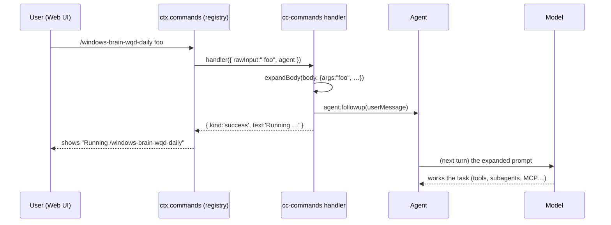

# Native Claude Code Plugin Support for DeepSeek Harness — A Deep Dive

*A build-it-from-scratch book. Assumes zero prior knowledge of DeepSeek Harness. Uses the real `windows-brain` plugin as the running example.*

---

## How to read this book

You will build, from nothing, the machinery that lets a **Claude Code plugin** run **natively** on **DeepSeek Harness** — its skills, slash commands, subagents, MCP servers, and hooks — and use it live from the Web UI.

The book is in five parts:

- **Part I — Foundations.** What DSH *is*, the one idea (everything is a plugin), and the five "seams" a Claude Code plugin needs to plug into.
- **Part II — The mapping.** For each Claude Code part, exactly which DSH seam receives it, and why.
- **Part III — Building it from scratch.** Step by step, with real code: the `cc-commands` plugin, the row generators, the bundle, the one core change.
- **Part IV — Running windows-brain.** Assembling everything into a profile and driving it from the Web UI.
- **Part V — Extending it.** How to add new mappings, and where the deliberate gaps are.

Every code block, path, and command in this book is real and lives in the repository. When you see a path like `packages/hooks/cc-commands/src/index.ts`, you can open it.

**Conventions**
- 🧩 = a concept you must hold in your head afterward.
- 🔨 = a hands-on step you can run.
- ⚠️ = a trap that will cost you an hour if you miss it.

---

# Part I — Foundations

## Chapter 1. What is DeepSeek Harness?

DeepSeek Harness (DSH) is an **agent harness**: the program that sits between a large language model and the real world. The model produces text and *tool calls*; the harness runs those tool calls (read a file, run a shell command, search the web), feeds the results back, and loops until the task is done. That loop — model → tool → result → model — is the beating heart of every coding agent.

```
        ┌─────────────────────────────────────────────┐
        │                  DSH harness                 │
        │                                              │
  you → │  [session] → [agent loop] → [LLM provider] → │ → model
        │       ↑            │                         │
        │       │            ▼                         │
        │   [tools: read, bash, web_search, …] ────────│ → real world
        │                                              │
        └─────────────────────────────────────────────┘
```

What makes DSH unusual is *how* it is built. It is not a monolith with a plugin folder bolted on. **Everything in DSH is a plugin** — the session store, the tool registry, the LLM adapter, even the agent loop's helpers. They are assembled at startup from a configuration file. Nothing is special-cased.

🧩 **The one idea.** *Everything is a plugin, and plugins are assembled from configuration.* Hold onto this; the entire Claude Code integration is just "write a few more plugins and list them in the configuration."

### 1.1 The building blocks: Cordis, context, and effects

DSH is built on a small dependency-injection runtime called **Cordis** (vendored under `vendor/cordis`). You only need three concepts from it.

**1. The context (`ctx`).** Every plugin receives a `ctx` object. Through it a plugin reaches *services* other plugins provide — `ctx.commands`, `ctx.tools`, `ctx.skills`, `ctx.subagents`, and so on. Think of `ctx` as the switchboard.

**2. A plugin is a function (or a module with an `apply` function).** It receives `ctx` and a validated `config`, and it *registers* things:

```ts
// The shape every DSH function-plugin follows.
export const name = 'my-plugin'          // its Cordis name
export const inject = ['commands']       // services it needs BEFORE it runs
export interface Config { /* … */ }      // its typed configuration
export const Config: z<Config> = /* … */ // the runtime schema (schemastery `z`)
export function apply(ctx: Context, config: Config): void {
  // register effects here
}
```

**3. Registrations are effects, and effects return disposers.** When a plugin registers a command, that registration is an *effect*; tearing the plugin down runs the disposer, which unregisters the command. This is why DSH can hot-reload plugins without leaks.

```ts
// register() returns the exact disposer that undoes it.
const dispose = ctx.commands.register({ name: 'hello', /* … */ })
// later, on teardown:
dispose()   // the command is gone; no trace left
```

⚠️ **Trap — the missing `inject`.** If your plugin uses `ctx.commands` but does not list `'commands'` in `inject`, it may run before the commands service exists and crash. `inject` is a promise: "do not apply me until these services are present."

⚠️ **Trap — the stray `default` export.** DSH's plugin loader unwraps a module's exports. A stray `export default` makes it drop your `inject`/`Config`. Use *named* exports only.

### 1.2 How plugins get assembled: the Loader and `cordis.yml`

At startup, a **Loader** reads a configuration tree — conceptually a list of rows, each naming a plugin package and its config — and applies them one by one. In its simplest form:

```yaml
# cordis.yml — a list of plugins to load, each with config
- name: '@deepseek-ai/dsh-session'
  config: { /* … */ }
- name: '@deepseek-ai/dsh-mcp-client'
  config:
    serverName: kusto
    command: agency
    args: [mcp, kusto]
```

The Loader supports one power feature you will use constantly: **`!!js` expressions**. A value tagged `!!js` is evaluated as JavaScript at load time. This is how a static file can read the environment:

```yaml
config:
  pluginRoot: !!js process.env.CC_PLUGIN_ROOT
```

🧩 **`!!js` is the bridge between a static file and the running machine.** It lets one shipped configuration serve any plugin, by reading `CC_PLUGIN_ROOT` at boot instead of hard-coding a path.

## Chapter 2. Bundles and profiles — configuration you can ship

Writing a giant `cordis.yml` by hand does not scale. DSH layers two abstractions on top.

**A bundle** is an npm package that ships a *patch* — a list of rows to add or modify — in a static file `cordis.patch.yml`, declared in its `package.json`:

```json
{
  "name": "@deepseek-ai/dsh-base",
  "dsh": { "bundle": { "patch": "./cordis.patch.yml" } }
}
```

**A profile** is a directory (under `$DSH_HOME/profiles/<name>`, default `~/.dsh/profiles/<name>`) whose `package.json` lists an ordered set of bundles, plus its *own* `cordis.patch.yml`:

```json
{
  "name": "dsh-profile-web",
  "dsh": { "profile": { "bundles": [
    "@deepseek-ai/dsh-base",
    "@deepseek-ai/dsh-web-app"
  ] } }
}
```

The composition rule is precise and worth memorizing:

```
final config  =  bundle[0].patch
              →  bundle[1].patch          (applied in order)
              →  …
              →  bundle[n].patch
              →  the profile's OWN cordis.patch.yml   (applied LAST)
```

Each patch is a list of operations; the common one is `insert`, which adds rows. **Rows are keyed by `id`, and later layers win** ("last-write-wins per row id"). So the profile's own patch can override anything a bundle set.

```
   base bundle           web-app bundle          profile patch
   ┌──────────┐          ┌──────────┐            ┌──────────┐
   │ id: sess │          │ id: web  │            │ id: mcp… │
   │ id: tools│   ──►     │ id: …    │    ──►      │ id: agnt…│
   └──────────┘          └──────────┘            └──────────┘
        └──────────────── merged by id, later wins ─────────┘
```

🧩 **This two-layer split is the crux of the whole design.** A bundle's patch is *static* — perfect for rows that never change. But a plugin has an *unknown number* of MCP servers and subagents. A static file cannot write "N rows I don't know yet." So those go into the **profile's** patch, generated per plugin. Remember this; Part III is built on it.

## Chapter 3. The five seams a Claude Code plugin needs

A Claude Code (CC) plugin is a directory with up to five kinds of contribution. DSH already has an extension point — a **seam** — for each. A seam is a named capability on `ctx`, provided by some plugin, that your rows can attach to.

| CC part | Files | DSH seam | What it does |
|---|---|---|---|
| Skills | `skills/*/SKILL.md` | `ctx.skills` | reusable reference docs the model can load on demand |
| Commands | `commands/*.md` | `ctx.commands` | slash commands (`/name`) in the UI |
| Subagents | `agents/*.md` | `ctx.subagents` (via `tool-subagent`) | delegate work to a scoped child agent |
| MCP servers | `.mcp.json` | `ctx.tools` (via `mcp-client`) | external tool servers over the Model Context Protocol |
| Hooks | `hooks/hooks.json` | `ctx.hook` (via `hooks-claude-code`) | lifecycle callbacks |

🧩 **The integration adds almost no new machinery.** Four of the five seams already exist and already do the right thing. Our job is mostly *translation*: turn each CC file into the row shape its seam expects. Only **commands** need a genuinely new plugin, because a CC command is a *prompt* and DSH commands do not natively inject prompts. That is Chapter 6.

### The running example: windows-brain

Throughout the book we use George Hu's **windows-brain** plugin — a Windows quality-investigation orchestrator. Its inventory (real, counted from the plugin):

- **21 commands** (`wqd-daily`, `qr360`, `watson-anomaly`, …)
- **14 subagents** (`brain`, `watson-crash-analyst`, `findings-reviewer`, …)
- **8 MCP servers** (`watson`, `kusto`, `starrocks`, `wexp`, `ado`, `bluebird`, `icm-mcp`, `titan`)
- **30 skills**
- **no hooks**

By the end you will run all of it from the Web UI.

---

# Part II — The mapping, seam by seam

Before writing code, understand precisely what each seam expects. This part is the specification; Part III implements it.

## Chapter 4. Skills → `skill-filesystem`

The simplest seam. A skill is a folder with a `SKILL.md`; the model can ask to read it when relevant. DSH ships a provider, `@deepseek-ai/dsh-skill-filesystem`, that **discovers every `SKILL.md` under directories you give it**.

So the entire skills contribution is *one row* pointing the provider at the plugin's `skills/` directory:

```yaml
- id: cc-skills
  name: '@deepseek-ai/dsh-skill-filesystem'
  config:
    customSkillDirs: [ "<pluginRoot>/skills" ]
```

There is nothing per-skill to generate — the provider scans the directory itself. `includeDefaultRoots` stays at its default `true`, so the plugin's skills *add to* the deployment's own skills rather than replacing them.

## Chapter 5. MCP servers → `mcp-client`

A CC plugin declares external tool servers in `.mcp.json`:

```json
{
  "mcpServers": {
    "kusto": { "type": "local", "command": "agency",
               "args": ["mcp", "kusto"], "tools": ["kusto_query"] }
  }
}
```

DSH ships `@deepseek-ai/dsh-mcp-client`: **one instance connects to one MCP server** and publishes its tools onto `ctx.tools`. The translation of the entry above:

```yaml
- id: mcp-kusto
  name: '@deepseek-ai/dsh-mcp-client'
  config:
    transport: stdio          # CC "local"/"stdio" → stdio; "http"/"sse" → streamable-http
    serverName: kusto
    command: agency
    args: [mcp, kusto]
    allowedTools: [kusto_query]   # ← from the server's `tools:` list
```

🧩 **One server = one row.** The count is unknown until you read the file, which is exactly why these rows are *generated into the profile*, not shipped in the bundle (Chapter 2's rule).

### 5.1 The one core change: `allowedTools`

A CC server's `tools:` array is an **allowlist** — only those tools should be exposed. Before this integration, `mcp-client` had no way to express that. So the integration adds *one* field to the core plugin. This is the entire runtime change to DSH itself; everything else is new plugins and generators.

In `packages/mcp/mcp-client/src/tools.ts`:

```ts
/** Whether a server tool passes the configured allowlist. */
export function toolAllowed(rawName: string, allowlist: readonly string[]): boolean {
  return allowlist.some(pattern =>
    pattern.endsWith('*')
      ? rawName.startsWith(pattern.slice(0, -1))   // trailing '*' → prefix match
      : pattern === rawName)                        // otherwise exact
}
```

A lone `'*'` falls out for free: `slice(0, -1)` is `''`, and every name starts with the empty string, so `['*']` allows all.

and, where tools are synced onto the registry:

```ts
if (opts.allowedTools !== undefined && !toolAllowed(tool.name, opts.allowedTools)) continue
```

Filtering **at connect time** means a disallowed tool never reaches the tool registry, and therefore never reaches the model or the session log. That respects DSH's rule *model-visible ⟺ logged*: nothing appears to the model that isn't reconstructable from the log.

## Chapter 6. Commands → the new `cc-commands` plugin

Here is the one seam that needs new code, and understanding *why* is the intellectual core of the book.

A CC command file is a **prompt with frontmatter**:

```markdown
---
description: Daily WQD digest …
argument-hint: "[failure family]"
---
YOU are the WQD-Daily orchestrator. … Failure family: $ARGUMENTS
```

In Claude Code, running `/wqd-daily foo` *sends that prompt to the model* with `$ARGUMENTS` replaced by `foo`.

But a **DSH command does not send anything to the model.** Look at what a DSH command handler is:

```ts
readonly handler: (invocation: CommandInvocation) => CommandResult | Promise<CommandResult>
```

It returns a `CommandResult` — `{ kind: 'success', text }` — which the UI *renders*. It runs *against* the agent but does not, by itself, start a model turn. DSH commands are for deterministic actions (pause a goal, compact the context), not for "say this to the model."

🧩 **The mismatch.** CC command = "inject this prompt as my turn." DSH command = "run this handler and show its result." To bridge them we need the handler to *inject a user turn*.

The bridge exists: an agent has a `followup(message)` method that queues a user message as the next turn — the same mechanism the built-in `/goal` command uses to attach images. So a CC command's handler will:

1. Expand the body (`$ARGUMENTS`, `${CLAUDE_PLUGIN_ROOT}`, `${CLAUDE_PROJECT_DIR}`).
2. Call `invocation.agent.followup(<expanded prompt as a user message>)`.
3. Return a tiny UI echo like `Running /wqd-daily`.

### 6.1 The naming problem

DSH command names must match `/^[a-z][a-z0-9_-]*$/` — **no colons.** Claude Code names commands `<plugin>:<name>` (e.g. `windows-brain:wqd-daily`). That colon is illegal in DSH.

So we *coerce*: `windows-brain:wqd-daily` becomes `/windows-brain-wqd-daily`. The rule (implemented in Chapter 9): join `<pluginName>-<file>`, lowercase, fold illegal characters to `-`, and prefix `cc-` if the result would not start with a letter.

## Chapter 7. Subagents → `tool-subagent`

A CC agent file is a persona with a tool allowlist:

```markdown
---
name: findings-reviewer
description: Independent reviewer that attacks the investigation findings…
tools: Read
---
You are an independent reviewer. Your job is to ATTACK the investigation story…
```

DSH ships `@deepseek-ai/dsh-tool-subagent`: it exposes a **tool** that delegates to a child agent. Its per-instance `Config` already has exactly the fields we need:

```ts
export interface Config {
  provider: string                 // which subagent provider (spawn, acp, …)
  toolName?: string                // the tool name the model calls
  persona?: string                 // the child's system prompt
  toolFilter?: { allow?: string[] }// restrict the child's tools
  // …
}
```

So each agent becomes one row:

```yaml
- id: agent-findings-reviewer
  name: '@deepseek-ai/dsh-tool-subagent'
  config:
    provider: spawn
    toolName: findings-reviewer
    toolFilter: { allow: [read] }        # CC "Read" → DSH "read"
    persona: |-
      You are an independent reviewer. …
```

🧩 **The seam is unchanged.** We add *zero* code to `tool-subagent`. We only translate agent files into its existing config. The tool scope (`tools: Read`) becomes `toolFilter.allow: [read]`, which the provider *enforces* by restricting the child's tool registry — not by asking the model nicely.

The CC→DSH tool-name map (from `cc-subagents.mjs`):

```
Read→read  Write→write  Edit→edit  Bash→bash
Grep→grep  Glob→glob    WebSearch→web_search  WebFetch→web_fetch
```

## Chapter 8. Hooks → `hooks-claude-code`

Hooks are lifecycle callbacks defined in `hooks/hooks.json`. DSH ships `@deepseek-ai/dsh-hooks-claude-code` to run the Claude Code command-hook subset. windows-brain ships **no** hooks, so this row must be *conditionally disabled* — present but inert unless the file exists. We will express that with a `!!js` guard in the bundle (Chapter 11).

---

# Part III — Building it all from scratch

Now we implement the mapping. We build in dependency order: the one core field (done in Chapter 5), the `cc-commands` plugin, the row generators, then the bundle that ties them together.

## Chapter 9. Building the `cc-commands` plugin

This is a real DSH package at `packages/hooks/cc-commands/`. We build it file by file.

### 9.1 The package skeleton

Every DSH package has this shape:

```
packages/hooks/cc-commands/
  src/
    index.ts        # the plugin + pure helpers
    types.ts        # types only
    invariant.ts    # the package's runtime-invariant companion
  tests/
    cc-commands.spec.ts
  package.json
  tsconfig.json
  README.md  README.zh.md  README.i18n.yaml
```

### 9.2 `types.ts` — the data shapes

Types first, so the logic has something to speak in:

```ts
/** One loaded Claude Code command definition. */
export interface CcCommand {
  readonly name: string          // DSH command name: <pluginName>-<file>
  readonly description: string   // from frontmatter `description`
  readonly argumentHint?: string // from frontmatter `argument-hint`
  readonly body: string          // the prompt body after the frontmatter
}

/** The values substituted into a command body during expansion. */
export interface ExpansionVars {
  readonly args: string          // → $ARGUMENTS
  readonly pluginRoot: string    // → ${CLAUDE_PLUGIN_ROOT}
  readonly projectDir: string    // → ${CLAUDE_PROJECT_DIR}
}
```

### 9.3 The pure helpers

Keep the logic pure (no `ctx`, no filesystem where avoidable) so it is trivially testable. Four helpers.

**Parse frontmatter** — split a leading `--- … ---` block into fields and body:

```ts
const FRONTMATTER = /^---\s*\n([\s\S]*?)\n---\s*\n?/

export function parseFrontmatter(text: string): { data: Record<string, string>; body: string } {
  const normalized = text.replace(/\r\n/g, '\n')   // tolerate CRLF
  const match = FRONTMATTER.exec(normalized)
  if (match === null) return { data: {}, body: normalized }
  const data: Record<string, string> = {}
  for (const line of (match[1] ?? '').split('\n')) {
    const kv = /^([\w-]+):\s*(.*)$/.exec(line)
    if (kv !== null && kv[1] !== undefined) data[kv[1]] = (kv[2] ?? '').replace(/^["']|["']$/g, '')
  }
  return { data, body: normalized.slice(match[0].length) }
}
```

**Expand variables** — the three substitutions:

```ts
export function expandBody(body: string, vars: ExpansionVars): string {
  return body
    .replaceAll('$ARGUMENTS', vars.args)
    .replaceAll('${CLAUDE_PLUGIN_ROOT}', vars.pluginRoot)
    .replaceAll('${CLAUDE_PROJECT_DIR}', vars.projectDir)
}
```

**Coerce the name** — the colon problem from Chapter 6.1:

```ts
export function commandName(pluginName: string, base: string): string {
  const raw = `${pluginName}-${base}`.toLowerCase()
    .replace(/[^a-z0-9_-]+/g, '-')   // fold illegal chars
    .replace(/-{2,}/g, '-')          // collapse runs
    .replace(/^-+|-+$/g, '')         // trim edges
  return /^[a-z]/.test(raw) ? raw : `cc-${raw}`   // must start with a letter
}
```

**Load the directory** — read every `commands/*.md`:

```ts
export function loadCommands(pluginRoot: string, pluginName: string): CcCommand[] {
  const dir = join(pluginRoot, 'commands')
  if (!existsSync(dir)) return []                  // no commands → nothing, not an error
  return readdirSync(dir)
    .filter(file => file.endsWith('.md'))
    .map((file) => {
      const { data, body } = parseFrontmatter(readFileSync(join(dir, file), 'utf8'))
      const base = basename(file, '.md')
      return {
        name: commandName(pluginName, base),
        description: data.description ?? `Claude Code command ${base}`,
        ...data['argument-hint'] !== undefined ? { argumentHint: data['argument-hint'] } : {},
        body,
      }
    })
}
```

### 9.4 The bridge: building the injected message

This is the heart — turn a command + user input into the user turn to inject. It is pure: no agent, no registry, so a test can assert exactly what gets injected.

```ts
import { createUserMessage } from '@deepseek-ai/dsh-llm'

export function buildInjectedMessage(
  command: CcCommand,
  rawInput: string,
  vars: { pluginRoot: string; projectDir: string },
): ReturnType<typeof createUserMessage> {
  const text = expandBody(command.body, {
    args: rawInput.trim(),
    pluginRoot: vars.pluginRoot,
    projectDir: vars.projectDir,
  })
  return createUserMessage({
    content: [{ type: 'text', text }],
    source: { kind: 'user' },        // it is the user's turn, semantically
  })
}
```

### 9.5 The plugin itself: `name`, `inject`, `Config`, `apply`

Now the DSH plugin shell. Note the imports: `z` comes from `@deepseek-ai/schemastery` (⚠️ *not* from cordis — a common mistake).

```ts
import type { Context } from '@deepseek-ai/cordis'
import z from '@deepseek-ai/schemastery'
import type { CommandInvocation, CommandResult } from '@deepseek-ai/dsh-commands'

export const name = 'cc-commands'
export const inject = ['commands']       // needs ctx.commands before applying

export interface Config {
  pluginRoot: string                     // required
  pluginName?: string                    // defaults to basename(pluginRoot)
  projectDir?: string                    // defaults to process.cwd()
}
export const Config: z<Config> = z.object({
  pluginRoot: z.string().required(),
  pluginName: z.string(),
  projectDir: z.string(),
})

export function apply(ctx: Context, config: Config): void {
  const pluginRoot = config.pluginRoot
  const pluginName = config.pluginName ?? basename(pluginRoot)
  const projectDir = config.projectDir ?? process.cwd()
  const commands = loadCommands(pluginRoot, pluginName)

  for (const command of commands) {
    ctx.commands.register({
      name: command.name,
      description: command.description,
      ...command.argumentHint !== undefined ? { input: { hint: command.argumentHint } } : {},
      handler: (invocation: CommandInvocation): CommandResult => {
        invocation.agent.followup(
          buildInjectedMessage(command, invocation.rawInput, { pluginRoot, projectDir }),
        )
        return { kind: 'success', text: `Running /${command.name}` }
      },
    })
  }
}
```

Read the handler carefully — it is the whole idea in five lines:

```
   /windows-brain-wqd-daily foo
              │
              ▼   invocation.rawInput = " foo"
   buildInjectedMessage(command, " foo", vars)
              │   expands $ARGUMENTS → "foo", ${CLAUDE_PLUGIN_ROOT} → …
              ▼
   agent.followup(userMessage)   ← the prompt becomes the next model turn
              │
              ▼
   return { kind: 'success', text: 'Running /windows-brain-wqd-daily' }   ← UI echo only
```

⚠️ **Why the handler both injects *and* returns.** The return value is *only* what the UI shows. The real work is the `followup`. If you forget the `followup`, the command "succeeds" but nothing reaches the model.

### 9.6 The flow, end to end



## Chapter 10. Building the row generators

Skills is one static row (Chapter 4). But **MCP servers and subagents produce an unknown number of rows** — so we generate them. These generators are plain Node scripts (only built-in modules), living in the bundle's `scripts/`. They are *dev tooling*, not runtime plugins: their output is a reviewable YAML row you can read and edit.

### 10.1 `.mcp.json` → `mcp-client` rows

The generator `scripts/cc-mcp-to-cordis.mjs` reads `.mcp.json` and emits one row per server. Its core translation function:

```js
function buildRow(name, raw, namespace) {
  const serverName = namespace ? `${namespace}-${name}` : name
  if (!SERVER_NAME.test(serverName))           // /^[A-Za-z0-9_-]{1,32}$/
    return { skip: `serverName "${serverName}" is not [A-Za-z0-9_-]{1,32}` }

  const allowedTools = normalizeAllowlist(raw?.tools)   // ["*"]/[]/absent → undefined

  const stdio = () => ({ row: {
    transport: 'stdio', serverName, command: raw.command,
    ...raw.args ? { args: raw.args } : {},
    ...raw.env  ? { env: raw.env }  : {},
    ...allowedTools ? { allowedTools } : {},
  }})
  const http = () => ({ row: {
    transport: 'streamable-http', serverName, url: raw.url,
    ...raw.headers ? { headers: raw.headers } : {},
    ...allowedTools ? { allowedTools } : {},
  }})

  const type = raw?.type
  if (type === 'local' || type === 'stdio') return stdio()
  if (type === 'http'  || type === 'sse')   return http()
  if (raw?.command) return stdio()          // command without a type → stdio
  if (raw?.url)     return http()
  return { skip: `entry "${name}" has neither command nor url` }
}
```

Notice the deliberate details:
- Keys starting with `_` are **documentation comments** in `.mcp.json` and are skipped (windows-brain uses `_kusto_note`, `_ado_note`, …).
- `allowedTools` collapses `["*"]`, `[]`, and absent to "expose everything" (field omitted).
- CC auth fields (`authScope`) have **no DSH counterpart**, so they are *dropped with a per-row comment* — the generator never silently loses auth intent; you re-supply it via `env`/`headers`.

Run it on windows-brain:

```sh
node packages/bundle/claude-code-plugin/scripts/cc-mcp-to-cordis.mjs \
  /path/windows-brain/plugin/.mcp.json
```

```yaml
# Generated from …/.mcp.json
# 8 mcp-client row(s)
- id: mcp-watson
  name: '@deepseek-ai/dsh-mcp-client'
  config:
    transport: stdio
    serverName: watson
    command: agency
    args:
      - mcp
      - remote
      - "--url"
      - "https://mcp.watson.azure.com/"
# … 7 more
```

### 10.2 `agents/*.md` → `tool-subagent` rows

`scripts/cc-subagents.mjs` reads each agent file and emits a `tool-subagent` row. Its frontmatter parser is a little richer than the command one, because agent files use YAML *block scalars* (`description: >`) for multi-line descriptions:

```js
if (val === '>' || val === '|' || val === '>-' || val === '|-') {
  const block = []
  while (i + 1 < lines.length && (lines[i + 1] === '' || /^\s+/.test(lines[i + 1]))) {
    block.push(lines[++i].replace(/^\s+/, ''))
  }
  val = val.startsWith('>') ? block.join(' ').replace(/\s+/g, ' ').trim()
                            : block.join('\n').trim()
}
```

The tool map and name coercion mirror `cc-commands`:

```js
const TOOL_MAP = { Read:'read', Write:'write', Edit:'edit', Bash:'bash',
                   Grep:'grep', Glob:'glob', WebSearch:'web_search', WebFetch:'web_fetch' }
```

A tool the map doesn't know is **dropped with a comment**, not silently — the same "never lose intent" discipline. The emitted row for `findings-reviewer`:

```yaml
- id: agent-findings-reviewer
  name: '@deepseek-ai/dsh-tool-subagent'
  config:
    provider: spawn
    toolName: findings-reviewer
    toolFilter:
      allow:
        - read
    persona: |-
      You are an independent reviewer. Your job is to ATTACK the investigation…
```

### 10.3 The single-plugin installer

`scripts/install.mjs` orchestrates the two generators and writes the **profile's** `cordis.patch.yml`. Its essence:

```js
const mcpRows = rows(MCP_GEN, [join(pluginRoot, '.mcp.json')])
const subRows = rows(SUB_GEN, [pluginRoot, '--provider', provider])

const body = [mcpRows, subRows].filter(Boolean).join('\n\n')
const indented = body.split('\n').map(l => (l ? '    ' + l : l)).join('\n')

const patch = `# Generated by …/install.mjs for ${pluginRoot}
- insert:
${indented}
`
writeFileSync(join(profileDir, 'cordis.patch.yml'), patch)
```

```sh
node packages/bundle/claude-code-plugin/scripts/install.mjs \
  /path/windows-brain/plugin  ~/.dsh/profiles/windows-brain --provider spawn
# → wrote …/cordis.patch.yml
#     8 mcp-client row(s), 14 tool-subagent row(s), provider=spawn
```

🧩 **Why generators, not a runtime loader?** We deliberately chose to emit *static rows* rather than discover servers/agents at boot. The payoff: every server's launch command, every agent's persona and tool scope, is a **reviewable, overridable line** in the profile. A boot-time loader would hide all of that behind code. (A loader is a reasonable future addition — see Part V.)

## Chapter 11. Building the bundle

The bundle `@deepseek-ai/dsh-claude-code-plugin` (at `packages/bundle/claude-code-plugin/`) carries the **static, config-only rows** — the ones that need nothing but the plugin root. It reads that root from `CC_PLUGIN_ROOT` via `!!js`.

### 11.1 `cordis.patch.yml`

```yaml
- insert:
    # Skills — point skill-filesystem at <root>/skills.
    - id: cc-skills
      name: '@deepseek-ai/dsh-skill-filesystem'
      config:
        customSkillDirs: !!js "[require('node:path').join(process.env.CC_PLUGIN_ROOT, 'skills')]"

    # Commands — load commands/*.md as DSH commands.
    - id: cc-commands
      name: '@deepseek-ai/dsh-cc-commands'
      config:
        pluginRoot: !!js process.env.CC_PLUGIN_ROOT

    # Hooks — only when the plugin ships them; otherwise disabled (inert).
    - id: cc-hooks
      name: '@deepseek-ai/dsh-hooks-claude-code'
      disabled: !!js "!require('node:fs').existsSync(require('node:path').join(process.env.CC_PLUGIN_ROOT, 'hooks', 'hooks.json'))"
      config:
        configPath: !!js "require('node:path').join(process.env.CC_PLUGIN_ROOT, 'hooks', 'hooks.json')"
        pluginRoot: !!js process.env.CC_PLUGIN_ROOT
```

⚠️ **Study the `cc-hooks` row.** windows-brain ships no hooks. If we always mounted `hooks-claude-code`, it would fail loud on a missing `configPath`. The `disabled: !!js !existsSync(...)` guard makes the row *present but inert* when the file is absent — mount nothing rather than crash.

### 11.2 `package.json` — declaring a bundle

```json
{
  "name": "@deepseek-ai/dsh-claude-code-plugin",
  "dsh": { "bundle": { "patch": "./cordis.patch.yml" } },
  "dependencies": {
    "@deepseek-ai/dsh-skill-filesystem": "workspace:^",
    "@deepseek-ai/dsh-cc-commands": "workspace:^",
    "@deepseek-ai/dsh-hooks-claude-code": "workspace:^",
    "@deepseek-ai/dsh-mcp-client": "workspace:^",
    "@deepseek-ai/dsh-tool-subagent": "workspace:^"
  }
}
```

The `dsh.bundle.patch` field is what makes this package a *bundle*. The `dependencies` list every plugin its rows name, so a profile using this bundle can resolve them.

### 11.3 The whole picture

```
        dsh-claude-code-plugin  (bundle)
        ┌───────────────────────────────────────────────┐
        │ cordis.patch.yml  (STATIC, keyed on            │
        │   CC_PLUGIN_ROOT)                              │
        │   • cc-skills   → skill-filesystem            │
        │   • cc-commands → cc-commands   ← new plugin  │
        │   • cc-hooks    → hooks-claude-code (guarded) │
        │                                               │
        │ scripts/  (GENERATORS, dev tooling)           │
        │   • cc-mcp-to-cordis.mjs   .mcp.json → rows   │
        │   • cc-subagents.mjs       agents/  → rows    │
        │   • install.mjs / cc-manifest.mjs  orchestrate│
        └───────────────────────────────────────────────┘
                   │ generated rows written into ▼
        profile/cordis.patch.yml  (PER-PLUGIN)
          • mcp-watson, mcp-kusto, … (8)
          • agent-brain, agent-findings-reviewer, … (14)
```

## Chapter 12. Multiple plugins and collisions

Run two plugins at once and three registries will reject duplicates:
- command names (`ctx.commands` — "already registered"),
- subagent `toolName`,
- MCP `serverName`.

`scripts/cc-manifest.mjs` solves this by **namespacing every name with its plugin name**:

```
command names  → cc-commands pluginName = <plugin>   ⇒ /<plugin>-<cmd>
subagent tools → cc-subagents --namespace <plugin>   ⇒ <plugin>-<agent>
MCP serverName → cc-mcp        --namespace <plugin>   ⇒ <plugin>-<srv>
skills         → one shared row, customSkillDirs = every <root>/skills
```

Its manifest:

```json
{
  "plugins": [
    { "root": "/abs/windows-brain/plugin", "name": "windows-brain" },
    { "root": "/abs/other/plugin",         "name": "other" }
  ],
  "provider": "spawn"
}
```

Because every row `id` is plugin-namespaced, the composed profile is collision-free and stays one reviewable file. (The bundle's test proves two colliding plugins compose cleanly.)

---

# Part IV — Running windows-brain

## Chapter 13. Wiring a profile by hand

Now assemble everything. A profile is a directory with a `package.json` (its bundle stack) and a `cordis.patch.yml` (its generated rows).

🔨 **Step 1 — scaffold the profile** at `~/.dsh/profiles/windows-brain/package.json`:

```json
{
  "name": "dsh-profile-windows-brain",
  "private": true,
  "dependencies": {},
  "dsh": { "profile": { "bundles": [
    "@deepseek-ai/dsh-base",
    "@deepseek-ai/dsh-web-app",
    "@deepseek-ai/dsh-claude-code-plugin"
  ] } }
}
```

Three bundles, in order: the core harness, the Web UI, and our CC plugin support.

🔨 **Step 2 — generate the per-plugin rows** into that profile:

```sh
node packages/bundle/claude-code-plugin/scripts/install.mjs \
  /path/windows-brain/plugin  ~/.dsh/profiles/windows-brain --provider spawn
```

🔨 **Step 3 — launch the Web UI with the plugin root in the environment:**

```sh
CC_PLUGIN_ROOT=/path/windows-brain/plugin  pnpm dsh --profile windows-brain --port 3080
```

Open `http://127.0.0.1:3080`. The 30 skills load, the 8 MCP servers connect, the 14 subagents are dispatchable, and `/windows-brain-…` commands appear.

🧩 **Why `apps/cli` depends on the bundle.** For a profile to resolve an in-box bundle, the bundle must be in the app's dependency closure — DSH links that closure into `$DSH_HOME/profiles/node_modules` on boot. Adding `@deepseek-ai/dsh-claude-code-plugin` to `apps/cli/package.json` is what makes it (and `cc-commands`, `hooks-claude-code`, …) resolvable to any profile.

## Chapter 14. The one-command script

Doing Chapter 13 by hand every time is tedious. The repository ships `run-windows-brain.sh` that does all of it, idempotently: build → scaffold → generate rows → launch.

```sh
./run-windows-brain.sh              # full rebuild + reload + run
./run-windows-brain.sh --no-build   # fast reload + run
./run-windows-brain.sh --rows-only  # regenerate rows after editing the plugin, then run
./run-windows-brain.sh --port 3090  # a different port
```

Its structure (abridged):

```sh
# 1. build — so lib/ exists for the CC bundle + cc-commands + mcp-client
CI=true pnpm install --no-frozen-lockfile
pnpm run build

# 2. profile — scaffold with the [base, web-app, claude-code-plugin] stack
mkdir -p "$PROFILE_DIR"; cat > "$PROFILE_DIR/package.json" <<JSON … JSON

# 3. rows — regenerate the profile's cordis.patch.yml
node "$INSTALL_GEN" "$PLUGIN_ROOT" "$PROFILE_DIR" --provider "$PROVIDER"

# 4. run — Web app + CC_PLUGIN_ROOT
exec env CC_PLUGIN_ROOT="$PLUGIN_ROOT" pnpm dsh --profile "$PROFILE_NAME" --port "$PORT"
```

⚠️ **Which step to re-run after an edit.**
- Edited **DSH code** → full `./run-windows-brain.sh` (rebuild `lib/`).
- Edited the plugin's **`.mcp.json` or `agents/`** → `--rows-only` (regenerate rows).
- Edited the plugin's **`commands/` or `skills/`** → nothing to regenerate; they are read live from `CC_PLUGIN_ROOT` on boot. Just restart with `--no-build`.

## Chapter 15. Using it from the Web UI

1. Open `http://127.0.0.1:3080`.
2. Type `/` to list commands, or type one directly.
3. Run, for example:

   ```
   /windows-brain-wqd-daily Apphangb1
   ```

   The expanded prompt (with `$ARGUMENTS` = `Apphangb1`, `${CLAUDE_PLUGIN_ROOT}` resolved) is injected as your turn. The model reads the referenced skill, dispatches the `wqd-comment-miner` subagent, queries the `ado`/`watson`/`kusto` MCP servers, and produces the investigation — exactly as the command's prompt directs.

Everything the model does remains in the session log, because every input was a real user message and every tool a real registered tool.

---

# Part V — Extending and future work

## Chapter 16. How to add a new mapping

Suppose Claude Code adds a new contribution kind. The pattern is always the same:

1. **Find or build the DSH seam.** Is there a `ctx.<something>` that already does this? Four of five CC parts reused an existing seam. Prefer reuse.
2. **Decide static vs generated.** Does the contribution have a *fixed* shape (→ a static bundle row keyed on `CC_PLUGIN_ROOT`) or an *unknown count* (→ a generator that writes profile rows)? This is Chapter 2's rule, and it decides everything.
3. **Translate, never invent.** Write a pure function that turns the CC file into the seam's config. Drop-with-a-comment anything DSH can't express; never lose intent silently.
4. **Namespace for multi-plugin.** Prefix names with the plugin name so nothing collides.
5. **Test by real composition.** Boot the row through the real Loader and assert the seam received it. (The `cc-commands` test registers a command on the real registry and asserts the injected prompt; the bundle test validates every generated row against the shipped `Config`.)

## Chapter 17. The deliberate gaps

These are known and intentional — good first extensions:

- **Rows are generated at install time, not hot-reloaded.** Edit a plugin's `.mcp.json` or `agents/` and you must re-run the generator. *Extension:* a runtime MCP/subagent loader that watches the plugin directory. (Weigh it against losing per-row review.)
- **Per-agent `model` is not mapped.** A subagent inherits the deployment model. *Extension:* thread the agent file's `model:` field into the row's `defaults`.
- **Per-agent MCP grants are not mapped.** *Extension:* translate a CC agent's server allowlist into a child-scoped tool filter.
- **CC auth (`agency`/`authScope`) has no DSH counterpart.** The generator surfaces it as a comment; you supply credentials via `env`/`headers`. *Extension:* a DSH credential-reference mapping.
- **Only `hooks/hooks.json` is discovered.** *Extension:* additional hook locations.

## Chapter 18. The mental model to keep

If you remember five sentences, remember these:

1. **Everything is a plugin, assembled from configuration.**
2. **A seam is a capability on `ctx`; integration means attaching rows to seams.**
3. **Static rows live in the bundle; per-plugin rows are generated into the profile — because a static file can't express N unknown rows.**
4. **A CC command is a prompt; a DSH command isn't — so `cc-commands` bridges by injecting the expanded prompt as a user turn via `agent.followup`.**
5. **Translate, don't lose intent: coerce names, map tools, and drop-with-a-comment anything DSH can't express.**

---

## Appendix A — File map

| Purpose | Path |
|---|---|
| Commands plugin | `packages/hooks/cc-commands/src/index.ts`, `types.ts`, `invariant.ts` |
| Commands tests | `packages/hooks/cc-commands/tests/cc-commands.spec.ts` |
| Bundle patch | `packages/bundle/claude-code-plugin/cordis.patch.yml` |
| MCP generator | `packages/bundle/claude-code-plugin/scripts/cc-mcp-to-cordis.mjs` |
| Subagent generator | `packages/bundle/claude-code-plugin/scripts/cc-subagents.mjs` |
| Single-plugin installer | `packages/bundle/claude-code-plugin/scripts/install.mjs` |
| Multi-plugin composer | `packages/bundle/claude-code-plugin/scripts/cc-manifest.mjs` |
| Core change (allowlist) | `packages/mcp/mcp-client/src/tools.ts`, `index.ts` |
| App wiring | `apps/cli/package.json` (bundle dependency) |
| One-command runner | `run-windows-brain.sh` |
| User guide | `WINDOWS-BRAIN.md` |
| Reference cookbook | `docs/cookbook/running-a-claude-code-plugin.md` |
| Design record | `.agents/notes/implemented/feature/2026-08-29-claude-code-plugin-native-support.md` |

## Appendix B — Exercises

1. **Trace a command.** Follow `/windows-brain-qr360 foo` from the UI to the model turn. Which function replaces `$ARGUMENTS`? Where does the "Running …" text come from?
2. **Add a variable.** Extend `expandBody` to also replace `${CLAUDE_PLUGIN_NAME}`. Which single function and test change?
3. **A new tool mapping.** Claude Code adds a `Notebook` tool. Where do you add the `Notebook → …` mapping, and what happens today to an agent that lists it?
4. **Break and observe.** Remove the `disabled:` guard from the `cc-hooks` row and launch on a plugin with no hooks. What error do you get, and why does the guard prevent it?
5. **Second plugin.** Write a manifest mounting windows-brain *twice* under names `wb-a` and `wb-b`. How many rows result, and why do none collide?
6. **Static vs generated.** Argue why skills are one static row but MCP servers are generated rows. What property of each decides it?
