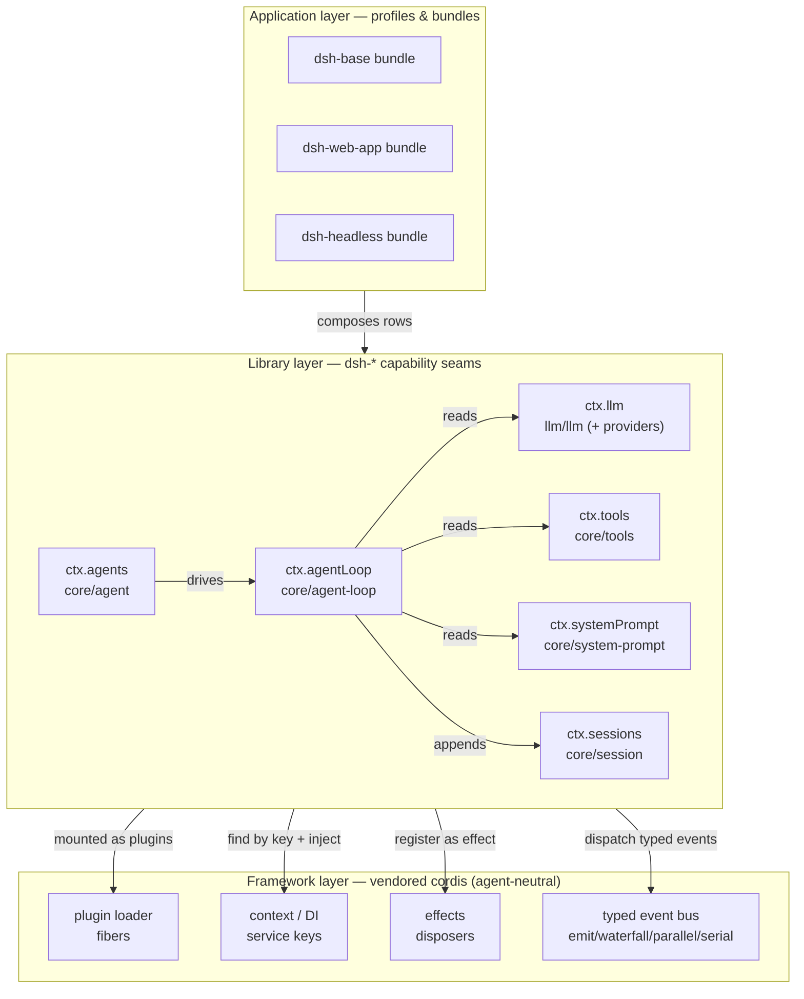
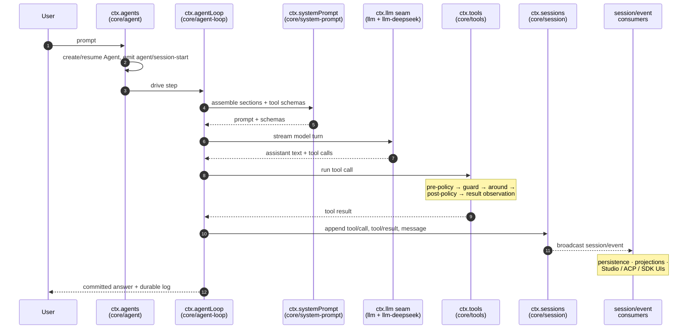

English | 中文 (pending)

## Learning path

The [UI plugin book](ui-plugin-book.md) teaches you to ship a feature. This book teaches the ground it stands on: the two layers that make "everything is a plugin" true. It assumes you have never seen Cordis and never read a `dsh-*` package.

You will learn:

* Why DeepSeek Harness is split into a neutral **Framework** and a product **Library**, and what each layer is forbidden from knowing
* The five Framework ideas — a plugin, a context, `inject`, effects, and the typed event bus — with a running lifecycle you can see
* How the Library publishes product capabilities as **services** and communicates through **typed events**
* What a **capability seam** is and why one service splits into Definition, Provider, and Consumer roles
* How one user prompt flows through the real packages, from `ctx.agents` to `ctx.sessions`

Read the [Cordis primer](../cordis-primer.md) for the condensed reference and walk the [Cordis tutorial](../cordis-tutorial/index.md) for a hands-on version of the Framework half. This book connects those to the Library the harness actually ships.

## 1. Two layers, one rule

DeepSeek Harness is built on one rule: **everything is a plugin.** Nothing is a privileged core you patch. The model adapter, the tool registry, the session log, and even the agent loop are plugins mounted beside each other, so any of them is replaceable from configuration.

That rule only works because of a deliberate split into two layers.

| Layer | Concrete example | What it owns | Why it is separate |
|---|---|---|---|
| **Framework** | `@deepseek-ai/cordis` (vendored) | Plugin loading, dependency injection, effect/disposer lifetime, the typed event bus | It knows nothing about agents or LLMs. It only knows how to load code, wire dependencies, and tear them down. That neutrality is what lets everything else be a plugin. |
| **Library** | `dsh-agent`, `dsh-tools`, `dsh-session`, ... | Product capabilities published as **services** (`agents`, `tools`, `sessions`) and the typed **events** those services emit (`agent/session-start`, `agent/disposed`) | These are shared building blocks. Many plugins consume them; none of them is the harness. Swap a provider and the consumers do not change. |

Read the split as a stack:

```text
         +-----------------------------------------------------+
         |  Application layer                                   |
         |  bundles/profiles compose plugins into a running dsh |
         +-----------------------------------------------------+
                              consumes
         +-----------------------------------------------------+
         |  Library layer  (dsh-* packages)                    |
         |  services: ctx.agents ctx.tools ctx.sessions ...    |
         |  typed events: session/event, agent/*, fs/*, ...    |
         +-----------------------------------------------------+
                              built on
         +-----------------------------------------------------+
         |  Framework layer  (vendored cordis)                 |
         |  plugin loader | context/DI | effects | event bus   |
         |  knows nothing about agents, tools, or LLMs         |
         +-----------------------------------------------------+
```

The Framework is a general mechanism. The Library is what makes that mechanism into an agent harness. Keep them separate in your head; every section below tells you which layer you are standing in.

### Architecture-level design diagram

The same split, drawn as the boot-time composition so you can see who depends on whom. Bundles compose Library plugins; every Library plugin is loaded, wired, and unloaded by the one Framework underneath.



The three Framework boxes at the bottom know nothing above them; the arrows only point *down* into the Framework, never the reverse. That one-way dependency is the neutrality the whole design rests on.

The vendored Cordis source and its sync procedure live in [vendor/README.md](../../vendor/README.md). The Library packages are grouped under [packages/README.md](../../packages/README.md).

## 2. Framework idea 1 — a plugin is an object

Everything the Library ships is delivered as a **plugin**, so start there.

A plugin is a small object the Framework knows how to mount. It takes two forms:

* A function (or an object) with an `apply(ctx)` method, optionally with a `name` and an `inject` list.
* A `Service` subclass whose lifetime the Framework mounts into the current context.

The function form is the one you meet first:

```ts
import type { Context } from '@deepseek-ai/cordis'

export const name = 'hello'

export function apply(ctx: Context): void {
  console.log('hello plugin loaded')
}
```

`ctx` is the plugin's window into the running system — the **context**, covered next. `apply` runs once when the plugin loads. The Framework does not read the plugin's file, know what a tool is, or care that an LLM exists. It only knows: mount this object, hand it a context, unmount it later.

```text
  config row or ctx.plugin(fn)
            |
            v
   +------------------+        Framework mounts the plugin
   |  cordis loader   |------> and gives it a Context handle
   +------------------+
            |
            v
     apply(ctx)  runs once      <- your code, the Library's code
```

The unit of loading is a **fiber**: the runtime handle for one loaded plugin instance. `ctx.plugin(fn)` mounts a function from code — the same operation the YAML loader performs for each config entry — and returns that fiber so you can dispose it later. The [lifecycle tutorial](../cordis-tutorial/02-lifecycle-and-effects.md) shows the fiber state machine (`PENDING → LOADING → ACTIVE → UNLOADING → DISPOSED`, or `FAILED`).

Why this matters: because a plugin is just an object with `apply`, the model adapter and the agent loop are the same kind of thing as your ten-line demo. There is no second, heavier mechanism for "real" components.

## 3. Framework idea 2 — a context is a repository of services

A plugin does useful work by contributing to, and reading from, a **context**.

A context is a repository of **services**. A service claims a stable key on the context — `ctx.tools`, `ctx.llm`, `ctx.sessions` — and other plugins find it by that key instead of importing a concrete class.

```text
                      Context
   +---------------------------------------------------+
   |  ctx.sessions --> the session store service       |
   |  ctx.tools    --> the tool registry service       |
   |  ctx.llm      --> the LLM adapter registry service |
   |  ctx.agents   --> the agent service               |
   +---------------------------------------------------+
        ^                    ^                    ^
        | claims ctx.tools   | reads ctx.llm      | reads ctx.tools
   [tools plugin]      [agent-loop plugin]   [a tool plugin]
```

Finding a service by key, not by import, is what makes plugins swappable. The agent loop asks the context for `ctx.llm`; it never imports the DeepSeek adapter. Replace the adapter with a replay adapter in config and the loop is unchanged, because it only ever knew the key.

This is dependency injection with no framework ceremony: the context *is* the injector, and the key *is* the injection token. A service registered under `ctx.tools` is documented as a capability in the harness — see `ctx.tools` in [capability-seams.md](../capability-seams.md), owned by [packages/core/tools](../../packages/core/tools).

## 4. Framework idea 3 — inject expresses load order

Plugins load in an order nobody wrote down by hand. Load order is *derived* from what each plugin declares it needs.

A plugin lists required services in `inject`. The Framework keeps that plugin in `PENDING` until every named service exists, then activates it:

```ts
import type { Context } from '@deepseek-ai/cordis'

export const name = 'needs-tools'
export const inject = ['tools']            // wait for ctx.tools

export function apply(ctx: Context): void {
  // Safe: ctx.tools is guaranteed present here.
  ctx.tools.register(/* ... */)
}
```

```text
  tools plugin      needs-tools plugin (inject: ['tools'])
      |                     |
      | registers          | PENDING — ctx.tools missing
      v ctx.tools           |
   ACTIVE  ------------------+--> service appears
                            |
                            v
                     LOADING -> ACTIVE, apply(ctx) runs
```

You never sequence boot manually. You state requirements, and the Framework computes an order that satisfies them. When a required service later disappears (its plugin unloaded), dependents return to `PENDING` and their effects unwind — this is the same machinery that makes hot reload safe.

Why the Framework owns this: ordering is a pure graph problem over service keys. It needs no knowledge of agents or LLMs, so it belongs in the neutral layer.

## 5. Framework idea 4 — registrations are reversible effects

A plugin can be unloaded at any time: a config edit, a hot reload, an explicit `fiber.dispose()`, or the loss of a required service. So every registration a plugin makes must be **undoable**.

The Framework's answer is the **effect**. Anything you set up wraps in `ctx.effect()` and returns a disposer; anything the Framework already manages (listeners via `ctx.on`, services, child plugins) is disposed for you.

```ts
import type { Context } from '@deepseek-ai/cordis'

export const name = 'lifecycle-demo'

export function apply(ctx: Context): void {
  ctx.effect(() => {
    const timer = setInterval(() => console.log('tick'), 200)
    return () => clearInterval(timer)   // disposer runs on unload
  })
}
```

```text
   load                                unload
    |                                    |
    v                                    v
  effect body runs  ...............  disposer runs
  (acquire resource)                 (release resource)
```

The rule is uniform: **every registration has a disposer.** `ctx.effect()` returns one for a raw resource; `ctx.on()` and registry `register()` methods return theirs. If teardown order matters, keep the related work in one effect so disposal unwinds in the intended sequence. The [lifecycle tutorial](../cordis-tutorial/02-lifecycle-and-effects.md) demonstrates a timer, a child fiber, and their ordered cleanup end to end.

Why the Framework owns effects: reversibility is what makes "everything is a plugin" survivable. Without it, a reloaded model adapter would leak listeners and half-registered tools. The Library relies on this so heavily that a registry's `register()` returning its own disposer is a repository convention (see the AGENTS.md rule "Registrations are effects").

## 6. Framework idea 5 — the typed event bus

Services need to talk without importing each other. The Framework provides a **typed event bus** for that, and it is the harness's primary extension point.

Events are declared through TypeScript declaration merging, so an event name and its payload are a compile-time contract, not a string convention. A service dispatches an event in one of four **modes**, and the mode is part of the event's public contract:

| Mode | Awaited? | Dispatch order | Returns a value? | Use it to |
|---|---|---|---|---|
| `emit` | No | listeners observe in registration order | No | Announce a fact; observers react |
| `waterfall` | No | listeners observe in registration order | Yes | Let listeners wrap or replace a value |
| `parallel` | Yes | all listeners observe together | No | Fan out and await all observers |
| `serial` | Yes | listeners observe in registration order | Yes | Ordered async pipeline with a result |

New harness events tag their mode with `@mode` so a generated catalog checks declarations against dispatch sites.

One mode needs its own picture because the Library uses it for policy. **Waterfall is around-middleware.** A listener receives `(...args, next)`. Call `next()` to delegate to the next listener; return without `next()` to short-circuit and own the decision.

```text
   waterfall dispatch
   args ->[ listener A ]->next()->[ listener B ]->next()->[ listener C ]-> result
                 |                        |
          may mutate args          may return WITHOUT next()
          then delegate            to short-circuit (owns the decision)
```

A cooperative listener mutates a shared request or decision object and delegates. A policy listener that owns the outcome returns without `next()`. The repository rule is strict: **a listener that only annotates or observes MUST call `next()`**, or it silently breaks the chain (see [cordis-primer.md](../cordis-primer.md) for the full waterfall semantics).

Why events, not method calls: methods are for direct capability use (`ctx.tools.register(...)`); events are for interception and policy where the caller must not know who is listening. That separation is what lets a sandbox policy plugin gate filesystem writes without the filesystem tool importing it.

## 7. Library layer — services as capability seams

Now cross into the Library. Everything above was neutral mechanism; from here the packages know they are building an agent harness.

The Library publishes each product capability as a service on the context. But most services are not a single lump — they are a **capability seam** made of three roles that can evolve independently:

* **Service Definition** — the package that declares the key, its interface, and its events. It contains no working provider.
* **Service Provider** — one or more packages that implement the interface behind that key.
* **Consumer** — packages that call the service by key, never importing a provider.

```text
              +----------------------+
              |  Service Definition  |   packages/llm/llm   -> ctx.llm
              |  interface + events  |
              +----------------------+
               ^                    ^
      registers|                    |calls by key
   +-----------+------+       +------+-----------------+
   | Provider          |      | Consumer               |
   | llm-deepseek      |      | agent-loop             |
   | llm-replay        |      | compaction-basic       |
   +-------------------+      +------------------------+
```

`ctx.llm` is the textbook seam. The [`llm`](../../packages/llm/llm) package defines the provider-neutral stream service; [`llm-deepseek`](../../packages/llm/llm-deepseek) and [`llm-replay`](../../packages/test-support/llm-replay) are providers; [`agent-loop`](../../packages/core/agent-loop) and [`compaction-basic`](../../packages/compaction/compaction-basic) are consumers. Swap the provider and no consumer changes — the whole point of the split.

Not every service is a swappable seam. [capability-seams.md](../capability-seams.md) classifies each one as a `seam` (multiple providers expected), a `core` spine service (one owner, no swap intended), or a `bundle`/composition point, and lists its owner, implementations, and direct consumers. Read that page as the authoritative map of the Library's services. Three anchors to start with:

* `ctx.tools` — the tool registry and guarded execution pipeline, owned by [core/tools](../../packages/core/tools). It registers capabilities and routes each call through pre-policy, monotonic guards, around-dispatch, post-policy, and result observation.
* `ctx.sessions` — the append-only session store, owned by [core/session](../../packages/core/session). It owns `Session` instances and emits the durable event feed.
* `ctx.agents` — live `Agent` handles and the create/resume factory, owned by [core/agent](../../packages/core/agent).

Why the Library splits roles: a seam lets a provider be replaced, tested with a fake, or run in a different environment without touching consumers. Split a service into these roles only when the roles genuinely evolve independently; a seam is always all three roles, never one (see the [glossary](../glossary.md#capability-seam)).

## 8. Library layer — the three event families

The Library's services communicate through the Framework's event bus, but the harness sorts its events into three families, and picking the right one is the first decision in most changes.

```text
   Session events        Agent events           Capability events
   session/event         agent/*                fs/*  tools/*  telemetry/*
   ------------------    ------------------     ---------------------------
   durable facts in      carry a live Agent     attach policy/adapters to
   the append-only log   (inbox, step, status)  a seam without importing
   survive a reload      observe work in flight  the loop
```

* **Session events** are durable facts appended to the log and broadcast through `session/event`. Use one when the fact must survive a reload — a tool call, a tool result, a committed assistant message. `ctx.sessions` owns this feed.
* **Agent events** (`agent/*`) carry a live `Agent`: session start, step, status, request, validation, continuation, disposal. Use one to observe or intercept work in flight. `agent/session-start` and `agent/disposed` from the table in section 1 are members of this family.
* **Capability events** (`fs/*`, `tools/*`, `telemetry/*`) attach policy and adapters to a seam without importing the agent loop. The `fs/*` event gate is how [fs-observation-policy](../../packages/fs/fs-observation-policy) contributes checks without the filesystem tool knowing it exists.

One repository invariant ties this together: **model-visible ⟺ logged.** Anything that reaches a model request must be reconstructable from the session log, so a new model-visible input requires a session event. That is why presentation and replay stay independent of any one UI, exactly as the [UI plugin book](ui-plugin-book.md) relies on.

## 9. How one prompt flows through both layers

Put the pieces together with a single user prompt. Every box below is a Library plugin; every arrow is a service call or a typed event carried by the Framework.

```text
  user prompt
      |
      v
  ctx.agents ................ creates/resumes an Agent handle        (core/agent)
      |   emits agent/session-start
      v
  ctx.agentLoop ............. the one concrete loop driver           (core/agent-loop)
      |
      +--> ctx.systemPrompt .. assemble prompt sections + tool schemas (core/system-prompt)
      |
      +--> ctx.llm .......... stream a model turn via the provider    (llm/llm -> llm-deepseek)
      |
      +--> ctx.tools ........ validate + run each tool call           (core/tools)
      |         through pre/guard/around/post/result pipeline
      |
      v
  ctx.sessions ............. append tool/call, tool/result, message   (core/session)
      |   broadcasts session/event  ->  persistence, projections, UI
      v
  committed answer + durable log
```

Read it as the two layers cooperating: the **Library** boxes are product capabilities, and the **Framework** underneath is what let `agent-loop` find `ctx.llm` by key, wait for it via `inject`, register its listeners as reversible effects, and dispatch `agent/*` events with typed payloads. Remove the Framework and none of these boxes could find each other; remove the Library and the Framework has nothing to load.

### Module-level design diagram

The same turn, drawn at module granularity: which package owns each service, which is a swappable seam, and where a durable `session/event` fans out to persistence, projections, and every UI.



Two modules on this diagram are true seams — `ctx.llm` (provider `llm-deepseek` swaps for `llm-replay` in tests) and the tool providers behind `ctx.tools` — while `core/agent`, `core/agent-loop`, `core/system-prompt`, and `core/session` are single-owner spine services. The authoritative owner/provider/consumer map for every module is [capability-seams.md](../capability-seams.md).

The full ordered map — composition, core packages, the loop, seams, and extension points — is [architecture.md](../architecture.md). Read it before changing anything under `packages/`.

## 10. Why the separation is worth it

Every design choice above serves one goal: keep the loading mechanism ignorant of the product so the product can be entirely plugins.

* **Neutrality enables replaceability.** Because the Framework only knows keys, effects, and events, a provider behind any seam swaps from configuration. `dsh --profile web --dump-config` prints the exact tree, and any row is replaceable by a patch (see [architecture.md](../architecture.md)).
* **Reversibility enables hot reload and teardown.** Because every registration is an effect with a disposer, a reloaded adapter leaks nothing.
* **Roles enable testing and evolution.** Because a seam separates Definition, Provider, and Consumer, a fake provider (`llm-replay`) drives real consumers in a test without a live model.
* **Logged events enable replay across UIs.** Because model-visible facts are durable session events, the same conversation reconstructs in Studio, an ACP editor, or an SDK app.

The core rule is the same wherever you stand: **the Framework knows how to load, wire, and unload; the Library knows what an agent is. Never mix the two.** A tool registry belongs in the Library; the effect that unwinds its registration belongs to the Framework.

## 11. Continue with production references

Use these as the source of truth after this book:

* [Cordis primer](../cordis-primer.md) — the condensed Framework reference (five ideas, dispatch modes, waterfall, loader config)
* [Cordis tutorial](../cordis-tutorial/index.md) — hands-on plugins, lifecycle, services, events, config, and composition
* [Architecture](../architecture.md) — the ordered map of composition, core packages, the loop, and extension points
* [Capability seams and core services](../capability-seams.md) — the authoritative service graph with owners, providers, and consumers
* [Glossary](../glossary.md) — precise definitions, including the [capability seam](../glossary.md#capability-seam)
* [Subsystem pages](../subsystems/README.md) — per-package type definitions, semantics, and the generated Cordis API
* [UI plugin book](ui-plugin-book.md) — build a shipping feature on top of everything here

The one lesson to carry forward: find capabilities by service key, make every registration a reversible effect, communicate through typed events, and keep durable facts in the session log. Do that and your plugin behaves like every other part of the harness — because there is no other kind of part.
