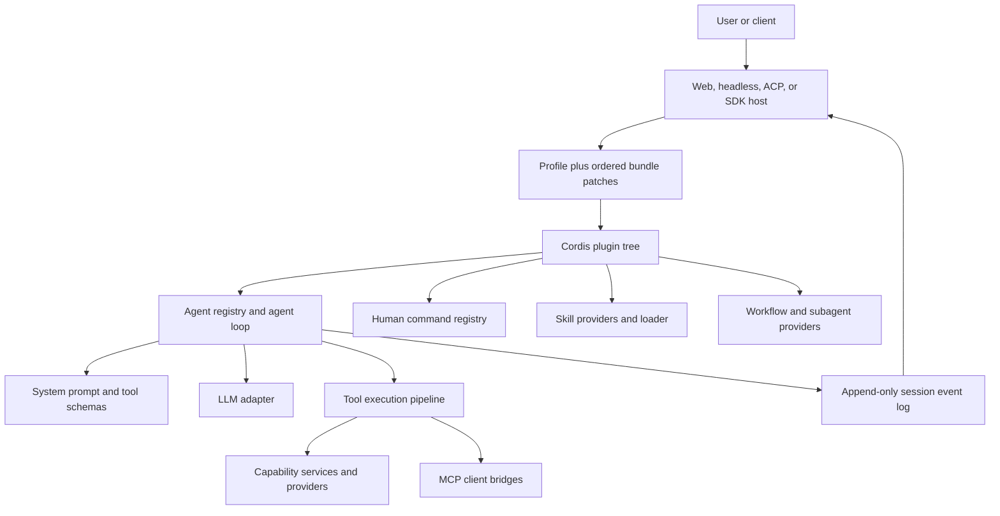
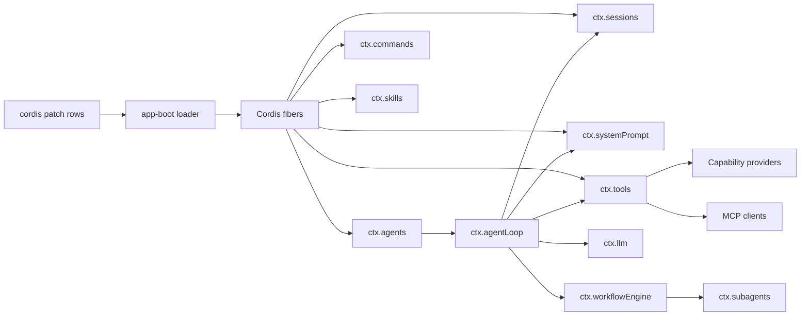
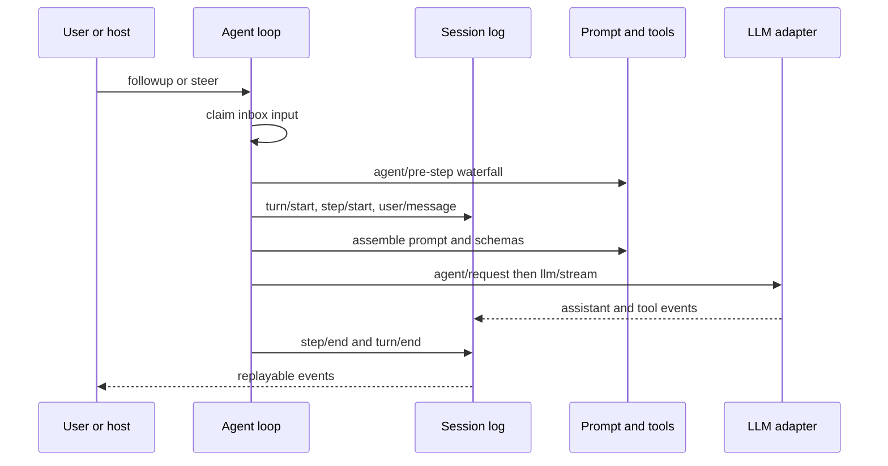
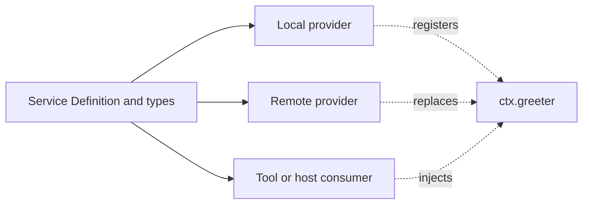

# Build on the Harness backbone

English | [中文](backbone.zh.md)

This tutorial is a student path from the system architecture to a working custom composition. It assumes that you can run the repository from source and have completed [Your first plugin](../basic/). Each chapter answers three questions: what the extension point owns, how to use it, and why the repository separates it from neighboring responsibilities.

## Learning outcome

You will build a plugin layer that can customize one agent, intercept its flow, provide a capability, add a skill and a human command, connect an MCP server, and integrate Claude Code. The examples build on the existing `web` or `headless` profile instead of replacing the core agent loop.

## System architecture



The profile chooses which plugins exist. Cordis controls their dependencies and lifetime. The agent loop coordinates turns, but plugins change behavior through services, scoped registrations, and events. The session log is the durable source for replay and model history.

## Learning path

1. Read the architecture and follow one turn through the runtime.
2. Create a lifecycle-safe Cordis plugin.
3. Customize an agent and choose an agent-flow mechanism.
4. Package the composition as a profile bundle.
5. Build a Service Definition, Service Provider, and Consumer.
6. Add a skill provider, MCP server, and human command.
7. Integrate Claude Code through the supported hook bridge or subagent provider.
8. Verify the assembled application, not only an isolated package.

## Extended curriculum

Use this tutorial as the course backbone, then deepen each layer through three companion collections:

1. Complete the [Cordis tutorial](../../../cordis-tutorial/) before Chapter 1 when plugin lifecycle, services, events, configuration, composition, or HMR are new to you.
2. Apply the [extension cookbook](../../../cookbook/extension-cookbook.md) after Chapters 3 and 4 when you need production procedures for packages, tools, LLM adapters, settings cards, Web conversation nodes, vendored dependencies, or review workflows.
3. Consult the [subsystem reference](../../../subsystems/) while implementing Chapters 4 through 9. Each page owns the exact service types, events, data structures, provider contracts, and failure semantics for one capability.

The published student book follows that progression: Cordis foundations, this guided Harness build, cookbook procedures, then subsystem references. Read the first three parts in order. Use the subsystem part for lookup rather than reading every API page before starting an extension.

## Read the system by layers

The repository becomes easier to extend when you separate composition, coordination, capability, and durability. A feature often touches more than one layer, but each fact still has one owner.

| Layer | Owns | Extend it when |
|---|---|---|
| Host | Web, headless, ACP, and SDK entry points | A client must create, drive, or render agents |
| Profile and bundle | Ordered plugin rows that form one product | A deployment needs a reusable plugin combination |
| Cordis plugin | Dependency-aware lifetime and reversible registrations | Behavior can attach without changing the loop |
| Agent | Inbox, status, scoped context, session, and driver control | Behavior belongs to one live agent or turn |
| Capability | A typed service, providers, and consumers | Implementations must be replaceable behind one API |
| Session | Durable events for history, replay, and UI state | A fact must survive reload or enter model history |

### Module-level design



The arrows show dependency and call direction. Registries define stable APIs, providers register implementations, and consumers depend only on the API they need. A plugin fiber owns its registrations, so unloading it removes them.

### Follow one turn



The governing rule is **model-visible means logged**. Do not place hidden mutable state directly into a model request. Add a session event and project from the log so resume, fork, transcript, and replay agree.

## Chapter 1: build a lifecycle-safe plugin

### What a plugin owns

A Cordis plugin is a module with an `apply(ctx)` entry point. It owns resources created through its context. `inject` declares required services, so Cordis waits for them and unloads the plugin if they disappear.

### How to build it

Create `scratch-plugin/src/student-plugin.ts`:

```ts ignore-check
import type { Context } from '@deepseek-ai/cordis'

export const name = 'student-plugin'
export const inject = ['agents']

export function apply(ctx: Context) {
  ctx.on('agent/session-start', ({ agent, source }) => {
    console.log(`[student-plugin] ${source}: ${agent.id}`)
  })

  ctx.effect(() => {
    const timer = setInterval(() => console.log('[student-plugin] active'), 30_000)
    return () => clearInterval(timer)
  })
}
```

Mount it with an overlay, replacing the absolute path with your checkout:

```yaml
- insert:
    - id: student-plugin
      name: '/absolute/path/to/deepseek-harness/scratch-plugin/src/student-plugin.ts'
```

```sh
pnpm dsh web --patch ./scratch-plugin/cordis.yml
```

Open `http://127.0.0.1:3080`, create a session, and find the startup line. Edit the plugin with HMR enabled to observe disposal and reactivation.

### Why lifecycle ownership matters

Manual global registration leaks listeners and stale implementations during HMR or provider replacement. `ctx.on()`, service registrations, child plugins, and `ctx.effect()` are owned by the current fiber. Keep order-dependent cleanup inside one disposer and await its steps serially.

The [basic plugin tutorial](../basic/) covers configuration and packaging. [Plugins and lifecycle](../framework/) defines fiber states and disposal.

## Chapter 2: customize an agent and its flow

### What an agent is

An `Agent` is the stable handle used by plugins. It owns an inbox, session, status, options, and agent-scoped `ctx`. `ctx.agents` is the registry; `ctx.agentLoop` is the default driver and factory. This split lets hosts and plugins use agents without importing the concrete loop.

| Method | Wakes an idle agent | Admission point | Use |
|---|---|---|---|
| `followup()` | Yes | Next turn | Add a new user-like task |
| `steer()` | Yes | Next step | Guide a running or new turn |
| `inject()` | No | Next admitted step | Queue plugin context |
| `cancel()` | Not applicable | Active driver and pending inbox by default | Stop work and clear input |

Programmatic hosts use `ctx.agents.create()` for an owned `AgentHandle`, asynchronous scoped setup, and publication after setup succeeds. A plugin that only reacts to agents should listen to `agent/*` events instead of creating another driver.

### How to intercept deterministic flow

A waterfall listener that does not own the final decision must call `next()`:

```ts ignore-check
import type { Context } from '@deepseek-ai/cordis'

export function apply(ctx: Context) {
  ctx.on('agent/pre-step', async ({ agent, messages, turn, step }, next) => {
    console.log({ agentId: agent.id, messageCount: messages.length, turn, step })
    return next()
  })
}
```

Return `{ kind: 'reject' }` only when this plugin owns the rejection. To rewrite input, delegate and return a new `{ kind: 'enter', messages }` from the downstream decision. Claimed messages are already removed from the inbox, so rejection does not restore them.

### How to choose an agent-flow mechanism

| Need | Mechanism | Why |
|---|---|---|
| Deterministic observation or policy | `agent/*` or `tools/*` event plugin | Typed and part of the live lifecycle |
| More work in the same session | `followup()`, `steer()`, or `inject()` | Preserves one durable history |
| One independent delegated task | Bound `ctx.subagents` provider and tool | The child may use another runtime |
| Large model-authored fan-out | `ctx.workflowEngine` and `dsh-tool-workflow` | A worker runs orchestration code and collects results |
| Different semantics for every turn | Implement `Agent` and register it | Use only when extension points cannot express the requirement |

The loop owns cancellation, event order, request assembly, tool execution, retry, and turn completion. Keep feature policy on events and services. The [agent package](../../../../packages/core/agent/README.md) owns the handle and registry; the [workflow subsystem](../../../subsystems/workflow.md) owns dynamic workflow behavior.

## Chapter 3: assemble an agent harness

### What the harness is

There is no separate “agent harness plugin” type. The harness is the assembled product: a Host boots a Profile, the Profile applies ordered Bundle patches, and those patches mount Cordis plugins. Use the three levels deliberately.

| Level | Lifetime | Use |
|---|---|---|
| Overlay | One launch | Experiment with `--patch` |
| Profile patch | One local Profile | Customize one installed `web` or `headless` composition |
| Bundle | Versioned npm package | Share and install a composition layer |

Inspect the exact resolved tree before debugging behavior:

```sh
dsh --profile web --dump-config
```

### How to build a Bundle

A Bundle package declares its patch in `package.json`:

```json
{
  "name": "@acme/dsh-student-bundle",
  "version": "0.1.0",
  "type": "module",
  "dsh": {
    "bundle": {
      "patch": "./cordis.patch.yml"
    }
  }
}
```

Its `cordis.patch.yml` inserts or replaces rows. Every row needs a stable `id` when higher layers may customize it:

```yaml
- insert:
    - id: student-plugin
      name: '@acme/dsh-student-plugin'
      config:
        course: architecture
```

Install the Bundle into a Profile and restart that Profile:

```sh
dsh plugin --profile web add @acme/dsh-student-bundle
dsh --profile web
```

An id-targeted patch replaces the row's entire `config`; restate fields you want to keep. Bundle order, then Profile patch, then home patch, then `--patch` overlay determines precedence.

### Why composition stays outside code

The same provider or tool can serve Web, headless, ACP, and tests when product selection lives in patches. Code owns behavior; Bundle patches own which behavior exists in a deployment. The [app-boot Profile contract](../../../../packages/boot/app-boot/README.md#profiles) defines resolution and precedence.

## Chapter 4: build a capability provider

### What the three roles own

A replaceable capability has a Service Definition, Service Provider, and Consumer. The Definition owns request and result types. Providers implement them. Consumers expose the capability to a model, command, host, or another service. Split packages only when the roles need to evolve independently.



### How to implement the roles

The following condensed example shows the ownership split. In a real package family, place each role in its own package and add the repository-required JSDoc and tests.

```ts ignore-check
// Service Definition: @acme/dsh-greeter
import { Service, type Context } from '@deepseek-ai/cordis'

declare module '@deepseek-ai/cordis' {
  interface Context { greeter: GreeterService }
}

export abstract class GreeterService extends Service {
  constructor(ctx: Context) { super(ctx, 'greeter') }
  abstract greet(name: string): Promise<{ message: string }>
}

// Service Provider: @acme/dsh-greeter-local
class LocalGreeter extends GreeterService {
  async greet(name: string) { return { message: `Hello, ${name}.` } }
}

export function applyProvider(ctx: Context) {
  ctx.plugin(LocalGreeter)
}

// Consumer: @acme/dsh-tool-greeter
import { defineTool } from '@deepseek-ai/dsh-tools'

export function applyConsumer(ctx: Context) {
  ctx.tools.register(defineTool({
    name: 'greet',
    description: 'Greet a person by name.',
    parameters: { name: { type: 'string', required: true } },
    output: {
      schema: { type: 'object', properties: { message: { type: 'string' } } },
      render: (_args, value) => [{ type: 'text', text: value.message }],
    },
    execute: ({ name }) => ctx.greeter.greet(name),
  }))
}
```

Compose provider and consumer together:

```yaml
- name: '@acme/dsh-greeter-local'
- name: '@acme/dsh-tool-greeter'
```

### Why this design scales

The Consumer never imports the local provider. A remote provider can replace it without changing the tool schema or callers. Defaults belong in an explicit provider-owned `resolve(request)` step, not hidden inside execution. [Three-role capability design](./) contains the complete package walkthrough, and [Tool authoring](../../../cookbook/adding-a-tool.md) defines validation, cancellation, canonical JSON output, and UI rendering.

## Chapter 5: add a skill

### What a skill is

A skill is reusable instruction content discovered through `ctx.skills`. The registry is provider-neutral. `dsh-skill-filesystem` discovers local files, and `dsh-tool-skill` publishes the catalog and loader to the model. A skill is not executable plugin code unless its instructions call tools.

### How to add a filesystem skill

Create `.agents/skills/course-helper/SKILL.md` in a project:

```markdown
---
name: course-helper
description: Explain Harness architecture with repository references.
whenToUse: Use when a student asks how a Harness extension fits into the runtime.
---

# Course helper

Start from the system layer, name the owning service or event, and link its package README.
```

The filesystem provider also scans `.dsh/skills`, `~/.dsh/skills`, and `~/.agents/skills`. Names must be kebab-case. Set `disable-model-invocation: true` or `user-invocable: false` in frontmatter to remove an invocation surface.

### How to embed a skill in a plugin

```ts ignore-check
import type { Context } from '@deepseek-ai/cordis'

export const inject = ['skills']

export function apply(ctx: Context) {
  ctx.skills.register({
    name: 'course-helper',
    description: 'Explain Harness architecture with repository references.',
    source: 'runtime',
    content: 'Start from the system layer and name the owning service or event.',
    invocation: { modelInvocable: true, userInvocable: true },
  })
}
```

Use `registerProvider()` instead when skills come from a database, HTTP service, or another catalog. The provider implements `list()` for summaries and `get()` for progressively loaded bodies, honors cancellation, and calls its registration-scoped `invalidate()` when the catalog changes.

### Why skills and plugins differ

Plugins execute trusted code and register runtime behavior. Skills provide discoverable instructions and optional resources. Keeping them separate lets operators inspect and replace guidance without granting another code execution path. The [skill subsystem](../../../subsystems/skills.md) owns discovery order, policy, and model rendering.

## Chapter 6: connect an MCP server

### What the MCP bridge owns

`dsh-mcp-client` connects to one external Model Context Protocol server, discovers its tools, and registers them on `ctx.tools`. The bridge supports MCP tools, not MCP resources or prompts. Each instance needs a unique `serverName`; exposed names use `mcp__<serverName>__<rawName>`.

### How to connect over stdio or HTTP

Add one row per server to a Profile patch or launch overlay:

```yaml
- id: mcp-course-files
  name: '@deepseek-ai/dsh-mcp-client'
  config:
    serverName: course
    transport: stdio
    command: node
    args: ['/absolute/path/to/course-mcp-server.js']
    failOnStartupError: true

- id: mcp-course-http
  name: '@deepseek-ai/dsh-mcp-client'
  config:
    serverName: course-http
    transport: streamable-http
    url: http://127.0.0.1:3000/mcp
    headers:
      Authorization: \!\!js '`Bearer ${process.env.MCP_TOKEN}`'
```

Use `failOnStartupError: true` while developing so discovery errors fail boot instead of producing an empty tool set. Keep credentials in the environment or credential service, never in committed patches. After boot, inspect the tool catalog or ask the model to call the server-qualified tool.

### Why MCP is an adapter, not a second tool system

MCP tools enter the normal tool registry and execution pipeline. They inherit cancellation, policy interception, logging, Code Mode access, and UI fallback behavior. This avoids a parallel execution path. The [MCP client contract](../../../../packages/mcp/mcp-client/README.md) documents reconnects, naming, schema limits, and rich results.

## Chapter 7: add a human command

### What commands own

A command is a direct human control such as `/inspect target`. It does not create a model turn, and its result text never enters model history. Use a tool when the model chooses an operation; use a command when the human explicitly controls application state or schedules work.

### How to register one

```ts ignore-check
import type { Context } from '@deepseek-ai/cordis'

export const name = 'student-commands'
export const inject = ['commands']

export function apply(ctx: Context) {
  ctx.commands.register({
    name: 'inspect',
    description: 'Show the current agent and raw target.',
    input: { hint: '<target>' },
    handler: ({ agent, rawInput, signal }) => {
      if (signal.aborted) return { kind: 'error', text: 'Command cancelled.' }
      return { kind: 'success', text: `${agent.id}: ${rawInput.trim()}` }
    },
  })
}
```

Names contain lowercase letters, digits, `_`, or `-`. Set `recordInput: false` only when another authoritative domain event stores the payload. A command that wants model work must explicitly call the receiving `Agent`; the registry never turns raw input into a prompt.

### Why commands stay outside the model loop

Direct dispatch makes commands predictable, cheap, and available even when no model request should run. The durable `command/run` and `command/done` events record execution for clients without changing model history. The [commands package](../../../../packages/interaction/commands/README.md) owns parsing, attachments, cancellation, and result semantics.

## Chapter 8: integrate Claude Code

“Load a Claude Code plugin” can mean two different integrations. Choose by intent.

### Import command hooks

Use `dsh-hooks-claude-code` to map the supported command-hook subset from a `hooks.json` file or a settings file's `hooks` key onto Harness events:

```yaml
- id: claude-code-hooks
  name: '@deepseek-ai/dsh-hooks-claude-code'
  config:
    configPath: ./.claude/hooks.json
    pluginRoot: ./.claude/plugins/course-plugin
    projectDir: .
```

`${CLAUDE_PLUGIN_ROOT}` and `${CLAUDE_PROJECT_DIR}` substitutions use these values. The bridge reads the file once at plugin load. It supports command handlers for a documented subset of hook events; it does not load arbitrary Claude Code plugin features, prompt handlers, agents, or MCP handlers. Use a native Cordis plugin when you control the integration and need typed decisions.

### Delegate a task to Claude Code

Use the Claude Code subagent Bundle when a parent agent should send one independent task to a fresh Claude Code process:

```sh
dsh plugin --profile web add @deepseek-ai/dsh-subagent-claude-code
dsh --profile web
```

The installed Bundle registers a dormant `claude-code` provider. Expose it through a bound subagent tool in a Profile or preset:

```yaml
- id: tool-subagent-claude
  name: '@deepseek-ai/dsh-tool-subagent'
  config:
    provider: claude-code
    toolName: subagent_claude_code
    backgroundMode: one-shot
    maxDepth: provider-managed
```

The provider uses the official pinned Agent SDK and native Claude settings in the parent session workspace. It starts no process until called, does not copy parent conversation context, and returns only the final answer or a safe failure diagnostic. Authentication remains Claude Code's responsibility.

### Why the integrations are separate

The hook bridge intercepts the current Harness agent. The subagent provider starts another product to perform delegated work. Combining them would blur lifecycle, permissions, context, and result ownership. Read [Claude Code hooks](../../../../packages/hooks/hooks-claude-code/README.md) for the compatibility matrix and [Claude Code subagent](../../../../packages/subagent/subagent-claude-code/README.md) for installation and permission modes.

## Chapter 9: verify and extend safely

### Verify each layer

1. Run `dsh --profile web --dump-config` and confirm each expected row, id, and final config.
2. Start the Profile and confirm every required service activates without pending dependencies.
3. Create a session and confirm plugin startup, command discovery, skill discovery, and MCP tool names.
4. Exercise one successful and one failing path for each new tool, provider, command, or hook.
5. Cancel long-running work and verify that processes, listeners, and registrations reach quiescence.
6. Reload or restart and verify that model-visible facts reconstruct from the session log.
7. Add focused package tests. Add a keyless assembled snapshot for model- or product-visible behavior.
8. Run the checks selected by the repository testing policy and the package README.

For documentation changes, run:

```sh
pnpm run doc-sync
pnpm run lint
git diff --check
```

### Diagnose by ownership

| Symptom | First owner to inspect |
|---|---|
| Plugin remains pending | Its `inject` list and provider rows |
| Model cannot see a tool | `ctx.tools` registration scope and assembled schemas |
| Tool exists but fails | `tools/pre-execute`, provider, cancellation, then post-execute |
| UI replay differs | Session events and pure presentation metadata |
| Skill is missing | Provider roots, frontmatter, invocation policy, and catalog completeness |
| MCP tool disappears | MCP logs, reconnect budget, and namespace conflicts |
| Command reaches the model | Command producer code, because the registry never submits input |
| Claude hook does not run | Supported event and command-handler subset, path, and matcher |

### Build the next extension

Start with the narrowest owner. Add a plugin for policy, a service for shared runtime behavior, a three-role capability for replaceable implementations, a Bundle for deployment composition, a skill for reusable instructions, MCP for external tools, a command for direct human control, and a subagent provider for delegated execution. Change the agent loop only when these mechanisms cannot express the required turn semantics.

## Continue with the architecture references

Use [DeepSeek Harness Architecture](../../../architecture.md) for the current system map, [Agent lifecycle](../../../agent-lifecycle.md) for the complete turn sequence, and [Capability seams](../../../capability-seams.md) for the built-in Service Definition, Service Provider, and Consumer families.
