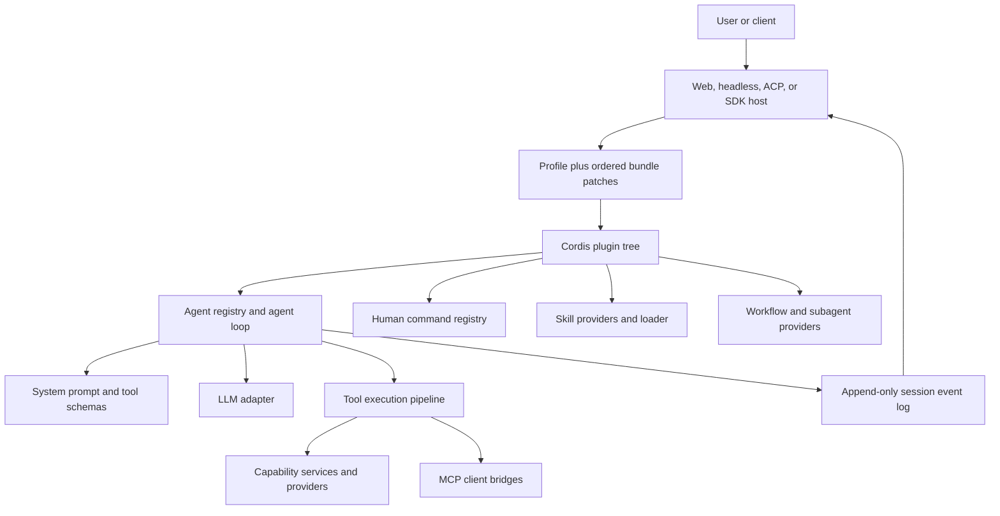
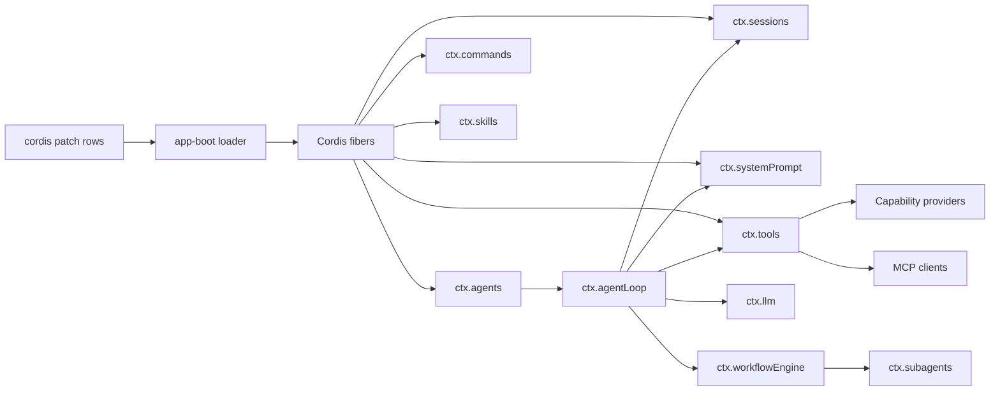
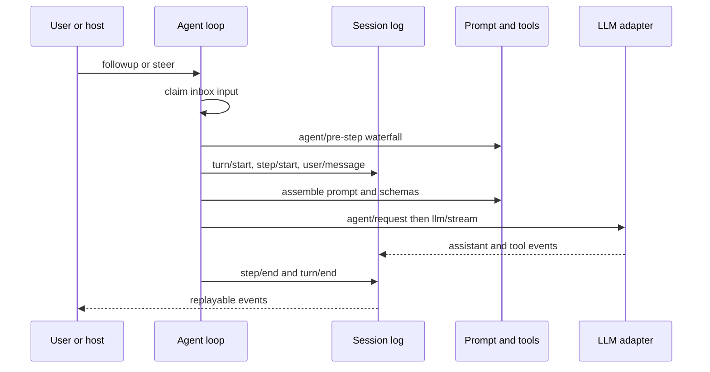
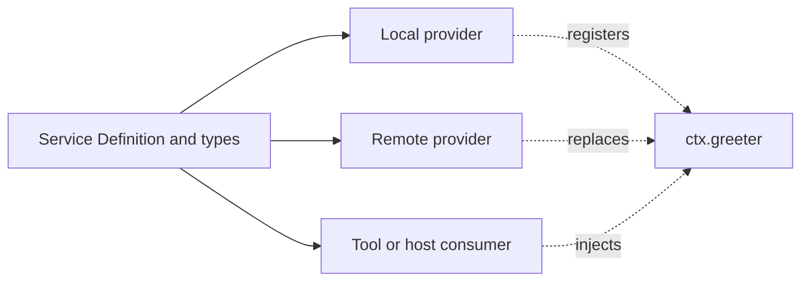

# 基于 Harness 主干进行开发

[English](backbone.md) | 中文

本教程为学生提供一条从系统架构到可运行自定义组合的学习路径。开始前，你应当能够从源码运行本仓库，并已完成[第一个插件](../basic/)。每章回答三个问题：扩展点负责什么、如何使用它，以及仓库为什么将它与相邻职责分开。

## 学习成果

你将构建一个插件层，用于自定义单个 Agent、拦截其流程、提供能力、添加 Skill 和人工命令、连接 MCP Server，并集成 Claude Code。示例构建在现有 `web` 或 `headless` Profile 之上，而不是替换核心 Agent Loop。

## 系统架构



Profile 决定存在哪些插件。Cordis 控制插件的依赖关系和生命周期。Agent Loop 协调 Turn，但插件通过 Service、作用域注册和事件改变行为。Session Log 是回放和模型历史的持久事实来源。

## 学习路径

1. 阅读架构，并跟踪一个 Turn 在运行时中的完整流程。
2. 创建具备正确生命周期管理的 Cordis 插件。
3. 自定义 Agent，并选择 Agent Flow 机制。
4. 将组合打包为 Profile Bundle。
5. 构建 Service Definition、Service Provider 和 Consumer。
6. 添加 Skill Provider、MCP Server 和人工命令。
7. 通过受支持的 Hook Bridge 或 Subagent Provider 集成 Claude Code。
8. 验证组装后的应用，而不只验证独立 Package。

## 扩展课程

以本教程作为课程主干，然后通过三个配套文档集深入学习各层：

1. 如果你还不熟悉插件生命周期、服务、事件、配置、组合或 HMR，请在第 1 章之前完成 [Cordis 教程](../../../cordis-tutorial/)。
2. 完成第 3 章和第 4 章后，当你需要 Package、工具、LLM Adapter、Settings Card、Web Conversation Node、Vendored Dependency 或评审工作流的生产过程时，请使用[扩展 Cookbook](../../../cookbook/extension-cookbook.md)。
3. 实现第 4 章至第 9 章时，请查阅[子系统参考](../../../subsystems/)。每个页面负责一种能力的准确服务类型、事件、数据结构、Provider 约定和失败语义。

发布的学生书籍遵循此顺序：Cordis 基础、本 Harness 构建指南、Cookbook 过程，然后是子系统参考。前三部分应按顺序阅读。子系统部分用于查询，不必在开始扩展之前通读每个 API 页面。

## 按层理解系统

将组合、协调、能力和持久性分开后，仓库会更容易扩展。一个功能经常涉及多个层，但每个事实仍然只有一个所有者。

| 层 | 负责内容 | 何时扩展 |
|---|---|---|
| Host | Web、headless、ACP 和 SDK 等入口 | 客户端必须创建、驱动或渲染 agent 时 |
| Profile 和 Bundle | 组成一个产品的有序插件配置项 | 部署需要可复用插件组合时 |
| Cordis 插件 | 感知依赖的生命周期和可撤销注册 | 行为可在不更改 agent loop 的情况下连接时 |
| Agent | Inbox、状态、作用域上下文、会话和驱动控制 | 行为属于一个实时 agent 或轮次时 |
| Capability | 类型化服务、提供方和消费方 | 实现必须可替换且共用一个 API 时 |
| Session | 用于历史、回放和 UI 状态的持久事件 | 事实必须在重新加载后保留或进入模型历史时 |

### 模块级设计



箭头表示依赖和调用方向。注册表定义稳定 API，提供方注册实现，消费方只依赖所需 API。插件 fiber 拥有其注册，因此卸载插件会移除这些注册。

### 跟踪一个轮次



核心规则是**模型可见即记录**。不要将隐藏的可变状态直接放入模型请求。应添加会话事件并从日志生成请求，使恢复、fork、transcript 和回放保持一致。

## 第 1 章：构建生命周期安全的插件

### 插件负责什么

Cordis 插件是具有 `apply(ctx)` 入口点的模块。它拥有通过其上下文创建的资源。`inject` 声明必需服务，因此 Cordis 会等待这些服务，并在服务消失时卸载插件。

### 如何构建

创建 `scratch-plugin/src/student-plugin.ts`：

```ts ignore-check
import type { Context } from '@deepseek-ai/cordis'

export const name = 'student-plugin'
export const inject = ['agents']

export function apply(ctx: Context) {
  ctx.on('agent/session-start', ({ agent, source }) => {
    console.log(`[student-plugin] ${source}: ${agent.id}`)
  })

  ctx.effect(() => {
    const timer = setInterval(() => console.log('[student-plugin] active'), 30_000)
    return () => clearInterval(timer)
  })
}
```

使用覆盖层挂载它，并将绝对路径替换为你的检出路径：

```yaml
- insert:
    - id: student-plugin
      name: '/absolute/path/to/deepseek-harness/scratch-plugin/src/student-plugin.ts'
```

```sh
pnpm dsh web --patch ./scratch-plugin/cordis.yml
```

打开 `http://127.0.0.1:3080`，创建一个会话，并查找启动日志行。启用 HMR 后编辑插件，观察资源释放和重新激活。

### 生命周期所有权为什么重要

手动全局注册会在 HMR 或提供方替换期间泄漏监听器和陈旧实现。`ctx.on()`、服务注册、子插件和 `ctx.effect()` 由当前 fiber 拥有。将依赖顺序的清理放在一个 disposer 中，并按顺序等待其步骤。

[基础插件教程](../basic/)介绍配置和打包。[插件与生命周期](../framework/)定义 fiber 状态和资源释放。

## 第 2 章：自定义 agent 及其流程

### agent 是什么

`Agent` 是插件使用的稳定句柄。它拥有 Inbox、会话、状态、选项和 agent 作用域 `ctx`。`ctx.agents` 是注册表；`ctx.agentLoop` 是默认驱动和工厂。这种拆分使 Host 和插件能够使用 agent，而无需导入具体 agent loop。

| 方法 | 是否唤醒空闲 agent | 接纳点 | 用途 |
|---|---|---|---|
| `followup()` | 是 | 下一个轮次 | 添加新的类用户任务 |
| `steer()` | 是 | 下一个步骤 | 引导运行中或新轮次 |
| `inject()` | 否 | 下一个接纳的步骤 | 将插件上下文加入队列 |
| `cancel()` | 不适用 | 活动驱动以及默认情况下待处理的 Inbox | 停止工作并清除输入 |

当编程式 Host 需要自有 `AgentHandle`、异步作用域设置以及设置成功后的发布时，应使用 `ctx.agents.create()`。只对 agent 作出响应的插件应监听 `agent/*` 事件，而不是创建另一个驱动。

### 如何拦截确定性流程

不拥有最终决策的 waterfall 监听器必须调用 `next()`：

```ts ignore-check
import type { Context } from '@deepseek-ai/cordis'

export function apply(ctx: Context) {
  ctx.on('agent/pre-step', async ({ agent, messages, turn, step }, next) => {
    console.log({ agentId: agent.id, messageCount: messages.length, turn, step })
    return next()
  })
}
```

仅当此插件拥有拒绝决策时才返回 `{ kind: 'reject' }`。若要重写输入，请委托并根据下游决策返回新的 `{ kind: 'enter', messages }`。声明的消息已从 Inbox 中移除，因此拒绝不会恢复这些消息。

### 如何选择 agent flow 机制

| 需求 | 机制 | 原因 |
|---|---|---|
| 确定性观察或策略 | `agent/*` 或 `tools/*` 事件插件 | 类型化并属于实时生命周期 |
| 在同一会话中添加更多工作 | `followup()`、`steer()` 或 `inject()` | 保留一份持久历史 |
| 一项独立委托任务 | 绑定的 `ctx.subagents` 提供方和工具 | 子执行可以使用其他运行时 |
| 大规模模型编写的扇出 | `ctx.workflowEngine` 和 `dsh-tool-workflow` | Worker 运行编排代码并收集结果 |
| 为所有轮次使用不同语义 | 实现并注册 `Agent` | 仅在扩展点无法表达需求时使用 |

agent loop 负责取消、事件顺序、请求组装、工具执行、重试和轮次完成。将功能策略放在事件和服务中。[agent 包](../../../../packages/core/agent/README.md)负责句柄和注册表；[工作流子系统](../../../subsystems/workflow.md)负责动态工作流行为。

## 第 3 章：组装 agent harness

### harness 是什么

仓库中不存在单独的“agent harness 插件”类型。harness 是组装后的产品：Host 启动 Profile，Profile 应用有序 Bundle 补丁，这些补丁挂载 Cordis 插件。应有意识地使用这三个层级。

| 层级 | 生命周期 | 用途 |
|---|---|---|
| Overlay | 一次启动 | 使用 `--patch` 进行实验 |
| Profile patch | 一个本地 Profile | 自定义一个已安装的 `web` 或 `headless` 组合 |
| Bundle | 版本化 npm 包 | 共享和安装组合层 |

调试行为前，先检查准确的解析树：

```sh
dsh --profile web --dump-config
```

### 如何构建 Bundle

Bundle 包在 `package.json` 中声明其补丁：

```json
{
  "name": "@acme/dsh-student-bundle",
  "version": "0.1.0",
  "type": "module",
  "dsh": {
    "bundle": {
      "patch": "./cordis.patch.yml"
    }
  }
}
```

它的 `cordis.patch.yml` 插入或替换配置项。当更高层可能自定义配置项时，每项都需要稳定的 `id`：

```yaml
- insert:
    - id: student-plugin
      name: '@acme/dsh-student-plugin'
      config:
        course: architecture
```

将 Bundle 安装到 Profile，然后重启该 Profile：

```sh
dsh plugin --profile web add @acme/dsh-student-bundle
dsh --profile web
```

以 id 为目标的补丁会替换配置项的完整 `config`；请重新声明要保留的字段。Bundle 顺序、Profile 补丁、Home 补丁和 `--patch` Overlay 依次决定优先级。

### 为什么组合应保留在代码之外

当产品选择位于补丁中时，相同提供方或工具可服务于 Web、headless、ACP 和测试。代码负责行为；Bundle 补丁负责部署中存在哪些行为。[app-boot Profile 约定](../../../../packages/boot/app-boot/README.md#profiles)定义解析和优先级。

## 第 4 章：构建能力提供方

### 三种角色负责什么

可替换能力包含 Service Definition、Service Provider 和 Consumer。Definition 负责请求和结果类型。Provider 实现这些类型。Consumer 将能力公开给模型、命令、Host 或其他服务。仅当这些角色需要独立演化时才拆分包。



### 如何实现这些角色

下面的精简示例展示所有权拆分。在实际包系列中，应将每个角色放入自己的包，并添加仓库要求的 JSDoc 和测试。

```ts ignore-check
// Service Definition: @acme/dsh-greeter
import { Service, type Context } from '@deepseek-ai/cordis'

declare module '@deepseek-ai/cordis' {
  interface Context { greeter: GreeterService }
}

export abstract class GreeterService extends Service {
  constructor(ctx: Context) { super(ctx, 'greeter') }
  abstract greet(name: string): Promise<{ message: string }>
}

// Service Provider: @acme/dsh-greeter-local
class LocalGreeter extends GreeterService {
  async greet(name: string) { return { message: `Hello, ${name}.` } }
}

export function applyProvider(ctx: Context) {
  ctx.plugin(LocalGreeter)
}

// Consumer: @acme/dsh-tool-greeter
import { defineTool } from '@deepseek-ai/dsh-tools'

export function applyConsumer(ctx: Context) {
  ctx.tools.register(defineTool({
    name: 'greet',
    description: 'Greet a person by name.',
    parameters: { name: { type: 'string', required: true } },
    output: {
      schema: { type: 'object', properties: { message: { type: 'string' } } },
      render: (_args, value) => [{ type: 'text', text: value.message }],
    },
    execute: ({ name }) => ctx.greeter.greet(name),
  }))
}
```

将提供方和消费方组合在一起：

```yaml
- name: '@acme/dsh-greeter-local'
- name: '@acme/dsh-tool-greeter'
```

### 这种设计为什么可以扩展

Consumer 永远不会导入本地 Provider。远程 Provider 可以替换它，而无需更改工具 schema 或调用方。默认值应位于由 Provider 负责的显式 `resolve(request)` 步骤中，而不是隐藏在执行过程里。[三角色能力设计](./)包含完整包教程，[工具编写](../../../cookbook/adding-a-tool.md)定义验证、取消、规范 JSON 输出和 UI 渲染。

## 第 5 章：添加 skill

### skill 是什么

skill 是通过 `ctx.skills` 发现的可复用指令内容。注册表与提供方无关。`dsh-skill-filesystem` 发现本地文件，`dsh-tool-skill` 向模型发布目录和加载工具。除非其指令调用工具，否则 skill 不是可执行插件代码。

### 如何添加文件系统 skill

在项目中创建 `.agents/skills/course-helper/SKILL.md`：

```markdown
---
name: course-helper
description: Explain Harness architecture with repository references.
whenToUse: Use when a student asks how a Harness extension fits into the runtime.
---

# Course helper

Start from the system layer, name the owning service or event, and link its package README.
```

文件系统提供方还会扫描 `.dsh/skills`、`~/.dsh/skills` 和 `~/.agents/skills`。名称必须使用 kebab-case。在 Frontmatter 中设置 `disable-model-invocation: true` 或 `user-invocable: false` 可移除相应调用入口。

### 如何在插件中嵌入 skill

```ts ignore-check
import type { Context } from '@deepseek-ai/cordis'

export const inject = ['skills']

export function apply(ctx: Context) {
  ctx.skills.register({
    name: 'course-helper',
    description: 'Explain Harness architecture with repository references.',
    source: 'runtime',
    content: 'Start from the system layer and name the owning service or event.',
    invocation: { modelInvocable: true, userInvocable: true },
  })
}
```

当 skill 来自数据库、HTTP 服务或其他目录时，应改用 `registerProvider()`。Provider 实现用于摘要的 `list()` 和用于渐进加载正文的 `get()`，遵守取消信号，并在目录变化时调用其注册作用域的 `invalidate()`。

### skill 和插件为什么不同

插件执行可信代码并注册运行时行为。skill 提供可发现的指令和可选资源。二者分离后，Operator 可以检查和替换指导内容，而不会授予另一条代码执行路径。[skill 子系统](../../../subsystems/skills.md)负责发现顺序、策略和模型渲染。

## 第 6 章：连接 MCP Server

### MCP Bridge 负责什么

`dsh-mcp-client` 连接一个外部 Model Context Protocol Server，发现其工具，并将工具注册到 `ctx.tools`。Bridge 支持 MCP 工具，但不支持 MCP Resource 或 Prompt。每个实例需要唯一 `serverName`；公开名称使用 `mcp__<serverName>__<rawName>`。

### 如何通过 stdio 或 HTTP 连接

在 Profile 补丁或启动 Overlay 中为每个 Server 添加一个配置项：

```yaml
- id: mcp-course-files
  name: '@deepseek-ai/dsh-mcp-client'
  config:
    serverName: course
    transport: stdio
    command: node
    args: ['/absolute/path/to/course-mcp-server.js']
    failOnStartupError: true

- id: mcp-course-http
  name: '@deepseek-ai/dsh-mcp-client'
  config:
    serverName: course-http
    transport: streamable-http
    url: http://127.0.0.1:3000/mcp
    headers:
      Authorization: \!\!js '`Bearer ${process.env.MCP_TOKEN}`'
```

开发期间使用 `failOnStartupError: true`，使发现错误导致启动失败，而不是产生空工具集。将凭据保留在环境或凭据服务中，绝不能写入已提交的补丁。启动后，检查工具目录或要求模型调用带 Server 限定名称的工具。

### 为什么 MCP 是适配器而不是第二套工具系统

MCP 工具进入正常工具注册表和执行流水线。它们继承取消、策略拦截、日志、Code Mode 访问和 UI 回退行为。这避免了并行执行路径。[MCP Client 约定](../../../../packages/mcp/mcp-client/README.md)记录重新连接、命名、schema 限制和富结果。

## 第 7 章：添加人工命令

### 命令负责什么

命令是 `/inspect target` 等直接人工控制。它不会创建模型轮次，其结果文本也不会进入模型历史。当模型选择操作时使用工具；当人明确控制应用状态或安排工作时使用命令。

### 如何注册命令

```ts ignore-check
import type { Context } from '@deepseek-ai/cordis'

export const name = 'student-commands'
export const inject = ['commands']

export function apply(ctx: Context) {
  ctx.commands.register({
    name: 'inspect',
    description: 'Show the current agent and raw target.',
    input: { hint: '<target>' },
    handler: ({ agent, rawInput, signal }) => {
      if (signal.aborted) return { kind: 'error', text: 'Command cancelled.' }
      return { kind: 'success', text: `${agent.id}: ${rawInput.trim()}` }
    },
  })
}
```

名称包含小写字母、数字、`_` 或 `-`。仅当另一个权威领域事件存储 Payload 时，才设置 `recordInput: false`。希望执行模型工作的命令必须显式调用接收方 `Agent`；注册表绝不会将原始输入转换为 Prompt。

### 为什么命令位于模型循环之外

直接分派使命令可预测、成本低，并在不应运行模型请求时仍然可用。持久 `command/run` 和 `command/done` 事件为客户端记录执行，而不改变模型历史。[commands 包](../../../../packages/interaction/commands/README.md)负责解析、附件、取消和结果语义。

## 第 8 章：集成 Claude Code

“加载 Claude Code 插件”可能表示两种不同集成。应根据意图进行选择。

### 导入命令钩子

使用 `dsh-hooks-claude-code` 将 `hooks.json` 文件或 Settings 文件 `hooks` 键中的受支持命令钩子子集映射到 Harness 事件：

```yaml
- id: claude-code-hooks
  name: '@deepseek-ai/dsh-hooks-claude-code'
  config:
    configPath: ./.claude/hooks.json
    pluginRoot: ./.claude/plugins/course-plugin
    projectDir: .
```

`${CLAUDE_PLUGIN_ROOT}` 和 `${CLAUDE_PROJECT_DIR}` 替换使用这些值。Bridge 在插件加载时读取文件一次。它支持已记录 Hook Event 子集的命令 Handler；它不会加载任意 Claude Code 插件功能、Prompt Handler、Agent 或 MCP Handler。当你控制集成并需要类型化决策时，应使用原生 Cordis 插件。

### 将任务委托给 Claude Code

当父 agent 应将一项独立任务发送给全新 Claude Code 进程时，使用 Claude Code subagent Bundle：

```sh
dsh plugin --profile web add @deepseek-ai/dsh-subagent-claude-code
dsh --profile web
```

安装的 Bundle 注册一个休眠 `claude-code` Provider。在 Profile 或 Preset 中通过绑定的 subagent 工具公开它：

```yaml
- id: tool-subagent-claude
  name: '@deepseek-ai/dsh-tool-subagent'
  config:
    provider: claude-code
    toolName: subagent_claude_code
    backgroundMode: one-shot
    maxDepth: provider-managed
```

Provider 使用官方固定版本 Agent SDK 和父会话工作区中的原生 Claude Settings。它在调用前不会启动进程，不复制父对话上下文，并且只返回最终答案或安全失败诊断。身份验证仍由 Claude Code 负责。

### 为什么两种集成相互分离

Hook Bridge 拦截当前 Harness agent。subagent Provider 启动另一个产品来执行委托工作。将二者合并会模糊生命周期、权限、上下文和结果所有权。阅读 [Claude Code hooks](../../../../packages/hooks/hooks-claude-code/README.md)了解兼容性矩阵，阅读 [Claude Code subagent](../../../../packages/subagent/subagent-claude-code/README.md)了解安装和权限模式。

## 第 9 章：安全验证和扩展

### 验证每一层

1. 运行 `dsh --profile web --dump-config`，确认每个预期配置项、id 和最终配置。
2. 启动 Profile，确认每个必需服务都激活，且不存在待处理依赖。
3. 创建会话，确认插件启动、命令发现、skill 发现和 MCP 工具名称。
4. 对每个新工具、Provider、命令或 Hook 执行一条成功路径和一条失败路径。
5. 取消长时间运行的工作，并验证进程、监听器和注册达到完全停稳。
6. 重新加载或重启，并验证模型可见事实可从会话日志重建。
7. 添加聚焦的包测试。为模型或产品可见行为添加无密钥组装快照。
8. 运行仓库测试策略和包 README 选择的检查。

对于文档更改，运行：

```sh
pnpm run doc-sync
pnpm run lint
git diff --check
```

### 按所有权进行诊断

| 症状 | 首先检查的所有者 |
|---|---|
| 插件保持待处理状态 | 其 `inject` 列表和 Provider 配置项 |
| 模型无法看到工具 | `ctx.tools` 注册作用域和组装后的 schema |
| 工具存在但失败 | `tools/pre-execute`、Provider、取消，然后是 post-execute |
| UI 回放不同 | 会话事件和纯展示元数据 |
| skill 缺失 | Provider Root、Frontmatter、调用策略和目录完整性 |
| MCP 工具消失 | MCP 日志、重连预算和 Namespace 冲突 |
| 命令到达模型 | 命令 Producer 代码，因为注册表绝不提交输入 |
| Claude Hook 不运行 | 支持的 Event 和命令 Handler 子集、路径和 Matcher |

### 构建下一个扩展

从最窄的所有者开始。使用插件实现策略，使用服务实现共享运行时行为，使用三角色能力实现可替换实现，使用 Bundle 实现部署组合，使用 skill 实现可复用指令，使用 MCP 实现外部工具，使用命令实现直接人工控制，使用 subagent Provider 实现委托执行。仅当这些机制无法表达所需轮次语义时，才更改 agent loop。

## 继续阅读架构参考

使用 [DeepSeek Harness Architecture](../../../architecture.md)了解当前系统地图，使用 [Agent lifecycle](../../../agent-lifecycle.md)了解完整 Turn 顺序，并使用 [Capability seams](../../../capability-seams.md)了解内置的 Service Definition、Service Provider 和 Consumer 系列。
